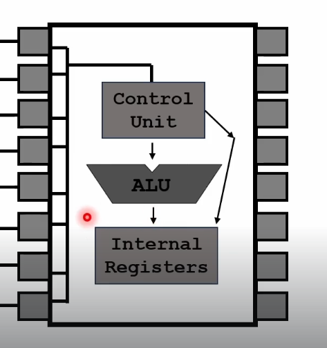
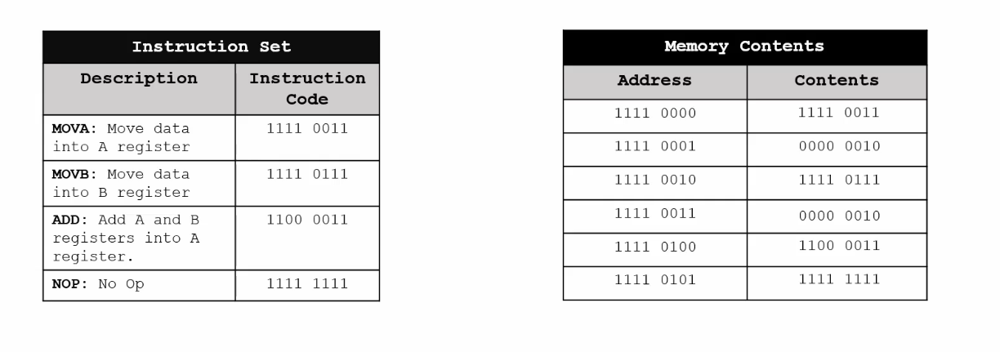
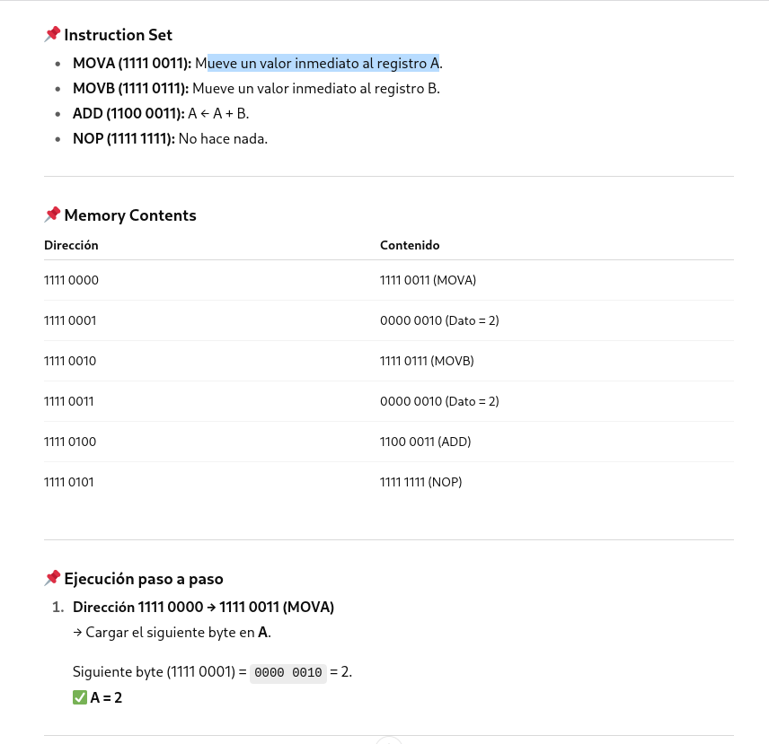
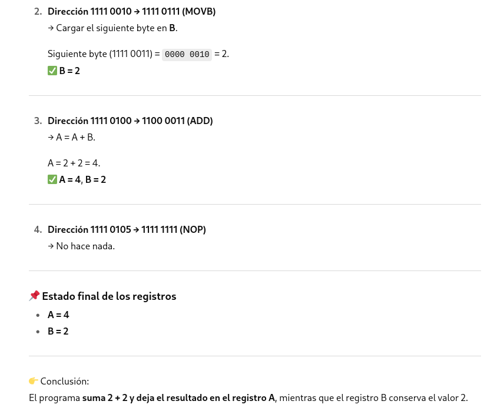

Circuito integrado central:

Vemos un chip representado con varias puertas lógicas internas. Contiene múltiples puertas lógicas del mismo tipo (en este caso parecen AND u OR en pares).

Cada “bloque” en el chip es una puerta lógica independiente, con sus entradas y salida.

## Microprocesador

### 1. Control Unit (Unidad de Control)
- Es el "cerebro organizador" de la CPU.
- Funciones:
  - Lee e interpreta las instrucciones del programa.
  - Genera las señales necesarias para coordinar el resto de los componentes.
  - Decide qué operaciones debe realizar la ALU y cuándo mover datos a/desde los registros.

### 2. ALU (Arithmetic Logic Unit – Unidad Aritmética Lógica)
- Es el componente que realiza operaciones matemáticas y lógicas.
- Operaciones típicas:
  - Aritméticas: suma, resta, multiplicación, división.
  - Lógicas: AND, OR, XOR, NOT, comparaciones.
  - Recibe instrucciones y datos desde la Unidad de Control y los registros internos.

### 3. Internal Registers (Registros Internos)
- Pequeñas memorias ultrarrápidas dentro del procesador.
-  Funciones:
  - Almacenan temporalmente datos y resultados intermedios.
  - Guardan direcciones de memoria y contadores de programa.
  - Permiten a la CPU trabajar sin depender continuamente de la memoria RAM (que es más lenta).

### Flujo básico según el diagrama
- La Unidad de Control lee una instrucción y decide qué hacer.
- Envía la orden a la ALU para que realice la operación.
- El resultado se guarda en los registros internos.
- Desde los registros, los datos pueden enviarse a la memoria, a dispositivos externos o usarse en la siguiente instrucción.

## Funcionamiento del procesador
En un procesador real (por ejemplo x86, ARM, MIPS…), los códigos de instrucción (opcodes) están definidos por el fabricante y forman parte de la arquitectura. Cada operación (mover, sumar, comparar, saltar, etc.) tiene un código binario único.

🔹 En este ejemplo, lo que se inventa un set de instrucciones muy simplificado para poder ilustrar cómo funcionan la memoria y los registros en un ciclo de ejecución.
- Se ha decidido que 1111 0011 significa "MOVA"
- 1111 0111 significa "MOVB"
- 1100 0011 significa "ADD"
- 1111 1111 significa "NOP"
  

### Ejemplo en x86 (32 bits, Intel/AMD)
En x86 hay opcodes definidos por la arquitectura. Por ejemplo:
| Instrucción (ensamblador) | Opcode (hex real) | Comentario                                                         |
| ------------------------- | ----------------- | ------------------------------------------------------------------ |
| `MOV AL, 02h`             | `B0 02`           | Mueve el valor inmediato `2` al registro AL (parte baja de A/EAX). |
| `MOV BL, 02h`             | `B3 02`           | Mueve `2` al registro BL (parte baja de B/EBX).                    |
| `ADD AL, BL`              | `00 D8`           | Suma BL a AL → AL = AL + BL.                                       |
| `NOP`                     | `90`              | Instrucción de no operación.                                       |

🔹 Aquí los opcodes no son arbitrarios:
- B0 significa "mov inmediato a AL".
- B3 significa "mov inmediato a BL".
- 00 D8 significa "add AL, BL".
- 90 es el clásico NOP en x86.
