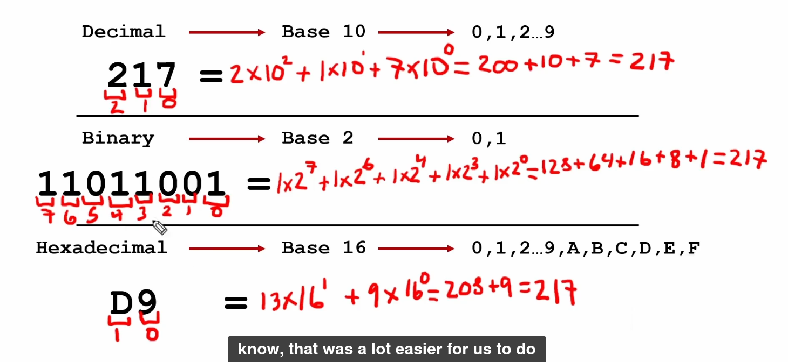
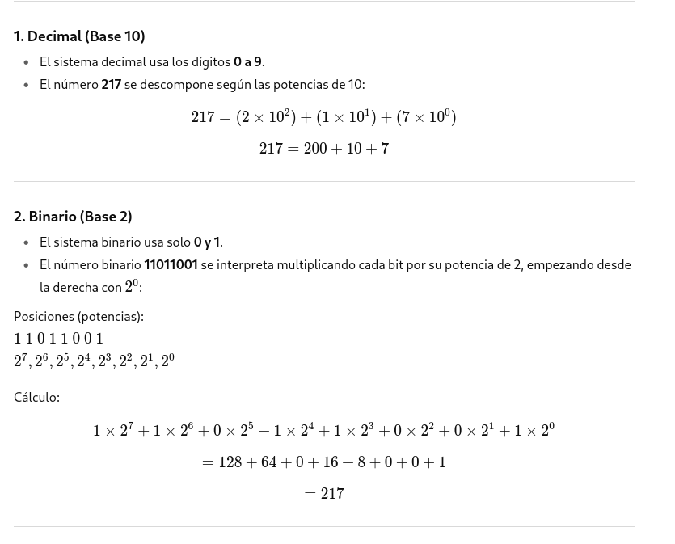
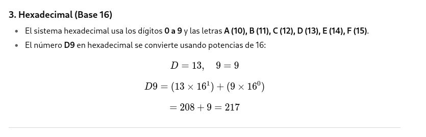
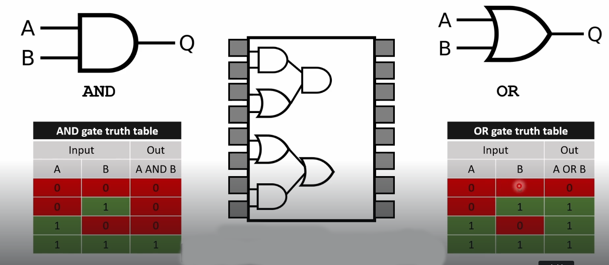

Circuito integrado central:

Vemos un chip representado con varias puertas lógicas internas. Contiene múltiples puertas lógicas del mismo tipo (en este caso parecen AND u OR en pares).

Cada “bloque” en el chip es una puerta lógica independiente, con sus entradas y salida.
