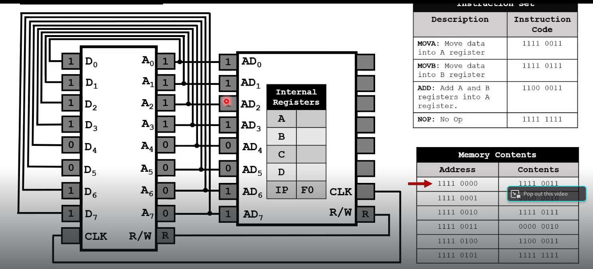

Circuito integrado central:

Vemos un chip representado con varias puertas lógicas internas. Contiene múltiples puertas lógicas del mismo tipo (en este caso parecen AND u OR en pares).

Cada “bloque” en el chip es una puerta lógica independiente, con sus entradas y salida.

## Microprocesador

### 1. Control Unit (Unidad de Control)
- Es el "cerebro organizador" de la CPU.
- Funciones:
  - Lee e interpreta las instrucciones del programa.
  - Genera las señales necesarias para coordinar el resto de los componentes.
  - Decide qué operaciones debe realizar la ALU y cuándo mover datos a/desde los registros.

### 2. ALU (Arithmetic Logic Unit – Unidad Aritmética Lógica)
- Es el componente que realiza operaciones matemáticas y lógicas.
- Operaciones típicas:
  - Aritméticas: suma, resta, multiplicación, división.
  - Lógicas: AND, OR, XOR, NOT, comparaciones.
  - Recibe instrucciones y datos desde la Unidad de Control y los registros internos.

### 3. Internal Registers (Registros Internos)
- Pequeñas memorias ultrarrápidas dentro del procesador.
-  Funciones:
  - Almacenan temporalmente datos y resultados intermedios.
  - Guardan direcciones de memoria y contadores de programa.
  - Permiten a la CPU trabajar sin depender continuamente de la memoria RAM (que es más lenta).

### Flujo básico según el diagrama
- La Unidad de Control lee una instrucción y decide qué hacer.
- Envía la orden a la ALU para que realice la operación.
- El resultado se guarda en los registros internos.
- Desde los registros, los datos pueden enviarse a la memoria, a dispositivos externos o usarse en la siguiente instrucción.

## Funcionamiento del procesador
En un procesador real (por ejemplo x86, ARM, MIPS…), los códigos de instrucción (opcodes) están definidos por el fabricante y forman parte de la arquitectura. Cada operación (mover, sumar, comparar, saltar, etc.) tiene un código binario único.

🔹 En este ejemplo, lo que se inventa un set de instrucciones muy simplificado para poder ilustrar cómo funcionan la memoria y los registros en un ciclo de ejecución.
- Se ha decidido que 1111 0011 significa "MOVA"
- 1111 0111 significa "MOVB"
- 1100 0011 significa "ADD"
- 1111 1111 significa "NOP"
  

### Ejemplo en x86 (32 bits, Intel/AMD)
En x86 hay opcodes definidos por la arquitectura. Por ejemplo:
| Instrucción (ensamblador) | Opcode (hex real) | Comentario                                                         |
| ------------------------- | ----------------- | ------------------------------------------------------------------ |
| `MOV AL, 02h`             | `B0 02`           | Mueve el valor inmediato `2` al registro AL (parte baja de A/EAX). |
| `MOV BL, 02h`             | `B3 02`           | Mueve `2` al registro BL (parte baja de B/EBX).                    |
| `ADD AL, BL`              | `00 D8`           | Suma BL a AL → AL = AL + BL.                                       |
| `NOP`                     | `90`              | Instrucción de no operación.                                       |

🔹 Aquí los opcodes no son arbitrarios:
- B0 significa "mov inmediato a AL".
- B3 significa "mov inmediato a BL".
- 00 D8 significa "add AL, BL".
- 90 es el clásico NOP en x86.

### Primera fase del ciclo de instrucción: La CPU LEE de la memoria la primera instrucción (MOV A) y se prepara para decodificarla y ejecutar el movimiento de 2 al registro A.

**Memoria ROM a la izquierda:**
- Líneas D0–D7: datos (8 bits). En concreto el contenido que aparece en la primera fila de la tabla de Memory Contents: 11110011.
- Líneas A0–A7: direcciones (8 bits). En concreto la dirección que aparece en la primera fila de la tabla de Memory Contents: 11110000.
- Señales de control: CLK, R/W (Lectura y escritura), R indica que es una instrucción de lectura.

**CPU (derecha):**
- AD0–AD7: bus de direcciones/datos. En concreto tiene el contenido que aparece en la primera fila de la tabla de Memory Contents: 11110000.
- Registros internos: A, B, C, D, IP (Instruction Pointer), F0 (Flags).
- Señales CLK, R/W, R.

**📌 Estado actual**
- El Instruction Pointer (IP) está apuntando a la dirección 1111 0000 (F0)
- En esa dirección la memoria contiene 1111 0011, que corresponde a la instrucción MOVA (mover inmediato al registro A).
- En las líneas de datos (D0–D7) vemos 11110011 cargado, es decir, el opcode que la CPU está leyendo.

**📌 Ciclo de ejecución**
- Fetch (búsqueda de instrucción):
  - El IP (1111 0000) se coloca en el bus de direcciones.
  - La memoria entrega el contenido de esa dirección (1111 0011) por el bus de datos.
  - La CPU recibe ese valor y lo identifica como la instrucción MOVA.
- Decode (decodificación):
  - La CPU consulta su Instruction Set y sabe que MOVA necesita un operando inmediato (un byte adicional con el valor que se va a mover a A).
- Fetch del operando inmediato:
  - El IP se incrementa (1111 0001).
  - La CPU lee el contenido en esa dirección → 0000 0010 (el valor 2).
- Execute (ejecución):
  - La CPU guarda 2 en el registro A.
  - ✅ Ahora A = 2.

- Next instruction:
  - El IP avanza a 1111 0010.
  - La siguiente instrucción es 1111 0111 (MOVB).
  - El mismo proceso se repite para cargar 2 en el registro B.

- Después:
  - En 1111 0100 encontramos 1100 0011 (ADD), que sumará A+B.
  - Resultado: A = 4, B = 2.
- Por último:
  - En 1111 0101 está 1111 1111 (NOP), que no hace nada

