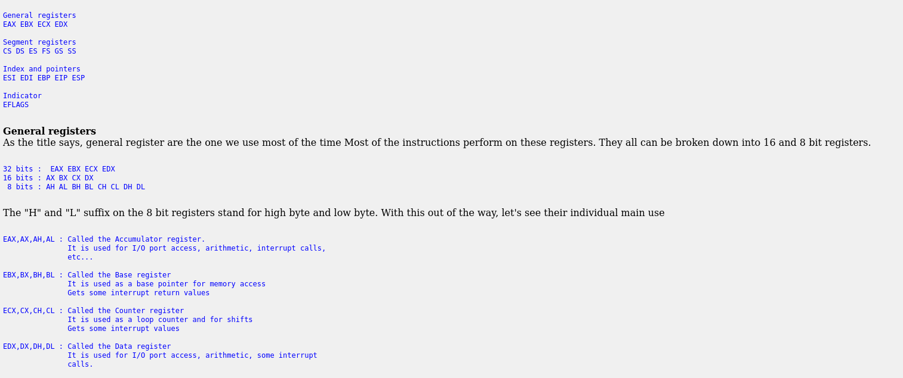
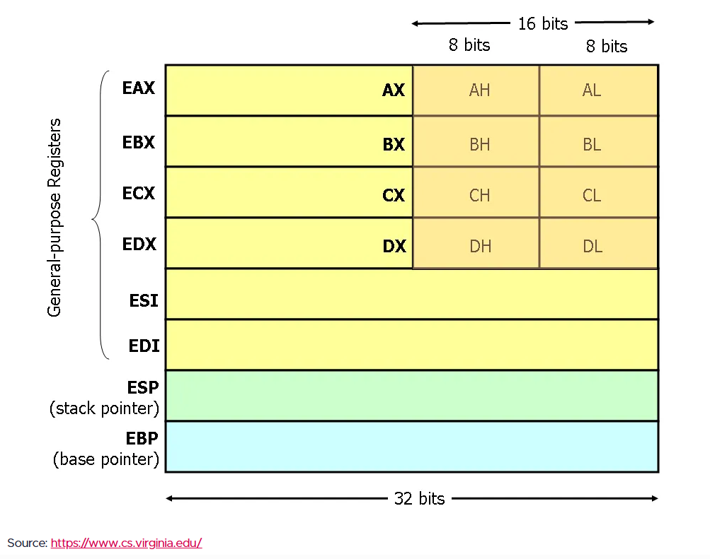
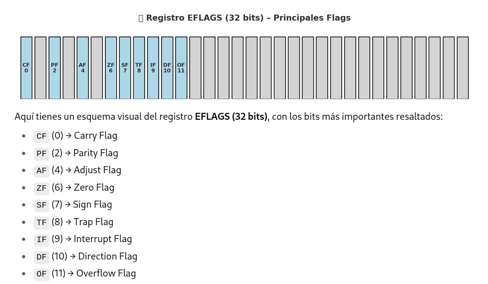

# Registros del procesador

Son como “cajitas” dentro del procesador que almacenan valores temporales, direcciones o resultados de operaciones, y permiten que la CPU trabaje de forma rápida sin acudir siempre a la RAM.



| Name                | 64-bit | 32-bit | 16-bit | 8-bit | Preserved | Usage                      |
| ------------------- | ------ | ------ | ------ | ----- | --------- | -------------------------- |
| Accumulator         | rax    | eax    | ax     | ah:al |           | return                     |
| Base                | rbx    | ebx    | bx     | bh:bl | ✓         |                            |
| Counter             | rcx    | ecx    | cx     | ch:cl |           | arg4                       |
| Data                | rdx    | edx    | dx     | dh:dl |           | arg3                       |
| Source              | rsi    | esi    | si     | sil   |           | arg2                       |
| Destination         | rdi    | edi    | di     | dil   |           | arg1                       |
|                     | r8     | r8d    | r8w    | r8b   |           | arg5                       |
|                     | r9     | r9d    | r9w    | r9b   |           | arg6                       |
|                     | r10    | r10d   | r10w   | r10b  |           |                            |
|                     | r11    | r11d   | r11w   | r11b  |           |                            |
|                     | r12    | r12d   | r12w   | r12b  | ✓         |                            |
|                     | r13    | r13d   | r13w   | r13b  | ✓         |                            |
|                     | r14    | r14d   | r14w   | r14b  | ✓         |                            |
|                     | r15    | r15d   | r15w   | r15b  | ✓         |                            |
| Base Pointer        | rbp    | ebp    | bp     | bpl   | ✓         | function stack base (opt.) |
| Stack Pointer       | rsp    | esp    | sp     | spl   | ✓         | top of stack *             |
| Instruction Pointer | rip    | eip    | ip     |       |           |                            |


## 🔹 EAX (Extended Accumulator Register)
- Es el acumulador principal.
- Se usa mucho en operaciones aritméticas y de retorno de funciones.
- Por convención, cuando una función devuelve un valor, suele estar en EAX.
- Ejemplo: después de un add eax, ebx, el resultado queda en EAX.


## 🔹 EBX (Extended Base Register)
- Puede usarse como registro base en operaciones con memoria.
- Se emplea como “puntero” a datos en estructuras o tablas.
- Muchas veces lo verás guardando direcciones de buffers.


## 🔹 ECX – Extended Count Register
- Es el registro contador, es el contador automático de la CPU.
- Se usa muchísimo en bucles e instrucciones repetitivas.
- Ejemplos típicos:
  - loop etiqueta → usa ECX para contar cuántas veces repetir.
  - rep movsb → copia bytes en un bucle automático hasta que ECX = 0.
-También se emplea para pasar argumentos en algunas convenciones de llamada (por ejemplo en fastcall, el primer argumento va en ECX).


## 🔹 EDX (Extended Data Register)
- Suele complementar a EAX en operaciones más grandes.
- En multiplicaciones y divisiones de 32 bits, se usan EAX:EDX juntos como un registro de 64 bits.
- También se emplea en llamadas al sistema (syscalls en Linux, por ejemplo, con int 0x80, el número de syscall suele ir en EAX y parámetros en EBX, ECX, EDX).


## 🔹 EBP (Extended Base Pointer)
- EBP = Extended Base Pointer.
- Puntero de base de pila.
- **Se usa para tener una referencia fija dentro del stack frame de una función.**
- Convención típica al entrar en una función:
  ```
  push ebp
  mov  ebp, esp
  ```
  **Ahora EBP apunta al inicio del frame, y desde ahí se accede a parámetros y variables locales:**
    - `[ebp+8]` → primer argumento de la función.
    - `[ebp-4]` → una variable local.


## 🔹 ESP (Extended Stack Pointer)
- **Es la dirección actual del tope de la pila.**
- Puntero de pila, indica la cima de la pila.
- Cada vez que hacemos un push, ESP disminuye; con un pop, ESP aumenta.
- La pila en x86 crece hacia abajo (direcciones decrecientes).
- Fundamental en llamadas a funciones porque almacena parámetros, direcciones de retorno y variables locales.


## 🔹 ESI – Extended Source Index
- Es el índice fuente (source) en operaciones de copia o cadenas.
- Se usa junto con EDI en instrucciones de movimiento de memoria.
- Ejemplo clásico:
  ```
  mov esi, origen
  mov edi, destino
  mov ecx, longitud
  rep movsb   ; copia ECX bytes desde [ESI] a [EDI]
  ```
- Después de cada copia, ESI avanza (o retrocede, según el flag de dirección DF).

## 🔹 EDI – Extended Destination Index
- Es el índice destino (destination) en operaciones de copia o cadenas.
- Funciona como “puntero de escritura”.
- Usado junto a ESI y ECX en instrucciones de bloque (movsb, stosb, cmpsb).
-Ejemplo: en un rep movsd, los datos se copian de [ESI] a [EDI], ECX veces.


## 🔹 EIP (Extended Instruction Pointer)
- Contiene la dirección de la siguiente instrucción a ejecutar.
- Se actualiza automáticamente por la CPU tras ejecutar cada instrucción.
- Cuando haces un call, se guarda la dirección de retorno en la pila y EIP se mueve a la función llamada.
- En depuración (x64dbg, Ghidra, OllyDbg, etc.) verás EIP como el puntero de ejecución actual.

## Resumen
```
General:
EAX → resultados de operaciones, valor de retorno de funciones, acumulador principal.
EBX → registro base (muy usado para apuntar a estructuras o buffers).
EDX → datos extendidos (junto a EAX en multiplicaciones/divisiones de 64 bits).
ECX → contador (loops, instrucciones rep, argumento en fastcall).
ESI → índice de origen (source) en operaciones de copia/movimiento.
EDI → índice de destino (destination) en operaciones de copia/movimiento.

Pila:
  ESP → Stack Pointer, cima de la pila (se mueve con push/pop).
  EBP → Base Pointer, referencia estable dentro del stack frame.

Control:
  EIP → Instruction Pointer, apunta a la siguiente instrucción a ejecutar.
```

## Evolución de los registros
| 16 bits | 32 bits | 64 bits | Nombre completo / Uso                                                                   |
| ------- | ------- | ------- | --------------------------------------------------------------------------------------- |
| **AX**  | **EAX** | **RAX** | *Accumulator* → acumulador principal (resultados de operaciones, retornos de funciones) |
| **BX**  | **EBX** | **RBX** | *Base* → registro base para direcciones de memoria                                      |
| **CX**  | **ECX** | **RCX** | *Counter* → contador en bucles, operaciones de desplazamiento                           |
| **DX**  | **EDX** | **RDX** | *Data* → datos extendidos, divisor/multiplicador en operaciones                         |
| **SP**  | **ESP** | **RSP** | *Stack Pointer* → puntero a la cima de la pila                                          |
| **BP**  | **EBP** | **RBP** | *Base Pointer* → puntero base del *stack frame*                                         |
| **SI**  | **ESI** | **RSI** | *Source Index* → índice origen en operaciones con cadenas/memoria                       |
| **DI**  | **EDI** | **RDI** | *Destination Index* → índice destino en operaciones con cadenas/memoria                 |
| (IP)    | **EIP** | **RIP** | *Instruction Pointer* → dirección de la próxima instrucción                             |




# Eflags
- Es un registro especial de 32 bits (en x86) que guarda banderas o indicadores que la CPU actualiza automáticamente después de cada instrucción.
- Es un registro de estado y control.
- Cada bit dentro de EFLAGS tiene un significado distinto (se llama flag).
- Estos flags le dicen a la CPU y al programador qué pasó en la última operación (ej. si dio cero, si hubo overflow, si fue negativa).

## Los flags más importantes que vemos en Ghidra / depuradores
| Flag   | Nombre         | Bit | Significado                                                                                        |
| ------ | -------------- | --- | -------------------------------------------------------------------------------------------------- |
| **CF** | Carry Flag     | 0   | Se activa si hubo acarreo en una suma o préstamo en una resta (muy usado en aritmética multiword). |
| **PF** | Parity Flag    | 2   | Indica si el número de bits a 1 en el resultado es par.                                            |
| **AF** | Adjust Flag    | 4   | Se activa si hubo acarreo desde el bit 3 → usado en operaciones BCD (antiguo).                     |
| **ZF** | Zero Flag      | 6   | Se activa si el resultado fue **0**.                                                               |
| **SF** | Sign Flag      | 7   | Refleja el bit más significativo (si el resultado es negativo).                                    |
| **OF** | Overflow Flag  | 11  | Se activa si hubo **overflow aritmético con signo**.                                               |
| **DF** | Direction Flag | 10  | Indica si `ESI/EDI` avanzan o retroceden en instrucciones de cadenas (`movsb`, `stosb`).           |
| **IF** | Interrupt Flag | 9   | Si está activado, la CPU acepta interrupciones externas.                                           |
| **TF** | Trap Flag      | 8   | Si está activado, la CPU entra en modo paso a paso (*single-step*).                                |


## Ejemplo
```
mov eax, 0xFFFFFFFF  ; -1 en signed
add eax, 1           ; resultado = 0
```
- ZF = 1 (resultado es cero).
- CF = 1 (hubo acarreo).
- OF = 0 (no hay overflow con signo).




# Saltos condicionales de x86 y los flags de EFLAGS que usan:
| Instrucción   | Significado                                      | Flag(s) usado(s) |
| ------------- | ------------------------------------------------ | ---------------- |
| **JE / JZ**   | Jump if Equal / Zero (saltar si es cero o igual) | `ZF = 1`         |
| **JNE / JNZ** | Jump if Not Equal / Not Zero                     | `ZF = 0`         |
| **JC**        | Jump if Carry                                    | `CF = 1`         |
| **JNC**       | Jump if Not Carry                                | `CF = 0`         |
| **JO**        | Jump if Overflow                                 | `OF = 1`         |
| **JNO**       | Jump if Not Overflow                             | `OF = 0`         |
| **JS**        | Jump if Sign (negativo)                          | `SF = 1`         |
| **JNS**       | Jump if Not Sign (no negativo)                   | `SF = 0`         |
| **JP / JPE**  | Jump if Parity (Even)                            | `PF = 1`         |
| **JNP / JPO** | Jump if Not Parity (Odd)                         | `PF = 0`         |

# Comparaciones con signo
Cuando comparas números con signo (cmp eax, ebx), los saltos se interpretan distinto:
| Instrucción   | Significado              | Condición            |
| ------------- | ------------------------ | -------------------- |
| **JG / JNLE** | Jump if Greater          | `ZF = 0` y `SF = OF` |
| **JGE / JNL** | Jump if Greater or Equal | `SF = OF`            |
| **JL / JNGE** | Jump if Less             | `SF ≠ OF`            |
| **JLE / JNG** | Jump if Less or Equal    | `ZF = 1` o `SF ≠ OF` |


# Comparaciones sin signo
| Instrucción        | Significado                | Condición           |
| ------------------ | -------------------------- | ------------------- |
| **JA / JNBE**      | Jump if Above (>)          | `CF = 0` y `ZF = 0` |
| **JAE / JNB**      | Jump if Above or Equal (≥) | `CF = 0`            |
| **JB / JC / JNAE** | Jump if Below (<)          | `CF = 1`            |
| **JBE / JNA**      | Jump if Below or Equal (≤) | `CF = 1` o `ZF = 1` |


# Registros más importantes a vigilar en análisis de malware
## 🔹 EIP / RIP (Instruction Pointer)
- El más crítico: indica qué instrucción se ejecutará a continuación.
- Útil para seguir el flujo del malware, trampas anti-debug, saltos y llamadas a APIs.
- Si cambia de forma inesperada → posible control de flujo alterado (jmp/call indirecto, shellcode, etc.).

## 🔹 ESP / RSP (Stack Pointer)
- Marca la cima de la pila.
- Importante porque el malware puede manipular la pila para:
- Ofuscar llamadas (call / ret alterados).
- Guardar direcciones de retorno falsas (ROP).
- En muchos unpackers, verás ESP moverse raro → señal de stack pivoting.

## 🔹 EBP / RBP (Base Pointer)
- Marca el inicio de un stack frame.
- Muy útil cuando estás en análisis manual con depurador para ver parámetros y variables locales.
- Si está manipulado, puede indicar ofuscación anti-análisis (funciones “sin frame” o con EBP roto).

## 🔹 EAX / RAX (Acumulador principal)
- Registro de resultados → la mayoría de funciones devuelven el valor en EAX.
- Al observar EAX después de un call, sabrás qué devolvió esa función (ej: handle de archivo, dirección de memoria, código de error).
- También se usa en llamadas al sistema (syscalls).

## 🔹 EDX, EBX, ECX
- EDX → complemento de EAX en operaciones de 64 bits (divisiones/multiplicaciones).
- EBX → suele usarse como base en tablas o estructuras.
- ECX → contador en bucles, parámetros en fastcall.
- Muy interesante si el malware hace cifrado/descifrado, porque ECX suele marcar el tamaño de datos a procesar.

## 🔹 ESI (Source Index) y EDI (Destination Index)
- Se usan para copiar/transformar datos (rep movs, rep stos, etc.).
- En malware, suelen indicar dirección origen (payload cifrado en memoria) y destino (buffer descifrado o zona de inyección).
- Si ves rep movsb/movsd → seguro el malware está moviendo bloques de memoria (desempaquetado o inyección).

## 🔹 EFLAGS / RFLAGS
- No tanto por sí solos, pero los saltos condicionales dependen de ellos (je, jne, jg, jl...).
- Observar cómo se ajustan (ZF, CF, SF, OF) te dice qué camino lógico sigue el malware.

## 📊 Resumen práctico para malware
- EIP/RIP → seguimiento del flujo.
- ESP/RSP → manipulación de pila, anti-debug, exploits.
- EBP/RBP → stack frames (o ausencia de ellos = ofuscación).
- EAX/RAX → valores devueltos (APIs, syscalls).
- ECX/EDX/ESI/EDI → cifrado, copia de memoria, parámetros ocultos.
- EFLAGS → control de saltos condicionales.

## Truco de analista:
- Cuando estés en un unpacker o rutina crítica:
   - Mira EIP (flujo).
  - Vigila ESP (¿manipula la pila?).
  - Observa EAX al volver de llamadas.
  - Sigue ESI/EDI en rep movs/stos (copias de payload).

## Checklist de Registros en Análisis de Malware
# 🕵️‍♂️ Checklist de Registros en Análisis de Malware

| ✅ | Registro | ¿Qué mirar? | ¿Por qué es importante? |
|----|----------|-------------|--------------------------|
| [ ] | **EIP / RIP** | Dirección actual de ejecución | Seguir el flujo del malware, detectar saltos sospechosos o inyecciones |
| [ ] | **ESP / RSP** | Cima de la pila | Ver si manipula la pila (stack pivoting, anti-debug, exploits) |
| [ ] | **EBP / RBP** | Base del frame | Analizar parámetros y locales; si está roto, puede ser ofuscación |
| [ ] | **EAX / RAX** | Valor devuelto de funciones | Identificar qué devuelve una API o syscall (handles, punteros, códigos de error) |
| [ ] | **ECX** | Contadores en bucles | Muy usado en cifrado/descifrado o procesar buffers |
| [ ] | **EDX** | Datos complementarios | Parte alta en operaciones de 64 bits, argumentos en syscalls |
| [ ] | **EBX** | Registro base para datos | Suele apuntar a estructuras, tablas o buffers |
| [ ] | **ESI** | Dirección origen | Copias de memoria (`rep movs`), origen de payload o datos cifrados |
| [ ] | **EDI** | Dirección destino | Copias de memoria, destino de inyección o buffer descifrado |
| [ ] | **EFLAGS** | Estado de los flags (ZF, CF, SF, OF) | Controlan los saltos condicionales y lógica de ejecución |
