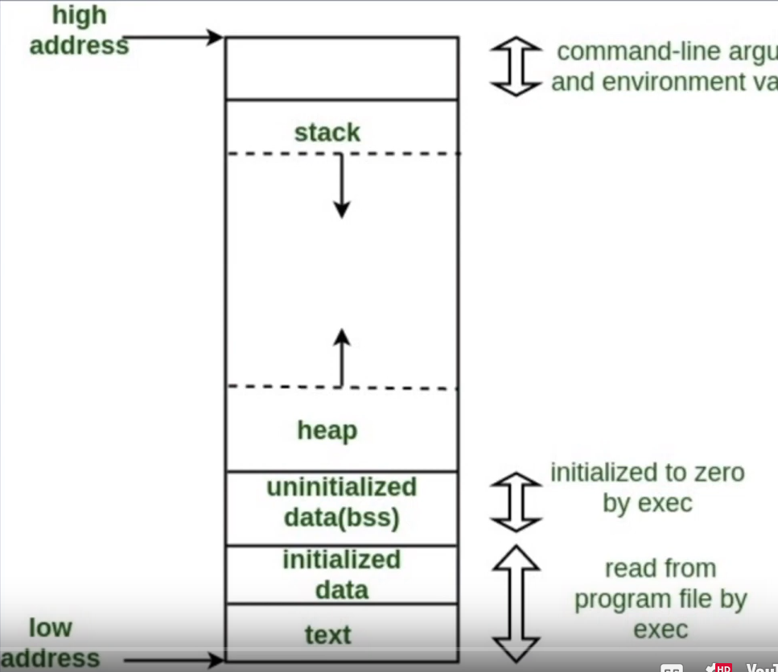
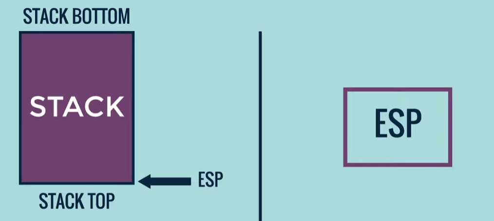
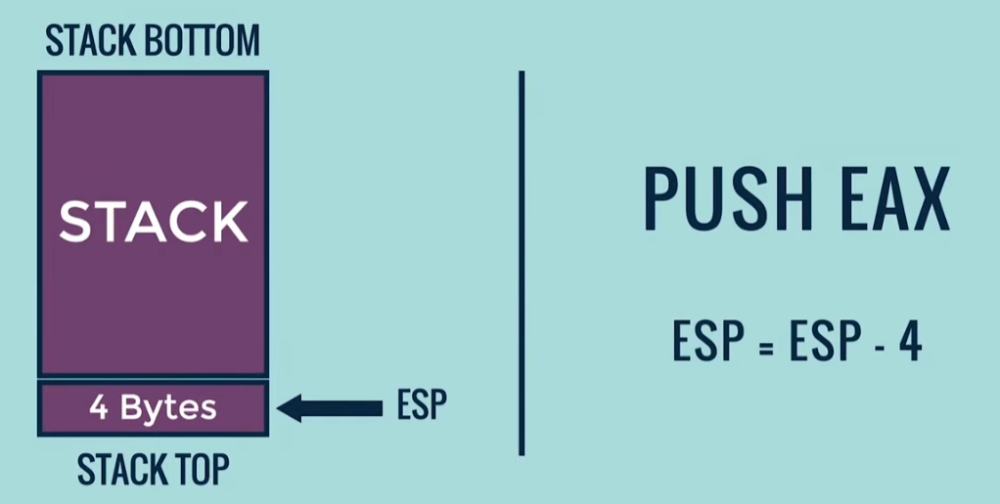
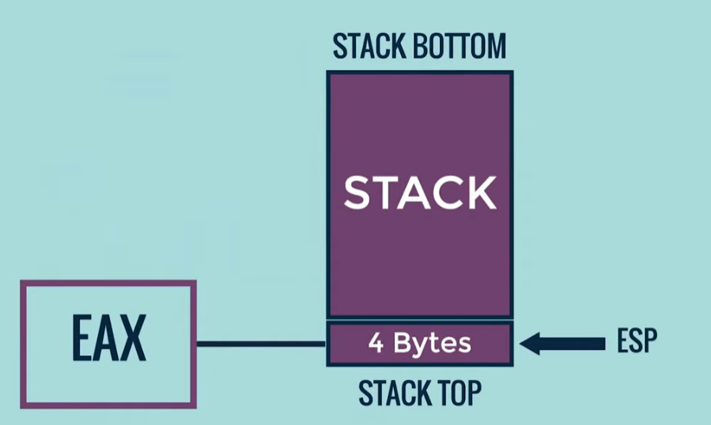
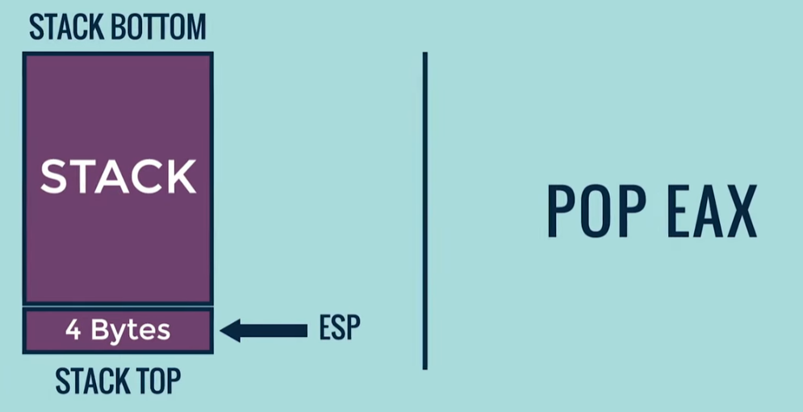
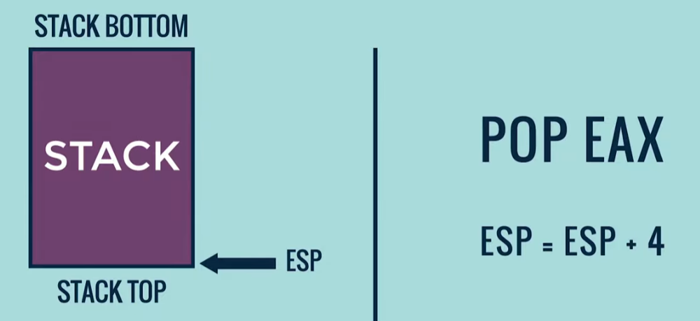
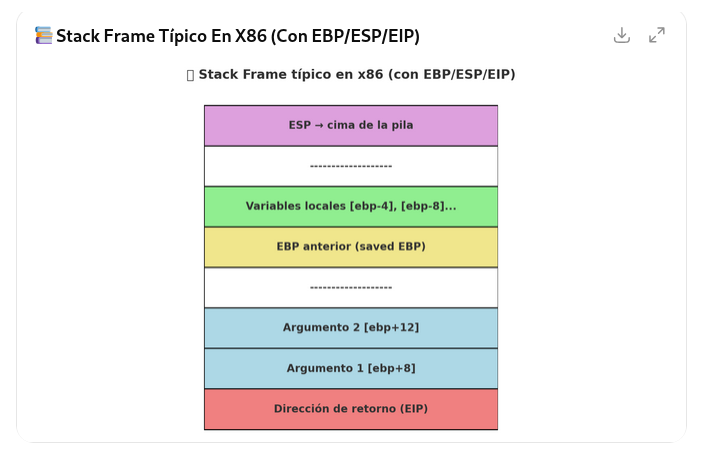
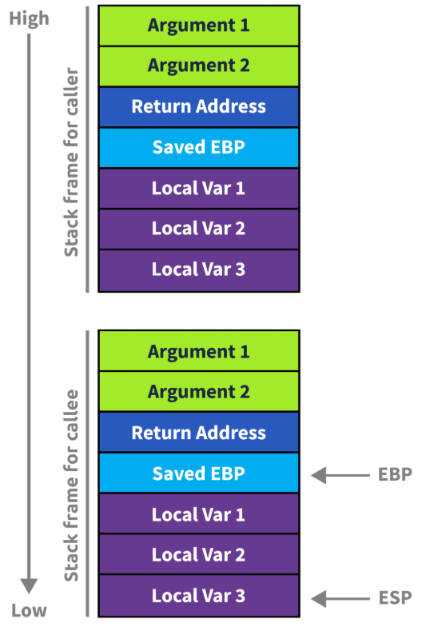

# Gestión de Memoria en la Ejecución de un Programa

La gestión de memoria es un concepto fundamental en la informática que describe cómo un sistema operativo asigna y administra la memoria principal (RAM) para los programas en ejecución. Cada programa, o **proceso**, opera dentro de su propio espacio de direcciones de memoria virtual, que el sistema operativo mapea a la memoria física. Este espacio virtual está típicamente dividido en varias secciones o segmentos, cada uno con un propósito específico.

# 1. Estructura de Memoria de un Proceso

El espacio de direcciones de memoria virtual de un proceso se organiza generalmente en los siguientes segmentos principales, que se cargan cuando el programa comienza a ejecutarse:

| Segmento | Propósito | Contenido Típico | Dirección de Crecimiento |
| :--- | :--- | :--- | :--- |
| **Texto (Code)** | Contiene las instrucciones ejecutables del programa. | Código máquina, constantes de solo lectura. | Fijo |
| **Datos Inicializados** | Contiene variables globales y estáticas que han sido inicializadas con un valor. | Variables globales inicializadas. | Fijo |
| **Datos No Inicializados (BSS)** | Contiene variables globales y estáticas que no han sido inicializadas (se inicializan a cero por defecto). | Variables globales no inicializadas. | Fijo |
| **Heap (Montón)** | Se utiliza para la **asignación dinámica de memoria** en tiempo de ejecución. | Objetos y estructuras de datos creados por el programador (ej. `malloc`, `new`). | Crece hacia direcciones de memoria más altas. |
| **Stack (Pila)** | Se utiliza para la **asignación automática de memoria** para las llamadas a funciones. | Variables locales, parámetros de función, direcciones de retorno. | Crece hacia direcciones de memoria más bajas. |

El **Stack** y el **Heap** son las dos áreas de memoria más dinámicas y cruciales para la ejecución del programa, y crecen en direcciones opuestas para evitar colisiones y permitir que cada uno utilice el espacio disponible de manera eficiente.



---------------------------------------
# 2. El Stack (Pila)

El **Stack** (Pila) es una región de memoria que sigue el principio **LIFO** (*Last-In, First-Out* o Último en Entrar, Primero en Salir). Su propósito principal es gestionar el flujo de control de las funciones y almacenar la información necesaria para que las funciones se ejecuten y regresen correctamente.

## Marcos de Pila (Stack Frames)

Cada vez que se llama a una función, se crea un bloque de datos en la parte superior de la pila llamado **Marco de Pila** (*Stack Frame* o *Activation Record*). Este marco contiene toda la información necesaria para la ejecución de esa función específica:

1.  **Variables Locales**: Las variables declaradas dentro de la función.
2.  **Argumentos/Parámetros**: Los valores pasados a la función.
3.  **Dirección de Retorno**: La dirección de memoria de la instrucción a la que el programa debe volver una vez que la función actual termina.
4.  **Punteros de Marco**: Punteros que ayudan a gestionar la pila (ej. el puntero de pila `SP` y el puntero de marco `FP` o `BP`).

Cuando la función termina, su marco de pila se **desapila** (*pop*), liberando automáticamente la memoria utilizada por las variables locales y restaurando el flujo de ejecución a la dirección de retorno. Esta gestión automática y ordenada es lo que hace que la pila sea muy rápida y eficiente.

## Características Clave del Stack:

*   **Automático**: La memoria se asigna y libera automáticamente por el compilador/sistema operativo.
*   **Rápido**: Es una operación simple de mover un puntero.
*   **Tamaño Fijo/Limitado**: El tamaño de la pila suele ser limitado y predefinido. Si una función se llama recursivamente demasiadas veces o si se declaran variables locales muy grandes, puede ocurrir un **desbordamiento de pila** (*Stack Overflow*).


## Registros que se utilizan para manipular la pila de memoria de un subproceso 


### 1) ESP: Puntero de Pila - Stack Pointer

El registro ESP siempre apunta a la parte superior de la pila al contener su dirección de memoria.

### Cuando se ejecuta la instrucción `push eax`
Se asignan 4 bytes de espacio en la parte superior de la pila, restando 4 bytes del valor de `ESP`:



Y a continuación, el valor del registro `eax`se copiará en el espacio asignado.



### Cuando se ejecuta la instrucción `pop eax`
Ahora, primero se copian los 4 bytes de datos de la parte superior de la pila al registro `eax`:


A continuación, desasignará los 4 bytes simplemente sumando 4 al valor de `ESP`



**Tanto si insertamos, como si extraemos datos de la pila, `ESP` siempre apunta a ella.**


### 2) EBP: Puntero Base - Base Pointer
[Video EBP](https://youtu.be/0jky5t89YHc?si=xo5JgyYDyXkjW4ZB&t=155)


-------------------------------
## Esquema visual de cómo se organiza un stack frame típico en x86 usando EBP, ESP y EIP


## 📚 Stack Frame típico (convención estándar)
- Cuando se entra a una función, normalmente ocurre algo así:
```
push ebp        ; guarda el valor antiguo de EBP en la pila
mov  ebp, esp   ; ahora EBP apunta al inicio del frame
sub  esp, XX    ; reserva espacio para variables locales
```

## 🔹 Organización en memoria
- La pila crece hacia abajo (direcciones decrecientes).
- Ejemplo del frame de una función como:
```
Direcciones más altas (memoria ↑)

[ebp+12] → Argumento 2
[ebp+8]  → Argumento 1
[ebp+4]  → Dirección de retorno (EIP)
[ebp]    → EBP anterior (saved EBP)
[ebp-4]  → Variable local 1
[ebp-8]  → Variable local 2
...      → Más variables locales
[esp]    → Cima actual de la pila

Direcciones más bajas (memoria ↓)
```

**Nota: En el pseudo-C (decompiler):**
- ebp+12 se ve como param_1
- ebp+8 se ve como param_2
- ebp+4 se ve como local_4, etc.

## 🔹 Resumen de roles
- EIP: dirección de retorno (la CPU salta aquí al hacer ret).
- EBP: referencia fija del frame (para acceder a args y locales).
- ESP: marca la cima de la pila (se mueve con push y pop).

Con este esquema, cada función tiene su "bloque" ordenado en la pila, lo que facilita el acceso a parámetros y variables.

## 📌 ¿Qué es un stack frame?
Un frame (o marco de pila) es como una cajita de memoria temporal que se crea cada vez que una función empieza a ejecutarse.

En esa cajita (en la pila) se guardan:
- 📍 Dirección de retorno (EIP) → Para saber a dónde volver cuando la función termine.
- 📍 EBP anterior → Para restaurar el estado de la función que llamó.
- 📍 Argumentos de la función → Los valores que le pasamos.
- 📍 Variables locales → Las que se crean dentro de la función.



## 🧩 Ejemplo con una función

## 🔹 Organización en memoria
- La pila crece hacia abajo (direcciones decrecientes).
- Ejemplo del frame de una función como:
```
int suma(int a, int b) {
    int c = a + b;
    return c;
}
```

Cuando llamamos a suma(2, 3), pasa esto en la pila:
```
[ebp+8]  → 2   (primer argumento: a)
[ebp+12] → 3   (segundo argumento: b)
[ebp+4]  → dirección a la que volver (EIP)
[ebp]    → valor antiguo de EBP
[ebp-4]  → variable local: c
```

## 🏗️ ¿Por qué se llama frame?
Porque es como un marco o bloque delimitado dentro de la pila que corresponde a una función. Cuando llamas a otra función, se crea otro frame encima del actual, y así sucesivamente. Cuando una función termina, su frame se destruye y la pila vuelve al estado anterior.

## 📊 Una metáfora:
- Imagina una pila de platos 🍽️ (la pila en memoria).
- Cada vez que llamamos a una función, ponemos un plato nuevo (frame) encima con:
  - la dirección de retorno
  - argumentos
  - variables locales
- Cuando acaba, quitamos ese plato y volvemos al anterior.


----------------------------------------------
# 3. El Heap (Montón)

El **Heap** (Montón) es una región de memoria utilizada para la **asignación dinámica de memoria**. A diferencia de la pila, la memoria del *heap* debe ser solicitada explícitamente por el programador en tiempo de ejecución.

### Uso del Heap

El *heap* se utiliza para:

*   **Datos de larga duración**: Objetos o estructuras de datos que deben persistir más allá de la vida de la función que los creó.
*   **Datos de tamaño desconocido**: Cuando el tamaño de la memoria requerida no se conoce en tiempo de compilación.

En lenguajes como C, el programador es responsable de solicitar (`malloc`, `calloc`) y liberar (`free`) la memoria del *heap*. En lenguajes con **recolección de basura** (*Garbage Collection*) como Java, Python o C#, el sistema de tiempo de ejecución se encarga de liberar la memoria que ya no está en uso.

### Características Clave del Heap:

*   **Dinámico**: La memoria se asigna a demanda en tiempo de ejecución.
*   **Lento**: La gestión del *heap* (búsqueda de bloques de memoria disponibles, fragmentación) es más compleja y lenta que la gestión de la pila.
*   **Flexible**: Su tamaño es mucho más grande y solo está limitado por la memoria virtual del sistema.
*   **Riesgo de Fugas**: Si la memoria asignada en el *heap* no se libera correctamente, puede ocurrir una **fuga de memoria** (*Memory Leak*).

----------------------------------------------

# 4. Relación con la Ejecución del Programa

La interacción entre el **Stack** y el **Heap** es constante y fundamental para la ejecución de cualquier programa. La forma en que se gestionan las variables y las llamadas a funciones ilustra perfectamente esta relación:

### Variables y Punteros

1.  **Variables por Valor (Stack)**: Las variables locales de tipos de datos primitivos (como enteros, booleanos o caracteres) se almacenan directamente en el *Stack*. Cuando se pasa una de estas variables a una función, se pasa una **copia** de su valor.
2.  **Variables por Referencia (Stack y Heap)**: En lenguajes que soportan objetos o estructuras de datos complejos (como *arrays*, *strings* grandes, o instancias de clases), la variable local que se declara en una función es en realidad un **puntero** o una **referencia**. Este puntero se almacena en el **Stack**, pero el objeto o dato real al que apunta se almacena en el **Heap**.

Esta distinción es crucial. Por ejemplo, si una función crea un objeto en el *Heap* y devuelve el puntero a ese objeto, el objeto puede seguir existiendo y ser accesible por otras partes del programa, incluso después de que la función original haya terminado y su marco de pila haya sido liberado.

## El Ciclo de Vida de una Función

Consideremos una función simple `calcular_suma(a, b)`:

1.  **Llamada a la Función**: El programa encuentra la llamada a `calcular_suma`.
2.  **Creación del Marco de Pila**: Se empuja un nuevo marco de pila en el **Stack**.
3.  **Almacenamiento de Datos**:
    *   La **Dirección de Retorno** (dónde continuar la ejecución después de la función) se guarda en el marco.
    *   Los **Parámetros** (`a` y `b`) se copian en el marco.
    *   Cualquier **Variable Local** dentro de `calcular_suma` se asigna espacio en el marco.
4.  **Ejecución**: El código de la función se ejecuta, utilizando los datos en el marco de pila.
5.  **Retorno de la Función**:
    *   El valor de retorno (si lo hay) se coloca en un registro o en el *Stack* para que el llamador lo recoja.
    *   El marco de pila de `calcular_suma` se **desapila** (*pop*), liberando toda la memoria que contenía.
    *   El control del programa salta a la **Dirección de Retorno** guardada.

Este mecanismo de *Stack* garantiza que las funciones se ejecuten de forma ordenada y que la memoria se limpie automáticamente, previniendo la mayoría de los problemas de gestión de memoria para las variables locales. Los problemas de memoria (como las fugas) casi siempre están relacionados con la gestión incorrecta de la memoria asignada en el **Heap**.

En resumen, el **Stack** es la columna vertebral de la ejecución de funciones, asegurando que el programa sepa dónde ir y qué variables locales usar en cada momento, mientras que el **Heap** proporciona un espacio flexible para almacenar datos que necesitan vivir más tiempo o cuyo tamaño es variable.

---
## Referencias

La interacción entre el *stack* y el *heap* define cómo se gestionan las variables y las llamadas a funciones:

*   **Variables Locales (Stack)**: Una variable local de tipo primitivo (ej. `int`, `char`) se almacena directamente en el marco de pila de la función.
*   **Variables Dinámicas (Heap)**: Cuando se asigna memoria dinámicamente (ej. `int *ptr = (int *)malloc(sizeof(int));`), el puntero `ptr` se almacena en el **Stack** (como una variable local), pero el valor real al que apunta (`sizeof(int)` bytes) se almacena en el **Heap**.

En resumen, el **Stack** es la columna vertebral de la ejecución de funciones, asegurando que el programa sepa dónde ir y qué variables locales usar en cada momento, mientras que el **Heap** proporciona un espacio flexible para almacenar datos que necesitan vivir más tiempo o cuyo tamaño es variable.

---
## Referencias

[1] La estructura de memoria de un proceso en sistemas operativos.
[2] Funcionamiento de la pila de llamadas y los marcos de pila.
[3] Diferencias y usos del Heap y el Stack en la programación.


----------------------------------------------

# Modos de memoria y direccionamiento
## Declarar regiones de datos estáticos

Podemos declarar regiones de datos estáticos (análogas a variables globales) en ensamblador x86 usando directivas especiales del ensamblador para este propósito.

Las declaraciones de datos deben ir precedidas por la directiva `.data`.

Después de esta directiva, las directivas `.byte`, `.short` y `.long` pueden usarse para declarar ubicaciones de datos de uno, dos y cuatro bytes, respectivamente.

Para referirte a la dirección de los datos creados, podemos etiquetarlos. Las etiquetas son muy útiles y versátiles en ensamblador: le dan nombres a ubicaciones de memoria cuya dirección exacta será resuelta más tarde por el ensamblador o el linker. Esto es similar a declarar variables por nombre, pero respetando ciertas reglas de bajo nivel. Por ejemplo, ubicaciones declaradas en secuencia se colocarán en memoria una al lado de la otra.

Ejemplo de declaraciones:
```asm
    .data		
    var:		
    	.byte 64      /* Declara un byte, llamado var, que contiene el valor 64. */
    	.byte 10      /* Declara un byte sin etiqueta, que contiene el valor 10.
                         Su dirección es var + 1. */
    x:		
    	.short 42     /* Declara un valor de 2 bytes inicializado a 42, llamado x. */
    y:		
    	.long 30000   /* Declara un valor de 4 bytes, llamado y, inicializado a 30000. */
```

A diferencia de los lenguajes de alto nivel, donde los arrays pueden tener muchas dimensiones y se accede a ellos mediante índices, los arrays en ensamblador x86 son simplemente varias celdas colocadas contiguamente en memoria.

Un array puede declararse simplemente listando los valores, como en el primer ejemplo de abajo. Para el caso especial de un array de bytes, pueden usarse literales de cadena. Si se necesita reservar un área grande de memoria inicializada a cero, puede usarse la directiva .zero.

Algunos ejemplos:
``` asm
    s:		
    	.long 1, 2, 3  /* Declara tres valores de 4 bytes, inicializados a 1, 2 y 3.
                        El valor en la dirección s + 8 será 3. */
    barr:		
    	.zero 10       /* Declara 10 bytes empezando en barr, inicializados a 0. */
    str:		
    	.string "hello"/* Declara 6 bytes empezando en str, inicializados con los
                        valores ASCII de "hello" seguidos de un byte nulo (0). */
```

## Direccionando memoria
Los procesadores modernos compatibles con x86 son capaces de direccionar hasta 2³² bytes de memoria: las direcciones de memoria tienen 32 bits de ancho.

En los ejemplos anteriores, donde usamos etiquetas para referirnos a regiones de memoria, esas etiquetas son reemplazadas en realidad por el ensamblador con valores de 32 bits que indican direcciones en memoria.

Además de permitir referirse a regiones de memoria mediante etiquetas (es decir, valores constantes), x86 proporciona un esquema flexible para calcular y referirse a direcciones de memoria: se pueden sumar hasta dos registros de 32 bits y una constante de 32 bits con signo para calcular una dirección de memoria. Uno de los registros puede, opcionalmente, multiplicarse previamente por 2, 4 u 8.

Los modos de direccionamiento pueden usarse con muchas instrucciones x86 (las describiremos en la siguiente sección). Aquí ilustramos algunos ejemplos usando la instrucción mov, que mueve datos entre registros y memoria. Esta instrucción tiene dos operandos: el primero es la fuente (source) y el segundo especifica el destino.

Algunos ejemplos de instrucciones mov que usan cálculos de direcciones:
```asm
    mov (%ebx), %eax          /* Carga 4 bytes de la dirección de memoria en EBX a EAX. */
    mov %ebx, var(,1)         /* Copia el contenido de EBX en los 4 bytes en la dirección var.
                                  (var es una constante de 32 bits). */
    mov -4(%esi), %eax        /* Copia 4 bytes en la dirección ESI + (-4) a EAX. */
    mov %cl, (%esi,%eax,1)    /* Copia el contenido de CL en el byte en la dirección ESI + EAX. */
    mov (%esi,%ebx,4), %edx   /* Copia los 4 bytes en la dirección ESI + 4*EBX a EDX. */
```

Algunos ejemplos de cálculos de dirección no válidos incluyen:
```asm
    mov (%ebx,%ecx,-1), %eax      /* Solo se pueden sumar valores de registro, no una escala -1. */
    mov %ebx, (%eax,%esi,%edi,1)  /* Como máximo 2 registros en el cálculo de dirección. */
```


