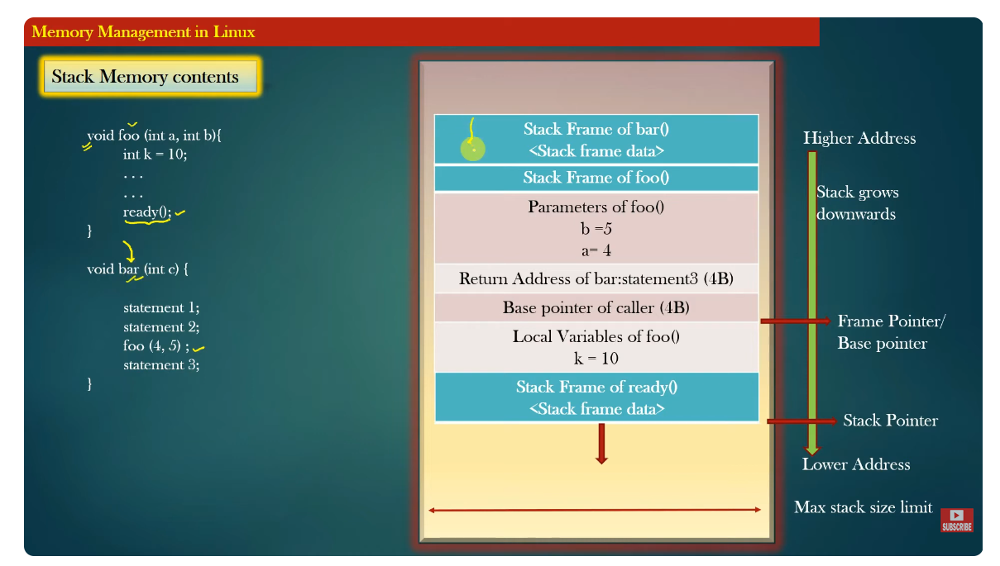

## Stack memory (o memoria de pila)
Es una región de la memoria del proceso que se utiliza para almacenar datos temporales asociados con la ejecución de funciones. Es el espacio donde se guardan variables locales, parámetros de funciones y direcciones de retorno durante la ejecución de un programa.

- Organización LIFO (Last In, First Out): El último dato en entrar es el primero en salir. Cada vez que se llama a una función, se crea un nuevo stack frame encima del anterior.

- Gestión automática: El sistema gestiona la pila de forma automática: se reserva memoria al entrar en una función y se libera al salir de ella.

- Almacenamiento temporal: Ideal para datos que solo son necesarios mientras una función está activa.

- Tamaño limitado: La pila tiene un tamaño fijo (por ejemplo, unos pocos MB). Si se excede (por demasiadas llamadas recursivas o grandes variables locales), ocurre un stack overflow.


| Acción               | Qué pasa en la pila                               |
| -------------------- | ------------------------------------------------- |
| Cuando se llama a una función | Se crea un nuevo *stack frame*                    |
| Termina la función   | Se destruye automáticamente su *stack frame*      |
| Variables locales    | Viven solo mientras la función está activa        |
| Orden de ejecución   | LIFO (el último en entrar es el primero en salir) |


## Un stack frame (o marco de pila)
Es la porción de memoria dentro de la stack (pila) que se reserva cada vez que se llama a una función. Contiene toda la información necesaria para que esa función se ejecute correctamente y pueda volver a la función que la llamó.

**Estructura típica de un stack frame:** Cada stack frame suele incluir:
- Dirección de retorno → La dirección a la que el programa debe volver al terminar la función. (Guardada automáticamente por la instrucción CALL en ensamblador).

- Registros guardados → Valores de registros (como EBP o RBP) que se salvan para restaurarlos después. Esto mantiene el contexto de la función que llamó.

- Parámetros de la función → Los valores que se pasaron a la función (por ejemplo, int x).

- Variables locales → Variables definidas dentro de la función.

Ejemplo en C:
```
void bar(int b) {
    int c = b + 1;
}

void foo(int a) {
    int x = a * 2;
    bar(x);
}

int main() {
    foo(5);
}
```

Durante la ejecución, los stack frames se verían así:
```
|------------------| ← Dirección más alta
|  bar() frame     | ← contiene b, c, return address a foo
|------------------|
|  foo() frame     | ← contiene a, x, return address a main
|------------------|
|  main() frame    | ← contiene variables locales de main
|------------------| ← Dirección más baja
```
Cada vez que una función termina, su stack frame se desapila automáticamente, restaurando el estado anterior.


## Memory Management in Linux



## Segmentación de memoria de un programa y el stack
https://netting.wordpress.com/2016/10/01/segmentacion-de-memoria-de-un-programa-y-el-stack/
