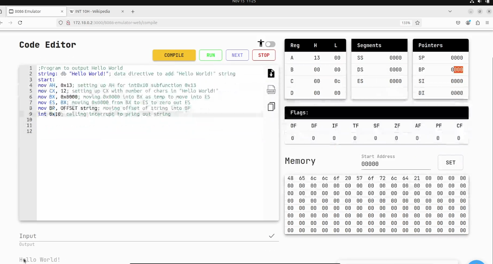

```
;Program to output Hello World
string: db "Hello World!"; data directive to add "Hello World!" string

start:
mov AH, 0x13        ; preparar función 13h de int 10h (BIOS video services)
mov CX, 12          ; número de caracteres a imprimir ("Hello World!" = 12 chars)
mov BX, 0x0000      ; BX = 0, se usará para atributos (colores)
mov ES, BX          ; ES = 0x0000 (segmento extra)
mov BP, OFFSET string ; BP apunta al inicio de la cadena (offset de "string")
int 0x10            ; llamada a la BIOS, imprime el texto
```

```
string: db "Hello World!"
```
- Aquí se declara una label (string) con una directiva DB → se reserva espacio en memoria y se almacena la cadena "Hello World!". En la parte inferior de la captura podemos ver en la memoria los valores ASCII: `48 65 6C 6C 6F 20 57 6F 72 6C 64 21`. 


```
mov AH, 0x13
```
- En el 8086, int 10h es la interrupción de video de la BIOS.  
- AH = 13h selecciona la función “Escribir cadena de caracteres”.


```
mov BX, 0x0000
mov ES, BX
```
- Aquí ponen a BX=0 y luego ES=0.
- El registro ES:BP se usará como puntero a la cadena.

```
mov BP, OFFSET string
```
- BP recibe la dirección (offset) donde empieza la cadena "Hello World!".
- Junto con ES=0, forma el puntero ES:BP → apunta al inicio del texto.

```
int 0x10
```
- Se llama a la interrupción de video BIOS.
- Función AH=13h → imprime en pantalla la cadena que está en ES:BP con longitud CX.
- Y efectivamente, en el área de salida abajo aparece: Hello World.
