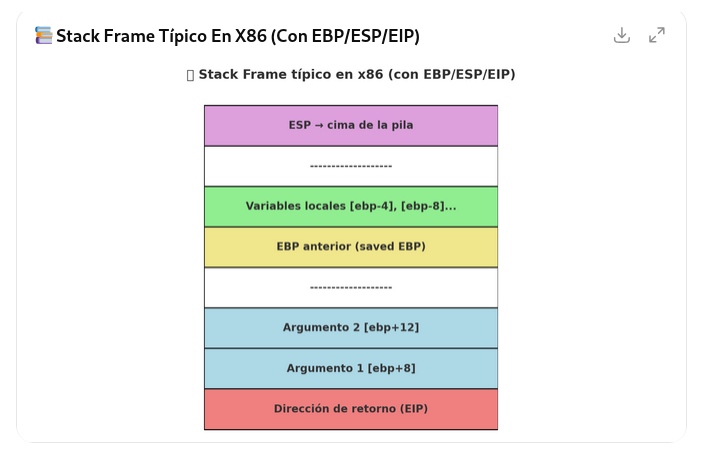

# Registros de la memoria

Son como “cajitas” dentro del procesador que almacenan valores temporales, direcciones o resultados de operaciones, y permiten que la CPU trabaje de forma rápida sin acudir siempre a la RAM.

## 🔹 EAX (Extended Accumulator Register)
- Es el acumulador principal.
- Se usa mucho en operaciones aritméticas y de retorno de funciones.
- Por convención, cuando una función devuelve un valor, suele estar en EAX.
- Ejemplo: después de un add eax, ebx, el resultado queda en EAX.


## 🔹 EBX (Extended Base Register)
- Puede usarse como registro base en operaciones con memoria.
- Se emplea como “puntero” a datos en estructuras o tablas.
- Muchas veces lo verás guardando direcciones de buffers.


## 🔹 ECX – Extended Count Register
- Es el registro contador.
- Se usa muchísimo en bucles e instrucciones repetitivas.
- Ejemplos típicos:
  - loop etiqueta → usa ECX para contar cuántas veces repetir.
  - rep movsb → copia bytes en un bucle automático hasta que ECX = 0.
-También se emplea para pasar argumentos en algunas convenciones de llamada (por ejemplo en fastcall, el primer argumento va en ECX).

👉 ECX es el contador automático de la CPU.

## 🔹 EDX (Extended Data Register)
- Suele complementar a EAX en operaciones más grandes.
- En multiplicaciones y divisiones de 32 bits, se usan EAX:EDX juntos como un registro de 64 bits.
- También se emplea en llamadas al sistema (syscalls en Linux, por ejemplo, con int 0x80, el número de syscall suele ir en EAX y parámetros en EBX, ECX, EDX).


## 🔹 EBP (Extended Base Pointer)
- EBP = Extended Base Pointer.
- Puntero de base de pila.
- Se usa para tener una referencia fija dentro del stack frame de una función.
- Convención típica al entrar en una función:
  ```
  push ebp
  mov  ebp, esp
  ```
  Ahora EBP apunta al inicio del frame, y desde ahí se accede a parámetros y variables locales:
  [ebp+8] → primer argumento de la función.
  [ebp-4] → una variable local.


## 🔹 ESP (Extended Stack Pointer)
- Puntero de pila, indica la cima de la pila.
- Cada vez que haces un push, ESP disminuye; con un pop, ESP aumenta.
- La pila en x86 crece hacia abajo (direcciones decrecientes).
- Fundamental en llamadas a funciones porque almacena parámetros, direcciones de retorno y variables locales.


## 🔹 ESI – Extended Source Index
- Es el índice fuente (source) en operaciones de copia o cadenas.
- Se usa junto con EDI en instrucciones de movimiento de memoria.
- Ejemplo clásico:
  ```
  mov esi, origen
  mov edi, destino
  mov ecx, longitud
  rep movsb   ; copia ECX bytes desde [ESI] a [EDI]
  ```
- Después de cada copia, ESI avanza (o retrocede, según el flag de dirección DF).

## 🔹 EDI – Extended Destination Index
- Es el índice destino (destination) en operaciones de copia o cadenas.
- Funciona como “puntero de escritura”.
- Usado junto a ESI y ECX en instrucciones de bloque (movsb, stosb, cmpsb).
-Ejemplo: en un rep movsd, los datos se copian de [ESI] a [EDI], ECX veces.


## 🔹 EIP (Extended Instruction Pointer)
- Contiene la dirección de la siguiente instrucción a ejecutar.
- Se actualiza automáticamente por la CPU tras ejecutar cada instrucción.
- Cuando haces un call, se guarda la dirección de retorno en la pila y EIP se mueve a la función llamada.
- En depuración (x64dbg, Ghidra, OllyDbg, etc.) verás EIP como el puntero de ejecución actual.

## Resumen
```
General:
EAX → resultados de operaciones, valor de retorno de funciones, acumulador principal.
EBX → registro base (muy usado para apuntar a estructuras o buffers).
EDX → datos extendidos (junto a EAX en multiplicaciones/divisiones de 64 bits).
ECX → contador (loops, instrucciones rep, argumento en fastcall).
ESI → índice de origen (source) en operaciones de copia/movimiento.
EDI → índice de destino (destination) en operaciones de copia/movimiento.

Pila:
  ESP → Stack Pointer, cima de la pila (se mueve con push/pop).
  EBP → Base Pointer, referencia estable dentro del stack frame.

Control:
  EIP → Instruction Pointer, apunta a la siguiente instrucción a ejecutar.
```

## Evolución de los registros
| 16 bits | 32 bits | 64 bits | Nombre completo / Uso                                                                   |
| ------- | ------- | ------- | --------------------------------------------------------------------------------------- |
| **AX**  | **EAX** | **RAX** | *Accumulator* → acumulador principal (resultados de operaciones, retornos de funciones) |
| **BX**  | **EBX** | **RBX** | *Base* → registro base para direcciones de memoria                                      |
| **CX**  | **ECX** | **RCX** | *Counter* → contador en bucles, operaciones de desplazamiento                           |
| **DX**  | **EDX** | **RDX** | *Data* → datos extendidos, divisor/multiplicador en operaciones                         |
| **SP**  | **ESP** | **RSP** | *Stack Pointer* → puntero a la cima de la pila                                          |
| **BP**  | **EBP** | **RBP** | *Base Pointer* → puntero base del *stack frame*                                         |
| **SI**  | **ESI** | **RSI** | *Source Index* → índice origen en operaciones con cadenas/memoria                       |
| **DI**  | **EDI** | **RDI** | *Destination Index* → índice destino en operaciones con cadenas/memoria                 |
| (IP)    | **EIP** | **RIP** | *Instruction Pointer* → dirección de la próxima instrucción                             |


# Esquema visual de cómo se organiza un stack frame típico en x86 usando EBP, ESP y EIP


## 📚 Stack Frame típico (convención estándar)
- Cuando se entra a una función, normalmente ocurre algo así:
```
push ebp        ; guarda el valor antiguo de EBP en la pila
mov  ebp, esp   ; ahora EBP apunta al inicio del frame
sub  esp, XX    ; reserva espacio para variables locales
```

## 🔹 Organización en memoria
- La pila crece hacia abajo (direcciones decrecientes).
- Imagina el frame de una función como:
```
Direcciones más altas (memoria ↑)

[ebp+12] → Argumento 2
[ebp+8]  → Argumento 1
[ebp+4]  → Dirección de retorno (EIP)
[ebp]    → EBP anterior (saved EBP)
[ebp-4]  → Variable local 1
[ebp-8]  → Variable local 2
...      → Más variables locales
[esp]    → Cima actual de la pila

Direcciones más bajas (memoria ↓)
```

**Nota: En el pseudo-C (decompiler):**
- ebp+12 se ve como param_1
- ebp+8 se ve como param_2
- ebp+4 se ve comolocal_4, etc.

## 🔹 Resumen de roles
- EIP: dirección de retorno (la CPU salta aquí al hacer ret).
- EBP: referencia fija del frame (para acceder a args y locales).
- ESP: marca la cima de la pila (se mueve con push y pop).

Con este esquema, cada función tiene su "bloque" ordenado en la pila, lo que facilita el acceso a parámetros y variables.

# 📌 ¿Qué es un stack frame?
Un frame (o marco de pila) es como una cajita de memoria temporal que se crea cada vez que una función empieza a ejecutarse.

En esa cajita (en la pila) se guardan:
- 📍 Dirección de retorno (EIP) → Para saber a dónde volver cuando la función termine.
- 📍 EBP anterior → Para restaurar el estado de la función que llamó.
- 📍 Argumentos de la función → Los valores que le pasamos.
- 📍 Variables locales → Las que se crean dentro de la función.

## 🧩 Ejemplo con una función

## 🔹 Organización en memoria
- La pila crece hacia abajo (direcciones decrecientes).
- Imagina el frame de una función como:
```
int suma(int a, int b) {
    int c = a + b;
    return c;
}
```

Cuando llamamos a suma(2, 3), pasa esto en la pila:
```
[ebp+8]  → 2   (primer argumento: a)
[ebp+12] → 3   (segundo argumento: b)
[ebp+4]  → dirección a la que volver (EIP)
[ebp]    → valor antiguo de EBP
[ebp-4]  → variable local: c
```

## 🏗️ ¿Por qué se llama frame?
Porque es como un marco o bloque delimitado dentro de la pila que corresponde a una función. Cuando llamas a otra función, se crea otro frame encima del actual, y así sucesivamente. Cuando una función termina, su frame se destruye y la pila vuelve al estado anterior.

## 📊 Una metáfora:
- Imagina una pila de platos 🍽️ (la pila en memoria).
- Cada vez que llamamos a una función, ponemos un plato nuevo (frame) encima con:
  - la dirección de retorno
  - argumentos
  - variables locales
- Cuando acaba, quitamos ese plato y volvemos al anterior.
