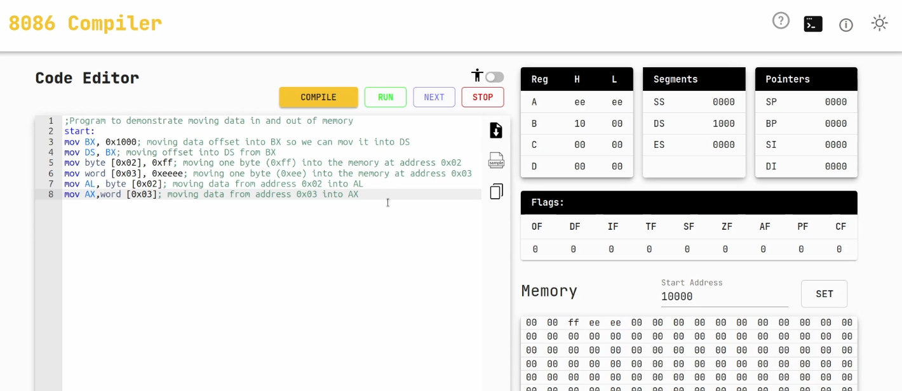
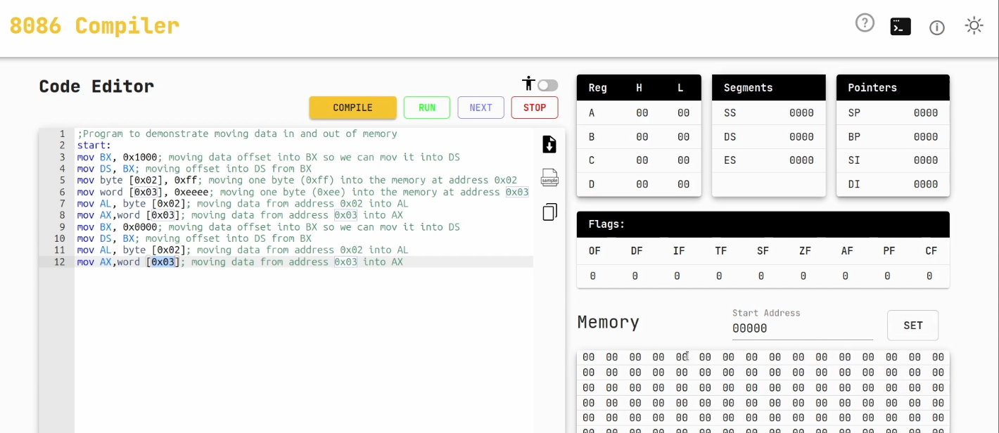

# Mover dentro de la memoria
En el 8086, la memoria se accede siempre a través de un segmento + un offset. El procesador nunca ve directamente una dirección física (real), sino que:  
`Dirección física = DS × 16 + Offset`

## Los registros implicados
- Registros de segmento → indican qué zona de memoria se está usando (CS, DS, SS, ES).
- Offset → puede venir de un registro (BX, SI, DI, BP…) o ser un valor inmediato.

Por defecto:
- Cuando usamos datos (mov [offset], valor) → se usa DS:offset.
- Cuando usamos pila → se usa SS:SP o SS:BP.

## Pasos internos:
- El ensamblador interpreta:
  - Queremos guardar un dato de 1 byte (0xFF).
  - Lo haremos en la dirección que resulta de DS:0x02.
    
- El procesador calcula la dirección física:
  - Supongamos DS = 0x1000.
  - Dirección física = 0x1000 × 16 + 0x02 = 0x10002.

- El dato se coloca en memoria: En la celda de memoria física 0x10002 se guarda el valor FFh.

## Si es un word (2 bytes)
```
mov word [0x03], 0xEEEE
```
- DS = 0x1000, offset = 0x03 → dirección física inicial = 0x10003.
- Como es un word (16 bits = 2 bytes), el procesador guarda en orden little endian:
  - 0x10003 → EE (parte baja).
  - 0x10004 → EE (parte alta).

## Resumen del proceso cuando introdocimos un dato en memoria:
- El procesador toma el registro de segmento (ej. DS).
- Le multiplica por 16 → obtiene la base física del segmento.
- Le suma el offset (desplazamiento).
- Coloca el dato en la celda física de memoria resultante.

**Nosotros le decimos al procesador "guarda en [offset]" y él, usando el segmento activo, traduce esa dirección lógica a física y mete el dato en la RAM.**

## Ejemplo:


`Dirección física = DS × 16 + Offset`

Con:

DS = 0x1000 → 0x1000 × 0x10 = 0x10000 (inicio del segmento en memoria física).

### Instrucciones del programa
```
mov byte [0x02], 0xff
```
- Segmento: DS = 0x1000
- Offset: 0x02
- Dirección física = 0x10000 + 0x02 = 0x10002
- Se guarda: FF

```
mov word [0x03], 0xEEEE
```
- Segmento: DS = 0x1000
- Offset: 0x03
- Dirección física inicial = 0x10000 + 0x03 = 0x10003
- Como es un word (2 bytes, little endian), se guarda así:
  - En 0x10003 → EE (byte bajo)
  - En 0x10004 → EE (byte alto)

### Mapa de memoria (a partir de 0x10000)
```
Dirección    Valor
---------    -----
0x10000      ??   (no escrito)
0x10001      ??   (no escrito)
0x10002      FF   ← byte escrito
0x10003      EE   ← word (parte baja)
0x10004      EE   ← word (parte alta)
0x10005      ??   (no escrito)
```

### Conclusión
- El segmento lógico DS=1000h equivale al inicio físico 10000h.
- El simulador pide que pongas 10000 en Start Address porque él trabaja con direcciones físicas.
- A partir de ahí, ya podemos ver en la memoria el resultado de las instrucciones.


# Sacar de la memoria



