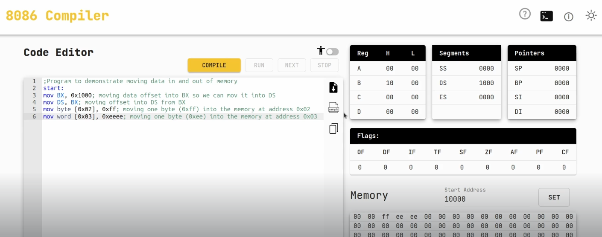

`Dirección física = DS × 16 + Offset`

Con:

DS = 0x1000 → 0x1000 × 0x10 = 0x10000 (inicio del segmento en memoria física).

## Instrucciones del programa
```
mov byte [0x02], 0xff
``
- Segmento: DS = 0x1000
- Offset: 0x02
- Dirección física = 0x10000 + 0x02 = 0x10002
- Se guarda: FF

```
mov word [0x03], 0xEEEE
```
- Segmento: DS = 0x1000
- Offset: 0x03
- Dirección física inicial = 0x10000 + 0x03 = 0x10003
- Como es un word (2 bytes, little endian), se guarda así:
  - En 0x10003 → EE (byte bajo)
  - En 0x10004 → EE (byte alto)

## Mapa de memoria (a partir de 0x10000)
```
Dirección    Valor
---------    -----
0x10000      ??   (no escrito)
0x10001      ??   (no escrito)
0x10002      FF   ← byte escrito
0x10003      EE   ← word (parte baja)
0x10004      EE   ← word (parte alta)
0x10005      ??   (no escrito)
```
