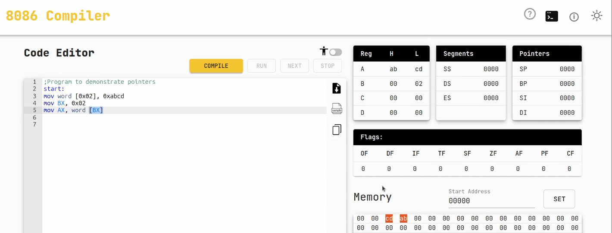

Un puntero es simplemente un **registro que contiene una dirección de memoria (offset).**

**En el 8086 esa dirección se combina con un registro de segmento (por ejemplo DS, SS, ES) para obtener la dirección física real.**

**El puntero no guarda datos directamente, sino la posición en memoria donde están los datos.**


## En el 8086 hay varios registros de 16 bits pensados como punteros:
- **SP (Stack Pointer) → puntero de pila.**
  - Siempre se usa con el segmento SS.
  - Apunta a la posición actual de la pila.

- **BP (Base Pointer) → puntero base.**
  - Normalmente se usa para acceder a parámetros en la pila (SS:BP).
  - Pero también puede apuntar a datos en otros segmentos.

- **SI (Source Index) → índice fuente.**
  - Usado en operaciones con cadenas (MOVSB, LODSB, etc.).
  - Por defecto apunta a DS:SI.

- **DI (Destination Index) → índice destino.**
  - Usado en operaciones con cadenas como destino.
  - Por defecto apunta a ES:DI.


## Ejemplo con puntero en la pila
```
push ax         ; guarda AX en la pila
mov bp, sp      ; BP = SP (puntero base)
mov ax, [bp]    ; recupera el valor desde la pila usando el puntero
```
- SP apunta al tope de la pila.
- BP se usa como puntero de referencia para leer lo que está en la pila.

## En resumen:
- Los punteros son registros que guardan offsets de memoria.
- Con un segmento forman direcciones físicas (DS:SI, ES:DI, SS:BP, etc.).
- Sirven para recorrer arrays, manejar cadenas o acceder a la pila.

## Ejemplo


### Paso 1: `mov word [0x02], 0xabcd`
- Esto guarda el valor 0xABCD en la memoria a partir de la dirección DS:0002.
- Como es un word (16 bits), se guardan 2 bytes en little endian:
  - 0x0002 → CD (byte bajo)
  - 0x0003 → AB (byte alto)

### Paso 2: `mov BX, 0x02`
- Aquí cargamos el registro BX con el valor 0x0002.
- Esto convierte a BX en un puntero (offset) que apunta a la posición DS:0002.

### Paso 3: `mov AX, word [BX]`
- Esta instrucción dice: "Ve a la dirección DS:BX, toma un word (2 bytes) y ponlo en AX."
  
- Como DS=0000 y BX=0002:  
  Dirección física 0x0000 × 16 + 0x0002 = 0x0002

- El procesador lee:  
  En 0x0002 → CD (parte baja).  
  En 0x0003 → AB (parte alta).  

- Resultado en AX: `AX = ABCDh`

