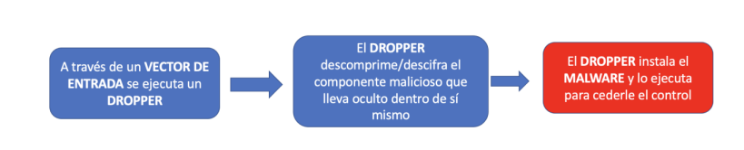
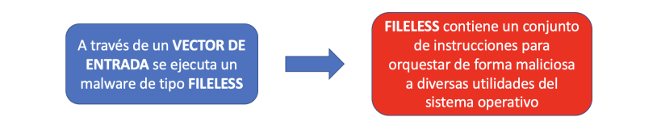
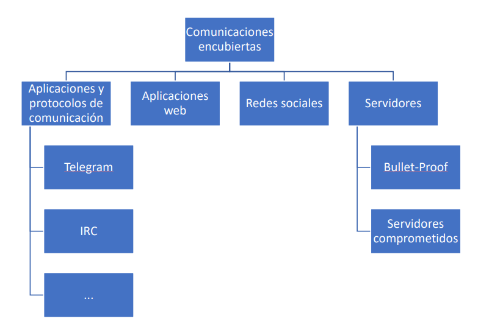

- [CHAPTER 1](#chapter-1)
  - [1. ¿Qué es el malware?](#1-qué-es-el-malware)
    - [1.1 Frameworks de explotación](#11-frameworks-de-explotación)
    - [1.2 Soportes que pueden ser usados por el malware](#12-soportes-que-pueden-ser-usados-por-el-malware)
    - [1.3. Vectores de entrada del malware](#13-vectores-de-entrada-del-malware)
    - [1.4. Exploits](#14-exploits)
    - [1.5. Ciclo de vida de un malware](#15-ciclo-de-vida-de-un-malware)
      - [1.5.1. Infección](#151-infección)
      - [1.5.2 Fase de persistencia](#152-fase-de-persistencia)
      - [1.5.3 Fase de comunicación](#153-fase-de-comunicación)
      - [1.5.4 Fase de desencadenamiento](#154-fase-de-desencadenamiento)
    - [1.6 Elevación de Privilegios](#16-elevación-de-privilegios)
    - [1.7 La importancia de la ingeniería social en la difusión del malware](#17-la-importancia-de-la-ingeniería-social-en-la-difusión-del-malware)
    - [1.8 Tipos de malware más comunes](#18-tipos-de-malware-más-comunes)
  - [2. Descripción general de la arquitectura del laboratorio](#2-descripción-general-de-la-arquitectura-del-laboratorio)
  - [3. Configuración de las VMs](#3-configuración-de-las-vms)
    - [3.1 Configuración de Windows VM:](#31-configuración-de-windows-vm)
    - [3.2 Configuración de Linux VM:](#32-configuración-de-linux-vm)
  - [4. Otra posible configuración para las MV](#4-otra-posible-configuración-para-las-mv)
    - [4.1 Configuración Virtual Box](#41-configuración-virtual-box)
    - [4.2 Máquina virtual Remnux](#42-máquina-virtual-remnux)
    - [4.3 Máquina Virtual WIN:](#43-máquina-virtual-win)
    - [Interacciones según los modos de red](#interacciones-según-los-modos-de-red)
  - [6. Malware Sources](#6-malware-sources)


# CHAPTER 1
## 1. ¿Qué es el malware?

  
> [!CAUTION]
> **<mark>El malware es todo aquello que puede ser ejecutado por un sistema y cuyo resultado es perjudicial para los intereses de un usuario u organización.</mark>** Consideramos malware todo aquello que posee una acción o acciones maliciosas en el contexto de los sistemas informáticos.

> **⚠️ Atención 🠮🠮 🠮🠮 🠮🠮** **El malware es un código que realiza acciones maliciosas**, puede tomar la forma de un ejecutable, un script, un código o cualquier otro software. Los atacantes utilizan malware para robar información confidencial, espiar el sistema infectado o tomar el control del sistema. Por lo general, accede al dispositivo sin nuestro consentimiento a través de varios canales de comunicación, como correo electrónico, web o unidades USB.


> [!NOTE]
> **El primer virus informático** cuyo comportamiento llevó a su autor a juicio fue el conocido como Gusano Morris, creado por el estadounidense [Robert Morris](https://es.wikipedia.org/wiki/Gusano_Morris) en 1988. 


**Durante los años 90**, los virus informáticos comenzaron a hacerse conocidos incluso en los medios de comunicación, aunque muchos no eran peligrosos, sino simples molestias que mostraban mensajes o animaciones. Fue una época “romántica” del malware, en la que los creadores competían por desarrollar nuevas técnicas de infección, replicación y evasión, más como un reto técnico que con fines destructivos.

Con el tiempo, **surgieron los primeros grupos criminales** que aprovecharon ese conocimiento compartido en revistas electrónicas (e-zines) y foros, viendo un potencial lucrativo. Así nació el mercado negro del malware.

El término “virus” se popularizó por su similitud con los virus biológicos: ambos se “inoculan” en un huésped (archivos o sistemas sanos) y se propagan al entrar en contacto con otros, en aquel entonces a través del intercambio de disquetes.

**Acciones maliciosas que realiza el malware:**
- Interrumpir el funcionamiento del ordenador.
- Robar información sensible, incluyendo datos personales, empresariales y financieros.
- Acceso no autorizado al sistema.
- Espiar.
- Enviar correos electrónicos de spam.
- Participar en ataques de denegación de servicio distribuido (DDoS).
- Bloquear los archivos del ordenador y exigir un rescate para liberarlos.

Malware es un término amplio que se refiere a **diferentes tipos de programas maliciosos como troyanos, virus, gusanos y rootkits...**


### 1.1 Frameworks de explotación
Son plataformas modulares que agrupan código listo (exploits, cargas útiles, herramientas de post-explotación, etc.) para facilitar la comprobación y explotación de vulnerabilidades. Funcionan de modo parecido a una librería en un lenguaje: en vez de escribir cada exploit desde cero, podemos recurrir a un catálogo ya implementado y reutilizable. Creadores de malware también reutilizan exploits y módulos de estos frameworks para acelerar la creación de malware o campañas de ataque.

Ejemplos de Frameworks conocidos:
- **Metasploit**: probablemente el más conocido; incluye cientos de exploits, módulos de post-explotación, utilidades de escaneo y mecanismos para probar evasión. Es una herramienta estándar en pruebas de penetración y en la formación de equipos de seguridad.
- **PowerShell Empire / Empire**: un framework centrado en técnicas de post-explotación y evasión en entornos Windows usando PowerShell (también tiene integraciones en Python). Es popular en auditorías de seguridad y también entre actores maliciosos por sus capacidades en memoria y .NET.

___________________________________________________________________________________________
### 1.2 Soportes que pueden ser usados por el malware
El malware no existe en su forma aislada, necesita de un soporte o huésped que lo transporte o le sirva de plataforma sobre la que actuar.

Tipos de archivos:
- Binarios: Ejecutables, Multimedia, Documentos ofimátcos.
- Texto: Páginas webs, Documentos ofimáticos, Pdfs, Extensiones del navegador.

___________________________________________________________________________________________
### 1.3. Vectores de entrada del malware
> [!WARNING]
> Llamamos vector de entrada a la combinación entre medio, técnica y canal de entrega del malware. Un punto de entrada es todo aquel medio por el cual podemos recibir contenido malicioso, como por ejemplo, el correo electrónico, downloader, uso de ingeniería social, exploits...

___________________________________________________________________________________________
### 1.4. Exploits
Un exploit es un programa informático que aprovecha o explota una vulnerabilidad en otro programa o sistema operativo. Existen sitios que recolectan estos exploits, tales como https://www.exploitdb.com/

___________________________________________________________________________________________
### 1.5. Ciclo de vida de un malware
> [!TIP]
> El malware posee un ciclo de vida. Desde que infecta a un sistema hasta que este es detectado y eliminado del sistema.  
> Necesidades del malware:
> - Una vez el malware infecta un sistema su mayor reto es permanecer oculto y funcional en ese sistema. Para ello necesita utilizar mecanismos que garanticen su vida una vez el sistema es reiniciado.
> - Obtener la mayor cantidad de permisos en el sistema para evitar que otros procesos puedan interferir en sus acciones y pasar desapercibido.


> [!IMPORTANT]
> **Fases que efectúa el malware:** Aunque no todas las fases se cumplen en algunos malware.  
> Infección 🠮🠮 Persistencia 🠮🠮 Comunicación 🠮🠮 Acción

#### 1.5.1. Infección
Tres técnicas muy empleadas en la primera ejecución del malware:


**A) DOWNLOADER:**
Es la técnica más básica y menos sofisticada. Su única misión es descargar e instalar el verdadero malware que sí realizará dichas acciones maliciosas. Esta técnica permite ocultar el malware real, exponiendo un sencillo programa no
malicioso que puede ser rápidamente realojado o sustituido en caso de detección.


**B) DROPPER:**
El comportamiento en muchos sentidos es similar al del Downloader. Sirven de punta de lanza para encubrir al verdadero malware. La diferencia fundamental es que el **Dropper contiene en sí mismo al malware y no necesita conexión a la red para instalar y ceder el control al componente maligno.**

Para evitar que los antivirus detecten el malware que lleva dentro de sí mismo, suelen emplear **técnicas de ofuscación o cifrado** de dichas partes.

Son una especie de envoltorio que cubre al malware real sirviéndoles de pantalla protectora.



**C) FILELESS:**

Es malware que no deja (o deja muy poca) huella en disco. En vez de guardar un ejecutable malicioso tradicional en el sistema de archivos, vive en memoria (RAM) y/o usa herramientas legítimas del propio sistema operativo para realizar acciones maliciosas. Así esquiva dos cosas que los antivirus clásicos miran mucho:
- Acceso a disco (crear/leer/escribir/borrar archivos).
- Firmas de archivos (huellas únicas de binarios concretos).

Podemos pensar que sería como un intruso que no hace copia de las llaves ni rompe la cerradura: se cuela por una puerta ya abierta y camina como si fuera personal autorizado.

El fileless no es magia, es estrategia: usa lo que ya existe en el sistema y se mueve en memoria para evadir firmas y acceso a disco, obligando a defender con telemetría, comportamiento y hardening, no solo con firmas.




#### 1.5.2 Fase de persistencia
La persistencia es el conjunto de técnicas que permiten que el malware siga ejecutándose aunque el equipo se reinicie, el usuario cierre sesión o un antivirus mate el proceso inicial. En otras palabras: que vuelva una y otra vez.

La persistencia es el “ancla” del atacante: usa mecanismos legítimos del sistema o del entorno (incluida la nube) para re-ejecutar su código tras reinicios y limpiezas. Para pararla, telemetría + baseline + hardening + control de identidades superan a las firmas por sí solas.

Otro aspecto necesario para el malware es su configuración. El malware va a ejecutar acciones maliciosas en el sistema, pero necesita que éstas le sean comunicadas a través de un canal encubierto para que nadie pueda fisgar o descubrir su actividad. 

Finalmente, el malware no se conforma con los permisos ordinarios de un usuario normal del sistema. Intentará escalar privilegios para obtener más permisos y derechos en el sistema.

Hay tres acciones prioritarias para el malware una vez entra en el sistema:


**Métodos de Persistencia:**


**A) Menú de Inicio:**
La carpeta de “inicio” del sistema operativo Windows es un método clásico y sencillo para indicarle al sistema que ejecute las aplicaciones allí incluidas.

**B) Registro de windows:**
El registro de Windows es una base de datos dispersa en varios archivos a lo largo del sistema. Sirve para alojar parámetros de configuración del sistema y de las aplicaciones. 

Existen claves del registro de Windows que le indican al sistema qué aplicaciones debe arrancar al iniciarse. Por supuesto, el malware emplea este tipo de claves del registro para anotar su localización y hacer que el sistema ejecute el malware al inicio.


**C) Tareas programadas:**
Los sistemas operativos poseen un servicio para que ciertas tareas se ejecuten cada cierto tiempo. Existen varios tipos de programas y servicios que permiten implementar este tipo de tareas programadas en sistemas Microsoft Windows.


**D) Servicios del Sistema:**
Un servicio es un proceso que típicamente no posee interfaz, se ejecuta en segundo plano y sirve de apoyo al resto de programas o al propio sistema operativo. Tradicionalmente, en el mundo UNIX se les denomina daemons. 

Un servicio también puede ser visto como una aplicación especial (por su forma de ejecutarse). El malware aprovecha esta característica para instalar un servicio que le indique al sistema operativo que ejecute el malware si éste no está ya en marcha.


#### 1.5.3 Fase de comunicación
El malware necesita comunicarse con el mundo exterior por diferentes razones: exfiltrar información, escuchar las órdenes de sus creadores u obtener la configuración inicial, entre otras. Es raro que un malware no posea algún tipo de comunicación con el exterior en algunas de las formas disponibles.

Dado que el intercambio de información genera señales o ruido, esto es percibido por los analistas de malware que pueden llegar a identificar una campaña de malware solo con observar tráfico entre servidores o la resolución de ciertos
dominios.

**Clases de canales que puede utilizar el malware para comunicarse:**


**A) Canales de aplicaciones y protocolos de comunicación:** Los servidores IRC. Telegram. Cualquier aplicación o protocolo de intercambio de mensajes.

**B) Canales usando aplicaciones web:** pastebin.com 

**C) Canales usan redes sociales:** Twitter, Facebook, etc., Se envían órdenes a través de la publicación de entradas. Los comandos, órdenes o configuraciones no son publicados directamente, sino que son ofuscados, cifrados o introducidos en imágenes (esteganografía).

**D) Canales usando servidores:** Servidores Web. Servidores FTP. Existen dos tipos principales: los bullet-proof y los servidores comprometidos. Estos últimos son servidores comprometidos, bajo el control de un atacante o cibercriminal, pero sin el consentimiento y conocimiento de sus propietarios. Los servidores bullet-proof son alojados en redes y/o países con una legislación más laxa en materia de cibercrimen que dificulta el cierre y persecución de las infraestructuras utilizadas por el malware.


#### 1.5.4 Fase de desencadenamiento
Finalmente, el malware despliega la verdadera amenaza que posee incubada en su interior. La finalidad puede ser de índole muy diversa: intereses políticos, económicos, espionaje, ideológicos, terrorismo, etc.


**A) Criptominado:** Los cibercriminales secuestran capacidad de cómputo a los sistemas infectados.

**B) Adware:** La motivación principal es la inyección de publicidad y la manipulación de resultados del buscador para dirigir las visitas y visionados de anuncios a un determinado producto, sitio web o servicio. Además de los anuncios, las versiones más dañinas pueden suscribir a las víctimas a servicios de pago o SMS Premium; con lo que multiplican sus ingresos a costa de un mayor daño y exposición.

**C) Destrucción de infraestrucura:** Este tipo de malware busca pasar desapercibido y no tiene otro fin que el de maximizar la capacidad destructiva, empleando, por ejemplo, drivers que manipulen y evadan mecanismos de seguridad para sabotear componentes hardware. Suele ser usado para sabotear instalaciones o ralentizar la producción de un competidor. Un ejemplo muy claro de malware de sabotaje fue el gusano STUXNET, programado para destruir componentes de centrifugadoras de uranio en Irán.

**D) Gusanos:** Más que una finalidad es un comportamiento muy característico. El gusano explota una vulnerabilidad que no necesita de la interacción con el usuario, basta que encuentre un sistema vulnerable a la escucha. Su meta es replicarse lo más amplia y rápidamente posible. Para ello, va escaneando Internet o una red local para encontrar nuevos sistemas vulnerables y continuar su replicación. Ejemplos: ILOVEYOU, Melissa, Conficker, etc.

**E) Ransomware:** Cifra los documentos. Para rescatar los archivos cifrados, necesitamos una clave criptográfica que nos piden a cambio de una suma de dinero. Este método es equivalente a un secuestro a cambio de dinero, de ahí el término inglés “ransom”. La única arma definitiva para acabar con este tipo de extorsión es no pagar. 

**F) Bootnets:** Una botnet es una red de ordenadores infectados y sincronizados entre ellos para obedecer las órdenes y comandos de sus creadores. También es conocida como red de ordenadores zombies o nodos zombies. La finalidad de estos es múltiple, aunque una forma característica es la utilización de los nodos infectados como parte de operaciones de denegación de servicio. Algunas botnets minan criptomoneda, curiosean archivos o cámaras.

**G) Robo de información:** Por un lado, robar información intelectual o que permita a un competidor averiguar secretos; por otro lado, la extorsión a cambio de dinero si el cibercriminal encuentra información comprometedora para la víctima (fotos de índole intima, etc.). Una forma particular de este tipo de malware son los denominados RAT (remote administration tool). Un RAT es una herramienta que toma el control de un ordenador remoto. Existen RATs que son programas legítimos, por ejemplo, los usados para administración o soporte remoto.

___________________________________________________________________________________________
### 1.6 Elevación de Privilegios
Al elevar privilegios, el malware busca convertirse en un administrador del sistema. Cuando lo consigue, disfruta de plenos poderes y derechos sobre los recursos del sistema. Pasa de tener limitado su rango de acción a poder actuar sin
apenas restricciones.

Cuando se eleva privilegios en un sistema se hace a través de un **exploit** que aprovecha una vulnerabilidad o una técnica que permite aprovechar algún resquicio, por ejemplo, que la contraseña del administrador sea muy sencilla de adivinar.

A los exploits que permiten convertirse en administrador se les denomina **exploits de elevación de privilegios.**


Es diferente el exploit que ha servido para infectar al sistema del exploit que se usa para conseguir mejores privilegios.

**Rootkits:** 
De las fases descritas anteriormente, la elevación entraría en la persistencia, puesto que una vez infectado el sistema, una elevación le permitiría privilegios para detener software de detección u utilizar técnicas rootkit para pasar desapercibido a los ojos de cualquier usuario del sistema e incluso administradores.

Además, con privilegios suficientes, se puede lograr lograr persistencia incluso infectando los procesos de arranque y estar presente antes incluso de la carga del núcleo del sistema.

Los rootkit interceptan las llamadas al sistema interponiéndose y ajustando la salida a su conveniencia. Por ejemplo, hacer un "ls" en un sistema infectado por un rootkit permite a éste mostrar todos los archivos habituales a excepción de los
maliciosos. Lo mismo con el tráfico de red o cualquier otro intento de desenmascarar al malware en el sistema.

___________________________________________________________________________________________
### 1.7 La importancia de la ingeniería social en la difusión del malware

Lo habitual es tirar de ingeniería social, ya sea spear phishing (orientado a una víctima o grupo particular) o phishing común (sin orientación alguna, genérico). Es un método relativamente barato y eficaz. 


___________________________________________________________________________________________
### 1.8 Tipos de malware más comunes
Algunos de ellos se categorizan según su funcionalidad y vectores de ataque, como se describe a continuación:
- **Virus:**  
Programa malicioso que se adjunta a un archivo legítimo y se propaga cuando se ejecuta el archivo infectado. Causa variedad de daños, como la eliminación de archivos, el robo de información o el bloqueo del sistema. Este Malware es capaz de copiarse a sí mismo y propagarse a otros ordenadores. Un virus necesita intervención del usuario, mientras que un gusano puede propagarse sin ella.

- **Gusano:**  
Son programas maliciosos que se propagan a través de redes y sistemas informáticos. Los gusanos pueden causar una sobrecarga en la red y ralentizar el rendimiento del sistema.

- **Troyano:**  
Malware que se disfraza de programa legítimo para engañar al usuario y que lo instale. Una vez instalado, puede realizar acciones maliciosas como robar datos sensibles, subir archivos al servidor del atacante o espiar a través de la webcam.

- **Backdoor / Remote Access Trojan (RAT) | Puerta trasera / Troyano de acceso remoto (RAT):**  
Tipo de troyano que permite al atacante acceder y ejecutar comandos en el sistema comprometido.

- **Adware:**  
Malware que muestra anuncios no deseados al usuario. Suele distribuirse junto con descargas gratuitas e incluso puede instalar software de manera forzada.

- **Botnet:**  
Conjunto de ordenadores infectados con el mismo malware (llamado bots), que esperan instrucciones del servidor de comando y control controlado por el atacante. El atacante puede ordenar a estos bots que realicen actividades maliciosas como ataques DDoS o envío masivo de spam.

- **Ladrón de información (Information stealer):**  
Malware diseñado para robar datos sensibles como credenciales bancarias o pulsaciones del teclado. Algunos ejemplos son los keyloggers, spyware, sniffers y form grabbers.

- **Ransomware:**  
Malware que mantiene el sistema como rehén, bloqueando el acceso al ordenador o cifrando los archivos del usuario y exigiendo un rescate para recuperarlos.

- **Rootkit:**  
Malware que otorga al atacante acceso privilegiado al sistema infectado y oculta su presencia o la de otros programas maliciosos. Los rootkits pueden permitir a los atacantes controlar el sistema y recopilar información sin ser detectados.

- **Downloader o Dropper:**  
Malware diseñado para descargar o instalar componentes maliciosos adicionales en el sistema.


__________________________________________________________________________
## 2. Descripción general de la arquitectura del laboratorio


La arquitectura usada consiste en una **máquina física (llamada máquina host) que ejecuta Ubuntu Linux con instancias de máquina virtual Linux (Ubuntu Linux VM) y máquina virtual Windows (Windows VM)**. Estas máquinas virtuales se configurarán para ser parte de la misma red y utilizarán el modo de **configuración de red de Host-only** para que el malware no pueda comunicarse con Internet y así el tráfico de la red estará contenido en el entorno de laboratorio aislado.

La VM de Windows es donde se ejecutará el malware durante el análisis, y la VM de Linux se usará para monitorear el tráfico de red y será configurada para simular servicios de Internet (DNS, HTTP, etc.), para proporcionar una respuesta adecuada cuando el malware solicite estos servicios. Por ejemplo, la máquina virtual Linux se configurará de manera que cuando el malware solicite un servicio como DNS, la máquina virtual Linux proporcione la respuesta DNS adecuada. 

En esta configuración, la máquina virtual Linux estará preconfigurada en la dirección IP 192.168.1.100 y la dirección IP de la máquina virtual Windows se configurará en 192.168.1.x (donde x es cualquier número de 1 a 254 excepto 100). La puerta de enlace predeterminada y el DNS de la VM de Windows se configurarán en la dirección IP de la VM de Linux (es decir, 192.168.1.100) para que todo el tráfico de la red de Windows se enrute a través de la VM de Linux.

También es posible configurar un laboratorio compuesto por múltiples VMs ejecutando diferentes versiones de Windows; esto nos permitirá analizar la muestra de malware en varias versiones de sistemas operativos Windows.


## 3. Configuración de las VMs
- Instalación de MV Ubuntu & MV Windows.
- Instalación de Virtual Guest Additions software en ambas VMs.
  
### 3.1 Configuración de Windows VM:
- Deshabilitamos Windows Update.
- Deshabilitamos Windows Defender 🠮  Services 🠮 Windows Defender 🠮 Boton derecho 🠮  Select properties 🠮  Stop Service
- Mostrar extensiones de ficheros 🠮 Opciones de carpeta 🠮 Ver 🠮  Mostrar extensiones para ficheros
- Mostrar ficheros y carpetas ocultos.
- Deshabilitamos ASLR (Address Space Layout Randomization): ASLR (Address Space Layout Randomization) es una técnica de seguridad utilizada para dificultar los ataques de desbordamiento de búfer (buffer overflow) y otras vulnerabilidades de corrupción de memoria. La idea principal de ASLR es ubicar aleatoriamente en el espacio de direcciones de memoria las áreas clave de un proceso, como el ejecutable base, la pila, el montón y las librerías cargadas. Esto hace que las direcciones de memoria sean impredecibles para un atacante, dificultando la ejecución de código malicioso.
    🠮  Windows + R 🠮  regedit 🠮 Computer\HKEY_LOCAL_MACHINE\SISTEM\CurrentSet\Control\Session Manager\Memory Management 🠮  New Key 🠮 QWORD (32 bits) 🠮 poner como nombre: MoveImages
- Deshabilitamos Firewall 🠮 Windows Defender Firewall.
- Creamos un snapshot 🠮 HOST + T

- Instalamos Flare VM: Es una colección de scripts de instalación de software para sistemas Windows que permite configurar y mantener fácilmente un entorno de ingeniería inversa y análisis de malware en una máquina virtual.Las principales características de FLARE VM son:
  - Proporciona un conjunto de herramientas expertas para ingeniería inversa, análisis de malware, monitoreo, depuración, desensamblado, descompilación y más, todas preinstaladas y configuradas. Algunas herramientas incluidas son IDA, Binary Ninja, Radare2, OllyDbg, x64dbg, Ghidra, entre otras. (https://github.com/dnSpy/dnSpy)
  - Utiliza Chocolatey (un administrador de paquetes para Windows) y Boxstarter para automatizar la instalación y configuración de las herramientas en un entorno Windows virtualizado.
  - Está diseñado para instalarse únicamente en una máquina virtual Windows, no en un host físico, para permitir un análisis de malware seguro y contenido.
  - Proporciona un proceso de instalación, actualización y desinstalación simplificado a través de scripts de PowerShell.
  - Permite personalizar fácilmente las herramientas a instalar a través de una interfaz gráfica de usuario.
  - Es un proyecto de código abierto mantenido por el equipo FLARE de Mandiant/FireEye, con contribuciones de la comunidad.
  - Enlace: https://github.com/mandiant/flare-vm
  - Video con instruciones para instalar: https://www.youtube.com/watch?v=i8dCyy8WMKY
  - Desactivamos: Windows Defender through Group Policy:
    - gpedit.msc
    - En el Editor de Directiva de Grupo, navegue a la siguiente ruta: Computer Configuration > Administrative Templates > Windows Components > Windows Defender Antivirus
    - Busque la configuración "Turn off Windows Defender Antivirus" (o "Desactivar Antivirus Windows Defender" en español).
    - Haga doble clic en ella para editarla.
    - Seleccione "Enabled" (Habilitado) y haga clic en "Apply" (Aplicar) y luego en "OK".
    - Cierre el Editor de Directiva de Grupo Local.
  - Computer Configuration > Administrative Templates > Windows Components > Microsoft Defender Antivirus > Real-time Protection > Enable Turn off real-time protection
  - Instalación: Desde la carpeta del master, ejecutar con PowerShell como administrador:
    - Set-ExecutionPolicy unrestricted
    - Si falla: Set-ExecutionPolicy -Scope      CurrentUser
      - unresticted
      - ./

- Descargamos Python desde https://www.python.org/downloads/. Asegúrate de descargar la versión Python 2.7.x (por ejemplo, 2.7.13); la mayoría de los scripts usados en este libro están escritos para ejecutarse con la versión Python 2.7 y puede que no funcionen correctamente en Python 3.

- Configuramos la máquina virtual de Windows para que funcione en modo de red solo-anfitrión (Host-only).

- Configuramos la dirección IP de la máquina virtual de Windows como 192.168.1.x (elegimos cualquier dirección IP excepto 192.168.1.100, ya que esa la usará la máquina virtual con Linux) y establecemos la puerta de enlace predeterminada y el servidor DNS a la dirección IP de la máquina virtual con Linux (es decir, 192.168.1.100).

- Nos aseguramos de que ambas máquinas puedan comunicarse entre sí. Comprobamos la conectividad ejecutando el comando ping.

- Para desactivar Windows Defender:
  - Abrimos el Editor de directivas de grupo local.
  - En el panel izquierdo, navegamos hasta: Configuración del equipo | Plantillas administrativas | Componentes de Windows | Windows Defender.
  - En el panel derecho, hacemos doble clic en la directiva Desactivar Windows Defender para editarla.
  - Seleccionamos Habilitada y haz clic en Aceptar.
 

### 3.2 Configuración de Linux VM:
- Instalación:
  ```
  sudo apt-get install python-pip
  pip install --upgrade pip
  sudo apt-get install python-magic
  sudo apt-get install upx
  sudo pip install pefile
  sudo apt-get install yara
  sudo pip install yara-python
  sudo apt-get install ssdeep
  sudo apt-get install build-essential libffi-dev python python-dev libfuzzy-dev
  sudo pip install ssdeep
  sudo apt-get install wireshark
  sudo apt-get install tshark
  ```
- INetSim (http://www.inetsim.org/index.html) es una herramienta potente que permite simular varios servicios de Internet (como DNS y HTTP).Emula servicios típicos de Internet dentro de una red controlada o aislada (como una sandbox). Esto permite ver cómo se comporta un malware cuando intenta comunicarse con servidores externos, sin que el malware realmente acceda a Internet:
  ```
  sudo su
  echo "deb http://www.inetsim.org/debian/ binary/" >  /etc/apt/sources.list.d/inetsim.list
  wget -O - http://www.inetsim.org/inetsim-archive-signing-key.asc | apt-key add -
  apt update
  apt-get install inetsim
  ```
  
- Ahora podemos aislar la máquina virtual de Ubuntu dentro del laboratorio configurando el modo de red "Solo-anfitrión" (Host-only) en el dispositivo virtual. Es importante aislar la máquina virtual del acceso a Internet real, para evitar que el malware cause daños o se comunique con atacantes reales. El modo de red Host-only en VMware:
    - Crea una red cerrada entre tu máquina real (host) y la máquina virtual (VM).
    - No permite acceso a Internet ni a otras redes, solo comunicación directa entre host y VM.
    - Es ideal para entornos de prueba o análisis seguro.
  
- IP address of 192.168.1.100 to the Ubuntu Linux VM.
  
- Configurar INetSim para que pueda escuchar y simular todos los servicios en la ip 192.168.1.100:
  ```
  sudo gedit /etc/inetsim/inetsim.conf
  # service_bind_address
  #
  # IP address to bind services to
  #
  # Syntax: service_bind_address <IP address>
  #
  # Default: 127.0.0.1
  #
  #service_bind_address 10.10.10.1
  service_bind_address 192.168.1.100
  #
  #dns_default_ip 10.10.10.1
  dns_default_ip 192.168.1.100
  ```
- Arrancar INetSim:
  ```
  sudo inetsim
  ```
- Hacemos una snapshot | instantánea: En VirtualBox, se puede hacer haciendo clic en Máquina | Tomar instantánea. 🠮 Host + T


## 4. Otra posible configuración para las MV

### 4.1 Configuración Virtual Box

- Instalamos una MV Windows10 Pro y una MV Remnux.
- Instalamos Virtual guest addition.
- Cambiamos a una configuración de red tipo 10.0.0.0/24 para evitar posibles saltos a redes usuales como 192.168.X.X. Actualmente en Virtual box sólo se pueden crear redes del rango 192.168.57.... Para crear una red del rango 10.0.0.0/24, tenemos que habilitarlo en el fichero de configuración de redes:
```
sudo nano /etc/vbox/networks.conf

Añadimos:
* 10.0.0.0/24
```

- Creamos en línea de comandos una red hostonly:
```
sudo VBoxManage hostonlyif create
```
El comando anterior, genera una nueva red y nos indica su nombre, por ejemplo vboxnet1.

- Especificamos el rango de la red:
```
sudo VBoxManage hostonlyif ipconfig vboxnet1 --ip 10.0.0.1 --netmask 255.255.255.0
```

- Cerramos y abrimos VirtualBox para que actualice este cambio.

- En virtualbox, Vamos a la configuración de redes: Red vboxnet1 --> Configuración de la red:
```
Direccion IPv4: 10.0.0.1
máscara de red: 255.255.255.0
```
- Vamos a la configuración de redes: Red vboxnet1 --> Servidor DHCP:
```
Dirección del Servidor: 10.0.0.2
Máscara de red: 255.255.255.0
Limite inferior: 10.0.0.3
Límite superior: 10.0.0.254
```
- Verificamos que la VM WIN y la WM Linux tiene sólo un adaptador de red activo: Red vboxnet1


### 4.2 Máquina virtual Remnux

```
ip: 10.0.0.3/24
Configuración inetsim:
nano /etc/inetsim/inetsim.conf
service_bind_addres  0.0.0.0
dns_default_ip       10.0.0.3

Ejecutar inetsim.
```

### 4.3 Máquina Virtual WIN:
```
ip: 10.0.0.4/24
Download Windows Terminal:
Download the VCLibs package. In a PowerShell window, run: wget https://aka.ms/Microsoft.VCLibs.x64.14.00.Desktop.appx -usebasicparsing -o VCLibs.appx
Download the Windows Terminal MSIX bundle from the provided link: wget https://github.com/microsoft/terminal/releases/download/v1.15.3465.0/Microsoft.WindowsTerminal_Win10_1.15.3465.0_8wekyb3d8bbwe.msixbundle -UseBasicParsing -o winterminal.msixbundle
In a PowerShell admin window, add the VCLibs package: Add-AppxPackage [C:\path\to\downloaded\VCLibs.appx]
In a PowerShell admin window, run: Add-AppxPackage [C:\path\to\downloaded\winterminal.msixbundle]

(Optional) Pin Windows Terminal to the task bar

Disable proxy auto detect setting:
In the Windows search bar, search “proxy settings”,
Switch "Automatically detect settings" button off

Disable Tamper Protection
Search "Defender", open Defender settings and set all Defender Settings to off

Disable AV/Defender in GPO
Si tenemos Windows10 Home y gpedit.msc no está instalado:
- cmd ejecutar como administrador
- FOR %F IN ("%SystemRoot%\servicing\Packages\Microsoft-Windows-GroupPolicy-ClientTools-Package~*.mum") DO ( DISM /Online /NoRestart /Add-Package:"%F" )
- FOR %F IN ("%SystemRoot%\servicing\Packages\Microsoft-Windows-GroupPolicy-ClientExtensions-Package~*.mum") DO ( DISM /Online /NoRestart /Add-Package:"%F" )
- Windows+r --> gpedit.msc

In Windows search bar, search "group policy"
In GPO, navigate to → Administrative Templates → Windows Components → Microsoft Defender Antivirus → Enable “Turn off Microsoft Defender Antivirus”
Disable Windows Firewall
GPO → Administrative Templates → Network → Network Connections → Windows Defender Firewall → Domain Profile → Disable “Protect All Network Connections”
Do the same but for the Standard profile


TAKE A SNAPSHOT!

Download and install FLARE-VM:
In PowerShell Admin prompt, run: (New-Object net.webclient).DownloadFile('https://raw.githubusercontent.com/mandiant/flare-vm/main/install.ps1',"$([Environment]::GetFolderPath("Desktop"))\install.ps1")
Change directories to the Desktop

Run: Unblock-File .\install.ps1
Run: Set-ExecutionPolicy Unrestricted
Accept the prompt to set the ExecPol to unrestricted if one appears
Run: .\install.ps1 -customConfig https://raw.githubusercontent.com/HuskyHacks/PMAT-labs/main/config.xml
Follow the rest of the prompts and continue with the installation.

Configuración del adaptador de ip IPV/4:
Usar la siguiente dirección del servidor de DNS: 10.0.0.3


When the installation is done, TAKE ANOTHER SNAPSHOT!
```

Comprobar que todas las máquinas se ven con pings.
comprobar que la MV Win, si accede a una web o recurso, recibe respuesta de inetsim.


### Interacciones según los modos de red
Cómo interactúan las MVs con el Host físco que las contiene:


**El modo de red Host-Only en entornos virtualizados permite la comunicación únicamente entre las máquinas virtuales y el host físico, sin acceso a internet ni a otras máquinas de la LAN. Sin embargo, Host-Only permite la comunicación entre la VM infectada y el host**. Es por ello que este modo no es totalmente seguro para análisis de malware si el host contiene datos valiosos o está desprotegido.

Aunque **con Host-Only se evita que el malware salga a internet o ataque otros dispositivos de la red corporativa**, la posibilidad de comunicación directa con el host representa un riesgo: si el malware logra aprovechar vulnerabilidades presentes en el sistema de virtualización o en el propio host, podría salir del entorno controlado y comprometer el host físico. Históricamente han existido exploits (vulnerabilidades de escape de VM) que permiten a malware salir de la máquina virtual y ejecutar código en el host, aunque estos no son triviales ni comunes en entornos bien actualizados.

Por tanto, Host-Only **aporta un nivel de aislamiento, pero no garantiza seguridad absoluta**. En buenas prácticas de análisis de malware, se recomienda además:
- Usar instantáneas para restaurar el estado limpio de la VM rápidamente.
- Mantener el host lo más aislado posible y sin información sensible.
- Aplicar actualizaciones de seguridad tanto al host como al software de virtualización.
- Considerar el uso de entornos totalmente desconectados (“air-gapped”) para análisis de malware de riesgo elevado.
- Cifrar discos duros para que no tengan acceso entre ellos para aislar plenamente el disco que tenga las funciones de lab.


https://academy.tcm-sec.com/courses/1547503/lectures/42863183

## 6. Malware Sources
- Hybrid Analysis: https://www.hybrid-analysis.com/
- KernelMode.info: http://www.kernelmode.info/forum/viewforum.php?f=16
- VirusBay: https://beta.virusbay.io/
- Contagio malware dump: http://contagiodump.blogspot.com/
- AVCaesar: https://avcaesar.malware.lu/
- Malwr: https://malwr.com/
- VirusShare: https://virusshare.com/
- theZoo: http://thezoo.morirt.com/
- Elastic Malware Benchmark: https://github.com/elastic/ember
- Tekdefense: https://www.tekdefense.com/downloads/malware-samples/
- Syrianmalware: https://syrianmalware.com/
- VX underground: https://vx-underground.org/
- MalwareBazar: https://bazaar.abuse.ch/
- Zeltser: https://zeltser.com/malware-sample-sources/

-------------------------------------------------  
-------------------------------------------------  