- [CHAPTER 1](#chapter-1)
- [1. ¿Qué es el malware?](#1-qué-es-el-malware)
  - [1.1 Frameworks de explotación](#11-frameworks-de-explotación)
    - [1.2 Soportes que pueden ser usados por el malware](#12-soportes-que-pueden-ser-usados-por-el-malware)
  - [1.3. Vectores de entrada del malware](#13-vectores-de-entrada-del-malware)
  - [1.4. Exploits](#14-exploits)
  - [1.5. Ciclo de vida de un malware](#15-ciclo-de-vida-de-un-malware)
    - [1.5.1. Infección](#151-infección)
    - [1.5.2 Fase de persistencia](#152-fase-de-persistencia)
    - [1.5.3 Fase de comunicación](#153-fase-de-comunicación)
    - [1.5.4 Fase de desencadenamiento](#154-fase-de-desencadenamiento)
  - [1.6 Elevación de Privilegios](#16-elevación-de-privilegios)
  - [1.7 La importancia de la ingeniería social en la difusión del malware](#17-la-importancia-de-la-ingeniería-social-en-la-difusión-del-malware)
  - [1.8 Tipos de malware más comunes](#18-tipos-de-malware-más-comunes)
- [2. Descripción general de la arquitectura del laboratorio](#2-descripción-general-de-la-arquitectura-del-laboratorio)
- [3. Configuración de las VMs](#3-configuración-de-las-vms)
  - [3.1 Configuración de Windows VM](#31-configuración-de-windows-vm)
  - [3.2 Configuración de Linux VM:](#32-configuración-de-linux-vm)
- [4. Otra posible configuración para las MV](#4-otra-posible-configuración-para-las-mv)
  - [4.1 Configuración Virtual Box](#41-configuración-virtual-box)
  - [4.2 Máquina virtual Remnux](#42-máquina-virtual-remnux)
  - [4.3 Máquina Virtual WIN](#43-máquina-virtual-win)
  - [4.4 INetSim](#44-inetsim)
    - [Arquitectura utilizada](#arquitectura-utilizada)
    - [Archivo de configuración](#archivo-de-configuración)
    - [Configuración recomendada](#configuración-recomendada)
    - [Inicio de INetSim](#inicio-de-inetsim)
    - [Comprobación desde Windows](#comprobación-desde-windows)
    - [Registros generados](#registros-generados)
    - [Medidas de seguridad](#medidas-de-seguridad)
  - [Interacciones según los modos de red](#interacciones-según-los-modos-de-red)
- [5. Seguridad de red en un laboratorio de análisis de malware](#5-seguridad-de-red-en-un-laboratorio-de-análisis-de-malware)
  - [5.1. Introducción](#51-introducción)
  - [5.2. Comparación entre Host-Only y Red interna](#52-comparación-entre-host-only-y-red-interna)
    - [5.2.1. Red Host-Only](#521-red-host-only)
    - [5.2.2. Red interna](#522-red-interna)
  - [5.3. Evaluación de seguridad de una red Host-Only](#53-evaluación-de-seguridad-de-una-red-host-only)
    - [5.3.1. Comunicación desde el host hacia FLARE-VM](#531-comunicación-desde-el-host-hacia-flare-vm)
    - [5.3.2. Comunicación desde FLARE-VM hacia el host](#532-comunicación-desde-flare-vm-hacia-el-host)
    - [5.3.3. Interpretación del riesgo](#533-interpretación-del-riesgo)
  - [5.4. Consideraciones para hosts Linux y macOS](#54-consideraciones-para-hosts-linux-y-macos)
  - [5.5. Arquitectura recomendada con Red interna](#55-arquitectura-recomendada-con-red-interna)
  - [5.6. Configuración de la Red interna en VirtualBox](#56-configuración-de-la-red-interna-en-virtualbox)
    - [5.6.1. REMnux](#561-remnux)
    - [5.6.2. FLARE-VM](#562-flare-vm)
  - [5.7. Asignación de una IP estática a REMnux](#57-asignación-de-una-ip-estática-a-remnux)
    - [5.7.1. Identificar el nombre de la interfaz](#571-identificar-el-nombre-de-la-interfaz)
    - [5.7.2. Editar Netplan](#572-editar-netplan)
    - [5.7.3. Validar y aplicar](#573-validar-y-aplicar)
  - [5.8. Configuración estática de FLARE-VM](#58-configuración-estática-de-flare-vm)
  - [5.9. Configuración de INetSim](#59-configuración-de-inetsim)
    - [5.9.1. `service_bind_address`](#591-service_bind_address)
    - [5.9.2. `dns_default_ip`](#592-dns_default_ip)
    - [5.9.3. Inicio del servicio](#593-inicio-del-servicio)
  - [5.10. Pruebas de conectividad](#510-pruebas-de-conectividad)
    - [5.10.1. Comunicación entre FLARE-VM y REMnux](#5101-comunicación-entre-flare-vm-y-remnux)
    - [5.10.2. Ausencia de acceso a Internet](#5102-ausencia-de-acceso-a-internet)
    - [5.10.3. Ausencia de comunicación con el host](#5103-ausencia-de-comunicación-con-el-host)
    - [5.10.4. DNS sin INetSim](#5104-dns-sin-inetsim)
    - [5.10.5. DNS con INetSim](#5105-dns-con-inetsim)
    - [5.10.6. Prueba HTTP simulada](#5106-prueba-http-simulada)
  - [5.11. Lista de verificación antes de ejecutar malware](#511-lista-de-verificación-antes-de-ejecutar-malware)
  - [5.12. Conclusión](#512-conclusión)
- [6. Malware Sources](#6-malware-sources)


# CHAPTER 1
# 1. ¿Qué es el malware?

  
> [!CAUTION]
> **<mark>El malware es todo aquello que puede ser ejecutado por un sistema y cuyo resultado es perjudicial para los intereses de un usuario u organización.</mark>** Consideramos malware todo aquello que posee una acción o acciones maliciosas en el contexto de los sistemas informáticos.

> **⚠️ Atención →→ →→ →→** **El malware es un código que realiza acciones maliciosas**, puede tomar la forma de un ejecutable, un script, un código o cualquier otro software. Los atacantes utilizan malware para robar información confidencial, espiar el sistema infectado o tomar el control del sistema. Por lo general, accede al dispositivo sin nuestro consentimiento a través de varios canales de comunicación, como correo electrónico, web o unidades USB.


> [!NOTE]
> **El primer virus informático** cuyo comportamiento llevó a su autor a juicio fue el conocido como Gusano Morris, creado por el estadounidense [Robert Morris](https://es.wikipedia.org/wiki/Gusano_Morris) en 1988. 


**Durante los años 90**, los virus informáticos comenzaron a hacerse conocidos incluso en los medios de comunicación, aunque muchos no eran peligrosos, sino simples molestias que mostraban mensajes o animaciones. Fue una época “romántica” del malware, en la que los creadores competían por desarrollar nuevas técnicas de infección, replicación y evasión, más como un reto técnico que con fines destructivos.

Con el tiempo, **surgieron los primeros grupos criminales** que aprovecharon ese conocimiento compartido en revistas electrónicas (e-zines) y foros, viendo un potencial lucrativo. Así nació el mercado negro del malware.

El término “virus” se popularizó por su similitud con los virus biológicos: ambos se “inoculan” en un huésped (archivos o sistemas sanos) y se propagan al entrar en contacto con otros, en aquel entonces a través del intercambio de disquetes.

**Acciones maliciosas que realiza el malware:**
- Interrumpir el funcionamiento del ordenador.
- Robar información sensible, incluyendo datos personales, empresariales y financieros.
- Acceso no autorizado al sistema.
- Espiar.
- Enviar correos electrónicos de spam.
- Participar en ataques de denegación de servicio distribuido (DDoS).
- Bloquear los archivos del ordenador y exigir un rescate para liberarlos.

Malware es un término amplio que se refiere a **diferentes tipos de programas maliciosos como troyanos, virus, gusanos y rootkits...**


## 1.1 Frameworks de explotación
Son plataformas modulares que agrupan código listo (exploits, cargas útiles, herramientas de post-explotación, etc.) para facilitar la comprobación y explotación de vulnerabilidades. Funcionan de modo parecido a una librería en un lenguaje: en vez de escribir cada exploit desde cero, podemos recurrir a un catálogo ya implementado y reutilizable. Creadores de malware también reutilizan exploits y módulos de estos frameworks para acelerar la creación de malware o campañas de ataque.

Ejemplos de Frameworks conocidos:
- **Metasploit**: probablemente el más conocido; incluye cientos de exploits, módulos de post-explotación, utilidades de escaneo y mecanismos para probar evasión. Es una herramienta estándar en pruebas de penetración y en la formación de equipos de seguridad.
- **PowerShell Empire / Empire**: un framework centrado en técnicas de post-explotación y evasión en entornos Windows usando PowerShell (también tiene integraciones en Python). Es popular en auditorías de seguridad y también entre actores maliciosos por sus capacidades en memoria y .NET.

___________________________________________________________________________________________
### 1.2 Soportes que pueden ser usados por el malware
El malware no existe en su forma aislada, necesita de un soporte o huésped que lo transporte o le sirva de plataforma sobre la que actuar.

Tipos de archivos:
- Binarios: Ejecutables, Multimedia, Documentos ofimátcos.
- Texto: Páginas webs, Documentos ofimáticos, Pdfs, Extensiones del navegador.

___________________________________________________________________________________________
## 1.3. Vectores de entrada del malware
> [!WARNING]
> Llamamos vector de entrada a la combinación entre medio, técnica y canal de entrega del malware. Un punto de entrada es todo aquel medio por el cual podemos recibir contenido malicioso, como por ejemplo, el correo electrónico, downloader, uso de ingeniería social, exploits...

___________________________________________________________________________________________
## 1.4. Exploits
Un exploit es un programa informático que aprovecha o explota una vulnerabilidad en otro programa o sistema operativo. Existen sitios que recolectan estos exploits, tales como https://www.exploitdb.com/

___________________________________________________________________________________________
## 1.5. Ciclo de vida de un malware
> [!TIP]
> El malware posee un ciclo de vida. Desde que infecta a un sistema hasta que este es detectado y eliminado del sistema.  
> Necesidades del malware:
> - Una vez el malware infecta un sistema su mayor reto es permanecer oculto y funcional en ese sistema. Para ello necesita utilizar mecanismos que garanticen su vida una vez el sistema es reiniciado.
> - Obtener la mayor cantidad de permisos en el sistema para evitar que otros procesos puedan interferir en sus acciones y pasar desapercibido.


> [!IMPORTANT]
> **Fases que efectúa el malware:** Aunque no todas las fases se cumplen en algunos malware.  
> Infección →→ Persistencia →→ Comunicación →→ Acción

### 1.5.1. Infección
Tres técnicas muy empleadas en la primera ejecución del malware:
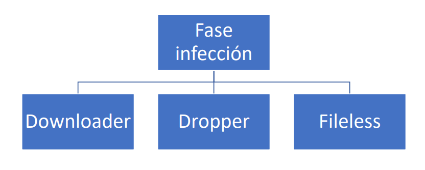

**A) DOWNLOADER:**
Es la técnica más básica y menos sofisticada. Su única misión es descargar e instalar el verdadero malware que sí realizará dichas acciones maliciosas. Esta técnica permite ocultar el malware real, exponiendo un sencillo programa no
malicioso que puede ser rápidamente realojado o sustituido en caso de detección.


**B) DROPPER:**
El comportamiento en muchos sentidos es similar al del Downloader. Sirven de punta de lanza para encubrir al verdadero malware. La diferencia fundamental es que el **Dropper contiene en sí mismo al malware y no necesita conexión a la red para instalar y ceder el control al componente maligno.**

Para evitar que los antivirus detecten el malware que lleva dentro de sí mismo, suelen emplear **técnicas de ofuscación o cifrado** de dichas partes.

Son una especie de envoltorio que cubre al malware real sirviéndoles de pantalla protectora.

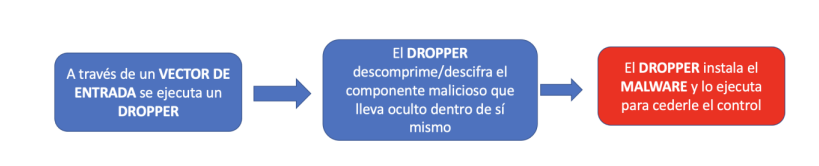

**C) FILELESS:**

Es malware que no deja (o deja muy poca) huella en disco. En vez de guardar un ejecutable malicioso tradicional en el sistema de archivos, vive en memoria (RAM) y/o usa herramientas legítimas del propio sistema operativo para realizar acciones maliciosas. Así esquiva dos cosas que los antivirus clásicos miran mucho:
- Acceso a disco (crear/leer/escribir/borrar archivos).
- Firmas de archivos (huellas únicas de binarios concretos).

Podemos pensar que sería como un intruso que no hace copia de las llaves ni rompe la cerradura: se cuela por una puerta ya abierta y camina como si fuera personal autorizado.

El fileless no es magia, es estrategia: usa lo que ya existe en el sistema y se mueve en memoria para evadir firmas y acceso a disco, obligando a defender con telemetría, comportamiento y hardening, no solo con firmas.

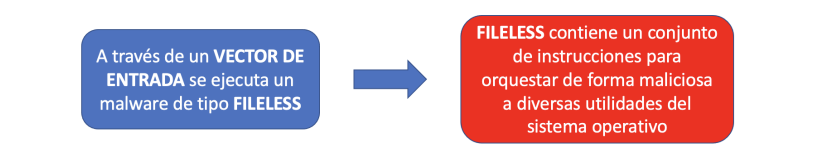


### 1.5.2 Fase de persistencia
La persistencia es el conjunto de técnicas que permiten que el malware siga ejecutándose aunque el equipo se reinicie, el usuario cierre sesión o un antivirus mate el proceso inicial. En otras palabras: que vuelva una y otra vez.

La persistencia es el “ancla” del atacante: usa mecanismos legítimos del sistema o del entorno (incluida la nube) para re-ejecutar su código tras reinicios y limpiezas. Para pararla, telemetría + baseline + hardening + control de identidades superan a las firmas por sí solas.

Otro aspecto necesario para el malware es su configuración. El malware va a ejecutar acciones maliciosas en el sistema, pero necesita que éstas le sean comunicadas a través de un canal encubierto para que nadie pueda fisgar o descubrir su actividad. 

Finalmente, el malware no se conforma con los permisos ordinarios de un usuario normal del sistema. Intentará escalar privilegios para obtener más permisos y derechos en el sistema.

Hay tres acciones prioritarias para el malware una vez entra en el sistema:
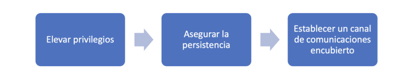


**Métodos de Persistencia:**
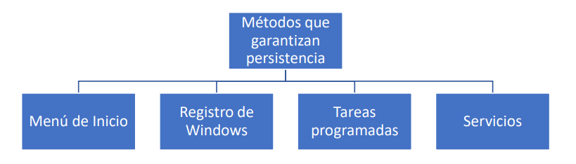


**A) Menú de Inicio:**
La carpeta de “inicio” del sistema operativo Windows es un método clásico y sencillo para indicarle al sistema que ejecute las aplicaciones allí incluidas.

**B) Registro de windows:**
El registro de Windows es una base de datos dispersa en varios archivos a lo largo del sistema. Sirve para alojar parámetros de configuración del sistema y de las aplicaciones. 

Existen claves del registro de Windows que le indican al sistema qué aplicaciones debe arrancar al iniciarse. Por supuesto, el malware emplea este tipo de claves del registro para anotar su localización y hacer que el sistema ejecute el malware al inicio.


**C) Tareas programadas:**
Los sistemas operativos poseen un servicio para que ciertas tareas se ejecuten cada cierto tiempo. Existen varios tipos de programas y servicios que permiten implementar este tipo de tareas programadas en sistemas Microsoft Windows.


**D) Servicios del Sistema:**
Un servicio es un proceso que típicamente no posee interfaz, se ejecuta en segundo plano y sirve de apoyo al resto de programas o al propio sistema operativo. Tradicionalmente, en el mundo UNIX se les denomina daemons. 

Un servicio también puede ser visto como una aplicación especial (por su forma de ejecutarse). El malware aprovecha esta característica para instalar un servicio que le indique al sistema operativo que ejecute el malware si éste no está ya en marcha.


### 1.5.3 Fase de comunicación
El malware necesita comunicarse con el mundo exterior por diferentes razones: exfiltrar información, escuchar las órdenes de sus creadores u obtener la configuración inicial, entre otras. Es raro que un malware no posea algún tipo de comunicación con el exterior en algunas de las formas disponibles.

Dado que el intercambio de información genera señales o ruido, esto es percibido por los analistas de malware que pueden llegar a identificar una campaña de malware solo con observar tráfico entre servidores o la resolución de ciertos
dominios.

**Clases de canales que puede utilizar el malware para comunicarse:**
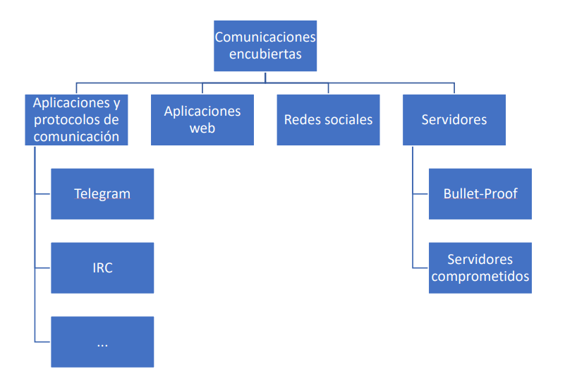

**A) Canales de aplicaciones y protocolos de comunicación:** Los servidores IRC. Telegram. Cualquier aplicación o protocolo de intercambio de mensajes.

**B) Canales usando aplicaciones web:** pastebin.com 

**C) Canales usan redes sociales:** Twitter, Facebook, etc., Se envían órdenes a través de la publicación de entradas. Los comandos, órdenes o configuraciones no son publicados directamente, sino que son ofuscados, cifrados o introducidos en imágenes (esteganografía).

**D) Canales usando servidores:** Servidores Web. Servidores FTP. Existen dos tipos principales: los bullet-proof y los servidores comprometidos. Estos últimos son servidores comprometidos, bajo el control de un atacante o cibercriminal, pero sin el consentimiento y conocimiento de sus propietarios. Los servidores bullet-proof son alojados en redes y/o países con una legislación más laxa en materia de cibercrimen que dificulta el cierre y persecución de las infraestructuras utilizadas por el malware.


### 1.5.4 Fase de desencadenamiento
Finalmente, el malware despliega la verdadera amenaza que posee incubada en su interior. La finalidad puede ser de índole muy diversa: intereses políticos, económicos, espionaje, ideológicos, terrorismo, etc.
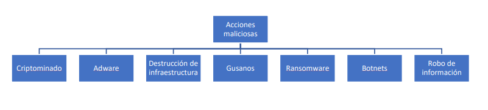


**A) Criptominado:** Los cibercriminales secuestran capacidad de cómputo a los sistemas infectados.

**B) Adware:** La motivación principal es la inyección de publicidad y la manipulación de resultados del buscador para dirigir las visitas y visionados de anuncios a un determinado producto, sitio web o servicio. Además de los anuncios, las versiones más dañinas pueden suscribir a las víctimas a servicios de pago o SMS Premium; con lo que multiplican sus ingresos a costa de un mayor daño y exposición.

**C) Destrucción de infraestrucura:** Este tipo de malware busca pasar desapercibido y no tiene otro fin que el de maximizar la capacidad destructiva, empleando, por ejemplo, drivers que manipulen y evadan mecanismos de seguridad para sabotear componentes hardware. Suele ser usado para sabotear instalaciones o ralentizar la producción de un competidor. Un ejemplo muy claro de malware de sabotaje fue el gusano STUXNET, programado para destruir componentes de centrifugadoras de uranio en Irán.

**D) Gusanos:** Más que una finalidad es un comportamiento muy característico. El gusano explota una vulnerabilidad que no necesita de la interacción con el usuario, basta que encuentre un sistema vulnerable a la escucha. Su meta es replicarse lo más amplia y rápidamente posible. Para ello, va escaneando Internet o una red local para encontrar nuevos sistemas vulnerables y continuar su replicación. Ejemplos: ILOVEYOU, Melissa, Conficker, etc.

**E) Ransomware:** Cifra los documentos. Para rescatar los archivos cifrados, necesitamos una clave criptográfica que nos piden a cambio de una suma de dinero. Este método es equivalente a un secuestro a cambio de dinero, de ahí el término inglés “ransom”. La única arma definitiva para acabar con este tipo de extorsión es no pagar. 

**F) Bootnets:** Una botnet es una red de ordenadores infectados y sincronizados entre ellos para obedecer las órdenes y comandos de sus creadores. También es conocida como red de ordenadores zombies o nodos zombies. La finalidad de estos es múltiple, aunque una forma característica es la utilización de los nodos infectados como parte de operaciones de denegación de servicio. Algunas botnets minan criptomoneda, curiosean archivos o cámaras.

**G) Robo de información:** Por un lado, robar información intelectual o que permita a un competidor averiguar secretos; por otro lado, la extorsión a cambio de dinero si el cibercriminal encuentra información comprometedora para la víctima (fotos de índole intima, etc.). Una forma particular de este tipo de malware son los denominados RAT (remote administration tool). Un RAT es una herramienta que toma el control de un ordenador remoto. Existen RATs que son programas legítimos, por ejemplo, los usados para administración o soporte remoto.

___________________________________________________________________________________________
## 1.6 Elevación de Privilegios
Al elevar privilegios, el malware busca convertirse en un administrador del sistema. Cuando lo consigue, disfruta de plenos poderes y derechos sobre los recursos del sistema. Pasa de tener limitado su rango de acción a poder actuar sin
apenas restricciones.

Cuando se eleva privilegios en un sistema se hace a través de un **exploit** que aprovecha una vulnerabilidad o una técnica que permite aprovechar algún resquicio, por ejemplo, que la contraseña del administrador sea muy sencilla de adivinar.

A los exploits que permiten convertirse en administrador se les denomina **exploits de elevación de privilegios.**

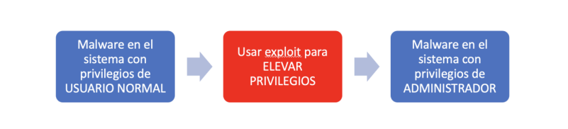

Es diferente el exploit que ha servido para infectar al sistema del exploit que se usa para conseguir mejores privilegios.

**Rootkits:** 
De las fases descritas anteriormente, la elevación entraría en la persistencia, puesto que una vez infectado el sistema, una elevación le permitiría privilegios para detener software de detección o utilizar técnicas rootkits para pasar desapercibido a los ojos de cualquier usuario del sistema e incluso administradores.

Además, con privilegios suficientes, se puede lograr lograr persistencia incluso infectando los procesos de arranque y estar presente antes incluso de la carga del núcleo del sistema.

Los rootkit interceptan las llamadas al sistema interponiéndose y ajustando la salida a su conveniencia. Por ejemplo, hacer un "ls" en un sistema infectado por un rootkit permite a éste mostrar todos los archivos habituales a excepción de los
maliciosos. Lo mismo con el tráfico de red o cualquier otro intento de desenmascarar al malware en el sistema.

___________________________________________________________________________________________
## 1.7 La importancia de la ingeniería social en la difusión del malware

Lo habitual es tirar de ingeniería social, ya sea spear phishing (orientado a una víctima o grupo particular) o phishing común (sin orientación alguna, genérico). Es un método relativamente barato y eficaz. 


___________________________________________________________________________________________
## 1.8 Tipos de malware más comunes
Algunos de ellos se categorizan según su funcionalidad y vectores de ataque, como se describe a continuación:
- **Virus:**  
Programa malicioso que se adjunta a un archivo legítimo y se propaga cuando se ejecuta el archivo infectado. Causa variedad de daños, como la eliminación de archivos, el robo de información o el bloqueo del sistema. Este Malware es capaz de copiarse a sí mismo y propagarse a otros ordenadores. Un virus necesita intervención del usuario, mientras que un gusano puede propagarse sin ella.

- **Gusano:**  
Son programas maliciosos que se propagan a través de redes y sistemas informáticos. Los gusanos pueden causar una sobrecarga en la red y ralentizar el rendimiento del sistema.

- **Troyano:**  
Malware que se disfraza de programa legítimo para engañar al usuario y que lo instale. Una vez instalado, puede realizar acciones maliciosas como robar datos sensibles, subir archivos al servidor del atacante o espiar a través de la webcam.

- **Backdoor / Remote Access Trojan (RAT) | Puerta trasera / Troyano de acceso remoto (RAT):**  
Tipo de troyano que permite al atacante acceder y ejecutar comandos en el sistema comprometido.

- **Adware:**  
Malware que muestra anuncios no deseados al usuario. Suele distribuirse junto con descargas gratuitas e incluso puede instalar software de manera forzada.

- **Botnet:**  
Conjunto de ordenadores infectados con el mismo malware (llamado bots), que esperan instrucciones del servidor de comando y control controlado por el atacante. El atacante puede ordenar a estos bots que realicen actividades maliciosas como ataques DDoS o envío masivo de spam.

- **Ladrón de información (Information stealer):**  
Malware diseñado para robar datos sensibles como credenciales bancarias o pulsaciones del teclado. Algunos ejemplos son los keyloggers, spyware, sniffers y form grabbers.

- **Ransomware:**  
Malware que mantiene el sistema como rehén, bloqueando el acceso al ordenador o cifrando los archivos del usuario y exigiendo un rescate para recuperarlos.

- **Rootkit:**  
Malware que otorga al atacante acceso privilegiado al sistema infectado y oculta su presencia o la de otros programas maliciosos. Los rootkits pueden permitir a los atacantes controlar el sistema y recopilar información sin ser detectados.

- **Downloader o Dropper:**  
Malware diseñado para descargar o instalar componentes maliciosos adicionales en el sistema.


__________________________________________________________________________
# 2. Descripción general de la arquitectura del laboratorio
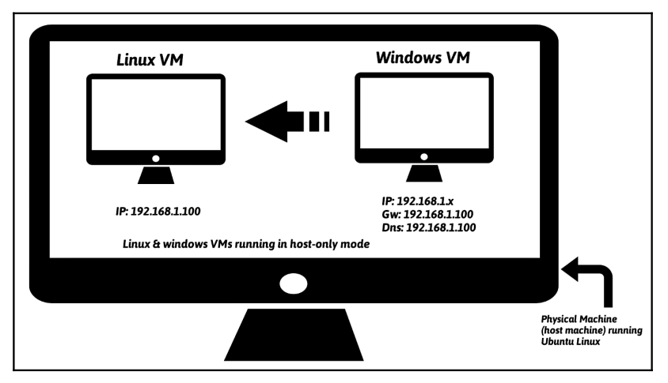

La arquitectura usada consiste en una **máquina física (llamada máquina host) que ejecuta Ubuntu Linux con instancias de máquina virtual Linux (Ubuntu Linux VM) y máquina virtual Windows (Windows VM)**. Estas máquinas virtuales se configurarán para ser parte de la misma red y utilizarán el modo de **configuración de red de Host-only** para que el malware no pueda comunicarse con Internet y así el tráfico de la red estará contenido en el entorno de laboratorio aislado.

La VM de Windows es donde se ejecutará el malware durante el análisis, y la VM de Linux se usará para monitorear el tráfico de red y será configurada para simular servicios de Internet (DNS, HTTP, etc.), para proporcionar una respuesta adecuada cuando el malware solicite estos servicios. Por ejemplo, la máquina virtual Linux se configurará de manera que cuando el malware solicite un servicio como DNS, la máquina virtual Linux proporcione la respuesta DNS adecuada. 

En esta configuración, la máquina virtual Linux estará preconfigurada en la dirección IP 192.168.1.100 y la dirección IP de la máquina virtual Windows se configurará en 192.168.1.x (donde x es cualquier número de 1 a 254 excepto 100). La puerta de enlace predeterminada y el DNS de la VM de Windows se configurarán en la dirección IP de la VM de Linux (es decir, 192.168.1.100) para que todo el tráfico de la red de Windows se enrute a través de la VM de Linux.

También es posible configurar un laboratorio compuesto por múltiples VMs ejecutando diferentes versiones de Windows; esto nos permitirá analizar la muestra de malware en varias versiones de sistemas operativos Windows.
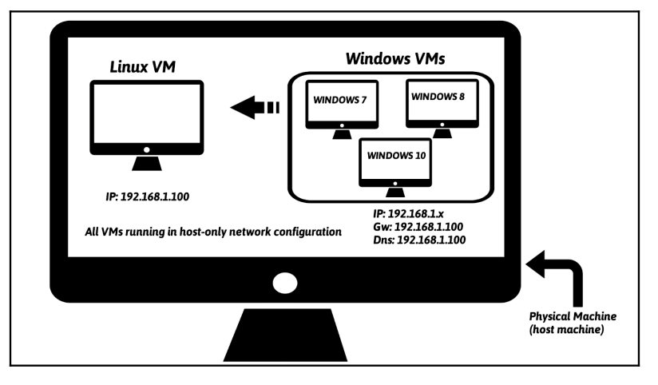


# 3. Configuración de las VMs
- Instalación de MV Ubuntu & MV Windows.
- Instalación de Virtual Guest Additions software en ambas VMs.
  
## 3.1 Configuración de Windows VM
- Deshabilitamos Windows Update.
- Deshabilitamos Windows Defender →  Services → Windows Defender → Boton derecho →  Select properties →  Stop Service
- Mostrar extensiones de ficheros → Opciones de carpeta → Ver →  Mostrar extensiones para ficheros
- Mostrar ficheros y carpetas ocultos.
- Deshabilitamos ASLR (Address Space Layout Randomization): ASLR (Address Space Layout Randomization) es una técnica de seguridad utilizada para dificultar los ataques de desbordamiento de búfer (buffer overflow) y otras vulnerabilidades de corrupción de memoria. La idea principal de ASLR es ubicar aleatoriamente en el espacio de direcciones de memoria las áreas clave de un proceso, como el ejecutable base, la pila, el montón y las librerías cargadas. Esto hace que las direcciones de memoria sean impredecibles para un atacante, dificultando la ejecución de código malicioso.
    →  Windows + R →  regedit → Computer\HKEY_LOCAL_MACHINE\SISTEM\CurrentSet\Control\Session Manager\Memory Management →  New Key → QWORD (32 bits) → poner como nombre: MoveImages
- Deshabilitamos Firewall → Windows Defender Firewall.
- Creamos un snapshot → HOST + T

- Instalamos Flare VM: Es una colección de scripts de instalación de software para sistemas Windows que permite configurar y mantener fácilmente un entorno de ingeniería inversa y análisis de malware en una máquina virtual.Las principales características de FLARE VM son:
  - Proporciona un conjunto de herramientas expertas para ingeniería inversa, análisis de malware, monitoreo, depuración, desensamblado, descompilación y más, todas preinstaladas y configuradas. Algunas herramientas incluidas son IDA, Binary Ninja, Radare2, OllyDbg, x64dbg, Ghidra, entre otras. (https://github.com/dnSpy/dnSpy)
  - Utiliza Chocolatey (un administrador de paquetes para Windows) y Boxstarter para automatizar la instalación y configuración de las herramientas en un entorno Windows virtualizado.
  - Está diseñado para instalarse únicamente en una máquina virtual Windows, no en un host físico, para permitir un análisis de malware seguro y contenido.
  - Proporciona un proceso de instalación, actualización y desinstalación simplificado a través de scripts de PowerShell.
  - Permite personalizar fácilmente las herramientas a instalar a través de una interfaz gráfica de usuario.
  - Es un proyecto de código abierto mantenido por el equipo FLARE de Mandiant/FireEye, con contribuciones de la comunidad.
  - Enlace: https://github.com/mandiant/flare-vm
  - Video con instruciones para instalar: https://www.youtube.com/watch?v=i8dCyy8WMKY
  - Desactivamos: Windows Defender through Group Policy:
    - gpedit.msc
    - En el Editor de Directiva de Grupo, navegue a la siguiente ruta: Computer Configuration > Administrative Templates > Windows Components > Windows Defender Antivirus
    - Buscamos la configuración "Turn off Windows Defender Antivirus" (o "Desactivar Antivirus Windows Defender" en español).
    - Hacemos doble clic en ella para editarla.
    - Seleccionamos "Enabled" (Habilitado) y hacemos clic en "Apply" (Aplicar) y luego en "OK".
    - Cerramos el Editor de Directiva de Grupo Local.
  - Computer Configuration > Administrative Templates > Windows Components > Microsoft Defender Antivirus > Real-time Protection > Enable Turn off real-time protection
  - Instalación: Desde la carpeta del master, ejecutamos con PowerShell como administrador:
    - Set-ExecutionPolicy unrestricted
    - Si falla: Set-ExecutionPolicy -Scope      CurrentUser
      - unresticted
      - ./

- Descargamos Python desde https://www.python.org/downloads/.

- Configuramos la máquina virtual de Windows para que funcione en modo de red solo-anfitrión (Host-only).

- Configuramos la dirección IP de la máquina virtual de Windows como 192.168.1.x (elegimos cualquier dirección IP excepto 192.168.1.100, ya que esa la usará la máquina virtual con Linux) y establecemos la puerta de enlace predeterminada y el servidor DNS a la dirección IP de la máquina virtual con Linux (es decir, 192.168.1.100).

- Nos aseguramos de que ambas máquinas puedan comunicarse entre sí. Comprobamos la conectividad ejecutando el comando ping.

- Para desactivar Windows Defender:
  - Abrimos el Editor de directivas de grupo local.
  - En el panel izquierdo, navegamos hasta: Configuración del equipo | Plantillas administrativas | Componentes de Windows | Windows Defender.
  - En el panel derecho, hacemos doble clic en la directiva Desactivar Windows Defender para editarla.
  - Seleccionamos Habilitada y haz clic en Aceptar.
 

## 3.2 Configuración de Linux VM:
- Instalación:
  ```
  sudo apt-get install python-pip
  pip install --upgrade pip
  sudo apt-get install python-magic
  sudo apt-get install upx
  sudo pip install pefile
  sudo apt-get install yara
  sudo pip install yara-python
  sudo apt-get install ssdeep
  sudo apt-get install build-essential libffi-dev python python-dev libfuzzy-dev
  sudo pip install ssdeep
  sudo apt-get install wireshark
  sudo apt-get install tshark
  ```
- INetSim (http://www.inetsim.org/index.html) es una herramienta potente que permite simular varios servicios de Internet (como DNS y HTTP). Emula servicios típicos de Internet dentro de una red controlada o aislada (como una sandbox). Esto permite ver cómo se comporta un malware cuando intenta comunicarse con servidores externos, sin que el malware realmente acceda a Internet:
  ```
  sudo su
  echo "deb http://www.inetsim.org/debian/ binary/" >  /etc/apt/sources.list.d/inetsim.list
  wget -O - http://www.inetsim.org/inetsim-archive-signing-key.asc | apt-key add -
  apt update
  apt-get install inetsim
  ```
  
- Ahora podemos aislar la máquina virtual de Ubuntu dentro del laboratorio configurando el modo de red "Solo-anfitrión" (Host-only) en el dispositivo virtual. Es importante aislar la máquina virtual del acceso a Internet real, para evitar que el malware cause daños o se comunique con atacantes reales. El modo de red Host-only en VMware:
    - Crea una red cerrada entre tu máquina real (host) y la máquina virtual (VM).
    - No permite acceso a Internet ni a otras redes, solo comunicación directa entre host y VM.
    - Es ideal para entornos de prueba o análisis seguro.
  
- IP address of 192.168.1.100 to the Ubuntu Linux VM.
  
- Configurar INetSim para que pueda escuchar y simular todos los servicios en la ip 192.168.1.100:
  ```
  sudo gedit /etc/inetsim/inetsim.conf
  # service_bind_address
  #
  # IP address to bind services to
  #
  # Syntax: service_bind_address <IP address>
  #
  # Default: 127.0.0.1
  #
  #service_bind_address 10.10.10.1
  service_bind_address 192.168.1.100
  #
  #dns_default_ip 10.10.10.1
  dns_default_ip 192.168.1.100
  ```
- Arrancar INetSim:
  ```
  sudo inetsim
  ```
- Hacemos una snapshot | instantánea: En VirtualBox, se puede hacer haciendo clic en Máquina | Tomar instantánea. → Host + T


# 4. Otra posible configuración para las MV

## 4.1 Configuración Virtual Box

- Instalamos una MV Windows10 Pro y una MV Remnux.
- Instalamos Virtual guest addition.
- Cambiamos a una configuración de red tipo 10.0.0.0/24 para evitar posibles saltos a redes usuales como 192.168.X.X. Actualmente en Virtual box sólo se pueden crear redes del rango 192.168.57.... Para crear una red del rango 10.0.0.0/24, tenemos que habilitarlo en el fichero de configuración de redes:
```
sudo nano /etc/vbox/networks.conf

Añadimos:
* 10.0.0.0/24
```

- Creamos en línea de comandos una red hostonly:
```
sudo VBoxManage hostonlyif create
```
El comando anterior, genera una nueva red y nos indica su nombre, por ejemplo vboxnet1.

- Especificamos el rango de la red:
```
sudo VBoxManage hostonlyif ipconfig vboxnet1 --ip 10.0.0.1 --netmask 255.255.255.0
```

- Cerramos y abrimos VirtualBox para que actualice este cambio.

- En virtualbox, Vamos a la configuración de redes: Red vboxnet1 --> Configuración de la red:
```
Direccion IPv4: 10.0.0.1
máscara de red: 255.255.255.0
```
- Vamos a la configuración de redes: Red vboxnet1 --> Servidor DHCP:
```
Dirección del Servidor: 10.0.0.2
Máscara de red: 255.255.255.0
Limite inferior: 10.0.0.3
Límite superior: 10.0.0.254
```
- Verificamos que la VM WIN y la WM Linux tiene sólo un adaptador de red activo: Red vboxnet1


## 4.2 Máquina virtual Remnux

```
ip: 10.0.0.3/24
Configuración inetsim:
nano /etc/inetsim/inetsim.conf
service_bind_address 0.0.0.0
dns_default_ip       10.0.0.3

Ejecutar inetsim.
```

## 4.3 Máquina Virtual WIN
```
ip: 10.0.0.4/24
Download Windows Terminal:
Download the VCLibs package. In a PowerShell window, run: wget https://aka.ms/Microsoft.VCLibs.x64.14.00.Desktop.appx -usebasicparsing -o VCLibs.appx
Download the Windows Terminal MSIX bundle from the provided link: wget https://github.com/microsoft/terminal/releases/download/v1.15.3465.0/Microsoft.WindowsTerminal_Win10_1.15.3465.0_8wekyb3d8bbwe.msixbundle -UseBasicParsing -o winterminal.msixbundle
In a PowerShell admin window, add the VCLibs package: Add-AppxPackage [C:\path\to\downloaded\VCLibs.appx]
In a PowerShell admin window, run: Add-AppxPackage [C:\path\to\downloaded\winterminal.msixbundle]

(Optional) Pin Windows Terminal to the task bar

Disable proxy auto detect setting:
In the Windows search bar, search “proxy settings”,
Switch "Automatically detect settings" button off

Disable Tamper Protection
Search "Defender", open Defender settings and set all Defender Settings to off

Disable AV/Defender in GPO
Si tenemos Windows10 Home y gpedit.msc no está instalado:
- cmd ejecutar como administrador
- FOR %F IN ("%SystemRoot%\servicing\Packages\Microsoft-Windows-GroupPolicy-ClientTools-Package~*.mum") DO ( DISM /Online /NoRestart /Add-Package:"%F" )
- FOR %F IN ("%SystemRoot%\servicing\Packages\Microsoft-Windows-GroupPolicy-ClientExtensions-Package~*.mum") DO ( DISM /Online /NoRestart /Add-Package:"%F" )
- Windows+r --> gpedit.msc

In Windows search bar, search "group policy"
In GPO, navigate to → Administrative Templates → Windows Components → Microsoft Defender Antivirus → Enable “Turn off Microsoft Defender Antivirus”
Disable Windows Firewall
GPO → Administrative Templates → Network → Network Connections → Windows Defender Firewall → Domain Profile → Disable “Protect All Network Connections”
Do the same but for the Standard profile


TAKE A SNAPSHOT!

Download and install FLARE-VM:
In PowerShell Admin prompt, run: (New-Object net.webclient).DownloadFile('https://raw.githubusercontent.com/mandiant/flare-vm/main/install.ps1',"$([Environment]::GetFolderPath("Desktop"))\install.ps1")
Change directories to the Desktop

Run: Unblock-File .\install.ps1
Run: Set-ExecutionPolicy Unrestricted
Accept the prompt to set the ExecPol to unrestricted if one appears
Run: .\install.ps1 -customConfig https://raw.githubusercontent.com/HuskyHacks/PMAT-labs/main/config.xml
Follow the rest of the prompts and continue with the installation.

Configuración del adaptador de ip IPV/4:
Usar la siguiente dirección del servidor de DNS: 10.0.0.3


When the installation is done, TAKE ANOTHER SNAPSHOT!
```

Comprobar que todas las máquinas se ven con pings.
comprobar que la MV Win, si accede a una web o recurso, recibe respuesta de inetsim.


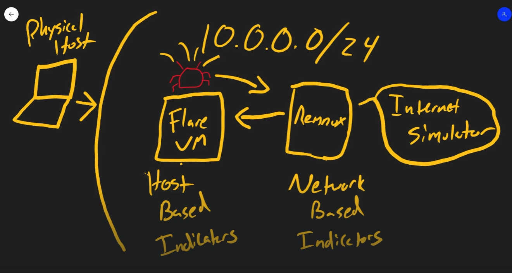

## 4.4 INetSim

**INetSim —Internet Services Simulation Suite—** es una herramienta diseñada para simular servicios habituales de Internet dentro de una red controlada. Se utiliza principalmente en laboratorios de análisis dinámico de malware para responder a las solicitudes de red realizadas por una muestra sin permitir que esta se comunique con servidores reales.

INetSim puede emular servicios como:

* DNS.
* HTTP y HTTPS.
* FTP.
* SMTP.
* POP3.
* IRC.
* NTP.
* Finger.
* TFTP.

Cuando el malware intenta resolver un dominio, acceder a una página web, descargar un archivo o conectarse con un servidor de mando y control, INetSim genera una respuesta simulada. Esto permite observar el comportamiento de red de la muestra, identificar dominios, URL, protocolos, puertos y patrones de comunicación sin exponer el laboratorio a Internet.

> [!IMPORTANT]
> INetSim no debe utilizarse como sustituto del aislamiento de red. Las máquinas virtuales del laboratorio deben mantenerse en una red interna o **Host-Only**, sin adaptadores NAT o puente que permitan una salida accidental a Internet.

### Arquitectura utilizada

En esta configuración, INetSim se ejecuta en la máquina virtual REMnux:

```text
REMnux / INetSim
Dirección IP: 10.0.0.3
Máscara:      255.255.255.0
Red:          10.0.0.0/24
```

La máquina virtual Windows, en la que se ejecutará la muestra de malware, tendrá una configuración similar a la siguiente:

```text
Windows / FLARE-VM
Dirección IP: 10.0.0.4
Máscara:      255.255.255.0
Servidor DNS: 10.0.0.3
```

La dirección DNS de Windows debe apuntar a `10.0.0.3`, ya que INetSim responderá a las consultas DNS realizadas por el malware y redirigirá los dominios solicitados hacia la propia máquina REMnux.

El esquema de comunicación será el siguiente:

```text
Malware en Windows
        │
        │ Solicitud DNS, HTTP, HTTPS, FTP, etc.
        ▼
REMnux — 10.0.0.3
        │
        └── INetSim genera una respuesta simulada
```

### Archivo de configuración

El archivo principal de configuración se encuentra en:

```bash
/etc/inetsim/inetsim.conf
```

Editamos el archivo de configuración mediante el siguiente comando:

```bash
sudo nano /etc/inetsim/inetsim.conf
```

Topología recomendada:
```
Red interna: 10.0.0.0/24

REMnux
├── IP:      10.0.0.3
└── INetSim: escucha en 0.0.0.0 y es accesible desde FLARE-VM mediante 10.0.0.3

FLARE-VM
├── IP:      10.0.0.4
└── DNS:     10.0.0.3
```


Los parámetros principales que deben configurarse son:

```ini
service_bind_address 0.0.0.0
dns_default_ip       10.0.0.3
```

Flujo:
```ini
FLARE-VM: 10.0.0.4
        │
        │ DNS, HTTP, HTTPS, FTP...
        ▼
REMnux: 10.0.0.3
INetSim escuchando en 0.0.0.0
```


INetSim escucha en todas las direcciones IPv4 disponibles en REMnux. Pero, como la única interfaz de red accesible por otras máquinas es la interfaz interna `10.0.0.3`, en la práctica FLARE-VM accederá a INetSim mediante esa dirección. La documentación define `service_bind_address` precisamente como la dirección IP a la que se vinculan los servicios de `INetSim`.


La directiva `dns_default_ip` determina la dirección IP que INetSim devolverá cuando reciba una consulta DNS:

```ini
dns_default_ip 10.0.0.3
```

De esta forma, cualquier dominio solicitado por el malware resolverá hacia la máquina REMnux. Por ejemplo:

```text
servidor-malicioso.example → 10.0.0.3
actualizacion-falsa.example → 10.0.0.3
```

Esto provoca que las conexiones posteriores del malware sean recibidas por los servicios simulados de INetSim.


### Configuración recomendada

La configuración mínima para este laboratorio será:

```ini
############################################################
# Configuración de red
############################################################

service_bind_address 0.0.0.0
dns_default_ip       10.0.0.3
```

Para comprobar que la dirección IP está correctamente asignada a REMnux puede utilizarse:

```bash
ip addr
```

También debe verificarse que INetSim puede utilizar los puertos necesarios y que no existen otros servicios ocupándolos:

```bash
sudo ss -lntup
```

### Inicio de INetSim

INetSim debe ejecutarse con privilegios de administrador, ya que algunos de los servicios simulados utilizan puertos inferiores al `1024`.

```bash
sudo inetsim
```

Al iniciarse, la terminal mostrará los servicios habilitados y las direcciones en las que están escuchando.

Para detener INetSim se puede utilizar:

```text
Ctrl + C
```

### Comprobación desde Windows

Antes de ejecutar una muestra de malware debe comprobarse la comunicación entre Windows y REMnux.

Primero, se verificamos la conectividad:

```powershell
ping 10.0.0.3
```

Después, comprobamos la resolución DNS:

```powershell
nslookup ejemplo.com
```

La respuesta debería devolver la dirección de REMnux:

```text
Name:    ejemplo.com
Address: 10.0.0.3
```

También podemos comprobar el servicio HTTP mediante PowerShell:

```powershell
Invoke-WebRequest http://ejemplo.com
```

Otra opción consiste en abrir un navegador dentro de la máquina Windows y acceder a una dirección HTTP:

```text
http://ejemplo.com
```

Si la configuración es correcta, la solicitud será contestada por INetSim y no por el servidor real asociado al dominio.

> [!TIP]
> Para las pruebas iniciales se recomienda utilizar HTTP. El tráfico HTTPS puede generar advertencias relacionadas con certificados, ya que INetSim utiliza certificados simulados que no son de confianza para Windows.

### Registros generados

INetSim almacena información sobre las conexiones recibidas, las consultas DNS y los servicios utilizados. De forma predeterminada, los informes y registros pueden encontrarse en directorios como:

```text
/var/log/inetsim/
/var/log/inetsim/report/
/var/log/inetsim/service/
```

Estos registros permiten identificar:

* Dominios consultados.
* Direcciones IP solicitadas.
* URL visitadas.
* Métodos HTTP utilizados.
* Cabeceras HTTP.
* Archivos solicitados.
* Credenciales enviadas mediante protocolos sin cifrar.
* Puertos y servicios utilizados.
* Fecha y hora de cada comunicación.

Durante el análisis también es recomendable capturar el tráfico con Wireshark o `tcpdump`:

```bash
sudo tcpdump -i any -w captura-inetsim.pcap
```

La captura podrá analizarse posteriormente con Wireshark:

```bash
wireshark captura-inetsim.pcap
```

### Medidas de seguridad

Antes de ejecutar una muestra deben comprobarse las siguientes condiciones:

* Las máquinas Windows y REMnux solamente tienen activo el adaptador de la red aislada.
* No existen adaptadores configurados en modo NAT o puente.
* Windows utiliza `10.0.0.3` como servidor DNS.
* INetSim está configurado con `service_bind_address 0.0.0.0` y REMnux solo tiene activo el adaptador de la red interna.
* La resolución DNS devuelve `10.0.0.3`.
* Se ha creado una instantánea limpia de las máquinas virtuales.
* No existen carpetas compartidas, portapapeles compartido ni funciones de arrastrar y soltar.
* El host no contiene información sensible accesible desde la red del laboratorio.

> [!WARNING]
> Aunque INetSim simula numerosos servicios de Internet, no reproduce necesariamente el comportamiento exacto del servidor de mando y control esperado por el malware. Una muestra puede rechazar la respuesta si comprueba certificados, cabeceras, formatos de datos, claves criptográficas o contenidos específicos del servidor real. Aun así, las solicitudes registradas permiten obtener indicadores relevantes sobre su comportamiento de red.


## Interacciones según los modos de red
Cómo interactúan las MVs con el Host físco que las contiene:
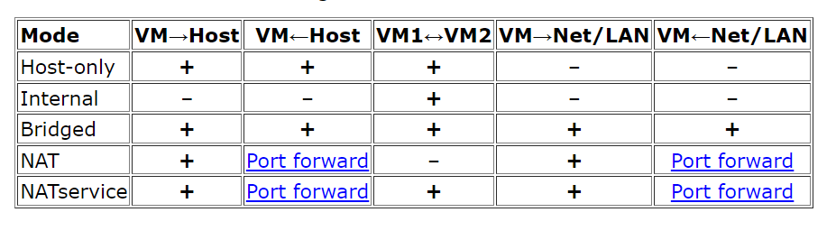

**El modo de red Host-Only en entornos virtualizados permite la comunicación únicamente entre las máquinas virtuales y el host físico, sin acceso a internet ni a otras máquinas de la LAN. Sin embargo, Host-Only permite la comunicación entre la VM infectada y el host**. Es por ello que este modo no es totalmente seguro para análisis de malware si el host contiene datos valiosos o está desprotegido.

Aunque **con Host-Only se evita que el malware salga a internet o ataque otros dispositivos de la red corporativa**, la posibilidad de comunicación directa con el host representa un riesgo: si el malware logra aprovechar vulnerabilidades presentes en el sistema de virtualización o en el propio host, podría salir del entorno controlado y comprometer el host físico. Históricamente han existido exploits (vulnerabilidades de escape de VM) que permiten a malware salir de la máquina virtual y ejecutar código en el host, aunque estos no son triviales ni comunes en entornos bien actualizados.

Por tanto, Host-Only **aporta un nivel de aislamiento, pero no garantiza seguridad absoluta**. En buenas prácticas de análisis de malware, se recomienda además:
- Usar instantáneas para restaurar el estado limpio de la VM rápidamente.
- Mantener el host lo más aislado posible y sin información sensible.
- Aplicar actualizaciones de seguridad tanto al host como al software de virtualización.
- Considerar el uso de entornos totalmente desconectados (“air-gapped”) para análisis de malware de riesgo elevado.
- Cifrar discos duros para que no tengan acceso entre ellos para aislar plenamente el disco que tenga las funciones de lab.


-----


# 5. Seguridad de red en un laboratorio de análisis de malware

## 5.1. Introducción

La configuración de red es uno de los elementos más críticos de un laboratorio de análisis dinámico de malware. Su objetivo no es eliminar por completo el riesgo —algo que no puede garantizarse—, sino **reducirlo, contenerlo y comprobar de forma objetiva que el entorno se encuentra aislado antes de ejecutar una muestra**.

En un laboratorio compuesto por una máquina Windows con FLARE-VM y una máquina Linux con REMnux, ambas máquinas virtuales deben poder comunicarse entre sí para intercambiar tráfico de análisis. Al mismo tiempo, debe impedirse que:

- la muestra acceda a Internet;
- se comunique con una infraestructura real de mando y control;
- alcance otros dispositivos de la red local;
- establezca conexiones con el equipo físico anfitrión;
- aproveche servicios compartidos innecesarios del hipervisor.

Una cuestión habitual es la siguiente:

> Si una red **Host-Only** permite la comunicación entre las máquinas virtuales y el equipo físico anfitrión, ¿puede considerarse suficientemente segura para analizar malware?

La respuesta depende del nivel de riesgo de la muestra, de la configuración del hipervisor y de las medidas de contención adicionales. Una red Host-Only puede ser adecuada para laboratorios formativos y muestras controladas, pero **no proporciona el mismo grado de separación que una red interna**.

> [!WARNING]
> Ningún modo de red convierte por sí solo un laboratorio en un entorno completamente seguro. La seguridad depende del conjunto de controles aplicados: aislamiento de red, firewall, instantáneas, ausencia de recursos compartidos, actualización del hipervisor y verificación previa de la conectividad.

---

## 5.2. Comparación entre Host-Only y Red interna

| Característica | Host-Only | Red interna |
|---|---:|---:|
| Comunicación entre máquinas virtuales | Sí | Sí |
| Comunicación de las VM con el host | Posible | No, de forma predeterminada |
| Acceso directo a Internet | No, salvo configuración adicional | No |
| Dependencia del firewall del host | Sí, parcialmente | No |
| Facilidad de administración desde el host | Alta | Menor |
| Nivel de aislamiento | Medio | Alto |
| Uso recomendado | Formación y muestras controladas | Análisis con mayor exigencia de contención |

### 5.2.1. Red Host-Only

Una red Host-Only crea un segmento privado entre el host físico y las máquinas virtuales. Las VM no tienen acceso directo a Internet ni a la LAN externa, salvo que se habiliten mecanismos adicionales de enrutamiento o compartición.

Su principal limitación es que el host participa en el mismo segmento virtual. Por tanto:

- el host puede comunicarse con las VM;
- las VM pueden intentar comunicarse con la interfaz Host-Only del host;
- el aislamiento depende, en parte, del firewall y del endurecimiento del sistema anfitrión.

### 5.2.2. Red interna

Una red interna de VirtualBox permite la comunicación únicamente entre las máquinas virtuales asociadas al mismo nombre de red. El host físico no dispone de una interfaz dentro de ese segmento.

Esta configuración reduce la exposición del host porque:

- las VM no pueden dirigirse directamente a una interfaz del equipo físico;
- no es necesario depender del firewall del host para bloquear ese tráfico;
- el segmento permanece limitado al conmutador virtual interno del hipervisor.

> [!IMPORTANT]
> VirtualBox permite configurar varios adaptadores en una misma VM. Sin embargo, durante la detonación de malware debe permanecer activo **únicamente el adaptador de la red de análisis**. Mantener simultáneamente un adaptador NAT, puente o Host-Only puede invalidar el aislamiento.

---

## 5.3. Evaluación de seguridad de una red Host-Only

La seguridad de una configuración Host-Only debe comprobarse mediante pruebas, no asumirse.

### 5.3.1. Comunicación desde el host hacia FLARE-VM

En FLARE-VM se inicia un socket a la escucha en el puerto `80`:

```console
C:\Users\husky>ncat -nvlp 80
Ncat: Version 5.59BETA1 ( http://nmap.org/ncat )
Ncat: Listening on 0.0.0.0:80
```

Desde el equipo físico anfitrión se establece una conexión con FLARE-VM:

```console
PS C:\Users\Matt> ncat -nv 10.0.0.4 80
Ncat: Version 7.92 ( https://nmap.org/ncat )
Ncat: Connected to 10.0.0.4:80.
hello!
```

FLARE-VM recibe la conexión:

```console
C:\Users\husky>ncat -nvlp 80
Ncat: Version 5.59BETA1 ( http://nmap.org/ncat )
Ncat: Listening on 0.0.0.0:80
Ncat: Connection from 10.0.0.1:1343.
hello!
```

Este resultado confirma que el host puede iniciar conexiones hacia la máquina virtual a través de su interfaz Host-Only.

### 5.3.2. Comunicación desde FLARE-VM hacia el host

En el equipo físico se inicia un socket a la escucha:

```console
PS C:\Users\Matt> ncat.exe -nvlp 80
Ncat: Version 7.92 ( https://nmap.org/ncat )
Ncat: Listening on :::80
Ncat: Listening on 0.0.0.0:80
```

Desde FLARE-VM se intenta conectar con la dirección Host-Only del equipo físico:

```console
C:\Users\husky>ncat -nv 10.0.0.1 80
Ncat: Version 5.59BETA1 ( http://nmap.org/ncat )
Ncat: .
```

Cuando el firewall del host bloquea correctamente el tráfico entrante, la conexión no llega a establecerse.

> [!CAUTION]
> Este resultado no debe generalizarse. Puede variar según el sistema operativo, el perfil de red, las reglas del firewall, los servicios a la escucha y la configuración del hipervisor. Antes de ejecutar una muestra es obligatorio repetir la prueba desde el entorno real del laboratorio.

### 5.3.3. Interpretación del riesgo

Una red Host-Only evita normalmente que la VM acceda directamente a Internet, pero no elimina la relación de red entre la VM y el host. Por este motivo:

- puede ser suficiente para prácticas formativas y muestras seleccionadas;
- requiere mantener activo y correctamente configurado el firewall del host;
- no es la mejor opción para muestras desconocidas, agresivas o con capacidades de propagación;
- debe complementarse con otras medidas de aislamiento.

---

## 5.4. Consideraciones para hosts Linux y macOS

En un host Linux pueden utilizarse `nftables` o reglas compatibles con `iptables` para bloquear el tráfico procedente de la red virtual.

Ejemplo con `iptables`:

```bash
sudo iptables -A INPUT -s 10.0.0.0/24 -j DROP
```

En sistemas Linux actuales es habitual utilizar `nftables`:

```bash
sudo nft add rule inet filter input ip saddr 10.0.0.0/24 drop
```

En macOS, el firewall de filtrado de paquetes nativo es **PF**, no `iptables`. Una regla equivalente debe definirse mediante `pf.conf` y cargarse con `pfctl`.

> [!NOTE]
> Las reglas anteriores son ejemplos generales. Deben adaptarse a la interfaz, al rango de red y a la política de filtrado del equipo físico. Una regla mal aplicada puede bloquear servicios legítimos o dejar rutas no previstas.

Para reducir la dependencia del firewall del host, se recomienda utilizar una **red interna** cuando el nivel de riesgo de la muestra lo justifique.

---

## 5.5. Arquitectura recomendada con Red interna

La siguiente arquitectura proporciona un mayor grado de aislamiento:

```text
┌───────────────────────────────────────────────┐
│          Red interna de VirtualBox            │
│               10.0.0.0/24                     │
│                                               │
│   REMnux                        FLARE-VM      │
│   10.0.0.3                      10.0.0.4      │
│   INetSim                       Malware       │
│   DNS/HTTP/FTP/...              DNS: 10.0.0.3 │
└───────────────────────────────────────────────┘

El host físico no pertenece a esta red.
No existe salida directa a Internet.
```

Configuración propuesta:

| Sistema | Dirección IPv4 | Máscara | Puerta de enlace | DNS |
|---|---|---|---|---|
| REMnux | `10.0.0.3` | `/24` | Sin puerta de enlace real | Local o sin definir |
| FLARE-VM | `10.0.0.4` | `/24` | `10.0.0.3` únicamente si REMnux actúa como pasarela simulada | `10.0.0.3` |

> [!IMPORTANT]
> Para que FLARE-VM utilice INetSim en consultas DNS, basta con configurar `10.0.0.3` como servidor DNS. La puerta de enlace `10.0.0.3` solo resulta útil cuando REMnux se ha preparado expresamente para actuar como pasarela o interceptar tráfico dirigido a direcciones IP externas.

---

## 5.6. Configuración de la Red interna en VirtualBox

Las dos máquinas virtuales deben asociarse a la misma red interna.

### 5.6.1. REMnux

1. Apague la máquina virtual.
2. Abra **Configuración → Red**.
3. Active únicamente un adaptador.
4. En **Conectado a**, seleccione **Red interna**.
5. Introduzca el mismo nombre de red que se utilizará en FLARE-VM, por ejemplo:

   ```text
   pmat-internalnet
   ```

6. En **Modo promiscuo**, seleccione **Permitir máquinas virtuales** si se necesita capturar tráfico entre las VM.
7. Compruebe que no hay adaptadores NAT, puente ni Host-Only activos.

### 5.6.2. FLARE-VM

1. Apague la máquina virtual.
2. Abra **Configuración → Red**.
3. Active únicamente un adaptador.
4. En **Conectado a**, seleccione **Red interna**.
5. En **Nombre**, seleccione:

   ```text
   pmat-internalnet
   ```

6. En **Modo promiscuo**, seleccione **Permitir máquinas virtuales**.
7. Compruebe que no existen adaptadores adicionales activos.

---

## 5.7. Asignación de una IP estática a REMnux

La red interna no proporciona DHCP de forma predeterminada. Por tanto, REMnux necesita una dirección estática.

### 5.7.1. Identificar el nombre de la interfaz

Ejecute:

```bash
ip -br address
```

Ejemplo:

```console
lo       UNKNOWN        127.0.0.1/8 ::1/128
enp0s3   UP             10.0.0.3/24
```

El nombre de la interfaz puede ser distinto de `enp0s3`. Debe utilizarse el nombre que aparezca en el sistema.

### 5.7.2. Editar Netplan

Localice el archivo de configuración:

```bash
ls -l /etc/netplan/
```

Edite el archivo correspondiente:

```bash
sudo nano /etc/netplan/01-netcfg.yaml
```

Configuración recomendada:

```yaml
network:
  version: 2
  renderer: networkd
  ethernets:
    enp0s3:
      dhcp4: false
      addresses:
        - 10.0.0.3/24
      optional: true
```

No se define una puerta de enlace predeterminada porque la red interna no dispone de un router real hacia Internet.

> [!WARNING]
> YAML utiliza espacios para representar la jerarquía. No deben emplearse tabuladores y la indentación debe mantenerse de forma consistente.

### 5.7.3. Validar y aplicar

Antes de aplicar permanentemente la configuración puede utilizarse:

```bash
sudo netplan try
```

Si la configuración es válida:

```bash
sudo netplan apply
```

Compruebe el resultado:

```bash
ip -br address
ip route
```

Resultado esperado:

```text
enp0s3   UP   10.0.0.3/24
```

No debería existir una ruta por defecto hacia una interfaz con acceso real a Internet.

---

## 5.8. Configuración estática de FLARE-VM

En Windows:

1. Abra **Ver conexiones de red**.
2. Haga clic con el botón derecho sobre el adaptador Ethernet.
3. Seleccione **Propiedades**.
4. Abra **Protocolo de Internet versión 4 (TCP/IPv4)**.
5. Configure:

```text
Dirección IP:       10.0.0.4
Máscara de subred:  255.255.255.0
Puerta de enlace:   10.0.0.3
Servidor DNS:       10.0.0.3
```

La puerta de enlace puede dejarse vacía cuando solo se necesita comunicación directa con REMnux e INetSim mediante DNS. Puede configurarse como `10.0.0.3` cuando REMnux se utilice como pasarela simulada.

Compruebe la configuración:

```console
C:\>ipconfig /all
```

Los valores relevantes deben ser similares a:

```text
IPv4 Address. . . . . . . . . . . : 10.0.0.4
Subnet Mask . . . . . . . . . . . : 255.255.255.0
Default Gateway . . . . . . . . . : 10.0.0.3
DNS Servers . . . . . . . . . . . : 10.0.0.3
```

---

## 5.9. Configuración de INetSim

INetSim simula servicios habituales de Internet dentro de la red aislada. Permite responder a solicitudes DNS, HTTP, HTTPS, FTP, SMTP y otros protocolos sin que la muestra acceda a servidores reales.

Edite el archivo:

```bash
sudo nano /etc/inetsim/inetsim.conf
```

Configuración recomendada para este laboratorio:

```ini
service_bind_address 0.0.0.0
dns_default_ip       10.0.0.3
```

### 5.9.1. `service_bind_address`

La directiva `service_bind_address` determina en qué direcciones IPv4 locales escucharán los servicios simulados por INetSim.

Para este laboratorio se utiliza:

```ini
service_bind_address 0.0.0.0
```

El valor `0.0.0.0` hace que INetSim escuche en todas las interfaces IPv4 disponibles en REMnux. En esta arquitectura resulta apropiado porque REMnux tiene **un único adaptador activo**, conectado exclusivamente a la **Red interna** de VirtualBox, sin adaptadores NAT, puente ni Host-Only.

Esta configuración no proporciona acceso a Internet ni crea una ruta adicional. FLARE-VM seguirá conectándose a la dirección real de REMnux, `10.0.0.3`:

```text
FLARE-VM: 10.0.0.4
        │
        │ DNS, HTTP, HTTPS, FTP...
        ▼
REMnux: 10.0.0.3
INetSim: escucha en 0.0.0.0
```

> [!IMPORTANT]
> Si se añadiera a REMnux otra interfaz activa —por ejemplo, un adaptador NAT o puente— debería deshabilitarse antes de ejecutar malware. Como alternativa, podría limitarse INetSim mediante `service_bind_address 10.0.0.3` para vincularlo únicamente a la interfaz de la red de análisis.

### 5.9.2. `dns_default_ip`

Esta directiva indica qué dirección devolverá INetSim ante consultas DNS:

```ini
dns_default_ip 10.0.0.3
```

No debe configurarse como `0.0.0.0`. El valor debe ser una dirección real y alcanzable desde FLARE-VM.

### 5.9.3. Inicio del servicio

INetSim necesita privilegios para abrir puertos reservados:

```bash
sudo inetsim
```

La salida debería indicar:

```text
Listening on: 0.0.0.0
Simulation running.
```

Aunque INetSim muestre `0.0.0.0` como dirección de escucha, FLARE-VM debe acceder a los servicios mediante la dirección asignada a REMnux en la red interna: `10.0.0.3`.

Compruebe los sockets:

```bash
sudo ss -lntup
```

---

## 5.10. Pruebas de conectividad

Las pruebas deben realizarse **antes de ejecutar cualquier muestra**.

### 5.10.1. Comunicación entre FLARE-VM y REMnux

Desde FLARE-VM:

```console
C:\>ping -n 2 10.0.0.3
```

Resultado esperado:

```text
Reply from 10.0.0.3
Reply from 10.0.0.3
```

Desde REMnux:

```bash
ping -c 2 10.0.0.4
```

Resultado esperado:

```text
2 packets transmitted, 2 received, 0% packet loss
```

### 5.10.2. Ausencia de acceso a Internet

Desde REMnux:

```bash
ping -c 2 8.8.8.8
```

Desde FLARE-VM:

```console
C:\>ping -n 2 8.8.8.8
```

Ambas pruebas deben fallar.

> [!NOTE]
> La ausencia de respuesta ICMP no demuestra por sí sola que no exista salida a Internet. También deben probarse conexiones TCP y resolución DNS.

Prueba TCP desde REMnux:

```bash
curl --connect-timeout 5 http://1.1.1.1
```

Prueba TCP desde FLARE-VM:

```powershell
Test-NetConnection 1.1.1.1 -Port 80
```

El establecimiento de la conexión debe fallar.

### 5.10.3. Ausencia de comunicación con el host

Pruebe desde ambas VM la dirección LAN o Wi-Fi del equipo físico:

```bash
ping -c 2 DIRECCION_IP_DEL_HOST
```

```console
C:\>ping -n 2 DIRECCION_IP_DEL_HOST
```

La comunicación debe fallar en una red interna correctamente configurada.

### 5.10.4. DNS sin INetSim

Con INetSim detenido:

```console
C:\>nslookup ejemplo.com
```

La consulta debe fallar porque no existe acceso a un DNS real.

Si Windows conserva una respuesta anterior:

```console
C:\>ipconfig /flushdns
```

### 5.10.5. DNS con INetSim

Inicie INetSim:

```bash
sudo inetsim
```

Desde FLARE-VM:

```console
C:\>nslookup dominio-inexistente.example
```

Resultado esperado:

```text
Server:  www.inetsim.org
Address: 10.0.0.3

Name:    dominio-inexistente.example
Address: 10.0.0.3
```

Esto confirma que las consultas DNS se están redirigiendo hacia REMnux.

### 5.10.6. Prueba HTTP simulada

Desde FLARE-VM:

```powershell
Invoke-WebRequest http://dominio-inexistente.example
```

También puede utilizarse un navegador. La respuesta debe proceder de INetSim y no de Internet.

> [!TIP]
> Si `ping dominio.example` responde con `10.0.0.3` mientras INetSim está activo, el comportamiento es esperado: INetSim está resolviendo el dominio hacia REMnux. Para comprobar el aislamiento real, detenga INetSim, vacíe la caché DNS y repita la prueba.

---

## 5.11. Lista de verificación antes de ejecutar malware

Antes de iniciar el análisis dinámico, compruebe lo siguiente:

- [ ] FLARE-VM y REMnux tienen una instantánea limpia.
- [ ] Solo existe un adaptador de red activo en cada VM.
- [ ] El adaptador está configurado como **Red interna** o como el modo aislado elegido.
- [ ] No existen adaptadores NAT ni puente activos.
- [ ] Las dos VM pueden comunicarse entre sí.
- [ ] Las VM no pueden comunicarse con el host.
- [ ] Las VM no pueden acceder a Internet.
- [ ] FLARE-VM utiliza `10.0.0.3` como servidor DNS.
- [ ] INetSim utiliza `service_bind_address 0.0.0.0` y REMnux solo mantiene activo el adaptador de la red interna.
- [ ] Las carpetas compartidas están deshabilitadas.
- [ ] El portapapeles compartido está deshabilitado.
- [ ] La función de arrastrar y soltar está deshabilitada.
- [ ] Los dispositivos USB no necesarios están desconectados.
- [ ] El hipervisor y el sistema anfitrión están actualizados.
- [ ] El host no contiene información sensible accesible desde el laboratorio.
- [ ] Se ha iniciado una captura de red con Wireshark o `tcpdump`, si procede.

Ejemplo de captura en REMnux:

```bash
sudo tcpdump -i enp0s3 -w analisis.pcap
```

---

## 5.12. Conclusión

Una red Host-Only puede resultar suficiente para prácticas controladas, pero mantiene una vía potencial de comunicación entre las máquinas virtuales y el equipo físico anfitrión. Su seguridad depende parcialmente del firewall y de la configuración del host.

Una red interna proporciona un mayor nivel de aislamiento porque limita la comunicación al segmento virtual compartido por REMnux y FLARE-VM. Para un laboratorio de análisis dinámico, esta opción reduce la exposición del host y facilita demostrar que no existe una ruta directa hacia Internet ni hacia la red local.

La configuración recomendada para el escenario descrito es:

```text
REMnux:   10.0.0.3/24
FLARE-VM: 10.0.0.4/24
DNS:      10.0.0.3
INetSim:  service_bind_address 0.0.0.0
          dns_default_ip       10.0.0.3
```

El aislamiento debe verificarse antes de cada sesión de análisis. La ausencia de acceso a Internet, la imposibilidad de alcanzar el host y el funcionamiento correcto de INetSim son condiciones necesarias para considerar operativo el laboratorio.


# 6. Malware Sources
- theZoo: http://thezoo.morirt.com/
- VX underground: https://vx-underground.org/
- MalwareBazar: https://bazaar.abuse.ch/
- Hybrid Analysis: https://www.hybrid-analysis.com/
- Contagio malware dump: https://contagiodump.blogspot.com/
- AVCaesar: https://avcaesar.malware.lu/
- VirusShare: https://virusshare.com/
- Elastic Malware Benchmark: https://github.com/elastic/ember
- Tekdefense: https://www.tekdefense.com/downloads/malware-samples/
- Syrianmalware: https://syrianmalware.com/
- Zeltser: https://zeltser.com/malware-sample-sources/

-------------------------------------------------  
-------------------------------------------------  
