- [CHAPTER 2: Análisis estático](#chapter-2-análisis-estático)
  - [Pasos para hacer un análisis estático de una muestra de malware](#pasos-para-hacer-un-análisis-estático-de-una-muestra-de-malware)
    - [1. Identificar la arquitectura de destino del malware.](#1-identificar-la-arquitectura-de-destino-del-malware)
    - [2. Tomar huellas dactilares del malware.](#2-tomar-huellas-dactilares-del-malware)
    - [3. Escanear el binario sospechoso con motores antivirus.](#3-escanear-el-binario-sospechoso-con-motores-antivirus)
    - [4. Detección de empaquetado / protección (DIE, UPX, etc.).](#4-detección-de-empaquetado--protección-die-upx-etc)
    - [5. Identificación de ofuscación.](#5-identificación-de-ofuscación)
    - [6. Detección de técnicas anti-análisis.](#6-detección-de-técnicas-anti-análisis)
    - [7. Extraer cadenas y metadatos asociados con el archivo.](#7-extraer-cadenas-y-metadatos-asociados-con-el-archivo)
    - [8. Tamaño y Análisis de la estructura PE.](#8-tamaño-y-análisis-de-la-estructura-pe)
    - [9. Funciones/APIs utilizadas.](#9-funcionesapis-utilizadas)
    - [10. Desensamblado y descompilado.](#10-desensamblado-y-descompilado)
    - [11. Análisis de recursos embebidos.](#11-análisis-de-recursos-embebidos)
    - [12. Análisis de firmas y YARA](#12-análisis-de-firmas-y-yara)
    - [13. Clasificación y comparación de muestras de malware.](#13-clasificación-y-comparación-de-muestras-de-malware)
    - [14. Identificación de capacidades del malware \& Introducción a MITRE ATT\&CK](#14-identificación-de-capacidades-del-malware--introducción-a-mitre-attck)
    - [15. Malware Behavioral Catalog (MBC)](#15-malware-behavioral-catalog-mbc)
    - [16. Mapeo y documentación](#16-mapeo-y-documentación)
  - [1. Identificar la arquitectura de destino del malware: Determinar el tipo de fichero](#1-identificar-la-arquitectura-de-destino-del-malware-determinar-el-tipo-de-fichero)
    - [Cómo se determina el tipo de fichero.](#cómo-se-determina-el-tipo-de-fichero)
  - [2. Tomar huellas dactilares del malware: Fingerprinting the Malware](#2-tomar-huellas-dactilares-del-malware-fingerprinting-the-malware)
    - [2.1 ¿Qué es "Fingerprinting the Malware"?](#21-qué-es-fingerprinting-the-malware)
    - [Beneficios de tomar un fingerprint de un malware:](#beneficios-de-tomar-un-fingerprint-de-un-malware)
    - [2.2 Huellas comunes que se analizan. Formas de Identificar de forma única una pieza de malware](#22-huellas-comunes-que-se-analizan-formas-de-identificar-de-forma-única-una-pieza-de-malware)
    - [2.2.1. Hash del archivo:](#221-hash-del-archivo)
  - [3. Escanear el binario sospechoso con motores antivirus.](#3-escanear-el-binario-sospechoso-con-motores-antivirus-1)
    - [Virus Total](#virus-total)
    - [Querying Hash Values Using VirusTotal](#querying-hash-values-using-virustotal)
    - [Uso de la API de VirusTotal:](#uso-de-la-api-de-virustotal)
    - [Ejemplo de Uso de la API con Python:](#ejemplo-de-uso-de-la-api-con-python)
    - [Otras herramientas:](#otras-herramientas)
    - [Consideraciones a tener en cuenta cuando subimos un binario a un scanner online:](#consideraciones-a-tener-en-cuenta-cuando-subimos-un-binario-a-un-scanner-online)
  - [4. Detección de empaquetado / protección (DIE, UPX, etc.).](#4-detección-de-empaquetado--protección-die-upx-etc-1)
    - [4.1 Identificación del packer que se usó para empaquetar malware](#41-identificación-del-packer-que-se-usó-para-empaquetar-malware)
    - [4.2 Cambios en el Entry Point](#42-cambios-en-el-entry-point)
    - [4.3 Packers and Cryptors](#43-packers-and-cryptors)
    - [4.4 Indicadores de empaquetado](#44-indicadores-de-empaquetado)
    - [4.5 Herramientas adicionales](#45-herramientas-adicionales)
    - [4.6. Definición de stub](#46-definición-de-stub)
    - [4.7 Ejemplo típico STUB:](#47-ejemplo-típico-stub)
    - [4.9 Ejemplo 2:](#49-ejemplo-2)
  - [5. Identificación de ofuscación.](#5-identificación-de-ofuscación-1)
    - [5.1 La ofuscación es el uso de técnicas que dificultan el análisis estático:](#51-la-ofuscación-es-el-uso-de-técnicas-que-dificultan-el-análisis-estático)
    - [5.2 Indicadores de ofuscación](#52-indicadores-de-ofuscación)
    - [5.3 Ejemplo 2:](#53-ejemplo-2)
  - [6. Detección de técnicas anti-análisis.](#6-detección-de-técnicas-anti-análisis-1)
  - [7. Extraer cadenas y metadatos asociados con el archivo.](#7-extraer-cadenas-y-metadatos-asociados-con-el-archivo-1)
    - [7.1 Extraer Cadenas usando herramientas](#71-extraer-cadenas-usando-herramientas)
    - [7.2 Decoding Obfuscated Strings Using FLOSS](#72-decoding-obfuscated-strings-using-floss)
  - [8. Estructura PE](#8-estructura-pe)
    - [8.1 Vista general de un archivo PE](#81-vista-general-de-un-archivo-pe)
    - [8.2 DOS Header](#82-dos-header)
    - [8.3 DOS Stub](#83-dos-stub)
    - [8.4 PE Signature](#84-pe-signature)
    - [8.5 File Header](#85-file-header)
    - [8.6 Optional Header](#86-optional-header)
    - [8.7 Data Directory](#87-data-directory)
    - [8.8 Section Table](#88-section-table)
    - [8.9 Secciones Típicas](#89-secciones-típicas)
    - [8.10 RVA, VA y Raw Offset](#810-rva-va-y-raw-offset)
    - [8.11 Examining PE Section Table And Sections](#811-examining-pe-section-table-and-sections)
    - [8.12 🛠️🛠️ Herramientas para análisis de archivos PE](#812-️️-herramientas-para-análisis-de-archivos-pe)
    - [8.13 Examinando el Compilation Timestamp ⬅️⬅️⬅️](#813-examinando-el-compilation-timestamp-️️️)
    - [8.14 Ejemplo: Malware que tiene una dll incrustada en la sección .rsrc](#814-ejemplo-malware-que-tiene-una-dll-incrustada-en-la-sección-rsrc)
    - [8.15 EJEMPLO: Analizando la estructura PE de un malware](#815-ejemplo-analizando-la-estructura-pe-de-un-malware)
    - [8.16 Diferencia entre Import Table e IAT](#816-diferencia-entre-import-table-e-iat)
    - [8.17 Ficheros ejecutables Linux](#817-ficheros-ejecutables-linux)
  - [9. Funciones/APIs utilizadas](#9-funcionesapis-utilizadas-1)
    - [9.1 Tabla de Direcciones de Importación (IAT)](#91-tabla-de-direcciones-de-importación-iat)
    - [9.2 Inspección de Dependencias de Archivos e Importaciones:](#92-inspección-de-dependencias-de-archivos-e-importaciones)
    - [9.3 Inspeccionando Exports:](#93-inspeccionando-exports)
    - [9.4 Catálogo en línea de API de Windows:](#94-catálogo-en-línea-de-api-de-windows)
  - [10. Enlace estático y dinámico](#10-enlace-estático-y-dinámico)
    - [10.1 Enlace estático](#101-enlace-estático)
    - [10.2 Enlace dinámico](#102-enlace-dinámico)
    - [10.3 DLLs y APIs](#103-dlls-y-apis)
    - [10.4 Carga dinámica de APIs](#104-carga-dinámica-de-apis)
    - [10.5 Importancia en análisis de malware](#105-importancia-en-análisis-de-malware)
  - [11. Carga de PE y creación de procesos](#11-carga-de-pe-y-creación-de-procesos)
    - [11.1 ¿Qué es un proceso?](#111-qué-es-un-proceso)
    - [11.2 Memoria virtual y memoria física](#112-memoria-virtual-y-memoria-física)
    - [11.3 ¿Qué es un hilo?](#113-qué-es-un-hilo)
    - [11.4 Estructuras TIB, TEB y PEB](#114-estructuras-tib-teb-y-peb)
      - [11.4.1 TIB](#1141-tib)
      - [11.4.2 TEB](#1142-teb)
      - [11.4.3 PEB](#1143-peb)
    - [11.5 Creación de un proceso paso a paso](#115-creación-de-un-proceso-paso-a-paso)
      - [11.5.1 Inicio del programa](#1151-inicio-del-programa)
      - [11.5.2 Creación de estructuras internas](#1152-creación-de-estructuras-internas)
      - [11.5.3 Inicialización de la memoria virtual](#1153-inicialización-de-la-memoria-virtual)
      - [11.5.4 Carga del archivo PE](#1154-carga-del-archivo-pe)
      - [11.5.5 Inicio de la ejecución](#1155-inicio-de-la-ejecución)
    - [11.6 Carga de un archivo PE paso a paso](#116-carga-de-un-archivo-pe-paso-a-paso)
      - [11.6.1 Análisis de las cabeceras](#1161-análisis-de-las-cabeceras)
      - [11.6.2 Análisis de la tabla de secciones](#1162-análisis-de-la-tabla-de-secciones)
      - [11.6.3 Mapeo del archivo en memoria](#1163-mapeo-del-archivo-en-memoria)
      - [11.6.4 Carga de librerías externas](#1164-carga-de-librerías-externas)
      - [11.6.5 Aplicación de relocations](#1165-aplicación-de-relocations)
      - [11.6.6 Transferencia al punto de entrada](#1166-transferencia-al-punto-de-entrada)
    - [11.7 Procesos WOW64](#117-procesos-wow64)
    - [11.8 Importancia de WOW64 en análisis de malware](#118-importancia-de-wow64-en-análisis-de-malware)
    - [11.9 Resumen del proceso completo](#119-resumen-del-proceso-completo)
  - [12. Desempaquetado, descifrado y desofuscación](#12-desempaquetado-descifrado-y-desofuscación)
    - [12.1 ¿Qué es un packer?](#121-qué-es-un-packer)
    - [12.2 ¿Por qué el malware utiliza packers?](#122-por-qué-el-malware-utiliza-packers)
    - [12.3 Tipos de herramientas de empaquetado y protección](#123-tipos-de-herramientas-de-empaquetado-y-protección)
      - [12.3.1 Packers legítimos](#1231-packers-legítimos)
      - [12.3.2 Protectores legales](#1232-protectores-legales)
      - [12.3.3 Cifradores maliciosos](#1233-cifradores-maliciosos)
    - [12.4 Diferencia entre packing, cifrado y ofuscación](#124-diferencia-entre-packing-cifrado-y-ofuscación)
    - [12.5 Cómo identificar una muestra empaquetada](#125-cómo-identificar-una-muestra-empaquetada)
      - [12.5.1 Detección mediante firmas estáticas](#1251-detección-mediante-firmas-estáticas)
      - [12.5.2 Nombres sospechosos de secciones](#1252-nombres-sospechosos-de-secciones)
      - [12.5.3 Entry Point fuera de la sección `.text`](#1253-entry-point-fuera-de-la-sección-text)
      - [12.5.4 Permisos anómalos en secciones](#1254-permisos-anómalos-en-secciones)
      - [12.5.5 Tabla de importaciones pequeña](#1255-tabla-de-importaciones-pequeña)
      - [12.5.6 Alta entropía](#1256-alta-entropía)
    - [12.6 Proceso general de desempaquetado](#126-proceso-general-de-desempaquetado)
    - [12.7 Desempaquetado automático](#127-desempaquetado-automático)
      - [12.7.1 Desempaquetado oficial](#1271-desempaquetado-oficial)
      - [12.7.2 Desempaquetadores genéricos](#1272-desempaquetadores-genéricos)
      - [12.7.3 Emulación](#1273-emulación)
      - [12.7.4 Volcados de memoria](#1274-volcados-de-memoria)
    - [12.8 Desempaquetado manual](#128-desempaquetado-manual)
    - [12.9 Técnicas habituales de desempaquetado manual](#129-técnicas-habituales-de-desempaquetado-manual)
      - [12.9.1 Breakpoint de memoria en ejecución](#1291-breakpoint-de-memoria-en-ejecución)
      - [12.9.2 Breakpoints en `VirtualProtect`](#1292-breakpoints-en-virtualprotect)
      - [12.9.3 Retrotrazado de la pila de llamadas](#1293-retrotrazado-de-la-pila-de-llamadas)
      - [12.9.4 Monitorización de memoria asignada](#1294-monitorización-de-memoria-asignada)
      - [12.9.5 Desempaquetado in-place](#1295-desempaquetado-in-place)
      - [12.9.6 Búsqueda de transferencia de control al OEP](#1296-búsqueda-de-transferencia-de-control-al-oep)
    - [12.10 Volcado de la muestra desempaquetada](#1210-volcado-de-la-muestra-desempaquetada)
    - [12.11 Reparación de la tabla de importaciones](#1211-reparación-de-la-tabla-de-importaciones)
    - [12.12 Cifrado en malware](#1212-cifrado-en-malware)
    - [12.13 Diferencia entre codificación, compresión y cifrado](#1213-diferencia-entre-codificación-compresión-y-cifrado)
    - [12.14 Ideas clave para análisis de malware](#1214-ideas-clave-para-análisis-de-malware)
    - [12.15 Resumen](#1215-resumen)
  - [13. Desensamblado y descompilado](#13-desensamblado-y-descompilado)
    - [13.1 ¿Qué es el desensamblado?](#131-qué-es-el-desensamblado)
    - [13.2 ¿Qué es el descompilado?](#132-qué-es-el-descompilado)
    - [13.3 Diferencia entre desensamblado y descompilado](#133-diferencia-entre-desensamblado-y-descompilado)
    - [13.4 Herramientas habituales](#134-herramientas-habituales)
      - [IDA Pro](#ida-pro)
      - [Ghidra](#ghidra)
      - [x32dbg y x64dbg](#x32dbg-y-x64dbg)
      - [objdump](#objdump)
    - [13.5 Flujo básico de análisis con desensamblador](#135-flujo-básico-de-análisis-con-desensamblador)
    - [13.6 Conceptos clave en ensamblador](#136-conceptos-clave-en-ensamblador)
      - [13.6.1 Registros](#1361-registros)
      - [13.6.2 Instrucciones comunes](#1362-instrucciones-comunes)
    - [13.7 Funciones y prólogos](#137-funciones-y-prólogos)
    - [13.8 Call graph y control flow graph](#138-call-graph-y-control-flow-graph)
    - [13.9 Referencias cruzadas](#139-referencias-cruzadas)
    - [13.10 Uso de strings en el desensamblado](#1310-uso-de-strings-en-el-desensamblado)
    - [13.11 Análisis de APIs importadas](#1311-análisis-de-apis-importadas)
    - [13.12 Resolución dinámica de APIs](#1312-resolución-dinámica-de-apis)
    - [13.13 Descompilado en Ghidra o IDA](#1313-descompilado-en-ghidra-o-ida)
    - [13.14 Renombrado de funciones y variables](#1314-renombrado-de-funciones-y-variables)
    - [13.15 Identificación de funciones relevantes](#1315-identificación-de-funciones-relevantes)
    - [13.16 Patrones comunes en malware](#1316-patrones-comunes-en-malware)
      - [Persistencia](#persistencia)
      - [Inyección de procesos](#inyección-de-procesos)
      - [Comunicación de red](#comunicación-de-red)
      - [Ejecución de comandos](#ejecución-de-comandos)
      - [Anti-debugging](#anti-debugging)
      - [Cifrado u ofuscación](#cifrado-u-ofuscación)
    - [13.17 Análisis de una función paso a paso](#1317-análisis-de-una-función-paso-a-paso)
    - [13.18 Limitaciones del desensamblado y descompilado](#1318-limitaciones-del-desensamblado-y-descompilado)
    - [13.19 Relación con el análisis dinámico](#1319-relación-con-el-análisis-dinámico)
    - [13.20 Breakpoints y tipos](#1320-breakpoints-y-tipos)
      - [13.20.1 Breakpoint software](#13201-breakpoint-software)
      - [13.20.2 Breakpoint hardware](#13202-breakpoint-hardware)
      - [13.20.3 Breakpoint de memoria](#13203-breakpoint-de-memoria)
      - [13.20.4 Breakpoint en API](#13204-breakpoint-en-api)
      - [13.20.5 Breakpoint condicional](#13205-breakpoint-condicional)
      - [13.20.6 Breakpoint de escritura](#13206-breakpoint-de-escritura)
      - [13.20.7 Breakpoint de ejecución](#13207-breakpoint-de-ejecución)
      - [13.20.8 Breakpoint en excepciones](#13208-breakpoint-en-excepciones)
    - [13.21 Cómo modificar la ejecución de un programa](#1321-cómo-modificar-la-ejecución-de-un-programa)
      - [13.21.1 Modificación del registro de instrucción](#13211-modificación-del-registro-de-instrucción)
      - [13.21.2 Modificación de registros generales](#13212-modificación-de-registros-generales)
      - [13.21.3 Modificación de flags](#13213-modificación-de-flags)
      - [13.21.4 Saltar instrucciones](#13214-saltar-instrucciones)
      - [13.21.5 Modificación de argumentos en la pila](#13215-modificación-de-argumentos-en-la-pila)
      - [13.21.6 Modificación de argumentos en registros](#13216-modificación-de-argumentos-en-registros)
      - [13.21.7 Modificación del valor de retorno](#13217-modificación-del-valor-de-retorno)
      - [13.21.8 Parchar instrucciones en memoria](#13218-parchar-instrucciones-en-memoria)
      - [13.21.9 Modificación de llamadas](#13219-modificación-de-llamadas)
      - [13.21.10 Forzar ramas alternativas](#132110-forzar-ramas-alternativas)
      - [13.21.11 Riesgos de modificar la ejecución](#132111-riesgos-de-modificar-la-ejecución)
    - [13.22 Buenas prácticas](#1322-buenas-prácticas)
    - [13.23 Resumen](#1323-resumen)
  - [14. Análisis de recursos embebidos.](#14-análisis-de-recursos-embebidos)
  - [15. Análisis de firmas y YARA](#15-análisis-de-firmas-y-yara)
  - [13. Clasificación y comparación de muestras de malware: Comparing And Classifying The Malware](#13-clasificación-y-comparación-de-muestras-de-malware-comparing-and-classifying-the-malware)
    - [13.1 Classifying Malware Using Fuzzy Hashing](#131-classifying-malware-using-fuzzy-hashing)
      - [ssdeep y el Hash Difuso](#ssdeep-y-el-hash-difuso)
      - [Funcionamiento de ssdeep](#funcionamiento-de-ssdeep)
      - [Aplicaciones de ssdeep](#aplicaciones-de-ssdeep)
      - [Instalación y Uso](#instalación-y-uso)
      - [Comandos Básicos de ssdeep](#comandos-básicos-de-ssdeep)
    - [13.2 Classifying Malware Using Import Hash](#132-classifying-malware-using-import-hash)
    - [13.3 Classifying Malware Using Section Hash](#133-classifying-malware-using-section-hash)
    - [13.4 Classifying Malware Using YARA](#134-classifying-malware-using-yara)
      - [Crear reglas YARA](#crear-reglas-yara)
      - [Ejemplo de una Regla YARA Básica](#ejemplo-de-una-regla-yara-básica)
      - [Pasos para Escribir Reglas YARA:](#pasos-para-escribir-reglas-yara)
  - [14. Identificación de capacidades del malware \& Introducción a MITRE ATT\&CK](#14-identificación-de-capacidades-del-malware--introducción-a-mitre-attck-1)
    - [MITRE Adversary Tactics, Techniques \& Common Knowledge (ATT\&CK)](#mitre-adversary-tactics-techniques--common-knowledge-attck)
  - [15. Malware Behavioral Catalog (MBC)](#15-malware-behavioral-catalog-mbc-1)
  - [16. Mapeo y documentación.](#16-mapeo-y-documentación-1)
  - [Instalacion de Ghidrathon](#instalacion-de-ghidrathon)
    - [Crea un entorno Python 3 con jep instalado:](#crea-un-entorno-python-3-con-jep-instalado)
    - [Configuramos la variable de entorno:](#configuramos-la-variable-de-entorno)
    - [Agregar la variable de entorno a nuestro usuario:](#agregar-la-variable-de-entorno-a-nuestro-usuario)
    - [Instalammos Ghidrathon](#instalammos-ghidrathon)
    - [:](#)
    - [Si no lo crea, entonces creamos el archivo ghidrathon.save apuntando al Python de nuestro venv.](#si-no-lo-crea-entonces-creamos-el-archivo-ghidrathonsave-apuntando-al-python-de-nuestro-venv)
    - [Instalar capa en el mismo Python que usa Ghidrathon](#instalar-capa-en-el-mismo-python-que-usa-ghidrathon)
    - [Comprobamos la version de capa instalado:](#comprobamos-la-version-de-capa-instalado)
    - [Descargamos las reglas de capa](#descargamos-las-reglas-de-capa)
    - [Editar el script o introducir rutas al ejecutarlo](#editar-el-script-o-introducir-rutas-al-ejecutarlo)
    - [Vemos su funcionamiento](#vemos-su-funcionamiento)
  - [Instalacion de plugin CAPA para Ghidra](#instalacion-de-plugin-capa-para-ghidra)
- [CHAPTER 3: DYNAMIC ANALYSIS](#chapter-3-dynamic-analysis)
  - [1. Lab Environment Overview](#1-lab-environment-overview)
  - [2. System And Network Monitoring](#2-system-and-network-monitoring)
  - [3. Dynamic Analysis (Monitoring) Tools](#3-dynamic-analysis-monitoring-tools)
    - [3.1 Process Inspection with Process Hacker](#31-process-inspection-with-process-hacker)
    - [3.2 Determining System Interaction with Process Monitor](#32-determining-system-interaction-with-process-monitor)
    - [3.3 Logging System Activities Using Noriben](#33-logging-system-activities-using-noriben)
    - [3.4 Capturing Network Traffic With Wireshark](#34-capturing-network-traffic-with-wireshark)
    - [3.5 Simulating Services with INetSim](#35-simulating-services-with-inetsim)
  - [4. Dynamic Analysis Steps](#4-dynamic-analysis-steps)
  - [5. Putting it All Together: Analyzing a Malware Executable](#5-putting-it-all-together-analyzing-a-malware-executable)
  - [6. Dynamic-Link Library (DLL) Analysis](#6-dynamic-link-library-dll-analysis)
- [Examples](#examples)
  - [Emotet](#emotet)
  - [Usar PEStudio (Interfaz gráfica)](#usar-pestudio-interfaz-gráfica)
  - [Script en Python con pefile](#script-en-python-con-pefile)
  - [Script en Python para analizar secciones PE](#script-en-python-para-analizar-secciones-pe)
  - [Enlaces de interés](#enlaces-de-interés)


# CHAPTER 2: Análisis estático
El análisis **estático es la técnica de analizar el archivo sospechoso sin ejecutarlo**. Es un método de análisis inicial que implica extraer información útil del binario sospechoso para tomar una decisión informada sobre **cómo clasificarlo o analizarlo** y dónde centrar nuestros esfuerzos.

## Pasos para hacer un análisis estático de una muestra de malware
### 1. Identificar la arquitectura de destino del malware. 
- Renombrar la muestra si tiene un nombre genérico o engañoso (ej. invoice.pdf.exe → malware_sample.exe).

### 2. Tomar huellas dactilares del malware.
- Hash de la muestra (para identificarla):
  - md5sum, sha256sum (Linux)
  - HashMyFiles, Get-FileHash (Windows)
 
### 3. Escanear el binario sospechoso con motores antivirus.  

### 4. Detección de empaquetado / protección (DIE, UPX, etc.).
  - Herramientas: die (Detect It Easy), PEiD, RDG Packer Detector.
  - Indicadores: pocas importaciones, secciones UPX, secciones no estándar, diferencias entre VirtualSize y RawSize.
- Intentar desempaquetar (si está protegido con UPX u otro packer):
  - ```upx -d malware.exe```.
  - Si no es posible → preparar para dump en análisis dinámico.


### 5. Identificación de ofuscación.
- Comparar código y flujo de control:
  - ¿Hay saltos inusuales? (jmp, call a direcciones poco claras)
  - ¿Flujos difíciles de seguir? → Puede haber opaque predicates o anti-disassembly.
- ¿Hay API hashing? → Intenta resolver qué APIs se están usando realmente.

### 6. Detección de técnicas anti-análisis.
- Uso de ```IsDebuggerPresent, CheckRemoteDebuggerPresent```.
- Verificación de nombres de procesos: procmon, wireshark, idaq.exe, etc.
- Llamadas sospechosas: ```NtQueryInformationProcess, RDTSC, GetTickCount```


### 7. Extraer cadenas y metadatos asociados con el archivo.
- Extrae cadenas imprimibles (puede mostrar URLs, rutas, comandos, claves, etc.).
- Herramientas recomendadas: exiftool, binwalk, trid.

### 8. Tamaño y Análisis de la estructura PE.
- Revisar encabezados PE:
  - IMAGE_DOS_HEADER.
  - IMAGE_NT_HEADERS.
- Comprobar secciones:
  - Nombres (.text, .data, .rsrc, .UPX, etc.).
  - Tamaños (VirtualSize vs RawSize).
  - Permisos (R, W, X).
  - Secciones inusuales (.text, .data, .rsrc, .UPX, etc.).
  - Existen secciones vacías con gran ```VirtualSize```.
- Posibles overlays.
- Herramientas ```PE-bear, PEview, CFF Explorer, pefile, Detect It Easy (DIE)```.


### 9. Funciones/APIs utilizadas.
- Import Table (IAT):
  - Ver funciones importadas.
  - Funciones claves como ```CreateRemoteThread, VirtualAlloc, InternetOpen, WinExec```, puede haber comportamiento malicioso.
- Export Table:
  - ¿Exporta funciones?
  - ¿Simula ser una DLL legítima?

### 10. Desensamblado y descompilado.
- Usar herramientas para examinar el código ensamblador:
  - Ghidra (open source, muy potente).
  - IDA Free (limitado, pero útil).
  - Binary Ninja (comercial).
  - Cutter + radare2.
- Buscar:
  - Rutinas de cifrado (loops, operaciones con ```XOR, ADD, ROR```, etc.)
  - Llamadas a funciones clave del sistema.
  - Construcción de rutas, claves, archivos, DLLs, shellcodes.
- Observar funciones sospechosas:
  - ```CreateProcess, CreateRemoteThread, WriteProcessMemory```.
  - ```GetProcAddress, LoadLibrary```.
  - ```RegSetValue, RegCreateKey, ShellExecute```.
  - ```InternetOpen, HttpSendRequest, recv, send```.

### 11. Análisis de recursos embebidos.
- Extraer y examinar iconos, imágenes, DLLs o binarios embebidos:
  - Resource Hacker, PE Explorer, rcedit, exiftool
  - A veces contienen payloads cifrados o configuraciones C2.


### 12. Análisis de firmas y YARA
- Analizar si hay coincidencias con reglas YARA conocidas:
  - ```yara -r rules.yar malware.exe```.
  - Podemos usar reglas públicas (TheZoo, Malpedia).
- Usar VirusTotal, HybridAnalysis, Intezer para comparar hashes y firmas.

### 13. Clasificación y comparación de muestras de malware.

### 14. Identificación de capacidades del malware & Introducción a MITRE ATT&CK

### 15. Malware Behavioral Catalog (MBC)

### 16. Mapeo y documentación
- Hacer un mapa mental o esquema del comportamiento del binario:
  - ¿Se auto-copia?
  - ¿Crea persistencia?
  - ¿Se conecta a un servidor?
  - ¿Ejecuta otro payload?


Estas técnicas pueden revelar información diferente sobre el archivo. No es necesario seguir todas estas técnicas y no es necesario seguirlas en el orden indicado anteriormente. La elección de las técnicas a utilizar depende de su objetivo y del contexto que rodea el archivo sospechoso.

______________________________

## 1. Identificar la arquitectura de destino del malware: Determinar el tipo de fichero
Determinar el tipo de archivo de un binario sospechoso nos ayudará a **identificar el sistema operativo objetivo del malware** (Windows, Linux, etc.) **y la arquitectura** (plataformas de 32 o 64 bits). Por ejemplo, si el binario sospechoso tiene un **tipo de archivo Ejecutable Portátil (PE)**, que es el formato de archivo para archivos ejecutables de Windows (.exe, .dll, .sys, .drv, .com, .ocx, etc.), entonces podemos deducir que el archivo está diseñado para apuntar al sistema operativo Windows.

### Cómo se determina el tipo de fichero.
**1.1. Por la extensión:** .exe, .dll, .sys, .drv, .com, .ocx, etc.  Hay que tener cuidado con la extensión ya que se puede cambiar la extensión para ocultar el malware.

**1.2. Por la firma del archivo:** Se busca la firma del archivo abriéndolo en un editor hexadecimal. **Una firma de archivo es una secuencia única de bytes que se escribe en el encabezado del archivo.** Diferentes archivos tienen diferentes firmas, que pueden usarse para identificar el tipo de archivo. **Los archivos ejecutables de Windows, también llamados archivos PE**, **tienen una firma de archivo de MZ o caracteres hexadecimales 4D 5A enlos primeros dos bytes del archivo.**


En sistemas Linux, para buscar la firma del archivo se puede utilizar el comando ```xxd```, que genera un volcado hexadecimal del archivo:
```
xxd -g 1 log.exe | more
```

Vemos el detalle de la salida del comando xxd usando contra una muestra de malware. Lo que aparece como "MZP" se traduce en ASCII como:
- 4D = M
- 5A = Z
- 50 = P


**"MZ"** es la firma mágica de los archivos ejecutables en DOS/Windows (archivos .exe). Llamada así por Mark Zbikowski, ingeniero de Microsoft. Indica que **el archivo es un ejecutable PE (Portable Executable)** o que al menos comienza con una cabecera compatible con DOS.

La “P” no forma parte de la firma estándar. Es simplemente el siguiente byte después del “MZ”, y su valor depende del contenido binario del archivo.


**1.3. Identificando el tipo de fichero usando herramientas:**
- En sistemas Linux, esto se puede lograr usando la utilidad ```file```.
  - Ejemplo 1: En el primer archivo que no tiene ninguna extensión, se detecta como un archivo ejecutable de 32 bits (PE32)
    ```
    $ file mini
    mini: PE32 executable (GUI) Intel 80386, for MS Windows
    ```
  - Ejemplo2: En el segundo archivo es un ejecutable de 64 bits (PE32+):
    ```
    $ file pad.exe
    pad.exe: PE32+ executable (GUI) x86-64, for MS Windows
    ```

- En Windows: Podemos usar **CFF Explorer**, que es parte de Explorer Suite (http://www.ntcore.com/exsuite.php).


**1.4. Identificando el tipo de fichero usando Python**
El módulo ```python-magic``` puede ser usado para identificar el tipo de fichero de un archivo.
```
$ python
Python 2.7.12 (default, Nov 19 2016, 06:48:10)
>>> import magic
>>> m = magic.open(magic.MAGIC_NONE)
>>> m.load()
>>> ftype = m.file(r'log.exe')
>>> print ftype
PE32 executable (GUI) Intel 80386, for MS Windows
```

**1.5 Herramienta PEV:**
La herramienta PEV (Portable Executable).

-------------------------------------------------
## 2. Tomar huellas dactilares del malware: Fingerprinting the Malware

### 2.1 ¿Qué es "Fingerprinting the Malware"?
Fingerprinting significa **identificar de forma única una pieza de malware** usando ciertas características técnicas que la distinguen de otras.

Es como sacarle la huella digital para poder:
- Detectarlo en otros sistemas.
- Compararlo con otras variantes.
- Crear reglas para antivirus o sistemas de detección.

**Fingerprinting:** El fingerprinting de malware es el proceso de recopilar información y características distintivas de un archivo malicioso, lo que permite a los analistas de seguridad y a las herramientas de protección identificar, clasificar y entender mejor el comportamiento del malware.

### Beneficios de tomar un fingerprint de un malware:
- **Identificación Única:** Al igual que las huellas dactilares humanas son únicas para cada individuo, el fingerprinting de malware permite identificar de manera única una muestra de malware, lo que facilita su seguimiento y detección en diferentes sistemas
- **Prevención de Fraudes y Autenticación:** El fingerprinting puede detectar patrones inusuales que podrían indicar una actividad sospechosa, como intentos de fraude o accesos no autorizados, y es una herramienta valiosa para la autenticación de usuarios y dispositivos
- **Investigación y Análisis Forense:** El fingerprinting es crucial para el análisis forense, ya que proporciona datos detallados sobre el malware que pueden ser utilizados para entender su origen, propósito y cómo se propaga.
- **Desarrollo de Firmas de Antivirus:** La información recopilada a través del fingerprinting se utiliza para desarrollar firmas que los programas antivirus pueden usar para identificar y bloquear malware conocido.


### 2.2 Huellas comunes que se analizan. Formas de Identificar de forma única una pieza de malware
| Tipo de fingerprint	| ¿Qué es? |
| -- | -- |
| **Hash (MD5, SHA-1, SHA-256)** | 	Identificadores únicos del archivo binario. Un simple cambio en el código genera un hash distinto. | 
| **Strings**	|  Cadenas de texto presentes en el malware (nombres de funciones, URLs, rutas, mensajes, etc.). | 
| **API calls** | 	Funciones del sistema operativo que el malware utiliza (ej: ```CreateRemoteThread, WriteProcessMemory```). | 
| **Comportamientos** | 	Acciones como persistencia, inyección de procesos, cifrado de archivos, comunicación con C2 (```comando y control```). | 
| **Ruta o nombre del archivo** | 	Algunos malware usan nombres o rutas repetidas. | 
| **Certificados digitales falsos** | 	A veces el malware usa firmas digitales maliciosas o robadas. | 
| **Firmas de red**	|  Patrones en el tráfico que genera (como DNS malicioso, peticiones HTTP anómalas...). | 


### 2.2.1. Hash del archivo:
- Checksum.
- Hash criptográfico.

✅ El checksum es una forma de fingerprint, pero muy básica.  
⚠️ En análisis serio de malware, siempre se usa hash criptográfico (como SHA-256).  
✅ El checksum puede ser útil como verificación rápida, pero no para identificar malware de forma segura.

El checksum, también conocido como **suma de verificación**, es un **valor calculado a partir de un conjunto de datos con el objetivo de verificar su integridad**. Es una forma de asegurarse de que los datos no han sido alterados, ya sea accidentalmente o de manera malintencionada, durante la transmisión o el almacenamiento.

El proceso de checksum implica **aplicar un algoritmo o función matemática a los datos originales para producir un valor hash o una cadena de caracteres**. Este valor hash es una representación compacta de los datos originales. Cuando los datos se transmiten o se almacenan junto con su checksum, cualquier parte que reciba o acceda a esos datos puede calcular de nuevo el checksum y compararlo con el valor original. Si los valores coinciden, se puede asumir que los datos no han sido modificados. Si los valores no coinciden, indica que los datos pueden haber sido corrompidos o alterados

**Usos de checksums:**  
- Verificación de la integridad de archivos descargados de Internet.
- Detección de errores en la transmisión de datos.
- Validación de la autenticidad de la información. Por ejemplo, al descargar un archivo, a menudo se proporciona un checksum (como SHA256sum) que el usuario puede verificar para asegurarse de que el archivo no ha sido dañado o modificado desde que fue publicado por el creador.

**Algoritmos de checksum:**  
- **Algoritmos simples como CRC32 o Adler-32**. No están diseñados para seguridad: son fácil de falsificar.
- **Hash criptográfico como MD5, SHA-1, SHA-256** que son un tipo de checksum mucho más seguros y únicos.


**¿Son infalibles los checksums?**  
Aunque los checksums son útiles para detectar cambios en los datos, no son infalibles y **no pueden garantizar la seguridad contra ataques maliciosos sofisticados, como los ataques de colisión,** donde dos conjuntos de datos diferentes pueden producir el mismo checksum


**Hash Collision:**  
Un hash collision, o colisión de hash, ocurre cuando dos piezas distintas de datos producen el mismo valor de hash al ser procesadas por una función de hash. Esto significa que, a pesar de que los datos de entrada son diferentes, el resultado de la función de hash es idéntico para ambos. Las funciones de hash están diseñadas para tomar datos de entrada de cualquier tamaño y producir un resultado de longitud fija, conocido como **valor de hash, que actúa como una representación digital de los datos originales.**

Las colisiones de hash son un fenómeno inherente a las funciones de hash debido al **principio del palomar**, que establece que si se tienen más palomas que palomares y cada paloma debe ser alojada en un palomar, al menos un palomar contendrá más de una paloma. De manera similar, dado que el número de posibles entradas para una función de hash es prácticamente infinito, pero el número de posibles resultados de hash es finito, eventualmente debe ocurrir que dos entradas diferentes produzcan el mismo hash.

Las colisiones de hash pueden tener implicaciones significativas en varios campos, especialmente en la criptografía y la seguridad informática. Por ejemplo, en la autenticación de datos o en la firma digital, **una colisión de hash podría permitir a un atacante crear datos falsificados que produzcan el mismo valor de hash que los datos originales y legítimos, comprometiendo así la integridad de los datos.**

Para mitigar el riesgo de colisiones de hash, se utilizan algoritmos de hash criptográficos diseñados para ser resistentes a colisiones, lo que significa que es computacionalmente inviable encontrar dos entradas diferentes que produzcan el mismo valor de hash. Sin embargo, **no existe un algoritmo de hash que pueda garantizar completamente la ausencia de colisiones debido a las limitaciones matemáticas y computacionales.**


**¿Se usa el checksum para fingerprinting?**
✅ Sí, pero con matices:
| Uso	| Checksum simple (CRC, etc.)	| Hash criptográfico (MD5, SHA-256)|
| -- | --| -- |
| Detección de integridad | 	✅ | 	✅ |
| Identificación de malware | 	❌ (no fiable) | 	✅ (muy común) |
| Comparación de archivos | 	❌ (colisiones posibles) | 	✅ |
| Seguridad o forense | 	❌ | 	✅ |


**Generando Cryptographic Hash de un malware:**  
Este proceso nos permite obtener un identificador único para el archivo malicioso basado en su contenido, lo cual es útil para su análisis, identificación y comparación con bases de datos de malware conocido.
- En Windows:
  ```
  certUtil -hashfile nombreArchivo SHA256
  certUtil -hashfile nombreArchivo MD5 | SHA256 | SHA512
  Get-FileHash -Algorithm Sha256 nombreArchivo
  Get-FileHash -Algorithm MD5 | SHA256 | SHA512 nombreArchivo
  ```
- En Linux:
  ```
  sha256sum nombre_del_archivo
  ```
- En python:
  ```
  python
  Python 2.7.12 (default, Nov 19 2016, 06:48:10)
  >>> import hashlib
  >>> content = open(r"log.exe","rb").read()
  >>> print hashlib.md5(content).hexdigest()
  6e4e030fbd2ee786e1b6b758d5897316
  >>> print hashlib.sha256(content).hexdigest()
  01636faaae739655bf88b39d21834b7dac923386d2b52efb4142cb278061f97f
  >>> print hashlib.sha1(content).hexdigest()
  625644bacf83a889038e4a283d29204edc0e9b65
  ```

____________
## 3. Escanear el binario sospechoso con motores antivirus.
Escaneamos la muestra con firmas de antivirus (AV signatures).
Bases de datos como VirusTotal o Hybrid Analysis asocian la muestra a una familia de malware específica.
- Ej: "Trojan:Win32/Emotet.CA"
- Estas firmas son una forma de fingerprint si son suficientemente específicas.


### Virus Total
VirusTotal es una herramienta en línea gratuita que se utiliza para analizar archivos y URLs en busca de virus, gusanos, troyanos y otros tipos de malware. La plataforma utiliza más de 70 motores antivirus y anti-malware para escanear y proporcionar un informe detallado sobre cualquier amenaza detectada.

Pasos para usar VirusTotal para escanear un malware:
- Subir el Archivo o URL Sospechosa: Accede a la página web de VirusTotal y selecciona la opción para subir el archivo que deseas analizar o ingresa la URL que quieres verificar
- Análisis Automático: Una vez que el archivo o URL ha sido subido, VirusTotal lo analizará automáticamente utilizando sus múltiples motores antivirus y nos proporcionará un informe con los resultados
- Interpretar los Resultados: El informe incluirá una lista de todos los motores antivirus que analizaron el archivo y sus resultados. Si alguno de los motores detecta una amenaza, el informe indicará el nombre de la amenaza y proporcionará información adicional sobre ella
- Evaluar la Confiabilidad: Es importante tener en cuenta que aunque VirusTotal es una herramienta valiosa, no es infalible y no garantiza una protección completa contra el malware. Por lo tanto, se recomienda utilizar una variedad de herramientas de seguridad y seguir las mejores prácticas de seguridad cibernética
- Uso de la API Pública: Para usuarios avanzados o para integraciones automáticas, VirusTotal ofrece una API pública que permite enviar muestras y recibir informes de análisis de manera programática
- Herramientas Adicionales: Además de la página web, existen herramientas como VirusTotal Uploader y aplicaciones para dispositivos móviles que facilitan el envío de archivos y URLs a VirusTotal para su análisis

### Querying Hash Values Using VirusTotal
Pasos para consultar valores de hash utilizando VirusTotal:
- Obtener un Hash de Archivo: Primero, necesitamoss el hash del archivo que deseamos consultar. Los hashes permitidos son MD5, SHA1 y SHA256
- Acceder a VirusTotal: Vamos a la página web de VirusTotal (https://www.virustotal.com/).
- Ingresar el Hash en la Búsqueda: Utilizamos la barra de búsqueda de VirusTotal para ingresar el hash del archivo.
- Revisar el Informe: Después de buscar el hash, VirusTotal nos mostrará el último informe disponible para ese archivo. Si el archivo ha sido analizado previamente, podremos ver los resultados de los diferentes motores antivirus y otra información relevante

###  Uso de la API de VirusTotal: 
Si preferimos automatizar el proceso o realizar consultas en masa, podemos utilizar la API pública de VirusTotal. Necesitaremos una clave API que podemos obtener creando una cuenta en VirusTotal.
- Ejemplo de Uso de la API con cURL:
```
curl --request POST \
--url 'https://www.virustotal.com/vtapi/v2/file/report' \
-d apikey=$your-api-key \
-d 'resource=$your-file-hash'
```
Reemplazamos $your-api-key con nuestra clave API y $your-file-hash con el hash del archivo que deseamos consultar.


###  Ejemplo de Uso de la API con Python:
```
python
import requests
  
url = 'https://www.virustotal.com/vtapi/v2/file/report'
params = {'apikey': 'tu_clave_api', 'resource': 'hash_del_archivo'}
response = requests.post(url, data=params)
print(response.json())
```
Reemplazamos 'tu_clave_api' con tu clave API y 'hash_del_archivo' con el hash del archivo que deseamos consultar.
  
Nota: La API pública de VirusTotal tiene una limitación de cuatro consultas por minuto. Si necesitamos realizar un mayor volumen de consultas o acceder a información más detallada, tendremos que considerar usar la API privada de VirusTotal o el servicio premium VirusTotal Intelligence.


Otro script:
  ```
  import urllib
  import urllib2
  import json
  import sys

  hash_value = sys.argv[1]
  vt_url = "https://www.virustotal.com/vtapi/v2/file/report"
  api_key = "<update your api key here>"
  parameters = {'apikey': api_key, 'resource': hash_value}
  encoded_parameters = urllib.urlencode(parameters)
  request = urllib2.Request(vt_url, encoded_parameters)
  response = urllib2.urlopen(request)
  json_response = json.loads(response.read())
  if json_response['response_code']:
    detections = json_response['positives']
    total = json_response['total']
    scan_results = json_response['scans']
    print "Detections: %s/%s" % (detections, total)
    print "VirusTotal Results:"
    for av_name, av_data in scan_results.items():
      print "\t%s ==> %s" % (av_name, av_data['result'])
  else:
    print "No AV Detections For: %s" % hash_value
  ```


Running the preceding script by giving it an MD5 hash of a binary shows the antivirus detections and the signature names for the binary.
  ```
  md5sum 5340.exe
  5340fcfb3d2fa263c280e9659d13ba93 5340.exe

  python vt_hash_query.py 5340fcfb3d2fa263c280e9659d13ba93
  Detections: 44/56
  VirusTotal Results:
     Bkav ==> None
     MicroWorld-eScan ==> Trojan.Generic.11318045
     nProtect ==> Trojan/W32.Agent.105472.SJ
     CMC ==> None
     CAT-QuickHeal ==> Trojan.Agen.r4
     ALYac ==> Trojan.Generic.11318045
     Malwarebytes ==> None
     Zillya ==> None
     SUPERAntiSpyware ==> None
     TheHacker ==> None
     K7GW ==> Trojan ( 001d37dc1 )
     K7AntiVirus ==> Trojan ( 001d37dc1 )
     NANO-Antivirus ==> Trojan.Win32.Agent.cxbxiy
     F-Prot ==> W32/Etumbot.K
     Symantec ==> Trojan.Zbot
     [.........Removed..............]

  ```
### Otras herramientas:
- Usando la herramienta PEstudio (https://www.winitor.com/) o la herramienta PPEE (https://www.mzrst.com/).
- Online scanners such as VirSCAN (http://www.virscan.org/), Jotti Malware Scan (https://virusscan.jotti.org/), and OPSWAT's Metadefender (https://www.metadefender.com/#!/scan-file) allow you to scan a suspect file with multiple anti-virus scanning engines, and some of them also allow you to do hash lookups.

### Consideraciones a tener en cuenta cuando subimos un binario a un scanner online:
-  Aunque los escáneres antivirus y los servicios de escaneo en línea son herramientas útiles para identificar malware, existen limitaciones y riesgos asociados con su uso. Es crucial ser consciente de estos riesgos, especialmente en lo que respecta a la confidencialidad de la información y la posibilidad de que los atacantes adapten sus métodos para evadir la detección.
  - Detección no garantizada: Los autores de malware pueden modificar su código y emplear técnicas de ofuscación para evadir estas detecciones, lo que puede resultar en que algunos motores antivirus no logren identificar el archivo como malicioso. Esto se debe a que las técnicas de ofuscación y metamorfismo pueden cambiar la apariencia del código malicioso sin alterar su funcionalidad, dificultando su detección basada en firmas.
  - Riesgos de compartir binarios: Al subir un archivo binario a un sitio público, existe el riesgo de que este archivo se comparta con terceros y proveedores. Si el archivo binario contiene información sensible, personal o propiedad de una organización, no es recomendable enviarlo a servicios públicos de escaneo antivirus, especialmente si es parte de una investigación confidencial. Esto se debe a que el archivo podría contener datos críticos que no deberían ser expuesto.
  - Uso de valores hash criptográficos: Como alternativa a la presentación del archivo binario, la mayoría de los servicios de escaneo antivirus en línea permiten buscar en su base de datos de archivos escaneados utilizando valores hash criptográficos (MD5, SHA1 o SHA256). Esto significa que en lugar de subir el archivo completo, se puede buscar utilizando el hash criptográfico del archivo, lo que reduce el riesgo de exponer información sensible.


___________________________________________

## 4. Detección de empaquetado / protección (DIE, UPX, etc.).
### 4.1 Identificación del packer que se usó para empaquetar malware
Usamos la herramienta pepack que detecta si un binario está empaquetado usando una base de datos de firmas (como [db_packers.txt](https://github.com/soniasalido/cybersecurity/blob/main/Documentation/Malware/Learning%20Malware%20Annalysis/db_packer.txt)). El fichero db_packers.txt es un archivo de texto que tiene firmas o patrones que identifican los empaquetadores más comunes:
```
UPX
ASPack
FSG
MEW
NSPack
...
```
Si ejecutamos el comando:
```
pepack fichero.bin -d db_packers.txt
```
- Analiza el binario fichero.bin
- Compara con la base de datos de packers
- Si está empaquetado, intenta desempaquetarlo
- Usualmente crea un nuevo archivo desempaquetado (a veces en el mismo directorio)

**Unpacking Malware Samples:** https://www.youtube.com/watch?v=782kD1meXZ8


### 4.2 Cambios en el Entry Point
Los ejecutables tienen lo que se llama un **punto de entrada (ENTRY POINT)**. Cuando se ejecuta, este punto de entrada es simplemente la ubicación de las primeras piezas de código que se van a ejecutar dentro del archivo, como se ilustra a continuación:


Cuando un ejecutable está empaquetado, el punto de entrada (Entry Point) apunta a un stub de desempaquetado, no al código original. Una vez desempaquetado en memoria, se redirige al entry point original.

Cuando un ejecutable está empaquetado, debe desempaquetarse antes de que se pueda ejecutar cualquier código. Debido a esto, los packers cambian el punto de entrada desde la ubicación original a lo que se llama el "Unpacking Stub".


El "Unpacking Stub" comenzará a desempaquetar el ejecutable a su estado original. Una vez que el programa esté completamente desempaquetado, el punto de entrada se reubicará de nuevo a su lugar normal para comenzar a ejecutar el código:
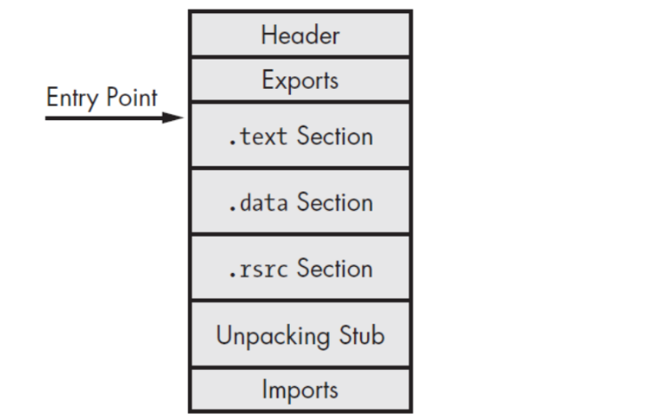

Solo en este punto un analista puede comenzar a entender lo que el ejecutable está haciendo, ya que ahora está en su forma verdadera y original.

### 4.3 Packers and Cryptors
- Packer: Comprime el ejecutable y lo incluye dentro de otro ejecutable con un stub de desempaquetado. Un Empaquetador es un programa que toma el ejecutable como entrada y utiliza la compresión para ofuscar el contenido del ejecutable. Este contenido ofuscado se almacena entonces dentro de la estructura de un nuevo archivo ejecutable; el resultado es un nuevo archivo ejecutable (programa empaquetado) con contenido ofuscado en el disco. Al ejecutar el programa empaquetado, ejecuta una rutina de descompresión, que extrae el binario original en la memoria durante el tiempo de ejecución y desencadena la ejecución.

- Cryptor: Cifra el ejecutable y usa un stub para desencriptarlo y ejecutarlo en memoria. Un Encriptador es similar a un Empaquetador, pero en lugar de usar compresión, utiliza encriptación para ofuscar el contenido del ejecutable, y el contenido encriptado se almacena en el nuevo archivo ejecutable. Al ejecutar el programa encriptado, ejecuta una rutina de desencriptación para extraer el binario original en la memoria y luego desencadena la ejecución.

### 4.4 Indicadores de empaquetado
- **Secciones con nombres conocidos (UPX0, UPX1).**
- **Alta entropía en secciones:** Los archivos empaquetados suelen tener una alta entropía, lo que indica una distribución aleatoria de los bytes debido a la compresión o cifrado. Herramientas de análisis de malware y editores hexadecimales pueden calcular la entropía de un archivo y, si es inusualmente alta, esto puede ser un indicador de empaquetamiento.
- **Tabla de importaciones reducida o vacía:** Los empaquetadores suelen modificar la tabla de importaciones de un archivo PE (Portable Executable). Al analizar la tabla de importaciones con herramientas como CFF Explorer o PEStudio, se puede observar si muestra un conjunto reducido o inusual de importaciones, lo que puede sugerir que el archivo ha sido empaquetado. 
- **Cadenas y secciones inusuales:** Algunos empaquetadores agregan secciones con nombres inusuales al archivo PE o dejan cadenas dentro del archivo que indican el uso de un empaquetador. La inspección manual con editores hexadecimales o el uso de herramientas de análisis que buscan estas características pueden revelar indicios de empaquetamiento.
- **Análisis Heurístico:** Algunas soluciones de seguridad avanzadas utilizan análisis heurísticos para identificar comportamientos típicos de archivos empaquetados, como la ejecución de un stub de desempaquetamiento en tiempo de ejecución.


### 4.5 Herramientas adicionales
Herramientas como PEiD (Virustotal detecta malware), Exeinfo PE, RDG Packer Detector, y Die (Detect It Easy) son específicamente diseñadas para identificar empaquetadores, compiladores y protectores utilizados en archivos ejecutables. Estas herramientas analizan el archivo y, basándose en una base de datos de firmas de empaquetadores conocidos, estableciendo si el archivo ha sido empaquetado y, en muchos casos, identificar el empaquetador específico utilizado.
- TrID, TRIDNet, Die, Exeinfo PE, PEiD, packerid.py


### 4.6. Definición de stub
El stub es parte integral del proceso de packing (empaquetado). **Un stub es un componente esencial en los programas conocidos como ```crypters```** que se encarga de descifrar el malware cifrado y ejecutarlo directamente en la memoria del sistema, evitando así ser detectado al no escribir el malware en disco.

**Un stub es una porción de código pequeño cuya función principal es desempaquetar, desencriptar o preparar el código malicioso real para su ejecución.** Es común en malware que utiliza técnicas de packing o crypting para evadir la detección.

**Un stub es el código de arranque o loader que se ejecuta primero cuando el malware inicia.** Su misión es restaurar o cargar el payload original del malware (que puede estar comprimido, cifrado o camuflado) en memoria y luego transferirle el control.

El stub actúa como intermediario que prepara el entorno para que el código malicioso real (payload) se ejecute, muchas veces sin dejar rastros visibles en el sistema de archivos. 


El stub es, esencialmente, el “desempaquetador en tiempo de ejecución”. Suele encargarse de:
- Localizar el payload empaquetado dentro del propio ejecutable (p. ej., en una sección con alta entropía o en recursos).
- Descomprimir y/o descifrar el payload (unpacking/decryption).
- Reservar memoria y copiar el payload ya recuperado (p. ej., con llamadas tipo VirtualAlloc/HeapAlloc).
- Reconstruir el estado de ejecución necesario para que el código original funcione:
  - resolver imports dinámicamente (LoadLibrary/GetProcAddress o equivalentes),
  - aplicar relocations si corresponde,
  - ajustar permisos de memoria (VirtualProtect / cambios RW→RX).
- Transferir el control al OEP (Original Entry Point), es decir, saltar al inicio real del programa ya desempaquetado.


Por qué es importante en malware
- Dificulta el análisis estático (lo que vemos en disco es sobre todo el stub + datos cifrados/comprimidos).
- Evita firmas basadas en bytes del payload real.
- A veces incorporan anti-análisis (anti-debug/anti-VM, checks de entorno) antes de liberar el payload.

Diferencia rápida: packer vs stub vs payload
- Packer: el método/herramienta/proceso que transforma el binario.
- Stub: el cargador que queda para poder revertir esa transformación en runtime.
- Payload: el código real (malicioso o legítimo) que se intenta ocultar.


**Ubicación del stub**
- En malware empaquetado: El stub está al principio del archivo ejecutable, seguido por el cuerpo del malware en forma cifrada o comprimida.
- En droppers y downloaders: El stub puede encargarse de desencriptar o descargar el payload desde Internet y ejecutarlo.

### 4.7 Ejemplo típico STUB:
- El atacante cifra el malware original.
- Adjunta un stub al inicio.
- El stub se ejecuta, descifra el malware en memoria y lo lanza.
- El código malicioso comienza su actividad real.

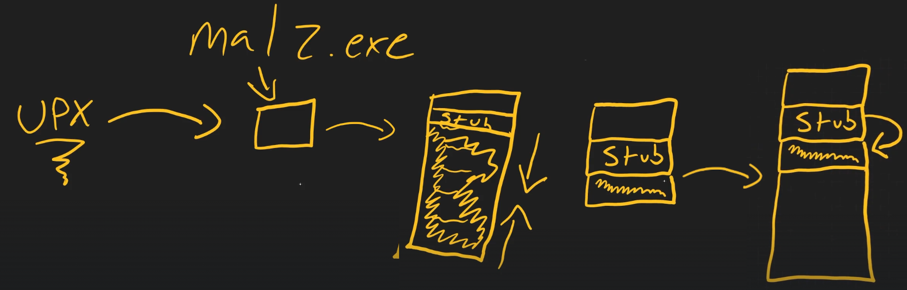

🧩 1. UPX (Ultimate Packer for eXecutables): UPX es una herramienta de compresión que empaqueta un ejecutable, comprimiendo su contenido y añadiéndole un stub que lo desempaqueta en tiempo de ejecución.

🗂️ 2. Archivo empaquetado: malz.exe. Después de pasar por UPX, se genera un nuevo archivo empaquetado: malz.exe contiene el stub al inicio, seguido del código comprimido del ejecutable original.

📦 3. Estructura interna del ejecutable UPX: Estructura interna de malz.exe:
- Parte superior header PE.
- La parte media es el stub UPX (el loader).
- La parte inferior es el el ejecutable original.


🔓 4. Empaquetado
- Parte superior: El header PE.
- Parte media: el stub.
- Parte final: EL payload empaquetado del ejecutable original.


🎬 5. Desempaquetado en tiempo de ejecución del malware empaquetado.

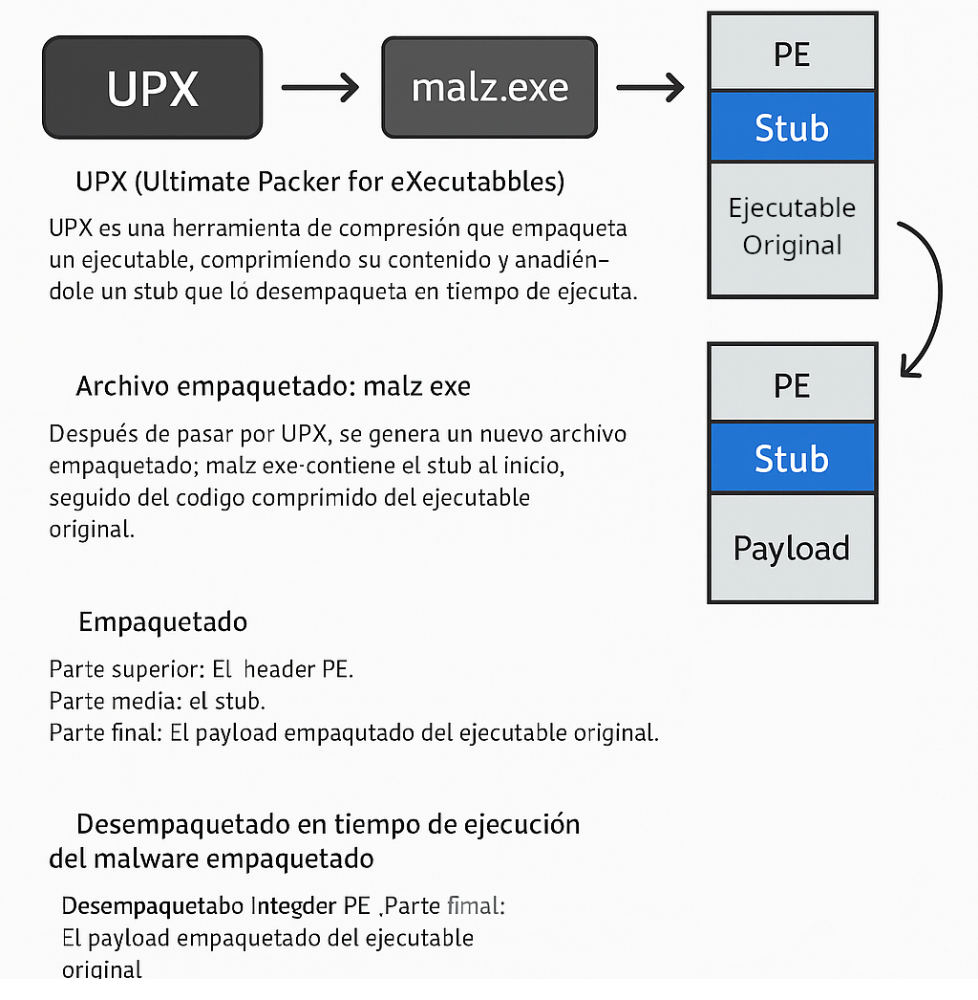

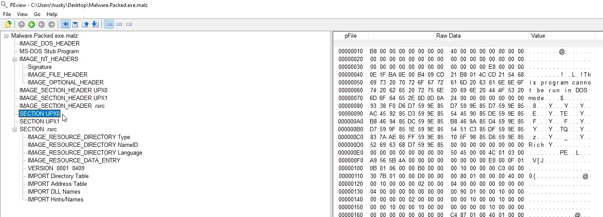

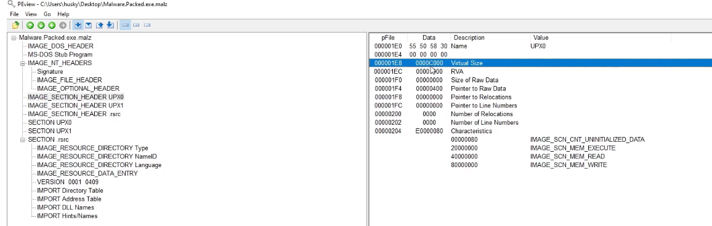


**Análisis: Virtual Size vs Size of Raw Data**
| Campo | Valor hexadecimal | 	Valor decimal |
| -- | -- | -- |
| Virtual Size | 	0000C000 | 	49.152 bytes |
| Size of Raw Data | 	00000000 | 	0 bytes |

La Size of Raw Data es 0, mientras que el Virtual Size es grande (49.152 bytes). Esto es altamente inusual y sospechoso, y tiene implicaciones claras en el contexto de malware empaquetado:
- Size of Raw Data = 0 significa que esta sección no tiene contenido en el disco, es decir, no hay datos reales escritos en el archivo en esa sección.
- Virtual Size = 0xC000 (49.152 bytes) indica que en memoria sí se reserva espacio para esta sección.

➡️ Es decir, esta sección (Raw Data) no existe físicamente en el archivo, pero el cargador del PE la reserva y la inicializa en memoria. No existe todavía. Raw Data necesita ser inicializada después de que el binario se descomprima desde su estado empaquetado.

Esto es típico en binarios empaquetados con UPX:
- UPX0 suele ser una sección vacía en disco pero marcada como ejecutable en memoria.
- Cuando se ejecuta el binario, el stub de UPX desempaqueta el payload y lo escribe en esta sección (UPX0), que solo existe en memoria, no en disco.


### 4.9 Ejemplo 2:
Usamos la herramienta pepack que detecta si un binario está empaquetado usando una base de datos de firmas (como [db_packers.txt](https://github.com/soniasalido/cybersecurity/blob/main/Documentation/Malware/Learning%20Malware%20Annalysis/db_packer.txt)). El fichero db_packers.txt es un archivo de texto que tiene firmas o patrones que identifican los empaquetadores más comunes:
```
UPX
ASPack
FSG
MEW
NSPack
...
```
Si ejecutamos el comando:
```
pepack fichero.bin -d db_packers.txt
```
- Analiza el binario fichero.bin
- Compara con la base de datos de packers
- Si está empaquetado, intenta desempaquetarlo
- Usualmente crea un nuevo archivo desempaquetado (a veces en el mismo directorio)

__________________________________

## 5. Identificación de ofuscación.
Aunque la extracción de cadenas es una técnica excelente para obtener información valiosa, a menudo los autores de malware ofuscan o blindan su binario de malware. La ofuscación es utilizada por los autores de malware para proteger el funcionamiento interno del malware de los investigadores de seguridad, analistas de malware e ingenieros inversos. Estas técnicas de ofuscación dificultan la detección/analización del binario; extraer las cadenas de tal binario resulta en muy pocas cadenas, y la mayoría de las cadenas están oscurecidas. Los autores de malware a menudo usan programas como Empaquetadores y Encriptadores para ofuscar su archivo con el fin de evadir la detección de productos de seguridad tales como antivirus y para impedir el análisis.

### 5.1 La ofuscación es el uso de técnicas que dificultan el análisis estático:
- Strings cifradas u ocultas.
- Lógica confusa o ilegible.
- Saltos y estructuras artificiales (opaque predicates).

### 5.2 Indicadores de ofuscación
- Extracción de cadenas devuelve poco o nada
- Uso de packers/cryptors
- Uso de API hashing
- Flujos de control difíciles de seguir en desensamblado

### 5.3 Ejemplo 2:
Para demostrar el concepto de ofuscación de archivos, tomemos un ejemplo de una muestra de malware llamada Spybot (no empaquetada); la extracción de cadenas de Spybot muestra referencias a nombres de ejecutables sospechosos y direcciones IP, como se muestra aquí:

```
$ strings -a spybot.exe
[....removed....]
EDU_Hack.exe
Sitebot.exe
Winamp_Installer.exe
PlanetSide.exe
DreamweaverMX_Crack.exe
FlashFXP_Crack.exe
Postal_2_Crack.exe
Red_Faction_2_No-CD_Crack.exe
Renegade_No-CD_Crack.exe
Generals_No-CD_Crack.exe
Norton_Anti-Virus_2002_Crack.exe
Porn.exe
AVP_Crack.exe
zoneallarm_pro_crack.exe
[...REMOVED...]
209.126.201.22
209.126.201.20
```

UPX, que se encuentra en https://upx.github.io/, es un empaquetador de ejecutables. UPX (Ultimate Packer for eXecutables) es una herramienta de código abierto y gratuita diseñada para comprimir archivos ejecutables. Su objetivo principal es reducir el tamaño de los archivos ejecutables (binarios), lo que puede ser útil para ahorrar espacio en disco y reducir los tiempos de carga en sistemas con recursos limitados. Empaquetamos y volvemos a comprobar los strings, observando que ya no se muestra mucha información:

```
$ upx -o spybot_packed.exe spybot.exe
Ultimate Packer for eXecutables
Copyright (C) 1996 - 2013
UPX 3.91 Markus Oberhumer, Laszlo Molnar & John Reiser Sep 30th 2013
File size Ratio Format Name
-------------------- ------ ----------- -----------
44576 -> 21536 48.31% win32/pe spybot_packed.exe
Packed 1 file.

$ strings -a spybot_packed.exe
!This program cannot be run in DOS mode.
UPX0
UPX1
.rsrc
3.91
UPX!
t ;t
/t:VU
]^M
9-lh
:A$m
hAgo .
C@@f.
Q*vPCi
%_I;9
PVh29A
[...REMOVED...]
```

UPX is a common packer, and many times you will come across malware samples packed with UPX. In most cases, it is possible to unpack the sample using the -d option. An example command is
```
upx -d -o spybot_unpacked.exe spybot_packed.exe.
```

____________________________________________
## 6. Detección de técnicas anti-análisis.
- Uso de IsDebuggerPresent, CheckRemoteDebuggerPresent.
- Verificación de nombres de procesos: procmon, wireshark, idaq.exe, etc.
- Llamadas sospechosas: NtQueryInformationProcess, RDTSC, GetTickCount

__________________________________

## 7. Extraer cadenas y metadatos asociados con el archivo.
Extraer strings legibles del ejecutable puede revelar:
- URLs de comando y control (C2).
- Mensajes de error.
- Frases tipo "your files have been encrypted".
- Nombres de funciones o variables.
- Direcciones IP y URLs que pueden señalar a servidores de C&C.
- Rutas de archivos específicos que el malware intenta modificar o leer.
- Logs que el malware genera.
- Referencias a librerías específicas o llamadas al sistema que indican cómo interactúa el malware con el sistema operativo.


La extracción de cadenas de un fichero ejecutable es un proceso utilizado en el análisis de malware y en la ingeniería inversa de software para **identificar y extraer secuencias de caracteres legibles (cadenas) dentro de un archivo binario**. Este proceso es fundamental para entender el comportamiento potencial de un programa sin necesidad de ejecutarlo o analizar su código fuente, que puede no estar disponible. Las cadenas pueden incluir rutas de archivos, mensajes de error, URLs de servidores de comando y control (C&C), claves de cifrado, y otros indicadores de compromiso (IoCs) que son útiles para el análisis de seguridad.

Las **cadenas son secuencias de caracteres imprimibles en ASCII y Unicode incrustadas en un archivo.**
La extracción de cadenas puede dar pistas sobre la funcionalidad del programa y los indicadores asociados con un binario sospechoso. Por ejemplo, si un malware crea un archivo, el nombre del archivo se almacena como una cadena en el binario. También si un malware resuelve un nombre de dominio controlado por el atacante, entonces el nombre de dominio se almacena como una cadena. Las cadenas extraídas del binario pueden contener **referencias a nombres de archivos, URL, nombres de dominio, direcciones IP, comandos de ataque, claves de registro, etc**. Aunque las cadenas no dan una idea clara del propósito y la capacidad de un archivo, pueden dar una **pista sobre lo que el malware es capaz de hacer.**


### 7.1 Extraer Cadenas usando herramientas
**Herramientas para la extracción de cadenas de archivos ejecutables:**
- **Strings:** Disponible en sistemas Unix y Windows, es una herramienta de línea de comandos que busca secuencias de caracteres ASCII o Unicode que son al menos de una longitud mínima especificada (por defecto, 4 caracteres). El comando strings, por defecto, extrae las cadenas ASCII que tienen al menos cuatro caracteres de largo. Con la opción -a es posible extraer cadenas de todo el archivo.
  ```
  strings -a log.exe
  ```
  Especímenes de malware también utilizan **cadenas Unicode (2 bytes por carácter)**. Para obtener información útil del binario, a veces necesitas extraer tanto cadenas ASCII como Unicode. Para extraer cadenas Unicode usando el comando strings, usamos la opción -el.
  ```
  strings -a -el log.exe
  ```

  **Filtrar la salida** del comando strings para buscar cosas determinadas:
  ```
  strings -a -el log.exe | grep ".exe"
  strings -a -el log.exe | grep ".dll"
  ```
  

- **Binwalk:** Aunque es más conocida por su capacidad para analizar y extraer firmware, también puede ser utilizada para extraer cadenas.
- **HEx Editors:** Permiten visualizar y editar el contenido binario de un archivo, incluyendo la extracción manual de cadenas.
- En Windows, **pestudio** (https://www.winitor.com) es una herramienta útil que muestra cadenas ASCII y Unicode.
- También en windows se puede usar el **comando strings de sysinternals** y PPEE (https://www.mzrst.com/).
- BinText.
- Ghidra.


**Proceso de Extracción:** La herramienta seleccionada lee el archivo binario y busca secuencias de caracteres que coincidan con patrones de cadenas legibles. Estas cadenas se extraen y se presentan al analista para su revisión.


### 7.2 Decoding Obfuscated Strings Using FLOSS
La mayoría de las veces, los autores de malware utilizan técnicas simples de ofuscación de cadenas para evitar la detección. En tales casos, esas cadenas ofuscadas no aparecerán en la utilidad de cadenas ni en otras herramientas de extracción de cadenas. **FireEye Labs Ofuscated String Solver (FLOSS)** es una herramienta diseñada para **identificar y extraer automáticamente cadenas ofuscadas de malware**. Puede ayudarnos a determinar las cadenas que los autores de malware quieren ocultar de las herramientas de extracción de cadenas.

FLOSS también se puede utilizar como la utilidad de cadenas para **extraer cadenas legibles por humanos (ASCII y Unicode)**. Para descargar FLOSS para Windows o Linux: https://github.com/fireeye/flare-floss.
```
sudo apt install python3-venv python3-full
mkdir ~/miENV
python3.12 -m venv miENV


git clone https://github.com/mandiant/flare-floss.git
cd flare-floss
python setup.py install
```


Otra forma de instalar flare-floss en un entorno virtual python:
```sudo apt update
sudo apt install -y python3 python3-pip python3-venv

mkdir -p ~/miENV-FLOSS
cd ~/miENV-FLOSS

python3 -m venv venv-floss
source ~/miENV-FLOSS/venv-floss/bin/activate

python -m pip install --upgrade pip setuptools wheel
pip install flare-floss

floss --version
which floss
```


En el siguiente ejemplo, no sólo se han extraido las cadenas legibles por humanos, sino que también decodificó las cadenas ofuscadas y extrajo las cadenas de la pila que la utilidad de cadenas y otras herramientas de extracción de cadenas no detectaron. El siguiente resultado muestra una referencia a un ejecutable, un archivo de Excel y una clave de registro de ejecución:
```
$ chmod +x floss
$ ./floss 5340.exe
FLOSS static ASCII strings
!This program cannot be run in DOS mode.
Rich
.text
`.rdata
@.data
[..removed..]
FLOSS decoded 15 strings
kb71271.log
R6002
- floating point not loaded
\Microsoft
winlogdate.exe
~tasyd3.xls
[....REMOVED....]
FLOSS extracted 13 stack strings
BINARY
ka4a8213.log
afjlfjsskjfslkfjsdlkf
'Clt
~tasyd3.xls
"%s"="%s"
regedit /s %s
[HKEY_CURRENT_USER\Software\Microsoft\Windows\CurrentVersion\Run]
[.....REMOVED......]
```

Si sólo estmos interesados en las **cadenas decodificadas/apiladas y deseamos excluir las cadenas estáticas (ASCII y Unicode)** de la salida FLOSS, proporcionamos el modificador ```--no-static-strings```.

https://www.mandiant.com/resources/blog/automatically-extracting-obfuscated-strings


**Análisis de los Resultados:** FLOSS mostrará las cadenas ofuscadas que ha logrado identificar y extraer. Estas cadenas pueden incluir direcciones IP, URLs, nombres de dominio, claves de cifrado, y otros datos que el malware utiliza en sus operaciones. Es importante analizar estas cadenas en el contexto del comportamiento general del malware para entender su propósito y cómo interactúa con los sistemas infectados.
- Cadenas ASCII Estáticas: Estas son cadenas de texto que se pueden leer directamente en el archivo binario y no están ofuscadas. Por ejemplo, la cadena "!This program cannot be run in DOS mode." es típica en los archivos ejecutables de Windows y no es indicativa de actividad maliciosa por sí misma.
- Cadenas Decodificadas: Estas cadenas pueden incluir nombres de archivos de registro como "kb71271.log", mensajes de error como "R6002 - floating point not loaded", o referencias a directorios del sistema como "\Microsoft". Estas cadenas pueden ser pistas sobre la funcionalidad del malware, como los archivos que intenta crear o modificar, o errores que maneja.
- Cadenas Extraídas de la Pila (Stack Strings): Estas son cadenas que FLOSS ha identificado y extraído de la memoria de la pila durante la ejecución del malware. Por ejemplo, "ka4a8213.log" podría ser otro archivo de registro, y "~tasyd3.xls" podría ser un archivo que el malware busca o genera. La **cadena "%s"="%s" sugiere una operación de formato o asignación**, y "regedit /s %s" indica que el malware podría estar intentando modificar el registro de Windows de forma silenciosa.
- Cadenas Relacionadas con la Persistencia: La referencia a **"[HKEY_CURRENT_USER\Software\Microsoft\Windows\CurrentVersion\Run]"** es particularmente significativa, ya que esta ubicación del registro se utiliza comúnmente para configurar programas que se ejecutan automáticamente al iniciar sesión en Windows. Esto podría indicar que el malware intenta establecer persistencia en el sistema infectado.

Al analizar estos resultados, es importante **considerar el contexto y la funcionalidad potencial que las cadenas podrían representar** dentro del malware. Por ejemplo:
- Cadenas de Archivos y Directorios: Pueden indicar los archivos y directorios con los que el malware interactúa.
- Mensajes de Error: Pueden revelar las funciones del sistema que el malware intenta utilizar y cómo maneja las condiciones de error.
- Comandos del Sistema: Como "regedit /s %s", pueden sugerir intentos de modificar la configuración del sistema para lograr objetivos maliciosos.
- Referencias al Registro de Windows: Pueden indicar intentos de lograr la persistencia o modificar la configuración del sistema para beneficio del malware.
_____________________________

## 8. Estructura PE


Los ejecutables de Windows deben ajustarse al formato **PE/COFF (Portable Executable/Common Object File Format).** El formato de archivo PE es utilizado por los archivos ejecutables de Windows (tales como .exe, .dll, .sys, .ocx y .drv) y tales archivos generalmente se denominan **archivos Portable Executable (PE)**. El archivo PE es una serie de estructuras y subcomponentes que **contienen la información requerida por el sistema operativo para cargarlo en la memoria.**
  
**Cuando un ejecutable se compila, incluye un encabezado (encabezado PE), que describe su estructura.** Cuando se ejecuta el binario, el cargador del sistema operativo lee la información del encabezado PE y luego carga el contenido binario del archivo en la memoria. El encabezado PE contiene información como dónde necesita ser cargado el ejecutable en la memoria, la dirección donde comienza la ejecución, la lista de bibliotecas/funciones en las que se basa la aplicación, y los recursos utilizados por el binario. Examinar el encabezado PE proporciona una gran cantidad de información sobre el binario y sus funcionalidades.


**Inspecting PE Header Information se refiere a examinar la información contenida en el encabezado** de un archivo ejecutable Portable Executable (PE) en sistemas Windows. El encabezado PE es una estructura de datos importante que contiene información esencial sobre cómo el sistema operativo debe cargar y manejar el archivo ejecutable o la biblioteca de enlace dinámico (DLL).

La **entropía de un archivo** es una medida de la cantidad de aleatoriedad o incertidumbre que contiene. En el contexto de un Ejecutable Portátil (PE), una **alta entropía puede ser indicativa de que el archivo ha sido comprimido o cifrado**, lo cual es una técnica comúnmente utilizada por el malware para ocultar su código y evitar la detección por parte de herramientas de seguridad. Por lo tanto, la entropía es una característica prominente que las herramientas de análisis de malware buscan al evaluar la sospechosidad de un archivo. Si un archivo PE tiene una entropía inusualmente alta, podría ser un indicador de que contiene código malicioso o que ha sido manipulado para esconder su verdadera naturaleza. La entropía de un archivo es una clasificación que califica qué tan aleatorios son los datos dentro de un archivo PE. Con una escala del 0 al 8, donde 0 significa menos "aleatoriedad" de los datos en el archivo, y un puntaje hacia 8 indica que estos datos son más "aleatorios".

Los autores de malware utilizan técnicas como la **encriptación o el empaquetado para ofuscar su código e intentar eludir el antivirus**. Debido a esto, estos archivos tendrán una entropía alta.

Cuando **inspeccionamos el encabezado PE, generalmente buscamos detalles como:**
- Tipo de Archivo: Determinar si el archivo es un ejecutable, una DLL, un controlador del sistema, entre otros.
- Punto de Entrada: La ubicación en el código donde el sistema operativo comienza a ejecutar el programa.
- Secciones del Archivo: Información sobre las diferentes secciones del archivo, como código, datos y recursos.
- Dependencias de la Biblioteca: Qué otras bibliotecas (DLLs) necesita el ejecutable para funcionar.
- Información de la Plataforma: Para qué arquitectura de hardware está diseñado el archivo (por ejemplo, x86, x64).
- Firmas Digitales: Para verificar la autenticidad y la integridad del archivo.

**Resources for understanding the PE file structure:**
- An In-Depth Look into the Win32 Portable Executable File Format - Part 1:
http://www.delphibasics.info/home/delphibasicsarticles/anindepthlookintothewin32portableexecutablefileformat-part1
- An In-Depth Look into the Win32 Portable Executable File Format - Part 2:
http://www.delphibasics.info/home/delphibasicsarticles/anindepthlookintothewin32portableexecutablefileformat-part2
- PE Headers and structures: http://www.openrce.org/reference_library/files/reference/PE%20Format.pdf
- PE101 - A Windows Executable Walkthrough: https://github.com/corkami/pics/blob/master/binary/pe101/pe101.pdf


------

La cabecera PE es una estructura que cualquier ejecutable windows debe seguir.

Vemos el detalle de la salida del comando xxd usando contra una muestra de malware. Lo que aparece como "MZP" se traduce en ASCII como:
- 4D = M
- 5A = Z
- 50 = P


**"MZ"** es la firma mágica de los archivos ejecutables en DOS/Windows (archivos .exe). Llamada así por Mark Zbikowski, ingeniero de Microsoft. Indica que **el archivo es un ejecutable PE (Portable Executable)** o que al menos comienza con una cabecera compatible con DOS.

La “P” no forma parte de la firma estándar. Es simplemente el siguiente byte después del “MZ”, y su valor depende del contenido binario del archivo.


La estructura PE (Portable Executable) es el formato que usan los ejecutables de Windows, como:
```
*.exe, *.dll, *.sys, *.scr, *.ocx
```
En análisis de malware, entender la estructura PE sirve para saber cómo se carga el binario en memoria, dónde está el código, qué librerías importa, si está empaquetado, si tiene recursos sospechosos, etc.

### 8.1 Vista general de un archivo PE
Un PE tiene esta estructura básica:
```
+-----------------------------+
| DOS Header                  |
+-----------------------------+
| DOS Stub                    |
+-----------------------------+
| PE Header / NT Headers      |
|  - Signature "PE\0\0"       |
|  - File Header              |
|  - Optional Header          |
+-----------------------------+
| Section Table               |
+-----------------------------+
| Sections                    |
|  - .text                    |
|  - .rdata                   |
|  - .data                    |
|  - .idata                   |
|  - .rsrc                    |
|  - .reloc                   |
|  - otras...                 |
+-----------------------------+
```

La estructura PE se puede resumir así:
```
DOS Header       -> empieza con MZ
e_lfanew         -> apunta a PE Header
PE Header        -> empieza con PE\0\0
File Header      -> arquitectura, número de secciones, flags
Optional Header  -> Entry Point, ImageBase, alineaciones, Data Directories
Section Table    -> describe cada sección
Sections         -> código, datos, imports, recursos, relocations
```

### 8.2 DOS Header
Es la primera estructura del archivo. Empieza siempre con:
```
MZ
```

En hexadecimal:
```
4D 5A
```
Por eso muchos ejecutables se identifican por la cabecera `MZ`.

El campo más importante del DOS Header es **`e_lfanew`**. Este campo indica el offset donde empieza la cabecera `PE` real. Ejemplo conceptual:
```
Offset 0x00: MZ
...
Offset 0x3C: e_lfanew = 0x000000F8
...
Offset 0xF8: PE\0\0
```
Es decir, Windows lee `e_lfanew` para saltar desde la cabecera `DOS` hasta la cabecera `PE`.


**Para cargar un PE moderno, lo verdaderamente importante es:**
```
1. Que empiece con MZ.
2. Que en offset 0x3C esté e_lfanew.
3. Que e_lfanew apunte a PE\0\0.
```

Por ejemplo en un ejecutable:
```
Offset 0x00: 4D 5A       -> MZ
Offset 0x3C: 08 01 00 00 -> e_lfanew = 0x108
Offset 0x108: 50 45 00 00 -> PE\0\0
```

### 8.3 DOS Stub
Después del DOS Header suele aparecer un pequeño programa `DOS` que normalmente contiene el mensaje:
```
This program cannot be run in DOS mode.
```
En malware no suele tener mucha importancia, aunque a veces puede ser modificado para ocultar datos o confundir herramientas.

### 8.4 PE Signature
La firma PE aparece donde apunta `e_lfanew`.

Debe ser:
```
PE\0\0
```
En hexadecimal:
```
50 45 00 00
```
Si no aparece esta firma, el archivo probablemente no es un `PE` válido o está corrupto/manipulado.

### 8.5 File Header
Después de la firma `PE` viene el `IMAGE_FILE_HEADER`. Contiene información general del binario.

Campos importantes:
```
Machine
NumberOfSections
TimeDateStamp
PointerToSymbolTable
NumberOfSymbols
SizeOfOptionalHeader
Characteristics
```

### 8.6 Optional Header
Aunque se llama “optional”, en ejecutables PE normales es obligatorio. Contiene información crítica para cargar el programa en memoria.

Campos importantes:
```
AddressOfEntryPoint
ImageBase
SectionAlignment
FileAlignment
SizeOfImage
SizeOfHeaders
Subsystem
DllCharacteristics
DataDirectory
```

**AddressOfEntryPoint:** Es la dirección relativa donde empieza la ejecución del programa. También se llama `OEP`, `Original Entry Point`. Ejemplo:
```
ImageBase:             0x00400000
AddressOfEntryPoint:   0x00001234
```

La dirección virtual real sería:
```
0x00400000 + 0x00001234 = 0x00401234
```
En análisis de malware, el `Entry Point` es fundamental porque ahí suele empezar el código inicial del programa o del packer. Cuando un ejecutable se ejecuta, este punto de entrada es simplemente la ubicación de las primeras piezas de código que se van a ejecutar dentro del archivo, como se ilustra a continuación:


**ImageBase:** Dirección preferida donde Windows carga el ejecutable en memoria. Ejemplos típicos:
```
EXE 32 bits: 0x00400000
DLL 32 bits: 0x10000000
EXE/DLL 64 bits: valores más altos
```
Si no puede cargarse en esa dirección, Windows usa las `relocations`.

**SectionAlignment:** Alineación de las secciones en memoria. Ejemplo:
```
SectionAlignment = 0x1000
```
Esto suele coincidir con el tamaño de página de memoria en Windows.

**FileAlignment:** Alineación de las secciones en disco. Ejemplo:
```
FileAlignment = 0x200
```
Por eso muchas secciones en disco empiezan en offsets múltiplos de `0x200`.

**SizeOfImage:** Tamaño total que ocupará el `PE` cuando se cargue en memoria. No es igual al tamaño del archivo en disco.

**Subsystem:** Indica el tipo de aplicación:
```
2 -> Windows GUI
3 -> Windows Console
```
Si es consola, puede abrir terminal. Si es GUI, normalmente no.

**DllCharacteristics**: Flags de seguridad y mitigaciones. Ejemplos:
```
ASLR
DEP / NX
Control Flow Guard
Dynamic Base
```
En malware antiguo o packed puede que algunas mitigaciones estén desactivadas.


### 8.7 Data Directory
Dentro del Optional Header está la tabla de Data Directories. Es una de las partes más importantes para análisis. Contiene punteros a estructuras como:
```
Export Table
Import Table
Resource Table
Exception Table
Certificate Table
Base Relocation Table
Debug Directory
TLS Table
IAT
Delay Import Table
CLR Header
```


**Import Table**: Indica qué APIs usa el programa. Ejemplo:
```
kernel32.dll
  CreateFileA
  WriteFile
  CreateProcessA

advapi32.dll
  RegSetValueExA

ws2_32.dll
  socket
  connect
  send
  recv
```

Esto permite inferir comportamiento:
```
CreateFile / WriteFile       -> manipulación de archivos
RegSetValueEx                -> persistencia en registro
socket / connect             -> comunicación de red
VirtualAlloc / WriteProcessMemory / CreateRemoteThread -> inyección
```

**Export Table:** Más relevante en DLLs. Indica qué funciones exporta la librería. Ejemplo:
```
DllRegisterServer
ServiceMain
Install
Run
```
En malware puede revelar funciones interesantes.

**Resource Table:** Contiene iconos, imágenes, cadenas, manifiestos, versiones o incluso payloads embebidos. En malware es común encontrar:
```
Ejecutables embebidos
DLLs comprimidas
Shellcode
Configuraciones cifradas
Iconos falsos
```

**Relocation Table:** Permite ajustar direcciones si el binario no se carga en su ImageBase preferido. La sección suele llamarse:
```
.reloc
```

**TLS Table:** La TLS Table puede contener callbacks que se ejecutan antes del Entry Point. Esto es muy importante. Un malware puede usar TLS callbacks para ejecutar código antes de que el analista llegue al supuesto main o OEP.

### 8.8 Section Table
Después de las cabeceras viene la tabla de secciones. Cada sección tiene una estructura `IMAGE_SECTION_HEADER`. Campos importantes:
```
Name
VirtualSize
VirtualAddress
SizeOfRawData
PointerToRawData
Characteristics
```

**Name:** Nombre de la sección. Nombres típicos:
```
.text
.rdata
.data
.idata
.rsrc
.reloc
```

Nombres sospechosos o asociados a packers:
```
UPX0
UPX1
.aspack
.petite
.mpress
Themida
.nsp0
```

**VirtualAddress:** Dónde se carga la sección en memoria, como RVA. Ejemplo:
```
.text VirtualAddress = 0x1000
```

Si el ImageBase es:
```
0x00400000
```
Entonces la sección .text empieza en:
```
0x00401000
```

**PointerToRawData:** Offset en disco donde empieza la sección. Ejemplo:
```
PointerToRawData = 0x400
```

Esto significa que en el archivo físico la sección empieza en el offset:
```
0x400
```

**SizeOfRawData:** Tamaño de la sección en disco.


**VirtualSize:** Tamaño de la sección en memoria. A veces VirtualSize y SizeOfRawData no coinciden. Ejemplo sospechoso:
```
VirtualSize     = 0x5000
SizeOfRawData   = 0x200
```

Puede indicar que en memoria la sección se expande, algo típico en packers.

**Characteristics:** Permisos de la sección. Ejemplos:
```
R -> Read
W -> Write
X -> Execute
```

Una sección `.text` normal suele ser:
```
Read + Execute
```

Una sección `.data` normal suele ser:
```
Read + Write
```

Sospechoso:
```
Read + Write + Execute
```
Una sección con permisos `RWX` puede indicar shellcode, unpacking dinámico o código automodificable.


### 8.9 Secciones Típicas

**.text:** Contiene el código ejecutable. Aquí suelen estar las instrucciones principales del programa. En Ghidra, x32dbg o IDA, gran parte del análisis se centra en esta sección.

**.rdata:** Contiene datos de solo lectura. Puede incluir:
```
Strings
Constantes
Tablas
Referencias a imports
RTTI en C++
```

**.data:** Datos globales inicializados. Puede contener variables globales, flags, configuraciones o buffers.

**.bss:** Datos no inicializados. No siempre aparece como sección explícita.

**.idata:** Import Directory. Contiene información sobre DLLs y APIs importadas. Muy importante para detectar capacidades del malware.

**.edata:** Export Directory. Más común en DLLs.

**.rsrc:** Recursos. Puede contener:
```
Iconos
Manifiestos
Version info
Payloads
Archivos incrustados
```

**.reloc:** Información de relocations.


### 8.10 RVA, VA y Raw Offset

**VA:** Virtual Address: dirección real en memoria. Ejemplo:
```
0x00401234
```

**RVA:** Relative Virtual Address: dirección relativa al ImageBase. Ejemplo:
```
RVA = 0x1234
ImageBase = 0x00400000
VA = 0x00401234
```

Fórmula:
```
VA = ImageBase + RVA
```


**Raw Offset:** Posición dentro del archivo en disco. Ejemplo:
```
Offset 0x600 del archivo
```

**Conversión RVA a Raw Offset:** Para convertir una RVA a offset de archivo:
```
RawOffset = RVA - VirtualAddress_de_la_sección + PointerToRawData
```

Ejemplo:
```
RVA buscada:              0x1234

Sección .text:
VirtualAddress:           0x1000
PointerToRawData:         0x400
```

Cálculo:
```
RawOffset = 0x1234 - 0x1000 + 0x400
RawOffset = 0x634
```


### 8.11 Examining PE Section Table And Sections
El contenido real del archivo PE está dividido en secciones. Estas secciones son inmediatamente seguidas por el encabezado PE. Estas secciones representan ya sea código o datos y tienen atributos en memoria como lectura/escritura. La sección que representa código contiene instrucciones que serán ejecutadas por el procesador, mientras que la sección que contiene datos puede representar diferentes tipos de datos, como datos de programa de lectura/escritura (variables globales), tablas de importación/exportación, recursos, etc. Cada sección tiene un nombre distintivo que transmite el propósito de la sección.

**Secciones en un PE File:**
- .text || CODE: Contiene el código ejecutable. Tiene un atributo de lectura-ejecución.
- .data || DATA: Contiene datos y variables globales. Tiene un atributo de lectura-escritura.
- .rdata: Contiene datos de solo lectura. A veces también contiene información de importación y exportación.
- .idata: Si está presente, contiene la tabla de importación. Si no está presente, entonces la información de importación se almacena en la sección .rdata.
- .edata: Si está presente, contiene información de exportación. Si no está presente, entonces la información de exportación se encuentra en la sección .rdata.
- .rsrc: Esta sección contiene los recursos utilizados por el ejecutable, como íconos, diálogos, menús, cadenas, y así sucesivamente.


**📦 Secciones comunes y su significado**
| Sección |	Función principal |	Riesgo si mal usada |
| -- | -- | -- |
| .text | 	Código ejecutable (instrucciones del programa) | 	✅ Normal, pero puede ocultar shellcode |
| .data | 	Variables globales (lectura/escritura) | 	⚠️ Riesgo si contiene código o C2 info |
| .rdata | 	Datos de solo lectura (a veces import/export info) | 	⚠️ Puede esconder strings maliciosas |
| .idata | 	Tabla de importación | 	✅ Útil para fingerprinting API usage |
| .edata | 	Tabla de exportación | 	✅ Relevante si es una DLL |
| .rsrc | 	Recursos (íconos, diálogos, cadenas, etc.) | 	⚠️ Puede contener payloads cifrados |
| .reloc | 	Información de reubicación de direcciones | 	Rara vez usada por malware |
| .UPX | 	Sección típica de ejecutables empaquetados | 	🚨 Puede ocultar comportamiento real |


Estos nombres de sección son principalmente para humanos y no son utilizados por el sistema operativo, lo que significa que **es posible para un atacante o un software de ofuscación crear secciones con nombres diferentes.** Si nos encontramos con nombres de sección que no son comunes, entonces debemos tratarlos con sospecha, y se requiere un análisis adicional para confirmar su malicia. La información sobre estas secciones (como el nombre de la sección, dónde encontrar la sección y sus características) está presente en la tabla de secciones en el encabezado PE. Examinar una tabla de secciones proporcionará información sobre la sección y sus características. Cuando cargamos un ejecutable en pestudio y hacemos clic en secciones, muestra la información de la sección extraída de la tabla de secciones y sus atributos (lectura/escritura, etc.). 

**Campo / Descripcion:**
- Names (Nombres): Muestra los nombres de las secciones. En este caso, el ejecutable contiene cuatro secciones: .text, .data, .rdata y .rsrc.
- Virtual-Size (Tamaño virtual): Indica el tamaño de la sección cuando se carga en memoria.
- Virtual-Address (Dirección virtual): Es la dirección virtual relativa (es decir, el desplazamiento desde la dirección base del ejecutable) donde se puede encontrar la sección en memoria.
- Raw-size (Tamaño en disco): Indica el tamaño de la sección tal como está almacenada en el disco.
- Raw-data (Datos en disco): Indica el desplazamiento en el archivo donde se puede encontrar la sección.
- Entry-point (Punto de entrada): Es la RVA (dirección virtual relativa) donde comienza la ejecución del código. En este caso, el punto de entrada está en la sección .text, lo cual es lo normal.


**Discrepancias:**
- Los nombres de las secciones no contienen secciones comunes añadidas por el compilador (como .text, .data, y así sucesivamente) sino que contienen nombres de sección UPX0 y UPX1.
- El punto de entrada está en la sección UPX1, lo que indica que la ejecución comenzará en esta sección (rutina de descompresión).
- Normalmente, el tamaño en bruto (raw-size) y el tamaño virtual (virtual-size) deberían ser casi iguales, pero pequeñas diferencias son normales debido al alineamiento de secciones. En este caso, el tamaño en bruto es 0, indicando que esta sección no ocupará espacio en el disco, pero el tamaño virtual especifica que, en memoria, ocupa más espacio (alrededor de 127 kb). Esto es una fuerte indicación de un binario empaquetado. La razón de esta discrepancia es que cuando se ejecuta un binario empaquetado, la rutina de descompresión del empaquetador copiará datos o instrucciones descomprimidas en la memoria durante el tiempo de ejecución.


### 8.12 🛠️🛠️ Herramientas para análisis de archivos PE
- **Comando pecheck:** El comando pecheck es una herramienta de análisis de archivos PE (Portable Executable) desarrollada por Didier Stevens. Cuando se ejecuta pecheck en un archivo PE, la herramienta examina el archivo y proporciona un informe que incluye información sobre las siguientes estructuras y elementos:
  - DOS Header: La cabecera inicial que está presente para mantener la compatibilidad con aplicaciones DOS antiguas.
  - PE Header: La cabecera que sigue al DOS Header y contiene metadatos esenciales sobre el archivo ejecutable, como la arquitectura de la máquina para la que está compilado (x86, x64, etc.) y los puntos de entrada del programa.
  - Optional Header: Una sección del PE Header que proporciona información adicional necesaria para la carga del ejecutable, como la dirección base de la imagen, la alineación de las secciones y el punto de entrada del programa.
  - Section Headers: Las cabeceras de las secciones del archivo que describen cómo se organizan los datos y el código dentro del archivo PE.
  - Data Directories: Partes del Optional Header que contienen punteros a estructuras de datos importantes como la tabla de importaciones y exportaciones, recursos y más.

- **Utilidad pe-tree:** pe-tree es una herramienta de análisis de archivos Portable Executable (PE) diseñada para proporcionar una vista estructurada y jerárquica de los componentes internos de los archivos PE.
  - Vista Jerárquica: pe-tree presenta la información del archivo PE en una estructura de árbol, lo que permite a los usuarios expandir y colapsar secciones para explorar detalles específicos de manera eficiente. Esto incluye cabeceras, secciones, tablas de importación/exportación, recursos y más.
  - Análisis de Secciones y Cabeceras: La herramienta analiza y muestra información detallada sobre las cabeceras PE, incluyendo el DOS Header, PE Header, Optional Header, y Section Headers. Esto es crucial para entender la configuración y el comportamiento potencial del archivo.
  - Identificación de Anomalías: pe-tree puede ayudar a identificar características inusuales o sospechosas en los archivos PE, como secciones ocultas, configuraciones anómalas en las cabeceras, o firmas digitales inválidas.
  - Integración con Herramientas de Análisis de Malware: pe-tree puede integrarse con otras herramientas y plataformas de análisis de malware para proporcionar una visión más completa del archivo analizado. Esto puede incluir la extracción y análisis de cadenas, así como la identificación de patrones de código malicioso.


- **Analazing PE Header en windows con CFF Explorer:** https://ntcore.com/explorer-suite/


- PE Internals: http://www.andreybazhan.com/pe-internals.html

- PPEE(puppy): https://www.mzrst.com/

- PEBrowse Professional: http://www.smidgeonsoft.prohosting.com/pebrowsepro-file-viewer.html

- A tool such as **pestudio** (https://www.winitor.com) or **PPEE** (puppy: https://www.mzrst.com/) can assist you with exploring interesting artifacts from the PE file.

- PEStudio → súper visual, destaca elementos sospechosos.

- peview.exe

- Detect It Easy (DIE) → detecta si está empaquetado. https://horsicq.github.io/


- `objdump / readpe / pefile.py` → para línea de comandos o scripts.

  
- peframe: La herramienta peframe es un analizador estático de archivos ejecutables PE (Portable Executable, típicos de Windows) usado en análisis de malware. Descargar peframe: https://github.com/guelfoweb/peframe
  ```
  python3 -m venv peenv
  # 2. Activa el entorno
  source peenv/bin/activate

  python3 -m pip install --upgrade installer

  git clone https://github.com/guelfoweb/peframe.git
  cd peframe
  
  pip install build

  python3 -m build

  # Esto creará un archivo .whl dentro del directorio dist/, algo como:
  # dist/peframe-6.0-py3-none-any.whl

  #  Instala el .whl con installer
  python3 -m installer dist/peframe-*.whl
  
  # 4. Ejecuta peframe
  peframe archivo.exe

  ```
  
- Ghidra.
  
- radare2:
  - Radare es una herramientas opensource para realizar tareas de ingeniería inversa. Su creador es Sergi Alvárez ([pancake](https://www.navajanegra.com/2025/speaker/pancake-sergi-alvarez-capilla/index.html)).
  - Cuenta con una interfaz gráfica llamada [Cutter](https://www.radare.org/cutter/).
  - Libro de radare: https://book.rada.re/
  - Para abrir un fichero en radare debemos pasar la ruta del fichero como primer parámetro.
  
  ```
  sudo apt install radare2
  r2 -A archivo.exe
  a?               # Ayuda para los comandos de análisis de binarios
  aaa              # Carga toda la información del binario
  aaaa             # Información de cadenas, llamadas (referencias cruzadas), listas de funciones, etc.
  ae               # Entrypoint analizado
  af               # Define función en dirección actual
  afl              # Lista de funciones encontradas
  afl~main         # Busca funciones que contengan "main"
  axt              # Referencias a una dirección
  axtj             # Referencias (en JSON)
  axg              # Grafo de referencias cruzadas
  dcu              # Desensamblar hasta llamada (debug)
  i                # Muestra información básica sobre el binario, como protecciones activadas durante la compilación, fecha de compilación, tipo de binario, Sistema Operativo...
  iI               # Info del formato PE (arch, machine, tamaño)
  iD               # Directivas del PE como imports/exports
  iS               # Muestra todas las secciones (.text, .data, etc.)
  iS~text          # Filtra por sección de código
  iH               # Cabecera del binario
  ii               # Imports
  iij              # Muestra imports pero en formato JSON (útil para scripts)
  ii~VirtualAlloc  # Busca funciones específicas, por ejemplo VirtualAlloc
  ii~kernel32      # Ver funciones importadas de kernel32.dll
  ii~WriteProcessMemory
  ii~CreateRemoteThread
  ii~LoadLibrary
  ii~GetProcAddress
  ii~WinExec
  iE               # Exported symbols (símbolos exportados)
  ie               #  muestra entrypoints del binario
  iz               # Strings encontradas (utf-8, ascii)
  iz~=[A-Za-z0-9]{6,} # Para buscar cadenas raras que podrían estar cifradas
  iz~xor           # Busca strings y llamadas relacionadas con cifrado
  iz~decrypt       # Busca strings y llamadas relacionadas con cifrado
  iz~key           # Busca strings y llamadas relacionadas con cifrado
  ii~RtlDecompress # Busca strings y llamadas relacionadas con cifrado
  iz               # Strings del binario
  iz~http          # Filtrar strings que contengan "http"
  /                # Comando para buscar cadenas o patrones de bytes.
  /?               # Lista los modificadores para utilizar con el comando / de búsqueda
  /x               # Comando para buscar cadenas de bytes
  /x 90 90         # Busca la secuencia 0x90 0x90
  /m               # Busca cabeceras “mágicas” (firmas de tipos de archivo) usando libmagic. Sirve para detectar archivos o estructuras embebidas dentro de un binario
  / WinExec        # Buscador de patrones
  / http           # Buscar la palabra "http"
  / bin.sh         # Buscar posibles llamadas a shells
  /c 90            # Buscar NOPs (hexadecimal)
  /R               # Busca gadgets ROP en el rango de búsqueda actual.
  /V               # 
  pdf              # Imprime el código desensamblado correspondiente a la función que nos encontremos actualmente.
  pdf              # p: print - d: desensamblado - f: función 🡆 Print disassembly function
  pd 5             # print disasm 5 🡆 imprime las 5 instrucciones de ensamblador siguientes desde la dirección actual (el offset donde estás posicionado)
  pd?              # muestra la ayuda de pd en radare2, una descripción del comando, su sintaxis y las opciones/variantes disponibles
  p?               # Muestra la ayuda del comando y sus posibles modificadores
  px               # p: print - x: hexadecimal 🡆 imprime en hexadecimal
  q                # Salir
  s main           # Comando seek que permite movernos al lugar indicado como parámetro. En este caso a la función main
  s 0x00401574     # Para movernos a una dirección de memoria concreta
  V                # Entra en modo visual (desensamblado)
                     hjkl → moverte (como en vim): izquierda, abajo, arriba, derecha
                     p → cambia el panel de vista (hexdump, ensamblador, gráfico, etc.)
                     V → alterna entre los distintos modos visuales.
                     q → salir al modo normal.
                     ? → muestra ayuda dentro del modo visual
  ....
  r2 -d archivo.exe  🡆 Depura el ejecutable con radare
  d?                # Lista de comandos de debugger
  db                # Permite añadir y quitar breakpoints en las direcciones de memoria deseadas.
  
  ```


- Herramienta pescanner:  
pescanner, creado por Michael Ligh y Glenn P. Edwards, es una excelente herramienta para detectar archivos PE sospechosos basados en los atributos del archivo PE; utiliza heurísticas en lugar de firmas y puede ayudarte a identificar binarios empaquetados incluso si no hay firmas para ello. Se puede descargar una copia del script desde https://github.com/hiddenillusion/AnalyzePE/blob/master/pescanner.py.


- Herramienta pesec:  
Esta herramienta es utilizada para analizar archivos binarios de Windows (PE - Portable Executable) con el objetivo de revisar ciertas protecciones de seguridad que pueda tener el ejecutable, como por ejemplo:  

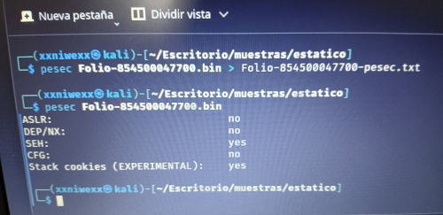

  - ASLR (Address Space Layout Randomization): no  
  Significa que el binario no soporta aleatorización del espacio de direcciones, lo cual lo hace más vulnerable a exploits de memoria.

  - DEP/NX (Data Execution Prevention / No-eXecute): no  
  No tiene protección para prevenir la ejecución de código en regiones no ejecutables de la memoria. Esto facilita ataques como el buffer overflow.

  - SEH (Structured Exception Handling): yes  
  Indica que el ejecutable usa SEH, un mecanismo para manejar excepciones estructuradas. No es una mitigación por sí sola, pero es un dato técnico útil.

  - CFG (Control Flow Guard): no  
  No incluye esta mitigación contra el secuestro del flujo de control, usada para prevenir exploits tipo ROP.

  - Stack cookies (EXPERIMENTAL): yes  
  Usa canarios de pila (stack cookies), una protección para detectar desbordamientos de buffer.

En este ejemplo vemos que este binario es poco seguro: carece de ASLR, DEP/NX y CFG, lo que lo deja expuesto a ataques de explotación de memoria. Aunque tiene stack cookies y usa SEH, eso no es suficiente para considerarlo bien protegido.


- Examinando PE Resources ⬅️⬅️⬅️ 
Los recursos requeridos por el archivo ejecutable, como iconos, menús, diálogos y cadenas, se almacenan en la sección de recursos (.rsrc) de un archivo ejecutable. A menudo, los atacantes almacenan información como binarios adicionales, documentos señuelo y datos de configuración en la sección de recursos, por lo que examinar los recursos puede revelar información valiosa sobre un binario. La sección de recursos también contiene información de versión que puede revelar detalles sobre el origen, el nombre de la empresa, los detalles del autor del programa y la información de copyright.


### 8.13 Examinando el Compilation Timestamp ⬅️⬅️⬅️ 
El encabezado PE contiene información que especifica cuándo se compiló el binario; examinar este campo puede dar una idea de cuándo se creó inicialmente el malware. Esta información puede ser útil para construir una línea de tiempo de la campaña de ataque. También es posible que un atacante modifique la marca de tiempo para evitar que un analista conozca la marca de tiempo real. A veces, una marca de tiempo de compilación puede usarse para clasificar muestras sospechosas.

El Compilation Timestamp es un valor que se encuentra en la cabecera PE del archivo (IMAGE_FILE_HEADER.TimeDateStamp). Está en formato UNIX timestamp (número de segundos desde 1970).

✅ Nos permite:
- Construir líneas de tiempo de campañas de malware.
- Agrupar muestras por periodos o builds (compilaciones).
- Detectar malware falsamente fechado (si se repite un timestamp en muchas muestras).
- Correlacionar con eventos (por ejemplo: ataques de cierta fecha).
- Identificar muestras que usan timestamps falsos clásicos (como el famoso 0x2A425E19 que corresponde a 2001 pero se ha usado en muchas muestras modificadas).


### 8.14 Ejemplo: Malware que tiene una dll incrustada en la sección .rsrc
https://github.com/soniasalido/cybersecurity/blob/main/LABS/Investigating%20Malware/github_RPISEC/Labs/Lab_03/Lab-3.1/decompilado/0-Lab3.1.malware/RC_DATA-IDR_DLL1.md


### 8.15 EJEMPLO: Analizando la estructura PE de un malware
Analisis del fichero Lab_03-1.malware: Tiene estructura interna es un PE32 de Windows, concretamente un ejecutable x86 de 32 bits.
```
└─$ xxd -g 1 Lab_03-1.malware | more
00000000: 4d 5a 90 00 03 00 00 00 04 00 00 00 ff ff 00 00  MZ..............
00000010: b8 00 00 00 00 00 00 00 40 00 00 00 00 00 00 00  ........@.......
00000020: 00 00 00 00 00 00 00 00 00 00 00 00 00 00 00 00  ................
00000030: 00 00 00 00 00 00 00 00 00 00 00 00 08 01 00 00  ................
00000040: 0e 1f ba 0e 00 b4 09 cd 21 b8 01 4c cd 21 54 68  ........!..L.!Th
00000050: 69 73 20 70 72 6f 67 72 61 6d 20 63 61 6e 6e 6f  is program canno
00000060: 74 20 62 65 20 72 75 6e 20 69 6e 20 44 4f 53 20  t be run in DOS 
00000070: 6d 6f 64 65 2e 0d 0d 0a 24 00 00 00 00 00 00 00  mode....$.......
00000080: 1b 51 88 7b 5f 30 e6 28 5f 30 e6 28 5f 30 e6 28  .Q.{_0.(_0.(_0.(
00000090: 56 48 75 28 55 30 e6 28 ba 69 e7 29 5d 30 e6 28  VHu(U0.(.i.)]0.(
000000a0: ba 69 e5 29 5e 30 e6 28 ba 69 e3 29 4e 30 e6 28  .i.)^0.(.i.)N0.(
000000b0: ba 69 e2 29 52 30 e6 28 82 cf 2d 28 5c 30 e6 28  .i.)R0.(..-(\0.(
000000c0: 5f 30 e7 28 6a 30 e6 28 ad 69 ef 29 5e 30 e6 28  _0.(j0.(.i.)^0.(
000000d0: ad 69 19 28 5e 30 e6 28 5f 30 71 28 5e 30 e6 28  .i.(^0.(_0q(^0.(
000000e0: ad 69 e4 29 5e 30 e6 28 52 69 63 68 5f 30 e6 28  .i.)^0.(Rich_0.(
000000f0: 00 00 00 00 00 00 00 00 00 00 00 00 00 00 00 00  ................
00000100: 00 00 00 00 00 00 00 00 50 45 00 00 4c 01 05 00  ........PE..L...
00000110: c0 b5 fb 55 00 00 00 00 00 00 00 00 e0 00 02 01  ...U............
00000120: 0b 01 0e 00 00 0e 00 00 00 66 00 00 00 00 00 00  .........f......
00000130: 0d 13 00 00 00 10 00 00 00 20 00 00 00 00 40 00  ......... ....@.
00000140: 00 10 00 00 00 02 00 00 06 00 00 00 00 00 00 00  ................
00000150: 06 00 00 00 00 00 00 00 00 b0 00 00 00 04 00 00  ................
00000160: 00 00 00 00 03 00 40 81 00 00 10 00 00 10 00 00  ......@.........
00000170: 00 00 10 00 00 10 00 00 00 00 00 00 10 00 00 00  ................
00000180: 00 00 00 00 00 00 00 00 74 25 00 00 a0 00 00 00  ........t%......
00000190: 00 40 00 00 50 52 00 00 00 00 00 00 00 00 00 00  .@..PR..........
000001a0: 00 00 00 00 00 00 00 00 00 a0 00 00 58 01 00 00  ............X...
000001b0: 90 21 00 00 70 00 00 00 00 00 00 00 00 00 00 00  .!..p...........
000001c0: 00 00 00 00 00 00 00 00 00 00 00 00 00 00 00 00  ................
000001d0: 00 22 00 00 40 00 00 00 00 00 00 00 00 00 00 00  ."..@...........
000001e0: 00 20 00 00 dc 00 00 00 00 00 00 00 00 00 00 00  . ..............
000001f0: 00 00 00 00 00 00 00 00 00 00 00 00 00 00 00 00  ................
00000200: 2e 74 65 78 74 00 00 00 ad 0c 00 00 00 10 00 00  .text...........
00000210: 00 0e 00 00 00 04 00 00 00 00 00 00 00 00 00 00  ................
00000220: 00 00 00 00 20 00 00 60 2e 72 64 61 74 61 00 00  .... ..`.rdata..
00000230: 6e 0b 00 00 00 20 00 00 00 0c 00 00 00 12 00 00  n.... ..........
00000240: 00 00 00 00 00 00 00 00 00 00 00 00 40 00 00 40  ............@..@
00000250: 2e 64 61 74 61 00 00 00 84 03 00 00 00 30 00 00  .data........0..
00000260: 00 02 00 00 00 1e 00 00 00 00 00 00 00 00 00 00  ................
00000270: 00 00 00 00 40 00 00 c0 2e 72 73 72 63 00 00 00  ....@....rsrc...
00000280: 50 52 00 00 00 40 00 00 00 54 00 00 00 20 00 00  PR...@...T... ..
00000290: 00 00 00 00 00 00 00 00 00 00 00 00 40 00 00 40  ............@..@
000002a0: 2e 72 65 6c 6f 63 00 00 58 01 00 00 00 a0 00 00  .reloc..X.......
000002b0: 00 02 00 00 00 74 00 00 00 00 00 00 00 00 00 00  .....t..........
000002c0: 00 00 00 00 40 00 00 42 00 00 00 00 00 00 00 00  ....@..B........
000002d0: 00 00 00 00 00 00 00 00 00 00 00 00 00 00 00 00  ................
000002e0: 00 00 00 00 00 00 00 00 00 00 00 00 00 00 00 00  ................
000002f0: 00 00 00 00 00 00 00 00 00 00 00 00 00 00 00 00  ................
00000300: 00 00 00 00 00 00 00 00 00 00 00 00 00 00 00 00  ................
00000310: 00 00 00 00 00 00 00 00 00 00 00 00 00 00 00 00  ................
00000320: 00 00 00 00 00 00 00 00 00 00 00 00 00 00 00 00  ................
00000330: 00 00 00 00 00 00 00 00 00 00 00 00 00 00 00 00  ................
00000340: 00 00 00 00 00 00 00 00 00 00 00 00 00 00 00 00  ................
00000350: 00 00 00 00 00 00 00 00 00 00 00 00 00 00 00 00  ................
--More--
```

**Estructura en este ejemplo de malware:**
```
Offset 0x00000000  -> DOS Header
Offset 0x00000040  -> DOS Stub
Offset 0x00000080  -> Rich Header
Offset 0x00000108  -> PE Signature: PE\0\0
Offset 0x0000010C  -> IMAGE_FILE_HEADER
Offset 0x00000120  -> IMAGE_OPTIONAL_HEADER
Offset 0x00000180  -> Data Directories
Offset 0x00000200  -> Section Table
Offset 0x00000400  -> Primera sección en disco: .text
```

**Destacamos `e_lfanew = 0x108`:**

Por eso la firma `PE\0\0` no aparece exactamente en `0x100`, sino en `0x108`:
```
00000100: 00 00 00 00 00 00 00 00 50 45 00 00 4c 01 05 00
                                  ^^ ^^ ^^ ^^
                                  P  E 00 00
```


**DOS Header:**

El archivo empieza con:
```
00000000: 4d 5a 90 00 ...
```
Los dos primeros bytes son:
```
4D 5A
```
En ASCII:
```
MZ
```
Esto identifica una cabecera `DOS` válida, necesaria en los ejecutables `PE`.

El byte siguiente `90` no forma parte de la firma. Pertenece al campo siguiente del `IMAGE_DOS_HEADER`.


**Campos principales del DOS Header:** Interpretando los primeros bytes en little endian:
| Offset | Bytes         | Campo        |        Valor | Significado                       |
| -----: | ------------- | ------------ | -----------: | --------------------------------- |
| `0x00` | `4D 5A`       | `e_magic`    |         `MZ` | Firma DOS                         |
| `0x02` | `90 00`       | `e_cblp`     |     `0x0090` | Bytes en la última página DOS     |
| `0x04` | `03 00`       | `e_cp`       |     `0x0003` | Número de páginas DOS             |
| `0x06` | `00 00`       | `e_crlc`     |          `0` | Relocations DOS                   |
| `0x08` | `04 00`       | `e_cparhdr`  |     `0x0004` | Tamaño del header DOS en párrafos |
| `0x0A` | `00 00`       | `e_minalloc` |          `0` | Memoria mínima                    |
| `0x0C` | `FF FF`       | `e_maxalloc` |     `0xFFFF` | Memoria máxima                    |
| `0x0E` | `00 00`       | `e_ss`       |          `0` | Stack segment DOS                 |
| `0x10` | `B8 00`       | `e_sp`       |     `0x00B8` | Stack pointer DOS                 |
| `0x18` | `40 00`       | `e_lfarlc`   |     `0x0040` | Offset tabla relocations DOS      |
| `0x3C` | `08 01 00 00` | `e_lfanew`   | `0x00000108` | Offset del PE Header              |


El campo clave es:
```
00000030: ... 08 01 00 00
```
Eso está en el offset 0x3C.

Como es little endian:
```
08 01 00 00 = 0x00000108
```
Por tanto:
```
e_lfanew = 0x108
```
Esto significa: La cabecera `PE` real empieza en el offset `0x108` del archivo.


**DOS Stub:**

A partir del offset `0x40` aparece el código DOS Stub:
```
00000040: 0e 1f ba 0e 00 b4 09 cd 21 b8 01 4c cd 21 54 68
00000050: 69 73 20 70 72 6f 67 72 61 6d 20 63 61 6e 6e 6f
00000060: 74 20 62 65 20 72 75 6e 20 69 6e 20 44 4f 53 20
00000070: 6d 6f 64 65 2e 0d 0d 0a 24
```
La cadena ASCII es:
```
This program cannot be run in DOS mode.
```
Termina con:
```
0D 0D 0A 24
```

Donde:
```
0D = carriage return
0A = line feed
24 = '$'
```
El carácter `$` es importante porque la función DOS `int 21h / AH=09h` imprime una cadena hasta encontrar `$`.

El código ensamblador del DOS Stub imprime: `This program cannot be run in DOS mode.`. En Windows moderno, este stub normalmente no se ejecuta. El loader de Windows lee `e_lfanew`, salta a `0x108` y procesa el `PE Header`.


**Rich Header:**

Entre el DOS Stub y la cabecera PE aparece un Rich Header:
```
00000080: 1b 51 88 7b 5f 30 e6 28 ...
...
000000e0: ad 69 e4 29 5e 30 e6 28 52 69 63 68 5f 30 e6 28
                                      R  i  c  h
```
La marca visible es:
```
52 69 63 68 = Rich
```
Justo después aparece la clave XOR:
```
5F 30 E6 28
```
En little endian:
```
0x28E6305F
```
El Rich Header es una estructura añadida por herramientas de Microsoft, normalmente Visual Studio / MSVC. No forma parte estricta de la especificación PE oficial, pero es muy común.

Sirve para dejar metadatos del proceso de compilación, como versiones de compilador, linker y objetos usados. En malware puede ser útil para fingerprinting, pero también puede ser manipulado. Debe tenerse en cuenta que el Rich Header puede ser eliminado o manipulado, por lo que esta información debe usarse como indicador auxiliar y no como prueba concluyente de atribución.

El Rich Header es:
```
Una zona no oficial del PE, generada normalmente por herramientas Microsoft,
situada entre el DOS Stub y el PE Header,
cifrada/ofuscada con XOR,
marcada por "DanS" al inicio descifrado y "Rich" al final,
que contiene información sobre compilador, linker, versiones y componentes usados.
```

En malware sirve para:
```
identificar toolchain
comparar muestras
detectar manipulación
apoyar atribución técnica
distinguir runtime del compilador de lógica maliciosa
```


**PE Signature:**

En el offset indicado por `e_lfanew`, `0x108`, aparece:
```
50 45 00 00
```
En ASCII:
```
PE\0\0
```
Lo vemos aquí:
```
00000100: 00 00 00 00 00 00 00 00 50 45 00 00 4c 01 05 00
                                  50 45 00 00
```
Por tanto:
```
Offset 0x108 -> PE Signature
Offset 0x10C -> IMAGE_FILE_HEADER
```


**IMAGE_FILE_HEADER:**

Después de `PE\0\0` viene el `IMAGE_FILE_HEADER`. Empieza en:
```
0x10C
```
Los bytes relevantes son:
```
00000108: 50 45 00 00 4c 01 05 00 c0 b5 fb 55 00 00 00 00
00000118: 00 00 00 00 e0 00 02 01
```

|  Offset | Bytes         | Campo                |        Valor | Significado             |
| ------: | ------------- | -------------------- | -----------: | ----------------------- |
| `0x108` | `50 45 00 00` | Signature            |     `PE\0\0` | Firma PE                |
| `0x10C` | `4C 01`       | Machine              |     `0x014C` | Intel x86, 32 bits      |
| `0x10E` | `05 00`       | NumberOfSections     |          `5` | Tiene 5 secciones       |
| `0x110` | `C0 B5 FB 55` | TimeDateStamp        | `0x55FBB5C0` | Fecha de compilación    |
| `0x114` | `00 00 00 00` | PointerToSymbolTable |          `0` | Sin tabla COFF          |
| `0x118` | `00 00 00 00` | NumberOfSymbols      |          `0` | Sin símbolos COFF       |
| `0x11C` | `E0 00`       | SizeOfOptionalHeader |       `0xE0` | Tamaño normal para PE32 |
| `0x11E` | `02 01`       | Characteristics      |     `0x0102` | Ejecutable + 32 bits    |


**IMAGE_OPTIONAL_HEADER:**

El Optional Header empieza en: `0x120`. Aunque se llame “optional”, en un PE ejecutable normal es obligatorio. Fragmento:
```
00000120: 0b 01 0e 00 00 0e 00 00 00 66 00 00 00 00 00 00
00000130: 0d 13 00 00 00 10 00 00 00 20 00 00 00 00 40 00
00000140: 00 10 00 00 00 02 00 00 06 00 00 00 00 00 00 00
00000150: 06 00 00 00 00 00 00 00 00 b0 00 00 00 04 00 00
00000160: 00 00 00 00 03 00 40 81 00 00 10 00 00 10 00 00
```

| Campo                     |        Valor | Significado                                    |
| ------------------------- | -----------: | ---------------------------------------------- |
| `Magic`                   |     `0x010B` | PE32                                           |
| `MajorLinkerVersion`      |         `14` | Linker 14.x, compatible con Visual Studio 2015 |
| `SizeOfCode`              |      `0xE00` | Tamaño de código                               |
| `SizeOfInitializedData`   |     `0x6600` | Datos inicializados                            |
| `SizeOfUninitializedData` |          `0` | Sin bloque declarado de datos no inicializados |
| `AddressOfEntryPoint`     |     `0x130D` | **RVA del punto de entrada**                   |
| `BaseOfCode`              |     `0x1000` | RVA donde empieza código                       |
| `BaseOfData`              |     `0x2000` | RVA donde empiezan datos                       |
| `ImageBase`               | `0x00400000` | **Base preferida en memoria**                  |
| `SectionAlignment`        |     `0x1000` | Alineación en memoria                          |
| `FileAlignment`           |      `0x200` | Alineación en disco                            |
| `SizeOfImage`             |     `0xB000` | Tamaño total en memoria                        |
| `SizeOfHeaders`           |      `0x400` | Tamaño de cabeceras en disco                   |
| `Subsystem`               |          `3` | Windows Console                                |
| `DllCharacteristics`      |     `0x8140` | Mitigaciones/flags                             |
| `NumberOfRvaAndSizes`     |         `16` | 16 Data Directories                            |


**Entry Point:**

El campo más importante para empezar análisis dinámico es:
```
AddressOfEntryPoint = 0x130D
```
Esto es una RVA, no una dirección absoluta. Como:
```
ImageBase = 0x00400000
```

La VA del Entry Point será:
```
VA = ImageBase + RVA
VA = 0x00400000 + 0x0000130D
VA = 0x0040130D
```
Por tanto:
```
Entry Point = 0x0040130D
```
Ahora hay que ver en qué sección cae la `RVA 0x130D`.

La sección `.text` tiene:
```
VirtualAddress = 0x1000
VirtualSize    = 0x0CAD
```
Rango virtual aproximado:
```
.text: 0x1000 - 0x1CAD
```
Como:
```
0x130D está dentro de 0x1000 - 0x1CAD
```
el Entry Point cae dentro de:
```
.text
```
Eso es normal. No está empezando en `.rsrc`, `.data`, `.reloc` ni en una sección rara.


**Conversión del Entry Point a offset de archivo:**

Para convertir `RVA` a `Raw Offset``:
```
RawOffset = RVA - VirtualAddress_de_la_sección + PointerToRawData
```
Para .text:
```
RVA EntryPoint    = 0x130D
.text VA          = 0x1000
.text Raw Pointer = 0x0400
```
Cálculo:
```
RawOffset = 0x130D - 0x1000 + 0x0400
RawOffset = 0x070D
```
Así que el código inicial del programa está en:
```
VA:         0x0040130D
RVA:        0x0000130D
Raw offset: 0x0000070D
```

Vemos el código dentro de la sección `.text`, concretamente desde el Entry Point:
```
└─$ xxd -g 1 -s 0x70d -l 0x80 Lab_03-1.malware | more
0000070d: e8 93 03 00 00 e9 7a fe ff ff 55 8b ec 6a 00 ff  ......z...U..j..
0000071d: 15 44 20 40 00 ff 75 08 ff 15 48 20 40 00 68 09  .D @..u...H @.h.
0000072d: 04 00 c0 ff 15 40 20 40 00 50 ff 15 3c 20 40 00  .....@ @.P..< @.
0000073d: 5d c3 55 8b ec 81 ec 24 03 00 00 6a 17 e8 55 09  ].U....$...j..U.
0000074d: 00 00 85 c0 74 05 6a 02 59 cd 29 a3 18 31 40 00  ....t.j.Y.)..1@.
0000075d: 89 0d 14 31 40 00 89 15 10 31 40 00 89 1d 0c 31  ...1@....1@....1
0000076d: 40 00 89 35 08 31 40 00 89 3d 04 31 40 00 66 8c  @..5.1@..=.1@.f.
0000077d: 15 30 31 40 00 66 8c 0d 24 31 40 00 66 8c 1d 00  .01@.f..$1@.f... 
```

Si analizamos el código ensamblador que se observa, obtenemos que:
```
0040130D  E8 93 03 00 00      call 004016A5
00401312  E9 7A FE FF FF      jmp  00401191
...
...
```
- El Entry Point es un pequeño stub.
- Primero llama a una rutina de inicialización.
- Después salta hacia 0x00401191.
- El bloque posterior contiene código de seguridad/runtime, no parece la lógica maliciosa principal.
- ...


**Subsytem:**

El campo:
```
Subsystem = 0x0003
```
significa:
```
Windows CUI / Console
```
Es decir, está marcado como programa de consola. No significa necesariamente que siempre imprima algo por pantalla. Sólo indica cómo lo tratará Windows al cargarlo.


**DllCharacteristics:**

El binario declara compatibilidad con:
```
ASLR
DEP / NX
Terminal Server Aware
```


**Data Directories:**
| Directory                 |          RVA |         Size | Sección  | Raw offset aproximado |
| ------------------------- | -----------: | -----------: | -------- | --------------------: |
| **Export Table**          | `0x00000000` | `0x00000000` | —        |                     — |
| **Import Table**          | `0x00002574` | `0x000000A0` | `.rdata` |              `0x1774` |
| **Resource Table**        | `0x00004000` | `0x00005250` | `.rsrc`  |              `0x2000` |
| Exception Table           | `0x00000000` | `0x00000000` | —        |                     — |
| Certificate Table         | `0x00000000` | `0x00000000` | —        |                     — |
| **Base Relocation Table** | `0x0000A000` | `0x00000158` | `.reloc` |              `0x7400` |
| Debug Directory           | `0x00002190` | `0x00000070` | `.rdata` |              `0x1390` |
| Architecture              | `0x00000000` | `0x00000000` | —        |                     — |
| Global Ptr                | `0x00000000` | `0x00000000` | —        |                     — |
| **TLS Table**             | `0x00000000` | `0x00000000` | —        |                     — |
| Load Config Table         | `0x00002200` | `0x00000040` | `.rdata` |              `0x1400` |
| Bound Import              | `0x00000000` | `0x00000000` | —        |                     — |
| **IAT**                   | `0x00002000` | `0x000000DC` | `.rdata` |              `0x1200` |
| Delay Import              | `0x00000000` | `0x00000000` | —        |                     — |
| CLR Header                | `0x00000000` | `0x00000000` | —        |                     — |


**Import Table:**
```
Import Table RVA  = 0x2574
Import Table Size = 0xA0
```
Cae dentro de `.rdata`.

Conversión a `raw offset`:
```
.rdata VirtualAddress = 0x2000
.rdata PointerToRawData = 0x1200

RawOffset = 0x2574 - 0x2000 + 0x1200
RawOffset = 0x1774
```
Para inspeccionar los descriptores de `imports`:
```
xxd -g 1 -s 0x1774 -l 0xa0 Lab_03-1.malware
```
Esto es importante para ver qué DLLs y APIs importa.


**Resource Table:**
```
Resource Table RVA  = 0x4000
Resource Table Size = 0x5250
```
Cae dentro de:
```
.rsrc
```
Raw offset:
```
RawOffset = 0x4000 - 0x4000 + 0x2000
RawOffset = 0x2000
```
La sección de recursos es relativamente grande:
```
VirtualSize = 0x5250
RawSize     = 0x5400
```
En análisis de malware conviene revisarla porque puede contener:
```
iconos
version info
manifiestos
configuración
payloads embebidos
datos cifrados o comprimidos
```

**TLS Table:**
```
TLS Table RVA  = 0
TLS Table Size = 0
```
Esto indica que, según la cabecera PE, no hay TLS callbacks declarados.

Conclusión: No hay indicio de ejecución previa al Entry Point mediante TLS callbacks.


**CLR Header:**
```
CLR Header = 0
```
Por tanto: No parece un binario .NET. Es código nativo PE32.

**Section Table:**

La tabla de secciones empieza en: `0x200`.


**Sección .text:**
| Campo            |          Valor |
| ---------------- | -------------: |
| Name             |        `.text` |
| VirtualSize      |       `0x0CAD` |
| VirtualAddress   |       `0x1000` |
| SizeOfRawData    |       `0x0E00` |
| PointerToRawData |       `0x0400` |
| Characteristics  |   `0x60000020` |
| Permisos         | Read + Execute |

El Entry Point `0x130D` cae dentro de esta sección.

**Sección .rdata:**
| Campo            |        Valor |
| ---------------- | -----------: |
| Name             |     `.rdata` |
| VirtualSize      |     `0x0B6E` |
| VirtualAddress   |     `0x2000` |
| SizeOfRawData    |     `0x0C00` |
| PointerToRawData |     `0x1200` |
| Characteristics  | `0x40000040` |
| Permisos         |         Read |


.rdata suele contener:
- strings de solo lectura
- punteros a imports
- tablas constantes
- estructuras de runtime
- metadatos


**Sección .data:**
| Campo            |        Valor |
| ---------------- | -----------: |
| Name             |      `.data` |
| VirtualSize      |     `0x0384` |
| VirtualAddress   |     `0x3000` |
| SizeOfRawData    |     `0x0200` |
| PointerToRawData |     `0x1E00` |
| Characteristics  | `0xC0000040` |
| Permisos         | Read + Write |


**Sección .rsrc:**
| Campo            |        Valor |
| ---------------- | -----------: |
| Name             |      `.rsrc` |
| VirtualSize      |     `0x5250` |
| VirtualAddress   |     `0x4000` |
| SizeOfRawData    |     `0x5400` |
| PointerToRawData |     `0x2000` |
| Characteristics  | `0x40000040` |
| Permisos         |         Read |

Contiene los recursos del ejecutable:
- iconos
- version info
- manifiesto
- diálogos
- strings
- posibles datos embebidos


**Sección .reloc:**
| Campo            |              Valor |
| ---------------- | -----------------: |
| Name             |           `.reloc` |
| VirtualSize      |           `0x0158` |
| VirtualAddress   |           `0xA000` |
| SizeOfRawData    |           `0x0200` |
| PointerToRawData |           `0x7400` |
| Characteristics  |       `0x42000040` |
| Permisos         | Read + Discardable |

El loader puede cargar el binario en una dirección distinta a `0x00400000` y corregir direcciones absolutas usando `.reloc`.


--------------------

### 8.16 Diferencia entre Import Table e IAT

**Import Table:**

La Import Table describe qué DLLs y funciones necesita el programa. Ejemplo:
```
kernel32.dll
    GetCurrentProcess
    TerminateProcess
    SetUnhandledExceptionFilter

user32.dll
    MessageBoxA
```
Es como una lista de la compra: Necesito estas DLLs y estas funciones.

**IAT:**

La IAT contiene las direcciones que el programa usará para llamar a esas funciones. Es como una agenda de direcciones ya resuelta:
```
MessageBoxA está en 0x75AF1234
TerminateProcess está en 0x76F45678
GetCurrentProcess está en 0x76F12390
```

**Resumen:**
```
Import Table -> qué necesito importar
IAT          -> dónde está cada función importada en memoria
             -> IAT es una tabla de punteros a funciones importadas.
             -> Llama a la función importada cuya dirección está guardada en la IAT en 0x00402044.
```

**Por qué es tan importante en malware:**

En análisis de malware, la IAT es muy útil porque nos indica qué capacidades puede tener el programa. Por ejemplo:
```
CreateFileA / WriteFile
```
puede indicar manipulación de archivos.
```
RegSetValueExA
```
puede indicar persistencia en el registro.
```
CreateProcessA / WinExec
```
puede indicar ejecución de comandos o procesos.
```
VirtualAlloc / VirtualProtect
```
puede indicar desempaquetado, shellcode o código dinámico.
```
WriteProcessMemory / CreateRemoteThread
```
puede indicar inyección de procesos.
```
socket / connect / send / recv
```
puede indicar comunicación de red.


### 8.17 Ficheros ejecutables Linux
En vez de PE, lo habitual es que tenga formato: `ELF`. ELF significa: `Executable and Linkable Format` y es el formato típico de ejecutables, librerías y objetos en Linux.

Un ejecutable Linux ELF suele empezar por:
```
7F 45 4C 46
```

Interpretación:
```
0x7F -> byte mágico
45   -> E
4C   -> L
46   -> F
```

**Estructura general de un ELF:**
```
+-----------------------------+
| ELF Header                  |
+-----------------------------+
| Program Header Table        |
+-----------------------------+
| Sections                    |
|  - .text                    |
|  - .rodata                  |
|  - .data                    |
|  - .bss                     |
|  - .plt                     |
|  - .got                     |
|  - .dynamic                 |
|  - .dynsym                  |
|  - .dynstr                  |
|  - .rela.plt / .rel.plt     |
|  - .init                    |
|  - .fini                    |
|  - otras...                 |
+-----------------------------+
| Section Header Table        |
+-----------------------------+
```


**Equivalencias PE vs ELF:**
| Windows PE      | Linux ELF                              |
| --------------- | -------------------------------------- |
| `MZ`            | `7F 45 4C 46` / `.ELF`                 |
| `PE\0\0`        | ELF Header                             |
| Optional Header | ELF Header + Program Headers           |
| Section Table   | Section Header Table                   |
| `.text`         | `.text`                                |
| `.rdata`        | `.rodata`                              |
| `.data`         | `.data`                                |
| `.bss`          | `.bss`                                 |
| Import Table    | Dynamic Symbol Table / Dynamic Section |
| IAT             | GOT / PLT                              |
| TLS Directory   | TLS segmentos/secciones ELF            |
| `.rsrc`         | No hay equivalente directo estándar    |
| Rich Header     | No existe equivalente directo          |


_______________________________________


## 9. Funciones/APIs utilizadas

**Las Windows API (Application Programming Interface de Windows)** son un conjunto de funciones y servicios que proporciona el sistema operativo Windows para que los programas (como aplicaciones o malware) puedan interactuar con el sistema.

Una Windows API es una puerta de acceso al sistema operativo que permite a los programas:
- Crear y manejar ventanas.
- Leer y escribir archivos.
- Conectarse a internet.
- Ejecutar procesos.
- Usar memoria.
- Interactuar con dispositivos, etc.


**La llamada a funciones del sistema operativo puede ser muy reveladora.**
- API sospechosas: ```CreateRemoteThread, VirtualAllocEx, RegSetValueEx```, etc.
- Algunas familias de malware tienen un patrón de llamadas único.


**📌 Ejemplos comunes de Windows API (muy usadas en malware):**

| Función API |	Lo que hace |	DLL asociada |
| -- | -- | -- |
| CreateFileA |	Abre o crea un archivo |	KERNEL32.dll |
| WriteFile |	Escribe datos en un archivo o socket |	KERNEL32.dll |
| CreateProcessA |	Crea un nuevo proceso |	KERNEL32.dll |
| VirtualAlloc |	Reserva memoria en un proceso |	KERNEL32.dll |
| LoadLibraryA |	Carga una DLL en tiempo de ejecución |	KERNEL32.dll |
| GetProcAddress |	Obtiene la dirección de una función de una DLL |	KERNEL32.dll |
| InternetOpenA |	Abre una sesión de internet |	WININET.dll |
| InternetConnectA |	Se conecta a un servidor |	WININET.dll |
| Send / Recv |	Envía/recibe datos por red |	WS2_32.dll |
| RegOpenKeyEx |	Abrir una clave del registro  |	Registry Persistence |
| RegCreateKeyEx |	Crear una clave del registro  |	Registry Persistence |
| RegSetValueEx |	Escribir un valor en una clave |	Registry Persistence |
| RegCloseKey |	Cerrar la clave del registro |	Registry Persistence |
| RegDeleteKey / RegDeleteValue |	Eliminar claves o valores |	Registry Persistence |


### 9.1 Tabla de Direcciones de Importación (IAT)


**La Tabla de Direcciones de Importación (IAT, por sus siglas en inglés: Import Address Table)** es una estructura presente en los archivos ejecutables del formato PE (Portable Executable) en Windows, utilizada tanto por programas legítimos como por malware. Su función principal es almacenar las direcciones virtuales de las funciones importadas de otras bibliotecas (DLLs), que el programa necesitará usar durante su ejecución.

El sistema operativo utiliza la **IAT para resolver en tiempo de carga dónde está cada función importada**, permitiendo así que el binario llame a funciones externas como API de Windows o funciones de otras DLLs.

Los analistas de malware suelen **revisar la IAT para identificar qué funciones y bibliotecas utiliza el malware**, lo que ayuda a determinar su comportamiento o capacidades (por ejemplo, si realiza conexiones de red, manipulación de archivos, acceso al registro, etc.).

Es común que **técnicas de evasión o persistencia de malware manipulen la IAT**, bien para ocultar llamadas a funciones, redirigirlas o enganchar (“```hookear```”) funciones y modificar el comportamiento del programa (por ejemplo, interceptar información antes de pasarla al sistema operativo).


### 9.2 Inspección de Dependencias de Archivos e Importaciones:
Cuando analizamos qué funciones importa un ejecutable desde DLLs del sistema operativo, estamos viendo su huella funcional. Eso ayuda a:
- Detectar comportamientos: ¿quiere conectarse a red? ¿leer el registro? ¿crear procesos?.
- Asociar el malware a una familia conocida (muchos malware reusan los mismos patrones de importación).
- Crear reglas YARA o modelos de detección basados en esas dependencias.

**¿Qué tipo de importaciones se suelen revisar?**
| DLL común	| Funciones clave (APIs) |	¿Qué indica? |
| -- | -- | -- |
| kernel32.dll	| 	CreateFile, ReadFile, WriteFile		| Acceso a archivos |
| kernel32.dll	| 	VirtualAllocEx		| Reserva memoria en otro proceso |
| kernel32.dll	| 	VirtualAlloc		| Reserva memoria en el propio proceso |
| kernel32.dll	| 	WriteProcessMemory		| Escribe en otro proceso |
| kernel32.dll	| 	CreateRemoteThread		| Ejecuta código en otro proceso |
| kernel32.dll	| 	VirtualProtect		| Cambia permisos de páginas de memoria |
| advapi32.dll	| 	RegOpenKey, RegSetValue, OpenService	| 	Registro de Windows, servicios |
| user32.dll	| 	MessageBox, GetAsyncKeyState	| 	Interacción con el usuario, keylogging |
| wininet.dll / ws2_32.dll	| 	InternetOpen, connect, send	| 	Conexión a red o C2 |
| ntdll.dll	| 	Funciones de bajo nivel	| 	Indicador de técnicas evasivas |


**Herramientas para inspección de importaciones:**
- PEStudio (Windows)
- CFF Explorer (Windows)
- Ghidra / IDA Pro (pestaña de imports) (Windows & Linux)
- Dependency Walker (Windows)
- ```objdump o pefile.py``` (en Linux o scripts)


**¿Cómo encaja la inspección de dependencias de archivos e importaciones en el fingerprinting?**  
Las combinaciones de funciones importadas y DLLs usadas crean un patrón único o muy característico del malware. Por Ejemplo: Si un binario importa ```WriteProcessMemory, CreateRemoteThread, y VirtualAllocEx```, hay una alta probabilidad de que esté haciendo ```process injection```, una técnica común en muchos troyanos y rootkits.

Generalmente, el malware interactúa con archivos, registros, la red, etc. Para realizar dichas interacciones, el malware depende frecuentemente de las funciones expuestas por el sistema operativo. Windows exporta la mayoría de sus funciones, llamadas **Interfaces de Programación de Aplicaciones (API)**, requeridas para estas interacciones en **archivos de Biblioteca de Enlace Dinámico (DLL)**. Los ejecutables importan y llaman a estas funciones típicamente de varias DLL que proporcionan diferentes funcionalidades. Las funciones que un ejecutable importa de otros archivos (principalmente DLL) se denominan **funciones importadas (o importaciones | imports)**.

**Por ejemplo:** Si un ejecutable de malware quiere crear un archivo en el disco, en Windows, puede usar una ```API CreateFile()```, que se exporta en kernel32.dll. Para llamar a la API, primero tiene que cargar ```kernel32.dll``` en su memoria y luego llamar a la función ```CreateFile()```.

Si inspeccionamos las DLL en las que confía un malware y las funciones API que importa de las DLL, podremos tener una idea sobre la funcionalidad y capacidad del malware y nos podremos anticipar durante su ejecución. **Las dependencias de archivos en ejecutables de Windows se almacenan en la tabla de importaciones de la estructura del archivo PE (IAT).**


**Uso Python para enumerar archivos DLL y funciones importadas:** Esto puede hacerse utilizando el módulo pefile de Ero Carrera (https://github.com/erocarrera/pefile).

```
pip install pefile
```

El siguiente script en Python demuestra cómo usar el módulo pefile para enumerar las DLLs y las funciones API importadas:
```
import pefile
import sys
mal_file = sys.argv[1]
pe = pefile.PE(mal_file)
if hasattr(pe, 'DIRECTORY_ENTRY_IMPORT'):
    for entry in pe.DIRECTORY_ENTRY_IMPORT:
        print "%s" % entry.dll
    for imp in entry.imports:
        if imp.name != None:
            print "\t%s" % (imp.name)
        else:
            print "\tord(%s)" % (str(imp.ordinal))
            print "\n"
```

A continuación se muestra el resultado de ejecutar el script anterior sobre la muestra spybot_packed.exe; en la salida, puedes ver la lista de DLLs y funciones importadas:
```
$ python enum_imports.py spybot_packed.exe
KERNEL32.DLL
 LoadLibraryA
 GetProcAddress
 VirtualProtect
 VirtualAlloc
 VirtualFree
 ExitProcess
ADVAPI32.DLL
 RegCloseKey
CRTDLL.DLL
 atoi
[...REMOVED....]
```

### 9.3 Inspeccionando Exports:
**El análisis de exports mira qué funciones expone el propio archivo malicioso (generalmente una DLL) para que otro proceso las use.** Ver qué funciones exporta un archivo nos puede revelar:
- Qué hace el malware (sin ni siquiera ejecutarlo).
- Si se trata de una DLL maliciosa disfrazada (por ejemplo, una DLL side-loaded).
- Patrón de nombres característico de una familia de malware.

**Casos típicos de uso:**
- Ver nombres de funciones exportadas: pueden estar relacionados con manipulación del registro, controladores, persistencia, etc.
- Detectar técnicas como DLL Injection o DLL Hijacking.
- Saber si es una DLL legítima modificada o una creada desde cero.

**Herramientas útiles para analizar las exportaciones:**
- PEStudio → pestaña de "Exports".
- Ghidra / IDA Pro → pestaña "Exports".
- CFF Explorer.
- Python + pefile → como el ejemplo que diste

El ejecutable y la DLL pueden exportar funciones, que pueden ser utilizadas por otros programas. Típicamente, una DLL exporta funciones (exportaciones) que son importadas por el ejecutable. Una DLL no puede funcionar por sí sola y depende de un proceso anfitrión para ejecutar su código. Un atacante a menudo crea una DLL que exporta funciones que contienen funcionalidad maliciosa. Para ejecutar las funciones maliciosas dentro de la DLL, de alguna manera se hace que sea cargada por un proceso que llama a estas funciones maliciosas. Las DLL también pueden importar funciones de otras bibliotecas (DLL) para realizar operaciones del sistema.

En Python, las funciones exportadas pueden ser enumeradas utilizando el módulo pefile, como se muestra aquí:
```
$ python
Python 2.7.12 (default, Nov 19 2016, 06:48:10)
>>> import pefile
>>> pe = pefile.PE("rmn.dll")
>>> if hasattr(pe, 'DIRECTORY_ENTRY_EXPORT'):
... for exp in pe.DIRECTORY_ENTRY_EXPORT.symbols:
... print "%s" % exp.name
...
AddDriverPath
AddRegistryforME
CleanupDevice
CleanupDevice_EX
CreateBridgeRegistryfor2K
CreateFolder
CreateKey
CreateRegistry
DeleteDriverPath
DeleteOemFile
DeleteOemInfFile
DeleteRegistryforME
DuplicateFile
EditRegistry
EnumerateDevice
GetOS
[.....REMOVED....]
```

Esto enumeraría todas las funciones exportadas por la DLL, que nos daría pistas claras de DLLs que interactúan con el registro y realizan tareas potencialmente maliciosas:
- CreateRegistry.
- EditRegistry.
- CleanupDevice.

### 9.4 Catálogo en línea de API de Windows:
Catálogo en línea de API de Windows comúnmente utilizadas en malware: https://malapi.io/


Este es un recurso increíble que ayuda a discernir qué API vale la pena analizar al realizar análisis de IAT.


## 10. Enlace estático y dinámico

El enlace, o *linking*, es el proceso mediante el cual el código de un programa se une con el código de otras funciones o librerías necesarias para generar un ejecutable funcional. En el desarrollo de software, las librerías permiten reutilizar código ya existente y evitar que los programadores tengan que implementar desde cero funciones comunes, como operaciones matemáticas, gestión de archivos, comunicaciones de red o acceso al sistema operativo.

Existen dos formas principales de enlazar estas librerías: el **enlace estático** y el **enlace dinámico**.

### 10.1 Enlace estático
En el **enlace estático**, el código de las funciones utilizadas se copia directamente dentro del ejecutable final durante la fase de compilación y enlazado. Para ello se utilizan normalmente librerías estáticas, como los archivos `.lib`.

El resultado es un ejecutable más autónomo, ya que contiene en su interior gran parte del código que necesita para funcionar. Esto puede facilitar la ejecución del programa en sistemas donde no estén instaladas determinadas librerías externas.

De forma simplificada, el proceso sería:

```text
Código fuente + librerías estáticas (.lib)
                ↓
              Linker
                ↓
      Ejecutable final autocontenido
```

La principal ventaja del enlace estático es que reduce la dependencia de archivos externos. Sin embargo, también tiene desventajas: el tamaño del ejecutable suele aumentar, y si varios programas usan la misma librería estática, cada uno tendrá su propia copia del mismo código. Esto provoca duplicación y mayor consumo de espacio en disco.

Desde el punto de vista del análisis de malware, el enlace estático puede dificultar la identificación rápida de ciertas funcionalidades, porque algunas funciones de librería quedan integradas dentro del propio binario. En lugar de aparecer claramente como una API importada, el código puede estar mezclado con el resto de instrucciones del programa.

### 10.2 Enlace dinámico
En el **enlace dinámico**, el ejecutable no contiene todo el código de las librerías que necesita. En su lugar, hace referencia a librerías externas que serán cargadas en memoria cuando el programa se ejecute.

En Windows, estas librerías se conocen como **DLLs**, es decir, *Dynamic Link Libraries*. Algunos ejemplos habituales son `kernel32.dll`, `ntdll.dll`, `advapi32.dll`, `user32.dll`, `ws2_32.dll`, `wininet.dll` o `urlmon.dll`.

El proceso puede representarse así:

```text
Ejecutable
    ↓
Import Table
    ↓
DLLs necesarias
    ↓
Funciones externas resueltas en memoria
```

Cuando Windows carga un ejecutable PE, revisa su **tabla de importaciones** para saber qué DLLs y qué funciones necesita. Después carga esas DLLs en memoria, localiza las funciones requeridas y rellena la **IAT**, o *Import Address Table*, con las direcciones reales de dichas funciones.

Por ejemplo, si un programa importa `CreateFileA`, `RegSetValueExA` y `connect`, esto puede indicar que el binario trabaja con archivos, modifica el registro y realiza comunicaciones de red. Por este motivo, las importaciones son una fuente muy valiosa durante el análisis estático inicial.

### 10.3 DLLs y APIs

Una DLL es un archivo PE que exporta funciones para que otros programas puedan utilizarlas. Estas funciones exportadas se conocen como **APIs**, o *Application Programming Interfaces*.

Cada DLL puede contener una **tabla de exportaciones**, donde se indican las funciones disponibles, sus nombres, sus ordinales y sus direcciones relativas. Por otro lado, cada ejecutable que usa funciones externas contiene una **tabla de importaciones**, donde se indican las DLLs y APIs que necesita.

Algunas DLLs relevantes en análisis de malware son:

| DLL            | Funcionalidad principal                          | Interés en análisis de malware                                                     |
| -------------- | ------------------------------------------------ | ---------------------------------------------------------------------------------- |
| `kernel32.dll` | Procesos, archivos, memoria y carga de librerías | Creación de procesos, manipulación de archivos, reserva de memoria, carga dinámica |
| `ntdll.dll`    | APIs nativas de Windows                          | Uso de funciones de bajo nivel, evasión de hooks, anti-debugging                   |
| `advapi32.dll` | Registro, servicios, privilegios y criptografía  | Persistencia, modificación del registro, creación de servicios                     |
| `user32.dll`   | Ventanas, teclado y ratón                        | Keylogging, interacción con ventanas, hooks                                        |
| `ws2_32.dll`   | Sockets y comunicación de red                    | Comunicación C2, reverse shell, envío y recepción de datos                         |
| `wininet.dll`  | HTTP, FTP y comunicaciones web                   | Descarga de payloads, conexión con servidores remotos                              |
| `urlmon.dll`   | Trabajo con URLs y descarga de archivos          | Descarga directa de archivos desde internet                                        |


Tabla más completa de DLLs:

| DLL                           | Funcionalidad principal                                                | APIs interesantes                                                                                                                                                | Qué puede indicar en malware                                                                                                     |
| ----------------------------- | ---------------------------------------------------------------------- | ---------------------------------------------------------------------------------------------------------------------------------------------------------------- | -------------------------------------------------------------------------------------------------------------------------------- |
| `kernel32.dll`                | Funciones base del sistema: procesos, archivos, memoria, DLLs          | `CreateFileA/W`, `WriteFile`, `CreateProcessA/W`, `VirtualAlloc`, `VirtualProtect`, `LoadLibraryA/W`, `GetProcAddress`, `Sleep`                                  | Manipulación de archivos, ejecución de procesos, carga dinámica de APIs, reserva/cambio de permisos de memoria, evasión temporal |
| `KernelBase.dll`              | Implementación moderna de muchas APIs expuestas por `kernel32.dll`     | `CreateFileW`, `CreateProcessW`, `VirtualAlloc`, `GetModuleHandleW`                                                                                              | En Windows modernos muchas llamadas acaban aquí aunque el import original parezca de `kernel32.dll`                              |
| `ntdll.dll`                   | APIs nativas de Windows, transición hacia kernel, estructuras internas | `NtCreateFile`, `NtWriteVirtualMemory`, `NtProtectVirtualMemory`, `NtQueryInformationProcess`, `LdrLoadDll`, `RtlDecompressBuffer`                               | Uso de APIs de bajo nivel, evasión de hooks en WinAPI, inyección, anti-debugging, carga manual de DLLs                           |
| `advapi32.dll`                | Registro, servicios, privilegios, seguridad y criptografía clásica     | `RegOpenKeyExA/W`, `RegSetValueExA/W`, `OpenProcessToken`, `AdjustTokenPrivileges`, `CreateServiceA/W`, `StartServiceA/W`, `CryptAcquireContext`, `CryptEncrypt` | Persistencia en registro, instalación como servicio, elevación/ajuste de privilegios, cifrado                                    |
| `shell32.dll`                 | Operaciones de shell, ejecución y apertura de archivos                 | `ShellExecuteA/W`, `SHGetFolderPathA/W`, `CommandLineToArgvW`                                                                                                    | Ejecución de payloads, apertura de archivos/URLs, búsqueda de rutas de usuario como AppData o Startup                            |
| `user32.dll`                  | Interfaz gráfica, ventanas, teclado, ratón                             | `FindWindowA/W`, `GetForegroundWindow`, `GetAsyncKeyState`, `SetWindowsHookExA/W`, `MessageBoxA/W`                                                               | Keylogging, vigilancia de ventanas, interacción con usuario, hooks de teclado/ratón                                              |
| `gdi32.dll`                   | Gráficos, pantalla, capturas visuales                                  | `BitBlt`, `CreateCompatibleDC`, `GetDeviceCaps`                                                                                                                  | Captura de pantalla, spyware, robo visual de información                                                                         |
| `ws2_32.dll`                  | Sockets y comunicación de red de bajo nivel                            | `socket`, `connect`, `send`, `recv`, `bind`, `listen`, `accept`, `WSAStartup`                                                                                    | Comunicación C2, reverse shell, propagación, servidores internos, protocolos personalizados                                      |
| `wininet.dll`                 | HTTP/FTP de alto nivel, pensado para aplicaciones cliente              | `InternetOpenA/W`, `InternetConnectA/W`, `HttpOpenRequestA/W`, `HttpSendRequestA/W`, `InternetReadFile`                                                          | Descarga de payloads, comunicación HTTP/HTTPS con C2, exfiltración usando tráfico web                                            |
| `winhttp.dll`                 | HTTP/HTTPS de alto nivel, más orientado a servicios                    | `WinHttpOpen`, `WinHttpConnect`, `WinHttpOpenRequest`, `WinHttpSendRequest`, `WinHttpReadData`                                                                   | Comunicación C2 más “silenciosa” o de servicio, descarga/exfiltración por HTTP(S)                                                |
| `urlmon.dll`                  | Descarga de recursos desde URL                                         | `URLDownloadToFileA/W`, `URLDownloadToCacheFileA/W`                                                                                                              | Descarga directa de payloads desde internet                                                                                      |
| `dnsapi.dll`                  | Consultas DNS                                                          | `DnsQuery_A/W`, `DnsFree`                                                                                                                                        | Resolución de dominios C2, DNS tunneling, generación de dominios/DGA                                                             |
| `iphlpapi.dll`                | Información de red local                                               | `GetAdaptersInfo`, `GetIpAddrTable`, `GetTcpTable`, `GetUdpTable`                                                                                                | Enumeración de interfaces, IPs locales, conexiones activas, reconocimiento del entorno                                           |
| `winmm.dll`                   | Multimedia y temporizadores                                            | `timeGetTime`, `mciSendString`                                                                                                                                   | Técnicas de timing, evasión temporal, menos común pero útil en anti-debugging                                                    |
| `crypt32.dll`                 | Certificados y criptografía Windows                                    | `CryptProtectData`, `CryptUnprotectData`, `CertOpenStore`, `CertEnumCertificatesInStore`                                                                         | Robo de credenciales protegidas con DPAPI, manejo de certificados, descifrado de secretos locales                                |
| `bcrypt.dll`                  | Criptografía moderna CNG                                               | `BCryptOpenAlgorithmProvider`, `BCryptEncrypt`, `BCryptDecrypt`, `BCryptGenRandom`                                                                               | Cifrado moderno, generación de claves, ransomware, ocultación de configuración                                                   |
| `ncrypt.dll`                  | Claves criptográficas y proveedores CNG                                | `NCryptOpenStorageProvider`, `NCryptOpenKey`, `NCryptDecrypt`                                                                                                    | Acceso a claves protegidas, certificados, operaciones criptográficas avanzadas                                                   |
| `psapi.dll`                   | Enumeración de procesos y módulos                                      | `EnumProcesses`, `EnumProcessModules`, `GetModuleBaseNameA/W`                                                                                                    | Búsqueda de procesos objetivo, detección de herramientas de análisis, inyección selectiva                                        |
| `tlhelp32` vía `kernel32.dll` | Snapshots de procesos, hilos y módulos                                 | `CreateToolhelp32Snapshot`, `Process32First`, `Process32Next`, `Module32First`, `Thread32First`                                                                  | Enumeración de procesos, búsqueda de antivirus/debuggers, selección de proceso víctima                                           |
| `dbghelp.dll`                 | Debugging, símbolos, minidumps                                         | `MiniDumpWriteDump`, `SymInitialize`, `StackWalk64`                                                                                                              | Dumping de procesos, robo de memoria, posible volcado de `lsass.exe`                                                             |
| `secur32.dll` / `sspicli.dll` | Seguridad, autenticación, SSPI                                         | `AcquireCredentialsHandle`, `InitializeSecurityContext`, `LsaCallAuthenticationPackage`                                                                          | Robo/uso de credenciales, autenticación, técnicas relacionadas con movimiento lateral                                            |
| `netapi32.dll`                | Red Windows, usuarios, shares, dominios                                | `NetUserEnum`, `NetShareEnum`, `NetLocalGroupEnum`, `NetServerEnum`                                                                                              | Reconocimiento de red, enumeración de usuarios, recursos compartidos y dominios                                                  |
| `mpr.dll`                     | Recursos de red y unidades compartidas                                 | `WNetOpenEnum`, `WNetEnumResource`, `WNetAddConnection2`                                                                                                         | Enumeración de shares, conexión a recursos remotos, propagación                                                                  |
| `wtsapi32.dll`                | Sesiones de Terminal Services/RDP                                      | `WTSEnumerateSessions`, `WTSQuerySessionInformation`                                                                                                             | Detección de sesiones activas, robo contextual, ejecución en sesiones concretas                                                  |
| `ole32.dll` / `oleaut32.dll`  | COM/OLE Automation                                                     | `CoCreateInstance`, `CoInitialize`, `VariantInit`, `SysAllocString`                                                                                              | Uso de COM, WMI, Office automation, ejecución indirecta, persistencia o evasión                                                  |
| `taskschd.dll`                | Programador de tareas                                                  | `ITaskService`, `ITaskFolder`, `IRegisteredTask`                                                                                                                 | Persistencia mediante tareas programadas                                                                                         |
| `shlwapi.dll`                 | Utilidades de rutas, cadenas y registro                                | `PathFileExists`, `PathCombine`, `SHDeleteKey`                                                                                                                   | Manipulación de rutas, comprobaciones de existencia, operaciones auxiliares                                                      |
| `version.dll`                 | Información de versión de archivos                                     | `GetFileVersionInfo`, `VerQueryValue`                                                                                                                            | Reconocimiento de software instalado, fingerprinting del sistema                                                                 |
| `wintrust.dll`                | Verificación de firmas y confianza                                     | `WinVerifyTrust`                                                                                                                                                 | Comprobación de firmas, evasión, validación de binarios o certificados                                                           |
| `rpcrt4.dll`                  | RPC                                                                    | `RpcStringBindingCompose`, `RpcBindingFromStringBinding`, `RpcBindingSetAuthInfo`                                                                                | Movimiento lateral, comunicación RPC, abuso de servicios Windows                                                                 |
| `wmi` vía COM                 | WMI no aparece como una única DLL principal, pero suele usar COM       | `CoCreateInstance`, consultas `IWbemServices::ExecQuery`                                                                                                         | Enumeración del sistema, detección de VM, persistencia, ejecución remota                                                         |


### 10.4 Carga dinámica de APIs

En malware es habitual que algunas APIs no aparezcan directamente en la tabla de importaciones. Para ocultar su funcionalidad, el malware puede cargar librerías y resolver funciones en tiempo de ejecución mediante APIs como:

```text
LoadLibraryA / LoadLibraryW
GetProcAddress
```

`LoadLibrary` permite cargar una DLL en la memoria del proceso, mientras que `GetProcAddress` permite obtener la dirección de una función concreta dentro de esa DLL.

Por ejemplo, un malware podría no importar directamente `VirtualAlloc`, `WriteProcessMemory` o `CreateRemoteThread`. En su lugar, podría cargar `kernel32.dll` dinámicamente y resolver esas APIs durante la ejecución. Esto dificulta el análisis estático, porque al revisar la Import Table no aparecerán todas las funciones reales que el malware puede usar.

El proceso sería:

```text
1. El malware carga una DLL con LoadLibrary.
2. Busca una función concreta con GetProcAddress.
3. Guarda la dirección de esa función.
4. Llama a la API resuelta dinámicamente.
```

En malware más avanzado, los nombres de las DLLs y APIs pueden estar cifrados u ofuscados. En ese caso, el analista no verá cadenas como `kernel32.dll`, `VirtualAlloc` o `CreateRemoteThread` directamente en el binario. Primero tendrá que identificar la rutina de descifrado o analizar la muestra dinámicamente para observar qué APIs se resuelven en ejecución.

### 10.5 Importancia en análisis de malware

El estudio del enlace estático y dinámico es importante porque permite entender cómo un ejecutable accede a funcionalidades externas del sistema operativo. En análisis estático, revisar las DLLs y APIs importadas ayuda a obtener una primera hipótesis sobre el comportamiento de la muestra.

Por ejemplo:

```text
CreateFile / WriteFile
```

puede indicar manipulación de archivos.

```text
RegSetValueEx
```

puede indicar persistencia mediante el registro.

```text
socket / connect / send / recv
```

puede indicar comunicación de red.

```text
VirtualAlloc / VirtualProtect
```

puede indicar preparación de memoria para código dinámico, desempaquetado o ejecución de shellcode.

```text
LoadLibrary / GetProcAddress
```

puede indicar carga dinámica de APIs y posible ocultación de funcionalidad.

Sin embargo, la presencia de una API no demuestra por sí sola que el programa sea malicioso. Siempre debe analizarse el contexto: qué función se llama, con qué argumentos, desde qué parte del código y con qué objetivo.

En resumen, el enlace estático integra código de librerías dentro del ejecutable, mientras que el enlace dinámico permite que el programa utilice DLLs externas cargadas en memoria. Para el análisis de malware, esta diferencia es fundamental, ya que las importaciones, la IAT, las DLLs utilizadas y la carga dinámica de APIs proporcionan pistas clave sobre las capacidades reales de una muestra.


## 11. Carga de PE y creación de procesos

Vamos a analizar cómo Windows carga un archivo PE, lo ejecuta y lo convierte en un programa activo.

Hasta ahora, la estructura PE se ha estudiado principalmente como un archivo almacenado en disco. Sin embargo, cuando Windows ejecuta un programa, ese archivo no se utiliza directamente tal y como está guardado. El sistema operativo debe leer sus cabeceras, preparar la memoria virtual del proceso, cargar sus secciones, resolver las librerías necesarias, aplicar relocations si es necesario y, finalmente, transferir la ejecución al punto de entrada del programa.

Este proceso es fundamental en análisis de malware, ya que muchas técnicas maliciosas dependen precisamente de manipular la forma en la que un PE se carga en memoria, se ejecuta o interactúa con otros componentes del sistema.

---

### 11.1 ¿Qué es un proceso?

Un proceso es una estructura en el kernel que mantiene toda la información necesaria para representar un programa en ejecución.

No se trata únicamente del código del programa cargado en memoria. Un proceso actúa como un contenedor que almacena información sobre:

* La memoria virtual asociada al programa.
* Las DLL cargadas.
* Los archivos abiertos.
* Los sockets abiertos.
* Los hilos que forman parte del proceso.
* El identificador del proceso, conocido como PID.
* Otros recursos internos gestionados por el sistema operativo.

Por tanto, un proceso representa una instancia viva de un ejecutable. Cuando se ejecuta un archivo como `calc.exe`, Windows crea una estructura interna para ese proceso, le asigna memoria, recursos, identificadores y prepara todo lo necesario para que pueda ejecutarse correctamente.

En análisis de malware, entender qué es un proceso es importante porque el código malicioso suele interactuar con procesos para inyectar código, crear procesos hijos, manipular memoria o detectar herramientas de análisis.


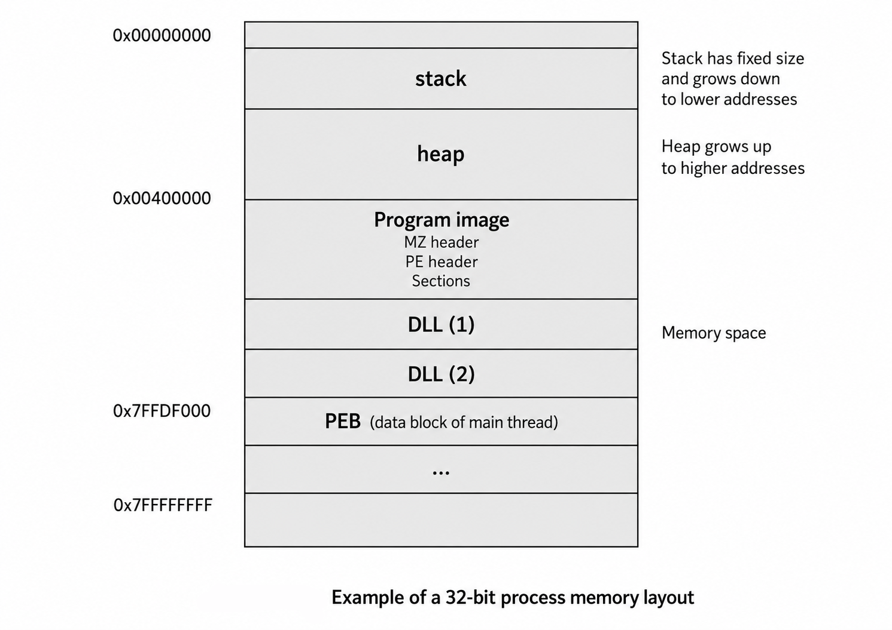

---

### 11.2 Memoria virtual y memoria física

Cada proceso tiene su propio espacio de memoria virtual. Esto significa que, desde el punto de vista del proceso, parece disponer de un rango de memoria propio e independiente.

En ese espacio de memoria virtual se cargan diferentes elementos, como:

* La imagen principal del programa.
* Las DLL necesarias.
* La pila.
* El heap.
* Las estructuras internas del proceso.
* Otros rangos auxiliares de memoria.

La memoria virtual no siempre corresponde directamente con la memoria física. Windows mantiene un sistema de mapeo que traduce direcciones virtuales a direcciones físicas cuando es necesario.

Además, cada región de memoria puede tener permisos distintos, por ejemplo:

```text
READ | WRITE
READ | EXECUTE
READ | WRITE | EXECUTE
```

Estos permisos son muy importantes en análisis de malware. Una región con permisos de lectura, escritura y ejecución al mismo tiempo puede ser sospechosa, ya que puede indicar código automodificable, shellcode o técnicas de desempaquetado dinámico.

La memoria virtual también permite aislar procesos entre sí. Un proceso no debería poder acceder directamente a la memoria de otro proceso salvo que utilice mecanismos permitidos por el sistema operativo, como determinadas APIs de Windows.


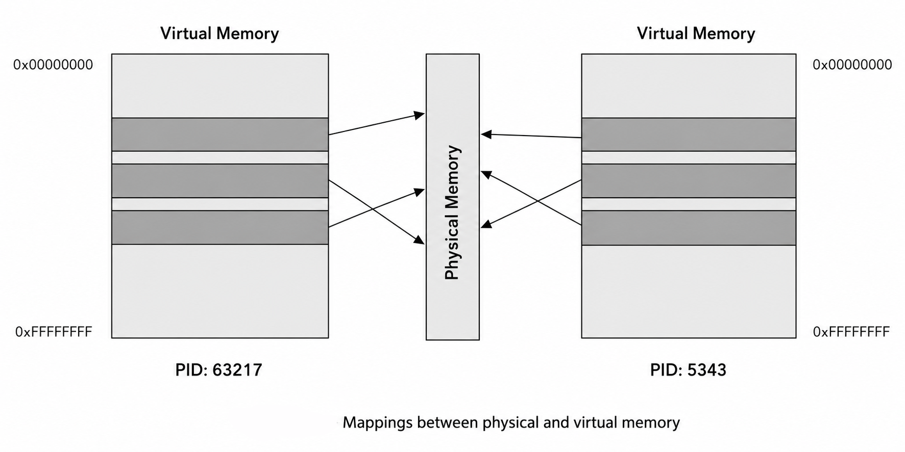

---

### 11.3 ¿Qué es un hilo?

Un hilo, o *thread*, representa una ruta de ejecución dentro de un proceso.

Un proceso puede tener uno o varios hilos ejecutándose de forma simultánea. Cada hilo mantiene su propio estado de ejecución, incluyendo:

* Registros.
* Pila.
* Puntero de instrucción.
* Último error.
* Identificador de hilo.
* Información relacionada con el manejo de excepciones.

Aunque cada hilo tiene su propio estado, todos los hilos de un mismo proceso comparten los recursos del proceso. Esto incluye la memoria virtual, los archivos abiertos, los sockets, las DLL cargadas y otros objetos del sistema.

Windows asigna a cada hilo pequeños intervalos de tiempo de ejecución. Cuando el sistema operativo cambia de un hilo a otro, guarda el estado completo del hilo actual para poder reanudarlo posteriormente desde el mismo punto.

Este mecanismo se conoce como cambio de contexto.

En malware, los hilos son especialmente relevantes porque una muestra puede crear hilos adicionales para realizar tareas en paralelo, como:

* Comunicación con un servidor C2.
* Ejecución de payloads.
* Monitorización del sistema.
* Persistencia.
* Inyección de código.
* Ejecución de comandos recibidos remotamente.


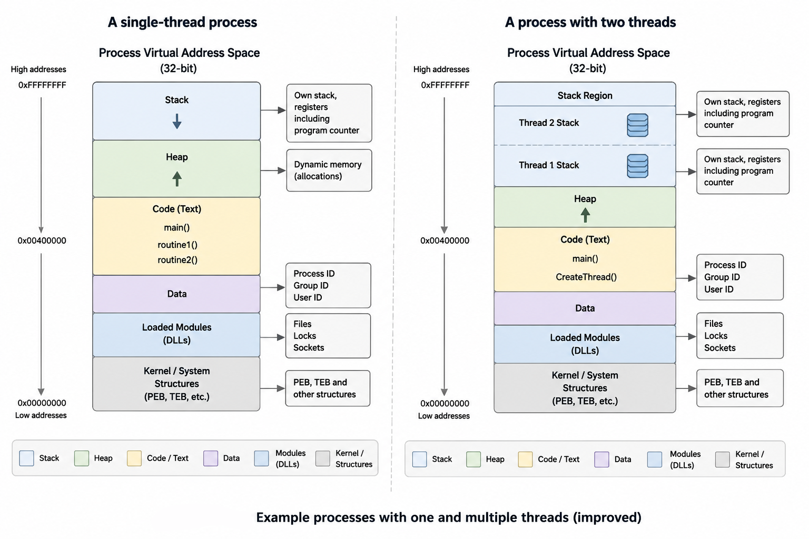


---

### 11.4 Estructuras TIB, TEB y PEB

Windows utiliza varias estructuras internas para almacenar información sobre procesos e hilos. Entre las más importantes se encuentran:

* `TIB`
* `TEB`
* `PEB`

Estas estructuras se almacenan dentro de la memoria del proceso y pueden ser consultadas por el propio código en ejecución.

En 32 bits, suelen accederse mediante el registro de segmento `FS`.
En 64 bits, suelen accederse mediante el registro de segmento `GS`.

Un ejemplo de acceso en ensamblador sería:

```asm
mov eax, DWORD PTR FS:[XX]
```

---

#### 11.4.1 TIB

El `TIB`, o *Thread Information Block*, contiene información relacionada con un hilo concreto.

Entre otros datos, puede incluir información utilizada para el manejo de errores y excepciones.

---

#### 11.4.2 TEB

El `TEB`, o *Thread Environment Block*, es una estructura más amplia relacionada con el hilo.

El TEB comienza con el TIB y continúa con otros campos adicionales asociados al hilo. Por este motivo, en muchos contextos los términos TIB y TEB se utilizan de forma intercambiable.

Cada hilo de un proceso tiene su propio TEB.

---

#### 11.4.3 PEB

El `PEB`, o *Process Environment Block*, contiene información general sobre el proceso.

Entre los datos que puede incluir se encuentran:

* Nombre del proceso.
* PID.
* Lista de módulos cargados.
* Información sobre DLLs.
* Parámetros del proceso.
* Información útil para el cargador de Windows.

La lista de módulos del PEB es especialmente interesante en análisis de malware, ya que permite conocer qué archivos PE se han cargado en memoria, incluyendo el ejecutable principal y sus DLLs.

El PEB también es utilizado frecuentemente por malware para detectar depuradores. Por ejemplo, algunas muestras consultan campos internos del PEB para comprobar si el proceso está siendo analizado.

---

### 11.5 Creación de un proceso paso a paso

Cuando Windows ejecuta un archivo PE, realiza una serie de pasos para crear el proceso y prepararlo para su ejecución.

---

#### 11.5.1 Inicio del programa

Cuando el usuario ejecuta un programa, por ejemplo haciendo doble clic sobre `calc.exe`, otro proceso ya existente, como `explorer.exe`, solicita al sistema operativo la creación del nuevo proceso.

Para ello, normalmente se utiliza una API como:

```c
CreateProcessA
```

Esta API comunica al sistema operativo que debe crear un nuevo proceso e iniciar su ejecución.

---

#### 11.5.2 Creación de estructuras internas

Windows crea una estructura interna en el kernel para representar el nuevo proceso. Esta estructura se conoce como `EPROCESS`.

Durante esta fase, Windows:

* Crea la estructura del proceso.
* Asigna un identificador único o PID.
* Establece el PID del proceso padre.
* Inicializa información básica necesaria para la ejecución.

Por ejemplo, si `explorer.exe` lanza `calc.exe`, el proceso `calc.exe` tendrá como proceso padre a `explorer.exe`.

---

#### 11.5.3 Inicialización de la memoria virtual

Después de crear las estructuras internas del proceso, Windows prepara su espacio de memoria virtual.

En esta fase, el sistema operativo:

* Reserva memoria para el proceso.
* Crea el mapa de memoria virtual.
* Inicializa la estructura PEB.
* Carga librerías básicas necesarias.

Entre las DLL principales que suelen cargarse se encuentran:

```text
ntdll.dll
kernel32.dll
```

Estas librerías proporcionan funciones esenciales para la interacción entre el programa, el subsistema de Windows y el kernel.


---

#### 11.5.4 Carga del archivo PE

Una vez inicializado el proceso, Windows comienza a cargar el archivo PE en memoria.

Durante esta fase, el cargador de Windows:

* Lee las cabeceras del PE.
* Carga las secciones en memoria.
* Carga las DLL requeridas.
* Resuelve las APIs importadas.
* Guarda las direcciones de las funciones importadas en la tabla correspondiente.

Esto permite que el código del programa pueda llamar posteriormente a funciones externas como `CreateFileA`, `LoadLibraryA`, `GetProcAddress`, `VirtualAlloc` o cualquier otra API importada.

---

#### 11.5.5 Inicio de la ejecución

Finalmente, Windows crea el primer hilo del proceso.

Este hilo realiza ciertas tareas de inicialización y después transfiere la ejecución al punto de entrada del archivo PE.

El punto de entrada se encuentra definido en el campo:

```text
AddressOfEntryPoint
```

Sin embargo, si existen TLS callbacks, estos pueden ejecutarse antes del punto de entrada principal. Esto es muy importante en análisis de malware, ya que algunas muestras utilizan TLS callbacks para ejecutar código antes de que el analista llegue al supuesto inicio del programa.

---

### 11.6 Carga de un archivo PE paso a paso

La carga de un archivo PE en memoria sigue una secuencia concreta. Este proceso es realizado por el cargador de Windows.

---

#### 11.6.1 Análisis de las cabeceras

Primero, Windows analiza la cabecera DOS para localizar la cabecera PE.

Después analiza las estructuras principales del PE, como:

* `IMAGE_FILE_HEADER`
* `IMAGE_OPTIONAL_HEADER`

De estas cabeceras obtiene información fundamental, como:

```text
ImageBase
NumberOfSections
SizeOfImage
```

`ImageBase` indica la dirección preferida donde el PE debería cargarse en memoria.

`NumberOfSections` indica cuántas secciones tiene el archivo.

`SizeOfImage` indica el tamaño total que ocupará el PE una vez cargado en memoria.

---

#### 11.6.2 Análisis de la tabla de secciones

Después, el cargador analiza la tabla de secciones.

Para cada sección obtiene información como:

```text
VirtualAddress
VirtualSize
PointerToRawData
SizeOfRawData
Characteristics
```

Estos campos permiten saber:

* Dónde se encuentra la sección en disco.
* Dónde debe colocarse en memoria.
* Qué tamaño tendrá.
* Qué permisos tendrá.
* Qué contenido debe copiarse.

Esta diferencia entre el archivo en disco y su representación en memoria es clave para entender cómo se ejecuta realmente un PE.

---

#### 11.6.3 Mapeo del archivo en memoria

El cargador copia las cabeceras y las secciones del PE al espacio de memoria virtual del proceso.

Para ello utiliza valores como:

```text
SectionAlignment
VirtualAddress
VirtualSize
```

Las secciones no tienen por qué ocupar exactamente la misma posición en disco que en memoria. Por ejemplo, una sección puede empezar en el offset `0x400` dentro del archivo, pero cargarse en memoria en la dirección relativa `0x1000`.

Si los valores no están correctamente alineados, el cargador los ajusta según el valor de `SectionAlignment`.

Este paso explica por qué en análisis de malware es necesario diferenciar entre:

* Offset en disco.
* RVA.
* VA.


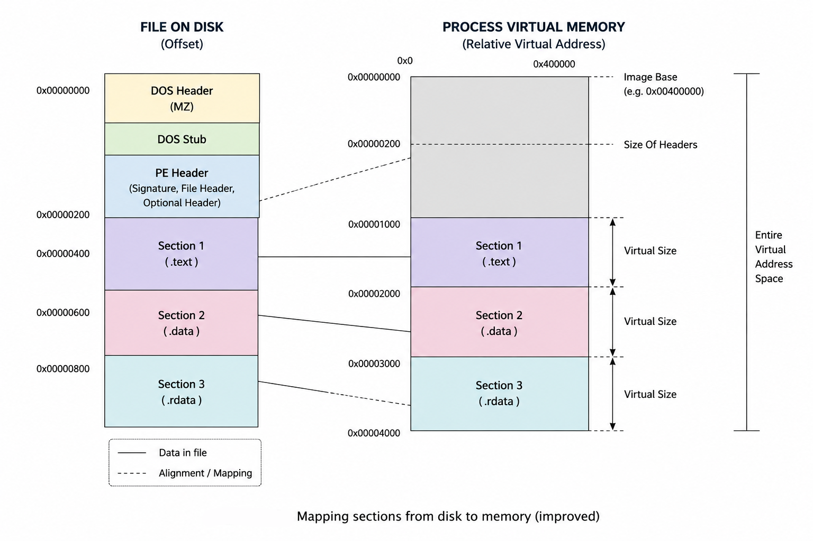

---

#### 11.6.4 Carga de librerías externas

Después de mapear el PE principal, Windows carga las DLL necesarias.

Este proceso puede ser recursivo, ya que una DLL puede depender de otras DLLs.

Una vez cargadas las librerías, el cargador localiza las funciones importadas y escribe sus direcciones reales en memoria dentro de la tabla de importaciones del PE.

Esto permite que el programa pueda llamar correctamente a funciones externas durante su ejecución.

En malware, esta fase es muy importante porque algunas muestras intentan ocultar sus imports y resolver APIs dinámicamente mediante funciones como:

```c
LoadLibraryA
GetProcAddress
```

---

#### 11.6.5 Aplicación de relocations

Si el PE no puede cargarse en su dirección preferida indicada por `ImageBase`, Windows debe cargarlo en otra dirección.

Cuando esto ocurre, las direcciones absolutas del código pueden dejar de ser válidas.

Para corregirlo, el cargador utiliza la tabla de relocations, si existe. Esta tabla permite ajustar las direcciones internas del programa según la nueva dirección base.

Este proceso se conoce como relocación.

Si un binario no tiene tabla de relocations y no puede cargarse en su `ImageBase`, pueden producirse errores de carga o ejecución.

---

#### 11.6.6 Transferencia al punto de entrada

Una vez que el PE está cargado, las DLL están resueltas y las relocations aplicadas, Windows puede iniciar la ejecución.

Para ello, el primer hilo del proceso acaba ejecutando el punto de entrada del programa.

En condiciones normales, la ejecución comienza en:

```text
ImageBase + AddressOfEntryPoint
```

No obstante, algunas técnicas anti-reverse engineering pueden alterar este flujo o ejecutar código antes del punto de entrada, por ejemplo mediante TLS callbacks u otros mecanismos.

---

### 11.7 Procesos WOW64

WOW64 es el subsistema que permite ejecutar programas de 32 bits en sistemas Windows de 64 bits.

El nombre WOW64 significa:

```text
Windows 32-bit On Windows 64-bit
```

Cuando un proceso de 32 bits se ejecuta en un sistema operativo de 64 bits, Windows crea un entorno de compatibilidad que permite que ese proceso funcione como si estuviera en un entorno de 32 bits.

Este subsistema está implementado principalmente mediante las siguientes DLLs:

```text
wow64.dll
wow64cpu.dll
wow64win.dll
```

Estas DLLs proporcionan una capa intermedia entre el proceso de 32 bits y el sistema operativo de 64 bits.

En lugar de comunicarse directamente con el kernel, el proceso de 32 bits pasa por esta capa de emulación. En determinados momentos, WOW64 cambia de modo x86 a modo x64 para comunicarse con componentes nativos de 64 bits, como `ntdll.dll`.

---

### 11.8 Importancia de WOW64 en análisis de malware

WOW64 es relevante en análisis de malware porque muchas muestras necesitan saber en qué tipo de entorno se están ejecutando.

Un malware puede comprobar si se está ejecutando como proceso de 32 bits dentro de un sistema de 64 bits utilizando APIs como:

```c
IsWow64Process
```

Esta información puede utilizarse para decidir:

* Qué payload ejecutar.
* Qué rutas del sistema utilizar.
* Qué claves del registro modificar.
* Qué técnica de inyección aplicar.
* Si debe continuar ejecutándose o finalizar.
* Si está dentro de un entorno de análisis.

Por tanto, detectar el uso de APIs relacionadas con WOW64 puede ayudar a entender si la muestra adapta su comportamiento según la arquitectura del sistema.


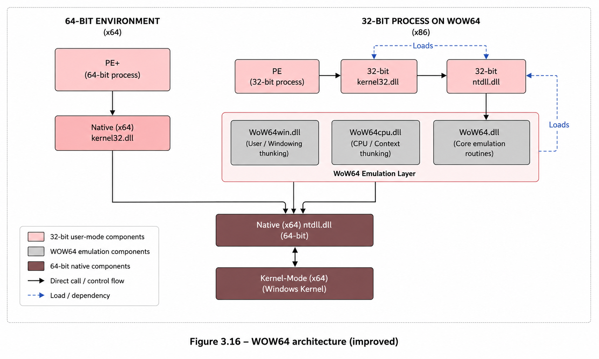

---

### 11.9 Resumen del proceso completo

La carga de un PE y la creación de un proceso pueden resumirse de la siguiente manera:

1. Un proceso existente solicita la creación de un nuevo proceso mediante una API como `CreateProcessA`.
2. Windows crea las estructuras internas del proceso en el kernel.
3. Se asigna un PID y se configura el proceso padre.
4. Se prepara la memoria virtual del proceso.
5. Se inicializa el PEB.
6. Se cargan DLLs básicas como `ntdll.dll` y `kernel32.dll`.
7. El cargador analiza las cabeceras del PE.
8. Se cargan las secciones en memoria.
9. Se cargan las DLL externas necesarias.
10. Se resuelven las APIs importadas.
11. Se aplican relocations si el PE no se carga en su `ImageBase`.
12. Se ejecutan TLS callbacks si existen.
13. Se crea el primer hilo.
14. La ejecución se transfiere al punto de entrada del programa.

Este flujo es esencial para entender cómo Windows transforma un archivo PE almacenado en disco en un programa activo en memoria.

Desde el punto de vista del análisis de malware, conocer este proceso permite detectar comportamientos sospechosos, como ejecución antes del entry point, imports resueltos dinámicamente, secciones con permisos anómalos, inyección de código, uso de WOW64 o manipulación de estructuras internas como el PEB.


## 12. Desempaquetado, descifrado y desofuscación

En análisis de malware es habitual encontrar muestras que no muestran directamente su código real cuando se analizan de forma estática. Para evitar la detección y dificultar la ingeniería inversa, los autores de malware suelen utilizar técnicas como el **empaquetado**, el **cifrado** y la **ofuscación**.

Estas técnicas permiten ocultar partes importantes del programa, como:

* Código malicioso real.
* Cadenas de texto.
* APIs utilizadas.
* Configuración interna.
* Payloads embebidos.
* Tráfico de red.
* Datos exfiltrados o instrucciones del C2.

Por este motivo, antes de analizar en profundidad una muestra, es necesario comprobar si el binario está protegido por alguna de estas técnicas.

---

### 12.1 ¿Qué es un packer?

Un **packer** es una herramienta que comprime, cifra o transforma un archivo ejecutable para modificar su estructura original.

Normalmente, un archivo empaquetado contiene:

* Una versión comprimida o cifrada del programa original.
* Un nuevo código inicial encargado de desempaquetarlo.
* Una estructura PE modificada.
* Secciones nuevas o alteradas.
* Una tabla de importaciones reducida o reconstruida dinámicamente.

El código encargado de desempaquetar el programa se conoce como **stub**.

Cuando el malware se ejecuta, el stub realiza el proceso inverso:

1. Reserva o utiliza memoria.
2. Descifra o descomprime el código original.
3. Reconstruye las partes necesarias del PE.
4. Resuelve imports si es necesario.
5. Transfiere la ejecución al código real del programa.

Ese punto donde comienza finalmente el programa original se conoce como:

```text
OEP = Original Entry Point
```

---

### 12.2 ¿Por qué el malware utiliza packers?

Los packers permiten ocultar el contenido real de una muestra frente al análisis estático.

Un antivirus o una herramienta de análisis puede inspeccionar un archivo en disco y buscar patrones conocidos. Sin embargo, si el código malicioso está comprimido, cifrado u ofuscado, las firmas estáticas pueden no coincidir.

Por tanto, un packer puede ayudar al malware a:

* Evadir firmas estáticas de antivirus.
* Ocultar el código malicioso real.
* Dificultar la lectura del desensamblado.
* Ocultar cadenas, URLs, dominios o comandos.
* Reducir la tabla de importaciones visible.
* Retrasar el análisis hasta tiempo de ejecución.
* Confundir a analistas poco experimentados.

Es importante tener en cuenta que **un packer no implica necesariamente que un archivo sea malicioso**. Muchos programas legítimos usan packers para reducir tamaño o proteger propiedad intelectual. Sin embargo, en malware, su uso suele ser una señal que merece atención.

---

### 12.3 Tipos de herramientas de empaquetado y protección

No todas las herramientas que modifican un ejecutable tienen el mismo objetivo. Podemos distinguir tres grandes categorías.

---

#### 12.3.1 Packers legítimos

Los packers legítimos se utilizan principalmente para comprimir ejecutables y reducir su tamaño.

Ejemplos habituales:

```text
UPX
ASPack
MPRESS
FSG
MEW
```

Estos packers no son maliciosos por sí mismos. Pueden utilizarse tanto en software legítimo como en malware.

Por ejemplo, **UPX** es un packer de código abierto que incluso proporciona una opción oficial para desempaquetar archivos:

```bash
upx -d muestra.exe
```

---

#### 12.3.2 Protectores legales

Los protectores legales están diseñados para dificultar la ingeniería inversa de software legítimo.

Se suelen utilizar para proteger:

* Sistemas de licencias.
* Software comercial.
* Algoritmos propietarios.
* Lógica interna de la aplicación.
* Código frente a cracking o modificación.

Estos protectores pueden incluir:

* Cifrado.
* Ofuscación.
* Anti-debugging.
* Anti-VM.
* Virtualización de código.
* Detección de herramientas de análisis.

Aunque su finalidad original es legítima, también pueden ser abusados por autores de malware.

---

#### 12.3.3 Cifradores maliciosos

Los cifradores maliciosos están diseñados específicamente para proteger malware.

Su objetivo principal no es reducir tamaño ni proteger propiedad intelectual, sino:

* Evadir antivirus.
* Evadir sandboxes.
* Ocultar comportamiento malicioso.
* Dificultar el análisis manual.
* Generar variantes diferentes del mismo malware.

La presencia de un cifrador malicioso suele ser un indicador fuerte de que la muestra tiene intención maliciosa.

---

### 12.4 Diferencia entre packing, cifrado y ofuscación

Aunque estos conceptos están relacionados, no significan exactamente lo mismo.

| Técnica    | Objetivo principal                            | Ejemplo                                   |
| ---------- | --------------------------------------------- | ----------------------------------------- |
| Packing    | Comprimir o encapsular el ejecutable original | UPX                                       |
| Cifrado    | Hacer ilegible el contenido sin una clave     | AES, XOR, RC4                             |
| Ofuscación | Dificultar la comprensión del código          | Control flow flattening, strings cifradas |

En malware moderno es común encontrar las tres técnicas combinadas.

Por ejemplo, una muestra puede estar empaquetada con un stub, tener strings cifradas con XOR y resolver APIs dinámicamente mediante hashes.

---

### 12.5 Cómo identificar una muestra empaquetada

Existen varios indicios que pueden sugerir que un archivo PE está empaquetado.

Ningún indicio por sí solo es definitivo, pero la combinación de varios aumenta la probabilidad.

---

#### 12.5.1 Detección mediante firmas estáticas

Algunas herramientas PE pueden identificar packers conocidos mediante firmas.

Ejemplos de herramientas:

```text
PEiD
CFF Explorer
Detect It Easy
Exeinfo PE
PEStudio
```

Estas herramientas analizan patrones característicos del binario y pueden indicar si la muestra está empaquetada con UPX, ASPack, MPRESS u otro packer conocido.

Limitación importante:

> Si el packer ha sido modificado, personalizado o parcheado, la firma puede no detectarse correctamente.

Por eso no conviene depender únicamente de este método.

---

#### 12.5.2 Nombres sospechosos de secciones

Un PE normal suele tener secciones como:

```text
.text
.data
.rdata
.idata
.rsrc
.reloc
```

En cambio, un PE empaquetado puede tener secciones con nombres poco habituales o asociados a packers:

```text
UPX0
UPX1
.aspack
.stub
.packed
.mpress
Themida
```

También puede haber secciones con nombres aleatorios o sin nombre.

Ejemplo sospechoso:

```text
UPX0
UPX1
.rsrc
```

Esto suele indicar que el archivo ha sido empaquetado con UPX o con una variante modificada.

---

#### 12.5.3 Entry Point fuera de la sección `.text`

En un ejecutable no empaquetado, el punto de entrada suele estar dentro de la sección de código principal:

```text
.text
```

En una muestra empaquetada, el Entry Point puede apuntar a una sección añadida al final del archivo, donde se encuentra el stub desempaquetador.

Esto es sospechoso porque indica que el programa no empieza ejecutando su código real, sino una rutina previa encargada de preparar el código original.

Ejemplo:

```text
Entry Point → UPX1
Entry Point → .stub
Entry Point → sección RWX
```

---

#### 12.5.4 Permisos anómalos en secciones

Los permisos de las secciones también pueden revelar packing.

Una sección `.text` normal suele tener permisos:

```text
READ | EXECUTE
```

Una sección `.data` normal suele tener:

```text
READ | WRITE
```

Sin embargo, en muestras empaquetadas puede aparecer una sección con permisos:

```text
READ | WRITE | EXECUTE
```

Esto es sospechoso porque permite que la misma región de memoria pueda escribirse y ejecutarse.

Este patrón puede aparecer cuando el malware:

* Descifra código en memoria.
* Escribe shellcode.
* Desempaqueta código sobre una sección existente.
* Ejecuta código automodificable.

---

#### 12.5.5 Tabla de importaciones pequeña

Una muestra empaquetada suele tener una tabla de importaciones muy reducida.

En lugar de importar directamente muchas APIs, puede importar solo unas pocas funciones necesarias para desempaquetarse, como:

```text
LoadLibraryA
GetProcAddress
VirtualAlloc
VirtualProtect
ExitProcess
```

Después, en tiempo de ejecución, el stub puede reconstruir la tabla de importaciones manualmente.

Esto permite ocultar APIs relevantes como:

```text
CreateFileA
WriteFile
RegSetValueExA
CreateRemoteThread
InternetOpenA
HttpSendRequestA
connect
send
recv
```

Por eso, una tabla de importaciones pequeña no significa que el malware tenga pocas capacidades. Puede significar que las APIs reales están ocultas y se resolverán dinámicamente.

---

#### 12.5.6 Alta entropía

La entropía mide el grado de aleatoriedad de los datos.

Una sección comprimida o cifrada suele tener alta entropía, porque sus bytes parecen más aleatorios que el código normal.

Indicadores sospechosos:

* Secciones con entropía muy alta.
* Secciones grandes con pocos strings legibles.
* Código aparentemente ilegible en un editor hexadecimal.
* Diferencia notable entre secciones normales y secciones empaquetadas.

Una entropía alta no prueba por sí sola que haya malware, pero puede indicar compresión o cifrado.

---

### 12.6 Proceso general de desempaquetado

El proceso de desempaquetado consiste en recuperar el programa original que se encuentra oculto dentro de la muestra empaquetada.

A nivel general, el flujo es:

```text
Archivo empaquetado
        ↓
Ejecución del stub
        ↓
Descifrado o descompresión en memoria
        ↓
Reconstrucción de imports
        ↓
Transferencia al OEP
        ↓
Volcado de la muestra desempaquetada
```

El objetivo del analista es detener la ejecución justo cuando el código original ya está desempaquetado, pero antes de que el malware real ejecute su funcionalidad principal.

---

### 12.7 Desempaquetado automático

Antes de realizar un desempaquetado manual, conviene probar técnicas automáticas.

Estas técnicas pueden ahorrar tiempo si la muestra utiliza un packer conocido.

---

#### 12.7.1 Desempaquetado oficial

Algunos packers permiten desempaquetar con su propia herramienta.

Ejemplo con UPX:

```bash
upx -d muestra.exe
```

Sin embargo, muchos atacantes modifican muestras empaquetadas con UPX para impedir que la herramienta oficial las desempaquete.

Por ejemplo, pueden alterar:

* Nombres de secciones.
* Magic values.
* Cabeceras internas de UPX.
* Estructura del stub.

En esos casos, restaurar los valores originales puede permitir usar de nuevo el desempaquetador oficial.

---

#### 12.7.2 Desempaquetadores genéricos

Existen herramientas que intentan automatizar el proceso de desempaquetado para varios packers.

Ejemplos:

```text
QuickUnpack
Generic Unpacker
unipacker
```

Estas herramientas pueden funcionar bien con packers conocidos, pero tienen limitaciones.

Riesgos:

* El malware puede detectar la herramienta.
* El desempaquetado puede fallar.
* La muestra puede ejecutarse realmente.
* Puede generarse un dump incompleto.

Por eso deben usarse siempre en un entorno controlado, como una máquina virtual aislada.

---

#### 12.7.3 Emulación

La emulación consiste en simular la ejecución del malware sin ejecutarlo directamente en el sistema real.

Un emulador puede simular:

* CPU.
* Registros.
* Memoria.
* Instrucciones.
* Determinadas APIs.
* Flujo de ejecución.

Esto permite detectar cuándo el código se desempaqueta en memoria.

Una técnica útil es colocar un breakpoint cuando el registro de instrucción apunta a una zona de memoria modificada recientemente.

Conceptualmente:

```text
Si EIP/RIP apunta a memoria recién escrita,
probablemente el código desempaquetado está empezando a ejecutarse.
```

---

#### 12.7.4 Volcados de memoria

Otra técnica consiste en ejecutar la muestra y obtener un volcado de memoria del proceso.

Esto puede permitir recuperar el código desempaquetado después de que el stub lo haya reconstruido en memoria.

Ventajas:

* Es rápido.
* Es útil frente a ciertos packers.
* Permite extraer código, strings o configuración.
* Puede ayudar en análisis estático posterior.

Limitaciones:

* El dump puede no ser ejecutable.
* Las secciones pueden no coincidir con el PE original.
* La tabla de importaciones puede estar rota.
* Puede requerir reconstrucción manual.
* Puede faltar algún módulo si el malware lo libera antes del dump.

---

### 12.8 Desempaquetado manual

El desempaquetado manual se utiliza cuando las técnicas automáticas fallan.

Consiste en depurar la muestra, observar cómo se desempaqueta y detenerla justo en el momento adecuado para obtener el código original.

El objetivo principal es localizar el:

```text
OEP = Original Entry Point
```

Una vez localizado el OEP, se puede volcar la muestra desde memoria y reparar su tabla de importaciones.

---

### 12.9 Técnicas habituales de desempaquetado manual

#### 12.9.1 Breakpoint de memoria en ejecución

Esta técnica consiste en impedir la ejecución de una sección hasta que el stub intente transferirle el control.

Flujo general:

1. Identificar la primera sección donde debería estar el código original.
2. Quitar permisos de ejecución a esa región.
3. Activar DEP si es necesario.
4. Ejecutar la muestra.
5. Esperar a que el stub intente ejecutar el código desempaquetado.
6. Capturar la violación de acceso.
7. Identificar el OEP.

Esta técnica es útil cuando el packer desempaqueta el código en la misma zona de memoria donde estaba el PE original.

---

#### 12.9.2 Breakpoints en `VirtualProtect`

Muchos stubs modifican permisos de memoria para permitir que una sección pase de ser escribible a ejecutable.

La API más importante en este contexto es:

```text
VirtualProtect
```

Si el malware llama a `VirtualProtect` para convertir una región en ejecutable, puede ser una señal de que acaba de desempaquetar código.

El analista puede colocar un breakpoint en esta API y revisar:

* Dirección base modificada.
* Tamaño de la región.
* Nuevos permisos asignados.
* Si se añade permiso `EXECUTE`.

Permisos sospechosos:

```text
PAGE_EXECUTE_READ
PAGE_EXECUTE_READWRITE
```

---

#### 12.9.3 Retrotrazado de la pila de llamadas

Otra técnica consiste en dejar que el malware se ejecute hasta una API conocida y después retroceder por la pila de llamadas.

El objetivo es encontrar desde dónde fue llamada esa API dentro del código desempaquetado.

Flujo:

1. Colocar breakpoints en APIs comunes.
2. Ejecutar la muestra.
3. Cuando se detenga, revisar la call stack.
4. Seguir las direcciones de retorno.
5. Localizar la primera llamada desde código desempaquetado.
6. Subir en el desensamblado hasta encontrar el inicio de la función.
7. Marcar esa dirección como posible OEP.

APIs útiles para esta técnica:

```text
GetModuleFileNameA
GetCommandLineA
CreateFileA
VirtualAlloc
HeapAlloc
memset
```

Esta técnica puede ser rápida, pero debe usarse con cuidado porque puede implicar que parte del malware real ya se haya ejecutado.

---

#### 12.9.4 Monitorización de memoria asignada

Algunos malware desempaquetan su payload en una nueva región de memoria asignada dinámicamente.

APIs importantes:

```text
VirtualAlloc
VirtualAllocEx
VirtualAllocExNuma
HeapAlloc
LocalAlloc
GlobalAlloc
RtlAllocateHeap
```

El procedimiento general es:

1. Colocar breakpoints en funciones de asignación de memoria.
2. Ejecutar la muestra.
3. Observar bloques grandes de memoria asignada.
4. Colocar breakpoints de escritura sobre esos bloques.
5. Esperar a que el payload se escriba o descifre.
6. Volcar la región cuando el código esté completamente desempaquetado.

También conviene vigilar:

```text
WriteProcessMemory
VirtualProtect
```

`WriteProcessMemory` puede indicar inyección de código en otro proceso o en el propio proceso.

---

#### 12.9.5 Desempaquetado in-place

En algunos casos, el malware descifra el código directamente en la misma sección donde estaba almacenado.

Este enfoque se conoce como:

```text
in-place unpacking
```

Suele observarse en secciones con permisos:

```text
WRITE | EXECUTE
```

Pasos generales:

1. Buscar un bloque cifrado grande.
2. Identificar cuándo se lee o modifica.
3. Colocar breakpoints de lectura o escritura.
4. Ejecutar la muestra.
5. Esperar a que finalice la rutina de descifrado.
6. Volcar la sección ya descifrada.

Este método es útil cuando no hay una nueva asignación de memoria, sino que el código se transforma dentro del propio espacio del PE.

---

#### 12.9.6 Búsqueda de transferencia de control al OEP

Cuando el stub termina de desempaquetar, debe transferir la ejecución al código original.

Esto puede hacerse mediante instrucciones como:

```asm
jmp eax
jmp ecx
jmp [esp]
push <OEP>
ret
```

Una transferencia indirecta como `jmp eax` o `jmp ecx` al final de una rutina de desempaquetado puede ser un indicio de salto al OEP.

En IDA, se puede buscar instrucciones `jmp` con:

```text
Alt + T
```

y revisar aquellas que parezcan anómalas o que salten a regiones recién modificadas.

---

### 12.10 Volcado de la muestra desempaquetada

Una vez localizado el OEP y confirmado que el código original está desempaquetado en memoria, se puede realizar un volcado del proceso.

Herramientas habituales:

```text
OllyDump
LordPE
PETools
Scylla
CHimpREC
```

En 32 bits se suelen usar herramientas como OllyDump, LordPE o PETools.

En 64 bits son más habituales:

```text
Scylla
CHimpREC
```

Durante el volcado es importante:

* Establecer correctamente el nuevo Entry Point.
* Volcar las secciones correctas.
* Comprobar si la imagen está alineada.
* Revisar si la tabla de importaciones necesita reparación.
* Verificar si el PE resultante puede abrirse en herramientas de análisis.

---

### 12.11 Reparación de la tabla de importaciones

Cuando un PE se carga en memoria, el cargador de Windows resuelve las APIs importadas y rellena la IAT con direcciones reales de memoria.

Por eso, al volcar una muestra desde memoria, la tabla de importaciones puede quedar en un estado no válido para un archivo en disco.

El problema principal es que el archivo volcado puede contener direcciones absolutas de APIs en lugar de referencias correctas a nombres de funciones o valores ordinales.

Para reparar la tabla de importaciones hay que:

1. Localizar la IAT.
2. Identificar qué API corresponde a cada dirección.
3. Reconstruir los nombres de DLLs y funciones.
4. Crear o corregir las estructuras de importación.
5. Guardar un nuevo PE funcional.

Herramientas útiles:

```text
ImpREC
Scylla
CHimpREC
```

Flujo típico con ImpREC:

1. Volcar la muestra sin reconstruir imports.
2. Abrir ImpREC.
3. Seleccionar el proceso depurado.
4. Introducir el OEP correcto.
5. Ejecutar `IAT AutoSearch`.
6. Pulsar `Get Imports`.
7. Eliminar entradas inválidas.
8. Usar `Fix Dump`.
9. Guardar el PE reconstruido.

---

### 12.12 Cifrado en malware

Además del packing, el malware puede utilizar cifrado para ocultar información sensible.

Puede cifrar:

* Strings.
* URLs.
* Dominios.
* Direcciones IP.
* Configuración interna.
* APIs.
* Payloads.
* Tráfico de red.
* Datos robados.

El cifrado consiste en transformar información legible en datos ilegibles mediante una clave.

La diferencia principal frente a la codificación o la compresión es que el cifrado utiliza una clave y su objetivo es proteger u ocultar el contenido.

---

### 12.13 Diferencia entre codificación, compresión y cifrado

| Concepto     | Usa clave | Objetivo                        | Ejemplo                 |
| ------------ | --------: | ------------------------------- | ----------------------- |
| Codificación |        No | Cambiar representación de datos | Base64                  |
| Compresión   |        No | Reducir tamaño                  | ZIP, UPX                |
| Cifrado      |        Sí | Ocultar contenido               | AES, RSA, XOR con clave |

En malware, estas técnicas pueden combinarse.

Ejemplo:

```text
Payload comprimido → cifrado → empaquetado dentro del PE
```

---

### 12.14 Ideas clave para análisis de malware

A la hora de analizar una muestra sospechosa, conviene revisar:

* Si el Entry Point está en una sección anómala.
* Si existen secciones con nombres de packers.
* Si hay secciones con alta entropía.
* Si la tabla de importaciones es demasiado pequeña.
* Si aparecen APIs como `VirtualAlloc`, `VirtualProtect` o `GetProcAddress`.
* Si se resuelven APIs dinámicamente.
* Si hay saltos indirectos al final del stub.
* Si el código real aparece solo después de ejecutar la muestra.
* Si es necesario localizar el OEP.
* Si el dump requiere reparación de imports.

---

### 12.15 Resumen

El desempaquetado, el descifrado y la desofuscación son fases fundamentales en el análisis de malware moderno.

Un archivo empaquetado no muestra directamente su código real en disco. En su lugar, ejecuta primero un stub que reconstruye el programa original en memoria y después transfiere el control al OEP.

Para analizar correctamente este tipo de muestras, el analista debe ser capaz de:

* Detectar indicios de packing.
* Identificar el tipo de protección utilizada.
* Probar desempaquetado automático cuando sea posible.
* Realizar desempaquetado manual si es necesario.
* Localizar el OEP.
* Volcar la muestra desde memoria.
* Reparar la tabla de importaciones.
* Analizar posibles rutinas de cifrado y ofuscación.

Dominar estas técnicas permite acceder al código real del malware y facilita el análisis de sus capacidades, persistencia, comunicación, configuración y payloads.


_________________________________


## 13. Desensamblado y descompilado

Una vez identificada la estructura del binario, sus secciones, imports, posibles indicios de packing y, si es necesario, tras haber desempaquetado la muestra, el siguiente paso consiste en analizar su código.

Para ello se utilizan dos técnicas fundamentales en ingeniería inversa:

* **Desensamblado**
* **Descompilado**

Ambas permiten estudiar el funcionamiento interno de un programa sin disponer de su código fuente original. Sin embargo, no ofrecen el mismo nivel de abstracción ni se interpretan de la misma manera.

---

### 13.1 ¿Qué es el desensamblado?

El **desensamblado** es el proceso de traducir el código máquina de un binario a instrucciones ensamblador legibles por una persona.

Cuando un programa se compila, el código fuente se transforma en instrucciones que la CPU puede ejecutar. Estas instrucciones están representadas en bytes. El desensamblador interpreta esos bytes y los convierte en instrucciones ensamblador.

Ejemplo simplificado:

```asm
push ebp
mov ebp, esp
sub esp, 0x20
call 0x401050
mov esp, ebp
pop ebp
ret
```

Estas instrucciones permiten observar exactamente qué operaciones ejecuta el procesador.

En análisis de malware, el desensamblado es esencial porque permite estudiar:

* Flujo de ejecución.
* Llamadas a APIs.
* Manipulación de memoria.
* Rutinas de cifrado.
* Comparaciones y saltos condicionales.
* Creación de procesos o hilos.
* Acceso a archivos, registro o red.
* Técnicas anti-debugging y anti-VM.
* Resolución dinámica de funciones.

---

### 13.2 ¿Qué es el descompilado?

El **descompilado** es el proceso de traducir el código máquina o ensamblador a una representación de alto nivel similar a C.

El objetivo no es recuperar exactamente el código fuente original, sino generar un pseudocódigo más fácil de leer.

Ejemplo de pseudocódigo descompilado:

```c
int main() {
    char buffer[32];

    GetComputerNameA(buffer, &size);

    if (strcmp(buffer, "SANDBOX") == 0) {
        ExitProcess(0);
    }

    connect_to_c2();
    return 0;
}
```

Este código no tiene por qué coincidir con el código original escrito por el programador, pero ayuda a entender la lógica general de la función.

El descompilado es especialmente útil para:

* Comprender funciones complejas.
* Identificar estructuras condicionales.
* Seguir bucles.
* Reconocer variables locales.
* Entender algoritmos.
* Documentar el comportamiento del malware.
* Localizar funciones relevantes más rápidamente.

---

### 13.3 Diferencia entre desensamblado y descompilado

Aunque ambos procesos están relacionados, no son lo mismo.

| Técnica                | Nivel de abstracción | Resultado                         | Uso principal                                  |
| ---------------------- | -------------------: | --------------------------------- | ---------------------------------------------- |
| Desensamblado          |           Bajo nivel | Código ensamblador                | Ver instrucciones reales ejecutadas por la CPU |
| Descompilado           |           Alto nivel | Pseudocódigo similar a C          | Entender la lógica de forma más rápida         |
| Código fuente original |      Alto nivel real | Código escrito por el programador | Normalmente no disponible en malware           |

El desensamblado es más preciso, pero más difícil de leer.

El descompilado es más cómodo, pero puede cometer errores de interpretación.

Por este motivo, en análisis de malware se recomienda usar ambos enfoques de forma combinada.

---

### 13.4 Herramientas habituales

Para realizar desensamblado y descompilado se utilizan herramientas especializadas.

Algunas de las más comunes son:

```text
IDA Pro
Ghidra
Binary Ninja
Radare2
Cutter
x64dbg
x32dbg
OllyDbg
objdump
ndisasm
```

#### IDA Pro

IDA Pro es una de las herramientas más utilizadas en ingeniería inversa profesional. Permite desensamblar binarios, analizar referencias cruzadas, renombrar funciones, crear estructuras y utilizar un descompilador para obtener pseudocódigo.

#### Ghidra

Ghidra es una herramienta gratuita desarrollada por la NSA. Incluye desensamblador, descompilador, análisis de funciones, referencias cruzadas, visualización de grafos y soporte para múltiples arquitecturas.

#### x32dbg y x64dbg

x32dbg y x64dbg son depuradores para Windows. No solo permiten ver el código desensamblado, sino también ejecutarlo paso a paso, inspeccionar registros, memoria, pila y llamadas a APIs.

#### objdump

`objdump` es una herramienta común en entornos Linux para inspeccionar binarios y obtener desensamblado.

Ejemplo:

```bash
objdump -d muestra
```

---

### 13.5 Flujo básico de análisis con desensamblador

Un flujo habitual al abrir una muestra en un desensamblador sería:

1. Identificar la arquitectura del binario.
2. Comprobar el punto de entrada.
3. Revisar las secciones.
4. Analizar la tabla de importaciones.
5. Localizar strings relevantes.
6. Revisar funciones detectadas automáticamente.
7. Seguir referencias cruzadas.
8. Renombrar funciones importantes.
9. Analizar llamadas a APIs.
10. Reconstruir la lógica del programa.
11. Documentar comportamiento sospechoso.

El análisis no consiste únicamente en leer instrucciones una a una. La clave está en identificar patrones de comportamiento.

---

### 13.6 Conceptos clave en ensamblador

Para interpretar correctamente el desensamblado, es necesario conocer algunos conceptos básicos de ensamblador.

---

#### 13.6.1 Registros

Los registros son pequeñas zonas de almacenamiento dentro de la CPU.

En arquitectura x86 son comunes:

```text
EAX
EBX
ECX
EDX
ESI
EDI
ESP
EBP
EIP
```

En arquitectura x64 aparecen registros extendidos:

```text
RAX
RBX
RCX
RDX
RSI
RDI
RSP
RBP
RIP
R8 - R15
```

Algunos registros tienen usos habituales:

| Registro  | Uso habitual                                          |
| --------- | ----------------------------------------------------- |
| `EAX/RAX` | Valor de retorno de funciones                         |
| `ESP/RSP` | Puntero de pila                                       |
| `EBP/RBP` | Base del stack frame                                  |
| `EIP/RIP` | Dirección de la siguiente instrucción                 |
| `ECX/RCX` | Contadores o primer argumento en algunas convenciones |
| `EDX/RDX` | Datos auxiliares o argumentos                         |

---

#### 13.6.2 Instrucciones comunes

Algunas instrucciones aparecen constantemente durante el análisis.

```asm
mov eax, ebx
```

Copia un valor de un origen a un destino.

```asm
push eax
```

Introduce un valor en la pila.

```asm
pop eax
```

Extrae un valor de la pila.

```asm
call 0x401000
```

Llama a una función.

```asm
ret
```

Retorna de una función.

```asm
cmp eax, 0
```

Compara dos valores.

```asm
jne 0x401050
```

Salta si la comparación anterior no era igual.

```asm
jmp 0x401080
```

Salta incondicionalmente a otra dirección.

---

### 13.7 Funciones y prólogos

Muchas funciones compiladas presentan un prólogo típico.

En x86 puede aparecer algo como:

```asm
push ebp
mov ebp, esp
sub esp, 0x20
```

Esto prepara un nuevo stack frame para la función.

Al final de la función puede aparecer:

```asm
mov esp, ebp
pop ebp
ret
```

o simplemente:

```asm
leave
ret
```

Reconocer estos patrones ayuda a delimitar funciones, entender variables locales y seguir el flujo de llamadas.

---

### 13.8 Call graph y control flow graph

Los desensambladores modernos suelen mostrar dos vistas muy útiles:

* **Call graph**
* **Control flow graph**

El **call graph** muestra qué funciones llaman a otras funciones.

El **control flow graph** muestra los bloques básicos dentro de una función y cómo se conectan mediante saltos condicionales o incondicionales.

Estas vistas son muy útiles para analizar malware porque permiten ver rápidamente:

* Ramas de ejecución.
* Bucles.
* Condiciones.
* Funciones sospechosas.
* Caminos alternativos.
* Código muerto o basura.
* Técnicas de ofuscación del flujo.

---

### 13.9 Referencias cruzadas

Las **referencias cruzadas**, o **xrefs**, indican desde dónde se utiliza una dirección, función, string o variable.

Son una de las herramientas más importantes en análisis estático.

Por ejemplo, si encontramos la string:

```text
Software\Microsoft\Windows\CurrentVersion\Run
```

podemos buscar sus referencias cruzadas para saber qué función la utiliza.

Si esa función llama a:

```text
RegSetValueExA
```

podemos inferir que el malware podría estar intentando establecer persistencia en el registro.

Las xrefs permiten pasar de un dato interesante al código que lo utiliza.

---

### 13.10 Uso de strings en el desensamblado

Las cadenas de texto son uno de los mejores puntos de partida en análisis estático.

Ejemplos de strings relevantes:

```text
http://
https://
cmd.exe
powershell.exe
CreateRemoteThread
Software\Microsoft\Windows\CurrentVersion\Run
User-Agent
Mutex
POST
GET
```

Sin embargo, en malware avanzado muchas strings pueden estar cifradas u ofuscadas. En ese caso, puede que solo aparezcan en memoria durante la ejecución.

Cuando una string aparece en claro, conviene:

1. Revisar su contenido.
2. Buscar sus referencias cruzadas.
3. Identificar la función que la utiliza.
4. Analizar qué APIs se llaman cerca.
5. Renombrar la función según su comportamiento.

---

### 13.11 Análisis de APIs importadas

Las APIs importadas pueden revelar capacidades del programa.

Por ejemplo:

| API                  | Posible significado                  |
| -------------------- | ------------------------------------ |
| `CreateFileA`        | Acceso a archivos                    |
| `WriteFile`          | Escritura de archivos                |
| `RegSetValueExA`     | Modificación del registro            |
| `CreateProcessA`     | Creación de procesos                 |
| `VirtualAlloc`       | Reserva de memoria                   |
| `VirtualProtect`     | Cambio de permisos de memoria        |
| `WriteProcessMemory` | Escritura en memoria de otro proceso |
| `CreateRemoteThread` | Posible inyección de código          |
| `InternetOpenA`      | Uso de WinINet                       |
| `connect`            | Comunicación por sockets             |
| `CryptEncrypt`       | Cifrado                              |
| `IsDebuggerPresent`  | Detección de depurador               |

No obstante, una muestra puede ocultar sus APIs reales mediante resolución dinámica.

En ese caso, en lugar de ver directamente muchas imports, podemos encontrar funciones como:

```text
LoadLibraryA
GetProcAddress
```

o incluso resolución mediante hashes.

---

### 13.12 Resolución dinámica de APIs

El malware puede evitar declarar sus imports reales en la tabla de importaciones.

Para ello, puede cargar librerías y resolver funciones en tiempo de ejecución.

Ejemplo conceptual:

```c
HMODULE hKernel32 = LoadLibraryA("kernel32.dll");
FARPROC pVirtualAlloc = GetProcAddress(hKernel32, "VirtualAlloc");
```

En muestras más avanzadas, el nombre de la API puede no aparecer en claro. En su lugar, el malware puede calcular un hash y compararlo con hashes predefinidos.

Este patrón suele implicar:

* Recorrer el PEB.
* Localizar módulos cargados.
* Acceder a la Export Table.
* Calcular hashes de nombres de funciones.
* Comparar con valores constantes.
* Guardar punteros a las APIs resueltas.

Este comportamiento es frecuente en shellcode, loaders y malware empaquetado.

---

### 13.13 Descompilado en Ghidra o IDA

El descompilador genera una vista aproximada en pseudocódigo.

Ejemplo de ensamblador:

```asm
push offset aKernel32Dll
call LoadLibraryA
mov [ebp+hModule], eax
push offset aVirtualAlloc
push [ebp+hModule]
call GetProcAddress
```

Posible pseudocódigo:

```c
hModule = LoadLibraryA("kernel32.dll");
pVirtualAlloc = GetProcAddress(hModule, "VirtualAlloc");
```

El pseudocódigo facilita la comprensión, pero debe verificarse con el desensamblado.

El descompilador puede equivocarse en:

* Tipos de datos.
* Tamaños de variables.
* Convenciones de llamada.
* Estructuras.
* Punteros.
* Bucles.
* Código ofuscado.
* Funciones indirectas.
* Saltos anómalos.

Por eso, el pseudocódigo no debe tratarse como verdad absoluta.

---

### 13.14 Renombrado de funciones y variables

Una buena práctica durante el análisis es renombrar funciones y variables para documentar la lógica del malware.

Por ejemplo, una función llamada automáticamente:

```text
FUN_004015A0
```

puede renombrarse como:

```text
decrypt_strings
```

o:

```text
resolve_imports
```

según su comportamiento.

También pueden renombrarse variables:

```c
local_20
```

a:

```c
c2_domain
```

o:

```c
registry_key
```

Esto permite que el análisis sea más claro y facilita volver posteriormente al proyecto.

---

### 13.15 Identificación de funciones relevantes

No todas las funciones de una muestra tienen la misma importancia.

Algunas pueden pertenecer a librerías enlazadas estáticamente, código de inicialización o rutinas estándar del compilador.

Conviene priorizar funciones que:

* Llaman a APIs sospechosas.
* Manipulan memoria ejecutable.
* Descifran datos.
* Acceden al registro.
* Crean procesos.
* Crean hilos.
* Abren sockets.
* Construyen URLs.
* Comparan comandos.
* Procesan datos recibidos de red.
* Escriben archivos.
* Implementan persistencia.
* Detectan depuradores o máquinas virtuales.

El objetivo es separar el código relevante del ruido.

---

### 13.16 Patrones comunes en malware

Durante el desensamblado y descompilado, es habitual buscar patrones asociados a comportamientos maliciosos.

---

#### Persistencia

Indicadores posibles:

```text
RegCreateKeyExA
RegSetValueExA
Software\Microsoft\Windows\CurrentVersion\Run
Startup
schtasks
CreateServiceA
```

---

#### Inyección de procesos

Indicadores posibles:

```text
OpenProcess
VirtualAllocEx
WriteProcessMemory
CreateRemoteThread
NtCreateThreadEx
QueueUserAPC
```

---

#### Comunicación de red

Indicadores posibles:

```text
socket
connect
send
recv
InternetOpenA
InternetConnectA
HttpOpenRequestA
HttpSendRequestA
WinHttpSendRequest
```

---

#### Ejecución de comandos

Indicadores posibles:

```text
CreateProcessA
WinExec
ShellExecuteA
cmd.exe
powershell.exe
```

---

#### Anti-debugging

Indicadores posibles:

```text
IsDebuggerPresent
CheckRemoteDebuggerPresent
NtQueryInformationProcess
OutputDebugStringA
GetTickCount
QueryPerformanceCounter
```

---

#### Cifrado u ofuscación

Indicadores posibles:

```text
xor
rol
ror
CryptEncrypt
CryptDecrypt
CryptAcquireContextA
BCryptEncrypt
BCryptDecrypt
```

---

### 13.17 Análisis de una función paso a paso

Al analizar una función, puede seguirse este proceso:

1. Revisar qué función la llama.
2. Revisar a qué funciones llama.
3. Identificar strings usadas.
4. Revisar APIs llamadas.
5. Observar argumentos.
6. Analizar condiciones y saltos.
7. Identificar bucles.
8. Revisar accesos a memoria.
9. Detectar buffers o estructuras.
10. Renombrar función y variables.
11. Añadir comentarios.
12. Documentar comportamiento.

Ejemplo de documentación:

```text
FUN_00402310:
- Crea una clave en HKCU\Software\Microsoft\Windows\CurrentVersion\Run.
- Escribe la ruta del ejecutable actual.
- Probable función de persistencia.
```

Nombre sugerido:

```text
setup_registry_persistence
```

---

### 13.18 Limitaciones del desensamblado y descompilado

El análisis estático tiene limitaciones.

Algunos obstáculos habituales son:

* Código empaquetado.
* Código cifrado.
* Strings cifradas.
* APIs resueltas dinámicamente.
* Control flow flattening.
* Código basura.
* Funciones indirectas.
* Anti-disassembly.
* Saltos calculados.
* Punteros a función.
* Excepciones usadas como flujo de control.
* Código que solo se descifra en runtime.
* Diferencias entre lo que hay en disco y lo que aparece en memoria.

Por eso, el desensamblado y el descompilado suelen combinarse con análisis dinámico.

---

### 13.19 Relación con el análisis dinámico

El análisis estático permite estudiar el código sin ejecutarlo.

El análisis dinámico permite observar qué hace el malware durante la ejecución.

Ambos enfoques se complementan.

Por ejemplo:

| Análisis estático     | Análisis dinámico                       |
| --------------------- | --------------------------------------- |
| Ver imports           | Confirmar llamadas reales               |
| Ver strings           | Observar strings descifradas en memoria |
| Ver posibles ramas    | Comprobar qué rama se ejecuta           |
| Identificar cifrado   | Extraer datos tras descifrado           |
| Localizar OEP         | Confirmar ejecución en depurador        |
| Ver código sospechoso | Observar efectos reales                 |

En malware empaquetado u ofuscado, muchas veces el análisis dinámico ayuda a obtener una versión más clara para después continuar con análisis estático.

---


### 13.20 Breakpoints y tipos

Los **breakpoints** son puntos de interrupción que permiten detener la ejecución de un programa en un momento concreto para inspeccionar su estado interno.

Cuando un breakpoint se activa, el depurador detiene el proceso y permite revisar información como:

* Registros.
* Pila.
* Memoria.
* Argumentos de funciones.
* Instrucción actual.
* Valor de retorno de APIs.
* Flujo de ejecución.
* Permisos de memoria.
* Contenido de buffers.

En análisis de malware, los breakpoints son esenciales porque permiten observar qué ocurre en tiempo de ejecución sin tener que interpretar todo el código de forma puramente estática.

Se utilizan para detectar llamadas a APIs sospechosas, capturar datos descifrados en memoria, localizar el OEP, interceptar rutinas anti-debugging o analizar cómo se desempaqueta una muestra.

---

#### 13.20.1 Breakpoint software

Un **breakpoint software** modifica temporalmente el código del programa colocando una instrucción especial de interrupción.

En x86/x64, normalmente se utiliza:

```asm
int 3
```

que corresponde al byte:

```text
0xCC
```

Cuando la CPU ejecuta esa instrucción, se genera una excepción que el depurador captura.

Ventajas:

* Fácil de usar.
* Muy común en depuración.
* Permite detenerse en instrucciones concretas.
* Es el tipo de breakpoint más habitual.

Limitaciones:

* Modifica el código en memoria.
* Puede ser detectado por técnicas anti-debugging.
* Puede fallar si el código se descifra o se sobrescribe dinámicamente.

Ejemplo de uso:

```text
Detener la ejecución justo antes de una llamada a CreateProcessA.
```

---

#### 13.20.2 Breakpoint hardware

Un **breakpoint hardware** utiliza registros especiales del procesador para detener la ejecución cuando se accede a una dirección concreta.

En x86/x64 se utilizan registros de depuración como:

```text
DR0
DR1
DR2
DR3
```

Este tipo de breakpoint no necesita modificar el código del programa.

Puede configurarse para detenerse cuando una dirección es:

* Ejecutada.
* Leída.
* Escrita.
* Accedida.

Ventajas:

* No modifica los bytes del programa.
* Es útil frente a código que comprueba si ha sido parcheado.
* Permite controlar accesos a memoria.

Limitaciones:

* Hay pocos registros disponibles.
* Normalmente solo pueden usarse unos pocos breakpoints hardware a la vez.
* También pueden ser detectados por malware avanzado.

Ejemplo de uso:

```text
Detener la ejecución cuando una variable concreta sea modificada.
```

---

#### 13.20.3 Breakpoint de memoria

Un **breakpoint de memoria** se utiliza para detener la ejecución cuando se accede a una región de memoria.

Puede configurarse para detectar:

* Lectura.
* Escritura.
* Ejecución.
* Acceso general.

Este tipo de breakpoint es muy útil cuando queremos observar cuándo el malware escribe, descifra o ejecuta una región concreta.

Ejemplo típico en desempaquetado:

```text
El stub escribe código desempaquetado en memoria.
Después intenta ejecutarlo.
El breakpoint de memoria permite interceptar ese momento.
```

También puede utilizarse para detectar cuándo se descifra una cadena, cuándo se reconstruye una tabla o cuándo se escribe un payload en memoria.

---

#### 13.20.4 Breakpoint en API

Un **breakpoint en API** se coloca sobre una función del sistema operativo o de una librería.

En análisis de malware, es muy habitual colocar breakpoints en APIs relevantes para observar el comportamiento de la muestra.

Ejemplos:

```text
CreateFileA
WriteFile
RegSetValueExA
CreateProcessA
VirtualAlloc
VirtualProtect
WriteProcessMemory
CreateRemoteThread
LoadLibraryA
GetProcAddress
InternetOpenA
HttpSendRequestA
connect
send
recv
```

Este tipo de breakpoint permite responder preguntas como:

* ¿Qué archivo intenta abrir?
* ¿Qué clave del registro modifica?
* ¿Qué proceso intenta crear?
* ¿Qué memoria reserva?
* ¿Qué permisos asigna a una región?
* ¿Qué librería carga dinámicamente?
* ¿Qué API resuelve en tiempo de ejecución?
* ¿A qué dirección intenta conectarse?

Ejemplo:

```text
Breakpoint en VirtualAlloc → permite detectar cuándo el malware reserva memoria para desempaquetar código.
```

---

#### 13.20.5 Breakpoint condicional

Un **breakpoint condicional** solo detiene la ejecución si se cumple una condición concreta.

Es útil cuando una función se ejecuta muchas veces y solo interesa una llamada específica.

Ejemplo:

```text
Detenerse en VirtualAlloc solo si el tamaño reservado es mayor que 0x10000 bytes.
```

Otro ejemplo:

```text
Detenerse en WriteFile solo si el handle corresponde a un archivo concreto.
```

Ventajas:

* Reduce ruido durante el análisis.
* Ahorra tiempo.
* Permite centrarse en eventos relevantes.
* Es útil en bucles o funciones llamadas repetidamente.

---

#### 13.20.6 Breakpoint de escritura

Un **breakpoint de escritura** detiene el programa cuando una zona de memoria concreta es modificada.

Es especialmente útil para localizar:

* Rutinas de descifrado.
* Escritura de payloads.
* Modificación de cabeceras PE.
* Reconstrucción de imports.
* Cambios en variables de control.
* Desempaquetado de código.

Ejemplo:

```text
Una string aparece cifrada en memoria.
Se coloca un breakpoint de escritura sobre esa zona.
Cuando el malware la descifra, el depurador se detiene.
```

---

#### 13.20.7 Breakpoint de ejecución

Un **breakpoint de ejecución** detiene el programa cuando se intenta ejecutar una dirección o región concreta.

En malware empaquetado, puede utilizarse para detectar cuándo el stub transfiere el control al código original.

Ejemplo:

```text
Se coloca un breakpoint de ejecución en la primera sección del PE.
Cuando el código desempaquetado intenta ejecutarse, el depurador se detiene.
```

Este tipo de breakpoint es muy útil para localizar el:

```text
OEP = Original Entry Point
```

---

#### 13.20.8 Breakpoint en excepciones

Algunos malware utilizan excepciones como parte de su lógica interna o como técnica anti-debugging.

Un breakpoint en excepciones permite detener la ejecución cuando se produce una excepción concreta.

Ejemplos:

```text
Access violation
Illegal instruction
Breakpoint exception
Single-step exception
```

Este enfoque puede ayudar a analizar:

* SEH.
* Anti-debugging.
* Control flow basado en excepciones.
* Saltos indirectos ocultos.
* Código ofuscado.

---

### 13.21 Cómo modificar la ejecución de un programa

Durante el análisis dinámico, un depurador no solo permite observar la ejecución de un programa, sino también modificarla.

Modificar la ejecución significa alterar temporalmente el estado del proceso para estudiar ramas alternativas, evitar finalizaciones prematuras, saltar comprobaciones o forzar determinados comportamientos.

Esta técnica debe utilizarse siempre en un entorno aislado y con finalidad de análisis.

---

#### 13.21.1 Modificación del registro de instrucción

El registro de instrucción indica cuál será la siguiente instrucción que ejecutará la CPU.

En x86 se llama:

```text
EIP
```

En x64 se llama:

```text
RIP
```

Modificar `EIP` o `RIP` permite redirigir la ejecución a otra dirección.

Ejemplo de uso:

```text
Saltar una rutina anti-debugging.
```

Ejemplo conceptual:

```text
EIP = 0x00401000
```

se puede cambiar a:

```text
EIP = 0x00401250
```

para continuar la ejecución desde otra zona del programa.

Esta técnica puede ser útil para:

* Saltar comprobaciones.
* Repetir una rutina.
* Entrar directamente en una función.
* Evitar código destructivo.
* Forzar la ejecución de una rama concreta.

---

#### 13.21.2 Modificación de registros generales

También pueden modificarse registros como:

```text
EAX / RAX
EBX / RBX
ECX / RCX
EDX / RDX
ESI / RSI
EDI / RDI
ESP / RSP
EBP / RBP
```

Esto permite alterar valores usados por el programa durante la ejecución.

Ejemplo:

```asm
test eax, eax
jz loc_error
```

Si `eax` vale `0`, el programa saltará a `loc_error`.

Pero si durante la depuración se cambia `eax` a `1`, el salto puede evitarse.

Esto es útil para analizar qué ocurre si una comprobación devuelve un resultado diferente.

---

#### 13.21.3 Modificación de flags

Muchas decisiones del programa dependen de los flags de la CPU.

Algunos flags importantes son:

```text
ZF = Zero Flag
CF = Carry Flag
SF = Sign Flag
OF = Overflow Flag
```

Por ejemplo:

```asm
cmp eax, 0
je loc_exit
```

La instrucción `je` depende del `Zero Flag`.

Si se modifica el valor de `ZF`, se puede cambiar el resultado del salto condicional.

Esto permite alterar el flujo sin modificar directamente el código.

Ejemplo de uso:

```text
Forzar que una comparación se considere verdadera o falsa.
```

---

#### 13.21.4 Saltar instrucciones

Una técnica muy común consiste en avanzar manualmente el registro de instrucción para saltar una o varias instrucciones.

Ejemplo:

```asm
call IsDebuggerPresent
test eax, eax
jnz exit_program
```

Si el malware detecta el depurador y va a ejecutar `exit_program`, el analista puede saltar esa rama y continuar por el flujo normal.

Esto permite evitar temporalmente:

* Anti-debugging.
* Anti-VM.
* Comprobaciones de entorno.
* Finalización del proceso.
* Sleeps largos.
* Ramas no deseadas.

---

#### 13.21.5 Modificación de argumentos en la pila

En arquitectura x86, muchos argumentos de funciones se pasan por la pila.

Antes de una llamada puede verse algo como:

```asm
push 0x40
push 0x1000
push 0x2000
push 0
call VirtualAlloc
```

Modificar esos valores antes de la llamada permite cambiar los argumentos que recibirá la API.

Ejemplo:

```text
Cambiar permisos de PAGE_EXECUTE_READWRITE a PAGE_READWRITE.
```

Esto puede ser útil para observar cómo responde el malware o para impedir temporalmente que una región sea ejecutable.

---

#### 13.21.6 Modificación de argumentos en registros

En x64, muchos argumentos se pasan por registros.

En Windows x64, los primeros argumentos suelen pasarse en:

```text
RCX
RDX
R8
R9
```

Por tanto, antes de una llamada a una API, revisar estos registros es fundamental.

Ejemplo:

```text
Antes de CreateFileW:
RCX puede apuntar al nombre del archivo.
```

Modificar estos registros permite alterar los argumentos usados por la función.

---

#### 13.21.7 Modificación del valor de retorno

Muchas funciones devuelven su resultado en:

```text
EAX
```

o en x64:

```text
RAX
```

Después de una llamada, el malware puede comprobar ese valor.

Ejemplo:

```asm
call IsDebuggerPresent
test eax, eax
jnz debugger_detected
```

Si `IsDebuggerPresent` devuelve `1`, el malware detecta el depurador.

El analista puede modificar `eax` a `0` justo después de la llamada para simular que no hay depurador.

Este enfoque permite estudiar el comportamiento del malware cuando una API devuelve otro resultado.

---

#### 13.21.8 Parchar instrucciones en memoria

Otra forma de modificar la ejecución consiste en cambiar instrucciones directamente en memoria.

Por ejemplo, una instrucción condicional:

```asm
jnz loc_exit
```

puede modificarse por:

```asm
jz loc_exit
```

o puede anularse con instrucciones `NOP`:

```asm
nop
nop
```

`NOP` significa *No Operation*. Es una instrucción que no realiza ninguna acción relevante.

Este tipo de parcheo permite:

* Desactivar saltos.
* Eliminar llamadas.
* Anular comprobaciones.
* Evitar rutinas anti-debugging.
* Forzar ramas de ejecución.
* Probar hipótesis de análisis.

Ejemplo:

```asm
call IsDebuggerPresent
test eax, eax
jnz exit
```

Puede transformarse en:

```asm
call IsDebuggerPresent
test eax, eax
nop
nop
```

De esta forma, el salto hacia `exit` queda anulado.

---

#### 13.21.9 Modificación de llamadas

También puede modificarse el comportamiento de una llamada.

Por ejemplo, una llamada a una función sospechosa:

```asm
call delete_files
```

puede ser saltada durante el análisis para evitar que se ejecute.

Otra posibilidad es entrar en la función, analizarla paso a paso y volver antes de que realice una acción destructiva.

Esto es útil para estudiar funciones peligrosas sin permitir que completen su ejecución.

---

#### 13.21.10 Forzar ramas alternativas

Modificar la ejecución permite explorar caminos del programa que quizá no se activarían en el entorno de análisis.

Por ejemplo, una muestra puede ejecutar una rama solo si:

* Está en un país concreto.
* Tiene conexión a internet.
* Recibe un comando específico.
* No detecta una VM.
* Tiene privilegios elevados.
* Encuentra un archivo determinado.
* Se ejecuta con argumentos concretos.

Mediante el depurador, el analista puede modificar condiciones para observar esas ramas sin tener que reproducir exactamente todo el entorno esperado por el malware.

---

#### 13.21.11 Riesgos de modificar la ejecución

Modificar la ejecución puede ser muy útil, pero también tiene riesgos analíticos.

Si se altera demasiado el flujo, el comportamiento observado puede dejar de representar el comportamiento real de la muestra.

Por eso conviene:

* Documentar cada modificación realizada.
* Guardar capturas o notas con direcciones.
* Diferenciar comportamiento real de comportamiento forzado.
* Repetir el análisis sin modificaciones cuando sea posible.
* No sacar conclusiones definitivas basadas solo en una ejecución alterada.

Ejemplo de anotación:

```text
0x004015A2:
Se modificó ZF para evitar salto a rutina anti-debugging.
Comportamiento posterior observado bajo ejecución forzada.
```

---


### 13.22 Buenas prácticas

Durante el desensamblado y descompilado conviene seguir estas buenas prácticas:

* No confiar ciegamente en el pseudocódigo.
* Confirmar funciones importantes en ensamblador.
* Renombrar funciones según comportamiento.
* Añadir comentarios claros.
* Usar referencias cruzadas.
* Revisar argumentos de APIs.
* Separar código del malware de código de librerías.
* Buscar patrones de comportamiento.
* Documentar hallazgos con direcciones.
* Guardar versiones del proyecto.
* Comparar análisis estático y dinámico.
* Evitar ejecutar muestras fuera de un entorno aislado.

---

### 13.23 Resumen

El desensamblado y el descompilado son técnicas esenciales en ingeniería inversa de malware.

El **desensamblado** muestra las instrucciones reales que ejecuta la CPU, mientras que el **descompilado** ofrece una representación aproximada en pseudocódigo de alto nivel.

El desensamblado aporta precisión.
El descompilado aporta claridad.
El análisis eficaz combina ambos.

Dominar estas técnicas permite comprender cómo funciona una muestra, qué APIs utiliza, cómo procesa datos, cómo se comunica, cómo persiste en el sistema y qué mecanismos emplea para ocultarse o dificultar el análisis.


-------------------------------


## 14. Análisis de recursos embebidos.

## 15. Análisis de firmas y YARA


-------------------------------------------------

## 13. Clasificación y comparación de muestras de malware: Comparing And Classifying The Malware
Si bien el hash criptográfico (MD5/SHA1/SHA256) es una técnica excelente para detectar muestras idénticas, no ayuda a identificar muestras similares. Con frecuencia, los autores de malware cambian aspectos mínimos del malware, lo que cambia completamente el valor del hash. Las siguientes secciones describen algunas de las técnicas que pueden ayudar en comparar y clasificar el binario sospechoso:

### 13.1 Classifying Malware Using Fuzzy Hashing
La comparación de archivos mediante el hash difuso (fuzzy hashing) es un excelente método para buscar similitudes. Usaremos la herramienta ssdeep (http://ssdeep.sourceforge.net) para generar el hash difuso de una muestra. Esta herramienta también ayuda a determinar el porcentaje de similitud entre las muestras. Esta técnica es útil para comparar un binario sospechoso con las muestras en un repositorio para identificar las muestras que son similares; esto puede ayudar a identificar las muestras que pertenecen a la misma familia de malware o al mismo grupo de actores.

Usaremos ssdeep para calcular y comparar hashes difusos:
```
ssdeep veri.exe
ssdeep,1.1--blocksize:hash:hash,filename 49152:op398U/qCazcQ3iEZgcwwGF0iWC28pUtu6On2spPHlDB:op98USfcy8cwF2bC28pUtsRptDB,"/home/ubuntu/Desktop/veri.exe"
```


El hash difuso, también conocido como fuzzy hashing, es una técnica utilizada para **detectar archivos que son similares, pero no idénticos, entre sí**. Esta técnica contrasta con las funciones de hash criptográficas tradicionales, que están diseñadas para producir hashes significativamente diferentes incluso para diferencias menores en los datos de entrada

#### ssdeep y el Hash Difuso
ssdeep es una herramienta que implementa el algoritmo de hashing difuso conocido como Context Triggered Piecewise Hashing (CTPH). Este método permite identificar archivos que tienen homologías, es decir, secuencias de bytes idénticos en el mismo orden, aunque puedan existir diferencias en el contenido y la longitud de los bytes intermedios

#### Funcionamiento de ssdeep
ssdeep divide el archivo en múltiples piezas y calcula hashes tradicionales para cada pieza. Luego, combina estos hashes en una sola cadena, lo que permite comparar archivos de manera más flexible que con los hashes criptográficos. Por ejemplo, si se modifican, insertan o eliminan datos en un archivo, ssdeep aún puede encontrar un grado de similitud con el archivo original.

#### Aplicaciones de ssdeep
ssdeep es ampliamente utilizado en la detección de malware y en la identificación de archivos similares. Es particularmente útil en investigaciones forenses digitales, donde se requiere comparar archivos para identificar versiones modificadas de archivos conocidos. Por ejemplo, si se sospecha que un archivo es una variante de un malware conocido, ssdeep puede ayudar a confirmar o descartar esta sospecha al comparar los hashes difusos.

#### Instalación y Uso
ssdeep está disponible para su descarga e instalación en múltiples sistemas operativos, incluyendo Windows, Ubuntu, Fedora, Debian, CentOS, Arch Linux y FreeBSD. Para sistemas que no proporcionan un paquete de ssdeep, se puede construir a partir del código fuente disponible en GitHub.

#### Comandos Básicos de ssdeep
La herramienta ssdeep ofrece una variedad de opciones de línea de comandos para calcular y comparar hashes difusos.
- -r: Esta opción permite que ssdeep procese directorios de manera recursiva, es decir, analizará todos los archivos en el directorio actual y en todos sus subdirectorios.
- -m: se utiliza para comparar archivos contra un conjunto de hashes conocidos. Determina el porcentaje de similaridad.
- -a: Esta opción indica a ssdeep que compare cada hash contra todos los demás, lo que es útil para identificar archivos similares dentro de un conjunto de datos.
- -p: Esta opción hace que ssdeep imprima los porcentajes de coincidencia cuando compara hashes. Es útil para obtener una medida cuantitativa de cuán similares son dos archivos basados en sus hashes difusos.
- -b: Esta opción activa el modo de salida binaria. En este modo, ssdeep produce una salida en un formato que es más adecuado para el procesamiento por otras herramientas o scripts. Es importante notar que esta opción puede no ser adecuada para la visualización directa por humanos debido a su naturaleza binaria


### 13.2 Classifying Malware Using Import Hash
La técnica de **Import Hash, o imphash**, es un método utilizado para clasificar y rastrear malware **basándose en las importaciones de un archivo ejecutable PE (Portable Executable)**. Este método se centra en las funciones que el malware llama de otros archivos, generalmente DLLs (Dynamic Link Libraries) que proporcionan funcionalidad al sistema operativo Windows.

El imphash se calcula generando un valor hash a partir de los nombres de las bibliotecas/API y su orden específico dentro del ejecutable. Debido a la forma en que se genera la tabla de importaciones de un PE, el imphash resultante puede ser utilizado para identificar muestras de malware relacionadas. Si dos muestras tienen el mismo imphash, es probable que estén relacionadas y que hayan sido creadas o utilizadas por el mismo grupo de amenazas.

Mandiant, una compañía especializada en seguridad informática, utiliza el imphash para rastrear las actividades de grupos de amenazas específicos a lo largo del tiempo. Por ejemplo, si un grupo de amenazas favorece ciertos backdoors, Mandiant puede seguir la pista de estos backdoors a través de sus imphashes. Esto permite a los investigadores buscar nuevas muestras similares que el mismo grupo de amenazas podría haber creado y utilizado.

**El imphash es considerado una forma poderosa de identificar malware relacionado porque el valor del hash tiende a ser relativamente único. Esto se debe a que el enlazador del compilador genera y construye la Tabla de Direcciones de Importación (IAT) basada en el orden específico de las llamadas a las API.**

**La IAT (Import Address Table) o Tabla de Direcciones de Importación** es una estructura crítica que te dice qué funciones externas (de DLLs) usa un programa y dónde están ubicadas en memoria cuando se ejecuta.

**La IAT es una tabla de punteros a funciones importadas desde bibliotecas externas** (por ejemplo, KERNEL32.dll, USER32.dll, etc.). Se encuentra dentro del archivo PE (como un .exe o .dll) y permite que el sistema operativo resuelva las llamadas a funciones durante la carga del programa.

**La IAT sirve para:**
- Saber qué funciones del sistema utiliza el malware, lo que puede revelar su comportamiento (ej: red, archivos, procesos).
- Detectar técnicas de evasión, como:
  - Importaciones dinámicas (cuando el malware oculta las llamadas a APIs cargándolas en tiempo de ejecución con ```LoadLibrary + GetProcAddress```).
  - IAT hooking, cuando el malware modifica la tabla IAT para interceptar o redirigir funciones.


La herramienta pefile, por ejemplo, se puede utilizar para calcular el imphash de un archivo PE. Mandiant ha contribuido con un parche que permite calcular el valor del imphash para un PE dado en pefile. El siguiente es un ejemplo de código que utiliza pefile para obtener el imphash de un archivo PE:
```
import pefile
import sys

pe = pefile.PE(sys.argv[1])
print("Import Hash: %s" % pe.get_imphash())
```

Este método de clasificación de malware es útil para los investigadores de seguridad y los analistas de malware, ya que les permite correlacionar muestras de malware y rastrear la evolución de las amenazas a lo largo del tiempo.


**Nota:** La herramienta pestudio calcula automáticamente el imphash.


### 13.3 Classifying Malware Using Section Hash
La clasificación de malware utilizando el hash de sección, o Section Hash, es una técnica de análisis estático que se centra en las secciones individuales de un archivo ejecutable PE (Portable Executable). Cada sección de un archivo PE, como .text, .data, .rdata, etc., puede contener diferentes tipos de datos, como código ejecutable, recursos y datos de inicialización. Al calcular el hash de cada una de estas secciones, los analistas pueden obtener una firma que puede ser utilizada para identificar y clasificar muestras de malware.

El Section Hash es útil para identificar variantes de malware que comparten secciones de código comunes. Por ejemplo, si un atacante reutiliza un módulo de código específico en diferentes variantes de malware, el hash de la sección correspondiente será el mismo en todas estas variantes. Esto permite a los investigadores agrupar muestras relacionadas y rastrear la evolución del malware a lo largo del tiempo.

El análisis de malware con Radare2, por ejemplo, puede incluir la obtención de hashes de secciones utilizando comandos específicos como "iS" seguido de los algoritmos de hash deseados (md5, sha1, sha256), para obtener información sobre las secciones y sus respectivos hashes.

La clasificación basada en Section Hash puede ser complementada con otras técnicas de análisis estático, como el análisis de strings, el análisis de importaciones y exportaciones, y el análisis de metadatos del archivo PE. Estas técnicas proporcionan una visión más completa del comportamiento potencial del malware y pueden ayudar a identificar características únicas de diferentes familias de malware.

Es importante destacar que, aunque el Section Hash es una herramienta valiosa en la clasificación de malware, no es infalible. Los atacantes pueden ofuscar o modificar las secciones de un archivo PE para evitar la detección, lo que puede hacer que el hash de sección cambie y, por lo tanto, dificultar la clasificación basada en esta técnica. Por esta razón, el Section Hash se utiliza a menudo en combinación con otras técnicas de análisis para mejorar la precisión en la detección y clasificación del malware.

Formas de cálculo de Section Hash:
- Con la herramienta pestudio.
- Con Python: Usando el módulo pefile:
  ```
  >>> import pefile
  >>> pe = pefile.PE("5340.exe")
  >>> for section in pe.sections:
  ... print "%s\t%s" % (section.Name, section.get_hash_md5())
  ```

### 13.4 Classifying Malware Using YARA
La creación de reglas YARA es fundamental para su eficacia en la clasificación de malware. Una regla YARA típicamente consta de una sección de metadatos, donde se pueden incluir detalles como el nombre de la regla, autor, versión y cualquier otra información relevante; una sección de strings, donde se definen las cadenas de texto, binarias o expresiones regulares que se buscan; y una sección de condiciones, que especifica cómo deben coincidir o relacionarse las strings definidas para que la regla se considere como coincidente.

YARA permite la identificación rápida de malware conocido y la detección de variantes o familias de malware relacionadas mediante la búsqueda de patrones específicos.

https://yara.readthedocs.io/en/v3.7.0/writingrules.html

#### Crear reglas YARA
Para crear reglas YARA, es necesario seguir una estructura específica que consta de tres partes principales: metadatos, strings y condiciones. A continuación, se detallan los pasos para escribir reglas YARA efectivas:
- Metadatos: Los metadatos son información descriptiva sobre la regla que no afecta su funcionamiento. Incluyen detalles como el nombre de la regla, autor, versión y cualquier otra información relevante. Los metadatos son opcionales pero útiles para la organización y documentación.
- Strings: Las strings son los patrones de texto, binarios o expresiones regulares que se buscarán en los archivos o procesos. Se definen utilizando el símbolo $, seguido de un identificador. Las strings pueden ser literales, hexadecimales o basadas en expresiones regulares.
- Condiciones: Las condiciones son expresiones lógicas que determinan cuándo se considera que una regla coincide con un archivo o proceso. Las condiciones pueden ser simples, como la presencia de una string, o complejas, utilizando operadores lógicos y cuantificadores.

#### Ejemplo de una Regla YARA Básica
```
yara
rule ExampleMalwareDetection
{
    meta:
        author = "Your Name"
        description = "Detects Example Malware"
        version = "1.0"

    strings:
        $a = "malicious string" nocase
        $b = { 6A 40 68 00 30 00 00 } // Hexadecimal pattern
        $c = /md5: [0-9A-F]{32}/ // Regular expression

    condition:
        $a and $b and $c
}
```

#### Pasos para Escribir Reglas YARA:
- Definir Metadatos: Comience con la sección de metadatos para describir la regla. Aunque opcional, es una buena práctica incluir metadatos para mantener las reglas organizadas.
- Identificar Strings: Determine las strings que son indicativas del malware o del contenido que desea detectar. Puede utilizar strings literales, patrones hexadecimales o expresiones regulares.
- Establecer Condiciones: Defina las condiciones bajo las cuales se considerará que la regla ha encontrado una coincidencia. Puede utilizar operadores lógicos como and, or, y not, así como cuantificadores como all of them o any of them.
- Probar la Regla: Una vez que haya escrito la regla, pruébela con muestras conocidas para asegurarse de que detecta correctamente el malware sin generar falsos positivos.
- Refinar la Regla: Si la regla genera falsos positivos o no detecta todas las variantes del malware, ajuste las strings y las condiciones hasta que la regla sea efectiva y precisa.
- Documentar y Mantener: Documente la regla y manténgala actualizada a medida que surjan nuevas variantes del malware o se descubran nuevos indicadores de compromiso.

Es importante tener en cuenta que escribir reglas YARA efectivas requiere un conocimiento profundo del malware que se está detectando y de los patrones que lo caracterizan. Además, las reglas deben ser lo suficientemente específicas para evitar falsos positivos, pero también lo suficientemente generales para detectar variantes del malware

https://www.youtube.com/watch?v=RGXQeco_1Zk&t=787s

-----------------------------------------------

## 14. Identificación de capacidades del malware & Introducción a MITRE ATT&CK
**Capa es una herramienta de código abierto creada por Mandiant (antes FireEye) que sirve para analizar archivos ejecutables (principalmente PE de Windows) y detectar comportamientos maliciosos automáticamente, sin necesidad de ejecutar el malware. Una vez analizado el fichero, lo traduce a lenguaje MITRE ATT&CK y/o MBC.**

**Repositorio oficial:** https://github.com/mandiant/capa

Capa es un programa que detecta capacidades maliciosas en programas sospechosos mediante el uso de un conjunto de reglas. Estas reglas están diseñadas para ser de alto nivel y fácilmente comprensibles para humanos.

Por ejemplo, Capa examina un binario, identifica una llamada a API o una cadena relevante, y la compara con una regla llamada "recibir datos" o "conectarse a una URL".

La principal fortaleza de este programa es cómo utiliza las reglas. Capa tiene un conjunto de reglas por defecto, pero también cuenta con un repositorio abierto donde cualquier persona puede contribuir. 

**Opciones de capa:**
```
C:\Users\husky\Desktop
λ capa -h
usage: capa.exe [-h] [--version] [-v] [-vv] [-d] [-q] [--color {auto,always,never}] [-f {auto,pe,sc32,sc64,freeze}] [-b {vivisect,smda}] [-r RULES] [-t TAG] [-j] sample

The FLARE team's open-source tool to identify capabilities in executable files.

positional arguments:
  sample                path to sample to analyze

optional arguments:
  -h, --help            show this help message and exit
  --version             show program's version number and exit
  -v, --verbose         enable verbose result document (no effect with --json)
  -vv, --vverbose       enable very verbose result document (no effect with --json)
  -d, --debug           enable debugging output on STDERR
  -q, --quiet           disable all output but errors
  --color {auto,always,never}
                        enable ANSI color codes in results, default: only during interactive session
  -f {auto,pe,sc32,sc64,freeze}, --format {auto,pe,sc32,sc64,freeze}
                        select sample format, auto: (default) detect file type automatically, pe: Windows PE file, sc32: 32-bit shellcode, sc64: 64-bit shellcode, freeze: features previously frozen by capa
  -b {vivisect,smda}, --backend {vivisect,smda}
                        select the backend to use
  -r RULES, --rules RULES
                        path to rule file or directory, use embedded rules by default
  -t TAG, --tag TAG     filter on rule meta field values
  -j, --json            emit JSON instead of text

By default, capa uses a default set of embedded rules.
You can see the rule set here:
  <https://github.com/fireeye/capa-rules>

To provide your own rule set, use the `-r` flag:
  capa  --rules /path/to/rules  suspicious.exe
  capa  -r      /path/to/rules  suspicious.exe

examples:
  identify capabilities in a binary
    capa suspicious.exe

  identify capabilities in 32-bit shellcode, see `-f` for all supported formats
    capa -f sc32 shellcode.bin

  report match locations
    capa -v suspicious.exe

  report all feature match details
    capa -vv suspicious.exe

  filter rules by meta fields, e.g. rule name or namespace
    capa -t "create TCP socket" suspicious.exe
```


**Capa puede detectar cientos de "capabilities" (capacidades maliciosas), como:**
| Categoría |	Ejemplos detectables por Capa |
| -- | --  |
| Ejecución | 	CreateProcess, LoadLibrary, ShellExecute |
| Inyección de procesos | 	Process Hollowing, WriteProcessMemory |
| Persistencia | 	Modificar el registro, tareas programadas |
| Comunicación | 	HTTP, DNS, sockets TCP/UDP |
| Antianálisis | 	IsDebuggerPresent, RDTSC, anti-VM |
| Cifrado | 	Uso de algoritmos como RC4, XOR, AES |

**Documentación:** https://github.com/mandiant/capa-rules/blob/master/doc/format.md

### MITRE Adversary Tactics, Techniques & Common Knowledge (ATT&CK)


**MITRE ATT&CK (Adversarial Tactics, Techniques & Common Knowledge) es una base de conocimiento estandarizada sobre las tácticas, técnicas y procedimientos (TTPs) utilizados por los adversarios en el ámbito de la ciberseguridad.**

Su objetivo es definir, clasificar y documentar cómo actúan los atacantes en función de lo que quieren lograr y cómo lo logran dentro de una red o sistema.

El framework MITRE ATT&CK nos permite darle un nombre estandarizado y clasificado al comportamiento que tiene una muestra de malware.

```
En lugar de decir:
"El malware ejecuta un script de PowerShell que descarga otro ejecutable desde una URL."
Podemos decir:
"Este malware utiliza la técnica T1059.001 - PowerShell, dentro de la táctica Ejecución (TA0002)."
```
Esto estandariza la información y permite que otros analistas, empresas o defensores entiendan rápidamente lo que está pasando, sin importar el idioma o el estilo del informe.


**Estructura de MITRE ATT&CK**
- Tácticas (Tactics) – ¿Qué intenta hacer el atacante?
  Ej: Acceso inicial, Ejecución, Persistencia, Evasión, Exfiltración…

- Técnicas (Techniques) – ¿Cómo lo hace?
  Ej: Phishing (T1566), Uso de PowerShell (T1059), etc.

- Subtécnicas (Sub-techniques) – Variaciones específicas
  Ej: Spearphishing Attachment (T1566.001)

- Grupos (Groups) – ¿Quién lo está haciendo?
  Asociaciones conocidas de atacantes (APT29, FIN7, etc.)

- Mitigaciones – ¿Cómo puedo prevenirlo?

- Detecciones – ¿Cómo puedo detectarlo?

**Utilidad de MITRE en el análisis de malware:**
- Permite mapear el comportamiento del malware a técnicas conocidas.
- Facilita el informe técnico: puedes decir que tu malware usa, por ejemplo, T1059.003 - Windows Command Shell.
- Mejora la detección y respuesta: saber qué técnicas usa el malware ayuda a construir reglas YARA, alertas SIEM o defender con EDR.
- Se integra con herramientas como Capa, que traduce ensamblador a técnicas ATT&CK automáticamente.


En el ejemplo anterior de malware, obtenemos: https://attack.mitre.org/techniques/T1129/ -->
```
Los adversarios pueden ejecutar payloads maliciosos mediante la carga de módulos compartidos (Shared Modules).
El cargador de módulos de Windows (Windows module loader) puede ser instruido para cargar DLLs desde rutas locales arbitrarias o rutas de red arbitrarias usando la convención de nombres UNC (Universal Naming Convention).

Esta funcionalidad reside en la biblioteca NTDLL.dll y forma parte de la API nativa de Windows (Windows Native API), que es invocada por funciones como CreateProcess, LoadLibrary, etc., de la Win32 API.
```

**Mapear todo el ciclo de vida del malware:**
MITRE ATT&CK no solo clasifica cómo actúa el malware (la técnica), sino también por qué lo hace (la táctica):

| Táctica (¿para qué?)	| Técnica (¿cómo lo hace?) |
| -- | -- |
| Acceso inicial  | 	T1566 Phishing |
| Ejecución | 	T1059.001 PowerShell |
| Persistencia | 	T1547.001 Registro: Run Keys |
| Evasión de defensa | 	T1027 Ofuscación de código |
| Exfiltración | 	T1041 Exfiltración por canal C2 (HTTP, etc.) |

**MITRE ATT&CK es útil porque:**
- Estandariza los comportamientos del malware.
- Mapea las fases del ataque.
- Permite comunicar, comparar y defender de forma más efectiva.
- Se integra con herramientas automáticas como Capa, YARA, SIEMs y más.

## 15. Malware Behavioral Catalog (MBC)
https://github.com/MBCProject/mbc-markdown#malware-objective-descriptions

El Malware Behavior Catalog (MBC) es un marco desarrollado para capturar y clasificar los comportamientos del malware utilizando una taxonomía estructurada y coherente.

Está inspirado en la estructura de MITRE ATT&CK, pero se enfoca más profundamente en lo que hace el malware en sí, incluyendo cómo se infecta, propaga, persiste y ejecuta.

MBC ofrece descripciones objetivas del comportamiento del malware, lo que permite a los analistas clasificar muestras en función de su comportamiento y no únicamente de su código.

________________________________

## 16. Mapeo y documentación.

--------------------------------------------

## Instalacion de Ghidrathon

### Crea un entorno Python 3 con jep instalado:
```
python3 -m venv ~/ghidra-py
source ~/ghidra-py/bin/activate
pip install --upgrade pip
pip install jep==4.2.0
deactivate
```

### Configuramos la variable de entorno:
```
export JAVA_HOME=/usr/lib/jvm/java-21-openjdk-amd64
```

### Agregar la variable de entorno a nuestro usuario:
```
echo 'export JAVA_HOME=/usr/lib/jvm/java-21-openjdk-amd64' >> ~/.bashrc
echo 'export PATH="$JAVA_HOME/bin:$PATH"' >> ~/.bashrc
source ~/.bashrc
```


### Instalammos Ghidrathon
Descargamos Ghidrathon en nuestro Ghidra environment: https://github.com/mandiant/Ghidrathon
Ejecutamos:
```
python -m pip install -r requirements.txt
python ghidrathon_configure.py <absolute_path_to_ghidra_install_dir>
```

### :
ghidrathon_configure.py by default attempts to write a file named ghidrathon.save to <absolute_path_to_ghidra_install_dir>. You can specify the path where this file is written by setting the GHIDRATHON_SAVE_PATH environment variable before running ghidrathon_configure.py and Ghidra:
```
export GHIDRATHON_SAVE_PATH="/path/to/custom/dir" # Linux/MacOS
```

### Si no lo crea, entonces creamos el archivo ghidrathon.save apuntando al Python de nuestro venv.
```
cd /home/xxniwexx/Escritorio/ghidra_11.4.1_PUBLIC
python ghidrathon_configure.py /home/xxniwexx/Escritorio/ghidra_11.4.1_PUBLIC
```


### Instalar capa en el mismo Python que usa Ghidrathon
```
source ~/ghidra-py/venv/bin/activate
/home/xxniwexx/ghidra-py/bin/python -m pip install --upgrade flare-capa
deactivate
```

### Comprobamos la version de capa instalado:
```
/home/xxniwexx/ghidra-py/bin/python -c "import importlib.util, pkgutil, sys; import capa; print('version:', getattr(capa,'__version__', 'unknown')); print('capa.main ->', importlib.util.find_spec('capa.main'))"
/home/xxniwexx/ghidra-py/bin/capa --version
```

### Descargamos las reglas de capa
```
git clone https://github.com/mandiant/capa-rules.git ~/capa-rules
```


### Editar el script o introducir rutas al ejecutarlo
Al ejecutar capa_explorer.py o capa_ghidra.py Si es la primera vez, debe pedirnos el path a capa y rules dir. Si no lo hacen, puedes abrir el script y buscar las variables tipo:
```
capa_path = "/ruta/a/capa"
rules_dir = "/ruta/a/capa-rules"
```

### Vemos su funcionamiento
Una vez instalado, ejecutamos el script. Aparece el informe que genera la herramienta capa. Podemos acceder a las partes que detecta este informe, haciendo doble click en ellas.
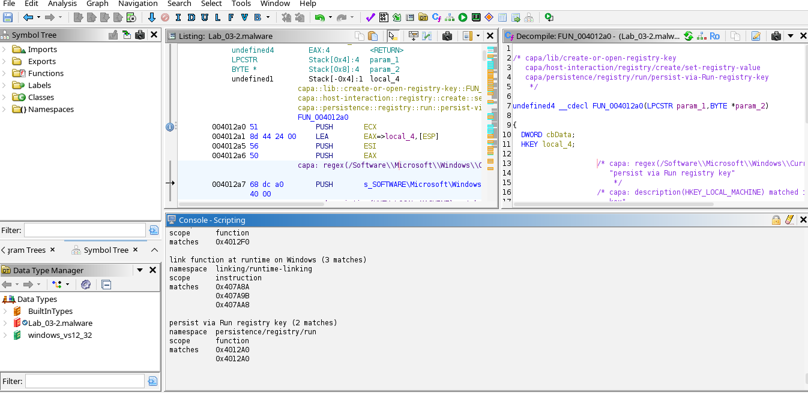

-------------------------------------------------
## Instalacion de plugin CAPA para Ghidra
El ZIP del plugin capa explorer no viene con Ghidra, tenemos que descargarlo del repositorio oficial de capa en GitHub.

Descargamos capa_explorer.py y capa_ghidra.py: https://github.com/mandiant/capa/tree/master/capa/ghidra

En la ventana de script manager de ghidra, creamos una nueva carpeta de plugins. Una vez creada pegamos esos ficheros en esa nueva carpeta.


-----------------------------------------------
# CHAPTER 3: DYNAMIC ANALYSIS


El análisis dinámico de malware es un proceso que implica la ejecución del malware en un entorno controlado y aislado, conocido como sandbox o máquina virtual, para observar su comportamiento y funcionalidad en tiempo real. Este tipo de análisis permite a los investigadores y analistas de seguridad comprender cómo se comporta el malware una vez que se ejecuta en un sistema, identificando las acciones que realiza, como la modificación de archivos, la comunicación con servidores remotos, la inyección de código en otros procesos, entre otros comportamientos maliciosos.

Las ventajas del análisis dinámico incluyen la capacidad de obtener información detallada sobre el comportamiento del malware, lo que permite documentar y entender mejor las amenazas para desarrollar medidas de protección más efectivas. Además, este tipo de análisis puede revelar la presencia de técnicas de evasión, como la detección de entornos virtuales (antisandbox), que el malware puede utilizar para evitar su análisis en entornos controlados.

El análisis dinámico es complementario al análisis estático, que se enfoca en el examen del código fuente del malware sin ejecutarlo, proporcionando una visión completa del funcionamiento y propósito del software malicioso. Juntos, el análisis estático y dinámico ofrecen una metodología robusta para el estudio y la clasificación de malware, contribuyendo significativamente a la ciberseguridad y la defensa contra amenazas informáticas.

## 1. Lab Environment Overview
Tanto la máquina virtual de Linux como la de Windows se configuraron para utilizar el modo de configuración de red de solo anfitrión. La máquina virtual de Linux estaba preconfigurada con una dirección IP de 192.168.1.100, y la dirección IP de la máquina virtual de Windows se estableció en 192.168.1.50. La puerta de enlace predeterminada y el DNS de la máquina virtual de Windows se establecieron en la dirección IP de la máquina virtual de Linux (192.168.1.100), de modo que todo el tráfico de red de Windows se enrutara a través de la máquina virtual de Linux. La máquina virtual de Windows se utilizará para ejecutar la muestra de malware durante el análisis, y la máquina virtual de Linux se utilizará para monitorear el tráfico de red y se configurará para simular servicios de internet (como DNS, HTTP, y otros) para proporcionar la respuesta adecuada cuando el malware solicite estos servicios.

## 2. System And Network Monitoring
El objetivo de un análisi dinámico es recopilar datos en tiempo real relacionados con el comportamiento del malware y su impacto en el sistema. Diferentes tipos de monitoreo realizados durante el análisis dinámico:
- Monitoreo de procesos: Implica monitorear la actividad del proceso y examinar las propiedades del proceso resultante durante la ejecución del malware.
- Monitoreo del sistema de archivos: Incluye monitorear la actividad del sistema de archivos en tiempo real durante la ejecución del malware.
- Monitoreo del registro: Implica monitorear las claves del registro a las que se accede/modifica y los datos del registro que son leídos/escritos por el binario malicioso.
- Monitoreo de la red: Involucra monitorear el tráfico en vivo hacia y desde el sistema durante la ejecución del malware.


## 3. Dynamic Analysis (Monitoring) Tools

### 3.1 Process Inspection with Process Hacker
Process Hacker (http://processhacker.sourceforge.net/) is an open source, multipurpose tool that helps in monitoring system resources. It is a great tool for examining the
processes running on the system and to inspect the process attributes. It can also be used to explore services, network connections, disk activity, and so on.

VirusTotal lo detecta como malware.

### 3.2 Determining System Interaction with Process Monitor
Process Monitor (https://technet.microsoft.com/en-us/sysinternals/processmonitor.aspx) is an advanced monitoring tool that shows the real-time interaction of the processes
with the filesystem, registry, and process/thread activity.

### 3.3 Logging System Activities Using Noriben
Even though Process Monitor is a great tool to monitor a malware's interaction with the system, it can be very noisy, and manual effort is required to filter the noise. Noriben
(https://github.com/Rurik/Noriben) is a Python script that works in conjunction with Process Monitor and helps in collecting, analyzing, and reporting runtime indicators of the
malware. The advantage of using Noriben is that it comes with pre-defined filters that assist in reducing noise and allow you to focus on the malware-related events.

### 3.4 Capturing Network Traffic With Wireshark
When the malware is executed, you will want to capture the network traffic generated as a result of running the malware; this will help you understand the communication channel
used by the malware and will also help in determining network-based indicators. 

### 3.5 Simulating Services with INetSim
INetSim is a free Linux-based software suite for simulating standard internet services (such as DNS, HTTP/HTTPS, and so on).

Another alternative to INetSim is FakeNet-NG (https://github.com/fireeye/flare-fakenet-ng), which allows you to intercept and redirect all or specific network traffic by simulating network services.


## 4. Dynamic Analysis Steps
Durante el análisis dinámico (análisis del comportamiento), seguriemos una secuencia de pasos para determinar la funcionalidad del malware. La siguiente lista describe los pasos involucrados en el análisis dinámico:
- Revertir a la instantánea limpia: Esto incluye volver tus máquinas virtuales a un estado limpio.
- Ejecutar las herramientas de monitoreo/análisis dinámico: En este paso, ejecutarás las herramientas de monitoreo antes de ejecutar la muestra de malware. Para aprovechar al máximo las herramientas de monitoreo cubiertas en la sección anterior, necesitas ejecutarlas con privilegios de administrador.
- Ejecutar la muestra de malware: En este paso, ejecutarás la muestra de malware con privilegios de administrador.
- Detener las herramientas de monitoreo: Esto implica terminar las herramientas de monitoreo después de que el binario de malware se haya ejecutado durante un tiempo especificado.
- Analizar los resultados: Esto implica recopilar los datos/informes de las herramientas de monitoreo y analizarlos para determinar el comportamiento y la funcionalidad del malware.


## 5. Putting it All Together: Analyzing a Malware Executable
Realizaremos tanto análisis estático como dinámico para determinar las características y el comportamiento de una muestra de malware.


## 6. Dynamic-Link Library (DLL) Analysis


# Examples
## Emotet
https://assets.tryhackme.com/additional/cmn-malware/int-mal-sample.pdf

---------------------------------------------
---------------------------------------------
## Usar PEStudio (Interfaz gráfica)
- Descarga PEStudio (gratis):🔗 https://www.winitor.com/
- Abre el archivo sospechoso (.exe, .dll) desde PEStudio.
- Ve a la pestaña: Sections.
- Observa los siguientes campos:
  - Nombre de la sección: .text, .data, .rsrc, etc.
  - Entropy: si es muy alta (> 7.0), puede indicar cifrado u ofuscación.
  - RVA / Offset / Tamaño virtual: diferencias notables pueden ser sospechosas.

Permissions: busca secciones con Executable + Writable, lo cual no es normal y puede indicar shellcode.

📌 PEStudio también marcará en rojo o naranja las secciones que considera sospechosas automáticamente.


## Script en Python con pefile
Este script analiza las secciones y te muestra:
- Nombres
- Tamaños
- Entropía
- Permisos
```
pip install pefile
import pefile
import math

def get_entropy(data):
    if not data:
        return 0.0
    entropy = 0
    for x in range(256):
        p_x = float(data.count(bytes([x]))) / len(data)
        if p_x > 0:
            entropy -= p_x * math.log2(p_x)
    return entropy

pe = pefile.PE("malware.exe")

print("Nombre | Tamaño | Entropía | Permisos")
print("-" * 50)

for section in pe.sections:
    name = section.Name.strip().decode('utf-8', errors='replace')
    size = section.SizeOfRawData
    entropy = get_entropy(section.get_data())
    perms = section.Characteristics

    exec_flag = bool(perms & 0x20000000)
    write_flag = bool(perms & 0x80000000)
    read_flag = bool(perms & 0x40000000)

    flags = []
    if read_flag: flags.append("R")
    if write_flag: flags.append("W")
    if exec_flag: flags.append("X")

    print(f"{name:7} | {size:6} | {entropy:.2f}    | {' '.join(flags)}")

    # Posible anomalía
    if entropy > 7.0:
        print(f"⚠️  Alta entropía en {name}")
    if exec_flag and write_flag:
        print(f"🚨  Sección ejecutable y escribible: {name}")

```

Resultado típico:
```
Nombre | Tamaño | Entropía | Permisos
-----------------------------------------
.text   | 20480  | 6.35    | R X
.data   | 8192   | 5.22    | R W
.rsrc   | 10240  | 7.85    | R
⚠️  Alta entropía en .rsrc
```

## Script en Python para analizar secciones PE
```
import pefile
import math
import pandas as pd

def get_entropy(data):
    if not data:
        return 0.0
    entropy = 0
    for x in range(256):
        p_x = float(data.count(bytes([x]))) / len(data)
        if p_x > 0:
            entropy -= p_x * math.log2(p_x)
    return entropy

# Ruta del archivo PE a analizar
file_path = "malware.exe"  # Cambia esto por el nombre de tu archivo

pe = pefile.PE(file_path)
section_data = []

for section in pe.sections:
    name = section.Name.strip().decode('utf-8', errors='replace')
    size = section.SizeOfRawData
    entropy = get_entropy(section.get_data())
    perms = section.Characteristics

    exec_flag = bool(perms & 0x20000000)
    write_flag = bool(perms & 0x80000000)
    read_flag = bool(perms & 0x40000000)

    flags = []
    if read_flag: flags.append("R")
    if write_flag: flags.append("W")
    if exec_flag: flags.append("X")

    section_data.append({
        "Sección": name,
        "Tamaño (bytes)": size,
        "Entropía": round(entropy, 2),
        "Permisos": " ".join(flags),
        "Alta entropía": entropy > 7.0,
        "RWX (riesgo)": exec_flag and write_flag
    })

# Exportar a CSV
df = pd.DataFrame(section_data)
df.to_csv("resultado_secciones.csv", index=False)

print("✅ Análisis completado. Revisa 'resultado_secciones.csv'")
```

🧰Requisitos. Es necesario tener estos módulos instalados:
```
pip install pefile pandas
```

Este script analizará las secciones, calculará entropía y marcará secciones sospechosas (como aquellas con permisos de ejecución y escritura o entropía alta), y nos exportará todo a un archivo resultado_secciones.csv que podrás abrir en Excel o cualquier visor de hojas de cálculo.


----------------------------------------------
----------------------------------------------
## Enlaces de interés

https://tutorials.ophion.feralhosting.com/Tutorials/Malware%20Analysis/UD-Reverse-Engineering-And-Malware-Analysis-Fundamentals/

https://elhacker.info/manuales/An%c3%a1lisis%20de%20malware/

https://elhacker.info/manuales/An%C3%A1lisis%20de%20malware/Learning%20Malware%20Analysis_%20Explore%20the%20concepts,%20tools,%20and%20techniques%20to%20analyze%20and%20investigate%20Windows%20malware%20(%20PDFDrive.com%20).pdf

https://www.wolf.university/masteringmalwareanalysis/ebook/masteringmalwareanalysis.pdf

https://www.wolf.university/cybersecuritythreatsmalwaretrendsandstrategies/ebook/cybersecuritythreatsmalwaretrendsandstrategies.pdf

https://elhacker.info/manuales/An%c3%a1lisis%20de%20malware/Practical_Malware_Analysis.pdf


https://elhacker.info/manuales/An%c3%a1lisis%20de%20malware/Windows%20Malware%20Analysis%20Essentials_%20Master%20the%20fundamentals%20of%20malware%20analysis%20for%20the%20Windows%20platform%20and%20enhance%20your%20anti-malware%20skill%20set%20(%20PDFDrive.com%20).pdf

https://www.wolf.university/ghidrasoftwarereverseengineeringforbeginners/ebook/ghidrasoftwarereverseengineeringforbeginners.pdf

https://elhacker.info/manuales/An%c3%a1lisis%20de%20malware/intro-reverseeng.pdf


https://github.com/Neo23x0/signature-base/tree/master/yara


https://github.com/baynam1995/MalwareAnalysiBook/blob/master/Learning.Malware.Analysis.Techniques.Investigate.pdf

https://elhacker.info/manuales/Virus/Rootkits%20and%20Bootkits_%20Reversing%20Modern%20Malware%20and%20Next%20Generation%20Threats%20Early%20Access.pdf


https://ftp.idu.ac.id/wp-content/uploads/ebook/tdg/MILITARY%20REFERENCE%20AND%20REVERSE%20ENGINEERING/Mastering%20Reverse%20Engineering%20Re-engineer%20your%20ethical%20hacking%20skills%20by%20Reginald%20Wong%20(z-lib.org).pdf

https://ccdcoe.org/uploads/2020/07/Malware_Reverse_Engineering_Handbook.pdf

https://github.com/Dump-GUY/Malware-analysis-and-Reverse-engineering

https://github.com/gabimarti/ingenieria_inversa_a_partir_del_codigo_fuente/tree/master


Binary Ninja is an interactive decompiler, disassembler, debugger, and binary analysis platform built by reverse engineers, for reverse engineers: https://binary.ninja/


https://rada.re/n/

https://github.com/jgamblin/Mirai-Source-Code


https://fundacion-sadosky.github.io/guia-escritura-exploits/
