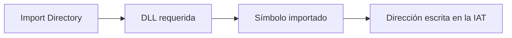
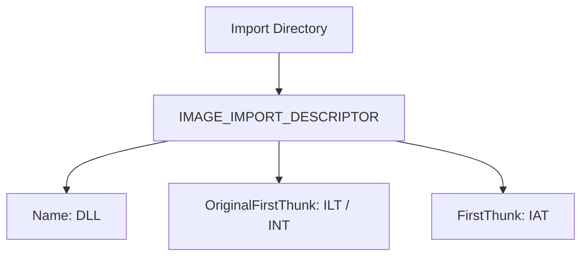
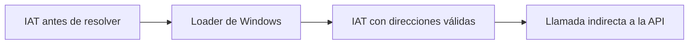
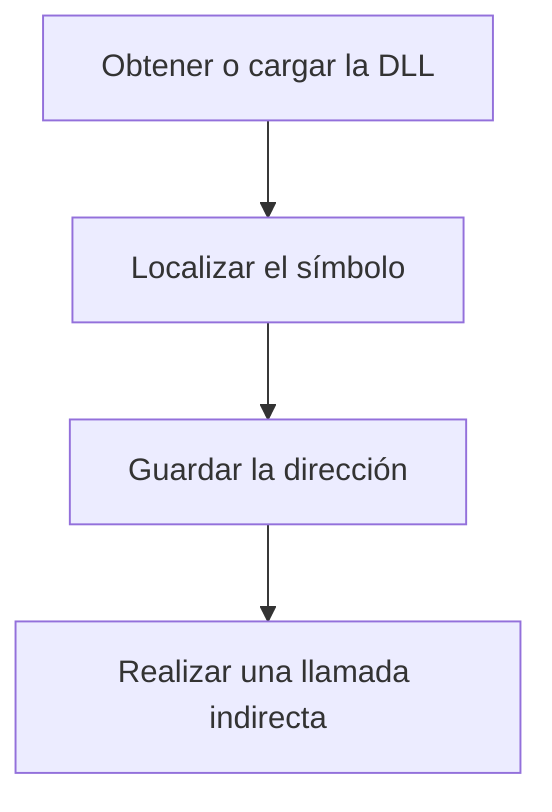
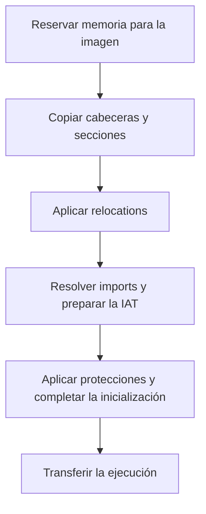
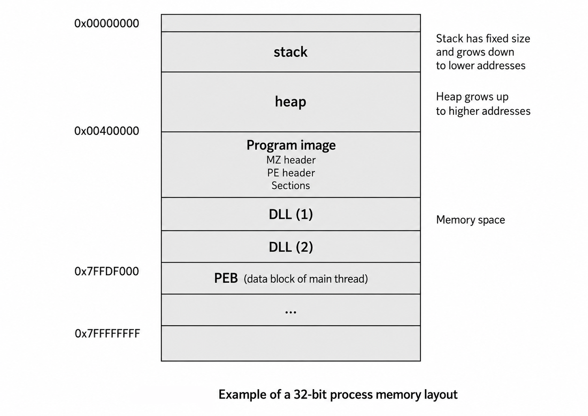
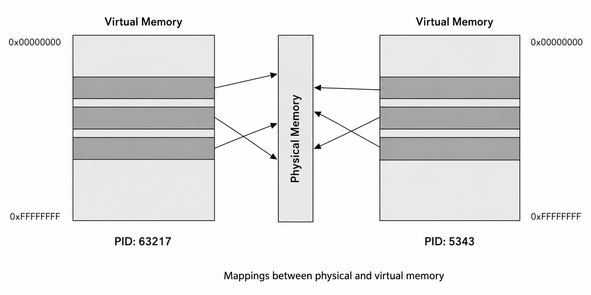
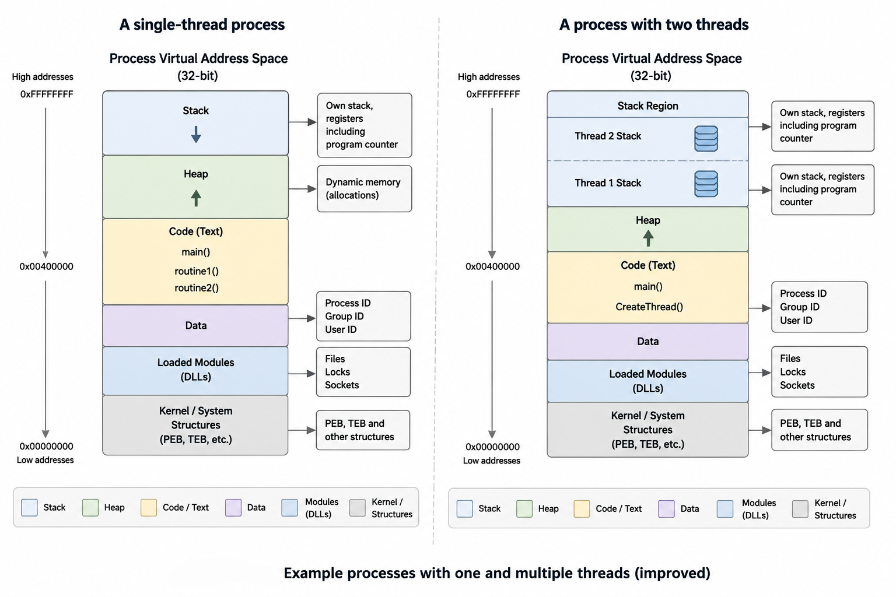
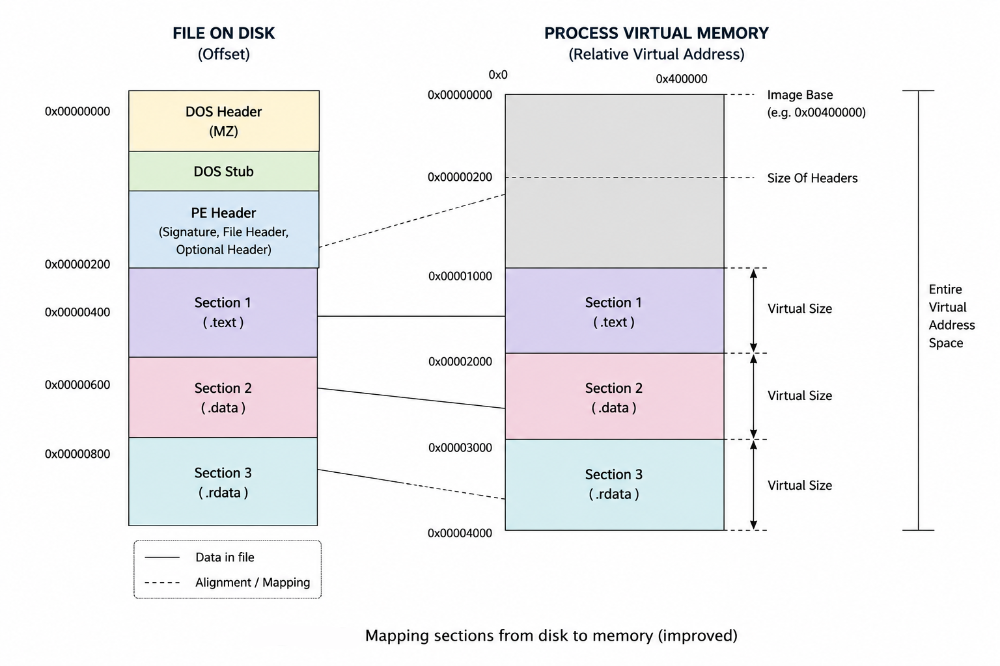
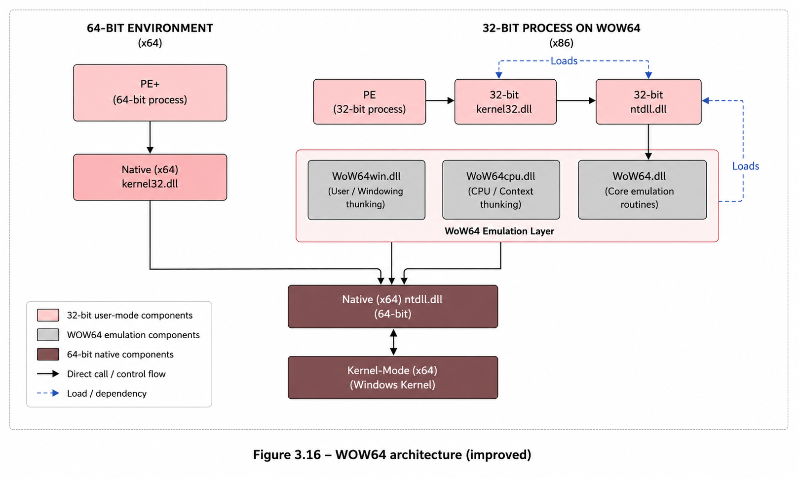

- [Introducción](#introducción)
- [1. Qué es un PE](#1-qué-es-un-pe)
- [2. Estructura general de un PE](#2-estructura-general-de-un-pe)
  - [2.1. IMAGE\_DOS\_HEADER](#21-image_dos_header)
  - [2.2. DOS Stub](#22-dos-stub)
  - [2.3. Firma PE — PE Signature](#23-firma-pe--pe-signature)
  - [2.4. IMAGE\_FILE\_HEADER](#24-image_file_header)
  - [2.5. IMAGE\_OPTIONAL\_HEADER](#25-image_optional_header)
    - [2.5.1. AddressOfEntryPoint](#251-addressofentrypoint)
    - [2.5.2. ImageBase](#252-imagebase)
    - [2.5.3. SectionAlignment](#253-sectionalignment)
    - [2.5.4. FileAlignment](#254-filealignment)
    - [2.5.5. SizeOfImage](#255-sizeofimage)
    - [2.5.6. SizeOfHeaders](#256-sizeofheaders)
    - [2.5.7. Subsystem](#257-subsystem)
    - [2.5.8. DllCharacteristics](#258-dllcharacteristics)
    - [2.5.9. DataDirectory](#259-datadirectory)
      - [2.5.9.1. Import Table](#2591-import-table)
      - [2.5.9.2. Export Table](#2592-export-table)
      - [2.5.9.3. Resource Table](#2593-resource-table)
      - [2.5.9.4. Base Relocation Table](#2594-base-relocation-table)
      - [2.5.9.5. TLS Table](#2595-tls-table)
  - [2.6. Secciones del PE](#26-secciones-del-pe)
    - [2.6.1. IMAGE\_SECTION\_HEADER](#261-image_section_header)
    - [2.6.2. Name](#262-name)
    - [2.6.3. VirtualSize](#263-virtualsize)
    - [2.6.4. VirtualAddress](#264-virtualaddress)
    - [2.6.5. SizeOfRawData](#265-sizeofrawdata)
    - [2.6.6. PointerToRawData](#266-pointertorawdata)
    - [2.6.7. Characteristics](#267-characteristics)
    - [2.6.8. La Section Table contiene descriptores, no los datos de las secciones](#268-la-section-table-contiene-descriptores-no-los-datos-de-las-secciones)
- [3. PE en disco frente a PE en memoria](#3-pe-en-disco-frente-a-pe-en-memoria)
  - [3.1. En disco](#31-en-disco)
  - [3.2. En memoria](#32-en-memoria)
- [4. Secciones típicas y señales de interés](#4-secciones-típicas-y-señales-de-interés)
- [5. Discrepancias útiles durante el análisis](#5-discrepancias-útiles-durante-el-análisis)
- [6. RVA, VA y File Offset](#6-rva-va-y-file-offset)
- [7. Importaciones e IAT](#7-importaciones-e-iat)
  - [7.1. DLL, funciones exportadas y Windows API](#71-dll-funciones-exportadas-y-windows-api)
  - [7.2. Enlace estático y enlace dinámico](#72-enlace-estático-y-enlace-dinámico)
    - [7.2.1. Enlace estático](#721-enlace-estático)
    - [7.2.2. Enlace dinámico en tiempo de carga](#722-enlace-dinámico-en-tiempo-de-carga)
    - [7.2.3. Enlace dinámico en tiempo de ejecución](#723-enlace-dinámico-en-tiempo-de-ejecución)
  - [7.3. Import Directory e `IMAGE_IMPORT_DESCRIPTOR`](#73-import-directory-e-image_import_descriptor)
  - [7.4. Import Lookup Table o Import Name Table](#74-import-lookup-table-o-import-name-table)
    - [Importación por nombre](#importación-por-nombre)
    - [Importación por ordinal](#importación-por-ordinal)
  - [7.5. Import Address Table (IAT)](#75-import-address-table-iat)
    - [Diferencia resumida entre Import Directory, ILT/INT e IAT](#diferencia-resumida-entre-import-directory-iltint-e-iat)
  - [7.6. Resolución de importaciones durante la carga](#76-resolución-de-importaciones-durante-la-carga)
  - [7.7. Resolución dinámica y ocultación de API](#77-resolución-dinámica-y-ocultación-de-api)
    - [Pistas para el análisis estático](#pistas-para-el-análisis-estático)
    - [Pistas para el análisis dinámico con x64dbg](#pistas-para-el-análisis-dinámico-con-x64dbg)
  - [7.8. Interpretación de importaciones en análisis de malware](#78-interpretación-de-importaciones-en-análisis-de-malware)
    - [Combinaciones relacionadas con process injection](#combinaciones-relacionadas-con-process-injection)
  - [7.9. Inspección de importaciones](#79-inspección-de-importaciones)
    - [Herramientas gráficas](#herramientas-gráficas)
    - [Herramientas de línea de comandos](#herramientas-de-línea-de-comandos)
    - [Enumeración con Python y `pefile`](#enumeración-con-python-y-pefile)
  - [7.10. IAT, hooking y técnicas de evasión](#710-iat-hooking-y-técnicas-de-evasión)
  - [7.11. Relación con Manual Mapping y PE Injection](#711-relación-con-manual-mapping-y-pe-injection)
  - [7.12. Metodología práctica de análisis](#712-metodología-práctica-de-análisis)
    - [Recursos de consulta](#recursos-de-consulta)
- [8. Relocations](#8-relocations)
- [10. Importancia del formato PE para estudiar PE Injection](#10-importancia-del-formato-pe-para-estudiar-pe-injection)
- [11. Diferencia entre Import Table e IAT](#11-diferencia-entre-import-table-e-iat)
- [12. Carga de PE y creación de procesos](#12-carga-de-pe-y-creación-de-procesos)
  - [12.1. ¿Qué es un proceso?](#121-qué-es-un-proceso)
  - [12.2. Memoria virtual y memoria física](#122-memoria-virtual-y-memoria-física)
  - [12.3. ¿Qué es un hilo?](#123-qué-es-un-hilo)
  - [12.4. Estructuras TIB, TEB y PEB](#124-estructuras-tib-teb-y-peb)
    - [12.4.1. TIB](#1241-tib)
    - [12.4.2. TEB](#1242-teb)
    - [12.4.3. PEB](#1243-peb)
  - [12.5. Creación de un proceso paso a paso](#125-creación-de-un-proceso-paso-a-paso)
    - [12.5.1. Inicio del programa](#1251-inicio-del-programa)
    - [12.5.2. Creación de estructuras internas](#1252-creación-de-estructuras-internas)
    - [12.5.3. Inicialización de la memoria virtual](#1253-inicialización-de-la-memoria-virtual)
    - [12.5.4. Carga del archivo PE](#1254-carga-del-archivo-pe)
    - [12.5.5. Inicio de la ejecución](#1255-inicio-de-la-ejecución)
  - [12.6. Carga de un archivo PE paso a paso](#126-carga-de-un-archivo-pe-paso-a-paso)
    - [12.6.1 Análisis de las cabeceras](#1261-análisis-de-las-cabeceras)
    - [12.6.2 Análisis de la tabla de secciones](#1262-análisis-de-la-tabla-de-secciones)
    - [12.6.3 Mapeo del archivo en memoria](#1263-mapeo-del-archivo-en-memoria)
    - [12.6.4 Carga de librerías externas](#1264-carga-de-librerías-externas)
    - [12.6.5 Aplicación de relocations](#1265-aplicación-de-relocations)
    - [12.6.6 Transferencia al punto de entrada](#1266-transferencia-al-punto-de-entrada)
  - [12.7. Procesos WOW64](#127-procesos-wow64)
  - [12.8. Importancia de WOW64 en análisis de malware](#128-importancia-de-wow64-en-análisis-de-malware)
  - [12.9. Resumen del proceso completo](#129-resumen-del-proceso-completo)
- [13. Ficheros ejecutables Linux](#13-ficheros-ejecutables-linux)
- [14. EJEMPLO 1: Analizando la estructura PE de un malware](#14-ejemplo-1-analizando-la-estructura-pe-de-un-malware)
- [15. EJEMPLO 2 : Malware que tiene una dll incrustada en la sección .rsrc](#15-ejemplo-2--malware-que-tiene-una-dll-incrustada-en-la-sección-rsrc)
- [16. Herramientas para análisis de archivos PE](#16-herramientas-para-análisis-de-archivos-pe)
  - [16.1. Comando pecheck](#161-comando-pecheck)
  - [16.2. Utilidad pe-tree](#162-utilidad-pe-tree)
  - [16.3. peframe](#163-peframe)
  - [16.4. radare2](#164-radare2)
  - [16.5. Otras utilidades:](#165-otras-utilidades)
- [17. Laboratorios progresivos](#17-laboratorios-progresivos)


# Introducción

- Qué es una imagen PE.
- Cómo se representa un PE en disco.
- Cómo Windows organiza una imagen PE en memoria.
- Qué información contienen sus cabeceras.
- Cómo se describen y localizan sus secciones.
- Qué son las importaciones, las relocations y el punto de entrada.
- Qué artefactos puede dejar una técnica de inyección.
- Cómo reconocer esos artefactos mediante análisis estático y dinámico.


---

# 1. Qué es un PE

El **Portable Executable (PE)** es el formato utilizado por Windows para representar ejecutables, bibliotecas y otros módulos que pueden ser cargados por el sistema operativo. Entre los archivos que habitualmente utilizan este formato se encuentran:

- Ejecutables (`.exe`).
- Bibliotecas de enlace dinámico (`.dll`).
- Controladores (`.sys`).
- Otros módulos compatibles con el formato PE/COFF.

El formato PE deriva de **COFF (Common Object File Format)** y contiene, además del código y los datos de la aplicación, una serie de cabeceras, tablas y directorios que describen cómo debe interpretarse y organizarse la imagen en memoria.

Desde el punto de vista del análisis de malware, comprender la estructura PE es fundamental porque <mark>técnicas como el empaquetado, la ofuscación, la carga manual, el process hollowing y distintas formas de process injection manipulan o reconstruyen partes de esta estructura.</mark>

# 2. Estructura general de un PE

De forma simplificada, un archivo PE presenta la siguiente organización:

```text
Inicio del archivo
        │
        ▼
┌─────────────────────────────────┐
│ IMAGE_DOS_HEADER                │
│                                 │
│ e_magic  = "MZ"                 │
│ e_lfanew ───────────────────┐   │
└─────────────────────────────│───┘
                              │
┌─────────────────────────────│───┐
│ DOS Stub                    │   │
│                             │   │
│ Código compatible con DOS   │   │
│                             │   │
│ Habitualmente muestra:      │   │
│ "This program cannot be     │   │
│  run in DOS mode."          │   │
│                             │   │
│ [En esta región puede       │   │
│  aparecer un Rich Header]   │   │
└─────────────────────────────│───┘
                              │
                              │ e_lfanew
                              ▼
┌─────────────────────────────────┐
│ NT Headers                      │
│                                 │
│ Signature                       │
│ "PE\0\0"                        │
├─────────────────────────────────┤
│ IMAGE_FILE_HEADER               │
│                                 │
│ Machine                         │
│ NumberOfSections                │
│ Characteristics                 │
├─────────────────────────────────┤
│ IMAGE_OPTIONAL_HEADER           │
│                                 │
│ AddressOfEntryPoint             │
│ ImageBase                       │
│ SectionAlignment                │
│ FileAlignment                   │
│ SizeOfImage                     │
│ SizeOfHeaders                   │
│ Subsystem                       │
│ DllCharacteristics              │
│ DataDirectory[]                 │
└─────────────────────────────────┘
                │
                ▼
┌─────────────────────────────────┐
│ Section Table                   │
│                                 │
│ IMAGE_SECTION_HEADER[0]         │
│        │                        │
│        ├── Name                 │
│        ├── VirtualAddress       │
│        ├── VirtualSize          │
│        ├── PointerToRawData     │
│        ├── SizeOfRawData        │
│        └── Characteristics      │
│                                 │
│ IMAGE_SECTION_HEADER[1]         │
│ IMAGE_SECTION_HEADER[2]         │
│ ...                             │
└─────────────────────────────────┘
                │
                ▼
┌─────────────────────────────────┐
│ Datos de las secciones          │
│                                 │
│ .text        (habitual)         │
│ .rdata       (habitual)         │
│ .data        (habitual)         │
│ .idata       (posible)          │
│ .rsrc        (posible)          │
│ .reloc       (posible)          │
│ otras...                        │
└─────────────────────────────────┘
```

Las **cabeceras PE** proporcionan al cargador de Windows la información necesaria para interpretar el archivo y organizarlo en memoria. Entre los datos más relevantes se encuentran:

- **Tipo y características del archivo:** permiten distinguir, entre otros, ejecutables, DLL y controladores.
- **Arquitectura:** indica para qué plataforma se compiló el módulo, por ejemplo x86 o x64.
- **Dirección base preferida:** especifica dónde espera cargarse la imagen.
- **Punto de entrada:** indica la RVA desde la que comienza normalmente la ejecución del módulo.
- **Secciones:** describen áreas de código, datos, recursos, relocations y otra información.
- **Importaciones y dependencias:** identifican bibliotecas y símbolos externos utilizados.
- **Recursos:** pueden contener iconos, cadenas, diálogos, manifiestos y otros datos.
- **Información de seguridad y mitigaciones:** puede incluir características relacionadas con `ASLR`, `DEP/NX` o `Control Flow Guard`.

Examinar esta información es una de las primeras tareas del **análisis estático de un `PE`**.

---

## 2.1. IMAGE_DOS_HEADER

Un archivo `PE` comienza normalmente con una estructura `IMAGE_DOS_HEADER`. Dos campos son especialmente importantes:

- `e_magic`: contiene la firma `MZ`.
- `e_lfanew`: contiene el desplazamiento desde el inicio del archivo hasta la firma de las `cabeceras NT` (`PE\0\0`).

De forma conceptual:

```text
Inicio del archivo
      │
      ▼
+-----------------------+
| MZ                    |
|                       |
| e_lfanew = 0xF8       |
+-----------------------+
          │
          │ + 0xF8
          ▼
+-----------------------+
| PE\0\0                 |
+-----------------------+
```

La firma `MZ` corresponde a los bytes:

```text
4D 5A
```

El nombre procede de **Mark Zbikowski**, uno de los desarrolladores del formato ejecutable de DOS. La presencia de `MZ` por sí sola **no demuestra que el archivo sea un PE válido**: también deben ser coherentes `e_lfanew`, la firma `PE\0\0` y las estructuras posteriores.

El campo `e_lfanew` se encuentra en el offset `0x3C` del `IMAGE_DOS_HEADER`. Por ejemplo:

```text
Offset 0x00: 4D 5A        -> MZ
Offset 0x3C: 08 01 00 00  -> e_lfanew = 0x108
Offset 0x108: 50 45 00 00 -> PE\0\0
```

Para localizar las `cabeceras NT`, el cargador toma el valor de `e_lfanew` y lo interpreta como un desplazamiento desde el inicio del archivo.

---

## 2.2. DOS Stub

Después del `IMAGE_DOS_HEADER` suele encontrarse un pequeño programa denominado **DOS Stub**, situado antes de las `cabeceras NT`.

En numerosos ejecutables su mensaje característico es:

```text
This program cannot be run in DOS mode.
```

Históricamente, este código permitía proporcionar un comportamiento mínimo si el archivo se ejecutaba bajo DOS.

En la región comprendida entre el `DOS Header` y las `cabeceras NT` también puede aparecer un **Rich Header**, especialmente en binarios generados con herramientas de Microsoft. El `Rich Header` no forma parte obligatoria de la especificación `PE`.

Desde el punto de vista del análisis de malware, esta zona puede ser modificada o reutilizada para almacenar datos, por lo que conviene examinarla cuando existan inconsistencias.

---

## 2.3. Firma PE — PE Signature

En la posición indicada por `e_lfanew` debe encontrarse la firma:

```text
50 45 00 00
```

que corresponde a:

```text
PE\0\0
```

Esta firma marca el comienzo de las `cabeceras NT`. Su presencia aislada tampoco garantiza que todo el archivo sea válido; las estructuras y tamaños posteriores deben ser coherentes.

---

## 2.4. IMAGE_FILE_HEADER

Después de la firma `PE\0\0` se encuentra el `IMAGE_FILE_HEADER`, también llamado **COFF File Header**.

Entre sus campos se encuentran:

```text
Machine
NumberOfSections
TimeDateStamp
SizeOfOptionalHeader
Characteristics
```

Algunos campos de especial interés son:

- `Machine`: identifica la arquitectura.
- `NumberOfSections`: indica cuántas entradas contiene la tabla de secciones.
- `SizeOfOptionalHeader`: especifica el tamaño del `Optional Header`.
- `Characteristics`: contiene flags generales del archivo.

Valores habituales del campo `Machine`:

```text
0x014C -> x86
0x8664 -> x86-64
```

---

## 2.5. IMAGE_OPTIONAL_HEADER

A pesar de su nombre, el **Optional Header es esencial para una imagen ejecutable PE**. Contiene gran parte de la información que utiliza el cargador para organizar el módulo en memoria.

Entre los campos más relevantes, y en el orden relativo en que aparecen dentro de la estructura, se encuentran:

```text
AddressOfEntryPoint
ImageBase
SectionAlignment
FileAlignment
SizeOfImage
SizeOfHeaders
Subsystem
DllCharacteristics
DataDirectory[]
```

> Nota: existen otros campos intermedios. Además, `IMAGE_OPTIONAL_HEADER32` y `IMAGE_OPTIONAL_HEADER64` presentan algunas diferencias estructurales.

### 2.5.1. AddressOfEntryPoint

`AddressOfEntryPoint` contiene la **RVA (Relative Virtual Address)** del punto de entrada del módulo.

No es una dirección virtual absoluta. Para obtener la dirección virtual correspondiente se utiliza:

```text
VA = ImageBase + RVA
```

Por ejemplo:

```text
ImageBase           = 0x140000000
AddressOfEntryPoint = 0x00001230

VA = 0x140000000 + 0x1230
VA = 0x140001230
```

En análisis de malware suele hablarse de **Entry Point (EP)**. El término **Original Entry Point (OEP)** se utiliza especialmente al analizar binarios empaquetados para referirse al punto de entrada original del programa antes del empaquetado; por tanto, no debe utilizarse como sinónimo automático de `AddressOfEntryPoint`.

El punto de entrada resulta especialmente relevante durante el análisis dinámico porque representa la RVA desde la que comienza normalmente la ejecución del módulo una vez completadas las tareas de carga necesarias.


### 2.5.2. ImageBase

`ImageBase` indica la dirección virtual **preferida** en la que la imagen espera ser cargada.

Si esa dirección no está disponible, el sistema puede cargarla en otra posición siempre que el módulo disponga de la información necesaria para corregir las referencias dependientes de la base. En ese caso intervienen las **base relocations**.

### 2.5.3. SectionAlignment

`SectionAlignment` indica la alineación de las secciones cuando la imagen se encuentra en memoria.

Un valor muy habitual es:

```text
SectionAlignment = 0x1000
```

pero no debe asumirse que siempre será ese valor.

### 2.5.4. FileAlignment

`FileAlignment` especifica la alineación utilizada para los datos de las secciones en el archivo.

Un valor frecuente es:

```text
FileAlignment = 0x200
```

Esto explica por qué muchos `PointerToRawData` y `SizeOfRawData` aparecen alineados a múltiplos de `0x200`.

### 2.5.5. SizeOfImage

`SizeOfImage` representa el tamaño total que ocupará la imagen `PE` una vez organizada en memoria, respetando `SectionAlignment`.

Puede ser diferente del tamaño físico del archivo:

```text
Tamaño del archivo en disco = 45 KB
SizeOfImage                 = 80 KB
```

Entre los factores que explican esta diferencia se encuentran:

- Alineamiento de secciones.
- Diferencias entre `VirtualSize` y `SizeOfRawData`.
- Datos que se inicializan a cero.
- Espacios de alineamiento entre regiones.

<mark>Este campo es especialmente importante al estudiar **manual mapping** o **PE Injection**, ya que permite conocer el espacio virtual necesario para reconstruir la imagen.</mark>

### 2.5.6. SizeOfHeaders

`SizeOfHeaders` indica el tamaño combinado y alineado de las cabeceras del PE, incluida la tabla de secciones.

Es relevante durante un mapeo manual porque la parte inicial de la imagen también debe quedar disponible en memoria.

### 2.5.7. Subsystem

`Subsystem` especifica el entorno esperado por el ejecutable. Dos valores frecuentes son:

```text
2 -> Windows GUI
3 -> Windows Console
```

Este campo ayuda a determinar cómo espera interactuar el programa con el entorno, pero no describe por sí solo todo su comportamiento.

### 2.5.8. DllCharacteristics

`DllCharacteristics` contiene flags relacionados con características de carga y mitigaciones de seguridad.

Entre los más conocidos se encuentran:

```text
IMAGE_DLLCHARACTERISTICS_DYNAMIC_BASE
IMAGE_DLLCHARACTERISTICS_NX_COMPAT
IMAGE_DLLCHARACTERISTICS_GUARD_CF
```

Estos flags pueden indicar compatibilidad con mecanismos como `ASLR`, `DEP/NX` o `Control Flow Guard`.

### 2.5.9. DataDirectory

El `Optional Header` contiene un array de **Data Directories**. Cada entrada describe la ubicación y el tamaño de una estructura lógica del `PE`.

Entre las entradas más importantes se encuentran:

```text
Export Table
Import Table
Resource Table
Exception Table
Certificate Table
Base Relocation Table
Debug Directory
TLS Table
IAT
Delay Import Table
CLR Header
```

La mayoría de estas entradas se expresan mediante una pareja:

```text
VirtualAddress / RVA
Size
```

La **Certificate Table** es una excepción importante: su campo de dirección se interpreta como un `offset` de archivo y no como una `RVA`.

#### 2.5.9.1. Import Table

La Import Table describe bibliotecas y símbolos externos utilizados por el programa.

Ejemplo:

```text
KERNEL32.dll
  CreateFileA
  WriteFile
  CreateProcessA

ADVAPI32.dll
  RegSetValueExA

WS2_32.dll
  socket
  connect
  send
  recv
```

Estas importaciones pueden ayudar a formular hipótesis sobre el comportamiento del binario:

```text
CreateFile / WriteFile       -> operaciones con archivos
RegSetValueEx                -> posible modificación del Registro
socket / connect             -> funcionalidad de red
```

Una combinación como:

```text
VirtualAllocEx
WriteProcessMemory
CreateRemoteThread
```

puede ser compatible con técnicas de `process injection`, pero **las importaciones por sí solas no demuestran que la técnica se ejecute realmente**. Es necesario confirmar el flujo de código y los parámetros utilizados.

#### 2.5.9.2. Export Table

La Export Table resulta especialmente relevante en `DLL` y otros módulos que exponen funciones.

Los nombres exportados pueden orientar el análisis, aunque tampoco constituyen por sí mismos evidencia de comportamiento malicioso.

#### 2.5.9.3. Resource Table

La Resource Table puede contener:

- Iconos.
- Imágenes.
- Cadenas.
- Diálogos.
- Manifiestos.
- Información de versión.
- Datos binarios arbitrarios.

En muestras de malware también puede utilizarse para almacenar configuraciones, ejecutables embebidos u otros datos codificados o comprimidos.

#### 2.5.9.4. Base Relocation Table

La Base Relocation Table contiene información utilizada para corregir determinadas referencias cuando una imagen se carga en una dirección distinta de su `ImageBase` preferido.

Habitualmente estos datos pueden encontrarse asociados a una sección denominada:

```text
.reloc
```

El nombre de la sección, sin embargo, no es obligatorio.

#### 2.5.9.5. TLS Table

La TLS Table puede incluir **TLS callbacks**. Estos `callbacks` pueden ejecutarse durante determinados eventos de carga antes de que se alcance el punto de entrada principal del módulo.

En análisis de malware son relevantes porque <mark>pueden utilizarse para ejecutar código de inicialización o técnicas anti-análisis antes del `Entry Point` observado por el analista.</mark>

---

## 2.6. Secciones del PE

El contenido de un `PE` se organiza habitualmente en diferentes **secciones**. Cada sección está descrita mediante un `IMAGE_SECTION_HEADER`.

Algunas secciones frecuentes son:

| Sección | Contenido habitual |
|---|---|
| `.text` | Código ejecutable |
| `.rdata` | Datos de solo lectura, constantes y tablas |
| `.data` | Variables globales inicializadas |
| `.bss` | Datos no inicializados. Puede no aparecer como sección independiente |
| `.idata` | Información relacionada con importaciones |
| `.edata` | Información relacionada con exportaciones |
| `.rsrc` | Recursos |
| `.reloc` | Base relocations |
| `.pdata` | Información de excepciones, especialmente habitual en x64 |

Los nombres de sección son principalmente una **convención**. El cargador no depende de que una sección se llame `.text`, `.data` o `.rdata`; utiliza los campos de sus cabeceras y características.

Por este motivo, un binario empaquetado u ofuscado puede utilizar nombres diferentes.

---

### 2.6.1. IMAGE_SECTION_HEADER

Cada sección está descrita mediante una estructura `IMAGE_SECTION_HEADER`.

Algunos campos relevantes son:

```text
Name
VirtualSize
VirtualAddress
SizeOfRawData
PointerToRawData
Characteristics
```

### 2.6.2. Name

Identifica el nombre convencional de la sección.

Ejemplos habituales:

```text
.text
.rdata
.data
.idata
.rsrc
.reloc
```

Algunos packers pueden utilizar nombres reconocibles, por ejemplo:

```text
UPX0
UPX1
.aspack
.mpress
```

Un nombre inusual puede justificar un análisis adicional, pero **no demuestra por sí mismo que el archivo sea malicioso**.

### 2.6.3. VirtualSize

Indica el tamaño lógico solicitado para la sección dentro de la imagen en memoria.

### 2.6.4. VirtualAddress

Contiene la **RVA** en la que comienza la sección dentro de la imagen.

Por ejemplo:

```text
VirtualAddress = 0x1000
ImageBase      = 0x00400000
```

La dirección virtual correspondiente sería:

```text
0x00400000 + 0x1000 = 0x00401000
```

### 2.6.5. SizeOfRawData

Indica el tamaño de los datos de la sección almacenados físicamente en el archivo, normalmente alineado según `FileAlignment`.

### 2.6.6. PointerToRawData

Indica el offset del archivo donde comienzan los datos físicos de la sección.

Por ejemplo:

```text
PointerToRawData = 0x400
```

significa que los bytes almacenados de la sección comienzan en el offset `0x400` del archivo.

### 2.6.7. Characteristics

Contiene `flags` que describen propiedades de la sección, entre ellas sus permisos previstos.

De forma conceptual:

```text
R -> Read
W -> Write
X -> Execute
```

Configuraciones habituales:

```text
.text -> R-X
.data -> RW-
```

Una sección o región con permisos `RWX` puede ser relevante durante el análisis porque permite lectura, escritura y ejecución simultáneamente, aunque **no constituye por sí sola una prueba de actividad maliciosa**.

---

### 2.6.8. La Section Table contiene descriptores, no los datos de las secciones

La **Section Table** está formada por estructuras `IMAGE_SECTION_HEADER`. Estas estructuras describen dónde se encuentran los datos y cómo deben organizarse.

Por ejemplo:

```text
IMAGE_SECTION_HEADER
       │
       │ describe
       ▼
┌──────────────────────────┐
│ .text                    │
│                          │
│ VirtualAddress           │
│ VirtualSize              │
│ PointerToRawData         │
│ SizeOfRawData            │
│ Characteristics          │
└──────────────────────────┘
```

`PointerToRawData` permite localizar los bytes de la sección en el archivo:

```text
Section Table

.text
PointerToRawData = 0x400
        │
        ▼
File Offset 0x400
┌─────────────────────────┐
│ bytes reales de .text   │
│                         │
│ 48 89 5C 24 ...         │
└─────────────────────────┘
```

En memoria, la sección se localiza mediante:

```text
MappedBase + VirtualAddress
```

<mark>Esta diferencia es fundamental para entender el mapeo de una imagen `PE`.</mark>

---

# 3. PE en disco frente a PE en memoria

Un `PE` no presenta exactamente la misma disposición en disco que una vez mapeado como imagen en memoria.

## 3.1. En disco

Los campos más relevantes son:

```text
PointerToRawData
SizeOfRawData
```

## 3.2. En memoria

La posición de una sección se expresa mediante:

```text
MappedBase + VirtualAddress
```

Por ejemplo:

```text
                DISCO                       MEMORIA

.text
PointerToRawData = 0x400       ->      Base + RVA 0x1000

.rdata
PointerToRawData = 0x2400      ->      Base + RVA 0x4000

.data
PointerToRawData = 0x3000      ->      Base + RVA 0x5000
```

Visualmente:

```text
PE EN DISCO

+------------------------+
| PE Headers             |
+------------------------+
| .text                  |  <- offset 0x400
+------------------------+
| .rdata                 |  <- offset 0x2400
+------------------------+
| .data                  |  <- offset 0x3000
+------------------------+


PE EN MEMORIA

MappedBase
    │
    ▼
+------------------------+
| PE Headers             |
+------------------------+
|                        |
| .text                  |  <- Base + 0x1000
|                        |
+------------------------+
| .rdata                 |  <- Base + 0x4000
+------------------------+
| .data                  |  <- Base + 0x5000
+------------------------+
```

Por ello, <mark>copiar un `PE` como un bloque continuo de bytes no equivale a reproducir su imagen cargada. El mapeo debe respetar la información contenida en las cabeceras y en la tabla de secciones.</mark>

---

# 4. Secciones típicas y señales de interés

| Sección | Función habitual | Observaciones de análisis |
|---|---|---|
| `.text` | Código ejecutable | Lo habitual es `R-X`; código fuera de secciones ejecutables merece revisión |
| `.data` | Variables globales inicializadas | Suele ser `RW-`; puede contener configuración o datos de estado |
| `.bss` | Datos no inicializados | Puede corresponder a espacio reservado y zero-filled en memoria |
| `.rdata` | Datos de solo lectura | Puede contener strings, constantes, RTTI y tablas |
| `.idata` | Imports | Útil para estudiar dependencias y APIs |
| `.edata` | Exports | Especialmente relevante en DLL |
| `.rsrc` | Recursos | Puede contener iconos, cadenas y datos embebidos |
| `.reloc` | Base relocations | Permite corregir referencias cuando cambia la base de carga |
| `UPX0`, `UPX1` | Nombres frecuentes en binarios UPX | Indican posible empaquetado, no necesariamente malware |

Los nombres de sección no deben utilizarse como criterio aislado de clasificación.

Cuando una herramienta como `PeStudio` muestra la tabla de secciones, algunos campos habituales son:

- **Name:** nombre de la sección.
- **Virtual Size:** tamaño lógico de la sección en memoria.
- **Virtual Address:** RVA donde comienza la sección.
- **Raw Size:** tamaño almacenado en disco.
- **Raw Data / Raw Offset:** desplazamiento del archivo donde comienzan los datos.
- **Entry Point:** puede indicar en qué sección cae la RVA del punto de entrada.


# 5. Discrepancias útiles durante el análisis

Algunas características pueden justificar una revisión más detallada:

- Nombres como `UPX0` y `UPX1` pueden indicar que el binario está empaquetado con UPX.
- Un `Entry Point` situado en una sección asociada al `packer` suele conducir primero a la rutina de desempaquetado.
- Diferencias entre `VirtualSize` y `SizeOfRawData` son normales hasta cierto punto debido al alineamiento y a los datos no inicializados.
- Una diferencia muy grande —por ejemplo, una sección con `SizeOfRawData = 0` pero un `VirtualSize` considerable— puede indicar que se reserva espacio que será rellenado durante la ejecución. En un binario empaquetado puede utilizarse para alojar código o datos desempaquetados.

Estas observaciones son **indicadores, no pruebas concluyentes de comportamiento malicioso**.

---

# 6. RVA, VA y File Offset

Para estudiar correctamente un `PE` es necesario diferenciar tres conceptos:

- **File Offset:** posición de un elemento dentro del archivo almacenado en disco.
- **RVA (Relative Virtual Address):** desplazamiento relativo respecto a la base de carga de la imagen.
- **VA (Virtual Address):** dirección virtual efectiva dentro del espacio de memoria del proceso.

La relación básica es:

```text
VA = MappedBase + RVA
```

Cuando la imagen se carga exactamente en su dirección preferida:

```text
VA = ImageBase + RVA
```

Ejemplo:

```text
ImageBase = 0x140000000
RVA       = 0x00001230

VA        = 0x140001230
```

Para convertir una RVA perteneciente a una sección en un offset de archivo puede utilizarse:

```text
FileOffset =
    PointerToRawData +
    (RVA - VirtualAddress)
```

Ejemplo:

```text
RVA buscada:      0x1234

Sección .text:
VirtualAddress:   0x1000
PointerToRawData: 0x400
```

Cálculo:

```text
FileOffset = 0x400 + (0x1234 - 0x1000)
FileOffset = 0x634
```

> `FileOffset`, `Raw Offset` y el desplazamiento físico dentro del archivo se utilizan aquí con el mismo sentido.

Comprender estas conversiones es esencial para correlacionar lo observado en herramientas de análisis estático con las direcciones mostradas posteriormente por un debugger como x64dbg.

---

# 7. Importaciones e IAT

Las aplicaciones de Windows utilizan con frecuencia código proporcionado por bibliotecas externas. En un archivo **Portable Executable (PE)**, la información necesaria para localizar esas bibliotecas y sus funciones se organiza principalmente mediante el **Import Directory**, la **Import Lookup Table** —también denominada habitualmente **Import Name Table**— y la **Import Address Table (IAT)**.

El estudio de estas estructuras permite:

- conocer las dependencias externas de un binario;
- formular hipótesis iniciales sobre sus capacidades;
- localizar en el código las llamadas a API importadas;
- reconocer resolución dinámica u ocultación de API;
- entender qué trabajo debe reproducir un cargador manual al mapear una imagen PE.

> [!IMPORTANT]
> Una importación es un **indicio**, no una prueba de comportamiento malicioso. La conclusión debe apoyarse en las referencias cruzadas, los argumentos utilizados, el flujo de ejecución y, cuando sea posible, el análisis dinámico.

## 7.1. DLL, funciones exportadas y Windows API

Una **DLL** es un módulo PE que puede exportar funciones o datos para que otros módulos los utilicen. La **tabla de exportaciones** de una DLL describe los símbolos que ofrece; la **tabla de importaciones** de un ejecutable o de otra DLL indica qué símbolos externos necesita.

El término **Windows API** designa el conjunto de interfaces que Windows expone a las aplicaciones. Muchas de sus funciones se ofrecen desde DLL del sistema, por ejemplo:

| DLL | Ámbito habitual | Ejemplos |
| --- | --- | --- |
| `kernel32.dll` / `KernelBase.dll` | Procesos, hilos, memoria, archivos y carga de módulos | `CreateProcessW`, `VirtualAlloc`, `CreateFileW`, `LoadLibraryW` |
| `ntdll.dll` | API nativa, loader y funciones de bajo nivel | `NtWriteVirtualMemory`, `NtProtectVirtualMemory`, `LdrLoadDll` |
| `advapi32.dll` | Registro, servicios, tokens y seguridad | `RegSetValueExW`, `CreateServiceW`, `AdjustTokenPrivileges` |
| `user32.dll` | Ventanas, teclado y ratón | `FindWindowW`, `GetAsyncKeyState`, `SetWindowsHookExW` |
| `ws2_32.dll` | Sockets | `socket`, `connect`, `send`, `recv` |
| `wininet.dll` | Comunicaciones HTTP/FTP de alto nivel | `InternetOpenW`, `HttpSendRequestW`, `InternetReadFile` |
| `winhttp.dll` | Cliente HTTP/HTTPS | `WinHttpOpen`, `WinHttpConnect`, `WinHttpSendRequest` |
| `urlmon.dll` | Operaciones con URL | `URLDownloadToFileW` |
| `crypt32.dll` | Certificados y DPAPI | `CryptProtectData`, `CryptUnprotectData` |
| `bcrypt.dll` | Criptografía CNG | `BCryptEncrypt`, `BCryptDecrypt`, `BCryptGenRandom` |

Esta asociación debe interpretarse con cautela. En versiones modernas de Windows existen **exportaciones reenviadas** y contratos **API Set**; por ello, una función importada desde `kernel32.dll` puede terminar ejecutándose en `KernelBase.dll` o alcanzar finalmente código de `ntdll.dll`. Que x64dbg muestre otro módulo como destino efectivo no implica necesariamente que la importación sea incorrecta.

## 7.2. Enlace estático y enlace dinámico

El **enlazado** es el proceso mediante el cual se resuelven las referencias del programa a funciones o datos definidos en otros módulos.

### 7.2.1. Enlace estático

En el enlace estático, el linker incorpora al ejecutable el código objeto necesario procedente de una biblioteca estática. El resultado suele ser un archivo más autónomo, aunque también puede ser mayor y contener código de biblioteca duplicado.


Desde el punto de vista del análisis, una función incorporada de este modo no aparecerá como una importación independiente. Puede ser necesario reconocerla mediante su implementación, símbolos, firmas o patrones del compilador.

> [!NOTE]
> La extensión `.lib` no garantiza por sí sola que una biblioteca sea estática. En el entorno Microsoft también existen **import libraries** `.lib`, que ayudan al linker a generar referencias a funciones alojadas realmente en una DLL.

### 7.2.2. Enlace dinámico en tiempo de carga

En el enlace dinámico implícito o **load-time linking**, las DLL y los símbolos requeridos quedan descritos en las estructuras de importación del PE. Al crear el proceso, el loader de Windows localiza las dependencias y prepara la IAT antes de transferir el control al punto de entrada normal de la imagen.



### 7.2.3. Enlace dinámico en tiempo de ejecución

En el enlace dinámico explícito o **run-time linking**, el propio programa obtiene el módulo y resuelve los símbolos mientras se ejecuta. La secuencia más reconocible utiliza:

```text
LoadLibraryA / LoadLibraryW / LoadLibraryEx
GetModuleHandleA / GetModuleHandleW
GetProcAddress
```

- `LoadLibrary` carga un módulo en el espacio de direcciones del proceso y devuelve un `HMODULE`.
- `GetModuleHandle` obtiene el identificador de un módulo ya cargado.
- `GetProcAddress` devuelve la dirección de una función o variable exportada.

`GetProcAddress` recibe el nombre del símbolo como una cadena estrecha (`LPCSTR`), aunque el módulo se haya cargado con `LoadLibraryW`.

También existe la **carga retardada** o *delay-load*. En este caso, el PE contiene estructuras específicas de importación retardada y la DLL se resuelve cuando se utiliza por primera vez, no necesariamente durante la carga inicial del proceso.

## 7.3. Import Directory e `IMAGE_IMPORT_DESCRIPTOR`

La entrada `IMAGE_DIRECTORY_ENTRY_IMPORT` del array `DataDirectory` contiene la RVA y el tamaño del **Import Directory**. Este directorio está formado por una secuencia de estructuras `IMAGE_IMPORT_DESCRIPTOR`, normalmente una por cada DLL importada, seguida de un descriptor nulo que marca el final.

Los campos más relevantes son:

| Campo | Función |
| --- | --- |
| `OriginalFirstThunk` | RVA de la Import Lookup Table (ILT), denominada también INT en muchas herramientas y textos |
| `TimeDateStamp` | Campo relacionado con *bound imports*; normalmente vale cero cuando no se utilizan |
| `ForwarderChain` | Información histórica relacionada con símbolos reenviados |
| `Name` | RVA de la cadena ASCII terminada en nulo que contiene el nombre de la DLL |
| `FirstThunk` | RVA de la Import Address Table correspondiente a esa DLL |

Relación conceptual:



En algunos binarios `OriginalFirstThunk` puede ser cero. Los loaders y parsers suelen tratar entonces `FirstThunk` como fuente de la información necesaria para resolver las importaciones, siempre que sus entradas todavía conserven los valores adecuados.

## 7.4. Import Lookup Table o Import Name Table

La especificación de Microsoft utiliza el nombre **Import Lookup Table (ILT)**. En documentación, herramientas y conversaciones de análisis también es frecuente encontrar **Import Name Table (INT)**. En este documento se consideran nombres habituales para la tabla apuntada por `OriginalFirstThunk`.

Cada entrada identifica una importación **por nombre** o **por ordinal**:

### Importación por nombre

La entrada contiene la RVA de una estructura `IMAGE_IMPORT_BY_NAME`, formada por:

- `Hint`: índice orientativo dentro de la tabla de nombres exportados de la DLL;
- `Name`: cadena ASCII terminada en nulo con el nombre del símbolo.

```text
IMAGE_IMPORT_BY_NAME
├── Hint
└── Name: "CreateProcessW\0"
```

El `Hint` puede acelerar la búsqueda, pero el loader debe comprobar que el nombre coincida.

### Importación por ordinal

El bit más significativo de la entrada indica que la importación se realiza por ordinal. El valor del ordinal se obtiene de los bits de menor peso correspondientes. En este caso no es necesario almacenar el nombre de la función en el PE.

```text
DLL
└── Ordinal #123
```

Las entradas se representan mediante estructuras del tipo `IMAGE_THUNK_DATA`:

- 4 bytes en PE32;
- 8 bytes en PE32+.

Cada tabla termina con una entrada nula.

## 7.5. Import Address Table (IAT)

La **Import Address Table** contiene las posiciones que utilizará el código para llamar indirectamente a los símbolos importados.

Antes de la resolución, sus entradas pueden conservar valores equivalentes a los de la ILT. Durante la carga normal, el loader las sustituye por las direcciones virtuales efectivas de las funciones o datos exportados.



Ejemplo conceptual:

| Entrada | Antes de resolver | Después de resolver |
| --- | --- | --- |
| IAT[0] | Referencia a `CreateProcessW` | Dirección virtual efectiva de `CreateProcessW` |
| IAT[1] | Referencia a `VirtualAlloc` | Dirección virtual efectiva de `VirtualAlloc` |
| IAT[2] | Referencia a `IsDebuggerPresent` | Dirección virtual efectiva de `IsDebuggerPresent` |

Una llamada compilada puede adoptar una forma semejante a:

```asm
call qword ptr [rip + desplazamiento] ; x64, acceso indirecto a una entrada de la IAT
```

o pasar por un pequeño *thunk* generado por el compilador. En Ghidra, IDA o x64dbg, las referencias a estas entradas permiten localizar qué partes del programa utilizan cada función importada.


### Diferencia resumida entre Import Directory, ILT/INT e IAT

| Estructura | Pregunta que responde | Contenido principal |
| --- | --- | --- |
| Import Directory | ¿Qué DLL necesita el PE y dónde están sus tablas? | Un `IMAGE_IMPORT_DESCRIPTOR` por DLL |
| ILT/INT | ¿Qué símbolos quiere importar? | Nombres, *hints* u ordinales |
| IAT | ¿Dónde están esos símbolos durante la ejecución? | Direcciones efectivas escritas por el loader |

Por tanto, no es exacto afirmar que todas las dependencias «se almacenan en la IAT». La descripción de las dependencias se distribuye entre el Import Directory, los nombres de DLL, la ILT/INT y estructuras asociadas; la IAT es la tabla que termina proporcionando las direcciones utilizadas en ejecución.

## 7.6. Resolución de importaciones durante la carga

En una carga convencional, el proceso puede resumirse así:

1. El loader lee el Import Directory.
2. Recorre los descriptores hasta alcanzar el descriptor nulo.
3. Localiza o carga cada DLL requerida.
4. Recorre sus entradas de la ILT/INT.
5. Busca cada símbolo en la tabla de exportaciones de la DLL, por nombre u ordinal.
6. Sigue los reenviadores de exportaciones cuando sea necesario.
7. Escribe la dirección resuelta en la entrada correspondiente de la IAT.
8. Continúa con el resto de tareas de inicialización de la imagen.

Este resumen omite detalles internos del loader, pero resulta suficiente para comprender el papel de las estructuras de importación en el análisis y en el mapeo manual.

## 7.7. Resolución dinámica y ocultación de API

Un programa no está obligado a declarar todas sus funciones externas en la tabla de importaciones. Puede resolverlas en ejecución:



La variante más sencilla deja visibles el nombre de la DLL, el nombre de la API y las importaciones de `LoadLibrary` o `GetProcAddress`. Otras variantes pueden:

- descifrar los nombres justo antes de resolverlos;
- comparar *hashes* en lugar de nombres en texto claro;
- recorrer manualmente el PEB para localizar módulos cargados;
- analizar directamente la Export Address Table (EAT) de una DLL;
- guardar las direcciones en una tabla propia;
- resolver funciones mediante API nativas del loader, como `LdrLoadDll` o `LdrGetProcedureAddress`;
- reconstruir las importaciones después de desempaquetar el código.

### Pistas para el análisis estático

- IAT muy pequeña para la funcionalidad aparente del binario.
- Presencia de `LoadLibrary`, `GetModuleHandle` o `GetProcAddress`.
- Cadenas con nombres de DLL o API, incluso si no aparecen como importaciones.
- Rutinas que recorren cabeceras PE y comparan nombres o valores calculados.
- Bucles de *hashing*, descifrado de cadenas y llamadas indirectas posteriores.

### Pistas para el análisis dinámico con x64dbg

1. Establecer puntos de ruptura en `LoadLibraryA/W`, `LoadLibraryExA/W` y `GetProcAddress`.
2. Examinar los argumentos antes de ejecutar la función.
3. Tras el retorno de `GetProcAddress`, registrar la dirección devuelta en `RAX` en x64.
4. Seguir dónde se almacena esa dirección.
5. Localizar la llamada indirecta que la utiliza.

Si no aparece una cadena legible como argumento de `GetProcAddress`, puede existir resolución por ordinal, descifrado previo, hashing con recorrido manual de la EAT o un mecanismo distinto de resolución.

## 7.8. Interpretación de importaciones en análisis de malware

Las importaciones constituyen una **huella funcional parcial**. Resultan útiles para priorizar el análisis, pero pueden ser incompletas por enlace estático, carga dinámica, ofuscación, empaquetado o código no alcanzado.

| Grupo de funciones | Posible capacidad que conviene investigar |
| --- | --- |
| `CreateFileW`, `ReadFile`, `WriteFile`, `DeleteFileW` | Acceso o modificación de archivos |
| `RegOpenKeyExW`, `RegCreateKeyExW`, `RegSetValueExW` | Lectura o modificación del Registro; posible persistencia según la clave |
| `CreateServiceW`, `StartServiceW` | Creación o control de servicios |
| `socket`, `connect`, `send`, `recv` | Comunicación de red |
| `InternetOpenW`, `HttpSendRequestW`, `InternetReadFile` | Tráfico HTTP(S), descarga o comunicación remota |
| `CreateProcessW`, `ShellExecuteW` | Creación de procesos o ejecución de recursos |
| `VirtualAlloc`, `VirtualProtect` | Gestión de memoria; posible JIT, desempaquetado o preparación de código |
| `IsDebuggerPresent`, `NtQueryInformationProcess` | Posible detección de depuradores, según parámetros y flujo |
| `QueryPerformanceCounter`, `GetTickCount64`, `Sleep` | Temporización; posible evasión temporal, además de usos legítimos |
| `CryptEncrypt`, `BCryptEncrypt`, `CryptProtectData` | Operaciones criptográficas o protección de datos |

### Combinaciones relacionadas con process injection

Una secuencia clásica puede incluir:

```text
OpenProcess
    ↓
VirtualAllocEx / NtAllocateVirtualMemory
    ↓
WriteProcessMemory / NtWriteVirtualMemory
    ↓
CreateRemoteThread / NtCreateThreadEx
```

Esta combinación justifica investigar una posible inyección, pero **no la demuestra por sí sola**. Herramientas de depuración, administración, seguridad o instrumentación también pueden usar estas API. Además, otras variantes de inyección emplean APC, secciones compartidas, manipulación del contexto de un hilo, hooks u otros mecanismos y, por tanto, dejan una huella de importaciones diferente.

El procedimiento correcto es:

1. localizar las XREF de cada importación;
2. comprobar si pertenecen a un mismo flujo;
3. revisar los argumentos y el proceso objetivo;
4. determinar qué bytes se escriben y con qué permisos;
5. confirmar cómo se transfiere finalmente la ejecución.

## 7.9. Inspección de importaciones

### Herramientas gráficas

- **PE-bear**, **PEStudio** o **CFF Explorer** para revisar cabeceras, directorios e importaciones.
- **Ghidra** o **IDA** para examinar importaciones y localizar sus referencias cruzadas.
- **x64dbg** para observar la IAT ya resuelta y seguir llamadas dinámicas.
- **Process Explorer** o herramientas equivalentes para observar los módulos cargados durante la ejecución.

**Dependency Walker** puede ser útil con binarios antiguos, pero su representación de dependencias puede resultar confusa en sistemas modernos debido a API Sets y carga retardada. No debería ser la única fuente utilizada.

### Herramientas de línea de comandos

```powershell
dumpbin /imports muestra.exe
```

```bash
objdump -p muestra.exe
```

### Enumeración con Python y `pefile`

Instalación:

```bash
python -m pip install pefile
```

Script compatible con Python 3:

```python
from pathlib import Path
import sys

import pefile


def text(value: bytes | None) -> str:
    return value.decode("ascii", errors="replace") if value else ""


def show_imports(path: Path) -> None:
    pe = pefile.PE(str(path))
    entries = getattr(pe, "DIRECTORY_ENTRY_IMPORT", [])

    if not entries:
        print("No se han encontrado importaciones convencionales.")
        return

    for descriptor in entries:
        print(text(descriptor.dll))

        for imported in descriptor.imports:
            if imported.name:
                symbol = text(imported.name)
            else:
                symbol = f"ordinal #{imported.ordinal}"

            print(f"  {symbol:<40} IAT VA: 0x{imported.address:X}")


if __name__ == "__main__":
    if len(sys.argv) != 2:
        raise SystemExit(f"Uso: {Path(sys.argv[0]).name} <archivo_pe>")

    show_imports(Path(sys.argv[1]))
```

Ejecución:

```bash
python enum_imports.py muestra.exe
```

Que el script no muestre una capacidad esperada no significa que esta no exista. Deben considerarse la resolución dinámica, las *delay imports*, el empaquetado y las tablas de importación dañadas o reconstruidas.

## 7.10. IAT, hooking y técnicas de evasión

La IAT puede ser objeto de manipulación. En un **IAT hook**, una entrada se modifica para que una llamada termine en una función distinta de la resuelta originalmente. Esa función puede inspeccionar, alterar o bloquear la operación antes de continuar opcionalmente hacia el destino legítimo.

Es importante separar dos conceptos:

- **Ocultar importaciones:** evitar que determinadas capacidades aparezcan claramente en el análisis estático, por ejemplo mediante resolución dinámica, hashing o cifrado de nombres.
- **IAT hooking:** redirigir una entrada de la IAT ya existente para interceptar llamadas.

Ambas técnicas afectan al análisis de llamadas externas, pero no son equivalentes. El hooking también se utiliza legítimamente en instrumentación, compatibilidad, monitorización y productos de seguridad.

Posibles comprobaciones durante el análisis:

- verificar si cada puntero de la IAT cae dentro de un módulo esperado;
- comparar el destino efectivo con la exportación que debería resolver;
- buscar cambios de protección sobre las páginas que contienen la IAT;
- revisar escrituras sobre entradas de la IAT;
- comprobar si el destino comienza con un salto hacia memoria privada o no respaldada por una imagen.

## 7.11. Relación con Manual Mapping y PE Injection

Cuando Windows carga una imagen de forma convencional, su loader realiza el mapeo y la inicialización necesarios. En un **Manual Mapping** o en una variante de **PE Injection** que introduce una imagen PE completa sin utilizar el flujo normal del loader, el componente que realiza el mapeo debe reproducir las operaciones necesarias.

De forma simplificada:



Para reconstruir las importaciones, el mapper debe:

1. localizar el Import Directory;
2. recorrer cada `IMAGE_IMPORT_DESCRIPTOR`;
3. cargar o localizar la DLL indicada;
4. recorrer las entradas de la ILT/INT;
5. resolver cada símbolo por nombre u ordinal;
6. escribir su dirección en la IAT de la imagen mapeada.

Si la IAT no se prepara correctamente, una llamada importada puede saltar a una dirección inválida y provocar una excepción. Aun así, **no todas las técnicas de process injection inyectan una imagen PE completa**: la inyección de shellcode, por ejemplo, puede no necesitar una IAT convencional. Esta distinción evita atribuir los requisitos del Manual Mapping a todas las variantes de inyección.

Además de imports y relocations, un mapper completo puede tener que considerar callbacks TLS, permisos finales de las secciones, excepciones en x64, datos de configuración de carga y otros requisitos de inicialización. Su necesidad exacta depende de la imagen y de la técnica empleada.

## 7.12. Metodología práctica de análisis

Para estudiar las importaciones de una muestra de forma ordenada:

1. **Identificar las DLL importadas.** Separar funciones del sistema, librerías de terceros y componentes propios.
2. **Agrupar las API por capacidad.** Archivos, procesos, memoria, red, Registro, servicios, criptografía o interfaz gráfica.
3. **Buscar combinaciones significativas.** Una cadena de operaciones aporta más información que una API aislada.
4. **Localizar XREF.** Comprobar desde qué funciones se utiliza cada importación.
5. **Revisar los argumentos.** Rutas, permisos, PID, direcciones, tamaños, dominios, claves del Registro y flags.
6. **Detectar importaciones ausentes.** Buscar resolución dinámica, nombres cifrados, hashing, recorrido de la EAT o desempaquetado.
7. **Contrastar estático y dinámico.** Confirmar módulos cargados, direcciones resueltas y llamadas realmente ejecutadas.
8. **Documentar evidencia y grado de certeza.** Diferenciar entre capacidad potencial, comportamiento observado e inferencia.

### Recursos de consulta

- [Microsoft: PE Format](https://learn.microsoft.com/windows/win32/debug/pe-format)
- [Microsoft: `LoadLibraryW`](https://learn.microsoft.com/windows/win32/api/libloaderapi/nf-libloaderapi-loadlibraryw)
- [Microsoft: `GetProcAddress`](https://learn.microsoft.com/windows/win32/api/libloaderapi/nf-libloaderapi-getprocaddress)
- [Repositorio oficial de `pefile`](https://github.com/erocarrera/pefile)
- [MalAPI: catálogo orientativo de API frecuentes en malware](https://malapi.io/)


> [!NOTE]
> MalAPI puede ayudar a priorizar funciones durante un triaje, pero es un recurso complementario. La semántica y los parámetros de cada API deben confirmarse en la documentación oficial de Microsoft y en el contexto real de la muestra.


---

# 8. Relocations

Una imagen PE tiene una dirección base preferida:

```text
ImageBase
```

Si termina mapeada en una dirección distinta, determinadas referencias dependientes de la base pueden necesitar corrección.

Por ejemplo:

```text
ImageBase preferida = 0x140000000
ActualBase          = 0x7FF700000000
```

El desplazamiento se calcula conceptualmente como:

```text
Delta = ActualBase - PreferredImageBase
```

Las entradas de la **Base Relocation Table** identifican qué ubicaciones deben ajustarse.

Este mecanismo es importante tanto para el cargador de Windows como para comprender una implementación de `manual mapping`.

---

# 10. Importancia del formato PE para estudiar PE Injection

Una técnica de `PE Injection` o `manual mapping` no consiste simplemente en escribir un bloque arbitrario de bytes en memoria.

<mark>Para reconstruir correctamente una `imagen PE` es necesario comprender elementos como:</mark>

```text
IMAGE_DOS_HEADER
        ↓
IMAGE_NT_HEADERS
        ↓
SizeOfImage
        ↓
Section Table
        ↓
VirtualAddress
        ↓
Headers
        ↓
Sections
        ↓
Relocations
        ↓
Imports / IAT
        ↓
Protecciones
        ↓
AddressOfEntryPoint
```

Por este motivo, antes de estudiar una técnica de inyección es fundamental entender cómo se organiza un `PE` en disco y cómo cambia su representación cuando se convierte en una imagen en memoria.

---


# 11. Diferencia entre Import Table e IAT

**Import Table:**

La Import Table describe qué `DLLs` y funciones necesita el programa. Ejemplo:
```
kernel32.dll
    GetCurrentProcess
    TerminateProcess
    SetUnhandledExceptionFilter

user32.dll
    MessageBoxA
```
Es como una lista de la compra: Necesito estas DLLs y estas funciones.

**IAT:**
La IAT contiene las direcciones que el programa usará para llamar a esas funciones. Es como una agenda de direcciones ya resuelta:
```
MessageBoxA está en 0x75AF1234
TerminateProcess está en 0x76F45678
GetCurrentProcess está en 0x76F12390
```

**Resumen:**
```
Import Table -> qué necesito importar
IAT          -> dónde está cada función importada en memoria
             -> IAT es una tabla de punteros a funciones importadas.
             -> Llama a la función importada cuya dirección está guardada en la IAT en 0x00402044.
```

**Por qué es tan importante en malware:**

En análisis de malware, la `IAT` es muy útil porque nos indica qué capacidades puede tener el programa. Por ejemplo:
```
CreateFileA / WriteFile
```
puede indicar manipulación de archivos.
```
RegSetValueExA
```
puede indicar persistencia en el registro.
```
CreateProcessA / WinExec
```
puede indicar ejecución de comandos o procesos.
```
VirtualAlloc / VirtualProtect
```
puede indicar desempaquetado, shellcode o código dinámico.
```
WriteProcessMemory / CreateRemoteThread
```
puede indicar inyección de procesos.
```
socket / connect / send / recv
```
puede indicar comunicación de red.

-----

# 12. Carga de PE y creación de procesos

Vamos a analizar cómo Windows carga un archivo PE, lo ejecuta y lo convierte en un programa activo.

Hasta ahora, la estructura PE se ha estudiado principalmente como un archivo almacenado en disco. Sin embargo, cuando Windows ejecuta un programa, ese archivo no se utiliza directamente tal y como está guardado. El sistema operativo debe leer sus cabeceras, preparar la memoria virtual del proceso, cargar sus secciones, resolver las librerías necesarias, aplicar relocations si es necesario y, finalmente, transferir la ejecución al punto de entrada del programa.

Este proceso es fundamental en análisis de malware, ya que muchas técnicas maliciosas dependen precisamente de manipular la forma en la que un PE se carga en memoria, se ejecuta o interactúa con otros componentes del sistema.

---

## 12.1. ¿Qué es un proceso?

Un proceso es una estructura en el kernel que mantiene toda la información necesaria para representar un programa en ejecución.

No se trata únicamente del código del programa cargado en memoria. Un proceso actúa como un contenedor que almacena información sobre:

* La memoria virtual asociada al programa.
* Las DLL cargadas.
* Los archivos abiertos.
* Los sockets abiertos.
* Los hilos que forman parte del proceso.
* El identificador del proceso, conocido como PID.
* Otros recursos internos gestionados por el sistema operativo.

Por tanto, un proceso representa una instancia viva de un ejecutable. Cuando se ejecuta un archivo como `calc.exe`, Windows crea una estructura interna para ese proceso, le asigna memoria, recursos, identificadores y prepara todo lo necesario para que pueda ejecutarse correctamente.

En análisis de malware, entender qué es un proceso es importante porque el código malicioso suele interactuar con procesos para inyectar código, crear procesos hijos, manipular memoria o detectar herramientas de análisis.




---

## 12.2. Memoria virtual y memoria física

Cada proceso tiene su propio espacio de memoria virtual. Esto significa que, desde el punto de vista del proceso, parece disponer de un rango de memoria propio e independiente.

En ese espacio de memoria virtual se cargan diferentes elementos, como:

* La imagen principal del programa.
* Las DLL necesarias.
* La pila.
* El heap.
* Las estructuras internas del proceso.
* Otros rangos auxiliares de memoria.

La memoria virtual no siempre corresponde directamente con la memoria física. Windows mantiene un sistema de mapeo que traduce direcciones virtuales a direcciones físicas cuando es necesario.

Además, cada región de memoria puede tener permisos distintos, por ejemplo:

```text
READ | WRITE
READ | EXECUTE
READ | WRITE | EXECUTE
```

Estos permisos son muy importantes en análisis de malware. Una región con permisos de lectura, escritura y ejecución al mismo tiempo puede ser sospechosa, ya que puede indicar código automodificable, shellcode o técnicas de desempaquetado dinámico.

La memoria virtual también permite aislar procesos entre sí. Un proceso no debería poder acceder directamente a la memoria de otro proceso salvo que utilice mecanismos permitidos por el sistema operativo, como determinadas APIs de Windows.




---

## 12.3. ¿Qué es un hilo?

Un hilo, o *thread*, representa una ruta de ejecución dentro de un proceso.

Un proceso puede tener uno o varios hilos ejecutándose de forma simultánea. Cada hilo mantiene su propio estado de ejecución, incluyendo:

* Registros.
* Pila.
* Puntero de instrucción.
* Último error.
* Identificador de hilo.
* Información relacionada con el manejo de excepciones.

Aunque cada hilo tiene su propio estado, todos los hilos de un mismo proceso comparten los recursos del proceso. Esto incluye la memoria virtual, los archivos abiertos, los sockets, las DLL cargadas y otros objetos del sistema.

Windows asigna a cada hilo pequeños intervalos de tiempo de ejecución. Cuando el sistema operativo cambia de un hilo a otro, guarda el estado completo del hilo actual para poder reanudarlo posteriormente desde el mismo punto.

Este mecanismo se conoce como cambio de contexto.

En malware, los hilos son especialmente relevantes porque una muestra puede crear hilos adicionales para realizar tareas en paralelo, como:

* Comunicación con un servidor C2.
* Ejecución de payloads.
* Monitorización del sistema.
* Persistencia.
* Inyección de código.
* Ejecución de comandos recibidos remotamente.





---

## 12.4. Estructuras TIB, TEB y PEB

Windows utiliza varias estructuras internas para almacenar información sobre procesos e hilos. Entre las más importantes se encuentran:

* `TIB`
* `TEB`
* `PEB`

Estas estructuras se almacenan dentro de la memoria del proceso y pueden ser consultadas por el propio código en ejecución.

En 32 bits, suelen accederse mediante el registro de segmento `FS`.
En 64 bits, suelen accederse mediante el registro de segmento `GS`.

Un ejemplo de acceso en ensamblador sería:

```asm
mov eax, DWORD PTR FS:[XX]
```

---

### 12.4.1. TIB

El `TIB`, o *Thread Information Block*, contiene información relacionada con un hilo concreto.

Entre otros datos, puede incluir información utilizada para el manejo de errores y excepciones.

---

### 12.4.2. TEB

El `TEB`, o *Thread Environment Block*, es una estructura más amplia relacionada con el hilo.

El TEB comienza con el TIB y continúa con otros campos adicionales asociados al hilo. Por este motivo, en muchos contextos los términos TIB y TEB se utilizan de forma intercambiable.

Cada hilo de un proceso tiene su propio TEB.

---

### 12.4.3. PEB

El `PEB`, o *Process Environment Block*, contiene información general sobre el proceso.

Entre los datos que puede incluir se encuentran:

* Nombre del proceso.
* PID.
* Lista de módulos cargados.
* Información sobre DLLs.
* Parámetros del proceso.
* Información útil para el cargador de Windows.

La lista de módulos del PEB es especialmente interesante en análisis de malware, ya que permite conocer qué archivos PE se han cargado en memoria, incluyendo el ejecutable principal y sus DLLs.

El PEB también es utilizado frecuentemente por malware para detectar depuradores. Por ejemplo, algunas muestras consultan campos internos del PEB para comprobar si el proceso está siendo analizado.

---

## 12.5. Creación de un proceso paso a paso

Cuando Windows ejecuta un archivo PE, realiza una serie de pasos para crear el proceso y prepararlo para su ejecución.

---

### 12.5.1. Inicio del programa

Cuando el usuario ejecuta un programa, por ejemplo haciendo doble clic sobre `calc.exe`, otro proceso ya existente, como `explorer.exe`, solicita al sistema operativo la creación del nuevo proceso.

Para ello, normalmente se utiliza una API como:

```c
CreateProcessA
```

Esta API comunica al sistema operativo que debe crear un nuevo proceso e iniciar su ejecución.

---

### 12.5.2. Creación de estructuras internas

Windows crea una estructura interna en el kernel para representar el nuevo proceso. Esta estructura se conoce como `EPROCESS`.

Durante esta fase, Windows:

* Crea la estructura del proceso.
* Asigna un identificador único o PID.
* Establece el PID del proceso padre.
* Inicializa información básica necesaria para la ejecución.

Por ejemplo, si `explorer.exe` lanza `calc.exe`, el proceso `calc.exe` tendrá como proceso padre a `explorer.exe`.

---

### 12.5.3. Inicialización de la memoria virtual

Después de crear las estructuras internas del proceso, Windows prepara su espacio de memoria virtual.

En esta fase, el sistema operativo:

* Reserva memoria para el proceso.
* Crea el mapa de memoria virtual.
* Inicializa la estructura PEB.
* Carga librerías básicas necesarias.

Entre las DLL principales que suelen cargarse se encuentran:

```text
ntdll.dll
kernel32.dll
```

Estas librerías proporcionan funciones esenciales para la interacción entre el programa, el subsistema de Windows y el kernel.


---

### 12.5.4. Carga del archivo PE

Una vez inicializado el proceso, Windows comienza a cargar el archivo PE en memoria.

Durante esta fase, el cargador de Windows:

* Lee las cabeceras del PE.
* Carga las secciones en memoria.
* Carga las DLL requeridas.
* Resuelve las APIs importadas.
* Guarda las direcciones de las funciones importadas en la tabla correspondiente.

Esto permite que el código del programa pueda llamar posteriormente a funciones externas como `CreateFileA`, `LoadLibraryA`, `GetProcAddress`, `VirtualAlloc` o cualquier otra API importada.

---

### 12.5.5. Inicio de la ejecución

Finalmente, Windows crea el primer hilo del proceso.

Este hilo realiza ciertas tareas de inicialización y después transfiere la ejecución al punto de entrada del archivo PE.

El punto de entrada se encuentra definido en el campo:

```text
AddressOfEntryPoint
```

Sin embargo, si existen TLS callbacks, estos pueden ejecutarse antes del punto de entrada principal. Esto es muy importante en análisis de malware, ya que algunas muestras utilizan TLS callbacks para ejecutar código antes de que el analista llegue al supuesto inicio del programa.

---

## 12.6. Carga de un archivo PE paso a paso

La carga de un archivo PE en memoria sigue una secuencia concreta. Este proceso es realizado por el cargador de Windows.

---

### 12.6.1 Análisis de las cabeceras

Primero, Windows analiza la cabecera DOS para localizar la cabecera PE.

Después analiza las estructuras principales del PE, como:

* `IMAGE_FILE_HEADER`
* `IMAGE_OPTIONAL_HEADER`

De estas cabeceras obtiene información fundamental, como:

```text
ImageBase
NumberOfSections
SizeOfImage
```

`ImageBase` indica la dirección preferida donde el PE debería cargarse en memoria.

`NumberOfSections` indica cuántas secciones tiene el archivo.

`SizeOfImage` indica el tamaño total que ocupará el PE una vez cargado en memoria.

---

### 12.6.2 Análisis de la tabla de secciones

Después, el cargador analiza la tabla de secciones.

Para cada sección obtiene información como:

```text
VirtualAddress
VirtualSize
PointerToRawData
SizeOfRawData
Characteristics
```

Estos campos permiten saber:

* Dónde se encuentra la sección en disco.
* Dónde debe colocarse en memoria.
* Qué tamaño tendrá.
* Qué permisos tendrá.
* Qué contenido debe copiarse.

Esta diferencia entre el archivo en disco y su representación en memoria es clave para entender cómo se ejecuta realmente un PE.

---

### 12.6.3 Mapeo del archivo en memoria

El cargador copia las cabeceras y las secciones del PE al espacio de memoria virtual del proceso.

Para ello utiliza valores como:

```text
SectionAlignment
VirtualAddress
VirtualSize
```

Las secciones no tienen por qué ocupar exactamente la misma posición en disco que en memoria. Por ejemplo, una sección puede empezar en el offset `0x400` dentro del archivo, pero cargarse en memoria en la dirección relativa `0x1000`.

Si los valores no están correctamente alineados, el cargador los ajusta según el valor de `SectionAlignment`.

Este paso explica por qué en análisis de malware es necesario diferenciar entre:

* Offset en disco.
* RVA.
* VA.




---

### 12.6.4 Carga de librerías externas

Después de mapear el PE principal, Windows carga las DLL necesarias.

Este proceso puede ser recursivo, ya que una DLL puede depender de otras DLLs.

Una vez cargadas las librerías, el cargador localiza las funciones importadas y escribe sus direcciones reales en memoria dentro de la tabla de importaciones del PE.

Esto permite que el programa pueda llamar correctamente a funciones externas durante su ejecución.

En malware, esta fase es muy importante porque algunas muestras intentan ocultar sus imports y resolver APIs dinámicamente mediante funciones como:

```c
LoadLibraryA
GetProcAddress
```

---

### 12.6.5 Aplicación de relocations

Si el PE no puede cargarse en su dirección preferida indicada por `ImageBase`, Windows debe cargarlo en otra dirección.

Cuando esto ocurre, las direcciones absolutas del código pueden dejar de ser válidas.

Para corregirlo, el cargador utiliza la tabla de relocations, si existe. Esta tabla permite ajustar las direcciones internas del programa según la nueva dirección base.

Este proceso se conoce como relocación.

Si un binario no tiene tabla de relocations y no puede cargarse en su `ImageBase`, pueden producirse errores de carga o ejecución.

---

### 12.6.6 Transferencia al punto de entrada

Una vez que el PE está cargado, las DLL están resueltas y las relocations aplicadas, Windows puede iniciar la ejecución.

Para ello, el primer hilo del proceso acaba ejecutando el punto de entrada del programa.

En condiciones normales, la ejecución comienza en:

```text
ImageBase + AddressOfEntryPoint
```

No obstante, algunas técnicas anti-reverse engineering pueden alterar este flujo o ejecutar código antes del punto de entrada, por ejemplo mediante TLS callbacks u otros mecanismos.

---

## 12.7. Procesos WOW64

WOW64 es el subsistema que permite ejecutar programas de 32 bits en sistemas Windows de 64 bits.

El nombre WOW64 significa:

```text
Windows 32-bit On Windows 64-bit
```

Cuando un proceso de 32 bits se ejecuta en un sistema operativo de 64 bits, Windows crea un entorno de compatibilidad que permite que ese proceso funcione como si estuviera en un entorno de 32 bits.

Este subsistema está implementado principalmente mediante las siguientes DLLs:

```text
wow64.dll
wow64cpu.dll
wow64win.dll
```

Estas DLLs proporcionan una capa intermedia entre el proceso de 32 bits y el sistema operativo de 64 bits.

En lugar de comunicarse directamente con el kernel, el proceso de 32 bits pasa por esta capa de emulación. En determinados momentos, WOW64 cambia de modo x86 a modo x64 para comunicarse con componentes nativos de 64 bits, como `ntdll.dll`.

---

## 12.8. Importancia de WOW64 en análisis de malware

WOW64 es relevante en análisis de malware porque muchas muestras necesitan saber en qué tipo de entorno se están ejecutando.

Un malware puede comprobar si se está ejecutando como proceso de 32 bits dentro de un sistema de 64 bits utilizando APIs como:

```c
IsWow64Process
```

Esta información puede utilizarse para decidir:

* Qué payload ejecutar.
* Qué rutas del sistema utilizar.
* Qué claves del registro modificar.
* Qué técnica de inyección aplicar.
* Si debe continuar ejecutándose o finalizar.
* Si está dentro de un entorno de análisis.

Por tanto, detectar el uso de APIs relacionadas con WOW64 puede ayudar a entender si la muestra adapta su comportamiento según la arquitectura del sistema.




---

## 12.9. Resumen del proceso completo

La carga de un PE y la creación de un proceso pueden resumirse de la siguiente manera:

1. Un proceso existente solicita la creación de un nuevo proceso mediante una API como `CreateProcessA`.
2. Windows crea las estructuras internas del proceso en el kernel.
3. Se asigna un PID y se configura el proceso padre.
4. Se prepara la memoria virtual del proceso.
5. Se inicializa el PEB.
6. Se cargan DLLs básicas como `ntdll.dll` y `kernel32.dll`.
7. El cargador analiza las cabeceras del PE.
8. Se cargan las secciones en memoria.
9. Se cargan las DLL externas necesarias.
10. Se resuelven las APIs importadas.
11. Se aplican relocations si el PE no se carga en su `ImageBase`.
12. Se ejecutan TLS callbacks si existen.
13. Se crea el primer hilo.
14. La ejecución se transfiere al punto de entrada del programa.

Este flujo es esencial para entender cómo Windows transforma un archivo PE almacenado en disco en un programa activo en memoria.

Desde el punto de vista del análisis de malware, conocer este proceso permite detectar comportamientos sospechosos, como ejecución antes del entry point, imports resueltos dinámicamente, secciones con permisos anómalos, inyección de código, uso de WOW64 o manipulación de estructuras internas como el PEB.


-----

# 13. Ficheros ejecutables Linux
En vez de `PE`, lo habitual es que tenga formato: `ELF`. ELF significa: `Executable and Linkable Format` y es el formato típico de ejecutables, librerías y objetos en Linux.

Un ejecutable Linux ELF suele empezar por:
```
7F 45 4C 46
```

Interpretación:
```
0x7F -> byte mágico
45   -> E
4C   -> L
46   -> F
```

**Estructura general de un ELF:**
```
+-----------------------------+
| ELF Header                  |
+-----------------------------+
| Program Header Table        |
+-----------------------------+
| Sections                    |
|  - .text                    |
|  - .rodata                  |
|  - .data                    |
|  - .bss                     |
|  - .plt                     |
|  - .got                     |
|  - .dynamic                 |
|  - .dynsym                  |
|  - .dynstr                  |
|  - .rela.plt / .rel.plt     |
|  - .init                    |
|  - .fini                    |
|  - otras...                 |
+-----------------------------+
| Section Header Table        |
+-----------------------------+
```


**Equivalencias PE vs ELF:**
| Windows PE      | Linux ELF                              |
| --------------- | -------------------------------------- |
| `MZ`            | `7F 45 4C 46` / `.ELF`                 |
| `PE\0\0`        | ELF Header                             |
| Optional Header | ELF Header + Program Headers           |
| Section Table   | Section Header Table                   |
| `.text`         | `.text`                                |
| `.rdata`        | `.rodata`                              |
| `.data`         | `.data`                                |
| `.bss`          | `.bss`                                 |
| Import Table    | Dynamic Symbol Table / Dynamic Section |
| IAT             | GOT / PLT                              |
| TLS Directory   | TLS segmentos/secciones ELF            |
| `.rsrc`         | No hay equivalente directo estándar    |
| Rich Header     | No existe equivalente directo          |


------


# 14. EJEMPLO 1: Analizando la estructura PE de un malware
Analisis del fichero [Lab_03-1.malware](https://github.com/soniasalido/cybersecurity/blob/main/LABS/Investigating%20Malware/github_RPISEC/Labs/Lab_03/Lab-3.1/muestra/Lab_03-1.malware): Tiene estructura interna es un `PE32` de Windows, concretamente un ejecutable `x86` de `32 bits`.
```
└─$ xxd -g 1 Lab_03-1.malware | more
00000000: 4d 5a 90 00 03 00 00 00 04 00 00 00 ff ff 00 00  MZ..............
00000010: b8 00 00 00 00 00 00 00 40 00 00 00 00 00 00 00  ........@.......
00000020: 00 00 00 00 00 00 00 00 00 00 00 00 00 00 00 00  ................
00000030: 00 00 00 00 00 00 00 00 00 00 00 00 08 01 00 00  ................
00000040: 0e 1f ba 0e 00 b4 09 cd 21 b8 01 4c cd 21 54 68  ........!..L.!Th
00000050: 69 73 20 70 72 6f 67 72 61 6d 20 63 61 6e 6e 6f  is program canno
00000060: 74 20 62 65 20 72 75 6e 20 69 6e 20 44 4f 53 20  t be run in DOS 
00000070: 6d 6f 64 65 2e 0d 0d 0a 24 00 00 00 00 00 00 00  mode....$.......
00000080: 1b 51 88 7b 5f 30 e6 28 5f 30 e6 28 5f 30 e6 28  .Q.{_0.(_0.(_0.(
00000090: 56 48 75 28 55 30 e6 28 ba 69 e7 29 5d 30 e6 28  VHu(U0.(.i.)]0.(
000000a0: ba 69 e5 29 5e 30 e6 28 ba 69 e3 29 4e 30 e6 28  .i.)^0.(.i.)N0.(
000000b0: ba 69 e2 29 52 30 e6 28 82 cf 2d 28 5c 30 e6 28  .i.)R0.(..-(\0.(
000000c0: 5f 30 e7 28 6a 30 e6 28 ad 69 ef 29 5e 30 e6 28  _0.(j0.(.i.)^0.(
000000d0: ad 69 19 28 5e 30 e6 28 5f 30 71 28 5e 30 e6 28  .i.(^0.(_0q(^0.(
000000e0: ad 69 e4 29 5e 30 e6 28 52 69 63 68 5f 30 e6 28  .i.)^0.(Rich_0.(
000000f0: 00 00 00 00 00 00 00 00 00 00 00 00 00 00 00 00  ................
00000100: 00 00 00 00 00 00 00 00 50 45 00 00 4c 01 05 00  ........PE..L...
00000110: c0 b5 fb 55 00 00 00 00 00 00 00 00 e0 00 02 01  ...U............
00000120: 0b 01 0e 00 00 0e 00 00 00 66 00 00 00 00 00 00  .........f......
00000130: 0d 13 00 00 00 10 00 00 00 20 00 00 00 00 40 00  ......... ....@.
00000140: 00 10 00 00 00 02 00 00 06 00 00 00 00 00 00 00  ................
00000150: 06 00 00 00 00 00 00 00 00 b0 00 00 00 04 00 00  ................
00000160: 00 00 00 00 03 00 40 81 00 00 10 00 00 10 00 00  ......@.........
00000170: 00 00 10 00 00 10 00 00 00 00 00 00 10 00 00 00  ................
00000180: 00 00 00 00 00 00 00 00 74 25 00 00 a0 00 00 00  ........t%......
00000190: 00 40 00 00 50 52 00 00 00 00 00 00 00 00 00 00  .@..PR..........
000001a0: 00 00 00 00 00 00 00 00 00 a0 00 00 58 01 00 00  ............X...
000001b0: 90 21 00 00 70 00 00 00 00 00 00 00 00 00 00 00  .!..p...........
000001c0: 00 00 00 00 00 00 00 00 00 00 00 00 00 00 00 00  ................
000001d0: 00 22 00 00 40 00 00 00 00 00 00 00 00 00 00 00  ."..@...........
000001e0: 00 20 00 00 dc 00 00 00 00 00 00 00 00 00 00 00  . ..............
000001f0: 00 00 00 00 00 00 00 00 00 00 00 00 00 00 00 00  ................
00000200: 2e 74 65 78 74 00 00 00 ad 0c 00 00 00 10 00 00  .text...........
00000210: 00 0e 00 00 00 04 00 00 00 00 00 00 00 00 00 00  ................
00000220: 00 00 00 00 20 00 00 60 2e 72 64 61 74 61 00 00  .... ..`.rdata..
00000230: 6e 0b 00 00 00 20 00 00 00 0c 00 00 00 12 00 00  n.... ..........
00000240: 00 00 00 00 00 00 00 00 00 00 00 00 40 00 00 40  ............@..@
00000250: 2e 64 61 74 61 00 00 00 84 03 00 00 00 30 00 00  .data........0..
00000260: 00 02 00 00 00 1e 00 00 00 00 00 00 00 00 00 00  ................
00000270: 00 00 00 00 40 00 00 c0 2e 72 73 72 63 00 00 00  ....@....rsrc...
00000280: 50 52 00 00 00 40 00 00 00 54 00 00 00 20 00 00  PR...@...T... ..
00000290: 00 00 00 00 00 00 00 00 00 00 00 00 40 00 00 40  ............@..@
000002a0: 2e 72 65 6c 6f 63 00 00 58 01 00 00 00 a0 00 00  .reloc..X.......
000002b0: 00 02 00 00 00 74 00 00 00 00 00 00 00 00 00 00  .....t..........
000002c0: 00 00 00 00 40 00 00 42 00 00 00 00 00 00 00 00  ....@..B........
000002d0: 00 00 00 00 00 00 00 00 00 00 00 00 00 00 00 00  ................
000002e0: 00 00 00 00 00 00 00 00 00 00 00 00 00 00 00 00  ................
000002f0: 00 00 00 00 00 00 00 00 00 00 00 00 00 00 00 00  ................
00000300: 00 00 00 00 00 00 00 00 00 00 00 00 00 00 00 00  ................
00000310: 00 00 00 00 00 00 00 00 00 00 00 00 00 00 00 00  ................
00000320: 00 00 00 00 00 00 00 00 00 00 00 00 00 00 00 00  ................
00000330: 00 00 00 00 00 00 00 00 00 00 00 00 00 00 00 00  ................
00000340: 00 00 00 00 00 00 00 00 00 00 00 00 00 00 00 00  ................
00000350: 00 00 00 00 00 00 00 00 00 00 00 00 00 00 00 00  ................
--More--
```

**Estructura en este ejemplo de malware:**
```
Offset 0x00000000  -> DOS Header
Offset 0x00000040  -> DOS Stub
Offset 0x00000080  -> Rich Header
Offset 0x00000108  -> PE Signature: PE\0\0
Offset 0x0000010C  -> IMAGE_FILE_HEADER
Offset 0x00000120  -> IMAGE_OPTIONAL_HEADER
Offset 0x00000180  -> Data Directories
Offset 0x00000200  -> Section Table
Offset 0x00000400  -> Primera sección en disco: .text
```

**Destacamos `e_lfanew = 0x108`:**

Por eso la firma `PE\0\0` no aparece exactamente en `0x100`, sino en `0x108`:
```
00000100: 00 00 00 00 00 00 00 00 50 45 00 00 4c 01 05 00
                                  ^^ ^^ ^^ ^^
                                  P  E 00 00
```


**DOS Header:**

El archivo empieza con:
```
00000000: 4d 5a 90 00 ...
```
Los dos primeros bytes son:
```
4D 5A
```
En ASCII:
```
MZ
```
Esto identifica una cabecera `DOS` válida, necesaria en los ejecutables `PE`.

El byte siguiente `90` no forma parte de la firma. Pertenece al campo siguiente del `IMAGE_DOS_HEADER`.


**Campos principales del DOS Header:** Interpretando los primeros bytes en little endian:
| Offset | Bytes         | Campo        |        Valor | Significado                       |
| -----: | ------------- | ------------ | -----------: | --------------------------------- |
| `0x00` | `4D 5A`       | `e_magic`    |         `MZ` | Firma DOS                         |
| `0x02` | `90 00`       | `e_cblp`     |     `0x0090` | Bytes en la última página DOS     |
| `0x04` | `03 00`       | `e_cp`       |     `0x0003` | Número de páginas DOS             |
| `0x06` | `00 00`       | `e_crlc`     |          `0` | Relocations DOS                   |
| `0x08` | `04 00`       | `e_cparhdr`  |     `0x0004` | Tamaño del header DOS en párrafos |
| `0x0A` | `00 00`       | `e_minalloc` |          `0` | Memoria mínima                    |
| `0x0C` | `FF FF`       | `e_maxalloc` |     `0xFFFF` | Memoria máxima                    |
| `0x0E` | `00 00`       | `e_ss`       |          `0` | Stack segment DOS                 |
| `0x10` | `B8 00`       | `e_sp`       |     `0x00B8` | Stack pointer DOS                 |
| `0x18` | `40 00`       | `e_lfarlc`   |     `0x0040` | Offset tabla relocations DOS      |
| `0x3C` | `08 01 00 00` | `e_lfanew`   | `0x00000108` | Offset del PE Header              |


El campo clave es:
```
00000030: ... 08 01 00 00
```
Eso está en el `offset 0x3C`.

Como es `little endian`:
```
08 01 00 00 = 0x00000108
```
Por tanto:
```
e_lfanew = 0x108
```
Esto significa: La `cabecera PE` real empieza en el offset `0x108` del archivo.


**DOS Stub:**

A partir del offset `0x40` aparece el código `DOS Stub`:
```
00000040: 0e 1f ba 0e 00 b4 09 cd 21 b8 01 4c cd 21 54 68
00000050: 69 73 20 70 72 6f 67 72 61 6d 20 63 61 6e 6e 6f
00000060: 74 20 62 65 20 72 75 6e 20 69 6e 20 44 4f 53 20
00000070: 6d 6f 64 65 2e 0d 0d 0a 24
```
La cadena ASCII es:
```
This program cannot be run in DOS mode.
```
Termina con:
```
0D 0D 0A 24
```

Donde:
```
0D = carriage return
0A = line feed
24 = '$'
```
El carácter `$` es importante porque la función DOS `int 21h / AH=09h` imprime una cadena hasta encontrar `$`.

El código ensamblador del `DOS Stub` imprime: `This program cannot be run in DOS mode.`. En Windows moderno, este `stub` normalmente no se ejecuta. El `loader` de Windows lee `e_lfanew`, salta a `0x108` y procesa el `PE Header`.


**Rich Header:**

Entre el `DOS Stub` y la `cabecera PE` aparece un `Rich Header`:
```
00000080: 1b 51 88 7b 5f 30 e6 28 ...
...
000000e0: ad 69 e4 29 5e 30 e6 28 52 69 63 68 5f 30 e6 28
                                      R  i  c  h
```
La marca visible es:
```
52 69 63 68 = Rich
```
Justo después aparece la clave XOR:
```
5F 30 E6 28
```
En little endian:
```
0x28E6305F
```
El `Rich Header` es una estructura añadida por herramientas de Microsoft, normalmente `Visual Studio / MSVC`. No forma parte estricta de la especificación `PE` oficial, pero es muy común.

Sirve para dejar metadatos del proceso de compilación, como versiones de compilador, `linker` y objetos usados. En malware puede ser útil para `fingerprinting`, pero también puede ser manipulado. Debe tenerse en cuenta que el `Rich Header` puede ser eliminado o manipulado, por lo que esta información debe usarse como indicador auxiliar y no como prueba concluyente de atribución.

El `Rich Header` es:
- Una zona no oficial del `PE`, generada normalmente por herramientas Microsoft.
- Está situada entre el `DOS Stub` y el `PE Header`.
- Cifrada/ofuscada con `XOR`.
- Marcada por `DanS` al inicio descifrado y `Rich` al final.
- Contiene información sobre compilador, `linker`, versiones y componentes usados.


En malware sirve para:
- Identificar toolchain.
- Comparar muestras.
- Detectar manipulación.
- Apoyar atribución técnica.
- Distinguir runtime del compilador de lógica maliciosa.


**PE Signature:**

En el offset indicado por `e_lfanew`, `0x108`, aparece:
```
50 45 00 00
```
En ASCII:
```
PE\0\0
```
Lo vemos aquí:
```
00000100: 00 00 00 00 00 00 00 00 50 45 00 00 4c 01 05 00
                                  50 45 00 00
```
Por tanto:
```
Offset 0x108 -> PE Signature
Offset 0x10C -> IMAGE_FILE_HEADER
```


**IMAGE_FILE_HEADER:**

Después de `PE\0\0` viene el `IMAGE_FILE_HEADER`. Empieza en:
```
0x10C
```
Los bytes relevantes son:
```
00000108: 50 45 00 00 4c 01 05 00 c0 b5 fb 55 00 00 00 00
00000118: 00 00 00 00 e0 00 02 01
```

|  Offset | Bytes         | Campo                |        Valor | Significado             |
| ------: | ------------- | -------------------- | -----------: | ----------------------- |
| `0x108` | `50 45 00 00` | Signature            |     `PE\0\0` | Firma PE                |
| `0x10C` | `4C 01`       | Machine              |     `0x014C` | Intel x86, 32 bits      |
| `0x10E` | `05 00`       | NumberOfSections     |          `5` | Tiene 5 secciones       |
| `0x110` | `C0 B5 FB 55` | TimeDateStamp        | `0x55FBB5C0` | Fecha de compilación    |
| `0x114` | `00 00 00 00` | PointerToSymbolTable |          `0` | Sin tabla COFF          |
| `0x118` | `00 00 00 00` | NumberOfSymbols      |          `0` | Sin símbolos COFF       |
| `0x11C` | `E0 00`       | SizeOfOptionalHeader |       `0xE0` | Tamaño normal para PE32 |
| `0x11E` | `02 01`       | Characteristics      |     `0x0102` | Ejecutable + 32 bits    |


**IMAGE_OPTIONAL_HEADER:**

El `Optional Header` empieza en: `0x120`. Aunque se llame “optional”, **en un `PE` ejecutable normal es obligatorio.** Fragmento:
```
00000120: 0b 01 0e 00 00 0e 00 00 00 66 00 00 00 00 00 00
00000130: 0d 13 00 00 00 10 00 00 00 20 00 00 00 00 40 00
00000140: 00 10 00 00 00 02 00 00 06 00 00 00 00 00 00 00
00000150: 06 00 00 00 00 00 00 00 00 b0 00 00 00 04 00 00
00000160: 00 00 00 00 03 00 40 81 00 00 10 00 00 10 00 00
```

| Campo                     |        Valor | Significado                                    |
| ------------------------- | -----------: | ---------------------------------------------- |
| `Magic`                   |     `0x010B` | PE32                                           |
| `MajorLinkerVersion`      |         `14` | Linker 14.x, compatible con Visual Studio 2015 |
| `SizeOfCode`              |      `0xE00` | Tamaño de código                               |
| `SizeOfInitializedData`   |     `0x6600` | Datos inicializados                            |
| `SizeOfUninitializedData` |          `0` | Sin bloque declarado de datos no inicializados |
| `AddressOfEntryPoint`     |     `0x130D` | **RVA del punto de entrada**                   |
| `BaseOfCode`              |     `0x1000` | RVA donde empieza código                       |
| `BaseOfData`              |     `0x2000` | RVA donde empiezan datos                       |
| `ImageBase`               | `0x00400000` | **Base preferida en memoria**                  |
| `SectionAlignment`        |     `0x1000` | Alineación en memoria                          |
| `FileAlignment`           |      `0x200` | Alineación en disco                            |
| `SizeOfImage`             |     `0xB000` | Tamaño total en memoria                        |
| `SizeOfHeaders`           |      `0x400` | Tamaño de cabeceras en disco                   |
| `Subsystem`               |          `3` | Windows Console                                |
| `DllCharacteristics`      |     `0x8140` | Mitigaciones/flags                             |
| `NumberOfRvaAndSizes`     |         `16` | 16 Data Directories                            |


**Entry Point:**

El campo más importante para empezar análisis dinámico es:
```
AddressOfEntryPoint = 0x130D
```
Esto es una `RVA`, no una dirección absoluta. Como:
```
ImageBase = 0x00400000
```

La VA del Entry Point será:
```
VA = ImageBase + RVA
VA = 0x00400000 + 0x0000130D
VA = 0x0040130D
```

Por tanto:
```
Entry Point = 0x0040130D
```

Ahora hay que ver en qué sección cae la `RVA 0x130D`.

La sección `.text` tiene:
```
VirtualAddress = 0x1000
VirtualSize    = 0x0CAD
```

Rango virtual aproximado para `.text` es:
```
.text: 0x1000 - 0x1CAD
```

Como:
```
0x130D está dentro de 0x1000 - 0x1CAD
```
el `Entry Point` cae dentro de:
```
.text
```
**Eso es normal. El `Entry Point` no está empezando en `.rsrc`, `.data`, `.reloc` ni en una sección rara.**


**Conversión del `Entry Point` a `offset de archivo`:** Para convertir `RVA` a `Raw Offset`:
```
RawOffset = RVA - VirtualAddress_de_la_sección + PointerToRawData
```

Para `.text`:
```
RVA EntryPoint    = 0x130D
.text VA          = 0x1000
.text Raw Pointer = 0x0400
```

Cálculo:
```
RawOffset = 0x130D - 0x1000 + 0x0400
RawOffset = 0x070D
```

Así que el código inicial del programa está en:
```
VA:         0x0040130D
RVA:        0x0000130D
Raw offset: 0x0000070D
```

Vemos el código dentro de la sección `.text`, concretamente desde el `Entry Point`:
```
└─$ xxd -g 1 -s 0x70d -l 0x80 Lab_03-1.malware | more
0000070d: e8 93 03 00 00 e9 7a fe ff ff 55 8b ec 6a 00 ff  ......z...U..j..
0000071d: 15 44 20 40 00 ff 75 08 ff 15 48 20 40 00 68 09  .D @..u...H @.h.
0000072d: 04 00 c0 ff 15 40 20 40 00 50 ff 15 3c 20 40 00  .....@ @.P..< @.
0000073d: 5d c3 55 8b ec 81 ec 24 03 00 00 6a 17 e8 55 09  ].U....$...j..U.
0000074d: 00 00 85 c0 74 05 6a 02 59 cd 29 a3 18 31 40 00  ....t.j.Y.)..1@.
0000075d: 89 0d 14 31 40 00 89 15 10 31 40 00 89 1d 0c 31  ...1@....1@....1
0000076d: 40 00 89 35 08 31 40 00 89 3d 04 31 40 00 66 8c  @..5.1@..=.1@.f.
0000077d: 15 30 31 40 00 66 8c 0d 24 31 40 00 66 8c 1d 00  .01@.f..$1@.f... 
```

Si analizamos el código ensamblador que se observa, obtenemos que:
```
0040130D  E8 93 03 00 00      call 004016A5
00401312  E9 7A FE FF FF      jmp  00401191
...
...
```
- El `Entry Point` es un pequeño `stub`.
- Primero llama a una rutina de inicialización.
- Después salta hacia `0x00401191`.
- El bloque posterior contiene código de seguridad/runtime, no parece la lógica maliciosa principal.
- ...


**Subsytem:**

El campo:
```
Subsystem = 0x0003
```
significa:
```
Windows CUI / Console
```
Es decir, está marcado como programa de consola. No significa necesariamente que siempre imprima algo por pantalla. Sólo indica cómo lo tratará Windows al cargarlo.


**DllCharacteristics:**

El binario declara compatibilidad con:
```
ASLR
DEP / NX
Terminal Server Aware
```


**Data Directories:**
| Directory                 |          RVA |         Size | Sección  | Raw offset aproximado |
| ------------------------- | -----------: | -----------: | -------- | --------------------: |
| **Export Table**          | `0x00000000` | `0x00000000` | —        |                     — |
| **Import Table**          | `0x00002574` | `0x000000A0` | `.rdata` |              `0x1774` |
| **Resource Table**        | `0x00004000` | `0x00005250` | `.rsrc`  |              `0x2000` |
| Exception Table           | `0x00000000` | `0x00000000` | —        |                     — |
| Certificate Table         | `0x00000000` | `0x00000000` | —        |                     — |
| **Base Relocation Table** | `0x0000A000` | `0x00000158` | `.reloc` |              `0x7400` |
| Debug Directory           | `0x00002190` | `0x00000070` | `.rdata` |              `0x1390` |
| Architecture              | `0x00000000` | `0x00000000` | —        |                     — |
| Global Ptr                | `0x00000000` | `0x00000000` | —        |                     — |
| **TLS Table**             | `0x00000000` | `0x00000000` | —        |                     — |
| Load Config Table         | `0x00002200` | `0x00000040` | `.rdata` |              `0x1400` |
| Bound Import              | `0x00000000` | `0x00000000` | —        |                     — |
| **IAT**                   | `0x00002000` | `0x000000DC` | `.rdata` |              `0x1200` |
| Delay Import              | `0x00000000` | `0x00000000` | —        |                     — |
| CLR Header                | `0x00000000` | `0x00000000` | —        |                     — |


**Import Table:**
```
Import Table RVA  = 0x2574
Import Table Size = 0xA0
```
Cae dentro de `.rdata`.

Conversión a `raw offset`:
```
.rdata VirtualAddress = 0x2000
.rdata PointerToRawData = 0x1200

RawOffset = 0x2574 - 0x2000 + 0x1200
RawOffset = 0x1774
```
Para inspeccionar los descriptores de `imports`:
```
xxd -g 1 -s 0x1774 -l 0xa0 Lab_03-1.malware
```
Esto es importante para ver qué DLLs y APIs importa.


**Resource Table:**
```
Resource Table RVA  = 0x4000
Resource Table Size = 0x5250
```
Cae dentro de:
```
.rsrc
```
Raw offset:
```
RawOffset = 0x4000 - 0x4000 + 0x2000
RawOffset = 0x2000
```
La sección de recursos es relativamente grande:
```
VirtualSize = 0x5250
RawSize     = 0x5400
```
En análisis de malware conviene revisarla porque puede contener:
```
iconos
version info
manifiestos
configuración
payloads embebidos
datos cifrados o comprimidos
```

**TLS Table:**
```
TLS Table RVA  = 0
TLS Table Size = 0
```
Esto indica que, según la `cabecera PE`, no hay `TLS callbacks` declarados.

Conclusión: No hay indicio de ejecución previa al `Entry Point` mediante `TLS callbacks`.


**CLR Header:**
```
CLR Header = 0
```
Por tanto: No parece un binario `.NET`. Es código nativo `PE32`.

**Section Table:**

La tabla de secciones empieza en: `0x200`.


**Sección .text:**
| Campo            |          Valor |
| ---------------- | -------------: |
| Name             |        `.text` |
| VirtualSize      |       `0x0CAD` |
| VirtualAddress   |       `0x1000` |
| SizeOfRawData    |       `0x0E00` |
| PointerToRawData |       `0x0400` |
| Characteristics  |   `0x60000020` |
| Permisos         | Read + Execute |

El `Entry Point` `0x130D` cae dentro de esta sección.

**Sección .rdata:**
| Campo            |        Valor |
| ---------------- | -----------: |
| Name             |     `.rdata` |
| VirtualSize      |     `0x0B6E` |
| VirtualAddress   |     `0x2000` |
| SizeOfRawData    |     `0x0C00` |
| PointerToRawData |     `0x1200` |
| Characteristics  | `0x40000040` |
| Permisos         |         Read |


`.rdata` suele contener:
- strings de solo lectura
- punteros a imports
- tablas constantes
- estructuras de runtime
- metadatos


**Sección .data:**
| Campo            |        Valor |
| ---------------- | -----------: |
| Name             |      `.data` |
| VirtualSize      |     `0x0384` |
| VirtualAddress   |     `0x3000` |
| SizeOfRawData    |     `0x0200` |
| PointerToRawData |     `0x1E00` |
| Characteristics  | `0xC0000040` |
| Permisos         | Read + Write |


**Sección .rsrc:**
| Campo            |        Valor |
| ---------------- | -----------: |
| Name             |      `.rsrc` |
| VirtualSize      |     `0x5250` |
| VirtualAddress   |     `0x4000` |
| SizeOfRawData    |     `0x5400` |
| PointerToRawData |     `0x2000` |
| Characteristics  | `0x40000040` |
| Permisos         |         Read |

Contiene los recursos del ejecutable:
- iconos
- version info
- manifiesto
- diálogos
- strings
- posibles datos embebidos


**Sección .reloc:**
| Campo            |              Valor |
| ---------------- | -----------------: |
| Name             |           `.reloc` |
| VirtualSize      |           `0x0158` |
| VirtualAddress   |           `0xA000` |
| SizeOfRawData    |           `0x0200` |
| PointerToRawData |           `0x7400` |
| Characteristics  |       `0x42000040` |
| Permisos         | Read + Discardable |

El loader puede cargar el binario en una dirección distinta a `0x00400000` y corregir direcciones absolutas usando `.reloc`.


--------------------


# 15. EJEMPLO 2 : Malware que tiene una dll incrustada en la sección .rsrc
En este ejemplo de laboratorio, vemos como el fichero Lab_03-1.malware contiene una `dll` incrustada en la sección `.rsrc`.:   
https://github.com/soniasalido/cybersecurity/blob/main/LABS/Investigating%20Malware/github_RPISEC/Labs/Lab_03/Lab-3.1/decompilado/0-Lab3.1.malware/RC_DATA-IDR_DLL1.md


------

# 16. Herramientas para análisis de archivos PE

## 16.1. Comando pecheck
El comando pecheck es una herramienta de análisis de archivos `PE` desarrollada por Didier Stevens. Cuando se ejecuta `pecheck` en un archivo `PE`, la herramienta examina el archivo y proporciona un informe que incluye información sobre las siguientes estructuras y elementos:
- `DOS Header`: La cabecera inicial que está presente para mantener la compatibilidad con aplicaciones DOS antiguas.
- `PE Header`: La cabecera que sigue al DOS Header y contiene metadatos esenciales sobre el archivo ejecutable, como la arquitectura de la máquina para la que está compilado (x86, x64, etc.) y los puntos de entrada del programa.
- `Optional Header`: Una sección del PE Header que proporciona información adicional necesaria para la carga del ejecutable, como la dirección base de la imagen, la alineación de las secciones y el punto de entrada del programa.
- `Section Headers`: Las cabeceras de las secciones del archivo que describen cómo se organizan los datos y el código dentro del archivo PE.
- `Data Directories`: Partes del `Optional Header` que contienen punteros a estructuras de datos importantes como la tabla de importaciones y exportaciones, recursos y más.

## 16.2. Utilidad pe-tree
Es una herramienta de análisis de archivos Portable Executable diseñada para proporcionar una vista estructurada y jerárquica de los componentes internos de los archivos `PE`.
- Vista Jerárquica: `pe-tree` presenta la información del archivo `PE` en una estructura de árbol, lo que permite a los usuarios expandir y colapsar secciones para explorar detalles específicos de manera eficiente. Esto incluye cabeceras, secciones, tablas de importación/exportación, recursos y más.
- Análisis de Secciones y Cabeceras: La herramienta analiza y muestra información detallada sobre las `cabeceras PE`, incluyendo el `DOS Header`, `PE Header`, `Optional Header`, y `Section Headers`. Esto es crucial para entender la configuración y el comportamiento potencial del archivo.
- Identificación de Anomalías: `pe-tree` puede ayudar a identificar características inusuales o sospechosas en los archivos `PE`, como secciones ocultas, configuraciones anómalas en las cabeceras, o firmas digitales inválidas.
- Integración con Herramientas de Análisis de Malware: `pe-tree` puede integrarse con otras herramientas y plataformas de análisis de malware para proporcionar una visión más completa del archivo analizado. Esto puede incluir la extracción y análisis de cadenas, así como la identificación de patrones de código malicioso.


  
## 16.3. peframe
Es un analizador estático de archivos ejecutables `PE` usado en análisis de malware. Descargar peframe: https://github.com/guelfoweb/peframe
```
python3 -m venv peenv
# 2. Activa el entorno
source peenv/bin/activate

python3 -m pip install --upgrade installer

git clone https://github.com/guelfoweb/peframe.git
cd peframe
  
pip install build

python3 -m build

# Esto creará un archivo .whl dentro del directorio dist/, algo como:
# dist/peframe-6.0-py3-none-any.whl

#  Instala el .whl con installer
python3 -m installer dist/peframe-*.whl
  
# 4. Ejecuta peframe
peframe archivo.exe

```


## 16.4. radare2
- Radare es una herramientas opensource para realizar tareas de ingeniería inversa. Su creador es Sergi Alvárez ([pancake](https://www.navajanegra.com/2025/speaker/pancake-sergi-alvarez-capilla/index.html)).
- Cuenta con una interfaz gráfica llamada [Cutter](https://www.radare.org/cutter/).
- Libro de radare: https://book.rada.re/
- Para abrir un fichero en radare debemos pasar la ruta del fichero como primer parámetro.
  
```
sudo apt install radare2
r2 -A archivo.exe
a?               # Ayuda para los comandos de análisis de binarios
aaa              # Carga toda la información del binario
aaaa             # Información de cadenas, llamadas (referencias cruzadas), listas de funciones, etc.
ae               # Entrypoint analizado
af               # Define función en dirección actual
afl              # Lista de funciones encontradas
afl~main         # Busca funciones que contengan "main"
axt              # Referencias a una dirección
axtj             # Referencias (en JSON)
axg              # Grafo de referencias cruzadas
dcu              # Desensamblar hasta llamada (debug)
i                # Muestra información básica sobre el binario, como protecciones activadas durante la compilación, fecha de compilación, tipo de binario, Sistema Operativo...
iI               # Info del formato PE (arch, machine, tamaño)
iD               # Directivas del PE como imports/exports
iS               # Muestra todas las secciones (.text, .data, etc.)
iS~text          # Filtra por sección de código
iH               # Cabecera del binario
ii               # Imports
iij              # Muestra imports pero en formato JSON (útil para scripts)
ii~VirtualAlloc  # Busca funciones específicas, por ejemplo VirtualAlloc
ii~kernel32      # Ver funciones importadas de kernel32.dll
ii~WriteProcessMemory
ii~CreateRemoteThread
ii~LoadLibrary
ii~GetProcAddress
ii~WinExec
iE               # Exported symbols (símbolos exportados)
ie               #  muestra entrypoints del binario
iz               # Strings encontradas (utf-8, ascii)
iz~=[A-Za-z0-9]{6,} # Para buscar cadenas raras que podrían estar cifradas
iz~xor           # Busca strings y llamadas relacionadas con cifrado
iz~decrypt       # Busca strings y llamadas relacionadas con cifrado
iz~key           # Busca strings y llamadas relacionadas con cifrado
ii~RtlDecompress # Busca strings y llamadas relacionadas con cifrado
iz               # Strings del binario
iz~http          # Filtrar strings que contengan "http"
/                # Comando para buscar cadenas o patrones de bytes.
/?               # Lista los modificadores para utilizar con el comando / de búsqueda
/x               # Comando para buscar cadenas de bytes
/x 90 90         # Busca la secuencia 0x90 0x90
/m               # Busca cabeceras “mágicas” (firmas de tipos de archivo) usando libmagic. Sirve para detectar archivos o estructuras embebidas dentro de un binario
/ WinExec        # Buscador de patrones
/ http           # Buscar la palabra "http"
/ bin.sh         # Buscar posibles llamadas a shells
/c 90            # Buscar NOPs (hexadecimal)
/R               # Busca gadgets ROP en el rango de búsqueda actual.
/V               # 
pdf              # Imprime el código desensamblado correspondiente a la función que nos encontremos actualmente.
pdf              # p: print - d: desensamblado - f: función 🡆 Print disassembly function
pd 5             # print disasm 5 🡆 imprime las 5 instrucciones de ensamblador siguientes desde la dirección actual (el offset donde estás posicionado)
pd?              # muestra la ayuda de pd en radare2, una descripción del comando, su sintaxis y las opciones/variantes disponibles
p?               # Muestra la ayuda del comando y sus posibles modificadores
px               # p: print - x: hexadecimal 🡆 imprime en hexadecimal
q                # Salir
s main           # Comando seek que permite movernos al lugar indicado como parámetro. En este caso a la función main
s 0x00401574     # Para movernos a una dirección de memoria concreta
V                # Entra en modo visual (desensamblado)
             hjkl → moverte (como en vim): izquierda, abajo, arriba, derecha
             p → cambia el panel de vista (hexdump, ensamblador, gráfico, etc.)
             V → alterna entre los distintos modos visuales.
             q → salir al modo normal.
             ? → muestra ayuda dentro del modo visual
....
r2 -d archivo.exe  🡆 Depura el ejecutable con radare
d?                # Lista de comandos de debugger
db                # Permite añadir y quitar breakpoints en las direcciones de memoria deseadas.
```


## 16.5. Otras utilidades:
- **Analazing PE Header en windows con CFF Explorer:** https://ntcore.com/explorer-suite/

- **PE Internals**: http://www.andreybazhan.com/pe-internals.html

- **PPEE(puppy)**: https://www.mzrst.com/

- **PEBrowse Professional**: http://www.smidgeonsoft.prohosting.com/pebrowsepro-file-viewer.html

- **PEStudio** → muy visual.  Destaca elementos sospechosos.

- **peview.exe**

- **Detect It Easy (DIE)** → detecta si está empaquetado. https://horsicq.github.io/


- **objdump / readpe / pefile.py** → para línea de comandos o scripts.


- **Herramienta pescanner:** Creado por Michael Ligh y Glenn P. Edwards, es una excelente herramienta para detectar archivos `PE` sospechosos basados en los atributos del archivo `PE`. Utiliza heurísticas en lugar de firmas y puede ayudar a identificar binarios empaquetados incluso si no hay firmas para ello. Se puede descargar una copia del script desde https://github.com/hiddenillusion/AnalyzePE/blob/master/pescanner.py.


- **Herramienta pesec:** Esta herramienta es utilizada para analizar archivos binarios de Windows con el objetivo de revisar ciertas protecciones de seguridad que pueda tener el ejecutable, como por ejemplo:
  

  - `ASLR` (Address Space Layout Randomization): no
  Significa que el binario no soporta aleatorización del espacio de direcciones, lo cual lo hace más vulnerable a exploits de memoria.

  - `DEP/NX` (Data Execution Prevention / No-eXecute): no  
  No tiene protección para prevenir la ejecución de código en regiones no ejecutables de la memoria. Esto facilita ataques como el buffer overflow.

  - `SEH` (Structured Exception Handling): yes  
  Indica que el ejecutable usa SEH, un mecanismo para manejar excepciones estructuradas. No es una mitigación por sí sola, pero es un dato técnico útil.

  - `CFG` (Control Flow Guard): no  
  No incluye esta mitigación contra el secuestro del flujo de control, usada para prevenir exploits tipo ROP.

  - `Stack cookies` (EXPERIMENTAL): yes  
  Usa canarios de pila (stack cookies), una protección para detectar desbordamientos de buffer.

  En este ejemplo vemos que este binario es poco seguro: carece de `ASLR`, `DEP/NX` y `CFG`, lo que lo deja expuesto a ataques de explotación de memoria. Aunque tiene `stack cookies` y usa `SEH`, eso no es suficiente para considerarlo bien protegido.


- **PE Resources** ⬅️⬅️⬅️ Los recursos requeridos por el archivo ejecutable, como iconos, menús, diálogos y cadenas, se almacenan en la sección de recursos (`.rsrc`) de un archivo ejecutable. A menudo, los atacantes almacenan información como binarios adicionales, documentos señuelo y datos de configuración en la sección de recursos, por lo que examinar los recursos puede revelar información valiosa sobre un binario. La sección de recursos también contiene información de versión que puede revelar detalles sobre el origen, el nombre de la empresa, los detalles del autor del programa y la información de copyright.


---


# 17. Laboratorios progresivos

El tutorial se puede organizar en cuatro prácticas:

```text
LAB 1
PE Hello World
────────────────────
¿Qué es el PE?

ImageBase
Entry Point
Sections
Imports


        ↓


LAB 2
PE Mapping local
────────────────────
SizeOfImage
VirtualAlloc
Headers
Sections
RVA -> memoria


        ↓


LAB 3
PE Loader educativo
────────────────────
Relocations
Imports / IAT
Protecciones
Entry Point


        ↓


LAB 4
Análisis de malware
────────────────────
Buscar patrones reales
Comparar APIs
Examinar memoria
Determinar la técnica
```

---
