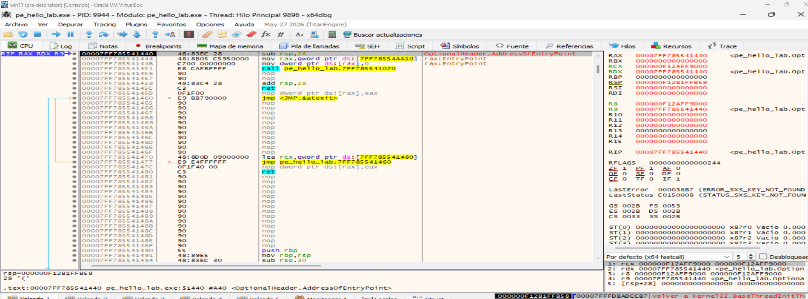
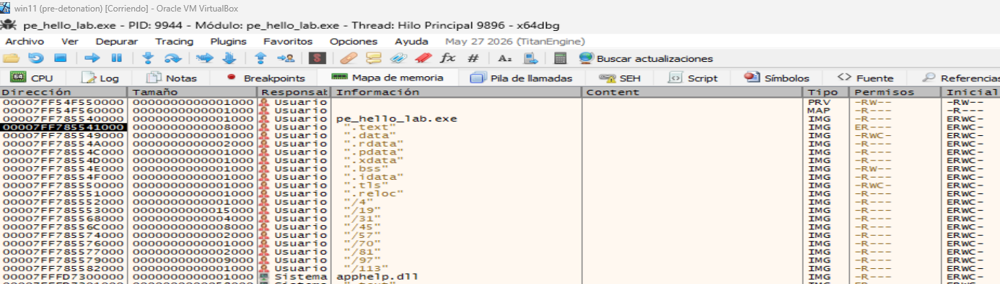
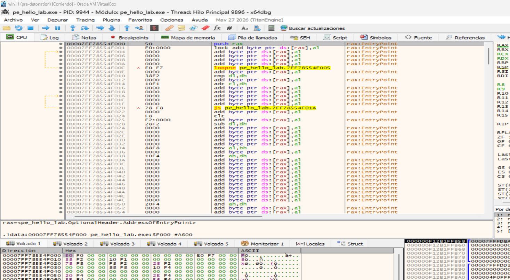
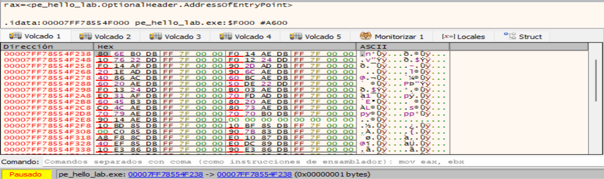
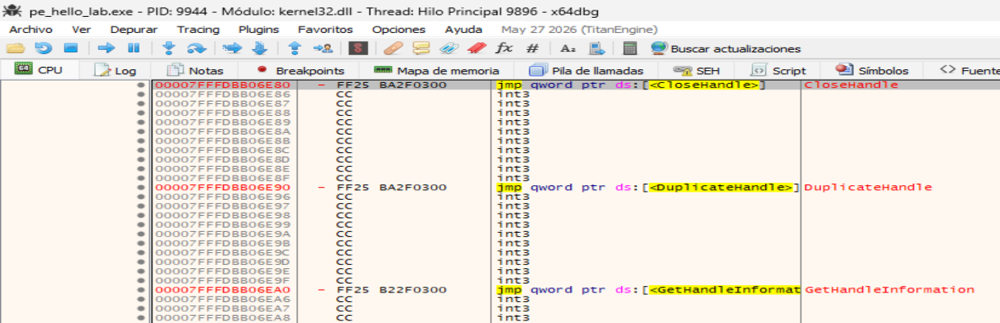
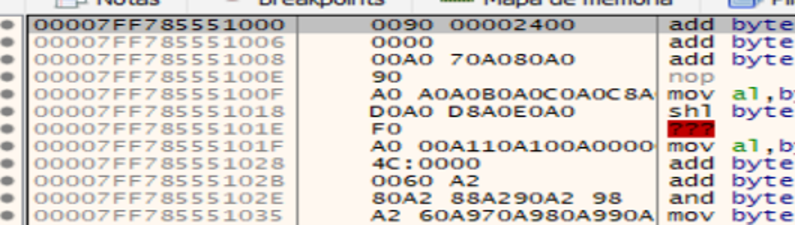
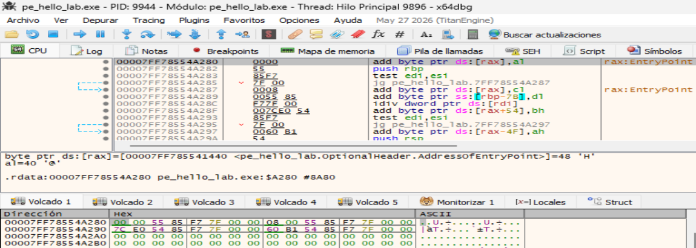
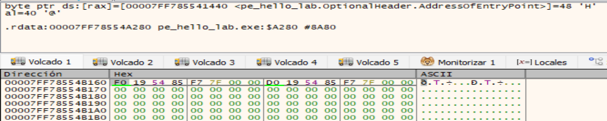
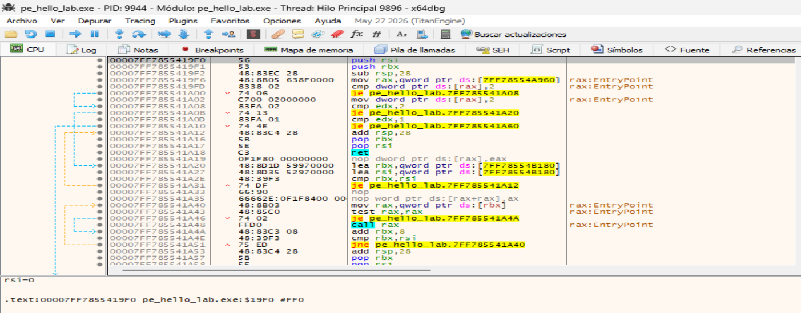
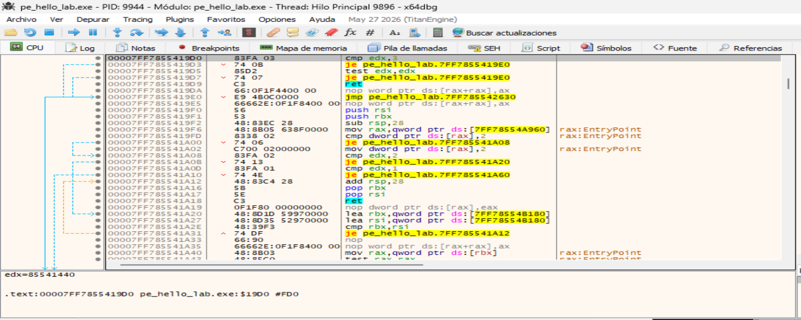

- [pe\_hello\_lab.exe](#pe_hello_labexe)
  - [File](#file)
  - [Indicators](#indicators)
  - [DOS-Header](#dos-header)
  - [DOS-Stub](#dos-stub)
  - [File-Header](#file-header)
  - [Optional-Header](#optional-header)
    - [Directories del Optional Header](#directories-del-optional-header)
  - [Section](#section)
  - [Libraries](#libraries)
  - [Imports](#imports)
  - [Overlay](#overlay)
  - [Estudiamos el proceso de ejecución del ejecutable:](#estudiamos-el-proceso-de-ejecución-del-ejecutable)
  - [Estudiamos el proceso de ejecución del ejecutable:](#estudiamos-el-proceso-de-ejecución-del-ejecutable-1)


# pe_hello_lab.exe

## File

```
file,
file > sha256,F7B6EFEDE6609AD3C50999E7F78CF0877E60911EE8F8D3710EFA5E4FD0924368
file > first 32 bytes (hex),4D 5A 90 00 03 00 00 00 04 00 00 00 FF FF 00 00 B8 00 00 00 00 00 00 00 40 00 00 00 00 00 00 00 
file > first 32 bytes (text),MZ............................................@..............
file > info,size: 277000 bytes, entropy: 5.839
file > type,executable, 64-bit, console
file > version,n/a
file > description,n/a
entry-point > first 32 bytes (hex),48 83 EC 28 48 8B 05 C5 95 00 00 C7 00 00 00 00 00 E8 CA FB FF FF 90 90 48 83 C4 28 C3 0F 1F 00 
entry-point > location,0x00001440 (section[.text])
file > signature,Microsoft Linker 2.45
,
stamps,
stamp > compiler,Wed Sep 30 15:17:33 2026 (UTC)
stamp > debug,n/a
stamp > resource,n/a
stamp > import,n/a
stamp > export,n/a
,
names,
file > name,c:\users\sonia\desktop\canciones hermy\cuando me llamas\utiles\tutorials\guada\vbox\pe_hello_lab.exe
debug > file,n/a
export,n/a
version,n/a
manifest,n/a
.NET > module > name,n/a
certificate > program-name,n/a
```

---

## Indicators
```
file > name,c:\pe_hello_lab.exe
file > signature,Microsoft Linker 2.45 | MinGW GCC
file > sha256,F7B6EFEDE6609AD3C50999E7F78CF0877E60911EE8F8D3710EFA5E4FD0924368
file > info,size: 277000 bytes, entropy: 5.839
file > type,executable, 64-bit, console
virustotal > score,The requested resource is not among the finished, queued or pending scans
stamp > compiler,Wed Sep 30 15:17:33 2026
resource,n/a
thread-local-storage > callback,0x000019D0 | 0x000019F0
section > virtualized,name: .bss
entry-point > location,0x00001440 (section: .text)
certificate,n/a
imports > flag,GetCurrentProcess | GetCurrentProcessId | VirtualAlloc | VirtualProtect | VirtualQuery
imphash > md5,8C0C0761BD6131C082B273F227B986B9
exports,n/a
overlay > info,signature: MinGW GCC, offset: 0x00038000, size: 47624 bytes, entropy: 3.576
overlay > first 47624 bytes (hex),2E 66 69 6C 65 00 00 00 67 00 00 00 FE FF 00 00 67 01 63 72 74 65 78 65 2E 63 00 00 00 00 00 00 
overlay > first 47624 bytes (text),.file......g..............g..crtexe.c............
overlay > entropy,3.576
```

---

## DOS-Header

```
file,
file > sha256,F7B6EFEDE6609AD3C50999E7F78CF0877E60911EE8F8D3710EFA5E4FD0924368
file > first 32 bytes (hex),4D 5A 90 00 03 00 00 00 04 00 00 00 FF FF 00 00 B8 00 00 00 00 00 00 00 40 00 00 00 00 00 00 00 
file > first 32 bytes (text),MZ............................................@..............

dos-header > sha256,BFDF5E72651B4EC588BD5FC6A9F17E9E0972248146BBACC10478F48D72F29B81
size,0x40 (64 bytes)
dos-header > location,0x00000000 - 0x00000040
entropy,3.669
file > ratio,0.00 %
exe-header > offset,0x00000080 (e_lfanew)
```

Observamos que los primeros elementos estructurales de este archivo `pe_hello_lab.c` corresponde a:
- `4D 5A` = `MZ`. Esto identifica el inicio del `DOS Header`.
- `IMAGE_DOS_HEADER` ocupa: 64 bytes
- Se encuentra en: `0x00000000 - 0x00000040`

También observamos el campo: `e_lfanew = 0x80`. Este valor indica que las `cabeceras PE/NT` comienzan en el offset: `0x00000080`.


---

## DOS-Stub

```
dos-stub > sha256,7764E7022DCAC1B5779D1F96FC05AF5C1FEE394AAFF8A3A7E9A881E1A1B163A3
dos-stub > location,0x00000040 - 0x00000080
size,0x40 (64 bytes)
entropy,4.794
file > ratio,0.02 %
first 32 bytes (hex),0E 1F BA 0E 00 B4 09 CD 21 B8 01 4C CD 21 54 68 69 73 20 70 72 6F 67 72 61 6D 20 63 61 6E 6E 6F 
first 32 bytes (hex),................!....L..!This program canno
message,!This program cannot be run in DOS mode.
```

El `DOS Stub` de este ejecutable ocupa exactamente `0x40 bytes` (64 bytes), desde el offset `0x40` hasta `0x80`, justo entre el `IMAGE_DOS_HEADER` y las `cabeceras NT` señaladas por `e_lfanew`.

En resumen, en este ejecutable el `DOS Stub` es convencional y no presenta nada especialmente anómalo: ocupa la región entre el `DOS Header` y las `NT` Headers y contiene el mensaje clásico de incompatibilidad con `DOS`.


---

## File-Header

```
characteristics,0x0026,
dynamic-link-library,0x0000,false
32-bit words support,0x0000,false
file-can-be-executed,0x0002,true
system-image,0x0000,false
large-address-aware,0x0020,true
debug-stripped,0x0000,false
line-stripped-from-file,0x0004,true
local-symbols-stripped-from-file,0x0000,false
relocation-stripped,0x0000,false
uniprocessor,0x0000,false
bytes-of-machine-words-reversed-Low,0x0000,false
bytes-of-machine-words-reversed-Hi,0x0000,false
media-run-from-swap,0x0000,false
network-run-from-swap,0x0000,false
,,
general,,
stamp > compiler,0x6ABD280D,Wed Sep 30 15:17:33 2026 (UTC)
size,0x14,20 bytes
file-header > location,0x00000084 - 0x00000098,0x00000084 - 0x00000098
signature,0x00004550,PE00
machine,0x8664,Amd64
sections > count,0x0012,18
pointer-symbol-table,0x00038000,0x00000000 (expected)
number-of-symbols,0x000008C1,0x00000000 (expected)
```

Destacamos:
```
Offset 0x80
        │
        ▼
┌───────────────────────────────┐
│ PE Signature                  │
│                               │
│ PE\0\0                        │
└───────────────────────────────┘
        │
        ▼
Offset 0x84
┌───────────────────────────────┐
│ IMAGE_FILE_HEADER             │
│ tamaño = 20 bytes             │
│                               │
│ Machine          = AMD64      │
│ Sections         = 18         │
│ Characteristics  = 0x0026     │
│   ├── Ejecutable              │
│   ├── Large Address Aware     │
│   ├── No es DLL               │
│   ├── Relocations disponibles │
│                               │
│ TimeDateStamp    = 0x6ABD280D │
└───────────────────────────────┘
        │
        ▼
Offset 0x98
┌───────────────────────────────┐
│ IMAGE_OPTIONAL_HEADER         │
│ ...                           │
└───────────────────────────────┘
```

Esta información confirma que `pe_hello_lab.exe` es una imagen `PE` ejecutable de `64 bits` y nos proporciona los metadatos básicos necesarios antes de pasar al `IMAGE_OPTIONAL_HEADER`.

---

## Optional-Header

```
general,,
subsystem,0x0003,console
magic,0x020B,PE+
file-checksum,0x0004B349,0x0004B349
entry-point > location,0x00001440,section[.text]
base-of-code > location,0x00001000,section[.text]
size-of-code,0x00008000,32768 bytes
size-of-initialized-data,0x00002E00,11776 bytes
size-of-uninitialized-data,0x00000C00,3072 bytes
size-of-image,0x00043000,274432 bytes
size-of-headers,0x00000600,1536 bytes
size-of-stack-reserve,0x00200000,2097152 bytes
size-of-stack-commit,0x00001000,4096 bytes
size-of-heap-reserve,0x00100000,1048576 bytes
size-of-heap-commit,0x00001000,4096 bytes
section-alignment,0x00001000,4096 bytes
file-alignment,0x00000200,512 bytes
directories > count,0x00000010,16
LoaderFlags,0x00000000,0x00000000
Win32VersionValue,0x00000000,0x00000000
image-base,0x0000000140000000,0x0000000140000000
linker > version,2.45,Microsoft Linker 2.45
os > version,4.0,Windows NT 4.0
image > version,0.0,0.0
subsystem,5.2,5.2
,,
characteristics,0x0160,items
Address-Space-Layout-Randomization (ASLR),0x0040,true
Control-flow Enforcement Technology (CETCOMPACT),0x0000,false
Data Execution Prevention (DEP),0x0100,true
Code-Integrity (CI),0x0000,false
Structured-Exception Handling (SEH),0x0000,true
Windows-Driver Model (WDM),0x0000,false
Terminal-Server aware (TSA),0x0000,false
Control-Flow Guard (CFG),0x0000,false
image-bound,0x0000,false
Image isolation,0x0000,false
High-Entropy,0x0020,true
AppContainer,0x0000,false
```

**Resumiendo:**
- Se confirma que se trata de una imagen `PE32+ de 64 bits`, ya que presenta: `Magic = 0x020B` & `PE32+`.
- El ejecutable está configurado como aplicación de consola: `Subsystem = 0x0003`. `Console`.
- Punto de entrada (RVA de inicio): `AddressOfEntryPoint = 0x00001440`.
- La herramienta indica que esta `RVA` se encuentra dentro de la sección: `.text`.
- El código comienza en: `BaseOfCode = 0x00001000`.
- La dirección base preferida es: `ImageBase = 0x0000000140000000`
- `VA = ImageBase + RVA`.
- El punto de entrada correspondería conceptualmente a:
  ```
  0x140000000
  +     0x1440
  ----------------
  0x140001440
  ```
- Si la imagen se carga en su `ImageBase` preferido = `0x140001440`.


**Estructura:**
```
ImageBase
0x0000000140000000
        │
        ▼
RVA 0x0000
+-----------------------------+
| Headers                     |
| SizeOfHeaders = 0x600       |
+-----------------------------+
        │
        │ espacio/alineamiento
        │
        ▼
RVA 0x1000 ← inicio de la sección / BaseOfCode
+----------------------------------+
| .text                            |
| BaseOfCode                       |
|    ...                           |
|    ...                           |
| RVA 0x1440 ← AddressOfEntryPoint |
| EntryPoint                       |
+----------------------------------+
```

Tenemos que `.text` comienza en: `ImageBase + 0x1000 = 0x140001000`.

Mientras que el `Entry Point` está más adelante dentro de `.text`: `ImageBase + 0x1440 = 0x140001440`.


**Nota interesante:**  
Es importante observar que: `SizeOfHeaders = 0x600`. Pero la primera sección empieza en: `RVA 0x1000`. Debido principalmente al: `SectionAlignment = 0x1000`, entre `RVA 0x600` y: `RVA 0x1000` hay una zona de alineamiento. Esa distinción será muy útil cuando comparemos `PE en disco` frente a `PE en memoria`.





En la parte inferior x64dbg muestra:
```
.text:00007FF785541440
pe_hello_lab.exe:$1440
<OptionalHeader.AddressOfEntryPoint>
```

Esto coincide exactamente con el valor que habíamos obtenido del Optional Header: `AddressOfEntryPoint = RVA 0x1440`.

Por tanto:
```
RVA del Entry Point = 0x1440
```

y en esta ejecución concreta su dirección virtual es:
```
VA del Entry Point
        =
0x00007FF785541440
```

El registro `RIP` confirma además que la CPU está detenida precisamente ahí: `RIP = 00007FF785541440`.

Podemos calcular la base real de carga: Sabemos que: `VA = MappedBase + RVA`.

por tanto: `MappedBase = VA - RVA`.

Aplicándolo:
```
0x00007FF785541440
-
0x0000000000001440
────────────────────
0x00007FF785540000
```

Así que el ejecutable se encuentra realmente cargado en: `MappedBase = 0x00007FF785540000`.



Esto es importante porque en el análisis estático habíamos visto: `ImageBase preferida = 0x0000000140000000`.

pero durante esta ejecución tenemos:
```
ImageBase preferida
0x0000000140000000

           ≠

MappedBase real
0x00007FF785540000
```

**<mark>Esto es un ejemplo perfecto del efecto de ASLR.</mark>** El `AddressOfEntryPoint = 0x1440` obtenido del `Optional Header` es una `RVA`. x64dbg la convierte en una dirección efectiva al sumarla a la base real donde **ASLR** ha cargado el módulo.

----

**Relación con .text:**

También habíamos visto:
```
.text VirtualAddress = RVA 0x1000
```
Por tanto, en esta ejecución .text comienza aproximadamente en:
```
MappedBase + 0x1000

0x00007FF785540000
+             1000
────────────────────
0x00007FF785541000
```

Y el Entry Point está en:
```
0x00007FF785541440
```

Es decir:
```
MappedBase
0x7FF785540000
       │
       ▼

RVA 0x1000
0x7FF785541000
┌──────────────────────────────┐
│ .text                        │
│                              │
│ ...                          │
│                              │
│ +0x440                       │
│                              │
│ EntryPoint                   │
│ 0x7FF785541440               │
└──────────────────────────────┘
```

Esto confirma experimentalmente lo que explicábamos en teoría:
- `dirección de una sección = MappedBase + VirtualAddress`, y
- `EntryPoint = MappedBase + AddressOfEntryPoint`.


---

### Directories del Optional Header

```
Directory | Size | Address  | location | stamp | invalid | missing | empty

export,0x00000000,-,-,-,-,-,x
import,0x00000894 (2196),0x0000F000 (virtual),section:.idata,0x00000000,-,-,-
resource,0x00000000,-,-,-,-,-,x
exception,0x00000480 (1152),0x0000C000 (virtual),section:.pdata,0x00000000,-,-,-
security,0x00000000,-,-,-,-,-,x
relocation,0x00000080 (128),0x00011000 (virtual),section:.reloc,0x00000000,-,-,-
debug,0x00000000,-,-,-,-,-,x
architecture,0x00000000,-,-,-,-,-,x
global-pointer,0x00000000,-,-,-,-,-,x
thread-local-storage,0x00000028 (40),0x0000A280 (virtual),section:.rdata,0x00000000,-,-,-
load-configuration,0x00000000,-,-,-,-,-,x
bound-import,0x00000000,-,-,-,-,-,x
import-address,0x000001E8 (488),0x0000F238 (virtual),section:.idata,0x00000000,-,-,-
delay-loaded,0x00000000,-,-,-,-,-,x
.NET,0x00000000,-,-,-,-,-,x
```

La tabla de `Data Directories` del `Optional Header` indica qué estructuras adicionales utiliza el `PE` y en qué `RVA` se encuentran. Las más relevantes son:

- **Import Directory:** Esta entrada contiene la información necesaria para localizar las `DLL` y funciones importadas por el ejecutable.
  - RVA  = 0x0000F000
  - Size = 0x894
  - Section = .idata
    

  - La dirección virtual del Import Directory es:
    ```
    0x00007FF785540000
    +           0xF000
    ──────────────────────
    0x00007FF78554F000
    ```
  - Inicio del Import Directory en memoria: La `RVA 0xF000` indicada por el `Data Directory` se traduce, al sumarla a la base real del módulo `0x7FF785540000`, en la dirección virtual `0x7FF78554F000`. x64dbg confirma que esta dirección pertenece a la sección `.idata`. Los primeros 20 bytes corresponden al primer `IMAGE_IMPORT_DESCRIPTOR`. Entre sus campos puede observarse `FirstThunk = 0xF238`, coincidente con la `RVA` de la `Import Address Table` obtenida durante el análisis estático.
  - Vamos aseguir el campo: `Name = RVA 0xF7E0`. Ahí veremos qué `DLL` describe este primer `IMAGE_IMPORT_DESCRIPTOR`.
    ```
    MappedBase = 0x00007FF785540000
    IAT RVA    = 0x000000000000F238
                 ──────────────────
    IAT VA     = 0x00007FF78554F238
    ```
    - En el panel Dump, pulsamos `Ctrl+G`: `pe_hello_lab.exe+F238`.
    - En el Dump vemos entradas de la Import Address Table:
      
    - Como el ejecutable es `x64` cada entrada de la IAT ocupa: `8 bytes = 1 QWORD`.
    - Los primeros 8 bytes son: `80 6E B0 DB FF 7F 00 00`.
    - Como Windows/x86-64 utiliza `little-endian`, se interpretan como: `0x00007FFFDBB06E80` ──► API importada.
    - Seleccionamos estos 8 bytes ──► clic derecho  ──► Follow QWORD in Disassembler:
      
  - Al seguir uno de los `QWORD` almacenados en la Import Address Table mediante `Follow QWORD in Disassembler`, x64dbg conduce a una dirección perteneciente a `kernel32.dll`. En este caso puede observarse la `API CloseHandle`, junto con otros exports como `DuplicateHandle` y `GetHandleInformation`. Esto demuestra que, una vez cargado el proceso, las entradas de la `IAT` contienen direcciones virtuales resueltas de las funciones importadas.


```
Optional Header
      │
      ▼
Import Directory
RVA 0xF000
      │
      ▼
IMAGE_IMPORT_DESCRIPTOR
      │
      ├── DLL
      ├── INT
      │
      └── FirstThunk = 0xF238
                         │
                         ▼
                    IAT RVA 0xF238
                         │
                         ▼
                 0x7FF78554F238
                         │
                         ▼
                direcciones reales
                    de las APIs
```
`Import Address Table` en memoria. La `IAT` comienza en la `RVA 0xF238`, que al sumarse a la base real del módulo (`0x7FF785540000`) corresponde a la `VA 0x7FF78554F238`. Al tratarse de un ejecutable `x64`, cada entrada ocupa 8 bytes. Una vez cargado el proceso, estas entradas contienen direcciones virtuales de las funciones importadas resueltas por el loader de Windows.


- **Exception Directory:** En ejecutables `x64`, `.pdata` suele contener información utilizada para el manejo de excepciones y para el `stack unwinding`.
  - RVA  = 0x0000C000
  - Size = 0x480
  - Section = .pdata

- **Base Relocation Directory:** Esta tabla contiene la información necesaria para corregir determinadas direcciones si el ejecutable no puede cargarse en su `ImageBase` preferido.
  - RVA  = 0x00011000
  - Size = 0x80
  - Section = .reloc
  - ImageBase = 0x140000000
  - Conceptualmente: `Delta = ActualBase - PreferredImageBase`.
  - Esto es especialmente relevante para el posterior estudio de `PE Injection / Manual Mapping`.
  - MappedBase             = 0x00007FF785540000
  - Base Relocation RVA    = 0x00011000
  - La dirección real es:
    ```
    0x00007FF785540000
    +          0x11000
    ──────────────────────
    0x00007FF785551000
    ```
    
    
    Vemos en la captura:
    ```
    .reloc:00007FF785551000
  	pe_hello_lab.exe:$11000

    00 90 00 00  -> VirtualAddress = 0x00009000
    24 00 00 00  -> SizeOfBlock    = 0x00000024
    ```
  - El funcionamiento completo de `.reloc` queda así:
    ```
    .reloc
    RVA 0x11000
             │
             ▼
    ┌──────────────────────────────┐
    │ IMAGE_BASE_RELOCATION        │
    │                              │
    │ VirtualAddress = 0x9000      │
    │ SizeOfBlock    = 0x24        │
    ├──────────────────────────────┤
    │ WORD relocation #1           │
    │ WORD relocation #2           │
    │ WORD relocation #3           │
    │ ...                          │
    └──────────────────────────────┘
    ```

  - Y estas entradas permiten corregir direcciones cuando ocurre justamente lo que estamos viendo en la ejecución:
    ```
    ImageBase preferida:
    
    0x0000000140000000
    
              ≠
    
    MappedBase real:
    
    0x00007FF785540000
    ```
  - Por lo tanto hay un desplazamiento:
    ```
    Delta =
    MappedBase - ImageBase preferida
    ```
    que el cargador utiliza junto con `.reloc` para corregir las referencias afectadas.

  - `Base Relocation Directory` en memoria: La `RVA 0x11000` se traduce en la dirección virtual `0x7FF785551000` al sumarla a la base real del módulo. Esta dirección pertenece a la sección `.reloc`. Los primeros 8 bytes forman una estructura `IMAGE_BASE_RELOCATION`: `VirtualAddress = 0x9000` y `SizeOfBlock = 0x24`. A continuación aparecen las entradas que identifican las posiciones que deben corregirse cuando la imagen se carga en una dirección diferente de su `ImageBase` preferido.
  - Debemos ignorar las supuestas instrucciones `add byte ptr...` de la ventana CPU en esta zona. Son simplemente el resultado de que `x64dbg` está desensamblando datos de `.reloc` como si fueran código.


- **TLS Directory:** La entrada `Thread Local Storage` (`TLS`) contiene información relacionada con almacenamiento local de hilos y puede incluir `TLS callbacks`. Estos callbacks son importantes durante el análisis porque pueden ejecutarse antes de alcanzar el `Entry Point` principal.
  - RVA  = 0x0000A280
  - Size = 0x28
  - Section = .rdata
  ```
  MappedBase        = 0x00007FF785540000
  TLS Directory RVA = 0x0000A280

  Por tanto:
  0x00007FF785540000
  +           0xA280
  ──────────────────────
  0x00007FF78554A280
  ```

  Estructura:
  ```
  IMAGE_TLS_DIRECTORY64
  {
      ULONGLONG StartAddressOfRawData;
      ULONGLONG EndAddressOfRawData;
      ULONGLONG AddressOfIndex;
      ULONGLONG AddressOfCallBacks;
      DWORD     SizeOfZeroFill;
      DWORD     Characteristics;
  };
  ```
  
  Vemos en el DUMP:  
  
  
  | Dirección | Bytes | Campo | Valor interpretado |
  |---|---|---|---|
  | `7FF78554A280` | `00 00 55 85 F7 7F 00 00` | `StartAddressOfRawData` | `0x00007FF785550000` |
  | `7FF78554A288` | `08 00 55 85 F7 7F 00 00` | `EndAddressOfRawData` | `0x00007FF785550008` |
  | `7FF78554A290` | `7C E0 54 85 F7 7F 00 00` | `AddressOfIndex` | `0x00007FF78554E07C` |
  | `7FF78554A298` | `60 B1 54 85 F7 7F 00 00` | `AddressOfCallBacks` | `0x00007FF78554B160` |
  | `7FF78554A2A0` | `00 00 00 00` | `SizeOfZeroFill` | `0` |
  | `7FF78554A2A4` | `00 00 00 00` | `Characteristics` | `0` |

  - El campo más interesante es **AddressOfCallBacks**. El ejecutable tiene: `00007FF78554B160`.
    ```
    TLS Directory

          7FF78554A298
               │
               │ contiene:
               ▼
          7FF78554B160
               │
               ▼
          array de punteros
          a TLS callbacks
    ```
  - En `7FF78554B160` podemos comprobar si existen `callbacks`.
  - En el panel Dump: `Ctrl + G`, escribimos: `00007FF78554B160`:
    

    Como estamos en x64, cada entrada es un QWORD de 8 bytes y debe interpretarse en little-endian:
    
    | Dirección del array | Bytes | Valor | Significado |
    |---|---|---|---|
    | `0x7FF78554B160` | `F0 19 54 85 F7 7F 00 00` | `0x7FF7855419F0` | TLS Callback 1 |
    | `0x7FF78554B168` | `D0 19 54 85 F7 7F 00 00` | `0x7FF7855419D0` | TLS Callback 2 |
    | `0x7FF78554B170` | `00 00 00 00 00 00 00 00` | `NULL` | Fin del array |

  - **Array de TLS callbacks.** El campo `AddressOfCallBacks` del `IMAGE_TLS_DIRECTORY64` apunta a `0x7FF78554B160`. En esta dirección se observa un array de dos punteros, `0x7FF7855419F0` y `0x7FF7855419D0`, seguido por una entrada `NULL` que marca el final. Al restar la base del módulo se obtienen las `RVA 0x19F0` y `0x19D0`, ambas situadas dentro de la sección `.text`.

  - Callback 1: Siguiendo el primer puntero del array `AddressOfCallBacks`, `x64dbg` conduce a `0x7FF7855419F0`, correspondiente a la `RVA 0x19F0` dentro de `.text`. La rutina examina el parámetro `Reason` recibido en `EDX`, comportamiento coherente con una función `TLS` utilizada durante eventos de inicialización del proceso o de los hilos. En este ejecutable, el callback parece formar parte del runtime generado por `MinGW`.
      

  - Callback 2: El segundo elemento del array `AddressOfCallBacks` apunta a `0x7FF7855419D0`, correspondiente a la `RVA 0x19D0` dentro de `.text`. La rutina examina el parámetro `Reason` recibido en `EDX` y actúa específicamente ante los valores `0` (`DLL_PROCESS_DETACH`) y `3` (`DLL_THREAD_DETACH`), lo que sugiere una función relacionada con tareas de finalización o limpieza del runtime.
      


- **Import Address Table (IAT):** La `IAT` contiene las direcciones de las funciones importadas una vez resueltas por el cargador.
  - RVA  = 0x0000F238
  - Size = 0x1E8
  - Section = .idata


Para **PE Injection**, destacan especialmente **Import Directory + IAT + Base Relocation Directory**, porque son estructuras que deben tenerse en cuenta cuando una imagen `PE` se reconstruye manualmente en memoria.


---

## Section

```
section,section[0],section[1],section[2],section[3],section[4],section[5],section[6],section[7],section[8],section[9],section[10],section[11],section[12],section[13],section[14],section[15],section[16],section[17]
name,.text,.data,.rdata,.pdata,.xdata,.bss,.idata,.tls,.reloc,/4,/19,/31,/45,/57,/70,/81,/97,/113
section > sha256,2278A6C5A36122839C433547382F20214FB983961BCAA36E381720CA89947A7B,BFC5B3E07617557263590F943B0067EAD056A95FFC8E9EAFF65A7E62CB02F122,383890C3574C342FEE57293AC541282BA59C2D9D8384D1E81505750C3AF6F583,67031D45ABCDA2A5B0174535B68BCEA70A305D687863EAB65D78E53563B3FDD8,EE3870D7ECD8D6493A741C0D741A173971D6513487A7EFA75B5B2CE1AE3D01E3,n/a,EE1AF2A19598543F98EFBB98DF8F26EA1DB6DF34DB86FE18C5E11695DF9A071A,076A27C79E5ACE2A3D47F9DD2E83E4FF6EA8872B3C2218F66C92B89B55F36560,DA423257498E675B7C90759441BA582AD883A3B803596AACE85A35FB7E29F3D6,594DFCEB0557278A73DD7CB4276CFB8171204F625247EB1D09486A3F799BA5DD,333037A55AEA7114C24D39F37FE02CB84F723C27D550DF0765770F8B95609C82,0F3690268E6BB2B0A13FE0C7F36D05EC472618A8020A46992CAFEA24FCBFFAF9,CFDCF6A299F2D57D430B9CA1DDA1AD1CD52AAC98BA766DB3058B73C66147537E,EA2031A024F07D0925C5FEBD7CF9F8A741B400FC672A8468A7B770C33F6ED18B,79864862B7E9324AC2E412E3C43854CC30F5CB7F924F8757067808EF6B83C0D7,F0D27495D3EF43CD3C57EF825DC44720297BD8F899A6D949757A742769312657,6F43AD908DCF1A947DDB7DD5286886A2AAA0D5096EA4076B691DF97A085C891F,A4D599E255312566A8DC731DF98376ED29E02F502E3F291FF8FFDDCD4683A4AF
entropy,6.202,1.200,4.770,3.328,3.251,n/a,3.598,0.000,1.584,1.761,5.805,4.839,5.063,4.332,4.613,4.687,5.881,5.838
file > ratio (82.25%),11.83 %,0.18 %,1.66 %,0.55 %,0.55 %,n/a,0.92 %,0.18 %,0.18 %,0.74 %,29.94 %,5.55 %,11.46 %,2.22 %,0.37 %,2.77 %,12.57 %,0.55 %
raw-address (begin),0x00000600,0x00008600,0x00008800,0x00009A00,0x0000A000,0x00000000,0x0000A600,0x0000B000,0x0000B200,0x0000B400,0x0000BC00,0x00020000,0x00023C00,0x0002B800,0x0002D000,0x0002D400,0x0002F200,0x00037A00
raw-address (end),0x00008600,0x00008800,0x00009A00,0x0000A000,0x0000A600,0x00000000,0x0000B000,0x0000B200,0x0000B400,0x0000BC00,0x00020000,0x00023C00,0x0002B800,0x0002D000,0x0002D400,0x0002F200,0x00037A00,0x00038000
raw-size (227840 bytes),0x00008000 (32768 bytes),0x00000200 (512 bytes),0x00001200 (4608 bytes),0x00000600 (1536 bytes),0x00000600 (1536 bytes),0x00000000 (0 bytes),0x00000A00 (2560 bytes),0x00000200 (512 bytes),0x00000200 (512 bytes),0x00000800 (2048 bytes),0x00014400 (82944 bytes),0x00003C00 (15360 bytes),0x00007C00 (31744 bytes),0x00001800 (6144 bytes),0x00000400 (1024 bytes),0x00001E00 (7680 bytes),0x00008800 (34816 bytes),0x00000600 (1536 bytes)
virtual-address (begin),0x00001000,0x00009000,0x0000A000,0x0000C000,0x0000D000,0x0000E000,0x0000F000,0x00010000,0x00011000,0x00012000,0x00013000,0x00028000,0x0002C000,0x00034000,0x00036000,0x00037000,0x00039000,0x00042000
virtual-address (end),0x00008F80,0x00009120,0x0000B188,0x0000C480,0x0000D404,0x0000EB90,0x0000F894,0x00010010,0x00011080,0x00012790,0x0002724D,0x0002BAFF,0x00033B60,0x00035698,0x00036398,0x00038D16,0x00041633,0x000425BC
virtual-size (226001 bytes),0x00007F80 (32640 bytes),0x00000120 (288 bytes),0x00001188 (4488 bytes),0x00000480 (1152 bytes),0x00000404 (1028 bytes),0x00000B90 (2960 bytes),0x00000894 (2196 bytes),0x00000010 (16 bytes),0x00000080 (128 bytes),0x00000790 (1936 bytes),0x0001424D (82509 bytes),0x00003AFF (15103 bytes),0x00007B60 (31584 bytes),0x00001698 (5784 bytes),0x00000398 (920 bytes),0x00001D16 (7446 bytes),0x00008633 (34355 bytes),0x000005BC (1468 bytes)
,,,,,,,,,,,,,,,,,,
characteristics,0x60000020,0xC0000040,0x40000040,0x40000040,0x40000040,0xC0000080,0x40000040,0xC0000040,0x42000040,0x42000040,0x42000040,0x42000040,0x42000040,0x42000040,0x42000040,0x42000040,0x42000040,0x42000040
write,-,x,-,-,-,x,-,x,-,-,-,-,-,-,-,-,-,-
execute,x,-,-,-,-,-,-,-,-,-,-,-,-,-,-,-,-,-
share,-,-,-,-,-,-,-,-,-,-,-,-,-,-,-,-,-,-
self-modifying,-,-,-,-,-,-,-,-,-,-,-,-,-,-,-,-,-,-
virtual,-,-,-,-,-,x,-,-,-,-,-,-,-,-,-,-,-,-
,,,,,,,,,,,,,,,,,,
items,,,,,,,,,,,,,,,,,,
directory > import,-,-,-,-,-,-,0x0000F000,-,-,-,-,-,-,-,-,-,-,-
directory > exception,-,-,-,0x0000C000,-,-,-,-,-,-,-,-,-,-,-,-,-,-
directory > relocation,-,-,-,-,-,-,-,-,0x00011000,-,-,-,-,-,-,-,-,-
directory > thread-local-storage,-,-,0x0000A280,-,-,-,-,-,-,-,-,-,-,-,-,-,-,-
directory > import-address,-,-,-,-,-,-,0x0000F238,-,-,-,-,-,-,-,-,-,-,-
base-of-code,0x00001000,-,-,-,-,-,-,-,-,-,-,-,-,-,-,-,-,-
entry-point > location,0x00001440,-,-,-,-,-,-,-,-,-,-,-,-,-,-,-,-,-
thread-local-storage,0x000019F0,-,-,-,-,-,-,-,-,-,-,-,-,-,-,-,-,-
thread-local-storage,0x000019D0,-,-,-,-,-,-,-,-,-,-,-,-,-,-,-,-,-
```


| Sección | RVA inicial | Raw Offset | Virtual Size | Raw Size | Permisos | Función / relevancia |
|---|---:|---:|---:|---:|:---:|---|
| **`.text`** | `0x1000` | `0x600` | `0x7F80` | `0x8000` | `R-X` | Código ejecutable. Contiene `BaseOfCode` y el **Entry Point (`RVA 0x1440`)**. |
| **`.data`** | `0x9000` | `0x8600` | `0x120` | `0x200` | `RW-` | Variables y datos inicializados modificables. |
| **`.rdata`** | `0xA000` | `0x8800` | `0x1188` | `0x1200` | `R--` | Datos de solo lectura. Contiene el **TLS Directory en `RVA 0xA280`**. |
| **`.pdata`** | `0xC000` | `0x9A00` | `0x480` | `0x600` | `R--` | Información de excepciones/*unwind* en x64. Contiene el **Exception Directory**. |
| **`.xdata`** | `0xD000` | `0xA000` | `0x404` | `0x600` | `R--` | Datos auxiliares relacionados con excepciones y *stack unwinding*. |
| **`.bss`** | `0xE000` | — | `0xB90` | `0` | `RW-` | Datos no inicializados. Es un ejemplo claro de una sección que ocupa memoria pero no datos físicos en disco. |
| **`.idata`** | `0xF000` | `0xA600` | `0x894` | `0xA00` | `R--` | Información de importaciones. Contiene **Import Directory (`0xF000`)** e **IAT (`0xF238`)**. |
| **`.tls`** | `0x10000` | `0xB000` | `0x10` | `0x200` | `RW-` | Datos de Thread Local Storage. |
| **`.reloc`** | `0x11000` | `0xB200` | `0x80` | `0x200` | `R--` | Contiene las **base relocations**, necesarias si cambia la base de carga. |


Diferencia entre disco y memoria:
| Sección | En disco (`PointerToRawData`) | En memoria (`VirtualAddress`) |
|---|---:|---:|
| `.text` | `0x600` | `0x1000` |
| `.data` | `0x8600` | `0x9000` |
| `.rdata` | `0x8800` | `0xA000` |
| `.pdata` | `0x9A00` | `0xC000` |
| `.idata` | `0xA600` | `0xF000` |
| `.reloc` | `0xB200` | `0x11000` |

Relación más importante para PE Injection:
```
.text
  │
  └── Código + EntryPoint
          RVA 0x1440

.idata
  │
  ├── Import Directory
  └── IAT

.reloc
  │
  └── Correcciones por cambio
      de ImageBase

.rdata
  │
  └── TLS Directory
```


----

## Libraries

```
KERNEL32.dll,-,Implicit,23,Windows NT BASE API Client
msvcrt.dll,-,Implicit,34,Microsoft C Runtime Library
USER32.dll,-,Implicit,1,Multi-User Windows USER API Client Library
```

Este ejecutable importa de forma implícita tres bibliotecas del sistema:
| Biblioteca | Tipo | Nº de imports | Función principal |
|---|---|---:|---|
| `KERNEL32.dll` | Implicit | 23 | API base de Windows: procesos, memoria, archivos, hilos, sincronización, etc. |
| `msvcrt.dll` | Implicit | 34 | Microsoft C Runtime: funciones estándar de C utilizadas por el programa. |
| `USER32.dll` | Implicit | 1 | API gráfica de Windows; en este laboratorio se utiliza para `MessageBoxA`. |


## Imports

```
GetCurrentProcess,x,implicit,-,0x00000000,0x00000000,KERNEL32.dll
GetCurrentProcessId,x,implicit,-,0x00000000,0x00000000,KERNEL32.dll
VirtualAlloc,x,implicit,-,0x00000000,0x00000000,KERNEL32.dll
VirtualProtect,x,implicit,-,0x00000000,0x00000000,KERNEL32.dll
VirtualQuery,x,implicit,-,0x00000000,0x00000000,KERNEL32.dll
...
...
```

Vemos el detalle de algunos de los imports que usa este ejecutable.
```
GetCurrentProcess
        │
        ▼
proceso actual
        │
        ├── VirtualAlloc
        │      └── reservar memoria
        │
        ├── VirtualProtect
        │      └── cambiar permisos
        │
        └── VirtualQuery
               └── inspeccionar memoria
```

## Overlay

```
overlay > sha256,FB765A30C3559ACB5506F2AC2F02B8FEC48484FF25CF28893BF9F8976D135403
entropy,3.576
overlay > location,0x00038000 - 0x00043A08
size,0xBA08 (47624 bytes)
signature,MinGW GCC
first 32 bytes (hex),2E 66 69 6C 65 00 00 00 67 00 00 00 FE FF 00 00 67 01 63 72 74 65 78 65 2E 63 00 00 00 00 00 00 
first 32 bytes (text),.file......g..............g..crtexe.c............
file > ratio,17.19 %
```

El overlay es la información situada después del final lógico de las secciones PE. En este ejecutable, el overlay no parece sospechoso por sí mismo: los datos mostrados son compatibles con artefactos de compilación de `MinGW/GCC`. Para análisis de malware, sin embargo, el overlay siempre merece revisión porque también puede utilizarse para almacenar configuraciones, payloads, datos comprimidos o contenido añadido al PE que no pertenece a ninguna sección.


-------------

## Estudiamos el proceso de ejecución del ejecutable:

```
Entry Point
    ↓
startup de MinGW
    ↓
main()
    ↓
modo seleccionado
    ↓
VirtualAlloc
    ↓
mapeo del PE
```

------------

## Estudiamos el proceso de ejecución del ejecutable:
```
main()
   ↓
show_hello()
   ↓
USER32!MessageBoxA
   ↓
"Hola mundo"
```
