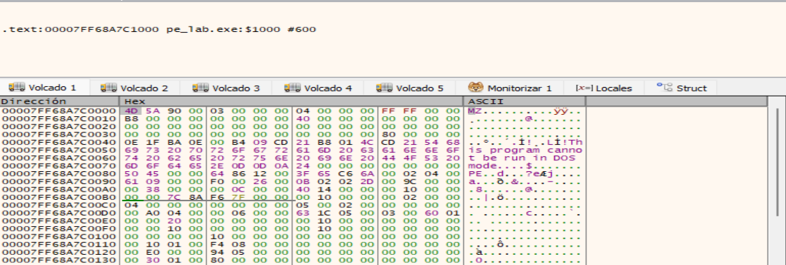

# 1. FASE A — analizar pe_lab.exe como PE

```
    ↓
1. DOS Header
2. NT Headers
3. File Header
4. Optional Header
5. Secciones
6. Imports
7. Relocations
8. RVA ↔ offset
```


MapppedBase del ejecutable: `00007FF68A7C0000`.


## 1.1. IMAGE_DOS_HEADER



```
pe_lab.exe

Offset 0x0000
+-----------------------+
| IMAGE_DOS_HEADER      |
|                       |
| e_magic = MZ          |
|                       |
| e_lfanew = 0x80 ------+------------------+
+-----------------------+                  |
| DOS Stub              |                  |
| ...                   |                  |
+-----------------------+                  |
                                           |
Offset 0x0080 <-----------------------------+
+-----------------------+
| PE 00 00              |
+-----------------------+
```


## 1.2. DOS_STUB

También se observa el mensaje del DOS Stub:
```
This program cannot be run in DOS mode.
```
Ese texto está situado entre la `cabecera DOS` y la `cabecera PE`.


## 1.3. IMAGE_NT_HEADERS

```
Offset 0x00
    ↓
   MZ
    |
    | e_lfanew = 0x80
    ↓
Offset 0x80
    ↓
 PE\0\0
```


Conclusión: la captura confirma correctamente la estructura inicial de `pe_lab.exe` como un fichero `PE` válido de Windows.


## 1.4. IMAGE_FILE_HEADER

Ya vimos:
```
Offset 0x80 → 50 45 00 00 → "PE\0\0"
```

La firma ocupa 4 bytes, así que el IMAGE_FILE_HEADER comienza en:
```
0x80 + 4 = 0x84
```

Su estructura en Windows es:
```
typedef struct _IMAGE_FILE_HEADER {
    WORD  Machine;
    WORD  NumberOfSections;
    DWORD TimeDateStamp;
    DWORD PointerToSymbolTable;
    DWORD NumberOfSymbols;
    WORD  SizeOfOptionalHeader;
    WORD  Characteristics;
} IMAGE_FILE_HEADER;
```

Ocupa exactamente 20 bytes (0x14).

En pe_lab.exe, los bytes correspondientes son:
```
Offset 0x84

64 86 | 12 00 | 3F 65 C6 6A | 00 02 04 00 |
61 09 00 00 | F0 00 | 26 00
```

Separándolos por campos:
| Campo | Bytes | Valor |
|---|---|---:|
| `Machine` | `64 86` | `0x8664` |
| `NumberOfSections` | `12 00` | `0x0012` = **18** |
| `TimeDateStamp` | `3F 65 C6 6A` | `0x6AC6653F` |
| `PointerToSymbolTable` | `00 02 04 00` | `0x00040200` |
| `NumberOfSymbols` | `61 09 00 00` | `0x00000961` |
| `SizeOfOptionalHeader` | `F0 00` | `0x00F0` = **240 bytes** |
| `Characteristics` | `26 00` | `0x0026` |


Mapa:
```
pe_lab.exe
│
├── Offset 0x0000
│      │
│      └── IMAGE_DOS_HEADER
│             │
│             ├── e_magic  = MZ
│             │
│             └── e_lfanew = 0x80
│
├── DOS Stub
│      "This program cannot be run in DOS mode."
│
└── Offset 0x0080
       │
       ├── 50 45 00 00
       │      "PE\0\0"
       │
       └── Offset 0x0084
              │
              └── IMAGE_FILE_HEADER
                    │
                    ├── Machine
                    │      0x8664 → AMD64
                    │
                    ├── NumberOfSections
                    │      0x12 → 18
                    │
                    ├── TimeDateStamp
                    │      0x6AC6653F
                    │
                    ├── PointerToSymbolTable
                    │      0x40200
                    │
                    ├── NumberOfSymbols
                    │      2401
                    │
                    ├── SizeOfOptionalHeader
                    │      0xF0 → 240 bytes
                    │
                    └── Characteristics
                           0x0026
```

## 1.5. IMAGE_OPTIONAL_HEADER64

IMAGE_OPTIONAL_HEADER64 comienza en el `offset 0x98`:
```
00007FF68A7C0090  61 09 00 00 F0 00 26 00 0B 02 02 2D 00 9C 00 00  a...ð.&....-....  
                                          │
                                          └── offset 0x98
```

| Campo | Valor |
|---|---:|
| `Magic` | `0x20B` |
| `MajorLinkerVersion` | `2` |
| `MinorLinkerVersion` | `45` |
| `SizeOfCode` | `0x9C00` |
| `SizeOfInitializedData` | `0x3800` |
| `SizeOfUninitializedData` | `0x0C00` |
| `AddressOfEntryPoint` | `0x1440` |
| `BaseOfCode` | `0x1000` |
| `ImageBase` | `0x140000000` |
| `SectionAlignment` | `0x1000` |
| `FileAlignment` | `0x200` |
| `SizeOfImage` | `0x4A000` |
| `SizeOfHeaders` | `0x600` |
| `Subsystem` | `3` |
| `DllCharacteristics` | `0x160` |
| `NumberOfRvaAndSizes` | `16` |


Si el PE se carga en su dirección preferida:
```
ImageBase = 0x140000000
```

entonces conceptualmente:
```
VA EntryPoint =
ImageBase + AddressOfEntryPoint
```

Por tanto:
```
0x140000000
+     0x1440
----------------
0x140001440
```

Así que la dirección virtual preferida del EntryPoint sería:
```
0x140001440
```

-----

**BaseOfCode = 0x1000**

Tenemos: `BaseOfCode = 0x1000`

Esto indica el RVA donde empieza la zona de código.

```
.text VirtualAddress ≈ 0x1000
```

El EntryPoint:
```
0x1440
```
está dentro de esa zona:
```
.text
RVA 0x1000
   |
   +---- EntryPoint 0x1440

```

------

**ImageBase = 0x140000000**
```
ImageBase = 0x140000000
```
Es la dirección virtual donde el PE preferiría ser cargado.


------

De todo el IMAGE_OPTIONAL_HEADER64, los mas destacado es:
```
AddressOfEntryPoint = 0x1440
ImageBase           = 0x140000000
SectionAlignment    = 0x1000
FileAlignment       = 0x200
SizeOfImage         = 0x4A000
SizeOfHeaders       = 0x600
```

----

## 1.6. DataDirectory

DataDirectory[16] es una de las partes más interesantes del IMAGE_OPTIONAL_HEADER64, porque funciona como un índice de estructuras importantes del PE.


| Índice | Directorio | RVA / Offset | Size |
|---:|---|---:|---:|
| 0 | Export | `0x00000000` | `0x00000000` |
| 1 | Import | `0x00011000` | `0x000008F4` |
| 2 | Resource | `0x00000000` | `0x00000000` |
| 3 | Exception | `0x0000E000` | `0x00000594` |
| 4 | Security | `0x00000000` | `0x00000000` |
| 5 | Base Relocation | `0x00013000` | `0x00000080` |
| 6 | Debug | `0x00000000` | `0x00000000` |
| 7 | Architecture | `0x00000000` | `0x00000000` |
| 8 | GlobalPtr | `0x00000000` | `0x00000000` |
| 9 | TLS | `0x0000CC40` | `0x00000028` |
| 10 | Load Config | `0x00000000` | `0x00000000` |
| 11 | Bound Import | `0x00000000` | `0x00000000` |
| 12 | IAT | `0x00011250` | `0x00000210` |
| 13 | Delay Import | `0x00000000` | `0x00000000` |
| 14 | COM Descriptor | `0x00000000` | `0x00000000` |
| 15 | Reserved | `0x00000000` | `0x00000000` |


Mapa mental:
```
IMAGE_OPTIONAL_HEADER64
        |
        v
DataDirectory[16]
        |
        +--> [0] Exports
        |
        +--> [1] Imports --------> RVA 0x11000
        |
        +--> [3] Exceptions -----> RVA 0xE000
        |
        +--> [5] Relocations ----> RVA 0x13000
        |
        +--> [9] TLS ------------> RVA 0xCC40
        |
        +--> [12] IAT -----------> RVA 0x11250
```

-----

## 1.8. Secciones

La tabla de secciones comienza en el `offset 0x188`:


| Sección | RVA | VirtualSize | Raw offset | Raw size | Permisos aprox. |
|---|---:|---:|---:|---:|---|
| `.text` | `0x1000` | `0x9B30` | `0x600` | `0x9C00` | R-X |
| `.data` | `0xB000` | `0x120` | `0xA200` | `0x200` | RW- |
| `.rdata` | `0xC000` | `0x1BA8` | `0xA400` | `0x1C00` | R-- |
| `.pdata` | `0xE000` | `0x594` | `0xC000` | `0x600` | R-- |
| `.xdata` | `0xF000` | `0x4F8` | `0xC600` | `0x600` | R-- |
| `.bss` | `0x10000` | `0xB90` | `0x0` | `0x0` | RW- |
| `.idata` | `0x11000` | `0x8F4` | `0xCC00` | `0xA00` | R-- |
| `.tls` | `0x12000` | `0x10` | `0xD600` | `0x200` | RW- |
| `.reloc` | `0x13000` | `0x80` | `0xD800` | `0x200` | R-- |
| `/4` | `0x14000` | `0x820` | `0xDA00` | `0xA00` | R-- |
| `/19` | `0x15000` | `0x17F46` | `0xE400` | `0x18000` | R-- |
| `/31` | `0x2D000` | `0x4010` | `0x26400` | `0x4200` | R-- |
| `/45` | `0x32000` | `0x876B` | `0x2A600` | `0x8800` | R-- |
| `/57` | `0x3B000` | `0x1AA8` | `0x32E00` | `0x1C00` | R-- |
| `/70` | `0x3D000` | `0x6CD` | `0x34A00` | `0x800` | R-- |
| `/81` | `0x3E000` | `0x1EC7` | `0x35200` | `0x2000` | R-- |
| `/97` | `0x40000` | `0x874A` | `0x37200` | `0x8800` | R-- |
| `/113` | `0x49000` | `0x62A` | `0x3FA00` | `0x800` | R-- |

-----

La relación disco ↔ memoria:
```
                 DISCO                    MEMORIA

.text            offset 0x600             RVA 0x1000
.data            offset 0xA200            RVA 0xB000
.rdata           offset 0xA400            RVA 0xC000
.pdata           offset 0xC000            RVA 0xE000
.idata           offset 0xCC00            RVA 0x11000
.reloc           offset 0xD800            RVA 0x13000
```

----


# 2. FASE B — analizar pe_lab.c
    ↓
1. main()
2. load_file()
3. parse_pe()
4. rva_to_file_offset()
5. imports
6. entropía
7. map_lab()


---------------

# Analizamos el ejecutable `pe_lab.exe`

El ejecutable `pe_lab.exe` es un laboratorio educativo para analizar archivos `PE` de Windows y entender cómo están organizados tanto en disco como en memoria.

**Tiene dos modos principales:**
- `static`: analiza el archivo sin ejecutarlo. Lee sus cabeceras `PE`, detecta la arquitectura, muestra `ImageBase`, `EntryPoint`, `SizeOfImage`, secciones, permisos, entropía e `imports`.
- `map`: reserva memoria dentro del propio proceso de `pe_lab.exe` y reconstruye allí la imagen `PE` copiando `headers` y secciones según sus `RVA`. No ejecuta el `PE`, no resuelve `imports`, no aplica `relocations` y no inyecta nada en otros procesos.

La idea central es que podamos observar cómo funciona un `PE` internamente
- Dónde están sus cabeceras,
- cómo se relacionan los offsets de fichero con los RVA,
- qué permisos tiene cada sección,
- qué DLL y funciones importa,
- y cómo quedaría distribuido en memoria.

En resumen: no es un inyector completo, sino una herramienta de estudio para entender los fundamentos que luego aparecen en técnicas de `PE loading`, `manual mapping` e `injection`.

**main():**
Dentro del ejecutable `pe_lab.exe` se define una estructura creada para guardar, de forma ordenada, toda la información que el programa va extrayendo del ejecutable `PE`. 


La idea visual sería:
```
PE_IMAGE pe

+-----------------------------------+
| data -------------> fichero entero|
| size -------------> tamaño        |
|                                   |
| dos -------------> DOS Header     |
| signature -------> "PE\0\0"       |
| file_header -----> File Header    |
| opt32/opt64 -----> Optional Header|
| sections --------> Secciones      |
+-----------------------------------+
```

Lo importante es que `PE_IMAGE` no contiene copias completas de todas las cabeceras. En gran parte contiene punteros hacia posiciones concretas dentro de data, que es donde está cargado el fichero completo.

El método `main()` recibe el modo de funcionamiento y el fichero `PE` objetivo. Luego prepara una variable `PE_IMAGE pe` que utilizará para almacenar toda la información del `PE` que vaya a analizar y llama a `load_file()` para empezar el análisis. El método main espera exactamente 3 argumentos contando el nombre del programa:
```
pe_lab.exe static notepad.exe
```

Conceptualmente:
```
main()
  |
  v
¿argc == 3?
  |
  +-- NO --> usage() --> termina
  |
  +-- SÍ
       |
       v
   load_file(argv[2], &pe)
```

------


# 1. load_file(): representación en disco
```
load_file(argv[2], &pe)
```
aquí es donde `pe_lab.exe` abre el ejecutable que queremos estudiar y lo carga completamente en memoria.


**Flujo de la función load_file():**
```
load_file()
   |
   v
fopen()       -> abre el fichero
   |
   v
fseek()       -> se mueve al final
   |
   v
ftell()       -> obtiene el tamaño
   |
   v
malloc()      -> reserva memoria
   |
   v
fread()       -> copia TODO el fichero a memoria
   |
   v
pe->data      -> contiene los bytes del PE
pe->size      -> contiene su tamaño
```


`load_file()` abre el ejecutable con:
```
fopen(filename, "rb");
```

obtiene su tamaño, reserva:
```
pe->data = (BYTE *)malloc(pe->size);
```

y copia el fichero completo:
```
fread(pe->data, 1, pe->size, fp);
```

En este momento todavía no hay una imagen PE cargada como la cargaría Windows. Tenemos únicamente:
```
Representación del fichero

offset 0
|
v
+-----------------+
| DOS header      |
+-----------------+
| DOS stub        |
+-----------------+
| NT headers      |
+-----------------+
| section table   |
+-----------------+
| raw .text       |
+-----------------+
| raw .rdata      |
+-----------------+
| raw .data       |
+-----------------+
```

Esto introduce una distinción fundamental:
```
OFFSET DE FICHERO ≠ RVA
```

Y precisamente por eso después necesitamos:
```
rva_to_file_offset()
```


Cuando termina correctamente, tenemos algo así:
```
PE_IMAGE pe

pe.data
   |
   v
+------------------------------------+
| MZ | ... | PE\0\0 | ... | .text   |
|    fichero PE completo en memoria  |
+------------------------------------+

pe.size = tamaño total del fichero
```

Todavía no se ha interpretado nada del formato `PE`. Solo se han cargado los bytes. Ese detalle es clave:
```
load_file() no analiza el PE; únicamente lo mete entero en memoria.
```

El análisis real empieza en el paso 2, cuando `main()` llama a:
```
parse_pe(&pe);
```

Ahí ya se buscan `MZ`, `e_lfanew`, `PE\0\0`, `IMAGE_FILE_HEADER`, `Optional Header` y tabla de secciones.


# 2. parse_pe(): aquí empieza realmente el parser

La primera comprobación:
```
if (!range_ok(pe->size, 0, sizeof(IMAGE_DOS_HEADER)))
```
garantiza que existen suficientes bytes para interpretar:
```
IMAGE_DOS_HEADER
```

Después:
```
pe->dos = (IMAGE_DOS_HEADER *)pe->data;
```

y valida:
```
pe->dos->e_magic != IMAGE_DOS_SIGNATURE
```

Es decir:
```
MZ
```

# 3. e_lfanew: primer desplazamiento importante
El siguiente valor fundamental es:
```
pe->dos->e_lfanew
```
que indica dónde empieza la cabecera NT:
```
FILE OFFSET

0x0000
┌─────────────────────┐
│ IMAGE_DOS_HEADER    │
│                     │
│ e_magic = "MZ"      │
│                     │
│ e_lfanew ───────────────┐
└─────────────────────┘   │
                          │
                          ▼
                     ┌───────────────┐
                     │ "PE\0\0"      │
                     ├───────────────┤
                     │ File Header   │
                     ├───────────────┤
                     │ Optional Hdr  │
                     └───────────────┘
```

El programa comprueba primero:
```
if (pe->dos->e_lfanew < 0)
```

y después comprueba que existan suficientes bytes para:
```
DWORD
+
IMAGE_FILE_HEADER
```


# 4. Firma NT
Una vez localizado e_lfanew:
```
pe->signature =
    (DWORD *)(pe->data + nt_offset);
```

y comprueba:
```
*pe->signature == IMAGE_NT_SIGNATURE
```

que corresponde a:
```
50 45 00 00
 P  E \0 \0
```

Por tanto hasta ahora tenemos:
```
MZ
 ↓
e_lfanew
 ↓
PE\0\0
```


# 5. IMAGE_FILE_HEADER
Justo después de la firma:
```
pe->file_header =
    (IMAGE_FILE_HEADER *)
    (pe->data + nt_offset + sizeof(DWORD));
```

Aquí aparecen campos importantes:
```
Machine
NumberOfSections
TimeDateStamp
PointerToSymbolTable
NumberOfSymbols
SizeOfOptionalHeader
Characteristics
```

En este laboratorio interesan sobre todo:
```
Machine
NumberOfSections
SizeOfOptionalHeader
```

# 6. Número de secciones
El parser impone:
```
NumberOfSections != 0
NumberOfSections <= 96
```

mediante:
```
#define MAX_SECTIONS 96
```

Esto no forma parte del formato PE como requisito estricto. Es una medida defensiva del laboratorio. Sirve para evitar que un PE corrupto o manipulado provoque recorridos absurdos. Por ejemplo:
```
NumberOfSections = 65535
```

no debería hacer que nuestro parser intente recorrer decenas de miles de estructuras.

# 7. Optional Header
Su posición se calcula como:
```
optional_offset =
    nt_offset +
    sizeof(DWORD) +
    sizeof(IMAGE_FILE_HEADER);
```
Es decir:
```
e_lfanew
   |
   v
+----------+
| PE\0\0   | sizeof(DWORD)
+----------+
| FILE HDR |
+----------+
| OPTIONAL | <-- optional_offset
| HEADER   |
+----------+
```

Después lee únicamente los primeros 2 bytes:
```
pe->optional_magic =
    *(WORD *)(pe->data + optional_offset);
```

porque el campo:
```
Magic
```
determina qué tipo de Optional Header tenemos.
