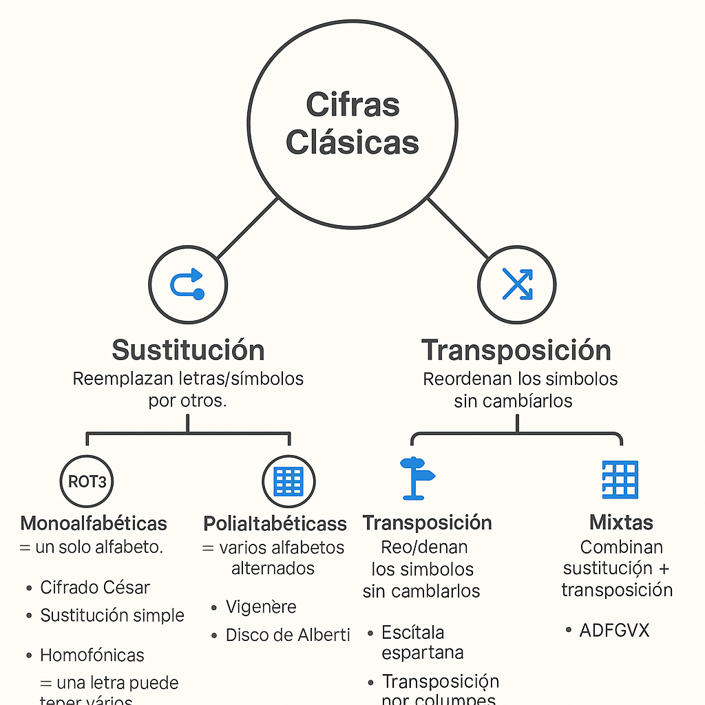
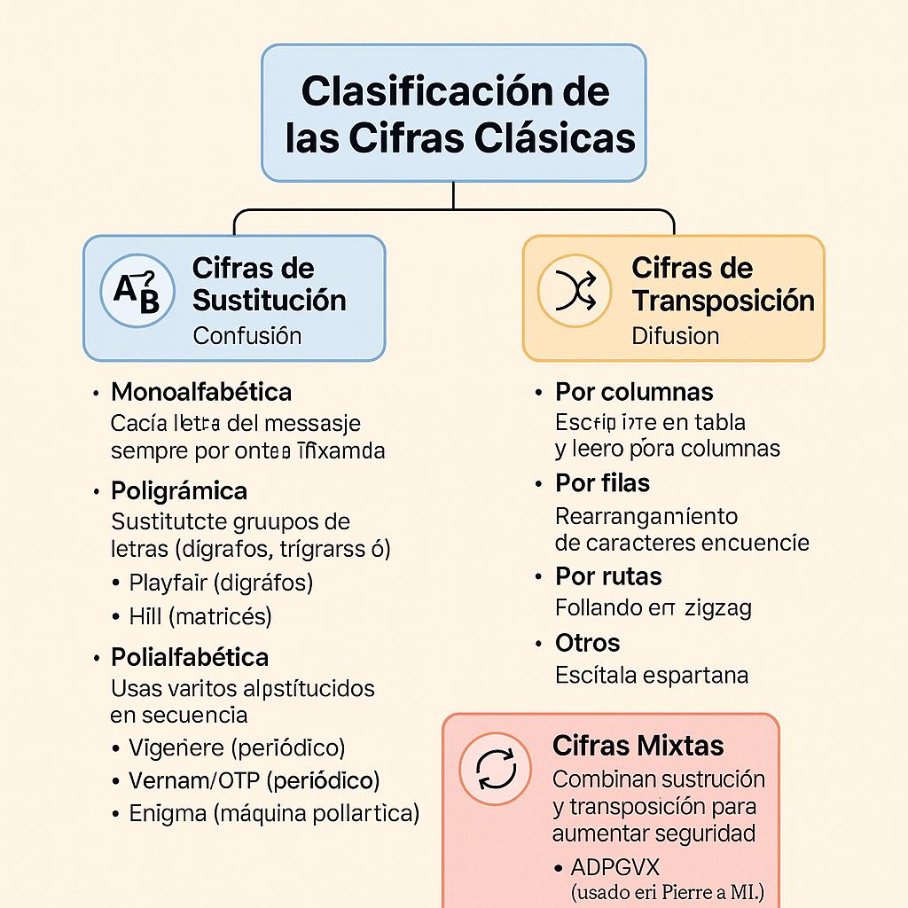

# Clasificación de los sistemas de cifra
## 📌 1. Según el tipo de clave
- **Cifrado simétrico:**
  - Usa la misma clave para cifrar y descifrar.
  - Ventaja: rápido y eficiente.
  - Inconveniente: problema de intercambio seguro de la clave.
  - Ejemplos: AES, DES, ChaCha20.

- **Cifrado asimétrico:**
  - Usa dos claves distintas y relacionadas matemáticamente:
    - Clave pública (cifrar).
    - Clave privada (descifrar).
  - Ventaja: resuelve el problema de compartir claves.
  - Ejemplos: RSA, ECC, ElGamal.

## 📌 2. Según la época o generación
- **Cifras clásicas:**
  - Basadas en sustitución y transposición de letras.
  - Ejemplos: César, Vigenère, Escítala.
- **Cifras modernas:**
  - Basadas en algoritmos matemáticos complejos y cómputo digital.
  - Ejemplos: AES, RSA, ECC.

## 📌 3. Según la unidad de operación
- **Cifrado por bloques:**
  - El texto se divide en bloques de tamaño fijo y cada bloque se cifra como una unidad.
  - Ejemplos: AES (128 bits), DES (64 bits).
- **Cifrado en flujo:**
  - El texto se cifra bit a bit o byte a byte, generando un flujo pseudoaleatorio.
  - Ejemplos: RC4, Salsa20.

## 📌 4. Según la transformación aplicada
- **Cifras de sustitución:** cambian unos símbolos por otros.
- **Cifras de transposición:** reordenan los símbolos.
- **Cifras combinadas:** usan ambas técnicas (muy comunes en algoritmos modernos).


## Resumen Clasificación de los sistemas de cifra

| **Criterio**                | **Tipos**            | **Características**                                                                                    | **Ejemplos**                  |
| --------------------------- | -------------------- | ------------------------------------------------------------------------------------------------------ | ----------------------------- |
| **Por clave**               | 🔑 **Simétrico**     | Misma clave para cifrar y descifrar. Rápido, pero hay problema de intercambio seguro de clave.         | AES, DES, ChaCha20            |
|                             | 🔑 **Asimétrico**    | Par de claves: pública (cifrar) y privada (descifrar). Más lento, pero resuelve intercambio de claves. | RSA, ECC, ElGamal             |
|  |  |  |  |
| **Por época**               | 🏛️ **Clásicos**     | Sustitución y transposición de letras o símbolos.                                                      | César, Vigenère, Escítala     |
|                             | 💻 **Modernos**      | Algoritmos matemáticos complejos, aplicados en computación.                                            | AES, RSA, ECC                 |
|  |  |  |  |
| **Por unidad de operación** | 📦 **Por bloques**   | Cifra bloques de datos de tamaño fijo (64, 128 bits…).                                                 | AES (128 bits), DES (64 bits) |
|                             | 🔄 **En flujo**      | Cifra bit a bit o byte a byte con flujo pseudoaleatorio.                                               | RC4, Salsa20                  |
|  |  |  |  |
| **Por transformación**      | 🔁 **Sustitución**   | Sustituye símbolos por otros.                                                                          | César, ROT13                  |
|                             | 🔀 **Transposición** | Reordena los símbolos sin cambiarlos.                                                                  | Escítala, Rail Fence          |
|                             | ⚡ **Combinadas**     | Mezcla sustitución y transposición. Muy usadas en sistemas modernos.                                   | AES, Vigenère mejorado        |

_______________________________________________
# Clasificación de las Cifras Clásicas
## 📌 1. Según el tipo de operación que se realiza al texto en claro durante la cifra.
### 1.1 Cifras de Sustitución - Objetivo Confusión:
  - **Confunde para dificultar establecer una relación entre el criptograma y la clave usada para el cifrado.**
  - Se aplican: **Operaciones de Sustitución** de una letra por otra letra. Cada símbolo (o bloque) del mensaje se reemplaza por otro siguiendo una regla fija.
  - El alfabeto de cifra puede o no tener los mismos elementos que el alfabeto del texto en claro. En este segundo caso, puede incluir signos y diferentes objetos gráficos. Ejemplo: El escarabajo de oro.
  - Ejemplos:
    - Permutaciones de bits en clave y texto en claro del DES.
    - La función ShiftRows sobre bytes del AES.

#### Clasificación de los algoritmos por sustitución:
- **A) Cifrado Monoalfabético** (cada letra se sustituye por otra distinta del alfabeto). Tipos de cifrado monoalfabético:
  - **Sustitución Monoalfabético Monográmico:** Se cifra letra a letra → César, Afin, Homofónica.
    - Ejemplos del algoritmos de Sustitución Monoalfabéticos Monográmicos:
      - Cifrado César (desplazar el alfabeto un número fijo de posiciones). Cifrado Sustitución Monoalfabético Monográmico.
      - Cifrado Homofónico (una letra puede sustituirse por varios símbolos posibles). Cifrado Sustitución Monoalfabético Monográmico.
      - Cifrado Afin. Cifrado Sustitución Monoalfabético Monográmico.
        
  - **Sustitución Poligrámico:** Se usa un grupo de letras del mensaje →  Playfair, Hill  
    En este tipo **NO conviene llamarlas “monoalfabéticas poligrámicas”** porque eso suena contradictorio. Se recomienda usar “sustitución poligrámica” en lugar de “monoalfabética poligrámica”.
    - Ejemplos del algoritmos de Sustitución Poligrámico:
      - Cifrado Playfair. Cifrado Sustitución Poligrámico.
      - Cifrado Matrices de Hill. Cifrado Sustitución Poligrámico.
    
- **B) Cifrado Polialfabético** (usa varios alfabetos de sustitución, como el Vigenère). La periodicidad se refiere a la repetición o no de una clave durante el cifrado. Tipos de cifrado polialfabético:
  - **No periodicos:**
    - Cifrador de Vernam. Se considera polialfabético no periódico solo cuando la clave es aleatoria y del mismo tamaño que el mensaje (caso particular: One-Time Pad). El Vernam puede considerarse polialfabético periódico (si la clave es corta y repetida) o no periódico/perfecto (OTP) si la clave es aleatoria y del mismo tamaño que el mensaje. 
  - **Periódicos:**
    - Enigma.
    - Cifrador de Vigenère.

### 1.2 Cifras de Transposición o Permutación - Objetivo Difusión:
  - **Difuminar la redundancia del lenguaje.**
  - **Difundir las características del texto en claro en el criptograma**  🠲🠲🠲 **Oculta la relación entre el texto en claro y el texto cifrado**.
  - Se aplican: **Operaciones de Permutación o Transposición de las letras.**
  - **Criptograma tiene las mismas letras que el texto en claro, pero en ≠ posisicones** 🠲🠲🠲 No se cambian los símbolos, sino que se reordenan siguiendo un patrón. 
  - En los algoritmos por Transposición, las operaciones se realizan mediante:
    - Grupos.
    - Series.
    - Columnas (escribir en una tabla y leer por columnas).
    - Filas.
    - Rutas (leer las letras siguiendo un recorrido).
  - Su importancia radica en que su uso en la cifra aumenta la seguridad de los algoritmos al difundir las propiedades estadísticas del lenguaje.
  - Ejemplos:
    - Escítala espartana.
    - Los 48 bits de entrada de las cajas `S` delDES que se convierten en 32.
    - La función SubBytes del AES.

### 1.3 Cifras mixtas:** Combinan sustitución y transposición para más seguridad.
  - Ejemplo: ADFGVX (usado en la Primera Guerra Mundial).


### Tabla Resumen de la Clasificación de las Cifras Clásicas
```
Clasificación de las cifras clásicas
│
├── 1. Cifras de Sustitución (Confusión)
│   │
│   ├── A. Sustitución Monoalfabética
│   │   ├── 1. Monográmicas (letra a letra)
│   │   │     ├── César
│   │   │     ├── Afin
│   │   │     └── Homofónico
│   │   └── 2. Poligrámicas (bloques de letras)
│   │         ├── Playfair (pares)
│   │         └── Hill (n-gramas)
│   │
│   └── B. Sustitución Polialfabética
│         ├── 1. Periódicas (clave se repite)
│         │     ├── Vigenère
│         │     └── Enigma
│         └── 2. No periódicas (clave única/aleatoria)
│               └── Vernam – One-Time Pad
│
├── 2. Cifras de Transposición (Difusión)
│   │
│   ├── Por columnas
│   ├── Por filas
│   ├── Por grupos/series
│   ├── Por rutas
│   └── Ejemplo: Escítala espartana
│
└── 3. Cifras Mixtas (Sustitución + Transposición)
      └── Ejemplo: ADFGVX

```


## 📌 2. Según el alfabeto utilizado
- **Monoalfabéticas:** usan un solo alfabeto para cifrar todo el mensaje.
  - Ejemplo: César.
- **Polialfabéticas:** usan varios alfabetos que se alternan.
  - Ejemplo: Vigenère, Alberti.

## 📌 3. Según la unidad de cifrado
- **Por letras:** transforman cada letra individualmente.
- **Por grupos:** trabajan con sílabas o grupos de letras (ej. dígrafos).
- **Por palabras:** poco frecuente, sustituyen palabras enteras por símbolos o números.

________________________________
# Mapa Conceptual: Clasificación de las Cifras Clásicas
## 📌 1. Sustitución: Reemplazan letras/símbolos por otros.
- Monoalfabéticas → un solo alfabeto.
  - Cifrado César
  - Sustitución simple
- Polialfabéticas → varios alfabetos alternados.
  - Vigenère
  - Disco de Alberti
- Homofónicas → una letra puede tener varias sustituciones.
- Polígramas → sustituyen grupos de letras (ej. Playfair).

## 📌 2. Transposición: Reordenan los símbolos sin cambiarlos.
- Escítala espartana (vara con pergamino).
- Transposición por columnas (escribir en tabla y leer columnas).
- Ruta o zigzag (leer letras siguiendo un recorrido).

## 📌 3. Mixtas: Combinan sustitución + transposición.
- ADFGVX (Primera Guerra Mundial).






------
