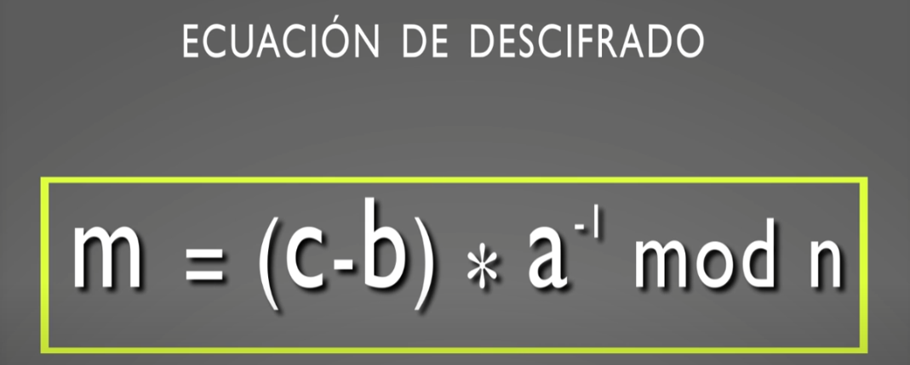
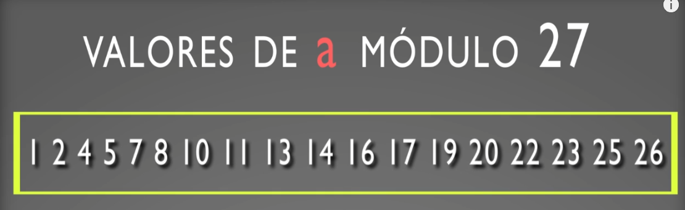

# Cifra por sustitución monográmica monoalfabético
- Se cifra letra a letra: Cada letra del mensaje se reemplaza por otro siguiendo una regla fija.
- El alfabeto de cifra puede o no tener los mismos elementos que el alfabeto del texto en claro. En este segundo caso, puede incluir signos y diferente objetos gráficos. Ejemplo: El escarabajo de oro.

## Cifrado por sustitución monográmica monoalfabético módulo N
Si:  
`m`es el texto en claro a cifrar de manerá monográmica (tomando el texto letra a letra)  
`c` es el criptograma resutlante  
la constante `a` indica la multiplicación aplicada a cada letra de ese texto en claro  
la constante `b` indica la adición aplicada a cada letra de ese texto en claro  

Obtenemos la **ecuación de cifra generica por sustitución monoalfabética monográmica:**

## Descifrado por sustitución monográmica monoalfabético módulo N
Para que sea posible el descifrado y así poder recuperar `m` a partir de `c`, es necesario que la constante `a` tenga inverso multiplicativo en módulo `n`, puesto que el inverso aditivo de `b` siempre existirá. 

**Valores de `a` modulo 27:**

Es decir, todos aquellos valores que no tengan como factor en común el número 3, ya que 27= 3^3

**Valores válidos para la constante `b`:**

## Fortaleza del cifrado por sustitución Monográmica monoalfabético
Su fortaleza es muy mala. es la peor de todos los sistemas de cifra conocidos. El problema radica en que al sustituirse una letra del texto en claro siempre por la misma letra del alfabeto cifrado, las frecuencias característica de las letras y que forman parte de la redundancia del lenguaje, se reflejarán de manera manifiesta en el criptograma, facilitando así su ataque.

_________________________________________________________________________________________________________________________
