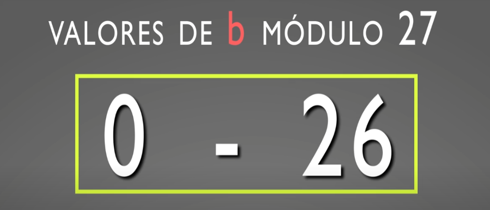
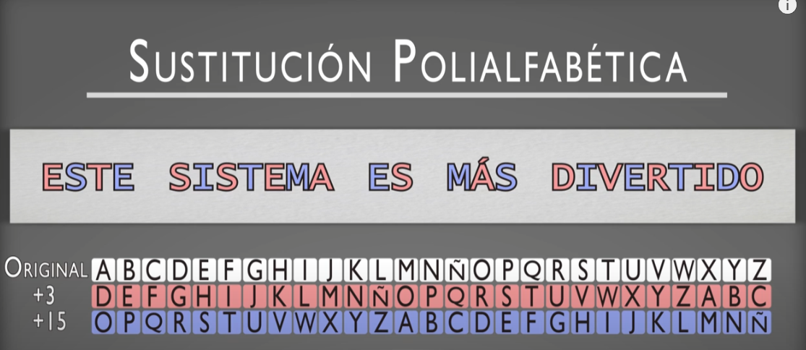
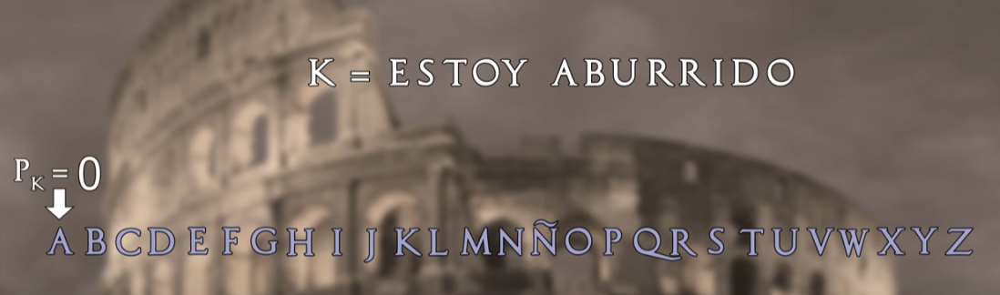

# Cifra por sustitución monográmica monoalfabético

## Cifrado por sustitución monográmica monoalfabético módulo N
Si:  
`m`es el texto en claro a cifrar de manerá monográmica (tomando el texto letra a letra)  
`c` es el criptograma resutlante  
la constante `a` indica la multiplicación aplicada a cada letra de ese texto en claro  
la constante `b` indica la adición aplicada a cada letra de ese texto en claro  

Obtenemos la ecuación de cifra generica por sustitución monoalfabética monográmica:

## Descifrado por sustitución monográmica monoalfabético módulo N
Para que sea posible el descifrado y así poder recuperar `m` a partir de `c`, es necesario que la constante `a` tenga inverso multiplicativo en módulo `n`, puesto que el inverso aditivo de `b` siempre existirá. 

**Valores de `a` modulo 27:**

Es decir, todos aquellos valores que no tengan como factor en común el número 3, ya que 27= 3^3

**Valores válidos para la constante `b`:**

## Fortaleza del cifrado por sustitución Monográmica monoalfabético
Su fortaleza es muy mala. es la peor de todos los sistemas de cifra conocidos. El problema radica en que al sustituirse una letra del texto en claro siempre por la misma letra del alfabeto cifrado, las frecuencias característica de las letras y que forman parte de la redundancia del lenguaje, se reflejarán de manera manifiesta en el criptograma, facilitando así su ataque.

_________________________________________________________________________________________________________________________
# Cifra por sustitución poliafabética - OCULTACIÓN

## Usando más de un alfabeto.
Consiste en que cada letra del texto en claro se va sustituyendo por una letra de un alfabeto de cifrado distinto, de acuerdo a una clave o una posición de los caracteres en el primero de ellos. 
 
Posibles alfabeto módulo 27, con un desplazamiento de tres letras y con un desplazamiento de 15 letras:  

Utilizamos estos dos alfabetos de cifrado en una cifra por sustitución,  
de forma que las letras en posiciones impares se cifran con el primero (+3),  
y las letras en posiciones pares, se cifran con el segundo (+15).

## Fortaleza del cifrado por sustitución Monográmica polialfabético
Al usar dos o más alfabetos, las estadísticas del lenguage ya no se manifiestan de manera tan clara en el criptograma. Una misma letra puede cifrarse de distinta manera según su posicion sea par o impar. Esto hace que este sistemas de cifra polialfabética tiene más fortaleza que una cifra monoalfabética. Las estadisticas del lenguaje se suavizan, haciendo que las letras con frecuencias altas en el texto en claro, disminuyan el valor de esa frecuencia en el criptograma y por el contrario, que las de frecuencia baja, se incrementen. Con más de 6 alfabetos de cifrado, es común que los valores de las frecuencias de las letras del criptograma sean todas muy similares.

## ¿Se logra un sistema indescifrable al usar varios alfabetos?
No. Se puede criptoanalizar el sistema. La reduncia del lenguaje es tan alta que se manifiesta incluso si recorremos un texto o criptograma eligiendo letras separadas por una distancia constante, que es lo que básicamente hace la cifra polialfabética. 

# Cifra por Transposición o Permutación - DIFUSIÓN 

## Cambiando las letras de lugar
Cambiando las letras de un texto en claro se logra el efecto de difusion. Defecto, el criptograma presenta exactamente las mismas letras que el texto en claro, y por tanto, aparece en él la redundancia típica del lenguaje. 

En la cifra clásica esta técnica no ha sido muy desarrollada. Sin embargo en la cifra moderna, orientada en este caso a bits y bytes, en donde la técnica de permutación se usa frecuentemente. Como por ejemplo, en los algoritmos DES y AES. 

## Cifrado por Filas
Si un texto en claro se escribe letra a letra por columnas y hacia abajo, con un nivel de `n` filas, y luego se lee el resultado por filas, de izquierza a derecha, diremos que se trata de una **cifra por filas**.

## Cifrado Columnas
Si el texto en claro se escribe letra a letra por filas de izquierda a derecha, con un nivel de `n` columnas, y luego se lee el resultado por columnas, hablamos ahora de una cibra por columnas. 

## Cifrado por Valla o Rail Fence
Si el texto en claro se escribe formando una figura típica de una valla de campo o zig-zag, estaremos frente a una cifra del tipo valla o rail fence. 

## Añadiendo fortaleza a la cifra
Se puede añadir fortaleza a la cifra añadiendo una clave y leyendo las filas o columnas de acuerdo al orden numérico de esa clave. 

Por ejemplo si en un cifrado de 5 columnas se usa la clave MARIO:  

Las columnas resultantes se ordenan alfabéticamente, es decir: AIMOR. Es decir, primero la columna número 2, segundo la columna 4 ,..... En ese orden leemos las columnas para obtener el criptograma. 

## Cifrado por transposición de grupos
Si el texto en claro se agrupa en bloques de un cierto tamaño y sobre ese bloque se realiza alguna operación de permutación que se repite periodicamente, el sistema de conoce como transposición por grupos.

Por ejemplo, si agrupamos el texto en claro en bloque de 8 letas y estos bloques sufren sufren la permutación 86427531:  

## Cifrado por transposición de series
No se utiliza una cifra no periodica. Se usan series. Tiene una mayor fortaleza, pero requiere leer antes todo el texto para poder comenzar a cifrar. 

## Ataques a los sistemas de cifra por transposición
Para cifrados por filas o columnas, el criptoanálisis pueder realizarse mediante la técnica de anagramación. Que consiste en la comparación de bloques de caracteres del criptograma con el objeto de encontrar los digramas más comunes del lenguaje, como por ejemplo `DE, ES, EN, OS, etc.`, destruidos por la transposición. Para ello se elige una cadena de letras sucesivas del criptograma, conocido como ventana, que mientras va recorriendo todo el texto cifrado, se compara con otras ventanas de igual logitud en el criptograma, en busqueda de esos digramas. Cuando la ventana que se desplaza coincide con la ventana que se entregaba el número de filas o columnas utilizadas para la cifra, aparecen todos los digramas del mensaje original y, por tanto, puede revelar ese dato secreto del número de filas o columnas. 

__________________________________________________________________________________________________________________________

# La cifra del César.
El primer uso documentado de una cifra monoalfabética por sustitución aparece en el libro La guerra de las Galias de Julio César, que describe cómo envía un mensaje cifrado a Cicerón. Aplica una sustitución simple a las letras en texto claro. César sustituye las letras romanas por las griegas. Aplicaba un desplazamiento de 3 espacios al alfabeto en claro.

## Cifrando con el algoritmo del César.

## Cifrado del César utilizando una clave
Para aumentar la fortaleza de la cifra, se puede en el alfabeto de cifrado una clave `k` que consiste en una palabra o frase que se escribe a partir de una PsubK del alfabeto, sin repetir las letras:  

A continuación se incluyen en orden las restantes letras del alfabeto. 

Así si en la posición Pk = 3, se escibe la clave "ESTOY ABURID" (sin letras repetidas), el alfabeto de cifra será el que se indica:

En este tipo de cifra, se deja de cumplir la condición de desplazamiento constante que era una característica básica del sistema de cifrado primario del César. 

Al tener un mayor número de alfabetos posibles, tiene un mayor número de representaciones distintas:  

27! es un número muy alto. Es poco recomendable atacar por fuerz bruta.

## Seguridad en el cifrado César
Su seguridad es muy baja ya que la redundancia del lenguaje se sigue manifestando en el criptograma.

## Descifrado y seguridad del Algoritmo del César

__________________________________________________________________________________________________________________________

## Algoritmo Extendido Euclides para calcular inversos multiplicativos
Con el algoritmo de Euclides para calcular inversos multiplicativos módulo n, sin tener que probar uno por uno.

Donde `a^-1` significa significa inverso de `a` en módulo `n`.

