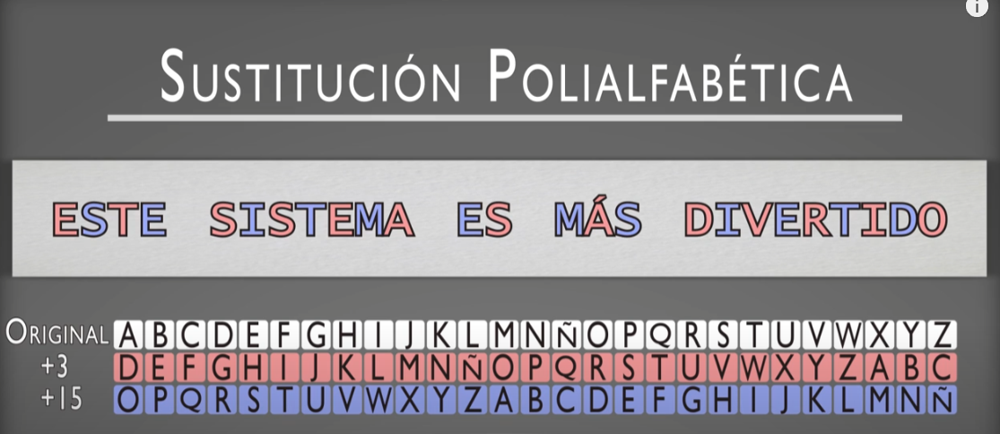

# Cifra por sustitución poliafabética - OCULTACIÓN

## Usando más de un alfabeto.
Consiste en que cada letra del texto en claro se va sustituyendo por una letra de un alfabeto de cifrado distinto, de acuerdo a una clave o una posición de los caracteres en el primero de ellos. 
 
Posibles alfabeto módulo 27, con un desplazamiento de tres letras y con un desplazamiento de 15 letras:  

Utilizamos estos dos alfabetos de cifrado en una cifra por sustitución,  
de forma que las letras en posiciones impares se cifran con el primero (+3),  
y las letras en posiciones pares, se cifran con el segundo (+15).

## Fortaleza del cifrado por sustitución Monográmica polialfabético
Al usar dos o más alfabetos, las estadísticas del lenguage ya no se manifiestan de manera tan clara en el criptograma. Una misma letra puede cifrarse de distinta manera según su posicion sea par o impar. Esto hace que este sistemas de cifra polialfabética tiene más fortaleza que una cifra monoalfabética. Las estadisticas del lenguaje se suavizan, haciendo que las letras con frecuencias altas en el texto en claro, disminuyan el valor de esa frecuencia en el criptograma y por el contrario, que las de frecuencia baja, se incrementen. Con más de 6 alfabetos de cifrado, es común que los valores de las frecuencias de las letras del criptograma sean todas muy similares.

## ¿Se logra un sistema indescifrable al usar varios alfabetos?
No. Se puede criptoanalizar el sistema. La reduncia del lenguaje es tan alta que se manifiesta incluso si recorremos un texto o criptograma eligiendo letras separadas por una distancia constante, que es lo que básicamente hace la cifra polialfabética. 

