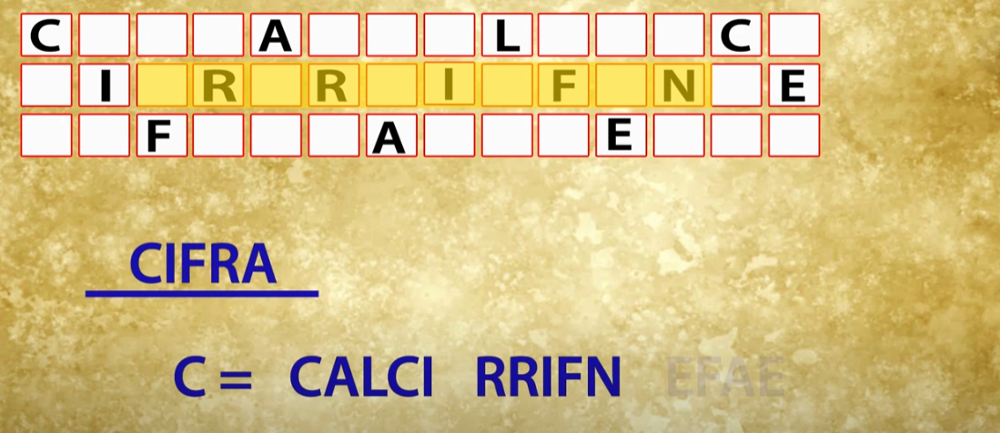
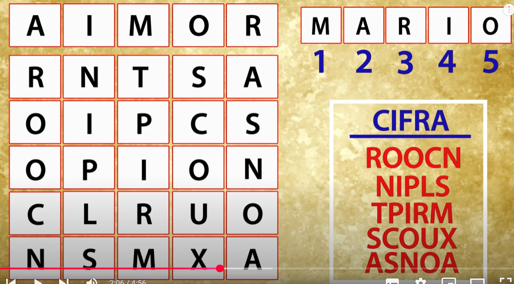
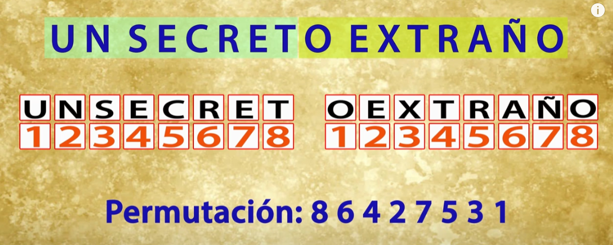
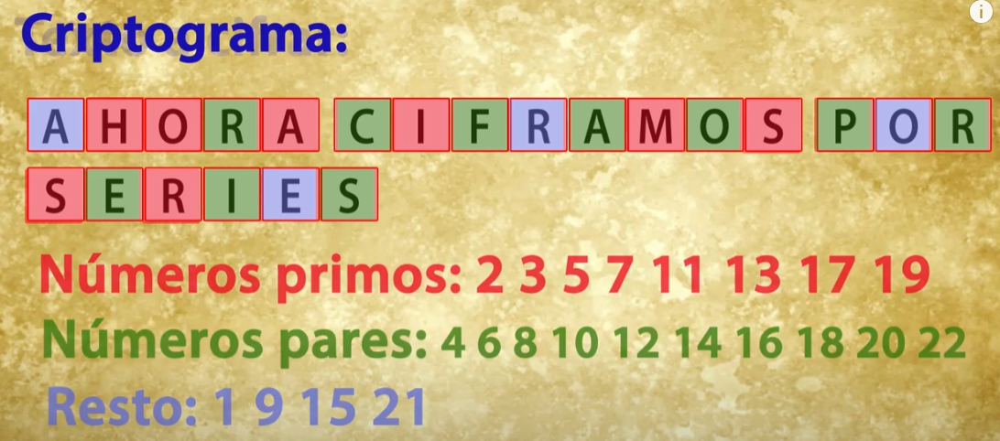
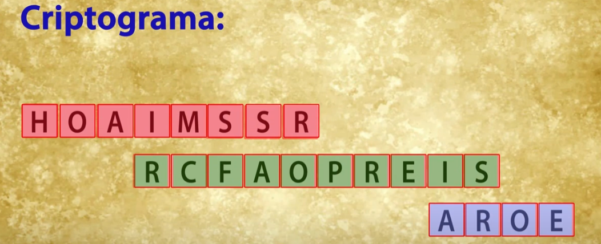

# Cifra por Transposición o Permutación - DIFUSIÓN 

## Cambiando las letras de lugar
Cambiando las letras de un texto en claro se logra el efecto de difusion. Defecto: el criptograma presenta exactamente las mismas letras que el texto en claro, y por tanto, aparece en él la redundancia típica del lenguaje. 

En la cifra clásica esta técnica no ha sido muy desarrollada. Sin embargo en la cifra moderna, orientada en este caso a bits y bytes, en donde la técnica de permutación se usa frecuentemente. Como por ejemplo, en los algoritmos DES y AES. 

## Cifrado por Filas
Si un texto en claro se escribe letra a letra por columnas y hacia abajo, con un nivel de `n` filas, y luego se lee el resultado por filas, de izquierza a derecha, diremos que se trata de una **cifra por filas**.

## Cifrado Columnas
Si el texto en claro se escribe letra a letra por filas de izquierda a derecha, con un nivel de `n` columnas, y luego se lee el resultado por columnas, hablamos ahora de una cibra por columnas. 

## Cifrado por Valla o Rail Fence
Si el texto en claro se escribe formando una figura típica de una valla de campo o zig-zag, estaremos frente a una cifra del tipo valla o rail fence. 

## Añadiendo fortaleza a la cifra
Se puede añadir fortaleza a la cifra añadiendo una clave y leyendo las filas o columnas de acuerdo al orden numérico de esa clave. 

Por ejemplo si en un cifrado de 5 columnas se usa la clave MARIO:  

Las columnas resultantes se ordenan alfabéticamente, es decir: AIMOR. Es decir, primero la columna número 2, segundo la columna 4 ,..... En ese orden leemos las columnas para obtener el criptograma. 

## Cifrado por transposición de grupos
Si el texto en claro se agrupa en bloques de un cierto tamaño y sobre ese bloque se realiza alguna operación de permutación que se repite periodicamente, el sistema de conoce como transposición por grupos.

Por ejemplo, si agrupamos el texto en claro en bloque de 8 letas y estos bloques sufren sufren la permutación 86427531:  

## Cifrado por transposición de series
No se utiliza una cifra no periodica. Se usan series. Tiene una mayor fortaleza, pero requiere leer antes todo el texto para poder comenzar a cifrar. 

## Ataques a los sistemas de cifra por transposición
Para cifrados por filas o columnas, el criptoanálisis pueder realizarse mediante la técnica de **anagramación**. Que consiste en la comparación de bloques de caracteres del criptograma con el objeto de encontrar los digramas más comunes del lenguaje, como por ejemplo `DE, ES, EN, OS, etc.`, destruidos por la transposición. Para ello se elige una cadena de letras sucesivas del criptograma, conocido como ventana, que mientras va recorriendo todo el texto cifrado, se compara con otras ventanas de igual logitud en el criptograma, en busqueda de esos digramas. Cuando la ventana que se desplaza coincide con la ventana que se entregaba el número de filas o columnas utilizadas para la cifra, aparecen todos los digramas del mensaje original y, por tanto, puede revelar ese dato secreto del número de filas o columnas. 

