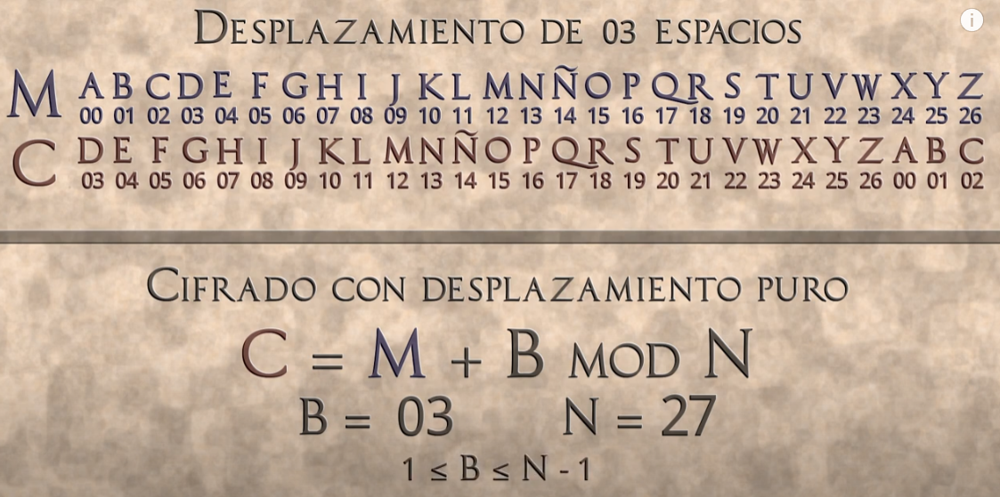
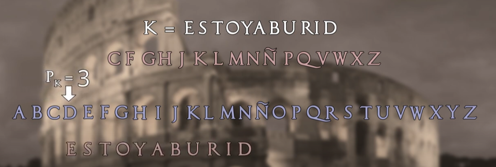
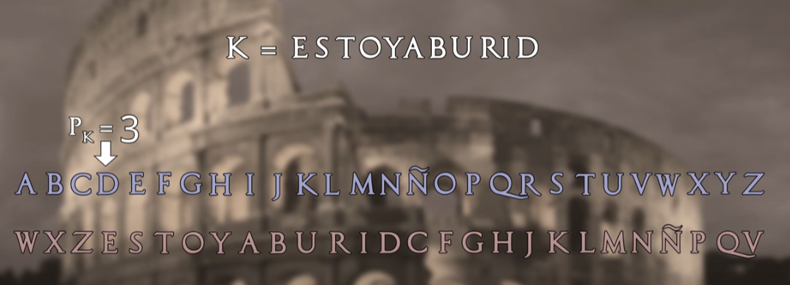
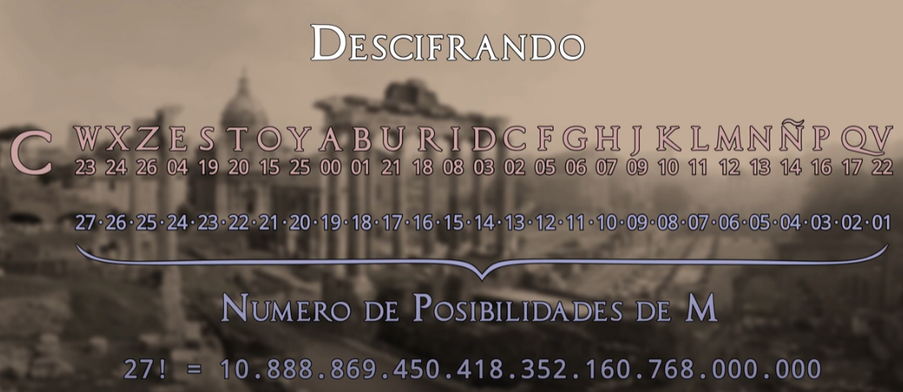
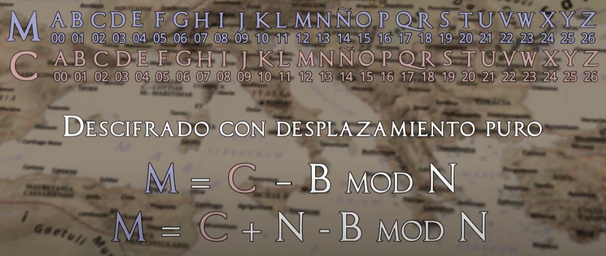

# La cifra del César.
El primer uso documentado de una cifra monoalfabética por sustitución aparece en el libro La guerra de las Galias de Julio César, que describe cómo envía un mensaje cifrado a Cicerón. Aplica una sustitución simple a las letras en texto claro. César sustituye las letras romanas por las griegas. Aplicaba un desplazamiento de 3 espacios al alfabeto en claro.

## Cifrando con el algoritmo del César.

## Cifrado del César utilizando una clave
Para aumentar la fortaleza de la cifra, se puede añádir en el alfabeto de cifrado una clave `k = ESTOY ABURRIDO` que consiste en una palabra o frase que se escribe a partir de una PsubK del alfabeto:  

Así si en la posición Pk = 3, se escibe la clave "ESTOY ABURID" (sin letras repetidas)  

A continuación se incluyen en orden las restantes letras del alfabeto (sin letras repetidas de la clave). El alfabeto de cifra será el que se indica:  

El cifrado resultante será:

En este tipo de cifra, se deja de cumplir la condición de desplazamiento constante que era una característica básica del sistema de cifrado primario del César. 

Al tener un mayor número de alfabetos posibles, tiene un mayor número de representaciones distintas:  

27! es un número muy alto. Es poco recomendable atacar por fuerzA bruta.

## Seguridad en el cifrado César
Su seguridad es muy baja ya que la redundancia del lenguaje se sigue manifestando en el criptograma.

## Descifrado y seguridad del Algoritmo del César

Para decifrar una cifra simple del César:
- Bastará con aplicar el algoritmo en su modo inverso, en este caso, usando un desplazamiento de `b` espacios en sentido contrario.
- También es posible descifrar el critograma usando las propiedades matemáticas: desplazando el texto cifrado `n-b` espacios. 

Su nivel de seguridad es muy débil y su criptoanálisis es elemental. Basta con realizar un sencillo y rápido ataque por fuerza vruta, desplazando las letras del criptograma 1, 2, 3, etc. posiciones a la izquierda o a la derecha hasta dar con el mensaje en claro. 

Sin embargo, el ataque a los sistemas con un alfabeto de cifrado con clave, o bien un alfebeto de cifrado no secuencial, es decir, con posiciones de letras cambiadas al azar, será algo más complejo y habrá que hacer uso de las estadísticas del lenguaje.
