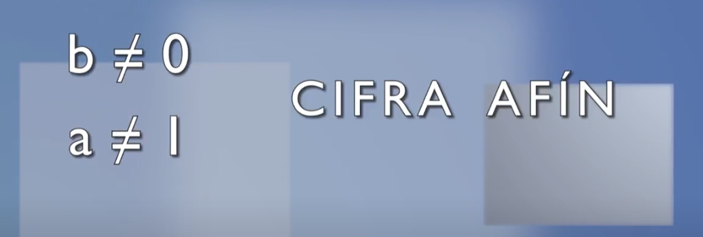
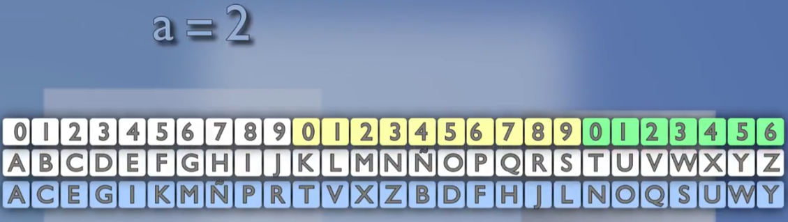
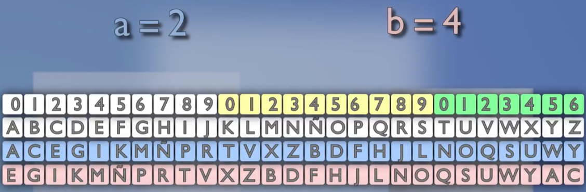
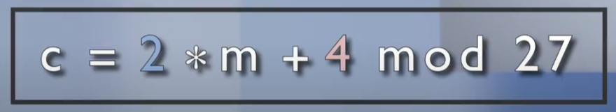

# La cifra afín

## Cifradores por sustitución genericos
Los Cifradores por sustitución genericos monográmicos monoalfabéticos a aquellos sistemas de cifra clásica que obtienen el alfabeto de cifrado a partir de la ecuación:  

Dónde:  
`m`es el texto en claro a cifrar de manerá monográmica (tomando el texto letra a letra).  
`c` es el criptograma resultante.  
`a` es una constante de multiplicación.  
`b` es una constante de desplazamiento.  
`n` es el cuerpo de cifra.

**Decimation:** Se usa esta palabra para esta operación de multiplicación, cuyo significado es `aniquilar selectivamente o diezmar`.

En español es común que se use **decimación** (aunque esta palabra no existe en la RAE).

Cuando la constante de desplazamiento `b` es igual a `0`, hablaremos de una **cifra por decimación pura.**  
Si la **constante de decimación a = 1**, hablaremos de una **cifra por desplazamiento puro.**  
Y si no se dan estas dos condiciones, hablaremos de una **cifra afín.**  

Si a un alfabeto módulo 27 se le aplica se le aplica una decimación `a = 2`, las letras se distribuyen ahora en saltos de dos especios, debido a esa multiplicación del código por 2.  

Si ahora, se le añade un desplazamiento `b = 4`   

Se obtiene el alfabeto final para la ecuación de cifra `c = 2*m + 4 mod 27`.

## Condiciones para la cifra por decimación pura y cifra afín.
