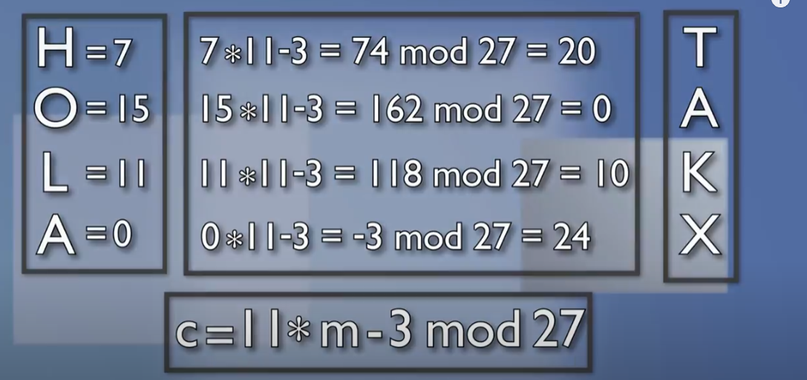
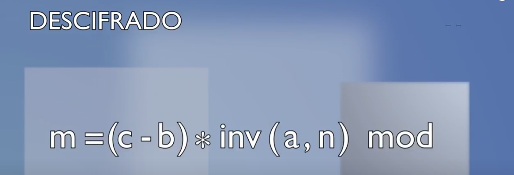
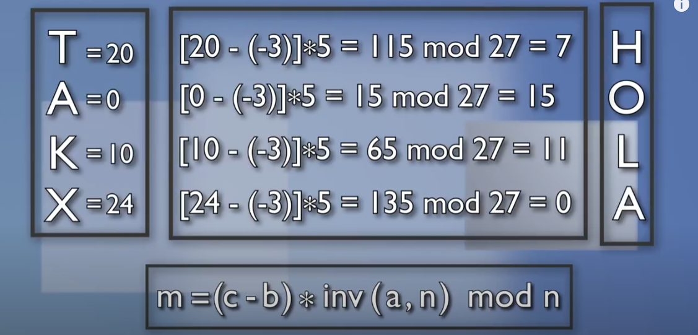

# La cifra afín

## Cifradores por sustitución genericos
Los Cifradores por sustitución genericos monográmicos monoalfabéticos son aquellos sistemas de cifra clásica que obtienen el alfabeto de cifrado a partir de la ecuación:  

Dónde:  
`m`es el texto en claro a cifrar de manerá monográmica (tomando el texto letra a letra).  
`c` es el criptograma resultante.  
`a` es una constante de multiplicación.  
`b` es una constante de desplazamiento.  
`n` es el cuerpo de cifra.

**Decimation:** Se usa esta palabra para esta operación de multiplicación, cuyo significado es `aniquilar selectivamente o diezmar`.

En español es común que se use **decimación** (aunque esta palabra no existe en la RAE).

Cuando la **constante de desplazamiento `b = 0`**, hablaremos de una **cifra por decimación pura.**  
Si la **constante de decimación `a = 1`**, hablaremos de una **cifra por desplazamiento puro.**  
Y si no se dan estas dos condiciones, `b ≠ 0 && a ≠ 1` hablaremos de una **cifra afín.**  

Si a un alfabeto módulo 27 se le aplica se le aplica una decimación `a = 2`, las letras se distribuyen ahora en saltos de dos especios, debido a esa multiplicación del código por 2.  

Si ahora, se le añade un desplazamiento `b = 4`   

Se obtiene el alfabeto final para la ecuación de cifra `c = 2*m + 4 mod 27`.

## Condiciones para la cifra por decimación pura y cifra afín.
En tanto existe en estos sistemas una multiplicación de l código numérico de la letra a cifrar por un número, será necesario que la constante de decimación `a` tenga inverso multiplicativo en `n`, es decir, que `mcd (a,n) = 1`.

Por ejemplo, en módulo 27:
- Será válida la ecuación de cifra `c = 11 * m -3 mod 27`, porque el inverso de 11 en 27 es igual a 5.
- No será válida la ecuación de cifra `c = 6 * m -3 mod 27`, porque no existe el inverso de 6 en 27. POdríamos cifrar un mensaje, pero no podríamos descifrarlo.

## Cifrado en modo afín
Si ciframos el mensaje "HOLA" con la cifra afín `c = 11 * m -3 mod 27` se obtiene "TAKX".

## Descifrando en modo afín
La operación de descifrado en modo afín:  

## Espacio de Claves y Fortaleza
El módulo afín en módulo 27 tendrá
- Para la constante `b` hay 26 valores válidos.
- Para la constante `a` hay 17 valores válidos.

Podemos formar hasta `26 * 17 = 442` alfabetos diferentes.

Sin embargo, **la cifra sigue siendo muy débil**, incluso ante ataques por fuerza bruta.
