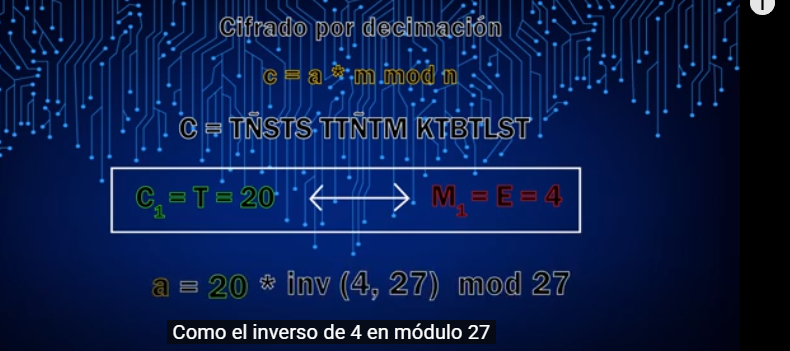

## Ataques por fuerza bruta
Ante un criptograma que se sospecha que es el resultado de una cifra por sustitución génerica monoalfabética y monográmica, como por ejemplo:
- Las de decimación.
- Las de desplazamiento.
- Afín.

Será fácil descubrir el alfabeto de cifrado mediante un ataque por fuerza bruta, probando cada una de las posibles combinaciones de los valores válidos para `a` y `b`. En módulo 27, sólo se requerirían 441 intentos.

Si se incluye una clave en cualquiera de estos tres algoritmos de cifra, el número de alfabetos posibles crecer espectacularmente, llegando a mas de diez mil cuatrillones, que es el valor del factorial de 27, lo que ya no hace aconsejable un ataque por fuerza bruta. A pesar de ello, estos sistemas sucumben antes un ataque por análisis de frecuencia de las letras del criptograma.

## Técnicas de criptoanálisis
La primera acción que realiza cualquier criptógrafo ante un criptograma, es observar y apuntar la frecuencia con la que aparecen los caracteres en el mismo. Si la distribución de frecuencias se asemeja a la del alfabeto en claro, entonces es muy probable que la cifra sea por sustitución monoalfabética. Si este fuese el caso, solamente queda asociar dichas frecuencias con las que se obtienen de un texto en claro con algunas centenares de letras para ir encontrando las correspondencias y nuevas posiciones que ocupan esas letras ahora en el alfabeto crifrado.

Cuando el sistema de cifra tiene una clave, y por tanto no existe una ecuación simple que represente dicha operación, habrá que ir asociando una a una las letras del criptograma de acuerdo a sus frecuencias con una posible letra del texto en claro. El texto en claro va apareciendo de a poco, como si fuera un crucigrama.

Sin embargo, cuando la cifra genérica tiene una expresión matemática, la solución a todo el alfabeto de cifrado se obtendrá inmediatamente tras resolver una ecuación con una incógnita en las cifras por decimación y por desplazamiento, o bien, un sistema de dos ecuaciones independientes y dos incógnitas en el caso de la cifra afín. 

## Ciptoanálisis de los sistemas de cifra genéricos por sustitución para:
- Cifrado es por decimación: `c = a * m mod n`
- Cifrado por desplazamiento: `c = (m + b) mod n`

En ambos casos, buscaremos la letra más frecuente del criptograma y lo asociaremos a la letra `E`, la más frecuente del alfabeto español.

###  1. Cifrado es por decimación:

###  2. Cifrado es por desplazamiento

Resolviendo ecuaciones:   
.... https://www.youtube.com/watch?v=Jsg4QNvhOYQ&list=PL8bSwVy8_IcNNS5QDLjV7gUg8dIeMFSER&index=18

