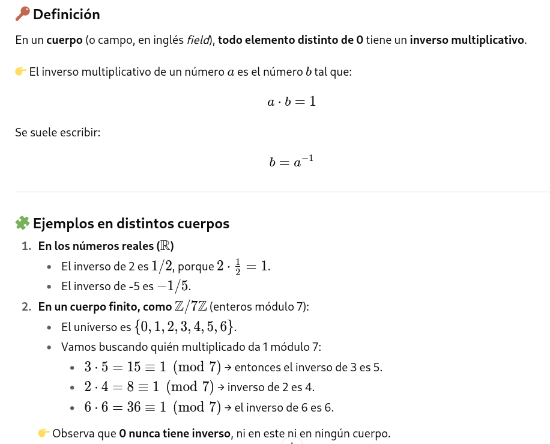
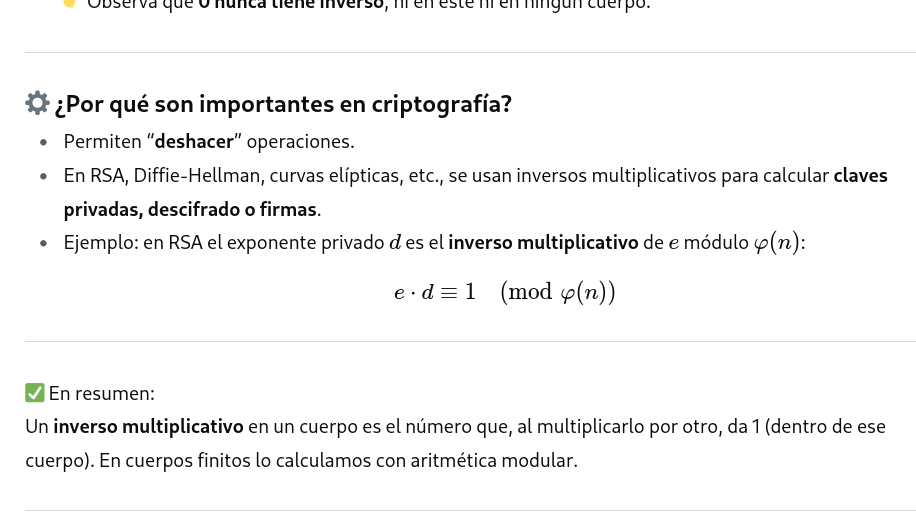
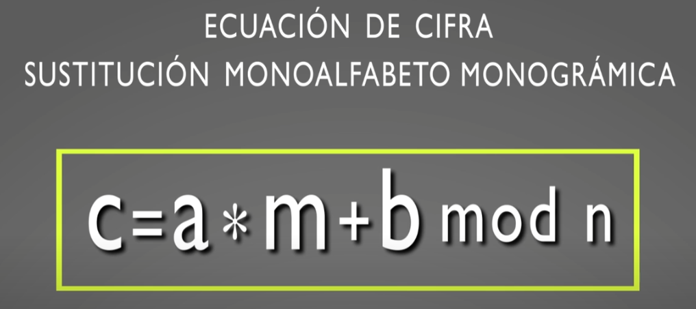

---------------------------------------------------------------------

# Cifrando en un cuerpo
Cifrando dentro de un cuerpo aborda un concepto fundamental en criptografía: **la idea de realizar operaciones de cifrado dentro de un cuerpo de cifra o módulo**, destacando que este concepto es distinto al de operar en un cuerpo (como en matemáticas abstractas), y que es esencial en muchos sistemas criptográficos modernos.

"Cifrando en un cuerpo" se refiere a realizar el proceso de cifrado utilizando operaciones matemáticas dentro de un cuerpo algebraico ("field"). Un cuerpo es una estructura matemática donde se pueden sumar, restar, multiplicar y dividir (excepto por cero) y todos los resultados siguen perteneciendo al mismo conjunto.

## Que significa "un cuerpo"
En matemáticas, un cuerpo (o campo, en inglés field) **es una estructura algebraica donde se pueden hacer operaciones de suma, resta, multiplicación y división (excepto dividir entre 0) y que cumplen ciertas reglas**.

Ejemplos de cuerpos:
- Los números racionales (ℚ)
- Los números reales (ℝ)
- Los números complejos (ℂ)
- También cuerpos finitos como ℤ/pℤ (enteros módulo un número primo p).

## ¿Qué significa "un cuerpo" en criptografía?
En criptografía muchas operaciones no se hacen en los números reales que usamos normalmente, sino dentro de un cuerpo finito o un anillo modular.
  - Ejemplo típico: RSA trabaja en los enteros módulo n (con n grande, producto de dos primos).
  - En criptografía de curva elíptica se usan cuerpos finitos ℤ/pℤ o cuerpos extendidos GF(2^m).

## “Cifrando dentro de un cuerpo”, significa que:
- Se refiere al proceso de realizar la operación de cifrado trabajando matemáticamente sobre un cuerpo algebraico (en inglés, "field") en vez de un conjunto cualquiera.
- El texto claro y las claves se transforman en números.
- Las operaciones de cifrado (sumas, multiplicaciones, potencias, etc.) se hacen dentro de un cuerpo finito, es decir, respetando las reglas de ese sistema matemático.
- Esto garantiza que las operaciones tengan propiedades necesarias: inversas, cierre, etc., lo que permite que el cifrado sea reversible (descifrable).

## La operación módulo
La operación módulo es simplemente quedarse con el resto de una división.
```
17÷5=3 con resto 2
Se escribe:
17≡2 (mod 5)
17≡2 (mod 5)
Eso significa que 17 y 2 dejan el mismo resto al dividir entre 5.
```

## Módulo n
Trabajar “módulo n” significa que:
- Sólo nos importan los restos entre 0 y n-1.
- Todo número lo reducimos a su equivalente en ese rango.

Por ejemplo, módulo 7:
- 10≡3 (mod 7)
- 15≡1 (mod 7)
- 21≡0 (mod 7)


## ¿Qué es un cuerpo de cifra o módulo?
**En criptografía las operaciones se realizan dentro de un cuerpo de cifra o módulo**, siendo este concepto distinto cuando hablamos de criptografía clásica o de criptografía moderna.

En matemática discreta decimos que un cuerpo finito `n`, está conformado por `n` número enteros, que van desde el valor `0`, hasta el valor `n-1`, siendo
- n = 0
- n+1 = 1
- ...

Ejemplo:
- Si n = 77 = { 0, 1, 2, 3, 4, ..., 74, 75, 76}
- Tendríamos los siguiente resultados modulares posibles:
  - `22 mod 77 = 22`  → 22÷77  →  El cociente es 0 y el resto es 22.
  - `100 mod 77 = 33` → 77*1 = 77    ||| 100 - 77 = 33 →  100 contiene 1 vez al 77 y queda como resto o residuo 33.
  - `450 mod 77 = 65` → 77*5 = 385   ||| 450 - 385 = 65 →  450 contiene 5 veces a 77 y queda como residuo 65.
  - `-200 mod 77 = 31` → −200 mod 77 = 31

**En criptografía, especialmente en algoritmos como RSA o ciertos esquemas de cifrado simétrico, las operaciones (como multiplicaciones o sumas) se realizan modularmente, es decir, dentro de un conjunto de residuos, por ejemplo usando una operación como “mod n”.**

Este entorno “modular” asegura propiedades matemáticas útiles para la seguridad criptográfica, como resistencia a ciertos ataques y correcta reversibilidad de operaciones.


## Regla rápida para calcular el módulo de un número


## Regla rápida para módulo con negativos
- Calculamos el módulo como si el número fuera positivo.  
  Ejemplo: −200 mod  77 → primero 200mod  77  
  200÷77=2resto 46

  Entonces  
  200mod77=46.

- Ahora restamos el resultado al divisor n:  
  77−46=31

- Ese es el valor positivo del módulo para −200.  
  −200mod  77=31


## ¿Qué es un cuerpo de cifra o módulo?
- En criptografía, especialmente en algoritmos como RSA o ciertos esquemas de cifrado simétrico, las operaciones (como multiplicaciones o sumas) se realizan modularmente, es decir, dentro de un conjunto de residuos, por ejemplo usando una operación como “mod n”.
- Este entorno “modular” asegura propiedades matemáticas útiles para la seguridad criptográfica, como resistencia a ciertos ataques y correcta reversibilidad de operaciones.

## Cuerpo de cifra en la criptografía clásica.
**El Cuerpo de cifra en la criptografía clásica es el número de elementos que conforman el alfabeto del texto en claro.** Aunque este alfabeto puede ser cualquier conjunto de letros y/o signos es **habitual trabajar en módulo 27** ya que es el número de letras mayúsculas del alfabeto español, incluida la `Ñ`.

Se codifica usualmente la letra A = 0, B = 1, ...., Z=26

Sobre esos número se realizan operaciones de suma, resa y producto para cifrar cada letra o un conjunto de letras del texto en claro en módulo 27.


 ## Cuerpo de cifra en la criptografía moderna
En la cifra moderna, **el cuerpo en el que se realizan las operaciones no tiene ninguna relación con el alfabeto utilizado en el texto en claro**, por ejemplo los 256 caracteres del código ASCII. Por lo general, ese cuerpo de cifra suele ser un número mucho mayor, como por ejemplo 65.536 y 65.536 en el algoritmo de clave secreta IDEA, o bien, un número de unos 300 dígitos decimales o 1024 bits que se utiliza como valor mínimo del módulo en el algoritmo de clave pública RSA.
 

## Inversos multiplicativos de un cuerpo
Se dice que un numero `a`, elemento del cuerpo `n` tiene inverso multiplicativo en dicho cuerpo (o simplemente, inverso), si existe otro `x` que haga cumplir la condición de que `a*x mod n = 1`, la identidad de la multiplicación.

Por simplificar (aunque matemáticamente no es correcto), podemos asociar el concepto del inverso en ese cuerpo `n`:
```
a = 1/x
x= 1/a
```






**¿Por qué son importantes los inversos multiplicativos de un cuerpo en criptografía?:**
- Permiten “deshacer” operaciones.
- En RSA, Diffie-Hellman, curvas elípticas, etc., se usan inversos multiplicativos para calcular claves privadas, descifrado o firmas.
- Ejemplo: en RSA el exponente privado `d` es el inverso multiplicativo de `e módulo φ(n)`:  
  `e⋅d≡1(modφ(n))`

Un inverso multiplicativo en un cuerpo es el número que, al multiplicarlo por otro, da 1 (dentro de ese cuerpo). En cuerpos finitos lo calculamos con aritmética modular.

## Condición necesaria para la existencia del inverso
Para que se cumpla la relación: `a*x mod n = 1`, es imprescindible que el máximo común divisor entre `a`y `n` sea la unidad  →  
`mcd(a,n) = 1`

Si esto no se cumple se puede dar la situación de cifrar algo y que luego el receptor sea incapaz de descifrarlo.

Ejemplo  →  Si en un sistema elemental de cifra módulo 27, multiplicamos el código de cada letra por 3, la cifra se produce, pero NO será posible descifrar, ya que NO EXISTE el inverso de 3 en ese módulo 27.

## Visualización de los inversos
Sea el cuerpo `n = 10`  
Con elementos o restos: `{0,1,2,3,4,5,6,7,8,9}  
A excepción del `0 y del 1` ya que no tiene sentido hablar de estos inversos, los únicos elementos en 10 que tienen inversos son:  
{3,7,9} ya que el mcd de estos números y 10 es igual a 1  → 
mcd(3,10)=1  
mcd(7,10)=1  
mcd(9,10)=1  

Para comprobar que el 3 tiene inverso en 10, podríamos multiplicar todos los elementos de `n` por `3`, reduciendo módulo 10 para ver el resultado:
```
3*0 = 0 →  0  mod 10 = 0
3*1 = 3 →  3  mod 10 = 3
3*2 = 6 →  6  mod 10 = 6
3*3 = 9 →  9  mod 10 = 9
3*4 = 12 → 12 mod 10 = 2
3*5 = 15 → 15 mod 10 = 5
3*6 = 18 → 18 mod 10 = 8
3*7 = 21 → 21 mod 10 = 1
3*8 = 24 → 24 mod 10 = 4
3*9 = 27 → 27 mod 10 = 7
```

Vemos que con los 10 elementos del cuerpo se obtienen TODOS los restos, y que solamente en el caso de `x=7`, se obtiene el resultado 1 que estábamos esperando.  
**Por lo tanto, el inverso de 3 en el cuerpo de 10 es 7.**  
De la misma manera, que el inverso de 7 en el cuerpo de 10 es 3.  
Además este valor es único.


## El alfabeto de cifrado
**Los sistemas de cifra clásica por sustitución usan un alfabeto de cifrado para convertir el texto en claro en un criptograma.** Se trata de un conjunto de letras o elementos gŕaficos que, en igual cantidad que los del alfabeto en claro, se distribuyen sobre este último mediante mediante una relación uno es a uno, de forma que al ir reemplazando letra a letra en texto en claro por su correspondiente elemento del alfabeto de cifrado mediante una sustitución simple, éste se convierte en un criptograma. Ese alfabeto de cifrado puede contener los mismos elementos que los del texto en claro o bien, elementos distintos.

## Asociando el tamaño del alfabeto a un módulo de cifra
Para la realización de las operaciones matemáticas, en este caso sólo con las 27 letras en mayúsculas del alfabeto español y por tanto, módulo 27, se debrá coficiar cada letra con un número, siendo común asignar:
- A = 0
- b = 1
- ....
- X = 26


__________________________________________________________________________________________________________________________
## Cifrado por sustitución monográmica monoalfabético módulo N
Si:  
`m`es el texto en claro a cifrar de manerá monográmica (tomando el texto letra a letra)  
`c` es el criptograma resutlante  
la constante `a` indica la multiplicación aplicada a cada letra de ese texto en claro  
la constante `b` indica la adición aplicada a cada letra de ese texto en claro  

Obtenemos la ecuación de cifra generica por sustitución monoalfabética monográmica:



## Descifrado por sustitución monográmica monoalfabético módulo N
Para que sea posible el descifrado y así poder recuperar `m` a partir de `c`, es necesario que la constante `a` tenga inverso multiplicativo en módulo `n`, puesto que el inverso aditivo de `b` siempre existirá. 


**Valores de `a` modulo 27:**


Es decir, todos aquellos valores que no tengan como factor en común el número 3, ya que 27= 3^3


**Valores válidos para la constante `b`:**


__________________________________________________________________________________________________________________________
## Algoritmo Extendido Euclides para calcular inversos multiplicativos
Con el algoritmo de Euclides para calcular inversos multiplicativos módulo n, sin tener que probar uno por uno.


Donde `a^-1` significa significa inverso de `a` en módulo `n`.


