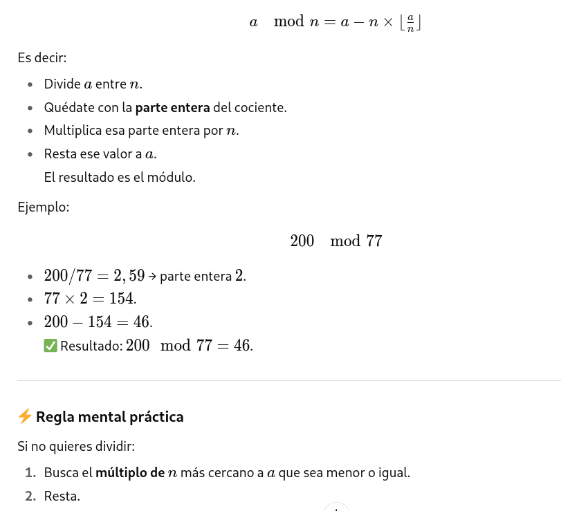
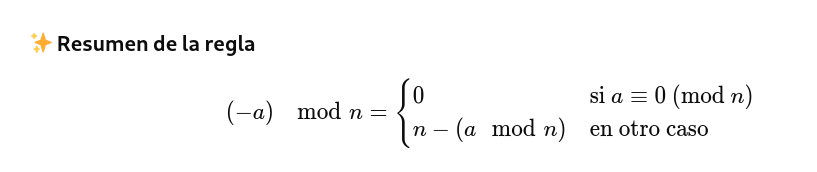
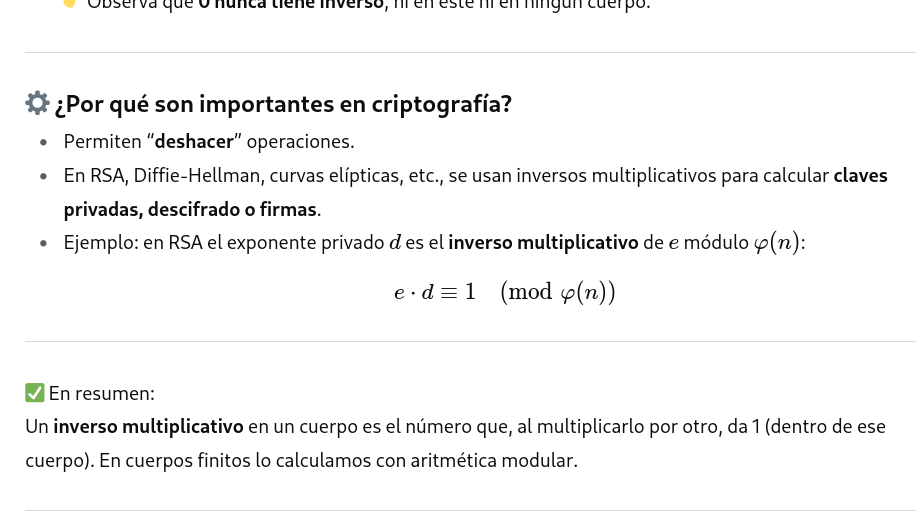
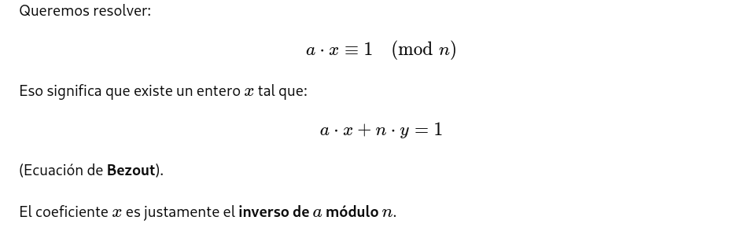

# Clasificación de los sistemas de cifra
## 📌 1. Según el tipo de clave
- **Cifrado simétrico:**
  - Usa la misma clave para cifrar y descifrar.
  - Ventaja: rápido y eficiente.
  - Inconveniente: problema de intercambio seguro de la clave.
  - Ejemplos: AES, DES, ChaCha20.

- **Cifrado asimétrico:**
  - Usa dos claves distintas y relacionadas matemáticamente:
    - Clave pública (cifrar).
    - Clave privada (descifrar).
  - Ventaja: resuelve el problema de compartir claves.
  - Ejemplos: RSA, ECC, ElGamal.

## 📌 2. Según la época o generación
- **Cifras clásicas:**
  - Basadas en sustitución y transposición de letras.
  - Ejemplos: César, Vigenère, Escítala.
- **Cifras modernas:**
  - Basadas en algoritmos matemáticos complejos y cómputo digital.
  - Ejemplos: AES, RSA, ECC.

## 📌 3. Según la unidad de operación
- **Cifrado por bloques:**
  - El texto se divide en bloques de tamaño fijo y cada bloque se cifra como una unidad.
  - Ejemplos: AES (128 bits), DES (64 bits).
- **Cifrado en flujo:**
  - El texto se cifra bit a bit o byte a byte, generando un flujo pseudoaleatorio.
  - Ejemplos: RC4, Salsa20.

## 📌 4. Según la transformación aplicada
- **Cifras de sustitución:** cambian unos símbolos por otros.
- **Cifras de transposición:** reordenan los símbolos.
- **Cifras combinadas:** usan ambas técnicas (muy comunes en algoritmos modernos).


## Resumen Clasificación de los sistemas de cifra

| **Criterio**                | **Tipos**            | **Características**                                                                                    | **Ejemplos**                  |
| --------------------------- | -------------------- | ------------------------------------------------------------------------------------------------------ | ----------------------------- |
| **Por clave**               | 🔑 **Simétrico**     | Misma clave para cifrar y descifrar. Rápido, pero hay problema de intercambio seguro de clave.         | AES, DES, ChaCha20            |
|                             | 🔑 **Asimétrico**    | Par de claves: pública (cifrar) y privada (descifrar). Más lento, pero resuelve intercambio de claves. | RSA, ECC, ElGamal             |
|  |  |  |  |
| **Por época**               | 🏛️ **Clásicos**     | Sustitución y transposición de letras o símbolos.                                                      | César, Vigenère, Escítala     |
|                             | 💻 **Modernos**      | Algoritmos matemáticos complejos, aplicados en computación.                                            | AES, RSA, ECC                 |
|  |  |  |  |
| **Por unidad de operación** | 📦 **Por bloques**   | Cifra bloques de datos de tamaño fijo (64, 128 bits…).                                                 | AES (128 bits), DES (64 bits) |
|                             | 🔄 **En flujo**      | Cifra bit a bit o byte a byte con flujo pseudoaleatorio.                                               | RC4, Salsa20                  |
|  |  |  |  |
| **Por transformación**      | 🔁 **Sustitución**   | Sustituye símbolos por otros.                                                                          | César, ROT13                  |
|                             | 🔀 **Transposición** | Reordena los símbolos sin cambiarlos.                                                                  | Escítala, Rail Fence          |
|                             | ⚡ **Combinadas**     | Mezcla sustitución y transposición. Muy usadas en sistemas modernos.                                   | AES, Vigenère mejorado        |

_______________________________________________
# Clasificación de las Cifras Clásicas
## 📌 1. Según el tipo de operación que se realiza al texto en claro durante la cifra.
- **Cifras de Sustitución - Objetivo Confusión:**
  - Cada símbolo del mensaje se reemplaza por otro siguiendo una regla fija.
  - El alfabeto de cifra puede o no tener los mismos elementos que el alfabeto del texto en claro. En este segundo caso, puede incluir signos y diferente objetos gráficos. Ejemplo: El escarabajo de oro.

  - **Clasificación de los algoritmos por sustitución:**
    - **A) Cifrado Monoalfabético** (cada letra se sustituye por otra distinta del alfabeto).
      - Tipos de cifrado monoalfabético:
        - Cifrado Monográmico: Se cifra letra a letra.
        - Cifrado Poligrámico: Se usa un grupo de letras del mensaje.

      - Ejemplos del algoritmos de sustitución Monoalfabéticos:
        - Cifrado César (desplazar el alfabeto un número fijo de posiciones). Cifrado Monoalfabético.
        - Cifrado Homofónico (una letra puede sustituirse por varios símbolos posibles). Cifrado Monoalfabético
        - Cifrado Afin. Cifrado Monoalfabético.
        - Cifrado Playfair. Sustitución Monoalfabético Poligrámico.
        - Cifrado Matrices de Hill. Monoalfabético Poligrámico.
        
    - **B) Cifrado Polialfabético** (usa varios alfabetos de sustitución, como el Vigenère).
      - La periodicidad se refiere a la repetición o no de una clave durante el cifrado.
      - No periodicos:
        - Cifrador de Vernam. Se considera polialfabético no periódico solo cuando la clave es aleatoria y del mismo tamaño que el mensaje (caso particular: One-Time Pad).
      - Periódicos:
        - Enigma.
        - Cifrador de Vigenère.

- **Cifras de Transposición o Permutación - Objetivo Difusión:**
  - No se cambian los símbolos, sino que se reordenan siguiendo un patrón.
  - En los algoritmos por Transposición, las operaciones se realizan mediante:
    - Grupos.
    - Series.
    - Columnas (escribir en una tabla y leer por columnas).
    - Filas.
    - Rutas (leer las letras siguiendo un recorrido).
  - Su importancia radica en que su uso en la cifra aumenta la seguridad de los algoritmos al difundir las propiedades estadísticas del lenguaje.
  - Ejemplos:
    - Escítala espartana.

- **Cifras mixtas:** Combinan sustitución y transposición para más seguridad.
  - Ejemplo: ADFGVX (usado en la Primera Guerra Mundial).


### Tabla Resumen de la Clasificación de las Cifras Clásicas

| **Categoría** | **Subcategoría** | **Características** | **Ejemplos** |
|---------------|------------------|----------------------|--------------|
| 🔁 Sustitución (Confusión) | **Monoalfabética** | Cada letra del mensaje se sustituye siempre por otra fija. | César, Afin, Sustitución Homofónica |
|               | **Poligrámica**  | Sustituye grupos de letras (dígrafos, trígrafos o más). | Playfair (dígrafos), Hill (matrices) |
|               | **Polialfabética** | Usa varios alfabetos de sustitución en secuencia. Puede ser periódica o no. | Vigenère (periódico), Vernam/OTP (no periódico), Enigma (máquina polialfabética) |
| 🔀 Transposición (Difusión) | **Por columnas** | Se escribe en tabla y se lee por columnas. | Transposición columnar |
|               | **Por filas** | Reordenamiento de caracteres en secuencia. | Variantes por permutaciones simples |
|               | **Por rutas** | Se sigue un recorrido en zigzag o espiral. | Transposición por ruta |
|               | **Otros** | Reordenamientos con objetos físicos. | Escítala espartana |
| ⚡ Mixtas | - | Combinan sustitución y transposición para aumentar seguridad. | ADFGVX (Primera Guerra Mundial) |


## 📌 2. Según el alfabeto utilizado
- **Monoalfabéticas:** usan un solo alfabeto para cifrar todo el mensaje.
  - Ejemplo: César.
- **Polialfabéticas:** usan varios alfabetos que se alternan.
  - Ejemplo: Vigenère, Alberti.

## 📌 3. Según la unidad de cifrado
- **Por letras:** transforman cada letra individualmente.
- **Por grupos:** trabajan con sílabas o grupos de letras (ej. dígrafos).
- **Por palabras:** poco frecuente, sustituyen palabras enteras por símbolos o números.

________________________________
# Mapa Conceptual: Clasificación de las Cifras Clásicas
## 📌 1. Sustitución: Reemplazan letras/símbolos por otros.
- Monoalfabéticas → un solo alfabeto.
  - Cifrado César
  - Sustitución simple
- Polialfabéticas → varios alfabetos alternados.
  - Vigenère
  - Disco de Alberti
- Homofónicas → una letra puede tener varias sustituciones.
- Polígramas → sustituyen grupos de letras (ej. Playfair).

## 📌 2. Transposición: Reordenan los símbolos sin cambiarlos.
- Escítala espartana (vara con pergamino).
- Transposición por columnas (escribir en tabla y leer columnas).
- Ruta o zigzag (leer letras siguiendo un recorrido).

## 📌 3. Mixtas: Combinan sustitución + transposición.
- ADFGVX (Primera Guerra Mundial).


---------------------------------------------------------------------------

# Cifrando en un cuerpo
Cifrando dentro de un cuerpo aborda un concepto fundamental en criptografía: **la idea de realizar operaciones de cifrado dentro de un cuerpo de cifra o módulo**, destacando que este concepto es distinto al de operar en un cuerpo (como en matemáticas abstractas), y que es esencial en muchos sistemas criptográficos modernos .

## Que significa "un cuerpo"
En matemáticas, un cuerpo (o campo, en inglés field) **es una estructura algebraica donde se pueden hacer operaciones de suma, resta, multiplicación y división (excepto dividir entre 0) y que cumplen ciertas reglas**.

Ejemplos de cuerpos:
- Los números racionales (ℚ)
- Los números reales (ℝ)
- Los números complejos (ℂ)
- También cuerpos finitos como ℤ/pℤ (enteros módulo un número primo p).

## ¿Qué significa "un cuerpo" en criptografía?
En criptografía muchas operaciones no se hacen en los números reales que usamos normalmente, sino dentro de un cuerpo finito o un anillo modular.
  - Ejemplo típico: RSA trabaja en los enteros módulo n (con n grande, producto de dos primos).
  - En criptografía de curva elíptica se usan cuerpos finitos ℤ/pℤ o cuerpos extendidos GF(2^m).

## “Cifrando dentro de un cuerpo”, significa que:
- Se refiere al proceso de realizar la operación de cifrado trabajando matemáticamente sobre un cuerpo algebraico (en inglés, "field") en vez de un conjunto cualquiera.
- El texto claro y las claves se transforman en números.
- Las operaciones de cifrado (sumas, multiplicaciones, potencias, etc.) se hacen dentro de un cuerpo finito, es decir, respetando las reglas de ese sistema matemático.
- Esto garantiza que las operaciones tengan propiedades necesarias: inversas, cierre, etc., lo que permite que el cifrado sea reversible (descifrable).

## La operación módulo
La operación módulo es simplemente quedarse con el resto de una división.
```
17÷5=3 con resto 2
Se escribe:
17≡2 (mod 5)
17≡2 (mod 5)
Eso significa que 17 y 2 dejan el mismo resto al dividir entre 5.
```

## Módulo n
Trabajar “módulo n” significa que:
- Sólo nos importan los restos entre 0 y n-1.
- Todo número lo reducimos a su equivalente en ese rango.

Por ejemplo, módulo 7:
- 10≡3 (mod 7)
- 15≡1 (mod 7)
- 21≡0 (mod 7)


## ¿Qué es un cuerpo de cifra o módulo?
En criptografía las operaciones se realizan dentro de un cuerpo de cifra o módulo, siendo este concepto distinto cuando hablamos de criptografía clásica o de criptografía moderna.

En matemática discreta decimos que un cuerpo finito `n`, está conformado por `n` número enteros, que van desde el valor `0`, hasta el valor `n-1`, siendo
- n = 0
- n+1 = 1
- ...

Ejemplo:
- Si n = 77 = { 0, 1, 2, 3, 4, ..., 74, 75, 76}
- Tendríamos los siguiente resultados modulares posibles:
  - `22 mod 77 = 22`  → 22÷77  →  El cociente es 0 y el resto es 22.
  - `100 mod 77 = 33` → 77*1 = 77    ||| 100 - 77 = 33 →  100 contiene 1 vez al 77 y queda como resto o residuo 33.
  - `450 mod 77 = 65` → 77*5 = 385   ||| 450 - 385 = 65 →  450 contiene 5 veces a 77 y queda como residuo 65.
  - `-200 mod 77 = 31` → −200 mod 77 = 31

En criptografía, especialmente en algoritmos como RSA o ciertos esquemas de cifrado simétrico, las operaciones (como multiplicaciones o sumas) se realizan modularmente, es decir, dentro de un conjunto de residuos, por ejemplo usando una operación como “mod n”.

Este entorno “modular” asegura propiedades matemáticas útiles para la seguridad criptográfica, como resistencia a ciertos ataques y correcta reversibilidad de operaciones.


## Regla rápida para calcular el módulo de un número


## Regla rápida para módulo con negativos
- Calculamos el módulo como si el número fuera positivo.  
  Ejemplo: −200 mod  77 → primero 200mod  77  
  200÷77=2resto 46

  Entonces  
  200mod77=46.

- Ahora restamos el resultado al divisor n:  
  77−46=31

- Ese es el valor positivo del módulo para −200.  
  −200mod  77=31



## ¿Qué es un cuerpo de cifra o módulo?
- En criptografía, especialmente en algoritmos como RSA o ciertos esquemas de cifrado simétrico, las operaciones (como multiplicaciones o sumas) se realizan modularmente, es decir, dentro de un conjunto de residuos, por ejemplo usando una operación como “mod n”.
- Este entorno “modular” asegura propiedades matemáticas útiles para la seguridad criptográfica, como resistencia a ciertos ataques y correcta reversibilidad de operaciones.

## Cuerpo de cifra en la criptografía clásica.
El Cuerpo de cifra en la criptografía clásica es el número de elementos que conforman el alfabeto del texto en claro. Aunque este alfabeto puede ser cualquier conjunto de letros y/o signos es habitual trabajar en módulo 27 ya que es el número de letras mayúsculas del alfabeto español, incluida la `Ñ`.

Se codifica usualmente la letra A = 0, B = 1, ...., Z=26

Sobre esos número se realizan operaciones de suma, resa y producto para cifrar cada letra o un conjunto de letras del texto en claro en módulo 27.


 ## Cuerpo de cifra en la criptografía moderna
En la cifra moderna, el cuerpo en el que se realizan las operaciones no tiene ninguna relación con el alfabeto utilizado en el texto en claro, por ejemplo los 256 caracteres del código ASCII. Por lo general, ese cuerpo de cifra suele ser un número mucho mayor, como por ejemplo 65.536 y 65.536 en el algoritmo de clave secreta IDEA, o bien, un número de unos 300 dígitos decimales o 1024 bits que se utiliza como valor mínimo del módulo en el algoritmo de clave pública RSA.
 

## Inversos multiplicativos de un cuerpo
Se dice que un numero `a`, elemento del cuerpo `n` tiene inverso multiplicativo en dicho cuerpo (o simplemente, inverso), si existe otro `x` que haga cumplir la condición de que `a*x mod n = 1`, la identidad de la multiplicación.

Por simplificar (aunque matemáticamente no es correcto), podemos asociar el concepto del inverso en ese cuerpo `n:
```
a = 1/x
x= 1/a
```





**¿Por qué son importantes los inversos multiplicativos de un cuerpo en criptografía?:**
- Permiten “deshacer” operaciones.
- En RSA, Diffie-Hellman, curvas elípticas, etc., se usan inversos multiplicativos para calcular claves privadas, descifrado o firmas.
- Ejemplo: en RSA el exponente privado `d` es el inverso multiplicativo de `e módulo φ(n)`:  
  `e⋅d≡1(modφ(n))`

Un inverso multiplicativo en un cuerpo es el número que, al multiplicarlo por otro, da 1 (dentro de ese cuerpo). En cuerpos finitos lo calculamos con aritmética modular.

## Condición necesaria para la existencia del inverso
Para que se cumpla la relación: `a*x mod n = 1`, es imprescindible que el máximo común divisor entre `a`y `n` sea la unidad  →  
`mcd(a,n) = 1`

Si esto no se cumple se puede dar la situación de cifrar algo y que luego el receptor sea incapaz de descifrarlo.

Ejemplo  →  Si en un sistema elemental de cifra módulo 27, multiplicamos el código de cada letra por 3, la cifra se produce, pero NO será posible descifrar, ya que NO EXISTE el inverso de 3 en ese módulo 27.

## Visualización de los inversos
Sea el cuerpo `n = 10`  
Con elementos o restos: `{0,1,2,3,4,5,6,7,8,9}  
A excepción del `0 y del 1` ya que no tiene sentido hablar de estos inversos, los únicos elementos en 10 que tienen inversos son:  
{3,7,9} ya que el mcd de estos números y 10 es igual a 1  → 
mcd(3,10)=1  
mcd(7,10)=1  
mcd(9,10)=1  

Para comprobar que el 3 tiene inverso en 10, podríamos multiplicar todos los elementos de `n` por `3`, reduciendo módulo 10 para ver el resultado:
```
3*0 = 0 →  0  mod 10 = 0
3*1 = 3 →  3  mod 10 = 3
3*2 = 6 →  6  mod 10 = 6
3*3 = 9 →  9  mod 10 = 9
3*4 = 12 → 12 mod 10 = 2
3*5 = 15 → 15 mod 10 = 5
3*6 = 18 → 18 mod 10 = 8
3*7 = 21 → 21 mod 10 = 1
3*8 = 24 → 24 mod 10 = 4
3*9 = 27 → 27 mod 10 = 7
```

Vemos que con los 10 elementos del cuerpo se obtienen TODOS los restos, y que solamente en el caso de `x=7`, se obtiene el resultado 1 que estábamos esperando.  
**Por lo tanto, el inverso de 3 en el cuerpo de 10 es 7.**  
De la misma manera, que el inverso de 7 en el cuerpo de 10 es 3.  
Además este valor es único.


## Algoritmo Extendido Euclides para calcular inversos multiplicativos
Con el algoritmo de Euclides para calcular inversos multiplicativos módulo n, sin tener que probar uno por uno.


