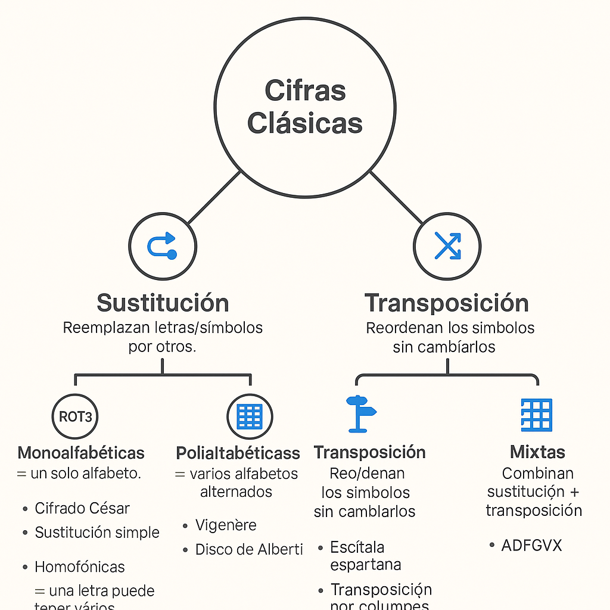

# Clasificación de los sistemas de cifra
## 📌 1. Según el tipo de clave
- **Cifrado simétrico:**
  - Usa la misma clave para cifrar y descifrar.
  - Ventaja: rápido y eficiente.
  - Inconveniente: problema de intercambio seguro de la clave.
  - Ejemplos: AES, DES, ChaCha20.

- **Cifrado asimétrico:**
  - Usa dos claves distintas y relacionadas matemáticamente:
    - Clave pública (cifrar).
    - Clave privada (descifrar).
  - Ventaja: resuelve el problema de compartir claves.
  - Ejemplos: RSA, ECC, ElGamal.

## 📌 2. Según la época o generación
- **Cifras clásicas:**
  - Basadas en sustitución y transposición de letras.
  - Ejemplos: César, Vigenère, Escítala.
- **Cifras modernas:**
  - Basadas en algoritmos matemáticos complejos y cómputo digital.
  - Ejemplos: AES, RSA, ECC.

## 📌 3. Según la unidad de operación
- **Cifrado por bloques:**
  - El texto se divide en bloques de tamaño fijo y cada bloque se cifra como una unidad.
  - Ejemplos: AES (128 bits), DES (64 bits).
- **Cifrado en flujo:**
  - El texto se cifra bit a bit o byte a byte, generando un flujo pseudoaleatorio.
  - Ejemplos: RC4, Salsa20.

## 📌 4. Según la transformación aplicada
- **Cifras de sustitución:** cambian unos símbolos por otros.
- **Cifras de transposición:** reordenan los símbolos.
- **Cifras combinadas:** usan ambas técnicas (muy comunes en algoritmos modernos).

## Resumen Clasificación de los sistemas de cifra

| **Criterio**                | **Tipos**            | **Características**                                                                                    | **Ejemplos**                  |
| --------------------------- | -------------------- | ------------------------------------------------------------------------------------------------------ | ----------------------------- |
| **Por clave**               | 🔑 **Simétrico**     | Misma clave para cifrar y descifrar. Rápido, pero hay problema de intercambio seguro de clave.         | AES, DES, ChaCha20            |
|                             | 🔑 **Asimétrico**    | Par de claves: pública (cifrar) y privada (descifrar). Más lento, pero resuelve intercambio de claves. | RSA, ECC, ElGamal             |
| --------- | --------- | --------- | --------- |
| **Por época**               | 🏛️ **Clásicos**     | Sustitución y transposición de letras o símbolos.                                                      | César, Vigenère, Escítala     |
|                             | 💻 **Modernos**      | Algoritmos matemáticos complejos, aplicados en computación.                                            | AES, RSA, ECC                 |
| --------- | --------- | --------- | --------- |
| **Por unidad de operación** | 📦 **Por bloques**   | Cifra bloques de datos de tamaño fijo (64, 128 bits…).                                                 | AES (128 bits), DES (64 bits) |
|                             | 🔄 **En flujo**      | Cifra bit a bit o byte a byte con flujo pseudoaleatorio.                                               | RC4, Salsa20                  |
| --------- | --------- | --------- | --------- |
| **Por transformación**      | 🔁 **Sustitución**   | Sustituye símbolos por otros.                                                                          | César, ROT13                  |
|                             | 🔀 **Transposición** | Reordena los símbolos sin cambiarlos.                                                                  | Escítala, Rail Fence          |
|                             | ⚡ **Combinadas**     | Mezcla sustitución y transposición. Muy usadas en sistemas modernos.                                   | AES, Vigenère mejorado        |

_______________________________________________
# Clasificación de las Cifras Clásicas
## 📌 1. Según la técnica usada
- **Cifras de sustitución:** Cada símbolo del mensaje se reemplaza por otro siguiendo una regla fija.
  - Ejemplos:
    - Cifrado César (desplazar el alfabeto un número fijo de posiciones).
    - Cifrado Monoalfabético (cada letra se sustituye por otra distinta del alfabeto).
    - Cifrado Polialfabético (usa varios alfabetos de sustitución, como el Vigenère).
    - Cifrado Homofónico (una letra puede sustituirse por varios símbolos posibles).

- **Cifras de transposición:** No se cambian los símbolos, sino que se reordenan siguiendo un patrón.
  - Ejemplos:
    - Escítala espartana (enrollar un mensaje en una vara).
    - Transposición por columnas (escribir en una tabla y leer por columnas).
    - Transposición por rutas (leer las letras siguiendo un recorrido).

- **Cifras mixtas:** Combinan sustitución y transposición para más seguridad.
  - Ejemplo: ADFGVX (usado en la Primera Guerra Mundial).

## 📌 2. Según el alfabeto utilizado
- **Monoalfabéticas:** usan un solo alfabeto para cifrar todo el mensaje.
  - Ejemplo: César.
- **Polialfabéticas:** usan varios alfabetos que se alternan.
  - Ejemplo: Vigenère, Alberti.

## 📌 3. Según la unidad de cifrado
- **Por letras:** transforman cada letra individualmente.
- **Por grupos:** trabajan con sílabas o grupos de letras (ej. dígrafos).
- **Por palabras:** poco frecuente, sustituyen palabras enteras por símbolos o números.

________________________________
# Mapa Conceptual: Clasificación de las Cifras Clásicas
## 📌 1. Sustitución: Reemplazan letras/símbolos por otros.
- Monoalfabéticas → un solo alfabeto.
  - Cifrado César
  - Sustitución simple
- Polialfabéticas → varios alfabetos alternados.
  - Vigenère
  - Disco de Alberti
- Homofónicas → una letra puede tener varias sustituciones.
- Polígramas → sustituyen grupos de letras (ej. Playfair).

## 📌 2. Transposición: Reordenan los símbolos sin cambiarlos.
- Escítala espartana (vara con pergamino).
- Transposición por columnas (escribir en tabla y leer columnas).
- Ruta o zigzag (leer letras siguiendo un recorrido).

## 📌 3. Mixtas: Combinan sustitución + transposición.
- ADFGVX (Primera Guerra Mundial).

