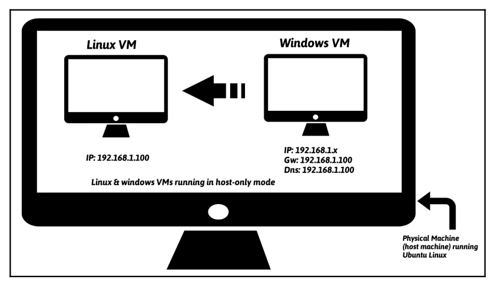
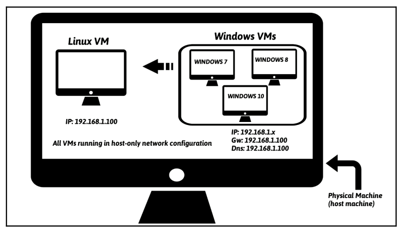

https://elhacker.info/manuales/An%c3%a1lisis%20de%20malware/

https://elhacker.info/manuales/An%C3%A1lisis%20de%20malware/Learning%20Malware%20Analysis_%20Explore%20the%20concepts,%20tools,%20and%20techniques%20to%20analyze%20and%20investigate%20Windows%20malware%20(%20PDFDrive.com%20).pdf

https://www.wolf.university/masteringmalwareanalysis/ebook/masteringmalwareanalysis.pdf

https://www.wolf.university/cybersecuritythreatsmalwaretrendsandstrategies/ebook/cybersecuritythreatsmalwaretrendsandstrategies.pdf

https://elhacker.info/manuales/An%c3%a1lisis%20de%20malware/Practical_Malware_Analysis.pdf


https://github.com/Neo23x0/signature-base/tree/master/yara


# 1. ¿Qué es el malware?
El malware es un código que realiza acciones maliciosas; puede tomar la forma de un ejecutable, un script, un código o cualquier otro software. Los atacantes utilizan malware para robar información confidencial, espiar el sistema infectado o tomar el control del sistema. Por lo general, ingresa a su sistema sin su consentimiento y puede entregarse a través de varios canales de comunicación, como correo electrónico, web o unidades USB.


The following are some of the malicious actions performed by malware:
- Disrupting computer operations
- Stealing sensitive information, including personal, business, and financial data
- Unauthorized access to the victim's system
- Spying on the victims
- Sending spam emails
- Engaging in distributed-denial-of-service attacks (DDOS)
- Locking up the files on the computer and holding them for ransom

Malware is a broad term that refers to different types of malicious programs such as trojans, viruses, worms, and rootkits. While performing malware analysis, you will often come across various types of malicious programs; some of these malicious programs are categorized based on their functionality and attack vectors as mentioned here:
- Virus or Worm: Malware that is capable of copying itself and spreading to other computers. A virus needs user intervention, whereas a worm can spread without user intervention.
- Trojan: Malware that disguises itself as a regular program to trick users to install it on their systems. Once installed, it can perform malicious actions such as stealing sensitive data, uploading files to the attacker's server, or monitoring
webcams.
- Backdoor / Remote Access Trojan (RAT): This is a type of Trojan that enables the attacker to gain access to and execute commands on the compromised system.
- Adware: Malware that presents unwanted advertisements (ads) to the user. They usually get delivered via free downloads and can forcibly install software on your system.
- Botnet: This is a group of computers infected with the same malware (called bots), waiting to receive instructions from the command-and-control server controlled by the attacker. The attacker can then issue a command to these bots, which can perform malicious activities such as DDOS attacks or sending spam emails.
- Information stealer: Malware designed to steal sensitive data such as banking credentials or typed keystrokes from the infected system. Some examples of these malicious programs include key loggers, spyware, sniffers, and form grabbers.
Ransomware: Malware that holds the system for ransom by locking users out of their computer or by encrypting their files.
Rootkit: Malware that provides the attacker with privileged access to the infected system and conceals its presence or the presence of other software.
Downloader or dropper: Malware designed to download or install additional malware components.


# 2. Descripción general de la arquitectura del laboratorio


La arquitectura usada consiste en una **máquina física (llamada máquina host) que ejecuta Ubuntu Linux con instancias de máquina virtual Linux (Ubuntu Linux VM) y máquina virtual Windows (Windows VM)**. Estas máquinas virtuales se configurarán para ser parte de la misma red y utilizarán el modo de **configuración de red de Host-only** para que el malware no pueda comunicarse con Internet y el tráfico de la red esté contenido en el entorno de laboratorio aislado.

La VM de Windows es donde se ejecutará el malware durante el análisis, y la VM de Linux usada para monitorear el tráfico de red y será configurada para simular servicios de Internet (DNS, HTTP, etc.), para proporcionar una respuesta adecuada cuando el malware solicite estos servicios. Por ejemplo, la máquina virtual Linux se configurará de manera que cuando el malware solicite un servicio como DNS, la máquina virtual Linux proporcione la respuesta DNS adecuada. 

En esta configuración, la máquina virtual Linux estará preconfigurada en la dirección IP 192.168.1.100 y la dirección IP de la máquina virtual Windows se configurará en 192.168.1.x (donde x es cualquier número de 1 a 254 excepto 100). La puerta de enlace predeterminada y el DNS de la VM de Windows se configurarán en la dirección IP de la VM de Linux (es decir, 192.168.1.100) para que todo el tráfico de la red de Windows se enrute a través de la VM de Linux.

También es posible configurar un laboratorio compuesto por múltiples VMs ejecutando diferentes versiones de Windows; esto nos permitirá analizar la muestra de malware en varias versiones de sistemas operativos Windows.



# 3. Configuración de VM Linux
- Instalación de Ubuntu.
- Instalación de Virtual Guest Additions software.
- Instalación:
  ```
  sudo apt-get install python-pip
  pip install --upgrade pip
  sudo apt-get install python-magic
  sudo apt-get install upx
  sudo pip install pefile
  sudo apt-get install yara
  sudo pip install yara-python
  sudo apt-get install ssdeep
  sudo apt-get install build-essential libffi-dev python python-dev libfuzzy-dev
  sudo pip install ssdeep
  sudo apt-get install wireshark
  sudo apt-get install tshark
  ```
- INetSim (http://www.inetsim.org/index.html) is a powerful utility that allows simulating various Internet services (such as DNS, and HTTP):
  ```
  sudo su
  echo "deb http://www.inetsim.org/debian/ binary/" >  /etc/apt/sources.list.d/inetsim.list
  wget -O - http://www.inetsim.org/inetsim-archive-signing-key.asc | apt-key add -
  apt update
  apt-get install inetsim
  ```
- You can now isolate Ubuntu VM within your lab by configuring the virtual appliance to use Host-only network mode. On VMware, bring up the Network Adapter Settings and choose Host-only. File| Preferences | Network | Host-only networks | Add host-only network.
- IP address of 192.168.1.100 to the Ubuntu Linux VM.
- Configure INetSim so that it can listen to and simulate all the services on the configured IP address 192.168.1.100:
  ```
  sudo gedit /etc/inetsim/inetsim.conf
  # service_bind_address
  #
  # IP address to bind services to
  #
  # Syntax: service_bind_address <IP address>
  #
  # Default: 127.0.0.1
  #
  #service_bind_address 10.10.10.1
  service_bind_address 192.168.1.100
  #
  #dns_default_ip 10.10.10.1
  dns_default_ip 192.168.1.100
  ```
- Launch INetSim:
  ```
  sudo inetsim
  ```
- Take a snapshot: On Virtualbox, the same can be done by clicking on Machine | Take Snapshot.


# 4. Configuración de VM Windows
- Download Python from https://www.python.org/downloads/. Be sure to download Python 2.7.x (such as 2.7.13); most of the scripts used in this book are written to run on the Python 2.7 version and may not run correctly on Python 3.
- Configure your Windows VM to run in Host-only network configuration mode.
- Configure the IP address of the Windows VM to 192.168.1.x (choose any IP address except 192.168.1.100 because the Linux VM is set to use that IP) and set up your Default gateway and the DNS server to the IP address of Linux VM (that is, 192.168.1.100).
- Make sure they can communicate with each other. You can check for the connectivity by running the ping command launch the Local Group Policy Editor. In the left-hand pane of Local Group Policy Editor, navigate to Computer Configuration | Administrative Templates | Windows Components | Windows Defender. In the right-hand pane, doubleclick on the Turn off Windows Defender policy to edit it; then select Enabled and click on OK.


# 5. Malware Sources
- Hybrid Analysis: https://www.hybrid-analysis.com/
- KernelMode.info: http://www.kernelmode.info/forum/viewforum.php?f=16
- VirusBay: https://beta.virusbay.io/
- Contagio malware dump: http://contagiodump.blogspot.com/
- AVCaesar: https://avcaesar.malware.lu/
- Malwr: https://malwr.com/
- VirusShare: https://virusshare.com/
- theZoo: http://thezoo.morirt.com/

You can find links to various other malware sources in Lenny Zeltser's blog post https://zeltser.com/malware-sample-sources/.

# 6. Análisis estático
El análisis estático es la técnica de analizar el archivo sospechoso sin ejecutarlo. Es un método de análisis inicial que implica extraer información útil del binario sospechoso para tomar una decisión informada sobre cómo clasificarlo o analizarlo y dónde centrar sus esfuerzos de análisis posteriores.
Aprenderemos:
- Identificar la arquitectura de destino del malware.
- Tomar huellas dactilares del malware.
- Escanear el binario sospechoso con motores antivirus.
- Extraer cadenas, funciones y metadatos asociados con el archivo.
- Identificar las técnicas de ofuscación utilizadas para frustrar el análisis.
- Clasificación y comparación de muestras de malware.

Estas técnicas pueden revelar información diferente sobre el archivo. No es necesario seguir todas estas técnicas y no es necesario seguirlas en el orden presentado. La elección de las técnicas a utilizar depende de su objetivo y del contexto que rodea el archivo sospechoso.

## 6.1 Determinar el tipo de fichero
Determinar el tipo de archivo de un binario sospechoso nos ayudará a identificar el sistema operativo objetivo del malware (Windows, Linux, etc.) y la arquitectura (plataformas de 32 o 64 bits). Por ejemplo, si el binario sospechoso tiene un tipo de archivo ejecutable portátil (PE), que es el formato de archivo para archivos ejecutables de Windows (.exe, .dll, .sys, .drv, .com, .ocx, etc.), entonces podemos deducir que el archivo está diseñado para apuntar al sistema operativo Windows.

En lugar de depender de la extensión del archivo, se puede utilizar la firma del archivo para determinar el tipo de archivo.
Una firma de archivo es una secuencia única de bytes que se escribe en el encabezado del archivo. Diferentes archivos tienen diferentes firmas, que pueden usarse para identificar el tipo de archivo. Los archivos ejecutables de Windows, también llamados archivos PE (como los archivos que terminan en .exe, .dll, .com, .drv, .sys, etc.), tienen una firma de archivo de MZ o caracteres hexadecimales 4D 5A enlos primeros dos bytes del archivo.


### Identificando el tipo de fichero usando un método manual
El método manual para determinar el tipo de archivo es buscar la firma del archivo abriéndolo en un editor hexadecimal.

En sistemas Linux, para buscar la firma del archivo se puede utilizar el comando xxd, que genera un volcado hexadecimal del archivo:
```
xxd -g 1 log.exe | more
```

### Identificando el tipo de fichero usando herramientas
- En sistemas Linux, esto se puede lograr usando la utilidad file. En el siguiente ejemplo, el comando file se ejecutó en dos archivos diferentes.
  - En el primer archivo que no tiene ninguna extensión, se detecta como un archivo ejecutable de 32 bits (PE32)
    ```
    $ file mini
    mini: PE32 executable (GUI) Intel 80386, for MS Windows
    ```
  - En el segundo archivo es un ejecutable de 64 bits (PE32+):
    ```
    $ file notepad.exe
    notepad.exe: PE32+ executable (GUI) x86-64, for MS Windows
    ```

- En Windows: CFF Explorer, part of Explorer Suite (http://www.ntcore.com/exsuite.php), can be used to determine the file type.


### Identificando el tipo de fichero usando Python
El módulo python-magic puede ser usado para identificar el tipo de fichero de un archivo.
```
$ python
Python 2.7.12 (default, Nov 19 2016, 06:48:10)
>>> import magic
>>> m = magic.open(magic.MAGIC_NONE)
>>> m.load()
>>> ftype = m.file(r'log.exe')
>>> print ftype
PE32 executable (GUI) Intel 80386, for MS Windows
```


## 6.2 Fingerprinting the Malware
Fingerprinting involves generating the cryptographic hash values for the suspect binary based on its file content. The cryptographic hashing algorithms such as MD5, SHA1 or SHA256 are considered the de facto standard for generating file hashes for the malware specimens.

El fingerprinting de malware es el proceso de recopilar información y características distintivas de un archivo malicioso, lo que permite a los analistas de seguridad y a las herramientas de protección identificar, clasificar y entender mejor el comportamiento del malware.

**Beneficios de tomar un fingerprint de un malware:**
- Identificación Única: Al igual que las huellas dactilares humanas son únicas para cada individuo, el fingerprinting de malware permite identificar de manera única una muestra de malware, lo que facilita su seguimiento y detección en diferentes sistemas
- Prevención de Fraudes y Autenticación: El fingerprinting puede detectar patrones inusuales que podrían indicar una actividad sospechosa, como intentos de fraude o accesos no autorizados, y es una herramienta valiosa para la autenticación de usuarios y dispositivos
-Investigación y Análisis Forense: El fingerprinting es crucial para el análisis forense, ya que proporciona datos detallados sobre el malware que pueden ser utilizados para entender su origen, propósito y cómo se propaga
- Desarrollo de Firmas de Antivirus: La información recopilada a través del fingerprinting se utiliza para desarrollar firmas que los programas antivirus pueden usar para identificar y bloquear malware conocido.


## 6.3 Generando Cryptographic Hash de un malware
Este proceso te permitirá obtener un identificador único para el archivo malicioso basado en su contenido, lo cual es útil para su análisis, identificación y comparación con bases de datos de malware conocido.
- En Windows:
  ```
  certUtil -hashfile nombreArchivo SHA256
  Get-FileHash -Algorithm Sha256 nombreArchivo
  ```
- En Linux:
  ```
  sha256sum nombre_del_archivo
  ```
- En python:
  ```
  python
  Python 2.7.12 (default, Nov 19 2016, 06:48:10)
  >>> import hashlib
  >>> content = open(r"log.exe","rb").read()
  >>> print hashlib.md5(content).hexdigest()
  6e4e030fbd2ee786e1b6b758d5897316
  >>> print hashlib.sha256(content).hexdigest()
  01636faaae739655bf88b39d21834b7dac923386d2b52efb4142cb278061f97f
  >>> print hashlib.sha1(content).hexdigest()
  625644bacf83a889038e4a283d29204edc0e9b65
  ```

## 6.4 Multiple Anti-Virus Scanning
Escanear el binario sospechoso con varios escáneres antivirus ayuda a determinar si existen firmas de código malicioso para el archivo sospechoso. El nombre de la firma de un archivo en particular puede proporcionar información adicional sobre el archivo y sus capacidades. Al visitar los sitios web de los respectivos proveedores de antivirus o buscar la firma en los motores de búsqueda, puede obtener más detalles sobre el archivo sospechoso. Esta información puede ayudarle en su investigación posterior y puede reducir el tiempo de análisis.

### Virus Total


## 7 Extracting Strings
Las cadenas son secuencias de caracteres imprimibles en ASCII y Unicode incrustadas en un archivo.
La extracción de cadenas puede dar pistas sobre la funcionalidad del programa y los indicadores asociados con un binario sospechoso. Por ejemplo, si un malware crea un archivo, el nombre del archivo se almacena como una cadena en el binario. O, si un malware resuelve un nombre de dominio controlado por el atacante, entonces el nombre de dominio se almacena como una cadena. Las cadenas extraídas del binario pueden contener referencias a nombres de archivos, URL, nombres de dominio, direcciones IP, comandos de ataque, claves de registro, etc. Aunque las cadenas no dan una idea clara del propósito y la capacidad de un archivo, pueden dar una pista sobre lo que el malware es capaz de hacer.

### 7.1 Extraer Cadenas usando herramientas
El comando strings, por defecto, extrae las cadenas ASCII que tienen al menos cuatro caracteres de largo. Con la opción -a es posible extraer cadenas de todo el archivo.
```
strings -a log.exe
```

Especímenes de malware también utilizan cadenas Unicode (2 bytes por carácter). Para obtener información útil del binario, a veces necesitas extraer tanto cadenas ASCII como Unicode. Para extraer cadenas Unicode usando el comando strings, usamos la opción -el.
```
strings -a -el log.exe
```

En Windows, pestudio (https://www.winitor.com) es una herramienta útil que muestra cadenas ASCII y Unicode. pestudio es una excelente herramienta de análisis de PE para realizar pruebas iniciales evaluación de malware de un binario sospechoso y está diseñado para recuperar varios elementos útiles.

También en windows se puede usar el comando strings de sysinternals y PPEE (https://www.mzrst.com/).

### 7.1 Decoding Obfuscated Strings Using FLOSS
La mayoría de las veces, los autores de malware utilizan técnicas simples de ofuscación de cadenas para evitar la detección. En tales casos, esas cadenas ofuscadas no aparecerán en la utilidad de cadenas ni en otras herramientas de extracción de cadenas. FireEye Labs Ofuscated String Solver (FLOSS) es una herramienta diseñada para identificar y extraer automáticamente cadenas ofuscadas de malware. Puede ayudarle a determinar las cadenas que los autores de malware quieren ocultar de las herramientas de extracción de cadenas.

FLOSS también se puede utilizar como la utilidad de cadenas para extraer cadenas legibles por humanos (ASCII y Unicode). Puede descargar FLOSS para Windows o Linux desde https://github.com/fireeye/flare-floss.

En el siguiente ejemplo, no sólo se han extraido las cadenas legibles por humanos, sino que también decodificó las cadenas ofuscadas y extrajo las cadenas de la pila que la utilidad de cadenas y otras herramientas de extracción de cadenas no detectaron. El siguiente resultado muestra una referencia a un ejecutable, un archivo de Excel y una clave de registro de ejecución:
```
$ chmod +x floss
$ ./floss 5340.exe
FLOSS static ASCII strings
!This program cannot be run in DOS mode.
Rich
.text
`.rdata
@.data
[..removed..]
FLOSS decoded 15 strings
kb71271.log
R6002
- floating point not loaded
\Microsoft
winlogdate.exe
~tasyd3.xls
[....REMOVED....]
FLOSS extracted 13 stack strings
BINARY
ka4a8213.log
afjlfjsskjfslkfjsdlkf
'Clt
~tasyd3.xls
"%s"="%s"
regedit /s %s
[HKEY_CURRENT_USER\Software\Microsoft\Windows\CurrentVersion\Run]
[.....REMOVED......]
```

Si solo está interesado en las cadenas decodificadas/apiladas y desea excluir las cadenas estáticas (ASCII y Unicode) de la salida FLOSS, proporcione el modificador --no-static-strings.


https://www.mandiant.com/resources/blog/automatically-extracting-obfuscated-strings


## 8. Determining File Obfuscation
Aunque la extracción de cadenas es una técnica excelente para obtener información valiosa, a menudo los autores de malware ofuscan o blindan su binario de malware. La ofuscación es utilizada por los autores de malware para proteger el funcionamiento interno del malware de los investigadores de seguridad, analistas de malware e ingenieros inversos. Estas técnicas de ofuscación dificultan la detección/analización del binario; extraer las cadenas de tal binario resulta en muy pocas cadenas, y la mayoría de las cadenas están oscurecidas. Los autores de malware a menudo usan programas como Empaquetadores y Encriptadores para ofuscar su archivo con el fin de evadir la detección de productos de seguridad tales como antivirus y para impedir el análisis.

### 8.1 Packers and Cryptors
- Un Empaquetador es un programa que toma el ejecutable como entrada y utiliza la compresión para ofuscar el contenido del ejecutable. Este contenido ofuscado se almacena entonces dentro de la estructura de un nuevo archivo ejecutable; el resultado es un nuevo archivo ejecutable (programa empaquetado) con contenido ofuscado en el disco. Al ejecutar el programa empaquetado, ejecuta una rutina de descompresión, que extrae el binario original en la memoria durante el tiempo de ejecución y desencadena la ejecución.

- Un Encriptador es similar a un Empaquetador, pero en lugar de usar compresión, utiliza encriptación para ofuscar el contenido del ejecutable, y el contenido encriptado se almacena en el nuevo archivo ejecutable. Al ejecutar el programa encriptado, ejecuta una rutina de desencriptación para extraer el binario original en la memoria y luego desencadena la ejecución.

Para demostrar el concepto de ofuscación de archivos, tomemos un ejemplo de una muestra de malware llamada Spybot (no empaquetada); la extracción de cadenas de Spybot muestra referencias a nombres de ejecutables sospechosos y direcciones IP, como se muestra aquí:

```
$ strings -a spybot.exe
[....removed....]
EDU_Hack.exe
Sitebot.exe
Winamp_Installer.exe
PlanetSide.exe
DreamweaverMX_Crack.exe
FlashFXP_Crack.exe
Postal_2_Crack.exe
Red_Faction_2_No-CD_Crack.exe
Renegade_No-CD_Crack.exe
Generals_No-CD_Crack.exe
Norton_Anti-Virus_2002_Crack.exe
Porn.exe
AVP_Crack.exe
zoneallarm_pro_crack.exe
[...REMOVED...]
209.126.201.22
209.126.201.20
```

UPX, que se encuentra en https://upx.github.io/, es un empaquetador de ejecutables. UPX (Ultimate Packer for eXecutables) es una herramienta de código abierto y gratuita diseñada para comprimir archivos ejecutables. Su objetivo principal es reducir el tamaño de los archivos ejecutables (binarios), lo que puede ser útil para ahorrar espacio en disco y reducir los tiempos de carga en sistemas con recursos limitados. Empaquetamos y volvemos a comprobar los strings, observando que ya no se muestra mucha información:

```
$ upx -o spybot_packed.exe spybot.exe
Ultimate Packer for eXecutables
Copyright (C) 1996 - 2013
UPX 3.91 Markus Oberhumer, Laszlo Molnar & John Reiser Sep 30th 2013
File size Ratio Format Name
-------------------- ------ ----------- -----------
44576 -> 21536 48.31% win32/pe spybot_packed.exe
Packed 1 file.

$ strings -a spybot_packed.exe
!This program cannot be run in DOS mode.
UPX0
UPX1
.rsrc
3.91
UPX!
t ;t
/t:VU
]^M
9-lh
:A$m
hAgo .
C@@f.
Q*vPCi
%_I;9
PVh29A
[...REMOVED...]
```

UPX is a common packer, and many times you will come across malware samples packed with UPX. In most cases, it is possible to unpack the sample using the -d option. An example command is
```
upx -d -o spybot_unpacked.exe spybot_packed.exe.
```


### 8.2 Detecting File Obfuscation Using Exeinfo PE
La mayoría de los ejecutables legítimos no ofuscan su contenido, pero algunos ejecutables pueden hacerlo para evitar que otros examinen su código. Cuando te encuentres con una muestra que está empaquetada, hay una alta probabilidad de que sea maliciosa. Para detectar empaquetadores en Windows, puedes usar una herramienta gratuita como Exeinfo PE (http://exeinfo.atwebpages.com/).


Other CLI and GUI tools that can help you with packer detections include TrID (http://mark0.net/soft-trid-e.html), TRIDNet (http://mark0.net/soft-tridnet-e.html), Detect It Easy (http://ntinfo.biz/), RDG Packer Detector (http://www.rdgsoft.net/), packerid.py (https://github.com/sooshie/packerid), and PEiD (http://www.softpedia.com/get/Programming/Packers-Crypters-Protectors/PEiD-updated.shtml).


## 9. Inspecting PE Header Information
- Los ejecutables de Windows deben ajustarse al formato PE/COFF (Portable Executable/Common Object File Format). El formato de archivo PE es utilizado por los archivos ejecutables de Windows (tales como .exe, .dll, .sys, .ocx y .drv) y tales archivos generalmente se denominan archivos Portable Executable (PE). El archivo PE es una serie de estructuras y subcomponentes que contienen la información requerida por el sistema operativo para cargarlo en la memoria.
- Cuando un ejecutable se compila, incluye un encabezado (encabezado PE), que describe su estructura. Cuando se ejecuta el binario, el cargador del sistema operativo lee la información del encabezado PE y luego carga el contenido binario del archivo en la memoria. El encabezado PE contiene información como dónde necesita ser cargado el ejecutable en la memoria, la dirección donde comienza la ejecución, la lista de bibliotecas/funciones en las que se basa la aplicación, y los recursos utilizados por el binario. Examinar el encabezado PE proporciona una gran cantidad de información sobre el binario y sus funcionalidades.
- Inspecting PE Header Information se refiere a examinar la información contenida en el encabezado de un archivo ejecutable Portable Executable (PE) en sistemas Windows. El encabezado PE es una estructura de datos importante que contiene información esencial sobre cómo el sistema operativo debe cargar y manejar el archivo ejecutable o la biblioteca de enlace dinámico (DLL).
- Cuando inspeccionas el encabezado PE, generalmente buscas detalles como:
  - Tipo de Archivo: Determinar si el archivo es un ejecutable, una DLL, un controlador del sistema, entre otros.
  - Punto de Entrada: La ubicación en el código donde el sistema operativo comienza a ejecutar el programa.
  - Secciones del Archivo: Información sobre las diferentes secciones del archivo, como código, datos y recursos.
  - Dependencias de la Biblioteca: Qué otras bibliotecas (DLLs) necesita el ejecutable para funcionar.
  - Información de la Plataforma: Para qué arquitectura de hardware está diseñado el archivo (por ejemplo, x86, x64).
  - Firmas Digitales: Para verificar la autenticidad y la integridad del archivo.

- The following are some of the great resources for understanding the PE file structure:
  - An In-Depth Look into the Win32 Portable Executable File Format - Part 1:
  http://www.delphibasics.info/home/delphibasicsarticles/anindepthlookintothewin32portableexecutablefileformat-part1
  - An In-Depth Look into the Win32 Portable Executable File Format - Part 2:
  http://www.delphibasics.info/home/delphibasicsarticles/anindepthlookintothewin32portableexecutablefileformat-part2
  - PE Headers and structures: http://www.openrce.org/reference_library/files/reference/PE%20Format.pdf
  - PE101 - A Windows Executable Walkthrough: https://github.com/corkami/pics/blob/master/binary/pe101/pe101.pdf

-The following are some of the tools that allow you to examine and modify the PE structure and its sub-components:
  - CFF Explorer: http://www.ntcore.com/exsuite.php
  - PE Internals: http://www.andreybazhan.com/pe-internals.html
  - PPEE(puppy): https://www.mzrst.com/
  - PEBrowse Professional: http://www.smidgeonsoft.prohosting.com/pebrowsepro-file-viewer.html


- Iimportant PE file attributes that are useful for malware analysis. A tool such as pestudio (https://www.winitor.com) or PPEE (puppy: https://www.mzrst.com/) can assist you with exploring interesting artifacts from the PE file.


## 9.1 Inspección de Dependencias de Archivos e Importaciones
Generalmente, el malware interactúa con archivos, registro, red, etc. Para realizar dichas interacciones, el malware depende frecuentemente de las funciones expuestas por el sistema operativo. Windows exporta la mayoría de sus funciones, llamadas Interfaces de Programación de Aplicaciones (API), requeridas para estas interacciones en archivos de Biblioteca de Enlace Dinámico (DLL). Los ejecutables importan y llaman a estas funciones típicamente de varias DLL que proporcionan diferentes funcionalidades. Las funciones que un ejecutable importa de otros archivos (principalmente DLL) se denominan funciones importadas (o importaciones).

Por ejemplo, si un ejecutable de malware quiere crear un archivo en el disco, en Windows, puede usar una API CreateFile(), que se exporta en kernel32.dll. Para llamar a la API, primero tiene que cargar kernel32.dll en su memoria y luego llamar a la función CreateFile().

Inspeccionar las DLL en las que confía un malware y las funciones API que importa de las DLL puede dar una idea sobre la funcionalidad y capacidad del malware y qué anticipar durante su ejecución. Las dependencias de archivos en ejecutables de Windows se almacenan en la tabla de importaciones de la estructura del archivo PE.


Sometimes you might want to use Python to enumerate DLL files and imported functions (probably to work with a large number of files); this can be done using Ero Carerra's pefile module (https://github.com/erocarrera/pefile). The installation of the pefile module on Ubuntu Linux VM was covered in Chapter 1, Introduction to Malware Analysis. If you are using any other operating system, then it can be installed using pip (pip install pefile). The following Python script demonstrates the use of the pefile module to enumerate the DLLs and the imported API functions:

```
import pefile
import sys
mal_file = sys.argv[1]
pe = pefile.PE(mal_file)
if hasattr(pe, 'DIRECTORY_ENTRY_IMPORT'):
 for entry in pe.DIRECTORY_ENTRY_IMPORT:
 print "%s" % entry.dll
 for imp in entry.imports:
 if imp.name != None:
 print "\t%s" % (imp.name)
 else:
 print "\tord(%s)" % (str(imp.ordinal))
 print "\n"
```

The following is the result of running the preceding script against the spybot_packed.exe sample; from the output, you can see the list of DLLs and imported functions:
```
$ python enum_imports.py spybot_packed.exe
KERNEL32.DLL
 LoadLibraryA
 GetProcAddress
 VirtualProtect
 VirtualAlloc
 VirtualFree
 ExitProcess
ADVAPI32.DLL
 RegCloseKey
CRTDLL.DLL
 atoi
[...REMOVED....]
```

## 9.2 Inspecting Exports
El ejecutable y la DLL pueden exportar funciones, que pueden ser utilizadas por otros programas. Típicamente, una DLL exporta funciones (exportaciones) que son importadas por el ejecutable. Una DLL no puede funcionar por sí sola y depende de un proceso anfitrión para ejecutar su código. Un atacante a menudo crea una DLL que exporta funciones que contienen funcionalidad maliciosa. Para ejecutar las funciones maliciosas dentro de la DLL, de alguna manera se hace que sea cargada por un proceso que llama a estas funciones maliciosas. Las DLL también pueden importar funciones de otras bibliotecas (DLL) para realizar operaciones del sistema.
Inspeccionar las funciones exportadas puede darte una idea rápida de las capacidades de la DLL. En el siguiente ejemplo, al cargar una DLL asociada con malware llamado Ramnit en pestudio, se muestran sus funciones exportadas, dando una indicación de sus capacidades. Cuando un proceso carga esta DLL, en algún momento, estas funciones serán llamadas para realizar actividades maliciosas:


In Python, the exported functions can be enumerated using the pefile module, as shown here:
```
$ python
Python 2.7.12 (default, Nov 19 2016, 06:48:10)
>>> import pefile
>>> pe = pefile.PE("rmn.dll")
>>> if hasattr(pe, 'DIRECTORY_ENTRY_EXPORT'):
... for exp in pe.DIRECTORY_ENTRY_EXPORT.symbols:
... print "%s" % exp.name
...
AddDriverPath
AddRegistryforME
CleanupDevice
CleanupDevice_EX
CreateBridgeRegistryfor2K
CreateFolder
CreateKey
CreateRegistry
DeleteDriverPath
DeleteOemFile
DeleteOemInfFile
DeleteRegistryforME
DuplicateFile
EditRegistry
EnumerateDevice
GetOS
[.....REMOVED....]
```

## 9.2 Examining PE Section Table And Sections
