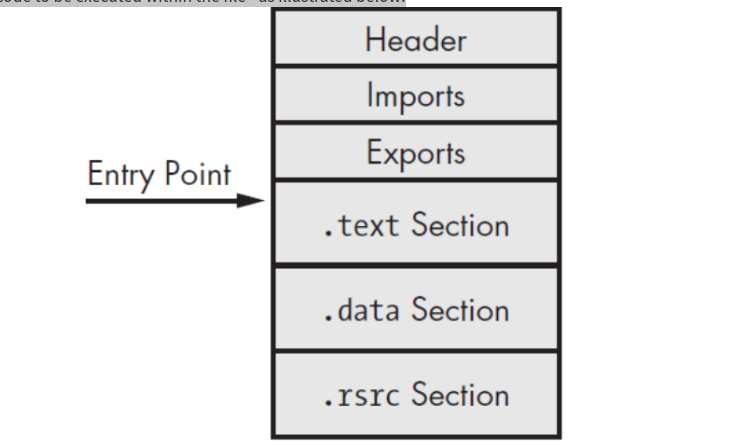
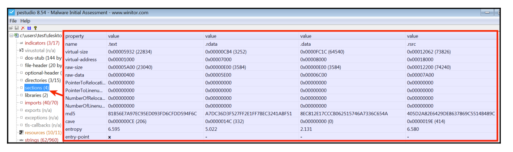
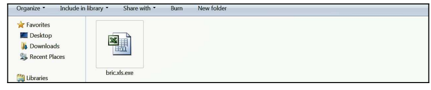
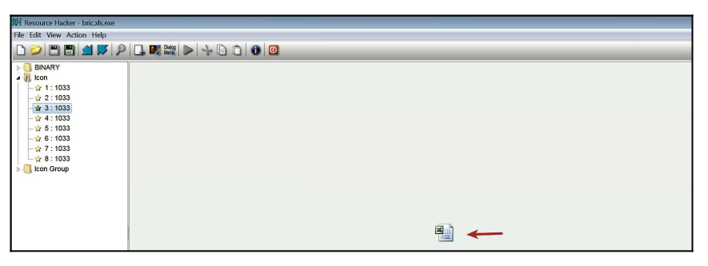
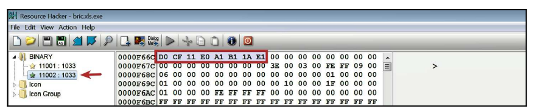
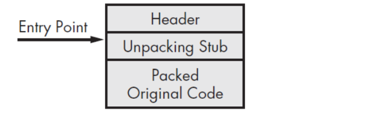
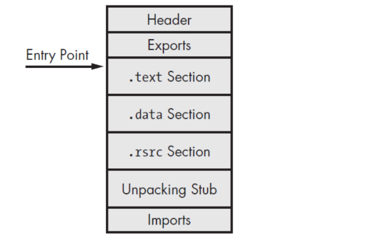

# CHAPTER 1
## 1. ¿Qué es el malware?
El malware es un código que realiza acciones maliciosas; puede tomar la forma de un ejecutable, un script, un código o cualquier otro software. Los atacantes utilizan malware para robar información confidencial, espiar el sistema infectado o tomar el control del sistema. Por lo general, accede al dispositivo sin nuestro consentimiento a través de varios canales de comunicación, como correo electrónico, web o unidades USB.


**Acciones maliciosas que realiza el malware:**
- Interrumpir el funcionamiento del ordenador.
- Robar información sensible, incluyendo datos personales, empresariales y financieros.
- Acceso no autorizado al sistema.
- Espiar.
- Enviar correos electrónicos de spam.
- Participar en ataques de denegación de servicio distribuido (DDoS).
- Bloquear los archivos del ordenador y exigir un rescate para liberarlos.

Malware es un término amplio que se refiere a diferentes tipos de programas maliciosos como troyanos, virus, gusanos y rootkits. Al realizar un análisis de malware, encontrarás con frecuencia diversos tipos de programas maliciosos. Algunos de ellos se categorizan según su funcionalidad y vectores de ataque, como se describe a continuación.

### Tipos de malware más comunes:
- **Virus:**  
Programa malicioso que se adjunta a un archivo legítimo y se propaga cuando se ejecuta el archivo infectado. Causa variedad de daños, como el eliminación de archivos, el robo de información o el bloqueo del sistema. Este Malware es capaz de copiarse a sí mismo y propagarse a otros ordenadores. Un virus necesita intervención del usuario, mientras que un gusano puede propagarse sin ella.

- **Gusano:**  
Son programas maliciosos que se propagan a través de redes y sistemas informáticos. Los gusanos pueden causar una sobrecarga en la red y ralentizar el rendimiento del sistema.

- **Troyano:**  
Malware que se disfraza de programa legítimo para engañar al usuario y que lo instale. Una vez instalado, puede realizar acciones maliciosas como robar datos sensibles, subir archivos al servidor del atacante o espiar a través de la webcam.

- **Backdoor / Remote Access Trojan (RAT) | Puerta trasera / Troyano de acceso remoto (RAT):**  
Tipo de troyano que permite al atacante acceder y ejecutar comandos en el sistema comprometido.

- **Adware:**  
Malware que muestra anuncios no deseados al usuario. Suele distribuirse junto con descargas gratuitas e incluso puede instalar software de manera forzada.

- **Botnet:**  
Conjunto de ordenadores infectados con el mismo malware (llamado bots), que esperan instrucciones del servidor de comando y control controlado por el atacante. El atacante puede ordenar a estos bots que realicen actividades maliciosas como ataques DDoS o envío masivo de spam.

- **Ladrón de información (Information stealer):**  
Malware diseñado para robar datos sensibles como credenciales bancarias o pulsaciones del teclado. Algunos ejemplos son los keyloggers, spyware, sniffers y form grabbers.

- **Ransomware:**  
Malware que mantiene el sistema como rehén, bloqueando el acceso al ordenador o cifrando los archivos del usuario y exigiendo un rescate para recuperarlos.

- **Rootkit:**  
Malware que otorga al atacante acceso privilegiado al sistema infectado y oculta su presencia o la de otros programas maliciosos. Los rootkits pueden permitir a los atacantes controlar el sistema y recopilar información sin ser detectados.

- **Downloader o Dropper:**  
Malware diseñado para descargar o instalar componentes maliciosos adicionales en el sistema.


## 2. Descripción general de la arquitectura del laboratorio


La arquitectura usada consiste en una **máquina física (llamada máquina host) que ejecuta Ubuntu Linux con instancias de máquina virtual Linux (Ubuntu Linux VM) y máquina virtual Windows (Windows VM)**. Estas máquinas virtuales se configurarán para ser parte de la misma red y utilizarán el modo de **configuración de red de Host-only** para que el malware no pueda comunicarse con Internet y así el tráfico de la red estará contenido en el entorno de laboratorio aislado.

La VM de Windows es donde se ejecutará el malware durante el análisis, y la VM de Linux se usará para monitorear el tráfico de red y será configurada para simular servicios de Internet (DNS, HTTP, etc.), para proporcionar una respuesta adecuada cuando el malware solicite estos servicios. Por ejemplo, la máquina virtual Linux se configurará de manera que cuando el malware solicite un servicio como DNS, la máquina virtual Linux proporcione la respuesta DNS adecuada. 

En esta configuración, la máquina virtual Linux estará preconfigurada en la dirección IP 192.168.1.100 y la dirección IP de la máquina virtual Windows se configurará en 192.168.1.x (donde x es cualquier número de 1 a 254 excepto 100). La puerta de enlace predeterminada y el DNS de la VM de Windows se configurarán en la dirección IP de la VM de Linux (es decir, 192.168.1.100) para que todo el tráfico de la red de Windows se enrute a través de la VM de Linux.

También es posible configurar un laboratorio compuesto por múltiples VMs ejecutando diferentes versiones de Windows; esto nos permitirá analizar la muestra de malware en varias versiones de sistemas operativos Windows.


## 3. Configuración de VM Linux
- Instalación de Ubuntu | Windows.
- Instalación de Virtual Guest Additions software.
- Configuración de Windows VM:
  - Deshabilitar Windows Update.
  - Deshabilitar Windows Defender 🠮  Services 🠮 Windows Defender 🠮 Boton derecho 🠮  Select poperties 🠮  Stop Service
  - Mostrar extensiones de ficheros 🠮 Opciones de carpeta 🠮 Ver 🠮  Mostrar extensiones para ficheros
  - Mostrar ficheros y carpetas ocultos.
  - Deshabilitar ASLR (Address Space Layout Randomization): ASLR (Address Space Layout Randomization) es una técnica de seguridad utilizada para dificultar los ataques de desbordamiento de búfer (buffer overflow) y otras vulnerabilidades de corrupción de memoria. La idea principal de ASLR es ubicar aleatoriamente en el espacio de direcciones de memoria las áreas clave de un proceso, como el ejecutable base, la pila, el montón y las librerías cargadas. Esto hace que las direcciones de memoria sean impredecibles para un atacante, dificultando la ejecución de código malicioso.
    🠮  Windows + R 🠮  regedit 🠮 Computer\HKEY_LOCAL_MACHINE\SISTEM\CurrentSet\Control\Session Manager\Memory Management 🠮  New Key 🠮 QWORD (32 bits) 🠮 poner como nombre: MoveImages
  - Deshabilitar Firewall 🠮 Windows Defender Firewall.
  - Crear un snapshot 🠮 HOST + T
- Instalación:
  ```
  sudo apt-get install python-pip
  pip install --upgrade pip
  sudo apt-get install python-magic
  sudo apt-get install upx
  sudo pip install pefile
  sudo apt-get install yara
  sudo pip install yara-python
  sudo apt-get install ssdeep
  sudo apt-get install build-essential libffi-dev python python-dev libfuzzy-dev
  sudo pip install ssdeep
  sudo apt-get install wireshark
  sudo apt-get install tshark
  ```
- INetSim (http://www.inetsim.org/index.html) is a powerful utility that allows simulating various Internet services (such as DNS, and HTTP):
  ```
  sudo su
  echo "deb http://www.inetsim.org/debian/ binary/" >  /etc/apt/sources.list.d/inetsim.list
  wget -O - http://www.inetsim.org/inetsim-archive-signing-key.asc | apt-key add -
  apt update
  apt-get install inetsim
  ```
- You can now isolate Ubuntu VM within your lab by configuring the virtual appliance to use Host-only network mode. On VMware, bring up the Network Adapter Settings and choose Host-only. File| Preferences | Network | Host-only networks | Add host-only network.
- IP address of 192.168.1.100 to the Ubuntu Linux VM.
- Configure INetSim so that it can listen to and simulate all the services on the configured IP address 192.168.1.100:
  ```
  sudo gedit /etc/inetsim/inetsim.conf
  # service_bind_address
  #
  # IP address to bind services to
  #
  # Syntax: service_bind_address <IP address>
  #
  # Default: 127.0.0.1
  #
  #service_bind_address 10.10.10.1
  service_bind_address 192.168.1.100
  #
  #dns_default_ip 10.10.10.1
  dns_default_ip 192.168.1.100
  ```
- Launch INetSim:
  ```
  sudo inetsim
  ```
- Take a snapshot: On Virtualbox, the same can be done by clicking on Machine | Take Snapshot. 🠮 Host + T

- Instalar Flare VM: Es una colección de scripts de instalación de software para sistemas Windows que permite configurar y mantener fácilmente un entorno de ingeniería inversa y análisis de malware en una máquina virtual.Las principales características de FLARE VM son:
  - Proporciona un conjunto curado de herramientas expertas para ingeniería inversa, análisis de malware, monitoreo, depuración, desensamblado, descompilación y más, todas preinstaladas y configuradas. Algunas herramientas incluidas son IDA, Binary Ninja, Radare2, OllyDbg, x64dbg, Ghidra, entre otras. (https://github.com/dnSpy/dnSpy)
  - Utiliza Chocolatey (un administrador de paquetes para Windows) y Boxstarter para automatizar la instalación y configuración de las herramientas en un entorno Windows virtualizado.
  - Está diseñado para instalarse únicamente en una máquina virtual Windows, no en un host físico, para permitir un análisis de malware seguro y contenido.
  - Proporciona un proceso de instalación, actualización y desinstalación simplificado a través de scripts de PowerShell.
  - Permite personalizar fácilmente las herramientas a instalar a través de una interfaz gráfica de usuario.
  - Es un proyecto de código abierto mantenido por el equipo FLARE de Mandiant/FireEye, con contribuciones de la comunidad.
  - Enlace: https://github.com/mandiant/flare-vm
  - Video con instruciones para instalar: https://www.youtube.com/watch?v=i8dCyy8WMKY
  - Desactivar: Windows Defender through Group Policy:
    - gpedit.msc
    - En el Editor de Directiva de Grupo, navegue a la siguiente ruta: Computer Configuration > Administrative Templates > Windows Components > Windows Defender Antivirus
    - Busque la configuración "Turn off Windows Defender Antivirus" (o "Desactivar Antivirus Windows Defender" en español).
    - Haga doble clic en ella para editarla.
    - Seleccione "Enabled" (Habilitado) y haga clic en "Apply" (Aplicar) y luego en "OK".
    - Cierre el Editor de Directiva de Grupo Local.
  - Computer Configuration > Administrative Templates > Windows Components > Microsoft Defender Antivirus > Real-time Protection > Enable Turn off real-time protection
  - Instalación: Desde la carpeta del master, ejecutar con PowerShell como administrador:
    - Set-ExecutionPolicy unrestricted
    - Si falla: Set-ExecutionPolicy -Scope      CurrentUser
      - unresticted
      - ./


## 4. Configuración de VM Windows
- Download Python from https://www.python.org/downloads/. Be sure to download Python 2.7.x (such as 2.7.13); most of the scripts used in this book are written to run on the Python 2.7 version and may not run correctly on Python 3.
- Configure your Windows VM to run in Host-only network configuration mode.
- Configure the IP address of the Windows VM to 192.168.1.x (choose any IP address except 192.168.1.100 because the Linux VM is set to use that IP) and set up your Default gateway and the DNS server to the IP address of Linux VM (that is, 192.168.1.100).
- Make sure they can communicate with each other. You can check for the connectivity by running the ping command launch the Local Group Policy Editor. In the left-hand pane of Local Group Policy Editor, navigate to Computer Configuration | Administrative Templates | Windows Components | Windows Defender. In the right-hand pane, doubleclick on the Turn off Windows Defender policy to edit it; then select Enabled and click on OK.


## 5. Malware Sources
- Hybrid Analysis: https://www.hybrid-analysis.com/
- KernelMode.info: http://www.kernelmode.info/forum/viewforum.php?f=16
- VirusBay: https://beta.virusbay.io/
- Contagio malware dump: http://contagiodump.blogspot.com/
- AVCaesar: https://avcaesar.malware.lu/
- Malwr: https://malwr.com/
- VirusShare: https://virusshare.com/
- theZoo: http://thezoo.morirt.com/

You can find links to various other malware sources in Lenny Zeltser's blog post https://zeltser.com/malware-sample-sources/.

-------------------------------------------------  
-------------------------------------------------  
# CHAPTER 2: Análisis estático
El análisis **estático es la técnica de analizar el archivo sospechoso sin ejecutarlo**. Es un método de análisis inicial que implica extraer información útil del binario sospechoso para tomar una decisión informada sobre **cómo clasificarlo o analizarlo** y dónde centrar sus esfuerzos de análisis posteriores.

**Aprenderemos:**
1. Identificar la arquitectura de destino del malware.  
2. Tomar huellas dactilares del malware.  
3. Escanear el binario sospechoso con motores antivirus.  
4. Extraer cadenas, funciones y metadatos asociados con el archivo.  
5. Identificar las técnicas de ofuscación utilizadas para frustrar el análisis.  
6. Clasificación y comparación de muestras de malware.

Estas técnicas pueden revelar información diferente sobre el archivo. No es necesario seguir todas estas técnicas y no es necesario seguirlas en el orden indicando anteriormente. La elección de las técnicas a utilizar depende de su objetivo y del contexto que rodea el archivo sospechoso.

## 1. Identificar la arquitectura de destino del malware: Determinar el tipo de fichero
Determinar el tipo de archivo de un binario sospechoso nos ayudará a **identificar el sistema operativo objetivo del malware** (Windows, Linux, etc.) **y la arquitectura** (plataformas de 32 o 64 bits). Por ejemplo, si el binario sospechoso tiene un **tipo de archivo Ejecutable Portátil (PE)**, que es el formato de archivo para archivos ejecutables de Windows (.exe, .dll, .sys, .drv, .com, .ocx, etc.), entonces podemos deducir que el archivo está diseñado para apuntar al sistema operativo Windows.

### Cómo se determina el tipo de fichero.
**1.1. Por la extensión:** .exe, .dll, .sys, .drv, .com, .ocx, etc.  

**1.2. Por la firma del archivo:** Se busca la firma del archivo abriéndolo en un editor hexadecimal. **Una firma de archivo es una secuencia única de bytes que se escribe en el encabezado del archivo.** Diferentes archivos tienen diferentes firmas, que pueden usarse para identificar el tipo de archivo. **Los archivos ejecutables de Windows, también llamados archivos PE**, **tienen una firma de archivo de MZ o caracteres hexadecimales 4D 5A enlos primeros dos bytes del archivo.**


En sistemas Linux, para buscar la firma del archivo se puede utilizar el comando ```xxd```, que genera un volcado hexadecimal del archivo:
```
xxd -g 1 log.exe | more
```

**1.3. Identificando el tipo de fichero usando herramientas:**
- En sistemas Linux, esto se puede lograr usando la utilidad ```file```. En el siguiente ejemplo, el comando file se ejecutó en dos archivos diferentes.
  - En el primer archivo que no tiene ninguna extensión, se detecta como un archivo ejecutable de 32 bits (PE32)
    ```
    $ file mini
    mini: PE32 executable (GUI) Intel 80386, for MS Windows
    ```
  - En el segundo archivo es un ejecutable de 64 bits (PE32+):
    ```
    $ file notepad.exe
    notepad.exe: PE32+ executable (GUI) x86-64, for MS Windows
    ```

- En Windows: Podemos usar CFF Explorer, que es parte de Explorer Suite (http://www.ntcore.com/exsuite.php).


**1.4. Identificando el tipo de fichero usando Python**
El módulo ```python-magic``` puede ser usado para identificar el tipo de fichero de un archivo.
```
$ python
Python 2.7.12 (default, Nov 19 2016, 06:48:10)
>>> import magic
>>> m = magic.open(magic.MAGIC_NONE)
>>> m.load()
>>> ftype = m.file(r'log.exe')
>>> print ftype
PE32 executable (GUI) Intel 80386, for MS Windows
```

-------------------------------------------------
## 2. Tomar huellas dactilares del malware: Fingerprinting the Malware

### ¿Qué es "Fingerprinting the Malware"?
Fingerprinting significa **identificar de forma única una pieza de malware** usando ciertas características técnicas que la distinguen de otras.

Es como sacarle la huella digital digital para poder:
- Detectarlo en otros sistemas.
- Compararlo con otras variantes.
- Crear reglas para antivirus o sistemas de detección.

**Fingerprinting:**  
El fingerprinting de malware es el proceso de recopilar información y características distintivas de un archivo malicioso, lo que permite a los analistas de seguridad y a las herramientas de protección identificar, clasificar y entender mejor el comportamiento del malware.

### Beneficios de tomar un fingerprint de un malware:
- **Identificación Única:** Al igual que las huellas dactilares humanas son únicas para cada individuo, el fingerprinting de malware permite identificar de manera única una muestra de malware, lo que facilita su seguimiento y detección en diferentes sistemas
- **Prevención de Fraudes y Autenticación:** El fingerprinting puede detectar patrones inusuales que podrían indicar una actividad sospechosa, como intentos de fraude o accesos no autorizados, y es una herramienta valiosa para la autenticación de usuarios y dispositivos
- **Investigación y Análisis Forense:** El fingerprinting es crucial para el análisis forense, ya que proporciona datos detallados sobre el malware que pueden ser utilizados para entender su origen, propósito y cómo se propaga
- **Desarrollo de Firmas de Antivirus:** La información recopilada a través del fingerprinting se utiliza para desarrollar firmas que los programas antivirus pueden usar para identificar y bloquear malware conocido.


### Huellas comunes que se analizan
| Tipo de fingerprint	| ¿Qué es? |
| -- | -- |
| **Hash (MD5, SHA-1, SHA-256)** | 	Identificadores únicos del archivo binario. Un simple cambio en el código genera un hash distinto. | 
| **Strings**	|  Cadenas de texto presentes en el malware (nombres de funciones, URLs, rutas, mensajes, etc.). | 
| **API calls** | 	Funciones del sistema operativo que el malware utiliza (ej: ```CreateRemoteThread, WriteProcessMemory```). | 
| **Comportamientos** | 	Acciones como persistencia, inyección de procesos, cifrado de archivos, comunicación con C2 (```comando y control```). | 
| **Ruta o nombre del archivo** | 	Algunos malware usan nombres o rutas repetidas. | 
| **Certificados digitales falsos** | 	A veces el malware usa firmas digitales maliciosas o robadas. | 
| **Firmas de red**	|  Patrones en el tráfico que genera (como DNS malicioso, peticiones HTTP anómalas...). | 


### Formas de Identificar de forma única una pieza de malware
#### 2.1. Hash del archivo:
- Checksum.
- Hash criptográfico.

✅ El checksum es una forma de fingerprint, pero muy básica.  
⚠️ En análisis serio de malware, siempre se usa hash criptográfico (como SHA-256).  
✅ El checksum puede ser útil como verificación rápida, pero no para identificar malware de forma segura.

El checksum, también conocido como **suma de verificación**, es un **valor calculado a partir de un conjunto de datos con el objetivo de verificar su integridad**. Es una forma de asegurarse de que los datos no han sido alterados, ya sea accidentalmente o de manera malintencionada, durante la transmisión o el almacenamiento.

El proceso de checksum implica **aplicar un algoritmo o función matemática a los datos originales para producir un valor hash o una cadena de caracteres**. Este valor hash es una representación compacta de los datos originales. Cuando los datos se transmiten o se almacenan junto con su checksum, cualquier parte que reciba o acceda a esos datos puede calcular de nuevo el checksum y compararlo con el valor original. Si los valores coinciden, se puede asumir que los datos no han sido modificados. Si los valores no coinciden, indica que los datos pueden haber sido corrompidos o alterados

**Usos de checksums:**  
- Verificación de la integridad de archivos descargados de Internet.
- Detección de errores en la transmisión de datos.
- Validación de la autenticidad de la información. Por ejemplo, al descargar un archivo, a menudo se proporciona un checksum (como SHA256sum) que el usuario puede verificar para asegurarse de que el archivo no ha sido dañado o modificado desde que fue publicado por el creador.

**Algoritmos de checksum:**  
- **Algoritnos simples como CRC32 o Adler-32**. No están diseñados para seguridad: son fácil de falsificar.
- **Hash criptográfico como MD5, SHA-1, SHA-256** que son un tipo de checksum mucho más seguro y único.


**¿Son infalibles los checksums?**  
Aunque los checksums son útiles para detectar cambios en los datos, no son infalibles y **no pueden garantizar la seguridad contra ataques maliciosos sofisticados, como los ataques de colisión,** donde dos conjuntos de datos diferentes pueden producir el mismo checksum


**Hash Collision:**  
Un hash collision, o colisión de hash, ocurre cuando dos piezas distintas de datos producen el mismo valor de hash al ser procesadas por una función de hash. Esto significa que, a pesar de que los datos de entrada son diferentes, el resultado de la función de hash es idéntico para ambos. Las funciones de hash están diseñadas para tomar datos de entrada de cualquier tamaño y producir un resultado de longitud fija, conocido como **valor de hash, que actúa como una representación digital de los datos originales.**

Las colisiones de hash son un fenómeno inherente a las funciones de hash debido al **principio del palomar**, que establece que si se tienen más palomas que palomares y cada paloma debe ser alojada en un palomar, al menos un palomar contendrá más de una paloma. De manera similar, dado que el número de posibles entradas para una función de hash es prácticamente infinito, pero el número de posibles resultados de hash es finito, eventualmente debe ocurrir que dos entradas diferentes produzcan el mismo hash.

Las colisiones de hash pueden tener implicaciones significativas en varios campos, especialmente en la criptografía y la seguridad informática. Por ejemplo, en la autenticación de datos o en la firma digital, **una colisión de hash podría permitir a un atacante crear datos falsificados que produzcan el mismo valor de hash que los datos originales y legítimos, comprometiendo así la integridad de los datos.**

Para mitigar el riesgo de colisiones de hash, se utilizan algoritmos de hash criptográficos diseñados para ser resistentes a colisiones, lo que significa que es computacionalmente inviable encontrar dos entradas diferentes que produzcan el mismo valor de hash. Sin embargo, **no existe un algoritmo de hash que pueda garantizar completamente la ausencia de colisiones debido a las limitaciones matemáticas y computacionales.**


**¿Se usa el checksum para fingerprinting?**
✅ Sí, pero con matices:
| Uso	| Checksum simple (CRC, etc.)	| Hash criptográfico (MD5, SHA-256)|
| -- | --| -- |
| Detección de integridad | 	✅ | 	✅ |
| Identificación de malware | 	❌ (no fiable) | 	✅ (muy común) |
| Comparación de archivos | 	❌ (colisiones posibles) | 	✅ |
| Seguridad o forense | 	❌ | 	✅ |


**Generando Cryptographic Hash de un malware:**  
Este proceso te permitirá obtener un identificador único para el archivo malicioso basado en su contenido, lo cual es útil para su análisis, identificación y comparación con bases de datos de malware conocido.
- En Windows:
  ```
  certUtil -hashfile nombreArchivo SHA256
  certUtil -hashfile nombreArchivo MD5 | SHA256 | SHA512
  Get-FileHash -Algorithm Sha256 nombreArchivo
  Get-FileHash -Algorithm MD5 | SHA256 | SHA512 nombreArchivo
  ```
- En Linux:
  ```
  sha256sum nombre_del_archivo
  ```
- En python:
  ```
  python
  Python 2.7.12 (default, Nov 19 2016, 06:48:10)
  >>> import hashlib
  >>> content = open(r"log.exe","rb").read()
  >>> print hashlib.md5(content).hexdigest()
  6e4e030fbd2ee786e1b6b758d5897316
  >>> print hashlib.sha256(content).hexdigest()
  01636faaae739655bf88b39d21834b7dac923386d2b52efb4142cb278061f97f
  >>> print hashlib.sha1(content).hexdigest()
  625644bacf83a889038e4a283d29204edc0e9b65
  ```

#### 2.2. Extraer Cadenas de texto (Strings)
Extraer strings legibles del ejecutable puede revelar:
- URLs de comando y control (C2).
- Mensajes de error.
- Frases tipo "your files have been encrypted".
- Nombres de funciones o variables.

📌 Herramientas: strings, BinText, Ghidra, PEStudio.


#### 2.3. Firmas de antivirus (AV signatures)
Bases de datos como VirusTotal o Hybrid Analysis asocian la muestra a una familia de malware específica.
- Ej: "Trojan:Win32/Emotet.CA"
- Estas firmas son una forma de fingerprint si son suficientemente específicas.


#### 2.4. Funciones/APIs utilizadas
La llamada a funciones del sistema operativo puede ser muy reveladora.
- API sospechosas: CreateRemoteThread, VirtualAllocEx, RegSetValueEx, etc.
- Algunas familias de malware tienen un patrón de llamadas único.

📌 Herramientas: PEStudio, Ghidra, IDA, CAPA


##### ⬅️⬅️⬅️Inspección de Dependencias de Archivos e Importaciones: ⬅️⬅️⬅️
Cuando analizamos qué funciones importa un ejecutable desde DLLs del sistema operativo, estamos viendo su huella funcional. Eso ayuda a:
- Detectar comportamientos: ¿quiere conectarse a red? ¿leer el registro? ¿crear procesos?.
- Asociar el malware a una familia conocida (muchos malware reusan los mismos patrones de importación).
- Crear reglas YARA o modelos de detección basados en esas dependencias.

**¿Qué tipo de importaciones se suelen revisar?**
| DLL común	| Funciones clave (APIs) |	¿Qué indica? |
| -- | -- | -- |
| kernel32.dll	| 	CreateFile, ReadFile, WriteFile		| Acceso a archivos |
| advapi32.dll	| 	RegOpenKey, RegSetValue, OpenService	| 	Registro de Windows, servicios |
| user32.dll	| 	MessageBox, GetAsyncKeyState	| 	Interacción con el usuario, keylogging |
| wininet.dll / ws2_32.dll	| 	InternetOpen, connect, send	| 	Conexión a red o C2 |
| ntdll.dll	| 	Funciones de bajo nivel	| 	Indicador de técnicas evasivas |


**Herramientas para inspección de importaciones:**
- PEStudio
- CFF Explorer
- Ghidra / IDA Pro (pestaña de imports)
- Dependency Walker
- ```objdump o pefile.py``` (en Linux o scripts)


**¿Cómo encaja la inspección de dependencias de srchivos e importaciones en el fingerprinting?**  
Las combinaciones de funciones importadas y DLLs usadas crean un patrón único o muy característico del malware. Por Ejemplo: Si un binario importa ```WriteProcessMemory, CreateRemoteThread, y VirtualAllocEx```, hay una alta probabilidad de que esté haciendo ```process injection```, una técnica común en muchos troyanos y rootkits.

Generalmente, el malware interactúa con archivos, registro, red, etc. Para realizar dichas interacciones, el malware depende frecuentemente de las funciones expuestas por el sistema operativo. Windows exporta la mayoría de sus funciones, llamadas **Interfaces de Programación de Aplicaciones (API)**, requeridas para estas interacciones en archivos de Biblioteca de Enlace Dinámico (DLL). Los ejecutables importan y llaman a estas funciones típicamente de varias DLL que proporcionan diferentes funcionalidades. Las funciones que un ejecutable importa de otros archivos (principalmente DLL) se denominan funciones importadas (o importaciones).

Por ejemplo, si un ejecutable de malware quiere crear un archivo en el disco, en Windows, puede usar una API CreateFile(), que se exporta en kernel32.dll. Para llamar a la API, primero tiene que cargar kernel32.dll en su memoria y luego llamar a la función CreateFile().

Inspeccionar las DLL en las que confía un malware y las funciones API que importa de las DLL puede dar una idea sobre la funcionalidad y capacidad del malware y qué anticipar durante su ejecución. Las dependencias de archivos en ejecutables de Windows se almacenan en la tabla de importaciones de la estructura del archivo PE.


Sometimes you might want to use Python to enumerate DLL files and imported functions (probably to work with a large number of files); this can be done using Ero Carerra's pefile module (https://github.com/erocarrera/pefile). The installation of the pefile module on Ubuntu Linux VM was covered in Chapter 1, Introduction to Malware Analysis. If you are using any other operating system, then it can be installed using pip (pip install pefile). The following Python script demonstrates the use of the pefile module to enumerate the DLLs and the imported API functions:

```
import pefile
import sys
mal_file = sys.argv[1]
pe = pefile.PE(mal_file)
if hasattr(pe, 'DIRECTORY_ENTRY_IMPORT'):
    for entry in pe.DIRECTORY_ENTRY_IMPORT:
        print "%s" % entry.dll
    for imp in entry.imports:
        if imp.name != None:
            print "\t%s" % (imp.name)
        else:
            print "\tord(%s)" % (str(imp.ordinal))
            print "\n"
```

The following is the result of running the preceding script against the spybot_packed.exe sample; from the output, you can see the list of DLLs and imported functions:
```
$ python enum_imports.py spybot_packed.exe
KERNEL32.DLL
 LoadLibraryA
 GetProcAddress
 VirtualProtect
 VirtualAlloc
 VirtualFree
 ExitProcess
ADVAPI32.DLL
 RegCloseKey
CRTDLL.DLL
 atoi
[...REMOVED....]
```

##### ⬅️⬅️⬅️Inspecting Exports:⬅️⬅️⬅️
El análisis de exports mira qué funciones expone el propio archivo malicioso (generalmente una DLL) para que otro proceso las use. Ver qué funciones exporta un archivo nos puede revelar:
- Qué hace el malware (sin ni siquiera ejecutarlo).
- Si se trata de una DLL maliciosa disfrazada (por ejemplo, una DLL side-loaded).
- Patrón de nombres característico de una familia de malware.

**Casos típicos de uso:**
- Ver nombres de funciones exportadas: pueden estar relacionados con manipulación del registro, controladores, persistencia, etc.
- Detectar técnicas como DLL Injection o DLL Hijacking.
- Saber si es una DLL legítima modificada o una creada desde cero.

**Herramientas útiles para analizar las exportaciones:**
- PEStudio → pestaña de "Exports".
- Ghidra / IDA Pro → pestaña "Exports".
- CFF Explorer.
- Python + pefile → como el ejemplo que diste

El ejecutable y la DLL pueden exportar funciones, que pueden ser utilizadas por otros programas. Típicamente, una DLL exporta funciones (exportaciones) que son importadas por el ejecutable. Una DLL no puede funcionar por sí sola y depende de un proceso anfitrión para ejecutar su código. Un atacante a menudo crea una DLL que exporta funciones que contienen funcionalidad maliciosa. Para ejecutar las funciones maliciosas dentro de la DLL, de alguna manera se hace que sea cargada por un proceso que llama a estas funciones maliciosas. Las DLL también pueden importar funciones de otras bibliotecas (DLL) para realizar operaciones del sistema.
Inspeccionar las funciones exportadas puede darte una idea rápida de las capacidades de la DLL. En el siguiente ejemplo, al cargar una DLL asociada con malware llamado Ramnit en pestudio, se muestran sus funciones exportadas, dando una indicación de sus capacidades. Cuando un proceso carga esta DLL, en algún momento, estas funciones serán llamadas para realizar actividades maliciosas:


In Python, the exported functions can be enumerated using the pefile module, as shown here:
```
$ python
Python 2.7.12 (default, Nov 19 2016, 06:48:10)
>>> import pefile
>>> pe = pefile.PE("rmn.dll")
>>> if hasattr(pe, 'DIRECTORY_ENTRY_EXPORT'):
... for exp in pe.DIRECTORY_ENTRY_EXPORT.symbols:
... print "%s" % exp.name
...
AddDriverPath
AddRegistryforME
CleanupDevice
CleanupDevice_EX
CreateBridgeRegistryfor2K
CreateFolder
CreateKey
CreateRegistry
DeleteDriverPath
DeleteOemFile
DeleteOemInfFile
DeleteRegistryforME
DuplicateFile
EditRegistry
EnumerateDevice
GetOS
[.....REMOVED....]
```
Esto enumeraría todas las funciones exportadas por la DLL, que nos daría pistas claras de DLLs que interactúan con el registro y realizan tareas potencialmente maliciosas:
- CreateRegistry.
- EditRegistry.
- CleanupDevice.


#### 2.5. Comportamiento dinámico
Observar qué hace al ejecutarse en un entorno controlado:
- Modificar el registro.
- Crear servicios.
- Se conecta a Internet.
- Instalar persistencia.
- Cifrar archivos

📌 Herramientas: Cuckoo Sandbox, ProcMon, Wireshark


#### 2.6. Tamaño del archivo y estructura PE
Algunos malware tienen tamaños característicos o estructuras inusuales:
- Tamaño total del binario
  - Algunos malware tienen tamaños muy característicos (demasiado pequeños, muy grandes, etc.).
  - Puede indicar uso de packers (empaquetadores).
- Número de secciones en el PE.
  - Nombres inusuales: .asdf, .textbss, etc.
  - Secciones adicionales: UPX, code, stub, etc.
  - Número de secciones (demasiadas o muy pocas).
- ✅ Cabecera PE (PE Header Information)
  - Timestamps.
  - Dirección de entrada (Entry Point).
  - Tabla de importación (IAT).
  - Versiones del compilador.
  - Firmas digitales.
  - Subsistema (GUI o consola).
  - Tamaño de cada sección.
  - Entropía (medida de aleatoriedad)

##### ⬅️⬅️⬅️Inspecting PE Header Information⬅️⬅️⬅️

**¿Qué es la cabecera PE?**  
El formato PE (Portable Executable) es la estructura de los ejecutables en Windows (.exe, .dll, etc.). La cabecera PE contiene metadatos clave que pueden ayudarte a identificar características únicas del malware.

**¿Qué elementos del PE Header se usan como "huella digital"?**
| Campo de la cabecera PE |	¿Por qué es útil en fingerprinting? |
| -- | -- |
| Timestamp de compilación  |		Puede identificar la fecha falsa usada por ciertas familias |
| Número y nombres de secciones |		.text, .data, .rdata, pero algunos malware usan .asdf, .xyz, etc. |
| Entrypoint (dirección de entrada |	)	Puede indicar empaquetadores o payloads ocultos |
| Import Table (IAT) |		Lista de funciones del sistema que el ejecutable usará |
| Versión del compilador |		Ayuda a saber con qué herramienta fue creado |
| Firmas digitales / certificados |	Algunos malware usan firmas falsas o robadas |


**Herramientas para inspeccionar cabeceras PE:**
- PEStudio → súper visual, destaca elementos sospechosos.
- Detect It Easy (DIE) → detecta si está empaquetado.
- CFF Explorer → análisis avanzado de PE.
-```objdump / readpe / pefile.py``` → para línea de comandos o scripts.


- Los ejecutables tienen lo que se llama un **punto de entrada (ENTRY POINT)**. Cuando se ejecuta, este punto de entrada es simplemente la ubicación de las primeras piezas de código que se van a ejecutar dentro del archivo, como se ilustra a continuación:
  
  

- Los ejecutables de Windows deben ajustarse al formato **PE/COFF (Portable Executable/Common Object File Format).** El formato de archivo PE es utilizado por los archivos ejecutables de Windows (tales como .exe, .dll, .sys, .ocx y .drv) y tales archivos generalmente se denominan archivos Portable Executable (PE). El archivo PE es una serie de estructuras y subcomponentes que contienen la información requerida por el sistema operativo para cargarlo en la memoria.
- Cuando un ejecutable se compila, incluye un encabezado (encabezado PE), que describe su estructura. Cuando se ejecuta el binario, el cargador del sistema operativo lee la información del encabezado PE y luego carga el contenido binario del archivo en la memoria. El encabezado PE contiene información como dónde necesita ser cargado el ejecutable en la memoria, la dirección donde comienza la ejecución, la lista de bibliotecas/funciones en las que se basa la aplicación, y los recursos utilizados por el binario. Examinar el encabezado PE proporciona una gran cantidad de información sobre el binario y sus funcionalidades.
- Inspecting PE Header Information se refiere a examinar la información contenida en el encabezado de un archivo ejecutable Portable Executable (PE) en sistemas Windows. El encabezado PE es una estructura de datos importante que contiene información esencial sobre cómo el sistema operativo debe cargar y manejar el archivo ejecutable o la biblioteca de enlace dinámico (DLL).
- La **entropía de un archivo** es una medida de la cantidad de aleatoriedad o incertidumbre que contiene. En el contexto de un Ejecutable Portátil (PE), una alta entropía puede ser indicativa de que el archivo ha sido comprimido o cifrado, lo cual es una técnica comúnmente utilizada por el malware para ocultar su código y evitar la detección por parte de herramientas de seguridad. Por lo tanto, la entropía es una característica prominente que las herramientas de análisis de malware buscan al evaluar la sospechosidad de un archivo. Si un archivo PE tiene una entropía inusualmente alta, podría ser un indicador de que contiene código malicioso o que ha sido manipulado para esconder su verdadera naturaleza. La entropía de un archivo es una clasificación que califica qué tan aleatorios son los datos dentro de un archivo PE. Con una escala del 0 al 8, donde 0 significa menos "aleatoriedad" de los datos en el archivo, y un puntaje hacia 8 indica que estos datos son más "aleatorios".
- Los autores de malware utilizan técnicas como la encriptación o el empaquetado para ofuscar su código e intentar eludir el antivirus. Debido a esto, estos archivos tendrán una entropía alta.
- Cuando **inspeccionas el encabezado PE, generalmente buscas detalles como:**
  - Tipo de Archivo: Determinar si el archivo es un ejecutable, una DLL, un controlador del sistema, entre otros.
  - Punto de Entrada: La ubicación en el código donde el sistema operativo comienza a ejecutar el programa.
  - Secciones del Archivo: Información sobre las diferentes secciones del archivo, como código, datos y recursos.
  - Dependencias de la Biblioteca: Qué otras bibliotecas (DLLs) necesita el ejecutable para funcionar.
  - Información de la Plataforma: Para qué arquitectura de hardware está diseñado el archivo (por ejemplo, x86, x64).
  - Firmas Digitales: Para verificar la autenticidad y la integridad del archivo.

- **Resources for understanding the PE file structure:**
  - An In-Depth Look into the Win32 Portable Executable File Format - Part 1:
  http://www.delphibasics.info/home/delphibasicsarticles/anindepthlookintothewin32portableexecutablefileformat-part1
  - An In-Depth Look into the Win32 Portable Executable File Format - Part 2:
  http://www.delphibasics.info/home/delphibasicsarticles/anindepthlookintothewin32portableexecutablefileformat-part2
  - PE Headers and structures: http://www.openrce.org/reference_library/files/reference/PE%20Format.pdf
  - PE101 - A Windows Executable Walkthrough: https://github.com/corkami/pics/blob/master/binary/pe101/pe101.pdf

- **Tools that allow you to examine and modify the PE structure and its sub-components:**
  - CFF Explorer: http://www.ntcore.com/exsuite.php
  - PE Internals: http://www.andreybazhan.com/pe-internals.html
  - PPEE(puppy): https://www.mzrst.com/
  - PEBrowse Professional: http://www.smidgeonsoft.prohosting.com/pebrowsepro-file-viewer.html


- A tool such as **pestudio** (https://www.winitor.com) or **PPEE** (puppy: https://www.mzrst.com/) can assist you with exploring interesting artifacts from the PE file.

- **Comando pecheck:** El comando pecheck es una herramienta de análisis de archivos PE (Portable Executable) desarrollada por Didier Stevens. Cuando se ejecuta pecheck en un archivo PE, la herramienta examina el archivo y proporciona un informe que incluye información sobre las siguientes estructuras y elementos:
  - DOS Header: La cabecera inicial que está presente para mantener la compatibilidad con aplicaciones DOS antiguas.
  - PE Header: La cabecera que sigue al DOS Header y contiene metadatos esenciales sobre el archivo ejecutable, como la arquitectura de la máquina para la que está compilado (x86, x64, etc.) y los puntos de entrada del programa.
  - Optional Header: Una sección del PE Header que proporciona información adicional necesaria para la carga del ejecutable, como la dirección base de la imagen, la alineación de las secciones y el punto de entrada del programa.
  - Section Headers: Las cabeceras de las secciones del archivo que describen cómo se organizan los datos y el código dentro del archivo PE.
  - Data Directories: Partes del Optional Header que contienen punteros a estructuras de datos importantes como la tabla de importaciones y exportaciones, recursos y más.

- **Utilidad pe-tree:** pe-tree es una herramienta de análisis de archivos Portable Executable (PE) diseñada para proporcionar una vista estructurada y jerárquica de los componentes internos de los archivos PE.
  - Vista Jerárquica: pe-tree presenta la información del archivo PE en una estructura de árbol, lo que permite a los usuarios expandir y colapsar secciones para explorar detalles específicos de manera eficiente. Esto incluye cabeceras, secciones, tablas de importación/exportación, recursos y más.
  - Análisis de Secciones y Cabeceras: La herramienta analiza y muestra información detallada sobre las cabeceras PE, incluyendo el DOS Header, PE Header, Optional Header, y Section Headers. Esto es crucial para entender la configuración y el comportamiento potencial del archivo.
  - Identificación de Anomalías: pe-tree puede ayudar a identificar características inusuales o sospechosas en los archivos PE, como secciones ocultas, configuraciones anómalas en las cabeceras, o firmas digitales inválidas.
  - Integración con Herramientas de Análisis de Malware: pe-tree puede integrarse con otras herramientas y plataformas de análisis de malware para proporcionar una visión más completa del archivo analizado. Esto puede incluir la extracción y análisis de cadenas, así como la identificación de patrones de código malicioso.


- **Analazing PE Header en windows con CFF Explorer:** https://ntcore.com/explorer-suite/


##### ⬅️⬅️⬅️ Examining PE Section Table And Sections  ⬅️⬅️⬅️
El contenido real del archivo PE está dividido en secciones. Estas secciones son inmediatamente seguidas por el encabezado PE. Estas secciones representan ya sea código o datos y tienen atributos en memoria como lectura/escritura. La sección que representa código contiene instrucciones que serán ejecutadas por el procesador, mientras que la sección que contiene datos puede representar diferentes tipos de datos, como datos de programa de lectura/escritura (variables globales), tablas de importación/exportación, recursos, etc. Cada sección tiene un nombre distintivo que transmite el propósito de la sección.

**Secciones en un PE File:**
- .text || CODE: Contiene el código ejecutable. Tiene un atributo de lectura-ejecución.
- .data || DATA: Contiene datos y variables globales. Tiene un atributo de lectura-escritura.
- .rdata: Contiene datos de solo lectura. A veces también contiene información de importación y exportación.
- .idata: Si está presente, contiene la tabla de importación. Si no está presente, entonces la información de importación se almacena en la sección .rdata.
- .edata: Si está presente, contiene información de exportación. Si no está presente, entonces la información de exportación se encuentra en la sección .rdata.
- .rsrc: Esta sección contiene los recursos utilizados por el ejecutable, como íconos, diálogos, menús, cadenas, y así sucesivamente.


**📦 Secciones comunes y su significado**
| Sección |	Función principal |	Riesgo si mal usada |
| -- | -- | -- |
| .text | 	Código ejecutable (instrucciones del programa) | 	✅ Normal, pero puede ocultar shellcode |
| .data | 	Variables globales (lectura/escritura) | 	⚠️ Riesgo si contiene código o C2 info |
| .rdata | 	Datos de solo lectura (a veces import/export info) | 	⚠️ Puede esconder strings maliciosas |
| .idata | 	Tabla de importación | 	✅ Útil para fingerprinting API usage |
| .edata | 	Tabla de exportación | 	✅ Relevante si es una DLL |
| .rsrc | 	Recursos (íconos, diálogos, cadenas, etc.) | 	⚠️ Puede contener payloads cifrados |
| .reloc | 	Información de reubicación de direcciones | 	Rara vez usada por malware |
| .UPX | 	Sección típica de ejecutables empaquetados | 	🚨 Puede ocultar comportamiento real |


Estos nombres de sección son principalmente para humanos y no son utilizados por el sistema operativo, lo que significa que **es posible para un atacante o un software de ofuscación crear secciones con nombres diferentes.** Si nos encuentramos con nombres de sección que no son comunes, entonces debemos tratarlos con sospecha, y se requiere un análisis adicional para confirmar su malicia. La información sobre estas secciones (como el nombre de la sección, dónde encontrar la sección y sus características) está presente en la tabla de secciones en el encabezado PE. Examinar una tabla de secciones proporcionará información sobre la sección y sus características. Cuando cargamos un ejecutable en pestudio y hacemos clic en secciones, muestra la información de la sección extraída de la tabla de secciones y sus atributos (lectura/escritura, etc.). 

**Campo / Descripcion:**
- Names: Displays section names. In this case, the executable contains four sections (.text,.data, .rdata and .rsrc).
- Virtual-Size: Indicates the size of the section when loaded into memory.
- Virtual-Address: This is the relative virtual address (that is, offset from the base address of the executable) where the section can be found in memory.
- Raw-size: Indicates the size of the section on the disk.
- Raw-data: Indicates the offset in the file where the section can be found.
- Entry-point: This is the RVA (relative virtual address) where the code starts executing. In this case, the entry point is in the .text section, which is normal. 



**Discrepancias:**
- Los nombres de las secciones no contienen secciones comunes añadidas por el compilador (como .text, .data, y así sucesivamente) sino que contienen nombres de sección UPX0 y UPX1.
- El punto de entrada está en la sección UPX1, lo que indica que la ejecución comenzará en esta sección (rutina de descompresión).
- Normalmente, el tamaño en bruto (raw-size) y el tamaño virtual (virtual-size) deberían ser casi iguales, pero pequeñas diferencias son normales debido al alineamiento de secciones. En este caso, el tamaño en bruto es 0, indicando que esta sección no ocupará espacio en el disco, pero el tamaño virtual especifica que, en memoria, ocupa más espacio (alrededor de 127 kb). Esto es una fuerte indicación de un binario empaquetado. La razón de esta discrepancia es que cuando se ejecuta un binario empaquetado, la rutina de descompresión del empaquetador copiará datos o instrucciones descomprimidas en la memoria durante el tiempo de ejecución.


**🛠️ Herramientas para inspección de secciones PE**
- EStudio → muestra secciones con permisos, entropía, tamaño, etc.
- Detect It Easy (DIE) → identifica empaquetadores y secciones.
- Ghidra / IDA Pro → muestra secciones y te permite analizarlas.
- CFF Explorer → análisis visual del PE Header + secciones.


### Herramienta pescanner
pescanner, creado por Michael Ligh y Glenn P. Edwards, es una excelente herramienta para detectar archivos PE sospechosos basados en los atributos del archivo PE; utiliza heurísticas en lugar de firmas y puede ayudarte a identificar binarios empaquetados incluso si no hay firmas para ello. Se puede descargar una copia del script desde https://github.com/hiddenillusion/AnalyzePE/blob/master/pescanner.py.


##### ⬅️⬅️⬅️ Examinando el Compilation Timestamp ⬅️⬅️⬅️ 
El encabezado PE contiene información que especifica cuándo se compiló el binario; examinar este campo puede dar una idea de cuándo se creó inicialmente el malware. Esta información puede ser útil para construir una línea de tiempo de la campaña de ataque. También es posible que un atacante modifique la marca de tiempo para evitar que un analista conozca la marca de tiempo real. A veces, una marca de tiempo de compilación puede usarse para clasificar muestras sospechosas.

El Compilation Timestamp es un valor que se encuentra en la cabecera PE del archivo (IMAGE_FILE_HEADER.TimeDateStamp). Está en formato UNIX timestamp (número de segundos desde 1970).

✅ Nos permite:
- Construir líneas de tiempo de campañas de malware.
- Agrupar muestras por periodos o builds (compilaciones).
- Detectar malware falsamente fechado (si se repite un timestamp en muchas muestras).
- Correlacionar con eventos (por ejemplo: ataques de cierta fecha).
- Identificar muestras que usan timestamps falsos clásicos (como el famoso 0x2A425E19 que corresponde a 2001 pero se ha usado en muchas muestras modificadas).


##### ⬅️⬅️⬅️ Examinando PE Resources ⬅️⬅️⬅️ 
Los recursos requeridos por el archivo ejecutable, como iconos, menús, diálogos y cadenas, se almacenan en la sección de recursos (.rsrc) de un archivo ejecutable. A menudo, los atacantes almacenan información como binarios adicionales, documentos señuelo y datos de configuración en la sección de recursos, por lo que examinar los recursos puede revelar información valiosa sobre un binario. La sección de recursos también contiene información de versión que puede revelar detalles sobre el origen, el nombre de la empresa, los detalles del autor del programa y la información de copyright.

Resource Hacker (http://www.angusj.com/resourcehacker/) es una excelente herramienta para examinar, ver y extraer los recursos de un binario sospechoso.
Notice how the file extension is changed to .xls.exe ⟶



Loading a malicious binary in resource hacker shows three resources (Icon, Binary, and Icon Group). The malware specimen uses the icon of Microsoft Excel (to give the appearance of an excel sheet):



El ejecutable también contiene datos binarios; uno de ellos tiene una firma de archivo de D0 CF 11 E0 A1 B1 1A E1. Esta secuencia de bytes representa la firma de archivo para un archivo de documento de Microsoft Office. Los atacantes, en este caso, almacenaron una hoja de cálculo de Excel falsa en la sección de recursos. Al ejecutarse, el malware se ejecuta en segundo plano, y esta hoja de cálculo falsa se muestra al usuario como una distracción:




#### 2.7. YARA rules (firmas personalizadas)
Reglas personalizadas que combinan varios indicadores (strings, APIs, offsets…).
- Muy útiles para detectar familias completas de malware o variantes similares.

```
rule Petya_MBR
{
  strings:
    $a = "Your files are encrypted"
    $b = { E8 ?? ?? ?? ?? 83 C4 04 }
  condition:
    $a and $b
}
```

#### 2.8. Nombre del archivo / ubicación típica
- Algunos malware siempre se copia como svchost.exe en %AppData%
- No es único, pero puede ayudar al fingerprinting de campañas específicas.


#### 2.9. Metadatos del binario
- Timestamp de compilación.
- Nombre del compilador.
- Certificado digital (si lo hay).

📌 Herramientas: PEStudio, ExifTool, SigCheck


#### 2.10. Tráfico de red (Network signature)
- Hostnames o IPs de C2.
- Peticiones HTTP específicas.
- DNS maliciosos

📌 Herramientas: Wireshark, Suricata, Zeek


-------------------------------------------------
## 3. Escanear el binario sospechoso con motores antivirus: Multiple Anti-Virus Scanning
Escanear el binario sospechoso con varios escáneres antivirus ayuda a determinar si existen firmas de código malicioso para el archivo sospechoso. El nombre de la firma de un archivo en particular puede proporcionar información adicional sobre el archivo y sus capacidades. Al visitar los sitios web de los respectivos proveedores de antivirus o buscar la firma en los motores de búsqueda, puede obtener más detalles sobre el archivo sospechoso. Esta información puede ayudarle en su investigación posterior y puede reducir el tiempo de análisis.

### Virus Total
VirusTotal es una herramienta en línea gratuita que se utiliza para analizar archivos y URLs en busca de virus, gusanos, troyanos y otros tipos de malware. La plataforma utiliza más de 70 motores antivirus y anti-malware para escanear y proporcionar un informe detallado sobre cualquier amenaza detectada.

Para usar VirusTotal para escanear un malware, puedes seguir estos pasos:
- Subir el Archivo o URL Sospechosa: Accede a la página web de VirusTotal y selecciona la opción para subir el archivo que deseas analizar o ingresa la URL que quieres verificar
- Análisis Automático: Una vez que el archivo o URL ha sido subido, VirusTotal lo analizará automáticamente utilizando sus múltiples motores antivirus y te proporcionará un informe con los resultados
- Interpretar los Resultados: El informe incluirá una lista de todos los motores antivirus que analizaron el archivo y sus resultados. Si alguno de los motores detecta una amenaza, el informe indicará el nombre de la amenaza y proporcionará información adicional sobre ella
- Evaluar la Confiabilidad: Es importante tener en cuenta que aunque VirusTotal es una herramienta valiosa, no es infalible y no garantiza una protección completa contra el malware. Por lo tanto, se recomienda utilizar una variedad de herramientas de seguridad y seguir las mejores prácticas de seguridad cibernética
- Uso de la API Pública: Para usuarios avanzados o para integraciones automáticas, VirusTotal ofrece una API pública que permite enviar muestras y recibir informes de análisis de manera programática
- Herramientas Adicionales: Además de la página web, existen herramientas como VirusTotal Uploader y aplicaciones para dispositivos móviles que facilitan el envío de archivos y URLs a VirusTotal para su análisis

## Querying Hash Values Using VirusTotal
Para consultar valores de hash utilizando VirusTotal, puedes seguir estos pasos:
- Obtener un Hash de Archivo: Primero, necesitas el hash del archivo que deseas consultar. Los hashes permitidos son MD5, SHA1 y SHA256
- Acceder a VirusTotal: Ve a la página web de VirusTotal (https://www.virustotal.com/).
- Ingresar el Hash en la Búsqueda: Utiliza la barra de búsqueda de VirusTotal para ingresar el hash del archivo. Asegúrate de que el hash corresponda a uno de los formatos permitidos (MD5, SHA1, SHA256).
- Revisar el Informe: Después de buscar el hash, VirusTotal te mostrará el último informe disponible para ese archivo. Si el archivo ha sido analizado previamente, podrás ver los resultados de los diferentes motores antivirus y otra información relevante
- Uso de la API de VirusTotal: Si prefieres automatizar el proceso o realizar consultas en masa, puedes utilizar la API pública de VirusTotal. Necesitarás una clave API que puedes obtener creando una cuenta en VirusTotal.
- Ejemplo de Uso de la API con cURL:
  ```
  curl --request POST \
  --url 'https://www.virustotal.com/vtapi/v2/file/report' \
  -d apikey=$your-api-key \
  -d 'resource=$your-file-hash'
  ```
  Reemplaza $your-api-key con tu clave API y $your-file-hash con el hash del archivo que deseas consultar.
  
- Ejemplo de Uso de la API con Python:
  ```
  python
  import requests
  
  url = 'https://www.virustotal.com/vtapi/v2/file/report'
  params = {'apikey': 'tu_clave_api', 'resource': 'hash_del_archivo'}
  response = requests.post(url, data=params)
  print(response.json())
  ```
  Reemplaza 'tu_clave_api' con tu clave API y 'hash_del_archivo' con el hash del archivo que deseas consultar.
  
Nota: La API pública de VirusTotal tiene una limitación de cuatro consultas por minuto. Si necesitamos realizar un mayor volumen de consultas o acceder a información más detallada, tendremos que considerar usar la API privada de VirusTotal o el servicio premium VirusTotal Intelligence.


- Otro script:
  ```
  import urllib
  import urllib2
  import json
  import sys

  hash_value = sys.argv[1]
  vt_url = "https://www.virustotal.com/vtapi/v2/file/report"
  api_key = "<update your api key here>"
  parameters = {'apikey': api_key, 'resource': hash_value}
  encoded_parameters = urllib.urlencode(parameters)
  request = urllib2.Request(vt_url, encoded_parameters)
  response = urllib2.urlopen(request)
  json_response = json.loads(response.read())
  if json_response['response_code']:
    detections = json_response['positives']
    total = json_response['total']
    scan_results = json_response['scans']
    print "Detections: %s/%s" % (detections, total)
    print "VirusTotal Results:"
    for av_name, av_data in scan_results.items():
      print "\t%s ==> %s" % (av_name, av_data['result'])
  else:
    print "No AV Detections For: %s" % hash_value
  ```
  Running the preceding script by giving it an MD5 hash of a binary shows the antivirus detections and the signature names for the binary.
  ```
  md5sum 5340.exe
  5340fcfb3d2fa263c280e9659d13ba93 5340.exe

  python vt_hash_query.py 5340fcfb3d2fa263c280e9659d13ba93
  Detections: 44/56
  VirusTotal Results:
     Bkav ==> None
     MicroWorld-eScan ==> Trojan.Generic.11318045
     nProtect ==> Trojan/W32.Agent.105472.SJ
     CMC ==> None
     CAT-QuickHeal ==> Trojan.Agen.r4
     ALYac ==> Trojan.Generic.11318045
     Malwarebytes ==> None
     Zillya ==> None
     SUPERAntiSpyware ==> None
     TheHacker ==> None
     K7GW ==> Trojan ( 001d37dc1 )
     K7AntiVirus ==> Trojan ( 001d37dc1 )
     NANO-Antivirus ==> Trojan.Win32.Agent.cxbxiy
     F-Prot ==> W32/Etumbot.K
     Symantec ==> Trojan.Zbot
     [.........Removed..............]

  ```
  
- Usando la herramienta PEstudio (https://www.winitor.com/) o la herramienta PPEE (https://www.mzrst.com/).
- Online scanners such as VirSCAN (http://www.virscan.org/), Jotti Malware Scan (https://virusscan.jotti.org/), and OPSWAT's Metadefender (https://www.metadefender.com/#!/scan-file) allow you to scan a suspect file with multiple anti-virus scanning engines, and some of them also allow you to do hash lookups.
- Consideracuiones a tener en cuenta cuando subimos un binario a un scanner online: Aunque los escáneres antivirus y los servicios de escaneo en línea son herramientas útiles para identificar malware, existen limitaciones y riesgos asociados con su uso. Es crucial ser consciente de estos riesgos, especialmente en lo que respecta a la confidencialidad de la información y la posibilidad de que los atacantes adapten sus métodos para evadir la detección.
  - Detección no garantizada: Los autores de malware pueden modificar su código y emplear técnicas de ofuscación para evadir estas detecciones, lo que puede resultar en que algunos motores antivirus no logren identificar el archivo como malicioso. Esto se debe a que las técnicas de ofuscación y metamorfismo pueden cambiar la apariencia del código malicioso sin alterar su funcionalidad, dificultando su detección basada en firmas.
  - Riesgos de compartir binarios: Al subir un archivo binario a un sitio público, existe el riesgo de que este archivo se comparta con terceros y proveedores. Si el archivo binario contiene información sensible, personal o propiedad de una organización, no es recomendable enviarlo a servicios públicos de escaneo antivirus, especialmente si es parte de una investigación confidencial. Esto se debe a que el archivo podría contener datos críticos que no deberían ser expuesto.
  - Uso de valores hash criptográficos: Como alternativa a la presentación del archivo binario, la mayoría de los servicios de escaneo antivirus en línea permiten buscar en su base de datos de archivos escaneados utilizando valores hash criptográficos (MD5, SHA1 o SHA256). Esto significa que en lugar de subir el archivo completo, se puede buscar utilizando el hash criptográfico del archivo, lo que reduce el riesgo de exponer información sensible.


-------------------------------------------------
## 4. Extraer cadenas, funciones y metadatos asociados con el archivo: Extracting Strings
La extracción de cadenas de un fichero ejecutable es un proceso utilizado en el análisis de malware y en la ingeniería inversa de software para **identificar y extraer secuencias de caracteres legibles (cadenas) dentro de un archivo binario**. Este proceso es fundamental para entender el comportamiento potencial de un programa sin necesidad de ejecutarlo o analizar su código fuente, que puede no estar disponible. Las cadenas pueden incluir rutas de archivos, mensajes de error, URLs de servidores de comando y control (C&C), claves de cifrado, y otros indicadores de compromiso (IoCs) que son útiles para el análisis de seguridad.

Las **cadenas son secuencias de caracteres imprimibles en ASCII y Unicode incrustadas en un archivo.**
La extracción de cadenas puede dar pistas sobre la funcionalidad del programa y los indicadores asociados con un binario sospechoso. Por ejemplo, si un malware crea un archivo, el nombre del archivo se almacena como una cadena en el binario. También si un malware resuelve un nombre de dominio controlado por el atacante, entonces el nombre de dominio se almacena como una cadena. Las cadenas extraídas del binario pueden contener **referencias a nombres de archivos, URL, nombres de dominio, direcciones IP, comandos de ataque, claves de registro, etc**. Aunque las cadenas no dan una idea clara del propósito y la capacidad de un archivo, pueden dar una **pista sobre lo que el malware es capaz de hacer.**


### 4.1 Extraer Cadenas usando herramientas
**Herramientas para la extracción de cadenas de archivos ejecutables:**
- Strings: Disponible en sistemas Unix y Windows, es una herramienta de línea de comandos que busca secuencias de caracteres ASCII o Unicode que son al menos de una longitud mínima especificada (por defecto, 4 caracteres). El comando strings, por defecto, extrae las cadenas ASCII que tienen al menos cuatro caracteres de largo. Con la opción -a es posible extraer cadenas de todo el archivo.
  ```
  strings -a log.exe
  ```
  Especímenes de malware también utilizan cadenas Unicode (2 bytes por carácter). Para obtener información útil del binario, a veces necesitas extraer tanto cadenas ASCII como Unicode. Para extraer cadenas Unicode usando el comando strings, usamos la opción -el.
  ```
  strings -a -el log.exe
  ```

- Binwalk: Aunque es más conocida por su capacidad para analizar y extraer firmware, también puede ser utilizada para extraer cadenas.
- HEx Editors: Permiten visualizar y editar el contenido binario de un archivo, incluyendo la extracción manual de cadenas.
- En Windows, pestudio (https://www.winitor.com) es una herramienta útil que muestra cadenas ASCII y Unicode. pestudio es una excelente herramienta de análisis de PE para realizar pruebas iniciales evaluación de malware de un binario sospechoso y está diseñado para recuperar varios elementos útiles.
- También en windows se puede usar el comando strings de sysinternals y PPEE (https://www.mzrst.com/).


**Proceso de Extracción:** La herramienta seleccionada lee el archivo binario y busca secuencias de caracteres que coincidan con patrones de cadenas legibles. Estas cadenas se extraen y se presentan al analista para su revisión.

**Análisis de las Cadenas:** Una vez extraídas, las cadenas pueden ser analizadas para buscar información relevante que pueda indicar el propósito del archivo ejecutable, incluyendo:
  - Direcciones IP y URLs que pueden señalar a servidores de C&C.
  - Rutas de archivos específicos que el malware intenta modificar o leer.
  - Mensajes de error o logs que el malware genera.
  - Referencias a librerías específicas o llamadas al sistema que indican cómo interactúa el malware con el sistema operativo.


### 4.2 Decoding Obfuscated Strings Using FLOSS
La mayoría de las veces, los autores de malware utilizan técnicas simples de ofuscación de cadenas para evitar la detección. En tales casos, esas cadenas ofuscadas no aparecerán en la utilidad de cadenas ni en otras herramientas de extracción de cadenas. **FireEye Labs Ofuscated String Solver (FLOSS)** es una herramienta diseñada para **identificar y extraer automáticamente cadenas ofuscadas de malware**. Puede ayudarle a determinar las cadenas que los autores de malware quieren ocultar de las herramientas de extracción de cadenas.

FLOSS también se puede utilizar como la utilidad de cadenas para **extraer cadenas legibles por humanos (ASCII y Unicode)**. Puede descargar FLOSS para Windows o Linux desde https://github.com/fireeye/flare-floss.
```
sudo apt install python3-venv python3-full
mkdir ~/miENV
python3.12 -m venv miENV


git clone https://github.com/mandiant/flare-floss.git
cd flare-floss
python setup.py install
```


Otra forma de instalar flare-floss en linux:
```
python3.11 -m venv venv
source venv/bin/activate
pip3.11 install flare-floss
floss program.exe > analisis-floss.txt
```


En el siguiente ejemplo, no sólo se han extraido las cadenas legibles por humanos, sino que también decodificó las cadenas ofuscadas y extrajo las cadenas de la pila que la utilidad de cadenas y otras herramientas de extracción de cadenas no detectaron. El siguiente resultado muestra una referencia a un ejecutable, un archivo de Excel y una clave de registro de ejecución:
```
$ chmod +x floss
$ ./floss 5340.exe
FLOSS static ASCII strings
!This program cannot be run in DOS mode.
Rich
.text
`.rdata
@.data
[..removed..]
FLOSS decoded 15 strings
kb71271.log
R6002
- floating point not loaded
\Microsoft
winlogdate.exe
~tasyd3.xls
[....REMOVED....]
FLOSS extracted 13 stack strings
BINARY
ka4a8213.log
afjlfjsskjfslkfjsdlkf
'Clt
~tasyd3.xls
"%s"="%s"
regedit /s %s
[HKEY_CURRENT_USER\Software\Microsoft\Windows\CurrentVersion\Run]
[.....REMOVED......]
```

Si solo está interesado en las **cadenas decodificadas/apiladas y desea excluir las cadenas estáticas (ASCII y Unicode)** de la salida FLOSS, proporcione el modificador --no-static-strings.

https://www.mandiant.com/resources/blog/automatically-extracting-obfuscated-strings


**Análisis de los Resultados:** FLOSS mostrará las cadenas ofuscadas que ha logrado identificar y extraer. Estas cadenas pueden incluir direcciones IP, URLs, nombres de dominio, claves de cifrado, y otros datos que el malware utiliza en sus operaciones. Es importante analizar estas cadenas en el contexto del comportamiento general del malware para entender su propósito y cómo interactúa con los sistemas infectados.
- Cadenas ASCII Estáticas: Estas son cadenas de texto que se pueden leer directamente en el archivo binario y no están ofuscadas. Por ejemplo, la cadena "!This program cannot be run in DOS mode." es típica en los archivos ejecutables de Windows y no es indicativa de actividad maliciosa por sí misma.
- Cadenas Decodificadas: FLOSS ha decodificado 15 cadenas que estaban ofuscadas en el archivo. Estas pueden incluir nombres de archivos de registro como "kb71271.log", mensajes de error como "R6002 - floating point not loaded", o referencias a directorios del sistema como "\Microsoft". Estas cadenas pueden ser pistas sobre la funcionalidad del malware, como los archivos que intenta crear o modificar, o errores que maneja.
- Cadenas Extraídas de la Pila (Stack Strings): Estas son cadenas que FLOSS ha identificado y extraído de la memoria de la pila durante la ejecución del malware. Por ejemplo, "ka4a8213.log" podría ser otro archivo de registro, y "~tasyd3.xls" podría ser un archivo que el malware busca o genera. La cadena "%s"="%s" sugiere una operación de formato o asignación, y "regedit /s %s" indica que el malware podría estar intentando modificar el registro de Windows de forma silenciosa.
- Cadenas Relacionadas con la Persistencia: La referencia a "[HKEY_CURRENT_USER\Software\Microsoft\Windows\CurrentVersion\Run]" es particularmente significativa, ya que esta ubicación del registro se utiliza comúnmente para configurar programas que se ejecutan automáticamente al iniciar sesión en Windows. Esto podría indicar que el malware intenta establecer persistencia en el sistema infectado.

Al analizar estos resultados, es importante **considerar el contexto y la funcionalidad potencial que las cadenas podrían representar** dentro del malware. Por ejemplo:
- Cadenas de Archivos y Directorios: Pueden indicar los archivos y directorios con los que el malware interactúa.
- Mensajes de Error: Pueden revelar las funciones del sistema que el malware intenta utilizar y cómo maneja las condiciones de error.
- Comandos del Sistema: Como "regedit /s %s", pueden sugerir intentos de modificar la configuración del sistema para lograr objetivos maliciosos.
- Referencias al Registro de Windows: Pueden indicar intentos de lograr la persistencia o modificar la configuración del sistema para beneficio del malware.


-------------------------------------------------
## 5. Identificar las técnicas de ofuscación utilizadas para frustrar el análisis: Determining File Obfuscation
Aunque la extracción de cadenas es una técnica excelente para obtener información valiosa, a menudo los autores de malware ofuscan o blindan su binario de malware. La ofuscación es utilizada por los autores de malware para proteger el funcionamiento interno del malware de los investigadores de seguridad, analistas de malware e ingenieros inversos. Estas técnicas de ofuscación dificultan la detección/analización del binario; extraer las cadenas de tal binario resulta en muy pocas cadenas, y la mayoría de las cadenas están oscurecidas. Los autores de malware a menudo usan programas como Empaquetadores y Encriptadores para ofuscar su archivo con el fin de evadir la detección de productos de seguridad tales como antivirus y para impedir el análisis.

### 5.1 Packers and Cryptors
- Los ejecutables tienen lo que se llama un **punto de entrada (ENTRY POINT)**. Cuando se ejecuta, este punto de entrada es simplemente la ubicación de las primeras piezas de código que se van a ejecutar dentro del archivo, como se ilustra a continuación:
  
  

- Cuando un ejecutable está empaquetado, debe desempaquetarse antes de que se pueda ejecutar cualquier código. Debido a esto, los packers cambian el punto de entrada desde la ubicación original a lo que se llama el "Unpacking Stub".
  

- El "Unpacking Stub" comenzará a desempaquetar el ejecutable a su estado original. Una vez que el programa esté completamente desempaquetado, el punto de entrada se reubicará de nuevo a su lugar normal para comenzar a ejecutar el código:
  

- Solo en este punto un analista puede comenzar a entender lo que el ejecutable está haciendo, ya que ahora está en su forma verdadera y original.

- Un Empaquetador es un programa que toma el ejecutable como entrada y utiliza la compresión para ofuscar el contenido del ejecutable. Este contenido ofuscado se almacena entonces dentro de la estructura de un nuevo archivo ejecutable; el resultado es un nuevo archivo ejecutable (programa empaquetado) con contenido ofuscado en el disco. Al ejecutar el programa empaquetado, ejecuta una rutina de descompresión, que extrae el binario original en la memoria durante el tiempo de ejecución y desencadena la ejecución.

- Un Encriptador es similar a un Empaquetador, pero en lugar de usar compresión, utiliza encriptación para ofuscar el contenido del ejecutable, y el contenido encriptado se almacena en el nuevo archivo ejecutable. Al ejecutar el programa encriptado, ejecuta una rutina de desencriptación para extraer el binario original en la memoria y luego desencadena la ejecución.

- Formas de saber que un ejecutable está empaquetado:
  - El ejecutable puede tener secciones con nombres de ciertos packers como UPX.
  - Uso de Herramientas de Análisis de Malware: Herramientas como PEiD (Virustotal detecta malware), Exeinfo PE, RDG Packer Detector, y Die (Detect It Easy) son específicamente diseñadas para identificar empaquetadores, compiladores y protectores utilizados en archivos ejecutables. Estas herramientas analizan el archivo y, basándose en una base de datos de firmas de empaquetadores conocidos, pueden indicar si el archivo ha sido empaquetado y, en muchos casos, identificar el empaquetador específico utilizado.
  - Análisis de la Entropía: Los archivos empaquetados suelen tener una alta entropía, lo que indica una distribución aleatoria de los bytes debido a la compresión o cifrado. Herramientas de análisis de malware y editores hexadecimales pueden calcular la entropía de un archivo y, si es inusualmente alta, esto puede ser un indicador de empaquetamiento.  - Inspección de la Tabla de Importaciones: Los empaquetadores suelen modificar la tabla de importaciones de un archivo PE (Portable Executable). Al analizar la tabla de importaciones con herramientas como CFF Explorer o PEStudio, se puede observar si muestra un conjunto reducido o inusual de importaciones, lo que puede sugerir que el archivo ha sido empaquetado. 
  - Búsqueda de Cadenas y Secciones Inusuales: Algunos empaquetadores agregan secciones con nombres inusuales al archivo PE o dejan cadenas dentro del archivo que indican el uso de un empaquetador. La inspección manual con editores hexadecimales o el uso de herramientas de análisis que buscan estas características pueden revelar indicios de empaquetamiento.
  - Análisis Heurístico: Algunas soluciones de seguridad avanzadas utilizan análisis heurísticos para identificar comportamientos típicos de archivos empaquetados, como la ejecución de un stub de desempaquetamiento en tiempo de ejecución

Para demostrar el concepto de ofuscación de archivos, tomemos un ejemplo de una muestra de malware llamada Spybot (no empaquetada); la extracción de cadenas de Spybot muestra referencias a nombres de ejecutables sospechosos y direcciones IP, como se muestra aquí:

```
$ strings -a spybot.exe
[....removed....]
EDU_Hack.exe
Sitebot.exe
Winamp_Installer.exe
PlanetSide.exe
DreamweaverMX_Crack.exe
FlashFXP_Crack.exe
Postal_2_Crack.exe
Red_Faction_2_No-CD_Crack.exe
Renegade_No-CD_Crack.exe
Generals_No-CD_Crack.exe
Norton_Anti-Virus_2002_Crack.exe
Porn.exe
AVP_Crack.exe
zoneallarm_pro_crack.exe
[...REMOVED...]
209.126.201.22
209.126.201.20
```

UPX, que se encuentra en https://upx.github.io/, es un empaquetador de ejecutables. UPX (Ultimate Packer for eXecutables) es una herramienta de código abierto y gratuita diseñada para comprimir archivos ejecutables. Su objetivo principal es reducir el tamaño de los archivos ejecutables (binarios), lo que puede ser útil para ahorrar espacio en disco y reducir los tiempos de carga en sistemas con recursos limitados. Empaquetamos y volvemos a comprobar los strings, observando que ya no se muestra mucha información:

```
$ upx -o spybot_packed.exe spybot.exe
Ultimate Packer for eXecutables
Copyright (C) 1996 - 2013
UPX 3.91 Markus Oberhumer, Laszlo Molnar & John Reiser Sep 30th 2013
File size Ratio Format Name
-------------------- ------ ----------- -----------
44576 -> 21536 48.31% win32/pe spybot_packed.exe
Packed 1 file.

$ strings -a spybot_packed.exe
!This program cannot be run in DOS mode.
UPX0
UPX1
.rsrc
3.91
UPX!
t ;t
/t:VU
]^M
9-lh
:A$m
hAgo .
C@@f.
Q*vPCi
%_I;9
PVh29A
[...REMOVED...]
```

UPX is a common packer, and many times you will come across malware samples packed with UPX. In most cases, it is possible to unpack the sample using the -d option. An example command is
```
upx -d -o spybot_unpacked.exe spybot_packed.exe.
```


### 5.2 Detecting File Obfuscation Using Exeinfo PE
La mayoría de los ejecutables legítimos no ofuscan su contenido, pero algunos ejecutables pueden hacerlo para evitar que otros examinen su código. Cuando te encuentres con una muestra que está empaquetada, hay una alta probabilidad de que sea maliciosa. Para detectar empaquetadores en Windows, puedes usar una herramienta gratuita como Exeinfo PE (http://exeinfo.atwebpages.com/).


Other CLI and GUI tools that can help you with packer detections include TrID (http://mark0.net/soft-trid-e.html), TRIDNet (http://mark0.net/soft-tridnet-e.html), Detect It Easy (http://ntinfo.biz/), RDG Packer Detector (http://www.rdgsoft.net/), packerid.py (https://github.com/sooshie/packerid), and PEiD (http://www.softpedia.com/get/Programming/Packers-Crypters-Protectors/PEiD-updated.shtml).


-------------------------------------------------
## 6. Clasificación y comparación de muestras de malware: Comparing And Classifying The Malware
Si bien el hash criptográfico (MD5/SHA1/SHA256) es una técnica excelente para detectar muestras idénticas, no ayuda a identificar muestras similares. Con frecuencia, los autores de malware cambian aspectos mínimos del malware, lo que cambia completamente el valor del hash. Las siguientes secciones describen algunas de las técnicas que pueden ayudar en comparar y clasificar el binario sospechoso:

### 6.1 Classifying Malware Using Fuzzy Hashing
La comparación de archivos mediante el hash difuso (fuzzy hashing) es un excelente método para buscar similitudes. Usaremos la herramienta ssdeep (http://ssdeep.sourceforge.net) para generar el hash difuso de una muestra. Esta herramienta también ayuda a determinar el porcentaje de similitud entre las muestras. Esta técnica es útil para comparar un binario sospechoso con las muestras en un repositorio para identificar las muestras que son similares; esto puede ayudar a identificar las muestras que pertenecen a la misma familia de malware o al mismo grupo de actores.

Usaremos ssdeep para calcular y comparar hashes difusos:
```
ssdeep veri.exe
ssdeep,1.1--blocksize:hash:hash,filename 49152:op398U/qCazcQ3iEZgcwwGF0iWC28pUtu6On2spPHlDB:op98USfcy8cwF2bC28pUtsRptDB,"/home/ubuntu/Desktop/veri.exe"
```


El hash difuso, también conocido como fuzzy hashing, es una técnica utilizada para **detectar archivos que son similares, pero no idénticos, entre sí**. Esta técnica contrasta con las funciones de hash criptográficas tradicionales, que están diseñadas para producir hashes significativamente diferentes incluso para diferencias menores en los datos de entrada

#### ssdeep y el Hash Difuso
ssdeep es una herramienta que implementa el algoritmo de hashing difuso conocido como Context Triggered Piecewise Hashing (CTPH). Este método permite identificar archivos que tienen homologías, es decir, secuencias de bytes idénticos en el mismo orden, aunque puedan existir diferencias en el contenido y la longitud de los bytes intermedios

#### Funcionamiento de ssdeep
ssdeep divide el archivo en múltiples piezas y calcula hashes tradicionales para cada pieza. Luego, combina estos hashes en una sola cadena, lo que permite comparar archivos de manera más flexible que con los hashes criptográficos. Por ejemplo, si se modifican, insertan o eliminan datos en un archivo, ssdeep aún puede encontrar un grado de similitud con el archivo original.

#### Aplicaciones de ssdeep
ssdeep es ampliamente utilizado en la detección de malware y en la identificación de archivos similares. Es particularmente útil en investigaciones forenses digitales, donde se requiere comparar archivos para identificar versiones modificadas de archivos conocidos. Por ejemplo, si se sospecha que un archivo es una variante de un malware conocido, ssdeep puede ayudar a confirmar o descartar esta sospecha al comparar los hashes difusos.

#### Instalación y Uso
ssdeep está disponible para su descarga e instalación en múltiples sistemas operativos, incluyendo Windows, Ubuntu, Fedora, Debian, CentOS, Arch Linux y FreeBSD. Para sistemas que no proporcionan un paquete de ssdeep, se puede construir a partir del código fuente disponible en GitHub.

#### Comandos Básicos de ssdeep
La herramienta ssdeep ofrece una variedad de opciones de línea de comandos para calcular y comparar hashes difusos.
- -r: Esta opción permite que ssdeep procese directorios de manera recursiva, es decir, analizará todos los archivos en el directorio actual y en todos sus subdirectorios.
- -m: se utiliza para comparar archivos contra un conjunto de hashes conocidos. Determina el porcentaje de similaridad.
- -a: Esta opción indica a ssdeep que compare cada hash contra todos los demás, lo que es útil para identificar archivos similares dentro de un conjunto de datos.
- -p: Esta opción hace que ssdeep imprima los porcentajes de coincidencia cuando compara hashes. Es útil para obtener una medida cuantitativa de cuán similares son dos archivos basados en sus hashes difusos.
- -b: Esta opción activa el modo de salida binaria. En este modo, ssdeep produce una salida en un formato que es más adecuado para el procesamiento por otras herramientas o scripts. Es importante notar que esta opción puede no ser adecuada para la visualización directa por humanos debido a su naturaleza binaria


### 6.2 Classifying Malware Using Import Hash
La técnica de **Import Hash, o imphash**, es un método utilizado para clasificar y rastrear malware **basándose en las importaciones de un archivo ejecutable PE (Portable Executable)**. Este método se centra en las funciones que el malware llama de otros archivos, generalmente DLLs (Dynamic Link Libraries) que proporcionan funcionalidad al sistema operativo Windows.

El imphash se calcula generando un valor hash a partir de los nombres de las bibliotecas/API y su orden específico dentro del ejecutable. Debido a la forma en que se genera la tabla de importaciones de un PE, el imphash resultante puede ser utilizado para identificar muestras de malware relacionadas. Si dos muestras tienen el mismo imphash, es probable que estén relacionadas y que hayan sido creadas o utilizadas por el mismo grupo de amenazas.

Mandiant, una compañía especializada en seguridad informática, utiliza el imphash para rastrear las actividades de grupos de amenazas específicos a lo largo del tiempo. Por ejemplo, si un grupo de amenazas favorece ciertos backdoors, Mandiant puede seguir la pista de estos backdoors a través de sus imphashes. Esto permite a los investigadores buscar nuevas muestras similares que el mismo grupo de amenazas podría haber creado y utilizado.

**El imphash es considerado una forma poderosa de identificar malware relacionado porque el valor del hash tiende a ser relativamente único. Esto se debe a que el enlazador del compilador genera y construye la Tabla de Direcciones de Importación (IAT) basada en el orden específico de las llamadas a las API.**

La herramienta pefile, por ejemplo, se puede utilizar para calcular el imphash de un archivo PE. Mandiant ha contribuido con un parche que permite calcular el valor del imphash para un PE dado en pefile. El siguiente es un ejemplo de código que utiliza pefile para obtener el imphash de un archivo PE:
```
import pefile
import sys

pe = pefile.PE(sys.argv[1])
print("Import Hash: %s" % pe.get_imphash())
```

Este método de clasificación de malware es útil para los investigadores de seguridad y los analistas de malware, ya que les permite correlacionar muestras de malware y rastrear la evolución de las amenazas a lo largo del tiempo.


**Nota:** La herramienta pestudio calcula automáticamente el imphash.


### 6.3 Classifying Malware Using Section Hash
La clasificación de malware utilizando el hash de sección, o Section Hash, es una técnica de análisis estático que se centra en las secciones individuales de un archivo ejecutable PE (Portable Executable). Cada sección de un archivo PE, como .text, .data, .rdata, etc., puede contener diferentes tipos de datos, como código ejecutable, recursos y datos de inicialización. Al calcular el hash de cada una de estas secciones, los analistas pueden obtener una firma que puede ser utilizada para identificar y clasificar muestras de malware.

El Section Hash es útil para identificar variantes de malware que comparten secciones de código comunes. Por ejemplo, si un atacante reutiliza un módulo de código específico en diferentes variantes de malware, el hash de la sección correspondiente será el mismo en todas estas variantes. Esto permite a los investigadores agrupar muestras relacionadas y rastrear la evolución del malware a lo largo del tiempo.

El análisis de malware con Radare2, por ejemplo, puede incluir la obtención de hashes de secciones utilizando comandos específicos como "iS" seguido de los algoritmos de hash deseados (md5, sha1, sha256), para obtener información sobre las secciones y sus respectivos hashes.

La clasificación basada en Section Hash puede ser complementada con otras técnicas de análisis estático, como el análisis de strings, el análisis de importaciones y exportaciones, y el análisis de metadatos del archivo PE. Estas técnicas proporcionan una visión más completa del comportamiento potencial del malware y pueden ayudar a identificar características únicas de diferentes familias de malware.

Es importante destacar que, aunque el Section Hash es una herramienta valiosa en la clasificación de malware, no es infalible. Los atacantes pueden ofuscar o modificar las secciones de un archivo PE para evitar la detección, lo que puede hacer que el hash de sección cambie y, por lo tanto, dificultar la clasificación basada en esta técnica. Por esta razón, el Section Hash se utiliza a menudo en combinación con otras técnicas de análisis para mejorar la precisión en la detección y clasificación del malware.

Formas de cálculo de Section Hash:
- Con la herramienta pestudio.
- Con Python: Usando el módulo pefile:
  ```
  >>> import pefile
  >>> pe = pefile.PE("5340.exe")
  >>> for section in pe.sections:
  ... print "%s\t%s" % (section.Name, section.get_hash_md5())
  ```

### 6.4 Classifying Malware Using YARA
La creación de reglas YARA es fundamental para su eficacia en la clasificación de malware. Una regla YARA típicamente consta de una sección de metadatos, donde se pueden incluir detalles como el nombre de la regla, autor, versión y cualquier otra información relevante; una sección de strings, donde se definen las cadenas de texto, binarias o expresiones regulares que se buscan; y una sección de condiciones, que especifica cómo deben coincidir o relacionarse las strings definidas para que la regla se considere como coincidente.

YARA permite la identificación rápida de malware conocido y la detección de variantes o familias de malware relacionadas mediante la búsqueda de patrones específicos.

https://yara.readthedocs.io/en/v3.7.0/writingrules.html

#### Crear reglas YARA
Para crear reglas YARA, es necesario seguir una estructura específica que consta de tres partes principales: metadatos, strings y condiciones. A continuación, se detallan los pasos para escribir reglas YARA efectivas:
- Metadatos: Los metadatos son información descriptiva sobre la regla que no afecta su funcionamiento. Incluyen detalles como el nombre de la regla, autor, versión y cualquier otra información relevante. Los metadatos son opcionales pero útiles para la organización y documentación.
- Strings: Las strings son los patrones de texto, binarios o expresiones regulares que se buscarán en los archivos o procesos. Se definen utilizando el símbolo $, seguido de un identificador. Las strings pueden ser literales, hexadecimales o basadas en expresiones regulares.
- Condiciones: Las condiciones son expresiones lógicas que determinan cuándo se considera que una regla coincide con un archivo o proceso. Las condiciones pueden ser simples, como la presencia de una string, o complejas, utilizando operadores lógicos y cuantificadores.

#### Ejemplo de una Regla YARA Básica
```
yara
rule ExampleMalwareDetection
{
    meta:
        author = "Your Name"
        description = "Detects Example Malware"
        version = "1.0"

    strings:
        $a = "malicious string" nocase
        $b = { 6A 40 68 00 30 00 00 } // Hexadecimal pattern
        $c = /md5: [0-9A-F]{32}/ // Regular expression

    condition:
        $a and $b and $c
}
```

#### Pasos para Escribir Reglas YARA:
- Definir Metadatos: Comience con la sección de metadatos para describir la regla. Aunque opcional, es una buena práctica incluir metadatos para mantener las reglas organizadas.
- Identificar Strings: Determine las strings que son indicativas del malware o del contenido que desea detectar. Puede utilizar strings literales, patrones hexadecimales o expresiones regulares.
- Establecer Condiciones: Defina las condiciones bajo las cuales se considerará que la regla ha encontrado una coincidencia. Puede utilizar operadores lógicos como and, or, y not, así como cuantificadores como all of them o any of them.
- Probar la Regla: Una vez que haya escrito la regla, pruébela con muestras conocidas para asegurarse de que detecta correctamente el malware sin generar falsos positivos.
- Refinar la Regla: Si la regla genera falsos positivos o no detecta todas las variantes del malware, ajuste las strings y las condiciones hasta que la regla sea efectiva y precisa.
- Documentar y Mantener: Documente la regla y manténgala actualizada a medida que surjan nuevas variantes del malware o se descubran nuevos indicadores de compromiso.

Es importante tener en cuenta que escribir reglas YARA efectivas requiere un conocimiento profundo del malware que se está detectando y de los patrones que lo caracterizan. Además, las reglas deben ser lo suficientemente específicas para evitar falsos positivos, pero también lo suficientemente generales para detectar variantes del malware

https://www.youtube.com/watch?v=RGXQeco_1Zk&t=787s

-----------------------------------------------
-----------------------------------------------
# CHAPTER 3: DYNAMIC ANALYSIS
El análisis dinámico de malware es un proceso que implica la ejecución del malware en un entorno controlado y aislado, conocido como sandbox o máquina virtual, para observar su comportamiento y funcionalidad en tiempo real. Este tipo de análisis permite a los investigadores y analistas de seguridad comprender cómo se comporta el malware una vez que se ejecuta en un sistema, identificando las acciones que realiza, como la modificación de archivos, la comunicación con servidores remotos, la inyección de código en otros procesos, entre otros comportamientos maliciosos.

Las ventajas del análisis dinámico incluyen la capacidad de obtener información detallada sobre el comportamiento del malware, lo que permite documentar y entender mejor las amenazas para desarrollar medidas de protección más efectivas. Además, este tipo de análisis puede revelar la presencia de técnicas de evasión, como la detección de entornos virtuales (antisandbox), que el malware puede utilizar para evitar su análisis en entornos controlados.

El análisis dinámico es complementario al análisis estático, que se enfoca en el examen del código fuente del malware sin ejecutarlo, proporcionando una visión completa del funcionamiento y propósito del software malicioso. Juntos, el análisis estático y dinámico ofrecen una metodología robusta para el estudio y la clasificación de malware, contribuyendo significativamente a la ciberseguridad y la defensa contra amenazas informáticas.

## 1. Lab Environment Overview
Tanto la máquina virtual de Linux como la de Windows se configuraron para utilizar el modo de configuración de red de solo anfitrión. La máquina virtual de Linux estaba preconfigurada con una dirección IP de 192.168.1.100, y la dirección IP de la máquina virtual de Windows se estableció en 192.168.1.50. La puerta de enlace predeterminada y el DNS de la máquina virtual de Windows se establecieron en la dirección IP de la máquina virtual de Linux (192.168.1.100), de modo que todo el tráfico de red de Windows se enrutara a través de la máquina virtual de Linux. La máquina virtual de Windows se utilizará para ejecutar la muestra de malware durante el análisis, y la máquina virtual de Linux se utilizará para monitorear el tráfico de red y se configurará para simular servicios de internet (como DNS, HTTP, y otros) para proporcionar la respuesta adecuada cuando el malware solicite estos servicios.

## 2. System And Network Monitoring
El objetivo de un análisi dinámico es recopilar datos en tiempo real relacionados con el comportamiento del malware y su impacto en el sistema. Diferentes tipos de monitoreo realizados durante el análisis dinámico:
- Monitoreo de procesos: Implica monitorear la actividad del proceso y examinar las propiedades del proceso resultante durante la ejecución del malware.
- Monitoreo del sistema de archivos: Incluye monitorear la actividad del sistema de archivos en tiempo real durante la ejecución del malware.
- Monitoreo del registro: Implica monitorear las claves del registro a las que se accede/modifica y los datos del registro que son leídos/escritos por el binario malicioso.
- Monitoreo de la red: Involucra monitorear el tráfico en vivo hacia y desde el sistema durante la ejecución del malware.


## 3. Dynamic Analysis (Monitoring) Tools

### 3.1 Process Inspection with Process Hacker
Process Hacker (http://processhacker.sourceforge.net/) is an open source, multipurpose tool that helps in monitoring system resources. It is a great tool for examining the
processes running on the system and to inspect the process attributes. It can also be used to explore services, network connections, disk activity, and so on.

VirusTotal lo detecta como malware.

### 3.2 Determining System Interaction with Process Monitor
Process Monitor (https://technet.microsoft.com/en-us/sysinternals/processmonitor.aspx) is an advanced monitoring tool that shows the real-time interaction of the processes
with the filesystem, registry, and process/thread activity.

### 3.3 Logging System Activities Using Noriben
Even though Process Monitor is a great tool to monitor a malware's interaction with the system, it can be very noisy, and manual effort is required to filter the noise. Noriben
(https://github.com/Rurik/Noriben) is a Python script that works in conjunction with Process Monitor and helps in collecting, analyzing, and reporting runtime indicators of the
malware. The advantage of using Noriben is that it comes with pre-defined filters that assist in reducing noise and allow you to focus on the malware-related events.

### 3.4 Capturing Network Traffic With Wireshark
When the malware is executed, you will want to capture the network traffic generated as a result of running the malware; this will help you understand the communication channel
used by the malware and will also help in determining network-based indicators. 

### 3.5 Simulating Services with INetSim
INetSim is a free Linux-based software suite for simulating standard internet services (such as DNS, HTTP/HTTPS, and so on).

Another alternative to INetSim is FakeNet-NG (https://github.com/fireeye/flare-fakenet-ng), which allows you to intercept and redirect all or specific network traffic by simulating network services.


## 4. Dynamic Analysis Steps
Durante el análisis dinámico (análisis del comportamiento), seguriemos una secuencia de pasos para determinar la funcionalidad del malware. La siguiente lista describe los pasos involucrados en el análisis dinámico:
- Revertir a la instantánea limpia: Esto incluye volver tus máquinas virtuales a un estado limpio.
- Ejecutar las herramientas de monitoreo/análisis dinámico: En este paso, ejecutarás las herramientas de monitoreo antes de ejecutar la muestra de malware. Para aprovechar al máximo las herramientas de monitoreo cubiertas en la sección anterior, necesitas ejecutarlas con privilegios de administrador.
- Ejecutar la muestra de malware: En este paso, ejecutarás la muestra de malware con privilegios de administrador.
- Detener las herramientas de monitoreo: Esto implica terminar las herramientas de monitoreo después de que el binario de malware se haya ejecutado durante un tiempo especificado.
- Analizar los resultados: Esto implica recopilar los datos/informes de las herramientas de monitoreo y analizarlos para determinar el comportamiento y la funcionalidad del malware.


## 5. Putting it All Together: Analyzing a Malware Executable
Realizaremos tanto análisis estático como dinámico para determinar las características y el comportamiento de una muestra de malware.


## 6. Dynamic-Link Library (DLL) Analysis


# Examples
## Emotet
https://assets.tryhackme.com/additional/cmn-malware/int-mal-sample.pdf

---------------------------------------------
---------------------------------------------
## Usar PEStudio (Interfaz gráfica)
- Descarga PEStudio (gratis):🔗 https://www.winitor.com/
- Abre el archivo sospechoso (.exe, .dll) desde PEStudio.
- Ve a la pestaña: Sections.
- Observa los siguientes campos:
  - Nombre de la sección: .text, .data, .rsrc, etc.
  - Entropy: si es muy alta (> 7.0), puede indicar cifrado u ofuscación.
  - RVA / Offset / Tamaño virtual: diferencias notables pueden ser sospechosas.

Permissions: busca secciones con Executable + Writable, lo cual no es normal y puede indicar shellcode.

📌 PEStudio también marcará en rojo o naranja las secciones que considera sospechosas automáticamente.


## Script en Python con pefile
Este script analiza las secciones y te muestra:
- Nombres
- Tamaños
- Entropía
- Permisos
```
pip install pefile
import pefile
import math

def get_entropy(data):
    if not data:
        return 0.0
    entropy = 0
    for x in range(256):
        p_x = float(data.count(bytes([x]))) / len(data)
        if p_x > 0:
            entropy -= p_x * math.log2(p_x)
    return entropy

pe = pefile.PE("malware.exe")

print("Nombre | Tamaño | Entropía | Permisos")
print("-" * 50)

for section in pe.sections:
    name = section.Name.strip().decode('utf-8', errors='replace')
    size = section.SizeOfRawData
    entropy = get_entropy(section.get_data())
    perms = section.Characteristics

    exec_flag = bool(perms & 0x20000000)
    write_flag = bool(perms & 0x80000000)
    read_flag = bool(perms & 0x40000000)

    flags = []
    if read_flag: flags.append("R")
    if write_flag: flags.append("W")
    if exec_flag: flags.append("X")

    print(f"{name:7} | {size:6} | {entropy:.2f}    | {' '.join(flags)}")

    # Posible anomalía
    if entropy > 7.0:
        print(f"⚠️  Alta entropía en {name}")
    if exec_flag and write_flag:
        print(f"🚨  Sección ejecutable y escribible: {name}")

```

Resultado típico:
```
Nombre | Tamaño | Entropía | Permisos
-----------------------------------------
.text   | 20480  | 6.35    | R X
.data   | 8192   | 5.22    | R W
.rsrc   | 10240  | 7.85    | R
⚠️  Alta entropía en .rsrc
```

## Script en Python para analizar secciones PE
```
import pefile
import math
import pandas as pd

def get_entropy(data):
    if not data:
        return 0.0
    entropy = 0
    for x in range(256):
        p_x = float(data.count(bytes([x]))) / len(data)
        if p_x > 0:
            entropy -= p_x * math.log2(p_x)
    return entropy

# Ruta del archivo PE a analizar
file_path = "malware.exe"  # Cambia esto por el nombre de tu archivo

pe = pefile.PE(file_path)
section_data = []

for section in pe.sections:
    name = section.Name.strip().decode('utf-8', errors='replace')
    size = section.SizeOfRawData
    entropy = get_entropy(section.get_data())
    perms = section.Characteristics

    exec_flag = bool(perms & 0x20000000)
    write_flag = bool(perms & 0x80000000)
    read_flag = bool(perms & 0x40000000)

    flags = []
    if read_flag: flags.append("R")
    if write_flag: flags.append("W")
    if exec_flag: flags.append("X")

    section_data.append({
        "Sección": name,
        "Tamaño (bytes)": size,
        "Entropía": round(entropy, 2),
        "Permisos": " ".join(flags),
        "Alta entropía": entropy > 7.0,
        "RWX (riesgo)": exec_flag and write_flag
    })

# Exportar a CSV
df = pd.DataFrame(section_data)
df.to_csv("resultado_secciones.csv", index=False)

print("✅ Análisis completado. Revisa 'resultado_secciones.csv'")
```

🧰Requisitos. Es necesario tener estos módulos instalados:
```
pip install pefile pandas
```

Este script analizará las secciones, calculará entropía y marcará secciones sospechosas (como aquellas con permisos de ejecución y escritura o entropía alta), y nos exportará todo a un archivo resultado_secciones.csv que podrás abrir en Excel o cualquier visor de hojas de cálculo.


----------------------------------------------
----------------------------------------------
## Enlaces de interés

https://tutorials.ophion.feralhosting.com/Tutorials/Malware%20Analysis/UD-Reverse-Engineering-And-Malware-Analysis-Fundamentals/

https://elhacker.info/manuales/An%c3%a1lisis%20de%20malware/

https://elhacker.info/manuales/An%C3%A1lisis%20de%20malware/Learning%20Malware%20Analysis_%20Explore%20the%20concepts,%20tools,%20and%20techniques%20to%20analyze%20and%20investigate%20Windows%20malware%20(%20PDFDrive.com%20).pdf

https://www.wolf.university/masteringmalwareanalysis/ebook/masteringmalwareanalysis.pdf

https://www.wolf.university/cybersecuritythreatsmalwaretrendsandstrategies/ebook/cybersecuritythreatsmalwaretrendsandstrategies.pdf

https://elhacker.info/manuales/An%c3%a1lisis%20de%20malware/Practical_Malware_Analysis.pdf


https://elhacker.info/manuales/An%c3%a1lisis%20de%20malware/Windows%20Malware%20Analysis%20Essentials_%20Master%20the%20fundamentals%20of%20malware%20analysis%20for%20the%20Windows%20platform%20and%20enhance%20your%20anti-malware%20skill%20set%20(%20PDFDrive.com%20).pdf

https://www.wolf.university/ghidrasoftwarereverseengineeringforbeginners/ebook/ghidrasoftwarereverseengineeringforbeginners.pdf

https://elhacker.info/manuales/An%c3%a1lisis%20de%20malware/intro-reverseeng.pdf


https://github.com/Neo23x0/signature-base/tree/master/yara


https://github.com/baynam1995/MalwareAnalysiBook/blob/master/Learning.Malware.Analysis.Techniques.Investigate.pdf

https://elhacker.info/manuales/Virus/Rootkits%20and%20Bootkits_%20Reversing%20Modern%20Malware%20and%20Next%20Generation%20Threats%20Early%20Access.pdf


https://ftp.idu.ac.id/wp-content/uploads/ebook/tdg/MILITARY%20REFERENCE%20AND%20REVERSE%20ENGINEERING/Mastering%20Reverse%20Engineering%20Re-engineer%20your%20ethical%20hacking%20skills%20by%20Reginald%20Wong%20(z-lib.org).pdf

https://ccdcoe.org/uploads/2020/07/Malware_Reverse_Engineering_Handbook.pdf

https://github.com/Dump-GUY/Malware-analysis-and-Reverse-engineering

https://github.com/gabimarti/ingenieria_inversa_a_partir_del_codigo_fuente/tree/master


Binary Ninja is an interactive decompiler, disassembler, debugger, and binary analysis platform built by reverse engineers, for reverse engineers: https://binary.ninja/


https://rada.re/n/
