# CHAPTER 1
## 1. ¿Qué es el malware?

  
> [!CAUTION]
> **<mark>El malware es todo aquello que puede ser ejecutado por un sistema y cuyo resultado es perjudicial para los intereses de un usuario u organización.</mark>** Consideramos malware todo aquello que posee una acción o acciones maliciosas en el contexto de los sistemas informáticos.

> **⚠️ Atención 🠮🠮 🠮🠮 🠮🠮** **El malware es un código que realiza acciones maliciosas**, puede tomar la forma de un ejecutable, un script, un código o cualquier otro software. Los atacantes utilizan malware para robar información confidencial, espiar el sistema infectado o tomar el control del sistema. Por lo general, accede al dispositivo sin nuestro consentimiento a través de varios canales de comunicación, como correo electrónico, web o unidades USB.


> [!NOTE]
> **El primer virus informático** cuyo comportamiento llevó a su autor a juicio fue el conocido como Gusano Morris, creado por el estadounidense [Robert Morris](https://es.wikipedia.org/wiki/Gusano_Morris) en 1988. 


**Durante los años 90**, los virus informáticos comenzaron a hacerse conocidos incluso en los medios de comunicación, aunque muchos no eran peligrosos, sino simples molestias que mostraban mensajes o animaciones. Fue una época “romántica” del malware, en la que los creadores competían por desarrollar nuevas técnicas de infección, replicación y evasión, más como un reto técnico que con fines destructivos.

Con el tiempo, **surgieron los primeros grupos criminales** que aprovecharon ese conocimiento compartido en revistas electrónicas (e-zines) y foros, viendo un potencial lucrativo. Así nació el mercado negro del malware.

El término “virus” se popularizó por su similitud con los virus biológicos: ambos se “inoculan” en un huésped (archivos o sistemas sanos) y se propagan al entrar en contacto con otros, en aquel entonces a través del intercambio de disquetes.

**Acciones maliciosas que realiza el malware:**
- Interrumpir el funcionamiento del ordenador.
- Robar información sensible, incluyendo datos personales, empresariales y financieros.
- Acceso no autorizado al sistema.
- Espiar.
- Enviar correos electrónicos de spam.
- Participar en ataques de denegación de servicio distribuido (DDoS).
- Bloquear los archivos del ordenador y exigir un rescate para liberarlos.

Malware es un término amplio que se refiere a **diferentes tipos de programas maliciosos como troyanos, virus, gusanos y rootkits...**


### 1.1 Frameworks de explotación
Son plataformas modulares que agrupan código listo (exploits, cargas útiles, herramientas de post-explotación, etc.) para facilitar la comprobación y explotación de vulnerabilidades. Funcionan de modo parecido a una librería en un lenguaje: en vez de escribir cada exploit desde cero, podemos recurrir a un catálogo ya implementado y reutilizable. Creadores de malware también reutilizan exploits y módulos de estos frameworks para acelerar la creación de malware o campañas de ataque.

Ejemplos de Frameworks conocidos:
- **Metasploit**: probablemente el más conocido; incluye cientos de exploits, módulos de post-explotación, utilidades de escaneo y mecanismos para probar evasión. Es una herramienta estándar en pruebas de penetración y en la formación de equipos de seguridad.
- **PowerShell Empire / Empire**: un framework centrado en técnicas de post-explotación y evasión en entornos Windows usando PowerShell (también tiene integraciones en Python). Es popular en auditorías de seguridad y también entre actores maliciosos por sus capacidades en memoria y .NET.

___________________________________________________________________________________________
### 1.2 Soportes que pueden ser usados por el malware
El malware no existe en su forma aislada, necesita de un soporte o huésped que lo transporte o le sirva de plataforma sobre la que actuar.

Tipos de archivos:
- Binarios: Ejecutables, Multimedia, Documentos ofimátcos.
- Texto: Páginas webs, Documentos ofimáticos, Pdfs, Extensiones del navegador.

___________________________________________________________________________________________
### 1.3. Vectores de entrada del malware
> [!WARNING]
> Llamamos vector de entrada a la combinación entre medio, técnica y canal de entrega del malware. Un punto de entrada es todo aquel medio por el cual podemos recibir contenido malicioso, como por ejemplo, el correo electrónico, downloader, uso de ingeniería social, exploits...

___________________________________________________________________________________________
### 1.4. Exploits
Un exploit es un programa informático que aprovecha o explota una vulnerabilidad en otro programa o sistema operativo. Existen sitios que recolectan estos exploits, tales como https://www.exploitdb.com/

___________________________________________________________________________________________
### 1.5. Ciclo de vida de un malware
> [!TIP]
> El malware posee un ciclo de vida. Desde que infecta a un sistema hasta que este es detectado y eliminado del sistema.  
> Necesidades del malware:
> - Una vez el malware infecta un sistema su mayor reto es permanecer oculto y funcional en ese sistema. Para ello necesita utilizar mecanismos que garanticen su vida una vez el sistema es reiniciado.
> - Obtener la mayor cantidad de permisos en el sistema para evitar que otros procesos puedan interferir en sus acciones y pasar desapercibido.


> [!IMPORTANT]
> **Fases que efectúa el malware:** Aunque no todas las fases se cumplen en algunos malware.  
> Infección 🠮🠮 Persistencia 🠮🠮 Comunicación 🠮🠮 Acción

#### 1.5.1. Infección
Tres técnicas muy empleadas en la primera ejecución del malware:
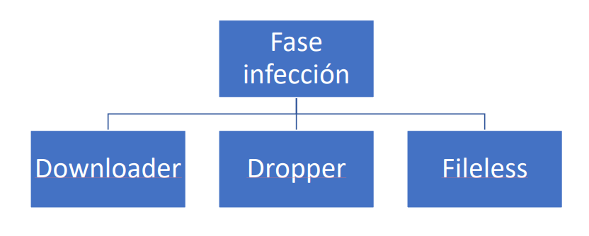

**A) DOWNLOADER:**
Es la técnica más básica y menos sofisticada. Su única misión es descargar e instalar el verdadero malware que sí realizará dichas acciones maliciosas. Esta técnica permite ocultar el malware real, exponiendo un sencillo programa no
malicioso que puede ser rápidamente realojado o sustituido en caso de detección.


**B) DROPPER:**
El comportamiento en muchos sentidos es similar al del Downloader. Sirven de punta de lanza para encubrir al verdadero malware. La diferencia fundamental es que el **Dropper contiene en sí mismo al malware y no necesita conexión a la red para instalar y ceder el control al componente maligno.**

Para evitar que los antivirus detecten el malware que lleva dentro de sí mismo, suelen emplear **técnicas de ofuscación o cifrado** de dichas partes.

Son una especie de envoltorio que cubre al malware real sirviéndoles de pantalla protectora.


**C) FILELESS:**

Es malware que no deja (o deja muy poca) huella en disco. En vez de guardar un ejecutable malicioso tradicional en el sistema de archivos, vive en memoria (RAM) y/o usa herramientas legítimas del propio sistema operativo para realizar acciones maliciosas. Así esquiva dos cosas que los antivirus clásicos miran mucho:
- Acceso a disco (crear/leer/escribir/borrar archivos).
- Firmas de archivos (huellas únicas de binarios concretos).

Podemos pensar que sería como un intruso que no hace copia de las llaves ni rompe la cerradura: se cuela por una puerta ya abierta y camina como si fuera personal autorizado.

El fileless no es magia, es estrategia: usa lo que ya existe en el sistema y se mueve en memoria para evadir firmas y acceso a disco, obligando a defender con telemetría, comportamiento y hardening, no solo con firmas.


#### 1.5.2 Fase de persistencia
La persistencia es el conjunto de técnicas que permiten que el malware siga ejecutándose aunque el equipo se reinicie, el usuario cierre sesión o un antivirus mate el proceso inicial. En otras palabras: que vuelva una y otra vez.

La persistencia es el “ancla” del atacante: usa mecanismos legítimos del sistema o del entorno (incluida la nube) para re-ejecutar su código tras reinicios y limpiezas. Para pararla, telemetría + baseline + hardening + control de identidades superan a las firmas por sí solas.

Otro aspecto necesario para el malware es su configuración. El malware va a ejecutar acciones maliciosas en el sistema, pero necesita que éstas le sean comunicadas a través de un canal encubierto para que nadie pueda fisgar o descubrir su actividad. 

Finalmente, el malware no se conforma con los permisos ordinarios de un usuario normal del sistema. Intentará escalar privilegios para obtener más permisos y derechos en el sistema.

Hay tres acciones prioritarias para el malware una vez entra en el sistema:
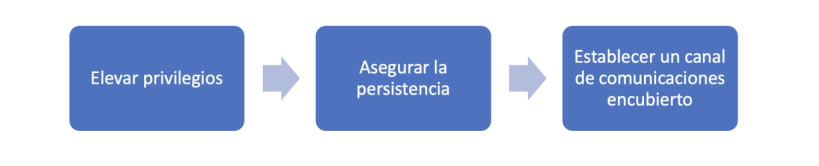


**Métodos de Persistencia:**
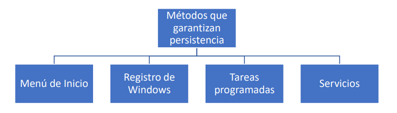


**A) Menú de Inicio:**
La carpeta de “inicio” del sistema operativo Windows es un método clásico y sencillo para indicarle al sistema que ejecute las aplicaciones allí incluidas.

**B) Registro de windows:**
El registro de Windows es una base de datos dispersa en varios archivos a lo largo del sistema. Sirve para alojar parámetros de configuración del sistema y de las aplicaciones. 

Existen claves del registro de Windows que le indican al sistema qué aplicaciones debe arrancar al iniciarse. Por supuesto, el malware emplea este tipo de claves del registro para anotar su localización y hacer que el sistema ejecute el malware al inicio.


**C) Tareas programadas:**
Los sistemas operativos poseen un servicio para que ciertas tareas se ejecuten cada cierto tiempo. Existen varios tipos de programas y servicios que permiten implementar este tipo de tareas programadas en sistemas Microsoft Windows.


**D) Servicios del Sistema:**
Un servicio es un proceso que típicamente no posee interfaz, se ejecuta en segundo plano y sirve de apoyo al resto de programas o al propio sistema operativo. Tradicionalmente, en el mundo UNIX se les denomina daemons. 

Un servicio también puede ser visto como una aplicación especial (por su forma de ejecutarse). El malware aprovecha esta característica para instalar un servicio que le indique al sistema operativo que ejecute el malware si éste no está ya en marcha.


#### 1.5.3 Fase de comunicación
El malware necesita comunicarse con el mundo exterior por diferentes razones: exfiltrar información, escuchar las órdenes de sus creadores u obtener la configuración inicial, entre otras. Es raro que un malware no posea algún tipo de comunicación con el exterior en algunas de las formas disponibles.

Dado que el intercambio de información genera señales o ruido, esto es percibido por los analistas de malware que pueden llegar a identificar una campaña de malware solo con observar tráfico entre servidores o la resolución de ciertos
dominios.

**Clases de canales que puede utilizar el malware para comunicarse:**


**A) Canales de aplicaciones y protocolos de comunicación:** Los servidores IRC. Telegram. Cualquier aplicación o protocolo de intercambio de mensajes.

**B) Canales usando aplicaciones web:** pastebin.com 

**C) Canales usan redes sociales:** Twitter, Facebook, etc., Se envían órdenes a través de la publicación de entradas. Los comandos, órdenes o configuraciones no son publicados directamente, sino que son ofuscados, cifrados o introducidos en imágenes (esteganografía).

**D) Canales usando servidores:** Servidores Web. Servidores FTP. Existen dos tipos principales: los bullet-proof y los servidores comprometidos. Estos últimos son servidores comprometidos, bajo el control de un atacante o cibercriminal, pero sin el consentimiento y conocimiento de sus propietarios. Los servidores bullet-proof son alojados en redes y/o países con una legislación más laxa en materia de cibercrimen que dificulta el cierre y persecución de las infraestructuras utilizadas por el malware.


#### 1.5.4 Fase de desencadenamiento
Finalmente, el malware despliega la verdadera amenaza que posee incubada en su interior. La finalidad puede ser de índole muy diversa: intereses políticos, económicos, espionaje, ideológicos, terrorismo, etc.
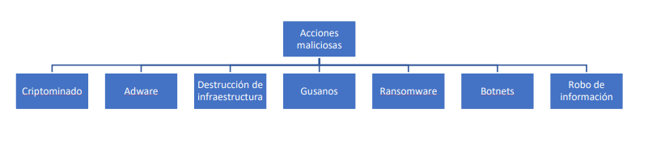


**A) Criptominado:** Los cibercriminales secuestran capacidad de cómputo a los sistemas infectados.

**B) Adware:** La motivación principal es la inyección de publicidad y la manipulación de resultados del buscador para dirigir las visitas y visionados de anuncios a un determinado producto, sitio web o servicio. Además de los anuncios, las versiones más dañinas pueden suscribir a las víctimas a servicios de pago o SMS Premium; con lo que multiplican sus ingresos a costa de un mayor daño y exposición.

**C) Destrucción de infraestrucura:** Este tipo de malware busca pasar desapercibido y no tiene otro fin que el de maximizar la capacidad destructiva, empleando, por ejemplo, drivers que manipulen y evadan mecanismos de seguridad para sabotear componentes hardware. Suele ser usado para sabotear instalaciones o ralentizar la producción de un competidor. Un ejemplo muy claro de malware de sabotaje fue el gusano STUXNET, programado para destruir componentes de centrifugadoras de uranio en Irán.

**D) Gusanos:** Más que una finalidad es un comportamiento muy característico. El gusano explota una vulnerabilidad que no necesita de la interacción con el usuario, basta que encuentre un sistema vulnerable a la escucha. Su meta es replicarse lo más amplia y rápidamente posible. Para ello, va escaneando Internet o una red local para encontrar nuevos sistemas vulnerables y continuar su replicación. Ejemplos: ILOVEYOU, Melissa, Conficker, etc.

**E) Ransomware:** Cifra los documentos. Para rescatar los archivos cifrados, necesitamos una clave criptográfica que nos piden a cambio de una suma de dinero. Este método es equivalente a un secuestro a cambio de dinero, de ahí el término inglés “ransom”. La única arma definitiva para acabar con este tipo de extorsión es no pagar. 

**F) Bootnets:** Una botnet es una red de ordenadores infectados y sincronizados entre ellos para obedecer las órdenes y comandos de sus creadores. También es conocida como red de ordenadores zombies o nodos zombies. La finalidad de estos es múltiple, aunque una forma característica es la utilización de los nodos infectados como parte de operaciones de denegación de servicio. Algunas botnets minan criptomoneda, curiosean archivos o cámaras.

**G) Robo de información:** Por un lado, robar información intelectual o que permita a un competidor averiguar secretos; por otro lado, la extorsión a cambio de dinero si el cibercriminal encuentra información comprometedora para la víctima (fotos de índole intima, etc.). Una forma particular de este tipo de malware son los denominados RAT (remote administration tool). Un RAT es una herramienta que toma el control de un ordenador remoto. Existen RATs que son programas legítimos, por ejemplo, los usados para administración o soporte remoto.

___________________________________________________________________________________________
### 1.6 Elevación de Privilegios
Al elevar privilegios, el malware busca convertirse en un administrador del sistema. Cuando lo consigue, disfruta de plenos poderes y derechos sobre los recursos del sistema. Pasa de tener limitado su rango de acción a poder actuar sin
apenas restricciones.

Cuando se eleva privilegios en un sistema se hace a través de un **exploit** que aprovecha una vulnerabilidad o una técnica que permite aprovechar algún resquicio, por ejemplo, que la contraseña del administrador sea muy sencilla de adivinar.

A los exploits que permiten convertirse en administrador se les denomina **exploits de elevación de privilegios.**

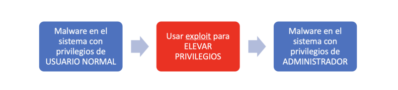

Es diferente el exploit que ha servido para infectar al sistema del exploit que se usa para conseguir mejores privilegios.

**Rootkits:** 
De las fases descritas anteriormente, la elevación entraría en la persistencia, puesto que una vez infectado el sistema, una elevación le permitiría privilegios para detener software de detección u utilizar técnicas rootkit para pasar desapercibido a los ojos de cualquier usuario del sistema e incluso administradores.

Además, con privilegios suficientes, se puede lograr lograr persistencia incluso infectando los procesos de arranque y estar presente antes incluso de la carga del núcleo del sistema.

Los rootkit interceptan las llamadas al sistema interponiéndose y ajustando la salida a su conveniencia. Por ejemplo, hacer un "ls" en un sistema infectado por un rootkit permite a éste mostrar todos los archivos habituales a excepción de los
maliciosos. Lo mismo con el tráfico de red o cualquier otro intento de desenmascarar al malware en el sistema.

___________________________________________________________________________________________
### 1.7 La importancia de la ingeniería social en la difusión del malware

Lo habitual es tirar de ingeniería social, ya sea spear phishing (orientado a una víctima o grupo particular) o phishing común (sin orientación alguna, genérico). Es un método relativamente barato y eficaz. 


___________________________________________________________________________________________
### Tipos de malware más comunes:
Algunos de ellos se categorizan según su funcionalidad y vectores de ataque, como se describe a continuación:
- **Virus:**  
Programa malicioso que se adjunta a un archivo legítimo y se propaga cuando se ejecuta el archivo infectado. Causa variedad de daños, como la eliminación de archivos, el robo de información o el bloqueo del sistema. Este Malware es capaz de copiarse a sí mismo y propagarse a otros ordenadores. Un virus necesita intervención del usuario, mientras que un gusano puede propagarse sin ella.

- **Gusano:**  
Son programas maliciosos que se propagan a través de redes y sistemas informáticos. Los gusanos pueden causar una sobrecarga en la red y ralentizar el rendimiento del sistema.

- **Troyano:**  
Malware que se disfraza de programa legítimo para engañar al usuario y que lo instale. Una vez instalado, puede realizar acciones maliciosas como robar datos sensibles, subir archivos al servidor del atacante o espiar a través de la webcam.

- **Backdoor / Remote Access Trojan (RAT) | Puerta trasera / Troyano de acceso remoto (RAT):**  
Tipo de troyano que permite al atacante acceder y ejecutar comandos en el sistema comprometido.

- **Adware:**  
Malware que muestra anuncios no deseados al usuario. Suele distribuirse junto con descargas gratuitas e incluso puede instalar software de manera forzada.

- **Botnet:**  
Conjunto de ordenadores infectados con el mismo malware (llamado bots), que esperan instrucciones del servidor de comando y control controlado por el atacante. El atacante puede ordenar a estos bots que realicen actividades maliciosas como ataques DDoS o envío masivo de spam.

- **Ladrón de información (Information stealer):**  
Malware diseñado para robar datos sensibles como credenciales bancarias o pulsaciones del teclado. Algunos ejemplos son los keyloggers, spyware, sniffers y form grabbers.

- **Ransomware:**  
Malware que mantiene el sistema como rehén, bloqueando el acceso al ordenador o cifrando los archivos del usuario y exigiendo un rescate para recuperarlos.

- **Rootkit:**  
Malware que otorga al atacante acceso privilegiado al sistema infectado y oculta su presencia o la de otros programas maliciosos. Los rootkits pueden permitir a los atacantes controlar el sistema y recopilar información sin ser detectados.

- **Downloader o Dropper:**  
Malware diseñado para descargar o instalar componentes maliciosos adicionales en el sistema.


__________________________________________________________________________
## 2. Descripción general de la arquitectura del laboratorio
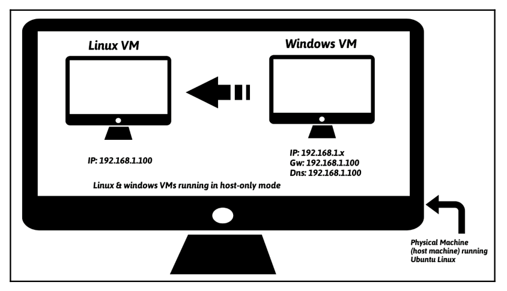

La arquitectura usada consiste en una **máquina física (llamada máquina host) que ejecuta Ubuntu Linux con instancias de máquina virtual Linux (Ubuntu Linux VM) y máquina virtual Windows (Windows VM)**. Estas máquinas virtuales se configurarán para ser parte de la misma red y utilizarán el modo de **configuración de red de Host-only** para que el malware no pueda comunicarse con Internet y así el tráfico de la red estará contenido en el entorno de laboratorio aislado.

La VM de Windows es donde se ejecutará el malware durante el análisis, y la VM de Linux se usará para monitorear el tráfico de red y será configurada para simular servicios de Internet (DNS, HTTP, etc.), para proporcionar una respuesta adecuada cuando el malware solicite estos servicios. Por ejemplo, la máquina virtual Linux se configurará de manera que cuando el malware solicite un servicio como DNS, la máquina virtual Linux proporcione la respuesta DNS adecuada. 

En esta configuración, la máquina virtual Linux estará preconfigurada en la dirección IP 192.168.1.100 y la dirección IP de la máquina virtual Windows se configurará en 192.168.1.x (donde x es cualquier número de 1 a 254 excepto 100). La puerta de enlace predeterminada y el DNS de la VM de Windows se configurarán en la dirección IP de la VM de Linux (es decir, 192.168.1.100) para que todo el tráfico de la red de Windows se enrute a través de la VM de Linux.

También es posible configurar un laboratorio compuesto por múltiples VMs ejecutando diferentes versiones de Windows; esto nos permitirá analizar la muestra de malware en varias versiones de sistemas operativos Windows.
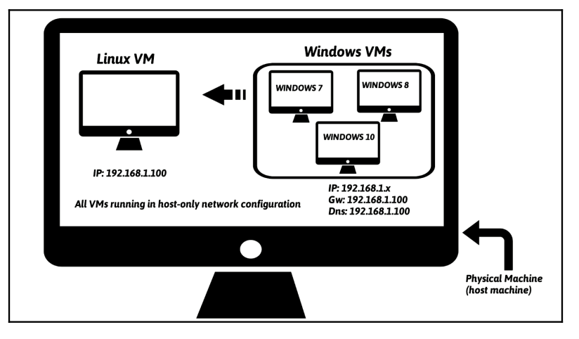


## 3. Configuración de las VMs
- Instalación de MV Ubuntu & MV Windows.
- Instalación de Virtual Guest Additions software en ambas VMs.
  
### 3.1 Configuración de Windows VM:
- Deshabilitamos Windows Update.
- Deshabilitamos Windows Defender 🠮  Services 🠮 Windows Defender 🠮 Boton derecho 🠮  Select properties 🠮  Stop Service
- Mostrar extensiones de ficheros 🠮 Opciones de carpeta 🠮 Ver 🠮  Mostrar extensiones para ficheros
- Mostrar ficheros y carpetas ocultos.
- Deshabilitamos ASLR (Address Space Layout Randomization): ASLR (Address Space Layout Randomization) es una técnica de seguridad utilizada para dificultar los ataques de desbordamiento de búfer (buffer overflow) y otras vulnerabilidades de corrupción de memoria. La idea principal de ASLR es ubicar aleatoriamente en el espacio de direcciones de memoria las áreas clave de un proceso, como el ejecutable base, la pila, el montón y las librerías cargadas. Esto hace que las direcciones de memoria sean impredecibles para un atacante, dificultando la ejecución de código malicioso.
    🠮  Windows + R 🠮  regedit 🠮 Computer\HKEY_LOCAL_MACHINE\SISTEM\CurrentSet\Control\Session Manager\Memory Management 🠮  New Key 🠮 QWORD (32 bits) 🠮 poner como nombre: MoveImages
- Deshabilitamos Firewall 🠮 Windows Defender Firewall.
- Creamos un snapshot 🠮 HOST + T

- Instalamos Flare VM: Es una colección de scripts de instalación de software para sistemas Windows que permite configurar y mantener fácilmente un entorno de ingeniería inversa y análisis de malware en una máquina virtual.Las principales características de FLARE VM son:
  - Proporciona un conjunto de herramientas expertas para ingeniería inversa, análisis de malware, monitoreo, depuración, desensamblado, descompilación y más, todas preinstaladas y configuradas. Algunas herramientas incluidas son IDA, Binary Ninja, Radare2, OllyDbg, x64dbg, Ghidra, entre otras. (https://github.com/dnSpy/dnSpy)
  - Utiliza Chocolatey (un administrador de paquetes para Windows) y Boxstarter para automatizar la instalación y configuración de las herramientas en un entorno Windows virtualizado.
  - Está diseñado para instalarse únicamente en una máquina virtual Windows, no en un host físico, para permitir un análisis de malware seguro y contenido.
  - Proporciona un proceso de instalación, actualización y desinstalación simplificado a través de scripts de PowerShell.
  - Permite personalizar fácilmente las herramientas a instalar a través de una interfaz gráfica de usuario.
  - Es un proyecto de código abierto mantenido por el equipo FLARE de Mandiant/FireEye, con contribuciones de la comunidad.
  - Enlace: https://github.com/mandiant/flare-vm
  - Video con instruciones para instalar: https://www.youtube.com/watch?v=i8dCyy8WMKY
  - Desactivamos: Windows Defender through Group Policy:
    - gpedit.msc
    - En el Editor de Directiva de Grupo, navegue a la siguiente ruta: Computer Configuration > Administrative Templates > Windows Components > Windows Defender Antivirus
    - Busque la configuración "Turn off Windows Defender Antivirus" (o "Desactivar Antivirus Windows Defender" en español).
    - Haga doble clic en ella para editarla.
    - Seleccione "Enabled" (Habilitado) y haga clic en "Apply" (Aplicar) y luego en "OK".
    - Cierre el Editor de Directiva de Grupo Local.
  - Computer Configuration > Administrative Templates > Windows Components > Microsoft Defender Antivirus > Real-time Protection > Enable Turn off real-time protection
  - Instalación: Desde la carpeta del master, ejecutar con PowerShell como administrador:
    - Set-ExecutionPolicy unrestricted
    - Si falla: Set-ExecutionPolicy -Scope      CurrentUser
      - unresticted
      - ./

- Descargamos Python desde https://www.python.org/downloads/. Asegúrate de descargar la versión Python 2.7.x (por ejemplo, 2.7.13); la mayoría de los scripts usados en este libro están escritos para ejecutarse con la versión Python 2.7 y puede que no funcionen correctamente en Python 3.

- Configuramos la máquina virtual de Windows para que funcione en modo de red solo-anfitrión (Host-only).

- Configuramos la dirección IP de la máquina virtual de Windows como 192.168.1.x (elegimos cualquier dirección IP excepto 192.168.1.100, ya que esa la usará la máquina virtual con Linux) y establecemos la puerta de enlace predeterminada y el servidor DNS a la dirección IP de la máquina virtual con Linux (es decir, 192.168.1.100).

- Nos aseguramos de que ambas máquinas puedan comunicarse entre sí. Comprobamos la conectividad ejecutando el comando ping.

- Para desactivar Windows Defender:
  - Abrimos el Editor de directivas de grupo local.
  - En el panel izquierdo, navegamos hasta: Configuración del equipo | Plantillas administrativas | Componentes de Windows | Windows Defender.
  - En el panel derecho, hacemos doble clic en la directiva Desactivar Windows Defender para editarla.
  - Seleccionamos Habilitada y haz clic en Aceptar.
 

### 3.2 Configuración de Linux VM:
- Instalación:
  ```
  sudo apt-get install python-pip
  pip install --upgrade pip
  sudo apt-get install python-magic
  sudo apt-get install upx
  sudo pip install pefile
  sudo apt-get install yara
  sudo pip install yara-python
  sudo apt-get install ssdeep
  sudo apt-get install build-essential libffi-dev python python-dev libfuzzy-dev
  sudo pip install ssdeep
  sudo apt-get install wireshark
  sudo apt-get install tshark
  ```
- INetSim (http://www.inetsim.org/index.html) es una herramienta potente que permite simular varios servicios de Internet (como DNS y HTTP).Emula servicios típicos de Internet dentro de una red controlada o aislada (como una sandbox). Esto permite ver cómo se comporta un malware cuando intenta comunicarse con servidores externos, sin que el malware realmente acceda a Internet:
  ```
  sudo su
  echo "deb http://www.inetsim.org/debian/ binary/" >  /etc/apt/sources.list.d/inetsim.list
  wget -O - http://www.inetsim.org/inetsim-archive-signing-key.asc | apt-key add -
  apt update
  apt-get install inetsim
  ```
  
- Ahora podemos aislar la máquina virtual de Ubuntu dentro del laboratorio configurando el modo de red "Solo-anfitrión" (Host-only) en el dispositivo virtual. Es importante aislar la máquina virtual del acceso a Internet real, para evitar que el malware cause daños o se comunique con atacantes reales. El modo de red Host-only en VMware:
    - Crea una red cerrada entre tu máquina real (host) y la máquina virtual (VM).
    - No permite acceso a Internet ni a otras redes, solo comunicación directa entre host y VM.
    - Es ideal para entornos de prueba o análisis seguro.
  
- IP address of 192.168.1.100 to the Ubuntu Linux VM.
  
- Configurar INetSim para que pueda escuchar y simular todos los servicios en la ip 192.168.1.100:
  ```
  sudo gedit /etc/inetsim/inetsim.conf
  # service_bind_address
  #
  # IP address to bind services to
  #
  # Syntax: service_bind_address <IP address>
  #
  # Default: 127.0.0.1
  #
  #service_bind_address 10.10.10.1
  service_bind_address 192.168.1.100
  #
  #dns_default_ip 10.10.10.1
  dns_default_ip 192.168.1.100
  ```
- Arrancar INetSim:
  ```
  sudo inetsim
  ```
- Hacemos una snapshot | instantánea: En VirtualBox, se puede hacer haciendo clic en Máquina | Tomar instantánea. 🠮 Host + T


## 4. Otra posible configuración para las MV

### 4.1 Configuración Virtual Box

- Instalamos una MV Windows10 Pro y una MV Remnux.
- Instalamos Virtual guest addition.
- Cambiamos a una configuración de red tipo 10.0.0.0/24 para evitar posibles saltos a redes usuales como 192.168.X.X. Actualmente en Virtual box sólo se pueden crear redes del rango 192.168.57.... Para crear una red del rango 10.0.0.0/24, tenemos que habilitarlo en el fichero de configuración de redes:
```
sudo nano /etc/vbox/networks.conf

Añadimos:
* 10.0.0.0/24
```

- Creamos en línea de comandos una red hostonly:
```
sudo VBoxManage hostonlyif create
```
El comando anterior, genera una nueva red y nos indica su nombre, por ejemplo vboxnet1.

- Especificamos el rango de la red:
```
sudo VBoxManage hostonlyif ipconfig vboxnet1 --ip 10.0.0.1 --netmask 255.255.255.0
```

- Cerramos y abrimos VirtualBox para que actualice este cambio.

- En virtualbox, Vamos a la configuración de redes: Red vboxnet1 --> Configuración de la red:
```
Direccion IPv4: 10.0.0.1
máscara de red: 255.255.255.0
```
- Vamos a la configuración de redes: Red vboxnet1 --> Servidor DHCP:
```
Dirección del Servidor: 10.0.0.2
Máscara de red: 255.255.255.0
Limite inferior: 10.0.0.3
Límite superior: 10.0.0.254
```
- Verificamos que la VM WIN y la WM Linux tiene sólo un adaptador de red activo: Red vboxnet1


### 4.2 Máquina virtual Remnux

```
ip: 10.0.0.3/24
Configuración inetsim:
nano /etc/inetsim/inetsim.conf
service_bind_addres  0.0.0.0
dns_default_ip       10.0.0.3

Ejecutar inetsim.
```

### 4.3 Máquina Virtual WIN:
```
ip: 10.0.0.4/24
Download Windows Terminal:
Download the VCLibs package. In a PowerShell window, run: wget https://aka.ms/Microsoft.VCLibs.x64.14.00.Desktop.appx -usebasicparsing -o VCLibs.appx
Download the Windows Terminal MSIX bundle from the provided link: wget https://github.com/microsoft/terminal/releases/download/v1.15.3465.0/Microsoft.WindowsTerminal_Win10_1.15.3465.0_8wekyb3d8bbwe.msixbundle -UseBasicParsing -o winterminal.msixbundle
In a PowerShell admin window, add the VCLibs package: Add-AppxPackage [C:\path\to\downloaded\VCLibs.appx]
In a PowerShell admin window, run: Add-AppxPackage [C:\path\to\downloaded\winterminal.msixbundle]

(Optional) Pin Windows Terminal to the task bar

Disable proxy auto detect setting:
In the Windows search bar, search “proxy settings”,
Switch "Automatically detect settings" button off

Disable Tamper Protection
Search "Defender", open Defender settings and set all Defender Settings to off

Disable AV/Defender in GPO
Si tenemos Windows10 Home y gpedit.msc no está instalado:
- cmd ejecutar como administrador
- FOR %F IN ("%SystemRoot%\servicing\Packages\Microsoft-Windows-GroupPolicy-ClientTools-Package~*.mum") DO ( DISM /Online /NoRestart /Add-Package:"%F" )
- FOR %F IN ("%SystemRoot%\servicing\Packages\Microsoft-Windows-GroupPolicy-ClientExtensions-Package~*.mum") DO ( DISM /Online /NoRestart /Add-Package:"%F" )
- Windows+r --> gpedit.msc

In Windows search bar, search "group policy"
In GPO, navigate to → Administrative Templates → Windows Components → Microsoft Defender Antivirus → Enable “Turn off Microsoft Defender Antivirus”
Disable Windows Firewall
GPO → Administrative Templates → Network → Network Connections → Windows Defender Firewall → Domain Profile → Disable “Protect All Network Connections”
Do the same but for the Standard profile


TAKE A SNAPSHOT!

Download and install FLARE-VM:
In PowerShell Admin prompt, run: (New-Object net.webclient).DownloadFile('https://raw.githubusercontent.com/mandiant/flare-vm/main/install.ps1',"$([Environment]::GetFolderPath("Desktop"))\install.ps1")
Change directories to the Desktop

Run: Unblock-File .\install.ps1
Run: Set-ExecutionPolicy Unrestricted
Accept the prompt to set the ExecPol to unrestricted if one appears
Run: .\install.ps1 -customConfig https://raw.githubusercontent.com/HuskyHacks/PMAT-labs/main/config.xml
Follow the rest of the prompts and continue with the installation.

Configuración del adaptador de ip IPV/4:
Usar la siguiente dirección del servidor de DNS: 10.0.0.3


When the installation is done, TAKE ANOTHER SNAPSHOT!
```

Comprobar que todas las máquinas se ven con pings.
comprobar que la MV Win, si accede a una web o recurso, recibe respuesta de inetsim.


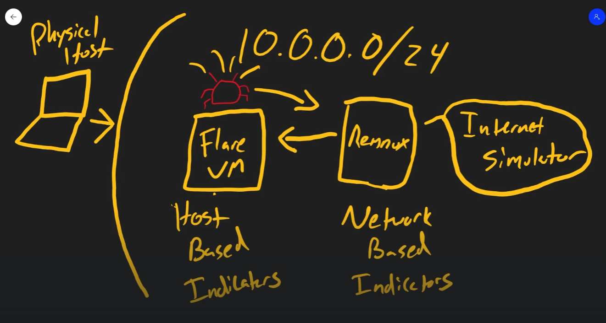


### Interacciones según los modos de red
Cómo interactúan las MVs con el Host físco que las contiene:
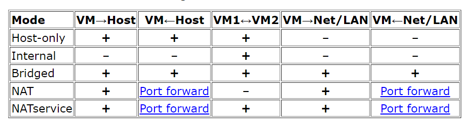

**El modo de red Host-Only en entornos virtualizados permite la comunicación únicamente entre las máquinas virtuales y el host físico, sin acceso a internet ni a otras máquinas de la LAN. Sin embargo, Host-Only permite la comunicación entre la VM infectada y el host**. Es por ello que este modo no es totalmente seguro para análisis de malware si el host contiene datos valiosos o está desprotegido.

Aunque **con Host-Only se evita que el malware salga a internet o ataque otros dispositivos de la red corporativa**, la posibilidad de comunicación directa con el host representa un riesgo: si el malware logra aprovechar vulnerabilidades presentes en el sistema de virtualización o en el propio host, podría salir del entorno controlado y comprometer el host físico. Históricamente han existido exploits (vulnerabilidades de escape de VM) que permiten a malware salir de la máquina virtual y ejecutar código en el host, aunque estos no son triviales ni comunes en entornos bien actualizados.

Por tanto, Host-Only **aporta un nivel de aislamiento, pero no garantiza seguridad absoluta**. En buenas prácticas de análisis de malware, se recomienda además:
- Usar instantáneas para restaurar el estado limpio de la VM rápidamente.
- Mantener el host lo más aislado posible y sin información sensible.
- Aplicar actualizaciones de seguridad tanto al host como al software de virtualización.
- Considerar el uso de entornos totalmente desconectados (“air-gapped”) para análisis de malware de riesgo elevado.
- Cifrar discos duros para que no tengan acceso entre ellos para aislar plenamente el disco que tenga las funciones de lab.


https://academy.tcm-sec.com/courses/1547503/lectures/42863183

## 6. Malware Sources
- Hybrid Analysis: https://www.hybrid-analysis.com/
- KernelMode.info: http://www.kernelmode.info/forum/viewforum.php?f=16
- VirusBay: https://beta.virusbay.io/
- Contagio malware dump: http://contagiodump.blogspot.com/
- AVCaesar: https://avcaesar.malware.lu/
- Malwr: https://malwr.com/
- VirusShare: https://virusshare.com/
- theZoo: http://thezoo.morirt.com/
- Elastic Malware Benchmark: https://github.com/elastic/ember
- Tekdefense: https://www.tekdefense.com/downloads/malware-samples/
- Syrianmalware: https://syrianmalware.com/
- VX underground: https://vx-underground.org/
- MalwareBazar: https://bazaar.abuse.ch/
- Zeltser: https://zeltser.com/malware-sample-sources/

-------------------------------------------------  
-------------------------------------------------  
# CHAPTER 2: Análisis estático
El análisis **estático es la técnica de analizar el archivo sospechoso sin ejecutarlo**. Es un método de análisis inicial que implica extraer información útil del binario sospechoso para tomar una decisión informada sobre **cómo clasificarlo o analizarlo** y dónde centrar nuestros esfuerzos.

## Pasos para hacer un análisis estático de una muestra de malware
### 1. Identificar la arquitectura de destino del malware. 
- Renombrar la muestra si tiene un nombre genérico o engañoso (ej. invoice.pdf.exe → malware_sample.exe).

### 2. Tomar huellas dactilares del malware.
- Hash de la muestra (para identificarla):
  - md5sum, sha256sum (Linux)
  - HashMyFiles, Get-FileHash (Windows)
 
### 3. Escanear el binario sospechoso con motores antivirus.  

### 4. Detección de empaquetado / protección (DIE, UPX, etc.).
  - Herramientas: die (Detect It Easy), PEiD, RDG Packer Detector.
  - Indicadores: pocas importaciones, secciones UPX, secciones no estándar, diferencias entre VirtualSize y RawSize.
- Intentar desempaquetar (si está protegido con UPX u otro packer):
  - ```upx -d malware.exe```.
  - Si no es posible → preparar para dump en análisis dinámico.


### 5. Identificación de ofuscación.
- Comparar código y flujo de control:
  - ¿Hay saltos inusuales? (jmp, call a direcciones poco claras)
  - ¿Flujos difíciles de seguir? → Puede haber opaque predicates o anti-disassembly.
- ¿Hay API hashing? → Intenta resolver qué APIs se están usando realmente.

### 6. Detección de técnicas anti-análisis.
- Uso de ```IsDebuggerPresent, CheckRemoteDebuggerPresent```.
- Verificación de nombres de procesos: procmon, wireshark, idaq.exe, etc.
- Llamadas sospechosas: ```NtQueryInformationProcess, RDTSC, GetTickCount```


### 7. Extraer cadenas y metadatos asociados con el archivo.
- Extrae cadenas imprimibles (puede mostrar URLs, rutas, comandos, claves, etc.).
- Herramientas recomendadas: exiftool, binwalk, trid.

### Tamaño y Análisis de la estructura PE.
- Revisar encabezados PE:
  - IMAGE_DOS_HEADER.
  - IMAGE_NT_HEADERS.
- Comprobar secciones:
  - Nombres (.text, .data, .rsrc, .UPX, etc.).
  - Tamaños (VirtualSize vs RawSize).
  - Permisos (R, W, X).
  - Secciones inusuales (.text, .data, .rsrc, .UPX, etc.).
  - Existen secciones vacías con gran ```VirtualSize```.
- Posibles overlays.
- Herramientas ```PE-bear, PEview, CFF Explorer, pefile, Detect It Easy (DIE)```.


### 9. Funciones/APIs utilizadas.
- Import Table (IAT):
  - Ver funciones importadas.
  - Funciones claves como ```CreateRemoteThread, VirtualAlloc, InternetOpen, WinExec```, puede haber comportamiento malicioso.
- Export Table:
  - ¿Exporta funciones?
  - ¿Simula ser una DLL legítima?

### 10. Desensamblado y descompilado.
- Usar herramientas para examinar el código ensamblador:
  - Ghidra (open source, muy potente).
  - IDA Free (limitado, pero útil).
  - Binary Ninja (comercial).
  - Cutter + radare2.
- Buscar:
  - Rutinas de cifrado (loops, operaciones con ```XOR, ADD, ROR```, etc.)
  - Llamadas a funciones clave del sistema.
  - Construcción de rutas, claves, archivos, DLLs, shellcodes.
- Observar funciones sospechosas:
  - ```CreateProcess, CreateRemoteThread, WriteProcessMemory```.
  - ```GetProcAddress, LoadLibrary```.
  - ```RegSetValue, RegCreateKey, ShellExecute```.
  - ```InternetOpen, HttpSendRequest, recv, send```.

### 11. Análisis de recursos embebidos.
- Extraer y examinar iconos, imágenes, DLLs o binarios embebidos:
  - Resource Hacker, PE Explorer, rcedit, exiftool
  - A veces contienen payloads cifrados o configuraciones C2.


### 12. Análisis de firmas y YARA
- Analizar si hay coincidencias con reglas YARA conocidas:
  - ```yara -r rules.yar malware.exe```.
  - Podemos usar reglas públicas (TheZoo, Malpedia).
- Usar VirusTotal, HybridAnalysis, Intezer para comparar hashes y firmas.

### 13. Clasificación y comparación de muestras de malware.

### 14. Identificación de capacidades del malware & Introducción a MITRE ATT&CK

### 15. Malware Behavioral Catalog (MBC)

### 16. Mapeo y documentación
- Hacer un mapa mental o esquema del comportamiento del binario:
  - ¿Se auto-copia?
  - ¿Crea persistencia?
  - ¿Se conecta a un servidor?
  - ¿Ejecuta otro payload?


Estas técnicas pueden revelar información diferente sobre el archivo. No es necesario seguir todas estas técnicas y no es necesario seguirlas en el orden indicado anteriormente. La elección de las técnicas a utilizar depende de su objetivo y del contexto que rodea el archivo sospechoso.

______________________________

## 1. Identificar la arquitectura de destino del malware: Determinar el tipo de fichero
Determinar el tipo de archivo de un binario sospechoso nos ayudará a **identificar el sistema operativo objetivo del malware** (Windows, Linux, etc.) **y la arquitectura** (plataformas de 32 o 64 bits). Por ejemplo, si el binario sospechoso tiene un **tipo de archivo Ejecutable Portátil (PE)**, que es el formato de archivo para archivos ejecutables de Windows (.exe, .dll, .sys, .drv, .com, .ocx, etc.), entonces podemos deducir que el archivo está diseñado para apuntar al sistema operativo Windows.

### Cómo se determina el tipo de fichero.
**1.1. Por la extensión:** .exe, .dll, .sys, .drv, .com, .ocx, etc.  Hay que tener cuidado con la extensión ya que se puede cambiar la extensión para ocultar el malware.

**1.2. Por la firma del archivo:** Se busca la firma del archivo abriéndolo en un editor hexadecimal. **Una firma de archivo es una secuencia única de bytes que se escribe en el encabezado del archivo.** Diferentes archivos tienen diferentes firmas, que pueden usarse para identificar el tipo de archivo. **Los archivos ejecutables de Windows, también llamados archivos PE**, **tienen una firma de archivo de MZ o caracteres hexadecimales 4D 5A enlos primeros dos bytes del archivo.**


En sistemas Linux, para buscar la firma del archivo se puede utilizar el comando ```xxd```, que genera un volcado hexadecimal del archivo:
```
xxd -g 1 log.exe | more
```

Vemos el detalle de la salida del comando xxd usando contra una muestra de malware. Lo que aparece como "MZP" se traduce en ASCII como:
- 4D = M
- 5A = Z
- 50 = P


**"MZ"** es la firma mágica de los archivos ejecutables en DOS/Windows (archivos .exe). Llamada así por Mark Zbikowski, ingeniero de Microsoft. Indica que **el archivo es un ejecutable PE (Portable Executable)** o que al menos comienza con una cabecera compatible con DOS.

La “P” no forma parte de la firma estándar. Es simplemente el siguiente byte después del “MZ”, y su valor depende del contenido binario del archivo.


**1.3. Identificando el tipo de fichero usando herramientas:**
- En sistemas Linux, esto se puede lograr usando la utilidad ```file```.
  - Ejemplo 1: En el primer archivo que no tiene ninguna extensión, se detecta como un archivo ejecutable de 32 bits (PE32)
    ```
    $ file mini
    mini: PE32 executable (GUI) Intel 80386, for MS Windows
    ```
  - Ejemplo2: En el segundo archivo es un ejecutable de 64 bits (PE32+):
    ```
    $ file pad.exe
    pad.exe: PE32+ executable (GUI) x86-64, for MS Windows
    ```

- En Windows: Podemos usar **CFF Explorer**, que es parte de Explorer Suite (http://www.ntcore.com/exsuite.php).


**1.4. Identificando el tipo de fichero usando Python**
El módulo ```python-magic``` puede ser usado para identificar el tipo de fichero de un archivo.
```
$ python
Python 2.7.12 (default, Nov 19 2016, 06:48:10)
>>> import magic
>>> m = magic.open(magic.MAGIC_NONE)
>>> m.load()
>>> ftype = m.file(r'log.exe')
>>> print ftype
PE32 executable (GUI) Intel 80386, for MS Windows
```

**1.5 Herramienta PEV:**
La herramienta PEV (Portable Executable).

-------------------------------------------------
## 2. Tomar huellas dactilares del malware: Fingerprinting the Malware

### 2.1 ¿Qué es "Fingerprinting the Malware"?
Fingerprinting significa **identificar de forma única una pieza de malware** usando ciertas características técnicas que la distinguen de otras.

Es como sacarle la huella digital para poder:
- Detectarlo en otros sistemas.
- Compararlo con otras variantes.
- Crear reglas para antivirus o sistemas de detección.

**Fingerprinting:** El fingerprinting de malware es el proceso de recopilar información y características distintivas de un archivo malicioso, lo que permite a los analistas de seguridad y a las herramientas de protección identificar, clasificar y entender mejor el comportamiento del malware.

### Beneficios de tomar un fingerprint de un malware:
- **Identificación Única:** Al igual que las huellas dactilares humanas son únicas para cada individuo, el fingerprinting de malware permite identificar de manera única una muestra de malware, lo que facilita su seguimiento y detección en diferentes sistemas
- **Prevención de Fraudes y Autenticación:** El fingerprinting puede detectar patrones inusuales que podrían indicar una actividad sospechosa, como intentos de fraude o accesos no autorizados, y es una herramienta valiosa para la autenticación de usuarios y dispositivos
- **Investigación y Análisis Forense:** El fingerprinting es crucial para el análisis forense, ya que proporciona datos detallados sobre el malware que pueden ser utilizados para entender su origen, propósito y cómo se propaga.
- **Desarrollo de Firmas de Antivirus:** La información recopilada a través del fingerprinting se utiliza para desarrollar firmas que los programas antivirus pueden usar para identificar y bloquear malware conocido.


### 2.2 Huellas comunes que se analizan. Formas de Identificar de forma única una pieza de malware
| Tipo de fingerprint	| ¿Qué es? |
| -- | -- |
| **Hash (MD5, SHA-1, SHA-256)** | 	Identificadores únicos del archivo binario. Un simple cambio en el código genera un hash distinto. | 
| **Strings**	|  Cadenas de texto presentes en el malware (nombres de funciones, URLs, rutas, mensajes, etc.). | 
| **API calls** | 	Funciones del sistema operativo que el malware utiliza (ej: ```CreateRemoteThread, WriteProcessMemory```). | 
| **Comportamientos** | 	Acciones como persistencia, inyección de procesos, cifrado de archivos, comunicación con C2 (```comando y control```). | 
| **Ruta o nombre del archivo** | 	Algunos malware usan nombres o rutas repetidas. | 
| **Certificados digitales falsos** | 	A veces el malware usa firmas digitales maliciosas o robadas. | 
| **Firmas de red**	|  Patrones en el tráfico que genera (como DNS malicioso, peticiones HTTP anómalas...). | 


### 2.2.1. Hash del archivo:
- Checksum.
- Hash criptográfico.

✅ El checksum es una forma de fingerprint, pero muy básica.  
⚠️ En análisis serio de malware, siempre se usa hash criptográfico (como SHA-256).  
✅ El checksum puede ser útil como verificación rápida, pero no para identificar malware de forma segura.

El checksum, también conocido como **suma de verificación**, es un **valor calculado a partir de un conjunto de datos con el objetivo de verificar su integridad**. Es una forma de asegurarse de que los datos no han sido alterados, ya sea accidentalmente o de manera malintencionada, durante la transmisión o el almacenamiento.

El proceso de checksum implica **aplicar un algoritmo o función matemática a los datos originales para producir un valor hash o una cadena de caracteres**. Este valor hash es una representación compacta de los datos originales. Cuando los datos se transmiten o se almacenan junto con su checksum, cualquier parte que reciba o acceda a esos datos puede calcular de nuevo el checksum y compararlo con el valor original. Si los valores coinciden, se puede asumir que los datos no han sido modificados. Si los valores no coinciden, indica que los datos pueden haber sido corrompidos o alterados

**Usos de checksums:**  
- Verificación de la integridad de archivos descargados de Internet.
- Detección de errores en la transmisión de datos.
- Validación de la autenticidad de la información. Por ejemplo, al descargar un archivo, a menudo se proporciona un checksum (como SHA256sum) que el usuario puede verificar para asegurarse de que el archivo no ha sido dañado o modificado desde que fue publicado por el creador.

**Algoritmos de checksum:**  
- **Algoritmos simples como CRC32 o Adler-32**. No están diseñados para seguridad: son fácil de falsificar.
- **Hash criptográfico como MD5, SHA-1, SHA-256** que son un tipo de checksum mucho más seguros y únicos.


**¿Son infalibles los checksums?**  
Aunque los checksums son útiles para detectar cambios en los datos, no son infalibles y **no pueden garantizar la seguridad contra ataques maliciosos sofisticados, como los ataques de colisión,** donde dos conjuntos de datos diferentes pueden producir el mismo checksum


**Hash Collision:**  
Un hash collision, o colisión de hash, ocurre cuando dos piezas distintas de datos producen el mismo valor de hash al ser procesadas por una función de hash. Esto significa que, a pesar de que los datos de entrada son diferentes, el resultado de la función de hash es idéntico para ambos. Las funciones de hash están diseñadas para tomar datos de entrada de cualquier tamaño y producir un resultado de longitud fija, conocido como **valor de hash, que actúa como una representación digital de los datos originales.**

Las colisiones de hash son un fenómeno inherente a las funciones de hash debido al **principio del palomar**, que establece que si se tienen más palomas que palomares y cada paloma debe ser alojada en un palomar, al menos un palomar contendrá más de una paloma. De manera similar, dado que el número de posibles entradas para una función de hash es prácticamente infinito, pero el número de posibles resultados de hash es finito, eventualmente debe ocurrir que dos entradas diferentes produzcan el mismo hash.

Las colisiones de hash pueden tener implicaciones significativas en varios campos, especialmente en la criptografía y la seguridad informática. Por ejemplo, en la autenticación de datos o en la firma digital, **una colisión de hash podría permitir a un atacante crear datos falsificados que produzcan el mismo valor de hash que los datos originales y legítimos, comprometiendo así la integridad de los datos.**

Para mitigar el riesgo de colisiones de hash, se utilizan algoritmos de hash criptográficos diseñados para ser resistentes a colisiones, lo que significa que es computacionalmente inviable encontrar dos entradas diferentes que produzcan el mismo valor de hash. Sin embargo, **no existe un algoritmo de hash que pueda garantizar completamente la ausencia de colisiones debido a las limitaciones matemáticas y computacionales.**


**¿Se usa el checksum para fingerprinting?**
✅ Sí, pero con matices:
| Uso	| Checksum simple (CRC, etc.)	| Hash criptográfico (MD5, SHA-256)|
| -- | --| -- |
| Detección de integridad | 	✅ | 	✅ |
| Identificación de malware | 	❌ (no fiable) | 	✅ (muy común) |
| Comparación de archivos | 	❌ (colisiones posibles) | 	✅ |
| Seguridad o forense | 	❌ | 	✅ |


**Generando Cryptographic Hash de un malware:**  
Este proceso nos permite obtener un identificador único para el archivo malicioso basado en su contenido, lo cual es útil para su análisis, identificación y comparación con bases de datos de malware conocido.
- En Windows:
  ```
  certUtil -hashfile nombreArchivo SHA256
  certUtil -hashfile nombreArchivo MD5 | SHA256 | SHA512
  Get-FileHash -Algorithm Sha256 nombreArchivo
  Get-FileHash -Algorithm MD5 | SHA256 | SHA512 nombreArchivo
  ```
- En Linux:
  ```
  sha256sum nombre_del_archivo
  ```
- En python:
  ```
  python
  Python 2.7.12 (default, Nov 19 2016, 06:48:10)
  >>> import hashlib
  >>> content = open(r"log.exe","rb").read()
  >>> print hashlib.md5(content).hexdigest()
  6e4e030fbd2ee786e1b6b758d5897316
  >>> print hashlib.sha256(content).hexdigest()
  01636faaae739655bf88b39d21834b7dac923386d2b52efb4142cb278061f97f
  >>> print hashlib.sha1(content).hexdigest()
  625644bacf83a889038e4a283d29204edc0e9b65
  ```

____________
## 3. Escanear el binario sospechoso con motores antivirus.
Escaneamos la muestra con firmas de antivirus (AV signatures).
Bases de datos como VirusTotal o Hybrid Analysis asocian la muestra a una familia de malware específica.
- Ej: "Trojan:Win32/Emotet.CA"
- Estas firmas son una forma de fingerprint si son suficientemente específicas.


### Virus Total
VirusTotal es una herramienta en línea gratuita que se utiliza para analizar archivos y URLs en busca de virus, gusanos, troyanos y otros tipos de malware. La plataforma utiliza más de 70 motores antivirus y anti-malware para escanear y proporcionar un informe detallado sobre cualquier amenaza detectada.

Pasos para usar VirusTotal para escanear un malware:
- Subir el Archivo o URL Sospechosa: Accede a la página web de VirusTotal y selecciona la opción para subir el archivo que deseas analizar o ingresa la URL que quieres verificar
- Análisis Automático: Una vez que el archivo o URL ha sido subido, VirusTotal lo analizará automáticamente utilizando sus múltiples motores antivirus y nos proporcionará un informe con los resultados
- Interpretar los Resultados: El informe incluirá una lista de todos los motores antivirus que analizaron el archivo y sus resultados. Si alguno de los motores detecta una amenaza, el informe indicará el nombre de la amenaza y proporcionará información adicional sobre ella
- Evaluar la Confiabilidad: Es importante tener en cuenta que aunque VirusTotal es una herramienta valiosa, no es infalible y no garantiza una protección completa contra el malware. Por lo tanto, se recomienda utilizar una variedad de herramientas de seguridad y seguir las mejores prácticas de seguridad cibernética
- Uso de la API Pública: Para usuarios avanzados o para integraciones automáticas, VirusTotal ofrece una API pública que permite enviar muestras y recibir informes de análisis de manera programática
- Herramientas Adicionales: Además de la página web, existen herramientas como VirusTotal Uploader y aplicaciones para dispositivos móviles que facilitan el envío de archivos y URLs a VirusTotal para su análisis

### Querying Hash Values Using VirusTotal
Pasos para consultar valores de hash utilizando VirusTotal:
- Obtener un Hash de Archivo: Primero, necesitamoss el hash del archivo que deseamos consultar. Los hashes permitidos son MD5, SHA1 y SHA256
- Acceder a VirusTotal: Vamos a la página web de VirusTotal (https://www.virustotal.com/).
- Ingresar el Hash en la Búsqueda: Utilizamos la barra de búsqueda de VirusTotal para ingresar el hash del archivo.
- Revisar el Informe: Después de buscar el hash, VirusTotal nos mostrará el último informe disponible para ese archivo. Si el archivo ha sido analizado previamente, podremos ver los resultados de los diferentes motores antivirus y otra información relevante

###  Uso de la API de VirusTotal: 
Si preferimos automatizar el proceso o realizar consultas en masa, podemos utilizar la API pública de VirusTotal. Necesitaremos una clave API que podemos obtener creando una cuenta en VirusTotal.
- Ejemplo de Uso de la API con cURL:
```
curl --request POST \
--url 'https://www.virustotal.com/vtapi/v2/file/report' \
-d apikey=$your-api-key \
-d 'resource=$your-file-hash'
```
Reemplazamos $your-api-key con nuestra clave API y $your-file-hash con el hash del archivo que deseamos consultar.


###  Ejemplo de Uso de la API con Python:
```
python
import requests
  
url = 'https://www.virustotal.com/vtapi/v2/file/report'
params = {'apikey': 'tu_clave_api', 'resource': 'hash_del_archivo'}
response = requests.post(url, data=params)
print(response.json())
```
Reemplazamos 'tu_clave_api' con tu clave API y 'hash_del_archivo' con el hash del archivo que deseamos consultar.
  
Nota: La API pública de VirusTotal tiene una limitación de cuatro consultas por minuto. Si necesitamos realizar un mayor volumen de consultas o acceder a información más detallada, tendremos que considerar usar la API privada de VirusTotal o el servicio premium VirusTotal Intelligence.


Otro script:
  ```
  import urllib
  import urllib2
  import json
  import sys

  hash_value = sys.argv[1]
  vt_url = "https://www.virustotal.com/vtapi/v2/file/report"
  api_key = "<update your api key here>"
  parameters = {'apikey': api_key, 'resource': hash_value}
  encoded_parameters = urllib.urlencode(parameters)
  request = urllib2.Request(vt_url, encoded_parameters)
  response = urllib2.urlopen(request)
  json_response = json.loads(response.read())
  if json_response['response_code']:
    detections = json_response['positives']
    total = json_response['total']
    scan_results = json_response['scans']
    print "Detections: %s/%s" % (detections, total)
    print "VirusTotal Results:"
    for av_name, av_data in scan_results.items():
      print "\t%s ==> %s" % (av_name, av_data['result'])
  else:
    print "No AV Detections For: %s" % hash_value
  ```


Running the preceding script by giving it an MD5 hash of a binary shows the antivirus detections and the signature names for the binary.
  ```
  md5sum 5340.exe
  5340fcfb3d2fa263c280e9659d13ba93 5340.exe

  python vt_hash_query.py 5340fcfb3d2fa263c280e9659d13ba93
  Detections: 44/56
  VirusTotal Results:
     Bkav ==> None
     MicroWorld-eScan ==> Trojan.Generic.11318045
     nProtect ==> Trojan/W32.Agent.105472.SJ
     CMC ==> None
     CAT-QuickHeal ==> Trojan.Agen.r4
     ALYac ==> Trojan.Generic.11318045
     Malwarebytes ==> None
     Zillya ==> None
     SUPERAntiSpyware ==> None
     TheHacker ==> None
     K7GW ==> Trojan ( 001d37dc1 )
     K7AntiVirus ==> Trojan ( 001d37dc1 )
     NANO-Antivirus ==> Trojan.Win32.Agent.cxbxiy
     F-Prot ==> W32/Etumbot.K
     Symantec ==> Trojan.Zbot
     [.........Removed..............]

  ```
### Otras herramientas:
- Usando la herramienta PEstudio (https://www.winitor.com/) o la herramienta PPEE (https://www.mzrst.com/).
- Online scanners such as VirSCAN (http://www.virscan.org/), Jotti Malware Scan (https://virusscan.jotti.org/), and OPSWAT's Metadefender (https://www.metadefender.com/#!/scan-file) allow you to scan a suspect file with multiple anti-virus scanning engines, and some of them also allow you to do hash lookups.

### Consideraciones a tener en cuenta cuando subimos un binario a un scanner online:
-  Aunque los escáneres antivirus y los servicios de escaneo en línea son herramientas útiles para identificar malware, existen limitaciones y riesgos asociados con su uso. Es crucial ser consciente de estos riesgos, especialmente en lo que respecta a la confidencialidad de la información y la posibilidad de que los atacantes adapten sus métodos para evadir la detección.
  - Detección no garantizada: Los autores de malware pueden modificar su código y emplear técnicas de ofuscación para evadir estas detecciones, lo que puede resultar en que algunos motores antivirus no logren identificar el archivo como malicioso. Esto se debe a que las técnicas de ofuscación y metamorfismo pueden cambiar la apariencia del código malicioso sin alterar su funcionalidad, dificultando su detección basada en firmas.
  - Riesgos de compartir binarios: Al subir un archivo binario a un sitio público, existe el riesgo de que este archivo se comparta con terceros y proveedores. Si el archivo binario contiene información sensible, personal o propiedad de una organización, no es recomendable enviarlo a servicios públicos de escaneo antivirus, especialmente si es parte de una investigación confidencial. Esto se debe a que el archivo podría contener datos críticos que no deberían ser expuesto.
  - Uso de valores hash criptográficos: Como alternativa a la presentación del archivo binario, la mayoría de los servicios de escaneo antivirus en línea permiten buscar en su base de datos de archivos escaneados utilizando valores hash criptográficos (MD5, SHA1 o SHA256). Esto significa que en lugar de subir el archivo completo, se puede buscar utilizando el hash criptográfico del archivo, lo que reduce el riesgo de exponer información sensible.


___________________________________________

## 4. Detección de empaquetado / protección (DIE, UPX, etc.).
### 4.1 Identificación del packer que se usó para empaquetar malware
Usamos la herramienta pepack que detecta si un binario está empaquetado usando una base de datos de firmas (como [db_packers.txt](https://github.com/soniasalido/cybersecurity/blob/main/Documentation/Malware/Learning%20Malware%20Annalysis/db_packer.txt)). El fichero db_packers.txt es un archivo de texto que tiene firmas o patrones que identifican los empaquetadores más comunes:
```
UPX
ASPack
FSG
MEW
NSPack
...
```
Si ejecutamos el comando:
```
pepack fichero.bin -d db_packers.txt
```
- Analiza el binario fichero.bin
- Compara con la base de datos de packers
- Si está empaquetado, intenta desempaquetarlo
- Usualmente crea un nuevo archivo desempaquetado (a veces en el mismo directorio)

**Unpacking Malware Samples:** https://www.youtube.com/watch?v=782kD1meXZ8


### 4.2 Cambios en el Entry Point
Los ejecutables tienen lo que se llama un **punto de entrada (ENTRY POINT)**. Cuando se ejecuta, este punto de entrada es simplemente la ubicación de las primeras piezas de código que se van a ejecutar dentro del archivo, como se ilustra a continuación:
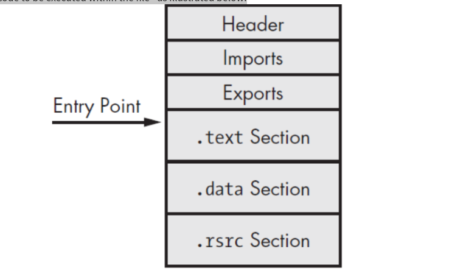

Cuando un ejecutable está empaquetado, el punto de entrada (Entry Point) apunta a un stub de desempaquetado, no al código original. Una vez desempaquetado en memoria, se redirige al entry point original.

Cuando un ejecutable está empaquetado, debe desempaquetarse antes de que se pueda ejecutar cualquier código. Debido a esto, los packers cambian el punto de entrada desde la ubicación original a lo que se llama el "Unpacking Stub".
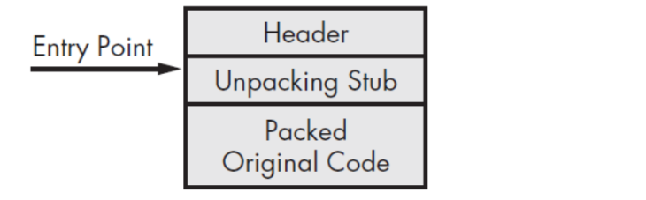

El "Unpacking Stub" comenzará a desempaquetar el ejecutable a su estado original. Una vez que el programa esté completamente desempaquetado, el punto de entrada se reubicará de nuevo a su lugar normal para comenzar a ejecutar el código:


Solo en este punto un analista puede comenzar a entender lo que el ejecutable está haciendo, ya que ahora está en su forma verdadera y original.

### 4.3 Packers and Cryptors
- Packer: Comprime el ejecutable y lo incluye dentro de otro ejecutable con un stub de desempaquetado. Un Empaquetador es un programa que toma el ejecutable como entrada y utiliza la compresión para ofuscar el contenido del ejecutable. Este contenido ofuscado se almacena entonces dentro de la estructura de un nuevo archivo ejecutable; el resultado es un nuevo archivo ejecutable (programa empaquetado) con contenido ofuscado en el disco. Al ejecutar el programa empaquetado, ejecuta una rutina de descompresión, que extrae el binario original en la memoria durante el tiempo de ejecución y desencadena la ejecución.

- Cryptor: Cifra el ejecutable y usa un stub para desencriptarlo y ejecutarlo en memoria. Un Encriptador es similar a un Empaquetador, pero en lugar de usar compresión, utiliza encriptación para ofuscar el contenido del ejecutable, y el contenido encriptado se almacena en el nuevo archivo ejecutable. Al ejecutar el programa encriptado, ejecuta una rutina de desencriptación para extraer el binario original en la memoria y luego desencadena la ejecución.

### 4.4 Indicadores de empaquetado
- **Secciones con nombres conocidos (UPX0, UPX1).**
- **Alta entropía en secciones:** Los archivos empaquetados suelen tener una alta entropía, lo que indica una distribución aleatoria de los bytes debido a la compresión o cifrado. Herramientas de análisis de malware y editores hexadecimales pueden calcular la entropía de un archivo y, si es inusualmente alta, esto puede ser un indicador de empaquetamiento.
- **Tabla de importaciones reducida o vacía:** Los empaquetadores suelen modificar la tabla de importaciones de un archivo PE (Portable Executable). Al analizar la tabla de importaciones con herramientas como CFF Explorer o PEStudio, se puede observar si muestra un conjunto reducido o inusual de importaciones, lo que puede sugerir que el archivo ha sido empaquetado. 
- **Cadenas y secciones inusuales:** Algunos empaquetadores agregan secciones con nombres inusuales al archivo PE o dejan cadenas dentro del archivo que indican el uso de un empaquetador. La inspección manual con editores hexadecimales o el uso de herramientas de análisis que buscan estas características pueden revelar indicios de empaquetamiento.
- **Análisis Heurístico:** Algunas soluciones de seguridad avanzadas utilizan análisis heurísticos para identificar comportamientos típicos de archivos empaquetados, como la ejecución de un stub de desempaquetamiento en tiempo de ejecución.


### 4.5 Herramientas adicionales
Herramientas como PEiD (Virustotal detecta malware), Exeinfo PE, RDG Packer Detector, y Die (Detect It Easy) son específicamente diseñadas para identificar empaquetadores, compiladores y protectores utilizados en archivos ejecutables. Estas herramientas analizan el archivo y, basándose en una base de datos de firmas de empaquetadores conocidos, estableciendo si el archivo ha sido empaquetado y, en muchos casos, identificar el empaquetador específico utilizado.
- TrID, TRIDNet, Die, Exeinfo PE, PEiD, packerid.py


### 4.6. Definición de stub
El stub es parte integral del proceso de packing (empaquetado). **Un stub es un componente esencial en los programas conocidos como ```crypters```** que se encarga de descifrar el malware cifrado y ejecutarlo directamente en la memoria del sistema, evitando así ser detectado al no escribir el malware en disco.

**Un stub es una porción de código pequeño cuya función principal es desempaquetar, desencriptar o preparar el código malicioso real para su ejecución.** Es común en malware que utiliza técnicas de packing o crypting para evadir la detección.

**Un stub es el código de arranque o loader que se ejecuta primero cuando el malware inicia.** Su misión es restaurar o cargar el payload original del malware (que puede estar comprimido, cifrado o camuflado) en memoria y luego transferirle el control.

El stub actúa como intermediario que prepara el entorno para que el código malicioso real (payload) se ejecute, muchas veces sin dejar rastros visibles en el sistema de archivos. 
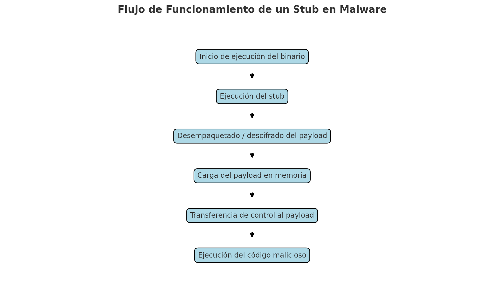


El stub es, esencialmente, el “desempaquetador en tiempo de ejecución”. Suele encargarse de:
- Localizar el payload empaquetado dentro del propio ejecutable (p. ej., en una sección con alta entropía o en recursos).
- Descomprimir y/o descifrar el payload (unpacking/decryption).
- Reservar memoria y copiar el payload ya recuperado (p. ej., con llamadas tipo VirtualAlloc/HeapAlloc).
- Reconstruir el estado de ejecución necesario para que el código original funcione:
  - resolver imports dinámicamente (LoadLibrary/GetProcAddress o equivalentes),
  - aplicar relocations si corresponde,
  - ajustar permisos de memoria (VirtualProtect / cambios RW→RX).
- Transferir el control al OEP (Original Entry Point), es decir, saltar al inicio real del programa ya desempaquetado.


Por qué es importante en malware
- Dificulta el análisis estático (lo que vemos en disco es sobre todo el stub + datos cifrados/comprimidos).
- Evita firmas basadas en bytes del payload real.
- A veces incorporan anti-análisis (anti-debug/anti-VM, checks de entorno) antes de liberar el payload.

Diferencia rápida: packer vs stub vs payload
- Packer: el método/herramienta/proceso que transforma el binario.
- Stub: el cargador que queda para poder revertir esa transformación en runtime.
- Payload: el código real (malicioso o legítimo) que se intenta ocultar.


**Ubicación del stub**
- En malware empaquetado: El stub está al principio del archivo ejecutable, seguido por el cuerpo del malware en forma cifrada o comprimida.
- En droppers y downloaders: El stub puede encargarse de desencriptar o descargar el payload desde Internet y ejecutarlo.

### 4.7 Ejemplo típico STUB:
- El atacante cifra el malware original.
- Adjunta un stub al inicio.
- El stub se ejecuta, descifra el malware en memoria y lo lanza.
- El código malicioso comienza su actividad real.


🧩 1. UPX (Ultimate Packer for eXecutables): UPX es una herramienta de compresión que empaqueta un ejecutable, comprimiendo su contenido y añadiéndole un stub que lo desempaqueta en tiempo de ejecución.

🗂️ 2. Archivo empaquetado: malz.exe. Después de pasar por UPX, se genera un nuevo archivo empaquetado: malz.exe contiene el stub al inicio, seguido del código comprimido del ejecutable original.

📦 3. Estructura interna del ejecutable UPX: Estructura interna de malz.exe:
- Parte superior header PE.
- La parte media es el stub UPX (el loader).
- La parte inferior es el el ejecutable original.


🔓 4. Empaquetado
- Parte superior: El header PE.
- Parte media: el stub.
- Parte final: EL payload empaquetado del ejecutable original.


🎬 5. Desempaquetado en tiempo de ejecución del malware empaquetado.


**Análisis: Virtual Size vs Size of Raw Data**
| Campo | Valor hexadecimal | 	Valor decimal |
| -- | -- | -- |
| Virtual Size | 	0000C000 | 	49.152 bytes |
| Size of Raw Data | 	00000000 | 	0 bytes |

La Size of Raw Data es 0, mientras que el Virtual Size es grande (49.152 bytes). Esto es altamente inusual y sospechoso, y tiene implicaciones claras en el contexto de malware empaquetado:
- Size of Raw Data = 0 significa que esta sección no tiene contenido en el disco, es decir, no hay datos reales escritos en el archivo en esa sección.
- Virtual Size = 0xC000 (49.152 bytes) indica que en memoria sí se reserva espacio para esta sección.

➡️ Es decir, esta sección (Raw Data) no existe físicamente en el archivo, pero el cargador del PE la reserva y la inicializa en memoria. No existe todavía. Raw Data necesita ser inicializada después de que el binario se descomprima desde su estado empaquetado.

Esto es típico en binarios empaquetados con UPX:
- UPX0 suele ser una sección vacía en disco pero marcada como ejecutable en memoria.
- Cuando se ejecuta el binario, el stub de UPX desempaqueta el payload y lo escribe en esta sección (UPX0), que solo existe en memoria, no en disco.


### 4.9 Ejemplo 2:
Usamos la herramienta pepack que detecta si un binario está empaquetado usando una base de datos de firmas (como [db_packers.txt](https://github.com/soniasalido/cybersecurity/blob/main/Documentation/Malware/Learning%20Malware%20Annalysis/db_packer.txt)). El fichero db_packers.txt es un archivo de texto que tiene firmas o patrones que identifican los empaquetadores más comunes:
```
UPX
ASPack
FSG
MEW
NSPack
...
```
Si ejecutamos el comando:
```
pepack fichero.bin -d db_packers.txt
```
- Analiza el binario fichero.bin
- Compara con la base de datos de packers
- Si está empaquetado, intenta desempaquetarlo
- Usualmente crea un nuevo archivo desempaquetado (a veces en el mismo directorio)

__________________________________

## 5. Identificación de ofuscación.
Aunque la extracción de cadenas es una técnica excelente para obtener información valiosa, a menudo los autores de malware ofuscan o blindan su binario de malware. La ofuscación es utilizada por los autores de malware para proteger el funcionamiento interno del malware de los investigadores de seguridad, analistas de malware e ingenieros inversos. Estas técnicas de ofuscación dificultan la detección/analización del binario; extraer las cadenas de tal binario resulta en muy pocas cadenas, y la mayoría de las cadenas están oscurecidas. Los autores de malware a menudo usan programas como Empaquetadores y Encriptadores para ofuscar su archivo con el fin de evadir la detección de productos de seguridad tales como antivirus y para impedir el análisis.

### 5.1 La ofuscación es el uso de técnicas que dificultan el análisis estático:
- Strings cifradas u ocultas.
- Lógica confusa o ilegible.
- Saltos y estructuras artificiales (opaque predicates).

### 5.2 Indicadores de ofuscación
- Extracción de cadenas devuelve poco o nada
- Uso de packers/cryptors
- Uso de API hashing
- Flujos de control difíciles de seguir en desensamblado

### 5.3 Ejemplo 2:
Para demostrar el concepto de ofuscación de archivos, tomemos un ejemplo de una muestra de malware llamada Spybot (no empaquetada); la extracción de cadenas de Spybot muestra referencias a nombres de ejecutables sospechosos y direcciones IP, como se muestra aquí:

```
$ strings -a spybot.exe
[....removed....]
EDU_Hack.exe
Sitebot.exe
Winamp_Installer.exe
PlanetSide.exe
DreamweaverMX_Crack.exe
FlashFXP_Crack.exe
Postal_2_Crack.exe
Red_Faction_2_No-CD_Crack.exe
Renegade_No-CD_Crack.exe
Generals_No-CD_Crack.exe
Norton_Anti-Virus_2002_Crack.exe
Porn.exe
AVP_Crack.exe
zoneallarm_pro_crack.exe
[...REMOVED...]
209.126.201.22
209.126.201.20
```

UPX, que se encuentra en https://upx.github.io/, es un empaquetador de ejecutables. UPX (Ultimate Packer for eXecutables) es una herramienta de código abierto y gratuita diseñada para comprimir archivos ejecutables. Su objetivo principal es reducir el tamaño de los archivos ejecutables (binarios), lo que puede ser útil para ahorrar espacio en disco y reducir los tiempos de carga en sistemas con recursos limitados. Empaquetamos y volvemos a comprobar los strings, observando que ya no se muestra mucha información:

```
$ upx -o spybot_packed.exe spybot.exe
Ultimate Packer for eXecutables
Copyright (C) 1996 - 2013
UPX 3.91 Markus Oberhumer, Laszlo Molnar & John Reiser Sep 30th 2013
File size Ratio Format Name
-------------------- ------ ----------- -----------
44576 -> 21536 48.31% win32/pe spybot_packed.exe
Packed 1 file.

$ strings -a spybot_packed.exe
!This program cannot be run in DOS mode.
UPX0
UPX1
.rsrc
3.91
UPX!
t ;t
/t:VU
]^M
9-lh
:A$m
hAgo .
C@@f.
Q*vPCi
%_I;9
PVh29A
[...REMOVED...]
```

UPX is a common packer, and many times you will come across malware samples packed with UPX. In most cases, it is possible to unpack the sample using the -d option. An example command is
```
upx -d -o spybot_unpacked.exe spybot_packed.exe.
```

____________________________________________
## 6. Detección de técnicas anti-análisis.
- Uso de IsDebuggerPresent, CheckRemoteDebuggerPresent.
- Verificación de nombres de procesos: procmon, wireshark, idaq.exe, etc.
- Llamadas sospechosas: NtQueryInformationProcess, RDTSC, GetTickCount

__________________________________

## 7. Extraer cadenas y metadatos asociados con el archivo.
Extraer strings legibles del ejecutable puede revelar:
- URLs de comando y control (C2).
- Mensajes de error.
- Frases tipo "your files have been encrypted".
- Nombres de funciones o variables.
- Direcciones IP y URLs que pueden señalar a servidores de C&C.
- Rutas de archivos específicos que el malware intenta modificar o leer.
- Logs que el malware genera.
- Referencias a librerías específicas o llamadas al sistema que indican cómo interactúa el malware con el sistema operativo.


La extracción de cadenas de un fichero ejecutable es un proceso utilizado en el análisis de malware y en la ingeniería inversa de software para **identificar y extraer secuencias de caracteres legibles (cadenas) dentro de un archivo binario**. Este proceso es fundamental para entender el comportamiento potencial de un programa sin necesidad de ejecutarlo o analizar su código fuente, que puede no estar disponible. Las cadenas pueden incluir rutas de archivos, mensajes de error, URLs de servidores de comando y control (C&C), claves de cifrado, y otros indicadores de compromiso (IoCs) que son útiles para el análisis de seguridad.

Las **cadenas son secuencias de caracteres imprimibles en ASCII y Unicode incrustadas en un archivo.**
La extracción de cadenas puede dar pistas sobre la funcionalidad del programa y los indicadores asociados con un binario sospechoso. Por ejemplo, si un malware crea un archivo, el nombre del archivo se almacena como una cadena en el binario. También si un malware resuelve un nombre de dominio controlado por el atacante, entonces el nombre de dominio se almacena como una cadena. Las cadenas extraídas del binario pueden contener **referencias a nombres de archivos, URL, nombres de dominio, direcciones IP, comandos de ataque, claves de registro, etc**. Aunque las cadenas no dan una idea clara del propósito y la capacidad de un archivo, pueden dar una **pista sobre lo que el malware es capaz de hacer.**


### 7.1 Extraer Cadenas usando herramientas
**Herramientas para la extracción de cadenas de archivos ejecutables:**
- **Strings:** Disponible en sistemas Unix y Windows, es una herramienta de línea de comandos que busca secuencias de caracteres ASCII o Unicode que son al menos de una longitud mínima especificada (por defecto, 4 caracteres). El comando strings, por defecto, extrae las cadenas ASCII que tienen al menos cuatro caracteres de largo. Con la opción -a es posible extraer cadenas de todo el archivo.
  ```
  strings -a log.exe
  ```
  Especímenes de malware también utilizan **cadenas Unicode (2 bytes por carácter)**. Para obtener información útil del binario, a veces necesitas extraer tanto cadenas ASCII como Unicode. Para extraer cadenas Unicode usando el comando strings, usamos la opción -el.
  ```
  strings -a -el log.exe
  ```

  **Filtrar la salida** del comando strings para buscar cosas determinadas:
  ```
  strings -a -el log.exe | grep ".exe"
  strings -a -el log.exe | grep ".dll"
  ```
  

- **Binwalk:** Aunque es más conocida por su capacidad para analizar y extraer firmware, también puede ser utilizada para extraer cadenas.
- **HEx Editors:** Permiten visualizar y editar el contenido binario de un archivo, incluyendo la extracción manual de cadenas.
- En Windows, **pestudio** (https://www.winitor.com) es una herramienta útil que muestra cadenas ASCII y Unicode.
- También en windows se puede usar el **comando strings de sysinternals** y PPEE (https://www.mzrst.com/).
- BinText.
- Ghidra.


**Proceso de Extracción:** La herramienta seleccionada lee el archivo binario y busca secuencias de caracteres que coincidan con patrones de cadenas legibles. Estas cadenas se extraen y se presentan al analista para su revisión.


### 7.2 Decoding Obfuscated Strings Using FLOSS
La mayoría de las veces, los autores de malware utilizan técnicas simples de ofuscación de cadenas para evitar la detección. En tales casos, esas cadenas ofuscadas no aparecerán en la utilidad de cadenas ni en otras herramientas de extracción de cadenas. **FireEye Labs Ofuscated String Solver (FLOSS)** es una herramienta diseñada para **identificar y extraer automáticamente cadenas ofuscadas de malware**. Puede ayudarnos a determinar las cadenas que los autores de malware quieren ocultar de las herramientas de extracción de cadenas.

FLOSS también se puede utilizar como la utilidad de cadenas para **extraer cadenas legibles por humanos (ASCII y Unicode)**. Para descargar FLOSS para Windows o Linux: https://github.com/fireeye/flare-floss.
```
sudo apt install python3-venv python3-full
mkdir ~/miENV
python3.12 -m venv miENV


git clone https://github.com/mandiant/flare-floss.git
cd flare-floss
python setup.py install
```


Otra forma de instalar flare-floss en un entorno virtual python:
```sudo apt update
sudo apt install -y python3 python3-pip python3-venv

mkdir -p ~/miENV-FLOSS
cd ~/miENV-FLOSS

python3 -m venv venv-floss
source ~/miENV-FLOSS/venv-floss/bin/activate

python -m pip install --upgrade pip setuptools wheel
pip install flare-floss

floss --version
which floss
```


En el siguiente ejemplo, no sólo se han extraido las cadenas legibles por humanos, sino que también decodificó las cadenas ofuscadas y extrajo las cadenas de la pila que la utilidad de cadenas y otras herramientas de extracción de cadenas no detectaron. El siguiente resultado muestra una referencia a un ejecutable, un archivo de Excel y una clave de registro de ejecución:
```
$ chmod +x floss
$ ./floss 5340.exe
FLOSS static ASCII strings
!This program cannot be run in DOS mode.
Rich
.text
`.rdata
@.data
[..removed..]
FLOSS decoded 15 strings
kb71271.log
R6002
- floating point not loaded
\Microsoft
winlogdate.exe
~tasyd3.xls
[....REMOVED....]
FLOSS extracted 13 stack strings
BINARY
ka4a8213.log
afjlfjsskjfslkfjsdlkf
'Clt
~tasyd3.xls
"%s"="%s"
regedit /s %s
[HKEY_CURRENT_USER\Software\Microsoft\Windows\CurrentVersion\Run]
[.....REMOVED......]
```

Si sólo estmos interesados en las **cadenas decodificadas/apiladas y deseamos excluir las cadenas estáticas (ASCII y Unicode)** de la salida FLOSS, proporcionamos el modificador ```--no-static-strings```.

https://www.mandiant.com/resources/blog/automatically-extracting-obfuscated-strings


**Análisis de los Resultados:** FLOSS mostrará las cadenas ofuscadas que ha logrado identificar y extraer. Estas cadenas pueden incluir direcciones IP, URLs, nombres de dominio, claves de cifrado, y otros datos que el malware utiliza en sus operaciones. Es importante analizar estas cadenas en el contexto del comportamiento general del malware para entender su propósito y cómo interactúa con los sistemas infectados.
- Cadenas ASCII Estáticas: Estas son cadenas de texto que se pueden leer directamente en el archivo binario y no están ofuscadas. Por ejemplo, la cadena "!This program cannot be run in DOS mode." es típica en los archivos ejecutables de Windows y no es indicativa de actividad maliciosa por sí misma.
- Cadenas Decodificadas: Estas cadenas pueden incluir nombres de archivos de registro como "kb71271.log", mensajes de error como "R6002 - floating point not loaded", o referencias a directorios del sistema como "\Microsoft". Estas cadenas pueden ser pistas sobre la funcionalidad del malware, como los archivos que intenta crear o modificar, o errores que maneja.
- Cadenas Extraídas de la Pila (Stack Strings): Estas son cadenas que FLOSS ha identificado y extraído de la memoria de la pila durante la ejecución del malware. Por ejemplo, "ka4a8213.log" podría ser otro archivo de registro, y "~tasyd3.xls" podría ser un archivo que el malware busca o genera. La **cadena "%s"="%s" sugiere una operación de formato o asignación**, y "regedit /s %s" indica que el malware podría estar intentando modificar el registro de Windows de forma silenciosa.
- Cadenas Relacionadas con la Persistencia: La referencia a **"[HKEY_CURRENT_USER\Software\Microsoft\Windows\CurrentVersion\Run]"** es particularmente significativa, ya que esta ubicación del registro se utiliza comúnmente para configurar programas que se ejecutan automáticamente al iniciar sesión en Windows. Esto podría indicar que el malware intenta establecer persistencia en el sistema infectado.

Al analizar estos resultados, es importante **considerar el contexto y la funcionalidad potencial que las cadenas podrían representar** dentro del malware. Por ejemplo:
- Cadenas de Archivos y Directorios: Pueden indicar los archivos y directorios con los que el malware interactúa.
- Mensajes de Error: Pueden revelar las funciones del sistema que el malware intenta utilizar y cómo maneja las condiciones de error.
- Comandos del Sistema: Como "regedit /s %s", pueden sugerir intentos de modificar la configuración del sistema para lograr objetivos maliciosos.
- Referencias al Registro de Windows: Pueden indicar intentos de lograr la persistencia o modificar la configuración del sistema para beneficio del malware.
_____________________________

## 8. Estructura PE


Vemos el detalle de la salida del comando xxd usando contra una muestra de malware. Lo que aparece como "MZP" se traduce en ASCII como:
- 4D = M
- 5A = Z
- 50 = P


**"MZ"** es la firma mágica de los archivos ejecutables en DOS/Windows (archivos .exe). Llamada así por Mark Zbikowski, ingeniero de Microsoft. Indica que **el archivo es un ejecutable PE (Portable Executable)** o que al menos comienza con una cabecera compatible con DOS.

La “P” no forma parte de la firma estándar. Es simplemente el siguiente byte después del “MZ”, y su valor depende del contenido binario del archivo.


La estructura PE (Portable Executable) es el formato que usan los ejecutables de Windows, como:
```
*.exe, *.dll, *.sys, *.scr, *.ocx
```
En análisis de malware, entender la estructura PE sirve para saber cómo se carga el binario en memoria, dónde está el código, qué librerías importa, si está empaquetado, si tiene recursos sospechosos, etc.

### 8.1 Vista general de un archivo PE
Un PE tiene esta estructura básica:
```
+-----------------------------+
| DOS Header                  |
+-----------------------------+
| DOS Stub                    |
+-----------------------------+
| PE Header / NT Headers      |
|  - Signature "PE\0\0"       |
|  - File Header              |
|  - Optional Header          |
+-----------------------------+
| Section Table               |
+-----------------------------+
| Sections                    |
|  - .text                    |
|  - .rdata                   |
|  - .data                    |
|  - .idata                   |
|  - .rsrc                    |
|  - .reloc                   |
|  - otras...                 |
+-----------------------------+
```

La estructura PE se puede resumir así:
```
DOS Header       -> empieza con MZ
e_lfanew         -> apunta a PE Header
PE Header        -> empieza con PE\0\0
File Header      -> arquitectura, número de secciones, flags
Optional Header  -> Entry Point, ImageBase, alineaciones, Data Directories
Section Table    -> describe cada sección
Sections         -> código, datos, imports, recursos, relocations
```

### 8.2 DOS Header
Es la primera estructura del archivo. Empieza siempre con:
```
MZ
```

En hexadecimal:
```
4D 5A
```
Por eso muchos ejecutables se identifican por la cabecera `MZ`.

El campo más importante del DOS Header es **`e_lfanew`**. Este campo indica el offset donde empieza la cabecera `PE` real. Ejemplo conceptual:
```
Offset 0x00: MZ
...
Offset 0x3C: e_lfanew = 0x000000F8
...
Offset 0xF8: PE\0\0
```
Es decir, Windows lee `e_lfanew` para saltar desde la cabecera `DOS` hasta la cabecera `PE`.


### 8.3 DOS Stub
Después del DOS Header suele aparecer un pequeño programa `DOS` que normalmente contiene el mensaje:
```
This program cannot be run in DOS mode.
```
En malware no suele tener mucha importancia, aunque a veces puede ser modificado para ocultar datos o confundir herramientas.

### 8.4 PE Signature
La firma PE aparece donde apunta `e_lfanew`.

Debe ser:
```
PE\0\0
```
En hexadecimal:
```
50 45 00 00
```
Si no aparece esta firma, el archivo probablemente no es un `PE` válido o está corrupto/manipulado.

### 8.5 File Header
Después de la firma `PE` viene el `IMAGE_FILE_HEADER`. Contiene información general del binario.

Campos importantes:
```
Machine
NumberOfSections
TimeDateStamp
PointerToSymbolTable
NumberOfSymbols
SizeOfOptionalHeader
Characteristics
```

### 8.6 Optional Header
Aunque se llama “optional”, en ejecutables PE normales es obligatorio. Contiene información crítica para cargar el programa en memoria.

Campos importantes:
```
AddressOfEntryPoint
ImageBase
SectionAlignment
FileAlignment
SizeOfImage
SizeOfHeaders
Subsystem
DllCharacteristics
DataDirectory
```

**AddressOfEntryPoint:** Es la dirección relativa donde empieza la ejecución del programa. También se llama `OEP`, `Original Entry Point`. Ejemplo:
```
ImageBase:             0x00400000
AddressOfEntryPoint:   0x00001234
```

La dirección virtual real sería:
```
0x00400000 + 0x00001234 = 0x00401234
```
En análisis de malware, el `Entry Point` es fundamental porque ahí suele empezar el código inicial del programa o del packer.

**ImageBase:** Dirección preferida donde Windows carga el ejecutable en memoria. Ejemplos típicos:
```
EXE 32 bits: 0x00400000
DLL 32 bits: 0x10000000
EXE/DLL 64 bits: valores más altos
```
Si no puede cargarse en esa dirección, Windows usa las `relocations`.

**SectionAlignment:** Alineación de las secciones en memoria. Ejemplo:
```
SectionAlignment = 0x1000
```
Esto suele coincidir con el tamaño de página de memoria en Windows.

**FileAlignment:** Alineación de las secciones en disco. Ejemplo:
```
FileAlignment = 0x200
```
Por eso muchas secciones en disco empiezan en offsets múltiplos de `0x200`.

**SizeOfImage:** Tamaño total que ocupará el `PE` cuando se cargue en memoria. No es igual al tamaño del archivo en disco.

**Subsystem:** Indica el tipo de aplicación:
```
2 -> Windows GUI
3 -> Windows Console
```
Si es consola, puede abrir terminal. Si es GUI, normalmente no.

**DllCharacteristics**: Flags de seguridad y mitigaciones. Ejemplos:
```
ASLR
DEP / NX
Control Flow Guard
Dynamic Base
```
En malware antiguo o packed puede que algunas mitigaciones estén desactivadas.


### 8.7 Data Directory
Dentro del Optional Header está la tabla de Data Directories. Es una de las partes más importantes para análisis. Contiene punteros a estructuras como:
```
Export Table
Import Table
Resource Table
Exception Table
Certificate Table
Base Relocation Table
Debug Directory
TLS Table
IAT
Delay Import Table
CLR Header
```


**Import Table**: Indica qué APIs usa el programa. Ejemplo:
```
kernel32.dll
  CreateFileA
  WriteFile
  CreateProcessA

advapi32.dll
  RegSetValueExA

ws2_32.dll
  socket
  connect
  send
  recv
```

Esto permite inferir comportamiento:
```
CreateFile / WriteFile       -> manipulación de archivos
RegSetValueEx                -> persistencia en registro
socket / connect             -> comunicación de red
VirtualAlloc / WriteProcessMemory / CreateRemoteThread -> inyección
```

**Export Table:** Más relevante en DLLs. Indica qué funciones exporta la librería. Ejemplo:
```
DllRegisterServer
ServiceMain
Install
Run
```
En malware puede revelar funciones interesantes.

**Resource Table:** Contiene iconos, imágenes, cadenas, manifiestos, versiones o incluso payloads embebidos. En malware es común encontrar:
```
Ejecutables embebidos
DLLs comprimidas
Shellcode
Configuraciones cifradas
Iconos falsos
```

**Relocation Table:** Permite ajustar direcciones si el binario no se carga en su ImageBase preferido. La sección suele llamarse:
```
.reloc
```

**TLS Table:** La TLS Table puede contener callbacks que se ejecutan antes del Entry Point. Esto es muy importante. Un malware puede usar TLS callbacks para ejecutar código antes de que el analista llegue al supuesto main o OEP.

### 8.8 Section Table
Después de las cabeceras viene la tabla de secciones. Cada sección tiene una estructura `IMAGE_SECTION_HEADER`. Campos importantes:
```
Name
VirtualSize
VirtualAddress
SizeOfRawData
PointerToRawData
Characteristics
```

**Name:** Nombre de la sección. Nombres típicos:
```
.text
.rdata
.data
.idata
.rsrc
.reloc
```

Nombres sospechosos o asociados a packers:
```
UPX0
UPX1
.aspack
.petite
.mpress
Themida
.nsp0
```

**VirtualAddress:** Dónde se carga la sección en memoria, como RVA. Ejemplo:
```
.text VirtualAddress = 0x1000
```

Si el ImageBase es:
```
0x00400000
```
Entonces la sección .text empieza en:
```
0x00401000
```

**PointerToRawData:** Offset en disco donde empieza la sección. Ejemplo:
```
PointerToRawData = 0x400
```

Esto significa que en el archivo físico la sección empieza en el offset:
```
0x400
```

**SizeOfRawData:** Tamaño de la sección en disco.


**VirtualSize:** Tamaño de la sección en memoria. A veces VirtualSize y SizeOfRawData no coinciden. Ejemplo sospechoso:
```
VirtualSize     = 0x5000
SizeOfRawData   = 0x200
```

Puede indicar que en memoria la sección se expande, algo típico en packers.

**Characteristics:** Permisos de la sección. Ejemplos:
```
R -> Read
W -> Write
X -> Execute
```

Una sección `.text` normal suele ser:
```
Read + Execute
```

Una sección `.data` normal suele ser:
```
Read + Write
```

Sospechoso:
```
Read + Write + Execute
```
Una sección con permisos `RWX` puede indicar shellcode, unpacking dinámico o código automodificable.


### 8.9 Secciones Típicas

**.text:** Contiene el código ejecutable. Aquí suelen estar las instrucciones principales del programa. En Ghidra, x32dbg o IDA, gran parte del análisis se centra en esta sección.

**.rdata:** Contiene datos de solo lectura. Puede incluir:
```
Strings
Constantes
Tablas
Referencias a imports
RTTI en C++
```

**.data:** Datos globales inicializados. Puede contener variables globales, flags, configuraciones o buffers.

**.bss:** Datos no inicializados. No siempre aparece como sección explícita.

**.idata:** Import Directory. Contiene información sobre DLLs y APIs importadas. Muy importante para detectar capacidades del malware.

**.edata:** Export Directory. Más común en DLLs.

**.rsrc:** Recursos. Puede contener:
```
Iconos
Manifiestos
Version info
Payloads
Archivos incrustados
```

**.reloc:** Información de relocations.


### 8.10 RVA, VA y Raw Offset

**VA:** Virtual Address: dirección real en memoria. Ejemplo:
```
0x00401234
```

**RVA:** Relative Virtual Address: dirección relativa al ImageBase. Ejemplo:
```
RVA = 0x1234
ImageBase = 0x00400000
VA = 0x00401234
```

Fórmula:
```
VA = ImageBase + RVA
```


**Raw Offset:** Posición dentro del archivo en disco. Ejemplo:
```
Offset 0x600 del archivo
```

**Conversión RVA a Raw Offset:** Para convertir una RVA a offset de archivo:
```
RawOffset = RVA - VirtualAddress_de_la_sección + PointerToRawData
```

Ejemplo:
```
RVA buscada:              0x1234

Sección .text:
VirtualAddress:           0x1000
PointerToRawData:         0x400
```

Cálculo:
```
RawOffset = 0x1234 - 0x1000 + 0x400
RawOffset = 0x634
```


Algunos malware tienen tamaños característicos o estructuras inusuales:
- ✅ Tamaño total del binario
  - Algunos malware tienen tamaños muy característicos (demasiado pequeños, muy grandes, etc.).
  - Puede indicar uso de packers (empaquetadores).
- ✅ Número de secciones en el PE.
  - Nombres inusuales: .asdf, .textbss, etc.
  - Secciones adicionales: UPX, code, stub, etc.
  - Número de secciones (demasiadas o muy pocas).
- ✅ Cabecera PE (PE Header Information)
  - Timestamps.
  - Dirección de entrada (Entry Point).
  - Tabla de importación (IAT).
  - Versiones del compilador.
  - Firmas digitales.
  - Subsistema (GUI o consola).
  - Tamaño de cada sección.
  - Entropía (medida de aleatoriedad)

**¿Qué elementos del PE Header se usan como "huella digital"?**
| Campo de la cabecera PE |	¿Por qué es útil en fingerprinting? |
| -- | -- |
| Tipo de archivo (EXE, DLL, SYS…) | Identificar la arquitectura de destino del malware |
| Timestamp de compilación  |		Puede identificar la fecha falsa usada por ciertas familias |
| Número y nombres de secciones |		.text (código), .data, .rsrc (recursos), .rdata, pero algunos malware usan .asdf, .xyz, etc. |
| Entrypoint (dirección de entrada) | Dónde empieza a ejecutarse el código.	Puede indicar empaquetadores o payloads ocultos |
| Import Address Table (IAT) |		Lista de funciones del sistema o DLLs que el ejecutable usará |
| Export Table |		Lista de funciones del sistema o DLLs que el ejecutable ofrece a otros |
| Versión del compilador |		Ayuda a saber con qué herramienta fue creado |
| Firmas digitales / certificados |	Algunos malware usan firmas falsas o robadas |
| Direcciones y tamaños en memoria y en disco | xx |


- Los ejecutables tienen lo que se llama un **punto de entrada (ENTRY POINT)**. Cuando se ejecuta, este punto de entrada es simplemente la ubicación de las primeras piezas de código que se van a ejecutar dentro del archivo, como se ilustra a continuación:
  
  

- Los ejecutables de Windows deben ajustarse al formato **PE/COFF (Portable Executable/Common Object File Format).** El formato de archivo PE es utilizado por los archivos ejecutables de Windows (tales como .exe, .dll, .sys, .ocx y .drv) y tales archivos generalmente se denominan **archivos Portable Executable (PE)**. El archivo PE es una serie de estructuras y subcomponentes que **contienen la información requerida por el sistema operativo para cargarlo en la memoria.**
  
- **Cuando un ejecutable se compila, incluye un encabezado (encabezado PE), que describe su estructura.** Cuando se ejecuta el binario, el cargador del sistema operativo lee la información del encabezado PE y luego carga el contenido binario del archivo en la memoria. El encabezado PE contiene información como dónde necesita ser cargado el ejecutable en la memoria, la dirección donde comienza la ejecución, la lista de bibliotecas/funciones en las que se basa la aplicación, y los recursos utilizados por el binario. Examinar el encabezado PE proporciona una gran cantidad de información sobre el binario y sus funcionalidades.

- **Inspecting PE Header Information se refiere a examinar la información contenida en el encabezado** de un archivo ejecutable Portable Executable (PE) en sistemas Windows. El encabezado PE es una estructura de datos importante que contiene información esencial sobre cómo el sistema operativo debe cargar y manejar el archivo ejecutable o la biblioteca de enlace dinámico (DLL).

- La **entropía de un archivo** es una medida de la cantidad de aleatoriedad o incertidumbre que contiene. En el contexto de un Ejecutable Portátil (PE), una **alta entropía puede ser indicativa de que el archivo ha sido comprimido o cifrado**, lo cual es una técnica comúnmente utilizada por el malware para ocultar su código y evitar la detección por parte de herramientas de seguridad. Por lo tanto, la entropía es una característica prominente que las herramientas de análisis de malware buscan al evaluar la sospechosidad de un archivo. Si un archivo PE tiene una entropía inusualmente alta, podría ser un indicador de que contiene código malicioso o que ha sido manipulado para esconder su verdadera naturaleza. La entropía de un archivo es una clasificación que califica qué tan aleatorios son los datos dentro de un archivo PE. Con una escala del 0 al 8, donde 0 significa menos "aleatoriedad" de los datos en el archivo, y un puntaje hacia 8 indica que estos datos son más "aleatorios".

- Los autores de malware utilizan técnicas como la **encriptación o el empaquetado para ofuscar su código e intentar eludir el antivirus**. Debido a esto, estos archivos tendrán una entropía alta.

- Cuando **inspeccionamos el encabezado PE, generalmente buscamos detalles como:**
  - Tipo de Archivo: Determinar si el archivo es un ejecutable, una DLL, un controlador del sistema, entre otros.
  - Punto de Entrada: La ubicación en el código donde el sistema operativo comienza a ejecutar el programa.
  - Secciones del Archivo: Información sobre las diferentes secciones del archivo, como código, datos y recursos.
  - Dependencias de la Biblioteca: Qué otras bibliotecas (DLLs) necesita el ejecutable para funcionar.
  - Información de la Plataforma: Para qué arquitectura de hardware está diseñado el archivo (por ejemplo, x86, x64).
  - Firmas Digitales: Para verificar la autenticidad y la integridad del archivo.

- **Resources for understanding the PE file structure:**
  - An In-Depth Look into the Win32 Portable Executable File Format - Part 1:
  http://www.delphibasics.info/home/delphibasicsarticles/anindepthlookintothewin32portableexecutablefileformat-part1
  - An In-Depth Look into the Win32 Portable Executable File Format - Part 2:
  http://www.delphibasics.info/home/delphibasicsarticles/anindepthlookintothewin32portableexecutablefileformat-part2
  - PE Headers and structures: http://www.openrce.org/reference_library/files/reference/PE%20Format.pdf
  - PE101 - A Windows Executable Walkthrough: https://github.com/corkami/pics/blob/master/binary/pe101/pe101.pdf


### 8.11 Examining PE Section Table And Sections
El contenido real del archivo PE está dividido en secciones. Estas secciones son inmediatamente seguidas por el encabezado PE. Estas secciones representan ya sea código o datos y tienen atributos en memoria como lectura/escritura. La sección que representa código contiene instrucciones que serán ejecutadas por el procesador, mientras que la sección que contiene datos puede representar diferentes tipos de datos, como datos de programa de lectura/escritura (variables globales), tablas de importación/exportación, recursos, etc. Cada sección tiene un nombre distintivo que transmite el propósito de la sección.

**Secciones en un PE File:**
- .text || CODE: Contiene el código ejecutable. Tiene un atributo de lectura-ejecución.
- .data || DATA: Contiene datos y variables globales. Tiene un atributo de lectura-escritura.
- .rdata: Contiene datos de solo lectura. A veces también contiene información de importación y exportación.
- .idata: Si está presente, contiene la tabla de importación. Si no está presente, entonces la información de importación se almacena en la sección .rdata.
- .edata: Si está presente, contiene información de exportación. Si no está presente, entonces la información de exportación se encuentra en la sección .rdata.
- .rsrc: Esta sección contiene los recursos utilizados por el ejecutable, como íconos, diálogos, menús, cadenas, y así sucesivamente.


**📦 Secciones comunes y su significado**
| Sección |	Función principal |	Riesgo si mal usada |
| -- | -- | -- |
| .text | 	Código ejecutable (instrucciones del programa) | 	✅ Normal, pero puede ocultar shellcode |
| .data | 	Variables globales (lectura/escritura) | 	⚠️ Riesgo si contiene código o C2 info |
| .rdata | 	Datos de solo lectura (a veces import/export info) | 	⚠️ Puede esconder strings maliciosas |
| .idata | 	Tabla de importación | 	✅ Útil para fingerprinting API usage |
| .edata | 	Tabla de exportación | 	✅ Relevante si es una DLL |
| .rsrc | 	Recursos (íconos, diálogos, cadenas, etc.) | 	⚠️ Puede contener payloads cifrados |
| .reloc | 	Información de reubicación de direcciones | 	Rara vez usada por malware |
| .UPX | 	Sección típica de ejecutables empaquetados | 	🚨 Puede ocultar comportamiento real |


Estos nombres de sección son principalmente para humanos y no son utilizados por el sistema operativo, lo que significa que **es posible para un atacante o un software de ofuscación crear secciones con nombres diferentes.** Si nos encontramos con nombres de sección que no son comunes, entonces debemos tratarlos con sospecha, y se requiere un análisis adicional para confirmar su malicia. La información sobre estas secciones (como el nombre de la sección, dónde encontrar la sección y sus características) está presente en la tabla de secciones en el encabezado PE. Examinar una tabla de secciones proporcionará información sobre la sección y sus características. Cuando cargamos un ejecutable en pestudio y hacemos clic en secciones, muestra la información de la sección extraída de la tabla de secciones y sus atributos (lectura/escritura, etc.). 

**Campo / Descripcion:**
- Names (Nombres): Muestra los nombres de las secciones. En este caso, el ejecutable contiene cuatro secciones: .text, .data, .rdata y .rsrc.
- Virtual-Size (Tamaño virtual): Indica el tamaño de la sección cuando se carga en memoria.
- Virtual-Address (Dirección virtual): Es la dirección virtual relativa (es decir, el desplazamiento desde la dirección base del ejecutable) donde se puede encontrar la sección en memoria.
- Raw-size (Tamaño en disco): Indica el tamaño de la sección tal como está almacenada en el disco.
- Raw-data (Datos en disco): Indica el desplazamiento en el archivo donde se puede encontrar la sección.
- Entry-point (Punto de entrada): Es la RVA (dirección virtual relativa) donde comienza la ejecución del código. En este caso, el punto de entrada está en la sección .text, lo cual es lo normal.

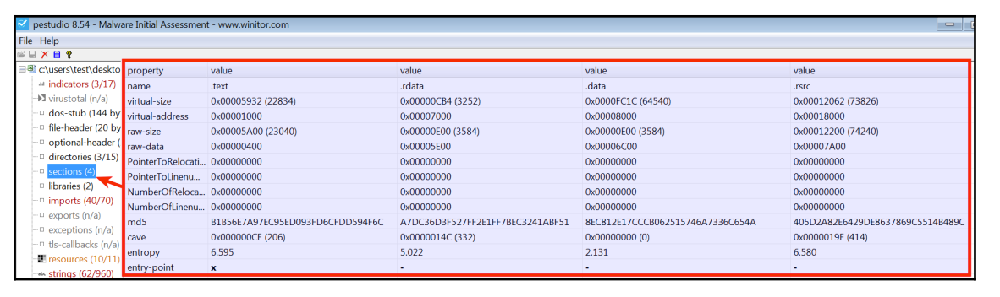

**Discrepancias:**
- Los nombres de las secciones no contienen secciones comunes añadidas por el compilador (como .text, .data, y así sucesivamente) sino que contienen nombres de sección UPX0 y UPX1.
- El punto de entrada está en la sección UPX1, lo que indica que la ejecución comenzará en esta sección (rutina de descompresión).
- Normalmente, el tamaño en bruto (raw-size) y el tamaño virtual (virtual-size) deberían ser casi iguales, pero pequeñas diferencias son normales debido al alineamiento de secciones. En este caso, el tamaño en bruto es 0, indicando que esta sección no ocupará espacio en el disco, pero el tamaño virtual especifica que, en memoria, ocupa más espacio (alrededor de 127 kb). Esto es una fuerte indicación de un binario empaquetado. La razón de esta discrepancia es que cuando se ejecuta un binario empaquetado, la rutina de descompresión del empaquetador copiará datos o instrucciones descomprimidas en la memoria durante el tiempo de ejecución.


### 8.12 Herramientas para análisis de archivos PE:
- **Comando pecheck:** El comando pecheck es una herramienta de análisis de archivos PE (Portable Executable) desarrollada por Didier Stevens. Cuando se ejecuta pecheck en un archivo PE, la herramienta examina el archivo y proporciona un informe que incluye información sobre las siguientes estructuras y elementos:
  - DOS Header: La cabecera inicial que está presente para mantener la compatibilidad con aplicaciones DOS antiguas.
  - PE Header: La cabecera que sigue al DOS Header y contiene metadatos esenciales sobre el archivo ejecutable, como la arquitectura de la máquina para la que está compilado (x86, x64, etc.) y los puntos de entrada del programa.
  - Optional Header: Una sección del PE Header que proporciona información adicional necesaria para la carga del ejecutable, como la dirección base de la imagen, la alineación de las secciones y el punto de entrada del programa.
  - Section Headers: Las cabeceras de las secciones del archivo que describen cómo se organizan los datos y el código dentro del archivo PE.
  - Data Directories: Partes del Optional Header que contienen punteros a estructuras de datos importantes como la tabla de importaciones y exportaciones, recursos y más.

- **Utilidad pe-tree:** pe-tree es una herramienta de análisis de archivos Portable Executable (PE) diseñada para proporcionar una vista estructurada y jerárquica de los componentes internos de los archivos PE.
  - Vista Jerárquica: pe-tree presenta la información del archivo PE en una estructura de árbol, lo que permite a los usuarios expandir y colapsar secciones para explorar detalles específicos de manera eficiente. Esto incluye cabeceras, secciones, tablas de importación/exportación, recursos y más.
  - Análisis de Secciones y Cabeceras: La herramienta analiza y muestra información detallada sobre las cabeceras PE, incluyendo el DOS Header, PE Header, Optional Header, y Section Headers. Esto es crucial para entender la configuración y el comportamiento potencial del archivo.
  - Identificación de Anomalías: pe-tree puede ayudar a identificar características inusuales o sospechosas en los archivos PE, como secciones ocultas, configuraciones anómalas en las cabeceras, o firmas digitales inválidas.
  - Integración con Herramientas de Análisis de Malware: pe-tree puede integrarse con otras herramientas y plataformas de análisis de malware para proporcionar una visión más completa del archivo analizado. Esto puede incluir la extracción y análisis de cadenas, así como la identificación de patrones de código malicioso.


- **Analazing PE Header en windows con CFF Explorer:** https://ntcore.com/explorer-suite/

### 8.13 Herramientas para inspeccionar cabeceras PE:
- CFF Explorer: http://www.ntcore.com/exsuite.php
- PE Internals: http://www.andreybazhan.com/pe-internals.html
-  PPEE(puppy): https://www.mzrst.com/
- PEBrowse Professional: http://www.smidgeonsoft.prohosting.com/pebrowsepro-file-viewer.html
- A tool such as **pestudio** (https://www.winitor.com) or **PPEE** (puppy: https://www.mzrst.com/) can assist you with exploring interesting artifacts from the PE file.
- PEStudio → súper visual, destaca elementos sospechosos.
- peview.exe
- Detect It Easy (DIE) → detecta si está empaquetado.
- CFF Explorer → análisis avanzado de PE.
-```objdump / readpe / pefile.py``` → para línea de comandos o scripts.
- pesec.
  
- peframe: La herramienta peframe es un analizador estático de archivos ejecutables PE (Portable Executable, típicos de Windows) usado en análisis de malware. Descargar peframe: https://github.com/guelfoweb/peframe
  ```
  python3 -m venv peenv
  # 2. Activa el entorno
  source peenv/bin/activate

  python3 -m pip install --upgrade installer

  git clone https://github.com/guelfoweb/peframe.git
  cd peframe
  
  pip install build

  python3 -m build

  # Esto creará un archivo .whl dentro del directorio dist/, algo como:
  # dist/peframe-6.0-py3-none-any.whl

  #  Instala el .whl con installer
  python3 -m installer dist/peframe-*.whl
  
  # 4. Ejecuta peframe
  peframe archivo.exe

  ```
- Detect it Easy: Die: https://horsicq.github.io/
  
- Ghidra.
  
- radare2:
  - Radare es una herramientas opensource para realizar tareas de ingeniería inversa. Su creador es Sergi Alvárez ([pancake](https://www.navajanegra.com/2025/speaker/pancake-sergi-alvarez-capilla/index.html)).
  - Cuenta con una interfaz gráfica llamada [Cutter](https://www.radare.org/cutter/).
  - Libro de radare: https://book.rada.re/
  - Para abrir un fichero en radare debemos pasar la ruta del fichero como primer parámetro.
  
  ```
  sudo apt install radare2
  r2 -A archivo.exe
  a?               # Ayuda para los comandos de análisis de binarios
  aaa              # Carga toda la información del binario
  aaaa             # Información de cadenas, llamadas (referencias cruzadas), listas de funciones, etc.
  ae               # Entrypoint analizado
  af               # Define función en dirección actual
  afl              # Lista de funciones encontradas
  afl~main         # Busca funciones que contengan "main"
  axt              # Referencias a una dirección
  axtj             # Referencias (en JSON)
  axg              # Grafo de referencias cruzadas
  dcu              # Desensamblar hasta llamada (debug)
  i                # Muestra información básica sobre el binario, como protecciones activadas durante la compilación, fecha de compilación, tipo de binario, Sistema Operativo...
  iI               # Info del formato PE (arch, machine, tamaño)
  iD               # Directivas del PE como imports/exports
  iS               # Muestra todas las secciones (.text, .data, etc.)
  iS~text          # Filtra por sección de código
  iH               # Cabecera del binario
  ii               # Imports
  iij              # Muestra imports pero en formato JSON (útil para scripts)
  ii~VirtualAlloc  # Busca funciones específicas, por ejemplo VirtualAlloc
  ii~kernel32      # Ver funciones importadas de kernel32.dll
  ii~WriteProcessMemory
  ii~CreateRemoteThread
  ii~LoadLibrary
  ii~GetProcAddress
  ii~WinExec
  iE               # Exported symbols (símbolos exportados)
  ie               #  muestra entrypoints del binario
  iz               # Strings encontradas (utf-8, ascii)
  iz~=[A-Za-z0-9]{6,} # Para buscar cadenas raras que podrían estar cifradas
  iz~xor           # Busca strings y llamadas relacionadas con cifrado
  iz~decrypt       # Busca strings y llamadas relacionadas con cifrado
  iz~key           # Busca strings y llamadas relacionadas con cifrado
  ii~RtlDecompress # Busca strings y llamadas relacionadas con cifrado
  iz               # Strings del binario
  iz~http          # Filtrar strings que contengan "http"
  /                # Comando para buscar cadenas o patrones de bytes.
  /?               # Lista los modificadores para utilizar con el comando / de búsqueda
  /x               # Comando para buscar cadenas de bytes
  /x 90 90         # Busca la secuencia 0x90 0x90
  /m               # Busca cabeceras “mágicas” (firmas de tipos de archivo) usando libmagic. Sirve para detectar archivos o estructuras embebidas dentro de un binario
  / WinExec        # Buscador de patrones
  / http           # Buscar la palabra "http"
  / bin.sh         # Buscar posibles llamadas a shells
  /c 90            # Buscar NOPs (hexadecimal)
  /R               # Busca gadgets ROP en el rango de búsqueda actual.
  /V               # 
  pdf              # Imprime el código desensamblado correspondiente a la función que nos encontremos actualmente.
  pdf              # p: print - d: desensamblado - f: función 🡆 Print disassembly function
  pd 5             # print disasm 5 🡆 imprime las 5 instrucciones de ensamblador siguientes desde la dirección actual (el offset donde estás posicionado)
  pd?              # muestra la ayuda de pd en radare2, una descripción del comando, su sintaxis y las opciones/variantes disponibles
  p?               # Muestra la ayuda del comando y sus posibles modificadores
  px               # p: print - x: hexadecimal 🡆 imprime en hexadecimal
  q                # Salir
  s main           # Comando seek que permite movernos al lugar indicado como parámetro. En este caso a la función main
  s 0x00401574     # Para movernos a una dirección de memoria concreta
  V                # Entra en modo visual (desensamblado)
                     hjkl → moverte (como en vim): izquierda, abajo, arriba, derecha
                     p → cambia el panel de vista (hexdump, ensamblador, gráfico, etc.)
                     V → alterna entre los distintos modos visuales.
                     q → salir al modo normal.
                     ? → muestra ayuda dentro del modo visual
  ....
  r2 -d archivo.exe  🡆 Depura el ejecutable con radare
  d?                # Lista de comandos de debugger
  db                # Permite añadir y quitar breakpoints en las direcciones de memoria deseadas.
  
  ```


**🛠️ Herramientas para inspección de secciones PE**
- EStudio → muestra secciones con permisos, entropía, tamaño, etc.
- Detect It Easy (DIE) → identifica empaquetadores y secciones.
- Ghidra / IDA Pro → muestra secciones y te permite analizarlas.
- CFF Explorer → análisis visual del PE Header + secciones.


### Herramienta pescanner
pescanner, creado por Michael Ligh y Glenn P. Edwards, es una excelente herramienta para detectar archivos PE sospechosos basados en los atributos del archivo PE; utiliza heurísticas en lugar de firmas y puede ayudarte a identificar binarios empaquetados incluso si no hay firmas para ello. Se puede descargar una copia del script desde https://github.com/hiddenillusion/AnalyzePE/blob/master/pescanner.py.


### Herramienta pesec
Esta herramienta es utilizada para analizar archivos binarios de Windows (PE - Portable Executable) con el objetivo de revisar ciertas protecciones de seguridad que pueda tener el ejecutable, como por ejemplo:  

- ASLR (Address Space Layout Randomization): no  
Significa que el binario no soporta aleatorización del espacio de direcciones, lo cual lo hace más vulnerable a exploits de memoria.

- DEP/NX (Data Execution Prevention / No-eXecute): no  
No tiene protección para prevenir la ejecución de código en regiones no ejecutables de la memoria. Esto facilita ataques como el buffer overflow.

- SEH (Structured Exception Handling): yes  
Indica que el ejecutable usa SEH, un mecanismo para manejar excepciones estructuradas. No es una mitigación por sí sola, pero es un dato técnico útil.

- CFG (Control Flow Guard): no  
No incluye esta mitigación contra el secuestro del flujo de control, usada para prevenir exploits tipo ROP.

- Stack cookies (EXPERIMENTAL): yes  
Usa canarios de pila (stack cookies), una protección para detectar desbordamientos de buffer.

Este binario es poco seguro: carece de ASLR, DEP/NX y CFG, lo que lo deja expuesto a ataques de explotación de memoria. Aunque tiene stack cookies y usa SEH, eso no es suficiente para considerarlo bien protegido.


### 8.14 Examinando el Compilation Timestamp ⬅️⬅️⬅️ 
El encabezado PE contiene información que especifica cuándo se compiló el binario; examinar este campo puede dar una idea de cuándo se creó inicialmente el malware. Esta información puede ser útil para construir una línea de tiempo de la campaña de ataque. También es posible que un atacante modifique la marca de tiempo para evitar que un analista conozca la marca de tiempo real. A veces, una marca de tiempo de compilación puede usarse para clasificar muestras sospechosas.

El Compilation Timestamp es un valor que se encuentra en la cabecera PE del archivo (IMAGE_FILE_HEADER.TimeDateStamp). Está en formato UNIX timestamp (número de segundos desde 1970).

✅ Nos permite:
- Construir líneas de tiempo de campañas de malware.
- Agrupar muestras por periodos o builds (compilaciones).
- Detectar malware falsamente fechado (si se repite un timestamp en muchas muestras).
- Correlacionar con eventos (por ejemplo: ataques de cierta fecha).
- Identificar muestras que usan timestamps falsos clásicos (como el famoso 0x2A425E19 que corresponde a 2001 pero se ha usado en muchas muestras modificadas).


### 8.15 Examinando PE Resources ⬅️⬅️⬅️ 
Los recursos requeridos por el archivo ejecutable, como iconos, menús, diálogos y cadenas, se almacenan en la sección de recursos (.rsrc) de un archivo ejecutable. A menudo, los atacantes almacenan información como binarios adicionales, documentos señuelo y datos de configuración en la sección de recursos, por lo que examinar los recursos puede revelar información valiosa sobre un binario. La sección de recursos también contiene información de versión que puede revelar detalles sobre el origen, el nombre de la empresa, los detalles del autor del programa y la información de copyright.


#### Ejemplo de malware que tiene una dll incrustada en la sección .rsrc
https://github.com/soniasalido/cybersecurity/blob/main/LABS/Investigating%20Malware/github_RPISEC/Labs/Lab_03/Lab-3.1/decompilado/0-Lab3.1.malware/RC_DATA-IDR_DLL1.md


### 8.16 Analizando la estructura PE de un malware
Analisis del fichero Lab_03-1.malware: Tiene estructura interna es un PE32 de Windows, concretamente un ejecutable x86 de 32 bits.
```
└─$ xxd -g 1 Lab_03-1.malware | more
00000000: 4d 5a 90 00 03 00 00 00 04 00 00 00 ff ff 00 00  MZ..............
00000010: b8 00 00 00 00 00 00 00 40 00 00 00 00 00 00 00  ........@.......
00000020: 00 00 00 00 00 00 00 00 00 00 00 00 00 00 00 00  ................
00000030: 00 00 00 00 00 00 00 00 00 00 00 00 08 01 00 00  ................
00000040: 0e 1f ba 0e 00 b4 09 cd 21 b8 01 4c cd 21 54 68  ........!..L.!Th
00000050: 69 73 20 70 72 6f 67 72 61 6d 20 63 61 6e 6e 6f  is program canno
00000060: 74 20 62 65 20 72 75 6e 20 69 6e 20 44 4f 53 20  t be run in DOS 
00000070: 6d 6f 64 65 2e 0d 0d 0a 24 00 00 00 00 00 00 00  mode....$.......
00000080: 1b 51 88 7b 5f 30 e6 28 5f 30 e6 28 5f 30 e6 28  .Q.{_0.(_0.(_0.(
00000090: 56 48 75 28 55 30 e6 28 ba 69 e7 29 5d 30 e6 28  VHu(U0.(.i.)]0.(
000000a0: ba 69 e5 29 5e 30 e6 28 ba 69 e3 29 4e 30 e6 28  .i.)^0.(.i.)N0.(
000000b0: ba 69 e2 29 52 30 e6 28 82 cf 2d 28 5c 30 e6 28  .i.)R0.(..-(\0.(
000000c0: 5f 30 e7 28 6a 30 e6 28 ad 69 ef 29 5e 30 e6 28  _0.(j0.(.i.)^0.(
000000d0: ad 69 19 28 5e 30 e6 28 5f 30 71 28 5e 30 e6 28  .i.(^0.(_0q(^0.(
000000e0: ad 69 e4 29 5e 30 e6 28 52 69 63 68 5f 30 e6 28  .i.)^0.(Rich_0.(
000000f0: 00 00 00 00 00 00 00 00 00 00 00 00 00 00 00 00  ................
00000100: 00 00 00 00 00 00 00 00 50 45 00 00 4c 01 05 00  ........PE..L...
00000110: c0 b5 fb 55 00 00 00 00 00 00 00 00 e0 00 02 01  ...U............
00000120: 0b 01 0e 00 00 0e 00 00 00 66 00 00 00 00 00 00  .........f......
00000130: 0d 13 00 00 00 10 00 00 00 20 00 00 00 00 40 00  ......... ....@.
00000140: 00 10 00 00 00 02 00 00 06 00 00 00 00 00 00 00  ................
00000150: 06 00 00 00 00 00 00 00 00 b0 00 00 00 04 00 00  ................
00000160: 00 00 00 00 03 00 40 81 00 00 10 00 00 10 00 00  ......@.........
00000170: 00 00 10 00 00 10 00 00 00 00 00 00 10 00 00 00  ................
00000180: 00 00 00 00 00 00 00 00 74 25 00 00 a0 00 00 00  ........t%......
00000190: 00 40 00 00 50 52 00 00 00 00 00 00 00 00 00 00  .@..PR..........
000001a0: 00 00 00 00 00 00 00 00 00 a0 00 00 58 01 00 00  ............X...
000001b0: 90 21 00 00 70 00 00 00 00 00 00 00 00 00 00 00  .!..p...........
000001c0: 00 00 00 00 00 00 00 00 00 00 00 00 00 00 00 00  ................
000001d0: 00 22 00 00 40 00 00 00 00 00 00 00 00 00 00 00  ."..@...........
000001e0: 00 20 00 00 dc 00 00 00 00 00 00 00 00 00 00 00  . ..............
000001f0: 00 00 00 00 00 00 00 00 00 00 00 00 00 00 00 00  ................
00000200: 2e 74 65 78 74 00 00 00 ad 0c 00 00 00 10 00 00  .text...........
00000210: 00 0e 00 00 00 04 00 00 00 00 00 00 00 00 00 00  ................
00000220: 00 00 00 00 20 00 00 60 2e 72 64 61 74 61 00 00  .... ..`.rdata..
00000230: 6e 0b 00 00 00 20 00 00 00 0c 00 00 00 12 00 00  n.... ..........
00000240: 00 00 00 00 00 00 00 00 00 00 00 00 40 00 00 40  ............@..@
00000250: 2e 64 61 74 61 00 00 00 84 03 00 00 00 30 00 00  .data........0..
00000260: 00 02 00 00 00 1e 00 00 00 00 00 00 00 00 00 00  ................
00000270: 00 00 00 00 40 00 00 c0 2e 72 73 72 63 00 00 00  ....@....rsrc...
00000280: 50 52 00 00 00 40 00 00 00 54 00 00 00 20 00 00  PR...@...T... ..
00000290: 00 00 00 00 00 00 00 00 00 00 00 00 40 00 00 40  ............@..@
000002a0: 2e 72 65 6c 6f 63 00 00 58 01 00 00 00 a0 00 00  .reloc..X.......
000002b0: 00 02 00 00 00 74 00 00 00 00 00 00 00 00 00 00  .....t..........
000002c0: 00 00 00 00 40 00 00 42 00 00 00 00 00 00 00 00  ....@..B........
000002d0: 00 00 00 00 00 00 00 00 00 00 00 00 00 00 00 00  ................
000002e0: 00 00 00 00 00 00 00 00 00 00 00 00 00 00 00 00  ................
000002f0: 00 00 00 00 00 00 00 00 00 00 00 00 00 00 00 00  ................
00000300: 00 00 00 00 00 00 00 00 00 00 00 00 00 00 00 00  ................
00000310: 00 00 00 00 00 00 00 00 00 00 00 00 00 00 00 00  ................
00000320: 00 00 00 00 00 00 00 00 00 00 00 00 00 00 00 00  ................
00000330: 00 00 00 00 00 00 00 00 00 00 00 00 00 00 00 00  ................
00000340: 00 00 00 00 00 00 00 00 00 00 00 00 00 00 00 00  ................
00000350: 00 00 00 00 00 00 00 00 00 00 00 00 00 00 00 00  ................
--More--
```

**Estructura:**
```
Offset 0x00000000  -> DOS Header
Offset 0x00000040  -> DOS Stub
Offset 0x00000080  -> Rich Header
Offset 0x00000108  -> PE Signature: PE\0\0
Offset 0x0000010C  -> IMAGE_FILE_HEADER
Offset 0x00000120  -> IMAGE_OPTIONAL_HEADER
Offset 0x00000180  -> Data Directories
Offset 0x00000200  -> Section Table
Offset 0x00000400  -> Primera sección en disco: .text
```

**Destacamos `e_lfanew = 0x108`:**

Por eso la firma `PE\0\0` no aparece exactamente en `0x100`, sino en `0x108`:
```
00000100: 00 00 00 00 00 00 00 00 50 45 00 00 4c 01 05 00
                                  ^^ ^^ ^^ ^^
                                  P  E 00 00
```


**DOS Header:**

El archivo empieza con:
```
00000000: 4d 5a 90 00 ...
```
Los dos primeros bytes son:
```
4D 5A
```
En ASCII:
```
MZ
```
Esto identifica una cabecera `DOS` válida, necesaria en los ejecutables `PE`.

El byte siguiente `90` no forma parte de la firma. Pertenece al campo siguiente del `IMAGE_DOS_HEADER`.


**Campos principales del DOS Header:** Interpretando los primeros bytes en little endian:
| Offset | Bytes         | Campo        |        Valor | Significado                       |
| -----: | ------------- | ------------ | -----------: | --------------------------------- |
| `0x00` | `4D 5A`       | `e_magic`    |         `MZ` | Firma DOS                         |
| `0x02` | `90 00`       | `e_cblp`     |     `0x0090` | Bytes en la última página DOS     |
| `0x04` | `03 00`       | `e_cp`       |     `0x0003` | Número de páginas DOS             |
| `0x06` | `00 00`       | `e_crlc`     |          `0` | Relocations DOS                   |
| `0x08` | `04 00`       | `e_cparhdr`  |     `0x0004` | Tamaño del header DOS en párrafos |
| `0x0A` | `00 00`       | `e_minalloc` |          `0` | Memoria mínima                    |
| `0x0C` | `FF FF`       | `e_maxalloc` |     `0xFFFF` | Memoria máxima                    |
| `0x0E` | `00 00`       | `e_ss`       |          `0` | Stack segment DOS                 |
| `0x10` | `B8 00`       | `e_sp`       |     `0x00B8` | Stack pointer DOS                 |
| `0x18` | `40 00`       | `e_lfarlc`   |     `0x0040` | Offset tabla relocations DOS      |
| `0x3C` | `08 01 00 00` | `e_lfanew`   | `0x00000108` | Offset del PE Header              |


El campo clave es:
```
00000030: ... 08 01 00 00
```
Eso está en el offset 0x3C.

Como es little endian:
```
08 01 00 00 = 0x00000108
```
Por tanto:
```
e_lfanew = 0x108
```
Esto significa: La cabecera `PE` real empieza en el offset `0x108` del archivo.


**DOS Stub:**

A partir del offset `0x40` aparece el código DOS Stub:
```
00000040: 0e 1f ba 0e 00 b4 09 cd 21 b8 01 4c cd 21 54 68
00000050: 69 73 20 70 72 6f 67 72 61 6d 20 63 61 6e 6e 6f
00000060: 74 20 62 65 20 72 75 6e 20 69 6e 20 44 4f 53 20
00000070: 6d 6f 64 65 2e 0d 0d 0a 24
```
La cadena ASCII es:
```
This program cannot be run in DOS mode.
```
Termina con:
```
0D 0D 0A 24
```

Donde:
```
0D = carriage return
0A = line feed
24 = '$'
```
El carácter `$` es importante porque la función DOS `int 21h / AH=09h` imprime una cadena hasta encontrar `$`.

El código ensamblador del DOS Stub imprime: `This program cannot be run in DOS mode.`. En Windows moderno, este stub normalmente no se ejecuta. El loader de Windows lee `e_lfanew`, salta a `0x108` y procesa el `PE Header`.


**Rich Header:**

Entre el DOS Stub y la cabecera PE aparece un Rich Header:
```
00000080: 1b 51 88 7b 5f 30 e6 28 ...
...
000000e0: ad 69 e4 29 5e 30 e6 28 52 69 63 68 5f 30 e6 28
                                      R  i  c  h
```
La marca visible es:
```
52 69 63 68 = Rich
```
Justo después aparece la clave XOR:
```
5F 30 E6 28
```
En little endian:
```
0x28E6305F
```
El Rich Header es una estructura añadida por herramientas de Microsoft, normalmente Visual Studio / MSVC. No forma parte estricta de la especificación PE oficial, pero es muy común.

Sirve para dejar metadatos del proceso de compilación, como versiones de compilador, linker y objetos usados. En malware puede ser útil para fingerprinting, pero también puede ser manipulado.


**PE Signature:**

En el offset indicado por `e_lfanew`, `0x108`, aparece:
```
50 45 00 00
```
En ASCII:
```
PE\0\0
```
Lo vemos aquí:
```
00000100: 00 00 00 00 00 00 00 00 50 45 00 00 4c 01 05 00
                                  50 45 00 00
```
Por tanto:
```
Offset 0x108 -> PE Signature
Offset 0x10C -> IMAGE_FILE_HEADER
```


**IMAGE_FILE_HEADER:**

Después de `PE\0\0` viene el `IMAGE_FILE_HEADER`. Empieza en:
```
0x10C
```
Los bytes relevantes son:
```
00000108: 50 45 00 00 4c 01 05 00 c0 b5 fb 55 00 00 00 00
00000118: 00 00 00 00 e0 00 02 01
```

|  Offset | Bytes         | Campo                |        Valor | Significado             |
| ------: | ------------- | -------------------- | -----------: | ----------------------- |
| `0x108` | `50 45 00 00` | Signature            |     `PE\0\0` | Firma PE                |
| `0x10C` | `4C 01`       | Machine              |     `0x014C` | Intel x86, 32 bits      |
| `0x10E` | `05 00`       | NumberOfSections     |          `5` | Tiene 5 secciones       |
| `0x110` | `C0 B5 FB 55` | TimeDateStamp        | `0x55FBB5C0` | Fecha de compilación    |
| `0x114` | `00 00 00 00` | PointerToSymbolTable |          `0` | Sin tabla COFF          |
| `0x118` | `00 00 00 00` | NumberOfSymbols      |          `0` | Sin símbolos COFF       |
| `0x11C` | `E0 00`       | SizeOfOptionalHeader |       `0xE0` | Tamaño normal para PE32 |
| `0x11E` | `02 01`       | Characteristics      |     `0x0102` | Ejecutable + 32 bits    |


**IMAGE_OPTIONAL_HEADER:**

El Optional Header empieza en: `0x120`. Aunque se llame “optional”, en un PE ejecutable normal es obligatorio. Fragmento:
```
00000120: 0b 01 0e 00 00 0e 00 00 00 66 00 00 00 00 00 00
00000130: 0d 13 00 00 00 10 00 00 00 20 00 00 00 00 40 00
00000140: 00 10 00 00 00 02 00 00 06 00 00 00 00 00 00 00
00000150: 06 00 00 00 00 00 00 00 00 b0 00 00 00 04 00 00
00000160: 00 00 00 00 03 00 40 81 00 00 10 00 00 10 00 00
```

| Campo                     |        Valor | Significado                                    |
| ------------------------- | -----------: | ---------------------------------------------- |
| `Magic`                   |     `0x010B` | PE32                                           |
| `MajorLinkerVersion`      |         `14` | Linker 14.x, compatible con Visual Studio 2015 |
| `SizeOfCode`              |      `0xE00` | Tamaño de código                               |
| `SizeOfInitializedData`   |     `0x6600` | Datos inicializados                            |
| `SizeOfUninitializedData` |          `0` | Sin bloque declarado de datos no inicializados |
| `AddressOfEntryPoint`     |     `0x130D` | RVA del punto de entrada                       |
| `BaseOfCode`              |     `0x1000` | RVA donde empieza código                       |
| `BaseOfData`              |     `0x2000` | RVA donde empiezan datos                       |
| `ImageBase`               | `0x00400000` | Base preferida en memoria                      |
| `SectionAlignment`        |     `0x1000` | Alineación en memoria                          |
| `FileAlignment`           |      `0x200` | Alineación en disco                            |
| `SizeOfImage`             |     `0xB000` | Tamaño total en memoria                        |
| `SizeOfHeaders`           |      `0x400` | Tamaño de cabeceras en disco                   |
| `Subsystem`               |          `3` | Windows Console                                |
| `DllCharacteristics`      |     `0x8140` | Mitigaciones/flags                             |
| `NumberOfRvaAndSizes`     |         `16` | 16 Data Directories                            |


**Entry Point:**

El campo más importante para empezar análisis dinámico es:
```
AddressOfEntryPoint = 0x130D
```
Esto es una RVA, no una dirección absoluta. Como:
```
ImageBase = 0x00400000
```

La VA del Entry Point será:
```
VA = ImageBase + RVA
VA = 0x00400000 + 0x0000130D
VA = 0x0040130D
```
Por tanto:
```
Entry Point = 0x0040130D
```
Ahora hay que ver en qué sección cae la `RVA 0x130D`.

La sección `.text` tiene:
```
VirtualAddress = 0x1000
VirtualSize    = 0x0CAD
```
Rango virtual aproximado:
```
.text: 0x1000 - 0x1CAD
```
Como:
```
0x130D está dentro de 0x1000 - 0x1CAD
```
el Entry Point cae dentro de:
```
.text
```
Eso es normal. No está empezando en `.rsrc`, `.data`, `.reloc` ni en una sección rara.


**Conversión del Entry Point a offset de archivo:**

Para convertir `RVA` a `Raw Offset``:
```
RawOffset = RVA - VirtualAddress_de_la_sección + PointerToRawData
```
Para .text:
```
RVA EntryPoint    = 0x130D
.text VA          = 0x1000
.text Raw Pointer = 0x0400
```
Cálculo:
```
RawOffset = 0x130D - 0x1000 + 0x0400
RawOffset = 0x070D
```
Así que el código inicial del programa está en:
```
VA:         0x0040130D
RVA:        0x0000130D
Raw offset: 0x0000070D
```
Para verlo con xxd:
```
└─$ xxd -g 1 -s 0x70d -l 0x80 Lab_03-1.malware | more
0000070d: e8 93 03 00 00 e9 7a fe ff ff 55 8b ec 6a 00 ff  ......z...U..j..
0000071d: 15 44 20 40 00 ff 75 08 ff 15 48 20 40 00 68 09  .D @..u...H @.h.
0000072d: 04 00 c0 ff 15 40 20 40 00 50 ff 15 3c 20 40 00  .....@ @.P..< @.
0000073d: 5d c3 55 8b ec 81 ec 24 03 00 00 6a 17 e8 55 09  ].U....$...j..U.
0000074d: 00 00 85 c0 74 05 6a 02 59 cd 29 a3 18 31 40 00  ....t.j.Y.)..1@.
0000075d: 89 0d 14 31 40 00 89 15 10 31 40 00 89 1d 0c 31  ...1@....1@....1
0000076d: 40 00 89 35 08 31 40 00 89 3d 04 31 40 00 66 8c  @..5.1@..=.1@.f.
0000077d: 15 30 31 40 00 66 8c 0d 24 31 40 00 66 8c 1d 00  .01@.f..$1@.f...
       
```

_______________________________________


## 9. Funciones/APIs utilizadas

**Las Windows API (Application Programming Interface de Windows)** son un conjunto de funciones y servicios que proporciona el sistema operativo Windows para que los programas (como aplicaciones o malware) puedan interactuar con el sistema.

Una Windows API es una puerta de acceso al sistema operativo que permite a los programas:
- Crear y manejar ventanas.
- Leer y escribir archivos.
- Conectarse a internet.
- Ejecutar procesos.
- Usar memoria.
- Interactuar con dispositivos, etc.


**La llamada a funciones del sistema operativo puede ser muy reveladora.**
- API sospechosas: ```CreateRemoteThread, VirtualAllocEx, RegSetValueEx```, etc.
- Algunas familias de malware tienen un patrón de llamadas único.


**📌 Ejemplos comunes de Windows API (muy usadas en malware):**

| Función API |	Lo que hace |	DLL asociada |
| -- | -- | -- |
| CreateFileA |	Abre o crea un archivo |	KERNEL32.dll |
| WriteFile |	Escribe datos en un archivo o socket |	KERNEL32.dll |
| CreateProcessA |	Crea un nuevo proceso |	KERNEL32.dll |
| VirtualAlloc |	Reserva memoria en un proceso |	KERNEL32.dll |
| LoadLibraryA |	Carga una DLL en tiempo de ejecución |	KERNEL32.dll |
| GetProcAddress |	Obtiene la dirección de una función de una DLL |	KERNEL32.dll |
| InternetOpenA |	Abre una sesión de internet |	WININET.dll |
| InternetConnectA |	Se conecta a un servidor |	WININET.dll |
| Send / Recv |	Envía/recibe datos por red |	WS2_32.dll |
| RegOpenKeyEx |	Abrir una clave del registro  |	Registry Persistence |
| RegCreateKeyEx |	Crear una clave del registro  |	Registry Persistence |
| RegSetValueEx |	Escribir un valor en una clave |	Registry Persistence |
| RegCloseKey |	Cerrar la clave del registro |	Registry Persistence |
| RegDeleteKey / RegDeleteValue |	Eliminar claves o valores |	Registry Persistence |


### 9.1 Tabla de Direcciones de Importación (IAT)
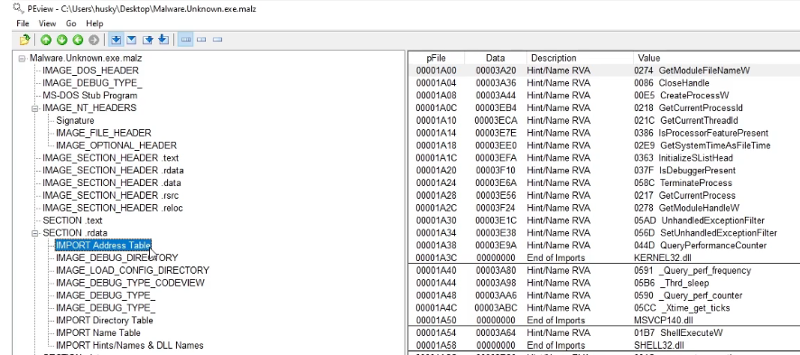

**La Tabla de Direcciones de Importación (IAT, por sus siglas en inglés: Import Address Table)** es una estructura presente en los archivos ejecutables del formato PE (Portable Executable) en Windows, utilizada tanto por programas legítimos como por malware. Su función principal es almacenar las direcciones virtuales de las funciones importadas de otras bibliotecas (DLLs), que el programa necesitará usar durante su ejecución.

El sistema operativo utiliza la **IAT para resolver en tiempo de carga dónde está cada función importada**, permitiendo así que el binario llame a funciones externas como API de Windows o funciones de otras DLLs.

Los analistas de malware suelen **revisar la IAT para identificar qué funciones y bibliotecas utiliza el malware**, lo que ayuda a determinar su comportamiento o capacidades (por ejemplo, si realiza conexiones de red, manipulación de archivos, acceso al registro, etc.).

Es común que **técnicas de evasión o persistencia de malware manipulen la IAT**, bien para ocultar llamadas a funciones, redirigirlas o enganchar (“```hookear```”) funciones y modificar el comportamiento del programa (por ejemplo, interceptar información antes de pasarla al sistema operativo).


### 9.2 Inspección de Dependencias de Archivos e Importaciones:
Cuando analizamos qué funciones importa un ejecutable desde DLLs del sistema operativo, estamos viendo su huella funcional. Eso ayuda a:
- Detectar comportamientos: ¿quiere conectarse a red? ¿leer el registro? ¿crear procesos?.
- Asociar el malware a una familia conocida (muchos malware reusan los mismos patrones de importación).
- Crear reglas YARA o modelos de detección basados en esas dependencias.

**¿Qué tipo de importaciones se suelen revisar?**
| DLL común	| Funciones clave (APIs) |	¿Qué indica? |
| -- | -- | -- |
| kernel32.dll	| 	CreateFile, ReadFile, WriteFile		| Acceso a archivos |
| kernel32.dll	| 	VirtualAllocEx		| Reserva memoria en otro proceso |
| kernel32.dll	| 	VirtualAlloc		| Reserva memoria en el propio proceso |
| kernel32.dll	| 	WriteProcessMemory		| Escribe en otro proceso |
| kernel32.dll	| 	CreateRemoteThread		| Ejecuta código en otro proceso |
| kernel32.dll	| 	VirtualProtect		| Cambia permisos de páginas de memoria |
| advapi32.dll	| 	RegOpenKey, RegSetValue, OpenService	| 	Registro de Windows, servicios |
| user32.dll	| 	MessageBox, GetAsyncKeyState	| 	Interacción con el usuario, keylogging |
| wininet.dll / ws2_32.dll	| 	InternetOpen, connect, send	| 	Conexión a red o C2 |
| ntdll.dll	| 	Funciones de bajo nivel	| 	Indicador de técnicas evasivas |


**Herramientas para inspección de importaciones:**
- PEStudio (Windows)
- CFF Explorer (Windows)
- Ghidra / IDA Pro (pestaña de imports) (Windows & Linux)
- Dependency Walker (Windows)
- ```objdump o pefile.py``` (en Linux o scripts)


**¿Cómo encaja la inspección de dependencias de archivos e importaciones en el fingerprinting?**  
Las combinaciones de funciones importadas y DLLs usadas crean un patrón único o muy característico del malware. Por Ejemplo: Si un binario importa ```WriteProcessMemory, CreateRemoteThread, y VirtualAllocEx```, hay una alta probabilidad de que esté haciendo ```process injection```, una técnica común en muchos troyanos y rootkits.

Generalmente, el malware interactúa con archivos, registros, la red, etc. Para realizar dichas interacciones, el malware depende frecuentemente de las funciones expuestas por el sistema operativo. Windows exporta la mayoría de sus funciones, llamadas **Interfaces de Programación de Aplicaciones (API)**, requeridas para estas interacciones en **archivos de Biblioteca de Enlace Dinámico (DLL)**. Los ejecutables importan y llaman a estas funciones típicamente de varias DLL que proporcionan diferentes funcionalidades. Las funciones que un ejecutable importa de otros archivos (principalmente DLL) se denominan **funciones importadas (o importaciones | imports)**.

**Por ejemplo:** Si un ejecutable de malware quiere crear un archivo en el disco, en Windows, puede usar una ```API CreateFile()```, que se exporta en kernel32.dll. Para llamar a la API, primero tiene que cargar ```kernel32.dll``` en su memoria y luego llamar a la función ```CreateFile()```.

Si inspeccionamos las DLL en las que confía un malware y las funciones API que importa de las DLL, podremos tener una idea sobre la funcionalidad y capacidad del malware y nos podremos anticipar durante su ejecución. **Las dependencias de archivos en ejecutables de Windows se almacenan en la tabla de importaciones de la estructura del archivo PE (IAT).**


**Uso Python para enumerar archivos DLL y funciones importadas:** Esto puede hacerse utilizando el módulo pefile de Ero Carrera (https://github.com/erocarrera/pefile).

```
pip install pefile
```

El siguiente script en Python demuestra cómo usar el módulo pefile para enumerar las DLLs y las funciones API importadas:
```
import pefile
import sys
mal_file = sys.argv[1]
pe = pefile.PE(mal_file)
if hasattr(pe, 'DIRECTORY_ENTRY_IMPORT'):
    for entry in pe.DIRECTORY_ENTRY_IMPORT:
        print "%s" % entry.dll
    for imp in entry.imports:
        if imp.name != None:
            print "\t%s" % (imp.name)
        else:
            print "\tord(%s)" % (str(imp.ordinal))
            print "\n"
```

A continuación se muestra el resultado de ejecutar el script anterior sobre la muestra spybot_packed.exe; en la salida, puedes ver la lista de DLLs y funciones importadas:
```
$ python enum_imports.py spybot_packed.exe
KERNEL32.DLL
 LoadLibraryA
 GetProcAddress
 VirtualProtect
 VirtualAlloc
 VirtualFree
 ExitProcess
ADVAPI32.DLL
 RegCloseKey
CRTDLL.DLL
 atoi
[...REMOVED....]
```

### 9.3 Inspeccionando Exports:
**El análisis de exports mira qué funciones expone el propio archivo malicioso (generalmente una DLL) para que otro proceso las use.** Ver qué funciones exporta un archivo nos puede revelar:
- Qué hace el malware (sin ni siquiera ejecutarlo).
- Si se trata de una DLL maliciosa disfrazada (por ejemplo, una DLL side-loaded).
- Patrón de nombres característico de una familia de malware.

**Casos típicos de uso:**
- Ver nombres de funciones exportadas: pueden estar relacionados con manipulación del registro, controladores, persistencia, etc.
- Detectar técnicas como DLL Injection o DLL Hijacking.
- Saber si es una DLL legítima modificada o una creada desde cero.

**Herramientas útiles para analizar las exportaciones:**
- PEStudio → pestaña de "Exports".
- Ghidra / IDA Pro → pestaña "Exports".
- CFF Explorer.
- Python + pefile → como el ejemplo que diste

El ejecutable y la DLL pueden exportar funciones, que pueden ser utilizadas por otros programas. Típicamente, una DLL exporta funciones (exportaciones) que son importadas por el ejecutable. Una DLL no puede funcionar por sí sola y depende de un proceso anfitrión para ejecutar su código. Un atacante a menudo crea una DLL que exporta funciones que contienen funcionalidad maliciosa. Para ejecutar las funciones maliciosas dentro de la DLL, de alguna manera se hace que sea cargada por un proceso que llama a estas funciones maliciosas. Las DLL también pueden importar funciones de otras bibliotecas (DLL) para realizar operaciones del sistema.

En Python, las funciones exportadas pueden ser enumeradas utilizando el módulo pefile, como se muestra aquí:
```
$ python
Python 2.7.12 (default, Nov 19 2016, 06:48:10)
>>> import pefile
>>> pe = pefile.PE("rmn.dll")
>>> if hasattr(pe, 'DIRECTORY_ENTRY_EXPORT'):
... for exp in pe.DIRECTORY_ENTRY_EXPORT.symbols:
... print "%s" % exp.name
...
AddDriverPath
AddRegistryforME
CleanupDevice
CleanupDevice_EX
CreateBridgeRegistryfor2K
CreateFolder
CreateKey
CreateRegistry
DeleteDriverPath
DeleteOemFile
DeleteOemInfFile
DeleteRegistryforME
DuplicateFile
EditRegistry
EnumerateDevice
GetOS
[.....REMOVED....]
```

Esto enumeraría todas las funciones exportadas por la DLL, que nos daría pistas claras de DLLs que interactúan con el registro y realizan tareas potencialmente maliciosas:
- CreateRegistry.
- EditRegistry.
- CleanupDevice.

### 9.4 Catálogo en línea de API de Windows:
Catálogo en línea de API de Windows comúnmente utilizadas en malware: https://malapi.io/
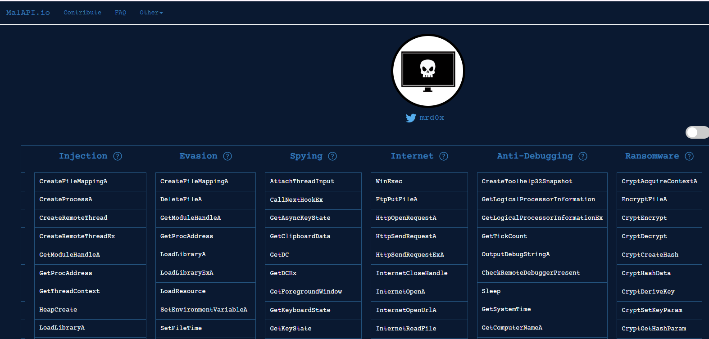

Este es un recurso increíble que ayuda a discernir qué API vale la pena analizar al realizar análisis de IAT.

______________________________

_________________________________

## 10. Desensamblado y descompilado.

## 11. Análisis de recursos embebidos.

## 12. Análisis de firmas y YARA


-------------------------------------------------
## 13. Clasificación y comparación de muestras de malware: Comparing And Classifying The Malware
Si bien el hash criptográfico (MD5/SHA1/SHA256) es una técnica excelente para detectar muestras idénticas, no ayuda a identificar muestras similares. Con frecuencia, los autores de malware cambian aspectos mínimos del malware, lo que cambia completamente el valor del hash. Las siguientes secciones describen algunas de las técnicas que pueden ayudar en comparar y clasificar el binario sospechoso:

### 13.1 Classifying Malware Using Fuzzy Hashing
La comparación de archivos mediante el hash difuso (fuzzy hashing) es un excelente método para buscar similitudes. Usaremos la herramienta ssdeep (http://ssdeep.sourceforge.net) para generar el hash difuso de una muestra. Esta herramienta también ayuda a determinar el porcentaje de similitud entre las muestras. Esta técnica es útil para comparar un binario sospechoso con las muestras en un repositorio para identificar las muestras que son similares; esto puede ayudar a identificar las muestras que pertenecen a la misma familia de malware o al mismo grupo de actores.

Usaremos ssdeep para calcular y comparar hashes difusos:
```
ssdeep veri.exe
ssdeep,1.1--blocksize:hash:hash,filename 49152:op398U/qCazcQ3iEZgcwwGF0iWC28pUtu6On2spPHlDB:op98USfcy8cwF2bC28pUtsRptDB,"/home/ubuntu/Desktop/veri.exe"
```


El hash difuso, también conocido como fuzzy hashing, es una técnica utilizada para **detectar archivos que son similares, pero no idénticos, entre sí**. Esta técnica contrasta con las funciones de hash criptográficas tradicionales, que están diseñadas para producir hashes significativamente diferentes incluso para diferencias menores en los datos de entrada

#### ssdeep y el Hash Difuso
ssdeep es una herramienta que implementa el algoritmo de hashing difuso conocido como Context Triggered Piecewise Hashing (CTPH). Este método permite identificar archivos que tienen homologías, es decir, secuencias de bytes idénticos en el mismo orden, aunque puedan existir diferencias en el contenido y la longitud de los bytes intermedios

#### Funcionamiento de ssdeep
ssdeep divide el archivo en múltiples piezas y calcula hashes tradicionales para cada pieza. Luego, combina estos hashes en una sola cadena, lo que permite comparar archivos de manera más flexible que con los hashes criptográficos. Por ejemplo, si se modifican, insertan o eliminan datos en un archivo, ssdeep aún puede encontrar un grado de similitud con el archivo original.

#### Aplicaciones de ssdeep
ssdeep es ampliamente utilizado en la detección de malware y en la identificación de archivos similares. Es particularmente útil en investigaciones forenses digitales, donde se requiere comparar archivos para identificar versiones modificadas de archivos conocidos. Por ejemplo, si se sospecha que un archivo es una variante de un malware conocido, ssdeep puede ayudar a confirmar o descartar esta sospecha al comparar los hashes difusos.

#### Instalación y Uso
ssdeep está disponible para su descarga e instalación en múltiples sistemas operativos, incluyendo Windows, Ubuntu, Fedora, Debian, CentOS, Arch Linux y FreeBSD. Para sistemas que no proporcionan un paquete de ssdeep, se puede construir a partir del código fuente disponible en GitHub.

#### Comandos Básicos de ssdeep
La herramienta ssdeep ofrece una variedad de opciones de línea de comandos para calcular y comparar hashes difusos.
- -r: Esta opción permite que ssdeep procese directorios de manera recursiva, es decir, analizará todos los archivos en el directorio actual y en todos sus subdirectorios.
- -m: se utiliza para comparar archivos contra un conjunto de hashes conocidos. Determina el porcentaje de similaridad.
- -a: Esta opción indica a ssdeep que compare cada hash contra todos los demás, lo que es útil para identificar archivos similares dentro de un conjunto de datos.
- -p: Esta opción hace que ssdeep imprima los porcentajes de coincidencia cuando compara hashes. Es útil para obtener una medida cuantitativa de cuán similares son dos archivos basados en sus hashes difusos.
- -b: Esta opción activa el modo de salida binaria. En este modo, ssdeep produce una salida en un formato que es más adecuado para el procesamiento por otras herramientas o scripts. Es importante notar que esta opción puede no ser adecuada para la visualización directa por humanos debido a su naturaleza binaria


### 13.2 Classifying Malware Using Import Hash
La técnica de **Import Hash, o imphash**, es un método utilizado para clasificar y rastrear malware **basándose en las importaciones de un archivo ejecutable PE (Portable Executable)**. Este método se centra en las funciones que el malware llama de otros archivos, generalmente DLLs (Dynamic Link Libraries) que proporcionan funcionalidad al sistema operativo Windows.

El imphash se calcula generando un valor hash a partir de los nombres de las bibliotecas/API y su orden específico dentro del ejecutable. Debido a la forma en que se genera la tabla de importaciones de un PE, el imphash resultante puede ser utilizado para identificar muestras de malware relacionadas. Si dos muestras tienen el mismo imphash, es probable que estén relacionadas y que hayan sido creadas o utilizadas por el mismo grupo de amenazas.

Mandiant, una compañía especializada en seguridad informática, utiliza el imphash para rastrear las actividades de grupos de amenazas específicos a lo largo del tiempo. Por ejemplo, si un grupo de amenazas favorece ciertos backdoors, Mandiant puede seguir la pista de estos backdoors a través de sus imphashes. Esto permite a los investigadores buscar nuevas muestras similares que el mismo grupo de amenazas podría haber creado y utilizado.

**El imphash es considerado una forma poderosa de identificar malware relacionado porque el valor del hash tiende a ser relativamente único. Esto se debe a que el enlazador del compilador genera y construye la Tabla de Direcciones de Importación (IAT) basada en el orden específico de las llamadas a las API.**

**La IAT (Import Address Table) o Tabla de Direcciones de Importación** es una estructura crítica que te dice qué funciones externas (de DLLs) usa un programa y dónde están ubicadas en memoria cuando se ejecuta.

**La IAT es una tabla de punteros a funciones importadas desde bibliotecas externas** (por ejemplo, KERNEL32.dll, USER32.dll, etc.). Se encuentra dentro del archivo PE (como un .exe o .dll) y permite que el sistema operativo resuelva las llamadas a funciones durante la carga del programa.

**La IAT sirve para:**
- Saber qué funciones del sistema utiliza el malware, lo que puede revelar su comportamiento (ej: red, archivos, procesos).
- Detectar técnicas de evasión, como:
  - Importaciones dinámicas (cuando el malware oculta las llamadas a APIs cargándolas en tiempo de ejecución con ```LoadLibrary + GetProcAddress```).
  - IAT hooking, cuando el malware modifica la tabla IAT para interceptar o redirigir funciones.


La herramienta pefile, por ejemplo, se puede utilizar para calcular el imphash de un archivo PE. Mandiant ha contribuido con un parche que permite calcular el valor del imphash para un PE dado en pefile. El siguiente es un ejemplo de código que utiliza pefile para obtener el imphash de un archivo PE:
```
import pefile
import sys

pe = pefile.PE(sys.argv[1])
print("Import Hash: %s" % pe.get_imphash())
```

Este método de clasificación de malware es útil para los investigadores de seguridad y los analistas de malware, ya que les permite correlacionar muestras de malware y rastrear la evolución de las amenazas a lo largo del tiempo.


**Nota:** La herramienta pestudio calcula automáticamente el imphash.


### 13.3 Classifying Malware Using Section Hash
La clasificación de malware utilizando el hash de sección, o Section Hash, es una técnica de análisis estático que se centra en las secciones individuales de un archivo ejecutable PE (Portable Executable). Cada sección de un archivo PE, como .text, .data, .rdata, etc., puede contener diferentes tipos de datos, como código ejecutable, recursos y datos de inicialización. Al calcular el hash de cada una de estas secciones, los analistas pueden obtener una firma que puede ser utilizada para identificar y clasificar muestras de malware.

El Section Hash es útil para identificar variantes de malware que comparten secciones de código comunes. Por ejemplo, si un atacante reutiliza un módulo de código específico en diferentes variantes de malware, el hash de la sección correspondiente será el mismo en todas estas variantes. Esto permite a los investigadores agrupar muestras relacionadas y rastrear la evolución del malware a lo largo del tiempo.

El análisis de malware con Radare2, por ejemplo, puede incluir la obtención de hashes de secciones utilizando comandos específicos como "iS" seguido de los algoritmos de hash deseados (md5, sha1, sha256), para obtener información sobre las secciones y sus respectivos hashes.

La clasificación basada en Section Hash puede ser complementada con otras técnicas de análisis estático, como el análisis de strings, el análisis de importaciones y exportaciones, y el análisis de metadatos del archivo PE. Estas técnicas proporcionan una visión más completa del comportamiento potencial del malware y pueden ayudar a identificar características únicas de diferentes familias de malware.

Es importante destacar que, aunque el Section Hash es una herramienta valiosa en la clasificación de malware, no es infalible. Los atacantes pueden ofuscar o modificar las secciones de un archivo PE para evitar la detección, lo que puede hacer que el hash de sección cambie y, por lo tanto, dificultar la clasificación basada en esta técnica. Por esta razón, el Section Hash se utiliza a menudo en combinación con otras técnicas de análisis para mejorar la precisión en la detección y clasificación del malware.

Formas de cálculo de Section Hash:
- Con la herramienta pestudio.
- Con Python: Usando el módulo pefile:
  ```
  >>> import pefile
  >>> pe = pefile.PE("5340.exe")
  >>> for section in pe.sections:
  ... print "%s\t%s" % (section.Name, section.get_hash_md5())
  ```

### 13.4 Classifying Malware Using YARA
La creación de reglas YARA es fundamental para su eficacia en la clasificación de malware. Una regla YARA típicamente consta de una sección de metadatos, donde se pueden incluir detalles como el nombre de la regla, autor, versión y cualquier otra información relevante; una sección de strings, donde se definen las cadenas de texto, binarias o expresiones regulares que se buscan; y una sección de condiciones, que especifica cómo deben coincidir o relacionarse las strings definidas para que la regla se considere como coincidente.

YARA permite la identificación rápida de malware conocido y la detección de variantes o familias de malware relacionadas mediante la búsqueda de patrones específicos.

https://yara.readthedocs.io/en/v3.7.0/writingrules.html

#### Crear reglas YARA
Para crear reglas YARA, es necesario seguir una estructura específica que consta de tres partes principales: metadatos, strings y condiciones. A continuación, se detallan los pasos para escribir reglas YARA efectivas:
- Metadatos: Los metadatos son información descriptiva sobre la regla que no afecta su funcionamiento. Incluyen detalles como el nombre de la regla, autor, versión y cualquier otra información relevante. Los metadatos son opcionales pero útiles para la organización y documentación.
- Strings: Las strings son los patrones de texto, binarios o expresiones regulares que se buscarán en los archivos o procesos. Se definen utilizando el símbolo $, seguido de un identificador. Las strings pueden ser literales, hexadecimales o basadas en expresiones regulares.
- Condiciones: Las condiciones son expresiones lógicas que determinan cuándo se considera que una regla coincide con un archivo o proceso. Las condiciones pueden ser simples, como la presencia de una string, o complejas, utilizando operadores lógicos y cuantificadores.

#### Ejemplo de una Regla YARA Básica
```
yara
rule ExampleMalwareDetection
{
    meta:
        author = "Your Name"
        description = "Detects Example Malware"
        version = "1.0"

    strings:
        $a = "malicious string" nocase
        $b = { 6A 40 68 00 30 00 00 } // Hexadecimal pattern
        $c = /md5: [0-9A-F]{32}/ // Regular expression

    condition:
        $a and $b and $c
}
```

#### Pasos para Escribir Reglas YARA:
- Definir Metadatos: Comience con la sección de metadatos para describir la regla. Aunque opcional, es una buena práctica incluir metadatos para mantener las reglas organizadas.
- Identificar Strings: Determine las strings que son indicativas del malware o del contenido que desea detectar. Puede utilizar strings literales, patrones hexadecimales o expresiones regulares.
- Establecer Condiciones: Defina las condiciones bajo las cuales se considerará que la regla ha encontrado una coincidencia. Puede utilizar operadores lógicos como and, or, y not, así como cuantificadores como all of them o any of them.
- Probar la Regla: Una vez que haya escrito la regla, pruébela con muestras conocidas para asegurarse de que detecta correctamente el malware sin generar falsos positivos.
- Refinar la Regla: Si la regla genera falsos positivos o no detecta todas las variantes del malware, ajuste las strings y las condiciones hasta que la regla sea efectiva y precisa.
- Documentar y Mantener: Documente la regla y manténgala actualizada a medida que surjan nuevas variantes del malware o se descubran nuevos indicadores de compromiso.

Es importante tener en cuenta que escribir reglas YARA efectivas requiere un conocimiento profundo del malware que se está detectando y de los patrones que lo caracterizan. Además, las reglas deben ser lo suficientemente específicas para evitar falsos positivos, pero también lo suficientemente generales para detectar variantes del malware

https://www.youtube.com/watch?v=RGXQeco_1Zk&t=787s

-----------------------------------------------

## 14. Identificación de capacidades del malware & Introducción a MITRE ATT&CK
**Capa es una herramienta de código abierto creada por Mandiant (antes FireEye) que sirve para analizar archivos ejecutables (principalmente PE de Windows) y detectar comportamientos maliciosos automáticamente, sin necesidad de ejecutar el malware. Una vez analizado el fichero, lo traduce a lenguaje MITRE ATT&CK y/o MBC.**

**Repositorio oficial:** https://github.com/mandiant/capa

Capa es un programa que detecta capacidades maliciosas en programas sospechosos mediante el uso de un conjunto de reglas. Estas reglas están diseñadas para ser de alto nivel y fácilmente comprensibles para humanos.

Por ejemplo, Capa examina un binario, identifica una llamada a API o una cadena relevante, y la compara con una regla llamada "recibir datos" o "conectarse a una URL".

La principal fortaleza de este programa es cómo utiliza las reglas. Capa tiene un conjunto de reglas por defecto, pero también cuenta con un repositorio abierto donde cualquier persona puede contribuir. 

**Opciones de capa:**
```
C:\Users\husky\Desktop
λ capa -h
usage: capa.exe [-h] [--version] [-v] [-vv] [-d] [-q] [--color {auto,always,never}] [-f {auto,pe,sc32,sc64,freeze}] [-b {vivisect,smda}] [-r RULES] [-t TAG] [-j] sample

The FLARE team's open-source tool to identify capabilities in executable files.

positional arguments:
  sample                path to sample to analyze

optional arguments:
  -h, --help            show this help message and exit
  --version             show program's version number and exit
  -v, --verbose         enable verbose result document (no effect with --json)
  -vv, --vverbose       enable very verbose result document (no effect with --json)
  -d, --debug           enable debugging output on STDERR
  -q, --quiet           disable all output but errors
  --color {auto,always,never}
                        enable ANSI color codes in results, default: only during interactive session
  -f {auto,pe,sc32,sc64,freeze}, --format {auto,pe,sc32,sc64,freeze}
                        select sample format, auto: (default) detect file type automatically, pe: Windows PE file, sc32: 32-bit shellcode, sc64: 64-bit shellcode, freeze: features previously frozen by capa
  -b {vivisect,smda}, --backend {vivisect,smda}
                        select the backend to use
  -r RULES, --rules RULES
                        path to rule file or directory, use embedded rules by default
  -t TAG, --tag TAG     filter on rule meta field values
  -j, --json            emit JSON instead of text

By default, capa uses a default set of embedded rules.
You can see the rule set here:
  <https://github.com/fireeye/capa-rules>

To provide your own rule set, use the `-r` flag:
  capa  --rules /path/to/rules  suspicious.exe
  capa  -r      /path/to/rules  suspicious.exe

examples:
  identify capabilities in a binary
    capa suspicious.exe

  identify capabilities in 32-bit shellcode, see `-f` for all supported formats
    capa -f sc32 shellcode.bin

  report match locations
    capa -v suspicious.exe

  report all feature match details
    capa -vv suspicious.exe

  filter rules by meta fields, e.g. rule name or namespace
    capa -t "create TCP socket" suspicious.exe
```

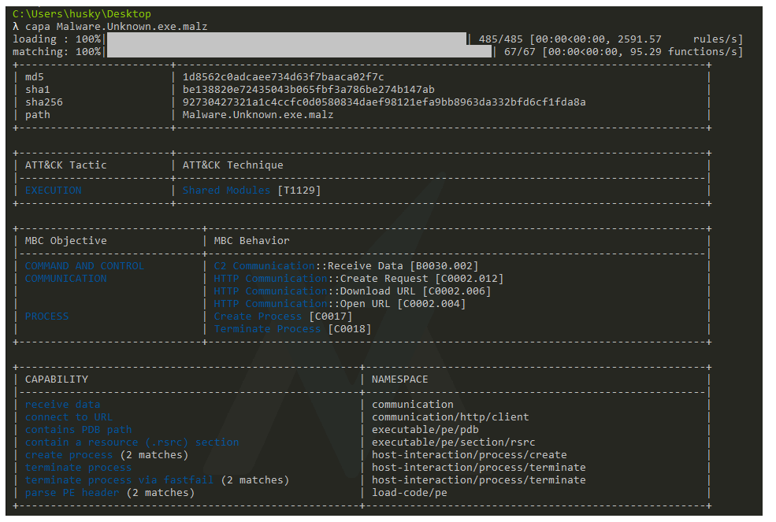


**Capa puede detectar cientos de "capabilities" (capacidades maliciosas), como:**
| Categoría |	Ejemplos detectables por Capa |
| -- | --  |
| Ejecución | 	CreateProcess, LoadLibrary, ShellExecute |
| Inyección de procesos | 	Process Hollowing, WriteProcessMemory |
| Persistencia | 	Modificar el registro, tareas programadas |
| Comunicación | 	HTTP, DNS, sockets TCP/UDP |
| Antianálisis | 	IsDebuggerPresent, RDTSC, anti-VM |
| Cifrado | 	Uso de algoritmos como RC4, XOR, AES |

**Documentación:** https://github.com/mandiant/capa-rules/blob/master/doc/format.md

### MITRE Adversary Tactics, Techniques & Common Knowledge (ATT&CK)


**MITRE ATT&CK (Adversarial Tactics, Techniques & Common Knowledge) es una base de conocimiento estandarizada sobre las tácticas, técnicas y procedimientos (TTPs) utilizados por los adversarios en el ámbito de la ciberseguridad.**

Su objetivo es definir, clasificar y documentar cómo actúan los atacantes en función de lo que quieren lograr y cómo lo logran dentro de una red o sistema.

El framework MITRE ATT&CK nos permite darle un nombre estandarizado y clasificado al comportamiento que tiene una muestra de malware.

```
En lugar de decir:
"El malware ejecuta un script de PowerShell que descarga otro ejecutable desde una URL."
Podemos decir:
"Este malware utiliza la técnica T1059.001 - PowerShell, dentro de la táctica Ejecución (TA0002)."
```
Esto estandariza la información y permite que otros analistas, empresas o defensores entiendan rápidamente lo que está pasando, sin importar el idioma o el estilo del informe.


**Estructura de MITRE ATT&CK**
- Tácticas (Tactics) – ¿Qué intenta hacer el atacante?
  Ej: Acceso inicial, Ejecución, Persistencia, Evasión, Exfiltración…

- Técnicas (Techniques) – ¿Cómo lo hace?
  Ej: Phishing (T1566), Uso de PowerShell (T1059), etc.

- Subtécnicas (Sub-techniques) – Variaciones específicas
  Ej: Spearphishing Attachment (T1566.001)

- Grupos (Groups) – ¿Quién lo está haciendo?
  Asociaciones conocidas de atacantes (APT29, FIN7, etc.)

- Mitigaciones – ¿Cómo puedo prevenirlo?

- Detecciones – ¿Cómo puedo detectarlo?

**Utilidad de MITRE en el análisis de malware:**
- Permite mapear el comportamiento del malware a técnicas conocidas.
- Facilita el informe técnico: puedes decir que tu malware usa, por ejemplo, T1059.003 - Windows Command Shell.
- Mejora la detección y respuesta: saber qué técnicas usa el malware ayuda a construir reglas YARA, alertas SIEM o defender con EDR.
- Se integra con herramientas como Capa, que traduce ensamblador a técnicas ATT&CK automáticamente.


En el ejemplo anterior de malware, obtenemos: https://attack.mitre.org/techniques/T1129/ -->
```
Los adversarios pueden ejecutar payloads maliciosos mediante la carga de módulos compartidos (Shared Modules).
El cargador de módulos de Windows (Windows module loader) puede ser instruido para cargar DLLs desde rutas locales arbitrarias o rutas de red arbitrarias usando la convención de nombres UNC (Universal Naming Convention).

Esta funcionalidad reside en la biblioteca NTDLL.dll y forma parte de la API nativa de Windows (Windows Native API), que es invocada por funciones como CreateProcess, LoadLibrary, etc., de la Win32 API.
```

**Mapear todo el ciclo de vida del malware:**
MITRE ATT&CK no solo clasifica cómo actúa el malware (la técnica), sino también por qué lo hace (la táctica):

| Táctica (¿para qué?)	| Técnica (¿cómo lo hace?) |
| -- | -- |
| Acceso inicial  | 	T1566 Phishing |
| Ejecución | 	T1059.001 PowerShell |
| Persistencia | 	T1547.001 Registro: Run Keys |
| Evasión de defensa | 	T1027 Ofuscación de código |
| Exfiltración | 	T1041 Exfiltración por canal C2 (HTTP, etc.) |

**MITRE ATT&CK es útil porque:**
- Estandariza los comportamientos del malware.
- Mapea las fases del ataque.
- Permite comunicar, comparar y defender de forma más efectiva.
- Se integra con herramientas automáticas como Capa, YARA, SIEMs y más.

## 15. Malware Behavioral Catalog (MBC)
https://github.com/MBCProject/mbc-markdown#malware-objective-descriptions

El Malware Behavior Catalog (MBC) es un marco desarrollado para capturar y clasificar los comportamientos del malware utilizando una taxonomía estructurada y coherente.

Está inspirado en la estructura de MITRE ATT&CK, pero se enfoca más profundamente en lo que hace el malware en sí, incluyendo cómo se infecta, propaga, persiste y ejecuta.

MBC ofrece descripciones objetivas del comportamiento del malware, lo que permite a los analistas clasificar muestras en función de su comportamiento y no únicamente de su código.
________________________________

## 16. Mapeo y documentación.
--------------------------------------------

## Instalacion de Ghidrathon

### Crea un entorno Python 3 con jep instalado:
```
python3 -m venv ~/ghidra-py
source ~/ghidra-py/bin/activate
pip install --upgrade pip
pip install jep==4.2.0
deactivate
```

### Configuramos la variable de entorno:
```
export JAVA_HOME=/usr/lib/jvm/java-21-openjdk-amd64
```

### Agregar la variable de entorno a nuestro usuario:
```
echo 'export JAVA_HOME=/usr/lib/jvm/java-21-openjdk-amd64' >> ~/.bashrc
echo 'export PATH="$JAVA_HOME/bin:$PATH"' >> ~/.bashrc
source ~/.bashrc
```


### Instalammos Ghidrathon
Descargamos Ghidrathon en nuestro Ghidra environment: https://github.com/mandiant/Ghidrathon
Ejecutamos:
```
python -m pip install -r requirements.txt
python ghidrathon_configure.py <absolute_path_to_ghidra_install_dir>
```

### :
ghidrathon_configure.py by default attempts to write a file named ghidrathon.save to <absolute_path_to_ghidra_install_dir>. You can specify the path where this file is written by setting the GHIDRATHON_SAVE_PATH environment variable before running ghidrathon_configure.py and Ghidra:
```
export GHIDRATHON_SAVE_PATH="/path/to/custom/dir" # Linux/MacOS
```

### Si no lo crea, entonces creamos el archivo ghidrathon.save apuntando al Python de nuestro venv.
```
cd /home/xxniwexx/Escritorio/ghidra_11.4.1_PUBLIC
python ghidrathon_configure.py /home/xxniwexx/Escritorio/ghidra_11.4.1_PUBLIC
```


### Instalar capa en el mismo Python que usa Ghidrathon
```
source ~/ghidra-py/venv/bin/activate
/home/xxniwexx/ghidra-py/bin/python -m pip install --upgrade flare-capa
deactivate
```

### Comprobamos la version de capa instalado:
```
/home/xxniwexx/ghidra-py/bin/python -c "import importlib.util, pkgutil, sys; import capa; print('version:', getattr(capa,'__version__', 'unknown')); print('capa.main ->', importlib.util.find_spec('capa.main'))"
/home/xxniwexx/ghidra-py/bin/capa --version
```

### Descargamos las reglas de capa
```
git clone https://github.com/mandiant/capa-rules.git ~/capa-rules
```


### Editar el script o introducir rutas al ejecutarlo
Al ejecutar capa_explorer.py o capa_ghidra.py Si es la primera vez, debe pedirnos el path a capa y rules dir. Si no lo hacen, puedes abrir el script y buscar las variables tipo:
```
capa_path = "/ruta/a/capa"
rules_dir = "/ruta/a/capa-rules"
```

### Vemos su funcionamiento
Una vez instalado, ejecutamos el script. Aparece el informe que genera la herramienta capa. Podemos acceder a las partes que detecta este informe, haciendo doble click en ellas.


-------------------------------------------------
## Instalacion de plugin CAPA para Ghidra
El ZIP del plugin capa explorer no viene con Ghidra, tenemos que descargarlo del repositorio oficial de capa en GitHub.

Descargamos capa_explorer.py y capa_ghidra.py: https://github.com/mandiant/capa/tree/master/capa/ghidra

En la ventana de script manager de ghidra, creamos una nueva carpeta de plugins. Una vez creada pegamos esos ficheros en esa nueva carpeta.


-----------------------------------------------
# CHAPTER 3: DYNAMIC ANALYSIS


El análisis dinámico de malware es un proceso que implica la ejecución del malware en un entorno controlado y aislado, conocido como sandbox o máquina virtual, para observar su comportamiento y funcionalidad en tiempo real. Este tipo de análisis permite a los investigadores y analistas de seguridad comprender cómo se comporta el malware una vez que se ejecuta en un sistema, identificando las acciones que realiza, como la modificación de archivos, la comunicación con servidores remotos, la inyección de código en otros procesos, entre otros comportamientos maliciosos.

Las ventajas del análisis dinámico incluyen la capacidad de obtener información detallada sobre el comportamiento del malware, lo que permite documentar y entender mejor las amenazas para desarrollar medidas de protección más efectivas. Además, este tipo de análisis puede revelar la presencia de técnicas de evasión, como la detección de entornos virtuales (antisandbox), que el malware puede utilizar para evitar su análisis en entornos controlados.

El análisis dinámico es complementario al análisis estático, que se enfoca en el examen del código fuente del malware sin ejecutarlo, proporcionando una visión completa del funcionamiento y propósito del software malicioso. Juntos, el análisis estático y dinámico ofrecen una metodología robusta para el estudio y la clasificación de malware, contribuyendo significativamente a la ciberseguridad y la defensa contra amenazas informáticas.

## 1. Lab Environment Overview
Tanto la máquina virtual de Linux como la de Windows se configuraron para utilizar el modo de configuración de red de solo anfitrión. La máquina virtual de Linux estaba preconfigurada con una dirección IP de 192.168.1.100, y la dirección IP de la máquina virtual de Windows se estableció en 192.168.1.50. La puerta de enlace predeterminada y el DNS de la máquina virtual de Windows se establecieron en la dirección IP de la máquina virtual de Linux (192.168.1.100), de modo que todo el tráfico de red de Windows se enrutara a través de la máquina virtual de Linux. La máquina virtual de Windows se utilizará para ejecutar la muestra de malware durante el análisis, y la máquina virtual de Linux se utilizará para monitorear el tráfico de red y se configurará para simular servicios de internet (como DNS, HTTP, y otros) para proporcionar la respuesta adecuada cuando el malware solicite estos servicios.

## 2. System And Network Monitoring
El objetivo de un análisi dinámico es recopilar datos en tiempo real relacionados con el comportamiento del malware y su impacto en el sistema. Diferentes tipos de monitoreo realizados durante el análisis dinámico:
- Monitoreo de procesos: Implica monitorear la actividad del proceso y examinar las propiedades del proceso resultante durante la ejecución del malware.
- Monitoreo del sistema de archivos: Incluye monitorear la actividad del sistema de archivos en tiempo real durante la ejecución del malware.
- Monitoreo del registro: Implica monitorear las claves del registro a las que se accede/modifica y los datos del registro que son leídos/escritos por el binario malicioso.
- Monitoreo de la red: Involucra monitorear el tráfico en vivo hacia y desde el sistema durante la ejecución del malware.


## 3. Dynamic Analysis (Monitoring) Tools

### 3.1 Process Inspection with Process Hacker
Process Hacker (http://processhacker.sourceforge.net/) is an open source, multipurpose tool that helps in monitoring system resources. It is a great tool for examining the
processes running on the system and to inspect the process attributes. It can also be used to explore services, network connections, disk activity, and so on.

VirusTotal lo detecta como malware.

### 3.2 Determining System Interaction with Process Monitor
Process Monitor (https://technet.microsoft.com/en-us/sysinternals/processmonitor.aspx) is an advanced monitoring tool that shows the real-time interaction of the processes
with the filesystem, registry, and process/thread activity.

### 3.3 Logging System Activities Using Noriben
Even though Process Monitor is a great tool to monitor a malware's interaction with the system, it can be very noisy, and manual effort is required to filter the noise. Noriben
(https://github.com/Rurik/Noriben) is a Python script that works in conjunction with Process Monitor and helps in collecting, analyzing, and reporting runtime indicators of the
malware. The advantage of using Noriben is that it comes with pre-defined filters that assist in reducing noise and allow you to focus on the malware-related events.

### 3.4 Capturing Network Traffic With Wireshark
When the malware is executed, you will want to capture the network traffic generated as a result of running the malware; this will help you understand the communication channel
used by the malware and will also help in determining network-based indicators. 

### 3.5 Simulating Services with INetSim
INetSim is a free Linux-based software suite for simulating standard internet services (such as DNS, HTTP/HTTPS, and so on).

Another alternative to INetSim is FakeNet-NG (https://github.com/fireeye/flare-fakenet-ng), which allows you to intercept and redirect all or specific network traffic by simulating network services.


## 4. Dynamic Analysis Steps
Durante el análisis dinámico (análisis del comportamiento), seguriemos una secuencia de pasos para determinar la funcionalidad del malware. La siguiente lista describe los pasos involucrados en el análisis dinámico:
- Revertir a la instantánea limpia: Esto incluye volver tus máquinas virtuales a un estado limpio.
- Ejecutar las herramientas de monitoreo/análisis dinámico: En este paso, ejecutarás las herramientas de monitoreo antes de ejecutar la muestra de malware. Para aprovechar al máximo las herramientas de monitoreo cubiertas en la sección anterior, necesitas ejecutarlas con privilegios de administrador.
- Ejecutar la muestra de malware: En este paso, ejecutarás la muestra de malware con privilegios de administrador.
- Detener las herramientas de monitoreo: Esto implica terminar las herramientas de monitoreo después de que el binario de malware se haya ejecutado durante un tiempo especificado.
- Analizar los resultados: Esto implica recopilar los datos/informes de las herramientas de monitoreo y analizarlos para determinar el comportamiento y la funcionalidad del malware.


## 5. Putting it All Together: Analyzing a Malware Executable
Realizaremos tanto análisis estático como dinámico para determinar las características y el comportamiento de una muestra de malware.


## 6. Dynamic-Link Library (DLL) Analysis


# Examples
## Emotet
https://assets.tryhackme.com/additional/cmn-malware/int-mal-sample.pdf

---------------------------------------------
---------------------------------------------
## Usar PEStudio (Interfaz gráfica)
- Descarga PEStudio (gratis):🔗 https://www.winitor.com/
- Abre el archivo sospechoso (.exe, .dll) desde PEStudio.
- Ve a la pestaña: Sections.
- Observa los siguientes campos:
  - Nombre de la sección: .text, .data, .rsrc, etc.
  - Entropy: si es muy alta (> 7.0), puede indicar cifrado u ofuscación.
  - RVA / Offset / Tamaño virtual: diferencias notables pueden ser sospechosas.

Permissions: busca secciones con Executable + Writable, lo cual no es normal y puede indicar shellcode.

📌 PEStudio también marcará en rojo o naranja las secciones que considera sospechosas automáticamente.


## Script en Python con pefile
Este script analiza las secciones y te muestra:
- Nombres
- Tamaños
- Entropía
- Permisos
```
pip install pefile
import pefile
import math

def get_entropy(data):
    if not data:
        return 0.0
    entropy = 0
    for x in range(256):
        p_x = float(data.count(bytes([x]))) / len(data)
        if p_x > 0:
            entropy -= p_x * math.log2(p_x)
    return entropy

pe = pefile.PE("malware.exe")

print("Nombre | Tamaño | Entropía | Permisos")
print("-" * 50)

for section in pe.sections:
    name = section.Name.strip().decode('utf-8', errors='replace')
    size = section.SizeOfRawData
    entropy = get_entropy(section.get_data())
    perms = section.Characteristics

    exec_flag = bool(perms & 0x20000000)
    write_flag = bool(perms & 0x80000000)
    read_flag = bool(perms & 0x40000000)

    flags = []
    if read_flag: flags.append("R")
    if write_flag: flags.append("W")
    if exec_flag: flags.append("X")

    print(f"{name:7} | {size:6} | {entropy:.2f}    | {' '.join(flags)}")

    # Posible anomalía
    if entropy > 7.0:
        print(f"⚠️  Alta entropía en {name}")
    if exec_flag and write_flag:
        print(f"🚨  Sección ejecutable y escribible: {name}")

```

Resultado típico:
```
Nombre | Tamaño | Entropía | Permisos
-----------------------------------------
.text   | 20480  | 6.35    | R X
.data   | 8192   | 5.22    | R W
.rsrc   | 10240  | 7.85    | R
⚠️  Alta entropía en .rsrc
```

## Script en Python para analizar secciones PE
```
import pefile
import math
import pandas as pd

def get_entropy(data):
    if not data:
        return 0.0
    entropy = 0
    for x in range(256):
        p_x = float(data.count(bytes([x]))) / len(data)
        if p_x > 0:
            entropy -= p_x * math.log2(p_x)
    return entropy

# Ruta del archivo PE a analizar
file_path = "malware.exe"  # Cambia esto por el nombre de tu archivo

pe = pefile.PE(file_path)
section_data = []

for section in pe.sections:
    name = section.Name.strip().decode('utf-8', errors='replace')
    size = section.SizeOfRawData
    entropy = get_entropy(section.get_data())
    perms = section.Characteristics

    exec_flag = bool(perms & 0x20000000)
    write_flag = bool(perms & 0x80000000)
    read_flag = bool(perms & 0x40000000)

    flags = []
    if read_flag: flags.append("R")
    if write_flag: flags.append("W")
    if exec_flag: flags.append("X")

    section_data.append({
        "Sección": name,
        "Tamaño (bytes)": size,
        "Entropía": round(entropy, 2),
        "Permisos": " ".join(flags),
        "Alta entropía": entropy > 7.0,
        "RWX (riesgo)": exec_flag and write_flag
    })

# Exportar a CSV
df = pd.DataFrame(section_data)
df.to_csv("resultado_secciones.csv", index=False)

print("✅ Análisis completado. Revisa 'resultado_secciones.csv'")
```

🧰Requisitos. Es necesario tener estos módulos instalados:
```
pip install pefile pandas
```

Este script analizará las secciones, calculará entropía y marcará secciones sospechosas (como aquellas con permisos de ejecución y escritura o entropía alta), y nos exportará todo a un archivo resultado_secciones.csv que podrás abrir en Excel o cualquier visor de hojas de cálculo.


----------------------------------------------
----------------------------------------------
## Enlaces de interés

https://tutorials.ophion.feralhosting.com/Tutorials/Malware%20Analysis/UD-Reverse-Engineering-And-Malware-Analysis-Fundamentals/

https://elhacker.info/manuales/An%c3%a1lisis%20de%20malware/

https://elhacker.info/manuales/An%C3%A1lisis%20de%20malware/Learning%20Malware%20Analysis_%20Explore%20the%20concepts,%20tools,%20and%20techniques%20to%20analyze%20and%20investigate%20Windows%20malware%20(%20PDFDrive.com%20).pdf

https://www.wolf.university/masteringmalwareanalysis/ebook/masteringmalwareanalysis.pdf

https://www.wolf.university/cybersecuritythreatsmalwaretrendsandstrategies/ebook/cybersecuritythreatsmalwaretrendsandstrategies.pdf

https://elhacker.info/manuales/An%c3%a1lisis%20de%20malware/Practical_Malware_Analysis.pdf


https://elhacker.info/manuales/An%c3%a1lisis%20de%20malware/Windows%20Malware%20Analysis%20Essentials_%20Master%20the%20fundamentals%20of%20malware%20analysis%20for%20the%20Windows%20platform%20and%20enhance%20your%20anti-malware%20skill%20set%20(%20PDFDrive.com%20).pdf

https://www.wolf.university/ghidrasoftwarereverseengineeringforbeginners/ebook/ghidrasoftwarereverseengineeringforbeginners.pdf

https://elhacker.info/manuales/An%c3%a1lisis%20de%20malware/intro-reverseeng.pdf


https://github.com/Neo23x0/signature-base/tree/master/yara


https://github.com/baynam1995/MalwareAnalysiBook/blob/master/Learning.Malware.Analysis.Techniques.Investigate.pdf

https://elhacker.info/manuales/Virus/Rootkits%20and%20Bootkits_%20Reversing%20Modern%20Malware%20and%20Next%20Generation%20Threats%20Early%20Access.pdf


https://ftp.idu.ac.id/wp-content/uploads/ebook/tdg/MILITARY%20REFERENCE%20AND%20REVERSE%20ENGINEERING/Mastering%20Reverse%20Engineering%20Re-engineer%20your%20ethical%20hacking%20skills%20by%20Reginald%20Wong%20(z-lib.org).pdf

https://ccdcoe.org/uploads/2020/07/Malware_Reverse_Engineering_Handbook.pdf

https://github.com/Dump-GUY/Malware-analysis-and-Reverse-engineering

https://github.com/gabimarti/ingenieria_inversa_a_partir_del_codigo_fuente/tree/master


Binary Ninja is an interactive decompiler, disassembler, debugger, and binary analysis platform built by reverse engineers, for reverse engineers: https://binary.ninja/


https://rada.re/n/

https://github.com/jgamblin/Mirai-Source-Code


https://fundacion-sadosky.github.io/guia-escritura-exploits/
