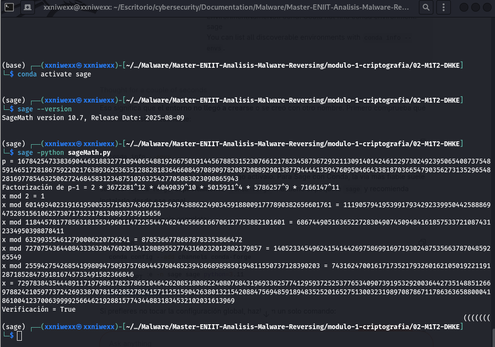

<div class="page"/>


- [**Entendiendo qué pide el ejercicio**](#entendiendo-qué-pide-el-ejercicio)
- [**Extraer de los PEM los parámetros DH**](#extraer-de-los-pem-los-parámetros-dh)
- [**Validar criptográficamente las claves públicas**](#validar-criptográficamente-las-claves-públicas)
  - [**¿Cumplen ambas claves públicas con lo mínimo exigido?**](#cumplen-ambas-claves-públicas-con-lo-mínimo-exigido)
  - [**¿Son compatibles las claves públicas entre sí? ¿Pertenecen al mismo grupo?**](#son-compatibles-las-claves-públicas-entre-sí-pertenecen-al-mismo-grupo)
  - [**¿El grupo elegido es seguro?**](#el-grupo-elegido-es-seguro)
    - [**Factorizando p-1**](#factorizando-p-1)
- [**Recuperar una clave privada mediante Pohlig–Hellman**](#recuperar-una-clave-privada-mediante-pohlighellman)
- [**Calcular el secreto compartido DH**](#calcular-el-secreto-compartido-dh)
- [**Derivar la clave AES con HKDF-SHA256**](#derivar-la-clave-aes-con-hkdf-sha256)
- [**Tomar los primeros 16 bytes de gon.enc como IV \& Descifrar el resto con AES-CBC**](#tomar-los-primeros-16-bytes-de-gonenc-como-iv--descifrar-el-resto-con-aes-cbc)
- [**Conclusión del ejercicio**](#conclusión-del-ejercicio)


# **Entendiendo qué pide el ejercicio**

Partes para resolver:
- Recuperar la clave AES.
- Usar esta clave para descifrar `gon.enc`.
 

Según el enunciado, el ransomware acuerda un secreto con Diffie-Hellman, lo pasa por HKDF-SHA256 con info = "shared key" y después cifra los archivos con AES-CBC. Además, el IV está en los primeros 16 bytes del fichero cifrado.


**El punto decisivo:**
- AES-CBC sí se puede revertir si tenemos la clave y el IV.
- El IV ya lo tenemos: está guardado al principio de `gon.enc`.
- La clave AES no está guardada: se deriva del secreto DH.
- Por tanto, todo dependerá de si podemos reconstruir el secreto Diffie-Hellman sólo a partir de las claves públicas.
  

**1. Sabemos que tenemos:**
- `dhPubCC.pem`: clave pública del servidor C&C.
- `dhPubLocal.pem`: clave pública de la máquina víctima.
- `gon.enc`: un archivo cifrado cualquiera.
- El IV está en los primeros 16 bytes de `gon.enc`.
- La clave privada local de DH fue borrada y no queda rastro de la clave AES ni del original.


**El objetivo real es reconstruir:**
- El secreto compartido DH.
- La clave derivada de 32 bytes con HKDF.
- Usar esa clave con AES-CBC y el IV para descifrar.


**2. Entendiendo qué operación produce la clave de cifrado:**  
Esto es lo que el ransomware hace:
- Calcula el secreto compartido DH: s=(Y<sub>CC</sub>)<sup>xlocal</sup> mod p
    - Y<sub>CC</sub> es la clave pública del servidor.
    - xlocal es la clave privada local borrada.

- Deriva: K=HKDF-SHA256(s, salt=∅, info="shared key", len=32)

- Usa `k` como clave AES-CBC para todos los ficheros.

- Conclusión: Tenemos que recuperar `s` para recuperar `k`.


# **Extraer de los PEM los parámetros DH**
El enunciado del ejercicio dice que esas dos claves públicas son la única información criptográfica que quedó en el disco. Vamos a abrir los ficheros `dhPubCC.pem` y `dhPubLocal.pem` para extraer los parámetros de Diffie-Hellman. También tendremos comprobar que:
- Que ambas claves usan los mismos parámetros `p` y `g`.
- Que los valores públicos tienen forma válida para ese grupo.

Vamos a extraer de cada PEM: De cada clave pública DH nos interesan estos valores:
- `p`: El primo del grupo.
- `g`: El generador.
- `y`: El valor público de esa parte:
    - Para `dhPubLocal.pem`, sería el `Y_local`.
    - Para `dhPubCC.pem` sería `Y_CC`

Luego haremos la comparación:
- Si p es el mismo en ambos.
- Si g es el mismo en ambos.

Si NO coinciden, NO pertenecen al mismo intercambio DH.


**Inspeccionamos la clave pública local:**
```
└─$ openssl pkey -pubin -in dhpublocal.pem -text -noout
DH Public-Key: (1024 bit)
public-key:
    06:e8:c8:d4:19:5a:6d:2d:6f:7e:c5:9c:2f:bc:71:
    d4:7e:ed:c3:28:ae:89:20:78:36:8d:e2:59:26:f6:
    6f:7f:f6:14:0e:17:21:0a:f8:31:73:64:1f:52:2d:
    6d:92:cb:78:c6:a2:dd:d0:0a:99:2d:6f:7e:9c:65:
    a4:44:a7:3d:0f:b6:cb:b5:28:08:90:02:6c:0e:7e:
    9a:e2:83:9f:00:6b:30:02:ef:f3:1a:4f:8f:4e:8a:
    d8:32:1d:81:be:a8:f6:d0:a2:aa:b2:00:3a:fc:b0:
    bb:29:74:5d:1c:31:b1:96:0f:0d:4b:de:ea:de:e8:
    25:fe:d0:c3:f4:fd:1d:f5
P:   
    00:ef:04:06:4e:89:29:35:71:2a:d8:82:11:ba:6c:
    1a:9e:58:a8:45:c7:dc:3e:b5:3d:13:95:7c:20:0e:
    94:6a:f4:94:54:76:7f:fd:45:d1:4a:74:2c:84:09:
    27:df:2e:d7:6c:83:dc:50:f5:ac:2b:45:8d:6b:ed:
    32:a7:a1:bf:4a:12:29:78:38:c5:eb:54:21:e8:f5:
    a7:c5:53:77:12:69:d2:54:4e:29:8b:d1:2f:10:47:
    40:e7:52:13:45:f1:73:2e:f3:f4:d6:b7:d6:fe:94:
    33:85:c9:74:54:d4:68:6d:94:6b:38:80:7a:b3:d8:
    b4:3a:0d:e5:2f:df:69:57:17
G:    5 (0x5)

```
donde:
- public-key → Y<sub>local</sub> → 06e8c8d4....
- prime → p → 00ef0406...
- generator → g → 5


**Inspeccionamos la clave pública del C&C:**
```
└─$ openssl pkey -pubin -in dhpubCC.pem -text -noout
DH Public-Key: (1024 bit)
public-key:
    1d:12:bb:62:34:4d:ac:6d:b5:e1:0c:9d:f4:45:72:
    64:62:65:df:ce:9c:7d:59:a9:a0:2a:7d:88:09:6d:
    64:43:47:39:58:6f:e3:2a:c8:bb:31:5e:a1:f3:2e:
    5c:1a:0a:4a:ff:db:5c:13:ae:f5:3d:07:44:48:ae:
    67:56:8c:a0:3a:69:96:30:34:97:38:61:18:b3:1c:
    1d:1c:29:2a:72:fd:44:eb:7f:f4:34:1d:49:6b:f0:
    11:bf:5a:5b:e0:aa:9b:1a:68:4d:00:d7:9c:e4:e4:
    da:a7:50:47:79:f2:90:7f:bf:3f:e2:02:73:e0:b0:
    80:a7:c5:10:f6:71:9c:aa
P:   
    00:ef:04:06:4e:89:29:35:71:2a:d8:82:11:ba:6c:
    1a:9e:58:a8:45:c7:dc:3e:b5:3d:13:95:7c:20:0e:
    94:6a:f4:94:54:76:7f:fd:45:d1:4a:74:2c:84:09:
    27:df:2e:d7:6c:83:dc:50:f5:ac:2b:45:8d:6b:ed:
    32:a7:a1:bf:4a:12:29:78:38:c5:eb:54:21:e8:f5:
    a7:c5:53:77:12:69:d2:54:4e:29:8b:d1:2f:10:47:
    40:e7:52:13:45:f1:73:2e:f3:f4:d6:b7:d6:fe:94:
    33:85:c9:74:54:d4:68:6d:94:6b:38:80:7a:b3:d8:
    b4:3a:0d:e5:2f:df:69:57:17
G:    5 (0x5)
```
donde:
- public-key → Y<sub>CC</sub> → 1d12bb62....
- prime → p → 00ef0406...
- generator → g → 5

**Conclusión:** Ambas claves públicas DH usan los mismos parámetros de dominio:
- Mismo primo p = 00ef0406...
- Mismo generador g=5
- Por tanto, `dhPubLocal.pem` y `dhPubCC.pem` pertenecen al mismo grupo Diffie-Hellman, y sí pueden formar parte del mismo intercambio DH. Eso corrobora el escenario del enunciado del ejercicio.


**Notas sobre el primo:**
- El 00 inicial del primo no cambia el valor matemático del primo. Suele aparecer en la codificación ASN.1/DER para indicar que el entero es positivo. Entonce el valor real del primo es:
```
ef04064e892935712ad88211ba6c1a9e58a845c7dc3eb53d13957c200e946af49454767ffd45d14a742c840927df2ed76c83dc50f5ac2b458d6bed32a7a1bf4a12297838c5eb5421e8f5a7c553771269d2544e298bd12f104740e7521345f1732ef3f4d6b7d6fe943385c97454d4686d946b38807ab3d8b43a0de52fdf695717
```
- OpenSSL indica 1024 bits. Eso describe el tamaño de `p`.


# **Validar criptográficamente las claves públicas**
Vamos a aplicar la pista: Vamos a validar las claves públicas. Con Diffie-Hellman, no basta con ver una clave pública y asumir que es normal. Hay que comprobar si:
- Está en el rango correcto.
- Pertenece al subgrupo esperado.
- No es un valor degenerado como 1, p-1, 0, etc.
- No fuerza un secreto compartido trivial o de muy pocos valores.

## **¿Cumplen ambas claves públicas con lo mínimo exigido?**
- 1 < Y<sub>local</sub> <  p-1.
- 1 < Y<sub>CC</sub> < p-1.

Esto implica que no estamos ante casos triviales como `0`, `1` o `p-1`.


## **¿Son compatibles las claves públicas entre sí? ¿Pertenecen al mismo grupo?**
- Ambas usan el mismo `p`.
- Ambas usan el mismo `g`.

Esto implica que son compatibles entre sí. Las dos claves públicas están definidas sobre el mismo dominio DH. Si una usara otro `p` u otro `g`, ni siquiera tendría sentido hablar del mismo intercambio.


## **¿El grupo elegido es seguro?**
Para saber si el grupo elegido es seguro, debemos mirar la estructura de grupo, es decir, debemos estudiar cómo está compuesto `p-1`.

Para evaluar la seguridad del grupo DH hay que estudiar la factorización de `p−1`, ya que el orden del grupo multiplicativo módulo `p` es precisamente 
`p−1`. Si ese orden tiene un factor primo grande, el grupo puede ser adecuado para Diffie–Hellman. Si, por el contrario, `p−1` es muy suave y se descompone en factores pequeños, el logaritmo discreto se simplifica mediante Pohlig–Hellman, debilitando el intercambio.

### **Factorizando p-1**

Script python para factorizar p-1:
```
from sympy import factorint

p = int("ef04064e892935712ad88211ba6c1a9e58a845c7dc3eb53d13957c200e946af49454767ffd45d14a742c840927df2ed76c83dc50f5ac2b458d6bed32a7a1bf4a12297838c5eb5421e8f5a7c553771269d2544e298bd12f104740e7521345f1732ef3f4d6b7d6fe943385c97454d4686d946b38807ab3d8b43a0de52fdf695717", 16)

f = factorint(p - 1)
print(f)
```

Salida:
```
└─$ python3 factorizar.py 
{2: 1, 5786257: 9, 7166147: 11, 5015911: 4, 4049039: 10, 3672281: 12}
```
donde:
- Se obtiene: p−1 = 2⋅5786257<sup>9</sup> ⋅ 7166147<sup>11</sup> ⋅ 5015911<sup>4</sup> ⋅ 4049039<sup>10</sup> ⋅ 3672281<sup>12</sup>
- Vemos que `p−1` está completamente factorizado.
- Sus factores primos son relativamente pequeños.
  

**<mark>Conclusión: Se verificó que ambas claves públicas DH están en el rango válido y usan los mismos parámetros `(p,g)`. Sin embargo, la seguridad del intercambio no depende solo de eso. Al analizar el primo, se obtuvo que `p−1` factoriza completamente en potencias de factores relativamente pequeños, por lo que el grupo multiplicativo módulo `p` es suave. En estas condiciones, el logaritmo discreto puede resolverse mediante Pohlig–Hellman, recuperando la clave privada a partir de la pública. Por tanto, el secreto compartido DH no está realmente protegido y sí puede reconstruirse, lo que permitiría derivar la clave AES y descifrar el fichero..</mark>**


# **Recuperar una clave privada mediante Pohlig–Hellman**

Una vez establecida la debilidad del grupo, el siguiente paso es resolver el logaritmo discreto de una de las claves públicas para recuperar una clave privada DH mediante Pohlig–Hellman. Con esa clave privada y la clave pública de la otra parte se reconstruye el secreto compartido. A continuación, se deriva la clave de 32 bytes con HKDF-SHA256, sin salt y con info = "shared key". Finalmente, se toma el IV de los primeros 16 bytes del fichero cifrado y se descifra el resto con AES-CBC.

A partir de la clave pública Diffie–Hellman se tiene: Y<sub>local</sub>=g<sup>x<sub>local</sub></sup> mod p
donde:
- `p` es el primo del grupo.
- `g` es el generador.
- Y<sub>local</sub> es la clave pública local.
- x<sub>local</sub> es la clave privada que queremos recuperar.

Para recuperar la clave privada tenemos que resolver el siguiente logaritmo discreto: x<sub>local</sub> = log<sub>g</sub>(Y<ub>local</sub>) (mod ord(g))

Como se ha comprobado que `p−1` factoriza completamente en factores pequeños, este logaritmo discreto puede resolverse mediante el algoritmo de Pohlig–Hellman.


Vamos utilizar el algoritmo de Pohlig-Hellman en SageMath para resolver el problema del logaritmo discreto y averiguar la clave privada local o la del C&C. Para ello vamos a seguir el código de la Práctica 4.16 donde debemos introducir el primo p, el generador g y utilizar una de las claves públicas extraídas como la variable h para que el algoritmo nos devuelva el valor de la clave privada x.

Script de python:
```
from sage.all import *

p = 0xef04064e892935712ad88211ba6c1a9e58a845c7dc3eb53d13957c200e946af49454767ffd45d14a742c840927df2ed76c83dc50f5ac2b458d6bed32a7a1bf4a12297838c5eb5421e8f5a7c553771269d2544e298bd12f104740e7521345f1732ef3f4d6b7d6fe943385c97454d4686d946b38807ab3d8b43a0de52fdf695717
g = 5
h = 0x1d12bb62344dac6db5e10c9df44572646265dfce9c7d59a9a02a7d88096d64434739586fe32ac8bb315ea1f32e5c1a0a4affdb5c13aef53d074448ae67568ca03a6996303497386118b31c1d1c292a72fd44eb7ff4341d496bf011bf5a5be0aa9b1a684d00d79ce4e4daa7504779f2907fbf3fe20273e0b080a7c510f6719caa

print("p =", p)

F = GF(p)
g1 = F(g)
h1 = F(h)

N = p - 1
fac = factor(N)
print("Factorización de p-1 =", fac)

mods = []
residues = []

for q, e in fac:
    qe = q**e
    Ni = N // qe
    gi = g1**Ni
    hi = h1**Ni
    xi = discrete_log(hi, gi)
    mods.append(Integer(qe))
    residues.append(Integer(xi))
    print(f"x mod {qe} = {xi}")

x = crt(residues, mods)

print("x =", x)
print("Verificación =", power_mod(g, x, p) == h)
```


**Obtenemos:**  



Resultado obtenido: Para la clave pública del C&C: Y<sub>CC</sub>=g<sup>x<sub>CC</sub></sup> mod p

obtenemos:
```
x = 72978384354448911719798617823786510464262085180862240807684319693362577412959372525377653409073919532920036442735148851266978824210597737242693387078156285278241571125159042638013215420884756948591894835252016527513003231989708786711786363658800041861004123700639999256646219288157743448831834532102031613969
Verificación = True
```


x<sub>CC</sub>=7297838435444891...

Se comprueba que: 5<sup>x<sub>CC</sub></sup> mod p = Y<sub>CC</sub>

y la igualdad se cumple.


**<mark>Con ello queda recuperada una de las claves privadas DH y ya puede reconstruirse el secreto compartido.</mark>**


# **Calcular el secreto compartido DH**

Ahora que ya hemos recuperado la privada del C&C, debemos combinarla con la clave pública local. Para ello vamos a calcular:  
s=Y<sub>local</sub><sup>x<sub>CC</sub></sup> ​​mod p  
donde:
- Y<sub>local</sub> es la clave pública de `dhPubLocal.pem`.
- x<sub>CC</sub> es la clave privada que acabamos de recuperar.
- p es el primo del grupo.


**Ese valor `s` es el `shared secret` que usó el ransomware antes de derivar la clave simétrica.**


En los apuntes, para DH se define que Alice calcula el secreto compartido como k<sub>s</sub> = B<sup>a</sup> mod p, y Bob como 
k<sub>s</suB> = A<sup>b</sup> mod p. Ambos resultados son idénticos y equivalen a g<sup>ab</sup> mod p.
Donde:
- La clave pública local hace el papel de A.
- La clave pública del C&C hace el papel de B.
- La clave privada del C&C recuperada hace el papel de b.


Por tanto, el secreto compartido se expresa como: k<sub>s</sub> = Y<sub>local</sub><sup>x<sub>CC</sub></sup> mod p

La fórmula equivalente desde el otro lado: k<sub>s</sub> = Y<sub>CC</sub><sup>x<sub>local</sub></sup> mod p  
donde:
- Y<sub>local</sub> es la clave pública local. 
- x<sub>CC</sub> es la clave privada del servidor C&C.


Ambas expresiones producen el mismo secreto compartido, exactamente igual que en el tema del módulo con B<sup>a</sup> mod p y A<sup>b</sup> mod p.


**Y<sub>local</sub> es:**
```
06e8c8d4195a6d2d6f7ec59c2fbc71d47eedc328ae892078368de25926f66f7ff6140e17210af83173641f522d6d92cb78c6a2ddd00a992d6f7e9c65a444a73d0fb6cbb5280890026c0e7e9ae2839f006b3002eff31a4f8f4e8ad8321d81bea8f6d0a2aab2003afcb0bb29745d1c31b1960f0d4bdeeadee825fed0c3f4fd1df5
```

**x<sub>CC</sub> es:**
```
72978384354448911719798617823786510464262085180862240807684319693362577412959372525377653409073919532920036442735148851266978824210597737242693387078156285278241571125159042638013215420884756948591894835252016527513003231989708786711786363658800041861004123700639999256646219288157743448831834532102031613969
```


**p es:**
```
ef04064e892935712ad88211ba6c1a9e58a845c7dc3eb53d13957c200e946af49454767ffd45d14a742c840927df2ed76c83dc50f5ac2b458d6bed32a7a1bf4a12297838c5eb5421e8f5a7c553771269d2544e298bd12f104740e7521345f1732ef3f4d6b7d6fe943385c97454d4686d946b38807ab3d8b43a0de52fdf695717
```

**Sustituyendo los valores obtenidos:**  
k<sub>s</sub>=(06e8c8d4…f4fd1df5)<sup>x<sub>CC</sub></sup> mod (ef04064e…df695717)


**Y se obtiene el secreto compartido:**
```
141617747078820201902073064899114861996910172072555711877698774490339164523834242705853654920086202931001731324117046822823308430183451654208528374340042167539452121396124940540152387597760919754565070939845492285129263617146671034771325002217611771636368159293148888398066531968314465165237765680113077784837
```


**Que en hexadecimal es:**
```
c9ab9d1bb9e613e08d7a4768a28af685d0f634d684638cfa04a58dfce769cf4bad12e53407b4e3ede7c867f101b66a6f4f316a40895b2d4294e5e055990c09341daa7c6a5820a3a7409e89d27630f31c7e774ab0ccb047bfc0e217a7b5dddc709ac1a3cfb4c731094fb88ae9e2170417b7efc530432b16f8939539d205491105
```
Donde:
- Corresponde a 128 bytes, coherentes con un grupo DH de 1024 bits.


---------------------------------------

**Otra forma de calcular el secreto compartido:**

Script Python para calcular el secreto compartido:
```
p = int("ef04064e892935712ad88211ba6c1a9e58a845c7dc3eb53d13957c200e946af49454767ffd45d14a742c840927df2ed76c83dc50f5ac2b458d6bed32a7a1bf4a12297838c5eb5421e8f5a7c553771269d2544e298bd12f104740e7521345f1732ef3f4d6b7d6fe943385c97454d4686d946b38807ab3d8b43a0de52fdf695717", 16)

Y_local = int("06e8c8d4195a6d2d6f7ec59c2fbc71d47eedc328ae892078368de25926f66f7ff6140e17210af83173641f522d6d92cb78c6a2ddd00a992d6f7e9c65a444a73d0fb6cbb5280890026c0e7e9ae2839f006b3002eff31a4f8f4e8ad8321d81bea8f6d0a2aab2003afcb0bb29745d1c31b1960f0d4bdeeadee825fed0c3f4fd1df5", 16)

x_cc = 72978384354448911719798617823786510464262085180862240807684319693362577412959372525377653409073919532920036442735148851266978824210597737242693387078156285278241571125159042638013215420884756948591894835252016527513003231989708786711786363658800041861004123700639999256646219288157743448831834532102031613969

s = pow(Y_local, x_cc, p)

print("s =", s)
print("hex(s) =", hex(s)[2:])
```

Obtenemos:
```
└─$ python3 calcular_secreto.py 
s = 141617747078820201902073064899114861996910172072555711877698774490339164523834242705853654920086202931001731324117046822823308430183451654208528374340042167539452121396124940540152387597760919754565070939845492285129263617146671034771325002217611771636368159293148888398066531968314465165237765680113077784837
hex(s) = c9ab9d1bb9e613e08d7a4768a28af685d0f634d684638cfa04a58dfce769cf4bad12e53407b4e3ede7c867f101b66a6f4f316a40895b2d4294e5e055990c09341daa7c6a5820a3a7409e89d27630f31c7e774ab0ccb047bfc0e217a7b5dddc709ac1a3cfb4c731094fb88ae9e2170417b7efc530432b16f8939539d205491105
```
donde:
- El compartido es en hexadecimal: `s = c9ab9d1bb9e613e...`
- Ocupa 128 bytes, que encaja con un grupo DH de 1024 bits.

**convertimos el secreto compartido `s` a bytes:**
```
s_hex = "c9ab9d1bb9e613e08d7a4768a28af685d0f634d684638cfa04a58dfce769cf4bad12e53407b4e3ede7c867f101b66a6f4f316a40895b2d4294e5e055990c09341daa7c6a5820a3a7409e89d27630f31c7e774ab0ccb047bfc0e217a7b5dddc709ac1a3cfb4c731094fb88ae9e2170417b7efc530432b16f8939539d205491105"
s_bytes = bytes.fromhex(s_hex)

print("s_bytes =", s_bytes)
print("longitud =", len(s_bytes), "bytes")
```

Obtenemos:
```
└─$ python3 convertir_s_en_bytes.py
s_bytes = b'\xc9\xab\x9d\x1b\xb9\xe6\x13\xe0\x8dzGh\xa2\x8a\xf6\x85\xd0\xf64\xd6\x84c\x8c\xfa\x04\xa5\x8d\xfc\xe7i\xcfK\xad\x12\xe54\x07\xb4\xe3\xed\xe7\xc8g\xf1\x01\xb6joO1j@\x89[-B\x94\xe5\xe0U\x99\x0c\t4\x1d\xaa|jX \xa3\xa7@\x9e\x89\xd2v0\xf3\x1c~wJ\xb0\xcc\xb0G\xbf\xc0\xe2\x17\xa7\xb5\xdd\xdcp\x9a\xc1\xa3\xcf\xb4\xc71\tO\xb8\x8a\xe9\xe2\x17\x04\x17\xb7\xef\xc50C+\x16\xf8\x93\x959\xd2\x05I\x11\x05'
longitud = 128 bytes
```
donde:
- Una vez calculado el secreto compartido `s`, se convierte a su representación binaria para poder usarlo como entrada de HKDF. En este caso, el valor ocupa 128 bytes, lo que concuerda con el tamaño del módulo Diffie–Hellman de 1024 bits.


# **Derivar la clave AES con HKDF-SHA256**

Una vez reconstruido el secreto compartido K<sub>s</sub> mediante Diffie–Hellman, este valor no debe emplearse directamente como clave secreta. El propio tema del módulo indica que, en la práctica, el secreto compartido de DH se utiliza como semilla para una función de derivación de claves (KDF), ya que su representación binaria no tiene por qué ser uniformemente aleatoria ni adecuada para usarse directamente como clave simétrica.

Además, el tema también señala que el secreto compartido puede emplearse para derivar una clave de sesión para un algoritmo simétrico como AES.


El enunciado del ejercicio dice exactamente que el malware:
- deriva una clave de 32 bytes,
- usando HKDF con SHA-256,
- sin salt,
- con info = "shared key"
- Conclusión:
  - K=HKDF-SHA256(s, salt=∅, info="shared key", 32)
  - Ese `K` es la clave que luego se usará en AES-CBC.

El objetivo ahora es derivar la clave AES de 32 bytes a partir del `s_bytes` usando exactamente:
- HKDF
- SHA-256
- salt = None
- info = b"shared key"
- length = 32


Como no he entendido cómo solucionar esa ecuación, he buscado un script para python para hacer esa derivación:
```
from cryptography.hazmat.primitives.kdf.hkdf import HKDF
from cryptography.hazmat.primitives import hashes

s_hex = "c9ab9d1bb9e613e08d7a4768a28af685d0f634d684638cfa04a58dfce769cf4bad12e53407b4e3ede7c867f101b66a6f4f316a40895b2d4294e5e055990c09341daa7c6a5820a3a7409e89d27630f31c7e774ab0ccb047bfc0e217a7b5dddc709ac1a3cfb4c731094fb88ae9e2170417b7efc530432b16f8939539d205491105"
s_bytes = bytes.fromhex(s_hex)

hkdf = HKDF(
    algorithm=hashes.SHA256(),
    length=32,
    salt=None,
    info=b"shared key",
)

key = hkdf.derive(s_bytes)

print("key =", key)
print("key_hex =", key.hex())
print("longitud =", len(key), "bytes")
```


Obtenemos:
```
└─$ python3 derivacion.py              
key = b'TR\x1b\xb0\xab\xfe^3n|\x80\xc3=\xe7\x00l\xcc\xe7\xf8\xf3\xdf\xa9\x1b3<+Q\xab\x95;\x13\x85'
key_hex = 54521bb0abfe5e336e7c80c33de7006ccce7f8f3dfa91b333c2b51ab953b1385
longitud = 32 bytes
```
donde:
- `key`: Es la clave derivada por HKDF-SHA256.
- `key_hex` es esa misma clave, pero escrita como texto hexadecimal para poder verla, copiarla y usarla fácilmente
- La cadena `54521bb0abfe5e336e7c80c33de7006ccce7f8f3dfa91b333c2b51ab953b1385` es la clave AES-256 que usó el malware para cifrar los archivos, porque el enunciado dice que la clave derivada es de 32 bytes y luego se usa en AES-CBC.


# **Tomar los primeros 16 bytes de gon.enc como IV & Descifrar el resto con AES-CBC**

Ahora vamos a descifrar `gon.enc` con AES-CBC usando:
- La clave AES: 54521bb0abfe5e336e7c80c33de7006ccce7f8f3dfa91b333c2b51ab953b1385.
- El IV: los primeros 16 bytes de `gon.enc`.
- El `ciphertext`: el resto del archivo.


Script de descifrado:
```
from cryptography.hazmat.primitives.ciphers import Cipher, algorithms, modes
from cryptography.hazmat.primitives import padding

# Clave AES-256 derivada con HKDF
key = bytes.fromhex("54521bb0abfe5e336e7c80c33de7006ccce7f8f3dfa91b333c2b51ab953b1385")

# Leer archivo cifrado
with open("gon.enc", "rb") as f:
    data = f.read()

# Extraer IV y ciphertext
iv = data[:16]
ciphertext = data[16:]

print("IV =", iv.hex())
print("Longitud del ciphertext =", len(ciphertext))

# Descifrar con AES-CBC
cipher = Cipher(algorithms.AES(key), modes.CBC(iv))
decryptor = cipher.decryptor()
padded_plaintext = decryptor.update(ciphertext) + decryptor.finalize()

# Eliminar padding PKCS#7
unpadder = padding.PKCS7(128).unpadder()
plaintext = unpadder.update(padded_plaintext) + unpadder.finalize()

# Guardar resultado
with open("gon.dec", "wb") as f:
    f.write(plaintext)

print("Descifrado completado: gon.dec")
``` 

Obtenemos:
```
└─$ python3 descifrado.py 
IV = fb06da24b4f15e9c5e48bb7e5424d6d0
Longitud del ciphertext = 112
Descifrado completado: gon.dec
``` 

```
└─$ cat gon.dec 
La criptografía es como un juego de ajedrez, solo que los peones y las reinas son números y letras.
```
donde:
- El fichero descifrado contiene el mensaje: “La criptografía es como un juego de ajedrez, solo que los peones y las reinas son números y letras.”, lo que verifica experimentalmente que la clave derivada y el proceso de descifrado eran correctos.


# **Conclusión del ejercicio**
Sí, `gon.enc` puede descifrarse. Aunque la clave privada local fue eliminada, el intercambio Diffie–Hellman se realizó sobre un grupo inseguro, ya que 
`p−1` factoriza en potencias de factores pequeños. Esto permite aplicar Pohlig–Hellman para resolver el logaritmo discreto y recuperar una clave privada a partir de una clave pública. Con esa clave privada se reconstruye el secreto compartido DH, se deriva la clave simétrica de 32 bytes mediante HKDF-SHA256, sin salt y con info = "shared key", y finalmente se descifra el fichero usando AES-CBC con el IV almacenado en sus primeros 16 bytes. El resultado obtenido confirma que el procedimiento es correcto.

