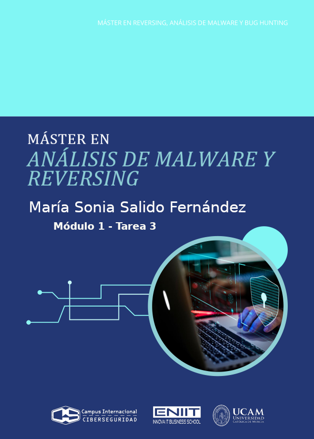
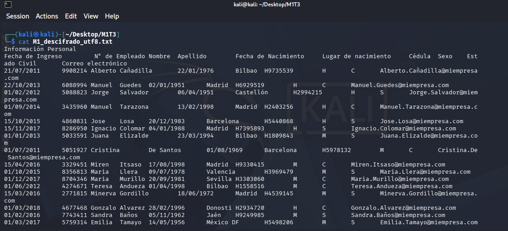

<div class="page"/>

- [**1. Entendiendo qué pide la tarea**](#1-entendiendo-qué-pide-la-tarea)
- [**2. Analizamos lo que tenemos**](#2-analizamos-lo-que-tenemos)
  - [**2.1 El pseudocódigo**](#21-el-pseudocódigo)
  - [**2.2 El fichero M1.hex**](#22-el-fichero-m1hex)
- [**3. Analizar cómo se cifran keyBlob y ivBlob**](#3-analizar-cómo-se-cifran-keyblob-y-ivblob)
- [**4. Descifrar cFile**](#4-descifrar-cfile)
  - [**4.1 Vamos a obtener KS1**](#41-vamos-a-obtener-ks1)
  - [**4.2 Vamos a obtener KS2**](#42-vamos-a-obtener-ks2)
  - [**4.3 Vamos a obtener KS1 con UTF8**](#43-vamos-a-obtener-ks1-con-utf8)
  - [**4.4 Vamos a obtener KS2 con UTF8**](#44-vamos-a-obtener-ks2-con-utf8)
  - [**4.5 Script para descifrar M1.hex**](#45-script-para-descrifrar-m1hex)
- [**5. Conclusiones**](#5-conclusiones)


# **1. Entendiendo qué pide la tarea**


**Qué está haciendo el malware:**
- Genera un par ECC local sobre `secp256k1`.
- Deriva un `sharedSecret` con ECDH usando:
  - Su clave privada local,
  - y la clave pública del servidor.
- De ese secreto deriva una `masterKey`.
- Para cada archivo:
    - Genera una `sessionKey` aleatoria,
    - genera un `iv` aleatorio,
    - cifra el archivo con `AES-OFB(sessionKey, iv)`,
    - cifra la `sessionKey` en `keyBlob` con `AES-OFB(masterKey, iv)`,
    - cifra el `iv` en `ivBlob `con `AES-ECB(masterKey)`,
    - y guarda `keyBlob` || `ivBlob` || `cFile`.

A primera vista parece que hay que romper `ECDH`, recuperar `sharedSecret`, sacar `masterKey`, descifrar `keyBlob`, recuperar `sessionKey`, y finalmente descifrar `cFile`. Pero la pista del ejercicio indica: `lee atentamente la Sección 3.2.3, varias veces. No es oro todo lo que reluce`. Eso apunta a que no hay que romper `ECDHKE`. De hecho, según la teoría, en **ECDH** ambos lados calculan el mismo secreto compartido a partir de una privada propia y la pública del otro, y sin la privada local no deberíamos poder derivarlo.

La sección relevante de la teoría sobre **OFB - Modo Output Feedback**, dice que la secuencia cifrante es independiente del texto claro y que, **"si se reutilizan la misma clave y el mismo IV, un ataque de texto claro conocido permite recuperar la secuencia cifrante."**


# **2. Analizamos lo que tenemos**
- Un pseudocódigo que implementa un ransomware híbrido.
- El archivo cifrado: `M1.hex`. El cual contiene información sobre el personal de la empresa.
- Un texto en claro conocido: Sabemos que la primera línea de ese archivo es la cadena de texto `Información Personal`.
- La clave pública del ransomware: `ECCLocalPub.key`.
- La clave pública del servidor de Comando y Control (C&C): `ECCServerPub.key`.


## **2.1 El pseudocódigo**
Este pseudocódigo implementa un ransomware híbrido: usa ECDHKE/ECC para obtener una clave maestra y luego AES para cifrar cada archivo:
```
[ECCLocalPrivKey, ECCLocalPubKey] = ECCgenKey(secp256k1)
sharedSecret = deriveSecret(ECCLocalPrivKey,ECCServerPubKey)
masterKey = PBKDF(sharedSecret,128)
while (fileName = findNextFile()) {
    pFile = ReadFile(fileName)
    sessionKey = CryptRandom(128)
    iv = CryptRandom(128)
    cFile = AESEncrypt(sessionKey, pFile, OFB, iv)
    keyBlob = AESEncrypt(masterKey, sessionKey, OFB, iv)
    ivBlob = AESEncrypt(masterKey, iv, ECB, null)
    deleteFile(fileName)
    writeFile(filename, keyBlob)
    writeFile(filename, ivBlob)
    writeFile(filename, cFile);
}
```
donde:
- Genera una clave maestra usando criptografía asimétrica:
  - Crea un par de claves de curva elíptica.
  - Usa su clave privada local y la clave pública del servidor para obtener un secreto compartido.
  - A partir de ese secreto deriva una `masterKey`.

- Recorre los archivos del sistema:
  - Va buscando archivos uno por uno.
  - Lee el contenido de cada archivo.

- Para cada archivo, crea material criptográfico nuevo:
  - Genera una clave de sesión aleatoria.
  - Genera un `IV` aleatorio.

- Cifra el contenido del archivo:
  - Usa AES en modo OFB con la clave de sesión y el `IV`.
  - Eso produce el archivo cifrado.

- Protege la clave de sesión y el `IV`:
  - Cifra la clave de sesión con la `masterKey`.
  - Cifra también el `IV` con la `masterKey`.

- Sustituye el archivo original:
  - Borra el archivo en claro.
  - Escribe en su lugar los datos necesarios para poder descifrarlo después:
    - La clave de sesión cifrada.
    - El `IV` cifrado.
    - El contenido cifrado del archivo.


**Es un esquema de criptografía híbrida típico de ransomware:**
- ECC/ECDH para acordar una clave maestra.
- AES para cifrar cada archivo de forma eficiente.
- Después guarda junto al archivo cifrado la información necesaria para recuperar la clave de sesión, pero protegida con la clave maestra.


**Tabla de flujo del pseudocódigo:**
| Lo que aparece en el pseudocódigo                                                                          | Lo que significa criptográficamente                                                                                                                                      |
| -------------------------------------------------------------------------------------------------------- | ------------------------------------------------------------------------------------------------------------------------------------------------------------------------ |
| `ECCLocalPrivKey, ECCLocalPubKey = ECCgenKey(secp256k1)`                                                 | El malware genera un par de claves ECC local sobre `secp256k1`.                                                                                                          |
| `sharedSecret = deriveSecret(ECCLocalPrivKey, ECCServerPubKey)`                                          | Hace **ECDH**: combina su privada con la pública del servidor para obtener un secreto compartido.                                                                        |
| `masterKey = PBKDF(sharedSecret, 128)`                                                                   | Del secreto compartido deriva una clave simétrica de 128 bits, la `masterKey`.                                                                                           |
| `sessionKey = CryptRandom(128)`                                                                          | Genera una clave aleatoria por archivo.                                                                                                                                  |
| `iv = CryptRandom(128)`                                                                                  | Genera un IV aleatorio por archivo.                                                                                                                                      |
| `cFile = AESEncrypt(sessionKey, pFile, OFB, iv)`                                                         | El archivo se cifra con **AES-OFB** usando `sessionKey`. En la práctica, OFB actúa como cifrado en flujo: `cFile = pFile XOR keystream`.                                 |
| `keyBlob = AESEncrypt(masterKey, sessionKey, OFB, iv)`                                                   | **<mark>La `sessionKey` se cifra con **AES-OFB** bajo `masterKey`. Para un bloque de 16 bytes: `keyBlob = sessionKey XOR keystream_1`, donde `keystream_1 = AES(masterKey, iv)`.</mark>** |
| `ivBlob = AESEncrypt(masterKey, iv, ECB, null)`                                                          | **<mark>El `iv` se cifra con **AES-ECB** bajo `masterKey`. Como es un único bloque: `ivBlob = AES(masterKey, iv)`.</mark>**                                                               |
| `writeFile(filename, keyBlob)`                                                                           | Guarda en el archivo el bloque cifrado que contiene la `sessionKey` protegida.                                                                                           |
| `writeFile(filename, ivBlob)`                                                                            | Guarda también el bloque cifrado que contiene el `iv` protegido.                                                                                                         |
| `writeFile(filename, cFile)`                                                                             | Guarda finalmente el contenido cifrado del archivo.                                                                                                                      |
| `keyBlob` e `ivBlob` usan la misma `masterKey` y el mismo `iv`                                           | **<mark>Aquí está la vulnerabilidad. Como `ivBlob = AES(masterKey, iv)` y en OFB `keystream_1 = AES(masterKey, iv)`, se cumple que `keystream_1 = ivBlob`.</mark>**                       |
| `keyBlob = AESEncrypt(masterKey, sessionKey, OFB, iv)` + `ivBlob = AESEncrypt(masterKey, iv, ECB, null)` | Sustituyendo: `keyBlob = sessionKey XOR ivBlob`. Luego despejamos: `sessionKey = keyBlob XOR ivBlob`.                                                                      |

donde:
- Primero usa ECDH sobre `secp256k1` para que el malware y el servidor obtengan un mismo secreto compartido, y de ahí deriva una `masterKey`. Después, para cada archivo, genera una `sessionKey` aleatoria y un `IV` aleatorio, cifra el archivo con `AES-OFB`, cifra también la `sessionKey` con la `masterKey`, cifra el `IV` con la `masterKey`, borra el archivo original y guarda todo concatenado. ECDHKE sirve para acordar un secreto, y luego la criptografía simétrica cifra el volumen grande de datos.


**Del pseudocódigo sacamos dos hechos:**
- `ivBlob` se calcula cifrando el `iv` con AES-ECB bajo `masterKey` 🠲 `ivBlob = AESEncrypt(masterKey, iv, ECB, null)`
- `keyBlob` se calcula cifrando la `sessionKey` con AES-OFB bajo la misma `masterKey` y el mismo `iv` 🠲 `keyBlob = AESEncrypt(masterKey, sessionKey, OFB, iv)`


**Sabemos por la teoría de los modos de operación:**
- En ECB, si el mensaje es un sólo bloque de 16 bytes, AES cifra ese bloque directamente 🠲 ivBlob = AES(masterKey, iv)
- En OFB:
  - Primero se genera una secuencia de flujo. El primer bloque de esa secuencia se calcula así: `keystream_1 = AES(masterKey, iv)`.
  - Luego, el texto claro se cifra haciendo XOR con esa secuencia: `keyBlob = sessionKey XOR keystream_1`.
  - Como `sessionKey` tiene 128 bits, ocupa un bloque exacto de 16 bytes, así que sólo nos hace falta ese primer bloque de flujo 🠲 `keystream_1 = AES(masterKey, iv)`.

**<mark>Por tanto, encontramos una vulnerabilidad: Son la misma operación.</mak>**
```
ivBlob = AES(masterKey, iv)
keystream_1 = AES(masterKey, iv)
=> keystream_1 = ivBlob
=> keyBlob = sessionKey XOR ivBlob
=> sessionKey = keyBlob XOR ivBlob
```
donde:
- Vemos que sólo con `ivBlob` y con `keyBlob` podemos sacar directamente la clave de sesión: `sessionKey = keyBlob XOR ivBlob`.
- Podemos sacar esa clave de sesión sin conocer:
  - `ECCLocalPrivKey`.
  - `sharedSecret`.
  - `masterKey`.
- **<mark>Conclusión: El malware intentaba proteger `sessionKey` con `masterKey`, pero por cómo combinó ECB y OFB, la dejó expuesta en el propio fichero.</mark>**


## **2.2 El fichero M1.hex**
```
b26c 7f26 a387 922d 8575 71e2 c6ac d01d
2e43 9e28 c074 b965 4073 0845 6bf5 440f
2b61 5e3a 4073 0554 c42d e2f7 de07 ba63
98eb 4ddb f772 0e43 fb39 b9a5 094b f7e9
1a3d d47e 8700 acbe 20f5 f819 ee4e 00d0
.....
```

Contiene datos en hexadecimal. Usamos cyberchef para ver los bytes reales de ese fichero. Pero en cyberchef vemos que no se puede convertir esos datos hexadecimales a binario:


Usamos un script de detección para ver si contenido es texto hexadecimal o binario real:
```
from pathlib import Path

p = Path("M1.hex")
raw = p.read_bytes()

print("Longitud:", len(raw), "bytes")
print("Primeros 32 bytes crudos:", raw[:32])
print("Primeros 32 bytes en hex:", raw[:32].hex())

# Intento simple de ver si parece texto hexadecimal ASCII
try:
    txt = raw.decode("ascii")
    print("\nEl archivo parece ASCII.")
    print("Primeros 100 caracteres:")
    print(repr(txt[:100]))
except UnicodeDecodeError:
    print("\nEl archivo NO parece texto ASCII; probablemente ya es binario.")
```


Obtenemos:
```
└─$ python3 hex-to-bin.py
Longitud: 1744 bytes
Primeros 32 bytes crudos: b'\xb2l\x7f&\xa3\x87\x92-\x85uq\xe2\xc6\xac\xd0\x1d.C\x9e(\xc0t\xb9e@s\x08Ek\xf5D\x0f'
Primeros 32 bytes en hex: b26c7f26a387922d857571e2c6acd01d2e439e28c074b965407308456bf5440f

El archivo NO parece texto ASCII; probablemente YA es binario.
```
donde:
- Se comprueba que `M1.hex` no es una cadena de hexadecimal ASCII, sino un blob binario real.
- Por tanto:
  - No debemos usar `read_text()`.
  - No debemos usar `bytes.fromhex()`.
  - **Vamos a tratarlo directamente como un archivo cifrado binario.**


Según el pseudocódigo sabemos que:
- `keyBlob` corresponde a una `sessionKey` de 128 bits → 16 bytes.
- `ivBlob` corresponde a un `iv` de 128 bits → 16 bytes.
- El resto es `cFile`.


Así que en las posiciones del contenido de este fichero:
- Bytes 0..15 → `keyBlob` → `b26c7f26a387922d857571e2c6acd01d`.
- Bytes 16..31 → `ivBlob` → `2e439e28c074b965407308456bf5440f`.
- Bytes 32..1743 → `cFile` → `2b615e3a40730554.....`. Y ocupa 1712 bytes.


**Ahora sabemos dónde empieza realmente el contenido cifrado del archivo: `cFile = data[32:]`. Y justo ahí es donde está la parte explotable, ya que la tarea nos aporta el texto claro conocido al inicio del archivo original: “Información Personal”.**


Por el pseudocódigo de la tarea sabemos que el malware genera:
- Una `sessionKey` de 128 bits.
- Un `iv` de 128 bits.
- Luego escribe `keyBlob`, `ivBlob` y `cFile` al archivo.


# **3. ¿Cómo se cifran keyBlob y ivBlob?**

Cada archivo se cifra de esta manera:
- `cFile = AESEncrypt(sessionKey, pFile, OFB, iv)`.

- `keyBlob = AESEncrypt(masterKey, sessionKey, OFB, iv)`:  
  El modo `OFB` es un cifrador de flujo que genera un `keystream` (flujo de claves) aplicando AES al `IV` de forma iterativa. El primer bloque del `keystream` es:  
  `keystream_1 = AES(masterKey, iv)`.  
  Después, la `sessionKey` se cifra haciendo XOR con ese primer bloque:  
  `keyBlob = sessionKey XOR keystream_1`

- `ivBlob = AESEncrypt(masterKey, iv, ECB, null)`:  
  El modo `ECB`, al tratarse de un único bloque de 16 bytes, el resultado es simplemente:  
  `ivBlob = AES_Cifrar(masterKey, iv)`


Como:
```
keystream_1 = AES(masterKey, iv)
ivBlob = AES(masterKey, iv)
```

Entonces:
```
keystream_1 = ivBlob
```

Sustituyendo en la expresión de keyBlob:
```
keyBlob = sessionKey XOR ivBlob
```

Y despejando:
```
sessionKey = keyBlob XOR ivBlob
```

**<mark>Conclusión: Como ya vimos cuando analizamos el pseudocódio, vemos que el autor del malware cometió un grave error al reutilizar el mismo `IV` bajo la misma clave maestra (`masterKey`) combinando los modos ECB y OFB, y dejando la clave de sesión expuesta en el propio archivo `M1.hex`.</mark>**


# **4. Descifrar cFile sin recuperar el iv**  
`cFile = AESEncrypt(sessionKey, pFile, OFB, iv)`
donde ya tenemos:
- `sessionKey` recuperada con `keyBlob XOR ivBlob` = `9c2fe10e63f32b48c50679a7ad599412`.
- `cFile`.
- Tenemos un texto claro al inicio del archivo: “Información Personal”.
- Sólo nos falta el `iv`. El `iv` está en: `ivBlob = AES(masterKey, iv)`.

OFB convierte el cifrado en algo equivalente a un cifrador en flujo: `cFile = pFile XOR keystream`. Si conocemos una parte del texto claro y tenemos el texto cifrado correspondiente, podemos recuperar esa parte de la`keystream`: `keystream_inicio = cFile_inicio XOR pFile_inicio_conocido`

Como `cFile` está en OFB, usamos el texto claro conocido `Información Personal` para reconstruir el `keystream` sin necesitar el `iv` original. La teoría del módulo dice: "en OFB el cifrado funciona con una secuencia cifrante o keystream y luego se combina por XOR con el texto claro...." "...esa secuencia es independiente del texto claro...". Eso significa:
```
C1 = P1 XOR KS1
C2 = P2 XOR KS2
C3 = P3 XOR KS3
...
```
donde:
- `P1, P2, P3...` son bloques del texto claro.
- `C1, C2, C3...` son bloques del texto cifrado.
- `KS1, KS2, KS3...` son bloques del keystream.


Y el `keystream` en OFB se genera:
```
KS1 = AES(sessionKey, iv)
KS2 = AES(sessionKey, KS1)
KS3 = AES(sessionKey, KS2)
...
```
donde:
- De esta manera nos evitamos recuperar el `iv`.
- Sólo necesitamos recuperar `KS1`, que es suficiente para arrancar toda la cadena del `keystream`.


## **4.1 Vamos a obtener KS1**
- Sabemos por el enunciado del ejercicio que el archivo original comienza por: `Información Personal`. Esto nos aporta un trozo de `P1`.
- También tenemos el comienzo de `cFile`, que es el primer bloque cifrado `C1`.
- La ecuación de OFB para el primer bloque es: `C1 = P1 XOR KS1`.
- Como XOR es reversible, despejamos: `KS1 = C1 XOR P1`.
- En OFB, el siguiente bloque del `keystream` NO depende del texto claro, sino del bloque anterior del keystream: `KS2 = AES(sessionKey, KS1)` `KS3 = AES(sessionKey, KS2)` `KS4 = AES(sessionKey, KS3)...`
- Como sabemos `KS1`, ya podemos generar toda la cadena: `KS2`, `KS3`, `KS4`, ...
- Habiendo obtenido esta cadena, ya podremos descifrar haciendo XOR a cada bloque:
  - `P1 = C1 XOR KS1`
  - `P2 = C2 XOR KS2`
  - `P3 = C3 XOR KS3`
  - ...
- Conclusión: `texto_claro = texto_cifrado XOR keystream`.


El primer bloque cifrado de `cFile` es el que usa para calcular el primer KS1: `cFile = data[32:]`
```
b26c 7f26 a387 922d 8575 71e2 c6ac d01d
2e43 9e28 c074 b965 4073 0845 6bf5 440f
2b61 5e3a 4073 0554 c42d e2f7 de07 ba63
98eb 4ddb f772 0e43 fb39 b9a5 094b f7e9
1a3d d47e 8700 acbe 20f5 f819 ee4e 00d0
.....
```
donde:
- `C1` = primer bloque de cFile --> `C1 = 2b615e3a40730554c42de2f7de07ba63`.
- `P1` = primeros 16 bytes exactos del texto claro `Información Personal`:
  - En codificación Latin-1 ocupa exactamente 16 bytes: `49 6e 66 6f 72 6d 61 63 69 f3 6e 20 50 65 72 73`. Corresponden a: `Información Pers`.
- `C2` = segundo bloque de cFile --> `C2 = 98eb4ddbf7720e43fb39b9a5094bf7e9`.
- `C3` = tercer bloque de cFile --> `C3 = 1a3dd47e8700acbe20f5f819ee4e00d0`.

Entonces: `KS1 = C1 XOR P1` -->
```
2b 61 5e 3a 40 73 05 54 c4 2d e2 f7 de 07 ba 63
XOR
49 6e 66 6f 72 6d 61 63 69 f3 6e 20 50 65 72 73
=
62 0f 38 55 32 1e 64 37 ad de 8c d7 8e 62 c8 10
```
donde:
- `KS1 = 620f3855321e6437adde8cd78e62c810`.


## **4.2 Vamos a obtener KS2**
Conocido `KS1`, obtenemos los siguientes:
```
KS2 = AES(sessionKey, KS1)
```
donde:
- `sessionKey` recuperada con `keyBlob XOR ivBlob` = `9c2fe10e63f32b48c50679a7ad599412`. 
- `KS2 = AES(9c2fe10e63f32b48c50679a7ad599412, 620f3855321e6437adde8cd78e62c810)`.
- `kS2 = 5eac1e0fc39a3eb213c6ea50cf756bfd`.


Y luego:
```
P2 = C2 XOR KS2
```
donde:
- `C2` = segundo bloque de cFile --> `C2 = 98eb4ddbf7720e43fb39b9a5094bf7e9`.
- `P2 = 98eb4ddbf7720e43fb39b9a5094bf7e9 XOR 5eac1e0fc39a3eb213c6ea50cf756bfd`.
- `P2 = c64753d434e830f1e8ff53f5c63e9c14`.
- `P2` expresado como bytes 🠮 P2 = b'\xc6GS\xd44\xe80\xf1\xe8\xffS\xf5\xc6>\x9c\x14'.

Antes asumimos que el archivo estaba codificado en Latin-1. De tal forma se construyó el primer bloque conocido `P1` y, a partir de él, se obtuvo un `KS1` que permitía descifrar correctamente sólo el primer bloque del texto. Sin embargo, al continuar el proceso OFB y calcular `KS2`, el segundo bloque recuperado resultó ser: `P2 = c64753d434e830f1e8ff53f5c63e9c14`. **<mark>Este valor no corresponde a texto legible ni a ninguna cabecera que pudiéramos esperar del fichero. Dado que el archivo debía contener información de personal en formato texto, este resultado indica que la hipótesis inicial sobre la codificación es incorrecta. Vamos intentarlo con UTF8</mark>**


## **4.3 Vamos a obtener KS1 con UTF8**
El primer bloque cifrado de `cFile` es el que usa para calcular el primer KS1: `cFile = data[32:]`
```
b26c 7f26 a387 922d 8575 71e2 c6ac d01d
2e43 9e28 c074 b965 4073 0845 6bf5 440f
2b61 5e3a 4073 0554 c42d e2f7 de07 ba63
98eb 4ddb f772 0e43 fb39 b9a5 094b f7e9
1a3d d47e 8700 acbe 20f5 f819 ee4e 00d0
.....
```
donde:
- `C1` = primer bloque de cFile --> `C1 = 2b615e3a40730554c42de2f7de07ba63`.
- `P1` = primeros 16 bytes exactos del texto claro `Información Personal`:
  - En codificación UTF8 la `ó` ocupa 2 bytes.
  - Entonces los primeros 16 bytes ya no son `Información Pers`, porque ahora la cadena ocupa más bytes antes de llegar a la `s`
  - Los primeros 16 bytes pasan a ser: `49 6e 66 6f 72 6d 61 63 69 c3 b3 6e 20 50 65 72`. Que corresponden a: `Información Per`.
  - La cadena relevante ahora es: `Información Per`.
  - Es decir P1 en UTF8 =  b'Informaci\xc3\xb3n Per'.
- `C2` = segundo bloque de cFile --> `C2 = 98eb4ddbf7720e43fb39b9a5094bf7e9`.
- `C3` = tercer bloque de cFile --> `C3 = 1a3dd47e8700acbe20f5f819ee4e00d0`.


Entonces: `KS1 = C1 XOR P1` -->
```
2b 61 5e 3a 40 73 05 54 c4 2d e2 f7 de 07 ba 63
XOR
49 6e 66 6f 72 6d 61 63 69 c3 b3 6e 20 50 65 72
=
62 0f 38 55 32 1e 64 37 ad ee 51 99 fe 57 df 11
```
donde:
- `KS1 = 620f3855321e6437adee5199fe57df11`.


## **4.4 Vamos a obtener KS2 con UTF8**
Conocido `KS1`, obtenemos los siguientes:
```
KS2 = AES(sessionKey, KS1)
```
donde:
- `sessionKey` recuperada con `keyBlob XOR ivBlob` = `9c2fe10e63f32b48c50679a7ad599412`. 
- `KS2 = AES(9c2fe10e63f32b48c50679a7ad599412, 620f3855321e6437adee5199fe57df11)`.
- `kS2 = eb8423ba9b7b074af230b0ac0042fae3`.


Y luego:
```
P2 = C2 XOR KS2
```
donde:
- `C2 = 98eb4ddbf7720e43fb39b9a5094bf7e9`.
- Resultado en hexadecimal: `P2 = 736f6e616c0909090909090909090d0a`.
- Resultado como texto: P2 = "sonal\t\t\t\t\t\t\t\t\t\r\n".

**<mark>Conclusión: P1 + P2 = "Información Personal\t\t\t\t\t\t\t\t\t\r\n". Se comprueba que la codificación correcta es UTF-8, ya que los bloques siguientes producen texto coherente y no datos aleatorios o inconsistentes.</mark>**


**<mark>Vamos a buscar una alternativa no manual, ya que tendríamos que ir bloque a bloque, de 16 bytes en 16 bytes, porque AES trabaja con bloques de 128 bits = 16 bytes. Buscaremos un script que realice estos cálculos.</mark>**


## **4.5 Script para descrifrar M1.hex**
La implementación se ha realizado en Python con PyCryptodome. Se sigue el patrón de procesamiento de ficheros mostrado en tutoriales de AES sobre archivos y la API oficial de la librería para el uso de AES y sus modos de operación:
- Para descifrado de archivos con AES en Python: [Nitratine](https://nitratine.net/blog/post/python-encryption-and-decryption-with-pycryptodome/?utm_source=chatgpt.com)
- Para el uso correcto de AES/OFB en PyCryptodome: [PyCrytodome](https://pycryptodome.readthedocs.io/en/latest/src/cipher/aes.html?utm_source=chatgpt.com)


Script para descrifrar M1.hex:
```
from pathlib import Path
from Crypto.Cipher import AES

# Leer el archivo binario
data = Path("M1.hex").read_bytes()

# Separar bloques
keyBlob = data[:16]
ivBlob  = data[16:32]
cFile   = data[32:]

# Recuperar sessionKey
sessionKey = bytes(a ^ b for a, b in zip(keyBlob, ivBlob))

# Primer bloque conocido del texto claro en UTF-8:
# "Información Per" = 16 bytes exactos
P1 = "Información Per".encode("utf-8")

# Primer bloque cifrado de cFile
C1 = cFile[:16]

# KS1 = C1 XOR P1
KS1 = bytes(a ^ b for a, b in zip(C1, P1))

# Generar todo el keystream OFB
aes = AES.new(sessionKey, AES.MODE_ECB)

keystream = bytearray()
ks = KS1

while len(keystream) < len(cFile):
    keystream.extend(ks)
    ks = aes.encrypt(ks)

keystream = bytes(keystream[:len(cFile)])

# Descifrar cFile
plain = bytes(a ^ b for a, b in zip(cFile, keystream))

# Guardar resultado
Path("M1_descifrado_utf8.bin").write_bytes(plain)
Path("M1_descifrado_utf8.txt").write_text(plain.decode("utf-8"), encoding="utf-8")

# Mostrar resumen
print("sessionKey :", sessionKey.hex())
print("KS1        :", KS1.hex())
print()
print("Inicio del texto descifrado:")
print(plain[:300].decode("utf-8"))
print()
print("Guardado en:")
print(" - M1_descifrado_utf8.bin")
print(" - M1_descifrado_utf8.txt")
```
donde:
- Lee el fichero M1.hex como binario.
- Recupera sessionKey con `keyBlob XOR ivBlob`.
- Usa el primer bloque conocido en UTF-8.
- Calcula KS1 desde texto claro conocido.
- Regenera el keystream OFB.
- Descifra el fichero `cFile.`.
- Guarda el resultado en un archivo de texto.


Obtenemos:
```
└─$ python3 descrifra-cfile.py                                                                                      
sessionKey : 9c2fe10e63f32b48c50679a7ad599412
KS1        : 620f3855321e6437adee5199fe57df11

Inicio del texto descifrado:
Información Personal
Fecha de Ingreso         N° de Empleado Nombre  Apellido        Fecha de Nacimiento     Lugar de nacimiento     Cédula  Sexo    Estado Civil       Correo electrónico
21/07/2011      9908214 Alberto Cañadilla       22/01/1976      Bilbao  H9735539        H       C       Alberto.Cañadilla@miempresa.com
22/10/2013      6088994 Manuel  Gu

Guardado en:
 - M1_descifrado_utf8.bin
 - M1_descifrado_utf8.txt
```
donde:
- **<mark>Se descifra el fichero y se genera un documento de texto con el contenido descifrado.</mark>**


Mostramos ese fichero descifrado:
```
└─$ cat M1_descifrado_utf8.txt 
Información Personal
Fecha de Ingreso         N° de Empleado Nombre  Apellido        Fecha de Nacimiento     Lugar de nacimiento     Cédula  Sexo    Estado Civil       Correo electrónico
21/07/2011      9908214 Alberto Cañadilla       22/01/1976      Bilbao  H9735539        H       C       Alberto.Cañadilla@miempresa.com
22/10/2013      6088994 Manuel  Guedes  02/01/1951      Madrid  H6929519        H       C       Manuel.Guedes@miempresa.com
01/02/2012      5088823 Jorge   Salvador        06/04/1951      Castellón       H2994215        H       S       Jorge.Salvador@miempresa.com
01/09/2014      3435960 Manuel  Tarazona        13/02/1998      Madrid  H2403256        H       C       Manuel.Tarazona@miempresa.com
15/10/2015      4860831 Jose    Losa    20/12/1983      Barcelona       H5440868        H       S       Jose.Losa@miempresa.com
15/11/2017      8286950 Ignacio Colomar 04/01/1988      Madrid  H7395893        H       S       Ignacio.Colomar@miempresa.com
01/01/2013      5033591 Juana   Elizalde        23/03/1994      Bilbao  H1809843        M       S       Juana.Elizalde@miempresa.com
01/07/2011      5051927 Cristina        De Santos       01/08/1969      Barcelona       H5978132        M       C       Cristina.De Santos@miempresa.com
15/04/2016      3329451 Miren   Itsaso  17/08/1998      Madrid  H9330415        M       C       Miren.Itsaso@miempresa.com
01/10/2015      8356813 Maria   Llera   09/07/1978      Valencia        H3969479        M       S       Maria.Llera@miempresa.com
01/12/2017      8704346 Maria   Murillo 20/09/1981      Sevilla H3303060        M       C       Maria.Murillo@miempresa.com
01/06/2012      4274671 Teresa  Andueza 01/04/1998      Bilbao  H1558516        M       C       Teresa.Andueza@miempresa.com
15/03/2016      2771815 Minerva Gordillo        18/06/1972      Madrid  H4539145        M       S       Minerva.Gordillo@miempresa.com
01/03/2018      4677468 Gonzalo Alvarez 28/02/1996      Donosti H2934720        H       C       Gonzalo.Alvarez@miempresa.com
01/02/2016      7743411 Sandra  Baños   05/11/1962      Jaén    H9249985        M       S       Sandra.Baños@miempresa.com
01/03/2017      5759314 Emilia  Tamayo  14/05/1956      México DF       H5498206        M       S       Emilia.Tamayo@miempresa.com
```


**<mark>Con el script anterior, hemos descifrado M1.hex y generado un nuevo fichero llamado `descifrado_utf8.bin` con su contenido en claro. Abrimos este fichero y buscamos la fila de Emilia Tamayo:</mark>**
```
01/03/2017	5759314	Emilia	Tamayo	14/05/1956	México DF	H5498206	M	S	Emilia.Tamayo@miempresa.com
```

**<mark>El número de cédula de Emilia Tamayo es H5498206.</mark>**

----------

# 5. Descifrar cFile recuperando el iv
Una alternativa que no requería ir calculando KS2, KS3, KS4, KS5... bloque a bloque, ni teniendo que usar un script para que automatice ese proceso, sería recuperar el `iv` y descifrar `cFile` directamente con OFB.

Tenemos:
- `sessionKey = 9c2fe10e63f32b48c50679a7ad599412`.
- `KS1 = 620f3855321e6437adee5199fe57df11`.
- `modo = AES-128-OFB`.

## **5.1 Recuperamos el iv**
Dado que en modo OFB el primer bloque de `keystream` cumple `KS1 = AES(sessionKey, iv)`, es posible recuperar el vector de inicialización aplicando el descifrado AES del bloque `KS1` con la `sessionKey` obtenida previamente. Despejamos `iv` ➞ ➞ ➞  
`iv = AES-DEC(sessionKey, KS1)` ➞ ➞ ➞ 
```
iv = AES-DEC(9c2fe10e63f32b48c50679a7ad599412, 620f3855321e6437adee5199fe57df11)

iv = eb7e241f05f27b68dfc0fa28565e1cf6
```

## **5.2 Usamos OpenSSL para descifrar cFile**
Usamos OpenSSL para descifrar `cFile` directamente usando ese `iv`. 


**Extraer cFile del archivo:** Como `M1.hex` es binario y `cFile` empieza en el byte 32, tenemos que sacar esa parte y la volcamos en un nuevo fichero:
```
dd if=M1.hex of=cFile.bin bs=1 skip=32 status=none
```


**Desciframos `cFile` con AES-128-OFB:**
```
openssl enc -aes-128-ofb -d \
  -K 9c2fe10e63f32b48c50679a7ad599412 \
  -iv eb7e241f05f27b68dfc0fa28565e1cf6 \
  -in cFile.bin \
  -out M1_descifrado_openssl.txt
```
donde:
- `openssl enc`: Invoca la utilidad de OpenSSL para cifrar o descifrar datos.
- `-aes-128-ofb`: Indica el algoritmo y modo de operación: AES de 128 bits en modo OFB.
- `-d`: Significa decrypt, es decir, descifrar.
- `-K 9c2fe10e63f32b48c50679a7ad599412`: Es la clave AES en hexadecimal, en este caso la `sessionKey`.
- `-iv eb7e241f05f27b68dfc0fa28565e1cf6`: Es el vector de inicialización (iv) en hexadecimal.
- `-in cFile.bin`: Fichero de entrada que contiene el contenido cifrado.
- `-out M1_descifrado_openssl.txt`: Fichero de salida donde se guarda el texto descifrado.
- En resumen: El comando toma `cFile.bin`, lo descifra con `AES-128-OFB` usando la `sessionKey` y el `iv recuperados`, y guarda el resultado en `M1_descifrado_openssl.txt`.

**Mostramos el contenido del fichero descifrado y obteniemos el mismo resultado:**



# **6. Conclusiones**
En este ejercicio se ha demostrado que la **fortaleza aparente del esquema híbrido no reside sólo en los algoritmos elegidos, sino en cómo se combinan.** Aunque el ransomware utiliza `ECDHKE` sobre curvas elípticas para derivar una `masterKey` y después cifra cada archivo con `AES`, la implementación concreta introduce una debilidad crítica que hace innecesario atacar la parte asimétrica del sistema.

Una conclusión importante es que **el fallo no estaba en ECDH, sino en el uso combinado de los modos OFB y ECB para proteger la `sessionKey` y el `iv`.** A partir del pseudocódigo se observó que `keyBlob` se genera con `AES(masterKey, sessionKey, OFB, iv)` mientras que `ivBlo`b se genera con `AES(masterKey, iv, ECB, null)`. Aplicando la teoría de los modos de operación, se dedujo que el primer bloque de `keystream` usado en OFB coincide con `AES(masterKey, iv)`, que es precisamente el valor almacenado en `ivBlob`. De este modo, **pudo recuperarse directamente la `sessionKey` mediante la expresión: `sessionKey = keyBlob XOR ivBlob`.**

Una vez recuperada la `sessionKey`, el descifrado de `cFile` pudo abordarse explotando el comportamiento del modo OFB. Como en este modo el cifrado se realiza mediante XOR entre el texto claro y una secuencia cifrante, el conocimiento del inicio del archivo original permitió calcular el primer bloque de `keystream KS1`. A partir de ese valor, fue posible regenerar iterativamente los bloques siguientes del flujo, `KS2`, `KS3`, `KS4`, etc. A continuación, se utilizó un script para automatizar ese cálculo iterativo y descifrar el contenido completo del archivo.

La codificación del texto claro fue determinante. Inicialmente se probó la hipótesis de que el archivo estuviera codificado en Latin-1, pero aunque esa hipótesis obtenía correctamente el primer bloque, el descifrado de los bloques siguientes generaba datos inconsistentes. Posteriormente se probó UTF-8, teniendo en cuenta que la letra `ó` ocupa dos bytes en esta codificación. Con esta segunda hipótesis, el texto descifrado produjo una cabecera coherente y una tabla legible de datos de personal, lo que permitió validar que la **codificación correcta del archivo era UTF-8.**


