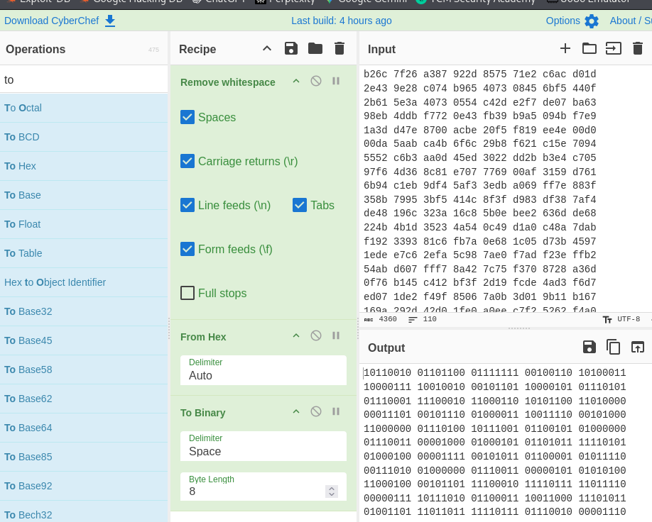

# **Entendiendo qué pide la tarea**


**Qué está haciendo el malware:**
- Genera un par ECC local sobre `secp256k1`.
- Deriva un `sharedSecret` con ECDH usando:
  - Su clave privada local,
  - y la clave pública del servidor.
- De ese secreto deriva una `masterKey`.
- Para cada archivo:
    - Genera una `sessionKey` aleatoria,
    - genera un `iv` aleatorio,
    - cifra el archivo con `AES-OFB(sessionKey, iv)`,
    - cifra la `sessionKey` en `keyBlob` con `AES-OFB(masterKey, iv)`,
    - cifra el `iv` en `ivBlob `con `AES-ECB(masterKey)`,
    - y guarda `keyBlob` || `ivBlob` || `cFile`.

A primera vista parece que hay que romper `ECDH`, recuperar `sharedSecret`, sacar `masterKey`, descifrar `keyBlob`, recuperar `sessionKey`, y finalmente descifrar `cFile`. Pero la pista del ejercicio indica: “lee atentamente la Sección 3.2.3, varias veces. No es oro todo lo que reluce”. Eso apunta a que no hay que romper `ECDHKE`. De hecho, según la teoría, en `**ECDH** ambos lados calculan el mismo secreto compartido a partir de una privada propia y la pública del otro, y sin la privada local no deberíamos poder derivarlo.

La sección relevante de la teoría sobre OFB - Modo Output Feedback, dice que la secuencia cifrante es independiente del texto claro y que, **si se reutilizan la misma clave y el mismo IV, un ataque de texto claro conocido permite recuperar la secuencia cifrante.** (Página 63)


# **Localizando la debilidad real**

La debilidad no está en ECDHKE sino en:
- `cFile = AES-OFB(sessionKey, pFile, iv)`
- `keyBlob = AES-OFB(masterKey, sessionKey, iv)`

**Ambos usan OFB y el mismo IV para dos mensajes distintos.**

En OFB, el cifrado es equivalente a: `ciphertext = plaintext XOR keystream`.

Si se reutilizan `clave+IV` con OFB, entonces se reutiliza la misma `keystream`.


La reutilización peligrosa explotable está dentro de `cFile`: como conocemos el comienzo del texto claro del archivo, podemos recuperar el comienzo de la `keystream` de `cFile` y descifrar esa parte del archivo. Con eso, si el fichero tiene estructura legible, podremos seguir recuperando más contenido por cribado. La tarea no pide descifrar todo el archivo: pide sólo un dato concreto.

La tarea nos pide aprovechar un fallo de uso de modos de cifrado y un texto claro conocido para sacar información del archivo cifrado sin romper ECDH. El foco real está en Lección 3, modos de operación.


# Analizamos lo que tenemos
- Un pseudocódigo que xxxxxx.
- El archivo cifrado: `M1.hex`. El cual contiene información sobre el personal de la empresa.
- Un texto en claro conocido: Sabemos que la primera línea de ese archivo es la cadena de texto "Información Personal".
- La clave pública del ransomware: `ECCLocalPub.key`.
- La clave pública del servidor de Comando y Control (C&C): `ECCServerPub.key`.


## El pseudocódigo
Implementa un ransomware híbrido: usa ECDHKE/ECC para obtener una clave maestra y luego AES para cifrar cada archivo:
```
[ECCLocalPrivKey, ECCLocalPubKey] = ECCgenKey(secp256k1)
sharedSecret = deriveSecret(ECCLocalPrivKey,ECCServerPubKey)
masterKey = PBKDF(sharedSecret,128)
while (fileName = findNextFile()) {
    pFile = ReadFile(fileName)
    sessionKey = CryptRandom(128)
    iv = CryptRandom(128)
    cFile = AESEncrypt(sessionKey, pFile, OFB, iv)
    keyBlob = AESEncrypt(masterKey, sessionKey, OFB, iv)
    ivBlob = AESEncrypt(masterKey, iv, ECB, null)
    deleteFile(fileName)
    writeFile(filename, keyBlob)
    writeFile(filename, ivBlob)
    writeFile(filename, cFile);
}
```

1. Genera una clave maestra usando criptografía asimétrica:
- Crea un par de claves de curva elíptica.
- Usa su clave privada local y la clave pública del servidor para obtener un secreto compartido.
- A partir de ese secreto deriva una `masterKey`.

2. Recorre los archivos del sistema:
- Va buscando archivos uno por uno.
- Lee el contenido de cada archivo.

3. Para cada archivo, crea material criptográfico nuevo:
- Genera una clave de sesión aleatoria.
- Genera un `IV` aleatorio.

4. Cifra el contenido del archivo:
- Usa AES en modo OFB con la clave de sesión y el `IV`.
- Eso produce el archivo cifrado.

5. Protege la clave de sesión y el `IV`:
- Cifra la clave de sesión con la `masterKey`.
- Cifra también el `IV` con la `masterKey`.

6. Sustituye el archivo original:
- Borra el archivo en claro.
- Escribe en su lugar los datos necesarios para poder descifrarlo después:
  - La clave de sesión cifrada.
  - El `IV` cifrado.
  - El contenido cifrado del archivo.


Es un esquema de criptografía híbrida típico de ransomware:
- ECC/ECDH para acordar una clave maestra.
- AES para cifrar cada archivo de forma eficiente.
- Después guarda junto al archivo cifrado la información necesaria para recuperar la clave de sesión, pero protegida con la clave maestra.

Diagrama de paso:
```
[1] Genera claves ECC locales
    ECCLocalPrivKey, ECCLocalPubKey = ECCgenKey(secp256k1)

                |
                v

[2] Calcula secreto compartido ECDH
    sharedSecret = deriveSecret(ECCLocalPrivKey, ECCServerPubKey)

                |
                v

[3] Deriva clave maestra
    masterKey = PBKDF(sharedSecret, 128)

                |
                v

[4] Para cada archivo encontrado
    pFile = ReadFile(fileName)

                |
                +-----------------------------+
                |                             |
                v                             v

[5] Genera clave de sesión            [6] Genera IV
    sessionKey = CryptRandom(128)         iv = CryptRandom(128)

                |                             |
                +-------------+---------------+
                              |
                              v

[7] Cifra el archivo
    cFile = AESEncrypt(sessionKey, pFile, OFB, iv)

                              |
                              +------------------------------+
                              |                              |
                              v                              v

[8] Cifra la sessionKey                 [9] Cifra el IV
    keyBlob = AESEncrypt(                   ivBlob = AESEncrypt(
                 masterKey,                              masterKey,
                 sessionKey,                             iv,
                 OFB,                                    ECB,
                 iv)                                     null)

                              |
                              v

[10] Borra el original
     deleteFile(fileName)

                              |
                              v

[11] Guarda el resultado final
     writeFile(filename, keyBlob)
     writeFile(filename, ivBlob)
     writeFile(filename, cFile)

=> archivo final = [ keyBlob | ivBlob | cFile ]
```

Primero usa ECDH sobre secp256k1 para que el malware y el servidor obtengan un mismo secreto compartido, y de ahí deriva una `masterKey`. Después, para cada archivo, genera una `sessionKey` aleatoria y un `IV` aleatorio, cifra el archivo con AES-OFB, cifra también la `sessionKey` con la `masterKey`, cifra el `IV` con la `masterKey`, borra el archivo original y guarda todo concatenado. Eso encaja con la teoría del módulo: ECDHKE sirve para acordar un secreto, y luego la criptografía simétrica cifra el volumen grande de datos.


## **Parte que deberíamos explotar**  
`cFile = AESEncrypt(sessionKey, pFile, OFB, iv)`


Tenemos un texto claro al inicio del archivo: “Información Personal”.

Porque OFB convierte el cifrado en algo equivalente a un cifrador en flujo: `cFile = pFile XOR keystream`

Si conocemoss una parte del texto claro y tenemos el texto cifrado correspondiente, podemos recuperar esa parte de la`keystream`: `keystream_inicio = cFile_inicio XOR pFile_inicio_conocido`


## El fichero M1.hex
```
b26c 7f26 a387 922d 8575 71e2 c6ac d01d
2e43 9e28 c074 b965 4073 0845 6bf5 440f
2b61 5e3a 4073 0554 c42d e2f7 de07 ba63
98eb 4ddb f772 0e43 fb39 b9a5 094b f7e9
1a3d d47e 8700 acbe 20f5 f819 ee4e 00d0
.....
```

Contiene datos en hexadecimal. Usamos cyberchef para ver los bytes reales de ese fichero. Pero en cyberchef vemos que no se puede convertir esos datos hexadecimales a binario:



Usamos un script de detección para ver si contenido es texto hexadecimal o binario real:
```
from pathlib import Path

p = Path("M1.hex")
raw = p.read_bytes()

print("Longitud:", len(raw), "bytes")
print("Primeros 32 bytes crudos:", raw[:32])
print("Primeros 32 bytes en hex:", raw[:32].hex())

# Intento simple de ver si parece texto hexadecimal ASCII
try:
    txt = raw.decode("ascii")
    print("\nEl archivo parece ASCII.")
    print("Primeros 100 caracteres:")
    print(repr(txt[:100]))
except UnicodeDecodeError:
    print("\nEl archivo NO parece texto ASCII; probablemente ya es binario.")
```


Obtenemos:
```
└─$ python3 hex-to-bin.py
Longitud: 1744 bytes
Primeros 32 bytes crudos: b'\xb2l\x7f&\xa3\x87\x92-\x85uq\xe2\xc6\xac\xd0\x1d.C\x9e(\xc0t\xb9e@s\x08Ek\xf5D\x0f'
Primeros 32 bytes en hex: b26c7f26a387922d857571e2c6acd01d2e439e28c074b965407308456bf5440f

El archivo NO parece texto ASCII; probablemente YA es binario.
```
donde:
- Se comprueba que `M1.hex` no es una cadena de hexadecimal ASCII, sino un blob binario real.
- Por tanto:
  - No debemos usar `read_text()`.
  - No debemos usar `bytes.fromhex()`.
  - Vamos a tratarlo directamente como un archivo cifrado binario.


Según el pseudocódigo sabemos que:
- `keyBlob` corresponde a una `sessionKey` de 128 bits → 16 bytes.
- `ivBlob` corresponde a un `iv` de 128 bits → 16 bytes.
- El resto es `cFile`.


Así que en las posiciones del contenido de este fichero:
- Bytes 0..15 → `keyBlob` → `b26c7f26a387922d857571e2c6acd01d`.
- Bytes 16..31 → `ivBlob` → `2e439e28c074b965407308456bf5440f`.
- Bytes 32..1743 → `cFile` → `2b615e3a40730554.....`. Y ocupa 1712 bytes.


Ahora sabemos dónde empieza realmente el contenido cifrado del archivo: `cFile = data[32:]`. Y justo ahí es donde está la parte explotable, ya que la tarea nos aporta el texto claro conocido al inicio del archivo original: “Información Personal”.


Por el pseudocódigo de la tarea sabemos que el malware genera:
- Una `sessionKey` de 128 bits.
- Un `iv` de 128 bits.
- Luego escribe `keyBlob`, `ivBlob` y `cFile` al archivo.


# Analizar cómo se cifran keyBlob y ivBlob

Cada archivo se cifra de esta manera:
- `cFile = AESEncrypt(sessionKey, pFile, OFB, iv)`.

- `keyBlob = AESEncrypt(masterKey, sessionKey, OFB, iv)`:  El modo OFB es un cifrador de flujo que genera un `keystream` (flujo de claves) aplicando AES al IV de forma iterativa. El primer bloque del `keystream` es exactamente `AES(masterKey, iv)`. Luego, se hace un XOR entre la `sessionKey` y este `keystream`.

- `ivBlob = AESEncrypt(masterKey, iv, ECB, null)`: El modo ECB cifra directamente el bloque sin depender de nada más. Por tanto, el resultado es simplemente `AES(masterKey, iv)`. Podemos reducir a: `ivBlob = AES_Cifrar(masterKey, iv)`.


Dado que la instrucción del malware para proteger la clave de sesión es `keyBlob = AESEncrypt(masterKey, sessionKey, OFB, iv)`, la primera operación que ejecuta internamente para crear el `keystream` es exactamente cifrar el `iv` con la `masterKey`. **Esto significa que el primer bloque del `keystream de OFB` es exactamente el propio ivBlob** → → → El primer bloque del keystream de OFB es: `2e43 9e28 c074 b965 4073 0845 6bf5 440f` = `ivBlob`. 


Por el seudocódigo proporcionado, el bloque cifrado en modo ECB es el `ivBlob`.
El bloque cifrado en ECB es: `2e43 9e28 c074 b965 4073 0845 6bf5 440f` = `ivBlob`.


El primer bloque del keystream de OFB es idéntico al bloque cifrado en ECB. Esto significa que: `keyBlob = sessionKey XOR ivBlob`.


Conclusión: El autor del malware cometió un grave error al reutilizar el mismo `IV` bajo la misma clave maestra (`masterKey`) combinando los modos ECB y OFB, y dejando la clave de sesión expuesta en el propio archivo `M1.hex`.


# Lo que NO tenemos:
- La clave privada `ECCLocalPrivKey`.
- La clave maestra `masterKey`.

