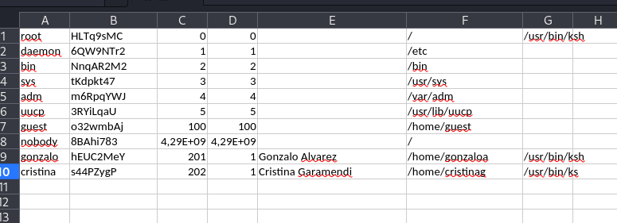

- [**1. Entendiendo qué pide el ejercicio**](#1-entendiendo-qué-pide-el-ejercicio)
  - [**Pasos para resolver el ejercicio**](#pasos-para-resolver-el-ejercicio)
- [**2. Buscar un fragmento de texto claro conocido**](#2-buscar-un-fragmento-de-texto-claro-conocido)
  - [**2.1 Identificar los primeros bytes del `video.docx.enc` en claro:**](#21-identificar-los-primeros-bytes-del-videodocxenc-en-claro)
- [**3. Calcular la secuencia cifrante correspondiente de los primeros 4 bytes**](#3-calcular-la-secuencia-cifrante-correspondiente-de-los-primeros-4-bytes)
- [**4. Ampliar la secuencia cifrante**](#4-ampliar-la-secuencia-cifrante)
  - [**4.1 Extender la keystream validada a partir de la ventana 30:50**](#41-extender-la-keystream-validada-a-partir-de-la-ventana-3050)
  - [**4.2 Probamos con la cadena xl/workbook.xml**](#42-probamos-con-la-cadena-xlworkbookxml)
  - [**4.3 Probamos la cadena `_rels/.rels` en distintas posiciones**](#43-probamos-la-cadena-_relsrels-en-distintas-posiciones)
  - [**4.4 Probamos la cadena docProps**](#44-probamos-la-cadena-docprops)
  - [**4.6 Probamos la cadena sharedStrings.xml**](#46-probamos-la-cadena-sharedstringsxml)
  - [**4.7 Probamos la cadena xl/worksheets**](#47-probamos-la-cadena-xlworksheets)
- [**5. Comparamos ventanas de bytes**](#5-comparamos-ventanas-de-bytes)
- [**6. El keystream que se repite**](#6-el-keystream-que-se-repite)
- [**7. Conclusiones**](#7-conclusiones)


# **1. Entendiendo qué pide el ejercicio**

El enunciado dice que una versión primitiva de TorrentLocker cifró tres archivos y que necesitamos obtener la contraseña de Cristina Garamendi almacenada en ese Excel. Además, debemos estudiar la lección 3 y a la sección 3.1.3.

Pista importante de la sección 3.1.3: El manual explica que, **si un cifrador en flujo reutiliza la misma secuencia cifrante, y tenemos un archivo original y su versión cifrada, podemos recuperar esa secuencia con un ataque de texto claro conocido (KPA) y luego descifrar los demás archivos.** El propio temario pone como ejemplo **TorrentLocker** y dice que, **con un ataque de texto claro conocido, se puede recuperar la secuencia cifrante y con ella descifrar otros archivos.**


**Pasos para solventar el ejercicio:**
- Identificar cuál de los archivos cifrados tiene su versión original o deducible.
- Hacer XOR entre el archivo original y su versión cifrada para obtener la secuencia cifrante. En un cifrado en flujo, se cumple:
  - `cifrado = claro XOR secuencia`.
  - Por tanto: `secuencia = claro XOR cifrado`.
- Usar esa misma secuencia cifrante sobre el archivo cifrado `claves.xlsx` para recuperar el Excel en claro.
- Abrir el Excel ya recuperado y leer la contraseña de `Cristina Garamendi`.

**Conclusión:** Aprovecharemos que el malware reutilizó la misma clave/keystream en varios archivos, que es justo el error que el temario describe en la práctica sobre TorrentLocker. Vamos a buscar un par `archivo original / archivo cifrado` o, al menos, una parte conocida del texto claro de uno de los archivos cifrados, porque el temario dice que, **si TorrentLocker reutiliza la misma secuencia cifrante, con un único archivo sin cifrar y su correspondiente cifrado se recupera la secuencia cifrante mediante un KPA, y con ella se descifran los demás archivos.**

**La base matemática del cifrado de Vernam/XOR:**
```
c = k ⊕ m
m = k ⊕ c
```
donde:
- Si conocemos `m` y `c`, podemos despejar la secuencia cifrante `k`.
- XOR es la operación central de este tipo de cifrado en flujo.
- Sabemos que si se reutiliza la misma clave/secuencia en más de un mensaje, entonces se filtra información, porque al hacer XOR entre cifrados desaparece la clave reutilizada y queda una relación entre los mensajes.


## **Pasos para resolver el ejercicio**
- El modelo de ataque es un KPA, un ataque trivial de texto claro conocido.
- No atacaremos la clave directamente, sino la secuencia cifrante reutilizada. 
- Buscaremos cuál de los tres archivos tiene contenido original deducible o conocido para poder hacer el XOR entre claro y cifrado. Buscaremos un trozo de texto claro conocido de uno de los archivos cifrados para calcular la secuencia cifrante con XOR.

---- 

# **2. Buscar un fragmento de texto claro conocido**
Vamos a elegir uno de los tres ficheros con extensión `.enc` y ver qué parte de su contenido original podemos conocer o deducir con seguridad. Vamos a intentar obtener un fragmento de texto claro conocido del archivo `video.docx.enc` para poder calcular la secuencia cifrante con XOR.


## **2.1 Identificar los primeros bytes del `video.docx.enc` en claro:**
Sabemos que un archivo con extensión `.docx` pertenece al formato `Office Open XML (OOXML)`. Ese formato no guarda el documento como un bloque binario monolítico, sino como un paquete de archivos XML y recursos comprimidos dentro de un contenedor ZIP. Por eso, cuando hablamos del fichero `video.docx`, realmente estamos hablando de:
- un ZIP
- que contiene ficheros como XML, relaciones, propiedades, etc.

La firma ZIP al principio del archivo original es:
- `Hexadecimal: 50 4B 03 04`.
- `ASCII: PK\x03\x04`.

Vamos a averiguar qué bytes del `video.docx` original podemos dar por conocidos al principio del archivo. Para ello tenemos que identificar el formato real de un documento con extensión `.docx` y usar su firma mágica y su estructura estándar como texto claro conocido. Si `video.docx.enc` corresponde a un `.docx` válido, es razonable suponer que el `video.docx` original comenzaba con esas cabeceras.

```
└─$ xxd -l 16 video.docx.enc      
00000000: 1a51 cf47 2060 769e 421a cc43 1560 af3a  .Q.G `v.B..C.`.:
                                                                                                                                   
└─$ head -c 16 video.docx.enc | xxd -p  
1a51cf472060769e421acc431560af3a
```
donde:
- Eso NO coincide con la cabecera ZIP esperable de un `.docx` original.
- Esto es lógico ya que estamos viendo el archivo cifrado, no el archivo en claro:
  - `video.docx original esperado` → debería empezar por `50 4b 03 04`.
  - `video.docx.enc cifrado` → empieza por `1a 51 cf 47`.


Sabemos que:
- La extensión original prevista era `.docx`.
- Un `.docx` válido es un contenedor `ZIP/OOXML`.
- Por tanto, como hipótesis de KPA, es razonable suponer que el original `video.docx` empezaba por `50 4B 03 04`.

Dado que la extensión original del fichero es `.docx`, se asume que el archivo en claro sigue el estándar `Office Open XML`. Este formato encapsula documentos como un paquete ZIP que contiene XML y otros recursos, por lo que su cabecera típica comienza por la firma `ZIP 50 4B 03 04 (PK\x03\x04)`. En consecuencia, esos bytes pueden usarse como texto claro conocido para iniciar un ataque KPA sobre el archivo cifrado.


Si asumimos, como primer KPA razonable, que el `video.docx` original empieza por: `50 4b 03 04`, entonces los 4 primeros bytes de la `keystream` se obtienen haciendo XOR:
- `ciphertext: 1a 51 cf 47` ← ← ← `c`.
- `plaintext supuesto: 50 4b 03 04` ← ← ← `m`.
- Entonces calculamos `k = c ⊕ m`.

# **3. Calcular la secuencia cifrante correspondiente de los primeros 4 bytes**
Si la hipótesis del `.docx` como ZIP es correcta, entonces:
- `keystream = c XOR m` = `1a 51 cf 47 XOR 50 4b 03 04 = 4a 1a cc 43`
- `keystream[0:4] = 4a 1a cc 43`.
- Este es precisamente el tipo de paso que se describe para un cifrado en flujo con XOR: conocer un trozo de `m` para despejar `k` a partir de `c = k ⊕ m`.
- **Conclusión: Hemos recuperado los primeros 4 bytes de la secuencia cifrante, no toda la secuencia completa.**


Comprobamos los 4 primeros bytes cifrados de los archivos `claves.xlsx.enc` y `datos.pptx.enc`:
```
└─$ head -c 4 claves.xlsx.enc | xxd -p
1a51cf47
                                                                                                                                   
┌──(kali㉿kali)-[~/Desktop/M1T4]
└─$ head -c 4 datos.pptx.enc | xxd -p
1a51cf47
```
donde:
- Comprobamos que comparte el `ciphertext inicial: 1a51cf47`.
- Implica que los tres cifrados comparten el mismo prefijo.
- **Si los tres originales empezaban igual y se cifraron con la misma secuencia, entonces los tres comparten el mismo arranque cifrado.**


**Resumiendo: Hemos recuperado un prefijo de la secuencia cifrante, no la secuencia cifrante entera:**
- `keystream byte 0 = 4a`.
- `keystream byte 1 = 1a`.
- `keystream byte 2 = cc`.
- `keystream byte 3 = 43`.
- `keystream[0:4] = 4a1acc43`.

**Recopilamos:**  
- Ya sabemos que:
  - `ciphertext inicial: 1a51cf47`.
  - `plaintext esperado: 504b0304`.
  - `keystream: 4a1acc43`.
- Por tanto: `1a51cf47 XOR 4a1acc43 = 504b0304`.


# **4. Ampliar la secuencia cifrante**
Ahora necesitamos más bytes conocidos del `video.docx` original para seguir haciendo: `k = c XOR m`. Tenemos que buscar más texto claro conocido dentro de `video.docx`. Como `video.docx` es un contenedor `ZIP/OOXML`, después de la firma inicial debemos intentar localizar cadenas muy típicas del formato, por ejemplo:
```
[Content_Types].xml
_rels/.rels
word/
docProps/
```
donde:
- **Si podemos justificar que una parte del archivo original contenía alguna de esas cadenas, entonces en esa posición hacemos XOR con el `ciphertext` correspondiente y recuperamos más `keystream`.**
- La idea es como no podemos buscar la cadena en claro dentro del fichero `.enc` porque está cifrada, lo que hacemos es probar posiciones en donde podría empezar esa cadena en el fichero `video.docx` original y, en cada posición, calcular la `keystream candidata` y verificar si esa misma `keystream` produce texto coherente en los otros.


**Probamos entonces si en alguna posición `p` está la cadena `[Content_Types].xml`:** Esta cadena tiene una longitud de 19. `[Content_Types].xml` en hexadecimal es: `5b436f6e74656e745f54797065735d2e786d6c`. Vemos lo que contiene el fichero en la posición decimal 30. Elegimos esta posición como un offset razonable en el que probar y que después se validará. Recuperamos los 19 bytes cifrados en la posición 30 de `video.docx.enc`:
 ```
└─$ dd if=video.docx.enc bs=1 skip=30 count=19 status=none | xxd -p
2bdd2574b8265a142fca336aa930694e08f326
```
donde:
- `ciphertext = 2bdd2574b8265a142fca336aa930694e08f326`.
- `plaintext supuesto = [Content_Types].xml`.
- `2bdd2574b8265a142fca336aa930694e08f326` XOR `5b436f6e74656e745f54797065735d2e786d6c` = keystream candidata para la posición 30 = `709e4a1acc433460709e4a1acc433460709e4a`.


**<marK>Conclusión: `keystream:  70 9e 4a 1a cc 43 34 60 70 9e 4a 1a cc 43 34 60 70 9e 4a`. Vemos un patrón que se repite `70 9e 4a 1a cc 43 34 60`. No parece una secuencia aleatoria larga distinta en cada byte, sino un patrón periódico de 8 bytes. Esto sugiere que el cifrado podría estar reutilizando una keystream periódica de 8 bytes, al menos en esa zona. Además `4a 1a cc 43` conecta con los 4 bytes iniciales que ya hemos recuperado antes.</mark>**


-----

**Verificamos esta keystream candidata sobre los otros archivos en la misma posición 30:**  
```
└─$ python3 -c "c=bytes.fromhex('$(dd if=datos.pptx.enc bs=1 skip=30 count=20 status=none | xxd -p)'); k=bytes.fromhex('709e4a1acc433460709e4a1acc433460709e4a1a'); print(bytes(a^b for a,b in zip(c,k)))"
b'ppt/presentation.xml'
                                                                                                                                   

└─$ python3 -c "c=bytes.fromhex('$(dd if=claves.xlsx.enc bs=1 skip=30 count=20 status=none | xxd -p)'); k=bytes.fromhex('709e4a1acc433460709e4a1acc433460709e4a1a'); print(bytes(a^b for a,b in zip(c,k)))" 
b'[Content_Types].xml '             
```
donde:
- En la posición 30, usando la keystream candidata sobre `claves.xlsx.enc` obtenemos: `b'[Content_Types].xml '`
- En la posición 30, usando la keystream candidata sobre `datos.pptx.enc` obtenemos: `b'ppt/presentation.xml'`
- Validamos que en la posición 30:
  - `claves.xlsx` contiene una cadena OOXML perfectamente coherente: `[Content_Types].xml `.
  - `datos.pptx` contiene una ruta OOXML coherente con PowerPoint: `ppt/presentation.xml`


**Conclusión: Tenemos una porción valida da de keystream para la ventana de bytes 30:50.** Esto confirma dos cosas clave del ejercicio:
- Los archivos originales eran realmente paquetes OOXML/ZIP.
- Se está reutilizando la misma secuencia cifrante en esa zona, tal como hace en la práctica de `TorrentLocker`.


## **4.1 Extender la keystream validada a partir de la ventana 30:50**
Vamos a seguir extendiendo la keystream validada a partir de la ventana 30:50 para reconstruir suficiente contenido de `claves.xlsx.enc`. Usaremos nuevas cadenas conocidas de OOXML para ampliar la keystream hacia delante y hacia atrás. Cadenas candidatas útiles:
- Para claves.xlsx:
  - xl/
  - xl/workbook.xml
  - _rels/.rels
  - docProps/
  - .xml

- Para datos.pptx:
  - ppt/presentation.xml
  - _rels/.rels
  - docProps/

- Para video.docx:
  - word/document.xml
  - _rels/.rels
  - docProps/


**Buscar si cerca de la posición 30 aparece el resto de la estructura de `[Content_Types].xml` o el comienzo de otra entrada ZIP/OOXML:** Ya tenemos esta keystream de 20 bytes: `709e4a1acc433460709e4a1acc433460709e4a1a`. Ahora vamos a probar primero a descifrar 20 bytes en varias posiciones de `claves.xlsx.enc`:

**Posición 20:**
```
└─$ python3 -c "c=bytes.fromhex('$(dd if=claves.xlsx.enc bs=1 skip=20 count=20 status=none | xxd -p)'); k=bytes.fromhex('709e4a1acc433460709e4a1acc433460709e4a1a'); print(bytes(a^b for a,b in zip(c,k)))"
b'D\xfe>\x81\x86Y\xeb#L\xfca\xc7\xe97\x8cF*\x8ae\xd0
```
donde:
- Obtenemos basura.

--- 

**Posición 30:**
```
└─$ python3 -c "c=bytes.fromhex('$(dd if=claves.xlsx.enc bs=1 skip=30 count=20 status=none | xxd -p)'); k=bytes.fromhex('709e4a1acc433460709e4a1acc433460709e4a1a'); print(bytes(a^b for a,b in zip(c,k)))"
b'[Content_Types].xml '
```
donde:
- Obtenemos `[Content_Types].xml`.

--- 

**Posición 40:**
```
└─$ python3 -c "c=bytes.fromhex('$(dd if=claves.xlsx.enc bs=1 skip=40 count=20 status=none | xxd -p)'); k=bytes.fromhex('709e4a1acc433460709e4a1acc433460709e4a1a'); print(bytes(a^b for a,b in zip(c,k)))"
b'C\xf4\xe3*\xa5\r<\x93V\xa4$]\xfa\x0b\xe4\xfe8\x84\x86Y'
```
donde:
- Obtenemos basura.

--- 

**Posición 50:**
```
└─$ python3 -c "c=bytes.fromhex('$(dd if=claves.xlsx.enc bs=1 skip=50 count=20 status=none | xxd -p)'); k=bytes.fromhex('709e4a1acc433460709e4a1acc433460709e4a1a'); print(bytes(a^b for a,b in zip(c,k)))"
b'\x1e\xd9|R\x1c\xdd|z\xbc\xdd~z\xbc\xdd~z\xbc\xdd~z'                    
```
donde:
- Obtenemos un patrón repetitivo raro, pero no texto OOXML legible.

--- 

**Conclusiones:**
- La keystream validada corresponde a la ventana de bytes 30:50.
- No podemos reutilizar esa misma ventana de keystream en 20:40, 40:60 o 50:70 esperando texto claro.
- La hipótesis `[Content_Types].xml` en 30:49 queda reforzada, porque justo ahí sí aparece texto `OOXML` coherente en `claves.xlsx.enc` y `ppt/presentation`.xml en `datos.pptx.enc`.

**Siguiente paso:** Dejar de desplazar la misma keystream y pasar a recuperar una keystream nueva en otra ventana usando otra cadena conocida.

**Lo que ya sabemos ahora:**
- En la ventana 30:50 la `keystream` funciona.
- En ese punto nos devuelve texto `OOXML` coherente:
  - En `claves.xlsx.enc` → `[Content_Types].xml`.
  - En `datos.pptx.enc` → `ppt/presentation.xml`.
- Esto significa que esa ventana ya está resuelta.


## **4.2 Probamos con la cadena xl/workbook.xml**
Ahora vamos a elegir una nueva cadena conocida y una nueva posición candidata para recuperar otra ventana de `keystream`. Ahora vamos a trabajar con el fichero `claves.xlsx.enc`, porque es el archivo objetivo, y probar con una cadena propia de `.xlsx`, por ejemplo: `xl/workbook.xml`, ya que es muy típica de un `.xlsx`.

```
└─$ python3 -c "c=bytes.fromhex('$(dd if=claves.xlsx.enc bs=1 skip=60 count=15 status=none | xxd -p)'); m=b'xl/workbook.xml'; print(bytes(a^b for a,b in zip(c,m)).hex())"
4c0c5fe92568a7215b0f1bb03277a0
```
donde:
- Obtenemos una keystream candidata para la ventana 60:75, bajo la hipótesis de que ahí el claro fuese `xl/workbook.xml`.

Ahora tenemos que verificar esa keystream candidata. Para verificarlo, la aplicamos a a otro archivo en la misma posición 60 y mirar si aparece texto `OOXML` coherente:
```
└─$ python3 -c "c=bytes.fromhex('$(dd if=video.docx.enc bs=1 skip=60 count=15 status=none | xxd -p)'); k=bytes.fromhex('4c0c5fe92568a7215b0f1bb03277a0'); print(bytes(a^b for a,b in zip(c,k)))"
b'xl/workbook.xml'
                                                                                                                                   
└─$ python3 -c "c=bytes.fromhex('$(dd if=datos.pptx.enc bs=1 skip=60 count=15 status=none | xxd -p)'); k=bytes.fromhex('4c0c5fe92568a7215b0f1bb03277a0'); print(bytes(a^b for a,b in zip(c,k)))"
b'\x95q\r\xa8!F\x8f\xf5\xefg~\x82\xb5Y\xc5'

```
donde:
- En la posición 60, usando la keystream candidata:
   - Sobre `video.docx.enc` obtenemos: `xl/workbook.xml`.
   - Sobre `datos.pptx.enc` obtenemos basura.
- Eso significa que:
  - La hipótesis sí encaja para `claves.xlsx.enc` y `video.docx.enc`.
  - No encaja para `datos.pptx.enc`.


**Conclusiones:** Ya tenemos otra porción validada de keystream:
- Ventana de bytes 60:75.
- `keystream[60:75] = 4c0c5fe92568a7215b0f1bb03277a0`


## **4.3 Probamos la cadena `_rels/.rels` en distintas posiciones**

**Posición 75:**
```                                                                                                                                
└─$ python3 -c "c=bytes.fromhex('$(dd if=video.docx.enc bs=1 skip=75 count=11 status=none | xxd -p)'); k=bytes.fromhex('1c46051ced6534be265813'); print(bytes(a^b for a,b in zip(c,k)))"
b'_rels/.rels'
                                                                                                                         

└─$ python3 -c "c=bytes.fromhex('$(dd if=datos.pptx.enc bs=1 skip=75 count=11 status=none | xxd -p)'); k=bytes.fromhex('1c46051ced6534be265813'); print(bytes(a^b for a,b in zip(c,k)))"
b'\xcc"\x8cr\xb3b"6\x10\x80\xbb'
```
donde:
- En `video.docx.enc`, al descifrar los bytes 75:86 con esa keystream, aparece `_rels/.rels`. Por tanto, esa `keystream` sí encaja.
- En `datos.pptx.enc`, esa misma `keystream` no produce texto legible en esa posición. Pero eso no invalida la `keystream`. Sólo indica que en el `.pptx` esa misma cadena no está en esa posición.
- En la posición 75, se formula la hipótesis de que `claves.xlsx` contiene la cadena `_rels/.rels`. A partir de esa hipótesis se deriva una keystream candidata. Al aplicar dicha keystream sobre `video.docx.enc` en la misma posición, se recupera exactamente la cadena `_rels/.rels`, lo que valida la hipótesis y confirma una nueva porción de `keystream` en la ventana de bytes 75:86. El hecho de que la misma `keystream` no produzca texto legible en datos.`pptx.enc` no invalida el resultado, sino que indica que esa ruta no aparece alineada en la misma posición dentro del `.pptx`.

---

**Posición 80:**
```
└─$ python3 -c "c=bytes.fromhex('$(dd if=video.docx.enc bs=1 skip=80 count=11 status=none | xxd -p)'); k=bytes.fromhex('1568a92f474f5eec2f76bf'); print(bytes(a^b for a,b in zip(c,k)))"
b'_rels/.rels'


└─$ python3 -c "c=bytes.fromhex('$(dd if=datos.pptx.enc bs=1 skip=80 count=11 status=none | xxd -p)'); k=bytes.fromhex('1568a92f474f5eec2f76bf'); print(bytes(a^b for a,b in zip(c,k)))"
b'\x12~!\x19\x9f\xe7\x18~_\x81\xae'
```
donde:
- En `video.docx.enc`, al descifrar los bytes 80:91 con esa `keystream`, aparece `_rels/.rels`. Por tanto, esa `keystream` sí encaja.
- Conclusión: En la posición 80, la hipótesis `_rels/.rels` queda validada.
- Por tanto, tenemos otra porción válida de `keystream` en la ventana de bytes 80:91.

---

**Posición 90:**                                                                                                                                
```
└─$ python3 -c "c=bytes.fromhex('$(dd if=video.docx.enc bs=1 skip=90 count=11 status=none | xxd -p)'); k=bytes.fromhex('9331510c03b16468a92f47'); print(bytes(a^b for a,b in zip(c,k)))"
b'_rels/.rels'

                                                                                                                       
└─$ python3 -c "c=bytes.fromhex('$(dd if=datos.pptx.enc bs=1 skip=90 count=11 status=none | xxd -p)'); k=bytes.fromhex('9331510c03b16468a92f47'); print(bytes(a^b for a,b in zip(c,k)))"
b'\x82\x05\x89TR\x8a\xb4\xa6\xee1\x95'
```
donde:
- Posición 90 validada.
- `keystream[90:101] = 9331510c03b16468a92f47`.
- `video.docx[90:101] = _rels/.rels`.

---
                                                                                                                                   
**Posición 100:**
```
┌──(kali㉿kali)-[~/Desktop/M1T4]
└─$ python3 -c "c=bytes.fromhex('$(dd if=video.docx.enc bs=1 skip=100 count=11 status=none | xxd -p)'); k=bytes.fromhex('6b1215f23935e231510c03'); print(bytes(a^b for a,b in zip(c,k)))"
b'_rels/.rels'
                                                                                                                                   
┌──(kali㉿kali)-[~/Desktop/M1T4]
└─$ python3 -c "c=bytes.fromhex('$(dd if=datos.pptx.enc bs=1 skip=100 count=11 status=none | xxd -p)'); k=bytes.fromhex('6b1215f23935e231510c03'); print(bytes(a^b for a,b in zip(c,k)))"
b'\xb9X\xa2R\xcc\xd1BK\xa2\x9f\xa8'
```
donde:
- Posición 100 validada.
- `keystream[100:111] = 6b1215f23935e231510c03`
- En `video.docx`, la ventana 100:111 descifra a `_rels/.rels`.


---

**Conclusiones:**
- La cadena `_rels/.rels` está valida en: 75, 80, 90, 100.
- Hemos encontrado varias ventanas compatibles con una cadena `OOXML` muy común.
- Se confirma que la `keystream` reutilizada permite recuperar fragmentos coherentes.
- Pero todavía falta ordenar el contexto para decidir qué posiciones encajan mejor en una estructura ZIP real del `.xlsx`.


**<mark>Tenemos que cambiar de cadena para fijar mejor la estructura.</mark>**


## **4.4 Probamos la cadena docProps**
Cambiamos de cadena para fijar mejor la estructura. La candidata más lógica ahora es: `docProps/`, porque también es muy típica de `OOXML`.

Probamos `docProps/` en `claves.xlsx.enc` en las posiciones:
```                                                                                                                                
└─$ python3 -c "c=bytes.fromhex('$(dd if=claves.xlsx.enc bs=1 skip=86 count=9 status=none | xxd -p)'); m=b'docProps/'; print(bytes(a^b for a,b in zip(c,m)).hex())"
14f1294abe2c44135f
                                                                                                                                   

└─$ python3 -c "c=bytes.fromhex('$(dd if=claves.xlsx.enc bs=1 skip=95 count=9 status=none | xxd -p)'); m=b'docProps/'; print(bytes(a^b for a,b in zip(c,m)).hex())"
fa25799c315b1003b1
                                                                                                                                   

└─$ python3 -c "c=bytes.fromhex('$(dd if=claves.xlsx.enc bs=1 skip=100 count=9 status=none | xxd -p)'); m=b'docProps/'; print(bytes(a^b for a,b in zip(c,m)).hex())"
500f13ce3875bc301b
```
donde:
- Obtenemos unas `keystreams candidatas` para la hipótesis `docProps/` en cada posición. Aún no validan nada por sí solas.
  - posición 86 → `14f1294abe2c44135f`.
  - posición 95 → `fa25799c315b1003b1`.
  - posición 100 → `500f13ce3875bc301b`.

Vamos a verificarlas aplicando cada keystream candidata a `video.docx.enc` en la misma posición y analizamos si aparece `docProps/` o, al menos, texto `OOXML` coherente:
```                                                                                                                       
┌──(kali㉿kali)-[~/Desktop/M1T4]
└─$ python3 -c "c=bytes.fromhex('$(dd if=video.docx.enc bs=1 skip=86 count=9 status=none | xxd -p)'); k=bytes.fromhex('14f1294abe2c44135f'); print(bytes(a^b for a,b in zip(c,k)))"
b'docProps/'
                                                                                                                                   
┌──(kali㉿kali)-[~/Desktop/M1T4]
└─$ python3 -c "c=bytes.fromhex('$(dd if=video.docx.enc bs=1 skip=95 count=9 status=none | xxd -p)'); k=bytes.fromhex('fa25799c315b1003b1'); print(bytes(a^b for a,b in zip(c,k)))"
b'docProps/'
                                                                                                                                   
┌──(kali㉿kali)-[~/Desktop/M1T4]
└─$ python3 -c "c=bytes.fromhex('$(dd if=video.docx.enc bs=1 skip=100 count=9 status=none | xxd -p)'); k=bytes.fromhex('500f13ce3875bc301b'); print(bytes(a^b for a,b in zip(c,k)))"
b'docProps/'
```
donde hemos tomado tres `keystream` candidatas derivadas de `claves.xlsx.enc` suponiendo que en esas posiciones estaba `docProps/`, y al aplicarlas sobre `video.docx.enc` hemos recuperado exactamente:
- `docProps/` en la posición 86.
- `docProps/` en la posición 95.
- `docProps/` en la posición 100.


---

## **4.6 Probamos la cadena sharedStrings.xml**
Vamos a buscar si en claves.xlsx aparece la cadena: `sharedStrings.xml` y usarla como nueva hipótesis de texto claro conocido para recuperar otra porción de keystream:
```
└─$ python3 -c "c=bytes.fromhex('$(dd if=claves.xlsx.enc bs=1 skip=110 count=17 status=none | xxd -p)'); m=b'sharedStrings.xml'; print(bytes(a^b for a,b in zip(c,m)).hex())"
03f62b68a927671402f7247dbf6d4c0d1c
                                                                                                                                   

└─$ python3 -c "c=bytes.fromhex('$(dd if=claves.xlsx.enc bs=1 skip=120 count=17 status=none | xxd -p)'); m=b'sharedStrings.xml'; print(bytes(a^b for a,b in zip(c,m)).hex())"
3972ad31510423ea3873a224474e08f326
                                                                                                                                   

└─$ python3 -c "c=bytes.fromhex('$(dd if=claves.xlsx.enc bs=1 skip=130 count=17 status=none | xxd -p)'); m=b'sharedStrings.xml'; print(bytes(a^b for a,b in zip(c,m)).hex())"
bf2b551215fa196ebe2a5a0703b03277a0
                                                                                                                                   

└─$ python3 -c "c=bytes.fromhex('$(dd if=claves.xlsx.enc bs=1 skip=140 count=17 status=none | xxd -p)'); m=b'sharedStrings.xml'; print(bytes(a^b for a,b in zip(c,m)).hex())"
470811ec2f7e9f3746091ef93934b42e58
```
donde, tenemos 4 keystream candidatas para la hipótesis sharedStrings.xml en distintas posiciones de claves.xlsx.enc:
- posición 110 → `03f62b68a927671402f7247dbf6d4c0d1c`.
- posición 120 → `3972ad31510423ea3873a224474e08f326`.
- posición 130 → `bf2b551215fa196ebe2a5a0703b03277a0`.
- posición 140 → `470811ec2f7e9f3746091ef93934b42e58`.


Vamos a verificarlas aplicando cada keystream candidata a `video.docx.enc` y sobre `datos.pptx.enc` en la misma posición y analizamos si aparece `sharedStrings.xml` o, al menos, texto `OOXML` coherente:
```
└─$ python3 -c "c=bytes.fromhex('$(dd if=video.docx.enc bs=1 skip=110 count=17 status=none | xxd -p)'); k=bytes.fromhex('03f62b68a927671402f7247dbf6d4c0d1c'); print(bytes(a^b for a,b in zip(c,k)))"
b'sharedStrings.xml'
                                                                                                                                   

└─$ python3 -c "c=bytes.fromhex('$(dd if=video.docx.enc bs=1 skip=120 count=17 status=none | xxd -p)'); k=bytes.fromhex('3972ad31510423ea3873a224474e08f326'); print(bytes(a^b for a,b in zip(c,k)))"
b'sharedStrings.xml'
                                                                                                                                   

└─$ python3 -c "c=bytes.fromhex('$(dd if=video.docx.enc bs=1 skip=130 count=17 status=none | xxd -p)'); k=bytes.fromhex('bf2b551215fa196ebe2a5a0703b03277a0'); print(bytes(a^b for a,b in zip(c,k)))"
b'sharedStrings.xml'
                                                                                                                                   

└─$ python3 -c "c=bytes.fromhex('$(dd if=video.docx.enc bs=1 skip=140 count=17 status=none | xxd -p)'); k=bytes.fromhex('470811ec2f7e9f3746091ef93934b42e58'); print(bytes(a^b for a,b in zip(c,k)))"
b'sharedStrings.xml'
                                                                                                                                   

└─$ python3 -c "c=bytes.fromhex('$(dd if=datos.pptx.enc bs=1 skip=110 count=17 status=none | xxd -p)'); k=bytes.fromhex('03f62b68a927671402f7247dbf6d4c0d1c'); print(bytes(a^b for a,b in zip(c,k)))"
b'\xa8;$\xefFu\xe1\x90^,\xb0\xaak\x17\xfc\x88\xd0'
                                                                                                                                   

└─$ python3 -c "c=bytes.fromhex('$(dd if=datos.pptx.enc bs=1 skip=120 count=17 status=none | xxd -p)'); k=bytes.fromhex('3972ad31510423ea3873a224474e08f326'); print(bytes(a^b for a,b in zip(c,k)))"
b'\xad\xa5yK\xe1\x81\xef\\\xabG+X\xec\x9c)\xefp'
                                                                                                                                   

└─$ python3 -c "c=bytes.fromhex('$(dd if=datos.pptx.enc bs=1 skip=130 count=17 status=none | xxd -p)'); k=bytes.fromhex('bf2b551215fa196ebe2a5a0703b03277a0'); print(bytes(a^b for a,b in zip(c,k)))"
b'6W\xfe\xc04\xe6O\xddBB^\x82\xff\x8a\x90!H'
                                                                                                                                   

└─$ python3 -c "c=bytes.fromhex('$(dd if=datos.pptx.enc bs=1 skip=140 count=17 status=none | xxd -p)'); k=bytes.fromhex('470811ec2f7e9f3746091ef93934b42e58'); print(bytes(a^b for a,b in zip(c,k)))"
b'C\x8d\xed\xd6\x8d(w\xce/\x15\x90S\xdcI\xcdM\xfe'
```
donde:
- **<mark>Concluimos que esas cuatro validaciones con `sharedStrings.xml` no son fiables como validación independiente.</mark>**

Las hipótesis con `sharedStrings.xml` en las posiciones 110, 120, 130 y 140 no constituyen una validación robusta, ya que al aplicarlas sobre `video.docx.enc` recuperan exactamente la misma cadena, algo poco coherente con la estructura de un `.docx`. Esto sugiere que la comprobación no es independiente o que se está reutilizando una región de `ciphertext` equivalente, por lo que estas ventanas no deben aceptarse todavía como validadas.


## **4.7 Probamos la cadena xl/worksheets**
Apostamos por probar `xl/worksheets/` en posiciones plausibles dentro de `claves.xlsx.enc`. Cadena de 14 bytes. Vamos a buscar si en `claves.xlsx` aparece la cadena: `xl/worksheets` y usarla como nueva hipótesis de texto claro conocido para recuperar otra porción de `keystream`:
```
└─$ python3 -c "c=bytes.fromhex('$(dd if=claves.xlsx.enc bs=1 skip=110 count=14 status=none | xxd -p)'); m=b'xl/worksheets/'; print(bytes(a^b for a,b in zip(c,m)).hex())"
08f2656da3315f1318fb2f6ebf6c
                                                                                                                                   
└─$ python3 -c "c=bytes.fromhex('$(dd if=claves.xlsx.enc bs=1 skip=120 count=14 status=none | xxd -p)'); m=b'xl/worksheets/'; print(bytes(a^b for a,b in zip(c,m)).hex())"
3276e3345b121bed227fa937474f
                                                                                                                                   

└─$ python3 -c "c=bytes.fromhex('$(dd if=claves.xlsx.enc bs=1 skip=130 count=14 status=none | xxd -p)'); m=b'xl/worksheets/'; print(bytes(a^b for a,b in zip(c,m)).hex())"
b42f1b171fec2169a426511403b1

                                                                                                       
└─$ python3 -c "c=bytes.fromhex('$(dd if=claves.xlsx.enc bs=1 skip=140 count=14 status=none | xxd -p)'); m=b'xl/worksheets/'; print(bytes(a^b for a,b in zip(c,m)).hex())"
4c0c5fe92568a7305c0515ea3935
```
donde tenemos 4 nuevas keystream candidatas para la hipótesis xl/worksheets/:
- posición 110 → `08f2656da3315f1318fb2f6ebf6c`.
- posición 120 → `3276e3345b121bed227fa937474f`.
- posición 130 → `b42f1b171fec2169a426511403b1`.
- posición 140 → `4c0c5fe92568a7305c0515ea3935`.


Vamos a verificarlas aplicando cada keystream candidata a `video.docx.enc` y sobre `datos.pptx.enc` en la misma posición y analizamos si aparece `xl/worksheets` o, al menos, texto `OOXML` coherente:

```
└─$ python3 -c "c=bytes.fromhex('$(dd if=video.docx.enc bs=1 skip=110 count=14 status=none | xxd -p)'); k=bytes.fromhex('08f2656da3315f1318fb2f6ebf6c'); print(bytes(a^b for a,b in zip(c,k)))"
b'xl/worksheets/'
                                                                                                                                   

└─$ python3 -c "c=bytes.fromhex('$(dd if=video.docx.enc bs=1 skip=120 count=14 status=none | xxd -p)'); k=bytes.fromhex('3276e3345b121bed227fa937474f'); print(bytes(a^b for a,b in zip(c,k)))"
b'xl/worksheets/'
                                                                                                                                   
]
└─$ python3 -c "c=bytes.fromhex('$(dd if=video.docx.enc bs=1 skip=130 count=14 status=none | xxd -p)'); k=bytes.fromhex('b42f1b171fec2169a426511403b1'); print(bytes(a^b for a,b in zip(c,k)))"
b'xl/worksheets/'
                                                                                                                                   

└─$ python3 -c "c=bytes.fromhex('$(dd if=video.docx.enc bs=1 skip=140 count=14 status=none | xxd -p)'); k=bytes.fromhex('4c0c5fe92568a7305c0515ea3935'); print(bytes(a^b for a,b in zip(c,k)))"
b'xl/worksheets/'

└─$ python3 -c "c=bytes.fromhex('$(dd if=datos.pptx.enc bs=1 skip=110 count=14 status=none | xxd -p)'); k=bytes.fromhex('08f2656da3315f1318fb2f6ebf6c'); print(bytes(a^b for a,b in zip(c,k)))"
b'\xa3?j\xeaLc\xd9\x97D \xbb\xb9k\x16'
                                                                                                                                   

└─$ python3 -c "c=bytes.fromhex('$(dd if=datos.pptx.enc bs=1 skip=120 count=14 status=none | xxd -p)'); k=bytes.fromhex('3276e3345b121bed227fa937474f'); print(bytes(a^b for a,b in zip(c,k)))"
b'\xa6\xa17N\xeb\x97\xd7[\xb1K K\xec\x9d'
                                                                                                                                   

└─$ python3 -c "c=bytes.fromhex('$(dd if=datos.pptx.enc bs=1 skip=130 count=14 status=none | xxd -p)'); k=bytes.fromhex('b42f1b171fec2169a426511403b1'); print(bytes(a^b for a,b in zip(c,k)))"
b'=S\xb0\xc5>\xf0w\xdaXNU\x91\xff\x8b'
                                                                                                                                   

└─$ python3 -c "c=bytes.fromhex('$(dd if=datos.pptx.enc bs=1 skip=140 count=14 status=none | xxd -p)'); k=bytes.fromhex('4c0c5fe92568a7305c0515ea3935'); print(bytes(a^b for a,b in zip(c,k)))"
b'H\x89\xa3\xd3\x87>O\xc95\x19\x9b@\xdcH'
```
donde:
- **<mark>Concluimos que esas cuatro validaciones con `xl/worksheets` no son fiables como validación independiente.</mark>**


Las hipótesis con `xl/worksheets/` en las posiciones 110, 120, 130 y 140 no constituyen una validación robusta, ya que al aplicarlas sobre `video.docx.enc` devuelven repetidamente la misma cadena propia de Excel, algo incoherente con la estructura esperable de un `.docx`. Por tanto, estas ventanas no deben aceptarse todavía como porciones validadas de `keystream`.


**<mark>Esta línea para intentar solucionar el ejercicio es inviable. Hay que cambiar la estratégia.</mark>**


-------------------
*******************
-------------------

# **5. Comparamos ventanas de bytes**
Como no damos con la solución, vamos a comparar `video.docx.enc`, `claves.xlsx.enc` y `datos.pptx.enc` buscando ventanas idénticas de distintos tamaños. Usamos el siguiente script de Python:
```
from pathlib import Path

video = Path("video.docx.enc").read_bytes()
claves = Path("claves.xlsx.enc").read_bytes()
datos = Path("datos.pptx.enc").read_bytes()

WINDOWS = [3, 4, 6, 9, 11, 15, 20]

limit = min(len(video), len(claves), len(datos), 200)

for w in WINDOWS:
    print(f"\n=== Ventanas idénticas de tamaño {w} ===")
    found = 0
    for pos in range(0, limit - w + 1):
        cv = video[pos:pos+w]
        ck = claves[pos:pos+w]
        cd = datos[pos:pos+w]

        if cv == ck:
            print(f"pos={pos:3d}  video == claves   {cv.hex()}")
            found += 1
        elif cv == cd:
            print(f"pos={pos:3d}  video == datos    {cv.hex()}")
            found += 1
        elif ck == cd:
            print(f"pos={pos:3d}  claves == datos   {ck.hex()}")
            found += 1

    if found == 0:
        print("ninguna")
```
donde:
- Recorre offsets desde 0 hasta 200.
- Para cada offset cogía ventanas de tamaño: `3, 4, 6, 9, 11, 15, 20`.
- Compara esa ventana entre:
  - `video.docx.enc`
  - `claves.xlsx.enc`
  - `datos.pptx.enc`
- Finalemente imprime cuándo dos de ellas sean exactamente iguales.


Obtenemos: [compare-equals_windows]([https://github.com/soniasalido/cybersecurity/blob/main/Documentation/Malware/Master-ENIIT-Analisis-Malware-Reversing/modulo-1-criptografia/04-M1T4-cifrado-en-flujo/compare_equal_windows.txt)
```

=== Ventanas idénticas de tamaño 3 ===
pos=  0  video == claves   1a51cf
pos=  1  video == claves   51cf47
pos=  2  video == claves   cf4720
pos=  3  video == claves   472060
pos=  4  video == claves   206076
pos=  5  video == claves   60769e
pos=  6  video == claves   769e42
pos=  7  video == claves   9e421a
pos=  8  video == claves   421acc
....
....
```
donde concluimos que:
- Los ficheros `video.docx.enc` y `claves.xlsx.enc` coinciden muchísimo.
- La coincidencia no es sólo en bytes aislados, sino en ventanas consecutivas.
- Esa coincidencia aparece para tamaños de ventana `3, 4, 6, 9, 11, 15 y 20`.
- Se observa de forma continua aproximadamente desde `pos=23` hasta al menos `pos=180`.

**De esto concluimos que, si ambos archivos fueron cifrados con la misma keystream, entonces también debían compartir el mismo plaintext en esa región.**


# **6. El keystream que se repite**
**Recopilamos lo que sabemos desde el principio:**
- Los tres ficheros `.docx`, `.xlsx`, `.pptx`, son internamente archivos ZIP.

- Por tanto, sus primeros bytes en claro debían ser: `50 4B 03 04 (PK\x03\x04)`.

- Además `video.docx.enc` empezieza por: `1a 51 cf 47`.

- De este modo:
  - `ciphertext inicial: 1a 51 cf 47`.
  - `plaintext esperado: 50 4b 03 04`.

- Aplicando XOR entre ambos obtuvimos los primeros bytes de la secuencia cifrante:
  - `K[0:4] = C[0:4] XOR M[0:4]`.
  - `1a 51 cf 47 XOR 50 4b 03 04 = 4a 1a cc 43`.

- Por tanto, los bytes 0,1,2,3 de la keystream son:
  - `K[0] = 4a`.
  - `K[1] = 1a`.
  - `K[2] = cc`.
  - `K[3] = 43`.  
Esto fija el arranque, el inicio de la `keystream`. Es el prefijo de la `keystream`. La keystream inicial correcta es: `4a 1a cc 43`.

- Posteriormente, al analizar otra ventana mediante XOR con texto claro conocido, apareció el siguiente patrón repetido: `70 9e 4a 1a cc 43 34 60`. Esto sugiere que no estamos ante una `keystream` larga arbitraria, sino ante una `keystream periódica de 8 bytes`.


- El patrón repetido nos da los bytes 4–7. Después, cuando probamos la ventana en torno a `[Content_Types].xml`, salió esta keystream candidata: `70 9e 4a 1a cc 43 34 60 70 9e 4a 1a ...` Entonces supimos que existia una periodicidad. Pero esa ventana no empieza en el byte 0, sino en una posición desplazada. Si la `keystream` es periódica de 8 bytes, entonces una ventana que empiece en otro offset nos enseña la misma secuencia, pero rotada.

- Como dentro de esa secuencia aparece el bloque ya conocido: `4a 1a cc 43`.

- Eso reconstruye el ciclo completo como: `4a 1a cc 43 34 60 70 9e`.

- Concluimos que la secuencia cifrante es en realidad periódica con periodo 8, `K = (4a 1a cc 43 34 60 70 9e)`.

- También sabemos que `video.docx.enc` y `claves.xlsx.enc` son idénticos en una región muy extensa.

- Dentro de esa región que comparten, aparece un patrón periódico de 8 bytes.

---

**Vamos a aplicar esa keystream periódica a todo `claves.xlsx.enc` y comprobar si el resultado es realmente un Excel `OOXML` válido:**  
Script para aplicar esa keystream `decrypt_periodic8.py`. Aplicamos la `keystream` aplicando un XOR periódico contra todo el fichero `claves.xlsx.enc`:
```
from pathlib import Path

key = bytes.fromhex("4a1acc433460709e")

enc = Path("claves.xlsx.enc").read_bytes()
dec = bytes(b ^ key[i % len(key)] for i, b in enumerate(enc))

Path("claves_periodic8.bin").write_bytes(dec)
```

**Comprobammos que el resultado obtenido es un Excel real y mostramos algunos de sus strings:**
```
└─$ python3 decrypt_periodic8.py


└─$ file claves_periodic8.bin               

claves_periodic8.bin: Microsoft Excel 2007+
  


└─$ xxd -l 64 claves_periodic8.bin

00000000: 504b 0304 1400 0600 0800 0000 2100 4137  PK..........!.A7
00000010: 82cf 6e01 0000 0405 0000 1300 0802 5b43  ..n...........[C
00000020: 6f6e 7465 6e74 5f54 7970 6573 5d2e 786d  ontent_Types].xm
00000030: 6c20 a204 0228 a000 0200 0000 0000 0000  l ...(..........
                                                                                                                                                      

└─$ strings -n 6 claves_periodic8.bin | head -100

[Content_Types].xml 
_rels/.rels 
r:"y_dl
xl/workbook.xml
xl/_rels/workbook.xml.rels 
xl/worksheets/sheet1.xml
yWse:(
4"xz[av
xl/theme/theme1.xml
#%[dL7
CDUCy;
xl/styles.xml
g"$Q4<8
xl/sharedStrings.xmlt
xl/worksheets/_rels/sheet1.xml.rels
xl/printerSettings/printerSettings1.bin
docProps/core.xml 
docProps/app.xml 
[Content_Types].xmlPK
_rels/.relsPK
xl/workbook.xmlPK
xl/_rels/workbook.xml.relsPK
xl/worksheets/sheet1.xmlPK
xl/theme/theme1.xmlPK
xl/styles.xmlPK
xl/sharedStrings.xmlPK
xl/worksheets/_rels/sheet1.xml.relsPK
xl/printerSettings/printerSettings1.binPK
docProps/core.xmlPK
docProps/app.xmlPK
```
donde:
- Se ha generado un archivo que es un Excel real.
- Hemos encontrado que el cifrado usa una keystream periódica de 8 bytes: `4a 1a cc 43 34 60 70 9e`.
- Al aplicarla a claves.xlsx.enc hemos obtenido:
  - `file → Microsoft Excel 2007+`.
  - `strings` → rutas OOXML coherentes:
    - `[Content_Types].xml`.
    - `_rels/.rels`.
    - `xl/workbook.xml`.
    - `xl/worksheets/sheet1.xml`.
    - `xl/styles.xml`.
    - `xl/sharedStrings.xml`.
    - `docProps/core.xml`.
    - `docProps/app.xml`.
- **<mark>ESTO SIGNIFICA QUE HEMOS DESCIFRADO CORRECTAMENTE EL FICHERO.</mark>**


**Renombramos y abrimos el fichero descifrado:**
```
└─$ cp claves_periodic8.bin claves_periodic8.xlsx

                                                                                                                                                      

└─$ unzip -l claves_periodic8.xlsx

Archive:  claves_periodic8.xlsx
  Length      Date    Time    Name
---------  ---------- -----   ----
     1284  1980-01-01 00:00   [Content_Types].xml
      588  1980-01-01 00:00   _rels/.rels
     1778  1980-01-01 00:00   xl/workbook.xml
      698  1980-01-01 00:00   xl/_rels/workbook.xml.rels
     3302  1980-01-01 00:00   xl/worksheets/sheet1.xml
     6784  1980-01-01 00:00   xl/theme/theme1.xml
     1618  1980-01-01 00:00   xl/styles.xml
      991  1980-01-01 00:00   xl/sharedStrings.xml
      322  1980-01-01 00:00   xl/worksheets/_rels/sheet1.xml.rels
     5420  1980-01-01 00:00   xl/printerSettings/printerSettings1.bin
      615  1980-01-01 00:00   docProps/core.xml
      791  1980-01-01 00:00   docProps/app.xml
---------                     -------
    24191                     12 files
                                                                                                                                                      

└─$ libreoffice claves.xlsx
```


**Obtenemos la solución:**  



**<mark>La solución del ejercicio: En la fila de: Cristina Garamendi → → → aparece la contraseña: `s44PZygP`.</mark>**


# **7. Conclusiones**

El ejercicio se resolvió explotando una implementación defectuosa de un cifrado en flujo basado en XOR. A partir del análisis de los ficheros `video.docx.enc`, `claves.xlsx.enc` y `datos.pptx.enc`, se comprobó que los archivos originales correspondían a formatos `OOXML` (`.docx`, `.xlsx` y .`pptx`), es decir, contenedores ZIP. Esto permitió utilizar como texto claro conocido la `cabecera ZIP 50 4B 03 04 (PK\x03\x04)` para recuperar los primeros bytes de la secuencia cifrante.

En una primera fase se obtuvo únicamente el prefijo inicial de la `keystream, 4a 1a cc 43`. Posteriormente se intentó ampliar manualmente la secuencia cifrante utilizando nuevas hipótesis de texto claro conocido, como nombres internos del formato `OOXML`. Este paso pareció innecesario, pero permitió confirmar la validez del ataque KPA, identificar regiones de texto claro coherente y, sobre todo, detectar regularidades dentro de la secuencia cifrante. Aunque las cadenas que se buscaron NO solucionaron el descifrado final, ese análisis fue precisamente el que permitió descubrir que la **`keystream` no era arbitraria, sino periódica.**

Además, durante este proceso se detectó que **`video.docx.enc` y `claves.xlsx.enc` compartían una región muy extensa de `ciphertext` idéntico**, lo que implicaba también igualdad en el texto claro de esa zona. Esto explicó por qué algunas validaciones aparentes resultaban circulares.

El hallazgo decisivo fue la detección de un patrón repetido que, combinado con los 4 primeros bytes ya conocidos, permitió reconstruir el periodo completo de la secuencia cifrante. La **`keystream` resultó ser periódica con longitud 8 y quedó determinada como: `4a 1a cc 43 34 60 70 9e`.**

Una vez identificada esta secuencia, se aplicó repetidamente sobre todo el contenido de `claves.xlsx.enc`, obteniendo un fichero reconocido correctamente como Microsoft Excel 2007+, con estructura interna `OOXML válida`, incluyendo entradas como:
- [Content_Types].xml
- _rels/.rels
- xl/workbook.xml
- xl/worksheets/sheet1.xml
- xl/styles.xml
- xl/sharedStrings.xml
- docProps/core.xml
- docProps/app.xml

Esto confirmó que el archivo `claves.xlsx` había sido descifrado correctamente. Finalmente, al abrir el Excel recuperado, **se obtuvo la contraseña asociada a Cristina Garamendi, que era: `s44PZygP`.**