# **1. Introducción**

El análisis de malware en sistemas Windows no se limita únicamente al estudio de procesos, ficheros o comunicaciones visibles desde el espacio de usuario. Una parte especialmente relevante de las amenazas avanzadas se encuentra en aquellas **muestras capaces de interactuar con el sistema operativo a bajo nivel, modificando estructuras internas del kernel, cargando drivers maliciosos o alterando mecanismos de protección del propio sistema**. Este tipo de actividad resulta especialmente crítica porque se produce en una **zona privilegiada del sistema**, donde las herramientas tradicionales de monitorización pueden no tener visibilidad suficiente.

En este contexto, el presente trabajo tiene como objetivo estudiar el **uso de WinDbg como herramienta de análisis y depuración del kernel de Windows** para identificar posibles anomalías asociadas a código ejecutado en Ring 0. A través de la inspección de drivers, módulos cargados y estructuras internas del sistema operativo, se busca comprender cómo un analista puede detectar indicios de actividad sospechosa en modo kernel.

El enfoque del trabajo se centra en el análisis de drivers y estructuras del kernel, tomando como referencia el caso de **`mimidrv.sys`, el driver de Mimikatz**, como ejemplo de componente con capacidades sensibles en Ring 0. No se pretende realizar una infección real ni ejecutar malware en un entorno productivo, sino utilizar este caso como referencia técnica para comprender qué tipo de comportamientos pueden resultar relevantes desde el punto de vista defensivo.

Para ello, se empleará WinDbg para realizar una detección manual de posibles indicadores de anomalía, tales como drivers cargados en memoria, objetos de tipo `DRIVER_OBJECT`, direcciones de rutinas de despacho, estructuras internas del kernel y posibles modificaciones asociadas a técnicas utilizadas por rootkits. Posteriormente, se desarrollará un **pequeño script** que automatice parte de estas comprobaciones, con el objetivo de reducir el trabajo manual y facilitar la identificación inicial de comportamientos sospechosos.


## **1.1 Qué es Ring 0**

Los procesadores modernos implementan distintos niveles de privilegio para separar las operaciones normales de las operaciones críticas del sistema. Estos niveles se conocen habitualmente como anillos de protección o *protection rings*. En arquitecturas x86/x64, el nivel más privilegiado es `Ring 0`, mientras que el nivel menos privilegiado utilizado habitualmente por las aplicaciones es `Ring 3`.

`Ring 0 `corresponde al modo kernel. En este nivel se ejecutan los componentes más críticos del sistema operativo, como el kernel de Windows, la capa de abstracción de hardware, los controladores o drivers y otros elementos encargados de gestionar recursos esenciales del sistema. Desde `Ring 0` es posible acceder directamente a memoria del kernel, interactuar con dispositivos hardware, gestionar interrupciones, modificar estructuras internas del sistema operativo y ejecutar instrucciones privilegiadas que no están disponibles para los procesos normales.

Por el contrario, las aplicaciones comunes se ejecutan en `Ring 3`, también conocido como modo usuario. En este modo, los procesos tienen un acceso limitado a los recursos del sistema y necesitan solicitar servicios al kernel mediante llamadas al sistema. Esta separación entre modo usuario y modo kernel es una medida de seguridad fundamental, ya que **evita que una aplicación normal pueda modificar directamente memoria crítica, interferir con otros procesos o alterar el funcionamiento global del sistema operativo.**

La ejecución de código en `Ring 0` implica, por tanto, un nivel de privilegio muy elevado. Por esta razón, los drivers legítimos deben estar correctamente diseñados y firmados, ya que un error en modo kernel puede provocar inestabilidad, corrupción de memoria o incluso una caída completa del sistema mediante una pantalla azul o `BSOD`. Del mismo modo, un driver malicioso o vulnerable puede ser utilizado para comprometer gravemente la seguridad del equipo.

Desde el punto de vista del malware, `Ring 0` resulta especialmente atractivo porque permite realizar acciones que serían mucho más difíciles o imposibles desde modo usuario. Un malware ejecutado en modo kernel podría ocultar procesos, manipular listas internas del sistema, interceptar llamadas al sistema, modificar estructuras como `EPROCESS` o `DRIVER_OBJECT`, alterar rutinas de drivers, desactivar mecanismos de protección o dificultar la detección por parte de herramientas de seguridad.

Este tipo de técnicas está relacionado con el funcionamiento de los rootkits, cuyo objetivo suele ser mantener persistencia, ocultar actividad maliciosa o modificar el comportamiento normal del sistema operativo. Por ejemplo, un rootkit podría alterar estructuras enlazadas del kernel para ocultar un proceso, modificar entradas de tablas internas para interceptar llamadas o cargar un driver que actúe como intermediario entre el malware y el sistema operativo.

Herramientas como **WinDbg permiten inspeccionar el estado interno del sistema**, consultar estructuras del kernel, revisar drivers cargados y analizar direcciones de memoria, proporcionando una visión mucho más profunda que la ofrecida por herramientas ejecutadas únicamente en modo usuario.


## **1.2 Diferencia entre modo usuario y modo kernel**
Windows, al igual que otros sistemas operativos modernos, separa la ejecución del software en distintos niveles de privilegio con el objetivo de proteger la estabilidad y la seguridad del sistema. Esta separación permite que las aplicaciones comunes no puedan acceder directamente a recursos críticos, como la memoria del kernel, los dispositivos hardware o las estructuras internas del sistema operativo. En términos generales, esta división se representa mediante dos modos principales: el modo usuario y el modo kernel.

**El modo usuario es el entorno en el que se ejecutan la mayoría de aplicaciones convencionales**, como navegadores, editores de texto, herramientas de análisis, clientes de correo o procesos lanzados por el propio usuario. Estos procesos tienen privilegios limitados y no pueden acceder directamente al hardware ni modificar estructuras internas del sistema operativo. Cuando una aplicación en modo usuario necesita realizar una operación privilegiada, como leer un archivo, crear un proceso, abrir una conexión de red o reservar memoria, **debe solicitarlo al sistema operativo mediante llamadas al sistema.**

Esta separación actúa como una **barrera de seguridad.** Si una aplicación en modo usuario falla, normalmente el error afecta solo a ese proceso concreto. Por ejemplo, si un programa se bloquea o intenta acceder a una dirección de memoria no válida, el sistema operativo puede finalizar ese proceso sin comprometer el funcionamiento global del equipo. Esto permite aislar fallos y evitar que una aplicación defectuosa afecte directamente al kernel o al resto de procesos.

**El modo kernel, por el contrario, es el entorno de ejecución más privilegiado del sistema operativo.** En este modo se ejecutan componentes críticos como el kernel de Windows, la capa de abstracción de hardware, el gestor de memoria, el planificador de hilos y los drivers. Estos componentes necesitan un nivel de privilegio elevado porque son responsables de gestionar recursos fundamentales del sistema, como la memoria física, la CPU, los dispositivos, las interrupciones y las operaciones de entrada/salida.

La principal diferencia entre ambos modos se encuentra, por tanto, en el nivel de privilegio y en el acceso a los recursos. Mientras que **un proceso en modo usuario trabaja en un espacio de memoria virtual privado y aislado, el código que se ejecuta en modo kernel puede acceder a zonas de memoria compartidas y a estructuras internas del sistema operativo.** Esta capacidad es necesaria para que Windows funcione correctamente, pero también implica un riesgo elevado si el código que se ejecuta en kernel contiene errores o se comporta de forma maliciosa.

Otra diferencia importante está relacionada con la gestión de errores. **En modo usuario, un fallo suele provocar únicamente el cierre de la aplicación afectada. En modo kernel, en cambio, un error puede comprometer la estabilidad de todo el sistema.** Un acceso incorrecto a memoria, una mala gestión de punteros, una escritura en una estructura crítica o una operación inválida dentro de un driver pueden provocar una caída completa del sistema, normalmente reflejada en una pantalla azul o BSOD.

Desde el punto de vista de la seguridad, esta diferencia resulta fundamental. **Un malware ejecutado en modo usuario tiene limitaciones importantes: debe interactuar con el sistema a través de APIs**, puede ser monitorizado por herramientas de seguridad y no puede modificar directamente el núcleo del sistema operativo. Sin embargo, **un malware que consigue ejecutar código en modo kernel adquiere una posición mucho más privilegiada.** Desde ahí puede manipular estructuras internas, ocultar procesos, interceptar llamadas al sistema, modificar rutinas de drivers, alterar mecanismos de protección o dificultar su propia detección.

**Los drivers son un ejemplo claro de código que se ejecuta en modo kernel.** Aunque muchos drivers son legítimos y necesarios para el funcionamiento del sistema, también pueden ser abusados por atacantes. Un driver malicioso o vulnerable puede actuar como puerta de entrada al kernel, permitiendo ejecutar operaciones que no serían posibles desde modo usuario. Por este motivo, el análisis de drivers cargados, sus estructuras asociadas y sus rutinas internas es una parte relevante en la detección de anomalías en `Ring 0`.


## **1.3 Por qué un driver malicioso es peligroso**

**Un driver es un componente de software diseñado para permitir la comunicación entre el sistema operativo y un dispositivo, servicio o componente concreto del sistema.** En Windows, muchos drivers se ejecutan en modo kernel, es decir, en `Ring 0`, el nivel de privilegio más alto del sistema. Esto les permite **interactuar directamente con recursos críticos** como la memoria, los dispositivos hardware, las interrupciones, las estructuras internas del kernel y otros componentes esenciales del sistema operativo.

Esta posición privilegiada hace que los drivers sean elementos especialmente sensibles desde el punto de vista de la seguridad. Un driver legítimo necesita estos privilegios para realizar tareas de bajo nivel, pero un **driver malicioso puede abusar de ese mismo nivel de acceso para comprometer el sistema de forma profunda.** A diferencia de una aplicación ejecutada en modo usuario, un driver en modo kernel puede operar con muchas menos restricciones y con una visibilidad mucho mayor sobre el funcionamiento interno de Windows.

La peligrosidad de un driver malicioso se debe, en primer lugar, a **su capacidad para acceder y modificar memoria del kernel.** Desde Ring 0, un atacante podría alterar estructuras internas del sistema operativo, modificar punteros, cambiar permisos, manipular listas enlazadas o interferir en el funcionamiento normal de procesos y servicios. Este tipo de acciones puede permitir **ocultar procesos, modificar información del sistema, alterar el comportamiento de llamadas al sistema o dificultar la detección por parte de herramientas de seguridad.**

Otra característica peligrosa es su capacidad para ocultar actividad maliciosa. Muchos rootkits utilizan drivers para **manipular estructuras del kernel y esconder procesos, ficheros, conexiones de red o claves del registro.** Por ejemplo, mediante técnicas como DKOM, un driver podría modificar estructuras asociadas a procesos para que un proceso malicioso no aparezca en listados convencionales. De forma similar, mediante técnicas de hooking, podría interceptar funciones del sistema para alterar la información que recibe una herramienta de análisis o monitorización.

Además, un driver malicioso puede utilizarse para **desactivar o debilitar mecanismos de protección del sistema operativo.** Windows incorpora diferentes medidas de seguridad para proteger procesos críticos, controlar la carga de drivers, impedir modificaciones no autorizadas del kernel o verificar la integridad de determinados componentes. Sin embargo, si un atacante consigue ejecutar código en modo kernel, puede intentar manipular estas protecciones o buscar formas de evadirlas. Esto convierte a los drivers maliciosos en una herramienta especialmente útil para amenazas avanzadas.

También es importante destacar que un driver malicioso **puede servir como puente entre un malware en modo usuario y el kernel.** Un proceso malicioso ejecutado en `Ring 3` puede tener limitaciones importantes, pero si consigue comunicarse con un driver en `Ring 0`, puede delegar en él las operaciones más sensibles. De esta forma, el driver actúa como un componente privilegiado que permite ejecutar acciones que normalmente estarían fuera del alcance de una aplicación convencional.

El caso de `mimidrv.sys`, utilizado por Mimikatz, resulta relevante en este contexto porque muestra cómo un driver puede proporcionar capacidades avanzadas en modo kernel. Aunque puede estudiarse en un contexto defensivo y académico, su análisis permite comprender por qué la carga de drivers con capacidades sensibles debe ser vigilada cuidadosamente. Un componente de este tipo puede interactuar con mecanismos de protección del sistema y facilitar operaciones que no serían posibles únicamente desde modo usuario.

Desde el punto de vista de la estabilidad, **los drivers también representan un riesgo importante.** Un error en modo usuario suele provocar el cierre de una aplicación concreta, pero un error en modo kernel puede comprometer todo el sistema. Una escritura incorrecta en memoria, un puntero mal gestionado o una modificación inadecuada de una estructura crítica puede provocar una caída completa del sistema mediante una pantalla azul o BSOD. Por tanto, incluso un driver no malicioso pero vulnerable puede convertirse en un punto de entrada peligroso para un atacante.

Por todas estas razones, el análisis de drivers cargados en el sistema es una parte fundamental en la detección de anomalías en `Ring 0`. Herramientas como WinDbg permiten inspeccionar módulos cargados, revisar objetos de tipo `DRIVER_OBJECT`, analizar rutinas de despacho, comprobar direcciones de memoria y estudiar estructuras internas del kernel. Esta visibilidad permite identificar indicios de comportamiento sospechoso que podrían pasar desapercibidos desde herramientas ejecutadas únicamente en modo usuario.


## **1.4 Por qué WinDbg es útil para inspeccionar el kernel**

WinDbg es una herramienta de depuración desarrollada por Microsoft que permite analizar en profundidad el comportamiento interno de Windows. Aunque puede utilizarse para depurar aplicaciones en modo usuario, su utilidad resulta especialmente relevante en el análisis del kernel, ya que permite acceder a información que normalmente no está disponible desde herramientas convencionales ejecutadas en `Ring 3`.

En el contexto del análisis de malware y reversing de sistemas Windows, **WinDbg permite inspeccionar el estado interno del sistema operativo, analizar módulos cargados, revisar procesos e hilos, consultar estructuras del kernel, examinar memoria y estudiar el comportamiento de drivers.** Esta capacidad lo convierte en una herramienta especialmente útil para detectar anomalías asociadas a código ejecutado en `Ring 0`.

Una de las principales ventajas de WinDbg es que permite trabajar directamente con **símbolos del sistema. Los símbolos proporcionan información sobre nombres de funciones, variables, estructuras y módulos, lo que facilita la interpretación de los datos internos del sistema operativo.** Sin una correcta configuración de símbolos, el análisis del kernel se vuelve mucho más complejo, ya que las direcciones de memoria y las funciones no pueden identificarse de forma clara.

Gracias a esta información, se puede **utilizar comandos de WinDbg** para examinar estructuras críticas del kernel, como objetos de driver, procesos, hilos, módulos cargados o regiones de memoria. Por ejemplo, es posible listar los drivers presentes en el sistema, inspeccionar un `DRIVER_OBJECT`, revisar rutinas de despacho, analizar estructuras como `EPROCESS` o comprobar si determinados punteros apuntan a zonas de memoria esperadas o sospechosas.

Esto es especialmente importante en la detección de malware en modo kernel. Un rootkit o driver malicioso puede intentar ocultar su presencia modificando estructuras internas del sistema, interceptando llamadas, alterando punteros o manipulando listas enlazadas. Muchas de estas modificaciones pueden no ser visibles desde herramientas normales de administración o monitorización, pero sí pueden investigarse mediante un depurador de kernel como WinDbg.

WinDbg también resulta útil porque permite **comparar el estado esperado del sistema con el estado real observado en memoria.** Por ejemplo, un driver legítimo debería tener sus rutinas principales dentro del rango de memoria correspondiente a su propio módulo. Si una rutina apunta a una dirección externa o a una región no identificada, podría tratarse de un indicador de **hooking**, manipulación o comportamiento anómalo. Del mismo modo, una estructura del kernel con valores incoherentes puede indicar una modificación provocada por malware o por un driver defectuoso.

Además de la inspección manual, WinDbg permite **automatizar tareas mediante scripting.** Esta característica es fundamental cuando se quieren repetir comprobaciones sobre múltiples estructuras, módulos o direcciones de memoria. En lugar de ejecutar manualmente una larga secuencia de comandos, el analista puede desarrollar scripts que recopilen información, apliquen reglas básicas de detección y muestren resultados de forma más rápida y ordenada.


## **1.5 Objetivo de este trabajo**
El objetivo principal de este trabajo es analizar cómo WinDbg puede utilizarse para inspeccionar el kernel de Windows y detectar posibles anomalías asociadas a código ejecutado en `Ring 0.` Para ello, se toma como caso de estudio `mimidrv.sys`, el driver de Mimikatz, por tratarse de un componente con capacidades sensibles en modo kernel que permite comprender mejor los riesgos asociados a la carga y ejecución de drivers con privilegios elevados.

El trabajo no tiene como finalidad ejecutar malware real ni comprometer un sistema, sino estudiar desde una perspectiva defensiva qué tipo de elementos pueden analizarse cuando existe un driver con capacidades en `Ring 0`. A partir de este caso de estudio, se pretende mostrar cómo se puede utilizar WinDbg para revisar módulos cargados, objetos de driver, estructuras internas del kernel, direcciones de memoria y rutinas asociadas a un controlador.

**De forma concreta, se busca cumplir los siguientes objetivos:**
* Comprender la importancia de Ring 0 dentro de la arquitectura de Windows.
* Explicar por qué los drivers de kernel pueden suponer un riesgo de seguridad cuando son maliciosos, vulnerables o abusados por un atacante.
* Utilizar WinDbg para realizar una inspección manual de drivers y estructuras del kernel.
* Identificar posibles indicadores de anomalía, como drivers sospechosos, punteros fuera de rango, rutinas de despacho modificadas o estructuras incoherentes.
* Documentar los comandos utilizados, las capturas obtenidas y la interpretación de los resultados.
* Desarrollar un pequeño script que automatice algunas comprobaciones básicas sobre drivers o estructuras del kernel.
* Valorar las ventajas y limitaciones de este tipo de análisis frente a herramientas ejecutadas únicamente en modo usuario.

El caso de `mimidrv.sys` resulta útil porque permite relacionar el análisis de drivers con técnicas reales utilizadas en contextos de post-explotación y abuso de privilegios. Aunque Mimikatz es conocido principalmente como una herramienta de extracción de credenciales en modo usuario, su driver permite estudiar cómo ciertos componentes pueden interactuar con el kernel para realizar operaciones que no serían posibles desde `Ring 3`.


------

# **2. Fundamento teórico**

Antes de abordar la parte práctica del análisis con WinDbg, es necesario introducir algunos conceptos fundamentales relacionados con el funcionamiento interno de Windows en modo kernel. 

**Windows está diseñado como un sistema operativo dividido en diferentes capas y niveles de privilegio.** En la parte menos privilegiada se encuentra el modo usuario, donde se ejecutan las aplicaciones convencionales. En la parte más privilegiada se encuentra el modo kernel, donde operan componentes críticos como el propio kernel, el gestor de memoria, el planificador, la capa de abstracción de hardware y los drivers.

**Esta separación es esencial para la estabilidad y seguridad del sistema.** Sin embargo, también implica que cualquier componente que consiga ejecutarse en modo kernel obtiene una posición especialmente sensible. Desde ese nivel es posible acceder a memoria compartida del sistema, interactuar con estructuras internas, gestionar dispositivos, modificar punteros, registrar rutinas de control y alterar el comportamiento normal del sistema operativo.

Por este motivo, los drivers de kernel tienen una importancia especial en el análisis de malware avanzado. Aunque la mayoría de drivers son legítimos y necesarios para el funcionamiento del sistema, también pueden ser utilizados de forma maliciosa o abusados por atacantes. Un driver vulnerable, manipulado o desarrollado con fines ofensivos puede proporcionar a un malware capacidades que no tendría ejecutándose únicamente en modo usuario.


## **2.1 Qué es un driver de kernel**

**Un driver de kernel es un componente de software que se ejecuta en modo kernel y cuya función principal es permitir que el sistema operativo interactúe con dispositivos hardware, recursos internos o servicios de bajo nivel.** En Windows, los drivers actúan como **intermediarios entre el sistema operativo y determinados componentes del sistema, proporcionando una interfaz controlada para realizar operaciones que requieren privilegios elevados.**

Aunque tradicionalmente se asocia el concepto de driver con dispositivos físicos, como tarjetas de red, discos, teclados, ratones o tarjetas gráficas, en Windows también existen drivers que no están vinculados directamente a un dispositivo hardware concreto. Algunos drivers se utilizan para **implementar funcionalidades internas, mecanismos de seguridad, filtros del sistema de archivos, soluciones antivirus, herramientas de virtualización o componentes de monitorización.**

La característica más importante de un driver de kernel es que **se ejecuta en `Ring 0`.** Esto significa que tiene un nivel de privilegio muy superior al de una aplicación normal en modo usuario. Desde este nivel, el driver puede acceder a recursos críticos del sistema, interactuar con memoria del kernel, comunicarse con otros componentes internos, registrar rutinas de entrada/salida y responder a peticiones enviadas desde procesos en modo usuario.

En Windows, **cuando un driver se carga en memoria, el sistema operativo crea y mantiene una serie de estructuras internas asociadas a él.** Una de las más relevantes es `DRIVER_OBJECT`, que representa al driver dentro del kernel. Esta estructura contiene información importante, como el nombre del driver, su dirección en memoria, el dispositivo asociado y las rutinas que el driver expone para gestionar determinadas operaciones.

Entre esas rutinas se encuentran las llamadas *dispatch routines*. Estas funciones permiten que el driver responda a peticiones del sistema, como operaciones de lectura, escritura, creación, cierre o control de entrada/salida. Desde el punto de vista del análisis de seguridad, estas rutinas son especialmente interesantes porque indican qué código se ejecutará cuando el driver reciba determinadas solicitudes.

Un driver legítimo debería tener sus rutinas y punteros apuntando a zonas de memoria coherentes con el propio módulo cargado. Si durante el análisis se observa que una rutina apunta a una dirección inesperada, a una región de memoria no identificada o a código perteneciente a otro módulo, podría tratarse de un indicio de manipulación, **hooking** o comportamiento sospechoso.

Los drivers de kernel también pueden comunicarse con procesos en modo usuario. Para ello, suelen utilizar mecanismos como los códigos de control de entrada/salida, conocidos como **IOCTL**. Este mecanismo permite que una aplicación en modo usuario envíe peticiones al driver para solicitar operaciones concretas. En un contexto legítimo, esta comunicación permite gestionar dispositivos o servicios. En un contexto malicioso, puede utilizarse para que un malware en modo usuario delegue acciones privilegiadas en un driver que opera en Ring 0.

Desde el punto de vista ofensivo, un driver de kernel puede ser utilizado para ocultar procesos, modificar estructuras internas, alterar protecciones, interceptar llamadas del sistema, manipular memoria o dificultar la detección por parte de herramientas de seguridad. Por esta razón, muchos rootkits y amenazas avanzadas han utilizado drivers como mecanismo para obtener control profundo sobre el sistema operativo.

**El análisis de drivers de kernel resulta, por tanto, esencial en la detección de anomalías en `Ring 0`.**


## **2.2 Qué es un `DRIVER_OBJECT`**

Un `DRIVER_OBJECT` es una estructura interna del kernel de Windows que representa a un driver cargado en el sistema. Cuando un controlador de modo kernel se carga correctamente, Windows crea un objeto asociado que contiene información relevante sobre ese driver y sobre las rutinas que utilizará para gestionar las solicitudes que reciba.

Esta estructura es especialmente importante porque actúa como punto de referencia para el sistema operativo a la hora de interactuar con el driver. A través del `DRIVER_OBJECT`, Windows puede localizar el código del controlador, conocer sus funciones principales, gestionar su descarga y dirigir hacia él las peticiones de entrada/salida correspondientes.

Desde el punto de vista del análisis con WinDbg, el `DRIVER_OBJECT` resulta muy útil porque permite observar cómo está registrado un driver dentro del kernel. Al inspeccionarlo, el analista puede obtener información sobre la dirección base del driver, su función de descarga, los dispositivos asociados y la tabla de funciones que procesan las operaciones solicitadas al controlador.

Uno de los campos relevantes de esta estructura es `DriverStart`, que apunta a la dirección de inicio del código ejecutable del driver en memoria. Este campo permite ubicar dónde comienza el módulo cargado y puede utilizarse como referencia para comprobar si determinadas funciones o punteros pertenecen realmente al rango de memoria del driver analizado.

Otro campo importante es `DriverUnload`, que contiene la dirección de la función que se ejecuta cuando el driver deja de ser necesario y el sistema procede a descargarlo de memoria. Aunque no todos los drivers implementan una rutina de descarga, su presencia o ausencia puede aportar información útil durante el análisis. En algunos casos, un driver malicioso podría no implementar correctamente esta función para dificultar su eliminación o análisis.

Uno de los elementos más interesantes desde el punto de vista de la detección es `MajorFunction`. Este campo es un vector de punteros a funciones, donde cada entrada corresponde a una rutina encargada de procesar un tipo concreto de solicitud de entrada/salida. Estas funciones se conocen como *dispatch routines* y se encargan de gestionar operaciones como apertura, cierre, lectura, escritura o control del dispositivo.

Las **dispatch routines** son relevantes porque indican qué código se ejecutará cuando el driver reciba determinadas peticiones. Por ejemplo, cuando una aplicación en modo usuario se comunica con un driver mediante una operación de control, el sistema dirige esa petición hacia la rutina correspondiente registrada en la tabla `MajorFunction`. Por ello, revisar estas direcciones permite entender cómo el driver responde a las solicitudes y qué zonas de memoria ejecuta.

En un driver legítimo, lo esperable es que las rutinas registradas en `MajorFunction` apunten a direcciones coherentes dentro del propio módulo del driver o dentro de componentes legítimos del sistema. Si una de estas entradas apunta a una región de memoria desconocida, a una dirección fuera del rango esperado o a código perteneciente a otro módulo no relacionado, podría tratarse de un indicio de manipulación, hooking o comportamiento anómalo.

Esta comprobación es especialmente útil en el análisis de malware en `Ring 0`. Un rootkit o un driver malicioso podría modificar rutinas de despacho para interceptar operaciones, alterar respuestas del sistema, ocultar actividad o permitir la comunicación con un componente en modo usuario. Por tanto, el análisis del `DRIVER_OBJECT` permite detectar posibles inconsistencias entre la estructura registrada por Windows y el comportamiento esperado del driver.

Con WinDbg, esta estructura puede inspeccionarse mediante comandos como `!drvobj`, que permite mostrar información asociada a un driver concreto. También puede analizarse su definición mediante comandos como `dt nt!_DRIVER_OBJECT`, lo que permite consultar sus campos y comprender cómo Windows organiza internamente la información de los drivers cargados.

En el contexto de este trabajo, el `DRIVER_OBJECT` es una estructura clave porque permite conectar el análisis teórico de los drivers con una comprobación práctica en WinDbg. Al revisar sus campos, especialmente `DriverStart`, `DriverUnload` y `MajorFunction`, es posible construir una metodología básica para identificar anomalías en drivers cargados en el kernel y automatizar parte de dicha revisión mediante scripting.


## **2.3 Qué estructuras del kernel vamos a observar**

Para realizar una detección básica de anomalías en Ring 0 no basta con listar procesos o drivers desde herramientas en modo usuario. Es necesario **observar determinadas estructuras internas del kernel** que Windows utiliza para representar procesos, drivers, cadenas, listas enlazadas y otros elementos críticos del sistema. Estas estructuras permiten comprender cómo organiza Windows la información internamente y qué puntos pueden ser manipulados por un driver malicioso o por un rootkit.

En este trabajo se observarán principalmente estructuras relacionadas con drivers y procesos, ya que el objetivo es analizar cómo un componente con capacidades en modo kernel, como `mimidrv.sys`, puede ser inspeccionado mediante WinDbg. 

Una de las estructuras principales será `DRIVER_OBJECT`. Esta estructura representa a un driver cargado dentro del kernel de Windows. Su análisis permite identificar información relevante como la dirección de inicio del driver en memoria, la rutina de descarga, los dispositivos asociados y las funciones que el driver utiliza para procesar solicitudes. Desde el punto de vista de la detección, resulta especialmente interesante revisar el campo `MajorFunction`, ya que contiene las rutinas de despacho del driver. Si alguna de estas rutinas apunta a una dirección fuera del rango esperado del módulo, podría considerarse un indicio de comportamiento sospechoso.

También se observarán estructuras relacionadas con procesos, especialmente `EPROCESS`. Esta estructura representa internamente a un proceso dentro del kernel. A diferencia de la información que muestran herramientas convencionales como el Administrador de tareas, `EPROCESS` permite analizar cómo el kernel mantiene y enlaza los procesos en memoria. Esta estructura resulta especialmente relevante en técnicas como DKOM, donde un rootkit puede intentar modificar listas internas para ocultar un proceso sin finalizarlo realmente.

Otra estructura importante es `LIST_ENTRY`, utilizada de forma muy habitual por Windows para implementar listas doblemente enlazadas dentro del kernel. Muchas estructuras internas están conectadas entre sí mediante este tipo de listas. Por ejemplo, los procesos activos pueden estar enlazados a través de campos basados en `LIST_ENTRY`. Si un malware modifica estos enlaces, puede alterar la forma en la que el sistema enumera ciertos objetos. Por ello, comprender `LIST_ENTRY` ayuda a entender cómo pueden producirse técnicas de ocultación basadas en manipulación directa de objetos del kernel.

Además, se tendrá en cuenta la estructura `UNICODE_STRING`, utilizada por Windows para representar cadenas Unicode en modo kernel. Aunque esta estructura no indica por sí misma actividad maliciosa, aparece con frecuencia en nombres de objetos, rutas, drivers, dispositivos y otros elementos internos. Saber interpretarla resulta útil cuando se inspeccionan objetos de driver, nombres de módulos o información asociada a componentes cargados en el sistema.

En el análisis también será importante observar los módulos cargados en memoria. Aunque un módulo no es una estructura concreta como `DRIVER_OBJECT` o `EPROCESS`, la información de los módulos permite establecer rangos de memoria válidos. Estos rangos son necesarios para comprobar si una función, rutina o puntero apunta a una zona esperada. Por ejemplo, si una rutina de un driver apunta dentro del rango de memoria de ese mismo driver, el resultado puede considerarse coherente. Si apunta a una región desconocida o a otro módulo no relacionado, podría tratarse de una anomalía.

Desde el punto de vista práctico, estas estructuras se inspeccionarán mediante comandos de WinDbg. Por ejemplo, `dt nt!_DRIVER_OBJECT` permite consultar la definición de la estructura `DRIVER_OBJECT`; `!drvobj` permite mostrar información sobre un driver concreto; `dt nt!_EPROCESS` permite estudiar la estructura interna de un proceso; y comandos como `lm` permiten listar módulos cargados y comprobar sus rangos de memoria.

El análisis de estas estructuras permite construir una metodología básica de detección. Primero, se identifican los drivers o módulos cargados. Después, se inspeccionan sus objetos asociados. A continuación, se revisan punteros, rutinas y campos relevantes. Finalmente, se comparan las direcciones obtenidas con los rangos esperados de memoria para detectar posibles incoherencias. Esta lógica también puede trasladarse a un script para automatizar comprobaciones repetitivas.

En el contexto de este trabajo, las estructuras que se observarán serán las siguientes:

| Estructura o elemento | Utilidad en el análisis                                                                     |
| --------------------- | ------------------------------------------------------------------------------------------- |
| `DRIVER_OBJECT`       | Representa un driver cargado en el kernel y permite revisar sus rutinas principales.        |
| `MajorFunction`       | Tabla de rutinas de despacho asociadas al driver. Es útil para detectar punteros anómalos.  |
| `EPROCESS`            | Representa procesos en el kernel y permite estudiar posibles manipulaciones u ocultación.   |
| `LIST_ENTRY`          | Permite entender cómo Windows enlaza objetos internos mediante listas doblemente enlazadas. |
| `UNICODE_STRING`      | Representa cadenas Unicode utilizadas en nombres de objetos, drivers y rutas.               |
| Módulos cargados      | Permiten identificar rangos de memoria válidos y comprobar si los punteros son coherentes.  |


## **2.4 Relación con técnicas de rootkit**

La relación entre los drivers de kernel y los rootkits es especialmente importante porque muchos rootkits utilizan drivers como mecanismo para ejecutar código en `Ring 0`. Al cargarse como controladores, estos componentes pueden acceder a memoria del kernel, interceptar funciones críticas, manipular objetos internos y modificar el comportamiento normal del sistema operativo. Esta capacidad les permite realizar acciones que serían mucho más difíciles desde modo usuario.

Una de las técnicas clásicas asociadas a rootkits es el **hooking**. Esta técnica consiste en **interceptar una función o una tabla de funciones para redirigir el flujo de ejecución hacia código controlado por el atacante.** En el contexto del kernel de Windows, esto puede afectar a estructuras críticas como la `SSDT`, la `IDT` o las rutinas internas de determinados drivers. El objetivo suele ser modificar el comportamiento del sistema, ocultar información o controlar determinadas operaciones antes de que lleguen a su destino legítimo.

El `SSDT Hooking`, por ejemplo, se basa en la manipulación de la System Service Descriptor Table, una tabla relacionada con las llamadas al sistema. Si un rootkit modifica entradas de esta tabla, puede interceptar llamadas realizadas desde modo usuario hacia el kernel. De esta forma, podría alterar el resultado de funciones utilizadas para enumerar procesos, abrir ficheros, consultar información del sistema o acceder a determinados recursos. Aunque las versiones modernas de Windows incorporan protecciones contra este tipo de modificaciones, sigue siendo una técnica relevante desde el punto de vista histórico y conceptual.

Otra técnica importante es el `IDT Hooking`, que consiste en modificar la `Interrupt Descriptor Table`. La `IDT` contiene información sobre las rutinas que deben ejecutarse cuando se producen interrupciones hardware o software. Si un rootkit altera alguna entrada de esta tabla, podría redirigir la ejecución hacia código malicioso y controlar determinados eventos del sistema. Esta técnica es especialmente sensible porque afecta a mecanismos de bajo nivel del procesador y del sistema operativo.

También destaca la técnica conocida como `DKOM`, o `Direct Kernel Object Manipulation`. A diferencia del hooking, `DKOM` no se basa necesariamente en interceptar funciones, sino en modificar directamente objetos y estructuras internas del kernel. Por ejemplo, un rootkit podría alterar la lista de procesos activos para ocultar un proceso malicioso. El proceso seguiría existiendo y ejecutándose, pero podría dejar de aparecer en determinadas herramientas de enumeración si estas dependen de la estructura manipulada.

Estas técnicas tienen en común que se apoyan en la modificación de estructuras internas del kernel. Por ello, comprender estructuras como `DRIVER_OBJECT`, `EPROCESS`, `LIST_ENTRY` o tablas de punteros resulta esencial para detectar posibles anomalías. Si un analista sabe cómo debería estar organizada una estructura en condiciones normales, puede identificar valores incoherentes, punteros fuera de rango o enlaces manipulados que puedan indicar la presencia de un rootkit.

En el caso de los drivers, un punto especialmente relevante son las rutinas de despacho almacenadas en el campo `MajorFunction` del `DRIVER_OBJECT`. Un rootkit podría modificar estas rutinas para interceptar solicitudes dirigidas a un driver concreto o para introducir una capa de control adicional. Si una rutina que debería apuntar al código del propio driver apunta a una zona de memoria desconocida o a otro módulo no esperado, puede considerarse un indicador de posible manipulación.

La detección de rootkits en modo kernel es compleja porque muchas de sus modificaciones se producen en zonas que no son visibles desde herramientas convencionales en modo usuario. Un proceso oculto mediante `DKOM`, una entrada modificada en una tabla interna o una rutina alterada en un objeto de driver pueden pasar desapercibidas si solo se utilizan herramientas normales del sistema. Por este motivo, el uso de WinDbg resulta especialmente útil, ya que permite inspeccionar directamente memoria, estructuras y objetos internos del kernel.


----------------

# **3. Entorno de laboratorio**
El laboratorio se ejecuta sobre un sistema físico Kali Linux que actúa únicamente como plataforma anfitriona de VMware. Para la depuración remota de kernel se emplean dos máquinas virtuales Windows: una máquina analista, donde se instala y ejecuta WinDbg, y una máquina destino con Windows 11 actualizado, cuyo kernel será inspeccionado.

Esquema del laboratorio:
```bash
Host Kali
└── VMware
    ├── VM 1: Windows 10/11 analista
    │   └── WinDbg instalado
    │
    └── VM 2: Windows 11 destino
        └── Sistema que se va a depurar
```

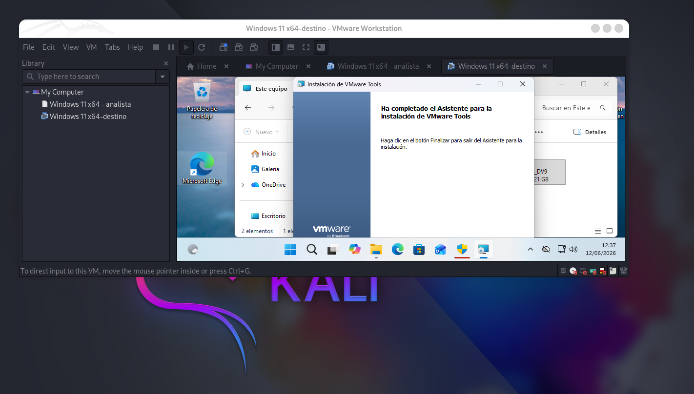


## **3.1 Sistema operativo Windows usado**
El sistema operativo utilizado en el laboratorio es Windows 11 completamente actualizado. La elección de Windows 11 permite trabajar sobre un entorno moderno, con mecanismos de protección actuales y una arquitectura representativa de los sistemas Windows utilizados en entornos reales.

Windows 11 incorpora diferentes medidas de seguridad orientadas a proteger el sistema frente a modificaciones no autorizadas, especialmente en componentes críticos como el kernel, los drivers y los procesos protegidos. Entre estas medidas se encuentran la **firma de drivers, las protecciones del kernel, mecanismos de aislamiento** y otras funcionalidades destinadas a reducir el impacto de código malicioso ejecutado con privilegios elevados.


## **3.2 Máquina host física: Kali Linux con VMware**
El laboratorio se ejecuta sobre una máquina física con Kali Linux, que actúa como sistema anfitrión principal para la plataforma de virtualización VMware.
```
└─$ hostnamectl; echo; lsb_release -a; echo; uname -a; echo; lscpu; echo; free -h; echo; df -h /
 Static hostname: xxxx
       Icon name: computer-desktop
         Chassis: desktop 🖥️
      Machine ID: xxxx
         Boot ID: xxxx
Operating System: Kali GNU/Linux Rolling   
          Kernel: Linux 6.19.14+kali-amd64
    Architecture: x86-64
 Hardware Vendor: Gigabyte Technology Co., Ltd.
  Hardware Model: Z790 GAMING X AX
Hardware Version: x.x
Firmware Version: F9b
   Firmware Date: Thu 2023-11-09
    Firmware Age: 2y 7month 2d                    

No LSB modules are available.
Distributor ID:	Kali
Description:	Kali GNU/Linux Rolling
Release:	2026.2
Codename:	kali-rolling

Linux xxniwexx 6.19.14+kali-amd64 #1 SMP PREEMPT_DYNAMIC Kali 6.19.14-1+kali1 (2026-05-05) x86_64 GNU/Linux

Architecture:                x86_64
  CPU op-mode(s):            32-bit, 64-bit
  Address sizes:             39 bits physical, 48 bits virtual
  Byte Order:                Little Endian
CPU(s):                      32
  On-line CPU(s) list:       0-31
Vendor ID:                   GenuineIntel
  Model name:                Intel(R) Core(TM) i9-14900KF
    CPU family:              6
...
...

               total       usado       libre  compartido   búf/caché  disponible
Mem:            62Gi       7,3Gi        13Gi       111Mi        43Gi        55Gi
Inter:          63Gi        20Ki        63Gi

S.ficheros                    Tamaño Usados  Disp Uso% Montado en
/dev/mapper/xxniwexx--vg-root   442G   388G   33G  93% /
```


## **3.3 Máquina analista Windows con WinDbg**
La máquina analista es una máquina virtual Windows desplegada en VMware cuya función principal es ejecutar WinDbg y conectarse de forma remota a la máquina destino. Esta separación permite que el análisis del kernel se realice desde un sistema externo al que se está depurando, siguiendo un modelo de depuración remota más adecuado para el estudio de componentes en `Ring 0`.

La versión utilizada en el laboratorio es **WinDbg 1.2603.20001.0**, instalada en el sistema Windows 11 de la máquina virtual. [Enlace a WinDbg.](https://apps.microsoft.com/detail/9pgjgd53tn86?hl=es-ES&gl=ES)

La máquina analista se encuentra conectada a la misma red virtual que la máquina destino, normalmente mediante una red aislada o de tipo host-only configurada en VMware. Esta configuración permite que ambas máquinas se comuniquen entre sí para establecer la sesión de depuración remota, pero evita exponer el laboratorio directamente a redes externas.


Una vez configurada la máquina analista, desde WinDbg se podrán ejecutar comandos para listar módulos cargados, consultar drivers, inspeccionar estructuras como DRIVER_OBJECT o EPROCESS, revisar direcciones de memoria y ejecutar scripts de automatización. Esta máquina será, por tanto, el punto central desde el que se realizará tanto el análisis manual como la ejecución del script desarrollado en la práctica.

El uso de una máquina analista independiente aporta mayor control durante la depuración. Si la máquina destino queda detenida, genera un error o sufre una caída del sistema, la máquina analista permanece operativa y conserva la sesión de análisis. Esto facilita la investigación de fallos, la captura de evidencias y la documentación del proceso.

Adaptadores de red en la MV analista:
```bash
- Adaptador 1: Host-only / red interna → para hablar con la destino 192.168.75.129
- Adaptador 2: NAT → solo para Internet y símbolos
```

Destino:
```bash
- Adaptador 1: Host-only / misma red interna → 192.168.75.129
```

### **3.3.1 Carga de los símbolos**
Una parte esencial de la configuración de WinDbg es la **carga correcta de símbolos**. Los símbolos permiten que el depurador traduzca direcciones de memoria en nombres de funciones, estructuras y variables reconocibles. Sin esta información, el análisis del kernel sería mucho más complejo, ya que muchas direcciones aparecerían únicamente como valores numéricos sin contexto suficiente.

Para configurar los símbolos se puede utilizar el **servidor público de símbolos de Microsoft.** Durante la práctica, esta configuración permitirá analizar módulos del sistema como `ntoskrnl.exe`, consultar estructuras internas y ejecutar comandos relacionados con drivers y procesos. Una configuración básica de símbolos puede realizarse desde WinDbg mediante comandos como:

```text
.symfix
.reload
```


También puede establecerse una ruta de símbolos personalizada, por ejemplo:

```text
.sympath srv*C:\Symbols*https://msdl.microsoft.com/download/symbols
.reload
```


### **3.3.2 Localización de kdnet.exe**
```bash
Get-ChildItem -Path "C:\Program Files", "C:\Program Files (x86)" -Recurse -Filter VerifiedNICList.xml -ErrorAction SilentlyContinue
```

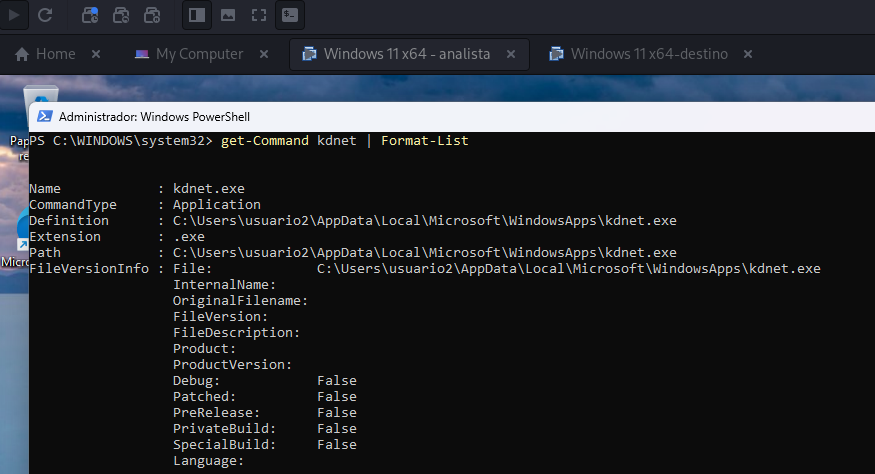

Durante la configuración inicial se observó que `kdnet.exe` aparece en la ruta `C:\Users\usuario2\AppData\Local\Microsoft\WindowsApps`. Sin embargo, dicha ubicación corresponde a los alias de ejecución de aplicaciones instaladas desde `Microsoft Store/WinDbg Preview,` no a la instalación completa de las herramientas de depuración. Por ello, es necesario instalar el componente `Debugging Tools for Windows` del `Windows SDK` para obtener los archivos reales `kdnet.exe` y `VerifiedNICList.xml`, necesarios para configurar la depuración remota de kernel en la máquina destino.


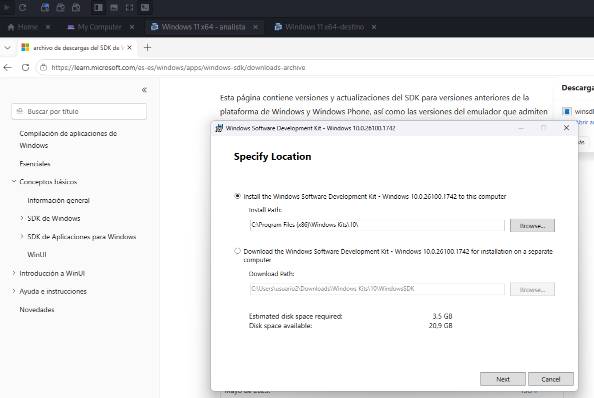

Dejamos marcado únicamente:
```bash
☑ Debugging Tools for Windows
```

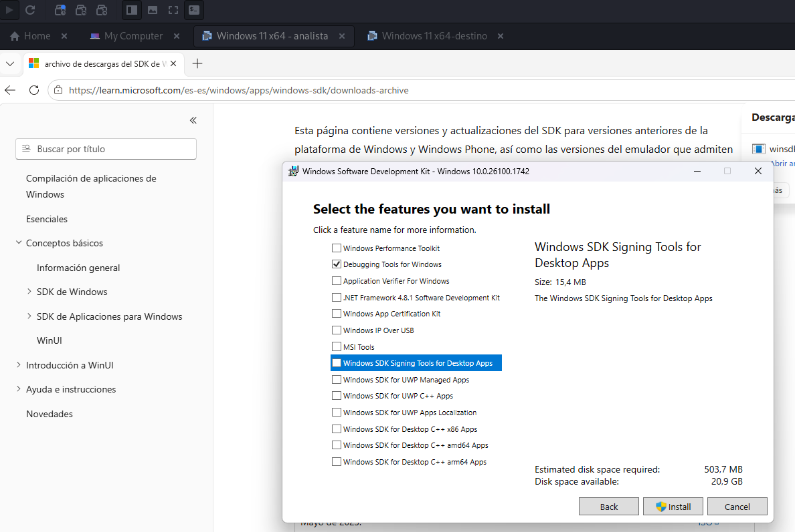

Cuando termine la instalación, Comprobamos que existen:
```
Test-Path "C:\Program Files (x86)\Windows Kits\10\Debuggers\x64\kdnet.exe"
True

Test-Path "C:\Program Files (x86)\Windows Kits\10\Debuggers\x64\VerifiedNICList.xml"
True
```


Después copiaremos estos dos archivos a la máquina destino:
```bash
kdnet.exe
VerifiedNICList.xml
```


## **3.4 Máquina destino Windows 11 actualizada**
La máquina destino es una máquina virtual con Windows 11 completamente actualizado, desplegada en VMware, sobre la que se realizará el análisis del kernel. Esta máquina actúa como sistema objetivo de la depuración remota y será inspeccionada desde la máquina analista mediante WinDbg.

En el laboratorio, la máquina destino representa el sistema Windows que se desea analizar. Sobre ella se observarán los drivers cargados, los módulos del sistema, las estructuras internas del kernel y los posibles indicadores de anomalía asociados a componentes ejecutados en Ring 0. Al tratarse de una máquina virtual, el análisis puede realizarse de forma controlada, reproducible y aislada del sistema físico.


La máquina Windows 11 destino se utilizará para ejecutar las comprobaciones necesarias sobre el estado del kernel. Desde la máquina analista se podrán listar módulos cargados, inspeccionar objetos de driver, revisar estructuras como DRIVER_OBJECT y EPROCESS, y comprobar direcciones de memoria asociadas a rutinas internas del sistema.


## **3.5 Configuración de red para Remote Kernel Debugging**

Para realizar la depuración remota de kernel es necesario que la máquina analista y la máquina destino puedan comunicarse entre sí a través de una red virtual. La máquina analista y la máquina destino se conectan a la misma red virtual para permitir el establecimiento de la sesión de depuración remota.

La red virtual se configura preferiblemente en modo **host-only** o red interna dentro de VMware. Esta configuración permite que ambas máquinas Windows se comuniquen entre sí, pero mantiene el laboratorio aislado de redes externas. Este aislamiento resulta recomendable cuando se trabaja con análisis de kernel, drivers y posibles comportamientos maliciosos, ya que reduce la exposición del entorno y permite controlar mejor las comunicaciones entre los sistemas implicados.

La arquitectura de red utilizada puede representarse de la siguiente forma:

```text
Kali Linux físico
└── VMware
    ├── VM analista: Windows con WinDbg
    │   └── Adaptador de red: Host-only / red interna
    │
    └── VM destino: Windows 11 actualizado
        └── Adaptador de red: Host-only / red interna
```

Antes de configurar WinDbg, es necesario comprobar que ambas máquinas se encuentran en la misma red y que existe conectividad entre ellas. Para ello, en la máquina analista y en la máquina destino se puede consultar la configuración IP mediante:

**Verificamos ip MV analista:**
```cmd
ipconfig
```
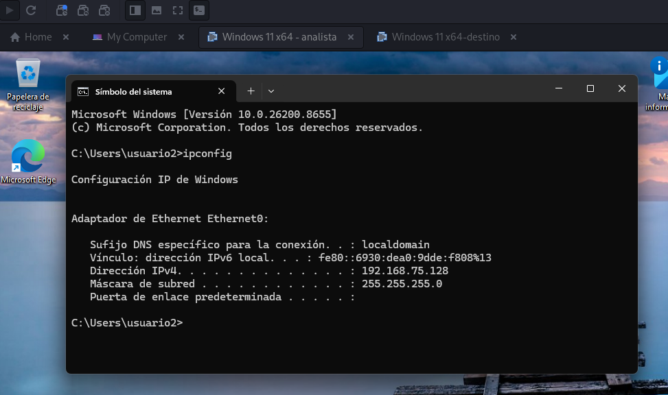


Después, desde la máquina destino se puede comprobar la conectividad hacia la máquina analista mediante:

```cmd
ping <IP_MAQUINA_ANALISTA>
```
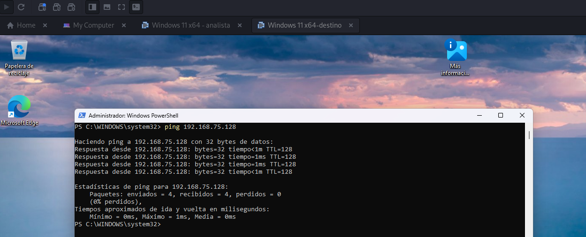


Y desde la máquina analista hacia la máquina destino mediante:

```cmd
ping <IP_MAQUINA_DESTINO>
```
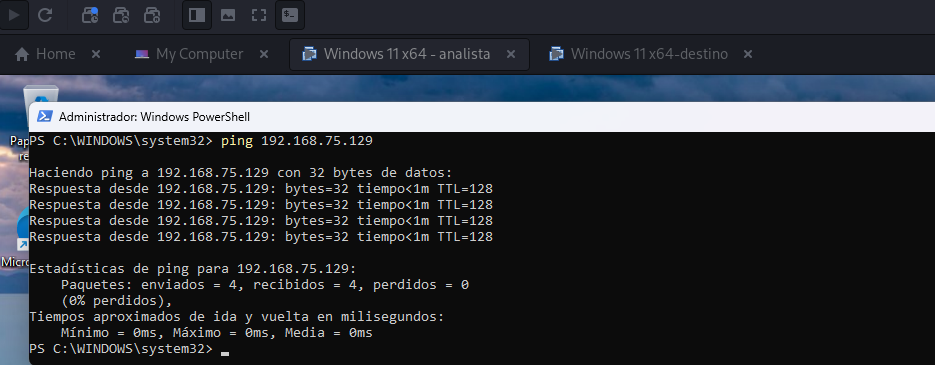


## **3.6 Configuración de una conexión de depuración remota**

Una vez verificada la conectividad entre la máquina analista y la máquina destino, se procede a configurar la depuración remota de kernel. En este laboratorio se utiliza una conexión de depuración por red, conocida como **Remote Kernel Debugging over NET**, ya que permite analizar el kernel de la máquina destino desde un sistema independiente donde se ejecuta WinDbg.

La máquina analista es el sistema Windows donde se encuentra instalado WinDbg y tiene asignada la dirección IP `192.168.75.128`. La máquina destino es el sistema Windows 11 actualizado cuyo kernel será depurado y tiene asignada la dirección IP `192.168.75.129`. Ambas máquinas se encuentran dentro de la misma red virtual de VMware, lo que permite establecer comunicación directa entre ellas.

La conexión de depuración se configura desde la máquina destino utilizando la herramienta `kdnet.exe`. Esta utilidad permite habilitar la depuración de kernel por red e indicar la dirección IP de la máquina donde se ejecutará WinDbg, junto con el puerto que se utilizará para establecer la conexión.


En la MV analista, accedemos a la carpeta:
```text
C:\Program Files (x86)\Windows Kits\10\Debuggers\x64
```

Desde esta ruta se copian los archivos `kdnet.exe` y `VerifiedNICList.xml` a una carpeta de trabajo en la máquina destino, por ejemplo:
```text
C:\KDNET
```


Una vez copiados los archivos, se abre una consola de comandos con permisos de administrador en la máquina destino y se accede al directorio donde se encuentra `kdnet.exe`:

```cmd
cd C:\KDNET
```


A continuación, se ejecuta `kdnet.exe` indicando la dirección IP de la máquina analista y el puerto elegido para la conexión. En este laboratorio se utiliza el puerto `50000`:

```cmd
kdnet.exe 192.168.75.128 50000
```

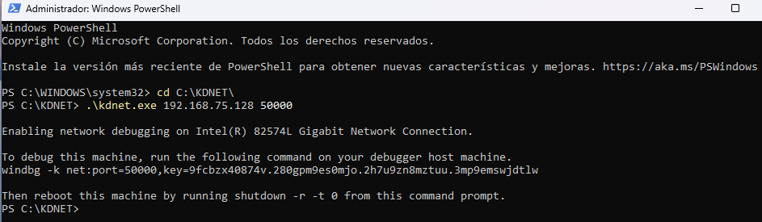


Este comando configura la máquina destino para aceptar una conexión de depuración remota desde la máquina analista. Además, `kdnet.exe` genera una clave de conexión que deberá utilizarse posteriormente en WinDbg. Esta clave es necesaria para autenticar la sesión de depuración entre ambas máquinas, por lo que debe copiarse y guardarse junto con el puerto utilizado.


De esta forma no tenemos ejecutar manualmente `bcdedit /debug on`, porque al ejecutar `kdnet.exe` en la máquina destino, la herramienta ya ha configurado la depuración de kernel por red. Así que `kdnet.exe` configuró la depuración de red correctamente. Además, generó el comando para WinDbg:
```bash
windbg -k net:port=50000,key=...
```

Por tanto, NO es necesario ejecutar aparte:
```bash
bcdedit /debug on
```


Después de realizar la configuración, es necesario reiniciar la máquina destino para que los cambios en la configuración de arranque se apliquen correctamente:

```cmd
shutdown -r -t 0
```


Una vez reiniciada la máquina destino, abrimos WinDbg en la máquina analista. Desde WinDbg seleccionamos la opción de conexión al kernel por red:

```text
File → Attach to kernel → NET
```

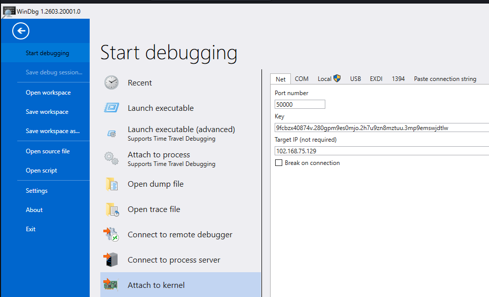

En la ventana de configuración de la conexión se introducen los datos generados durante la configuración con `kdnet.exe`:

| Parámetro        | Valor utilizado en el laboratorio |
| ---------------- | --------------------------------- |
| Máquina analista | `192.168.75.128`                  |
| Máquina destino  | `192.168.75.129`                  |
| Puerto           | `50000`                           |
| Clave            | Clave generada por `kdnet.exe`    |


Tras copiar `kdnet.exe` y `VerifiedNICList.xml` en la máquina destino, se ejecutó `kdnet.exe` indicando la dirección IP de la máquina analista y el puerto de conexión. En este caso, la máquina analista utiliza la `IP 192.168.75.128` y se seleccionó el `puerto 50000`. La herramienta configuró correctamente la depuración de red sobre el adaptador Intel(R) 82574L Gigabit Network Connection y generó la clave necesaria para iniciar la sesión desde WinDbg. Posteriormente, se reinició la máquina destino para aplicar la configuración de depuración de kernel.


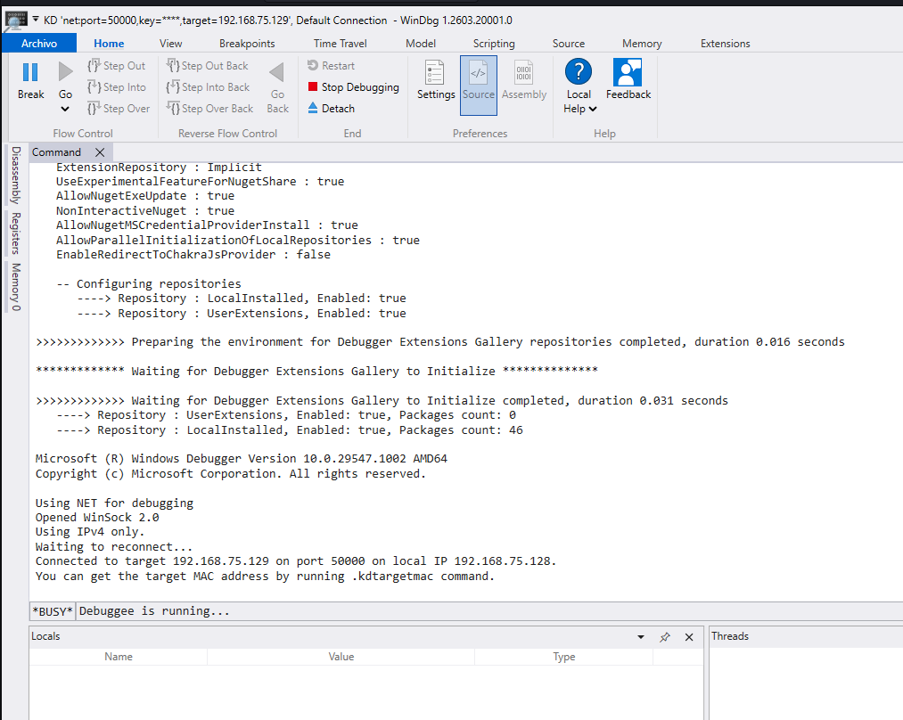


Pulsamos el boton de `Break`:

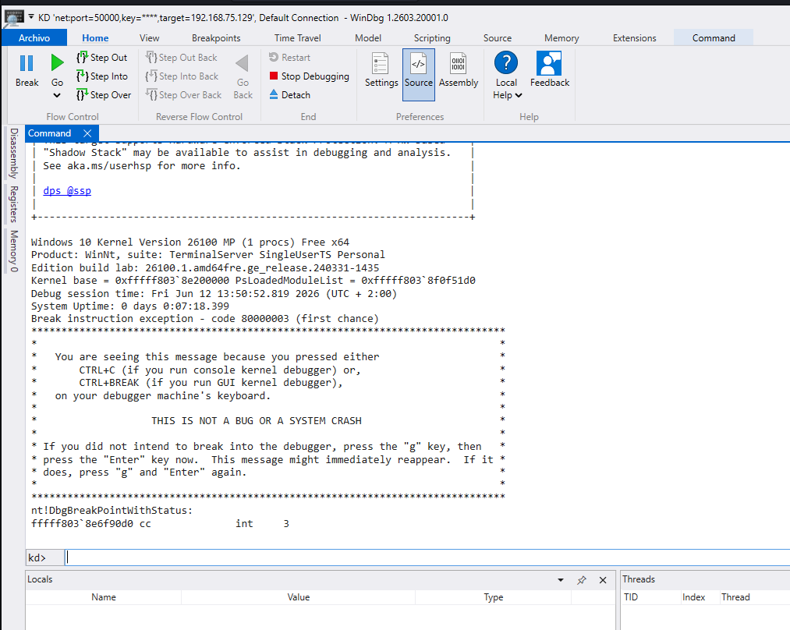

Como la conexión está correcta, WinDbg nos pasa el sistema destino y nos muestra un prompt de comandos:
```bash
kd>
```


----------------------


## **3.6 Configuración de símbolos**

Una vez establecida correctamente la conexión de depuración remota y obtenido el prompt `kd>` en WinDbg, el siguiente paso consiste en configurar los símbolos. Esta configuración es fundamental para poder interpretar correctamente las direcciones de memoria, funciones, módulos y estructuras internas del kernel de Windows.

Los símbolos permiten que WinDbg traduzca direcciones de memoria en nombres comprensibles de funciones, estructuras, variables y módulos. Sin una configuración adecuada, el análisis del kernel sería mucho más complejo, ya que muchos elementos aparecerían únicamente como direcciones hexadecimales sin contexto suficiente. En una práctica orientada al análisis de drivers y estructuras internas, disponer de símbolos correctamente cargados resulta imprescindible.

En este laboratorio se utiliza el servidor público de símbolos de Microsoft, junto con una carpeta local de caché donde se almacenarán los símbolos descargados. Para ello, en la máquina analista se crea una carpeta local, por ejemplo:

```text
C:\Symbols
```

A continuación, desde el prompt `kd>` de WinDbg se configura la ruta de símbolos mediante el siguiente comando:

```text
.sympath srv*C:\Symbols*https://msdl.microsoft.com/download/symbols
```

Con este comando se indica a WinDbg que utilice `C:\Symbols` como caché local y que descargue los símbolos necesarios desde el servidor público de Microsoft. Esta configuración permite reutilizar los símbolos descargados en sesiones posteriores, reduciendo el tiempo de carga y evitando descargas repetidas.

Después de configurar la ruta de símbolos, se fuerza la recarga de los símbolos mediante:

```text
.reload /f
```

El parámetro `/f` fuerza la recarga de los módulos y símbolos, asegurando que WinDbg intente resolver correctamente la información asociada al sistema destino. Este paso puede tardar unos minutos, especialmente la primera vez, ya que se descargarán símbolos desde Internet.


Para comprobar la ruta de símbolos configurada, ejecutamos:
```text
.sympath
```

WinDbg mostrará la ruta activa de símbolos:  
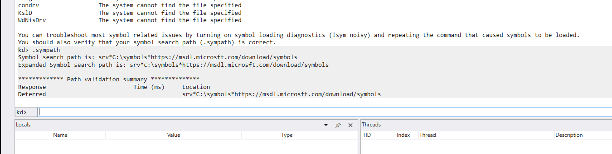


**Usamos el comando vertarget:**  
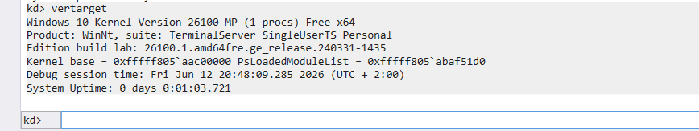

| Elemento                     | Interpretación                                             |
| ---------------------------- | ---------------------------------------------------------- |
| `vertarget` responde         | WinDbg está conectado al kernel de la VM destino           |
| `Kernel base` aparece        | Se puede inspeccionar el kernel en memoria                 |
| `PsLoadedModuleList` aparece | Se puede acceder a información interna de módulos cargados |
| `System Uptime` bajo         | La máquina destino acaba de arrancar tras configurar KDNET |


El comando `vertarget` confirma que WinDbg se encuentra conectado correctamente al kernel de la máquina destino. La salida muestra la versión del kernel, la dirección base de carga del kernel y la dirección de `PsLoadedModuleList`, estructura utilizada por Windows para mantener la lista de módulos cargados. Esta información verifica que la sesión de depuración remota está activa y que es posible continuar con la inspección de drivers y estructuras internas del sistema operativo.


**Comprobamos la carga correcta del módulo principal del kernel mediante el comando `lmv m nt`:**
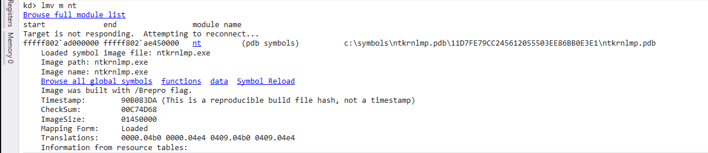  
Tras configurar la ruta de símbolos mediante el servidor público de Microsoft y la caché local `C:\Symbols`, comprobamos la carga correcta del módulo principal del kernel mediante el comando `lmv m nt`. WinDbg identificó el módulo `nt`, correspondiente a `ntkrnlmp.exe`, y mostró que los símbolos `PDB` habían sido cargados desde `C:\Symbols`. Esta comprobación confirma que el entorno está preparado para consultar estructuras internas del `kernel`, como `DRIVER_OBJECT`, `UNICODE_STRING` y `LIST_ENTRY`, y continuar con el análisis de drivers en `Ring 0`.


**Analizamos los drivers cargados:** Una vez cargados los símbolos, podemos realizar una primera comprobación listando los módulos cargados en el sistema destino. El comando `lm` muestra los módulos presentes en memoria, como el kernel de Windows, la `HAL` y los drivers cargados. Si los símbolos están correctamente configurados, WinDbg nos muestra información más completa y nos permite trabajar con nombres de módulos y estructuras del sistema:

```text
lm
```
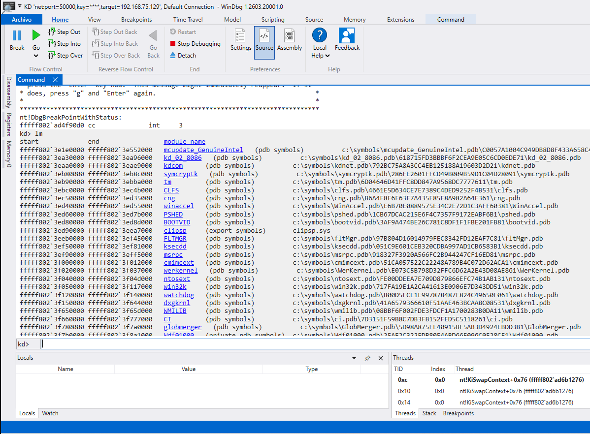


Donde vemos muchos módulos con:
```bash
mupupdate_GenuineIntel    (pdb symbols)
kd_02_8086                (pdb symbols)
kdccom                    (pdb symbols)
CLFS                      (pdb symbols)
cng                       (pdb symbols)
win32k                    (pdb symbols)
CI                        (pdb symbols)
```

Eso confirma que la carpeta `C:\Symbols` está funcionando y que WinDbg está descargando/cargando símbolos correctamente.


**Comprobamos el acceso a estructuras internas del kernel:**  
```text
dt nt!_DRIVER_OBJECT
```
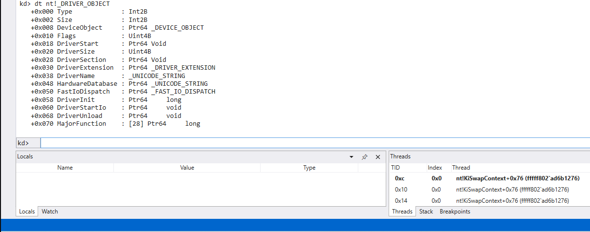

WinDbg muestra la estructura completa:
```bash
+0x000 Type
+0x002 Size
+0x008 DeviceObject
+0x018 DriverStart
+0x020 DriverSize
+0x028 DriverSection
+0x038 DriverName
+0x050 FastIoDispatch
+0x068 DriverUnload
+0x070 MajorFunction
```

Eso significa que WinDbg ya puede resolver tipos internos del kernel, que es justo lo que necesitamos para analizar drivers y estructuras en Ring 0.


**Probamos algunas estructuras para ver si todo funciona bien:**  
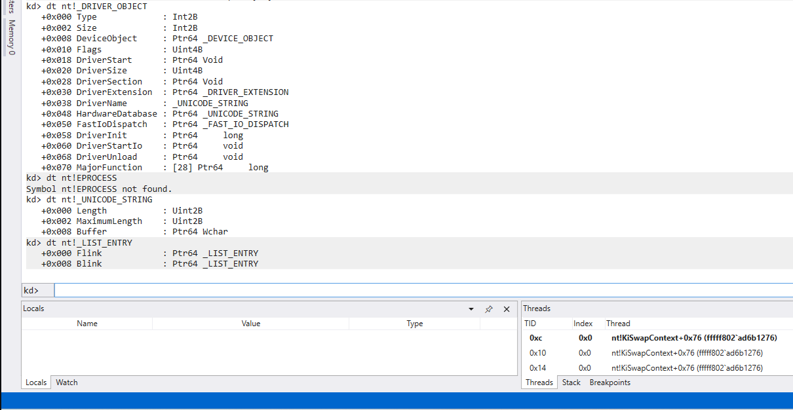


Vemos un fallo con EPROCESS:
```bash
dt nt!_EPROCESS
```

Pero al buscar con comodín:

```bash
dt nt!*EPROCESS*
```

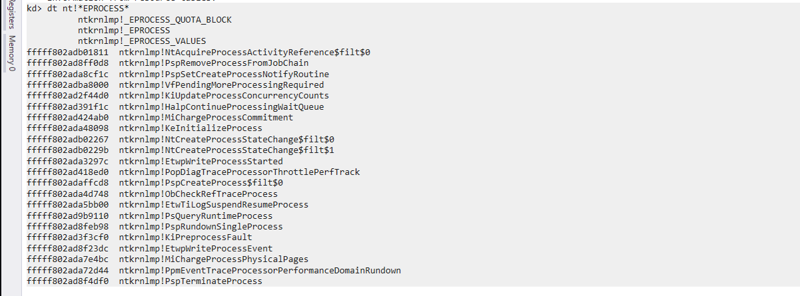


WinDbg ha encontrado el tipo bajo el nombre:

```bash
ntkrnlmp!_EPROCESS
```


Existen símbolos/tipos relacionados con EPROCESS, entre ellos:

```bash
ntkrnlmp!_EPROCESS
ntkrnlmp!_EPROCESS_QUOTA_BLOCK
ntkrnlmp!_EPROCESS_VALUES
```

La línea importante es:

```bash
ntkrnlmp!_EPROCESS
```

Eso significa que la estructura sí está disponible, pero aparece asociada al módulo real cargado:

```bash
ntkrnlmp
```

no necesariamente como:

```bash
nt!_EPROCESS
```

El módulo del kernel se está resolviendo como `ntkrnlmp.exe`, que es el kernel multiprocesador de Windows. Por eso podemos usar directamente:
```bash
dt ntkrnlmp!_EPROCESS
```
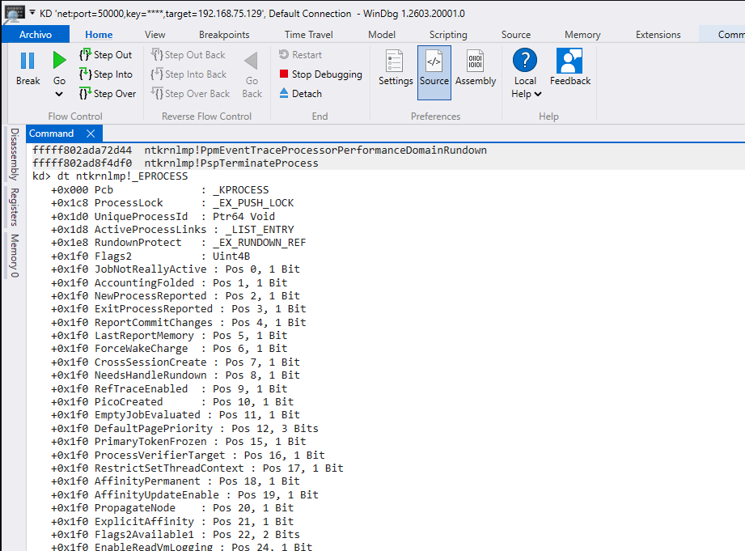


**Listamos objetos de drivers:**
```bash
!object \Driver
```


---------------------------

# **4. Caso de estudio: `mimidrv.sys`**
Para aplicar los conceptos anteriores a un escenario concreto, este trabajo toma como caso de estudio `mimidrv.sys`, el driver de kernel asociado a Mimikatz. La elección de este componente resulta adecuada porque permite analizar un ejemplo real de driver con capacidades sensibles en `Ring 0`, sin que sea necesario ejecutar malware real ni comprometer el sistema de laboratorio.

`mimidrv.sys` se estudia en este trabajo desde una perspectiva defensiva y académica. El objetivo no es utilizarlo con fines ofensivos, sino comprender por qué un driver de kernel puede representar un riesgo relevante para la seguridad de Windows y qué elementos podrían ser inspeccionados mediante WinDbg para detectar comportamientos anómalos.

La relevancia de este driver se debe a que permite relacionar varios conceptos tratados en el módulo: modo kernel, drivers, procesos protegidos, estructuras internas del sistema operativo, depuración con WinDbg y posibles técnicas de manipulación en Ring 0. Al tratarse de un componente que opera con privilegios elevados, su análisis permite observar qué tipo de indicadores pueden ser interesantes cuando se estudian drivers cargados en memoria.

A partir de este caso de estudio, se plantea una metodología de análisis basada en WinDbg. Dicha metodología se centrará en la inspección de módulos y drivers cargados, la revisión de objetos de tipo `DRIVER_OBJECT`, la observación de rutinas asociadas al driver y la identificación de posibles anomalías en direcciones, punteros o estructuras relacionadas. Posteriormente, parte de estas comprobaciones podrán automatizarse mediante scripting.

Por tanto, `mimidrv.sys` se utilizará como referencia para explicar qué tipo de comportamiento puede tener un driver con capacidades en Ring 0 y cómo WinDbg puede ayudar a inspeccionar este tipo de componentes desde una perspectiva defensiva.


## **4.1 Qué es Mimikatz**
Mimikatz es una herramienta ampliamente conocida en el ámbito de la ciberseguridad, especialmente por su capacidad para interactuar con mecanismos de autenticación de Windows y extraer información sensible relacionada con credenciales. Aunque puede utilizarse en entornos controlados para auditorías, formación y análisis defensivo, también ha sido utilizada de forma maliciosa en escenarios de post-explotación.

Uno de los usos más conocidos de Mimikatz es la obtención de contraseñas, hashes, tickets Kerberos y otro material relacionado con credenciales almacenadas o gestionadas por Windows. Para ello, históricamente ha tenido especial interés en el proceso `lsass.exe`, que corresponde al servicio Local Security Authority Subsystem Service. Este proceso es crítico para el sistema operativo, ya que participa en tareas de autenticación, validación de usuarios, gestión de sesiones y aplicación de políticas de seguridad.

Debido a la sensibilidad de la información gestionada por `lsass.exe`, las versiones modernas de Windows incorporan diferentes mecanismos de protección para dificultar el acceso directo a su memoria. Esto limita la capacidad de herramientas en modo usuario para leer información sensible de este proceso. En este contexto aparece la importancia de componentes en modo kernel, como `mimidrv.sys`.

`mimidrv.sys` es el driver de Mimikatz. A diferencia de la parte principal de Mimikatz, que se ejecuta en modo usuario, este driver opera en modo kernel, es decir, en Ring 0. Esto le permite realizar acciones que no serían posibles desde una aplicación convencional ejecutada en Ring 3. Por este motivo, se considera un componente especialmente interesante para estudiar los riesgos asociados a drivers con privilegios elevados.

El interés de `mimidrv.sys` desde el punto de vista defensivo no reside únicamente en su existencia, sino en lo que representa: un driver capaz de interactuar con zonas sensibles del sistema operativo. Un componente de este tipo puede ser utilizado para modificar protecciones, alterar estructuras internas o facilitar operaciones que normalmente estarían restringidas por el sistema operativo.


Desde una perspectiva de análisis, Mimikatz permite comprender la diferencia entre las capacidades de una herramienta en modo usuario y las capacidades adicionales que puede obtener cuando se apoya en un driver de kernel. Esta diferencia es fundamental para entender por qué la detección de drivers sospechosos, la revisión de objetos `DRIVER_OBJECT` y el análisis de estructuras internas del kernel son tareas relevantes en la detección de anomalías a bajo nivel.


Nota: https://medium.com/@matterpreter/mimidrv-in-depth-4d273d19e148


## **4.2 Qué es mimidrv.sys**

`mimidrv.sys` es el driver de modo kernel asociado a Mimikatz. A diferencia del ejecutable principal de la herramienta, que opera en modo usuario, este componente se carga como un controlador del sistema y se ejecuta en Ring 0. Esto le permite interactuar con partes internas de Windows que no están disponibles para una aplicación convencional ejecutada en Ring 3.

La extensión `.sys` indica que se trata de un driver de Windows. Los drivers de este tipo se cargan en el espacio del kernel y pueden acceder a recursos privilegiados del sistema operativo, como memoria del kernel, estructuras internas, objetos de procesos, mecanismos de seguridad y rutinas de bajo nivel. Por esta razón, cualquier driver con capacidades avanzadas debe ser analizado con especial atención desde el punto de vista de la seguridad.

En el caso de `mimidrv.sys`, su interés principal se encuentra en que proporciona a Mimikatz capacidades que no serían posibles únicamente desde modo usuario. Windows implementa diferentes mecanismos de protección para impedir que procesos normales accedan libremente a componentes críticos del sistema, como `lsass.exe` o determinadas estructuras protegidas. Al operar en modo kernel, un driver puede situarse en una posición mucho más privilegiada y realizar acciones que superan las restricciones habituales del modo usuario.

Desde una perspectiva defensiva, `mimidrv.sys` resulta relevante porque representa un ejemplo de driver con capacidades sensibles. Su análisis permite comprender cómo un componente en Ring 0 puede interactuar con mecanismos internos del sistema operativo y por qué la presencia de drivers no esperados, maliciosos o abusados puede suponer un riesgo elevado.

En un análisis con WinDbg, un driver como `mimidrv.sys` puede estudiarse observando cómo aparece cargado en memoria, qué objeto `DRIVER_OBJECT` tiene asociado, cuáles son sus rutinas de despacho, qué rango de memoria ocupa y qué punteros o estructuras están relacionados con él. Estos elementos permiten al analista evaluar si el driver presenta características esperadas o si existen indicios de comportamiento anómalo.

Uno de los aspectos más interesantes sería revisar las rutinas almacenadas en el campo `MajorFunction` del `DRIVER_OBJECT`. Estas rutinas determinan cómo responde el driver a distintas solicitudes del sistema. Si alguna de estas funciones apunta a una región de memoria inesperada, a un módulo no relacionado o a una zona no identificada, podría considerarse un indicador de posible manipulación o comportamiento sospechoso.

También resulta relevante comprobar la dirección de inicio del driver mediante campos como `DriverStart` y su tamaño mediante `DriverSize`. Estos valores permiten establecer el rango de memoria ocupado por el controlador. A partir de ahí, se pueden comparar otras direcciones asociadas al driver para verificar si se encuentran dentro de un rango coherente.

En este trabajo, `mimidrv.sys` se utiliza como caso de estudio para explicar qué tipo de elementos serían relevantes al analizar un driver con capacidades en Ring 0. No se plantea su ejecución con fines ofensivos ni el uso de sus funcionalidades sobre un sistema real. El objetivo es utilizarlo como referencia técnica para construir una metodología básica de inspección de drivers mediante WinDbg.

En resumen, `mimidrv.sys` es un driver de kernel vinculado a Mimikatz que permite estudiar los riesgos asociados a componentes ejecutados en Ring 0. Su análisis resulta útil para comprender por qué los drivers pueden ser peligrosos, qué estructuras del kernel conviene revisar y cómo WinDbg puede ayudar a detectar anomalías relacionadas con controladores cargados en el sistema.


## **4.3. Por qué opera en Ring 0**


## **4.4 Qué relación tiene con LSASS/PPL**


## **4.5 Por qué es interesante desde el punto de vista de detección**


## **4.6 Qué indicadores pueden buscarse con WinDbg**


--------------------------------------


# **5. Detección manual con WinDbg**

## **5.1. Configuración de símbolos**

```bash
.symfix
.reload
lm
5.2. Enumeración de módulos y drivers cargados
lm
lm m nombre_driver
```

Objetivo: ver drivers cargados y detectar nombres o rutas sospechosas.


## **5.3. Inspección de objetos de driver**
```bash
!drvobj nombre_driver 2
```

Objetivo: revisar el DRIVER_OBJECT, dispatch routines y punteros relevantes.

## **5.4. Revisión de procesos desde kernel**
```bash
!process 0 0
```

Objetivo: comparar procesos visibles y estructuras del kernel.

## **5.5. Revisión de estructuras**
```bash
dt nt!_DRIVER_OBJECT
dt nt!_EPROCESS
```

Objetivo: explicar qué campos pueden ser relevantes para detectar manipulación.

## **5.6. Indicadores de anomalía**

Por ejemplo:
```bash
driver cargado desde una ruta inusual;
nombre sospechoso;
punteros de dispatch routines fuera del rango esperado;
ausencia de símbolos;
estructuras incoherentes;
módulo cargado sin información clara;
relación con técnicas de rootkit como DKOM o hooking.
```


----------------------

# **6. Automatización mediante scripting**

## **6.1. Lenguaje elegido**
Vamos a usar un script clásico de WinDbg.


## **6.2. Objetivo del script**

```bash
listar módulos/drivers cargados;
extraer nombre, base y tamaño;
revisar si un driver aparece fuera de rutas habituales;
revisar dispatch routines de un driver concreto;
marcar como sospechoso cualquier puntero que no pertenezca al rango del módulo esperado;
mostrar un resumen final.
```

## **6.3. Funcionamiento del script**

## **6.4. Ejecución en WinDbg**


## **6.5. Resultado esperado**


--------------


# **7. Resultados**

## **7.1 Qué mostró WinDbg**


## **7.2 Qué detectó el script**


## **7.3 Capturas de ejecución**


## **7.4 Tabla con resultados**

## **7.5 Interpretación**


## **7.6 Comparación entre análisis manual y automatizado**


------------------


# **8. Conclusiones**

## **8.1. Qué se puede detectar**


## **8.2. Limitaciones**


## **8.3. Mejoras futuras**