# **Entendiendo qué pide la tarea**

**Debemos:**
- Desarrollar un driver de modo kernel que implemente alguna funcionalidad relacionada con al menos una estructura del kernel.
- Explicar técnicamente el funcionamiento del código línea por línea.
- Trabajar con: Driver de modo kernel + Funciones del kernel + Estructuras internas + Explicación técnica.


# 1. Introducción

El presente proyecto, denominado **KernelProcessThreadMonitor Forensics**, se desarrolla como parte de la práctica individual del módulo de *Reversing de Sistemas Windows*. Su finalidad es estudiar el funcionamiento interno del sistema operativo Windows desde una perspectiva de bajo nivel, mediante el desarrollo de un **driver de modo kernel** orientado a la informática forense y al análisis de posibles técnicas de ocultación de procesos.

En el ámbito del análisis de malware y del reversing de sistemas Windows, los rootkits representan una de las amenazas más complejas debido a su capacidad para ejecutarse con privilegios elevados y manipular estructuras internas del sistema operativo. En particular, los rootkits de modo kernel pueden operar en **Ring 0**, lo que les permite interactuar directamente con objetos del kernel, modificar determinadas estructuras y alterar la visibilidad de procesos, hilos, módulos o recursos del sistema.

Una de las técnicas clásicas asociadas a rootkits en Windows es **DKOM** (*Direct Kernel Object Manipulation*). Esta técnica consiste en modificar directamente objetos del kernel sin utilizar las APIs estándar del sistema operativo. En el caso de la ocultación de procesos, una técnica habitual consiste en manipular la lista de procesos activos del kernel, asociada a estructuras como `_EPROCESS`, para que un proceso deje de aparecer en determinadas herramientas de enumeración, aunque siga existiendo en memoria y ejecutándose en el sistema.

El objetivo de este proyecto no es implementar un rootkit ni desarrollar una técnica de ocultación, sino construir una herramienta defensiva y académica que permita observar indicios compatibles con este tipo de manipulación. Para ello, el driver implementa una aproximación de análisis forense basada en la comparación de diferentes vistas del sistema, también conocida como técnica **cross-view**. Esta metodología consiste en obtener información sobre procesos desde distintas fuentes internas y comparar los resultados para detectar posibles inconsistencias.

El driver desarrollado monitoriza la creación y finalización de procesos e hilos mediante callbacks del kernel, mostrando la información obtenida a través de mensajes de depuración. Además, incorpora una comprobación orientada a detectar discrepancias entre procesos visibles mediante una enumeración normal y procesos que todavía pueden resolverse internamente como objetos del kernel. Si un proceso puede asociarse a un objeto `EPROCESS`, pero no aparece en la vista habitual de procesos activos, se genera una alerta como posible indicio de ocultación.

Durante el desarrollo se trabajan conceptos y estructuras relevantes del kernel de Windows, como `DRIVER_OBJECT`, `PEPROCESS`, `ETHREAD` y `UNICODE_STRING`. También se emplean funciones propias del desarrollo de drivers, como `DriverEntry`, la rutina de descarga del driver, los callbacks de notificación de procesos e hilos, y funciones de enumeración o resolución de objetos de proceso. Todo ello permite comprender cómo un driver puede interactuar con el sistema operativo desde modo kernel sin modificar estructuras críticas ni alterar el funcionamiento normal del sistema.

Desde el punto de vista forense, este proyecto resulta útil porque permite estudiar una de las consecuencias observables de determinadas técnicas de ocultación: la diferencia entre lo que el sistema muestra en una vista convencional y lo que todavía puede detectarse mediante otros mecanismos internos. Esta idea es especialmente relevante en el análisis de rootkits, ya que una herramienta de usuario puede no mostrar un proceso oculto, mientras que una comprobación desde modo kernel puede revelar inconsistencias en la representación interna del sistema.

El desarrollo y las pruebas del driver se realizan exclusivamente en un entorno de laboratorio controlado, utilizando una máquina virtual Windows y herramientas de depuración como DebugView o WinDbg. Esta decisión es esencial, ya que el código ejecutado en modo kernel puede afectar directamente a la estabilidad del sistema. Por tanto, el proyecto tiene una finalidad estrictamente académica, defensiva y experimental, orientada a comprender el funcionamiento interno de Windows y las técnicas empleadas para detectar posibles manipulaciones realizadas por malware avanzado.

En resumen, **KernelProcessThreadMonitor Forensics** es un driver de modo kernel diseñado para monitorizar procesos e hilos y analizar posibles indicios de ocultación de procesos mediante una técnica de comparación de vistas. Su propósito es servir como herramienta de aprendizaje en el contexto del reversing de Windows, la informática forense y el estudio defensivo de rootkits.


# 2. Entorno de laboratorio


El desarrollo y las pruebas del driver **KernelProcessThreadMonitor** se han realizado en un entorno de laboratorio controlado, aislado de cualquier sistema de producción.

El entorno de laboratorio está compuesto por los siguientes elementos:
* **Sistema operativo invitado:** Windows 10/Windows 11 en máquina virtual.
* **Sistema anfitrión:** equipo principal desde el que se gestiona la máquina virtual.
* **Entorno de desarrollo:** Visual Studio con soporte para desarrollo en C/C++.
* **Kit de desarrollo de drivers:** Windows Driver Kit, utilizado para compilar el driver de modo kernel.
* **Herramientas de depuración:** WinDbg, DebugView o visor equivalente para observar los mensajes generados por el driver mediante funciones de depuración.
* **Herramientas de gestión del driver:** utilidades para instalar, cargar, detener y eliminar el servicio asociado al driver dentro del entorno de pruebas.
* **Control de versiones:** repositorio en GitHub para almacenar el código fuente, la documentación técnica y los posibles recursos adicionales del proyecto.

El código fuente del driver se escribe y compila desde Visual Studio, generando un archivo `.sys` que posteriormente se traslada o ejecuta dentro de la máquina virtual de pruebas. Una vez cargado el driver, se monitorizan los mensajes de depuración para comprobar si los callbacks registrados reciben correctamente los eventos de creación y finalización de procesos e hilos.


# 3. Funcionalidad implementada

La funcionalidad implementada en el driver **KernelProcessThreadMonitor Forensics** está orientada a la monitorización de procesos e hilos desde modo kernel y al análisis forense de posibles indicios de ocultación de procesos. El objetivo principal no es modificar el comportamiento del sistema ni implementar técnicas propias de un rootkit, sino observar eventos internos del sistema operativo y detectar posibles discrepancias entre diferentes vistas del kernel.

El driver se ejecuta en **modo kernel**, por lo que tiene acceso a funciones y estructuras internas de Windows que no están disponibles desde aplicaciones convencionales en modo usuario. A partir de esta posición privilegiada, el driver registra callbacks de notificación para recibir información cuando se producen eventos relacionados con procesos e hilos. Estos eventos son posteriormente mostrados mediante mensajes de depuración, permitiendo analizar el comportamiento del sistema desde herramientas como DebugView o WinDbg.

La primera funcionalidad implementada es la **inicialización del driver** mediante la función `DriverEntry`. Esta función actúa como punto de entrada del driver y se ejecuta cuando el sistema carga el archivo `.sys`. Durante esta fase se configura la rutina de descarga, se inicializan las estructuras internas necesarias para almacenar información básica de procesos observados y se registran los callbacks de notificación. Además, se generan mensajes de depuración para confirmar que el driver se ha cargado correctamente y que los mecanismos de monitorización han sido activados.

La segunda funcionalidad es la **monitorización de procesos**. Para ello, el driver utiliza un callback de notificación asociado a la creación y finalización de procesos. Cuando se crea un nuevo proceso, el kernel invoca la rutina registrada por el driver y proporciona información relevante sobre el evento, como el identificador del proceso y, cuando está disponible, datos asociados al proceso padre o a la imagen ejecutada. Cuando un proceso finaliza, el callback también recibe una notificación, permitiendo registrar el cierre del proceso y actualizar la información mantenida por el driver.

Esta monitorización permite construir una vista temporal de la actividad de procesos observada desde el momento en que el driver es cargado. Aunque esta información no sustituye a una herramienta forense completa, sí permite comprobar si el sistema está generando eventos coherentes y si determinados procesos aparecen o desaparecen durante la ejecución de la máquina. Esta funcionalidad resulta especialmente útil para estudiar cómo el kernel informa a los drivers sobre cambios en la actividad del sistema.

La tercera funcionalidad implementada es la **monitorización de hilos**. De forma similar a la monitorización de procesos, el driver registra un callback para recibir notificaciones cuando se crean o finalizan hilos. Cada hilo pertenece a un proceso, por lo que el análisis de estos eventos permite observar con mayor detalle la actividad interna asociada a la ejecución de los procesos. En cada evento recibido, el driver muestra información como el identificador del proceso asociado y el identificador del hilo afectado.

La monitorización de hilos complementa la información obtenida sobre procesos. Desde una perspectiva forense, un proceso puede ser analizado no solo como una entidad aislada, sino también como un contenedor de hilos de ejecución. Por ello, observar la creación y finalización de hilos puede ayudar a identificar comportamientos anómalos, actividad inesperada o discrepancias entre la existencia de procesos y la actividad real que estos generan.

La cuarta funcionalidad es la **generación de trazas de depuración**. El driver utiliza funciones de depuración del kernel para mostrar mensajes sobre su propio estado y sobre los eventos detectados. Estas trazas permiten comprobar la carga del driver, el registro correcto de callbacks, la creación y finalización de procesos, la creación y finalización de hilos, y los resultados de las comprobaciones forenses realizadas. La salida de depuración es fundamental para este proyecto, ya que permite observar el comportamiento del driver sin necesidad de desarrollar una interfaz gráfica o una aplicación cliente en modo usuario.

La quinta funcionalidad, y la más relevante desde el punto de vista forense, es la **detección de posibles indicios de ocultación de procesos mediante una técnica cross-view**. Esta técnica consiste en comparar diferentes formas de obtener información sobre los procesos del sistema. En condiciones normales, las distintas vistas deberían ser coherentes entre sí. Sin embargo, cuando un rootkit manipula estructuras internas del kernel, puede provocar que un proceso no aparezca en una vista determinada, aunque siga existiendo internamente.

En este proyecto, la comparación se plantea entre una vista basada en la enumeración normal de procesos y otra basada en la resolución interna de procesos mediante su identificador. Si un proceso puede resolverse internamente como un objeto asociado a `EPROCESS`, pero no aparece en la enumeración habitual de procesos activos, el driver genera una alerta de depuración indicando una posible discrepancia. Esta discrepancia no se interpreta como una prueba concluyente de infección, sino como un indicio que debe analizarse con otras herramientas y evidencias.

Esta funcionalidad está relacionada con técnicas clásicas de ocultación de procesos mediante **DKOM** (*Direct Kernel Object Manipulation*). En un escenario de DKOM, un rootkit podría manipular directamente estructuras del kernel, como la lista de procesos activos asociada a `_EPROCESS.ActiveProcessLinks`, para ocultar un proceso de determinadas herramientas de enumeración. El driver no realiza ninguna modificación sobre dicha estructura, pero intenta detectar una consecuencia observable de esa manipulación: la diferencia entre un proceso existente internamente y un proceso visible en una enumeración convencional.

Desde el punto de vista técnico, el driver trabaja con estructuras y tipos relevantes del kernel de Windows. `DRIVER_OBJECT` se utiliza para representar el objeto del driver y configurar su rutina de descarga. `PEPROCESS` representa de forma opaca un proceso en modo kernel y permite trabajar con referencias internas a procesos sin acceder directamente a todos sus campos. `ETHREAD` cumple un papel equivalente para los hilos. `UNICODE_STRING` se emplea para representar cadenas en formato Unicode dentro del kernel, especialmente en contextos donde se manejan nombres o rutas internas.

La funcionalidad implementada evita expresamente cualquier acción que pueda alterar el sistema, como modificar listas enlazadas del kernel, ocultar procesos, elevar privilegios, manipular tokens, instalar persistencia o interceptar llamadas del sistema. El driver se limita a observar, registrar y comparar información con finalidad académica y defensiva. Esto permite estudiar técnicas asociadas a rootkits desde una perspectiva segura, centrada en la detección y no en la implementación de comportamiento malicioso.

En conjunto, **KernelProcessThreadMonitor Forensics** implementa una herramienta básica de análisis en modo kernel que permite monitorizar procesos e hilos, registrar eventos relevantes y detectar posibles discrepancias compatibles con ocultación de procesos. Su valor principal reside en mostrar cómo un driver puede utilizar funciones legítimas del kernel para obtener una visión más profunda del sistema operativo y aplicar una metodología forense basada en la comparación de vistas.


-------

minuto 59:25


# 4. Estructuras y funciones utilizadas

El driver **KernelProcessThreadMonitor Forensics** utiliza varias estructuras, tipos y funciones propias del desarrollo en modo kernel para Windows. La versión final del proyecto está orientada a la monitorización de procesos e hilos y a la detección de indicios compatibles con ocultación de procesos mediante DKOM (*Direct Kernel Object Manipulation*).

La detección forense implementada se basa en una técnica de comparación de vistas, también conocida como **cross-view detection**. En concreto, el driver compara dos formas distintas de observar los procesos del sistema:

```text
Vista A: ZwQuerySystemInformation(SystemProcessInformation)
Vista B: PsLookupProcessByProcessId
```

La primera vista representa la enumeración normal de procesos visibles para el sistema. La segunda permite comprobar si un identificador de proceso sigue resolviendo internamente a un objeto `EPROCESS`. Si un proceso puede resolverse mediante `PsLookupProcessByProcessId`, pero no aparece en la enumeración obtenida mediante `ZwQuerySystemInformation`, el driver genera una alerta forense compatible con ocultación de procesos mediante DKOM.

A continuación, se describen las principales estructuras, tipos, constantes y funciones utilizadas en el driver.

## 4.1. `DRIVER_OBJECT`

`DRIVER_OBJECT` es una estructura fundamental en el desarrollo de drivers de Windows. Representa el objeto del driver dentro del kernel y permite al sistema operativo gestionar su ciclo de vida.

En este proyecto aparece como parámetro de la función `DriverEntry`:

```c
NTSTATUS
DriverEntry(
    _In_ PDRIVER_OBJECT DriverObject,
    _In_ PUNICODE_STRING RegistryPath
)
```

El uso principal que se hace de `DRIVER_OBJECT` es asignar la rutina de descarga del driver:

```c
DriverObject->DriverUnload = KptmDriverUnload;
```

Esta línea indica al kernel qué función debe ejecutarse cuando el driver sea descargado mediante `sc.exe stop KPTMForensics`. La rutina asignada es `KptmDriverUnload`, que se encarga de realizar la validación forense final, eliminar los callbacks registrados y finalizar correctamente la ejecución del driver.

La estructura `DRIVER_OBJECT` es importante porque conecta el driver con el gestor de objetos del kernel y permite registrar rutinas asociadas a su funcionamiento.

## 4.2. `UNICODE_STRING`

`UNICODE_STRING` es una estructura utilizada por Windows para representar cadenas Unicode en modo kernel. A diferencia de las cadenas clásicas terminadas en `NULL`, esta estructura incluye información explícita sobre la longitud de la cadena y un puntero al búfer que contiene el texto.

En el driver se utiliza en dos contextos principales.

El primero aparece en la firma de `DriverEntry`:

```c
_In_ PUNICODE_STRING RegistryPath
```

`RegistryPath` contiene la ruta del registro asociada al servicio del driver. En este proyecto no se utiliza directamente, por lo que se marca mediante:

```c
UNREFERENCED_PARAMETER(RegistryPath);
```

El segundo uso aparece en la función `KptmResolveKernelRoutines`, donde se emplea `UNICODE_STRING` para resolver dinámicamente funciones exportadas por el kernel mediante `MmGetSystemRoutineAddress`:

```c
UNICODE_STRING RoutineName;

RtlInitUnicodeString(&RoutineName, L"ZwQuerySystemInformation");
g_ZwQuerySystemInformation =
    (PFN_ZW_QUERY_SYSTEM_INFORMATION)MmGetSystemRoutineAddress(&RoutineName);
```

En este caso, `UNICODE_STRING` permite construir el nombre de la rutina que se desea localizar en el kernel.

## 4.3. `PEPROCESS`

`PEPROCESS` es un puntero opaco a la estructura interna que representa un proceso en el kernel de Windows. Internamente está relacionado con `_EPROCESS`, aunque el driver no accede directamente a sus campos ni los modifica.

En este proyecto, `PEPROCESS` es esencial para la parte forense. El driver utiliza `PsLookupProcessByProcessId` para comprobar si un PID sigue asociado a un objeto de proceso válido:

```c
Status = g_PsLookupProcessByProcessId(ProcessId, &Process);
```

Si esta función devuelve correctamente un objeto `PEPROCESS`, significa que el proceso sigue existiendo internamente en el kernel, aunque pueda no aparecer en las enumeraciones normales.

El driver no manipula `PEPROCESS`, no modifica `_EPROCESS.ActiveProcessLinks` y no altera ninguna estructura interna. Su uso es únicamente defensivo: obtener una referencia al objeto de proceso para comprobar su existencia y, cuando es posible, mostrar información asociada al proceso sospechoso.

Esta estructura es especialmente relevante en el contexto de DKOM, ya que la técnica de ocultación de procesos suele modificar campos internos de `_EPROCESS`, especialmente la lista `ActiveProcessLinks`, para que el proceso desaparezca de determinadas enumeraciones.

## 4.4. `_EPROCESS`

`_EPROCESS` es la estructura interna del kernel de Windows que representa un proceso. Aunque en el código del driver se trabaja con el tipo opaco `PEPROCESS`, conceptualmente este puntero hace referencia a un objeto `_EPROCESS`.

La técnica DKOM utilizada en el laboratorio manipula el campo:

```text
_EPROCESS.ActiveProcessLinks
```

Este campo forma parte de una lista doblemente enlazada que conecta los procesos activos del sistema. Si un proceso se desengancha de esa lista, puede dejar de aparecer en herramientas y APIs que dependen de la enumeración normal de procesos, aunque el objeto siga existiendo en memoria.

El driver no modifica `_EPROCESS`. Sin embargo, detecta una consecuencia observable de esa manipulación:

```text
El proceso sigue resolviendo como EPROCESS,
pero ya no aparece en ZwQuerySystemInformation.
```

Esta discrepancia es la base de la alerta forense generada por el driver.

## 4.5. `ETHREAD`

`ETHREAD` es la estructura interna del kernel que representa un hilo. En este proyecto el driver no accede directamente a objetos `ETHREAD`, pero sí monitoriza eventos relacionados con hilos mediante callbacks del kernel.

La función utilizada para registrar la monitorización de hilos es:

```c
PsSetCreateThreadNotifyRoutine(KptmThreadNotifyRoutine);
```

La rutina registrada recibe eventos de creación y finalización de hilos:

```c
static
VOID
KptmThreadNotifyRoutine(
    _In_ HANDLE ProcessId,
    _In_ HANDLE ThreadId,
    _In_ BOOLEAN Create
)
```

Aunque no se recibe directamente un puntero `ETHREAD`, cada evento está relacionado con un hilo gestionado internamente por el kernel. Esta información permite complementar el análisis de procesos, ya que un proceso sospechoso puede seguir generando actividad mediante sus hilos.

Desde el punto de vista forense, los eventos de hilos ayudan a contextualizar la actividad de procesos observados por el driver.

## 4.6. `KPTM_TRACKED_PROCESS`

`KPTM_TRACKED_PROCESS` es una estructura propia del proyecto. No pertenece al kernel de Windows. Se utiliza para mantener una tabla interna de procesos observados mientras el driver está cargado.

Su definición es:

```c
typedef struct _KPTM_TRACKED_PROCESS
{
    HANDLE      ProcessId;
    HANDLE      ParentProcessId;

    BOOLEAN     Active;
    BOOLEAN     PossibleHidden;

    ULONG       ProcessCreateEvents;
    ULONG       ProcessExitEvents;
    ULONG       ThreadCreateEvents;
    ULONG       ThreadExitEvents;

} KPTM_TRACKED_PROCESS, *PKPTM_TRACKED_PROCESS;
```

Cada campo cumple una función concreta:

`ProcessId` almacena el identificador del proceso observado.

`ParentProcessId` almacena el identificador del proceso padre.

`Active` indica si el proceso se considera activo según los eventos recibidos por el callback de procesos.

`PossibleHidden` se marca como `TRUE` cuando el driver detecta una discrepancia compatible con ocultación.

`ProcessCreateEvents` cuenta los eventos de creación de proceso observados.

`ProcessExitEvents` cuenta los eventos de finalización de proceso observados.

`ThreadCreateEvents` cuenta los eventos de creación de hilos asociados a ese proceso.

`ThreadExitEvents` cuenta los eventos de finalización de hilos asociados a ese proceso.

Esta estructura es importante porque permite que el driver recuerde qué procesos ha observado. En la prueba DKOM, el orden correcto consiste en cargar el driver, abrir el proceso de prueba y después aplicar la ocultación. Así, el proceso queda registrado en la tabla interna antes de ser manipulado.

## 4.7. `KPTM_SYSTEM_PROCESS_INFORMATION_ENTRY`

`KPTM_SYSTEM_PROCESS_INFORMATION_ENTRY` es una estructura definida en el proyecto para interpretar parcialmente la información devuelta por `ZwQuerySystemInformation` cuando se utiliza la clase `SystemProcessInformation`.

Su definición incluye numerosos campos, pero el driver utiliza principalmente:

```c
ULONG NextEntryOffset;
UNICODE_STRING ImageName;
HANDLE UniqueProcessId;
```

`NextEntryOffset` indica el desplazamiento hasta la siguiente entrada de proceso dentro del búfer devuelto por `ZwQuerySystemInformation`.

`ImageName` contiene el nombre del proceso cuando está disponible.

`UniqueProcessId` contiene el identificador del proceso.

La función `ZwQuerySystemInformation(SystemProcessInformation)` devuelve una lista de procesos en un único búfer. Las entradas no se recorren como un array clásico, sino avanzando mediante el campo `NextEntryOffset`.

El driver utiliza esta estructura para comprobar si un PID concreto aparece en la vista normal de procesos. Si el PID no aparece en esta lista, pero sigue resolviendo mediante `PsLookupProcessByProcessId`, se considera una discrepancia sospechosa.

## 4.8. `KSPIN_LOCK`

`KSPIN_LOCK` es una primitiva de sincronización utilizada en modo kernel. Su finalidad es proteger el acceso concurrente a estructuras compartidas.

En el driver se declara una variable global:

```c
static KSPIN_LOCK g_TrackedProcessesLock;
```

Esta variable protege el acceso a la tabla:

```c
static KPTM_TRACKED_PROCESS g_TrackedProcesses[KPTM_MAX_TRACKED_PROCESSES];
```

El uso del spin lock es necesario porque los callbacks de procesos e hilos pueden ejecutarse en distintos momentos y acceder a la misma tabla interna. Sin sincronización, podrían producirse condiciones de carrera o inconsistencias en los datos.

El spin lock se inicializa en `DriverEntry`:

```c
KeInitializeSpinLock(&g_TrackedProcessesLock);
```

Se adquiere antes de modificar la tabla:

```c
KeAcquireSpinLock(&g_TrackedProcessesLock, &OldIrql);
```

Y se libera después:

```c
KeReleaseSpinLock(&g_TrackedProcessesLock, OldIrql);
```

Al adquirir el spin lock, el kernel eleva el IRQL al nivel adecuado y almacena el valor anterior en `OldIrql`. Al liberarlo, se restaura el IRQL original.

## 4.9. `HANDLE`

`HANDLE` se utiliza para representar identificadores de objetos del sistema. En este proyecto se emplea principalmente para representar identificadores de procesos y de hilos.

Aparece en campos como:

```c
HANDLE ProcessId;
HANDLE ParentProcessId;
```

Y en las rutinas de notificación:

```c
_In_ HANDLE ProcessId,
_In_ HANDLE ThreadId
```

En el contexto del driver, `HANDLE` no se utiliza como un manejador abierto por una aplicación de usuario, sino como un valor identificador asociado a procesos e hilos del sistema.

## 4.10. `NTSTATUS`

`NTSTATUS` es el tipo utilizado por muchas funciones del kernel de Windows para devolver el resultado de una operación.

El driver lo utiliza para comprobar si llamadas como `PsLookupProcessByProcessId`, `ZwQuerySystemInformation`, `PsSetCreateProcessNotifyRoutine` o `PsSetCreateThreadNotifyRoutine` se han ejecutado correctamente.

Ejemplo:

```c
Status = g_PsLookupProcessByProcessId(ProcessId, &Process);

if (NT_SUCCESS(Status))
{
    ...
}
```

La macro `NT_SUCCESS` permite comprobar si el código de retorno indica éxito. Si la función falla, el driver puede registrar el error mediante `DbgPrintEx`.

## 4.11. `ZwQuerySystemInformation`

`ZwQuerySystemInformation` es una función nativa de Windows que permite obtener información global del sistema según una clase de información concreta.

En este proyecto se utiliza con la clase:

```c
#define KPTM_SYSTEM_PROCESS_INFORMATION 5
```

Esta clase corresponde a `SystemProcessInformation` y permite obtener una lista de procesos visibles desde la vista normal del sistema.

La función se resuelve dinámicamente mediante `MmGetSystemRoutineAddress`:

```c
RtlInitUnicodeString(&RoutineName, L"ZwQuerySystemInformation");
g_ZwQuerySystemInformation =
    (PFN_ZW_QUERY_SYSTEM_INFORMATION)MmGetSystemRoutineAddress(&RoutineName);
```

Si no se encuentra con el prefijo `Zw`, el driver intenta resolver también:

```c
NtQuerySystemInformation
```

Una vez resuelta, se utiliza para obtener un snapshot de procesos:

```c
Status = g_ZwQuerySystemInformation(
    KPTM_SYSTEM_PROCESS_INFORMATION,
    LocalBuffer,
    AllocLength,
    &RequiredLength
);
```

La información obtenida representa la vista de procesos que el sistema devuelve mediante una enumeración normal. Esta vista es la que se compara con la obtenida mediante `PsLookupProcessByProcessId`.

Desde el punto de vista forense, esta función es clave porque un proceso oculto mediante DKOM puede desaparecer de esta enumeración, aunque siga existiendo internamente.

## 4.12. `SystemProcessInformation`

`SystemProcessInformation` es la clase de información utilizada con `ZwQuerySystemInformation` para obtener información sobre los procesos del sistema.

En el código se define como:

```c
#define KPTM_SYSTEM_PROCESS_INFORMATION 5
```

El búfer devuelto por esta consulta contiene una secuencia de entradas de proceso. Cada entrada incluye, entre otros campos, el PID del proceso, el nombre de imagen y un desplazamiento hacia la siguiente entrada.

El driver no utiliza toda la información devuelta. Solo necesita recorrer la lista y comprobar si un PID aparece en ella.

La función encargada de esta comprobación es:

```c
KptmIsPidVisibleInZwSnapshot
```

Si el PID buscado no aparece en el snapshot, la función devuelve `FALSE`.

## 4.13. `PsLookupProcessByProcessId`

`PsLookupProcessByProcessId` permite obtener un puntero `PEPROCESS` a partir de un identificador de proceso.

En este proyecto representa la segunda vista utilizada en la detección cross-view.

La función se resuelve dinámicamente:

```c
RtlInitUnicodeString(&RoutineName, L"PsLookupProcessByProcessId");
g_PsLookupProcessByProcessId =
    (PFN_PS_LOOKUP_PROCESS_BY_PROCESS_ID)MmGetSystemRoutineAddress(&RoutineName);
```

Y se utiliza de la siguiente forma:

```c
Status = g_PsLookupProcessByProcessId(ProcessId, &Process);
```

Si la llamada tiene éxito, significa que el kernel todavía puede asociar ese PID a un objeto `EPROCESS`.

La lógica forense final del driver es:

```text
Si PsLookupProcessByProcessId(PID) devuelve un EPROCESS válido,
pero ZwQuerySystemInformation no lista ese PID,
entonces existe una discrepancia compatible con ocultación de procesos.
```

Esta discrepancia fue la que permitió detectar el proceso `mspaint.exe` ocultado mediante manipulación DKOM.

## 4.14. `PsGetProcessImageFileName`

`PsGetProcessImageFileName` permite obtener el nombre corto de la imagen asociada a un proceso a partir de un puntero `PEPROCESS`.

El driver la resuelve dinámicamente:

```c
RtlInitUnicodeString(&RoutineName, L"PsGetProcessImageFileName");
g_PsGetProcessImageFileName =
    (PFN_PS_GET_PROCESS_IMAGE_FILE_NAME)MmGetSystemRoutineAddress(&RoutineName);
```

Si la función está disponible, se utiliza para enriquecer las alertas forenses:

```c
RawImageName = g_PsGetProcessImageFileName(Process);
```

La salida generada por el driver puede incluir entonces el nombre del proceso sospechoso:

```text
Image=mspaint.exe
```

Esta información es útil durante el análisis porque permite identificar rápidamente qué proceso se ha visto afectado por la discrepancia.

## 4.15. `MmGetSystemRoutineAddress`

`MmGetSystemRoutineAddress` se utiliza para resolver dinámicamente direcciones de rutinas exportadas por el kernel.

En este proyecto se emplea para localizar:

```text
ZwQuerySystemInformation
NtQuerySystemInformation
PsLookupProcessByProcessId
PsGetProcessImageFileName
```

El uso de esta función permite que el driver compruebe en tiempo de carga si las rutinas necesarias están disponibles en la versión concreta de Windows en la que se ejecuta.

Esta decisión fue importante durante el desarrollo, ya que una primera versión intentaba utilizar `PsGetNextProcess`, pero dicha rutina no se resolvía correctamente en el entorno de Windows 11 utilizado. Por este motivo, la versión final sustituyó esa dependencia por una implementación basada en `ZwQuerySystemInformation`, que sí permitió detectar correctamente la ocultación DKOM.

## 4.16. `ExAllocatePoolWithTag`

`ExAllocatePoolWithTag` se utiliza para reservar memoria en modo kernel.

El driver la emplea para reservar un búfer donde almacenar la información devuelta por `ZwQuerySystemInformation`:

```c
LocalBuffer = ExAllocatePoolWithTag(
    NonPagedPoolNx,
    AllocLength,
    KPTM_POOL_TAG
);
```

Se utiliza `NonPagedPoolNx`, que indica memoria no paginable y no ejecutable. Esto es adecuado porque el búfer debe estar disponible en modo kernel, pero no necesita contener código ejecutable.

La etiqueta de pool definida es:

```c
#define KPTM_POOL_TAG 'mTpK'
```

Esta etiqueta ayuda a identificar las reservas de memoria realizadas por el driver durante tareas de depuración o análisis.

## 4.17. `ExFreePoolWithTag`

`ExFreePoolWithTag` libera memoria previamente reservada mediante `ExAllocatePoolWithTag`.

El driver la utiliza cuando termina de analizar el snapshot de procesos:

```c
ExFreePoolWithTag(SnapshotBuffer, KPTM_POOL_TAG);
```

Liberar correctamente esta memoria es importante para evitar fugas de memoria en modo kernel. Un driver que reserve memoria y no la libere puede degradar la estabilidad del sistema.

## 4.18. `ObDereferenceObject`

`ObDereferenceObject` se utiliza para liberar referencias a objetos del kernel.

Cuando `PsLookupProcessByProcessId` devuelve correctamente un objeto `PEPROCESS`, incrementa la referencia al objeto. Cuando el driver termina de utilizar ese objeto, debe liberar la referencia:

```c
ObDereferenceObject(Process);
```

Este paso es fundamental. Si no se libera la referencia, el objeto de proceso podría mantenerse referenciado indebidamente, generando fugas de referencias en el kernel.

## 4.19. `DbgPrintEx`

`DbgPrintEx` permite imprimir mensajes de depuración desde modo kernel.

En este proyecto se utiliza para mostrar:

```text
carga del driver,
resolución de funciones,
registro de callbacks,
eventos de creación y finalización de procesos,
eventos de creación y finalización de hilos,
inicio y finalización de escaneos forenses,
alertas compatibles con DKOM,
eliminación de callbacks,
descarga del driver.
```

Ejemplo:

```c
DbgPrintEx(
    DPFLTR_IHVDRIVER_ID,
    DPFLTR_WARNING_LEVEL,
    KPTM_PREFIX "[FORENSIC] %s | PID=%llu | Image=%s | EPROCESS=%p\n",
    Reason,
    (ULONGLONG)(ULONG_PTR)ProcessId,
    ImageName,
    Process
);
```

La salida puede visualizarse con herramientas como DebugView o WinDbg.

En la prueba realizada, la alerta relevante fue:

```text
[FORENSIC] Tracked active PID resolves by PsLookupProcessByProcessId but is absent from ZwQuerySystemInformation. Possible DKOM-style hidden process
```

## 4.20. `PsSetCreateProcessNotifyRoutine`

`PsSetCreateProcessNotifyRoutine` permite registrar una rutina de notificación para eventos de creación y finalización de procesos.

El driver registra su callback de procesos en `DriverEntry`:

```c
Status = PsSetCreateProcessNotifyRoutine(KptmProcessNotifyRoutine, FALSE);
```

El segundo parámetro indica si se registra o elimina el callback. Con `FALSE`, se registra. Con `TRUE`, se elimina.

Durante la descarga del driver se elimina así:

```c
Status = PsSetCreateProcessNotifyRoutine(KptmProcessNotifyRoutine, TRUE);
```

El callback registrado es:

```c
KptmProcessNotifyRoutine
```

Esta función permite al driver registrar los procesos que se crean o finalizan mientras está cargado. Esta información se almacena en `g_TrackedProcesses` y se utiliza posteriormente durante la validación forense.

## 4.21. `PsSetCreateThreadNotifyRoutine`

`PsSetCreateThreadNotifyRoutine` permite registrar un callback para recibir notificaciones de creación y finalización de hilos.

El driver lo utiliza en `DriverEntry`:

```c
Status = PsSetCreateThreadNotifyRoutine(KptmThreadNotifyRoutine);
```

La rutina registrada es:

```c
KptmThreadNotifyRoutine
```

Cada vez que se crea o termina un hilo, el driver recibe el PID y el TID asociados al evento. Esta información se muestra mediante `DbgPrintEx` y también se registra en la tabla interna del driver.

## 4.22. `PsRemoveCreateThreadNotifyRoutine`

`PsRemoveCreateThreadNotifyRoutine` elimina el callback de hilos registrado previamente.

Se utiliza en `KptmDriverUnload`:

```c
Status = PsRemoveCreateThreadNotifyRoutine(KptmThreadNotifyRoutine);
```

Eliminar este callback es obligatorio antes de descargar el driver. Si el driver se descargara sin eliminar los callbacks, el kernel podría intentar ejecutar código que ya no está presente en memoria, provocando un fallo crítico del sistema.

## 4.23. `DriverEntry`

`DriverEntry` es el punto de entrada del driver. Se ejecuta cuando el sistema carga el archivo `.sys`.

En este proyecto realiza las siguientes acciones:

```text
1. Muestra un mensaje indicando que el driver se ha iniciado.
2. Asigna la rutina de descarga mediante DriverObject->DriverUnload.
3. Inicializa el spin lock.
4. Limpia la tabla global de procesos observados.
5. Resuelve dinámicamente las funciones necesarias.
6. Registra el callback de procesos.
7. Registra el callback de hilos.
8. Ejecuta un primer escaneo cross-view.
9. Devuelve STATUS_SUCCESS si todo ha ido correctamente.
```

La llamada al primer escaneo es:

```c
KptmCrossViewScanByPidLookup();
```

Este escaneo inicial permite detectar discrepancias que ya existan en el sistema cuando el driver se carga.

## 4.24. `KptmDriverUnload`

`KptmDriverUnload` es la rutina de descarga del driver.

Se ejecuta cuando el driver se detiene mediante:

```cmd
sc.exe stop KPTMForensics
```

Esta función es especialmente importante porque en ella se ejecuta la validación forense sobre los procesos observados:

```c
KptmCrossViewScanTrackedProcesses();
```

Después elimina los callbacks registrados:

```c
PsRemoveCreateThreadNotifyRoutine(KptmThreadNotifyRoutine);
PsSetCreateProcessNotifyRoutine(KptmProcessNotifyRoutine, TRUE);
```

Finalmente, muestra un mensaje indicando que el driver ha sido descargado.

Durante la prueba DKOM, la alerta forense apareció precisamente al ejecutar `sc.exe stop KPTMForensics`, ya que en ese momento el driver comparó los procesos observados con la vista obtenida mediante `ZwQuerySystemInformation`.

## 4.25. `KptmQuerySystemProcessInformation`

`KptmQuerySystemProcessInformation` es una función auxiliar del driver. Su objetivo es obtener un snapshot de procesos mediante `ZwQuerySystemInformation`.

La función realiza una primera llamada para obtener el tamaño necesario del búfer:

```c
Status = g_ZwQuerySystemInformation(
    KPTM_SYSTEM_PROCESS_INFORMATION,
    NULL,
    0,
    &RequiredLength
);
```

Después reserva memoria con `ExAllocatePoolWithTag` y realiza una segunda llamada para obtener la información real:

```c
Status = g_ZwQuerySystemInformation(
    KPTM_SYSTEM_PROCESS_INFORMATION,
    LocalBuffer,
    AllocLength,
    &RequiredLength
);
```

Si la consulta tiene éxito, devuelve el búfer al llamador. Este búfer contiene la lista de procesos visibles.

Esta función es clave en la versión final del driver, porque sustituye la aproximación inicial basada en `PsGetNextProcess`.

## 4.26. `KptmIsPidVisibleInZwSnapshot`

`KptmIsPidVisibleInZwSnapshot` comprueba si un PID aparece dentro del snapshot obtenido mediante `ZwQuerySystemInformation`.

La función recorre las entradas del búfer mediante `NextEntryOffset`:

```c
Entry = (PKPTM_SYSTEM_PROCESS_INFORMATION_ENTRY)Cursor;

if (Entry->UniqueProcessId == TargetProcessId)
{
    return TRUE;
}

Cursor += Entry->NextEntryOffset;
```

Si encuentra el PID, devuelve `TRUE`. Si llega al final del búfer y no lo encuentra, devuelve `FALSE`.

Esta función representa la comprobación de la vista normal de procesos. Es decir, responde a la pregunta:

```text
¿Este PID aparece en la enumeración normal obtenida mediante ZwQuerySystemInformation?
```

Si la respuesta es no, pero el PID sigue resolviendo con `PsLookupProcessByProcessId`, el driver genera una alerta.

## 4.27. `KptmCrossViewScanByPidLookup`

`KptmCrossViewScanByPidLookup` realiza un escaneo inicial de tipo cross-view.

Su funcionamiento general es:

```text
1. Obtiene un snapshot de procesos con ZwQuerySystemInformation.
2. Recorre posibles valores de PID.
3. Intenta resolver cada PID con PsLookupProcessByProcessId.
4. Comprueba si ese PID aparece en el snapshot de ZwQuerySystemInformation.
5. Si resuelve como EPROCESS pero no aparece en el snapshot, genera una alerta.
```

Esta función se ejecuta durante la carga del driver. Sirve para detectar procesos que ya pudieran estar ocultos antes de que el driver empezase a monitorizar nuevos eventos.

## 4.28. `KptmCrossViewScanTrackedProcesses`

`KptmCrossViewScanTrackedProcesses` realiza la validación forense final sobre los procesos observados mientras el driver estaba cargado.

Es la función más relevante para la detección DKOM en la prueba realizada.

Su lógica es:

```text
1. Obtiene un snapshot de procesos visibles mediante ZwQuerySystemInformation.
2. Recorre la tabla interna g_TrackedProcesses.
3. Para cada proceso marcado como activo:
   - intenta resolverlo mediante PsLookupProcessByProcessId;
   - comprueba si aparece en el snapshot de ZwQuerySystemInformation.
4. Si el proceso resuelve como EPROCESS pero no aparece en la enumeración normal,
   se genera una alerta [FORENSIC].
```

La alerta generada tiene este formato:

```text
KPTMForensics -> [FORENSIC] Tracked active PID resolves by PsLookupProcessByProcessId but is absent from ZwQuerySystemInformation. Possible DKOM-style hidden process | PID=... | Image=... | EPROCESS=...
```

En la prueba del laboratorio, esta función detectó correctamente el proceso `mspaint.exe` ocultado mediante DKOM.

## 4.29. `KptmProcessNotifyRoutine`

`KptmProcessNotifyRoutine` es el callback que recibe eventos de creación y finalización de procesos.

Su firma es:

```c
static
VOID
KptmProcessNotifyRoutine(
    _In_ HANDLE ParentId,
    _In_ HANDLE ProcessId,
    _In_ BOOLEAN Create
)
```

Cuando `Create` es `TRUE`, el evento corresponde a una creación de proceso. Cuando es `FALSE`, corresponde a una finalización.

La función actualiza la tabla interna mediante:

```c
KptmTrackProcessEvent(ParentId, ProcessId, Create);
```

Y muestra un mensaje de depuración:

```text
KPTMForensics -> Process CREATE | PID=... | ParentPID=...
KPTMForensics -> Process EXIT | PID=... | ParentPID=...
```

Esta rutina permite que el driver conozca los procesos que han aparecido mientras estaba cargado.

## 4.30. `KptmThreadNotifyRoutine`

`KptmThreadNotifyRoutine` es el callback que recibe eventos de creación y finalización de hilos.

Su firma es:

```c
static
VOID
KptmThreadNotifyRoutine(
    _In_ HANDLE ProcessId,
    _In_ HANDLE ThreadId,
    _In_ BOOLEAN Create
)
```

La función actualiza la tabla interna mediante:

```c
KptmTrackThreadEvent(ProcessId, ThreadId, Create);
```

Y muestra mensajes como:

```text
KPTMForensics -> Thread CREATE | PID=... | TID=...
KPTMForensics -> Thread EXIT | PID=... | TID=...
```

Estos eventos complementan la monitorización de procesos y permiten observar actividad de ejecución asociada a cada PID.

## 4.31. `KptmTrackProcessEvent`

`KptmTrackProcessEvent` actualiza la tabla interna cuando se recibe un evento de proceso.

Si el evento es de creación:

```c
Entry->ParentProcessId = ParentProcessId;
Entry->Active = TRUE;
Entry->ProcessCreateEvents++;
```

Si el evento es de finalización:

```c
Entry->Active = FALSE;
Entry->ProcessExitEvents++;
```

Esta función es importante porque la detección final se realiza sobre procesos que el driver considera activos y que ha observado durante su ejecución.

## 4.32. `KptmTrackThreadEvent`

`KptmTrackThreadEvent` actualiza los contadores de hilos asociados a un proceso.

Si el hilo se crea:

```c
Entry->ThreadCreateEvents++;
```

Si el hilo finaliza:

```c
Entry->ThreadExitEvents++;
```

Estos contadores permiten tener una visión básica de la actividad de hilos asociada a cada proceso observado.

## 4.33. Constantes principales del driver

El driver define varias constantes relevantes:

```c
#define KPTM_PREFIX                         "KPTMForensics -> "
#define KPTM_MAX_TRACKED_PROCESSES          4096
#define KPTM_PID_SCAN_LIMIT                 0x10000
#define KPTM_PID_STEP                       4
#define KPTM_POOL_TAG                       'mTpK'
#define KPTM_SYSTEM_PROCESS_INFORMATION     5
```

`KPTM_PREFIX` se utiliza como prefijo común para los mensajes de depuración.

`KPTM_MAX_TRACKED_PROCESSES` define el tamaño máximo de la tabla de procesos observados.

`KPTM_PID_SCAN_LIMIT` establece el límite superior del rango de PIDs analizado durante el escaneo inicial.

`KPTM_PID_STEP` define el incremento utilizado al recorrer candidatos de PID.

`KPTM_POOL_TAG` identifica las reservas de memoria realizadas por el driver.

`KPTM_SYSTEM_PROCESS_INFORMATION` representa la clase de información `SystemProcessInformation` utilizada con `ZwQuerySystemInformation`.

## 4.34. Relación entre estructuras y detección DKOM

La detección final del driver se basa en la relación entre varias estructuras y funciones.

Primero, el callback de procesos registra en `g_TrackedProcesses` los procesos observados mientras el driver está cargado.

Después, al descargar el driver, `KptmCrossViewScanTrackedProcesses` obtiene una vista normal de procesos mediante `ZwQuerySystemInformation(SystemProcessInformation)`.

A continuación, para cada proceso activo registrado, el driver intenta resolver su PID mediante `PsLookupProcessByProcessId`.

La condición sospechosa es:

```text
El proceso está marcado como activo por el driver.
El PID sigue resolviendo como EPROCESS.
El PID no aparece en ZwQuerySystemInformation.
```

Esta combinación indica que el proceso puede seguir existiendo en memoria, pero estar ausente de la enumeración normal. Esa situación es compatible con una ocultación de procesos mediante DKOM, especialmente si se ha manipulado `_EPROCESS.ActiveProcessLinks`.

En resumen, las estructuras y funciones utilizadas permiten que el driver observe la actividad del sistema, mantenga una memoria interna de procesos e hilos, obtenga una vista normal de los procesos visibles y compare dicha vista con la existencia interna de objetos `EPROCESS`. Esta metodología permitió detectar correctamente el proceso `mspaint.exe` ocultado durante la prueba del laboratorio.


# 5. Explicación técnica del código

En este apartado se explica el funcionamiento interno del driver **KernelProcessThreadMonitor Forensics** en su versión final. Esta versión está diseñada para monitorizar procesos e hilos desde modo kernel y detectar indicios compatibles con ocultación de procesos mediante DKOM (*Direct Kernel Object Manipulation*).

La mejora principal respecto a versiones anteriores consiste en sustituir la enumeración basada en `PsGetNextProcess` por una aproximación más compatible basada en `ZwQuerySystemInformation(SystemProcessInformation)`. Esta modificación permitió que el driver detectara correctamente un proceso `mspaint.exe` ocultado mediante manipulación de `_EPROCESS.ActiveProcessLinks`.

El driver está escrito en C y se ejecuta en modo kernel. Su lógica se puede dividir en varias partes principales:

```text
1. Inclusión de cabeceras y definición de constantes.
2. Declaración de tipos de función resueltos dinámicamente.
3. Definición de estructuras internas.
4. Inicialización del driver.
5. Registro de callbacks de procesos e hilos.
6. Monitorización de eventos.
7. Obtención de una vista normal de procesos mediante ZwQuerySystemInformation.
8. Comparación forense entre vistas.
9. Detección de procesos posiblemente ocultos.
10. Eliminación de callbacks y descarga segura del driver.
```

## 5.1. Inclusión de cabeceras

El código comienza incluyendo la cabecera principal utilizada para trabajar con funciones y tipos del kernel:

```c
#include <ntifs.h>
```

La cabecera `ntifs.h` proporciona definiciones necesarias para el desarrollo de drivers en modo kernel. Entre otros elementos, permite utilizar tipos como `PDRIVER_OBJECT`, `PUNICODE_STRING`, `PEPROCESS`, `NTSTATUS`, `HANDLE`, `KSPIN_LOCK`, así como funciones del kernel relacionadas con objetos, memoria, sincronización y depuración.

Se utiliza `ntifs.h` en lugar de una cabecera de modo usuario porque el driver no se ejecuta como una aplicación convencional, sino como un componente cargado directamente por el kernel de Windows.

También se incluye la siguiente directiva:

```c
#pragma warning(disable: 4996)
```

Esta línea desactiva determinados avisos del compilador relacionados con funciones marcadas como obsoletas o no recomendadas en ciertos contextos. En este proyecto se utiliza para evitar que advertencias no críticas bloqueen la compilación del driver dentro del entorno de laboratorio.

## 5.2. Definición de constantes

El driver define varias constantes al inicio del código:

```c
#define KPTM_PREFIX                         "KPTMForensics -> "
#define KPTM_MAX_TRACKED_PROCESSES          4096
#define KPTM_PID_SCAN_LIMIT                 0x10000
#define KPTM_PID_STEP                       4
#define KPTM_POOL_TAG                       'mTpK'
#define KPTM_SYSTEM_PROCESS_INFORMATION     5
```

`KPTM_PREFIX` se utiliza como prefijo común en todos los mensajes generados mediante `DbgPrintEx`. Esto permite identificar fácilmente en WinDbg o DebugView qué mensajes proceden del driver.

`KPTM_MAX_TRACKED_PROCESSES` define el tamaño máximo de la tabla interna de procesos observados por el driver. En este caso, se reserva espacio para 4096 entradas, suficiente para un entorno de laboratorio.

`KPTM_PID_SCAN_LIMIT` define el límite superior del rango de PIDs que se recorren durante el escaneo inicial. El valor `0x10000` permite analizar un rango amplio de identificadores sin hacer que el escaneo sea excesivamente costoso.

`KPTM_PID_STEP` define el incremento usado al recorrer candidatos de PID. En Windows, los PIDs suelen estar alineados, por lo que se utiliza un incremento de 4 para reducir comprobaciones innecesarias.

`KPTM_POOL_TAG` es una etiqueta utilizada al reservar memoria en el kernel mediante `ExAllocatePoolWithTag`. Esta etiqueta permite identificar las reservas de memoria realizadas por el driver.

`KPTM_SYSTEM_PROCESS_INFORMATION` representa el valor numérico de la clase `SystemProcessInformation`, utilizada con `ZwQuerySystemInformation` para obtener la lista de procesos visibles del sistema.

## 5.3. Tipos de función resueltos dinámicamente

El driver define varios tipos de punteros a función:

```c
typedef
NTSTATUS
(*PFN_ZW_QUERY_SYSTEM_INFORMATION)(
    _In_ ULONG SystemInformationClass,
    _Out_writes_bytes_opt_(SystemInformationLength) PVOID SystemInformation,
    _In_ ULONG SystemInformationLength,
    _Out_opt_ PULONG ReturnLength
    );
```

Este tipo representa la firma de `ZwQuerySystemInformation`. El driver no llama directamente a la función por nombre, sino que resuelve su dirección dinámicamente con `MmGetSystemRoutineAddress` y la almacena en un puntero global.

También se define:

```c
typedef
NTSTATUS
(*PFN_PS_LOOKUP_PROCESS_BY_PROCESS_ID)(
    _In_ HANDLE ProcessId,
    _Outptr_ PEPROCESS* Process
    );
```

Este tipo representa la función `PsLookupProcessByProcessId`, que permite obtener un objeto `PEPROCESS` a partir de un PID.

Por último, se define:

```c
typedef
PUCHAR
(*PFN_PS_GET_PROCESS_IMAGE_FILE_NAME)(
    _In_ PEPROCESS Process
    );
```

Este tipo representa la función `PsGetProcessImageFileName`, utilizada para obtener el nombre corto de la imagen de un proceso a partir de su objeto `PEPROCESS`.

El uso de punteros a función permite que el driver resuelva las rutinas necesarias en tiempo de carga. Esto ofrece más flexibilidad y evita problemas de enlace con funciones que pueden no estar declaradas o exportadas de la misma forma según la versión del WDK o de Windows.

## 5.4. Estructura `KPTM_SYSTEM_PROCESS_INFORMATION_ENTRY`

El driver define una estructura parcial llamada `KPTM_SYSTEM_PROCESS_INFORMATION_ENTRY` para interpretar el búfer devuelto por `ZwQuerySystemInformation(SystemProcessInformation)`.

La estructura incluye numerosos campos, pero los más importantes para este proyecto son:

```c
ULONG NextEntryOffset;
UNICODE_STRING ImageName;
HANDLE UniqueProcessId;
```

`NextEntryOffset` indica el desplazamiento hasta la siguiente entrada de proceso dentro del búfer.

`ImageName` contiene el nombre del proceso cuando está disponible.

`UniqueProcessId` contiene el identificador del proceso.

Cuando `ZwQuerySystemInformation` devuelve la lista de procesos, no se obtiene un array convencional de estructuras independientes, sino un búfer continuo en el que cada entrada indica dónde empieza la siguiente mediante `NextEntryOffset`.

El driver recorre esta lista para comprobar si un PID aparece en la enumeración normal de procesos. Si no aparece en esta vista, pero sí resuelve mediante `PsLookupProcessByProcessId`, se considera una discrepancia sospechosa.

## 5.5. Estructura `KPTM_TRACKED_PROCESS`

La estructura `KPTM_TRACKED_PROCESS` es una estructura propia del driver:

```c
typedef struct _KPTM_TRACKED_PROCESS
{
    HANDLE      ProcessId;
    HANDLE      ParentProcessId;

    BOOLEAN     Active;
    BOOLEAN     PossibleHidden;

    ULONG       ProcessCreateEvents;
    ULONG       ProcessExitEvents;
    ULONG       ThreadCreateEvents;
    ULONG       ThreadExitEvents;

} KPTM_TRACKED_PROCESS, *PKPTM_TRACKED_PROCESS;
```

Su objetivo es almacenar información básica sobre los procesos observados mientras el driver está cargado.

`ProcessId` almacena el PID del proceso.

`ParentProcessId` almacena el PID del proceso padre.

`Active` indica si el proceso sigue activo según los eventos observados por el callback de procesos.

`PossibleHidden` se utiliza para marcar procesos que presentan una discrepancia compatible con ocultación.

`ProcessCreateEvents` y `ProcessExitEvents` cuentan eventos de creación y finalización del proceso.

`ThreadCreateEvents` y `ThreadExitEvents` cuentan eventos de creación y finalización de hilos asociados al proceso.

Esta estructura es esencial para la detección DKOM. El driver necesita recordar qué procesos ha visto mientras estaba cargado. Por eso, en la prueba práctica, el orden correcto es cargar el driver, abrir `mspaint.exe`, aplicar DKOM y después detener el driver para que se ejecute la validación.

## 5.6. Variables globales

El driver declara varias variables globales:

```c
static KPTM_TRACKED_PROCESS g_TrackedProcesses[KPTM_MAX_TRACKED_PROCESSES];
static KSPIN_LOCK g_TrackedProcessesLock;

static BOOLEAN g_ProcessNotifyRegistered = FALSE;
static BOOLEAN g_ThreadNotifyRegistered = FALSE;

static PFN_ZW_QUERY_SYSTEM_INFORMATION g_ZwQuerySystemInformation = NULL;
static PFN_PS_LOOKUP_PROCESS_BY_PROCESS_ID g_PsLookupProcessByProcessId = NULL;
static PFN_PS_GET_PROCESS_IMAGE_FILE_NAME g_PsGetProcessImageFileName = NULL;
```

`g_TrackedProcesses` es la tabla interna donde el driver guarda información de procesos observados.

`g_TrackedProcessesLock` protege el acceso concurrente a esa tabla.

`g_ProcessNotifyRegistered` indica si el callback de procesos se ha registrado correctamente.

`g_ThreadNotifyRegistered` indica si el callback de hilos se ha registrado correctamente.

`g_ZwQuerySystemInformation`, `g_PsLookupProcessByProcessId` y `g_PsGetProcessImageFileName` almacenan las direcciones de las rutinas del kernel resueltas dinámicamente.

Estas variables permiten mantener el estado del driver durante toda su ejecución.

## 5.7. Función `KptmResolveKernelRoutines`

La función `KptmResolveKernelRoutines` se encarga de resolver dinámicamente las funciones del kernel necesarias para la detección forense.

Primero intenta resolver `ZwQuerySystemInformation`:

```c
RtlInitUnicodeString(&RoutineName, L"ZwQuerySystemInformation");
g_ZwQuerySystemInformation =
    (PFN_ZW_QUERY_SYSTEM_INFORMATION)MmGetSystemRoutineAddress(&RoutineName);
```

Si no consigue resolverla con el prefijo `Zw`, intenta resolver la variante `NtQuerySystemInformation`:

```c
RtlInitUnicodeString(&RoutineName, L"NtQuerySystemInformation");
g_ZwQuerySystemInformation =
    (PFN_ZW_QUERY_SYSTEM_INFORMATION)MmGetSystemRoutineAddress(&RoutineName);
```

Esto aumenta la compatibilidad del driver, ya que en algunos entornos puede estar disponible una variante y no la otra.

Después resuelve `PsLookupProcessByProcessId`:

```c
RtlInitUnicodeString(&RoutineName, L"PsLookupProcessByProcessId");
g_PsLookupProcessByProcessId =
    (PFN_PS_LOOKUP_PROCESS_BY_PROCESS_ID)MmGetSystemRoutineAddress(&RoutineName);
```

Esta función es imprescindible para comprobar si un PID sigue resolviendo como objeto `EPROCESS`.

Finalmente intenta resolver `PsGetProcessImageFileName`:

```c
RtlInitUnicodeString(&RoutineName, L"PsGetProcessImageFileName");
g_PsGetProcessImageFileName =
    (PFN_PS_GET_PROCESS_IMAGE_FILE_NAME)MmGetSystemRoutineAddress(&RoutineName);
```

Esta última función no es crítica para la detección. Si no está disponible, el driver puede seguir funcionando, aunque mostrará el nombre del proceso como `unknown`.

Si alguna función esencial no se resuelve, el driver devuelve `STATUS_NOT_SUPPORTED`. Si todo es correcto, devuelve `STATUS_SUCCESS`.

## 5.8. Función `KptmQuerySystemProcessInformation`

`KptmQuerySystemProcessInformation` obtiene un snapshot de los procesos visibles mediante `ZwQuerySystemInformation`.

Su firma es:

```c
static
NTSTATUS
KptmQuerySystemProcessInformation(
    _Outptr_result_bytebuffer_(*BufferLength) PVOID* Buffer,
    _Out_ PULONG BufferLength
)
```

La función recibe dos parámetros de salida:

`Buffer`, donde se devolverá el búfer con la información de procesos.

`BufferLength`, donde se indicará el tamaño del búfer reservado.

Primero inicializa los valores de salida:

```c
*Buffer = NULL;
*BufferLength = 0;
```

Después realiza una primera llamada a `ZwQuerySystemInformation` con un búfer nulo para obtener el tamaño necesario:

```c
Status = g_ZwQuerySystemInformation(
    KPTM_SYSTEM_PROCESS_INFORMATION,
    NULL,
    0,
    &RequiredLength
);
```

En muchos casos, esta llamada no devuelve éxito porque el búfer es insuficiente, pero sí puede proporcionar el tamaño requerido en `RequiredLength`.

Si `RequiredLength` no se obtiene, se usa un valor inicial de 1 MB:

```c
if (RequiredLength == 0)
{
    RequiredLength = 1024 * 1024;
}
```

Después se reserva memoria no paginable mediante `ExAllocatePoolWithTag`:

```c
LocalBuffer = ExAllocatePoolWithTag(
    NonPagedPoolNx,
    AllocLength,
    KPTM_POOL_TAG
);
```

El uso de `NonPagedPoolNx` indica que la memoria no será paginada y además no será ejecutable. Esto es adecuado para almacenar datos, no código.

A continuación se realiza una segunda llamada a `ZwQuerySystemInformation`, esta vez con el búfer reservado:

```c
Status = g_ZwQuerySystemInformation(
    KPTM_SYSTEM_PROCESS_INFORMATION,
    LocalBuffer,
    AllocLength,
    &RequiredLength
);
```

Si la llamada tiene éxito, la función devuelve el búfer al llamador. Si falla por tamaño insuficiente, libera el búfer y vuelve a intentarlo con un tamaño mayor. Este proceso se repite hasta cinco veces.

Esta función es clave porque proporciona la vista normal de procesos que se comparará con la vista interna obtenida mediante `PsLookupProcessByProcessId`.

## 5.9. Función `KptmIsPidVisibleInZwSnapshot`

`KptmIsPidVisibleInZwSnapshot` comprueba si un PID aparece en el snapshot devuelto por `ZwQuerySystemInformation`.

Su firma es:

```c
static
BOOLEAN
KptmIsPidVisibleInZwSnapshot(
    _In_ PVOID SystemProcessInformationBuffer,
    _In_ HANDLE TargetProcessId
)
```

La función recibe el búfer de procesos y el PID objetivo.

Primero comprueba que los parámetros sean válidos:

```c
if ((SystemProcessInformationBuffer == NULL) ||
    (TargetProcessId == NULL))
{
    return FALSE;
}
```

Después empieza a recorrer el búfer:

```c
Cursor = (PUCHAR)SystemProcessInformationBuffer;
```

Cada posición del búfer se interpreta como una entrada de tipo `KPTM_SYSTEM_PROCESS_INFORMATION_ENTRY`:

```c
Entry = (PKPTM_SYSTEM_PROCESS_INFORMATION_ENTRY)Cursor;
```

La comprobación principal es:

```c
if (Entry->UniqueProcessId == TargetProcessId)
{
    return TRUE;
}
```

Si el PID coincide, significa que el proceso aparece en la vista normal del sistema.

Si no coincide, la función avanza a la siguiente entrada usando `NextEntryOffset`:

```c
Cursor += Entry->NextEntryOffset;
```

Si `NextEntryOffset` vale cero, se ha llegado al final de la lista. En ese caso, si no se encontró el PID, la función devuelve `FALSE`.

Esta función permite responder a una pregunta fundamental para la detección:

```text
¿El proceso aparece en la enumeración normal de procesos?
```

## 5.10. Función `KptmCountZwSnapshotProcesses`

`KptmCountZwSnapshotProcesses` recorre el snapshot de procesos y cuenta cuántas entradas contiene.

Aunque no es imprescindible para detectar DKOM, resulta útil para depuración, ya que permite imprimir cuántos procesos contiene la vista obtenida mediante `ZwQuerySystemInformation`.

La función recorre el mismo formato de búfer que `KptmIsPidVisibleInZwSnapshot`, usando `NextEntryOffset` hasta llegar al final.

El resultado se muestra en mensajes como:

```text
KPTMForensics -> Starting tracked-process validation scan using ZwQuerySystemInformation | ZwCount=146
```

Este valor ayuda a confirmar que el snapshot se ha obtenido correctamente.

## 5.11. Función `KptmFindTrackedProcessLocked`

`KptmFindTrackedProcessLocked` busca un proceso dentro de la tabla global `g_TrackedProcesses`.

Su firma es:

```c
static
PKPTM_TRACKED_PROCESS
KptmFindTrackedProcessLocked(
    _In_ HANDLE ProcessId,
    _In_ BOOLEAN CreateIfMissing
)
```

Recibe un PID y un indicador que especifica si debe crear una entrada nueva cuando no encuentre el proceso.

La función recorre la tabla:

```c
for (Index = 0; Index < KPTM_MAX_TRACKED_PROCESSES; Index++)
```

Si encuentra una entrada cuyo `ProcessId` coincide con el PID buscado, devuelve esa entrada.

También localiza el primer hueco libre:

```c
if ((EmptySlot == NULL) &&
    (g_TrackedProcesses[Index].ProcessId == NULL))
{
    EmptySlot = &g_TrackedProcesses[Index];
}
```

Si el proceso no existe y `CreateIfMissing` es `TRUE`, inicializa la entrada libre:

```c
RtlZeroMemory(EmptySlot, sizeof(KPTM_TRACKED_PROCESS));
EmptySlot->ProcessId = ProcessId;
```

El nombre de la función incluye `Locked` porque está pensada para ejecutarse mientras el spin lock ya está adquirido. Esto evita accesos simultáneos a la tabla global.

## 5.12. Función `KptmTrackProcessEvent`

`KptmTrackProcessEvent` actualiza la tabla interna cuando el callback de procesos recibe un evento.

Su firma es:

```c
static
VOID
KptmTrackProcessEvent(
    _In_ HANDLE ParentProcessId,
    _In_ HANDLE ProcessId,
    _In_ BOOLEAN Create
)
```

El parámetro `Create` indica si el evento corresponde a creación o finalización de proceso.

La función primero descarta PIDs nulos:

```c
if (ProcessId == NULL)
{
    return;
}
```

Después adquiere el spin lock:

```c
KeAcquireSpinLock(&g_TrackedProcessesLock, &OldIrql);
```

Busca o crea una entrada para el proceso:

```c
Entry = KptmFindTrackedProcessLocked(ProcessId, TRUE);
```

Si el evento es de creación, marca el proceso como activo:

```c
Entry->ParentProcessId = ParentProcessId;
Entry->Active = TRUE;
Entry->ProcessCreateEvents++;
```

Si el evento es de finalización, lo marca como inactivo:

```c
Entry->Active = FALSE;
Entry->ProcessExitEvents++;
```

Finalmente libera el spin lock:

```c
KeReleaseSpinLock(&g_TrackedProcessesLock, OldIrql);
```

Esta función es importante porque mantiene la lista de procesos observados por el driver. La detección final se aplica especialmente sobre procesos activos registrados en esta tabla.

## 5.13. Función `KptmTrackThreadEvent`

`KptmTrackThreadEvent` actualiza los contadores de hilos asociados a un proceso.

Su firma es:

```c
static
VOID
KptmTrackThreadEvent(
    _In_ HANDLE ProcessId,
    _In_ HANDLE ThreadId,
    _In_ BOOLEAN Create
)
```

El parámetro `ThreadId` se recibe por la firma del callback, pero en esta función no se almacena individualmente. Por eso se utiliza:

```c
UNREFERENCED_PARAMETER(ThreadId);
```

La función busca o crea una entrada para el PID y actualiza los contadores:

```c
if (Create == TRUE)
{
    Entry->ThreadCreateEvents++;
}
else
{
    Entry->ThreadExitEvents++;
}
```

Estos contadores permiten observar actividad asociada a cada proceso, aunque la detección DKOM se basa principalmente en la comparación entre `ZwQuerySystemInformation` y `PsLookupProcessByProcessId`.

## 5.14. Función `KptmPrintProcessObjectInfo`

`KptmPrintProcessObjectInfo` centraliza la generación de alertas forenses.

Su firma es:

```c
static
VOID
KptmPrintProcessObjectInfo(
    _In_ HANDLE ProcessId,
    _In_opt_ PEPROCESS Process,
    _In_opt_ PCSTR Reason
)
```

Recibe el PID, el objeto `PEPROCESS` y una cadena que explica el motivo de la alerta.

Primero intenta obtener el nombre del proceso:

```c
if ((g_PsGetProcessImageFileName != NULL) && (Process != NULL))
{
    RawImageName = g_PsGetProcessImageFileName(Process);

    if (RawImageName != NULL)
    {
        ImageName = (PCSTR)RawImageName;
    }
}
```

Si no puede obtener el nombre, usa `unknown`.

Después imprime una alerta mediante `DbgPrintEx`:

```c
DbgPrintEx(
    DPFLTR_IHVDRIVER_ID,
    DPFLTR_WARNING_LEVEL,
    KPTM_PREFIX "[FORENSIC] %s | PID=%llu | Image=%s | EPROCESS=%p\n",
    Reason,
    (ULONGLONG)(ULONG_PTR)ProcessId,
    ImageName,
    Process
);
```

En la prueba realizada, esta función generó la alerta:

```text
KPTMForensics -> [FORENSIC] Tracked active PID resolves by PsLookupProcessByProcessId but is absent from ZwQuerySystemInformation. Possible DKOM-style hidden process | PID=9076 | Image=mspaint.exe | ...
```

Esta línea confirma la detección de una discrepancia compatible con ocultación DKOM.

## 5.15. Función `KptmCrossViewScanByPidLookup`

`KptmCrossViewScanByPidLookup` realiza un escaneo inicial al cargar el driver.

Su objetivo es detectar procesos que ya pudieran estar ocultos antes de que el driver empezara a monitorizar eventos.

El flujo general es:

```text
1. Obtener un snapshot de procesos visibles mediante ZwQuerySystemInformation.
2. Recorrer posibles valores de PID.
3. Intentar resolver cada PID mediante PsLookupProcessByProcessId.
4. Comprobar si ese PID aparece en el snapshot.
5. Generar alerta si resuelve como EPROCESS pero no aparece en ZwQuerySystemInformation.
```

Primero obtiene el snapshot:

```c
Status = KptmQuerySystemProcessInformation(&SnapshotBuffer, &SnapshotLength);
```

Después recorre PIDs candidatos:

```c
for (CandidatePid = 4;
     CandidatePid < KPTM_PID_SCAN_LIMIT;
     CandidatePid += KPTM_PID_STEP)
```

Para cada PID intenta resolver el proceso:

```c
Status = g_PsLookupProcessByProcessId(ProcessId, &Process);
```

Si tiene éxito, comprueba si aparece en el snapshot:

```c
Visible = KptmIsPidVisibleInZwSnapshot(
    SnapshotBuffer,
    ProcessId
);
```

Si no aparece, genera una alerta.

Al final libera la memoria del snapshot:

```c
ExFreePoolWithTag(SnapshotBuffer, KPTM_POOL_TAG);
```

Este escaneo inicial sirve para detectar discrepancias ya existentes en el sistema en el momento de cargar el driver.

## 5.16. Función `KptmCrossViewScanTrackedProcesses`

`KptmCrossViewScanTrackedProcesses` es la función más importante para la prueba DKOM realizada.

Se ejecuta durante la descarga del driver, dentro de `KptmDriverUnload`.

Su objetivo es revisar los procesos que el driver ha observado mientras estaba cargado y comprobar si alguno presenta una discrepancia compatible con ocultación.

Primero obtiene un snapshot de procesos visibles:

```c
Status = KptmQuerySystemProcessInformation(&SnapshotBuffer, &SnapshotLength);
```

Después informa de cuántos procesos contiene la vista normal:

```c
KPTM_PREFIX "Starting tracked-process validation scan using ZwQuerySystemInformation | ZwCount=%lu\n"
```

A continuación recorre la tabla interna de procesos observados:

```c
for (Index = 0; Index < KPTM_MAX_TRACKED_PROCESSES; Index++)
```

Para cada entrada copia los datos protegidos por el spin lock:

```c
KeAcquireSpinLock(&g_TrackedProcessesLock, &OldIrql);

ProcessId = g_TrackedProcesses[Index].ProcessId;
Active = g_TrackedProcesses[Index].Active;
ThreadCreates = g_TrackedProcesses[Index].ThreadCreateEvents;
ThreadExits = g_TrackedProcesses[Index].ThreadExitEvents;

KeReleaseSpinLock(&g_TrackedProcessesLock, OldIrql);
```

El driver solo analiza procesos que tienen PID y están marcados como activos:

```c
if ((ProcessId != NULL) && (Active == TRUE))
```

Para cada proceso activo, intenta resolver su objeto `EPROCESS`:

```c
Status = g_PsLookupProcessByProcessId(ProcessId, &Process);
```

Si el objeto existe, comprueba si el PID aparece en el snapshot de `ZwQuerySystemInformation`:

```c
Visible = KptmIsPidVisibleInZwSnapshot(
    SnapshotBuffer,
    ProcessId
);
```

La condición de alerta es:

```c
if (Visible == FALSE)
```

Esto significa que el proceso sigue existiendo como objeto del kernel, pero ya no aparece en la enumeración normal.

En ese caso, genera la alerta:

```c
KptmPrintProcessObjectInfo(
    ProcessId,
    Process,
    "Tracked active PID resolves by PsLookupProcessByProcessId but is absent from ZwQuerySystemInformation. Possible DKOM-style hidden process"
);
```

Después marca internamente el proceso como posiblemente oculto:

```c
Entry->PossibleHidden = TRUE;
```

Finalmente imprime un resumen:

```text
KPTMForensics -> Tracked-process validation scan finished | Checked=7 | Suspicious=1
```

En la prueba realizada, esta función detectó correctamente el proceso `mspaint.exe` ocultado mediante DKOM.

## 5.17. Callback `KptmProcessNotifyRoutine`

`KptmProcessNotifyRoutine` es el callback de procesos registrado con `PsSetCreateProcessNotifyRoutine`.

Su firma es:

```c
static
VOID
KptmProcessNotifyRoutine(
    _In_ HANDLE ParentId,
    _In_ HANDLE ProcessId,
    _In_ BOOLEAN Create
)
```

Cuando se crea o termina un proceso, el kernel invoca esta función.

Primero actualiza la tabla interna:

```c
KptmTrackProcessEvent(ParentId, ProcessId, Create);
```

Después imprime un mensaje de depuración:

```c
DbgPrintEx(
    DPFLTR_IHVDRIVER_ID,
    DPFLTR_INFO_LEVEL,
    KPTM_PREFIX "Process %s | PID=%llu | ParentPID=%llu\n",
    (Create == TRUE) ? "CREATE" : "EXIT",
    (ULONGLONG)(ULONG_PTR)ProcessId,
    (ULONGLONG)(ULONG_PTR)ParentId
);
```

Si `Create` es `TRUE`, aparece como `Process CREATE`. Si es `FALSE`, aparece como `Process EXIT`.

Este callback fue clave en la prueba porque permitió que el driver registrara `mspaint.exe` antes de que se aplicara DKOM.

## 5.18. Callback `KptmThreadNotifyRoutine`

`KptmThreadNotifyRoutine` es el callback de hilos registrado mediante `PsSetCreateThreadNotifyRoutine`.

Su firma es:

```c
static
VOID
KptmThreadNotifyRoutine(
    _In_ HANDLE ProcessId,
    _In_ HANDLE ThreadId,
    _In_ BOOLEAN Create
)
```

Cada vez que se crea o finaliza un hilo, el kernel invoca esta rutina.

Primero actualiza la tabla interna:

```c
KptmTrackThreadEvent(ProcessId, ThreadId, Create);
```

Después imprime un mensaje:

```c
DbgPrintEx(
    DPFLTR_IHVDRIVER_ID,
    DPFLTR_INFO_LEVEL,
    KPTM_PREFIX "Thread %s | PID=%llu | TID=%llu\n",
    (Create == TRUE) ? "CREATE" : "EXIT",
    (ULONGLONG)(ULONG_PTR)ProcessId,
    (ULONGLONG)(ULONG_PTR)ThreadId
);
```

Estos eventos permiten observar actividad interna de los procesos. En las pruebas se observaron múltiples líneas `Thread CREATE` y `Thread EXIT`, lo que confirmó que el callback de hilos funcionaba correctamente.

## 5.19. Rutina `KptmDriverUnload`

`KptmDriverUnload` es la rutina de descarga del driver.

Se ejecuta cuando se detiene el servicio:

```cmd
sc.exe stop KPTMForensics
```

Su primera acción es imprimir un mensaje:

```c
KPTM_PREFIX "DriverUnload invoked\n"
```

Después ejecuta la validación forense:

```c
KptmCrossViewScanTrackedProcesses();
```

Este paso es fundamental. En la prueba DKOM, la detección apareció precisamente en este momento, cuando el driver fue descargado.

A continuación elimina el callback de hilos si estaba registrado:

```c
Status = PsRemoveCreateThreadNotifyRoutine(KptmThreadNotifyRoutine);
```

Después elimina el callback de procesos:

```c
Status = PsSetCreateProcessNotifyRoutine(KptmProcessNotifyRoutine, TRUE);
```

Finalmente imprime:

```text
KPTMForensics -> Driver unloaded
```

Eliminar los callbacks antes de descargar el driver es obligatorio. Si no se hiciera, el kernel podría intentar ejecutar funciones que ya no existen en memoria, provocando un fallo crítico del sistema.

## 5.20. Función `DriverEntry`

`DriverEntry` es la función principal de entrada del driver.

Su firma es:

```c
NTSTATUS
DriverEntry(
    _In_ PDRIVER_OBJECT DriverObject,
    _In_ PUNICODE_STRING RegistryPath
)
```

Cuando el driver se carga, el kernel ejecuta esta función.

Primero ignora el parámetro `RegistryPath`, ya que no se utiliza directamente:

```c
UNREFERENCED_PARAMETER(RegistryPath);
```

Después imprime:

```text
KPTMForensics -> DriverEntry invoked
```

A continuación asigna la rutina de descarga:

```c
DriverObject->DriverUnload = KptmDriverUnload;
```

Después inicializa el spin lock:

```c
KeInitializeSpinLock(&g_TrackedProcessesLock);
```

Y limpia la tabla de procesos:

```c
RtlZeroMemory(g_TrackedProcesses, sizeof(g_TrackedProcesses));
```

Luego resuelve dinámicamente las funciones necesarias:

```c
Status = KptmResolveKernelRoutines();
```

Si la resolución falla, el driver no se carga.

Después registra el callback de procesos:

```c
Status = PsSetCreateProcessNotifyRoutine(KptmProcessNotifyRoutine, FALSE);
```

Si se registra correctamente, marca:

```c
g_ProcessNotifyRegistered = TRUE;
```

A continuación registra el callback de hilos:

```c
Status = PsSetCreateThreadNotifyRoutine(KptmThreadNotifyRoutine);
```

Si esta operación falla, elimina el callback de procesos ya registrado y cancela la carga del driver. Esto evita que el driver quede parcialmente inicializado.

Finalmente ejecuta un escaneo inicial:

```c
KptmCrossViewScanByPidLookup();
```

Y devuelve:

```c
return STATUS_SUCCESS;
```

Esto indica al sistema que el driver se ha cargado correctamente.

## 5.21. Flujo completo de ejecución

El flujo general del driver es el siguiente:

```text
1. El sistema carga KPTMForensics.sys.
2. Se ejecuta DriverEntry.
3. Se inicializan estructuras internas y spin lock.
4. Se resuelven funciones del kernel.
5. Se registra el callback de procesos.
6. Se registra el callback de hilos.
7. Se ejecuta un escaneo inicial cross-view.
8. Mientras el driver está cargado, registra eventos de procesos e hilos.
9. Se aplica DKOM sobre un proceso observado.
10. El proceso desaparece de la vista normal.
11. Se ejecuta sc.exe stop KPTMForensics.
12. Se llama a KptmDriverUnload.
13. Se ejecuta KptmCrossViewScanTrackedProcesses.
14. El driver detecta que el PID sigue resolviendo como EPROCESS, pero no aparece en ZwQuerySystemInformation.
15. Se genera una alerta [FORENSIC].
16. Se eliminan los callbacks.
17. El driver se descarga correctamente.
```

Este flujo demuestra que el driver no realiza ocultación ni manipulación, sino que detecta una discrepancia producida por una técnica DKOM aplicada en el entorno de laboratorio.

## 5.22. Lógica forense de detección DKOM

La lógica forense central del driver puede resumirse así:

```text
Un proceso fue observado por el driver.
El proceso sigue marcado como activo.
PsLookupProcessByProcessId(PID) devuelve un EPROCESS válido.
ZwQuerySystemInformation(SystemProcessInformation) no lista ese PID.
Resultado: posible proceso oculto mediante DKOM.
```

Esta comparación permite detectar una consecuencia típica de la manipulación de `_EPROCESS.ActiveProcessLinks`: el proceso desaparece de las enumeraciones normales, pero su objeto sigue existiendo en memoria.

En la prueba realizada, esta lógica produjo la alerta:

```text
KPTMForensics -> [FORENSIC] Tracked active PID resolves by PsLookupProcessByProcessId but is absent from ZwQuerySystemInformation. Possible DKOM-style hidden process | PID=9076 | Image=mspaint.exe |
```

El resumen final fue:

```text
KPTMForensics -> Tracked-process validation scan finished | Checked=7 | Suspicious=1
```

Esto confirma que el driver analizó siete procesos activos registrados y detectó una única discrepancia sospechosa, correspondiente al proceso ocultado.

## 5.23. Consideraciones y limitaciones

Aunque el driver detectó correctamente el caso de prueba, el resultado debe interpretarse como un indicio forense, no como una prueba absoluta de infección.

La razón es que una discrepancia entre vistas puede deberse también a:

```text
procesos en fase de terminación,
condiciones de carrera,
cambios rápidos en la lista de procesos,
interferencia de otros drivers,
limitaciones de la consulta usada.
```

No obstante, en un entorno controlado donde se ha aplicado DKOM sobre `_EPROCESS.ActiveProcessLinks`, la alerta generada por el driver es una evidencia coherente con ocultación de procesos.

El driver tampoco intenta reparar la manipulación, restaurar la lista de procesos ni modificar estructuras internas. Su función es exclusivamente observar, comparar y registrar la anomalía.

## 5.24. Resumen técnico

La versión final de **KernelProcessThreadMonitor Forensics** implementa un driver defensivo de modo kernel que combina tres capacidades:

```text
1. Monitorización de procesos mediante PsSetCreateProcessNotifyRoutine.
2. Monitorización de hilos mediante PsSetCreateThreadNotifyRoutine.
3. Detección cross-view usando ZwQuerySystemInformation y PsLookupProcessByProcessId.
```

La parte más relevante es la comparación entre:

```text
ZwQuerySystemInformation → vista normal de procesos visibles.
PsLookupProcessByProcessId → existencia interna del objeto EPROCESS.
```

Si un proceso sigue existiendo internamente, pero desaparece de la vista normal, el driver genera una alerta compatible con ocultación DKOM.

Esta implementación permitió detectar correctamente un proceso `mspaint.exe` ocultado mediante manipulación de `ActiveProcessLinks`, cumpliendo el objetivo de aplicar un driver de modo kernel a una faceta de informática forense relacionada con rootkits y ocultación de procesos.


# 6. Compilación

La compilación del driver **KernelProcessThreadMonitor Forensics** se realiza utilizando el entorno oficial de desarrollo de drivers para Windows. Al tratarse de un driver de modo kernel, no puede compilarse como una aplicación convencional en modo usuario, sino que requiere herramientas específicas proporcionadas por Microsoft, principalmente **Visual Studio**, el **Windows SDK** y el **Windows Driver Kit**.

El objetivo de este apartado es describir el proceso seguido para generar el archivo `.sys` correspondiente al driver, que posteriormente podrá ser cargado y probado dentro de una máquina virtual de laboratorio.

## 6.1. Requisitos previos

Para compilar el proyecto es necesario disponer de los siguientes componentes instalados:

* **Visual Studio** con soporte para desarrollo en C/C++.
* **Windows SDK**, necesario para disponer de cabeceras, librerías y herramientas de desarrollo de Windows.
* **Windows Driver Kit**, necesario para compilar drivers de modo kernel.
* Una configuración de compilación compatible con la arquitectura de la máquina virtual de pruebas, normalmente **x64**.
* Un entorno de laboratorio basado en Windows 10 o Windows 11.

El desarrollo y la compilación deben realizarse preferiblemente en una máquina preparada específicamente para este tipo de prácticas. Aunque la compilación no implica ejecutar todavía el driver, es recomendable mantener separado el entorno de desarrollo del entorno donde se realizarán las pruebas de carga y depuración.

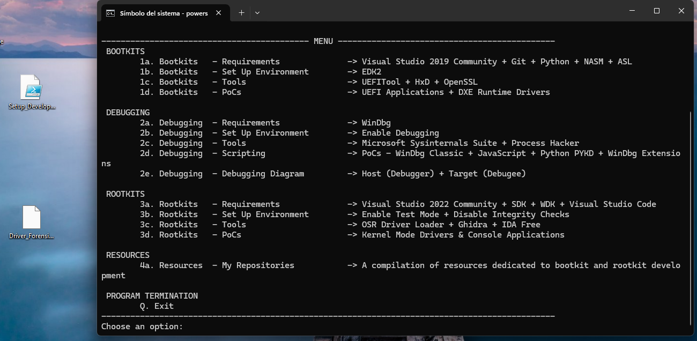


En esa ventana del Visual Studio Installer, arriba pulsamos:

```bash
Cargas de trabajo

```
Buscamos y marcamos:

```bash
Desarrollo para el escritorio con C++

```


Después, en el panel derecho debemos añadir componentes como:
```bash
Herramientas de compilación de C++ de MSVC v143 - VS 2022 x64/x86
SDK de Windows 11
```


## 6.2. Creación del proyecto en Visual Studio

Para compilar el driver se crea un nuevo proyecto en Visual Studio utilizando una plantilla de driver de modo kernel. La opción recomendada es crear un proyecto de tipo:

```text
Kernel Mode Driver, Empty
```

Esta plantilla genera un proyecto mínimo para el desarrollo de drivers en Windows, sin añadir código innecesario. De esta forma, el archivo principal del proyecto puede ser sustituido o completado con el código fuente de **KernelProcessThreadMonitor Forensics**.

El proyecto puede recibir un nombre identificativo, por ejemplo:

```text
KPTMForensics
```

Una vez creado el proyecto, se añade el archivo fuente del driver:

```text
Driver_ForensicProcessHidingDetector.c
```


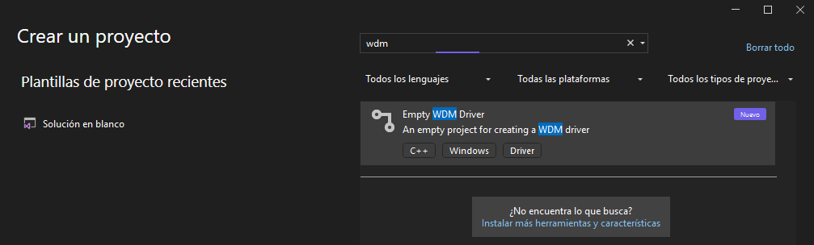


## 6.3. Configuración de compilación

Antes de compilar, debemos seleccionar una configuración adecuada. Para este proyecto se recomienda utilizar:

```text
Configuration: Release
Platform: x64
```


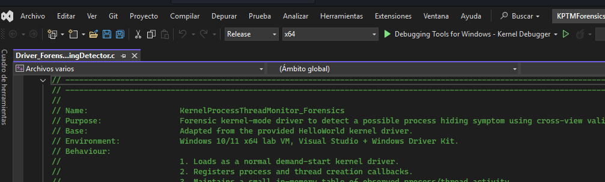


La configuración **Release** genera una versión más limpia del binario final, adecuada para pruebas controladas en laboratorio. La plataforma **x64** debe coincidir con la arquitectura del sistema operativo donde se va a cargar el driver.

En caso de realizar pruebas con información de depuración más detallada, también podría utilizarse la configuración **Debug**, aunque para la entrega del proyecto resulta suficiente documentar la compilación en **Release x64**.

Además, el proyecto debe estar configurado para generar un binario de tipo driver, cuyo resultado final será un archivo con extensión:

```text
.sys
```

Este archivo será el driver que posteriormente se instalará como servicio de tipo kernel en la máquina virtual de pruebas.

## 6.4. Resultado de la compilación

El resultado final de la compilación es un archivo con extensión `.sys`, que representa el driver de modo kernel:

```text
KPTMForensics.sys
```

Este archivo contiene el código compilado del driver y será el binario que posteriormente se copie a la máquina virtual de laboratorio para su instalación, carga y prueba.

Además del archivo `.sys`, Visual Studio puede generar otros archivos auxiliares, como símbolos de depuración:

```text
KPTMForensics.pdb
```

El archivo `.pdb` puede resultar útil si se desea analizar el driver con WinDbg, ya que permite asociar direcciones de memoria con nombres de funciones y líneas de código.

## 6.5. Firma del driver para entorno de pruebas

En sistemas Windows x64, los drivers de modo kernel requieren firma para poder cargarse. Como este proyecto tiene una finalidad académica y se ejecuta únicamente en una máquina virtual de laboratorio, puede utilizarse una firma de prueba.

La firma no forma parte de la compilación en sentido estricto, pero sí es un paso necesario antes de cargar el driver en Windows. Para ello, se puede generar un certificado de prueba y firmar el archivo `.sys` mediante la herramienta `signtool`.

El objetivo de este paso es permitir que el sistema operativo acepte el driver dentro de un entorno controlado con el modo de pruebas habilitado. Esta configuración no debe aplicarse en sistemas de producción.


## 6.6 Resumen del proceso de compilación

En resumen, el proceso seguido para compilar el driver es el siguiente:

1. Instalar Visual Studio, Windows SDK y Windows Driver Kit.
2. Crear un proyecto de tipo `Kernel Mode Driver, Empty`.
3. Añadir el código fuente del driver al proyecto.
4. Seleccionar la configuración `Release x64`.
5. Compilar la solución desde Visual Studio.
6. Verificar que se genera correctamente el archivo `.sys`.
7. Firmar el driver con un certificado de prueba antes de cargarlo en la VM.
8. Conservar el archivo `.pdb` si se va a utilizar WinDbg para depuración avanzada.

Este proceso permite obtener el binario final del driver **KernelProcessThreadMonitor Forensics**, preparado para ser probado posteriormente en el entorno de laboratorio.

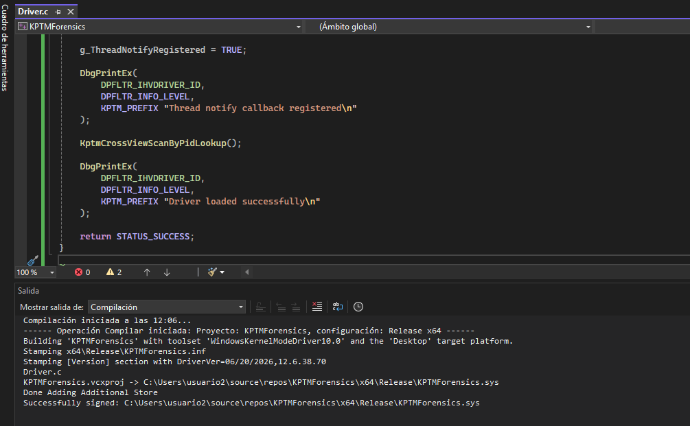


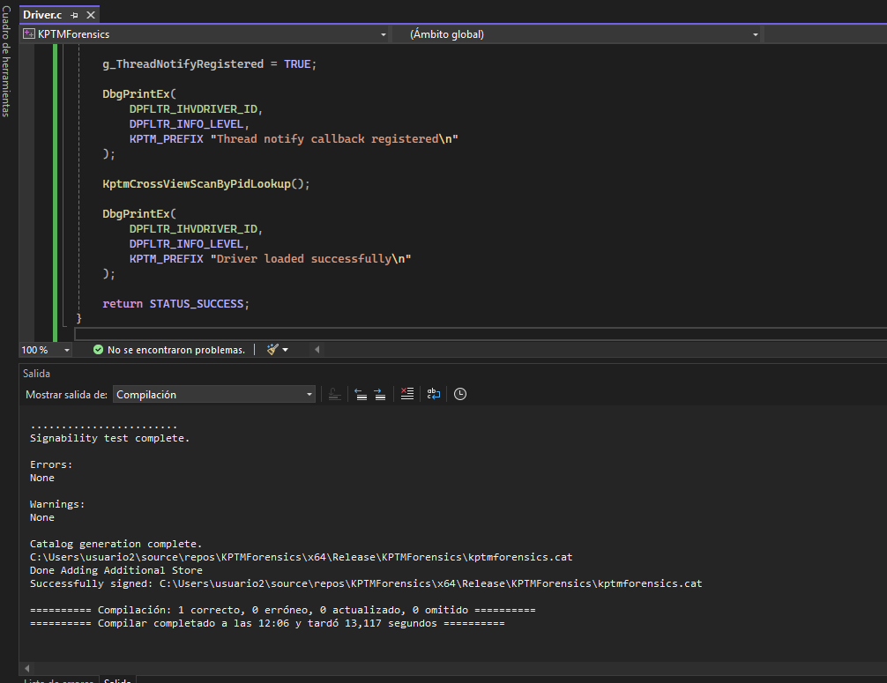

Eso significa que ya tenemos generado y firmado el driver:

```bash
C:\Users\usuario2\source\repos\KPTMForensics\x64\Release\KPTMForensics.sys
```


# 7. Ejecución y pruebas

Probamos el drive  en la VM destino. Copiamos este archivo a tu máquina virtual de laboratorio:

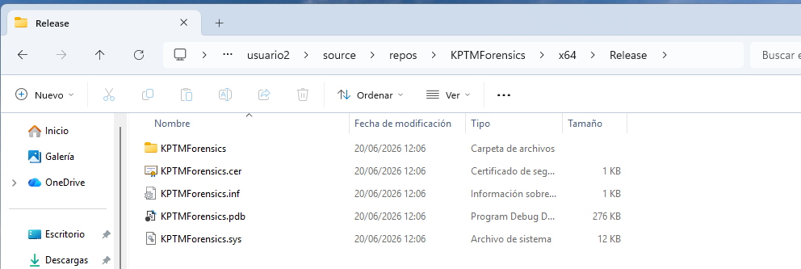


```bash
KPTMForensics.sys
```

Por ejemplo, en la VM lo dejamos en:

```bash
C:\Drivers\KPTMForensics\KPTMForensics.sys
```

Creamos la carpeta si no existe:

```bash
mkdir C:\Drivers\KPTMForensics
```

Activamos el modo test signing en la VM: En la VM, abrimos CMD como administrador y ejecutamos:

```bash
bcdedit /set testsigning on
```

Reiniciamos:

```bash
shutdown /r /t 0
```

Al volver a iniciar debe aparecer algo como Test Mode en el escritorio.


-----


Creamos el servicio del driver: En CMD como administrador:

```bash
sc.exe create KPTMForensics type= kernel start= demand binPath= C:\Drivers\KPTMForensics\KPTMForensics.sys

```

Comprobamos que se ha creado:

```bash
sc.exe query KPTMForensics
```


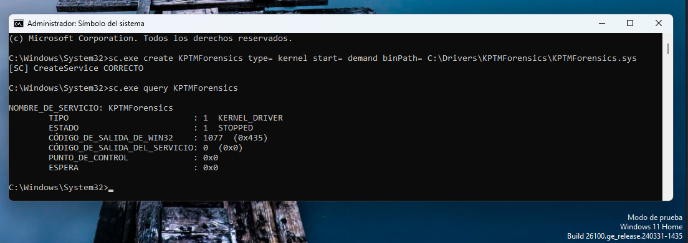

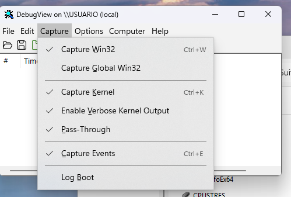


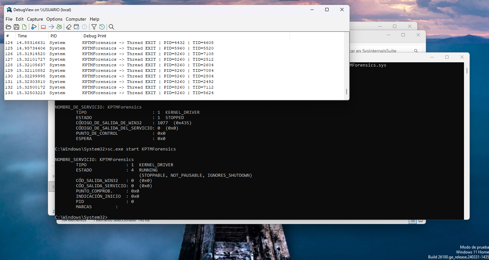

-------------------


l driver ya está cargado y funcionando correctamente.

En la captura se ve lo importante:

ESTADO : 4 RUNNING

Eso confirma que KPTMForensics.sys está activo como kernel driver.

Además, en DebugView ya aparecen trazas del driver:

KPTMForensics -> Thread EXIT | PID=4432 | TID=4608
KPTMForensics -> Thread EXIT | PID=5960 | TID=5520
KPTMForensics -> Thread EXIT | PID=8260 | TID=7108
...

Eso significa que el callback de hilos está funcionando y que el driver está recibiendo eventos desde el kernel.

Ahora prueba eventos de procesos

Ejecuta en CMD:

notepad.exe
calc.exe


----------------------

Después ciérralos:

taskkill /IM notepad.exe /F

En DebugView deberías ver mensajes como:

KPTMForensics -> Process CREATE | PID=... | ParentPID=...
KPTMForensics -> Thread CREATE | PID=... | TID=...
KPTMForensics -> Thread EXIT | PID=... | TID=...
KPTMForensics -> Process EXIT | PID=... | ParentPID=...


-----------------------------


Durante la prueba en la máquina virtual de laboratorio, el driver KPTMForensics.sys fue cargado correctamente como servicio de tipo KERNEL_DRIVER mediante sc.exe. El estado RUNNING confirma que el driver permaneció activo en el sistema. A través de DebugView se observaron mensajes generados por el driver desde modo kernel, especialmente eventos de finalización de hilos, lo que valida el correcto funcionamiento del callback registrado mediante PsSetCreateThreadNotifyRoutine.


------------------------------------


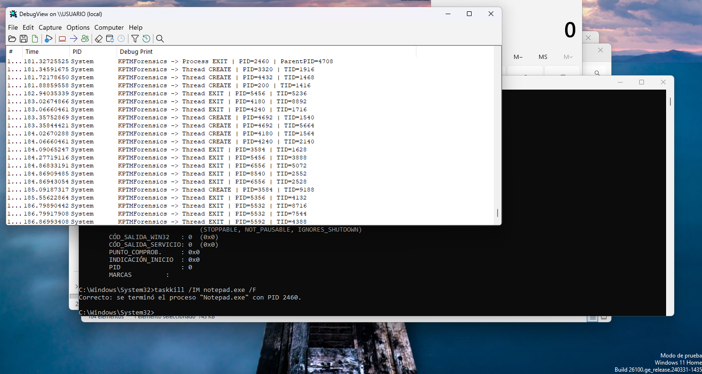

taskkill /IM notepad.exe /F

Windows responde:

Correcto: se terminó el proceso "Notepad.exe" con PID 2460.

Y en DebugView aparece la traza generada por el driver:

KPTMForensics -> Process EXIT | PID=2460 | ParentPID=4708

--------


Tras cargar el driver KPTMForensics.sys como servicio de tipo KERNEL_DRIVER, se generó actividad en el sistema mediante la apertura y finalización del proceso notepad.exe. Al ejecutar taskkill /IM notepad.exe /F, el sistema confirmó la terminación del proceso con PID 2460. De forma simultánea, DebugView mostró la traza KPTMForensics -> Process EXIT | PID=2460 | ParentPID=4708, generada desde el callback de procesos del driver. Esta salida confirma que el driver recibe correctamente notificaciones del kernel relacionadas con la finalización de procesos. Además, se observaron múltiples eventos Thread CREATE y Thread EXIT, lo que valida también el funcionamiento del callback de hilos.

----------------


Con windwb en la MV analista


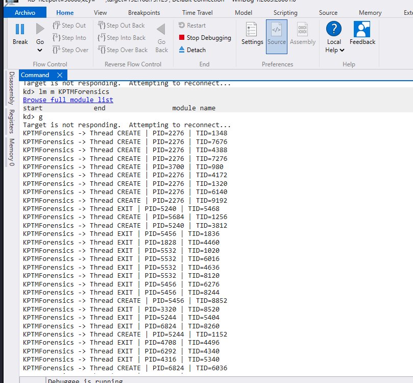


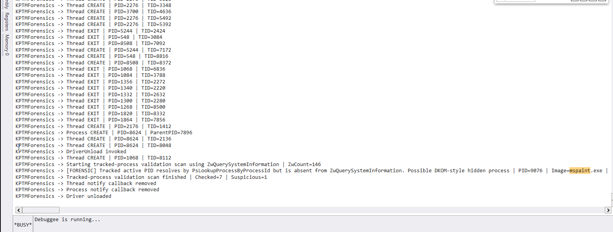


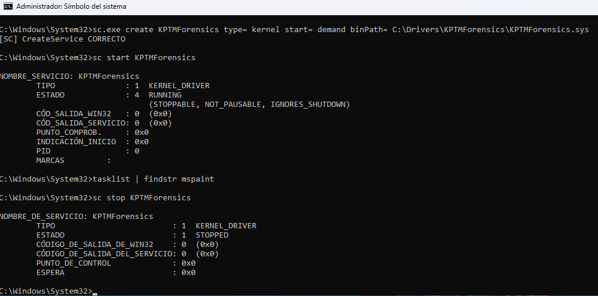

Tras aplicar la técnica DKOM sobre el proceso mspaint.exe, el proceso dejó de aparecer en las enumeraciones normales del sistema. Al descargar el driver KPTMForensics, se ejecutó la función de validación forense basada en comparación de vistas. El driver comprobó que el PID 9076 seguía resolviendo correctamente mediante PsLookupProcessByProcessId, lo que indica que el objeto EPROCESS seguía existiendo en memoria. Sin embargo, el mismo PID no aparecía en la enumeración obtenida mediante ZwQuerySystemInformation. Esta discrepancia fue registrada por el driver como Possible DKOM-style hidden process, generando una alerta forense compatible con ocultación de procesos mediante manipulación de ActiveProcessLinks.


El resultado Checked=7 | Suspicious=1 confirma que el driver analizó siete procesos activos observados durante su ejecución y detectó una única discrepancia sospechosa, correspondiente al proceso mspaint.exe.


```bash
proceso oculto por DKOM + desaparición en userland + detección por tu driver forense.

```
----------


# 8. Resultados obtenidos

# 9. Limitaciones

# 10. Conclusiones

# 11. Fuentes consultadas