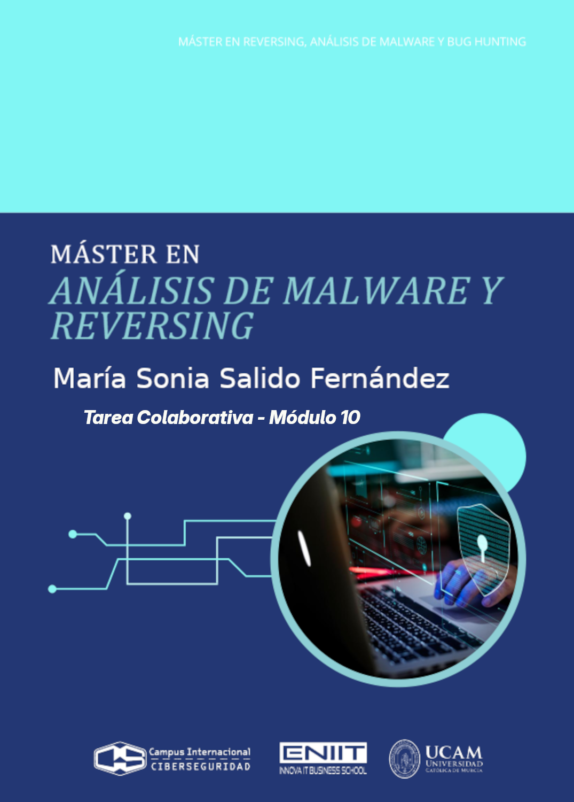


- [Técnicas de hooking implementadas en rootkits de Windows: evasión, ocultación y persistencia](#técnicas-de-hooking-implementadas-en-rootkits-de-windows-evasión-ocultación-y-persistencia)
- [1. Introducción](#1-introducción)
- [2. Conceptos previos](#2-conceptos-previos)
  - [2.1. Qué es un rootkit](#21-qué-es-un-rootkit)
  - [2.2. Diferencia entre rootkit y bootkit](#22-diferencia-entre-rootkit-y-bootkit)
  - [2.3. User mode vs kernel mode](#23-user-mode-vs-kernel-mode)
  - [2.4. Qué es el hooking](#24-qué-es-el-hooking)
- [3. Objetivos del hooking en rootkits](#3-objetivos-del-hooking-en-rootkits)
  - [3.1. Ocultación de procesos](#31-ocultación-de-procesos)
  - [3.2. Ocultación de archivos](#32-ocultación-de-archivos)
  - [3.3. Ocultación de claves de registro](#33-ocultación-de-claves-de-registro)
  - [3.4. Interceptación de llamadas del sistema](#34-interceptación-de-llamadas-del-sistema)
  - [3.5. Evasión de herramientas de análisis](#35-evasión-de-herramientas-de-análisis)
- [4. Técnicas principales de hooking](#4-técnicas-principales-de-hooking)
  - [4.1. IAT Hooking](#41-iat-hooking)
  - [4.2. EAT Hooking](#42-eat-hooking)
  - [4.3. Inline Hooking](#43-inline-hooking)
  - [4.4. IDT Hooking](#44-idt-hooking)
    - [Conclusión de la inspección de la entrada `0x80` de la IDT](#conclusión-de-la-inspección-de-la-entrada-0x80-de-la-idt)
    - [Conclusiones de la práctica sobre IDT Hooking](#conclusiones-de-la-práctica-sobre-idt-hooking)
  - [4.5. SSDT Hooking](#45-ssdt-hooking)
  - [4.6. IRP Hooking](#46-irp-hooking)
  - [4.7. DKOM como técnica relacionada](#47-dkom-como-técnica-relacionada)
- [5. Hooking en modo usuario](#5-hooking-en-modo-usuario)
- [6. Hooking en modo kernel](#6-hooking-en-modo-kernel)
- [7. Protecciones modernas de Windows](#7-protecciones-modernas-de-windows)
  - [7.1. PatchGuard](#71-patchguard)
  - [7.2. Driver Signature Enforcement](#72-driver-signature-enforcement)
  - [7.3. Secure Boot](#73-secure-boot)
  - [7.4. Virtualization Based Security](#74-virtualization-based-security)
  - [7.5. Control Flow Guard](#75-control-flow-guard)
- [8. Casos reales o familias de malware relacionadas](#8-casos-reales-o-familias-de-malware-relacionadas)
  - [8.1. Alureon / TDSS / TDL](#81-alureon--tdss--tdl)
  - [8.2. ZeroAccess / Sirefef](#82-zeroaccess--sirefef)
  - [8.3. Rustock](#83-rustock)
  - [8.4. Necurs](#84-necurs)
  - [8.5. LoJax](#85-lojax)
  - [8.6. Relación de estos casos con las técnicas estudiadas](#86-relación-de-estos-casos-con-las-técnicas-estudiadas)
- [9. Conclusiones](#9-conclusiones)
- [10. Bibliografía](#10-bibliografía)


# Técnicas de hooking implementadas en rootkits de Windows: evasión, ocultación y persistencia

En el ámbito de la ciberseguridad, **la persistencia y la evasión** son dos pilares fundamentales para el éxito de cualquier código malicioso. Los **rootkits** son la máxima expresión de esta filosofía, diseñados específicamente para mantener un acceso privilegiado mientras ocultan su presencia al sistema operativo, al usuario y a las soluciones de seguridad. Para lograr este nivel de invisibilidad, los rootkits dependen de una técnica central: **<mark>el hooking</mark>**. Mediante la interceptación y modificación del flujo normal de ejecución del sistema, un rootkit puede filtrar información, alterar respuestas y controlar todo lo que el sistema "ve" y "hace".


# 1. Introducción
Los rootkits representan una de las categorías más avanzadas dentro del malware orientado a la ocultación, la persistencia y el control encubierto de un sistema comprometido. A diferencia de otros tipos de código malicioso más visibles, un rootkit no se limita necesariamente a ejecutar una acción dañina concreta, sino que busca modificar la percepción que el propio sistema operativo, las herramientas de administración y las soluciones de seguridad tienen sobre el estado real de la máquina.

> [!Note]
> En el contexto de los sistemas Windows, una de las técnicas históricamente más relevantes empleadas por los rootkits es el **hooking**. Esta técnica consiste en interceptar, redirigir o modificar el flujo normal de ejecución de una función, API, llamada al sistema o rutina interna del sistema operativo. De esta forma, el rootkit puede situarse entre el componente legítimo que realiza una petición y el componente que debería procesarla, alterando la información devuelta o ejecutando código adicional antes de continuar con el flujo esperado.

El hooking puede utilizarse con distintos objetivos maliciosos. Entre los más habituales se encuentran la **ocultación de procesos, archivos, claves de registro, conexiones de red, módulos cargados o drivers sospechosos.** Por ejemplo, si una herramienta del sistema solicita una lista de procesos en ejecución, un rootkit podría interceptar dicha consulta y eliminar de la respuesta aquellos procesos asociados a su propia actividad. Desde el punto de vista del usuario o del analista, el sistema parecería encontrarse en un estado normal, aunque internamente seguiría existiendo actividad maliciosa.

Estas técnicas pueden implementarse tanto en modo usuario (**user mode**) como en modo kernel (**kernel mode**). El hooking en modo usuario suele actuar sobre procesos concretos, bibliotecas dinámicas o funciones de la API de Windows. En cambio, el hooking en modo kernel opera a un nivel de privilegio mucho más elevado, pudiendo afectar a estructuras internas del núcleo, drivers y mecanismos de gestión del sistema operativo. Esta diferencia resulta fundamental, ya que cuanto más profundo es el nivel de intervención, mayor suele ser la capacidad de ocultación, pero también mayor es la complejidad técnica y el riesgo de detección o inestabilidad del sistema.

A lo largo de los años, Microsoft ha incorporado diversas medidas de seguridad destinadas a **dificultar este tipo de manipulaciones.** Entre ellas destacan mecanismos como **PatchGuard**, **Driver Signature Enforcement**, **Secure Boot**, **Virtualization Based Security o Control Flow Guard**. Estas protecciones han reducido la viabilidad de muchas técnicas clásicas de hooking en kernel, especialmente aquellas que modificaban estructuras críticas del sistema operativo. Sin embargo, el estudio de estas técnicas sigue siendo esencial para comprender la evolución del malware avanzado, el funcionamiento interno de Windows y las estrategias utilizadas por atacantes para evadir mecanismos de defensa.

**El objetivo de este trabajo es analizar las principales técnicas de hooking implementadas en rootkits de Windows**, explicando su funcionamiento general, sus objetivos, su relación con la evasión y la persistencia, así como las protecciones modernas que buscan impedir o detectar este tipo de modificaciones. El enfoque será principalmente teórico y defensivo, evitando el desarrollo de código malicioso funcional, pero profundizando en los conceptos necesarios para comprender cómo estas técnicas han sido utilizadas en escenarios reales de compromiso y análisis de malware.


--------------

# 2. Conceptos previos
## 2.1. Qué es un rootkit

Un **rootkit es un conjunto de técnicas, herramientas o componentes de software diseñados para mantener acceso privilegiado a un sistema comprometido mientras ocultan su presencia** frente al usuario, el sistema operativo y las soluciones de seguridad. Su objetivo principal no siempre es realizar una acción destructiva directa, sino alterar la visibilidad del sistema para que determinados procesos, archivos, claves de registro, conexiones de red, módulos cargados o actividades maliciosas no sean detectados fácilmente.

El término procede de la combinación de **root**, que hace referencia al usuario con máximos privilegios en sistemas `Unix/Linux`, y **kit**, entendido como conjunto de herramientas. Aunque su origen conceptual está asociado a entornos Unix, el concepto se ha extendido ampliamente a sistemas Windows, donde los rootkits pueden operar tanto en modo usuario como en modo kernel.

**En sistemas Windows, un rootkit puede actuar en diferentes niveles de profundidad**. En modo usuario, puede manipular bibliotecas, funciones de la API de Windows o procesos concretos para alterar la información que reciben las aplicaciones. En modo kernel, en cambio, puede interactuar con estructuras internas del núcleo del sistema operativo, drivers y mecanismos de bajo nivel. Este segundo escenario suele ser más complejo y peligroso, ya que el código ejecutado en kernel dispone de privilegios elevados y puede influir directamente en el comportamiento global del sistema.

La característica diferencial de un rootkit es su **capacidad de ocultación**. Por ejemplo, si una herramienta de administración solicita la lista de procesos activos, un rootkit podría modificar la respuesta para que su propio proceso no aparezca. Del mismo modo, podría ocultar archivos en disco, impedir que ciertas claves de registro sean visibles, manipular resultados de comandos del sistema o interferir en el funcionamiento de herramientas de análisis forense.

Los rootkits suelen estar relacionados con varias fases de una intrusión avanzada. Pueden emplearse para mantener persistencia después de una infección inicial, dificultar la detección por parte de antivirus o EDR, proteger otros componentes maliciosos instalados en el sistema o facilitar el control remoto del equipo comprometido. Por este motivo, su análisis resulta especialmente relevante dentro del estudio del malware avanzado y de la ingeniería inversa en sistemas Windows.

Es importante señalar que un rootkit no tiene por qué ser una única pieza de malware independiente. En muchos casos, funciona como un componente integrado dentro de una operación más amplia. Puede acompañar a troyanos, puertas traseras, bootkits, ransomware u otras familias de malware, proporcionando capacidades de ocultación y evasión. Su peligrosidad reside precisamente en que modifica la forma en la que el sistema muestra su propio estado, haciendo que el analista trabaje con una visión potencialmente manipulada de la realidad.


--------------

## 2.2. Diferencia entre rootkit y bootkit

Aunque los términos **rootkit** y **bootkit** suelen aparecer asociados dentro del estudio del malware avanzado, no hacen referencia exactamente al mismo tipo de amenaza. Ambos comparten un objetivo común: ocultar actividad maliciosa y mantener el control sobre un sistema comprometido. Sin embargo, se diferencian principalmente en el nivel del sistema en el que operan y en el momento en el que consiguen ejecutarse.

Un **rootkit es un componente diseñado para ocultar su presencia o la de otros elementos maliciosos dentro de un sistema operativo ya iniciado.** Puede actuar en modo usuario o en modo kernel, manipulando funciones, procesos, drivers, estructuras internas del sistema o respuestas devueltas por herramientas legítimas. Su actividad comienza normalmente cuando Windows ya se encuentra en ejecución, aunque puede apoyarse en mecanismos de persistencia para cargarse automáticamente en cada inicio.

Un **bootkit, en cambio, es una variante más especializada que compromete fases tempranas del proceso de arranque.** Su objetivo es ejecutarse antes de que el sistema operativo se haya cargado completamente. Para ello, puede modificar componentes relacionados con el arranque, como el MBR en sistemas antiguos, el `VBR`, el bootloader o incluso elementos vinculados al firmware UEFI en sistemas modernos. Al ejecutarse antes que Windows, un bootkit puede situarse en una posición privilegiada para alterar el entorno de ejecución desde una fase muy temprana.

La diferencia fundamental, por tanto, está en el momento y la profundidad de la infección. Mientras que un rootkit suele actuar una vez que el sistema operativo está en funcionamiento, un bootkit interviene antes o durante el proceso de arranque. Esto le permite preparar el entorno, cargar componentes maliciosos de forma anticipada o modificar la forma en la que posteriormente se inicia el sistema operativo.

Desde el punto de vista de la persistencia, los bootkits suelen ser especialmente peligrosos porque pueden sobrevivir a ciertas acciones de limpieza realizadas dentro del propio sistema operativo. Si el componente malicioso se encuentra en una fase previa al arranque de Windows, las herramientas ejecutadas desde el sistema comprometido pueden tener dificultades para detectarlo o eliminarlo correctamente. Por este motivo, el análisis de bootkits suele requerir una visión más amplia que incluya firmware, particiones de arranque, configuración UEFI y cadena de confianza del sistema.

En cambio, los rootkits tradicionales suelen centrarse en manipular la visibilidad del sistema una vez iniciado. Por ejemplo, pueden ocultar procesos, archivos, claves de registro, conexiones de red o drivers cargados. Para conseguirlo, pueden utilizar técnicas como hooking, manipulación directa de objetos del kernel, filtrado de respuestas o modificación de estructuras internas. Su objetivo es que el usuario, el administrador o las soluciones de seguridad reciban una visión alterada del estado real del sistema.


--------------

## 2.3. User mode vs kernel mode
Para comprender las técnicas de hooking utilizadas por los rootkits en Windows, es fundamental diferenciar entre **user mode** y **kernel mode**. Estos dos modos de ejecución separan los privilegios y responsabilidades dentro del sistema operativo, estableciendo una frontera entre las aplicaciones normales y los componentes más críticos del sistema.

El **user mode**, o modo usuario, es el espacio donde se ejecutan la mayoría de aplicaciones convencionales, como navegadores, editores de texto, herramientas de administración, procesos de usuario o utilidades del sistema. Los programas que se ejecutan en este modo tienen privilegios limitados y no pueden acceder directamente a la memoria del kernel ni manipular estructuras internas críticas del sistema operativo. Cuando una aplicación necesita realizar una operación sensible, como acceder a un archivo, crear un proceso, abrir una conexión de red o interactuar con un dispositivo, debe solicitarlo al sistema operativo mediante APIs y llamadas al sistema.

El **kernel mode**, o modo kernel, es el nivel de ejecución más privilegiado del sistema operativo. En este espacio se ejecutan el núcleo de Windows, los drivers de dispositivos y otros componentes esenciales encargados de gestionar memoria, procesos, hilos, sistema de archivos, red, seguridad y comunicación con el hardware. El código que opera en kernel mode tiene acceso directo a estructuras internas del sistema y puede modificar aspectos fundamentales de su funcionamiento. Por este motivo, un error o una manipulación maliciosa en este nivel puede provocar inestabilidad, bloqueos del sistema o comprometer completamente la seguridad del equipo.

Desde el punto de vista de un rootkit, la diferencia entre ambos modos es clave. Un rootkit en modo usuario puede interceptar funciones de bibliotecas como `kernel32.dll`, `ntdll.dll` o `advapi32.dll`, manipular la información que reciben determinados procesos o alterar el comportamiento de herramientas concretas. Este tipo de hooking suele ser más sencillo de implementar, pero también más limitado, ya que afecta principalmente a procesos específicos y puede ser detectado comparando los resultados con fuentes de información de menor nivel.

En cambio, un rootkit en modo kernel puede operar con mayor profundidad. Al ejecutarse con privilegios elevados, puede interceptar llamadas al sistema, modificar rutinas de drivers, alterar estructuras internas del kernel o manipular la forma en la que Windows gestiona procesos, archivos, claves de registro o conexiones de red. Esto le permite ocultarse de forma más eficaz, ya que puede modificar la información antes de que llegue a las herramientas ejecutadas en modo usuario.

La siguiente idea resume la diferencia principal:

```text
User mode  -> Aplicaciones y procesos con privilegios limitados.
Kernel mode -> Núcleo, drivers y componentes críticos con privilegios elevados.
```

En el contexto del hooking, las técnicas en modo usuario suelen centrarse en modificar funciones importadas, bibliotecas dinámicas o APIs utilizadas por un proceso. Algunos ejemplos serían el **IAT hooking**, el **EAT hooking** o el **inline hooking** sobre funciones de una DLL. Estas técnicas pueden permitir que una aplicación reciba información manipulada, pero no necesariamente afectan a todo el sistema.

Por el contrario, las técnicas en modo kernel pueden afectar al comportamiento global del sistema operativo. Ejemplos clásicos son el **SSDT hooking**, el **IRP hooking** o la manipulación de rutinas internas de drivers. Estas técnicas han sido utilizadas históricamente por rootkits para ocultar procesos, archivos, módulos cargados o actividad de red desde una posición privilegiada.

No obstante, el hooking en kernel mode también presenta mayores dificultades técnicas. Las versiones modernas de Windows incorporan mecanismos de protección como **PatchGuard, Driver Signature Enforcement, Secure Boot o Virtualization Based Security**, cuyo objetivo es impedir o detectar modificaciones no autorizadas en el núcleo del sistema. Por ello, aunque el kernel mode ofrece mayor capacidad de ocultación, también implica un mayor riesgo de detección, inestabilidad y bloqueo del sistema.


--------------

## 2.4. Qué es el hooking

El *hooking* es una técnica utilizada para interceptar, redirigir o modificar el flujo normal de ejecución de una función, una llamada al sistema, una API o una rutina interna del sistema operativo. En términos generales, **consiste en introducir un punto de control entre el componente que realiza una petición y el componente que debería atenderla originalmente.**

Cuando un programa ejecuta una función, lo esperable es que el flujo de ejecución llegue directamente a la implementación legítima de dicha función y devuelva un resultado acorde al comportamiento normal del sistema. Sin embargo, mediante hooking, **ese flujo puede ser alterado para que la ejecución pase previamente por una rutina intermedia.** Esta rutina puede observar la llamada, modificar sus parámetros, alterar el resultado, bloquear la operación o ejecutar código adicional antes de devolver el control al flujo original.

En sistemas Windows, el hooking puede aplicarse en diferentes niveles. En modo usuario, puede afectar a funciones exportadas por bibliotecas dinámicas como `kernel32.dll`, `user32.dll`, `advapi32.dll` o `ntdll.dll`. En modo kernel, puede afectar a llamadas del sistema, rutinas de drivers, estructuras internas del núcleo o mecanismos de entrada y salida. Esta capacidad de actuar en distintos niveles convierte al hooking en una técnica especialmente relevante dentro del análisis de rootkits.

Es importante señalar que el **hooking no es una técnica exclusivamente maliciosa.** También es utilizada por herramientas legítimas, como depuradores, soluciones antivirus, herramientas de monitorización, sistemas anticheat, aplicaciones de accesibilidad o plataformas de análisis de comportamiento. Por ejemplo, una solución de seguridad puede interceptar operaciones relacionadas con archivos para analizarlas antes de permitir su ejecución, mientras que un depurador puede interceptar determinadas funciones para estudiar el comportamiento de un proceso.

No obstante, en el contexto de los rootkits, el **hooking suele utilizarse con fines de ocultación, evasión y persistencia.** Un rootkit puede interceptar funciones utilizadas para listar procesos y eliminar de la respuesta aquellos que están asociados a su propia actividad. También puede manipular consultas al sistema de archivos para ocultar ficheros, alterar respuestas del registro de Windows para esconder claves de persistencia o modificar información de red para dificultar la identificación de conexiones sospechosas.

De forma simplificada, **el flujo normal de una llamada podría representarse así:**

```text
Aplicación -> Función legítima -> Resultado legítimo
```

En cambio, **cuando existe hooking, el flujo puede quedar alterado de la siguiente manera:**

```text
Aplicación -> Hook -> Función legítima -> Resultado modificado
```

La clave de esta técnica es que la aplicación que realiza la petición puede no ser consciente de que el resultado ha sido interceptado o manipulado. Desde su perspectiva, la función se ha ejecutado correctamente, aunque la información recibida haya sido filtrada, modificada o falseada por el componente que ha instalado el hook.

Existen distintas formas de implementar hooking. Algunas técnicas modifican tablas de direcciones utilizadas por los procesos para resolver funciones importadas, como ocurre con el *IAT hooking*. Otras alteran la tabla de funciones exportadas de una biblioteca, como sucede en el *EAT hooking*. También existen técnicas que modifican directamente los primeros bytes de una función para redirigir la ejecución hacia otra rutina, lo que se conoce como *inline hooking*. En niveles más profundos, algunos rootkits han utilizado técnicas como el *SSDT hooking* o el *IRP hooking* para interceptar operaciones desde el modo kernel.

La eficacia del hooking depende del nivel en el que se aplique y del tipo de información que se pretenda manipular. Un hook en modo usuario puede ser suficiente para engañar a una aplicación concreta, pero puede ser detectado comparando la información con fuentes de menor nivel. En cambio, un hook en modo kernel puede afectar al comportamiento global del sistema y ofrecer mayor capacidad de ocultación, aunque también implica más complejidad técnica y mayor riesgo de ser detectado por mecanismos modernos de protección.


--------------

# 3. Objetivos del hooking en rootkits

## 3.1. Ocultación de procesos

Uno de los objetivos clásicos del hooking en rootkits es la ocultación de procesos. Un proceso malicioso visible en herramientas como el Administrador de tareas, Process Explorer u otras utilidades de monitorización puede alertar al usuario o al analista de la existencia de una infección. Por este motivo, muchos rootkits intentan impedir que sus procesos aparezcan en los listados habituales del sistema.

En condiciones normales, cuando una herramienta solicita información sobre los procesos activos, Windows consulta sus estructuras internas y devuelve una lista con los procesos en ejecución. Sin embargo, si un rootkit ha instalado un hook en una función o rutina relacionada con la enumeración de procesos, puede interceptar esa consulta y modificar la respuesta antes de que llegue a la herramienta que la ha solicitado.

De forma conceptual, el funcionamiento podría representarse así:

```text
Consulta normal:

Herramienta de análisis -> Sistema operativo -> Lista completa de procesos
```

```text
Consulta manipulada por un rootkit:

Herramienta de análisis -> Hook del rootkit -> Sistema operativo -> Lista filtrada de procesos
```

En este escenario, el rootkit no necesita eliminar realmente el proceso malicioso del sistema. Basta con **impedir que sea mostrado a través de determinadas interfaces de consulta.** El proceso continúa ejecutándose, consumiendo recursos y realizando su actividad, pero queda oculto para aquellas herramientas que dependen de la información manipulada por el hook.

Esta técnica puede aplicarse en distintos niveles. En modo usuario, un rootkit podría interceptar funciones utilizadas por aplicaciones concretas para obtener la lista de procesos. Este enfoque puede engañar a herramientas específicas, pero suele ser menos robusto, ya que otras utilidades que consulten la información desde un nivel más bajo podrían detectar la discrepancia. En modo kernel, la ocultación puede ser más profunda, ya que el rootkit puede intervenir en mecanismos más cercanos al núcleo del sistema operativo y afectar a múltiples herramientas al mismo tiempo.

La ocultación de procesos no solo busca evitar la detección visual por parte del usuario. También puede dificultar el análisis automático realizado por soluciones de seguridad, impedir que un analista identifique procesos sospechosos, ocultar procesos encargados de la comunicación con un servidor de mando y control, o proteger otros componentes del malware frente a intentos de finalización manual.

No obstante, esta técnica también presenta limitaciones. La manipulación de resultados puede generar inconsistencias entre diferentes fuentes de información. Por ejemplo, una herramienta podría no mostrar el proceso, pero sí detectarse actividad de red, consumo de memoria, handles abiertos, hilos activos o módulos cargados relacionados con él. **Estas discrepancias son precisamente uno de los indicadores que pueden utilizarse durante un análisis forense para sospechar de la presencia de un rootkit.**

Por tanto, la ocultación de procesos mediante hooking es una técnica orientada a modificar la visibilidad del sistema, no necesariamente a eliminar la actividad maliciosa. Su eficacia depende del nivel en el que se implemente el hook, de las funciones interceptadas y de la capacidad de las herramientas defensivas para contrastar la información desde distintas fuentes.


--------------

## 3.2. Ocultación de archivos

Otro de los objetivos habituales del hooking en rootkits es la ocultación de archivos. Muchos componentes maliciosos necesitan almacenar ficheros en el sistema comprometido, ya sea para mantener persistencia, guardar configuraciones, registrar información obtenida, cargar módulos adicionales o conservar copias de otros elementos del malware. Si estos archivos fueran visibles para el usuario, el administrador o una herramienta de seguridad, podrían ser identificados y eliminados con mayor facilidad.

En condiciones normales, cuando una aplicación solicita listar el contenido de un directorio, Windows devuelve la información correspondiente a los archivos y carpetas presentes en esa ubicación. Esta información puede ser consultada por herramientas como el Explorador de archivos, comandos de consola, utilidades forenses o soluciones de seguridad. Sin embargo, un rootkit puede instalar hooks en funciones o rutinas relacionadas con la enumeración de archivos para manipular la respuesta antes de que llegue a la aplicación solicitante.

De forma simplificada, **el proceso normal sería el siguiente:**

```text
Herramienta de usuario -> Solicitud de listado de directorio -> Sistema operativo -> Lista real de archivos
```

**En presencia de un rootkit con capacidad de hooking, el flujo podría alterarse así:**

```text
Herramienta de usuario -> Hook del rootkit -> Sistema operativo -> Lista filtrada de archivos
```

En este escenario, el archivo malicioso no desaparece realmente del disco. Sigue existiendo en el sistema de archivos, ocupando espacio y pudiendo ser utilizado por el malware. Lo que cambia es la información que se muestra a determinadas herramientas. El rootkit intercepta la respuesta y elimina de la lista aquellos nombres, rutas o extensiones que desea ocultar.

**La ocultación de archivos puede implementarse en distintos niveles.** En modo usuario, el rootkit podría interceptar funciones utilizadas por aplicaciones concretas para listar directorios o consultar atributos de archivos. Este enfoque puede ser suficiente para engañar a algunas herramientas, pero suele ser menos resistente frente a análisis más profundos. En modo kernel, la manipulación puede producirse a un nivel inferior, por ejemplo interceptando operaciones relacionadas con drivers del sistema de archivos o rutinas de entrada/salida. Esto permite que la ocultación afecte a un mayor número de aplicaciones y resulte más difícil de detectar desde herramientas convencionales.

El objetivo principal de esta técnica es **reducir la visibilidad de los componentes maliciosos.** Un rootkit puede ocultar ejecutables, bibliotecas dinámicas, drivers, archivos de configuración, logs propios o cualquier otro fichero relacionado con su actividad. También puede utilizar patrones concretos, como nombres específicos, prefijos, extensiones o rutas determinadas, para decidir qué elementos deben ser filtrados de las respuestas del sistema.

Esta técnica resulta especialmente peligrosa porque puede generar una **falsa sensación de normalidad.** Un usuario podría revisar una carpeta y no observar ningún archivo sospechoso, aunque realmente existan elementos ocultos. Del mismo modo, una herramienta de análisis que dependa de las funciones interceptadas podría obtener una visión incompleta del sistema.

> [!Note]
> No obstante, la ocultación de archivos mediante hooking también puede **dejar indicios.** Por ejemplo, pueden aparecer discrepancias entre el espacio usado en disco y los archivos visibles, diferencias entre resultados obtenidos desde distintas herramientas, inconsistencias al analizar el sistema desde un entorno externo o evidencias de actividad asociada a archivos que aparentemente no existen. Por este motivo, en análisis forense es habitual contrastar la información obtenida desde el sistema comprometido con fuentes alternativas, como imágenes de disco, entornos de arranque externos o herramientas que accedan a un nivel más bajo.


--------------

## 3.3. Ocultación de claves de registro

La ocultación de claves de registro es otro de los objetivos habituales del hooking en rootkits de Windows. **El Registro de Windows es una base de datos jerárquica** utilizada por el sistema operativo y por muchas aplicaciones para almacenar configuraciones, información de usuarios, servicios, drivers, rutas de ejecución automática y múltiples parámetros críticos del sistema. Debido a su importancia, también es un lugar frecuentemente utilizado por el malware para mantener persistencia o guardar información relacionada con su funcionamiento.

Un rootkit puede intentar **ocultar determinadas claves, valores o rutas del registro** para evitar que el usuario, el administrador o una herramienta de seguridad detecten evidencias de compromiso. Por ejemplo, una clave utilizada para ejecutar un componente malicioso durante el inicio del sistema podría ser filtrada para que no aparezca en herramientas como el Editor del Registro, utilidades de administración, scripts de auditoría o soluciones EDR.

En condiciones normales, cuando una herramienta consulta una rama del registro, Windows devuelve la lista de claves y valores existentes en esa ubicación. Sin embargo, si un rootkit ha instalado un hook sobre funciones o rutinas relacionadas con la enumeración del registro, puede interceptar la respuesta y eliminar de ella los elementos que desea ocultar.

**El flujo normal podría representarse de la siguiente forma:**

```text id="sqyxa0"
Herramienta de análisis -> Consulta al Registro de Windows -> Lista real de claves y valores
```

**En presencia de un rootkit con hooking, el flujo podría quedar alterado así:**

```text id="6d3nut"
Herramienta de análisis -> Hook del rootkit -> Consulta al Registro de Windows -> Lista filtrada de claves y valores
```

En este caso, la clave o el valor del registro no desaparece realmente. Sigue existiendo y puede seguir siendo utilizado por el malware. Lo que cambia es la información que se devuelve a determinadas herramientas. El rootkit manipula la respuesta para impedir que ciertos elementos sean visibles desde las interfaces habituales de consulta.

Esta técnica puede utilizarse para ocultar mecanismos de persistencia, configuraciones internas del malware, rutas hacia ejecutables maliciosos, servicios registrados, drivers instalados o parámetros utilizados para la comunicación con otros componentes. En muchos casos, el objetivo no es únicamente esconder una clave concreta, sino impedir que el analista pueda reconstruir fácilmente cómo se mantiene activo el malware en el sistema.

**La ocultación de claves de registro puede realizarse en modo usuario o en modo kernel.** En modo usuario, el rootkit podría interceptar funciones utilizadas por una herramienta concreta para consultar el registro. Este enfoque puede ser efectivo frente a aplicaciones específicas, pero presenta limitaciones si el análisis se realiza desde otro nivel o con herramientas que no dependan de las mismas funciones interceptadas. En modo kernel, la manipulación puede afectar a rutinas más profundas del sistema, lo que permite alterar la información devuelta a múltiples procesos y dificultar la detección.

Desde el punto de vista defensivo, una señal relevante de posible ocultación es la existencia de discrepancias entre diferentes métodos de consulta. Por ejemplo, una herramienta puede no mostrar una clave sospechosa, mientras que otra utilidad, una imagen forense del sistema o un análisis offline sí permite identificarla. También pueden observarse inconsistencias entre servicios activos, drivers cargados, procesos en ejecución y las claves de registro que deberían justificar su presencia.


--------------

## 3.4. Interceptación de llamadas del sistema

La interceptación de llamadas del sistema es uno de los objetivos más relevantes del hooking en rootkits, especialmente cuando estos buscan operar a un nivel profundo dentro del sistema operativo. En Windows, muchas acciones realizadas por las aplicaciones (como crear procesos, abrir archivos, consultar el registro, enumerar directorios o comunicarse con dispositivos) terminan traduciéndose en llamadas al sistema que permiten pasar del modo usuario al modo kernel.

**Una llamada del sistema actúa como un puente controlado entre una aplicación y el núcleo del sistema operativo.** Las aplicaciones no pueden acceder directamente a estructuras críticas del kernel, por lo que deben solicitar determinados servicios a través de interfaces proporcionadas por Windows. Esta separación permite proteger la estabilidad y seguridad del sistema, pero también convierte a las llamadas del sistema en un punto especialmente interesante para un rootkit.

Si un rootkit consigue interceptar una llamada del sistema, puede observar o modificar operaciones sensibles antes de que sean procesadas por el kernel o antes de que el resultado sea devuelto a la aplicación. Esto le permite manipular la información que reciben las herramientas de usuario, bloquear determinadas consultas, ocultar objetos del sistema o alterar el comportamiento normal de ciertas operaciones.

**De forma simplificada, el flujo normal sería el siguiente:**

```text
Aplicación en user mode -> API de Windows -> Llamada al sistema -> Kernel -> Resultado legítimo
```

**En presencia de un rootkit con capacidad de hooking, el flujo podría alterarse así:**

```text
Aplicación en user mode -> API de Windows -> Hook del rootkit -> Llamada al sistema/Kernel -> Resultado manipulado
```

Este tipo de interceptación puede utilizarse para distintos fines. Por ejemplo, un rootkit podría manipular una llamada relacionada con la enumeración de procesos para ocultar uno concreto, interceptar consultas al sistema de archivos para esconder determinados ficheros, alterar operaciones sobre el registro para ocultar claves de persistencia o modificar respuestas asociadas a drivers y dispositivos.

Históricamente, una técnica asociada a este objetivo fue el **SSDT hooking**. La `SSDT`, o `System Service Descriptor Table`, es una estructura utilizada por Windows para localizar las rutinas del kernel que atienden determinadas llamadas del sistema. Algunos rootkits intentaban modificar entradas de esta tabla para redirigir llamadas legítimas hacia funciones controladas por el propio rootkit. De esta forma, podían situarse en una posición intermedia entre la aplicación y el servicio real del sistema operativo.

Sin embargo, las versiones modernas de Windows han incorporado mecanismos de protección que dificultan este tipo de manipulaciones. **PatchGuard**, por ejemplo, fue diseñado para detectar modificaciones no autorizadas en estructuras críticas del kernel en sistemas Windows de 64 bits. Si se detectan alteraciones en determinadas zonas protegidas, el sistema puede provocar un bloqueo controlado para evitar que continúe ejecutándose en un estado comprometido. Esto ha reducido la viabilidad de muchas técnicas clásicas de hooking en kernel, aunque no elimina la importancia de estudiarlas desde el punto de vista histórico y defensivo.

La interceptación de llamadas del sistema resulta especialmente peligrosa porque puede afectar a múltiples herramientas al mismo tiempo. Si la manipulación se realiza en un punto suficientemente bajo del sistema, diferentes aplicaciones pueden recibir la misma visión alterada de la realidad. Por ejemplo, varias herramientas podrían consultar la lista de procesos y obtener todas una respuesta filtrada, lo que dificultaría identificar la presencia del rootkit mediante métodos convencionales.


--------------

## 3.5. Evasión de herramientas de análisis

**La evasión de herramientas de análisis es uno de los objetivos más importantes del hooking en rootkits.** A diferencia de otras técnicas orientadas únicamente a ocultar un proceso, un archivo o una clave de registro concreta, la evasión busca dificultar el trabajo de herramientas utilizadas para investigar, monitorizar o detectar actividad maliciosa dentro del sistema comprometido.

En un entorno Windows, los analistas y las soluciones de seguridad suelen apoyarse en diferentes tipos de herramientas: administradores de tareas avanzados, monitores de procesos, analizadores de registro, herramientas de red, depuradores, volcadores de memoria, antivirus, `EDR` y utilidades forenses. Muchas de estas herramientas obtienen información a través de APIs, llamadas al sistema, drivers o mecanismos internos del sistema operativo. Si un rootkit logra interceptar alguno de esos puntos mediante hooking, puede alterar la información antes de que sea mostrada o procesada.

El objetivo principal de esta evasión es generar una visión incompleta o falseada del sistema. Por ejemplo, una herramienta de análisis podría solicitar la lista de procesos activos y recibir una respuesta filtrada, en la que no aparece el proceso asociado al malware. Otra herramienta podría intentar enumerar archivos de una carpeta concreta y no mostrar determinados ficheros ocultos por el rootkit. También podría manipularse la información relativa a claves de registro, conexiones de red, módulos cargados o drivers instalados.

**De forma conceptual, el proceso puede representarse así:**

```text id="rsrfrk"
Herramienta de análisis -> Consulta al sistema -> Resultado real
```

**En presencia de un rootkit con hooking, el flujo podría alterarse de la siguiente manera:**

```text id="cv4s7c"
Herramienta de análisis -> Hook del rootkit -> Consulta al sistema -> Resultado filtrado o manipulado
```

Esta capacidad resulta especialmente peligrosa porque el analista puede estar trabajando con datos que parecen legítimos, pero que han sido modificados antes de llegar a la herramienta. En consecuencia, **la ausencia de evidencias visibles no implica necesariamente la ausencia de compromiso.** Un sistema infectado por un rootkit puede aparentar normalidad mientras mantiene procesos activos, archivos ocultos, claves de persistencia o comunicaciones no mostradas correctamente.

La evasión también puede dirigirse contra herramientas concretas. Algunos rootkits pueden detectar la ejecución de determinados procesos asociados a análisis, monitorización o depuración y modificar su comportamiento en consecuencia. En otros casos, el rootkit no necesita identificar una herramienta específica, sino interceptar funciones ampliamente utilizadas por muchas utilidades, de modo que varias herramientas reciban la misma información manipulada.

Desde el punto de vista del hooking, la evasión puede producirse tanto en modo usuario como en modo kernel. En modo usuario, el rootkit puede alterar funciones empleadas por una herramienta concreta, lo que puede ser efectivo frente a aplicaciones específicas, pero más limitado si se utilizan métodos alternativos de consulta. En modo kernel, la manipulación puede afectar a un nivel más profundo y proporcionar una visión alterada a múltiples herramientas, aumentando la capacidad de ocultación.

Sin embargo, esta técnica no es infalible. **La evasión mediante hooking puede generar inconsistencias entre distintas fuentes de información.** Por ejemplo, una herramienta puede no mostrar un proceso, pero sí pueden observarse hilos, handles abiertos, consumo de memoria, tráfico de red o artefactos en disco asociados a una actividad no explicada. Estas discrepancias son especialmente útiles durante el análisis forense, ya que pueden indicar que la información mostrada por el sistema está siendo manipulada.


--------------

# 4. Técnicas principales de hooking

Las técnicas de hooking pueden implementarse de diferentes formas dependiendo del nivel en el que se quiera interceptar el flujo de ejecución y del objetivo perseguido. En el contexto de los rootkits de Windows, estas técnicas se utilizan principalmente para manipular la información que reciben las aplicaciones, alterar el comportamiento de determinadas funciones o interferir en la comunicación entre los procesos y el sistema operativo.

No todas las técnicas de hooking actúan en el mismo nivel. Algunas se aplican en modo usuario y afectan únicamente a procesos concretos o bibliotecas cargadas en memoria. Otras operan en modo kernel y pueden modificar estructuras internas del sistema operativo, rutinas de drivers o mecanismos relacionados con llamadas al sistema. Esta diferencia es importante porque condiciona tanto la eficacia de la técnica como su complejidad, sus riesgos y su detectabilidad.

A continuación se describen las principales técnicas de hooking relevantes en el estudio de rootkits de Windows.


--------------

## 4.1. IAT Hooking

El **IAT Hooking** es una técnica de hooking en modo usuario que consiste en modificar la **Import Address Table** o `IAT` de un proceso. La `IAT` es una estructura presente en los ejecutables de Windows en formato `PE`, utilizada para almacenar las direcciones de las funciones importadas desde bibliotecas dinámicas, como `kernel32.dll`, `user32.dll`, `advapi32.dll` o `ntdll.dll`.

Cuando un programa necesita utilizar una función externa, como abrir un archivo, crear un proceso o consultar información del sistema, normalmente no contiene directamente el código de esa función. En su lugar, declara que necesita importar dicha función desde una `DLL`. Durante la carga del proceso, el cargador de Windows resuelve esas importaciones y escribe en la IAT las direcciones reales de las funciones que serán utilizadas durante la ejecución.

**En condiciones normales, el flujo sería el siguiente:**

```text
Programa -> IAT -> Función legítima en una DLL -> Resultado legítimo
```

En un escenario de `IAT Hooking`, un componente malicioso modifica una entrada de la `IAT` para que apunte a una función diferente, controlada por el propio rootkit o por otro componente inyectado en el proceso. De esta forma, cuando el programa intenta llamar a una función legítima, la ejecución se redirige primero hacia la rutina manipulada.

**El flujo quedaría alterado de forma conceptual así:**

```text
Programa -> IAT modificada -> Función del hook -> Función legítima -> Resultado manipulado
```

La función del hook puede realizar distintas acciones antes de devolver el control. Puede inspeccionar los parámetros recibidos, registrar la operación, bloquearla, modificar el resultado o llamar posteriormente a la función original para aparentar un comportamiento normal. En el caso de un rootkit, esta técnica puede emplearse para ocultar información a una aplicación concreta.

Por ejemplo, si una herramienta de análisis utiliza una función determinada para enumerar procesos, archivos o claves de registro, un rootkit podría modificar la entrada correspondiente de la `IAT` dentro de ese proceso. Cuando la herramienta invoque la función, en realidad ejecutará primero el código del hook. Este código podría filtrar de la respuesta aquellos elementos que el rootkit desea ocultar.

Una característica importante del `IAT Hooking` es que su alcance suele limitarse al proceso cuya tabla de importaciones ha sido modificada. Esto significa que, si el rootkit modifica la `IAT` de una herramienta concreta, otras aplicaciones podrían seguir obteniendo información real si no han sido afectadas por el mismo hook. Por este motivo, aunque es una técnica útil, **no proporciona por sí sola una ocultación global del sistema.**

Desde el punto de vista defensivo, el `IAT Hooking` puede detectarse comparando las direcciones almacenadas en la `IAT` con los rangos de memoria esperados de las `DLL` legítimas. Si una entrada que debería apuntar a una función dentro de una biblioteca del sistema apunta a una región de memoria sospechosa, a un módulo no reconocido o a una zona con permisos anómalos, puede ser un indicio de manipulación.

También pueden observarse discrepancias entre la `IAT` presente en memoria y la información esperada a partir del archivo original en disco. No obstante, esta comparación debe interpretarse con cuidado, ya que algunos programas legítimos, soluciones de seguridad o herramientas de instrumentación también pueden modificar tablas de importación con fines permitidos.


--------------

## 4.2. EAT Hooking

El **EAT Hooking** es una técnica de hooking que consiste en **modificar la Export Address Table** o `EAT` de una biblioteca dinámica. La `EAT` es una estructura presente en los archivos PE de Windows, especialmente en las DLL, que contiene información sobre las funciones que dicha biblioteca exporta para que otros módulos o procesos puedan utilizarlas.

Mientras que el *IAT Hooking* actúa sobre la tabla de importaciones de un proceso concreto, el *EAT Hooking* se centra en la tabla de exportaciones de una biblioteca. Esto significa que la manipulación se produce en el punto donde una DLL informa qué funciones ofrece y en qué direcciones se encuentran. Si un programa intenta resolver dinámicamente la dirección de una función exportada, podría recibir una dirección manipulada si la EAT ha sido alterada.

En condiciones normales, el flujo sería el siguiente:

```text
Programa -> Consulta función exportada -> EAT de la DLL -> Dirección legítima -> Función legítima
```

En un escenario de EAT Hooking, la entrada correspondiente a una función exportada se modifica para que apunte a una rutina controlada por el componente que instala el hook. De este modo, cuando otro módulo solicita la dirección de esa función, obtiene una dirección alterada y acaba ejecutando código intermedio antes de llegar, si procede, a la función original.

El flujo conceptual quedaría así:

```text
Programa -> Consulta función exportada -> EAT modificada -> Función del hook -> Función legítima -> Resultado manipulado
```

Esta técnica puede afectar especialmente a programas que resuelven funciones en tiempo de ejecución mediante mecanismos dinámicos. En lugar de utilizar únicamente las importaciones resueltas durante la carga inicial del proceso, algunos programas solicitan direcciones de funciones mientras se están ejecutando. **Si la tabla de exportaciones consultada ha sido modificada, la dirección obtenida puede no corresponder con la implementación legítima.**

En el contexto de un rootkit, el `EAT Hooking` puede utilizarse para redirigir llamadas hacia funciones controladas por el malware. Esto permite inspeccionar parámetros, modificar resultados, ocultar información o alterar el comportamiento de determinadas operaciones. Por ejemplo, si una herramienta obtiene dinámicamente la dirección de una función relacionada con la enumeración de archivos, procesos o claves de registro, una `EAT` manipulada podría hacer que dicha herramienta invoque primero una rutina del rootkit.

Una diferencia importante respecto al `IAT Hooking` es el punto de manipulación. En el `IAT Hooking` se modifica la tabla de importaciones de un proceso consumidor. En el `EAT Hooking` se modifica la tabla de exportaciones del módulo proveedor. Esto puede hacer que la técnica tenga un impacto diferente, ya que afecta a la forma en que otros componentes resuelven funciones exportadas desde una `DLL` concreta.

**El alcance real del `EAT Hooking` depende del contexto.** Si la modificación se realiza únicamente sobre una copia de la `DLL` cargada en memoria dentro de un proceso concreto, su efecto puede quedar limitado a ese proceso. Si varios procesos cargan su propia instancia del módulo, la manipulación tendría que afectar a cada contexto de memoria para lograr una cobertura más amplia. Por ello, aunque el `EAT Hooking` puede ser útil para alterar resoluciones dinámicas de funciones, no siempre proporciona una ocultación global del sistema.

> [!Note]
> Desde el punto de vista defensivo, una forma de **detectar `EAT Hooking` consiste en revisar si las direcciones de las funciones exportadas apuntan a regiones de memoria esperadas.** Una entrada sospechosa podría ser aquella que, en lugar de apuntar al rango legítimo del módulo correspondiente, apunta a una zona de memoria anómala, a un módulo desconocido o a una región con permisos inusuales. También puede compararse la tabla de exportaciones cargada en memoria con la versión original del archivo en disco, aunque esta comparación debe interpretarse con cautela.


--------------

## 4.3. Inline Hooking

El **Inline Hooking** es una técnica de hooking que consiste en **modificar directamente el código de una función en memoria para redirigir su ejecución hacia una rutina controlada por el componente que instala el hook.** A diferencia del **IAT Hooking** o del **EAT Hooking**, que manipulan tablas de direcciones, el `Inline Hooking` actúa sobre las propias instrucciones de la función objetivo.

En condiciones normales, cuando un programa llama a una función, la ejecución comienza en la dirección inicial de dicha función y continúa siguiendo sus instrucciones originales. Sin embargo, en un escenario de `Inline Hooking`, los primeros bytes de la función son alterados para introducir una redirección hacia otra rutina. Esta rutina intermedia puede inspeccionar la llamada, modificar parámetros, filtrar resultados, ejecutar lógica adicional o devolver posteriormente el control a la función legítima.

**De forma conceptual, el flujo normal sería el siguiente:**

```text
Programa -> Función legítima -> Resultado legítimo
```

**Con Inline Hooking, el flujo puede quedar alterado así:**

```text
Programa -> Inicio de función modificado -> Rutina del hook -> Función legítima -> Resultado manipulado
```

La característica principal de **esta técnica es que no depende necesariamente de las tablas de importación o exportación.** Esto significa que puede afectar incluso a funciones que no han sido llamadas mediante la `IAT` o que han sido resueltas de forma dinámica. Al modificar directamente el código de la función en memoria, el hook se ejecuta cada vez que el flujo alcanza ese punto alterado.

En el contexto de un rootkit, el `Inline Hooking` puede utilizarse para interceptar funciones relacionadas con la enumeración de procesos, la consulta de archivos, el acceso al registro, la comunicación de red o la interacción con componentes del sistema. Por ejemplo, si una herramienta de análisis llama a una función encargada de obtener información sobre procesos activos, el rootkit podría interceptar esa ejecución y eliminar de la respuesta aquellos procesos que desea ocultar.

Esta técnica puede aplicarse tanto en modo usuario como en modo kernel, aunque sus implicaciones son diferentes. En modo usuario, suele dirigirse contra funciones de bibliotecas cargadas en el espacio de memoria de un proceso, como `DLLs` del sistema o módulos utilizados por una aplicación concreta. En modo kernel, la modificación directa de código resulta mucho más delicada, ya que puede afectar a componentes críticos del sistema operativo y provocar inestabilidad, errores graves o detección por parte de mecanismos de protección.

Una ventaja del `Inline Hooking` desde la perspectiva del atacante es su flexibilidad. Al actuar directamente sobre el código ejecutado, puede interceptar llamadas aunque estas no pasen por una tabla de importaciones fácilmente manipulable. Sin embargo, esta misma característica lo hace más arriesgado y, en muchos casos, más detectable. La modificación de código en memoria puede ser identificada mediante comprobaciones de integridad, comparación con la versión original en disco o análisis de regiones con permisos sospechosos.

> [!Note]
> Desde el punto de vista defensivo, **el `Inline Hooking` puede detectarse revisando si las instrucciones iniciales de una función cargada en memoria coinciden con las instrucciones esperadas de la versión legítima.** Si el comienzo de una función contiene una redirección inesperada hacia una región de memoria externa, un módulo desconocido o una zona con permisos anómalos, puede existir un indicio de manipulación.

También es posible detectar esta técnica mediante análisis de memoria, verificación de integridad de módulos, comparación entre código en disco y código en memoria, y revisión del flujo de ejecución. No obstante, la interpretación debe realizarse con cuidado, ya que algunas herramientas legítimas, como depuradores, soluciones de seguridad, sistemas de monitorización o plataformas de instrumentación, también pueden utilizar técnicas similares con fines autorizados.

En sistemas Windows modernos, el uso de Inline Hooking en componentes sensibles del kernel se ha visto dificultado por mecanismos de protección como **PatchGuard, Driver Signature Enforcement, Control Flow Guard** y otras medidas de integridad. Estas protecciones buscan impedir o detectar modificaciones no autorizadas del flujo de ejecución, especialmente cuando afectan a estructuras o código crítico del sistema operativo.


--------------

## 4.4. IDT Hooking

El **IDT Hooking** es una técnica de hooking en modo kernel basada en la manipulación de la **Interrupt Descriptor Table** o `IDT`. La `IDT` es una estructura utilizada por el procesador para gestionar interrupciones hardware y software. Cada entrada de esta tabla está asociada a una rutina de servicio de interrupción, conocida como **Interrupt Service Routine o ISR**, que indica qué código debe ejecutarse cuando se produce una interrupción concreta.

Las interrupciones son mecanismos fundamentales en el funcionamiento de un sistema operativo. Permiten que la CPU responda a eventos generados por hardware, excepciones del procesador o solicitudes software. Por ejemplo, determinados eventos relacionados con teclado, ratón, temporizadores o dispositivos pueden gestionarse mediante interrupciones. Cuando se produce una interrupción, el procesador consulta la IDT para localizar la rutina encargada de atenderla.


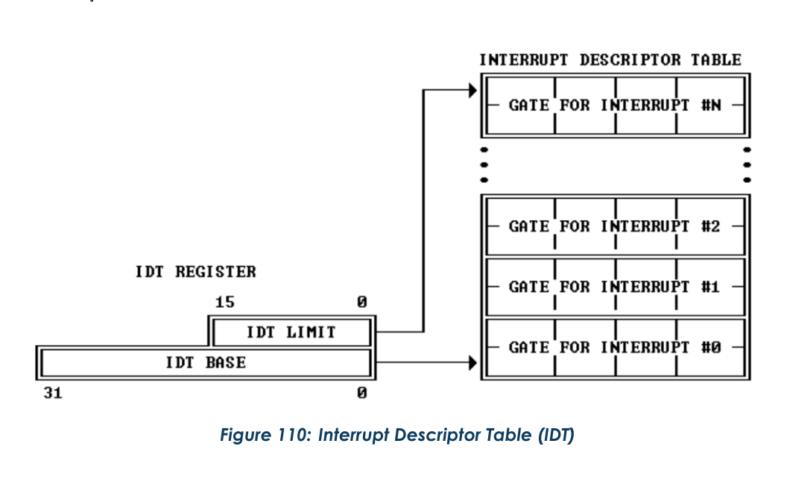


**En condiciones normales, el flujo sería el siguiente:**

```text
Interrupción hardware/software -> Consulta de la IDT -> ISR legítima -> Gestión normal del evento
```

En un escenario de IDT Hooking, un rootkit modifica una entrada de la IDT para que la interrupción no sea atendida directamente por la rutina legítima, sino por una rutina controlada por el propio rootkit. De esta forma, el malware puede situarse en un punto muy bajo del sistema y observar, modificar o interceptar determinados eventos antes de que sean procesados normalmente.

**El flujo manipulado podría representarse así:**

```text
Interrupción hardware/software -> IDT modificada -> Rutina del rootkit -> ISR legítima -> Resultado manipulado
```

Desde el punto de vista de un rootkit, esta técnica resulta especialmente interesante porque **permite interceptar eventos a nivel muy bajo**. Un ejemplo clásico es la interceptación de interrupciones relacionadas con el teclado. Si un rootkit consigue redirigir la rutina encargada de gestionar dichas interrupciones, podría registrar pulsaciones antes de que la información llegue a capas superiores del sistema operativo. Esta idea explica por qué el `IDT Hooking` se ha relacionado históricamente con técnicas como los **keyloggers en modo kernel**.

A diferencia de técnicas como `IAT Hooking` o `EAT Hooking`, que actúan en modo usuario sobre estructuras de procesos o bibliotecas dinámicas, el `IDT Hooking` opera en una capa mucho más privilegiada. Su ámbito natural es el modo kernel, ya que la `IDT` y las rutinas de interrupción forman parte de mecanismos internos críticos del sistema. Esto convierte la técnica en más potente, pero también en mucho más compleja y arriesgada.

El `IDT Hooking` también se diferencia del `SSDT Hooking`. Mientras que el `SSDT Hooking` se centra en interceptar llamadas al sistema, el `IDT Hooking` se centra en interceptar interrupciones. Es decir, no manipula directamente la tabla que relaciona servicios del sistema con rutinas del kernel, sino la tabla que permite al procesador saber qué rutina debe ejecutarse ante una interrupción determinada.

**La comparación puede resumirse así:**

```text
SSDT Hooking -> Intercepta llamadas al sistema.
IDT Hooking  -> Intercepta interrupciones hardware o software.
```

Esta técnica puede utilizarse con distintos objetivos maliciosos. Además de capturar eventos de teclado o ratón, podría emplearse para observar determinados comportamientos de bajo nivel, modificar el tratamiento de interrupciones concretas o interferir con el funcionamiento normal del sistema. Sin embargo, debido a la sensibilidad de la IDT, cualquier modificación incorrecta puede provocar inestabilidad, errores críticos o bloqueos del sistema.

> [!Note]
> Desde el punto de vista defensivo, **el `IDT Hooking` puede detectarse revisando la integridad de la `IDT` y comprobando si sus entradas apuntan a direcciones legítimas.** Una entrada sospechosa sería aquella que apunta a una región de memoria inesperada, a un driver desconocido, a código no firmado o a una dirección que no corresponde con la rutina legítima esperada. También pueden detectarse inconsistencias mediante análisis de memoria o depuración kernel en entornos controlados.


---------

**A continuación se realiza una práctica de laboratorio orientada a inspeccionar defensivamente la `Interrupt Descriptor Table` mediante WinDbg.** El objetivo no es modificar la `IDT` ni implementar un hook funcional, sino observar cómo se representan sus entradas en memoria, localizar rutinas ISR legítimas y comprender qué tipo de alteraciones podrían ser indicativas de un posible `IDT Hooking`:

Configuramos una sesión de depuración kernel con WinDbg sobre una máquina virtual Windows 11:

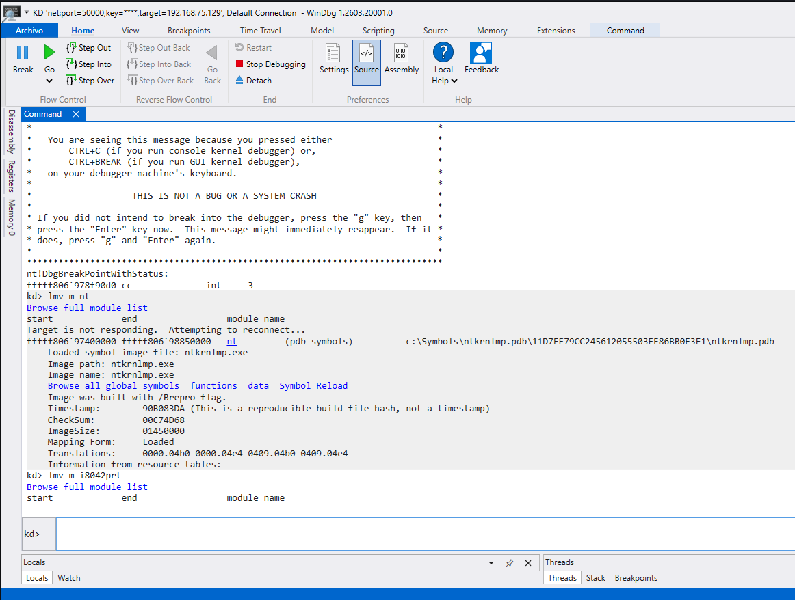


Una vez establecida la conexión, consultamos el registro `IDTR` mediante el comando `r idtr`, obteniendo la dirección base de la Interrupt Descriptor Table. Posteriormente, utilizamos el comando `!idt` para listar las entradas de la IDT. La salida mostró diferentes rutinas de servicio de interrupción asociadas al kernel de Windows, como `nt!KiDivideErrorFault`, `nt!KiDebugTrapOrFault`, `nt!KiNmiInterrupt`, `nt!KiPageFault` y `nt!KiDpcInterrupt`.

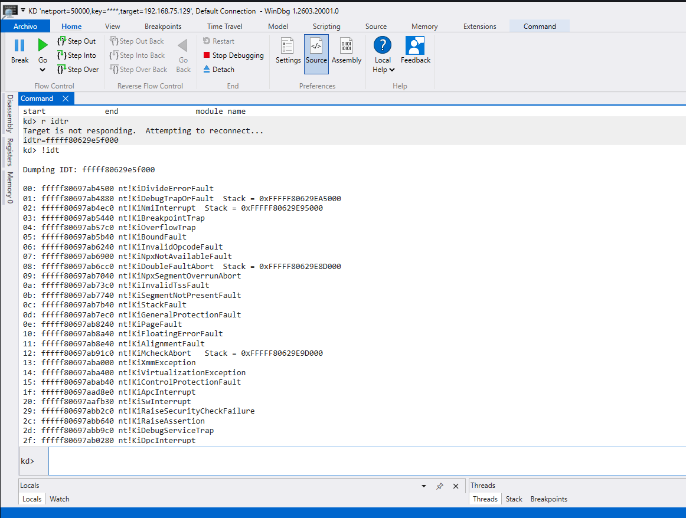

Todas las entradas observadas apuntan a rutinas legítimas del módulo `nt`, por lo que no se identifican indicios de `IDT Hooking` en la máquina analizada. En un escenario de compromiso, una entrada sospechosa podría apuntar a un driver desconocido, una región de memoria no asociada a módulos legítimos o una rutina ajena al kernel esperado.


Inicialmente, la máquina virtual no utilizaba `i8042prt.sys` para la gestión del teclado, probablemente debido al modelo de entrada empleado por Windows 11 en entornos virtualizados, como HID, USB, VMBus, APIC/MSI o drivers sintéticos del hipervisor.


----------------------

**Para forzar la carga de `i8042prt.sys`, se modificó la configuración de la máquina virtual con la VM apagada, retirando el controlador USB y arrancando de nuevo el sistema:**
- Vamos a Virtual Machine Settings.
- Seleccionamos USB Controller.
- Pulsamos Remove.
- Arrancamos Windows.
- En WinDbg ejecutamos:
    - .reload /f
    - lm m i8042prt
    - x i8042prt!*Interrupt*
    - !idt

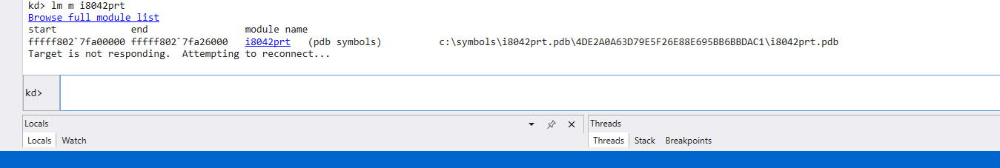

Ahora vemos que el driver `i8042prt.sys` está cargado en memoria y que además WinDbg ha encontrado sus símbolos. Ahora podemos intentar reproducir una salida parecida a la del manual del módulo, donde se muestra la `ISR i8042prt!I8042KeyboardInterruptService` dentro de la `IDT`. El manual explica que el `IDT Hooking` consiste en modificar entradas de la `IDT` para redirigir interrupciones hacia una rutina personalizada. En su ejemplo se localizan rutinas como `i8042prt!I8042KeyboardInterruptService`.


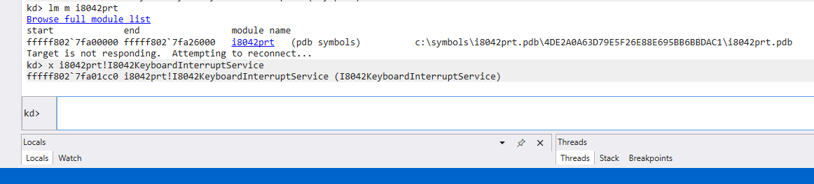

Vemos que la rutina:

```bash
i8042prt!I8042KeyboardInterruptService

```
existe en memoria en la dirección:

```bash
fffff802`7fa01cc0
```

La técnica de `IDT Hooking` se estudia localizando entradas de la `IDT` que apuntan a rutinas de interrupción, como `i8042prt!I8042KeyboardInterruptService`, y explicando que un rootkit podría redirigir esa entrada hacia una rutina personalizada.

-------------


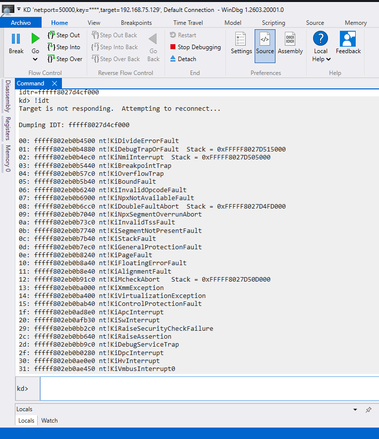


Vemos que nuestro Windows 11, aunque `i8042prt` está cargado, el manejo real de interrupciones puede pasar por otra ruta: Hyper-V/VMBus, APIC/MSI, VMware, HID, o rutinas genéricas del kernel. Por eso vemos:

```bash
nt!KiHvInterrupt
nt!KiVmbusInterrupt0
```

-------------------

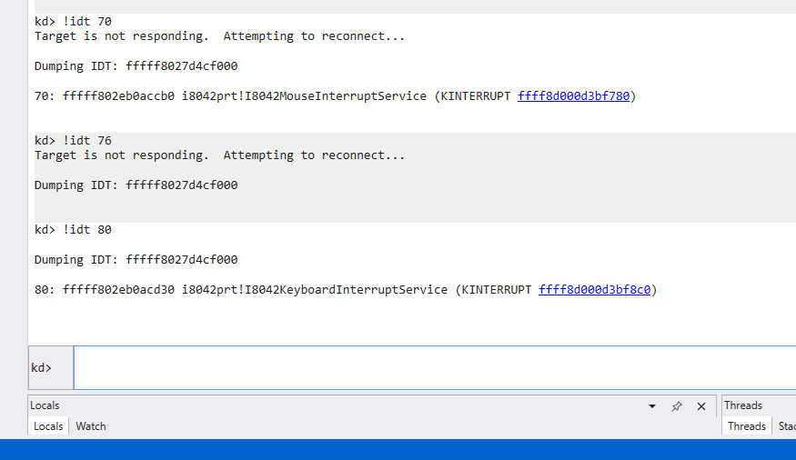

Vemos que la entrada 0x70 de la IDT apunta a la rutina legítima del ratón `PS/2`, y la entrada `0x80` de la IDT apunta a la rutina legítima del teclado `PS/2`. Es justo el caso que el manual usa para explicar IDT Hooking: localizar una entrada de la IDT asociada a `i8042prt!I8042KeyboardInterruptService` y entender que un rootkit podría modificar esa entrada para redirigir la interrupción hacia una rutina propia.


Hemos demostrado tres cosas importantes:
```bash
1. La IDT está localizada en memoria:
   IDTR = fffff802`7d4cf000

2. La entrada 0x70 apunta a:
   i8042prt!I8042MouseInterruptService

3. La entrada 0x80 apunta a:
   i8042prt!I8042KeyboardInterruptService
```

---------------------


--------------

### Conclusión de la inspección de la entrada `0x80` de la IDT

En esta parte de la práctica inspeccionamos la estructura interna de la entrada `0x80` de la *Interrupt Descriptor Table* mediante WinDbg. Previamente, se había identificado que dicha entrada apuntaba a la rutina `i8042prt!I8042KeyboardInterruptService`, asociada al manejo de interrupciones de teclado por parte del driver `i8042prt.sys`.

A partir de la dirección base de la `IDT` obtenida mediante el registro `IDTR`, calculamos la dirección correspondiente a la entrada `0x80` aplicando la fórmula:

```text
Dirección de la entrada = Base_IDT + (índice_interrupción * 0x10)
```

En este caso, la base de la `IDT` es fffff802\`7d4cf000, por lo que la entrada `0x80` se localiza en la dirección fffff802\`7d4cf800. Posteriormente, interceptamos dicha dirección como una estructura `_KIDTENTRY64`utilizando el comando `dt`.

La salida obtenida muestra los campos principales de la entrada, entre ellos `OffsetLow`, `OffsetMiddle` y `OffsetHigh`. Al combinar estos valores, se reconstruye la dirección de la rutina `ISR` asociada:

```text
OffsetHigh   = 0xfffff802
OffsetMiddle = 0xeb0a
OffsetLow    = 0xcd30

Dirección resultante = fffff802`eb0acd30
```

Esta dirección coincide con la rutina `i8042prt!I8042KeyboardInterruptService` mostrada anteriormente por el comando `!idt 80`. Por tanto, se confirma que la entrada `0x80` de la IDT apunta a una rutina legítima del driver `i8042prt.sys`.

Desde el punto de vista defensivo, esta comprobación permite entender cómo puede verificarse la integridad de una entrada concreta de la IDT. En un escenario normal, como el observado en esta práctica, la entrada apunta a una rutina esperada y perteneciente a un driver legítimo. En cambio, en un posible caso de `IDT Hooking`, sería sospechoso que los campos de la estructura `_KIDTENTRY64` reconstruyeran una dirección distinta, asociada a un driver desconocido, a una región de memoria no atribuible a ningún módulo legítimo o a una rutina no esperada.


--------------------


### Conclusiones de la práctica sobre IDT Hooking
Durante la práctica se inspeccionó la *Interrupt Descriptor Table* o `IDT` de una máquina virtual Windows mediante WinDbg, con el objetivo de comprender cómo se representan las rutinas de servicio de interrupción en memoria y cómo podría identificarse una posible manipulación compatible con IDT Hooking.

En primer lugar, se estableció una sesión de depuración kernel con WinDbg y se comprobó la carga de símbolos del sistema. Posteriormente, se consultó el registro `IDTR` mediante el comando `r idtr`, obteniendo la dirección base de la IDT. A partir de esta dirección, se utilizó el comando `!idt` para listar las entradas de la tabla y observar las rutinas asociadas a diferentes interrupciones.

Inicialmente, las entradas visibles de la `IDT` apuntaban principalmente a rutinas legítimas del kernel de Windows, como `nt!KiDivideErrorFault`, `nt!KiDebugTrapOrFault`, `nt!KiHvInterrupt` o `nt!KiVmbusInterrupt0`. En ese primer momento no se observaba una entrada directa hacia `i8042prt!I8042KeyboardInterruptService`, lo que podía explicarse por el entorno virtualizado y por el modelo de interrupciones utilizado por Windows 11, donde pueden intervenir mecanismos como Hyper-V, VMBus, APIC/MSI o drivers sintéticos.

Tras modificar la configuración de la máquina virtual, se consiguió cargar correctamente el driver `i8042prt.sys`, comprobándolo con el comando `lm m i8042prt`. WinDbg mostró el rango de memoria del módulo y cargó sus símbolos correctamente. Además, mediante el comando `x i8042prt!I8042KeyboardInterruptService`, se localizó la rutina `i8042prt!I8042KeyboardInterruptService` en memoria.

Una vez cargado el driver, se analizaron entradas concretas de la `IDT` mediante los comandos `!idt 70` y `!idt 80`. La entrada `0x70` apuntaba a `i8042prt!I8042MouseInterruptService`, mientras que la entrada `0x80` apuntaba a `i8042prt!I8042KeyboardInterruptService`. Este resultado permitió reproducir el escenario descrito en el material del módulo, donde las interrupciones asociadas al ratón y al teclado pueden estar vinculadas a rutinas del driver `i8042prt.sys`.

Es importante destacar que **durante la práctica no se modificó ninguna entrada de la `IDT`.** El objetivo fue exclusivamente defensivo y consistió en observar el funcionamiento legítimo de la tabla, identificar sus entradas y comprender qué tipo de alteraciones podrían considerarse sospechosas. En un escenario real de IDT Hooking, un rootkit podría modificar una entrada de la IDT para redirigir una interrupción hacia una rutina propia, en lugar de permitir que fuese gestionada por la rutina legítima del sistema.

Desde el punto de vista defensivo, una entrada legítima de la `IDT` debería apuntar a rutinas esperadas del kernel o de drivers conocidos y confiables. Por el contrario, sería sospechoso que una entrada apuntase a un driver desconocido, una región de memoria no asociada a ningún módulo legítimo, una dirección fuera de los rangos esperados o una rutina no coherente con la interrupción gestionada.

La práctica permitió comprobar que la inspección de la `IDT` con WinDbg es útil para entender la lógica de esta técnica. Aunque no se observó un hook malicioso, sí se pudo identificar el punto que un rootkit intentaría manipular: la relación entre una entrada de la IDT y la rutina ISR encargada de gestionar una interrupción concreta.


--------------

## 4.5. SSDT Hooking

El **SSDT Hooking** es una técnica clásica de hooking en modo kernel que consiste en manipular la **System Service Descriptor Table** o `SSDT` de Windows. Esta tabla contiene referencias a funciones internas del kernel encargadas de atender determinadas llamadas del sistema realizadas desde modo usuario. Por este motivo, históricamente ha sido un objetivo especialmente atractivo para rootkits que buscaban interceptar operaciones sensibles a un nivel profundo del sistema operativo.

En Windows, muchas acciones ejecutadas por aplicaciones en modo usuario terminan invocando servicios del sistema. Por ejemplo, abrir un archivo, crear un proceso, consultar información del sistema, enumerar claves de registro o interactuar con determinados objetos del sistema requiere pasar del modo usuario al modo kernel. La `SSDT` participa en este mecanismo al permitir que el sistema localice qué rutina del kernel debe atender cada servicio solicitado.

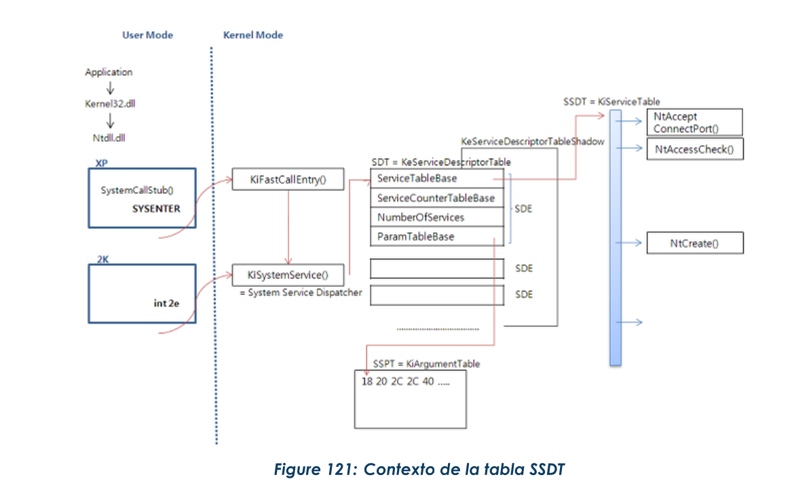


**En un flujo normal, una aplicación realiza una operación mediante una API de Windows. Esa operación puede llegar a una llamada del sistema y, finalmente, a la rutina correspondiente del kernel:**

```text
Aplicación en user mode -> API de Windows -> Llamada al sistema -> SSDT -> Rutina legítima del kernel
```

En un escenario de `SSDT Hooking`, un rootkit modifica una entrada de la `SSDT` para que, en lugar de apuntar a la rutina legítima del kernel, apunte a una rutina controlada por el propio rootkit. De esta forma, cuando una aplicación solicita un servicio determinado, la ejecución puede pasar primero por el código del rootkit.

**El flujo manipulado podría representarse así:**

```text
Aplicación en user mode -> API de Windows -> Llamada al sistema -> SSDT modificada -> Rutina del rootkit -> Rutina legítima del kernel
```

Esta técnica permite al rootkit situarse en una posición privilegiada para observar, modificar o filtrar operaciones del sistema. Por ejemplo, podría interceptar una llamada relacionada con la enumeración de procesos y eliminar de la respuesta aquellos procesos que desea ocultar. También podría manipular consultas al sistema de archivos, al registro de Windows o a información general del sistema para impedir que herramientas de análisis o administración detecten determinados artefactos maliciosos.

El `SSDT Hooking` fue especialmente relevante en rootkits clásicos porque permitía afectar a múltiples aplicaciones al mismo tiempo. Si varias herramientas dependían de la misma llamada del sistema para obtener información, todas podían recibir una respuesta manipulada desde un único punto de interceptación. Esto hacía que la ocultación fuese más profunda que en técnicas limitadas a un proceso concreto, como el `IAT Hooking`.

Sin embargo, esta técnica también implica **riesgos importantes.** La `SSDT` es una estructura crítica del sistema operativo. Cualquier modificación incorrecta puede **provocar inestabilidad, errores graves o bloqueos del sistema.** Además, al operar en modo kernel, el rootkit necesita ejecutar código con privilegios elevados, normalmente mediante un driver o un componente cargado en el núcleo del sistema.

Con la evolución de Windows, el `SSDT Hooking` se ha vuelto mucho menos viable en sistemas modernos, especialmente en arquitecturas de `64 bits`. Microsoft introdujo mecanismos de protección como **PatchGuard**, cuyo objetivo es detectar modificaciones no autorizadas en estructuras críticas del kernel. Entre los elementos protegidos se encuentran precisamente estructuras como la `SSDT`, determinadas regiones de código del kernel y otros componentes sensibles. Si PatchGuard detecta una alteración no permitida, puede provocar un **bloqueo del sistema para impedir que continúe ejecutándose en un estado comprometido.**

Además de PatchGuard, otras protecciones como **Driver Signature Enforcement, Secure Boot y Virtualization Based Security** dificultan la carga de drivers maliciosos o no autorizados y reducen las oportunidades de manipular el kernel de forma directa. Por este motivo, aunque el `SSDT Hooking` es una técnica fundamental para comprender la historia de los rootkits en Windows, en la actualidad suele estudiarse más como técnica clásica o como referencia conceptual que como método práctico ampliamente viable en sistemas actualizados.

> [!Note]
> Desde el punto de vista defensivo, **la detección de `SSDT Hooking` puede basarse en la verificación de la integridad de la tabla y en la comprobación de que sus entradas apuntan a direcciones legítimas dentro del rango esperado del kernel.** Si una entrada de la `SSDT` apunta a una región de memoria externa, a un driver desconocido o a una dirección no coherente con el sistema, podría ser un indicio de manipulación. También pueden utilizarse técnicas de análisis de memoria para comparar el estado real del sistema con el estado esperado.


--------------


## 4.6. IRP Hooking

El **IRP Hooking** es una técnica de hooking en modo kernel relacionada con el sistema de entrada/salida de Windows. `IRP` significa **I/O Request Packet**, es decir, paquete de solicitud de entrada/salida. En Windows, los `IRP` son estructuras utilizadas por el sistema operativo para representar operaciones dirigidas a drivers y dispositivos, como lecturas, escrituras, consultas, aperturas, cierres o controles específicos sobre un dispositivo.

Cuando una aplicación realiza una operación sobre un archivo, un dispositivo, una unidad de almacenamiento, una interfaz de red u otro recurso gestionado por un driver, Windows genera solicitudes que son procesadas por la pila de drivers correspondiente. Cada driver dispone de rutinas encargadas de atender distintos tipos de operaciones. El `IRP` viaja a través de esa pila hasta que es procesado y se devuelve una respuesta al componente solicitante.

**En condiciones normales, el flujo puede representarse de la siguiente manera:**

```text id="cdq9fz"
Aplicación -> Solicitud de E/S -> Sistema operativo -> IRP -> Driver legítimo -> Respuesta legítima
```

En un escenario de `IRP Hooking`, un rootkit intenta interceptar o modificar el tratamiento de esos paquetes de entrada/salida. Para ello, puede manipular las rutinas de despacho de un driver o situarse en la pila de drivers para observar y alterar las operaciones que pasan por ella. De este modo, el rootkit puede controlar cómo se responden determinadas solicitudes relacionadas con archivos, dispositivos, volúmenes, red u otros recursos del sistema.

**El flujo manipulado podría representarse así:**

```text id="9uggp8"
Aplicación -> Solicitud de E/S -> Sistema operativo -> IRP -> Hook del rootkit -> Driver legítimo -> Respuesta manipulada
```

Esta técnica resulta especialmente relevante porque muchas evidencias de actividad maliciosa pasan por operaciones de entrada/salida. Por ejemplo, un rootkit podría intentar ocultar archivos interceptando solicitudes dirigidas al sistema de archivos, modificar respuestas relacionadas con dispositivos, filtrar información obtenida desde un volumen o alterar determinadas operaciones para impedir que una herramienta de análisis acceda correctamente a ciertos artefactos.

A diferencia del `SSDT Hooking`, que se centra en la interceptación de llamadas del sistema mediante la manipulación de una tabla concreta, el `IRP Hooking` se relaciona con el modelo de drivers y la gestión de solicitudes de entrada/salida. Su ámbito natural es el kernel, ya que los drivers operan con privilegios elevados y participan directamente en la comunicación entre el sistema operativo y el hardware o los dispositivos lógicos.

En el contexto de los rootkits, el `IRP Hooking` puede emplearse para distintos objetivos. Uno de los más habituales es la ocultación de archivos o directorios. Si una herramienta solicita listar el contenido de una carpeta, la operación puede traducirse en solicitudes gestionadas por drivers del sistema de archivos. Un rootkit que intercepte estas solicitudes podría filtrar determinados nombres antes de que la respuesta llegue a la herramienta. De forma similar, podría intentar manipular operaciones relacionadas con dispositivos, unidades o comunicaciones para dificultar la detección de su actividad.

También puede utilizarse para interferir con herramientas de análisis. Si una utilidad forense intenta leer determinados sectores, acceder a un dispositivo o consultar información gestionada por un driver, un rootkit situado en la ruta de entrada/salida podría alterar la respuesta o impedir que la operación se complete correctamente. Esto puede generar una visión incompleta del sistema comprometido y dificultar la identificación de componentes maliciosos.

Sin embargo, el `IRP Hooking` también presenta riesgos y limitaciones. La pila de drivers de Windows es compleja y sensible a errores. Una manipulación incorrecta de solicitudes de entrada/salida puede provocar fallos, pérdida de estabilidad, bloqueos del sistema o comportamientos anómalos visibles para el usuario. Además, los sistemas modernos incorporan mecanismos de protección y verificación que dificultan la carga de drivers maliciosos o no autorizados.

> [!Note]
> Desde el punto de vista defensivo, **la detección de `IRP Hooking` puede basarse en el análisis de la integridad de los drivers cargados, la revisión de rutinas de despacho, la identificación de punteros que apunten a regiones de memoria sospechosas y la comparación entre el comportamiento esperado y el comportamiento observado.** Si una rutina asociada a un driver legítimo apunta a un módulo desconocido o a una región de memoria no coherente, puede existir un indicio de manipulación.

También resulta útil contrastar la información obtenida desde distintas capas. Por ejemplo, si una herramienta ejecutada dentro del sistema no muestra determinados archivos, pero un análisis offline del disco sí los identifica, podría sospecharse de una manipulación en la ruta de entrada/salida. Del mismo modo, discrepancias entre eventos del sistema, operaciones registradas, actividad de drivers y resultados visibles para el usuario pueden indicar que alguna capa está filtrando o modificando información.


--------------

## 4.7. DKOM como técnica relacionada

`DKOM`, siglas de **Direct Kernel Object Manipulation**, es una técnica relacionada con los rootkits en modo kernel que consiste en manipular directamente objetos y estructuras internas del núcleo de Windows. Aunque no se considera una técnica de hooking en sentido estricto, se estudia habitualmente junto a ellas porque persigue objetivos similares: ocultar información, alterar la visibilidad del sistema y dificultar la detección de componentes maliciosos.

A diferencia del hooking clásico, donde se intercepta una función, una tabla de direcciones o una rutina para modificar el flujo de ejecución, `DKOM` no necesita redirigir llamadas ni instalar una función intermedia. En su lugar, modifica directamente las estructuras de datos que el sistema operativo utiliza para representar procesos, hilos, drivers, tokens de seguridad u otros objetos internos.

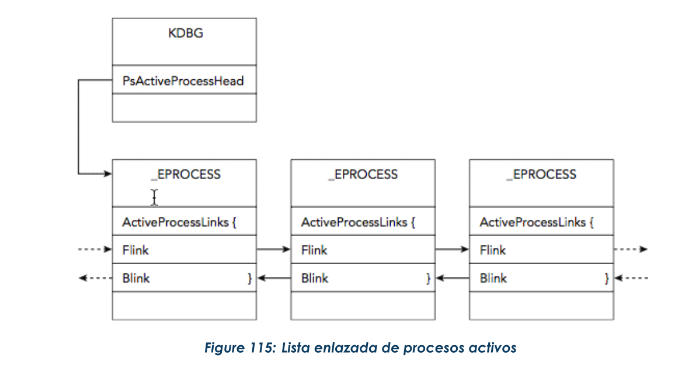


**La diferencia conceptual puede resumirse de la siguiente manera:**

```text
Hooking:

Herramienta -> Función interceptada -> Resultado manipulado
```

```text
DKOM:

Estructura interna del kernel modificada -> El sistema muestra una visión alterada
```

En el contexto de un rootkit, **`DKOM` puede utilizarse para ocultar procesos, modificar privilegios, alterar listas internas o manipular referencias a objetos del kernel.** Por ejemplo, Windows mantiene estructuras internas para gestionar los procesos activos. Si un rootkit modifica determinados enlaces o referencias dentro de esas estructuras, puede conseguir que un proceso deje de aparecer en ciertas enumeraciones, aunque continúe ejecutándose realmente en el sistema.

Una de las características más relevantes de `DKOM` es que no depende necesariamente de interceptar una API concreta. Esto lo diferencia de técnicas como `IAT Hooking`, `EAT Hooking`, `Inline Hooking` o `SSDT Hooking`, que actúan sobre puntos específicos del flujo de ejecución. En `DKOM`, la manipulación se produce directamente sobre la representación interna del sistema. Por este motivo, puede resultar especialmente difícil de detectar si las herramientas de análisis confían únicamente en las estructuras manipuladas.

**Un ejemplo conceptual sería el siguiente:**

```text
Estado real:

Proceso A -> Proceso B -> Proceso C -> Proceso D
```

Si un rootkit quisiera ocultar el `Proceso C` mediante manipulación directa de objetos, podría alterar las referencias internas para que determinadas enumeraciones saltaran de `B` a `D`:

```text
Estado manipulado:

Proceso A -> Proceso B -> Proceso D
```

En este escenario, el `Proceso C` no ha sido eliminado. Sigue existiendo, puede continuar ejecutándose y consumiendo recursos, pero determinadas herramientas podrían no mostrarlo porque la estructura utilizada para enumerar procesos ha sido alterada.

`DKOM` también puede utilizarse para alterar tokens de seguridad, modificar privilegios asociados a un proceso, ocultar drivers cargados o interferir en la forma en la que el sistema representa ciertos objetos. Estas capacidades hacen que la técnica sea especialmente peligrosa, ya que actúa sobre elementos fundamentales del funcionamiento interno del sistema operativo.

No obstante, **`DKOM` presenta riesgos importantes para el atacante.** Las estructuras internas del kernel son complejas, cambian entre versiones de Windows y no siempre están documentadas públicamente. Una modificación incorrecta puede provocar inestabilidad, corrupción de memoria, errores críticos o bloqueos del sistema. Además, las versiones modernas de Windows incorporan mecanismos de protección e integridad que dificultan la manipulación directa de determinados elementos del kernel.

> [!Note]
> Desde el punto de vista defensivo, **la detección de `DKOM` suele basarse en la búsqueda de inconsistencias entre diferentes fuentes de información.** Por ejemplo, un proceso podría no aparecer en una lista convencional, pero sí detectarse mediante análisis de memoria, hilos activos, handles, objetos referenciados, consumo de recursos o actividad de red. Estas discrepancias pueden indicar que una estructura interna ha sido manipulada para ocultar información.

También pueden emplearse técnicas de análisis forense de memoria para reconstruir objetos del kernel sin depender exclusivamente de las listas o referencias que podrían haber sido alteradas. En lugar de confiar únicamente en la enumeración normal del sistema, el analista puede buscar artefactos en memoria que revelen la existencia de procesos, drivers u objetos que no aparecen por los mecanismos habituales.

-------------------------

**Ejemplo que implementa la técnica: DKOM: Direct Kernel Object Manipulation**

Usaremos el archivo [Script002_Manipulating_ActiveProcessLinks_Hide_Processes.wds](https://github.com/TheMalwareGuardian/WinDbg_Scripting/blob/main/ScriptsHelloWorld/Classic/Script002_Manipulating_ActiveProcessLinks_Hide_Processes.wds) que se ejecuta desde WinDbg/KD y recibe como argumento la dirección de una estructura EPROCESS. Su objetivo es sacar ese proceso de la lista doblemente enlazada ActiveProcessLinks.


El archivo `Script002_Manipulating_ActiveProcessLinks_Hide_Processes.wds` implementa una técnica clara de ocultación de procesos mediante `DKOM`. Demuestra una alternativa al hooking: en vez de interceptar la información cuando se consulta, modifica directamente la estructura que contiene esa información.

La idea es:
```bash
Proceso anterior <-> Proceso objetivo <-> Proceso siguiente
```

Después de aplicar la modificación:
```bash
Proceso anterior <-> Proceso siguiente
```

El proceso objetivo no termina. Sigue ejecutándose, pero deja de aparecer en muchas enumeraciones que recorren la lista de procesos activos.


El script muestra de forma bastante clara la lógica de DKOM aplicada a la ocultación de procesos:
- Trabaja sobre la estructura _EPROCESS,
- localiza el campo ActiveProcessLinks,
- obtiene los punteros Flink y Blink,
- modifica la lista doblemente enlazada para desvincular el proceso objetivo,
- deja el proceso oculto fuera de la enumeración normal de procesos.

Es decir, demuestra exactamente la idea central de DKOM: **no interceptar funciones ni hacer hooking, sino modificar directamente una estructura interna del kernel para alterar la visibilidad del sistema.**

---------------------------

**Práctica de laboratorio: Demostración de DKOM mediante ocultación de procesos**

Como parte práctica complementaria, ejecutamos el script de WinDbg orientado a manipular la lista `ActiveProcessLinks` de una estructura `_EPROCESS`.
El objetivo de esta práctica es demostrar una técnica de *Direct Kernel Object Manipulation* (DKOM) aplicada a la ocultación de procesos.

A diferencia del hooking, esta técnica no intercepta funciones ni modifica el flujo de ejecución del sistema. En su lugar, altera directamente una
estructura interna del kernel para eliminar un proceso de la lista de procesos activos. En concreto, el script obtiene los enlaces `Flink` y `Blink` del proceso objetivo y reencadena la lista doblemente enlazada para que el nodo correspondiente quede fuera de la enumeración normal.

Como resultado, el proceso puede dejar de aparecer en herramientas que dependen de la lista `ActiveProcessLinks`, aunque siga existiendo y ejecutándose en el sistema. Esto demuestra cómo DKOM puede utilizarse con fines de ocultación sin necesidad de instalar hooks sobre funciones del sistema.


---------------------------


Ejecutamos el proceso en la MV de destino:
```bash
Start-Process mspaint
```

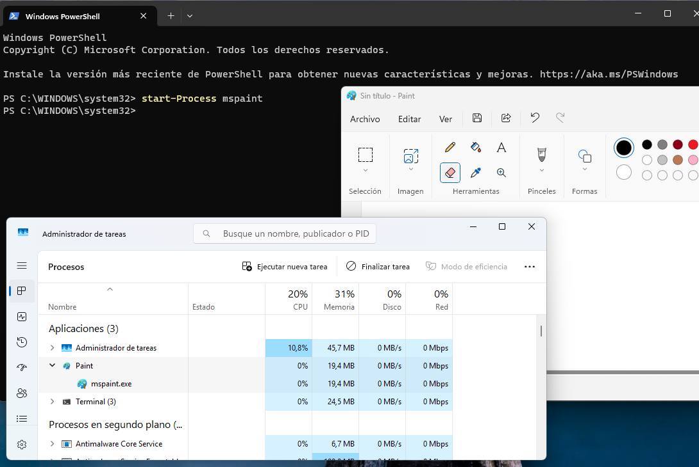

----------------------------

Listamos todos los procesos desde WinDbg en la MV analista: En WinDbg, estando en kd>, ejecutamos:

```bash
!process 0 0
```

Se listarán los procesos activos. Buscamos el nombre del proceso, mspaint.exe:


```bash
PROCESS ffffe68745197080
    SessionId: none  Cid: 1ce0    Peb: a6e594000  ParentCid: 2088
    DirBase: 1582b7000  ObjectTable: ffffd50147b1b8c0  HandleCount: 736.
    Image: mspaint.exe
```


La dirección de EPROCESS de mspaint.exe es:

```bash
ffffe68745197080
```

Y el PID/CID es:

```bash
1ce0
```

En decimal sería:

```bash
7392
```

Para ejecutar el script no necesitamoss el `PID`, necesitamos la dirección `EPROCESS`.

------------------------------


```bash
kd> dt nt!_EPROCESS ffffe68745197080 UniqueProcessId ImageFileName ActiveProcessLinks
   +0x1d0 UniqueProcessId    : 0x00000000`00001ce0 Void
   +0x1d8 ActiveProcessLinks : _LIST_ENTRY [ 0xffffe687`46b80258 - 0xffffe687`45cd6258 ]
   +0x338 ImageFileName      : [15]  "mspaint.exe"
```


La parte importante es:
```bash
+0x1d8 ActiveProcessLinks : _LIST_ENTRY [ 0xffffe687`46b80258 - 0xffffe687`45cd6258 ]

```

Eso significa:
```bash
Flink = 0xffffe687`46b80258   -> siguiente proceso en la lista
Blink = 0xffffe687`45cd6258   -> proceso anterior en la lista
```

Como `ActiveProcessLinks` está en el `offset 0x1d8`, podemo calcular las estructuras `_EPROCESS` del proceso siguiente y anterior restando ese offset:

```bash
Siguiente EPROCESS = 0xffffe687`46b80258 - 0x1d8
                   = 0xffffe687`46b80080

Anterior EPROCESS  = 0xffffe687`45cd6258 - 0x1d8
                   = 0xffffe687`45cd6080
```


-------------------------------------


Ahora podemos comprobar qué procesos son:
```bash
kd> dt nt!_EPROCESS ffffe687`46b80080 UniqueProcessId ImageFileName ActiveProcessLinks
   +0x1d0 UniqueProcessId    : 0x00000000`00000774 Void
   +0x1d8 ActiveProcessLinks : _LIST_ENTRY [ 0xffffe687`44a95258 - 0xffffe687`45197258 ]
   +0x338 ImageFileName      : [15]  "svchost.exe"


kd> dt nt!_EPROCESS ffffe687`45cd6080 UniqueProcessId ImageFileName ActiveProcessLinks
Target is not responding.  Attempting to reconnect...
   +0x1d0 UniqueProcessId    : 0x00000000`00000a70 Void
   +0x1d8 ActiveProcessLinks : _LIST_ENTRY [ 0xffffe687`45197258 - 0xffffe687`456e0258 ]
   +0x338 ImageFileName      : [15]  "RuntimeBroker."
```

WinDbg muestra `RuntimeBroker.` porque el campo `ImageFileName` de `_EPROCESS` tiene longitud limitada y puede aparecer truncado.

Antes de aplicar la manipulación DKOM, hemos inspeccionado la estructura `_EPROCESS` del proceso `mspaint.exe`. El campo `ActiveProcessLinks`, ubicado en el offset `0x1d8`, contenía los punteros `Flink` y `Blink` de la lista doblemente enlazada de procesos activos.

El puntero `Flink` apuntaba a `0xffffe68746b80258`, que al restar el offset `0x1d8` correspondía al proceso `svchost.exe`. El puntero `Blink` apuntaba a `0xffffe68745cd6258`, que al restar el mismo offset correspondía al proceso `RuntimeBroker`.

Esto confirma que, antes de la manipulación, `mspaint.exe` se ecuentra correctamente enlazado entre `RuntimeBroker` y `svchost` dentro de la lista
`ActiveProcessLinks`.


--------------


Ahora ejecutamos el script pasando la dirección EPROC``ESS de `mspaint.exe`:

```bash
kd> $$>a<C:\Malware\Script002_Manipulating_ActiveProcessLinks_Hide_Processes.wds ffffe68745197080
=========================================================
 TARGET PROCESS
=========================================================
[+] EPROCESS               : 
ffffe68745197080
[+] PID                    : Target is not responding.  Attempting to reconnect...
7392 (0x1ce0)
[+] Image name             : mspaint.exe
[+] ActiveProcessLinks @   : ffffe68745197258  (EPROCESS + 0x1d8)

=========================================================
 ACTIVE PROCESS LINKS (BEFORE)
=========================================================
[+] Target  ActiveProcessLinks : ffffe68745197258
[+] Target  Flink              : ffffe68746b80258
[+] Target  Blink              : ffffe68745cd6258

=========================================================
 SURROUNDING NODES
=========================================================
[+] Prev node ActiveProcessLinks : ffffe68745cd6258
[+] Prev node EPROCESS           : ffffe68745cd6080
[+] Prev node PID                : 2672 (0xa70)
[+] Prev node Image name         : RuntimeBroker.
[+] Next node ActiveProcessLinks : ffffe68746b80258
[+] Next node EPROCESS           : ffffe68746b80080
[+] Next node PID                : 1908 (0x774)
[+] Next node Image name         : svchost.exe

=========================================================
 PATCH APPLIED
=========================================================
[+] Written: prev_node.Flink @ ffffe68745cd6258 -> ffffe68746b80258
[+] Written: next_node.Blink @ ffffe68746b80260 -> ffffe68745cd6258
[+] Self-loop: target.Flink @ ffffe68745197258 -> ffffe68745197258
[+] Self-loop: target.Blink @ ffffe68745197260 -> ffffe68745197258

=========================================================
 VERIFICATION (AFTER)
=========================================================
[+] prev_node.Flink : ffffe68746b80258  (expected: ffffe68746b80258)
[+] next_node.Blink : ffffe68745cd6258  (expected: ffffe68745cd6258)

=========================================================
 [+] SUCCESS: EPROCESS unlinked from ActiveProcessLinks
     PID 7392 (mspaint.exe) is now hidden from userland APIs
=========================================================
```

Vemos que el proceso ya no aparece en el administrador de tareas:

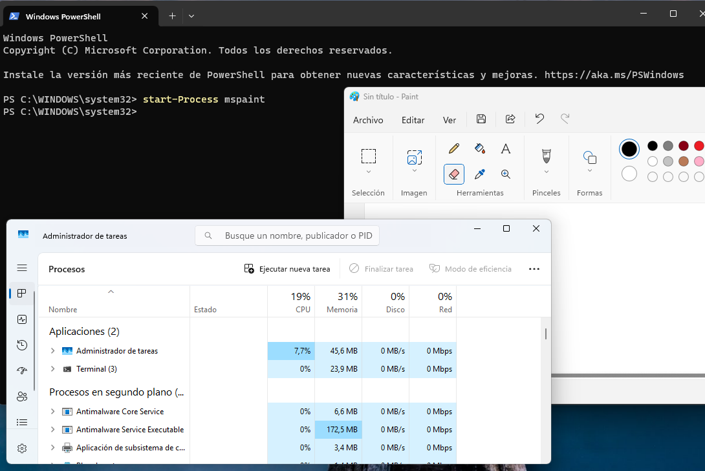


En esta fase se ejecuta el script de WinDbg sobre la estructura `EPROCESS` correspondiente al proceso `mspaint.exe`, localizada en la dirección `ffffe68745197080`. El proceso tenía como identificador `PID 7392`, equivalente a `0x1ce0`, y su campo `ActiveProcessLinks` se encontraba en la dirección `ffffe68745197258`.

Antes de la modificación, el proceso `mspaint.exe` estaba enlazado entre dos procesos vecinos dentro de la lista doblemente enlazada de procesos activos: `RuntimeBroker` como nodo anterior y `svchost.exe` como nodo siguiente.

El script modificó los punteros de la lista para que el nodo anterior apuntara directamente al nodo siguiente y viceversa. En concreto, se actualizó `prev_node.Flink` para que apuntara a `svchost.exe`, y `next_node.Blink` para que apuntara a `RuntimeBroker`. De este modo, el proceso `mspaint.exe` quedó desvinculado de `ActiveProcessLinks`.

Además, el script estableció un autoenlace en el propio proceso objetivo, haciendo que sus campos `Flink` y `Blink` apuntaran a su propia entrada `ActiveProcessLinks`. Esta operación confirma que el proceso ha sido aislado de la lista principal sin ser finalizado.

La verificación posterior mostró que los punteros del proceso anterior y del proceso siguiente contenían los valores esperados, por lo que la desvinculación es correcta.

**Esta práctica demuestra el funcionamiento de DKOM aplicado a la ocultación de procesos**: no se interceptan funciones ni llamadas del sistema, sino que se manipula directamente una estructura interna del kernel para alterar la visibilidad del proceso.


--------------

# 5. Hooking en modo usuario

El hooking en modo usuario, o **user mode hooking**, consiste en interceptar funciones, APIs o flujos de ejecución dentro del espacio de memoria de un proceso que se ejecuta con privilegios de usuario. A diferencia del hooking en modo kernel, este tipo de técnica no actúa directamente sobre el núcleo del sistema operativo ni sobre estructuras críticas del kernel, sino sobre procesos, bibliotecas dinámicas y funciones accesibles desde aplicaciones convencionales.

En Windows, la mayoría de programas interactúan con el sistema operativo a través de APIs proporcionadas por bibliotecas dinámicas como `kernel32.dll`, `user32.dll`, `advapi32.dll`, `ws2_32.dll` o `ntdll.dll`. Estas bibliotecas ofrecen funciones para crear procesos, acceder a archivos, consultar el registro, establecer comunicaciones de red o solicitar información del sistema. Si un rootkit consigue interceptar algunas de estas funciones dentro de un proceso concreto, puede modificar la información que dicho proceso recibe o alterar su comportamiento.

**El flujo normal de una llamada en modo usuario podría representarse así:**

```text
Aplicación -> API de Windows -> Resultado legítimo
```

**En presencia de hooking en modo usuario, el flujo se modifica:**

```text
Aplicación -> Hook en user mode -> API de Windows -> Resultado filtrado o manipulado
```

Este tipo de hooking puede utilizarse para ocultar información a herramientas concretas. Por ejemplo, si una utilidad de análisis solicita una lista de procesos, archivos o claves de registro utilizando una API determinada, el rootkit podría interceptar esa función y eliminar de la respuesta los elementos que desea ocultar. Desde la perspectiva de la herramienta, la llamada se habría ejecutado correctamente, aunque la información devuelta estaría incompleta.

Entre las técnicas más habituales de hooking en modo usuario se encuentran el ***IAT Hooking***, el **EAT Hooking** y el **Inline Hooking**. El `IAT Hooking` modifica la tabla de importaciones de un proceso para redirigir llamadas a funciones importadas. El `EAT Hooking` altera la tabla de exportaciones de una biblioteca para modificar la dirección que reciben otros componentes al resolver funciones dinámicamente. El `Inline Hooking`, por su parte, modifica directamente las instrucciones iniciales de una función cargada en memoria para redirigir el flujo hacia una rutina intermedia.

Una de las principales ventajas del hooking en modo usuario es que suele ser **más sencillo de implementar y menos arriesgado para la estabilidad global del sistema** que las técnicas en modo kernel. Al actuar sobre procesos concretos, un fallo puede afectar únicamente al proceso manipulado y no necesariamente provocar un bloqueo completo del sistema operativo. Además, permite al atacante centrarse en herramientas específicas, como administradores de tareas, exploradores de archivos, editores de registro o utilidades de análisis.

Sin embargo, esta misma característica también constituye **una limitación. El alcance del hooking en modo usuario suele estar restringido al proceso afectado.** Si el rootkit modifica la memoria de una herramienta concreta, otras aplicaciones que consulten la información por vías distintas podrían obtener resultados diferentes. Esto puede generar discrepancias útiles para la detección. Por ejemplo, una herramienta podría no mostrar un proceso sospechoso, mientras que otra, basada en mecanismos diferentes, sí podría identificarlo.

Otra limitación importante es que el **user mode se encuentra más expuesto al análisis.** Las modificaciones en memoria, los módulos inyectados, las tablas de importación alteradas o las funciones con instrucciones iniciales modificadas pueden ser detectadas mediante herramientas de análisis de procesos, comparación entre memoria y disco, revisión de módulos cargados o verificación de direcciones sospechosas.

> [!Note]
> Desde el punto de vista defensivo, **el análisis del hooking en modo usuario puede incluir varias comprobaciones. Una de ellas consiste en revisar si las direcciones de la `IAT` apuntan a los módulos esperados. Otra es comprobar si las funciones exportadas por una `DLL` han sido alteradas o si el comienzo de una función contiene saltos inesperados hacia regiones de memoria anómalas. También es útil comparar el contenido de las `DLL` cargadas en memoria con sus versiones legítimas en disco.**


--------------

# 6. Hooking en modo kernel

El hooking en modo kernel, o **kernel mode hooking**, consiste en interceptar o modificar el flujo de ejecución dentro del núcleo del sistema operativo o en componentes que se ejecutan con privilegios elevados, como los drivers. A diferencia del hooking en modo usuario, que afecta principalmente a procesos concretos, el **hooking en modo kernel puede influir en el comportamiento global del sistema, ya que opera en una capa más profunda y privilegiada de Windows.**

En Windows, el kernel es responsable de gestionar procesos, memoria, hilos, sistema de archivos, red, dispositivos, seguridad y comunicación con el hardware. Los drivers también se ejecutan habitualmente en este nivel y actúan como intermediarios entre el sistema operativo y distintos dispositivos o recursos lógicos. Por este motivo, cualquier modificación en modo kernel puede tener un impacto muy amplio sobre la visibilidad, estabilidad y seguridad del sistema.

Desde la perspectiva de un rootkit, el modo kernel resulta especialmente atractivo porque permite manipular información antes de que llegue a las aplicaciones en modo usuario. Si un rootkit consigue interceptar una operación en esta capa, puede alterar la respuesta que recibirán múltiples herramientas al mismo tiempo. Por ejemplo, puede ocultar procesos, archivos, claves de registro, módulos cargados, conexiones de red o drivers sospechosos desde una posición privilegiada.

**El flujo normal de una operación podría representarse de la siguiente forma:**

```text
Aplicación en user mode -> API de Windows -> Llamada al sistema -> Kernel/Driver -> Resultado legítimo
```

**En presencia de hooking en modo kernel, el flujo podría quedar alterado así:**

```text
Aplicación en user mode -> API de Windows -> Llamada al sistema -> Hook en kernel mode -> Kernel/Driver -> Resultado filtrado
```

La principal diferencia respecto al hooking en modo usuario es el nivel de control. En user mode, el rootkit suele afectar a una aplicación o proceso concreto. En kernel mode, en cambio, puede intervenir en mecanismos internos utilizados por muchas aplicaciones diferentes. Esto significa que varias herramientas de análisis podrían recibir la misma información manipulada, haciendo que la ocultación resulte más consistente y difícil de detectar desde el propio sistema comprometido.

Entre las técnicas históricamente asociadas al hooking en modo kernel se encuentran el **SSDT Hooking** y el **IRP Hooking**. El `SSDT Hooking` se basa en la manipulación de la tabla que relaciona llamadas del sistema con rutinas internas del kernel. El `IRP Hooking`, por su parte, se centra en la interceptación de solicitudes de entrada/salida gestionadas por drivers. Ambas técnicas han sido utilizadas por rootkits para ocultar actividad maliciosa o interferir en el funcionamiento de herramientas defensivas.

El hooking en modo kernel puede utilizarse para diferentes objetivos. Uno de ellos es la ocultación de procesos, modificando la información devuelta cuando una herramienta solicita la lista de procesos activos. Otro es la ocultación de archivos, interceptando operaciones relacionadas con el sistema de archivos. También puede emplearse para manipular consultas al registro de Windows, alterar respuestas de dispositivos, interferir con herramientas forenses o impedir que determinados componentes maliciosos sean identificados correctamente.

Sin embargo, **operar en modo kernel implica una elevada complejidad técnica y un riesgo considerable.** El código ejecutado en esta capa tiene privilegios muy amplios y cualquier error puede provocar corrupción de memoria, inestabilidad, pantallazos azules o bloqueos completos del sistema. Además, las estructuras internas del kernel pueden variar entre versiones de Windows, lo que dificulta la compatibilidad de técnicas que dependen de detalles internos del sistema operativo.

Las versiones modernas de Windows incorporan diferentes mecanismos de protección destinados a dificultar este tipo de manipulación. Uno de los más relevantes es **PatchGuard**, especialmente en sistemas de 64 bits, cuyo objetivo es detectar modificaciones no autorizadas en estructuras críticas del kernel. Si se detectan alteraciones en determinados componentes protegidos, el sistema puede detenerse para evitar continuar funcionando en un estado comprometido.

Otra protección importante es **Driver Signature Enforcement**, que limita la carga de drivers no firmados o no autorizados. Dado que muchos rootkits en modo kernel necesitan cargar un driver para operar con privilegios elevados, esta medida dificulta la introducción directa de código malicioso en el kernel. Secure Boot también contribuye a proteger la cadena de arranque, reduciendo la posibilidad de cargar componentes no confiables durante fases tempranas del inicio del sistema.

Además, tecnologías como **Virtualization Based Security** aíslan determinados componentes sensibles mediante mecanismos basados en virtualización, dificultando que un atacante manipule ciertas áreas críticas incluso si ha obtenido privilegios elevados. Control Flow Guard, aunque más asociado a la protección del flujo de ejecución, también forma parte del conjunto de defensas modernas que complican la explotación y redirección no autorizada del código.

> [!Note]
> Desde el punto de vista defensivo, **detectar hooking en modo kernel requiere analizar la integridad de estructuras críticas, revisar drivers cargados, comprobar firmas digitales, identificar punteros anómalos y contrastar información desde varias fuentes.** Si una estructura del kernel o una rutina de driver apunta a una región de memoria inesperada, a un módulo desconocido o a un driver no confiable, puede existir un indicio de manipulación.

También resulta especialmente útil el **análisis de memoria.** En lugar de confiar únicamente en la información proporcionada por las APIs del sistema comprometido, el analista puede examinar directamente la memoria para buscar procesos ocultos, drivers no listados, objetos inconsistentes o discrepancias entre distintas estructuras internas. Este enfoque permite detectar situaciones en las que el rootkit ha manipulado la información devuelta a las herramientas convencionales.


--------------

# 7. Protecciones modernas de Windows

Las técnicas clásicas de hooking utilizadas por rootkits en Windows han evolucionado en paralelo a los mecanismos de protección incorporados por Microsoft. Durante años, muchos rootkits consiguieron ocultar procesos, archivos, claves de registro o drivers manipulando estructuras internas del sistema operativo, interceptando llamadas del sistema o modificando rutinas críticas del kernel. Sin embargo, las versiones modernas de Windows han introducido diferentes defensas destinadas a dificultar estas prácticas.

Entre las protecciones más relevantes se encuentran **PatchGuard, Driver Signature Enforcement, Secure Boot, Virtualization Based Security y Control Flow Guard.** Cada una de ellas actúa en una capa diferente del sistema y responde a un problema concreto: **impedir modificaciones no autorizadas del kernel, limitar la carga de drivers no confiables, proteger la cadena de arranque, aislar componentes sensibles o dificultar la redirección ilegítima del flujo de ejecución.**

Estas medidas no eliminan por completo la posibilidad de que exista malware avanzado, pero sí aumentan considerablemente la dificultad técnica para desarrollar rootkits funcionales y estables. Técnicas que en versiones antiguas de Windows eran relativamente comunes, como la modificación de la SSDT o el parcheo directo de código del kernel, resultan actualmente mucho más arriesgadas y detectables.

Desde el punto de vista defensivo, estas protecciones tienen un papel fundamental porque reducen la superficie de ataque disponible para rootkits en modo kernel. Además, obligan a los atacantes a buscar técnicas más complejas, como el abuso de drivers vulnerables firmados, la explotación de fallos en componentes legítimos o la manipulación de fases tempranas del arranque. Por este motivo, el estudio de estas defensas resulta esencial para comprender por qué muchas técnicas clásicas de hooking han perdido viabilidad en sistemas Windows modernos.


--------------

## 7.1. PatchGuard

PatchGuard, también conocido como **Kernel Patch Protection**, es un mecanismo de seguridad introducido por Microsoft en versiones de `64 bits de Windows` con el objetivo de proteger la integridad del kernel. Su función principal es **detectar modificaciones no autorizadas en estructuras críticas del núcleo del sistema operativo y evitar que Windows continúe ejecutándose en un estado potencialmente comprometido.**

Históricamente, muchos rootkits en modo kernel utilizaban técnicas basadas en modificar estructuras internas del sistema para interceptar operaciones sensibles. Entre estas técnicas se encontraban el `SSDT Hooking`, la modificación de tablas de interrupciones, el parcheo directo de funciones del kernel o la alteración de determinadas estructuras utilizadas por el sistema operativo para gestionar procesos, drivers y llamadas del sistema.

PatchGuard surge precisamente para dificultar este tipo de manipulaciones. Su propósito no es detectar malware en sentido amplio, como lo haría un antivirus, sino **impedir que componentes no autorizados modifiquen partes críticas del kernel.** Si PatchGuard detecta una alteración en una zona protegida, Windows puede **provocar una detención del sistema mediante un error crítico.** Aunque esta reacción puede parecer drástica, su objetivo es evitar que el sistema siga funcionando bajo condiciones de integridad comprometida.

Desde el punto de vista del hooking, PatchGuard afecta especialmente a técnicas clásicas en modo kernel. Por ejemplo, si un rootkit modifica entradas de la `SSDT` para redirigir llamadas del sistema hacia sus propias rutinas, esa alteración puede ser considerada una violación de integridad. Lo mismo ocurre con ciertos intentos de modificar código del kernel o estructuras internas protegidas. Como consecuencia, técnicas que antes podían utilizarse para ocultar procesos, archivos o claves de registro se vuelven mucho menos viables en sistemas modernos de `64 bits`.

**La importancia de PatchGuard puede entenderse con el siguiente esquema:**

```text id="ab3rlf"
Situación sin protección de integridad:

Rootkit -> Modifica estructura crítica del kernel -> Hook activo -> Sistema sigue funcionando
```

```text id="n6r2vk"
Situación con PatchGuard:

Rootkit -> Modifica estructura crítica del kernel -> PatchGuard detecta alteración -> Error crítico del sistema
```

PatchGuard no impide necesariamente que un atacante consiga ejecutar código en modo kernel, pero sí dificulta que ese código modifique libremente determinadas estructuras del sistema. Esto obliga a los desarrolladores de rootkits a buscar técnicas más complejas, menos evidentes o basadas en el abuso de componentes legítimos. Por ejemplo, en lugar de modificar directamente una tabla protegida, algunos ataques modernos se han orientado hacia el uso indebido de drivers vulnerables firmados o hacia técnicas que eviten alterar los elementos supervisados por esta protección.

Desde una perspectiva defensiva, PatchGuard representa un cambio importante en la evolución de Windows. Su existencia reduce la eficacia de muchas técnicas clásicas de hooking en kernel y aumenta el coste técnico de mantener un rootkit estable. Además, contribuye a que las modificaciones no autorizadas en el núcleo sean más arriesgadas, ya que pueden provocar inestabilidad o una detención completa del sistema.

No obstante, PatchGuard también tiene **limitaciones**. No está diseñado para bloquear todos los comportamientos maliciosos ni sustituye a otras capas de seguridad. Su función se centra en proteger la integridad de determinadas estructuras críticas, por lo que debe entenderse como una defensa complementaria dentro de un modelo más amplio. Para una protección más completa, debe combinarse con mecanismos como Driver Signature Enforcement, Secure Boot, Virtualization Based Security, soluciones EDR, análisis de comportamiento y buenas prácticas de endurecimiento del sistema.

> [!Note]
> PatchGuard es especialmente relevante porque explica por qué técnicas como `SSDT Hooking` o el parcheo directo de código del kernel han perdido protagonismo en Windows moderno. Aunque siguen siendo importantes desde el punto de vista histórico y conceptual, su aplicación práctica resulta mucho más compleja debido a las protecciones de integridad introducidas por Microsoft.


--------------

## 7.2. Driver Signature Enforcement

**Driver Signature Enforcement**, también conocido como `DSE`, es un mecanismo de seguridad de Windows cuyo objetivo es **impedir o limitar la carga de drivers que no estén firmados digitalmente por una entidad confiable.** Esta protección es especialmente relevante en el contexto de rootkits en modo kernel, ya que muchos de ellos necesitan cargar un driver para ejecutar código con privilegios elevados dentro del núcleo del sistema operativo.

En Windows, los drivers son componentes que permiten al sistema operativo comunicarse con dispositivos físicos o lógicos, como discos, tarjetas de red, sistemas de archivos, filtros de seguridad o interfaces de hardware. Debido a que muchos drivers se ejecutan en modo kernel, tienen un nivel de privilegio muy alto. Un driver malicioso o vulnerable puede comprometer la estabilidad y seguridad de todo el sistema.

Antes de la implantación estricta de la firma de drivers, un atacante podía intentar cargar un driver no autorizado para modificar estructuras internas del kernel, interceptar llamadas del sistema, manipular solicitudes de entrada/salida o instalar mecanismos de ocultación. Técnicas como `SSDT Hooking`, `IRP Hooking` o ciertas formas de manipulación directa del kernel podían apoyarse en la ejecución de código dentro de un driver malicioso.

DSE dificulta este escenario exigiendo que los drivers cargados en el sistema estén firmados digitalmente. **La firma permite verificar que el driver procede de un desarrollador identificado y que el archivo no ha sido modificado desde que fue firmado.** De esta forma, Windows puede rechazar la carga de drivers no firmados o manipulados, reduciendo la posibilidad de que un rootkit introduzca directamente código no confiable en el kernel.

**El funcionamiento puede resumirse así:**

```text
Carga de driver sin DSE:

Driver malicioso -> Windows permite la carga -> Código ejecutándose en kernel mode
```

```text
Carga de driver con DSE:

Driver no firmado o no confiable -> Windows verifica la firma -> Carga bloqueada o restringida
```

Desde el punto de vista de los rootkits, esta protección supone una barrera importante. Si el malware no puede cargar su propio driver, le resulta mucho más difícil operar en modo kernel y aplicar técnicas profundas de hooking. Esto reduce la viabilidad de métodos clásicos que dependían de modificar estructuras internas del sistema operativo desde un componente no autorizado.

Sin embargo, `DSE` no elimina por completo el riesgo. Una de las estrategias utilizadas por atacantes avanzados consiste en **abusar de drivers legítimos pero vulnerables.** En este escenario, el atacante no necesita cargar un driver claramente malicioso no firmado, sino aprovechar un driver firmado que contiene una vulnerabilidad. Si dicho driver permite lectura o escritura arbitraria en memoria del kernel, ejecución privilegiada o manipulación de registros del sistema, puede convertirse en una vía para realizar acciones maliciosas pese a estar firmado.

Esta técnica se conoce habitualmente como abuso de drivers vulnerables firmados. Es especialmente peligrosa porque combina la apariencia de legitimidad de un driver firmado con la posibilidad de ejecutar operaciones no autorizadas. Por este motivo, la existencia de `DSE` debe complementarse con otras medidas, como listas de bloqueo de drivers vulnerables, actualizaciones de seguridad, control de integridad, soluciones `EDR` y políticas restrictivas de carga de drivers.

`DSE` también se relaciona estrechamente con `Secure Boot`. Mientras `DSE` comprueba la firma de drivers durante la carga en el sistema operativo, `Secure Boot` protege fases anteriores del arranque, impidiendo que componentes no confiables se ejecuten antes de que Windows tome el control. Juntas, estas protecciones fortalecen la cadena de confianza desde el inicio del sistema hasta la carga de componentes en kernel mode.

En el contexto del hooking, `Driver Signature Enforcement` afecta principalmente a las técnicas que requieren ejecución en modo kernel. Por ejemplo, un rootkit que pretenda modificar rutinas de drivers, interceptar `IRP` o manipular estructuras internas del kernel necesitaría una vía para ejecutar código privilegiado. `DSE` dificulta esa vía al impedir la carga directa de drivers no firmados, obligando al atacante a buscar métodos más complejos o indirectos.


--------------

## 7.3. Secure Boot

**Secure Boot** es un mecanismo de seguridad diseñado para proteger la cadena de arranque del sistema. Su objetivo principal es **impedir que se ejecuten componentes no autorizados o no confiables durante las fases iniciales del inicio del equipo, antes de que el sistema operativo esté completamente cargado.** Esta protección resulta especialmente relevante en el estudio de bootkits y rootkits, ya que muchos ataques avanzados buscan obtener control del sistema en etapas tempranas para situarse por debajo de Windows y manipular su funcionamiento posterior.

En sistemas modernos basados en `UEFI`, `Secure Boot` verifica la legitimidad de los componentes que participan en el arranque. Para ello, **se apoya en firmas digitales y en una cadena de confianza.** Cada componente que se ejecuta durante el proceso de inicio debe estar firmado por una entidad confiable o autorizado por la configuración del firmware. Si un elemento no supera la verificación, su ejecución puede ser bloqueada.

**El funcionamiento puede representarse así:**

```text
Firmware UEFI -> Verificación de firmas -> Bootloader confiable -> Carga de Windows
```

En ausencia de una protección como `Secure Boot`, un atacante podría intentar modificar componentes del arranque para ejecutar código malicioso antes que el sistema operativo. Esta situación es especialmente peligrosa porque el malware podría cargar sus propios componentes, alterar el entorno de ejecución o preparar mecanismos de ocultación antes de que Windows y sus soluciones de seguridad comiencen a funcionar plenamente.

**En un escenario protegido por `Secure Boot`, el flujo esperado sería el siguiente:**

```text
Componente de arranque firmado y confiable -> Verificación correcta -> Ejecución permitida
```

**En cambio, si un componente no es confiable:**

```text
Componente de arranque no autorizado -> Verificación fallida -> Ejecución bloqueada
```

Desde el punto de vista de los bootkits, `Secure Boot` supone una barrera importante. Un bootkit busca comprometer el proceso de arranque para obtener control temprano sobre el sistema. Si `Secure Boot `está correctamente habilitado y configurado, resulta más difícil que un componente malicioso modifique el bootloader o se ejecute antes de Windows sin ser detectado. Esto reduce la posibilidad de instalar mecanismos de persistencia en fases previas al sistema operativo.

Aunque el presente trabajo se centra en técnicas de hooking implementadas en rootkits, `Secure Boot` sigue siendo relevante porque forma parte del conjunto de protecciones modernas que dificultan el malware avanzado en Windows. Un rootkit en modo kernel suele necesitar cargar código privilegiado o manipular componentes sensibles del sistema. Si un atacante intenta preparar esa manipulación desde el arranque mediante un bootkit o un componente temprano, `Secure Boot` actúa como una primera línea de defensa.

La relación entre `Secure Boot` y el hooking se entiende mejor si se observa la cadena de ataque completa. Un rootkit que pretenda aplicar técnicas de hooking en kernel necesita algún mecanismo para introducir código con privilegios elevados. En sistemas antiguos, esto podía conseguirse modificando fases tempranas del arranque o cargando componentes no autorizados.` Secure Boot` dificulta ese camino al impedir que se ejecuten elementos no confiables antes de que Windows tome el control.

No obstante, `Secure Boot` no debe interpretarse como una protección absoluta frente a todos los rootkits. Su función principal es proteger la cadena de arranque, no detectar todas las formas posibles de malware una vez iniciado el sistema. Si el atacante consigue ejecutar código dentro de Windows mediante otra vía, explotar un driver vulnerable firmado o abusar de credenciales administrativas, `Secure Boot` por sí solo no impedirá necesariamente todas las acciones posteriores. Por ello, debe combinarse con otras protecciones como `Driver Signature Enforcement`, `PatchGuard`, `Virtualization Based Security`, políticas de actualización y soluciones de detección.


--------------

## 7.4. Virtualization Based Security

**Virtualization Based Security**, también conocida como `VBS`, es una tecnología de seguridad de Windows que **utiliza capacidades de virtualización hardware para aislar componentes críticos del sistema operativo en un entorno protegido.** Su objetivo es **reducir el impacto de un posible compromiso del kernel y dificultar que código malicioso con privilegios elevados pueda manipular determinadas estructuras sensibles del sistema.**

Tradicionalmente, uno de los grandes riesgos asociados a los rootkits en modo kernel era que, una vez conseguían ejecutar código con privilegios elevados, podían intentar modificar estructuras internas de Windows, interceptar llamadas del sistema, manipular drivers o alterar mecanismos de seguridad. `VBS` introduce una capa adicional de aislamiento que limita lo que puede hacerse incluso desde determinados contextos privilegiados.

La idea principal de `VBS` es separar partes críticas del sistema mediante un entorno seguro basado en virtualización. En lugar de confiar únicamente en la separación clásica entre modo usuario y modo kernel, Windows puede apoyarse en el hipervisor para crear regiones protegidas donde se ejecutan o almacenan componentes sensibles. Esto dificulta que un atacante que haya comprometido el kernel tradicional pueda acceder libremente a todos los secretos o mecanismos de protección del sistema.


Esta arquitectura permite proteger elementos especialmente sensibles frente a manipulaciones directas. Uno de los componentes más conocidos relacionados con `VBS` es **Credential Guard**, que ayuda a proteger credenciales frente a técnicas de robo desde memoria. Otro componente relevante es **Hypervisor-protected Code Integrity** o `HVCI`, también conocido como integridad de memoria, que contribuye a impedir que se ejecute código no confiable en modo kernel.

En el contexto del hooking en rootkits, `VBS` resulta importante porque aumenta la dificultad de modificar el comportamiento interno del sistema operativo. Un rootkit que pretenda instalar hooks en modo kernel, manipular rutinas críticas o cargar código no autorizado puede encontrar más obstáculos si el sistema aplica políticas de integridad protegidas por virtualización. Esto afecta especialmente a técnicas que dependen de ejecutar código arbitrario en el kernel o de modificar regiones de memoria sensibles.


Desde el punto de vista de las técnicas de hooking, `VBS` puede dificultar varios escenarios. Por ejemplo, puede complicar la carga de código en kernel si se combina con `HVCI`, limitar la ejecución de drivers no confiables, dificultar modificaciones de memoria no autorizadas y reforzar la integridad del flujo de ejecución. Esto reduce la viabilidad de algunas técnicas clásicas utilizadas por rootkits para interceptar operaciones desde el núcleo del sistema.

No obstante, `VBS` debe entenderse como una capa defensiva más, no como una solución absoluta. **Su eficacia depende de la configuración del sistema, del soporte hardware, de las políticas habilitadas y de que el entorno se mantenga actualizado.** Además, algunos ataques pueden intentar abusar de drivers legítimos vulnerables, explotar fallos en componentes firmados o buscar vías que no requieran modificar directamente los elementos protegidos por VBS.

Desde una perspectiva defensiva, resulta recomendable comprobar si `VBS` está habilitado, si la integridad de memoria está activa y si existen drivers incompatibles o vulnerables que puedan debilitar el modelo de protección. También es importante mantener actualizados tanto Windows como el firmware, aplicar listas de bloqueo de drivers vulnerables y supervisar la carga de módulos en modo kernel.


--------------

## 7.5. Control Flow Guard

**Control Flow Guard**, conocido como `CFG`, es una tecnología de mitigación de explotación incorporada en Windows cuyo **objetivo es dificultar la redirección ilegítima del flujo de ejecución de un programa.** A diferencia de protecciones como PatchGuard, que se centran en preservar la integridad del kernel, **`CFG` está orientado principalmente a impedir que un atacante consiga desviar la ejecución hacia direcciones no válidas o no esperadas durante la ejecución de una aplicación.**

El flujo de control de un programa define el orden en el que se ejecutan sus instrucciones, funciones y ramas de código. En condiciones normales, cuando una aplicación realiza una llamada indirecta a una función, esa llamada debería dirigirse a una ubicación legítima y prevista por el programa. Sin embargo, muchas técnicas de explotación y algunas técnicas de hooking intentan modificar ese flujo para redirigir la ejecución hacia código controlado por un atacante.


`CFG` trata de reducir este riesgo comprobando que determinadas transferencias indirectas de control se dirijan a destinos válidos. Para ello, el sistema utiliza información generada durante la compilación y mecanismos de comprobación en tiempo de ejecución. Si una llamada indirecta intenta dirigirse a una dirección que no está marcada como válida, la ejecución puede ser bloqueada.

En el contexto de rootkits y hooking, `Control Flow Guard` resulta relevante porque muchas técnicas de interceptación dependen de alterar el flujo normal de ejecución. Por ejemplo, el **inline hooking** modifica instrucciones de una función para redirigir la ejecución hacia una rutina intermedia. Otras técnicas pueden intentar manipular punteros de función, tablas de direcciones o mecanismos de resolución dinámica para que una llamada termine ejecutando código diferente al previsto.

Aunque `CFG` no está diseñado específicamente para detectar rootkits, sí forma parte del conjunto de defensas que dificultan la explotación y la redirección arbitraria del flujo de ejecución. **Su presencia puede aumentar la complejidad de ciertas técnicas de hooking, especialmente cuando la redirección se produce mediante llamadas indirectas o destinos que no cumplen las condiciones esperadas por la política de control de flujo.**


Desde una perspectiva defensiva, `CFG` contribuye a limitar algunos escenarios de explotación que podrían utilizarse como paso previo para instalar un rootkit o ejecutar código malicioso dentro de un proceso. También puede dificultar ciertas formas de manipulación del flujo de ejecución en modo usuario. No obstante, su eficacia depende de que el programa haya sido compilado con soporte para `CFG` y de que la protección esté habilitada en el entorno correspondiente.

Es importante señalar que `CFG` no impide todas las técnicas de hooking. Algunas formas de hooking pueden seguir siendo posibles si utilizan destinos considerados válidos, si actúan en contextos no protegidos o si manipulan otros mecanismos no cubiertos directamente por esta mitigación. Por ello, `CFG` debe entenderse como una capa de defensa complementaria, no como una solución completa frente a rootkits o malware avanzado.

En comparación con PatchGuard, Driver Signature Enforcement, Secure Boot o Virtualization Based Security, `CFG` se sitúa en una capa diferente del modelo defensivo. Mientras que PatchGuard protege estructuras críticas del kernel, `DSE` controla la carga de drivers, `Secure Boot` protege el arranque y `VBS` aísla componentes sensibles, `CFG` se centra en dificultar desvíos no autorizados del flujo de ejecución. Todas estas medidas, combinadas, refuerzan la seguridad del sistema frente a técnicas de explotación, evasión y manipulación.


--------------

# 8. Casos reales o familias de malware relacionadas

El estudio de técnicas de hooking en rootkits resulta más completo si se relaciona con casos reales o familias de malware que hayan utilizado mecanismos de ocultación, persistencia o manipulación del sistema operativo. Aunque no todas las familias documentadas emplean exactamente las mismas técnicas, muchas comparten un objetivo común: mantener presencia en el sistema comprometido y dificultar su detección mediante técnicas de bajo nivel.


A continuación se describen varias familias o casos relevantes para contextualizar el uso de estas técnicas.


--------------

## 8.1. Alureon / TDSS / TDL

Alureon, también conocido en algunas variantes como `TDSS` o `TDL`, es una familia de malware especialmente relevante en el estudio de rootkits de Windows. Esta familia se asoció durante años con técnicas de ocultación avanzadas, manipulación del sistema y persistencia. Algunas variantes llegaron a incorporar capacidades propias de bootkit, comprometiendo fases tempranas del arranque para dificultar su eliminación.

Desde el punto de vista del presente trabajo, Alureon resulta interesante porque muestra la evolución desde rootkits tradicionales hacia técnicas más profundas de persistencia. Su objetivo no era únicamente ejecutar una carga maliciosa, sino permanecer oculto y dificultar la detección por parte de herramientas de seguridad. Para ello, podía interferir en componentes del sistema, manipular drivers o alterar la forma en que determinadas evidencias eran visibles.

Este tipo de familia permite comprender por qué las protecciones modernas de Windows, como `Secure Boot`, `Driver Signature Enforcement` o `PatchGuard`, son importantes. Las técnicas que buscan modificar componentes críticos del sistema o cargar código privilegiado se vuelven más difíciles cuando existe una cadena de confianza más estricta y mecanismos de integridad activos.

En relación con el hooking, `Alureon/TDSS` representa el tipo de amenaza que justifica el estudio de técnicas de interceptación y manipulación de información. Un rootkit de este tipo puede intentar evitar que sus componentes aparezcan en listados normales, dificultar que sus archivos sean inspeccionados o impedir que sus mecanismos de persistencia sean detectados fácilmente.


--------------

## 8.2. ZeroAccess / Sirefef

`ZeroAccess`, también conocido como `Sirefef`, fue una familia de malware asociada a botnets y técnicas de rootkit en sistemas Windows. Su finalidad principal estuvo relacionada con actividades como descarga de otros componentes maliciosos, fraude publicitario, minería de criptomonedas y mantenimiento de una red de equipos comprometidos.

Desde el punto de vista técnico, `ZeroAccess` es relevante porque combinaba actividad de botnet con capacidades de ocultación. El uso de técnicas de rootkit le permitía dificultar su detección y eliminación, ocultando componentes asociados a su presencia en el sistema. Este tipo de comportamiento encaja con los objetivos estudiados en este trabajo: evasión de herramientas de análisis, persistencia y ocultación de artefactos maliciosos.

La relación con el hooking se observa en la lógica general de manipulación de la visibilidad. Una familia de malware que quiere permanecer activa durante largos periodos necesita reducir su exposición frente al usuario, antivirus y herramientas forenses. Para ello, puede apoyarse en interceptación de funciones, manipulación de estructuras internas o técnicas equivalentes que alteren la información que recibe el sistema.

`ZeroAccess` también resulta útil como ejemplo de cómo un rootkit puede formar parte de una operación más amplia. El componente de ocultación no es necesariamente el objetivo final del ataque, sino una pieza que permite proteger otros módulos encargados de monetización, comunicación, descarga de payloads o control remoto.


--------------

## 8.3. Rustock

`Rustock` fue una familia de malware asociada a botnets de spam y componentes con capacidades de rootkit. Su caso es relevante porque muestra cómo los rootkits no solo se han utilizado en operaciones de espionaje o intrusión avanzada, sino también en campañas criminales orientadas a beneficio económico.

El objetivo de `Rustock` era mantener una infraestructura de equipos comprometidos capaz de enviar grandes volúmenes de correo no deseado. Para sostener este tipo de operación, el malware necesitaba permanecer oculto, evitar su eliminación y dificultar la detección por parte de herramientas de seguridad. Las capacidades de rootkit contribuían a proteger el componente malicioso y a mantener la persistencia del bot.

Desde el punto de vista de este trabajo, `Rustock` ilustra la relación entre ocultación y operación criminal sostenida. Un rootkit permite que una botnet mantenga un número elevado de sistemas infectados durante más tiempo. Aunque el usuario pueda no observar procesos o archivos sospechosos, el equipo puede seguir participando en actividades maliciosas.

Este caso también permite destacar una idea importante: las técnicas de rootkit no son el fin del ataque, sino un medio para mantener el control. El hooking, la manipulación de estructuras o la ocultación de componentes son mecanismos que facilitan que otras funcionalidades del malware sigan operando sin ser detectadas.


--------------

## 8.4. Necurs

`Necurs` es otra familia relevante por su relación con capacidades de rootkit y botnets. Ha sido asociada con campañas de distribución de malware, spam y descarga de otras amenazas. Su interés para este estudio reside en el uso de componentes de bajo nivel para dificultar la detección, interferir con herramientas de seguridad y mantener persistencia.

En el contexto de rootkits de Windows, Necurs resulta representativo porque muestra cómo un componente en modo kernel puede utilizarse para reforzar la supervivencia del malware. Cuando una amenaza consigue operar mediante un driver o componente privilegiado, puede intentar controlar mejor qué operaciones se permiten, qué artefactos se muestran y qué herramientas defensivas funcionan correctamente.

La relación con el hooking y técnicas similares se encuentra en la capacidad de alterar el comportamiento normal del sistema. Un rootkit asociado a una familia como Necurs puede intentar impedir que ciertos procesos sean finalizados, ocultar componentes, interferir con productos de seguridad o modificar respuestas del sistema para dificultar el análisis.

Este caso también conecta con la importancia de `Driver Signature Enforcement` y del control de drivers vulnerables o sospechosos. Muchos rootkits en modo kernel dependen de algún mecanismo para ejecutar código privilegiado. Por ello, revisar drivers cargados, firmas digitales, rutas de instalación y comportamiento del sistema resulta esencial en una investigación defensiva.


--------------

## 8.5. LoJax

`LoJax` es un caso especialmente relevante dentro del estudio de malware avanzado porque fue documentado como un rootkit `UEFI` utilizado en ataques reales. Aunque no se trata de un ejemplo centrado únicamente en hooking clásico, resulta importante mencionarlo porque representa una evolución hacia técnicas de persistencia en fases muy tempranas del sistema.

A diferencia de un rootkit convencional que actúa una vez iniciado Windows, un rootkit `UEFI` compromete componentes relacionados con el firmware y puede ejecutarse antes de que el sistema operativo cargue completamente. Esto le proporciona una posición especialmente persistente y difícil de analizar, ya que puede sobrevivir a reinstalaciones del sistema operativo o cambios realizados únicamente en el disco.

La relación con el presente trabajo se encuentra en el objetivo común de evasión y persistencia. Tanto un rootkit que usa hooking en modo kernel como un rootkit `UEFI` buscan alterar la confianza que se tiene sobre el sistema. En el primer caso, se manipula la información durante la ejecución de Windows. En el segundo, se compromete una fase anterior de la cadena de arranque.

`LoJax` permite justificar la importancia de protecciones como `Secure Boot`, actualizaciones de firmware y verificación de la cadena de arranque. Aunque el trabajo se centre en hooking implementado en rootkits, el contexto de bootkits y rootkits avanzados ayuda a entender por qué Windows ha incorporado mecanismos de defensa en distintas capas.


--------------

## 8.6. Relación de estos casos con las técnicas estudiadas

Los casos anteriores muestran que las técnicas de ocultación no aparecen de forma aislada. Normalmente forman parte de una estrategia más amplia en la que el malware busca mantener persistencia, dificultar el análisis y proteger otros componentes de la operación.

En relación con las técnicas de hooking estudiadas, pueden extraerse varias conclusiones:

* El hooking en modo usuario puede utilizarse para engañar a herramientas concretas o manipular la información que recibe un proceso específico.
* El hooking en modo kernel permite una ocultación más profunda, ya que puede afectar a múltiples herramientas que dependen de las mismas llamadas o estructuras internas.
* Técnicas como `SSDT Hooking` o `IRP Hooking` fueron especialmente relevantes en rootkits clásicos de Windows.
* Técnicas relacionadas como `DKOM` permiten ocultar objetos modificando directamente estructuras internas del kernel, sin necesidad de interceptar una función concreta.
* Las familias reales suelen combinar varias técnicas, en lugar de depender de un único mecanismo de ocultación.
* La detección requiere contrastar información desde procesos, memoria, disco, registro, drivers y análisis offline.

Estos casos también muestran la relación entre la evolución del malware y la evolución de las defensas. A medida que Microsoft incorporó protecciones como `PatchGuard`, `Driver Signature Enforcement`, `Secure Boot`, `Virtualization Based Security` y `Control Flow Guard`, muchas técnicas clásicas de hooking se volvieron más difíciles de aplicar en sistemas modernos. Como consecuencia, los atacantes se han visto obligados a buscar métodos más complejos, como el abuso de drivers vulnerables firmados, la explotación de componentes legítimos o el compromiso de fases tempranas del arranque.


--------------

# 9. Conclusiones

El estudio de las técnicas de hooking implementadas en rootkits de Windows permite comprender cómo el malware avanzado puede alterar la visibilidad del sistema operativo y dificultar su análisis. A diferencia de otras amenazas más evidentes, un rootkit no busca necesariamente destacar por una acción destructiva inmediata, sino permanecer oculto, proteger otros componentes maliciosos y manipular la información que reciben el usuario, las herramientas administrativas y las soluciones de seguridad.

A lo largo del trabajo se ha observado que el hooking es una técnica de interceptación del flujo de ejecución. Su función principal consiste en situar una rutina intermedia entre una petición legítima y la respuesta que debería devolver el sistema. Esta posición permite al rootkit observar operaciones, modificar parámetros, alterar resultados o filtrar información sensible antes de que llegue a la herramienta que la ha solicitado.

Uno de los aspectos más relevantes es la diferencia entre hooking en modo usuario y hooking en modo kernel. El hooking en modo usuario suele ser más sencillo de implementar y puede afectar a procesos concretos mediante técnicas como IAT Hooking, EAT Hooking o Inline Hooking. Sin embargo, su alcance suele ser más limitado y puede generar discrepancias si otras herramientas consultan la información desde un nivel diferente.

Por el contrario, el hooking en modo kernel ofrece una capacidad de manipulación mucho más profunda. Técnicas como `SSDT Hooking` o `IRP Hooking` permiten intervenir en puntos críticos del sistema operativo, afectando potencialmente a múltiples herramientas y procesos al mismo tiempo. Esta profundidad explica por qué los rootkits en kernel han sido históricamente más peligrosos, pero también más complejos, inestables y difíciles de mantener en sistemas modernos.

El análisis de técnicas como `IAT Hooking`, `EAT Hooking`, `Inline Hooking`, `SSDT Hooking`, `IRP Hooking` y `DKOM` demuestra que los rootkits pueden actuar sobre diferentes capas del sistema. Algunas técnicas manipulan tablas de direcciones, otras modifican código en memoria, otras interceptan solicitudes de entrada/salida y otras alteran directamente estructuras internas del kernel. Aunque cada técnica tiene características propias, todas comparten un objetivo común: modificar la percepción del estado real del sistema.

También se ha comprobado que los objetivos del hooking en rootkits están estrechamente relacionados con la ocultación, la evasión y la persistencia. Mediante estas técnicas, un rootkit puede ocultar procesos, archivos, claves de registro, drivers, conexiones de red o actividad sospechosa. Esto puede provocar que una herramienta de análisis muestre un sistema aparentemente limpio, aunque internamente siga existiendo actividad maliciosa.

Otro punto fundamental es la evolución de las protecciones modernas de Windows. Mecanismos como `PatchGuard`, `Driver Signature Enforcement`, `Secure Boot`, `Virtualization Based Security` y `Control Flow Guard` han reducido la viabilidad de muchas técnicas clásicas de manipulación. En particular, `PatchGuard` dificulta modificaciones no autorizadas en estructuras críticas del kernel, mientras que `DSE` limita la carga de drivers no firmados y `Secure Boot` protege la cadena de arranque.

Sin embargo, estas protecciones no eliminan por completo el riesgo. Los atacantes pueden intentar abusar de drivers vulnerables firmados, explotar configuraciones débiles, utilizar técnicas que eviten modificar estructuras protegidas o combinar varios métodos de evasión. Por ello, la seguridad frente a rootkits no puede depender de una única defensa, sino de un modelo de protección en profundidad.

Desde el punto de vista forense, una de las principales conclusiones es que no debe confiarse ciegamente en la información obtenida desde el propio sistema comprometido. Si un rootkit ha manipulado APIs, llamadas del sistema, estructuras internas o rutinas de drivers, las herramientas ejecutadas dentro de Windows pueden recibir una visión filtrada o falseada. Por este motivo, el análisis debe basarse en la comparación de múltiples fuentes: memoria, disco, registro, drivers, eventos, actividad de red y análisis offline.

La detección de hooking requiere identificar inconsistencias. Un proceso que no aparece en una herramienta pero genera actividad de red, un archivo que no se muestra en el explorador pero aparece en un análisis offline, una función en memoria distinta a su versión en disco o una rutina de driver que apunta a una región sospechosa pueden ser indicadores relevantes de manipulación. No obstante, estos indicios deben interpretarse con cautela, ya que algunas herramientas legítimas de seguridad, depuración o monitorización también utilizan técnicas de hooking.

Los casos reales y familias de malware relacionadas muestran que estas técnicas no son meramente teóricas. Rootkits y bootkits documentados históricamente han utilizado mecanismos de ocultación, persistencia y manipulación del sistema para proteger sus componentes y dificultar la respuesta defensiva. Esto demuestra que el estudio del hooking sigue siendo importante para comprender la evolución del malware avanzado en Windows.

En conclusión, el hooking es una técnica central en la historia de los rootkits porque permite alterar la relación entre el sistema operativo y las herramientas que intentan observarlo. Su peligrosidad reside en que no elimina necesariamente la evidencia maliciosa, sino que modifica la forma en que esa evidencia se presenta. Por ello, comprender estas técnicas resulta esencial para cualquier análisis avanzado de malware, ingeniería inversa o investigación forense en entornos Windows.


--------------

# 10. Bibliografía

* Material interno del módulo. *Modulo 10. Reversing de Sistemas Operativos*. Documento PDF proporcionado en la plataforma del curso.

* Russinovich, M., Solomon, D. A., Ionescu, A., & Allievi, A. *Windows Internals*. Microsoft Press.

* Hoglund, G., & Butler, J. *Rootkits: Subverting the Windows Kernel*. Addison-Wesley Professional.

* Sikorski, M., & Honig, A. *Practical Malware Analysis: The Hands-On Guide to Dissecting Malicious Software*. No Starch Press.

* Microsoft Security Intelligence. *Virus:Win32/Alureon.A Threat Description*.

* Microsoft Security Intelligence. *Win32/Sirefef Threat Description*.

* ESET Research. *LoJax: First UEFI Rootkit Found in the Wild, Courtesy of the Sednit Group*.

* Nadim, M., Lee, W., & Akopian, D. *Kernel-level Rootkit Detection, Prevention and Behavior Profiling: A Taxonomy and Survey*. arXiv, 2023.

