## Memoria del Trabajo Fin de Máster

**Alcance de esta entrega:** técnicas de evasión orientadas a la detección de máquinas virtuales, *sandboxes* y entornos de análisis.

| Dato académico | Información |
|---|---|
| Autoría | María Sonia Salido Fernández |
| Titulación | Master en Análisis de Malware y Reversing |
| Centro | ENIIT |
| Tutor | David García |
| Curso académico | 7ª Edición |
| Fecha | Agosto 2026 |

> **Nota de alcance.** Aunque el título general menciona técnicas anti-VM y anti-análisis, esta memoria desarrolla exclusivamente el bloque de **evasión ambiental** contenido en `modulo-evasion/`. Quedan expresamente fuera del alcance las técnicas anti-debugging y de anti-análisis estático.

> **Uso ético.** Las pruebas descritas tienen una finalidad académica y defensiva. Se realizaron con herramientas educativas, pruebas de concepto y un laboratorio aislado. No se persigue facilitar el despliegue de código malicioso, sino comprender indicadores, evidencias y contramedidas.

---

## Resumen

El análisis dinámico de malware suele realizarse en máquinas virtuales y *sandboxes*. Estos entornos dejan **artefactos observables** y presentan configuraciones o comportamientos que pueden diferir de los de un equipo de usuario. Antes de ejecutar su funcionalidad principal, **una muestra puede inspeccionar** archivos, claves del Registro, procesos, consultas WMI, características de CPU, recursos de hardware, fuentes de tiempo, actividad humana, objetos globales, firmware, propiedades del sistema, instrumentación, red o elementos de interfaz. Si el conjunto de indicios resulta sospechoso, la muestra puede finalizar, retrasarse, ejecutar una ruta inocua o esconder su carga.

Este trabajo desarrolla de forma práctica quince familias de evasión documentadas en un [repositorio técnico creado durante el TFM](https://github.com/soniasalido/cybersecurity/tree/main/Documentation/Malware/Master-ENIIT-Analisis-Malware-Reversing/modulo-11-TFM/modulo-deteccion-entornos-virtuales/modulo-evasion). Se aplica una metodología homogénea:
- Identificación estática de indicadores.
- Ejecución de referencia.
- Seguimiento de APIs.
- Instrucciones y datos con herramientas de análisis.
- Alteración controlada de una condición.
- Confirmación de la rama de decisión.

Las demostraciones se apoyan principalmente en Pafish, Al-khaser y pequeñas herramientas educativas autocontenidas, evitando utilizar malware real cuando no resulta necesario para validar el mecanismo.

Los resultados muestran que las comprobaciones más sólidas **no dependen de un único artefacto, sino de la correlación de señales.** Algunas detecciones son directas —por ejemplo, `VBoxVBoxVBox`, un identificador `VBOX` en un disco o una clase de ventana de VirtualBox—, mientras que otras son deductivas —poca interacción, recursos reducidos o tiempos anómalos— y generan más falsos positivos. La [sanitización del laboratorio](https://github.com/soniasalido/cybersecurity/blob/main/Documentation/Malware/Master-ENIIT-Analisis-Malware-Reversing/modulo-11-TFM/modulo-deteccion-entornos-virtuales/modulo-evasion/05-sanitizando-la-mv.md) reduce numerosas evidencias de VirtualBox, pero no elimina de forma fiable todas las diferencias de bajo nivel, especialmente determinadas mediciones temporales. Por ello, la contramedida defensiva más eficaz combina realismo del entorno, diversidad de perfiles, instrumentación discreta, comparación entre ejecuciones y análisis de las ramas no alcanzadas.

**Palabras clave:** malware, anti-VM, evasión de *sandbox*, virtualización, análisis dinámico, Pafish, al-khaser, x64dbg, contramedidas.

## Abstract

Dynamic malware analysis is commonly performed in virtual machines and sandboxes. These environments expose observable artefacts and may behave differently from ordinary user systems. Before running its main payload, a sample can inspect files, Registry keys, processes, WMI data, CPU features, hardware resources, timing sources, human activity, global objects, firmware, operating-system properties, instrumentation, network settings, and user-interface artefacts. If the environment appears suspicious, the sample may terminate, delay execution, follow a benign path, or conceal its payload.

This dissertation provides an extended practical study of fifteen evasion families documented in the technical repository developed as part of the project. A common method is applied throughout the experiments: static identification of indicators; baseline execution; tracing of APIs, instructions, and data; controlled modification of one condition; and confirmation of the final decision branch. The demonstrations mainly use Pafish, al-khaser, and small self-contained educational tools, avoiding real malware whenever a proof of concept is sufficient to validate the mechanism.

The results show that robust environmental detection rarely relies on a single artefact and instead correlates several signals. Some checks are direct —such as `VBoxVBoxVBox`, a `VBOX` disk identifier, or a VirtualBox window class— whereas others are inferential —limited user interaction, scarce resources, or abnormal timing— and are more prone to false positives. Laboratory sanitisation can remove many VirtualBox indicators but cannot reliably suppress every low-level discrepancy, particularly certain timing measurements. Effective defensive countermeasures should therefore combine realistic environments, multiple profiles, discreet instrumentation, differential execution, and analysis of non-executed branches.

**Keywords:** malware, anti-VM, sandbox evasion, virtualisation, dynamic analysis, Pafish, al-khaser, x64dbg, countermeasures.

---

## Índice

1. [Introducción](#1-introducción)
2. [Estado del arte y marco conceptual](#2-estado-del-arte-y-marco-conceptual)
3. [Objetivos y preguntas de investigación](#3-objetivos-y-preguntas-de-investigación)
4. [Alcance, exclusiones y limitaciones](#4-alcance-exclusiones-y-limitaciones)
5. [Metodología](#5-metodología)
6. [Entorno de laboratorio y herramientas](#6-entorno-de-laboratorio-y-herramientas)
7. [Taxonomía de técnicas de evasión](#7-taxonomía-de-técnicas-de-evasión)
8. [Desarrollo práctico ampliado](#8-desarrollo-práctico-ampliado)
9. [Resultados comparados](#9-resultados-comparados)
10. [Contramedidas y sanitización del laboratorio](#10-contramedidas-y-sanitización-del-laboratorio)
11. [Discusión](#11-discusión)
12. [Conclusiones y líneas futuras](#12-conclusiones-y-líneas-futuras)
13. [Bibliografía y recursos](#13-bibliografía-y-recursos)
14. [Anexos](#14-anexos)

---

# 1. Introducción

## 1.1. Contexto y motivación

El análisis dinámico permite observar el comportamiento de una muestra mientras se ejecuta: archivos modificados, procesos creados, consultas al sistema, comunicaciones o cargas reconstruidas en memoria. Para reducir riesgos, este análisis suele realizarse en una máquina virtual o en una *sandbox*. Sin embargo, la propia infraestructura de análisis puede convertirse en una fuente de información para el programa observado.

Los hipervisores, las herramientas invitadas y los entornos automatizados dejan **huellas**. Algunas son explícitas, como drivers, servicios, cadenas de fabricante o prefijos MAC. Otras son indirectas: escasa memoria, un único procesador, ausencia de documentos, falta de actividad humana o alteraciones del tiempo. Una muestra puede combinar esas señales y decidir si muestra su comportamiento real.

El problema práctico no consiste solo en reconocer una API o una cadena sospechosa. Es necesario demostrar que el dato se obtiene, que se compara con un indicador y que el resultado modifica el flujo. Ese vínculo entre **consulta, evidencia y decisión** constituye el núcleo de este trabajo.

La documentación extensa, el código y las secuencias completas se conservan en el [repositorio del proyecto][repo-evasion]. Esta memoria selecciona únicamente la información necesaria para explicar y validar cada familia sin duplicar el contenido técnico del repositorio.

## 1.2. Problema abordado

Un resultado negativo en una *sandbox* no demuestra que una muestra sea inocua. Puede indicar que el entorno ha sido detectado antes de la activación del *payload*. Si el analista desconoce la comprobación, puede interpretar como comportamiento real una ruta deliberadamente benigna.

Este trabajo aborda tres dificultades:

1. La variedad de superficies que una muestra puede inspeccionar.
2. La necesidad de separar una consulta legítima de una decisión anti-análisis.
3. La imposibilidad práctica de ocultar todos los artefactos de un laboratorio con una única medida.

## 1.3. Contribución

La contribución principal es una memoria práctica, reproducible y defensiva que:
- Organiza quince familias de evasión ambiental.
- Desarrolla los fundamentos necesarios y remite al repositorio para consultar las secuencias completas.
- Selecciona evidencias dinámicas que muestran el punto de decisión.
- Distingue indicadores directos de heurísticas deductivas.
- Documenta falsos positivos y limitaciones.
- Evalúa contramedidas y una experiencia de sanitización de VirtualBox.
- Propone un procedimiento reutilizable para futuras muestras.

## 1.4. Organización del documento

Tras presentar el marco, los objetivos y la metodología, el capítulo 8 desarrolla ampliamente las quince familias analizadas. Cada apartado mantiene la misma estructura: fundamento mínimo, práctica, resultado, limitaciones, contramedidas y enlaces al repositorio. Los capítulos finales comparan los resultados y extraen conclusiones defensivas.

---

# 2. Estado del arte y marco conceptual

## 2.1. Virtualización y evasión

Una técnica de evasión ambiental recopila información del sistema para valorar si la ejecución ocurre en una máquina virtual, *sandbox* o laboratorio. Si la condición se cumple, el programa puede terminar, retrasarse, ocultar funcionalidad o ejecutar una ruta alternativa. La [Enciclopedia de Evasiones de Check Point][checkpoint] agrupa métodos, ejemplos, firmas y contramedidas; MITRE ATT&CK los recoge bajo `T1497 Virtualization/Sandbox Evasion`.

**MITRE diferencia tres subtécnicas especialmente útiles para este TFM:**

| MITRE ATT&CK | Idea central | Familias relacionadas en este trabajo |
|---|---|---|
| `T1497.001` System Checks | Consultas al sistema y búsqueda de artefactos | filesystem, registry, processes, WMI, CPU, hardware, objetos, firmware, OS, hooks, red, UI |
| `T1497.002` User Activity Based Checks | Evidencias de uso humano | human interaction, UI artifacts, historial y actividad |
| `T1497.003` Time Based Checks | Retardos y mediciones temporales | timing, uptime y comparaciones de relojes |

La clasificación completa y su relación con el repositorio se amplían en la [introducción de evasión][repo-intro], la [matriz de técnicas][repo-matriz] y la [taxonomía][repo-taxonomia].

## 2.2. Detección observable y deductiva

**La taxonomía empleada distingue dos formas de inferencia:**
- **Observable:** busca un artefacto concreto, como `VBoxGuest.sys`, una clave de Guest Additions, `VBoxVBoxVBox` o `VBoxTrayToolWndClass`.
- **Deductiva:** interpreta un valor o un comportamiento, como poca RAM, un tiempo de actividad reducido, ausencia de clics o una latencia anómala.

La primera suele ser más específica, pero puede neutralizarse eliminando o renombrando el artefacto. La segunda es más flexible, aunque produce más falsos positivos. En la práctica, las implementaciones combinan ambas.

## 2.3. Herramientas educativas de referencia

[Pafish][pafish] y [Al-khaser][alkhaser] no son familias de malware. Son proyectos de investigación que reproducen comprobaciones anti-VM, anti-*sandbox* y anti-análisis. Se emplean porque permiten observar los mecanismos de forma controlada, contrastarlos con su código y repetir las pruebas sin introducir un *payload* real.

El repositorio incorpora además herramientas autocontenidas para aislar técnicas concretas, entre ellas [timing_lab](https://github.com/soniasalido/cybersecurity/blob/main/Documentation/Malware/Master-ENIIT-Analisis-Malware-Reversing/modulo-11-TFM/modulo-deteccion-entornos-virtuales/modulo-evasion/utiles/timing_lab.cpp), [inline_hook_lab](https://github.com/soniasalido/cybersecurity/blob/main/Documentation/Malware/Master-ENIIT-Analisis-Malware-Reversing/modulo-11-TFM/modulo-deteccion-entornos-virtuales/modulo-evasion/utiles/inline_hook_lab.cpp), [network_lab](https://github.com/soniasalido/cybersecurity/blob/main/Documentation/Malware/Master-ENIIT-Analisis-Malware-Reversing/modulo-11-TFM/modulo-deteccion-entornos-virtuales/modulo-evasion/utiles/network_lab.cpp) y [ui_windows_lab](https://github.com/soniasalido/cybersecurity/blob/main/Documentation/Malware/Master-ENIIT-Analisis-Malware-Reversing/modulo-11-TFM/modulo-deteccion-entornos-virtuales/modulo-evasion/utiles/ui_windows_lab.cpp). Su ventaja metodológica es que reducen el ruido y facilitan la comparación entre un estado de referencia y otro alterado.

---

# 3. Objetivos y preguntas de investigación

## 3.1. Objetivo general

Analizar experimentalmente técnicas de evasión utilizadas para identificar máquinas virtuales y entornos de análisis, demostrar su mecanismo de decisión y evaluar contramedidas defensivas y sus limitaciones.

## 3.2. Objetivos específicos

1. Definir una taxonomía operativa de las técnicas incluidas en `modulo-evasion/`.
2. Identificar APIs, instrucciones, artefactos y umbrales relevantes.
3. Confirmar dinámicamente la relación entre consulta, resultado y cambio de flujo.
4. Construir pruebas positivas y negativas cuando sea viable.
5. Registrar evidencias suficientes para que el análisis sea reproducible.
6. Comparar fiabilidad, falsos positivos y dificultad de mitigación.
7. Evaluar la sanitización de una máquina VirtualBox frente a Pafish.
8. Proponer un procedimiento defensivo aplicable a muestras futuras.

## 3.3. Preguntas de investigación

- **PI1.** ¿Qué artefactos permiten identificar con mayor claridad un entorno virtualizado?
- **PI2.** ¿Cómo puede demostrarse que una consulta ambiental modifica realmente el flujo?
- **PI3.** ¿Qué técnicas son directas y cuáles dependen de heurísticas?
- **PI4.** ¿Qué contramedidas reducen la exposición del laboratorio y qué artefactos persisten?
- **PI5.** ¿Qué combinación de herramientas ofrece evidencia suficiente sin depender de malware real?

---

# 4. Alcance, exclusiones y limitaciones

## 4.1. Alcance

Se estudian las quince fichas actuales del submódulo de evasión:
- [Filesystem](https://github.com/soniasalido/cybersecurity/blob/main/Documentation/Malware/Master-ENIIT-Analisis-Malware-Reversing/modulo-11-TFM/modulo-deteccion-entornos-virtuales/modulo-evasion/fichas/02-filesystem.md).
- [Registry](https://github.com/soniasalido/cybersecurity/blob/main/Documentation/Malware/Master-ENIIT-Analisis-Malware-Reversing/modulo-11-TFM/modulo-deteccion-entornos-virtuales/modulo-evasion/fichas/03-registry.md).
- [Processes](https://github.com/soniasalido/cybersecurity/blob/main/Documentation/Malware/Master-ENIIT-Analisis-Malware-Reversing/modulo-11-TFM/modulo-deteccion-entornos-virtuales/modulo-evasion/fichas/04-processes.md).
- [WMI](https://github.com/soniasalido/cybersecurity/blob/main/Documentation/Malware/Master-ENIIT-Analisis-Malware-Reversing/modulo-11-TFM/modulo-deteccion-entornos-virtuales/modulo-evasion/fichas/05-wmi.md).
- [Timing](https://github.com/soniasalido/cybersecurity/blob/main/Documentation/Malware/Master-ENIIT-Analisis-Malware-Reversing/modulo-11-TFM/modulo-deteccion-entornos-virtuales/modulo-evasion/fichas/06-timing.md).
- [CPU](https://github.com/soniasalido/cybersecurity/blob/main/Documentation/Malware/Master-ENIIT-Analisis-Malware-Reversing/modulo-11-TFM/modulo-deteccion-entornos-virtuales/modulo-evasion/fichas/07-cpu.md).
- [Hardware](https://github.com/soniasalido/cybersecurity/blob/main/Documentation/Malware/Master-ENIIT-Analisis-Malware-Reversing/modulo-11-TFM/modulo-deteccion-entornos-virtuales/modulo-evasion/fichas/08-hardware.md).
- [Human interaction](https://github.com/soniasalido/cybersecurity/blob/main/Documentation/Malware/Master-ENIIT-Analisis-Malware-Reversing/modulo-11-TFM/modulo-deteccion-entornos-virtuales/modulo-evasion/fichas/09-human-interaction.md).
- [Global OS objects](https://github.com/soniasalido/cybersecurity/blob/main/Documentation/Malware/Master-ENIIT-Analisis-Malware-Reversing/modulo-11-TFM/modulo-deteccion-entornos-virtuales/modulo-evasion/fichas/10-global-os-objects.md).
- [Firmware tables](https://github.com/soniasalido/cybersecurity/blob/main/Documentation/Malware/Master-ENIIT-Analisis-Malware-Reversing/modulo-11-TFM/modulo-deteccion-entornos-virtuales/modulo-evasion/fichas/11-firmware-tables.md).
- [Generic OS queries](https://github.com/soniasalido/cybersecurity/blob/main/Documentation/Malware/Master-ENIIT-Analisis-Malware-Reversing/modulo-11-TFM/modulo-deteccion-entornos-virtuales/modulo-evasion/fichas/12-generic-os-queries.md).
- [Hooks](https://github.com/soniasalido/cybersecurity/blob/main/Documentation/Malware/Master-ENIIT-Analisis-Malware-Reversing/modulo-11-TFM/modulo-deteccion-entornos-virtuales/modulo-evasion/fichas/13-hooks.md).
- [Network](https://github.com/soniasalido/cybersecurity/blob/main/Documentation/Malware/Master-ENIIT-Analisis-Malware-Reversing/modulo-11-TFM/modulo-deteccion-entornos-virtuales/modulo-evasion/fichas/14-network.md).
- [OS features](https://github.com/soniasalido/cybersecurity/blob/main/Documentation/Malware/Master-ENIIT-Analisis-Malware-Reversing/modulo-11-TFM/modulo-deteccion-entornos-virtuales/modulo-evasion/fichas/15-os-features.md).
- [UI artifacts](https://github.com/soniasalido/cybersecurity/blob/main/Documentation/Malware/Master-ENIIT-Analisis-Malware-Reversing/modulo-11-TFM/modulo-deteccion-entornos-virtuales/modulo-evasion/fichas/16-ui-artifacts.md).

  
## 4.2. Exclusiones

No se desarrollan:
- Técnicas anti-debugging cuyo objetivo principal sea detectar el estado de un depurador.
- *Packing*, cifrado, polimorfismo, metamorfismo u ofuscación.
- Persistencia, movimiento lateral, explotación o comunicaciones C2.
- Desarrollo de malware o de capacidades ofensivas.

Algunas APIs pueden aparecer en varios dominios. Por ejemplo, un *hook* o un privilegio de depuración se incluye solo cuando se utiliza como **indicador ambiental o de instrumentación** dentro de la taxonomía de evasión.

## 4.3. Limitaciones

- Las pruebas se concentran en Windows y VirtualBox. Otros hipervisores pueden exponer señales diferentes.
- Las direcciones mostradas por los depuradores varían por `ASLR` y por la compilación.
- Pafish y al-khaser son pruebas de concepto, no sustituyen el estudio de todas las variantes de malware real.
- Un resultado positivo aislado no confirma virtualización.
- La configuración del invitado, las versiones de Windows y las herramientas instaladas afectan a los resultados.
- Algunas contramedidas requieren privilegios elevados y pueden reducir la estabilidad del laboratorio.
- El objetivo es demostrar mecanismos representativos, no catalogar todas las constantes existentes.

---

# 5. Metodología

## 5.1. Diseño del estudio

Se adopta un estudio experimental y comparativo. Cada familia se analiza con la misma secuencia:

1. **Selección:** elegir una comprobación representativa y reproducible.
2. **Análisis estático dirigido:** localizar strings, imports, instrucciones o constantes.
3. **Línea base:** ejecutar sin intervención y registrar el resultado.
4. **Instrumentación:** establecer *breakpoints* o monitorización sobre la API relevante.
5. **Reconstrucción:** seguir argumentos, buffers, resultados, comparaciones y saltos.
6. **Intervención controlada:** introducir o retirar un indicador cuando sea seguro.
7. **Validación:** confirmar el cambio de resultado o la rama positiva/negativa.
8. **Documentación:** conservar capturas, comandos, hashes, versiones y limitaciones.


El objetivo es analizar cómo determinadas muestras de malware o técnicas documentadas pueden dificultar el análisis mediante tres grandes familias de mecanismos:

| Familia | Pregunta principal | Módulo |
|---|---|---|
| Evasión | ¿Estoy en una VM, sandbox o entorno artificial? | `modulo-evasion/` |
| Anti-debugging | ¿Estoy siendo depurado o analizado paso a paso? | `modulo-anti-debug/` |
| Anti-análisis estático | ¿Cómo puedo dificultar que el binario sea entendido sin ejecutarlo? | `modulo-anti-analisis-estatico/` |


La [metodología extensa del repositorio][repo-metodologia] contiene los criterios y la plantilla completa de las fichas.

## 5.2. Criterio de demostración

Una técnica se considera demostrada cuando existe evidencia de los tres eslabones siguientes:

```text
consulta u observación → dato recuperado → decisión del flujo
```

La mera presencia de una API no basta. Por ejemplo, `GetAdaptersAddresses` puede ser legítima; se convierte en una comprobación anti-VM cuando la dirección obtenida se compara con un OUI de virtualización y el resultado activa una rama.

## 5.3. Pruebas positivas y negativas

Cuando resulta posible, se comparan dos estados:

| Estado | Finalidad |
|---|---|
| Negativo o de referencia | El indicador no existe o no alcanza el umbral |
| Positivo o alterado | Se introduce el indicador o se modifica el valor de manera controlada |

Ejemplos: crear un proceso señuelo `qemu-ga.exe`, renombrar una cuenta a `sandbox`, omitir `Sleep`, instalar un `inline hook` sintético o abrir Pafish desde una ruta sospechosa.

## 5.4. Gestión de evidencias

Para cada prueba se documentan:

- Herramienta y arquitectura.
- Comando o categoría ejecutada.
- API, instrucción o artefacto.
- Argumentos de entrada.
- Resultado o buffer.
- Comparación y flags.
- Rama tomada.
- Salida de consola cuando aporta contexto.
- Limitaciones y posibles falsos positivos.

Las capturas de esta memoria son una selección. Las secuencias completas permanecen en las [fichas del repositorio][repo-fichas].

## 5.5. Reproducibilidad

Las direcciones absolutas no deben utilizarse como único punto de repetición. Deben localizarse las funciones por símbolo, import, patrón, string o desplazamiento relativo al módulo. Antes de una entrega formal conviene añadir en el anexo de laboratorio las versiones exactas de Windows, VirtualBox, Pafish, al-khaser y los hashes de los binarios analizados.

---

# 6. Entorno de laboratorio y herramientas

## 6.1. Entorno

| Componente | Configuración utilizada o recomendada |
|---|---|
| Sistema invitado | Windows x64 en una máquina VirtualBox |
| Aislamiento | Snapshot previo; red aislada, controlada o simulada |
| Herramientas educativas | Pafish, al-khaser y laboratorios autocontenidos |
| Depuración | x64dbg para x64 y x32dbg para Pafish x86 |
| Observación | Process Monitor, Process Explorer, API Monitor, PowerShell, Regshot, Wireshark |
| Seguridad | Sin acceso a datos personales ni a redes sensibles |
| Evidencias | Capturas, logs, CSV, comandos, hashes y notas de ejecución |

## 6.2. Función de las herramientas

| Herramienta | Uso principal en el estudio |
|---|---|
| Ghidra | Strings, referencias, flujo y constantes |
| x32dbg / x64dbg | Argumentos, buffers, registros, flags y saltos |
| Process Monitor | Accesos a archivos, Registro y procesos |
| Process Explorer | Procesos, módulos y handles |
| Regshot | Diferencias de Registro entre estados |
| API Monitor | Trazado complementario de APIs |
| PowerShell | Preparación, inventario y contraste externo |
| Wireshark | Validación de red cuando procede |
| Pafish | Evaluación de exposición anti-VM y anti-*sandbox* |
| al-khaser | Demostraciones selectivas de familias de técnicas |

## 6.3. Precauciones

Los binarios de Pafish y al-khaser pueden ser detectados por antivirus porque implementan comportamientos similares a los del malware. Deben mantenerse en el laboratorio. Toda intervención sobre Registro, dispositivos, firmware virtual o drivers debe realizarse después de crear un snapshot y documentar un procedimiento de recuperación.

---

# 7. Taxonomía de técnicas de evasión

## 7.1. Matriz resumida

| Familia | Señal principal | Tipo dominante | Ejemplo demostrado |
|---|---|---|---|
| [Filesystem](https://github.com/soniasalido/cybersecurity/blob/main/Documentation/Malware/Master-ENIIT-Analisis-Malware-Reversing/modulo-11-TFM/modulo-deteccion-entornos-virtuales/modulo-evasion/fichas/02-filesystem.md) | Archivos, rutas y nombres | Observable | Consulta de artefactos de VirtualBox |
| [Registry](https://github.com/soniasalido/cybersecurity/blob/main/Documentation/Malware/Master-ENIIT-Analisis-Malware-Reversing/modulo-11-TFM/modulo-deteccion-entornos-virtuales/modulo-evasion/fichas/03-registry.md) | Claves y valores | Observable | Apertura y resolución de una clave |
| [Processes](https://github.com/soniasalido/cybersecurity/blob/main/Documentation/Malware/Master-ENIIT-Analisis-Malware-Reversing/modulo-11-TFM/modulo-deteccion-entornos-virtuales/modulo-evasion/fichas/04-processes.md) | Procesos y herramientas | Observable | Coincidencia con `x64dbg.exe` |
| [WMI](https://github.com/soniasalido/cybersecurity/blob/main/Documentation/Malware/Master-ENIIT-Analisis-Malware-Reversing/modulo-11-TFM/modulo-deteccion-entornos-virtuales/modulo-evasion/fichas/05-wmi.md) | Propiedades CIM/WMI | Mixto | `Win32_BIOS.SerialNumber = "0"` |
| [Timing](https://github.com/soniasalido/cybersecurity/blob/main/Documentation/Malware/Master-ENIIT-Analisis-Malware-Reversing/modulo-11-TFM/modulo-deteccion-entornos-virtuales/modulo-evasion/fichas/06-timing.md) | Retardos y relojes | Deductivo | Omisión controlada de `Sleep(5000)` |
| [CPU](https://github.com/soniasalido/cybersecurity/blob/main/Documentation/Malware/Master-ENIIT-Analisis-Malware-Reversing/modulo-11-TFM/modulo-deteccion-entornos-virtuales/modulo-evasion/fichas/07-cpu.md) | Identificadores e instrucciones | Observable/bajo nivel | `CPUID` devuelve `VBoxVBoxVBox` |
| [Hardware](https://github.com/soniasalido/cybersecurity/blob/main/Documentation/Malware/Master-ENIIT-Analisis-Malware-Reversing/modulo-11-TFM/modulo-deteccion-entornos-virtuales/modulo-evasion/fichas/08-hardware.md) | Dispositivos y recursos | Mixto | `SCSI\DiskVBOX...` |
| [Human interaction](https://github.com/soniasalido/cybersecurity/blob/main/Documentation/Malware/Master-ENIIT-Analisis-Malware-Reversing/modulo-11-TFM/modulo-deteccion-entornos-virtuales/modulo-evasion/fichas/09-human-interaction.md) | Ratón, teclado e inactividad | Deductivo | Dos lecturas de `GetCursorPos` |
| [Global OS objects](https://github.com/soniasalido/cybersecurity/blob/main/Documentation/Malware/Master-ENIIT-Analisis-Malware-Reversing/modulo-11-TFM/modulo-deteccion-entornos-virtuales/modulo-evasion/fichas/10-global-os-objects.md) | Objetos y rutas especiales | Observable | Apertura de `\\.\VBoxMiniRdrDN` |
| [Firmware tables](https://github.com/soniasalido/cybersecurity/blob/main/Documentation/Malware/Master-ENIIT-Analisis-Malware-Reversing/modulo-11-TFM/modulo-deteccion-entornos-virtuales/modulo-evasion/fichas/11-firmware-tables.md) | SMBIOS y ACPI | Observable | Obtención de `RawSMBIOSData` |
| [Generic OS queries](https://github.com/soniasalido/cybersecurity/blob/main/Documentation/Malware/Master-ENIIT-Analisis-Malware-Reversing/modulo-11-TFM/modulo-deteccion-entornos-virtuales/modulo-evasion/fichas/12-generic-os-queries.md) | Usuario, RAM, CPU, uptime | Deductivo | Usuario `SANDBOX` |
| [Hooks](https://github.com/soniasalido/cybersecurity/blob/main/Documentation/Malware/Master-ENIIT-Analisis-Malware-Reversing/modulo-11-TFM/modulo-deteccion-entornos-virtuales/modulo-evasion/fichas/13-hooks.md) | Integridad e instrumentación | Observable/heurístico | Prólogo redirigido a un *handler* |
| [Network](https://github.com/soniasalido/cybersecurity/blob/main/Documentation/Malware/Master-ENIIT-Analisis-Malware-Reversing/modulo-11-TFM/modulo-deteccion-entornos-virtuales/modulo-evasion/fichas/14-network.md) | MAC, adaptadores y configuración | Mixto | OUI `08:00:27` |
| [OS features](https://github.com/soniasalido/cybersecurity/blob/main/Documentation/Malware/Master-ENIIT-Analisis-Malware-Reversing/modulo-11-TFM/modulo-deteccion-entornos-virtuales/modulo-evasion/fichas/15-os-features.md) | Capacidades y comportamiento del SO | Mixto | Acceso a `csrss.exe` |
| [UI artifacts](https://github.com/soniasalido/cybersecurity/blob/main/Documentation/Malware/Master-ENIIT-Analisis-Malware-Reversing/modulo-11-TFM/modulo-deteccion-entornos-virtuales/modulo-evasion/fichas/16-ui-artifacts.md) | Clases, títulos y número de ventanas | Mixto | `VBoxTrayToolWndClass` |


## 7.2. Solapamientos

Las familias describen la fuente o el mecanismo de la señal, no compartimentos estancos. El tamaño del disco puede consultarse por `WMI` o por `APIs` de almacenamiento. Una `MAC` pertenece a red y hardware. El `uptime` se puede clasificar como consulta genérica o `timing`. En esta memoria cada demostración se ubica donde aporta una evidencia distinta y se evitan repeticiones innecesarias.

---

# 8. Desarrollo práctico ampliado

Este capítulo desarrolla las quince familias del módulo de evasión con un criterio común. En cada una se presenta el fundamento, los indicadores relevantes, la forma de observarlos durante el análisis, una demostración representativa, las limitaciones y las contramedidas defensivas. Las secuencias se han seleccionado para explicar el razonamiento técnico sin trasladar al cuerpo principal todas las pruebas del repositorio.

La lectura de las capturas debe seguir siempre la misma cadena probatoria: **entrada o consulta**, **dato recuperado**, **comparación** y **rama de decisión**. Una llamada aislada no permite afirmar que exista evasión. La conclusión depende de que el valor obtenido se utilice para modificar el comportamiento.

| Apartado | Familia | Superficie principal |
|---|---|---|
| 8.1 | [Filesystem](#81-Filesystem) | Archivos, directorios y ruta de ejecución |
| 8.2 | [Registry](#82-Registry) | Claves, valores, servicios y firmware expuesto en el Registro |
| 8.3 | [Processes](#83-Processes) | Procesos de hipervisores y herramientas de análisis |
| 8.4 | [WMI](#84-WMI) | Inventario de sistema consultado mediante WQL y COM |
| 8.5 | [Timing](#85-Timing) | Esperas, relojes e instrucciones de conteo temporal |
| 8.6 | [CPU](#86-CPU) | CPUID, tablas de descriptores e instrucciones especiales |
| 8.7 | [Hardware](#87-Hardware) | Discos, memoria, periféricos y recursos asignados |
| 8.8 | [Human Interaction](#88-Human-Interaction) | Ratón, teclado, actividad y huellas de uso humano |
| 8.9 | [Global OS Objects](#89-GLobal-OS-Objects) | Mutexes, pipes, dispositivos y namespaces globales |
| 8.10 | [Firmware Tables](#810-Firmware-Tables) | SMBIOS, ACPI e identificadores OEM |
| 8.11 | [Generic OS Queries](#811-Generic-OS-Queries) | Usuario, host, RAM, CPU, pantalla, disco y uptime |
| 8.12 | [Hooks](#812-Hooks) | Integridad de código, IAT, EAT y rangos de módulos |
| 8.13 | [Network](#813-Network) | MAC, OUI, adaptadores, IP, gateway, DNS y DHCP |
| 8.14 | [OS Features](#814-OS-Features) | Privilegios, pila y compatibilidad con Wine |
| 8.15 | [UI Artifacts](#815-UI-Artifacts) | Clases, títulos y enumeración de ventanas |


## 8.1. Filesystem

> **Ampliación y evidencias completas:** [ficha `02-filesystem.md`][ficha-filesystem]. El repositorio conserva capturas adicionales, herramientas, código y secuencias no incluidas en la memoria.


### Fundamento y propósito

La técnica `filesystem` consiste en **comprobar artefactos presentes en el sistema de archivos** con el objetivo de identificar si la muestra se está ejecutando en un entorno virtualizado, una sandbox o un laboratorio de análisis.

El malware puede utilizar esta técnica para **buscar archivos, directorios, drivers, ejecutables o rutas asociadas a herramientas de virtualización y análisis.** Estos elementos suelen estar presentes en máquinas virtuales o entornos automatizados, pero no necesariamente en un equipo de usuario convencional.

Entre los artefactos que puede comprobar se **encuentran drivers y ejecutables relacionados con VMware, VirtualBox, Parallels u otras soluciones de virtualización, así como carpetas o rutas comúnmente utilizadas por sandboxes** para almacenar o ejecutar muestras.

**Ejemplos típicos de archivos comprobados:**

```bash
C:\Windows\System32\drivers\VBoxGuest.sys
C:\Windows\System32\drivers\VBoxMouse.sys
C:\Windows\System32\VBoxService.exe
C:\Windows\System32\drivers\vmmouse.sys
C:\Windows\System32\drivers\vmhgfs.sys
```

También puede analizar la ruta desde la que se ejecuta la muestra para **detectar nombres sospechosos como:**

```bash
sample
malware
virus
sandbox
analysis
```

La lógica de la técnica es sencilla: si el malware encuentra artefactos característicos de una máquina virtual o de un entorno de análisis, puede inferir que no se encuentra en un sistema real de usuario. Como consecuencia, puede modificar su comportamiento, finalizar la ejecución, retrasar la carga maliciosa o ejecutar una rama de código aparentemente inocua.

Desde el punto de vista del análisis de malware, esta técnica es especialmente relevante porque demuestra cómo comprobaciones simples del sistema de archivos pueden condicionar el resultado del análisis dinámico. Por ello, es importante revisar tanto las cadenas embebidas en el binario como las llamadas a funciones relacionadas con el acceso a archivos y directorios.

**APIs de Windows asociadas a esta técnica:**

```bash
GetFileAttributesA/W
GetModuleFileNameA/W
GetProcessImageFileNameA/W
QueryFullProcessImageNameA/W
GetLogicalDriveStringsA/W
GetDriveTypeA/W
ExpandEnvironmentStringsA/W
SHGetSpecialFolderPathA/W
PathCombineA/W
```

En análisis estático, esta técnica puede detectarse mediante la búsqueda de strings, imports y referencias cruzadas en herramientas como Ghidra, PEStudio, Detect It Easy o `strings`.

En análisis dinámico, puede detectarse mediante herramientas como Process Monitor, x32dbg o x64dbg, identificando accesos a rutas, archivos o directorios asociados a entornos virtualizados.


### Indicadores y criterios de análisis

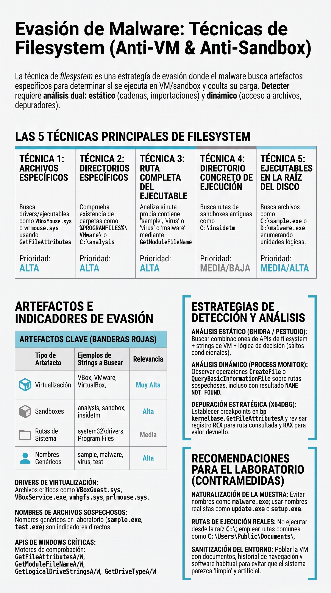


| Nº | Técnica | Qué busca | APIs principales | Prioridad TFM |
|---|---|---|---|---|
| 1 | Archivos específicos | Drivers o ejecutables de VMware, VirtualBox o Parallels | `GetFileAttributes` | Alta |
| 2 | Directorios específicos | Carpetas de VM o sandbox | `GetFileAttributes`, `PathCombine`, `ExpandEnvironmentStrings` | Alta |
| 3 | Ruta completa del ejecutable | Palabras como `sample`, `virus`, `sandbox`, `malware` o `analysis` | `GetModuleFileName`, `QueryFullProcessImageName` | Alta |
| 4 | Directorio concreto de ejecución | Rutas propias de sandboxes antiguas | `GetModuleFileName` + comparación | Media/Baja |
| 5 | Ejecutables en raíz del disco | `sample.exe`, `malware.exe` | `GetLogicalDriveStrings`, `GetDriveType`, `GetFileAttributes` | Media/Alta |

##### Artefactos o indicadores buscados

| Tipo de artefacto / indicador | Indicadores asociados | Ejemplos | Relevancia |
|---|---|---|---|
| Archivos | Drivers, ejecutables o DLLs asociados a entornos virtualizados | `vmmouse.sys`, `vmhgfs.sys`, `VBoxGuest.sys`, `VBoxMouse.sys`, `VBoxService.exe`, `VBoxTray.exe`, `prlmouse.sys` | Alta |
| Archivos en raíz | Ejecutables con nombres típicos de laboratorio | `C:\sample.exe`, `C:\malware.exe`, `D:\sample.exe`, `D:\malware.exe` | Media/Alta |
| Directorios | Carpetas asociadas a virtualización o sandbox | `C:\analysis`, `%PROGRAMFILES%\VMware\`, `%PROGRAMFILES%\Oracle\VirtualBox Guest Additions\` | Alta |
| Ruta del ejecutable | Palabras sospechosas en la ruta de ejecución | `\sample`, `\virus`, `sandbox`, `malware`, `analysis` | Alta |
| APIs | Funciones utilizadas para consultar archivos, directorios, rutas o unidades | `GetFileAttributesA/W`, `GetModuleFileNameA/W`, `QueryFullProcessImageNameA/W`, `GetLogicalDriveStringsA/W`, `GetDriveTypeA/W` | Muy alta |
| Strings | Cadenas embebidas relacionadas con rutas o nombres de entorno | `VBox`, `VirtualBox`, `VMware`, `sample`, `malware`, `virus`, `sandbox`, `analysis`, `Program Files`, `system32\drivers` | Muy alta |
| Evidencia estática | Indicadores observables sin ejecutar la muestra | Imports, strings, referencias cruzadas en Ghidra | Alta |
| Evidencia dinámica | Indicadores observables durante la ejecución | Consultas en Procmon o argumentos observados en x64dbg | Alta |

##### Detección en análisis estático

| Elemento a revisar | Qué buscar en Ghidra | Imports sospechosos | Strings relevantes | Patrones relevantes |
|---|---|---|---|---|
| Comprobación de archivos concretos | Construcción de rutas hacia `System32\drivers` | `GetFileAttributesA/W`, `GetWindowsDirectoryA/W`, `PathCombineA/W` | `vmmouse.sys`, `vmhgfs.sys`, `VBoxGuest.sys`, `VBoxMouse.sys`, `VBoxService.exe` | Rutas de drivers de VMware, VirtualBox o Parallels |
| Comprobación de directorios concretos | Código que obtiene `Program Files` y concatena nombres de carpetas | `GetFileAttributesA/W`, `ExpandEnvironmentStringsA/W`, `SHGetSpecialFolderPathA/W`, `PathCombineA/W` | `VMware\`, `VirtualBox Guest Additions`, `analysis`, `%ProgramW6432%` | `%PROGRAMFILES%\VMware\`, `%PROGRAMFILES%\Oracle\VirtualBox Guest Additions\`, `C:\analysis` |
| Ruta completa del ejecutable | Código que recupera la ruta del propio ejecutable y la compara | `GetModuleFileNameA/W`, `GetProcessImageFileNameA/W`, `QueryFullProcessImageNameA/W` | `sample`, `virus`, `sandbox`, `malware`, `analysis` | Comparaciones con `strstr`, `strcmp`, `_stricmp`, `lstrcmpi` |
| Directorio concreto de ejecución | Código que compara la ruta de ejecución contra una carpeta concreta | `GetModuleFileNameA/W`, `QueryFullProcessImageNameA/W` | `insidetm`, `C:\insidetm` | Comparación directa contra la ruta de ejecución |
| Ejecutables sospechosos en raíz | Enumeración de unidades y construcción de rutas en raíz | `GetLogicalDriveStringsA/W`, `GetDriveTypeA/W`, `GetFileAttributesA/W` | `sample.exe`, `malware.exe`, `virus.exe`, `test.exe` | `C:\sample.exe`, `C:\malware.exe`, `D:\sample.exe`, `D:\malware.exe` |

###### Criterio de interpretación estática

La presencia aislada de una API como `GetFileAttributesA/W` no confirma una técnica de evasión, ya que se trata de una función legítima de Windows.

La evidencia relevante aparece al observar la combinación de:

```bash
API de filesystem + ruta/string asociada a VM, sandbox o laboratorio + lógica de decisión posterior
```

Ejemplos:

| Combinación observada | Interpretación |
|---|---|
| `GetFileAttributes` + `vmmouse.sys` | Posible detección de VMware. |
| `GetFileAttributes` + `VBoxGuest.sys` | Posible detección de VirtualBox. |
| `GetFileAttributes` + `%PROGRAMFILES%\VMware\` | Comprobación de directorio asociado a VMware. |
| `GetModuleFileName` + `sandbox` | Comprobación de ruta de ejecución sospechosa. |
| `GetLogicalDriveStrings` + `sample.exe` | Búsqueda de ejecutables con nombres típicos de laboratorio en la raíz del disco. |

##### Detección en análisis dinámico

| Herramienta | Qué observar | Evidencias relevantes | Técnicas relacionadas | Interpretación |
|---|---|---|---|---|
| Process Monitor | Accesos a archivos, directorios y rutas del sistema | `CreateFile`, `QueryBasicInformationFile`, `QueryStandardInformationFile` sobre rutas sospechosas | 1, 2 y 5 | Permite ver qué rutas consulta la muestra durante la ejecución. |
| Process Monitor | Consultas a drivers de VMware | `C:\Windows\System32\drivers\vmmouse.sys`, `vmhgfs.sys`, `vmxnet.sys` | 1 | Posible detección de VMware. |
| Process Monitor | Consultas a drivers, DLLs o ejecutables de VirtualBox | `VBoxGuest.sys`, `VBoxMouse.sys`, `VBoxSF.sys`, `VBoxService.exe`, `VBoxTray.exe` | 1 | Posible detección de VirtualBox. |
| Process Monitor | Consultas a carpetas asociadas a VM o sandbox | `C:\analysis`, `C:\Program Files\VMware\`, `C:\Program Files\Oracle\VirtualBox Guest Additions\` | 2 | Búsqueda de directorios característicos del entorno de análisis. |
| Process Monitor | Consultas a ejecutables sospechosos en raíz | `C:\sample.exe`, `C:\malware.exe`, `D:\sample.exe`, `D:\malware.exe` | 5 | Posible detección de laboratorio por nombres poco realistas. |
| x32dbg / x64dbg | Argumentos pasados a APIs de filesystem | Breakpoints en `GetFileAttributesA/W`, `GetLogicalDriveStringsA/W`, `GetDriveTypeA/W` | 1, 2 y 5 | Permite ver la ruta consultada y el valor devuelto. |
| x32dbg / x64dbg | Obtención de la ruta completa del ejecutable | Breakpoints en `GetModuleFileNameA/W`, `QueryFullProcessImageNameA/W` | 3 y 4 | Permite comprobar si la muestra analiza su propia ruta. |
| x32dbg / x64dbg | Comparaciones posteriores a la obtención de ruta | `strstr`, `strcmp`, `_stricmp`, `lstrcmpi` | 3 y 4 | Permite ver si la ruta se compara con cadenas sospechosas. |
| Wireshark / FakeNet-NG | Tráfico posterior o ausencia de tráfico | Ausencia de DNS, HTTP o conexión C2 esperada | Evidencia indirecta | Puede indicar que la muestra no llegó a ejecutar el payload. |

###### Criterio de interpretación dinámica

La evidencia principal aparece cuando la muestra consulta rutas asociadas a entornos virtualizados, sandboxes o laboratorios de análisis.

Una consulta con resultado `NAME NOT FOUND` o `PATH NOT FOUND` no debe descartarse. Aunque el archivo o directorio no exista, el simple intento de acceso puede indicar que la muestra está buscando artefactos del entorno.

La evidencia más sólida aparece al combinar:

```bash
consulta a ruta sospechosa + API de filesystem + cambio de comportamiento posterior
```

---


### Demostración: archivos concretos

**En esta Técnica 1: Comprobar si existen archivos concretos**, la muestra comprueba si existen archivos asociados a entornos virtualizados. Consulta rutas asociadas a hipervisores o herramientas de integración de la VM.

La API clave es:

```bash
GetFileAttributesA/W
```

Breakpoints utilizados:

```bash
bp kernel32.GetFileAttributesA
bp kernelbase.GetFileAttributesA
bp kernel32.GetFileAttributesW
bp kernelbase.GetFileAttributesW
```

En Windows moderno, muchas llamadas exportadas por `kernel32.dll` terminan resolviéndose realmente en `KernelBase.dll`, por lo que conviene poner breakpoints en ambos módulos.

En x64, el primer argumento de `GetFileAttributesA/W` se pasa en:

```bash
RCX = puntero a la ruta consultada
```

Durante la depuración, se observó:

```bash
RCX -> "C:\WINDOWS\system32\drivers\VBoxMouse.sys"
```

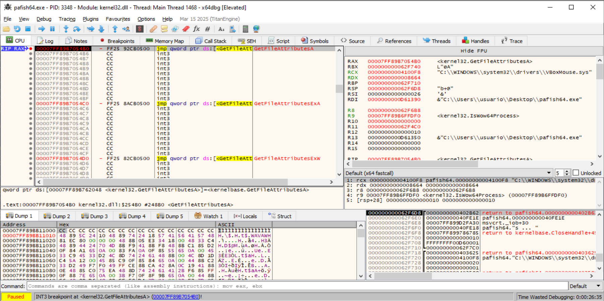


Esto significa que Pafish estaba comprobando si existía el driver:

```bash
C:\Windows\System32\drivers\VBoxMouse.sys
```

Este archivo es un artefacto típico de VirtualBox Guest Additions.

Tras ejecutar la llamada:

```c
GetFileAttributesA("C:\\WINDOWS\\system32\\drivers\\VBoxMouse.sys");
```


el retorno observado fue:

```bash
RAX = 0000000000000020
EAX = 00000020
```

Esto significa:

```bash
EAX != FFFFFFFF
```

Por tanto, el archivo existe.

Pafish continuó recorriendo otros archivos de VirtualBox, como:


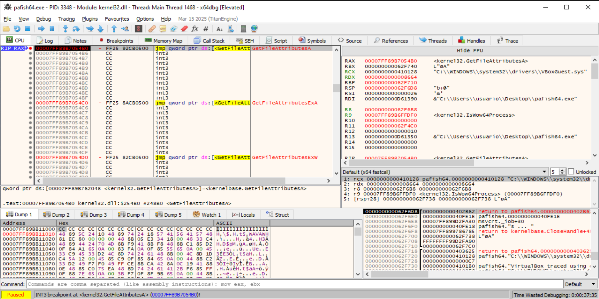


```bash
VBoxMouse.sys
VBoxGuest.sys
VBoxSF.sys
VBoxVideo.sys
vboxdisp.dll
vboxhook.dll
vboxmrxnp.dll
vboxogl.dll
```

Por cada uno de ellos llamó a `GetFileAttributesA`.

**Conclusión:** esta técnica queda demostrada, ya que Pafish consulta archivos concretos asociados a VirtualBox mediante `GetFileAttributesA`.

> **Nota sobre la demostración**
>
> En esta memoria se presenta una demostración resumida de la técnica, centrada en su funcionamiento, ejecución e interpretación de los resultados. Su desarrollo completo —incluidos el fundamento teórico, el código fuente, el procedimiento detallado de análisis y las evidencias obtenidas— puede consultarse en el [repositorio general del proyecto - Técnica 1: comprobar si existen archivos concretos](https://github.com/soniasalido/cybersecurity/blob/main/Documentation/Malware/Master-ENIIT-Analisis-Malware-Reversing/modulo-11-TFM/modulo-deteccion-entornos-virtuales/modulo-evasion/fichas/02-filesystem.md#2101-t%C3%A9cnica-1-comprobar-si-existen-archivos-concretos).


### Demostración: ruta de ejecución

**En esta Técnica 3: Comprobar si la ruta completa del ejecutable contiene ciertas palabras**, la muestra no comprueba si existe una carpeta externa. En su lugar, **obtiene su propia ruta de ejecución y comprueba si contiene palabras asociadas a entornos de análisis.**

Lógica simplificada:

```c
GetModuleFileNameA(NULL, buffer, MAX_PATH);
strstr(buffer, "analysis");
strstr(buffer, "sample");
strstr(buffer, "virus");
strstr(buffer, "sandbox");
```

Para demostrar la técnica, se copió Pafish a una ruta sospechosa:

```powershell
mkdir C:\sample
copy C:\Users\Usuario\Desktop\pafish64.exe C:\sample\pafish64.exe
```

Breakpoints utilizados:

```bash
bp kernel32.GetModuleFileNameA
bp kernel32.GetModuleFileNameW
bp msvcrt.strstr
bp msvcrt.strcmp
bp msvcrt.strncmp
bp msvcrt._stricmp
bp msvcrt._strnicmp
```


Durante la depuración se observó que Pafish obtenía su propia ruta:

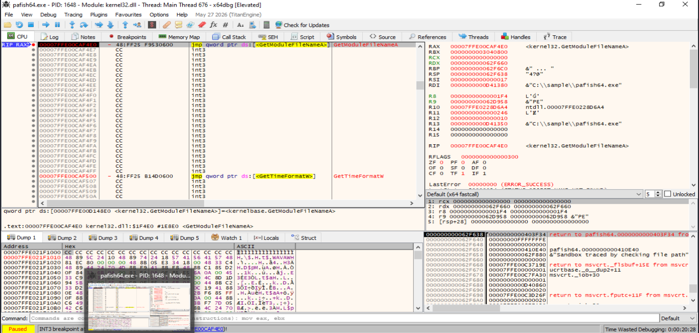  


```bash
C:\sample\pafish64.exe
```

Después se observó una llamada a `msvcrt.strstr` con los siguientes argumentos:

  

```bash
RCX -> "C:\\SAMPLE\\PAFISH64.EXE"
RDX -> "\\SAMPLE"
```

Conceptualmente, Pafish estaba haciendo:

```c
strstr("C:\\SAMPLE\\PAFISH64.EXE", "\\SAMPLE");
```

Esto demuestra directamente que está comprobando si la ruta completa del ejecutable contiene una palabra sospechosa.

Además, en la pila se observó el mensaje:

```bash
Sandbox traced by checking file path
```

Cadena completa de la evidencia:

```bash
1. Pafish obtiene su propia ruta:
   C:\sample\pafish64.exe

2. Convierte o compara la ruta en mayúsculas:
   C:\SAMPLE\PAFISH64.EXE

3. Busca la subcadena:
   \SAMPLE

4. strstr devuelve un valor distinto de 0.

5. Pafish interpreta que la ruta es sospechosa.

6. Se activa el mensaje:
   Sandbox traced by checking file path
```


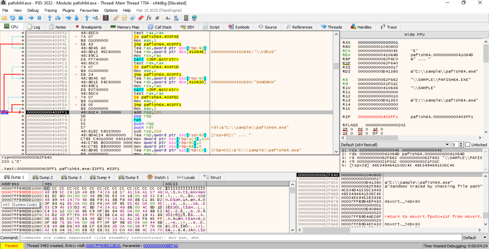


| Paso | Evidencia observada | Interpretación |
|---|---|---|
| 1 | Ruta de ejecución: `C:\sample\pafish64.exe` | Pafish se ejecuta desde una ruta sospechosa. |
| 2 | `RCX -> "C:\\SAMPLE\\PAFISH64.EXE"` | Cadena principal analizada por `strstr`. |
| 3 | `RDX -> "\\SAMPLE"` | Subcadena sospechosa buscada dentro de la ruta. |
| 4 | `RAX != 0` tras `strstr` | La subcadena fue encontrada. |
| 5 | `RAX = 1` | Pafish transforma la coincidencia en detección positiva. |
| 6 | `Sandbox traced by checking file path` | La herramienta marca el entorno como sospechoso por la ruta del ejecutable. |

**Conclusión:** la técnica `2.3.3` queda demostrada. Pafish obtiene la ruta completa del ejecutable, busca en ella la subcadena `\SAMPLE` mediante `strstr` y, al encontrarla, marca la comprobación como positiva.

> **Nota sobre la demostración**
>
> En esta memoria se presenta una demostración resumida de la técnica, centrada en su funcionamiento, ejecución e interpretación de los resultados. Su desarrollo completo —incluidos el fundamento teórico, el código fuente, el procedimiento detallado de análisis y las evidencias obtenidas— puede consultarse en el [repositorio general del proyecto - Técnica 3: Comprobar si la ruta completa del ejecutable contiene ciertas palabras](https://github.com/soniasalido/cybersecurity/blob/main/Documentation/Malware/Master-ENIIT-Analisis-Malware-Reversing/modulo-11-TFM/modulo-deteccion-entornos-virtuales/modulo-evasion/fichas/02-filesystem.md#2103-t%C3%A9cnica-3-comprobar-si-la-ruta-completa-del-ejecutable-contiene-ciertas-palabras)

----


> **Nota sobre técnicas complementarias**
>
> Por razones de alcance esta memoria no desarrolla experimentalmente todas las técnicas pertenecientes a esta categoría. No obstante, las siguientes técnicas se encuentran documentadas y demostradas en el repositorio general del proyecto, donde pueden consultarse su fundamento teórico, implementación, procedimiento de análisis y evidencias obtenidas:
>
> * [Técnica 2: Comprobación de la existencia de directorios específicos](https://github.com/soniasalido/cybersecurity/blob/main/Documentation/Malware/Master-ENIIT-Analisis-Malware-Reversing/modulo-11-TFM/modulo-deteccion-entornos-virtuales/modulo-evasion/fichas/02-filesystem.md#2102-t%C3%A9cnica-2-comprobar-si-existen-directorios-concretos).
> * [Técnica 4: Comprobación del directorio desde el que se ejecuta la muestra](https://github.com/soniasalido/cybersecurity/blob/main/Documentation/Malware/Master-ENIIT-Analisis-Malware-Reversing/modulo-11-TFM/modulo-deteccion-entornos-virtuales/modulo-evasion/fichas/02-filesystem.md#2104-t%C3%A9cnica-4-comprobar-si-el-ejecutable-se-lanza-desde-un-directorio-concreto).
> * [Técnica 5: Comprobación de ejecutables con nombres sospechosos en la raíz del disco](https://github.com/soniasalido/cybersecurity/blob/main/Documentation/Malware/Master-ENIIT-Analisis-Malware-Reversing/modulo-11-TFM/modulo-deteccion-entornos-virtuales/modulo-evasion/fichas/02-filesystem.md#2105-t%C3%A9cnica-5-comprobar-si-existen-ejecutables-con-nombres-sospechosos-en-la-ra%C3%ADz-del-disco).
>
> Estos contenidos se ofrecen como material técnico complementario y forman parte del trabajo práctico realizado durante el desarrollo del proyecto, aunque sus demostraciones completas no se reproducen en el presente documento.


<div style="page-break-after: always;"></div>


## 8.2. Registry

> **Ampliación y evidencias completas:** [ficha `03-registry.md`][ficha-registry]. El repositorio conserva capturas adicionales, herramientas, código y secuencias no incluidas en esta memoria.


### Fundamento y propósito

La técnica `registry` es una técnica de evasión anti-VM y anti-sandbox basada en la inspección del Registro de Windows con el objetivo de **identificar artefactos asociados a entornos virtualizados, sandboxes o plataformas de análisis automatizado.** Su finalidad es permitir que el malware determine si se está ejecutando en un sistema físico real o en un entorno controlado por analistas, modificando su comportamiento en función del resultado.

El principio general de esta técnica parte de una premisa sencilla: determinadas claves, valores o cadenas del Registro no suelen estar presentes en un equipo físico convencional, pero sí pueden aparecer en entornos como `VirtualBox`, `VMware`, `Hyper-V`, `Sandboxie`, `Wine`, `Xen`, `QEMU` o `Parallels`. Por tanto, **la presencia de estos artefactos puede actuar como indicador de virtualización o análisis.**

**En la práctica, el malware puede aplicar esta técnica de varias formas:**
* Comprobando si existen **rutas concretas del Registro** asociadas a productos de virtualización o sandboxing, como servicios, controladores o herramientas invitadas de `VMware`, `VirtualBox` o `Hyper-V`.
* Leyendo valores específicos del Registro y **buscando cadenas características** como `VBOX`, `VMWARE`, `QEMU`, `Xen`, `VirtualBox` o nombres relacionados con herramientas de análisis.
* **Enumerando subclaves** dentro de rutas amplias del sistema y **buscando patrones** asociados a entornos virtualizados, por ejemplo cadenas como `VBox` dentro de claves relacionadas con servicios del sistema.
* Comprobando **configuraciones específicas de aplicaciones**, como las opciones de seguridad de macros de `Microsoft Office`, mediante valores como `VBAWarnings`, para detectar configuraciones anómalas que puedan ser habituales en sandboxes automatizadas.

**Para llevar a cabo estas comprobaciones, el malware suele utilizar funciones de la API de Windows relacionadas con el Registro, entre ellas:**
* `RegOpenKey`
* `RegOpenKeyEx`
* `RegQueryValue`
* `RegQueryValueEx`
* `RegEnumKeyEx`
* `RegCloseKey`

**Estas funciones pueden estar apoyadas o sustituidas por llamadas de más bajo nivel exportadas por `ntdll.dll`, como:**
* `NtOpenKey`
* `NtQueryValueKey`
* `NtEnumerateKey`
* `NtClose`

Desde el punto de vista del análisis, la presencia de llamadas a estas funciones no implica por sí sola un comportamiento malicioso, ya que muchas aplicaciones legítimas consultan el Registro. Sin embargo, cuando dichas llamadas acceden a rutas o valores característicos de entornos virtualizados, pueden considerarse un indicio relevante de comportamiento evasivo.

En resumen, **la técnica `registry` permite al malware utilizar el Registro de Windows como fuente de información sobre el entorno de ejecución.** Si detecta huellas compatibles con una máquina virtual, sandbox o sistema de análisis, puede evitar ejecutar su carga maliciosa, retrasar su actividad, finalizar el proceso o alterar su comportamiento para dificultar su detección y estudio.

----


### Demostración dinámica y recuperación de rutas

`Pafish` puede utilizarse para observar técnicas anti-VM y anti-sandbox basadas en el Registro de Windows. Durante su ejecución, la herramienta realiza distintas comprobaciones del entorno, algunas de ellas relacionadas con claves, valores o subclaves del Registro.

Estas comprobaciones pueden monitorizarse con herramientas como:

- `Process Monitor`
- `API Monitor`
- `RegShot`
- `x32dbg` / `x64dbg`

Una forma práctica de analizarlo consiste en ejecutar `pafish64.exe` dentro de una máquina virtual y capturar sus accesos al Registro. En `Process Monitor`, pueden emplearse filtros como los siguientes:

```text
Process Name  is  pafish64.exe  Include
Operation     begins with  Reg   Include
```

Operaciones relevantes:

```text
RegOpenKey
RegQueryValue
RegEnumKey
RegCloseKey
RegSetValue
```

Con esta configuración pueden observarse consultas a rutas del Registro relacionadas con reconocimiento ambiental. Algunas rutas especialmente relevantes para técnicas anti-VM o anti-sandbox son:

```text
HKLM\HARDWARE\ACPI\
HKLM\HARDWARE\Description\System
HKLM\HARDWARE\Description\System\BIOS
HKLM\SYSTEM\ControlSet001\Services\
HKLM\SYSTEM\CurrentControlSet\Services\
HKLM\SOFTWARE\Oracle\VirtualBox Guest Additions
HKLM\SOFTWARE\VMware, Inc.\VMware Tools
HKCU\SOFTWARE\Wine
HKLM\SOFTWARE\Wine
HKLM\SYSTEM\CurrentControlSet\Services\SbieDrv
```

Si `pafish` detecta artefactos como `VirtualBox`, `VMware`, `Wine` o `Sandboxie`, significa que el laboratorio está exponiendo huellas que también podrían ser utilizadas por malware real para modificar su comportamiento.

----

###### A) Breakpoints útiles en `x64dbg`

Para observar las consultas al Registro desde un depurador, pueden configurarse breakpoints tanto en funciones de alto nivel como en funciones nativas de bajo nivel.

Funciones de alto nivel:

```text
RegOpenKeyExA
RegOpenKeyExW
RegQueryValueExA
RegQueryValueExW
RegEnumKeyExA
RegEnumKeyExW
```

Funciones nativas:

```text
NtOpenKey
NtQueryValueKey
NtEnumerateKey
NtClose
```

En el análisis mostrado se intercepta una llamada a `ntdll.NtOpenKey` realizada por `pafish64.exe`.


La captura anterior muestra que `pafish64.exe` está detenido en `ntdll.NtOpenKey`, justo antes de ejecutar la llamada al sistema que intenta abrir una clave del Registro.

La firma simplificada de `NtOpenKey` es:

```c
NTSTATUS NtOpenKey(
    PHANDLE KeyHandle,
    ACCESS_MASK DesiredAccess,
    POBJECT_ATTRIBUTES ObjectAttributes
);
```

En Windows x64, los tres primeros argumentos se pasan en registros:

| Registro | Argumento | Valor observado | Interpretación |
|---|---|---|---|
| `RCX` | `KeyHandle` | `000000000062ECF0` | Dirección donde se guardará el handle si la apertura de la clave tiene éxito. |
| `RDX` | `DesiredAccess` | `0000000000000009` | Permisos solicitados sobre la clave. |
| `R8` | `ObjectAttributes` | `000000000062ED00` | Puntero a la estructura que permite localizar la ruta real del Registro. |

El valor observado en `RDX` es:

```text
RDX = 0x09
```

Este valor equivale a:

```text
0x09 = KEY_QUERY_VALUE | KEY_ENUMERATE_SUB_KEYS
```

Por tanto, en este punto `pafish64.exe` no está intentando modificar el Registro, sino abrir una clave con permisos suficientes para consultar valores o enumerar subclaves. Esto encaja con una fase de reconocimiento ambiental basada en `registry`.

La secuencia observada puede resumirse así:

```text
pafish64.exe → ntdll.NtOpenKey → syscall
```

----

###### B) Recuperación de la ruta real del Registro desde `R8`

Para saber qué clave del Registro se está intentando abrir, no basta con mirar `RDX`, ya que `RDX` sólo indica los permisos solicitados. La ruta se recupera inspeccionando el tercer argumento de `NtOpenKey`, situado en `R8`.

El registro `R8` apunta a una estructura `OBJECT_ATTRIBUTES`:

```c
typedef struct _OBJECT_ATTRIBUTES {
    ULONG Length;
    HANDLE RootDirectory;
    PUNICODE_STRING ObjectName;
    ULONG Attributes;
    PVOID SecurityDescriptor;
    PVOID SecurityQualityOfService;
} OBJECT_ATTRIBUTES;
```

El campo que interesa es `ObjectName`, situado en el offset `0x10`:

```text
ObjectName = [R8 + 0x10]
```

En `x64dbg`, se puede hacer clic derecho sobre el registro `R8` y seleccionar `Follow in Dump` para ver la estructura en memoria.


En la captura se observa:

```text
R8 = 000000000062ED00
```

Desde esa dirección se localiza la estructura `OBJECT_ATTRIBUTES`. La parte relevante puede representarse así:

```text
OBJECT_ATTRIBUTES en 000000000062ED00

Offset  Campo                Interpretación
------  -------------------  --------------------------------------
+0x00   Length               Tamaño de la estructura.
+0x08   RootDirectory        Directorio raíz, si existe.
+0x10   ObjectName           Puntero hacia la estructura UNICODE_STRING.
+0x18   Attributes           Atributos de apertura de la clave.
+0x20   SecurityDescriptor   Descriptor de seguridad, si existe.
+0x28   SecurityQoS          Información adicional de seguridad.
```

En este caso, el recorrido de punteros observado durante la depuración lleva hasta una estructura `UNICODE_STRING`. Esta estructura contiene la longitud de la cadena y un puntero final al buffer Unicode donde está escrita la ruta real del Registro.

La estructura `UNICODE_STRING` tiene el siguiente formato:

```c
typedef struct _UNICODE_STRING {
    USHORT Length;         // +0x00
    USHORT MaximumLength;  // +0x02
    PWSTR  Buffer;         // +0x08
} UNICODE_STRING;
```

El campo importante es:

```text
Buffer = [UNICODE_STRING + 0x08]
```

En el análisis realizado, se llega a la zona donde se encuentra el campo `Buffer` de la estructura `UNICODE_STRING`.


En la captura se observa que el campo `Buffer` contiene los siguientes bytes:

```text
E0 82 41 4E F9 7F 00 00
```

Al tratarse de una arquitectura x64, el valor debe interpretarse en formato little endian:

```text
00007FF94E4182E0
```

Esa dirección apunta al texto Unicode con la ruta real del Registro.

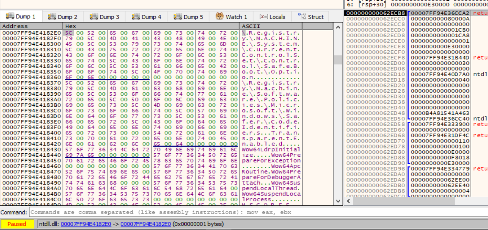

En la última captura se observa la cadena Unicode correspondiente a la clave consultada:

```text
\Registry\Machine\System\CurrentControlSet\Control\SafeBoot\Option
```

En formato habitual de la API de Windows, esta ruta equivale a:

```text
HKLM\SYSTEM\CurrentControlSet\Control\SafeBoot\Option
```

----

###### C) Resumen del recorrido de punteros

El recorrido realizado para obtener la ruta real del Registro puede resumirse así:

```text
NtOpenKey
|
+-- RCX = KeyHandle
|       +-- Dirección donde se guardará el handle de la clave.
|
+-- RDX = DesiredAccess
|       +-- 0x09 = KEY_QUERY_VALUE | KEY_ENUMERATE_SUB_KEYS
|
+-- R8 = POBJECT_ATTRIBUTES
        |
        +-- OBJECT_ATTRIBUTES
                |
                +-- ObjectName
                        |
                        +-- UNICODE_STRING
                                |
                                +-- Buffer
                                        |
                                        +-- \Registry\Machine\System\CurrentControlSet\Control\SafeBoot\Option
```

Este recorrido permite pasar de una llamada nativa de bajo nivel (`NtOpenKey`) a la ruta legible del Registro consultada por el programa.


----

###### D) Ejemplo metodológico: recuperación de una ruta del Registro desde `NtOpenKey`

La clave recuperada durante este análisis fue:

```bash
\Registry\Machine\System\CurrentControlSet\Control\SafeBoot\Option
```

En formato habitual de la API de Windows, esta ruta equivale a:
```bash
HKLM\SYSTEM\CurrentControlSet\Control\SafeBoot\Option
```

Esta clave está relacionada con `SafeBoot`, es decir, con el modo seguro de Windows. Por tanto, la llamada observada confirma una consulta ambiental al Registro, pero no corresponde directamente a una comprobación de `VirtualBox`, `VMware`, `Wine`, `Sandboxie` ni a otro artefacto clásico de virtualización.

La importancia de esta evidencia es metodológica: permite demostrar cómo recuperar la ruta real consultada por una llamada nativa de bajo nivel, en este caso `NtOpenKey`, a partir de la estructura `OBJECT_ATTRIBUTES` apuntada por `R8`.

Por tanto, esta captura no debe utilizarse como evidencia principal de una técnica `anti-VM` concreta. Su valor dentro del análisis es mostrar el procedimiento para pasar de una llamada nativa del Registro a la ruta legible consultada por el programa.

Para clasificar una evidencia como técnica `anti-VM` o `anti-sandbox` basada en registry, sería necesario observar consultas a rutas como:

```bash
HKLM\HARDWARE\ACPI\DSDT\VBOX__
HKLM\HARDWARE\ACPI\FADT\VBOX__
HKLM\SOFTWARE\Oracle\VirtualBox Guest Additions
HKLM\SOFTWARE\VMware, Inc.\VMware Tools
HKLM\SYSTEM\ControlSet001\Services\VBoxService
HKLM\SYSTEM\ControlSet001\Services\vmmouse
HKLM\SYSTEM\CurrentControlSet\Services\SbieDrv
HKCU\SOFTWARE\Wine
```

----

###### E) Correcciones metodológicas importantes

Durante el análisis deben tenerse en cuenta las siguientes correcciones:

| Punto | Corrección |
|---|---|
| `RDX = 0x09` | No contiene la ruta del Registro. Solo indica los permisos solicitados. |
| `R8` | Contiene el puntero a `OBJECT_ATTRIBUTES`, que permite recuperar la ruta. |
| `R9` | No se utiliza en `NtOpenKey`, porque la función solo recibe tres argumentos. |
| `ObjectName` | Es el campo de `OBJECT_ATTRIBUTES` que conduce a la estructura `UNICODE_STRING`. |
| `UNICODE_STRING + 0x08` | Contiene el puntero `Buffer`, donde está la cadena Unicode real. |
| Ruta observada | `SafeBoot\Option` demuestra una consulta ambiental al Registro, pero no debe contabilizarse como evidencia directa de detección anti-VM o anti-sandbox. |

También es recomendable validar siempre si la dirección seguida en memoria tiene la forma esperada. Una estructura `UNICODE_STRING` válida debería mostrar valores coherentes en `Length`, `MaximumLength` y un puntero a `Buffer`. Si la zona seguida no parece una estructura válida, conviene revisar el puntero anterior, repetir el seguimiento desde `R8` y confirmar la cadena con una vista Unicode del `Dump`.

----

###### F) Conclusión metodológica del análisis con `NtOpenKey`

El análisis dinámico con `x64dbg` permitió interceptar una llamada a `ntdll.NtOpenKey` realizada por `pafish64.exe`. La función fue invocada con permisos de lectura y enumeración:

```bash
DesiredAccess = 0x09
```

Al inspeccionar el argumento `ObjectAttributes`, apuntado por `R8`, se recuperó la siguiente ruta nativa del Registro:

```bash
\Registry\Machine\System\CurrentControlSet\Control\SafeBoot\Option
```

En formato `WinAPI`, esta ruta equivale a:

```bash
HKLM\SYSTEM\CurrentControlSet\Control\SafeBoot\Option
```

Esta consulta indica que `pafish64.exe` está comprobando información del entorno relacionada con el modo seguro de Windows. Aunque esta clave no corresponde a un artefacto de virtualización como `VBOX__`, `VirtualBox Guest Additions` o `VMware Tools`, sí demuestra una consulta ambiental basada en el Registro.

Por tanto, esta evidencia se mantiene como ejemplo metodológico para explicar cómo recuperar una ruta real del Registro a partir de una llamada nativa como `NtOpenKey`. Las evidencias utilizadas para demostrar técnicas `anti-VM` concretas se documentan posteriormente mediante consultas a claves específicas de `VirtualBox`, `VMware`, servicios de `VM`, valores `ACPI/BIOS` o artefactos de `sandbox`.


La evidencia anterior sobre `SafeBoot\Option` no se contabiliza como demostración directa de una técnica `anti-VM` específica. Se conserva como ejemplo metodológico para mostrar cómo interpretar llamadas nativas al Registro. A continuación, se documentan las evidencias que sí permiten asociar la ejecución de `pafish64.exe` con técnicas concretas de detección mediante `registry`.


> **Nota sobre el alcance de las demostraciones**
>
> En esta versión resumida de la memoria se demuestran algunas de las técnicas de detección de entornos virtualizados y herramientas de análisis basadas en consultas al Registro de Windows. En concreto, se incluyen comprobaciones relacionadas con claves de VirtualBox y VMware, información ACPI/BIOS y artefactos asociados a sandboxes o herramientas de análisis.
>
> El desarrollo completo de todas las técnicas de esta categoría —incluidos su fundamento teórico, código fuente, procedimiento de ejecución, análisis detallado, capturas y resultados— puede consultarse en la [ficha dedicada al Registro de Windows del repositorio general del proyecto](https://github.com/soniasalido/cybersecurity/blob/main/Documentation/Malware/Master-ENIIT-Analisis-Malware-Reversing/modulo-11-TFM/modulo-deteccion-entornos-virtuales/modulo-evasion/fichas/03-registry.md).
>
> - [Técnica 1: Comprobar claves de VirtualBox - Evidencia Principal](https://github.com/soniasalido/cybersecurity/blob/main/Documentation/Malware/Master-ENIIT-Analisis-Malware-Reversing/modulo-11-TFM/modulo-deteccion-entornos-virtuales/modulo-evasion/fichas/03-registry.md#a-t%C3%A9cnica-331-comprobar-claves-de-virtualbox---evidencia-principal).
> - [Técnica 1: Comprobar claves de VirtualBox - Evidencia Complementaria](https://github.com/soniasalido/cybersecurity/blob/main/Documentation/Malware/Master-ENIIT-Analisis-Malware-Reversing/modulo-11-TFM/modulo-deteccion-entornos-virtuales/modulo-evasion/fichas/03-registry.md#b-t%C3%A9cnica-331-comprobar-claves-de-virtualbox---evidencia-complementaria).
> - [Técnica 2: Comprobar claves de VMware](https://github.com/soniasalido/cybersecurity/blob/main/Documentation/Malware/Master-ENIIT-Analisis-Malware-Reversing/modulo-11-TFM/modulo-deteccion-entornos-virtuales/modulo-evasion/fichas/03-registry.md#c-t%C3%A9cnica-332-comprobar-claves-de-vmware).
> - [Técnica 3: Comprobar claves de servicios de VM](https://github.com/soniasalido/cybersecurity/blob/main/Documentation/Malware/Master-ENIIT-Analisis-Malware-Reversing/modulo-11-TFM/modulo-deteccion-entornos-virtuales/modulo-evasion/fichas/03-registry.md#d-t%C3%A9cnica-333-comprobar-claves-de-servicios-de-vm).
> - [Técnica 4: Comprobar claves ACPI/BIOS](https://github.com/soniasalido/cybersecurity/blob/main/Documentation/Malware/Master-ENIIT-Analisis-Malware-Reversing/modulo-11-TFM/modulo-deteccion-entornos-virtuales/modulo-evasion/fichas/03-registry.md#e-t%C3%A9cnica-334-comprobar-claves-acpibios).
> - [Técnica 5: Comprobar claves asociadas a sandbox o herramientas de análisis](https://github.com/soniasalido/cybersecurity/blob/main/Documentation/Malware/Master-ENIIT-Analisis-Malware-Reversing/modulo-11-TFM/modulo-deteccion-entornos-virtuales/modulo-evasion/fichas/03-registry.md#f-t%C3%A9cnica-335-comprobar-claves-asociadas-a-sandbox-o-herramientas-de-an%C3%A1lisis).
>
> Estos contenidos se ofrecen como material técnico complementario y forman parte del trabajo práctico realizado durante el desarrollo del proyecto, aunque sus demostraciones completas no se reproducen en el presente documento.


---------------------------


<div style="page-break-after: always;"></div>


## 8.3. Processes

> **Ampliación y evidencias completas:** [ficha `04-processes.md`][ficha-processes]. El repositorio conserva capturas adicionales, herramientas, código y secuencias no incluidas en la memoria.


### Fundamento y propósito

La técnica consiste principalmente en **enumerar los procesos que se encuentran en ejecución y comparar sus nombres con una lista de procesos previamente definidos.** En sistemas Windows, esta enumeración puede realizarse mediante funciones como `CreateToolhelp32Snapshot`, `Process32First`, `Process32Next` o `EnumProcesses`.

Entre los procesos que suelen buscarse se encuentran los asociados a `VMware`, `VirtualBox`, `QEMU`, `Parallels`, `Virtual PC`, `Xen` o determinadas herramientas de análisis. Algunos ejemplos son `vmtoolsd.exe`, `vboxservice.exe`, `vboxtray.exe`, `qemu-ga.exe` o `prl_tools.exe`.

Cuando el malware detecta alguno de estos procesos, puede asumir que se encuentra dentro de una máquina virtual o de una plataforma de análisis. Como respuesta, puede finalizar su ejecución, permanecer inactivo, retrasar la actividad maliciosa, ocultar determinadas funciones o ejecutar un comportamiento alternativo para evitar que sus capacidades reales sean observadas.

Esta técnica también puede extenderse a la detección de bibliotecas cargadas en memoria, como `sbiedll.dll`, relacionada con `Sandboxie`, o a la búsqueda de funciones específicas exportadas por determinadas bibliotecas. Por tanto, el análisis de procesos no se limita únicamente a los ejecutables activos, sino que puede incluir otros elementos del entorno de ejecución que permitan identificar sistemas de análisis o virtualización.


----


### Indicadores y criterios de análisis

La técnica *Processes* puede resumirse mediante el siguiente flujo:

```bash
Inicio de la muestra
        |
        v
Enumeración de procesos activos
        |
        v
Comparación con una lista de indicadores
        |
        +-- VirtualBox
        |   +-- vboxservice.exe
        |   +-- vboxtray.exe
        |
        +-- VMware
        |   +-- vmtoolsd.exe
        |   +-- vmwaretray.exe
        |   +-- vmwareuser.exe
        |   +-- vmwareservice.exe
        |
        +-- Herramientas de análisis o sandbox
            +-- joeboxserver.exe
            +-- joeboxcontrol.exe
            +-- WPE Pro.exe
            +-- ksdumperclient.exe
        |
        v
¿Se detecta algún proceso sospechoso?
        |
        +-- No --> Continuar con la ejecución normal
        |
        +-- Sí
             |
             v
        Activar comportamiento evasivo
             +-- Finalizar la ejecución
             +-- Permanecer inactivo
             +-- Retrasar la carga maliciosa
             +-- Ejecutar una funcionalidad limitada

```

| Elemento                   | Descripción                                                                      |
| -------------------------- | -------------------------------------------------------------------------------- |
| **Objetivo**               | Detectar máquinas virtuales, *sandboxes* o herramientas de análisis.             |
| **Fuente de información**  | Lista de procesos activos del sistema.                                           |
| **Método principal**       | Comparación de nombres de ejecutables con una lista de indicadores conocidos.    |
| **API habituales**         | `CreateToolhelp32Snapshot`, `Process32First`, `Process32Next` y `EnumProcesses`. |
| **Indicadores frecuentes** | Procesos asociados a VirtualBox, VMware, JoeBox, WPE Pro o KsDumper.             |
| **Respuesta del malware**  | Finalización, inactividad, retraso o modificación del comportamiento.            |
| **Limitación**             | Los procesos pueden estar ausentes, ocultos, detenidos o renombrados.            |


La eficacia de esta técnica depende de que los procesos buscados estén activos y mantengan sus nombres habituales. Por este motivo, suele combinarse con otras comprobaciones relacionadas con el sistema de archivos, el Registro, el hardware o las bibliotecas cargadas.

----


### Enumeración dinámica de procesos

La forma más clara de demostrar `4.3.1`: Enumerar procesos en ejecución con `al-khaser` es realizar un experimento controlado con un proceso señuelo. Así se evita depender de los procesos reales de `VirtualBox` o `VMware` y se demuestra que el resultado cambia únicamente cuando aparece un nombre concreto en la lista de procesos.

`al-khaser` implementa una función compartida denominada `GetProcessIdFromName()`. Esta crea una instantánea con `CreateToolhelp32Snapshot(TH32CS_SNAPPROCESS, 0)`, recorre las entradas mediante `Process32First` y `Process32Next`, y compara cada `szExeFile` con el nombre buscado utilizando `StrCmpI`.


Abrimos una consola de Windows en la carpeta donde hemos extraído `al-khaser` y comprobamos que el ejecutable admite la selección de categorías:
```bash
al-khaser_x64.exe -h
```

La versión actual permite ejecutar únicamente la categoría `QEMU` mediante `--check QEMU`. Esto evita mezclar la prueba con todas las demás técnicas incluidas en el proyecto.

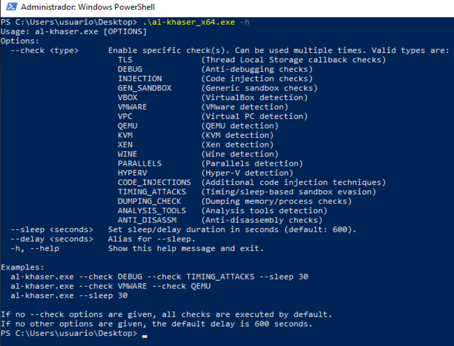

**Primera ejecución: sin el proceso señuelo.** Comprobamos inicialmente que los procesos buscados no se encuentran activos:
```bash
tasklist | findstr /i "qemu-ga.exe vdagent.exe vdservice.exe"
```

Como el comando no devuelve ninguna línea, ejecutamos `al-khaser`:
```bash
"C:\Users\Usuario\Desktop\al-khaser_x64.exe" --check QEMU > resultado_sin_proceso.txt
```

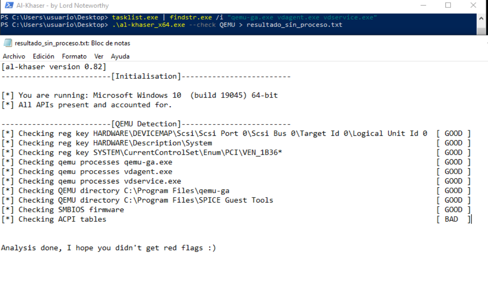

Buscamos en el resultado las comprobaciones relacionadas con procesos:

```bash
findstr /i "qemu processes" resultado_sin_proceso.txt
```

En esta primera ejecución, la comprobación correspondiente a `qemu-ga.exe` indica que el proceso no ha sido detectado:


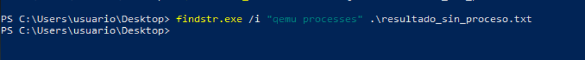

-----


**Creamos un proceso señuelo:**

Creamos una carpeta para la prueba:

```bash
mkdir C:\Lab\processes-demo
```

Copiamos un ejecutable legítimo de Windows y renómbralo como `qemu-ga.exe`:
```bash
copy C:\Windows\System32\cmd.exe C:\Lab\processes-demo\qemu-ga.exe
```

Ejecutamos el archivo renombrado y lo mantenemos abierto:

```bash
Start-Process `
  -FilePath "C:\Lab\processes-demo\qemu-ga.exe" `
  -ArgumentList "/k", "title QEMU-process-decoy"

```

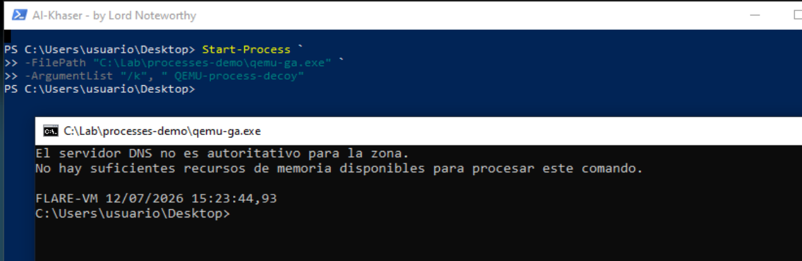


Comprobamos que Windows lo muestra con el nombre esperado:
```bash
tasklist /fi "IMAGENAME eq qemu-ga.exe"
```


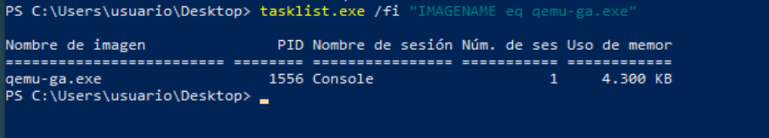

El resultado muestra la entrada:
```bash
qemu-ga.exe
```

Este ejecutable sigue siendo una copia legítima de `cmd.exe`. Únicamente se ha cambiado el nombre del archivo para comprobar si `al-khaser` se basa en el nombre del proceso.

------


**Segunda ejecución: con el proceso señuelo:**

Ejecutamos de nuevo la misma categoría:

```bash
al-khaser_x64.exe --check QEMU > resultado_con_proceso.txt
```

Extraemos las líneas relativas a los procesos:

```bash
findstr /i "qemu processes" resultado_con_proceso.txt
```

La comprobación de `qemu-ga.exe` pasa de un resultado negativo a uno positivo. Los demás indicadores de `QEMU` pueden seguir siendo negativos, ya que no se han introducido claves del Registro, archivos, firmware ni controladores asociados a esa plataforma.

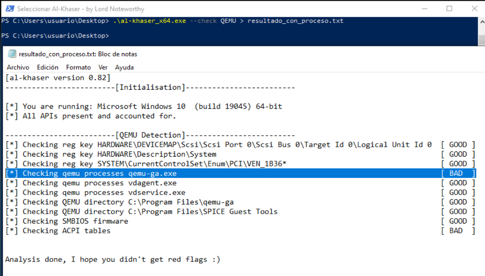

`al-khaser` consulta la lista de procesos activos y reacciona ante la aparición del nombre `qemu-ga.exe`.

-----


**Confirmación con `x64dbg`:**

La salida de `al-khaser` demuestra el cambio de resultado, pero para acreditar técnicamente el mecanismo vamos a observar las llamadas a la `API` con `x64dbg`.

Cargamos `al-khaser_x64.exe` en `x64dbg` y configuramos la línea de comandos: `File - Change Command Line`:
```bash
"C:\Users\Usuario\Desktop\al-khaser_x64.exe" --check QEMU
```


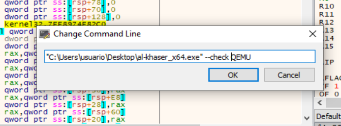


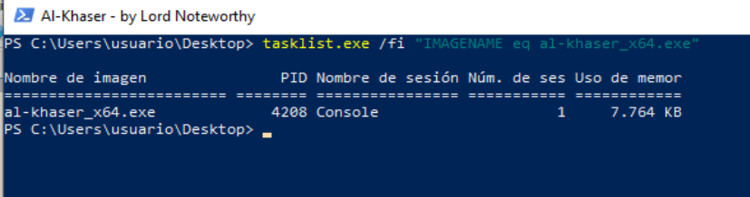

Establecemos puntos de ruptura sobre estas funciones:
```bash
CreateToolhelp32Snapshot
Process32FirstW
Process32NextW
StrCmpIW
```

----------


**Comprobamos `CreateToolhelp32Snapshot`:**

```bash
Cuando la ejecución se detenga en `CreateToolhelp32Snapshot`, inspeccionamos los argumentos:
RCX = dwFlags
RDX = th32ProcessID
```


Para demostrar la enumeración de procesos, debemos encontrar una llamada con:
```bash
RCX = 0x2
RDX = 0x0
```

Donde:
```bash
0x2 = TH32CS_SNAPPROCESS
```

La llamada esperada sería equivalente a:

```bash
CreateToolhelp32Snapshot(TH32CS_SNAPPROCESS, 0);
```

Pulsamos `F9` para continuar hasta una llamada a `CreateToolhelp32Snapshot` que cumpla con `RCX` y `RDX`:

En Windows x64, la función recibe:
```bash
HANDLE CreateToolhelp32Snapshot(
    DWORD dwFlags,       // RCX
    DWORD th32ProcessID  // RDX
);
```

Por tanto:
```bash
0x00000002 = TH32CS_SNAPPROCESS
0x00000000 = enumerar los procesos de todo el sistema
```

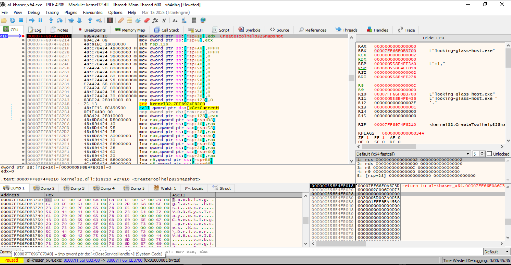


El registro `RBX` apunta a la cadena:

```bash
looking-glass-host.exe
```

Esto sugiere que, en esta iteración, `al-khaser` está enumerando los procesos para comprobar si se encuentra activo `looking-glass-host.exe`, asociado a entornos de virtualización y visualización de máquinas virtuales.

El proceso buscado no se pasa directamente a `CreateToolhelp32Snapshot`. La cadena se conserva en el código llamador para compararla posteriormente con cada nombre obtenido durante la enumeración.

------


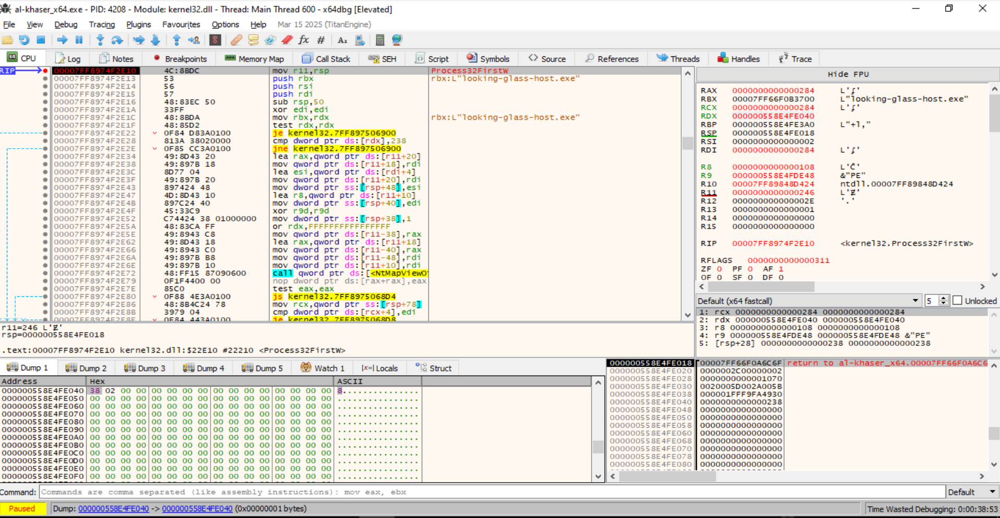

`al-khaser` ha llamado a `Process32FirstW` para recuperar la primera entrada de la instantánea de procesos. 

La función tiene esta firma:
```bash
BOOL Process32FirstW(
    HANDLE            hSnapshot,
    LPPROCESSENTRY32W lppe
);
```

En `Windows x64`, los argumentos aparecen en:
```bash
RCX = hSnapshot
RDX = puntero a PROCESSENTRY32W
```

En la captura:
```bash
RCX = 0x284
RDX = 0x000000558E4FE040
```

Por tanto:
- `RCX = 0x284` es el identificador devuelto anteriormente por `CreateToolhelp32Snapshot`.
- `RDX = 0x000000558E4FE040` apunta a la estructura `PROCESSENTRY32W` donde Windows escribirá los datos del primer proceso enumerado.

Además, `RBX` apunta a:

```bash
looking-glass-host.exe
```

Esto indica que `al-khaser` está recorriendo los procesos para comprobar si alguno coincide con ese nombre.

Debemos anotar la dirección `000000558E4FE040` antes de ejecutar la función ya que es el puntero a la estructura `PROCESSENTRY32W`.


-------

Pulsamos `Ctrl + F9` para ejecutar hasta el retorno de `Process32FirstW`. Al regresar al código de `al-khaser`, comprobamos `RAX`:
```bash
RAX != 0  → la función tuvo éxito
RAX = 0   → la enumeración falló
```

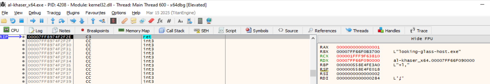

```bash
RAX = 1
```

El valor `1` indica que `Process32FirstW` se ejecutó correctamente y escribió la información del primer proceso en la estructura `PROCESSENTRY32W`.

```bash
RBX -> "looking-glass-host.exe"
```

`RBX` sigue conservando el nombre del proceso que `al-khaser` pretende localizar.

```bash
RDI = 0x284
```

Ese valor coincide con el `handle` de la instantánea de procesos creada mediante `CreateToolhelp32Snapshot`.

Comprobamos que ahora `RDX` ya no contiene el puntero a la estructura `PROCESSENTRY32W`. Ha cambiado. Por eso hemos tenido que anotarlo en el paso anterior:
```bash
000000558E4FE040
```


-----


El nombre del proceso se encuentra en el campo `szExeFile`, cuyo desplazamiento es `0x2C`:
```bash
000000558E4FE040 + 0x2C
= 000000558E4FE06C
```

Pulsamos `F8` para ejecutar la instrucción `ret` y volver al código de `al-khaser`.

En el panel `Dump`, pulsamos `Ctrl + G` e introducimos:
```bash
000000558E4FE06C
```

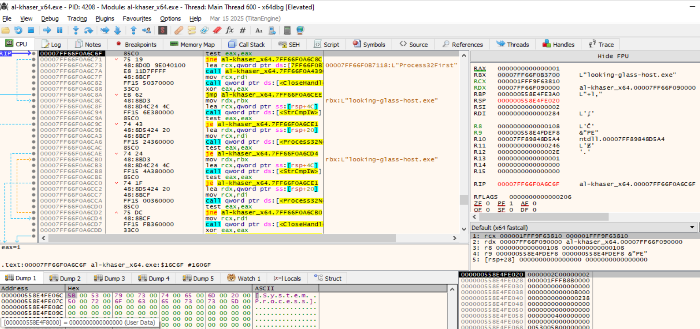


Vemos que la primera entrada recuperada por `Process32FirstW` corresponde a `[System Process]`.

-----


**Comparación del nombre del proceso:**

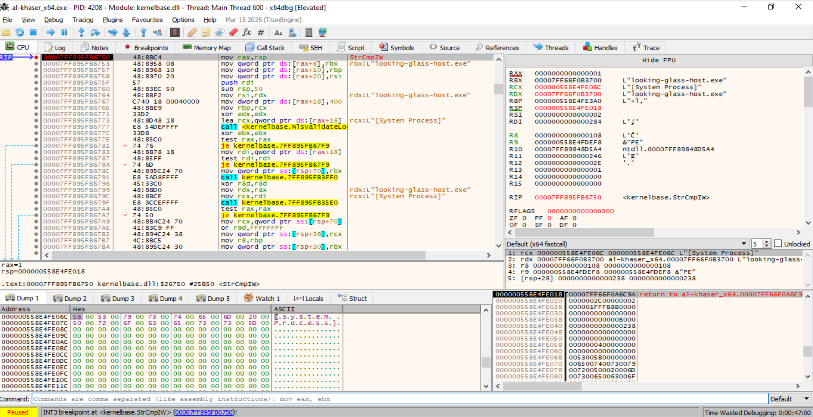

Los argumentos de `StrCmpIW` son:

```bash
RCX = nombre del proceso enumerado
RDX = nombre del proceso buscado
```

En esta ejecución:

```bash
RCX -> "[System Process]"
RDX -> "looking-glass-host.exe"
```

La comparación equivalente sería:

```bash
StrCmpIW(L"[System Process]", L"looking-glass-host.exe");
```

Como las cadenas no coinciden, `StrCmpIW` devolverá un valor distinto de cero. Después, el programa ejecutará:
```bash
lea rdx, [rsp+20]
mov rcx, rdi
call Process32NextW
```


Esta llamada sustituirá el contenido de la estructura por el siguiente proceso de la lista.

La lógica completa visible en la captura es:

```bash
Process32FirstW
        |
        v
Obtener szExeFile
        |
        v
StrCmpIW(proceso_actual, proceso_buscado)
        |
        +-- Coincidencia --> Rama de proceso detectado
        |
        +-- Sin coincidencia
                 |
                 v
          Process32NextW
                 |
                 +-- Repetir comparación
```


------

Pulsamos `Ctrl + F9` para ejecuta `StrCmpIW` hasta su instrucción `ret`. Pulsamos `F8` para volver al código de `al-khaser`, justo después de la llamada. Comprobamos el valor de `RAX`. Para una comparación sin coincidencia debe ser:
```bash
EAX != 0
```

```bash
StrCmpIW("[System Process]", "looking-glass-host.exe")
                         |
                         v
                     EAX != 0
                         |
                         v
                 test eax, eax
                         |
                         v
                      ZF = 0
                         |
                         v
             No se toma el salto JE
                         |
                         v
              Continúa Process32NextW
```

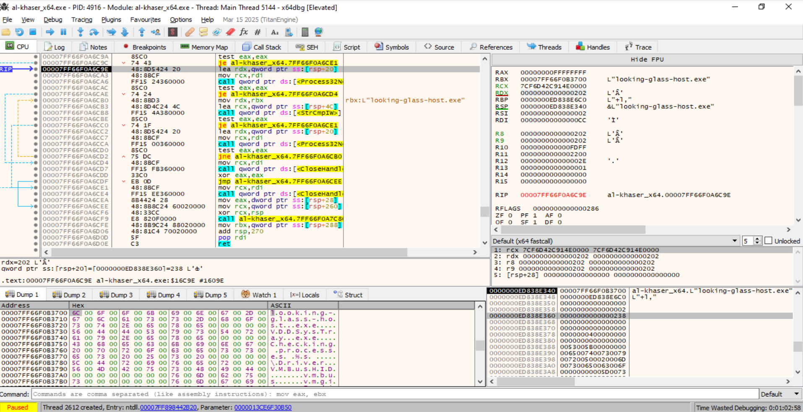

Vemos que `al-khaser` no ha encontrado el proceso buscado en esta comparación:
```bash
EAX = FFFFFFFF
ZF  = 0
```

Tras la llamada a `StrCmpIW`, el registro `EAX` contenía el valor `0xFFFFFFFF`, equivalente a `-1` como entero con signo. Este resultado distinto de cero indica que el nombre del proceso enumerado no coincidía con el indicador `looking-glass-host.exe`.

La instrucción `test eax, eax` estableció posteriormente el indicador `ZF` a cero. Por este motivo, no se tomó el salto condicional `je` correspondiente a la detección del proceso. La ejecución continuó con `Process32NextW` para obtener y comparar la siguiente entrada de la instantánea de procesos.

----

Tras una comparación sin coincidencia, `al-khaser` continúa el recorrido mediante `Process32NextW`:


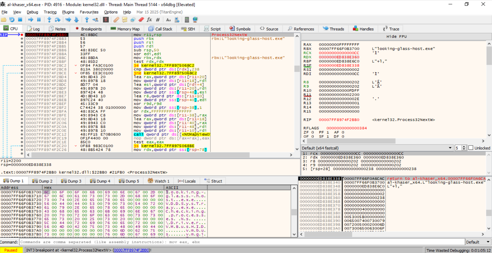

En la entrada de la función se observan:

```bash
RCX = 0xCC
RDX = 0x000000ED838E360
RBX -> "looking-glass-host.exe"
```

Su interpretación es:

```bash
Process32NextW(
    0xCC,                  // handle de la instantánea
    0x000000ED838E360      // estructura PROCESSENTRY32W
);
```

Dirección aparecerá el nuevo valor de `szExeFile`:
```bash
0x000000ED838E360 + 0x2C = 0x000000ED838E38C
```


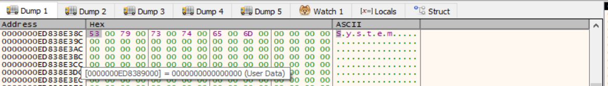

Vemos que tras llamar a `Process32NextW`, la estructura contiene:

```bash
System
```

El cambio de contenido demuestra que `Process32NextW` actualiza la estructura con cada nueva entrada y que `al-khaser` recorre secuencialmente los procesos activos del sistema.

Como conclusión, el análisis dinámico de la técnica **4.3.1. Enumerar procesos en ejecución** permitió verificar que `al-khaser` crea una instantánea de los procesos activos mediante `CreateToolhelp32Snapshot` con el indicador `TH32CS_SNAPPROCESS`, obtiene las entradas con `Process32FirstW` y continúa el recorrido con `Process32NextW`. Los nombres recuperados en el campo `szExeFile` se comparan mediante `StrCmpIW` con distintos indicadores asociados a entornos virtualizados o herramientas de análisis. Las evidencias observadas confirman que la herramienta recorre secuencialmente la lista de procesos y utiliza el resultado de las comparaciones como mecanismo de detección ambiental.

-----


> **Nota sobre técnicas complementarias**
>
> Por razones de alcance y para evitar la repetición de contenidos, esta memoria no desarrolla experimentalmente todas las técnicas pertenecientes a esta categoría. No obstante, las siguientes técnicas se encuentran documentadas y demostradas en el repositorio general del proyecto, donde pueden consultarse su fundamento teórico, implementación, procedimiento de análisis y evidencias obtenidas:
>
> * [Técnica 2: Detectar procesos de VirtualBox](https://github.com/soniasalido/cybersecurity/blob/main/Documentation/Malware/Master-ENIIT-Analisis-Malware-Reversing/modulo-11-TFM/modulo-deteccion-entornos-virtuales/modulo-evasion/fichas/04-processes.md#4102-an%C3%A1lisis-din%C3%A1mico-de-la-t%C3%A9cnica-432-detectar-procesos-de-virtualbox).
> * [Técnica 3: Detectar procesos de VMware](https://github.com/soniasalido/cybersecurity/blob/main/Documentation/Malware/Master-ENIIT-Analisis-Malware-Reversing/modulo-11-TFM/modulo-deteccion-entornos-virtuales/modulo-evasion/fichas/04-processes.md#4103-an%C3%A1lisis-den%C3%A1mico-de-la-t%C3%A9cnica-433-detectar-procesos-de-vmware).
> * [Técnica 4: Detectar herramientas de análisis y procesos de sandbox](https://github.com/soniasalido/cybersecurity/blob/main/Documentation/Malware/Master-ENIIT-Analisis-Malware-Reversing/modulo-11-TFM/modulo-deteccion-entornos-virtuales/modulo-evasion/fichas/04-processes.md#4104-an%C3%A1lisis-din%C3%A1mico-de-la-t%C3%A9cnica-434-detectar-herramientas-de-an%C3%A1lisis-y-procesos-de-sandbox)
>
> Estos contenidos se ofrecen como material técnico complementario y forman parte del trabajo práctico realizado durante el desarrollo del proyecto, aunque sus demostraciones completas no se reproducen en el presente documento.


<div style="page-break-after: always;"></div>


## 8.4. WMI

> **Ampliación y evidencias completas:** [ficha `05-wmi.md`][ficha-wmi]. El repositorio conserva capturas adicionales, herramientas, código y secuencias no incluidas en la memoria.


### Fundamento y propósito

**Windows Management Instrumentation (`WMI`)** es una infraestructura de administración incluida en los sistemas operativos Windows que permite consultar, supervisar y modificar numerosos elementos del sistema. A través de `WMI` es posible obtener información sobre el hardware, el sistema operativo, los procesos, los dispositivos instalados, las interfaces de red, la `BIOS`, los discos, los usuarios o los servicios.

Aunque `WMI` es una tecnología legítima utilizada por administradores, herramientas de inventario y soluciones de monitorización, también puede ser empleada por malware para realizar tareas de reconocimiento, evasión y ejecución. En el contexto del anti-análisis, una muestra puede ejecutar consultas `WMI` para determinar si se encuentra dentro de una máquina virtual, una `sandbox` o un entorno de laboratorio.

Las consultas se realizan normalmente mediante **WQL —WMI Query Language—**, un lenguaje similar a `SQL` que permite solicitar información a las distintas clases `WMI`. Algunos ejemplos habituales son:

```sql
SELECT * FROM Win32_Processor
```

```sql
SELECT * FROM Win32_ComputerSystem
```

```sql
SELECT * FROM Win32_BIOS
```

```sql
SELECT * FROM Win32_NetworkAdapterConfiguration
```

Estas consultas permiten **recuperar propiedades concretas del equipo**, como el número de núcleos del procesador, el tamaño del disco, el fabricante del sistema, el modelo del dispositivo, la dirección `MAC` o la versión de la `BIOS`. El malware compara posteriormente los valores obtenidos con una serie de indicadores asociados a entornos virtualizados.

**Entre los principales elementos que pueden analizarse mediante `WMI` se encuentran los siguientes:**
* El número de procesadores o núcleos disponibles.
* El tamaño de los discos físicos o lógicos.
* El fabricante y el modelo del sistema.
* El número de serie y la versión de la `BIOS`.
* La información de la placa base.
* Los identificadores de dispositivos `Plug and Play`.
* El fabricante y el nombre del controlador gráfico.
* Las direcciones `MAC` de los adaptadores de red.
* La existencia de sensores de temperatura.
* El tiempo transcurrido desde el último arranque.
* El momento del último reinicio de los adaptadores de red.

Por ejemplo, una muestra puede consultar la clase `Win32_ComputerSystem` y comprobar si las propiedades `Manufacturer` o `Model` contienen cadenas como `VMware`, `VirtualBox` o `innotek GmbH`. También puede consultar `Win32_BIOS` para buscar valores como `VBOX`, `QEMU`, `BOCHS` o `PARALLELS`.

De forma similar, mediante la clase `Win32_NetworkAdapterConfiguration`, el malware puede recuperar las direcciones `MAC` del sistema y comparar sus primeros `bytes` con prefijos asignados habitualmente a determinados hipervisores. Entre ellos se encuentran `08:00:27`, asociado a `VirtualBox`, y distintos prefijos utilizados por `VMware`, como `00:05:69`, `00:0C:29`, `00:1C:14` o `00:50:56`.

La técnica también puede emplearse para **detectar configuraciones de laboratorio poco realistas.** Una máquina con un único núcleo, un disco de tamaño reducido, números de serie vacíos o ausencia de determinados sensores puede ser interpretada como una máquina virtual o una sandbox. No obstante, estas comprobaciones no son determinantes de forma aislada, ya que algunos equipos físicos pueden presentar características similares.

Además de recopilar información, **`WMI` permite ejecutar acciones sobre el sistema**. Una muestra puede utilizar la clase `Win32_Process` y su método `Create` para iniciar nuevos procesos. Esta forma de ejecución puede dificultar el seguimiento del árbol de procesos cuando la `sandbox` depende exclusivamente de la interceptación de funciones tradicionales como `CreateProcessInternalW` dentro del proceso analizado.

`WMI` también puede utilizarse para **crear tareas programadas** mediante la clase `Win32_ScheduledJob`. Sin embargo, este mecanismo se encuentra ligado al antiguo comando `AT` y presenta importantes limitaciones en las versiones modernas de Windows, por lo que su uso es menos frecuente.

Otra variante consiste en **consultar información temporal del sistema**. Mediante la propiedad `LastBootUpTime` de la clase `Win32_OperatingSystem`, el malware puede calcular el tiempo de actividad del equipo. Un tiempo demasiado corto puede indicar que la `sandbox` acaba de iniciarse, mientras que un tiempo excesivamente largo o incoherente puede revelar que la máquina virtual ha sido restaurada desde un `snapshot` antiguo.

De forma similar, la propiedad `TimeOfLastReset` de `Win32_NetworkAdapter` permite comprobar **cuándo se reinició por última** vez un adaptador de red. Los valores anómalos pueden utilizarse como indicio adicional de restauración de `snapshots` o manipulación del entorno.

Desde el punto de vista técnico, la interacción nativa con `WMI` suele realizarse mediante interfaces `COM`. El flujo general incluye la inicialización de `COM`, la creación de una instancia de `IWbemLocator`, la conexión con un espacio de nombres como `ROOT\CIMV2`, la ejecución de la consulta mediante `IWbemServices::ExecQuery` y la recuperación de los resultados mediante objetos como `IEnumWbemClassObject` e `IWbemClassObject`.

El uso de `WMI` puede identificarse durante el análisis estático mediante la presencia de funciones, interfaces, clases o cadenas relacionadas con esta infraestructura. Algunos indicadores relevantes son:

```bash
CoInitialize
CoInitializeEx
CoCreateInstance
IWbemLocator
IWbemServices
ExecQuery
ExecMethod
ExecMethodAsync
ROOT\CIMV2
Win32_Processor
Win32_ComputerSystem
Win32_BIOS
Win32_Process
```

También pueden encontrarse consultas `WQL` completas embebidas en el binario o construidas dinámicamente durante la ejecución.

En `PowerShell`, la misma información puede obtenerse mediante `cmdlets` como `Get-WmiObject` o `Get-CimInstance`. Por ejemplo:

```powershell
Get-CimInstance -ClassName Win32_BIOS
```

```powershell
Get-CimInstance -ClassName Win32_ComputerSystem
```

```powershell
Get-CimInstance -ClassName Win32_Processor
```

En consecuencia, la técnica `WMI` debe entenderse como un mecanismo versátil que permite al malware combinar reconocimiento del entorno, detección de virtualización, comprobación de `snapshots` y ejecución de procesos. Su principal ventaja reside en que ofrece acceso uniforme a una gran cantidad de información del sistema mediante una única infraestructura de administración.

Sin embargo, sus resultados deben interpretarse conjuntamente con otras comprobaciones. La presencia de un solo indicador, como un disco pequeño o un número reducido de núcleos, no demuestra por sí sola que el sistema sea virtual. Por ello, las muestras más avanzadas suelen combinar varias consultas `WMI` con técnicas basadas en registro, procesos, archivos, hardware y temporización antes de modificar su comportamiento o finalizar la ejecución.


### Demostración dinámica: consulta de la BIOS

Vamos a analizar la consulta del número de serie de la BIOS mediante WMI, que es distinta de las comprobaciones del registro o de las tablas SMBIOS.

La secuencia que buscamos es:

```bash
ROOT\CIMV2
    ↓
SELECT * FROM Win32_BIOS
    ↓
IWbemServices::ExecQuery
    ↓
IEnumWbemClassObject::Next
    ↓
IWbemClassObject::Get(L"SerialNumber")
    ↓
comparación con indicadores de virtualización
    ↓
resultado booleano
```

Al-khaser incluye esta técnica como serial_number_bios_wmi: consulta Win32_BIOS, recupera la propiedad SerialNumber y analiza el texto obtenido buscando valores asociados con entornos virtualizados. La clase Win32_BIOS representa los atributos de la BIOS visibles para Windows.

localizar la llamada principal

Reiniciamos al-khaser y en x64dbg abrimos:

```bash
CPU → clic derecho → Search for
→ Current Module
→ String references
```

Busca primero:

```bash
SerialNumber from BIOS
```

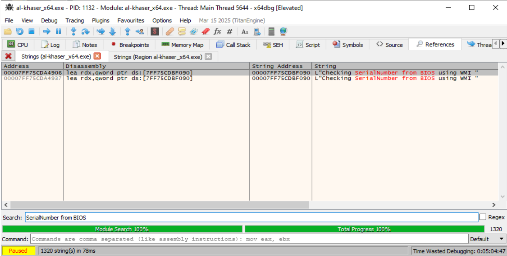


Las dos referencias están muy próximas, separadas por 0x31 bytes, por lo que probablemente pertenecen al mismo bloque de control o a dos rutas adyacentes de impresión. No conviene asumir todavía cuál conduce a la comprobación real. La primera llamada tras el lea rdx será normalmente la función de impresión. No es la comprobación de BIOS.

-----


Ya podemos afirmar que:
- existe una comprobación denominada Checking SerialNumber from BIOS using WMI;
- la rutina encargada se encuentra en al-khaser_x64+ADF500;
- la función devuelve su resultado en EAX;
- en esta ejecución devuelve 1;
- el resultado se pasa en ECX a una función de presentación.

Sin embargo, todavía no se ve:
- la consulta SELECT * FROM Win32_BIOS;
- la propiedad SerialNumber;
- el número de serie obtenido;
- el patrón con el que se compara;
- la condición exacta que provoca el retorno 1.


---------------


Colocamos un breakpoint directamente en la entrada de la función:

```bash
00007FF75CDADF500
```

Para ello hacemos doble click en la instrucción:
```bash
call al-khaser_x64.7FF75CDADF500
```

Colocamos el Breakpoint. Eliminamos el breakpoints anteriores, reiniciamos al-khaser, y ejecutamos con F9:


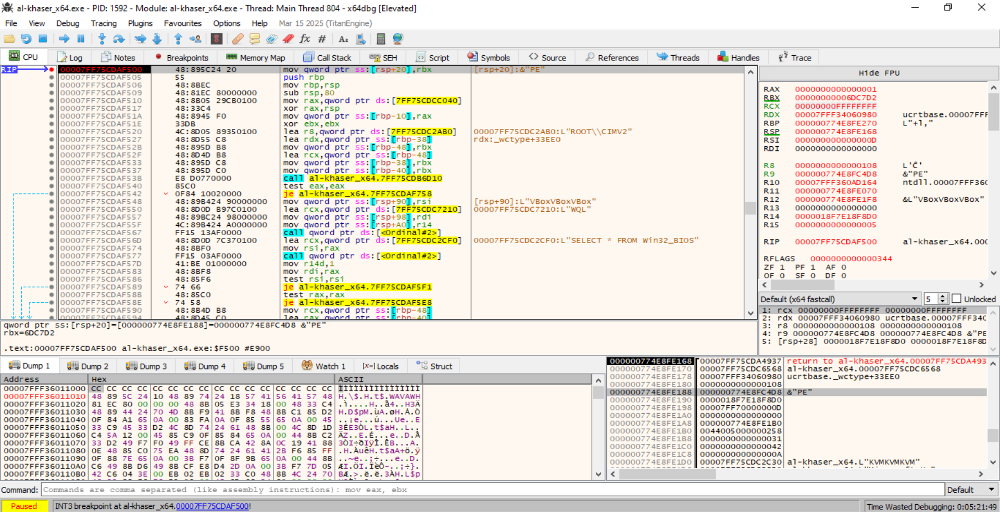


Hemos entrado en la función correcta para consultar el número de serie de la BIOS mediante WMI:
```bash
al-khaser_x64+ADF500
```

La función situada en `al-khaser_x64+ADF500` inicializa una conexión WMI con el namespace `ROOT\CIMV2`. Posteriormente crea dos cadenas `BSTR: WQL` como lenguaje de consulta y `SELECT * FROM Win32_BIOS` como sentencia destinada a enumerar la información de la BIOS expuesta al sistema operativo. Las asignaciones se validan antes de preparar la llamada a `IWbemServices::ExecQuery`. Esta captura confirma la consulta de la clase `Win32_BIOS`, aunque todavía no muestra la recuperación ni el análisis de la propiedad `SerialNumber`.

-------

Colocamos un breakpoint inmediatamente después de `call r10` y ejecuta con `F9`:

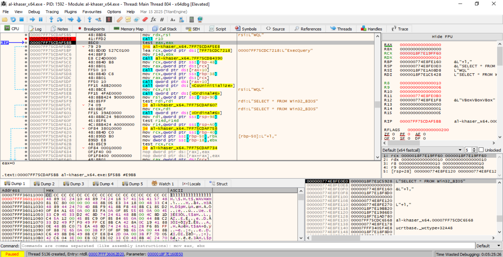


Estamos justo despues de ejecutar `IWbemServices::ExecQuery` para la `BIOS`. Comprobamos que la consulta de la BIOS mediante WMI se ha ejecutado correctamente.

La llamada a `IWbemServices::ExecQuery` se ejecuta utilizando el lenguaje `WQL` y la consulta `SELECT * FROM Win32_BIOS`. Tras la llamada, `EAX` contiene `0x00000000`, correspondiente a `S_OK`. Asimismo, la variable local situada en `[RBP-0x38]` contiene un puntero no nulo a un objeto `IEnumWbemClassObject`. Esto confirma que la consulta WMI se ha completado correctamente y que al-khaser dispone de un enumerador válido para recuperar las propiedades de la BIOS.

------


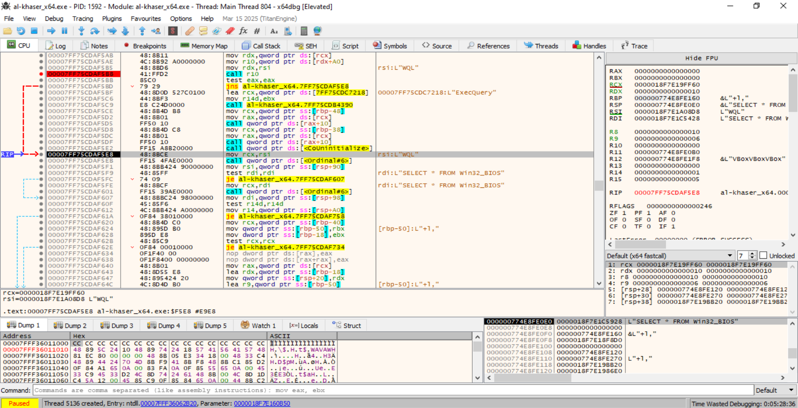

Esta captura confirma que ExecQuery ha terminado correctamente y que el flujo entra ahora en la enumeración de los objetos Win32_BIOS.

Tras completarse correctamente IWbemServices::ExecQuery, la rutina libera las cadenas BSTR utilizadas para el lenguaje WQL y la consulta SELECT * FROM Win32_BIOS. Posteriormente recupera desde la variable local [RBP-0x40] un puntero válido a IEnumWbemClassObject. El código inicializa una variable destinada a recibir un objeto IWbemClassObject y otra para almacenar el número de resultados, comenzando así la preparación de una llamada a IEnumWbemClassObject::Next. Esta secuencia confirma que al-khaser procede a recorrer los objetos BIOS devueltos por WMI.


```bash
ADF620  mov rcx,qword ptr [rbp-40]
```

Ese puntero no contiene aún el número de serie. Es un objeto IEnumWbemClassObject que permite recorrer los resultados de:

```bash
SELECT * FROM Win32_BIOS
```

Ver el objeto devuelto por Next:
```bash
mov rax,[rcx]
lea rdx,[rbp-18]
mov [rsp+20],rdx
lea r9,[rbp-50]
...
call qword ptr [...]
```

Esa llamada corresponde a algo equivalente a:

```bash
enumerator->Next(
    timeout,
    1,
    &biosObject,
    &returnedObjects
);
```

Las variables importantes son:

```bash
[RBP-50] → puntero al objeto Win32_BIOS
[RBP-18] → cantidad de objetos devueltos
```


---- 


```bash
mov rcx,[rbp-28]
```
Comprobamos que ahora:
```bash
RCX = 000002421C130BE8
```
Hacemos clic derecho sobre RCX y seleccionamos:
```bash
Follow in Dump
```

En el Dump, en esa dirección, aparecen los bytes:
```bash
30 00 00 00
```

Interpretados como UTF-16LE:

```bash
30 00 → U+0030 → carácter "0"
00 00 → terminador nulo
```

Por tanto, la propiedad WMI ha devuelto:

```bash
SerialNumber = L"0"
```

```bash
Consulta WMI:       SELECT * FROM Win32_BIOS
Propiedad obtenida: SerialNumber
Tipo del VARIANT:   VT_BSTR
Valor recuperado:   "0"
Condición:           número de serie exactamente igual a "0"
Resultado:           detección positiva
```


-----

La consulta a la clase Win32_BIOS recupera la propiedad SerialNumber mediante IWbemClassObject::Get. El valor se devuelve en un VARIANT de tipo VT_BSTR, cuyo campo bstrVal apunta a la cadena Unicode "0". La rutina busca inicialmente la subcadena VMware mediante StrStrIW; al no encontrarla, comprueba de forma explícita que el primer carácter sea 0x0030 y que el siguiente sea el terminador nulo 0x0000. Al cumplirse ambas condiciones, el flujo salta a la ruta de detección positiva. De este modo, al-khaser considera sospechosa una BIOS cuyo número de serie sea exactamente "0".


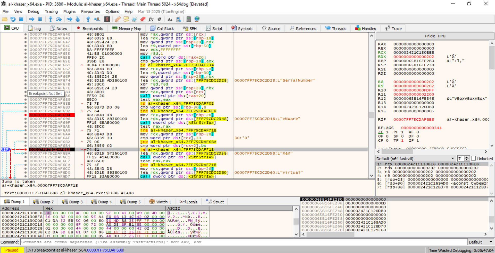


Secuencia completa:
```bash
SELECT * FROM Win32_BIOS
        ↓
Get(L"SerialNumber")
        ↓
VARIANT de tipo VT_BSTR
        ↓
SerialNumber = L"0"
        ↓
comparación del carácter '0'
        ↓
comprobación del terminador nulo
        ↓
ZF = 1
        ↓
salto a ADF71B
```

La propiedad SerialNumber recuperada mediante WMI contiene la cadena Unicode "0", representada en memoria por los bytes 30 00 00 00. La rutina comprueba que el primer carácter sea 0x0030 y que el siguiente sea el terminador nulo 0x0000. Ambas comparaciones se cumplen, dejando ZF=1. En consecuencia, la instrucción je situada en al-khaser_x64+ADF6B8 toma el salto hacia al-khaser_x64+ADF71B, ruta utilizada para procesar el número de serie como indicador de un entorno potencialmente virtualizado.


<div style="page-break-after: always;"></div>


## 8.5. Timing

> **Ampliación y evidencias completas:** [ficha `06-timing.md`][ficha-timing]. El repositorio conserva capturas adicionales, herramientas, código y secuencias no incluidas en la memoria.


### Fundamento y propósito

La técnica `timing` es un mecanismo de evasión anti-VM, anti-sandbox y anti-debug basado en la medición del tiempo que tarda el sistema en ejecutar determinadas instrucciones, funciones o bloques de código. Su objetivo es detectar retrasos anómalos provocados por la intervención de un hipervisor, una sandbox o un depurador.

Para ello, el malware puede utilizar funciones e instrucciones como `Sleep`, `GetTickCount`, `GetTickCount64`, `QueryPerformanceCounter`, `RDTSC`, `RDTSCP` o `CPUID`. También puede comparar varias fuentes temporales para identificar inconsistencias entre ellas.

Si el tiempo medido supera un umbral esperado, o si un retardo ha sido acelerado artificialmente, la muestra puede interpretar que se encuentra en un entorno de análisis. Como respuesta, puede finalizar su ejecución, retrasar su actividad, ocultar su funcionalidad o ejecutar un comportamiento alternativo.

Estas comprobaciones deben considerarse heurísticas, ya que la carga del sistema, la planificación de procesos o el hardware utilizado también pueden producir variaciones temporales y generar falsos positivos.


----


### Fuentes temporales e indicadores

El objetivo general consiste en identificar tres tipos de anomalías:

Retardos menores de lo esperado, asociados a la aceleración de funciones como Sleep.
Retardos mayores de lo esperado, producidos por un hipervisor, un VM Exit, un breakpoint o la ejecución paso a paso.
Inconsistencias entre contadores, cuando distintas fuentes temporales ofrecen resultados incompatibles.

A continuación, se muestra un resumen visual de las principales técnicas:
```bash
timing
|
+-- 1. Detección de aceleración de Sleep
|   |
|   +-- Sleep
|   +-- SleepEx
|   +-- NtDelayExecution
|   +-- WaitForSingleObject
|   +-- Temporizadores de Windows
|
+-- 2. Medición con contadores del sistema
|   |
|   +-- GetTickCount
|   +-- GetTickCount64
|
+-- 3. Medición de alta resolución
|   |
|   +-- QueryPerformanceCounter
|   +-- QueryPerformanceFrequency
|
+-- 4. Medición de ciclos de CPU
|   |
|   +-- RDTSC
|   +-- RDTSCP
|   +-- LFENCE
|
+-- 5. Medición del coste de instrucciones sensibles
|   |
|   +-- CPUID
|       +-- Posible VM Exit
|
+-- 6. Comparación entre fuentes temporales
|   |
|   +-- GetTickCount64
|   +-- QueryPerformanceCounter
|   +-- RDTSC / RDTSCP
|   +-- timeGetTime
|   +-- GetSystemTimeAsFileTime
|
+-- 7. Detección de pausas del depurador
    |
    +-- Breakpoints
    +-- Ejecución paso a paso
    +-- Instrumentación dinámica
    +-- Pausas anómalas entre dos mediciones
```

La siguiente tabla resume la finalidad de cada variante:
| Técnica                           | Qué mide                                     | Indicador observado                                  | Posible interpretación                                        |
| --------------------------------- | -------------------------------------------- | ---------------------------------------------------- | ------------------------------------------------------------- |
| Aceleración de `Sleep`            | Duración real de una función de espera       | Tiempo inferior al solicitado                        | Posible sandbox que acelera o elimina retardos                |
| `GetTickCount` / `GetTickCount64` | Milisegundos transcurridos desde el arranque | Intervalo demasiado corto o demasiado largo          | Aceleración temporal o pausa de ejecución                     |
| `QueryPerformanceCounter`         | Tiempo transcurrido con alta resolución      | Diferencia superior o inferior al intervalo esperado | Instrumentación, depuración o manipulación temporal           |
| `RDTSC` / `RDTSCP`                | Ciclos de procesador consumidos              | Número de ciclos anormalmente elevado                | Posible virtualización, interrupción o depuración             |
| `CPUID` y `VM Exit`               | Coste temporal de ejecutar `CPUID`           | Sobrecoste repetido respecto a una referencia        | Posible intervención del hipervisor                           |
| Comparación entre fuentes         | Coherencia entre varios contadores           | Resultados incompatibles entre relojes               | Manipulación parcial de las fuentes temporales                |
| Pausas del depurador              | Tiempo consumido por un bloque breve         | Intervalo excesivamente elevado                      | Posible `breakpoint`, ejecución paso a paso o instrumentación |


Desde el punto de vista del análisis, ninguna de estas comprobaciones debe interpretarse de forma aislada como una confirmación absoluta de virtualización o depuración. La carga del sistema, las interrupciones, la planificación de procesos, el ahorro energético y las características del hardware también pueden alterar las mediciones.

Por ello, una evidencia más sólida requiere repetir las pruebas, utilizar valores estadísticos como la mediana o el percentil 95 y comparar los resultados obtenidos en una máquina física, una máquina virtual y una ejecución bajo depurador.

----


### Demostración de aceleración de Sleep

El objetivo de esta prueba es comprobar si `timing_lab` puede detectar que una función de espera ha sido acelerada u omitida. Para ello, se comparan dos ejecuciones:

1. Una ejecución de referencia en la que `Sleep` se ejecuta normalmente.
2. Una ejecución controlada en la que la llamada a `Sleep` se neutraliza mediante `x64dbg`.

La segunda ejecución reproduce experimentalmente el comportamiento de una sandbox que elimina o reduce los retardos para acelerar el análisis. Por tanto, la prueba no demuestra que la máquina virtual empleada esté manipulando el tiempo, sino que la herramienta es capaz de detectar dicha alteración cuando se introduce de forma controlada.

##### Ejecución de referencia

La prueba se ejecuta inicialmente sin modificar el flujo del programa:

```bat
timing_lab.exe --sleep --sleep-ms 5000 --csv sleep_normal.csv
```

La herramienta registra una instantánea temporal antes de invocar `Sleep`, solicita una espera de 5000 milisegundos y obtiene una segunda instantánea al finalizar. Para medir el intervalo utiliza simultáneamente:

- `GetTickCount`.
- `GetTickCount64`.
- `QueryPerformanceCounter`.
- El TSC calibrado mediante `RDTSC`.

En la ejecución de referencia se obtuvieron los siguientes valores:

| Fuente temporal | Tiempo observado |
|---|---:|
| `GetTickCount` | 5016 ms |
| `GetTickCount64` | 5016 ms |
| `QueryPerformanceCounter` | 5005,482 ms |
| TSC calibrado | 5005,607 ms |
| Evaluación | Compatible con el retardo solicitado |

Los resultados muestran que las distintas fuentes temporales registraron aproximadamente los 5000 milisegundos solicitados. Por tanto, en esta ejecución no se detectó aceleración ni omisión de la espera.

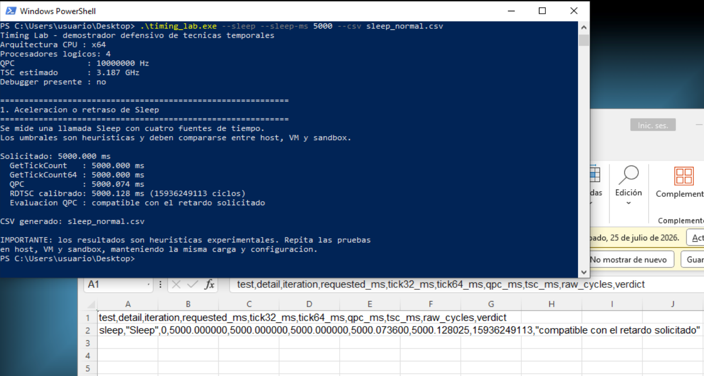

> **Figura 6.9.6.1. Ejecución de referencia de `Sleep`.** Las fuentes temporales registran una duración aproximada de 5000 milisegundos, por lo que `timing_lab` clasifica el resultado como compatible con el retardo solicitado.

##### Localización de la llamada a `Sleep`

A continuación, se abre `timing_lab.exe` en `x64dbg` y se configura la línea de comandos:

```text
"C:\Users\usuario\Desktop\timing_lab.exe" --sleep --sleep-ms 5000 --csv "C:\Users\usuario\Desktop\sleep_acelerado.csv"
```

Para interceptar la función se establece un punto de ruptura:

```text
bp kernel32.Sleep
```

En algunos sistemas, `kernel32.Sleep` actúa como un *thunk* que transfiere la ejecución a `kernelbase.Sleep`. Si el primer punto de ruptura no se activa, puede utilizarse:

```text
bp kernelbase.Sleep
```

Al alcanzar la función, el registro `RCX` contiene su primer argumento según la convención de llamadas de Windows x64:

```text
RCX = 0000000000001388
```

El valor hexadecimal `0x1388` equivale a 5000 en decimal, por lo que confirma que la herramienta ha solicitado una espera de cinco segundos.

| Elemento | Valor observado | Interpretación |
|---|---|---|
| `RIP` | Dirección de `kernel32.Sleep` | Punto de entrada de la función |
| `RCX` | `0x1388` | Retardo solicitado |
| `0x1388` en decimal | `5000` | Duración expresada en milisegundos |
| `[RSP]` | Dirección dentro de `timing_lab.exe` | Retorno posterior a la llamada |


> **Figura 6.9.6.2. Interceptación de `Sleep(5000)` en `x64dbg`.** El registro `RCX` contiene `0x1388`, equivalente a un retardo solicitado de 5000 milisegundos.

##### Localización de la instrucción `call`

El primer valor almacenado en la pila, `[RSP]`, corresponde a la dirección de retorno dentro de `timing_lab.exe`. Para localizar el código que realiza la llamada se selecciona dicho valor y se utiliza:

```text
Follow QWORD in Disassembler
```

En la ejecución analizada se localizó la siguiente secuencia:

```asm
00007FF6E5092EFD  call qword ptr ds:[<&Sleep>]
00007FF6E5092F03  movups xmmword ptr ss:[rsp+70], xmm6
```

La dirección `00007FF6E5092F03`, almacenada en `[RSP]`, coincide con la instrucción inmediatamente posterior al `call`. Esto confirma que la llamada a `Sleep` se realiza desde `00007FF6E5092EFD`.

Estas direcciones son específicas de la compilación y ejecución analizadas. Pueden variar en otras versiones del ejecutable o debido a mecanismos como ASLR.

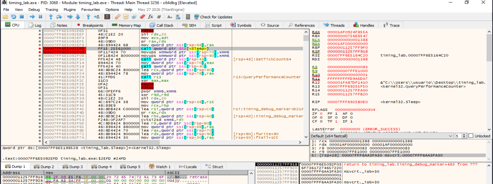

> **Figura 6.9.6.3. Localización de la llamada a `Sleep` dentro de `timing_lab.exe`.** La dirección almacenada en `[RSP]` coincide con la instrucción posterior al `call`, permitiendo identificar con precisión la llamada que debe neutralizarse.

##### Neutralización controlada de la espera

Para simular la aceleración de `Sleep`, se sustituye únicamente la instrucción:

```asm
call qword ptr ds:[<&Sleep>]
```

por instrucciones `NOP`. En `x64dbg` se realiza mediante:

```text
Clic derecho → Binary → Fill with NOPs
```

Como la llamada ocupa varios bytes, el resultado presenta una secuencia equivalente a:

```asm
nop
nop
nop
nop
nop
nop
```

Esta modificación impide que se invoque `Sleep`, pero conserva el resto del flujo de ejecución. No es necesario alterar manualmente `RIP` o `RSP`, lo que evita corromper la pila del proceso.


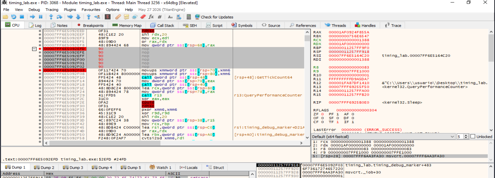

> **Figura 6.9.6.4. Neutralización de la llamada a `Sleep`.** La instrucción `call` se sustituye por instrucciones `NOP`, simulando la omisión del retardo por parte de un entorno de análisis.

##### Creación del ejecutable de prueba

La ejecución en la que se localiza la llamada ya ha quedado afectada por las pausas introducidas durante la depuración. Por este motivo, no debe utilizarse para obtener la medición final.

El parche se guarda mediante:

```text
File → Patch file
```

La copia modificada se almacena con un nombre diferente:

```text
timing_lab_sleep_bypass.exe
```

De esta manera se conserva intacto el ejecutable original y se dispone de dos archivos diferenciados:

| Ejecutable | Finalidad |
|---|---|
| `timing_lab.exe` | Ejecución de referencia |
| `timing_lab_sleep_bypass.exe` | Simulación de omisión de `Sleep` |

##### Ejecución de la copia parcheada

La copia modificada se ejecuta desde el principio con los mismos parámetros:

```text
"C:\Users\usuario\Desktop\timing_lab_sleep_bypass.exe" --sleep --sleep-ms 5000 --csv "C:\Users\usuario\Desktop\sleep_acelerado.csv"
```

Para mantener abierta la consola al finalizar puede colocarse un punto de ruptura en una función de terminación, por ejemplo:

```text
bp kernel32.FatalExit
```

No deben establecerse puntos de ruptura en `Sleep`, `GetTickCount`, `GetTickCount64` o `QueryPerformanceCounter` durante esta ejecución. Cualquier pausa situada entre la instantánea inicial y la final incrementaría artificialmente el intervalo y alteraría los resultados.

La ejecución debe continuar sin intervención hasta alcanzar el punto de ruptura final.

##### Resultados obtenidos

La ejecución parcheada produjo los siguientes valores:

| Campo | Resultado |
|---|---:|
| Tiempo solicitado | 5000 ms |
| `GetTickCount` | 0 ms |
| `GetTickCount64` | 0 ms |
| `QueryPerformanceCounter` | 0,0023 ms |
| TSC calibrado | 0,0012 ms |
| Ciclos registrados | 2994 |
| Evaluación | Posible aceleración u omisión |

Aunque la herramienta conserva como referencia los 5000 milisegundos solicitados mediante la opción `--sleep-ms`, la llamada a `Sleep` no llega a ejecutarse. En consecuencia, las distintas fuentes temporales registran únicamente el tiempo necesario para continuar con las instrucciones posteriores.

El criterio heurístico aplicado por la herramienta considera una posible aceleración cuando el tiempo observado es inferior al 80 % del retardo solicitado:

```text
Umbral = 5000 ms × 0,80 = 4000 ms
```

El valor registrado mediante `QueryPerformanceCounter`, de 0,0023 milisegundos, se encuentra muy por debajo de este umbral. Por ello, el resultado se clasifica como:

```text
posible aceleracion/omision
```


> **Figura 6.9.6.5. Resultado de la ejecución parcheada.** Tras neutralizar la llamada a `Sleep`, `QueryPerformanceCounter` registra 0,0023 milisegundos frente a los 5000 milisegundos solicitados. La herramienta identifica correctamente una posible aceleración u omisión del retardo.

##### Evidencia exportada en CSV


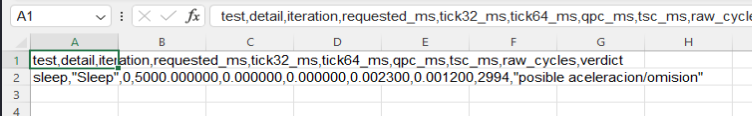

La herramienta genera el archivo:
```text
sleep_acelerado.csv
```

La fila correspondiente a la prueba contiene:

```csv
sleep,"Sleep",0,5000.000000,0.000000,0.000000,0.002300,0.001200,2994,"posible aceleracion/omision"
```

Las columnas registran:

| Columna | Contenido |
|---|---|
| `test` | Prueba ejecutada |
| `detail` | Función analizada |
| `iteration` | Número de iteración |
| `requested_ms` | Tiempo solicitado |
| `tick32_ms` | Medición de `GetTickCount` |
| `tick64_ms` | Medición de `GetTickCount64` |
| `qpc_ms` | Medición de `QueryPerformanceCounter` |
| `tsc_ms` | Duración aproximada calculada mediante el TSC |
| `raw_cycles` | Ciclos registrados |
| `verdict` | Evaluación heurística |

> **Figura 6.9.6.6. Evidencia exportada en formato CSV.** El archivo registra el tiempo solicitado, las mediciones obtenidas mediante las distintas fuentes temporales y la clasificación final de posible aceleración u omisión.

##### Comparación de resultados

| Ejecución | QPC observado | Evaluación |
|---|---:|---|
| Ejecutable original | 5005,482 ms | Compatible con el retardo solicitado |
| Ejecutable parcheado | 0,0023 ms | Posible aceleración u omisión |

La diferencia entre ambas ejecuciones confirma que la herramienta distingue correctamente entre una espera respetada y una espera eliminada artificialmente.

##### Conclusión de la prueba

La demostración permitió observar la secuencia completa de la técnica:

```text
Captura temporal inicial
        ↓
Retardo solicitado de 5000 ms
        ↓
Omisión controlada de la llamada a Sleep
        ↓
Captura temporal final
        ↓
Comparación con el umbral
        ↓
Clasificación como posible aceleración u omisión
```

Los resultados obtenidos demuestran que `timing_lab` puede detectar una alteración artificial de `Sleep`. La prueba debe interpretarse como una simulación controlada de la técnica y no como evidencia de que la máquina virtual o una sandbox real estén acelerando el tiempo.

La evidencia resulta especialmente sólida porque:

- Se dispone de una ejecución de referencia.
- Se identificó el argumento original de `Sleep`.
- Se localizó la instrucción `call` dentro del ejecutable.
- La espera se neutralizó sin modificar el resto del flujo.
- Las mediciones de QPC y TSC mostraron una reducción coherente.
- El resultado se exportó a un archivo CSV reproducible.


------


<div style="page-break-after: always;"></div>


## 8.6. CPU

> **Ampliación y evidencias completas:** [ficha `07-cpu.md`][ficha-cpu]. El repositorio conserva capturas adicionales, herramientas, código y secuencias no incluidas en la memoria.


### Fundamento: identificador del hipervisor

##### A) Fundamento de la técnica

La instrucción `CPUID` permite obtener información del procesador. Cuando se
ejecuta con `EAX = 0x40000000`, muchos hipervisores devuelven una cadena que
identifica la plataforma virtual. El malware puede comparar ese valor con
firmas conocidas y modificar su comportamiento si detecta una máquina virtual.

##### B) Registros utilizados

| Registro | Función |
|---|---|
| `EAX` | Contiene el valor `0x40000000` antes de ejecutar `CPUID` |
| `EBX` | Primera parte del identificador |
| `ECX` | Segunda parte del identificador |
| `EDX` | Tercera parte del identificador |

La concatenación de `EBX`, `ECX` y `EDX` forma una cadena de hasta doce
caracteres.

##### C) Identificadores de hipervisores

| Hipervisor | Identificador |
|---|---|
| VMware | `VMwareVMware` |
| VirtualBox | `VBoxVBoxVBox` |
| KVM | `KVMKVMKVM` |
| Hyper-V | `Microsoft Hv` |
| Xen | `XenVMMXenVMM` |
| Parallels | `prl hyperv` |
| bhyve | `bhyve bhyve` |

##### D) Evidencias en análisis estático

Durante el análisis estático deben buscarse:

- la instrucción `CPUID`;
- la constante `0x40000000`;
- movimientos desde `EBX`, `ECX` y `EDX` hacia memoria;
- cadenas asociadas a hipervisores;
- comparaciones y saltos condicionales posteriores.

La presencia aislada de `CPUID` no confirma una técnica anti-VM, ya que también
puede utilizarse para consultar características legítimas del procesador.

##### E) Evidencias en análisis dinámico

En el depurador se debe comprobar:

1. que `EAX` contiene `0x40000000`;
2. los valores devueltos en `EBX`, `ECX` y `EDX`;
3. la cadena resultante;
4. la comparación realizada;
5. el cambio de flujo posterior.

La evidencia es sólida cuando la cadena identifica un hipervisor y el resultado
condiciona la ejecución de la muestra.

##### F) Recomendación de firma

Una firma puede combinar:

```text
CPUID
+
0x40000000
+
escritura de EBX, ECX y EDX
+
identificador de hipervisor
```

No se recomienda basar la detección únicamente en una cadena, ya que puede
estar cifrada, fragmentada o modificada por el hipervisor.


### Indicadores y criterios de análisis

##### Instrucciones y elementos comprobados

| Técnica | Instrucción o elemento | Finalidad |
|---|---|---|
| Identificador del hipervisor | `CPUID` con `EAX = 0x40000000` | Obtener la firma del hipervisor |
| Bit de hipervisor | `CPUID` con `EAX = 1` | Comprobar el bit 31 de `ECX` |
| Tablas internas | `SIDT`, `SGDT`, `SLDT` | Consultar `IDT`, `GDT` y `LDT` |
| Instrucciones exóticas | MMX u otras extensiones | Detectar emulación incompleta |
| Instrucciones ilegales | Opcodes no válidos o privilegiados | Analizar la gestión de excepciones |
| Backdoor de VMware | `IN`, `VMXh`, puertos `VX` y `VY` | Detectar VMware |

##### Indicadores de virtualización

Los principales indicadores son:

- cadenas como `VMwareVMware`, `VBoxVBoxVBox` o `KVMKVMKVM`;
- bit 31 de `ECX` activado;
- direcciones anómalas de `IDT`, `GDT` o `LDT`;
- excepciones o resultados diferentes ante instrucciones poco comunes;
- respuesta válida de la backdoor de VMware.

##### Detección durante el análisis estático

Durante el análisis estático deben buscarse:

```text
CPUID
0x40000000
0x80000000
SIDT
SGDT
SLDT
VMXh
VMwareVMware
VBoxVBoxVBox
KVMKVMKVM
```

También deben revisarse comparaciones, manejadores de excepciones y saltos
condicionales posteriores.

##### Criterio de interpretación estática

La presencia de una instrucción sensible no demuestra por sí sola una técnica
anti-VM. Debe observarse la secuencia:

```text
instrucción
+
obtención de un indicador
+
comparación
+
salto condicional
```

##### Detección durante el análisis dinámico

En el depurador interesa registrar:

- valores de entrada y salida de `CPUID`;
- contenido de `EBX`, `ECX` y `EDX`;
- estado del bit 31 de `ECX`;
- direcciones devueltas por `SIDT`, `SGDT` y `SLDT`;
- excepciones generadas;
- resultado de la instrucción `IN`;
- comportamiento posterior de la muestra.

##### Criterio de interpretación dinámica

La evidencia es sólida cuando se demuestra que el resultado de la comprobación
modifica el flujo de ejecución, por ejemplo, evitando ejecutar el payload o
finalizando el proceso.

```text
comprobación
→ indicador positivo
→ cambio de flujo
→ comportamiento evasivo
```

##### Resumen de herramientas útiles

| Herramienta | Utilidad |
|---|---|
| Ghidra / IDA / Cutter | Localizar instrucciones, constantes y comparaciones |
| x32dbg / x64dbg | Observar registros, excepciones y saltos |
| Pafish | Comprobar indicadores anti-VM conocidos |
| Al-Khaser | Ejecutar pruebas CPU y anti-sandbox |
| WinDbg | Analizar excepciones y contexto del procesador |
| Procmon | Correlacionar la técnica CPU con otros indicadores del sistema |


---


### Demostración dinámica: identificador del hipervisor

##### Objetivo de la demostración

El objetivo de esta práctica es demostrar dinámicamente cómo **Pafish** identifica el hipervisor mediante la instrucción `CPUID`. La prueba se ha ejecutado en una máquina virtual de **VirtualBox** y se ha seguido con **x64dbg**.

La demostración debe acreditar cuatro hechos:

1. Pafish ejecuta `CPUID` con `EAX = 0x40000000`.
2. Los registros `EBX`, `ECX` y `EDX` devuelven el identificador del hipervisor.
3. Pafish reconstruye la cadena `VBoxVBoxVBox`.
4. La cadena se compara con una firma interna y la función devuelve un resultado positivo.

El flujo observado es:

```text
CPUID(EAX = 0x40000000)
        ↓
EBX, ECX y EDX contienen "VBox"
        ↓
Reconstrucción de "VBoxVBoxVBox"
        ↓
memcmp con la firma interna de VirtualBox
        ↓
Coincidencia
        ↓
Detección positiva
```

> Las direcciones indicadas corresponden al ejecutable `pafish64.exe` utilizado en esta práctica. Pueden variar en otras compilaciones.

---

##### 1. Localización de la comprobación CPU

Como punto de partida se buscaron las referencias a cadenas que contienen el término `cpuid`. Entre los resultados aparece el texto:

```text
Check hypervisor by checking cpuid hypervisor vendor for known VM vendors
```

Esta cadena permite localizar la parte de Pafish encargada de comprobar identificadores conocidos de hipervisores.

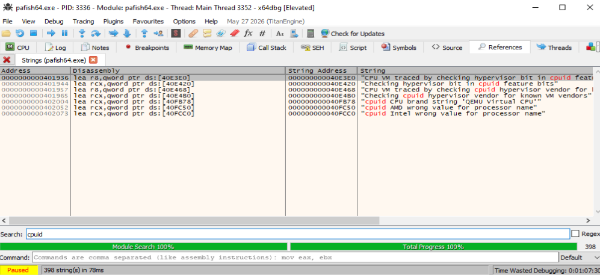

*Figura 1. Referencias a cadenas relacionadas con las comprobaciones `CPUID` de Pafish.*

A continuación se buscó el patrón de bytes correspondiente a la instrucción:

```asm
0F A2    ; CPUID
```

La búsqueda devolvió varias apariciones, ya que Pafish utiliza `CPUID` para diferentes finalidades: fabricante de la CPU, bit de hipervisor, marca del procesador y comprobación del identificador del hipervisor.


*Figura 2. Apariciones del opcode `0F A2` dentro de `pafish64.exe`.*

La instancia relevante se localizó en `0x404BB6`, precedida por:

```asm
00404BB1  mov eax,40000000h
00404BB6  cpuid
```

El valor `0x40000000` identifica la hoja utilizada habitualmente para consultar información específica del hipervisor.


*Figura 3. Localización de la instrucción `CPUID` asociada a la hoja del hipervisor.*

---

##### 2. Ejecución de `CPUID`

Se colocó un breakpoint en:

```text
0x404BB6
```

Antes de ejecutar la instrucción se verificó que:

```text
EAX = 0x40000000
RIP = 0x404BB6
```


*Figura 4. Estado de los registros antes de ejecutar `CPUID`.*

Tras ejecutar una única instrucción, el flujo avanzó a `0x404BB8`. Los registros mostraron:

```text
EBX = 0x786F4256
ECX = 0x786F4256
EDX = 0x786F4256
EAX = 0x40000006
```

El valor `0x786F4256`, interpretado según el orden *little-endian*, corresponde a:

```text
56 42 6F 78 → "VBox"
```

Por tanto:

```text
EBX + ECX + EDX
= VBox + VBox + VBox
= VBoxVBoxVBox
```

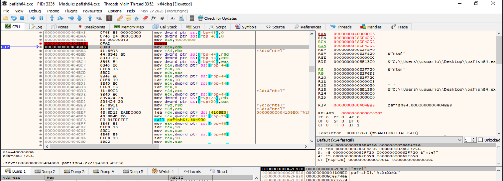

*Figura 5. Resultado devuelto por `CPUID`: los tres registros contienen el bloque ASCII `VBox`.*

El valor de `EAX = 0x40000006` indica la hoja máxima específica del hipervisor disponible en el entorno. No forma parte de la cadena, pero confirma que la consulta ha sido atendida por la capa de virtualización.

---

##### 3. Almacenamiento de los resultados

Pafish conserva los tres bloques devueltos por `CPUID` en variables locales:

```asm
00404BBD  mov dword ptr [rbp-44],r8d
00404BC1  mov dword ptr [rbp-48],ecx
00404BC4  mov dword ptr [rbp-4C],eax
```

En este punto x64dbg ya interpreta el contenido almacenado como `"VBox"`.


*Figura 6. Almacenamiento de los valores procedentes de `EBX`, `ECX` y `EDX`.*

Esta captura demuestra que los valores devueltos por el procesador no son residuales: Pafish los conserva para construir y evaluar posteriormente el identificador.

---

##### 4. Reconstrucción del identificador

Pafish convierte cada valor de cuatro bytes en caracteres mediante una rutina de formato. La primera llamada utiliza:

```text
RCX → buffer de destino
RDX → "%c%c%c%c"
R8  → 0x786F4256
```

La llamada se realiza en:

```asm
00404BFA  call pafish64.4049B0
```


*Figura 7. Preparación de la primera llamada de formato para convertir el valor en caracteres ASCII.*

Después de la primera llamada, el buffer contiene:

```text
VBox
```


*Figura 8. Primer bloque reconstruido en memoria: `VBox`.*

La segunda llamada procesa el valor guardado desde `ECX`. Tras ejecutarla, el buffer contiene:

```text
VBoxVBox
```


*Figura 9. Segundo bloque añadido al buffer: `VBoxVBox`.*

La tercera llamada procesa el último bloque, procedente de `EDX`. El resultado final es:

```text
VBoxVBoxVBox
```

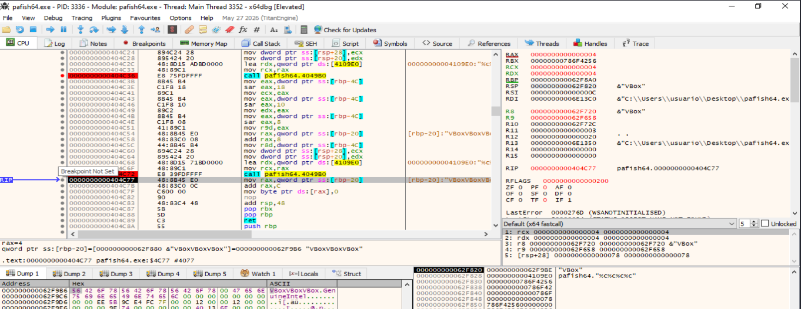

*Figura 10. Identificador completo reconstruido por Pafish: `VBoxVBoxVBox`.*

Esta evidencia demuestra que Pafish ha transformado los valores devueltos por `CPUID` en una cadena utilizable para la detección.

---

##### 5. Localización de la firma interna

Se buscó la cadena `VBoxVBoxVBox` dentro del módulo. La firma se encuentra en:

```text
0x410A2A
```

y es referenciada desde el código de comparación.


*Figura 11. Referencia estática a la firma interna `VBoxVBoxVBox`.*

Pafish mantiene una lista de identificadores conocidos, entre ellos:

```text
KVMKVMKVM
Microsoft Hv
VMwareVMware
XenVMMXenVMM
prl hyperv
VBoxVBoxVBox
```

El programa recorre estas firmas y compara cada una con el identificador obtenido dinámicamente.

---

##### 6. Comparación con las firmas conocidas

El bucle de comparación termina llamando a `memcmp` en:

```asm
00405098  call <JMP.&memcmp>
```

La longitud utilizada es de doce bytes, que coincide con el tamaño del identificador.


*Figura 12. Bucle utilizado para comparar el identificador obtenido con las firmas conocidas.*

En la iteración correspondiente a VirtualBox, los argumentos antes de `memcmp` son:

```text
RCX → "VBoxVBoxVBox"    ; identificador obtenido
RDX → "VBoxVBoxVBox"    ; firma interna
R8  = 0x000000000000000C
```


*Figura 13. Comparación de los doce bytes de `VBoxVBoxVBox` con la firma interna de VirtualBox.*

Esta captura es la evidencia principal de que Pafish no se limita a obtener la cadena: la utiliza de forma explícita para clasificar el entorno.

---

##### 7. Resultado y rama de detección positiva

Después de ejecutar `memcmp`, la ejecución alcanza:

```asm
0040509D  test eax,eax
0040509F  jne 4050A8
004050A1  mov eax,1
```

El resultado observado es:

```text
EAX = 0
ZF  = 1
```

`memcmp` devuelve cero cuando ambas cadenas son idénticas. La instrucción `test eax,eax` activa la bandera cero y, por ello, el salto `JNE` no se toma. El flujo continúa hacia:

```asm
mov eax,1
```

lo que representa el retorno positivo de la función.

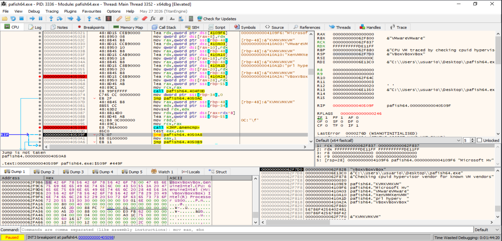

*Figura 14. `memcmp` devuelve cero, `ZF` queda activada y la ejecución continúa por la rama de detección positiva.*

---

##### 8. Resumen de puntos de ruptura

| Finalidad | Dirección | Evidencia obtenida |
|---|---:|---|
| Interceptar la consulta | `0x404BB6` | `EAX = 0x40000000` |
| Observar el resultado | `0x404BB8` | `EBX`, `ECX` y `EDX` contienen `VBox` |
| Ver los valores almacenados | `0x404BC7` | Los tres bloques se guardan en variables locales |
| Primera conversión | `0x404BFA` | Buffer parcial `VBox` |
| Segunda conversión | `0x404C36` | Buffer parcial `VBoxVBox` |
| Tercera conversión | `0x404C72` | Buffer completo `VBoxVBoxVBox` |
| Comparación final | `0x405098` | `memcmp` compara doce bytes |
| Decisión | `0x40509F` | `EAX = 0`, `ZF = 1`, `JNE` no tomado |
| Retorno positivo | `0x4050A1` | La función devuelve verdadero |

---

##### 9. Interpretación de los resultados

La evidencia obtenida permite reconstruir toda la lógica de la técnica:

```text
1. Pafish carga EAX con 0x40000000.
2. Ejecuta CPUID.
3. EBX, ECX y EDX devuelven 0x786F4256.
4. Cada valor representa la cadena ASCII "VBox".
5. Pafish reconstruye "VBoxVBoxVBox".
6. La cadena se compara con una firma interna mediante memcmp.
7. memcmp devuelve cero.
8. ZF queda activada y JNE no se toma.
9. La función devuelve 1.
```

La detección no se basa únicamente en la presencia de `CPUID`. La prueba demuestra la secuencia completa de obtención, reconstrucción, comparación y decisión.

---

##### 10. Conclusión de la demostración

La ejecución controlada de Pafish en x64dbg demuestra que la herramienta identifica VirtualBox mediante la hoja `0x40000000` de `CPUID`. Los registros `EBX`, `ECX` y `EDX` devuelven tres bloques `VBox`, que Pafish concatena para formar `VBoxVBoxVBox`.

Posteriormente, el identificador se compara con una lista de firmas internas. La comparación con `VBoxVBoxVBox` devuelve cero, activa `ZF` y dirige el flujo hacia la rama positiva. En consecuencia, Pafish determina correctamente que se está ejecutando dentro de un hipervisor conocido.

La demostración puede considerarse completa porque acredita:

- la instrucción y el valor de entrada;
- los registros de salida;
- la reconstrucción del identificador;
- la firma utilizada;
- el resultado de la comparación;
- la decisión final del programa.

------------------------------


<div style="page-break-after: always;"></div>


## 8.7. Hardware

> **Ampliación y evidencias completas:** [ficha `08-hardware.md`][ficha-hardware]. El repositorio conserva capturas adicionales, herramientas, código y secuencias no incluidas en la memoria.


### Fundamento y propósito

La técnica **Hardware** comprende el conjunto de comprobaciones mediante las cuales un programa obtiene y analiza información sobre los componentes físicos —o aparentemente físicos— del sistema en el que se ejecuta. En el contexto del análisis de malware, estas comprobaciones se utilizan principalmente para determinar si el código se encuentra en un equipo real o dentro de una **máquina virtual**, una **sandbox automatizada** o un laboratorio de análisis.

Los entornos virtualizados deben emular distintos dispositivos, como discos, procesadores, adaptadores gráficos, interfaces de red, controladores de audio y firmware. Esta emulación puede dejar artefactos reconocibles en los nombres de los dispositivos, identificadores de fabricante, controladores instalados, valores devueltos por el firmware o características de los recursos disponibles. El malware puede consultar estos datos y compararlos con valores asociados a plataformas como VMware, VirtualBox, QEMU o Microsoft Hyper-V.

El funcionamiento general de la técnica puede resumirse en las siguientes fases:

1. **Recopilación de información:** el programa consulta las propiedades de uno o varios componentes del sistema.
2. **Normalización de los datos:** transforma o prepara los valores obtenidos para facilitar su comparación.
3. **Búsqueda de indicadores:** comprueba si aparecen cadenas, identificadores o configuraciones relacionadas con entornos virtualizados.
4. **Evaluación del entorno:** combina uno o varios resultados para estimar si el sistema es real o pertenece a un laboratorio.
5. **Modificación del comportamiento:** si detecta indicios de análisis, puede finalizar, permanecer inactivo, retrasar su ejecución, mostrar un comportamiento benigno o evitar desplegar su carga maliciosa.

Estas verificaciones no siempre buscan una marca explícita de virtualización. Algunas se basan en **heurísticas**, como una cantidad anormalmente baja de memoria RAM, un disco de poca capacidad, un único procesador lógico o la ausencia de dispositivos habituales. Por tanto, una comprobación aislada no demuestra necesariamente que el programa esté aplicando una técnica de evasión. La detección resulta más fiable cuando se correlacionan varias consultas de hardware con decisiones posteriores en el flujo de ejecución.


### Indicadores y criterios de análisis

Las técnicas Hardware analizan las características de los componentes físicos o emulados del sistema para determinar si el malware se está ejecutando en un equipo real, una máquina virtual o una sandbox. Estas comprobaciones pueden buscar **artefactos directos**, como nombres de fabricantes asociados a hipervisores, o utilizar **indicadores heurísticos**, como una cantidad reducida de memoria, almacenamiento o periféricos.

> **Criterio de clasificación:** esta tabla agrupa las técnicas según el componente de hardware examinado. El mecanismo utilizado para obtener la información puede coincidir con otras categorías, como CPU, WMI, Registro o consultas genéricas del sistema operativo.

##### Tabla resumen

| Componente analizado | Técnica de detección | Indicador observado | Tipo de detección | Fiabilidad aproximada |
|---|---|---|---|---|
| Disco duro | Comprobación del nombre o modelo del disco | Cadenas como `VBOX`, `VMware`, `QEMU` o `VIRTUAL HD` | Directa | Media-alta |
| Disco duro | Comprobación del fabricante o `Vendor ID` | Identificadores relacionados con dispositivos virtuales | Directa | Alta cuando el valor está expuesto |
| Almacenamiento | Comprobación de la capacidad del disco | Disco de tamaño muy reducido | Heurística | Baja de forma aislada |
| Memoria RAM | Comprobación de la memoria física instalada | Cantidad de RAM inferior a un umbral | Heurística | Baja de forma aislada |
| Procesador | Comprobación del número de procesadores o núcleos | Uno o pocos procesadores lógicos | Heurística | Baja-media |
| Procesador | Análisis del modelo, fabricante o topología | Valores genéricos, simplificados o incoherentes | Directa o heurística | Media |
| BIOS, UEFI y SMBIOS | Comprobación del fabricante y modelo del sistema | Referencias a VMware, VirtualBox, QEMU u otros hipervisores | Directa | Alta |
| Adaptador gráfico | Comprobación del fabricante, controlador o descripción | Identificadores PCI, controladores o descripciones virtuales | Directa | Media-alta |
| Dispositivo de audio | Comprobación de su presencia y funcionamiento | Ausencia de dispositivo o configuración multimedia mínima | Heurística | Baja |
| Sensores | Comprobación de temperatura, batería u otros sensores | Información inexistente, vacía o no disponible | Heurística | Baja |
| Adaptador de red | Comprobación del fabricante o prefijo MAC | Prefijo asociado a un proveedor de virtualización | Directa | Media |
| Periféricos | Enumeración de USB, cámara, impresoras o monitores | Ausencia o escasa diversidad de dispositivos | Heurística | Media cuando se combina |
| Conjunto del sistema | Correlación de múltiples indicadores | Varios componentes presentan artefactos o recursos anómalos | Compuesta | Alta cuando las evidencias son coherentes |

##### Clasificación visual

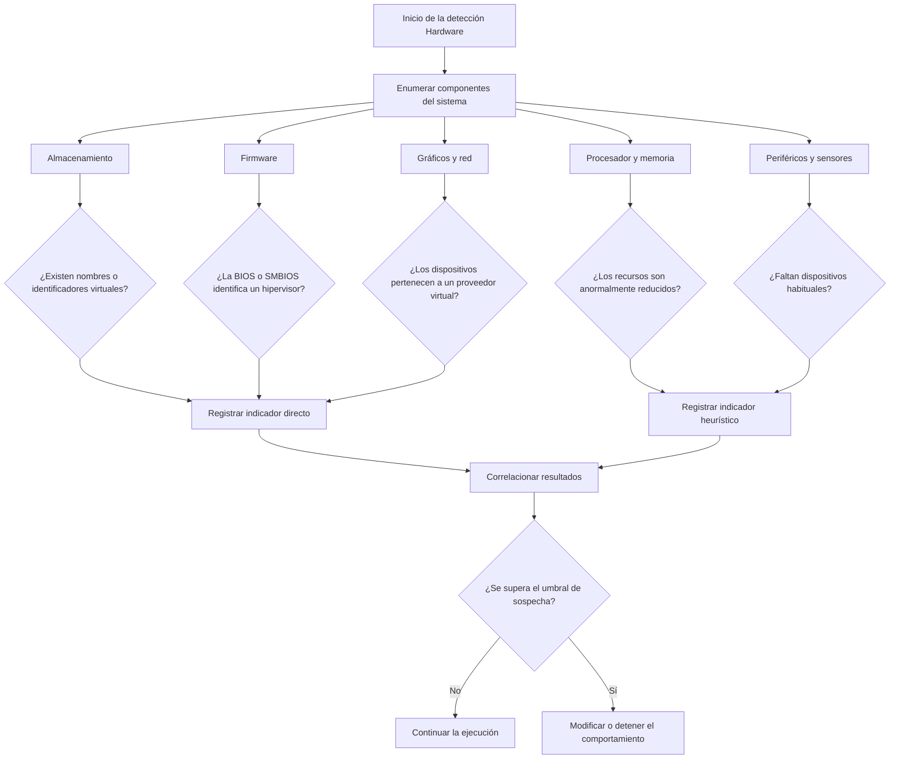
```mermaid
flowchart TD
    A[Inicio de la detección Hardware] --> B[Enumerar componentes del sistema]

    B --> C[Almacenamiento]
    B --> D[Procesador y memoria]
    B --> E[Firmware]
    B --> F[Gráficos y red]
    B --> G[Periféricos y sensores]

    C --> H{¿Existen nombres o identificadores virtuales?}
    D --> I{¿Los recursos son anormalmente reducidos?}
    E --> J{¿La BIOS o SMBIOS identifica un hipervisor?}
    F --> K{¿Los dispositivos pertenecen a un proveedor virtual?}
    G --> L{¿Faltan dispositivos habituales?}

    H --> M[Registrar indicador directo]
    J --> M
    K --> M

    I --> N[Registrar indicador heurístico]
    L --> N

    M --> O[Correlacionar resultados]
    N --> O

    O --> P{¿Se supera el umbral de sospecha?}
    P -- No --> Q[Continuar la ejecución]
    P -- Sí --> R[Modificar o detener el comportamiento]
```

##### Lectura del resumen

Las técnicas Hardware pueden organizarse en tres grupos principales:

1. **Identificación directa de componentes virtuales.**  
   Busca nombres, fabricantes, modelos, controladores o identificadores asociados a VMware, VirtualBox, QEMU, Hyper-V u otras plataformas.

2. **Evaluación heurística de recursos.**  
   Comprueba si el equipo dispone de poca memoria, pocos procesadores, un disco pequeño o una configuración excesivamente limitada.

3. **Análisis de presencia y diversidad de dispositivos.**  
   Examina si existen elementos habituales en un equipo real, como audio, sensores, monitores, dispositivos USB, cámara o batería.

Los indicadores directos suelen ser más específicos, pero pueden ocultarse o modificarse. Los indicadores heurísticos son más difíciles de eliminar por completo, aunque generan más falsos positivos. Por este motivo, las muestras más avanzadas combinan varias comprobaciones y toman la decisión final a partir de una puntuación o conjunto de evidencias.


### Demostración dinámica sobre almacenamiento

##### Comprobación del nombre y modelo del disco

###### Objetivo de la demostración

El objetivo de este análisis dinámico es demostrar que **al-khaser** enumera los dispositivos de almacenamiento presentes en el sistema, recupera su identificador hardware y busca en él cadenas asociadas a plataformas de virtualización.

Aunque el título de la técnica hace referencia al nombre y al modelo del disco, la implementación analizada no solicita directamente el nombre amigable mediante `SPDRP_FRIENDLYNAME`. En su lugar, consulta la propiedad:

```text
SPDRP_HARDWAREID = 0x00000001
```

El identificador hardware puede contener información sobre el tipo de dispositivo, el fabricante virtual, el producto y su revisión. En el entorno analizado apareció la cadena:

```text
SCSI\DiskVBOX__________HARDDISK_1.0
```

La presencia de `VBOX` permite asociar el dispositivo con **Oracle VirtualBox**.

###### Muestra y entorno de análisis

La prueba se realizó con los siguientes elementos:

| Elemento | Valor |
|---|---|
| Muestra | `al-khaser_x64.exe` |
| Arquitectura | x86-64 |
| Depurador | x64dbg |
| Entorno observado | Máquina virtual VirtualBox |
| Técnica ejecutada | Enumeración SetupAPI y análisis de `SPDRP_HARDWAREID` |
| Indicador detectado | `VBOX` |

Las direcciones absolutas mostradas en las capturas corresponden exclusivamente a esta ejecución. Debido a ASLR, pueden cambiar al reiniciar el proceso. Por esta razón, los breakpoints deben asociarse preferentemente a las llamadas importadas del módulo y no a direcciones absolutas permanentes.

###### Breakpoints utilizados

Las llamadas relevantes se localizaron mediante la búsqueda de llamadas intermodulares de `al-khaser_x64.exe`.

| Función | Finalidad |
|---|---|
| `SetupDiGetClassDevsW` | Obtener el conjunto de dispositivos pertenecientes a la clase de unidades de disco |
| `SetupDiEnumDeviceInfo` | Enumerar cada dispositivo del conjunto |
| `SetupDiGetDeviceRegistryPropertyW` | Consultar el tamaño necesario y recuperar `SPDRP_HARDWAREID` |
| `StrStrIW` | Buscar cadenas de virtualización sin distinguir mayúsculas y minúsculas |
| `SetupDiDestroyDeviceInfoList` | Liberar el conjunto de información de dispositivos |

En la ejecución documentada se observaron, entre otras, las siguientes instrucciones de llamada:

```text
0x00007FF71C84F323  SetupDiGetClassDevsW
0x00007FF71C84F363  SetupDiEnumDeviceInfo
0x00007FF71C84F3A7  SetupDiGetDeviceRegistryPropertyW
0x00007FF71C84F40F  SetupDiGetDeviceRegistryPropertyW
0x00007FF71C84F428  StrStrIW
```

###### Obtención de la clase de dispositivos de disco

La primera API relevante es `SetupDiGetClassDevsW`. En la convención de llamada x64 de Windows, los cuatro primeros argumentos se reciben mediante `RCX`, `RDX`, `R8` y `R9`.

Durante la ejecución se observaron los siguientes valores:

| Registro | Valor | Interpretación |
|---|---:|---|
| `RCX` | `0x00007FF71C85A980` | Puntero al GUID de la clase |
| `RDX` | `0x0` | No se proporciona enumerador |
| `R8` | `0x0` | No se proporciona ventana |
| `R9` | `0x2` | `DIGCF_PRESENT` |

El contenido apuntado por `RCX` era:

```text
67 E9 36 4D 25 E3 CE 11 BF C1 08 00 2B E1 03 18
```

Interpretado según el orden *little-endian*, corresponde al GUID:

```text
{4D36E967-E325-11CE-BFC1-08002BE10318}
```

Este valor identifica `GUID_DEVCLASS_DISKDRIVE`. Por tanto, la llamada equivale conceptualmente a:

```cpp
SetupDiGetClassDevsW(
    &GUID_DEVCLASS_DISKDRIVE,
    nullptr,
    nullptr,
    DIGCF_PRESENT
);
```

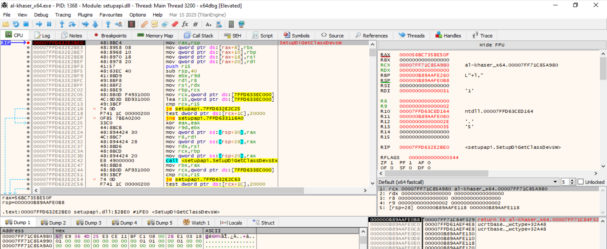

**Figura 8.7.1-1.** Al-khaser solicita los dispositivos presentes pertenecientes a la clase de unidades de disco.

###### Enumeración de los dispositivos

`SetupDiGetClassDevsW` devolvió un identificador `HDEVINFO`, que posteriormente fue utilizado como primer argumento de `SetupDiEnumDeviceInfo`.

En la primera iteración se observaron:

| Registro | Valor | Interpretación |
|---|---:|---|
| `RCX` | `0x000002913ABA3EF0` | Identificador `HDEVINFO` |
| `RDX` | `0x0` | Índice del primer dispositivo |
| `R8` | `0x000000B89AAFE110` | Puntero a `SP_DEVINFO_DATA` |

El uso del índice cero demuestra que la muestra comienza enumerando el primer dispositivo del conjunto. La misma rutina puede repetirse con índices sucesivos cuando existen varios dispositivos.


**Figura 8.7.1-2.** El valor `HDEVINFO` se reutiliza para enumerar el dispositivo de índice cero.

###### Primera consulta de `SPDRP_HARDWAREID`

La muestra invoca dos veces `SetupDiGetDeviceRegistryPropertyW`. La primera llamada no proporciona un buffer de salida. Su finalidad es determinar el tamaño necesario para almacenar la propiedad.

En la entrada de la función se observaron:

| Argumento | Ubicación | Valor |
|---|---|---:|
| `DeviceInfoSet` | `RCX` | `0x000002913ABA3EF0` |
| `DeviceInfoData` | `RDX` | `0x000000B89AAFE110` |
| `Property` | `R8D` | `0x1` |
| `PropertyRegDataType` | `R9` | `0x000000B89AAFE108` |
| `PropertyBuffer` | `[RSP+28]` | `0x0` |

El valor `R8D = 1` identifica la propiedad `SPDRP_HARDWAREID`. La presencia de un buffer nulo confirma que se trata de una consulta preparatoria.

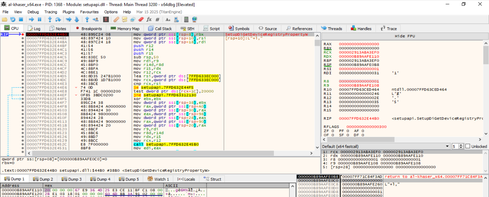

**Figura 8.7.1-3.** Primera consulta de `SPDRP_HARDWAREID`, utilizada para calcular el tamaño necesario.

###### Recuperación del identificador hardware

En la segunda invocación de `SetupDiGetDeviceRegistryPropertyW`, al-khaser proporciona memoria válida para recibir la propiedad.

Los valores observados fueron:

| Argumento | Ubicación | Valor |
|---|---|---:|
| `Property` | `R8D` | `0x1` |
| `PropertyBuffer` | `[RSP+28]` | `0x000002913AB98B80` |
| `PropertyBufferSize` | `[RSP+30]` | `0x138` |
| `RequiredSize` | `[RSP+38]` | `0x000000B89AAFE104` |

El tamaño `0x138` equivale a 312 bytes. Tras el retorno, el buffer contenía una lista Unicode de identificadores hardware. El primer valor relevante era:

```text
SCSI\DiskVBOX__________HARDDISK_1.0
```

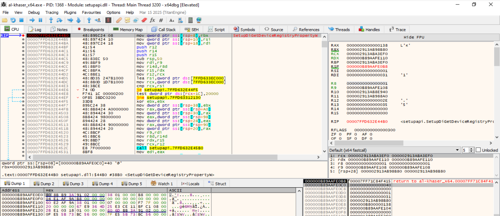

**Figura 8.7.1-4.** Segunda consulta de la propiedad, esta vez con un buffer válido y tamaño suficiente.

###### Búsqueda del indicador `VBOX`

Una vez recuperado el identificador, la muestra utiliza `StrStrIW` para buscar cadenas relacionadas con entornos virtualizados.

En la llamada analizada se observaron:

| Registro | Contenido |
|---|---|
| `RCX` | `L"SCSI\\DiskVBOX__________HARDDISK_1.0"` |
| `RDX` | `L"vbox"` |

La función `StrStrIW` realiza una búsqueda Unicode sin distinguir mayúsculas y minúsculas. Por ello, la subcadena `vbox` coincide con el valor `VBOX` presente en el identificador.


**Figura 8.7.1-5.** El buffer recuperado se compara con el indicador `vbox`.

La función devolvió:

```text
RAX = 0x000002913AB98B92
```

Este valor apunta directamente al inicio de:

```text
VBOX__________HARDDISK_1.0
```

La dirección inicial del buffer era:

```text
0x000002913AB98B80
```

La diferencia entre ambos punteros es:

```text
0x000002913AB98B92 - 0x000002913AB98B80 = 0x12
```

El desplazamiento `0x12` equivale a 18 bytes o nueve caracteres UTF-16. Esos nueve caracteres corresponden exactamente a:

```text
SCSI\Disk
```

Por tanto, el valor devuelto por `StrStrIW` apunta al comienzo de `VBOX`, confirmando que la búsqueda tuvo éxito.

###### Modificación del flujo de control

Tras el retorno de `StrStrIW`, al-khaser ejecuta:

```asm
test rax, rax
jne  0x00007FF71C84F496
```

La lógica es:

```text
RAX = 0     → no se encontró el indicador
RAX != 0    → se encontró el indicador
```

En la ejecución documentada:

```text
RAX = 0x000002913AB98B92
ZF  = 0
```

Como `RAX` es distinto de cero, `test rax, rax` desactiva el *Zero Flag* y la instrucción `jne` dirige el flujo hacia la rama de detección positiva.

El código visible muestra además las búsquedas alternativas de:

```text
vmware
qemu
virtual
```

Estas comparaciones solo son necesarias cuando la búsqueda anterior no produce una coincidencia. En este caso, la detección de `VBOX` permite saltar directamente a la ruta positiva.

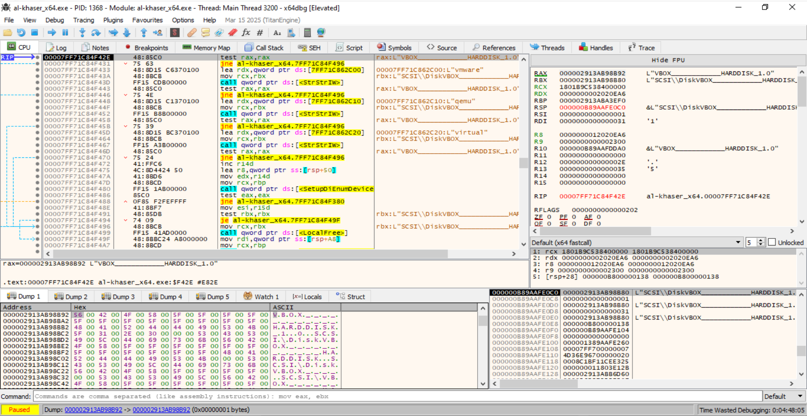

**Figura 8.7.1-6.** `RAX` contiene un puntero válido hacia `VBOX`; `test rax, rax` y `jne` modifican el flujo de ejecución.

###### Flujo completo de la técnica

```text
SetupDiGetClassDevsW
        ↓
GUID_DEVCLASS_DISKDRIVE + DIGCF_PRESENT
        ↓
SetupDiEnumDeviceInfo
        ↓
SetupDiGetDeviceRegistryPropertyW
        ↓
SPDRP_HARDWAREID
        ↓
SCSI\DiskVBOX__________HARDDISK_1.0
        ↓
StrStrIW(buffer, "vbox")
        ↓
RAX = dirección de "VBOX"
        ↓
test rax, rax
        ↓
ZF = 0
        ↓
jne → rama de detección positiva
```

###### Resultado de la demostración

El análisis dinámico demuestra que al-khaser:

1. selecciona la clase de dispositivos de disco;
2. enumera los dispositivos presentes;
3. consulta la propiedad `SPDRP_HARDWAREID`;
4. recupera un identificador que contiene `VBOX`;
5. busca ese indicador mediante `StrStrIW`;
6. obtiene un puntero distinto de cero;
7. altera el flujo de control hacia la rama de detección positiva.

No se trata, por tanto, de una consulta informativa aislada. El identificador recuperado se utiliza expresamente para decidir si el sistema pertenece a un entorno virtualizado.

###### Conclusión

La técnica queda demostrada de forma completa. Al-khaser identifica VirtualBox mediante el valor `VBOX` presente en el identificador hardware del disco y utiliza el resultado para modificar su flujo de ejecución.

Desde un punto de vista terminológico, la denominación más precisa sería **comprobación del identificador hardware del disco**. No obstante, puede mantenerse el título “comprobación del nombre y modelo del disco”, siempre que se aclare que la evidencia procede de `SPDRP_HARDWAREID` y que dicha propiedad incorpora información identificativa del fabricante virtual y del producto.


##### Comprobación de la capacidad del almacenamiento

La comprobación de la capacidad del almacenamiento no se reproduce nuevamente en este apartado, ya que esta técnica fue demostrada previamente dentro de la [categoría WMI.](https://github.com/soniasalido/cybersecurity/blob/main/Documentation/Malware/Master-ENIIT-Analisis-Malware-Reversing/modulo-11-TFM/modulo-deteccion-entornos-virtuales/modulo-evasion/fichas/wmi.md#542-consultar-el-tama%C3%B1o-de-los-discos) En dicho análisis se obtuvo el tamaño del disco mediante consultas a clases como Win32_LogicalDisk o Win32_DiskDrive, recuperando la propiedad Size y comparando su valor con un umbral mínimo.

Aunque la capacidad reducida del disco puede considerarse un indicador relacionado con el hardware, en la demostración anterior el mecanismo utilizado para obtener la información fue WMI. Por este motivo, repetir el mismo procedimiento en este capítulo supondría una duplicación del análisis sin aportar nuevas evidencias relevantes.

Debe distinguirse entre la técnica de evasión, que consiste en detectar una capacidad de almacenamiento anormalmente baja, y el mecanismo de consulta empleado para obtener ese dato. La capacidad del disco también podría recuperarse mediante funciones como GetDiskFreeSpaceExW o mediante DeviceIoControl con el código IOCTL_DISK_GET_LENGTH_INFO. Sin embargo, todas estas variantes persiguen el mismo objetivo: identificar configuraciones de almacenamiento reducidas, habituales en determinadas máquinas virtuales y sandboxes.

Por tanto, para evitar redundancias y mantener una clasificación clara de las técnicas analizadas, se remite a la [demostración dinámica realizada en el apartado correspondiente a WMI](https://github.com/soniasalido/cybersecurity/blob/main/Documentation/Malware/Master-ENIIT-Analisis-Malware-Reversing/modulo-11-TFM/modulo-deteccion-entornos-virtuales/modulo-evasion/fichas/wmi.md#542-consultar-el-tama%C3%B1o-de-los-discos), donde ya se documentó la obtención y evaluación de la capacidad del almacenamiento.


----


<div style="page-break-after: always;"></div>


## 8.8. Human Interaction

> **Ampliación y evidencias completas:** [ficha `09-human-interaction.md`][ficha-human]. El repositorio conserva capturas adicionales, herramientas, código y secuencias no incluidas en la memoria.


### Fundamento y propósito

La técnica **Human Interaction** es una técnica de evasión orientada a identificar la presencia de actividad humana en el sistema comprometido. Su finalidad no es verificar únicamente si el programa se ejecuta dentro de una máquina virtual, sino evaluar si el entorno presenta las características propias de un equipo utilizado de manera habitual.

Una *sandbox* tradicional suele ejecutar automáticamente una muestra durante un periodo limitado. En este contexto, puede ocurrir que no se mueva el ratón, no se pulse ninguna tecla, no se abran documentos, no exista un historial de navegación suficiente o no se interactúe correctamente con las ventanas mostradas por el programa. Estas condiciones permiten que el malware diferencie un entorno automatizado de un sistema real.

El funcionamiento general de la técnica puede dividirse en cuatro fases:

1. **Recopilación de indicadores de actividad.**  
   El malware consulta información relacionada con el uso del sistema, como la posición del cursor, el tiempo transcurrido desde la última entrada, los documentos recientes o el historial del navegador.

2. **Evaluación de los indicadores.**  
   Los datos obtenidos se comparan con uno o varios criterios predefinidos. Por ejemplo, la muestra puede comprobar si el ratón ha cambiado de posición, si existen suficientes archivos recientes o si el usuario ha interactuado con una ventana.

3. **Decisión sobre el entorno.**  
   Si los indicadores se consideran compatibles con un usuario real, el malware continúa su ejecución. Si la actividad es inexistente, escasa o demasiado predecible, puede interpretar que está siendo analizado.

4. **Modificación del flujo de ejecución.**  
   Como respuesta, la muestra puede terminar, entrar en espera, ejecutar únicamente código señuelo, solicitar nuevas interacciones o evitar la descarga y ejecución de la carga maliciosa.

Por tanto, el objetivo de esta técnica es establecer una **condición de activación** basada en la actividad humana. La funcionalidad maliciosa queda supeditada a que el entorno demuestre un nivel de uso considerado legítimo.

##### Diferencia entre Human Interaction y Human-like Behavior

Aunque ambos conceptos aparecen relacionados, no son completamente equivalentes:

- **Human Interaction** se refiere principalmente a las comprobaciones realizadas por el malware para verificar que existe interacción o actividad de un usuario.
- **Human-like Behavior** puede emplearse en un sentido más amplio para describir tanto la detección de comportamiento humano como la evaluación de si los movimientos o acciones observados presentan patrones suficientemente naturales.

En una taxonomía de evasión de malware, **Human Interaction** resulta una denominación adecuada cuando la ficha se centra en la comprobación de la presencia, actividad o participación del usuario.

##### Principio de funcionamiento

El principio de esta técnica se basa en una diferencia operativa:

> Un equipo utilizado de forma habitual genera actividad, historial y patrones de interacción; un entorno automatizado de análisis puede carecer de ellos o reproducirlos de forma limitada.

Esta diferencia no constituye una prueba absoluta. Un equipo real puede permanecer inactivo y una *sandbox* avanzada puede simular actividad. Por ello, las muestras más sofisticadas combinan distintas comprobaciones y no dependen de un único indicador.

##### Comportamientos que puede adoptar el malware

Cuando no detecta actividad humana suficiente, el malware puede:

- finalizar el proceso sin mostrar errores;
- retrasar la ejecución durante un periodo prolongado;
- mantener oculta la carga maliciosa;
- ejecutar únicamente funciones legítimas o irrelevantes;
- evitar conexiones de red;
- impedir la creación de archivos o procesos secundarios;
- solicitar una acción concreta al usuario;
- esperar a que se abra, desplace o cierre una ventana;
- repetir las comprobaciones hasta que se cumpla la condición esperada.

Desde la perspectiva del analista, esta conducta puede provocar que la muestra parezca inofensiva, defectuosa o carente de funcionalidad relevante.

##### Ventajas para el malware

La técnica presenta varias ventajas para un actor malicioso:

- aprovecha limitaciones habituales de los sistemas de análisis automatizado;
- no requiere detectar directamente productos de virtualización;
- puede integrarse en documentos, instaladores y ejecutables;
- permite retrasar la ejecución sin utilizar únicamente funciones de temporización;
- dificulta la reproducción del comportamiento en análisis dinámicos;
- puede combinarse con otras técnicas anti-VM, anti-debug y anti-sandbox.

##### Limitaciones de la técnica

Su efectividad depende de la calidad de las comprobaciones. Una condición demasiado estricta puede impedir que el malware se ejecute incluso en la máquina de una víctima real. Por el contrario, una condición demasiado simple puede ser superada fácilmente mediante movimientos simulados del ratón o la generación artificial de eventos de entrada.

Además, las API empleadas para obtener información del usuario también pueden utilizarse legítimamente. Por este motivo, la presencia aislada de una función como `GetCursorPos` o `GetLastInputInfo` no demuestra por sí sola la existencia de una técnica de evasión. Es necesario analizar su contexto, la secuencia de ejecución y la decisión que toma el programa con los datos obtenidos.

---


### Demostración dinámica: movimiento del ratón

##### Objetivo de la técnica

La comprobación del movimiento del ratón es una técnica de detección de interacción humana utilizada para diferenciar un equipo usado de forma normal de un entorno automatizado de análisis. Su fundamento es que, durante una sesión real, el cursor suele cambiar de posición, mientras que en ciertos *sandboxes* o máquinas virtuales sin simulación de actividad permanece estático.

La muestra analizada, **Al-Khaser x64**, implementa esta comprobación obteniendo dos posiciones del cursor separadas por una espera de cinco segundos. Después compara las coordenadas `X` e `Y`. Si alguna ha cambiado, considera que se ha producido interacción del usuario.

De forma simplificada, la lógica observada es la siguiente:

```c
POINT posicion_inicial;
POINT posicion_final;

GetCursorPos(&posicion_inicial);
Sleep(5000);
GetCursorPos(&posicion_final);

if (posicion_inicial.x != posicion_final.x ||
    posicion_inicial.y != posicion_final.y) {
    movimiento_detectado = true;
} else {
    movimiento_detectado = false;
}
```

##### Entorno y metodología de análisis

La comprobación se analizó dinámicamente con **x64dbg**, ejecutado con privilegios elevados, sobre el binario `al-khaser_x64.exe`. Para localizar la rutina se utilizaron inicialmente los siguientes *breakpoints* sobre las API de Windows:

```text
bp user32.GetCursorPos
bp kernel32.Sleep
```

En x64dbg se emplea el punto para separar el módulo de la función. La notación con signo de exclamación, habitual en WinDbg, no fue válida en este entorno. Si `Sleep` se resuelve a través de `KernelBase.dll`, también puede utilizarse:

```text
bp kernelbase.Sleep
```

Los *breakpoints* en las API solo se usaron para localizar la función llamadora. Una vez identificada, el seguimiento se realizó en el código de Al-Khaser mediante *Step Out* (`Ctrl+F9`) y *Step Over* (`F8`), evitando entrar en las implementaciones internas de Windows.

> **Nota sobre las direcciones.** Las direcciones mostradas pertenecen a una ejecución concreta. Debido a ASLR, pueden cambiar al reiniciar el proceso. Para repetir el análisis es preferible colocar los *breakpoints* visualmente sobre las instrucciones con `F2` o trabajar con direcciones relativas al módulo.

##### Localización de la primera consulta del cursor

El *breakpoint* en `user32.GetCursorPos` detuvo la ejecución dentro de `user32.dll`. En la Figura 1, el registro `RIP` apunta a la implementación de `GetCursorPos`. Esta parada confirma que la muestra consulta la posición del cursor, aunque el código relevante para la técnica se encuentra en la función llamadora de Al-Khaser.


*Figura 1. Intercepción de la llamada a `GetCursorPos` en `user32.dll`.*

Después de ejecutar `Ctrl+F9`, se regresó al código de `al-khaser_x64.exe`. La vista general de la rutina permite reconocer su secuencia principal: espera mediante `Sleep`, preparación de un puntero a una estructura `POINT`, segunda llamada a `GetCursorPos` y comparación de las coordenadas almacenadas en la pila.


*Figura 2. Fragmento de Al-Khaser que contiene `Sleep`, la segunda llamada a `GetCursorPos` y las comparaciones posteriores.*

##### Intervalo temporal entre las dos lecturas

Durante la llamada a `Sleep`, el registro `RCX` contenía el valor `0x1388`. Según la convención de llamadas x64 de Windows, `RCX` transporta el primer argumento entero o puntero de la función. El valor hexadecimal observado equivale a:

```text
0x1388 = 5000 ms = 5 s
```

Por tanto, Al-Khaser deja un intervalo de cinco segundos entre las dos consultas de la posición del cursor. Durante este tiempo espera que un usuario real produzca algún desplazamiento.


*Figura 3. Ejecución detenida en `Sleep`; `RCX = 0x1388` confirma una espera de 5000 milisegundos.*

##### Segunda lectura de la posición

Tras finalizar la espera, la muestra vuelve a invocar `GetCursorPos`. La API recibe en `RCX` la dirección de una estructura `POINT`, compuesta por dos enteros de 32 bits:

```c
typedef struct tagPOINT {
    LONG x;
    LONG y;
} POINT;
```

En la Figura 4 se observa la segunda parada dentro de `user32.GetCursorPos`. La pila de llamadas muestra que la función regresará a `al-khaser_x64.exe`, inmediatamente antes de las instrucciones que comparan ambas posiciones.

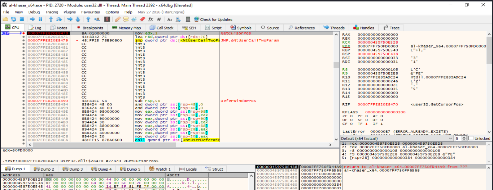

*Figura 4. Segunda consulta del cursor. En la pila se identifica el retorno al código de Al-Khaser.*

##### Comparación de las coordenadas

Una vez obtenida la segunda posición, la rutina compara primero la coordenada `X` y, solo si coincide, compara la coordenada `Y`. En la ejecución analizada se observó el siguiente fragmento:

```asm
mov eax, dword ptr ss:[rbp-18]     ; X de la segunda lectura
cmp dword ptr ss:[rbp-38], eax     ; X inicial frente a X final
jne movimiento_detectado           ; salta si son diferentes

mov eax, dword ptr ss:[rbp-14]     ; Y de la segunda lectura
cmp dword ptr ss:[rbp-34], eax     ; Y inicial frente a Y final
jne movimiento_detectado           ; salta si son diferentes
```

La distribución de las variables locales deducida del ensamblador es:

| Operando | Significado |
|---|---|
| `[rbp-38]` | Coordenada `X` inicial |
| `[rbp-34]` | Coordenada `Y` inicial |
| `[rbp-18]` | Coordenada `X` final |
| `[rbp-14]` | Coordenada `Y` final |

La implementación utiliza una evaluación de cortocircuito: si las coordenadas `X` son diferentes, el primer `JNE` desvía inmediatamente el flujo y no es necesario comparar `Y`. La segunda comparación solo se ejecuta cuando las coordenadas `X` coinciden.

##### Resultado observado con movimiento

Durante el intervalo de cinco segundos se desplazó el cursor al cambiar entre la conversación de apoyo y x64dbg. En la Figura 5, el `RIP` se encuentra sobre el primer `JNE`, por lo que el `CMP` anterior ya se ha ejecutado. x64dbg muestra:

```text
[rbp-38] = 58     ; coordenada X inicial
EAX      = 0      ; coordenada X final cargada desde [rbp-18]
ZF       = 0
```

Como `58 != 0`, la resta lógica realizada por `CMP` no produce cero y el indicador **Zero Flag** queda desactivado (`ZF = 0`). En consecuencia, `JNE` (*Jump if Not Equal*) toma el salto hacia la rama asociada a la detección de movimiento.

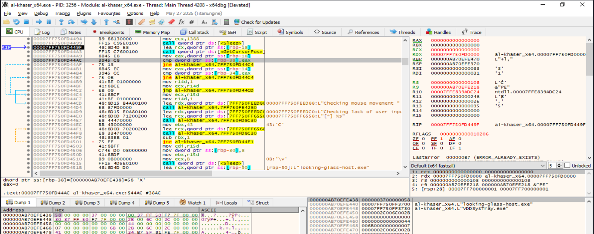

*Figura 5. Resultado de la comparación: los valores de `X` son distintos, `ZF = 0` y el salto `JNE` será tomado.*

La secuencia confirmada dinámicamente puede resumirse así:

1. `GetCursorPos` obtiene la posición inicial.
2. `Sleep(5000)` introduce una espera de cinco segundos.
3. Una segunda llamada a `GetCursorPos` obtiene la posición final.
4. Dos instrucciones `CMP` comparan primero `X` y después `Y`.
5. Un `JNE` desvía el flujo si cambia cualquiera de las coordenadas.
6. En la ejecución documentada hubo movimiento: los valores de `X` fueron distintos y se tomó la rama correspondiente.

##### Interpretación como técnica anti-sandbox

Esta comprobación no detecta directamente un hipervisor ni busca artefactos de virtualización. En su lugar, infiere el tipo de entorno a partir del comportamiento observado. Un cursor inmóvil durante todo el intervalo puede sugerir una ejecución automática sin interacción humana; un cambio de coordenadas indica actividad compatible con la presencia de un usuario.

No obstante, la técnica por sí sola no constituye una prueba concluyente. Un usuario real puede no mover el ratón durante cinco segundos y un *sandbox* avanzado puede simular movimientos. Por ello, normalmente se combina con otras comprobaciones de actividad, como `GetLastInputInfo`, historial de uso, número de documentos recientes o interacción con ventanas.

##### Conclusión

La comprobación dinámica puede darse por finalizada. Se verificaron todos los elementos necesarios para reconstruir la técnica: dos consultas a `GetCursorPos`, una espera intermedia de cinco segundos, la comparación de las coordenadas `X` e `Y` mediante `CMP` y la decisión del flujo mediante `JNE`. Además, se confirmó experimentalmente la rama de movimiento detectado, al observar valores distintos, `ZF = 0` y la preparación del salto condicional.

Una ejecución adicional sin mover el ratón permitiría ilustrar el camino alternativo (`ZF = 1` en ambas comparaciones), pero no es imprescindible para demostrar el funcionamiento de la técnica.

----


<div style="page-break-after: always;"></div>


## 8.9. Global OS Objects

> **Ampliación y evidencias completas:** [ficha `10-global-os-objects.md`][ficha-objects]. El repositorio conserva capturas adicionales, herramientas, código y secuencias no incluidas en la memoria.


### Fundamento y propósito

La técnica `global os objects` consiste en identificar **objetos globales, objetos con nombre y otros artefactos expuestos por el sistema operativo Windows** que pueden revelar la presencia de una máquina virtual, una sandbox, herramientas de análisis o componentes instalados por un hipervisor.

Windows representa numerosos recursos internos mediante objetos gestionados por el **Object Manager**. Entre ellos se encuentran procesos, hilos, dispositivos, eventos, mutexes, semáforos, secciones de memoria, trabajos, enlaces simbólicos y otros tipos de objetos. Algunos de estos recursos pueden recibir un nombre y quedar accesibles desde otros procesos, lo que permite utilizarlos como mecanismos de sincronización, comunicación entre procesos o intercambio de memoria.

Desde el punto de vista de la evasión, una muestra puede aprovechar esta característica para comprobar si existe un objeto cuyo nombre esté asociado con:

- Un hipervisor.
- Las Guest Additions o herramientas de integración de una máquina virtual.
- Una sandbox.
- Una herramienta de análisis.
- Un proceso de monitorización.
- Otra instancia del propio programa.
- Un componente de comunicación entre el host y la máquina virtual.

La lógica general puede representarse de la siguiente forma:

```text
Seleccionar un nombre o artefacto conocido
        ↓
Intentar abrirlo, crearlo o enumerarlo
        ↓
Comprobar el resultado de la operación
        ↓
Determinar si el objeto ya existía
        ↓
Interpretar el artefacto encontrado
        ↓
Modificar o mantener el flujo de ejecución
```

Una de las variantes más habituales consiste en comprobar **objetos de sincronización con nombre**, especialmente mutexes. Una aplicación puede intentar abrir un mutex mediante `OpenMutex` o utilizar `CreateMutex` y consultar posteriormente `GetLastError`. Si el objeto ya existía, Windows puede devolver un identificador válido y establecer el código `ERROR_ALREADY_EXISTS`.

La misma idea puede aplicarse a otros objetos con nombre como:

- Eventos.
- Semáforos.
- Temporizadores de espera.
- Objetos de mapeo de archivos.
- Objetos de trabajo.
- Determinados enlaces simbólicos.

Windows dispone además de diferentes espacios de nombres para estos objetos. Un proceso puede utilizar el prefijo:

```text
Global\
```

para acceder al espacio global, o:

```text
Local\
```

para utilizar explícitamente el espacio de la sesión actual.

Por ejemplo:

```text
Global\NombreObjeto
Local\NombreObjeto
```

Esta distinción es especialmente relevante en sistemas con múltiples sesiones, ya que un objeto creado en el espacio global puede ser visible desde procesos pertenecientes a sesiones distintas, siempre que los permisos lo permitan.

Debe diferenciarse este mecanismo de las **named pipes**. Las canalizaciones con nombre utilizan su propio espacio de nombres y normalmente se referencian mediante rutas como:

```text
\\.\pipe\NombrePipe
```

Aunque las named pipes no utilizan el prefijo `Global\` de los objetos de sincronización, suelen incluirse dentro de la categoría práctica `global os objects` porque constituyen artefactos globalmente observables del sistema y pueden revelar servicios de virtualización, sandboxes o mecanismos de IPC.

También puede realizarse una enumeración directa del espacio de nombres del Object Manager mediante funciones nativas como:

```text
NtOpenDirectoryObject
NtQueryDirectoryObject
NtOpenSymbolicLinkObject
```

Estas funciones permiten inspeccionar directorios del espacio de objetos y recuperar el nombre y el tipo de los elementos presentes. Una herramienta puede utilizar este procedimiento para buscar artefactos concretos sin conocer necesariamente de antemano qué proceso mantiene abierto cada objeto.

En herramientas educativas como `pafish` aparecen comprobaciones que intentan abrir dispositivos y pipes relacionados con VirtualBox utilizando `CreateFile`. El principio es el mismo: si una ruta asociada a un componente de virtualización puede abrirse correctamente, el resultado puede utilizarse como indicio de que dicho componente está presente.

No obstante, la existencia de un único objeto no demuestra por sí sola que el sistema sea virtualizado o esté sometido a análisis. Los nombres pueden coincidir con aplicaciones legítimas, los objetos pueden haber sido creados artificialmente y algunas herramientas de virtualización pueden no instalar determinados componentes. Por ello, esta técnica debe considerarse **heurística** y correlacionarse con otras evidencias.

---


### Demostración dinámica: mutexes con nombre

##### Objetivo de la demostración

El objetivo de esta práctica es demostrar de forma controlada el funcionamiento de los **mutexes con nombre** como objetos globales de Windows y observar dinámicamente cómo un proceso puede determinar si un objeto ya existe o intentar abrirlo posteriormente.

La demostración se centra en tres elementos fundamentales:

```text
CreateMutexW
OpenMutexW
GetLastError
```

y, especialmente, en los códigos:

```text
ERROR_ALREADY_EXISTS = 183 = 0xB7
ERROR_FILE_NOT_FOUND = 2 = 0x02
```

El laboratorio utiliza la herramienta educativa `mutex_lab.exe`, compilada para Windows x64, junto con `x64dbg`. El mutex empleado durante la práctica es:

```text
Global\TFM_GlobalObject_Mutex
```

La elección del prefijo `Global\` permite trabajar explícitamente con el namespace global de objetos con nombre de Windows.

La práctica reproduce cuatro situaciones:

```text
1. Crear el mutex cuando todavía no existe.
2. Crear de nuevo el mismo mutex cuando ya existe.
3. Abrir el mutex mientras continúa existiendo.
4. Intentar abrirlo después de liberar todos sus handles.
```

La secuencia completa permite observar la diferencia entre **crear un objeto nuevo**, **obtener un handle a un objeto ya existente** y **fallar al intentar abrir un objeto que ya no existe**.

---

##### Preparación del laboratorio

Para realizar la demostración se utilizaron:

- Windows x64.
- `mutex_lab.exe`.
- `x64dbg`.
- PowerShell.
- Una primera instancia del programa ejecutada fuera del depurador.
- Una segunda instancia analizada dinámicamente bajo `x64dbg`.

Los breakpoints utilizados fueron:

```text
kernel32.CreateMutexW
kernelbase.CreateMutexW

kernel32.OpenMutexW
kernelbase.OpenMutexW

kernel32.GetLastError
kernelbase.GetLastError
```

Se configuraron breakpoints tanto en `kernel32.dll` como en `KernelBase.dll` porque, en versiones modernas de Windows, determinadas funciones exportadas por `kernel32.dll` pueden actuar como *thunks* que redirigen posteriormente la ejecución hacia su implementación en `KernelBase.dll`.

---

#### Creación inicial del mutex

La primera fase consiste en ejecutar la herramienta desde PowerShell:

```powershell
.\mutex_lab.exe --create
```

La herramienta invoca conceptualmente:

```c
CreateMutexW(
    NULL,
    FALSE,
    L"Global\\TFM_GlobalObject_Mutex"
);
```

El proceso permanece abierto después de crear el objeto con el objetivo de mantener vivo el handle correspondiente.

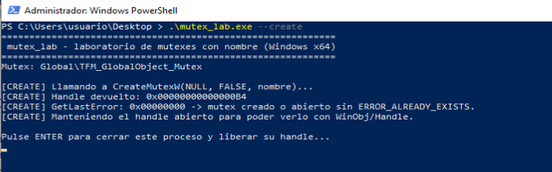

> **Figura 10.8.1.1. Creación inicial de `Global\TFM_GlobalObject_Mutex`.** La primera ejecución de `mutex_lab.exe --create` devuelve el handle `0xB4` y `GetLastError = 0x00000000`, resultado compatible con la creación inicial del objeto. El proceso permanece abierto para conservar el handle y evitar que Windows destruya el mutex.

La salida observada fue:

```text
Mutex: Global\TFM_GlobalObject_Mutex

[CREATE] Llamando a CreateMutexW(NULL, FALSE, nombre)...
[CREATE] Handle devuelto: 0x00000000000000B4
[CREATE] GetLastError: 0x00000000
[CREATE] Manteniendo el handle abierto para poder verlo con WinObj/Handle...
```

El valor:

```text
GetLastError = 0
```

indica que, en esta ejecución, no se notificó que existiera previamente otro mutex con el mismo nombre.

La ventana de PowerShell se mantuvo abierta durante las siguientes pruebas. Esto resulta esencial porque los objetos del kernel basados en handles permanecen activos mientras exista al menos una referencia válida a ellos. Al cerrar el último handle, Windows puede eliminar el objeto.

---

#### Interceptación de `CreateMutexW` en la segunda instancia

Manteniendo abierta la primera instancia, se inició una segunda ejecución de:

```text
mutex_lab.exe --create
```

bajo `x64dbg`.

La ejecución se detuvo en:

```text
kernel32.CreateMutexW
```

En Windows x64, los tres parámetros de `CreateMutexW` se reciben mediante:

```text
RCX = lpMutexAttributes
RDX = bInitialOwner
R8  = lpName
```

En la captura se observa:

```text
RCX = 0
RDX = 0
R8  → L"Global\\TFM_GlobalObject_Mutex"
```


> **Figura 10.8.1.2. Interceptación de `CreateMutexW` en la segunda instancia.** El registro `R8`, correspondiente al parámetro `lpName`, apunta a la cadena Unicode `Global\TFM_GlobalObject_Mutex`. La llamada intenta crear o abrir exactamente el mismo objeto que continúa mantenido por la primera instancia.

Esta captura demuestra que el programa consulta el objeto global mediante su nombre.

Conceptualmente, la llamada observada es:

```c
CreateMutexW(
    NULL,
    FALSE,
    L"Global\\TFM_GlobalObject_Mutex"
);
```

---

#### Retorno de `CreateMutexW` cuando el mutex ya existe

Tras ejecutar `CreateMutexW`, la ejecución vuelve a `mutex_lab.exe`.

En este punto se observa:

```text
RAX = 00000000000000B8
```

El valor es distinto de `NULL`, por lo que representa un handle válido.

Al mismo tiempo, `x64dbg` muestra:

```text
LastError = 000000B7 (ERROR_ALREADY_EXISTS)
```


> **Figura 10.8.1.3. Retorno de `CreateMutexW` cuando el objeto ya existe.** La función devuelve en `RAX` el handle válido `0xB8`. El estado de error del hilo contiene `0xB7`, correspondiente a `ERROR_ALREADY_EXISTS`, lo que indica que el mutex con ese nombre ya había sido creado previamente.

Esta observación permite destacar un aspecto fundamental de `CreateMutexW`:

```text
El mutex ya existe
        ↓
CreateMutexW NO tiene por qué devolver NULL
        ↓
Devuelve un handle válido al objeto existente
        ↓
GetLastError informa ERROR_ALREADY_EXISTS
```

Por tanto, la comprobación no debe realizarse únicamente sobre:

```text
RAX == NULL
```

sino que debe analizarse también el valor proporcionado mediante `GetLastError`.

Los handles obtenidos en las dos instancias fueron diferentes:

```text
Primera instancia → 0xB4
Segunda instancia → 0xB8
```

Esto no implica que existan dos mutexes distintos. Los valores de handle pertenecen a tablas de handles diferentes, una por proceso:

```text
Proceso 1 → handle 0xB4 -+
                         +-- mismo objeto del kernel
Proceso 2 → handle 0xB8 -+
```

El identificador conceptual común es el nombre:

```text
Global\TFM_GlobalObject_Mutex
```

---

#### Interceptación de `GetLastError`

Después de `CreateMutexW`, la herramienta invoca:

```text
GetLastError
```

La ejecución se detuvo inicialmente en:

```text
kernel32.GetLastError
```

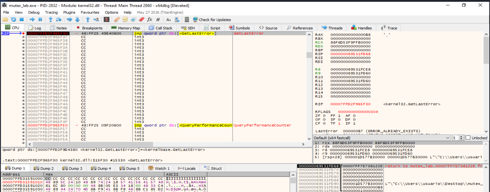

> **Figura 10.8.1.4. Entrada en `GetLastError`.** La ejecución alcanza la API utilizada para recuperar el código de error asociado a la llamada anterior. En este instante, el valor anterior de `RAX` todavía corresponde al handle obtenido mediante `CreateMutexW`, por lo que el resultado relevante debe observarse después del retorno de `GetLastError`.

Esta distinción es importante durante el análisis dinámico. Cuando el breakpoint se activa en la **entrada** de una función, los registros todavía pueden contener valores procedentes de operaciones anteriores.

Por ello, la función se ejecutó hasta retornar a `mutex_lab.exe`.

---

#### Confirmación de `ERROR_ALREADY_EXISTS`

Después del retorno de `GetLastError`, la ejecución se encuentra de nuevo dentro de `mutex_lab.exe`.

En la captura se observa:

```text
RAX = 00000000000000B7
```

y, por tanto:

```text
EAX = 0x000000B7
```

El valor corresponde a:

```text
0xB7 = 183 decimal
     = ERROR_ALREADY_EXISTS
```


> **Figura 10.8.1.5. Retorno de `GetLastError` con `ERROR_ALREADY_EXISTS`.** Tras ejecutar `CreateMutexW` sobre un mutex ya existente, `GetLastError` devuelve `0xB7` en `EAX`. El valor confirma que la segunda instancia ha obtenido un handle al objeto creado previamente por la primera.

La secuencia completa demostrada es:

```text
Primera instancia
        ↓
CreateMutexW
        ↓
Global\TFM_GlobalObject_Mutex
        ↓
Mutex creado y handle mantenido


Segunda instancia
        ↓
CreateMutexW
        ↓
R8 → Global\TFM_GlobalObject_Mutex
        ↓
RAX = handle válido
        ↓
GetLastError
        ↓
EAX = 0xB7
        ↓
ERROR_ALREADY_EXISTS
```

Esta combinación constituye la evidencia principal de la técnica basada en comprobación de existencia mediante un mutex con nombre.

---

#### Apertura del mutex mediante `OpenMutexW`

La siguiente fase de la práctica consiste en comprobar que otra instancia puede localizar el objeto mediante:

```text
OpenMutexW
```

Mientras la primera instancia continúa abierta, se ejecutó:

```text
mutex_lab.exe --open
```

bajo `x64dbg`.

La ejecución se detuvo en:

```text
kernel32.OpenMutexW
```

La firma de la función es:

```c
HANDLE OpenMutexW(
    DWORD   dwDesiredAccess,
    BOOL    bInheritHandle,
    LPCWSTR lpName
);
```

En Windows x64:

```text
RCX = dwDesiredAccess
RDX = bInheritHandle
R8  = lpName
```

La captura muestra:

```text
RCX = 0x00100000
RDX = 0
R8  → L"Global\\TFM_GlobalObject_Mutex"
```

El valor:

```text
0x00100000
```

corresponde al derecho:

```text
SYNCHRONIZE
```


> **Figura 10.8.1.6. Interceptación de `OpenMutexW` mientras el mutex existe.** El registro `R8` vuelve a apuntar a `Global\TFM_GlobalObject_Mutex`, mientras que `RCX = 0x00100000` indica que se solicita acceso `SYNCHRONIZE`.

La llamada observada puede representarse conceptualmente como:

```c
OpenMutexW(
    SYNCHRONIZE,
    FALSE,
    L"Global\\TFM_GlobalObject_Mutex"
);
```

---

#### Retorno satisfactorio de `OpenMutexW`

Después de ejecutar la función, el control vuelve a `mutex_lab.exe`.

Se observa:

```text
RAX = 00000000000000B8
```

Por tanto:

```text
RAX != NULL
```

y se ha obtenido un handle válido.

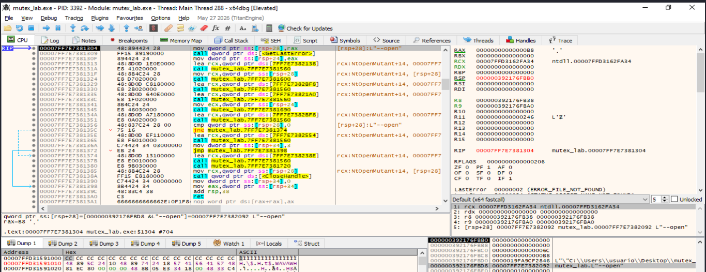

> **Figura 10.8.1.7. Retorno satisfactorio de `OpenMutexW`.** La función devuelve en `RAX` el handle `0xB8`, confirmando que la segunda instancia ha localizado y abierto el mutex previamente creado.

La secuencia queda:

```text
OpenMutexW
        ↓
R8 → Global\TFM_GlobalObject_Mutex
        ↓
RAX = 0xB8
        ↓
Handle válido
        ↓
Objeto localizado
```

En esta situación no debe interpretarse indiscriminadamente el campo `LastError` mostrado por el depurador. Cuando `OpenMutexW` tiene éxito, la evidencia principal es el handle válido devuelto. Un valor residual en el estado de error del hilo puede pertenecer a una operación anterior y no debe emplearse para concluir que la API ha fallado.

---

#### Liberación del mutex

Para demostrar el caso contrario, se finalizaron las instancias que mantenían handles abiertos sobre:

```text
Global\TFM_GlobalObject_Mutex
```

Una vez cerrado el último handle, se volvió a ejecutar:

```text
mutex_lab.exe --open
```

bajo `x64dbg`.

El objetivo de esta segunda prueba con `OpenMutexW` es demostrar qué ocurre cuando el objeto ya no existe.

---

#### `OpenMutexW` cuando el mutex no existe

La ejecución vuelve a detenerse en:

```text
kernel32.OpenMutexW
```

y los parámetros continúan siendo:

```text
RCX = SYNCHRONIZE
RDX = FALSE
R8  → L"Global\\TFM_GlobalObject_Mutex"
```


> **Figura 10.8.1.8. Nueva llamada a `OpenMutexW` después de liberar el objeto.** Los argumentos son equivalentes a los empleados en la prueba satisfactoria, por lo que la única diferencia experimental es la inexistencia del mutex.

Esta comparación es importante porque mantiene constantes los parámetros de la API:

```text
Mismo nombre
Mismos permisos
Misma función
        ↓
Única variable modificada:
existencia del objeto
```

---

#### Retorno `NULL` de `OpenMutexW`

Tras ejecutar la función, el control vuelve a `mutex_lab.exe`.

En este caso:

```text
RAX = 0000000000000000
```

Es decir:

```text
RAX = NULL
```


> **Figura 10.8.1.9. Fallo de `OpenMutexW` tras liberar todos los handles.** La función retorna `RAX = 0`, indicando que no se ha obtenido un handle válido para `Global\TFM_GlobalObject_Mutex`.

La secuencia es:

```text
OpenMutexW
        ↓
Global\TFM_GlobalObject_Mutex
        ↓
RAX = NULL
        ↓
Apertura fallida
```

A diferencia del caso anterior, ahora resulta apropiado consultar `GetLastError` para determinar la causa del fallo.

---

#### Confirmación de `ERROR_FILE_NOT_FOUND`

Tras el fallo de `OpenMutexW`, la herramienta llama nuevamente a:

```text
GetLastError
```

Después del retorno se observa:

```text
RAX = 0000000000000002
```

Por tanto:

```text
EAX = 0x00000002
```

El valor corresponde a:

```text
2 = ERROR_FILE_NOT_FOUND
```

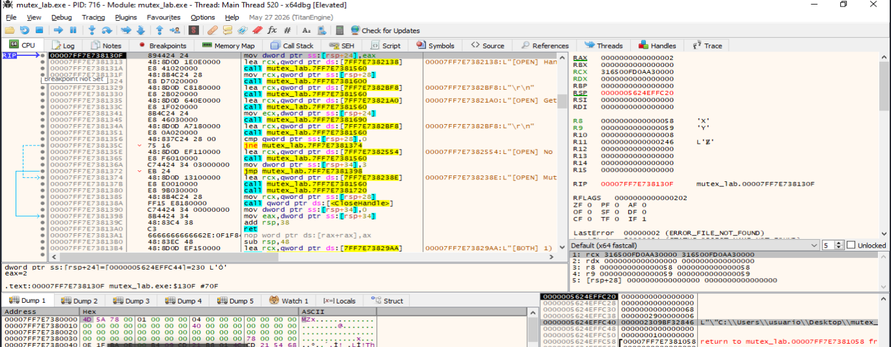

> **Figura 10.8.1.10. Retorno de `GetLastError` tras el fallo de `OpenMutexW`.** La función devuelve `0x2`, correspondiente a `ERROR_FILE_NOT_FOUND`, confirmando que el objeto con nombre ya no se encuentra disponible.

La secuencia completa es:

```text
Cerrar todos los handles
        ↓
Windows elimina el objeto
        ↓
OpenMutexW
        ↓
RAX = NULL
        ↓
GetLastError
        ↓
EAX = 0x02
        ↓
ERROR_FILE_NOT_FOUND
```

---

#### Comparación de los cuatro escenarios

La práctica permite comparar cuatro situaciones diferentes:

| Escenario | API | Valor de retorno | `GetLastError` | Interpretación |
|---|---|---|---|---|
| El mutex no existe todavía | `CreateMutexW` | Handle válido (`0xB4`) | `0` | Objeto creado |
| El mutex ya existe | `CreateMutexW` | Handle válido (`0xB8`) | `0xB7` | `ERROR_ALREADY_EXISTS` |
| El mutex existe | `OpenMutexW` | Handle válido (`0xB8`) | No necesario | Objeto localizado |
| El mutex no existe | `OpenMutexW` | `NULL` | `0x02` | `ERROR_FILE_NOT_FOUND` |

La diferencia más importante entre `CreateMutexW` y `OpenMutexW` puede resumirse así:

```text
CreateMutexW
|
+-- objeto inexistente
|      +-- lo crea y devuelve un handle
|
+-- objeto existente
       +-- devuelve un handle
           +
           ERROR_ALREADY_EXISTS


OpenMutexW
|
+-- objeto existente
|      +-- devuelve un handle
|
+-- objeto inexistente
       +-- devuelve NULL
           +
           ERROR_FILE_NOT_FOUND
```

---

#### Relación con la técnica `Global OS Objects`

La demostración reproduce el mecanismo básico que puede emplear una técnica de evasión basada en objetos globales.

Un programa puede conocer previamente el nombre de un objeto asociado a:

- Una sandbox.
- Una herramienta de análisis.
- Un hipervisor.
- Un servicio concreto.
- Otra instancia del mismo programa.
- Un componente de comunicación entre procesos.

Después puede comprobar su existencia mediante:

```text
OpenMutexW
```

o mediante:

```text
CreateMutexW
        ↓
GetLastError
        ↓
ERROR_ALREADY_EXISTS
```

La lógica anti-análisis podría adoptar la forma:

```text
Nombre conocido
        ↓
CreateMutexW / OpenMutexW
        ↓
Objeto encontrado
        ↓
Comparación del resultado
        ↓
Rama de detección
        ↓
Finalizar, retrasar o modificar comportamiento
```

La práctica realizada no ejecuta ninguna carga maliciosa ni identifica un hipervisor real. `Global\TFM_GlobalObject_Mutex` es un objeto creado deliberadamente para demostrar de forma controlada el mecanismo de descubrimiento.

Por tanto, la evidencia obtenida demuestra **el funcionamiento de la técnica**, no la existencia real de una máquina virtual o sandbox concreta.

---

#### Evidencias obtenidas

Durante la práctica se han documentado las siguientes evidencias:

1. Creación inicial de `Global\TFM_GlobalObject_Mutex`.
2. Handle válido obtenido por la primera instancia.
3. Interceptación de `CreateMutexW`.
4. Nombre del objeto observado en `R8`.
5. Handle válido obtenido por la segunda instancia.
6. `GetLastError = 0xB7`.
7. Confirmación de `ERROR_ALREADY_EXISTS`.
8. Interceptación de `OpenMutexW`.
9. Apertura satisfactoria mientras el objeto existe.
10. Liberación de todos los handles.
11. Retorno `NULL` de `OpenMutexW`.
12. `GetLastError = 0x02`.
13. Confirmación de `ERROR_FILE_NOT_FOUND`.

La combinación de estas evidencias permite reconstruir de forma completa el ciclo de vida del mutex y demostrar cómo puede utilizarse como artefacto global observable.

---

#### Limitaciones

La prueba presenta varias limitaciones que deben considerarse:

- El mutex utilizado ha sido creado expresamente para el laboratorio.
- La presencia de un mutex no implica por sí sola virtualización.
- Muchas aplicaciones legítimas utilizan mutexes para impedir múltiples instancias.
- Un nombre puede coincidir accidentalmente con el utilizado por otro software.
- Los valores numéricos de los handles son locales a cada proceso.
- Los handles observados pueden variar en otras ejecuciones.
- Las direcciones mostradas por `x64dbg` pueden cambiar debido a ASLR.
- El uso del prefijo `Global\` no convierte automáticamente el objeto en un indicador anti-VM.
- La interpretación anti-análisis depende del nombre buscado y de la decisión que adopte posteriormente el programa.

Por ello, en una muestra real sería necesario correlacionar el mutex con:

- Su nombre.
- El proceso o servicio que lo crea.
- Otros objetos del sistema.
- Procesos.
- Servicios.
- Drivers.
- Registro.
- Archivos.
- Otros indicadores anti-VM.

---

#### Conclusión

La demostración dinámica ha permitido observar el funcionamiento completo de un mutex con nombre dentro del namespace global de Windows.

La primera ejecución de `mutex_lab.exe` creó:

```text
Global\TFM_GlobalObject_Mutex
```

y mantuvo abierto el handle correspondiente. Una segunda ejecución interceptada con `x64dbg` volvió a llamar a `CreateMutexW` sobre el mismo nombre. La función devolvió un handle válido y `GetLastError` retornó:

```text
0xB7
```

correspondiente a:

```text
ERROR_ALREADY_EXISTS
```

Posteriormente, `OpenMutexW` consiguió localizar el mismo objeto mientras permanecía activo, devolviendo un handle válido.

Tras cerrar todos los handles, una nueva llamada a `OpenMutexW` retornó:

```text
NULL
```

y `GetLastError` devolvió:

```text
0x02
```

correspondiente a:

```text
ERROR_FILE_NOT_FOUND
```

La práctica demuestra por tanto la secuencia:

```text
CreateMutexW
        ↓
Objeto creado
        ↓
Segunda CreateMutexW
        ↓
ERROR_ALREADY_EXISTS
        ↓
OpenMutexW
        ↓
Objeto localizado
        ↓
Cerrar todos los handles
        ↓
OpenMutexW
        ↓
NULL
        ↓
ERROR_FILE_NOT_FOUND
```

Este mecanismo constituye una base sencilla para técnicas de `Global OS Objects`, ya que una muestra puede utilizar nombres conocidos para comprobar la presencia de objetos globales asociados a determinados entornos y condicionar posteriormente su flujo de ejecución.


-----


<div style="page-break-after: always;"></div>


## 8.10. Firmware Tables

> **Ampliación y evidencias completas:** [ficha `11-firmware-tables.md`][ficha-firmware]. El repositorio conserva capturas adicionales, herramientas, código y secuencias no incluidas en la memoria.


### Fundamento y propósito

La técnica `Firmware Tables` es un mecanismo de **detección de entornos virtualizados** basado en la consulta y análisis de las tablas de firmware que el sistema operativo expone al software. Estas estructuras contienen información sobre la plataforma, el fabricante, el modelo, la BIOS, la placa base, el chasis, los dispositivos y diferentes características de configuración y energía del sistema.

En Windows, dos de las fuentes más relevantes son:

- **SMBIOS** (*System Management BIOS*).
- **ACPI** (*Advanced Configuration and Power Interface*).

Los hipervisores deben presentar al sistema invitado una representación coherente del hardware disponible. Para ello generan o exponen tablas SMBIOS y ACPI que, dependiendo del producto y de su configuración, pueden contener cadenas, identificadores, estructuras o combinaciones características de una máquina virtual.

Entre los indicadores que pueden aparecer se encuentran nombres de fabricantes, modelos virtuales, identificadores OEM, nombres de BIOS, referencias a dispositivos emulados o una composición de tablas diferente de la esperada en un equipo físico.

Ejemplos de cadenas que pueden aparecer en determinados entornos son:

```text
VMware
VMware, Inc.
VMware Virtual Platform
VirtualBox
innotek GmbH
Oracle Corporation
QEMU
Bochs
SeaBIOS
Microsoft Corporation
Virtual Machine
```

La presencia exacta de estas cadenas depende del hipervisor, de su versión, de la configuración de la máquina virtual y de las modificaciones realizadas por el administrador. Por tanto, no deben tratarse como valores universales.

En Windows, una aplicación puede acceder a las tablas de firmware mediante funciones como:

```text
GetSystemFirmwareTable
EnumSystemFirmwareTables
```

Las firmas de proveedor más relevantes son:

```text
RSMB  → Raw SMBIOS
ACPI  → tablas ACPI
FIRM  → firmware bruto
```

Para SMBIOS, una consulta habitual utiliza el proveedor `RSMB` y el identificador de tabla `0`. El sistema devuelve un bloque `RawSMBIOSData` que contiene la versión de SMBIOS y los datos de la tabla.

Conceptualmente:

```text
GetSystemFirmwareTable("RSMB", 0, ...)
        ↓
Obtener RawSMBIOSData
        ↓
Recorrer estructuras SMBIOS
        ↓
Extraer campos y cadenas
        ↓
Buscar artefactos de virtualización
        ↓
Modificar el flujo si existe coincidencia
```

Para ACPI, el programa puede enumerar primero las tablas disponibles y posteriormente solicitar una tabla concreta:

```text
EnumSystemFirmwareTables("ACPI", ...)
        ↓
Obtener identificadores de tablas
        ↓
GetSystemFirmwareTable("ACPI", tabla, ...)
        ↓
Analizar cabecera y contenido
        ↓
Buscar OEMID, OEM Table ID o cadenas características
```

La finalidad de una muestra de malware no es necesariamente identificar con exactitud el hipervisor. En muchos casos basta con obtener una evidencia suficientemente fuerte de que el equipo no corresponde a una estación física convencional.

Si la comprobación resulta positiva, la muestra puede:

- Finalizar su ejecución.
- Retrasar la actividad maliciosa.
- Omitir el `payload`.
- Ejecutar una funcionalidad limitada.
- Mostrar un comportamiento benigno.
- Esperar a una ejecución posterior.
- Combinar el resultado con otras comprobaciones anti-VM.

La técnica debe considerarse **heurística**. Un fabricante legítimo puede utilizar cadenas similares, un hipervisor puede personalizar sus tablas y una máquina física puede presentar configuraciones poco habituales. Del mismo modo, un entorno virtualizado correctamente endurecido puede exponer información suficientemente genérica como para evitar una detección basada exclusivamente en firmware.

Por este motivo, la evidencia es más sólida cuando se correlacionan varios campos de SMBIOS y ACPI y, además, se combinan con otras técnicas como la detección de dispositivos, procesos, servicios, claves de Registro, direcciones MAC, WMI o `CPUID`.

----


### Categoría y valor probatorio

La técnica `Firmware Tables` se clasifica dentro de las técnicas de **evasión y anti-análisis**, concretamente en la categoría **anti-VM** y, de forma secundaria, **anti-sandbox** cuando el entorno automatizado se ejecuta sobre una infraestructura virtualizada detectable.

Dentro de una taxonomía de evasión puede representarse de la siguiente forma:

| Campo | Clasificación |
|---|---|
| Categoría | Evasión / Anti-análisis |
| Subcategoría | Anti-VM / Anti-sandbox |
| Tipo de artefacto | Tablas de firmware y metadatos de plataforma |
| Fuentes principales | SMBIOS / ACPI |
| APIs principales | `GetSystemFirmwareTable` / `EnumSystemFirmwareTables` |
| Sistema principal | Windows |
| Tipo de detección | Heurística basada en artefactos |
| Prioridad para el TFM | Alta |

La fuente de información utilizada se encuentra en estructuras de firmware que describen el sistema. A diferencia de otras técnicas anti-VM basadas en archivos, procesos o servicios instalados por las herramientas de invitado, `Firmware Tables` puede funcionar incluso cuando no se encuentran instaladas `VMware Tools`, `VirtualBox Guest Additions` u otras utilidades similares.

El valor de esta técnica reside en que el hipervisor necesita presentar al sistema invitado una descripción del hardware. Aunque los artefactos de usuario puedan eliminarse, las tablas SMBIOS y ACPI continúan siendo necesarias para el funcionamiento normal del sistema.

No obstante, la detección no debe interpretarse como absoluta. Las tablas pueden modificarse, algunas cadenas pueden ser compartidas con equipos físicos y las implementaciones cambian entre versiones. Por ello, los resultados deben correlacionarse con otros indicadores.

----


### Demostración dinámica: cadenas en SMBIOS

##### Objetivo

La segunda subtécnica pretende demostrar qué hace al-khaser **después de obtener SMBIOS**.

El objetivo es reconstruir:

```text
RawSMBIOSData
        ↓
recorrido del contenido
        ↓
búsqueda de cadenas
        ↓
"VirtualBox"
"vbox"
"VBOX"
        ↓
coincidencia
        ↓
rama positiva
```

---

##### Cadenas características presentes en el buffer

Después de recuperar el bloque SMBIOS, el Dump muestra varias cadenas asociadas con VirtualBox.

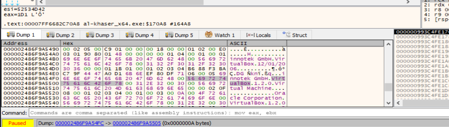

> **Figura 11.8.2.1. Artefactos de VirtualBox presentes en SMBIOS.** En el buffer se observan cadenas como `innotek GmbH`, `VirtualBox 1.2.0`, `Virtual Machine` y `Oracle Corporation`.

Entre los valores observados aparecen:

```text
innotek GmbH
VirtualBox 1.2.0
Virtual Machine
Oracle Corporation
```

Esta captura demuestra la **existencia del indicador en la fuente de datos**, pero por sí sola no demuestra todavía que al-khaser lo utilice. El paso siguiente consiste en seguir el flujo desde el helper que devuelve el buffer hasta la rutina que lo examina.

---

##### Retorno del helper con el puntero al SMBIOS

Después de recuperar el firmware, se utiliza `Execute till return` para salir de la función auxiliar.


> **Figura 11.8.2.2. Retorno de la función auxiliar.** En el `ret`, `RAX` contiene el puntero al bloque SMBIOS. Al ejecutar el retorno se transfiere el control al código encargado de analizar su contenido.

La información relevante es:

```text
RAX → buffer RawSMBIOSData
```

Este punto es importante porque conecta las dos fases de la técnica:

```text
adquisición de SMBIOS
        ↓
retorno del buffer
        ↓
análisis anti-VM
```

Tras ejecutar el `ret` mediante un único paso, se llega a la rutina que procesa los datos.

---

##### Localización de la búsqueda inlineada

El código situado en el caller muestra que el compilador ha integrado la rutina de búsqueda directamente en el flujo.

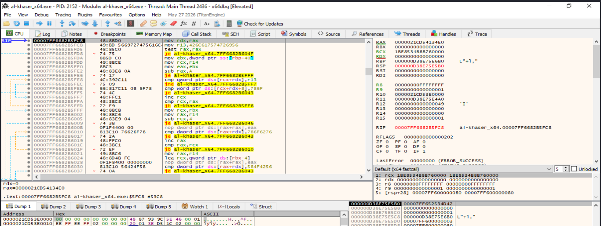

> **Figura 11.8.2.3. Código encargado de buscar indicadores dentro de SMBIOS.** En lugar de una llamada visible a `memcmp`, el compilador ha transformado la comparación en instrucciones `cmp` directas contra constantes inmediatas.

La secuencia relevante incluye:

```asm
mov r13,426C617574726956
...
cmp qword ptr [rcx+rdx],r13
...
cmp word ptr [rcx+rdx+8],786F
...
cmp dword ptr [...],786F6276
...
cmp dword ptr [...],584F4256
```

---

##### Decodificación de la cadena `VirtualBox`

Detalle ampliado de las comparaciones:

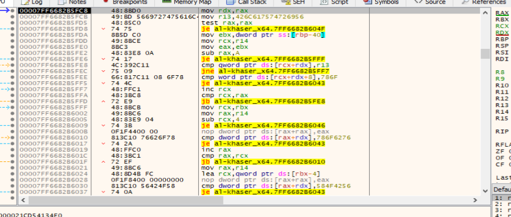

> **Figura 11.8.2.4. Comparaciones de `VirtualBox`, `vbox` y `VBOX`.** Las constantes se encuentran codificadas como valores inmediatos little-endian, por lo que deben reconstruirse para interpretar la cadena que se está buscando.

La primera constante es:

```text
426C617574726956
```

En memoria little-endian:

```text
56 69 72 74 75 61 6C 42
 V  i  r  t  u  a  l  B
```

Por tanto:

```text
426C617574726956 → "VirtualB"
```

La siguiente comparación utiliza:

```text
786F
```

que en memoria es:

```text
6F 78
 o  x
```

Así:

```text
"VirtualB" + "ox"
=
"VirtualBox"
```

La lógica observada es equivalente a:

```asm
cmp qword ptr [buffer+offset], "VirtualB"
jne continuar

cmp word ptr [buffer+offset+8], "ox"
je  coincidencia
```

---

##### Variantes `vbox` y `VBOX`

Además de `VirtualBox`, el código contiene:

```asm
cmp dword ptr [...],786F6276
```

El valor:

```text
0x786F6276
```

en memoria corresponde a:

```text
76 62 6F 78
 v  b  o  x
```

Por tanto:

```text
786F6276 → "vbox"
```

La tercera comparación es:

```asm
cmp dword ptr [...],584F4256
```

que corresponde a:

```text
56 42 4F 58
 V  B  O  X
```

es decir:

```text
584F4256 → "VBOX"
```

Por tanto, la rutina busca al menos estas tres variantes:

```text
VirtualBox
vbox
VBOX
```

---

##### Recorrido del buffer

El código incrementa progresivamente el desplazamiento utilizado para examinar el buffer.

Conceptualmente:

```text
offset = 0
        ↓
comparar posición actual
        ↓
si no coincide:
offset++
        ↓
comprobar límite
        ↓
seguir buscando
```

Las instrucciones de incremento y comparación del índice demuestran que no se está comprobando una posición fija, sino que se realiza una búsqueda dentro del conjunto de datos SMBIOS.

La secuencia puede expresarse como:

```text
SMBIOS[0]
SMBIOS[1]
SMBIOS[2]
...
        ↓
en cada offset:
"VirtualBox" ?
"vbox" ?
"VBOX" ?
```

---

##### Breakpoint sobre la rama de coincidencia

Las comparaciones positivas convergen en:

```text
00007FF6682B6043
```

Se configura:

```text
bp 00007FF6682B6043
```

y se continúa con `F9`.


> **Figura 11.8.2.5. Llegada a la rama de coincidencia positiva.** La ejecución alcanza la dirección que actúa como destino de los `je` asociados con las comparaciones de `VirtualBox`, `vbox` y `VBOX`.

La llegada efectiva a:

```text
RIP = 00007FF6682B6043
```

confirma que la búsqueda ha encontrado una coincidencia dentro del contenido procesado.

---

##### Resultado de la detección

Detalle de la rama y de los registros:

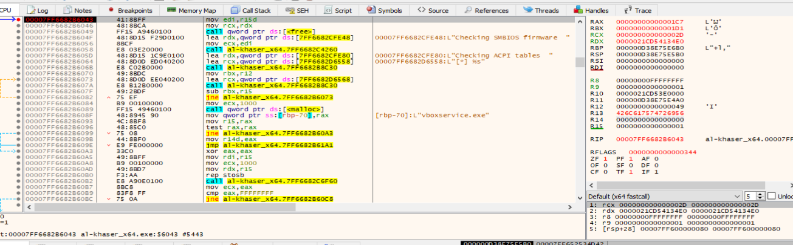

> **Figura 11.8.2.6. Estado del flujo tras la coincidencia.** Además de encontrarse en el destino común de los saltos positivos, se observa `R15 = 1`; la siguiente lógica propaga este valor mediante `mov edi,r15d`.

Se observa:

```text
R15 = 0000000000000001
```

y:

```asm
mov edi,r15d
```

Esto es compatible con la propagación de un resultado lógico positivo hacia el procesamiento posterior.

La demostración no se basa únicamente en este valor, sino en la combinación de tres evidencias:

1. Las cadenas características existen realmente dentro del buffer SMBIOS.
2. El código contiene comparaciones explícitas con `VirtualBox`, `vbox` y `VBOX`.
3. La ejecución llega a la rama común asociada con una coincidencia.

---

##### Por qué no apareció una llamada útil a `memcmp`

Durante el análisis se intentó inicialmente interceptar:

```text
memcmp
strcmp
strstr
```

Sin embargo, las llamadas observadas no permitían vincular directamente esas funciones con el SMBIOS.

La razón se hace visible al llegar a la rutina real: el compilador ha **inlineado** la comparación.

En lugar de:

```asm
call memcmp
```

aparecen directamente:

```asm
cmp qword ptr [...],r13
cmp word ptr [...],786F
cmp dword ptr [...],786F6276
cmp dword ptr [...],584F4256
```

Esta observación tiene relevancia metodológica: una muestra puede buscar indicadores de virtualización sin importar funciones estándar de comparación y sin realizar una llamada explícita a ellas.

---

##### Secuencia completa demostrada

```text
GetSystemFirmwareTable("RSMB")
        ↓
RawSMBIOSData
        ↓
buffer contiene:
innotek GmbH
VirtualBox 1.2.0
Virtual Machine
Oracle Corporation
        ↓
retorno del buffer a la rutina de análisis
        ↓
búsqueda inlineada
        ↓
"VirtualBox"
"vbox"
"VBOX"
        ↓
coincidencia
        ↓
JE → 00007FF6682B6043
        ↓
R15 = 1
        ↓
resultado positivo
```

##### Conclusión

La práctica demuestra que al-khaser analiza los datos SMBIOS recuperados y busca explícitamente cadenas asociadas a VirtualBox. La evidencia incluye tanto los artefactos reales del firmware como las comparaciones de código y el cambio efectivo del flujo cuando existe una coincidencia.

---


<div style="page-break-after: always;"></div>


## 8.11. Generic OS Queries

> **Ampliación y evidencias completas:** [ficha `12-generic-os-queries.md`][ficha-os-queries]. El repositorio conserva capturas adicionales, herramientas, código y secuencias no incluidas en la memoria.


### Fundamento y propósito

La técnica `Generic OS Queries` consiste en realizar consultas genéricas al sistema operativo con el objetivo de obtener información sobre el entorno de ejecución y determinar si sus características son compatibles con un equipo de usuario real o, por el contrario, presentan indicadores habituales de una máquina virtual, una sandbox o un entorno de análisis.

A diferencia de otras técnicas anti-VM que buscan artefactos muy específicos —por ejemplo, nombres de procesos, claves de Registro, controladores o cadenas de un hipervisor concreto—, `Generic OS Queries` se basa principalmente en propiedades generales del sistema. Entre ellas pueden encontrarse el nombre de usuario, el nombre del equipo, el nombre DNS del host, la cantidad de memoria RAM, el número de procesadores, la resolución de pantalla, el número de monitores, el tamaño del disco, el tiempo de actividad del sistema o el tipo de arranque utilizado.

La lógica general de la técnica puede representarse de la siguiente forma:

```text
Consultar una característica del sistema
        ↓
Obtener el valor observado
        ↓
Compararlo con un valor, lista o umbral
        ↓
Valorar si el resultado parece poco habitual
        ↓
Continuar, retrasar, modificar o finalizar la ejecución
```

Por ejemplo, una muestra puede considerar sospechoso un sistema con un único procesador lógico, poca memoria RAM, un disco de tamaño reducido, un nombre de usuario genérico o un tiempo de actividad de pocos minutos. Ninguno de estos indicadores demuestra por sí mismo la existencia de virtualización, pero la combinación de varios puede aumentar la confianza de la heurística.

En Windows, estas comprobaciones pueden realizarse mediante APIs como `GetUserName`, `GetComputerName`, `GetComputerNameEx`, `GlobalMemoryStatusEx`, `GetSystemInfo`, `GetNativeSystemInfo`, `GetSystemMetrics`, `EnumDisplayMonitors`, `GetDiskFreeSpaceEx`, `GetTickCount64` o `IsNativeVhdBoot`. También pueden obtenerse datos equivalentes mediante WMI, estructuras internas como el PEB o `KUSER_SHARED_DATA`, consultas nativas y otras interfaces del sistema.

Desde el punto de vista del análisis de malware, la presencia aislada de estas APIs no debe interpretarse automáticamente como una técnica de evasión. Son funciones legítimas utilizadas por multitud de aplicaciones para inventario, telemetría, compatibilidad, diagnóstico o adaptación de recursos. La evidencia adquiere mayor relevancia cuando la consulta va seguida de una comparación con valores sospechosos y esa comparación modifica el flujo de ejecución.

Por tanto, `Generic OS Queries` debe considerarse una técnica **heurística**. Su análisis requiere observar no solo qué información se solicita, sino también cómo se procesa, qué umbral se aplica, qué ramas condicionales aparecen y qué comportamiento adopta la muestra después de la comprobación.

----


### Demostración dinámica: nombre de usuario

##### Objetivo de la demostración

El objetivo de esta prueba es demostrar dinámicamente una comprobación del nombre de usuario utilizada como heurística de detección de entornos de análisis. Para ello se emplea `pafish.exe` bajo `x32dbg`, observando cómo el programa obtiene el nombre de la cuenta mediante `GetUserNameA`, normaliza la cadena a mayúsculas y la compara con varios indicadores asociados a entornos de sandbox.

La demostración se divide en dos ejecuciones:

1. **Ejecución de referencia**, utilizando el nombre de usuario `usuario`, que no coincide con los indicadores comprobados por Pafish.
2. **Ejecución positiva controlada**, renombrando temporalmente la cuenta local a `sandbox`, de forma que la comparación con la cadena `SANDBOX` produzca una coincidencia.

La finalidad de la prueba no es considerar el nombre de usuario como una evidencia concluyente de virtualización, sino observar de forma reproducible cómo una herramienta anti-sandbox puede utilizar una consulta genérica al sistema operativo para modificar su flujo de ejecución.

La secuencia general observada es:

```text
GetUserNameA
      ↓
Obtención del nombre de usuario
      ↓
Conversión a mayúsculas
      ↓
Comparación con "SANDBOX"
      ↓
Comparación con "VIRUS"
      ↓
Comparación con "MALWARE"
      ↓
Resultado booleano de la heurística
```

---

##### Herramientas y entorno utilizados

Para la demostración se utilizaron:

- `pafish.exe`.
- `x32dbg`, debido a que el ejecutable analizado es de 32 bits.
- Windows dentro de una máquina de laboratorio controlada.
- Una cuenta local denominada inicialmente `usuario`.
- Una segunda ejecución con la misma cuenta renombrada temporalmente a `sandbox`.

Los valores de memoria y las direcciones mostradas corresponden a la ejecución analizada y pueden variar en otras compilaciones o ejecuciones debido, entre otros factores, a ASLR.

---

##### Breakpoints iniciales

El primer punto de ruptura utilizado fue:

```text
bp advapi32.GetUserNameA
```

Una vez localizado el código de Pafish encargado de procesar el resultado, se utilizó además un breakpoint sobre la comparación posterior:

```text
bp 00403BDC
```

La dirección `00403BDC` corresponde, en la ejecución analizada, a la instrucción:

```asm
00403BDC    test eax,eax
```

Esta instrucción evalúa el valor devuelto por `strstr` inmediatamente después de comprobar si el nombre de usuario contiene una de las cadenas consideradas sospechosas.

---

##### Entrada en `GetUserNameA`

La primera ejecución se realizó con la cuenta local denominada `usuario`. Al alcanzar el breakpoint en `advapi32.GetUserNameA`, la ejecución quedó detenida en la entrada de la API.

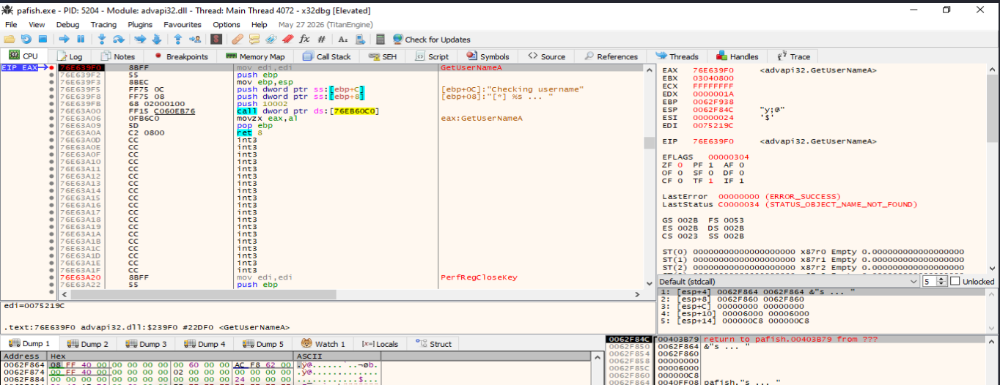

> **Figura 12.8.1.1. Entrada en `advapi32.GetUserNameA`.** La ejecución se detiene en la función utilizada por Pafish para obtener el nombre de la cuenta interactiva.

La función presenta la siguiente interfaz conceptual:

```c
BOOL GetUserNameA(
    LPSTR   lpBuffer,
    LPDWORD pcbBuffer
);
```

Al tratarse de una ejecución x86, los argumentos se reciben a través de la pila. En la captura se observó:

```text
[ESP]     = 00403B79    → dirección de retorno a pafish.exe
[ESP+4]   = 0062F864    → lpBuffer
[ESP+8]   = 0062F860    → pcbBuffer
```

Por tanto, la dirección relevante para seguir el resultado fue:

```text
lpBuffer = 0062F864
```

La propia pila también permitió identificar la dirección de retorno:

```text
00403B79
```

Esta dirección corresponde al código de `pafish.exe` que continúa procesando el nombre una vez finaliza `GetUserNameA`.

---

##### Obtención del nombre de usuario

Después de ejecutar `GetUserNameA` hasta su retorno, la ejecución volvió a `pafish.exe` en la dirección `00403B79`. En el volcado de memoria puede observarse el contenido escrito en el buffer.


> **Figura 12.8.1.2. Nombre de usuario obtenido mediante `GetUserNameA`.** El buffer situado en `0062F864` contiene la cadena `usuario` terminada en `NULL`.

En memoria se observa:

```text
0062F864  75 73 75 61 72 69 6F 00
          u  s  u  a  r  i  o \0
```

Por tanto:

```text
0062F864 → "usuario"
```

Esta evidencia confirma que Pafish no está utilizando el nombre de la carpeta del perfil como fuente principal de esta comprobación, sino el valor obtenido directamente mediante la API de Windows.

---

##### Normalización de la cadena

Tras recuperar el nombre, Pafish recorre la cadena y aplica una conversión a mayúsculas mediante `toupper`. En el desensamblado se observa una llamada dentro de un bucle que procesa los caracteres del nombre.

Conceptualmente, la transformación es:

```text
"usuario"
    ↓
  toupper
    ↓
"USUARIO"
```

La normalización permite realizar posteriormente comparaciones sin depender de si el nombre de la cuenta fue creado utilizando letras mayúsculas o minúsculas.

---

##### Comparación con la cadena `SANDBOX`

Una vez normalizado el nombre, Pafish prepara una llamada a `strstr`. En la ejecución de referencia se observaron los siguientes argumentos:

```text
[ESP]   = 0062F864    "USUARIO"
[ESP+4] = 004106C8    "SANDBOX"
```


> **Figura 12.8.1.3. Preparación de la comparación con `SANDBOX`.** Pafish utiliza `strstr` para buscar la cadena `SANDBOX` dentro del nombre de usuario normalizado `USUARIO`.

La operación realizada puede representarse como:

```c
strstr("USUARIO", "SANDBOX");
```

La llamada se encuentra en:

```asm
00403BD7    call <JMP.&strstr>
00403BDC    test eax,eax
00403BDE    je 00403BE7
00403BE0    mov eax,1
00403BE5    jmp 00403C2E
```

`strstr` devuelve un puntero a la primera coincidencia cuando encuentra la subcadena solicitada. Si no existe coincidencia, devuelve `NULL`, representado por un valor cero en `EAX`.

---

##### Resultado negativo con el usuario `USUARIO`

En la ejecución de referencia, la llamada anterior no encontró la cadena `SANDBOX` dentro de `USUARIO`. Al retornar de `strstr`, el registro mostraba:

```text
EAX = 00000000
```

La ejecución quedó detenida en:

```asm
00403BDC    test eax,eax
```

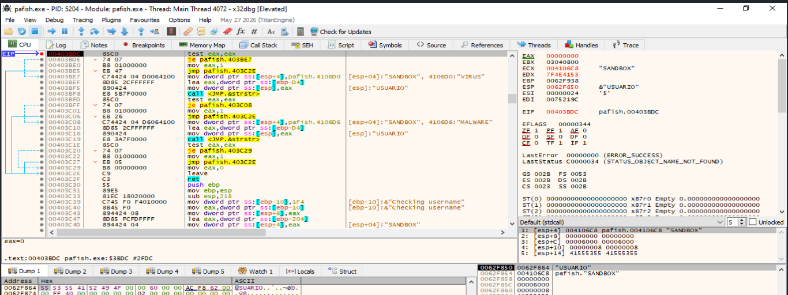

> **Figura 12.8.1.4. Resultado negativo de la comprobación `SANDBOX`.** `strstr("USUARIO", "SANDBOX")` devuelve `NULL`, por lo que `EAX` contiene cero.

La secuencia puede representarse como:

```text
strstr("USUARIO", "SANDBOX")
            ↓
         EAX = 0
            ↓
      TEST EAX,EAX
            ↓
         ZF = 1
            ↓
       JE tomado
```

El salto condicional conduce a la siguiente comprobación. En el mismo bloque de código se observan posteriormente las cadenas:

```text
"VIRUS"
"MALWARE"
```

La lógica reconstruida es equivalente a:

```text
¿username contiene "SANDBOX"?
        |
        +-- Sí → resultado positivo
        |
        +-- No
             ↓
¿username contiene "VIRUS"?
        |
        +-- Sí → resultado positivo
        |
        +-- No
             ↓
¿username contiene "MALWARE"?
        |
        +-- Sí → resultado positivo
        |
        +-- No → resultado negativo
```

---

##### Preparación de una detección positiva controlada

Para demostrar la rama positiva sin modificar manualmente el buffer del proceso, se cambió temporalmente el nombre de la cuenta local de Windows.

Desde PowerShell ejecutado con privilegios de administrador se utilizó:

```powershell
Rename-LocalUser -Name "usuario" -NewName "sandbox"
```

Después fue necesario cerrar completamente la sesión:

```powershell
logoff
```

Tras iniciar nuevamente la sesión, el nombre puede verificarse con:

```powershell
whoami
$env:USERNAME
```

El directorio del perfil puede continuar siendo `C:\Users\usuario`. Este hecho no afecta a la demostración, ya que la comprobación analizada utiliza `GetUserNameA` y no el nombre de la carpeta del perfil.

A continuación se abrió una nueva instancia de `x32dbg` y se ejecutó de nuevo `pafish.exe` desde la sesión correspondiente al usuario `sandbox`.

---

##### Resultado positivo con el usuario `SANDBOX`

En la segunda ejecución, después de obtener el nombre y convertirlo a mayúsculas, Pafish preparó conceptualmente la siguiente operación:

```c
strstr("SANDBOX", "SANDBOX");
```

Esta vez se produjo una coincidencia. Al retornar de `strstr`, el registro `EAX` contenía:

```text
EAX = 0062F864
```

La dirección `0062F864` apuntaba directamente a:

```text
"SANDBOX"
```


> **Figura 12.8.1.5. Resultado positivo de la comparación con `SANDBOX`.** En `00403BDC`, `EAX` contiene un puntero válido a la cadena `SANDBOX`, lo que demuestra que `strstr` encontró la coincidencia.

La condición evaluada es ahora:

```text
EAX != 0
```

Al ejecutar:

```asm
00403BDC    test eax,eax
```

el resultado deja el indicador `ZF` a cero:

```text
ZF = 0
```

Por tanto, el salto:

```asm
00403BDE    je 00403BE7
```

no se toma y la ejecución continúa secuencialmente hacia la rama positiva.

---

##### Activación de la rama positiva

La captura final muestra la ejecución situada en:

```asm
00403BE0    mov eax,1
```

mientras `EAX` todavía apunta a la cadena `SANDBOX` y `ZF = 0`.


> **Figura 12.8.1.6. Activación de la rama positiva.** Tras la coincidencia de `strstr`, el `JE` no se toma y Pafish alcanza `mov eax,1`, estableciendo el resultado positivo de la heurística.

La secuencia completa observada es:

```text
GetUserNameA
        ↓
"sandbox"
        ↓
toupper
        ↓
"SANDBOX"
        ↓
strstr("SANDBOX", "SANDBOX")
        ↓
EAX = 0062F864
        ↓
TEST EAX,EAX
        ↓
ZF = 0
        ↓
JE no tomado
        ↓
MOV EAX,1
        ↓
resultado positivo
```

El valor `1` representa el resultado booleano positivo de la comprobación realizada por la función.

---

##### Comparación entre ambas ejecuciones

| Elemento | Ejecución de referencia | Ejecución positiva |
|---|---|---|
| Nombre obtenido | `usuario` | `sandbox` |
| Nombre normalizado | `USUARIO` | `SANDBOX` |
| Cadena buscada | `SANDBOX` | `SANDBOX` |
| Resultado de `strstr` | `NULL` | Puntero a `SANDBOX` |
| `EAX` tras `strstr` | `00000000` | `0062F864` |
| Resultado de `TEST EAX,EAX` | `ZF = 1` | `ZF = 0` |
| `JE` | Tomado | No tomado |
| Resultado de la heurística | Negativo | Positivo |

La comparación permite demostrar que el cambio de una única característica ambiental —el nombre de la cuenta— modifica directamente el flujo de ejecución de Pafish.

---

##### Evidencias demostradas

Las capturas permiten establecer que:

- Pafish obtiene el nombre del usuario mediante `advapi32.GetUserNameA`.
- El primer argumento de la API apunta al buffer donde Windows almacena el nombre.
- En la ejecución de referencia, el buffer contiene `usuario`.
- Pafish normaliza el nombre a mayúsculas.
- La herramienta busca las cadenas `SANDBOX`, `VIRUS` y `MALWARE` mediante `strstr`.
- `strstr("USUARIO", "SANDBOX")` devuelve `NULL` y produce una rama negativa.
- Tras renombrar la cuenta a `sandbox`, la cadena normalizada pasa a ser `SANDBOX`.
- `strstr("SANDBOX", "SANDBOX")` devuelve un puntero válido.
- `TEST EAX,EAX` deja `ZF = 0` en la ejecución positiva.
- El `JE` posterior no se toma.
- Pafish alcanza `MOV EAX,1`, estableciendo el resultado positivo de la comprobación.

---

##### Relación con la técnica `Generic OS Queries`

La demostración constituye un ejemplo de `Generic OS Queries` porque el programa consulta una característica general del sistema operativo —el nombre de la cuenta interactiva— y utiliza el resultado para inferir si se encuentra en un entorno potencialmente asociado a análisis automatizado.

La técnica no depende de un artefacto exclusivo de un hipervisor concreto. En su lugar, parte de una característica ordinaria del sistema y la compara con valores que el desarrollador considera sospechosos.

Esto permite representar la técnica como:

```text
Consulta genérica al sistema operativo
        ↓
GetUserNameA
        ↓
Obtención de una característica ambiental
        ↓
Normalización
        ↓
Comparación con indicadores
        ↓
Decisión heurística
```

---

##### Limitaciones

Esta comprobación presenta varias limitaciones:

- El nombre de usuario no constituye una evidencia exclusiva de virtualización o sandbox.
- Una máquina física puede utilizar legítimamente nombres como `sandbox`, `virus` o `malware`.
- Una sandbox puede emplear un nombre de usuario completamente normal y no ser detectada por esta heurística.
- La cuenta puede renombrarse fácilmente.
- El resultado de `GetUserNameA` puede ser interceptado o manipulado por un entorno de análisis.
- Las cadenas utilizadas por la muestra pueden cambiar entre herramientas y versiones.
- Las direcciones de código y memoria observadas son específicas de la ejecución analizada.

Por estas razones, la comprobación debe considerarse un **indicador heurístico** y correlacionarse con otras técnicas, como consultas de hardware, procesos, Registro, disco, memoria o configuración del sistema.

---

##### Conclusión

La demostración dinámica permitió reconstruir completamente la comprobación del nombre de usuario implementada por Pafish.

En la ejecución de referencia, `GetUserNameA` devolvió el nombre `usuario`, que fue convertido a `USUARIO`. La búsqueda de `SANDBOX` mediante `strstr` devolvió `NULL`, dejando `EAX = 0` y provocando que el salto condicional continuase hacia las siguientes comprobaciones.

Posteriormente, la cuenta local se renombró de forma controlada a `sandbox`. Tras iniciar una nueva sesión, Pafish obtuvo y normalizó el valor `SANDBOX`. En esta segunda ejecución, `strstr("SANDBOX", "SANDBOX")` devolvió un puntero válido a la coincidencia. La instrucción `TEST EAX,EAX` dejó `ZF = 0`, el `JE` no se tomó y la ejecución alcanzó `MOV EAX,1`, estableciendo un resultado positivo.

La prueba demuestra la secuencia completa:

```text
Consulta del nombre de usuario
        ↓
Normalización de la cadena
        ↓
Comparación con indicadores
        ↓
Evaluación mediante TEST/JE
        ↓
Modificación del flujo de ejecución
```

Por tanto, la comprobación del nombre de usuario puede documentarse como una sub-técnica de `Generic OS Queries` utilizada para obtener información ambiental y tomar decisiones anti-sandbox. No obstante, su resultado debe interpretarse como una heurística y no como una confirmación aislada de la existencia de una máquina virtual o entorno de análisis.


<div style="page-break-after: always;"></div>


## 8.12. Hooks

> **Ampliación y evidencias completas:** [ficha `13-hooks.md`][ficha-hooks]. El repositorio conserva capturas adicionales, herramientas, código y secuencias no incluidas en la memoria.


### Fundamento y propósito

La técnica `Hook` dentro de la detección de entornos virtualizados consiste en comprobar si determinadas funciones, estructuras o rutas de ejecución del sistema han sido **interceptadas, redirigidas o modificadas mediante hooks**. Este tipo de alteraciones es frecuente en sandboxes, herramientas de instrumentación, soluciones de monitorización, EDR, antivirus y entornos de análisis dinámico, ya que permiten observar o modificar las llamadas realizadas por un proceso.

Un *hook* introduce un punto de interceptación entre el código que realiza una llamada y la implementación que debería ejecutarse originalmente. Dependiendo de la técnica utilizada, la modificación puede aparecer directamente en los primeros bytes de una función, en una tabla de punteros como la `Import Address Table` —IAT— o la `Export Address Table` —EAT—, en una estructura interna del sistema o mediante una redirección hacia una región de memoria distinta de la esperada.

En un entorno de análisis, una API como `CreateFileW`, `RegOpenKeyExW`, `CreateProcessW`, `VirtualAlloc`, `Sleep`, `GetTickCount64` o determinadas funciones de `ntdll.dll` puede ser interceptada para registrar argumentos, modificar resultados o controlar el comportamiento de la muestra. El malware puede comprobar la integridad de estas funciones y utilizar cualquier modificación anómala como indicio de que está siendo observado.

Una secuencia conceptual de detección puede representarse de la siguiente forma:

```text
Localizar una función sensible
        ↓
Obtener su dirección real
        ↓
Inspeccionar código, punteros o tablas
        ↓
Comparar con el estado esperado
        ↓
Detectar una posible redirección
        ↓
Modificar el flujo de ejecución
```

Entre los indicadores que pueden resultar sospechosos se encuentran:

- Un salto `JMP` o `CALL` insertado al comienzo de una API.
- Una dirección de la IAT que apunta fuera del módulo esperado.
- Una entrada de la EAT modificada.
- Un *trampoline* situado en memoria privada o ejecutable.
- Diferencias entre el código cargado en memoria y una copia de referencia.
- Cambios en los *syscall stubs* de `ntdll.dll`.
- Páginas de código con protecciones de memoria inesperadas.
- Redirecciones hacia DLL asociadas a instrumentación o monitorización.

Si se identifica una alteración compatible con un hook, la muestra puede interpretar que se encuentra bajo una sandbox, un depurador o una herramienta de monitorización. Como respuesta, puede finalizar su ejecución, retrasar determinadas acciones, ocultar funcionalidad, omitir el comportamiento principal o ejecutar una rama alternativa.

No obstante, la presencia de hooks **no demuestra por sí sola la existencia de una máquina virtual o una sandbox**. Aplicaciones legítimas, herramientas de accesibilidad, antivirus, EDR, sistemas de seguridad, software de captura, superposiciones gráficas y otros componentes pueden interceptar funciones por motivos legítimos. Por ello, la detección de hooks debe considerarse una **heurística de anti-análisis** y correlacionarse con otras evidencias del entorno.

----


### Demostración dinámica: inline hooks

##### Objetivo de la demostración

El objetivo de esta práctica es demostrar dinámicamente la sub­técnica de detección de `inline hooks` mediante la herramienta educativa `inline_hook_lab.exe`.

La demostración permite observar tres estados diferentes de una misma función de prueba:

1. **Estado negativo o limpio**, en el que la función conserva sus bytes originales y no se detecta ninguna modificación.
2. **Estado positivo**, en el que el prólogo de la función es sustituido por un salto indirecto hacia una rutina `handler`.
3. **Estado negativo tras restauración**, en el que los bytes originales se recuperan y la detección vuelve a ser negativa.

La secuencia general es:

```text
Función original
        ↓
Comprobación de integridad
        ↓
Resultado negativo
        ↓
Instalación del inline hook
        ↓
Modificación del prólogo
        ↓
Redirección hacia handler
        ↓
Resultado positivo
        ↓
Restauración de bytes
        ↓
Resultado negativo
```

La herramienta está diseñada exclusivamente como laboratorio educativo autocontenido. La modificación se realiza sobre una función sintética creada dentro del propio proceso y no se intervienen procesos externos.

---

##### Entorno utilizado

La demostración se realizó sobre:

- Windows 10 x64.
- `inline_hook_lab.exe` compilado para arquitectura x64.
- `x64dbg` ejecutado con privilegios elevados.
- PowerShell para la ejecución de referencia.
- Archivo CSV para conservar la evidencia generada por la herramienta.

La ejecución utilizada para generar la evidencia fue:

```powershell
.\inline_hook_lab.exe --csv inline_hook_resultados.csv
```

---

##### Funcionamiento de la herramienta

La función de prueba original está formada por:

```asm
mov eax, 42
ret
```

En hexadecimal:

```text
B8 2A 00 00 00 C3
```

Por tanto, en condiciones normales devuelve:

```text
42
```

La rutina `handler` utilizada para demostrar la redirección contiene:

```asm
mov eax, 99
ret
```

En hexadecimal:

```text
B8 63 00 00 00 C3
```

Cuando se instala el `inline hook`, los primeros 14 bytes de la función `target` se sustituyen por el patrón:

```text
FF 25 00 00 00 00 <dirección absoluta de 64 bits>
```

Los primeros seis bytes representan:

```asm
jmp qword ptr [rip+0]
```

Los ocho bytes siguientes contienen la dirección absoluta del `handler`.

El detector compara los bytes actuales de la función con una copia de referencia y, además, intenta reconocer el patrón de salto utilizado por el laboratorio.

---

#### Demostración negativa: función sin hook

##### Ejecución de referencia

La primera fase consiste en ejecutar la herramienta sin intervenir manualmente el proceso.

```powershell
.\inline_hook_lab.exe --csv inline_hook_resultados.csv
```

La herramienta muestra inicialmente:

```text
[BASELINE]

valor devuelto       : 42
modificacion         : NO
salto reconocido     : NO
patron                : none
evaluacion            : SIN MODIFICACIONES
```

Los bytes observados son:

```text
B8 2A 00 00 00 C3 90 90 90 90 90 90 90 90
```

Estos bytes coinciden con la referencia almacenada por la herramienta.

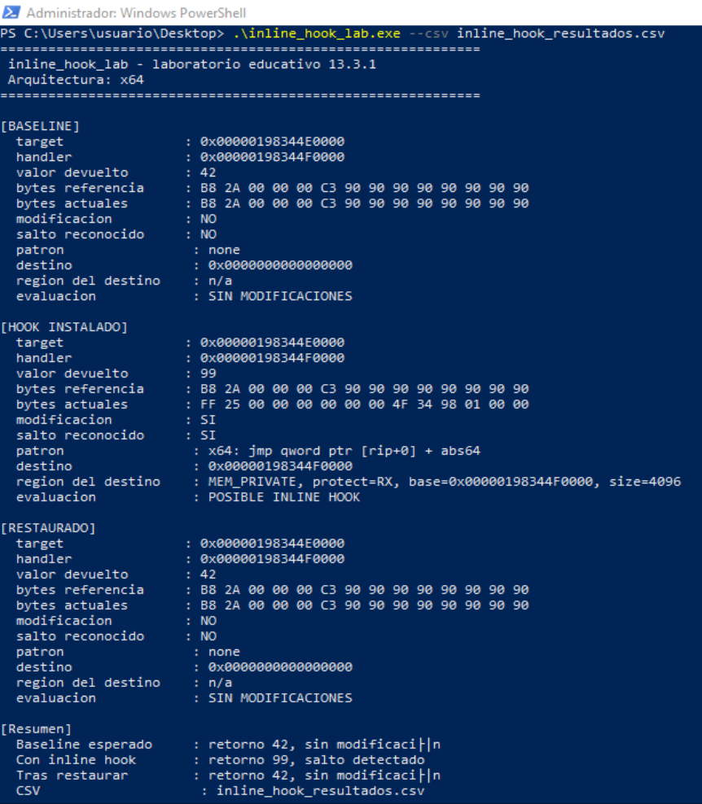

> **Figura 13.8.1.1. Ejecución de referencia y ciclo completo del laboratorio.** En la fase `BASELINE`, la función `target` devuelve `42`, los bytes actuales coinciden con la referencia y la evaluación es `SIN MODIFICACIONES`. La misma ejecución muestra posteriormente la detección positiva y la restauración final.

La fase negativa puede representarse como:

```text
target
        ↓
B8 2A 00 00 00
        ↓
mov eax, 42
        ↓
C3
        ↓
ret
        ↓
resultado = 42
        ↓
comparación con referencia
        ↓
sin diferencias
        ↓
SIN MODIFICACIONES
```

###### Criterio para considerar negativa la prueba

La detección se considera negativa cuando se cumplen simultáneamente:

- Los bytes actuales coinciden con los bytes de referencia.
- No se identifica un salto compatible con el patrón de hook.
- La función conserva el valor de retorno esperado.
- La herramienta muestra `SIN MODIFICACIONES`.

En la ejecución documentada:

| Campo | Resultado |
|---|---|
| Valor devuelto | `42` |
| Modificación | `NO` |
| Salto reconocido | `NO` |
| Patrón | `none` |
| Evaluación | `SIN MODIFICACIONES` |

---

#### Demostración positiva: instalación del `inline hook`

##### Interceptación de la modificación con `x64dbg`

Para observar dinámicamente cuándo se modifica el código se establece un breakpoint en:

```text
kernel32.FlushInstructionCache
```

En sistemas donde la llamada se resuelva a través de `KernelBase`, también puede utilizarse:

```text
kernelbase.FlushInstructionCache
```

En Windows x64, los tres argumentos relevantes se reciben mediante:

```text
RCX = handle del proceso
RDX = dirección de la región modificada
R8  = tamaño de la región
```

Durante la inicialización aparecen llamadas asociadas a regiones de 64 bytes. La llamada relevante para el hook es aquella en la que:

```text
R8 = 0xE
```

El valor hexadecimal `0xE` equivale a:

```text
14 bytes
```

que es exactamente el tamaño del parche utilizado por la herramienta en x64.

En la ejecución analizada se observó:

```text
RCX = FFFFFFFFFFFFFFFF
RDX = 000001AA0DFC0000
R8  = 000000000000000E
```


> **Figura 13.8.1.2. Modificación de 14 bytes observada en `FlushInstructionCache`.** El registro `RDX` contiene la dirección `0x000001AA0DFC0000`, correspondiente a la función `target`, mientras que `R8 = 0xE` indica que se han modificado 14 bytes.

El valor:

```text
RCX = FFFFFFFFFFFFFFFF
```

corresponde al pseudo-handle del proceso actual.

Por tanto, la llamada documenta que el programa acaba de modificar código dentro de su propio proceso y sincroniza la caché de instrucciones antes de continuar.

---

##### Inspección de los bytes modificados

Siguiendo en el volcado de memoria la dirección almacenada en:

```text
RDX = 0x000001AA0DFC0000
```

se observan los siguientes 14 bytes:

```text
FF 25 00 00 00 00 00 00 FD 0D AA 01 00 00
```


> **Figura 13.8.1.3. Bytes del `inline hook` instalados sobre la función `target`.** Los seis primeros bytes forman un salto indirecto `FF 25 00 00 00 00`, mientras que los ocho siguientes contienen la dirección absoluta del `handler`.

Los primeros seis bytes:

```text
FF 25 00 00 00 00
```

corresponden a:

```asm
jmp qword ptr [rip+0]
```

Los ocho bytes siguientes son:

```text
00 00 FD 0D AA 01 00 00
```

Al encontrarse almacenados en formato *little endian*, se reconstruyen como:

```text
0x000001AA0DFD0000
```

Por tanto, la redirección es:

```text
target
0x000001AA0DFC0000
        |
        | FF 25 00 00 00 00
        |
        +---------------> 0x000001AA0DFD0000
```

Esta evidencia confirma que el prólogo original ha sido sustituido por una instrucción que modifica el flujo de ejecución.

---

##### Verificación del destino del hook

A continuación se sigue en el desensamblador la dirección:

```text
0x000001AA0DFD0000
```

En ella se observa:

```asm
000001AA0DFD0000  B8 63000000    mov eax,63
000001AA0DFD0005  C3             ret
```


> **Figura 13.8.1.4. Código situado en el destino del `inline hook`.** La dirección `0x000001AA0DFD0000` contiene `mov eax, 0x63; ret`. El valor `0x63` equivale a `99` en decimal.

La conversión es:

```text
0x63 = 99
```

Por tanto, la secuencia completa es:

```text
target
0x000001AA0DFC0000
        |
        | jmp
        v
handler
0x000001AA0DFD0000
        |
        | mov eax, 99
        | ret
        v
resultado = 99
```

Esto coincide con la salida de la herramienta:

```text
[HOOK INSTALADO]

valor devuelto       : 99
modificacion         : SI
salto reconocido     : SI
patron                : x64: jmp qword ptr [rip+0] + abs64
evaluacion            : POSIBLE INLINE HOOK
```

###### Criterio para considerar positiva la prueba

La detección se considera positiva cuando aparecen simultáneamente:

- Los bytes actuales son distintos de la referencia.
- Se reconoce el patrón de salto utilizado por el hook.
- Se reconstruye una dirección de destino válida.
- El flujo llega al `handler`.
- El comportamiento de la función cambia.
- La herramienta clasifica el resultado como `POSIBLE INLINE HOOK`.

En la ejecución documentada:

| Campo | Resultado |
|---|---|
| Dirección `target` | `0x000001AA0DFC0000` |
| Tamaño modificado | `0xE` = 14 bytes |
| Bytes iniciales | `FF 25 00 00 00 00` |
| Patrón | `jmp qword ptr [rip+0]` |
| Dirección `handler` | `0x000001AA0DFD0000` |
| Código del handler | `mov eax, 0x63; ret` |
| Valor devuelto | `99` |
| Modificación | `SI` |
| Salto reconocido | `SI` |
| Evaluación | `POSIBLE INLINE HOOK` |

---

#### Demostración negativa tras la restauración

##### Restauración de los bytes originales

Después de demostrar la detección positiva, la herramienta restaura los 14 bytes originales de la función.

La ejecución vuelve a detenerse en:

```text
kernel32.FlushInstructionCache
```

con:

```text
RDX = 000001AA0DFC0000
R8  = 000000000000000E
```

La dirección es la misma utilizada durante la instalación del hook y el tamaño continúa siendo de 14 bytes.

Sin embargo, el volcado de memoria muestra ahora:

```text
B8 2A 00 00 00 C3 90 90 90 90 90 90 90 90
```


> **Figura 13.8.1.5. Restauración de los bytes originales de `target`.** Tras eliminar el hook, la función vuelve a comenzar con `B8 2A 00 00 00 C3`, correspondiente a `mov eax, 0x2A; ret`.

Las instrucciones recuperadas son:

```asm
mov eax, 0x2A
ret
```

y:

```text
0x2A = 42
```

Por tanto, el flujo vuelve a ser:

```text
target
        ↓
mov eax, 42
        ↓
ret
        ↓
resultado = 42
```

La herramienta muestra:

```text
[RESTAURADO]

valor devuelto       : 42
modificacion         : NO
salto reconocido     : NO
patron                : none
evaluacion            : SIN MODIFICACIONES
```

Esta fase constituye una segunda demostración negativa y confirma que el detector no permanece en estado positivo una vez desaparece la modificación.

---

#### Comparación entre la detección negativa y positiva

| Característica | Negativa: baseline | Positiva: hook activo | Negativa: restaurado |
|---|---|---|---|
| Bytes iniciales | `B8 2A 00 00 00 C3` | `FF 25 00 00 00 00` | `B8 2A 00 00 00 C3` |
| Función inicial | `mov eax,42` | `jmp qword ptr [rip+0]` | `mov eax,42` |
| Redirección | No | Sí | No |
| Destino externo al `target` | No | `0x000001AA0DFD0000` | No |
| Valor devuelto | `42` | `99` | `42` |
| Bytes distintos de referencia | No | Sí | No |
| Salto reconocido | No | Sí | No |
| Resultado | `SIN MODIFICACIONES` | `POSIBLE INLINE HOOK` | `SIN MODIFICACIONES` |

La transición observada es:

```text
NEGATIVO
B8 2A 00 00 00 C3
        |
        v
retorna 42
        |
        v
SIN MODIFICACIONES

        ↓ instalación

POSITIVO
FF 25 00 00 00 00 <handler>
        |
        v
handler
        |
        v
retorna 99
        |
        v
POSIBLE INLINE HOOK

        ↓ restauración

NEGATIVO
B8 2A 00 00 00 C3
        |
        v
retorna 42
        |
        v
SIN MODIFICACIONES
```

---

#### Evidencias obtenidas

La práctica permite documentar los siguientes elementos:

- Dirección de la función `target`.
- Dirección del `handler`.
- Bytes originales de la función.
- Bytes instalados por el hook.
- Tamaño exacto de la modificación.
- Instrucción utilizada para redirigir el flujo.
- Dirección codificada en el salto.
- Código ejecutado en el destino.
- Cambio observable del valor de retorno.
- Restauración posterior del código original.
- Clasificación positiva y negativa realizada por la herramienta.
- Exportación de los resultados a CSV.

La evidencia es especialmente sólida porque el resultado positivo no depende únicamente de que los bytes sean diferentes. Se demuestra también:

```text
Modificación del prólogo
        ↓
Reconocimiento del salto
        ↓
Reconstrucción del destino
        ↓
Inspección del código del handler
        ↓
Cambio efectivo del comportamiento
```

---

#### Relación con la detección de entornos de análisis

En una muestra real, una comprobación equivalente podría aplicarse sobre APIs o funciones sensibles para identificar modificaciones introducidas por:

- Sandboxes.
- Herramientas de instrumentación.
- EDR.
- Antivirus.
- Sistemas de monitorización.
- Depuradores o frameworks de análisis dinámico.

Por ejemplo, una muestra podría inspeccionar los primeros bytes de una API y comprobar si existe una redirección hacia código ajeno a la implementación esperada.

Sin embargo, la presencia de un `inline hook` **no demuestra por sí sola la existencia de una máquina virtual**. Los hooks también pueden ser utilizados por software legítimo. Por este motivo, la técnica debe considerarse una heurística de detección de instrumentación y correlacionarse con otras evidencias anti-análisis.

---

#### Limitaciones de la demostración

- La función `target` es sintética y ha sido creada específicamente para el laboratorio.
- El patrón de hook utilizado es conocido y deliberadamente sencillo.
- Las direcciones de memoria cambian entre ejecuciones.
- La detección de un `JMP` inicial no constituye por sí sola una prueba universal de hooking.
- Funciones reales de Windows pueden comenzar con *thunks* o redirecciones legítimas.
- Una implementación real puede utilizar patrones de salto distintos.
- Las soluciones de seguridad pueden aplicar hooks legítimos.
- La técnica identifica una modificación compatible con instrumentación, no una tecnología de virtualización concreta.
- La comparación con una referencia debe tener en cuenta la versión y arquitectura del código analizado.

---

#### Conclusión

La práctica permite demostrar de forma controlada tanto un **resultado negativo** como un **resultado positivo** de detección de `inline hooks`.

En el estado inicial, la función contiene:

```asm
mov eax, 42
ret
```

y la herramienta confirma que los bytes coinciden con la referencia.

Posteriormente, los primeros 14 bytes se sustituyen por:

```asm
jmp qword ptr [rip+0]
```

seguido de la dirección:

```text
0x000001AA0DFD0000
```

El destino contiene:

```asm
mov eax, 99
ret
```

por lo que el comportamiento cambia de `42` a `99`. La herramienta identifica simultáneamente la modificación del código y el patrón de redirección, clasificando el estado como:

```text
POSIBLE INLINE HOOK
```

Finalmente, los bytes originales son restaurados:

```text
B8 2A 00 00 00 C3
```

y la detección vuelve a:

```text
SIN MODIFICACIONES
```

La secuencia completa queda demostrada como:

```text
Código limpio
        ↓
detección negativa
        ↓
instalación del inline hook
        ↓
detección positiva
        ↓
redirección hacia handler
        ↓
cambio de comportamiento
        ↓
restauración
        ↓
detección negativa
```

Por tanto, `inline_hook_lab` permite reproducir de forma íntegra y documentada el mecanismo fundamental de detección de `inline hooks`, incluyendo la comparación negativa, la detección positiva y la recuperación posterior del estado original.


----


<div style="page-break-after: always;"></div>


## 8.13. Network

> **Ampliación y evidencias completas:** [ficha `14-network.md`][ficha-network]. El repositorio conserva capturas adicionales, herramientas, código y secuencias no incluidas en la memoria.


### Fundamento y propósito

La técnica `network` es un mecanismo de evasión anti-VM y anti-sandbox basado en la inspección de la configuración de red del sistema para identificar artefactos compatibles con un entorno virtualizado o de análisis. Su objetivo es inferir si el programa se está ejecutando dentro de una máquina virtual, una sandbox o una infraestructura de laboratorio mediante propiedades asociadas a las interfaces, adaptadores y parámetros de red.

A diferencia de otras técnicas que consultan directamente información del procesador, firmware o dispositivos de almacenamiento, `network` se centra en elementos de la pila de comunicaciones. Entre los indicadores que pueden analizarse se encuentran:

- Direcciones MAC y sus prefijos OUI.
- Nombre, descripción y fabricante del adaptador de red.
- Tipo de interfaz y características del dispositivo.
- Direcciones IPv4 e IPv6 asignadas.
- Puerta de enlace predeterminada.
- Servidores DNS.
- Servidor DHCP y parámetros de concesión.
- Rutas de red.
- Interfaces virtuales.
- Identificadores de dispositivos y controladores asociados a adaptadores.
- Información obtenida mediante APIs de Windows, WMI, PowerShell o el Registro.
- Coherencia entre varios indicadores de red.

Una comprobación especialmente habitual consiste en obtener la dirección MAC de los adaptadores y analizar sus primeros bytes. Los tres primeros octetos identifican normalmente al fabricante o bloque de direcciones asignado al dispositivo. Determinados productos de virtualización utilizan o reservan rangos reconocibles, por lo que una coincidencia puede actuar como indicio de que el sistema está virtualizado.

También pueden examinarse configuraciones de red predeterminadas. Por ejemplo, determinados modos NAT de productos de virtualización crean redes privadas con direcciones, puertas de enlace y servidores DNS característicos. Un programa puede comparar estos valores con patrones conocidos y aumentar su nivel de sospecha cuando aparecen varios de ellos simultáneamente.

Otra variante consiste en consultar el nombre o descripción de los adaptadores. Cadenas relacionadas con tecnologías como `VMware`, `VirtualBox`, `Hyper-V`, `VBOX`, `VMXNET`, `virtio` o términos equivalentes pueden revelar la presencia de un dispositivo virtual. Sin embargo, estas cadenas dependen del hipervisor, del controlador instalado y de la configuración seleccionada.

En Windows, la información puede obtenerse mediante diferentes mecanismos, entre ellos:

```text
GetAdaptersAddresses
GetAdaptersInfo
GetIfTable
GetIfTable2
GetIpForwardTable
GetIpForwardTable2
WMI / CIM
Registro de Windows
PowerShell
```

La API `GetAdaptersAddresses` resulta especialmente relevante porque permite recuperar información asociada a los adaptadores locales, como direcciones unicast, direcciones físicas, nombres descriptivos y, utilizando las opciones correspondientes, información de puertas de enlace y otros parámetros.

Una secuencia conceptual de detección puede representarse de la siguiente forma:

```text
Enumerar adaptadores de red
        ↓
Obtener MAC, descripción y configuración IP
        ↓
Normalizar los valores
        ↓
Comparar con indicadores conocidos
        ↓
Correlacionar varias evidencias
        ↓
Asignar nivel de sospecha
        ↓
Modificar o mantener el flujo de ejecución
```

Si se detectan valores asociados a una plataforma de virtualización, la muestra puede finalizar, retrasar su ejecución, ocultar determinadas funciones, evitar desplegar el `payload` o adoptar un comportamiento alternativo.

No obstante, las comprobaciones de red deben considerarse **heurísticas**. Una dirección MAC puede modificarse, una máquina virtual puede utilizar modo puente, las redes NAT pueden personalizarse y un sistema físico puede contener adaptadores virtuales creados por VPN, contenedores, software de virtualización, herramientas de seguridad o componentes del propio sistema operativo. Por ello, una evidencia sólida requiere correlacionar varios indicadores y evitar conclusiones basadas en una única propiedad.


----


### Demostración dinámica: prefijos OUI

##### Objetivo de la demostración

El objetivo de esta práctica es demostrar dinámicamente cómo `Pafish` utiliza el prefijo de la dirección MAC —OUI— como indicador heurístico para identificar un entorno virtualizado. La ejecución se realiza dentro de una máquina virtual Windows y se analiza con `x64dbg`.

La comprobación estudiada sigue conceptualmente la siguiente secuencia:

```text
Enumeración de adaptadores
        ↓
Obtención de la dirección MAC
        ↓
Extracción de los tres primeros bytes
        ↓
Comparación con un OUI de referencia
        ↓
Coincidencia
        ↓
Resultado positivo de la comprobación
```

En la máquina virtual utilizada para la práctica, la dirección física del adaptador comienza por:

```text
08:00:27
```

Durante la ejecución se observa que `Pafish` compara precisamente esos tres primeros bytes con un valor de referencia almacenado en el propio ejecutable.

La demostración permite documentar cuatro elementos fundamentales:

- La dirección MAC real expuesta por la máquina virtual.
- La enumeración de adaptadores mediante `GetAdaptersAddresses`.
- La recuperación de la dirección física en memoria.
- La comparación de los tres bytes del OUI mediante `memcmp` y la rama positiva posterior.

---

##### Comprobación previa de la dirección MAC

Antes de ejecutar `Pafish` bajo el depurador se obtiene la dirección MAC real del adaptador mediante:

```powershell
getmac /v
```

La salida muestra:

```text
08-00-27-01-E4-E9
```

Por tanto, los tres primeros octetos de la dirección son:

```text
08:00:27
```

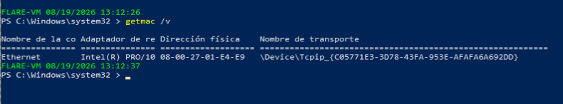

> **Figura 14.8.1.1. Dirección MAC de referencia de la máquina virtual.** El comando `getmac /v` muestra la dirección física `08-00-27-01-E4-E9`. Los tres primeros bytes, `08:00:27`, constituyen el OUI que posteriormente será comparado por `Pafish`.

Esta comprobación previa es importante porque permite contrastar la información mostrada por Windows con los bytes recuperados posteriormente por `Pafish` en memoria.

---

##### Breakpoint inicial en `GetAdaptersAddresses`

Para observar cómo `Pafish` obtiene la información de los adaptadores se establece inicialmente:

```text
bp iphlpapi.GetAdaptersAddresses
```

La primera detención se produce en `iphlpapi.GetAdaptersAddresses`.

En Windows x64, los cuatro primeros argumentos se reciben en:

```text
RCX = Family
RDX = Flags
R8  = Reserved
R9  = AdapterAddresses
```

En esta primera llamada se observa:

```text
RCX = 0
RDX = 0
R8  = 0
R9  = 0
```

El valor nulo de `R9` indica que todavía no se ha proporcionado un búfer destinado a recibir las estructuras con la información de los adaptadores.


> **Figura 14.8.1.2. Primera llamada a `GetAdaptersAddresses`.** El registro `R9` contiene `0`, por lo que `AdapterAddresses` es nulo. Esta primera invocación permite determinar el tamaño necesario del búfer. En la pila también puede observarse la cadena `Looking for a MAC address starting...`, que relaciona la llamada con la comprobación del prefijo MAC.

En la pila se observa además un puntero utilizado para almacenar el tamaño requerido. Tras esta primera llamada, `Pafish` puede reservar memoria suficiente y volver a invocar la API.

---

##### Segunda llamada a `GetAdaptersAddresses`

Al continuar la ejecución, el breakpoint se activa una segunda vez.

En esta ocasión se observa:

```text
R9 = 0000000000112920
```

Por tanto, el cuarto argumento ya contiene una dirección de memoria válida:

```text
AdapterAddresses = 0x112920
```

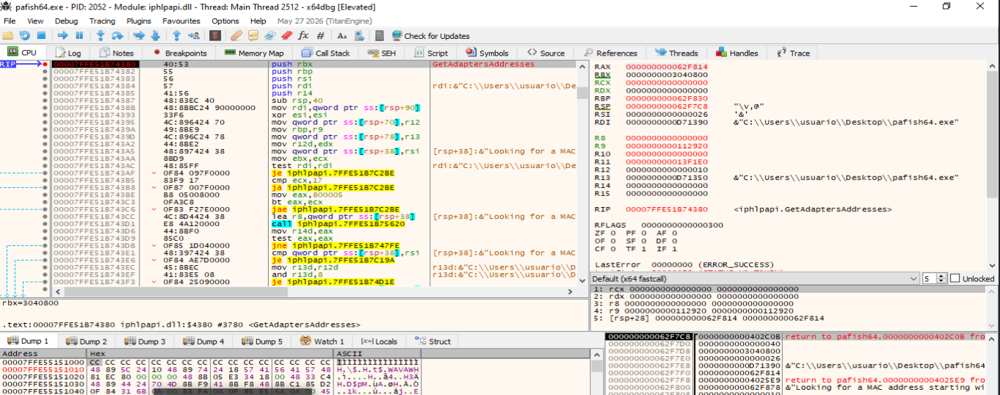

> **Figura 14.8.1.3. Segunda llamada a `GetAdaptersAddresses`.** El registro `R9` contiene la dirección `0x112920`, correspondiente al búfer que recibirá las estructuras con la información de los adaptadores. A diferencia de la primera llamada, el parámetro `AdapterAddresses` ya no es nulo.

La secuencia observada hasta este punto puede resumirse como:

```text
Primera llamada
R9 = NULL
        ↓
Obtención del tamaño necesario
        ↓
Reserva del búfer
        ↓
Segunda llamada
R9 = 0x112920
```

---

##### Recuperación de la dirección física del adaptador

Tras finalizar la segunda llamada a `GetAdaptersAddresses`, el búfer contiene la información de los adaptadores enumerados por Windows.

Al inspeccionar la memoria se localiza la secuencia:

```text
08 00 27 01 E4 E9
```


> **Figura 14.8.1.4. Dirección MAC recuperada mediante `GetAdaptersAddresses`.** En el búfer utilizado por `Pafish` aparece la secuencia `08 00 27 01 E4 E9`, que coincide exactamente con la dirección `08-00-27-01-E4-E9` obtenida previamente mediante `getmac /v`.

La correspondencia entre ambas observaciones es:

| Fuente | Dirección observada |
|---|---|
| `getmac /v` | `08-00-27-01-E4-E9` |
| Memoria de `Pafish` | `08 00 27 01 E4 E9` |

Esto demuestra que `Pafish` ha recuperado correctamente la dirección física del adaptador antes de realizar la comprobación del OUI.

---

##### Interceptación de la comparación mediante `memcmp`

Para localizar la comparación concreta se establece un breakpoint en:

```text
bp msvcrt.memcmp
```

Como `memcmp` puede utilizarse en otras comprobaciones de `Pafish`, resulta útil filtrar las detenciones y buscar una llamada cuyo tercer argumento sea igual a tres:

```text
R8 = 3
```

En Windows x64, la llamada:

```c
memcmp(buffer1, buffer2, size)
```

recibe conceptualmente:

```text
RCX → primer búfer
RDX → segundo búfer
R8  → número de bytes comparados
```

En la ejecución analizada se observa:

```text
RCX = 0000000000410447
RDX = 000000000062F80E
R8  = 0000000000000003
```

Al seguir `RDX` en el volcado de memoria aparece:

```text
08 00 27 01 E4 E9
```


> **Figura 14.8.1.5. Entrada en `memcmp` durante la comprobación MAC.** El registro `R8` contiene `3`, lo que demuestra que `Pafish` compara únicamente tres bytes. El segundo búfer contiene la dirección física `08 00 27 01 E4 E9`.

La llamada puede representarse inicialmente como:

```text
memcmp(
    buffer_referencia,
    08 00 27 01 E4 E9,
    3
)
```

El siguiente paso consiste en comprobar qué contiene el primer búfer.

---

##### Localización del OUI de referencia

Al seguir la dirección almacenada inicialmente en `RCX`:

```text
0x410447
```

se observa en memoria:

```text
08 00 27
```

Por tanto, `Pafish` está comparando el prefijo de referencia:

```text
08:00:27
```

con los tres primeros bytes de la MAC real:

```text
08:00:27:01:E4:E9
```

La operación observada dinámicamente es equivalente a:

```text
memcmp(
    08 00 27,
    08 00 27 01 E4 E9,
    3
)
```


> **Figura 14.8.1.6. OUI de referencia utilizado por `Pafish`.** En la dirección de memoria utilizada como primer operando se observa la secuencia `08 00 27`. La función `memcmp` ha avanzado los punteros tres bytes y finaliza con `RAX = 0`, indicando que los tres bytes comparados son iguales.

El resultado:

```text
RAX = 0
```

indica igualdad entre ambos bloques:

```text
OUI de referencia: 08 00 27
                   |  |  |
MAC real:          08 00 27 01 E4 E9
                   +-------+
                    3 bytes
```

Por tanto:

```text
memcmp(...) = 0
        ↓
Coincidencia del OUI
```

---

##### Tratamiento del resultado por `Pafish`

Después de retornar desde `memcmp`, la ejecución vuelve a `Pafish` en:

```text
0x402C51
```

El registro mantiene:

```text
EAX = 0
```

y el código ejecuta:

```asm
test eax,eax
jne  0x402C6C
```


> **Figura 14.8.1.7. Tratamiento del resultado de `memcmp`.** Tras regresar a `Pafish`, `EAX` contiene `0`. La instrucción `test eax,eax` evalúa el resultado y el salto `jne` no corresponde a la rama de igualdad. En la misma secuencia puede observarse posteriormente `mov eax,1`, utilizado para devolver un resultado positivo cuando se ha localizado una coincidencia.

El flujo observado puede representarse como:

```text
memcmp(...) = 0
        ↓
EAX = 0
        ↓
test eax,eax
        ↓
ZF = 1
        ↓
jne no tomado
        ↓
liberación del búfer
        ↓
mov eax,1
        ↓
resultado positivo
```

La rama alternativa contiene un retorno equivalente a:

```asm
mov eax,0
```

cuando no se encuentra el prefijo esperado.

---

##### Flujo completo de la demostración

La ejecución observada permite reconstruir la comprobación completa:

```text
getmac /v
        ↓
08-00-27-01-E4-E9
        ↓
Pafish inicia comprobación MAC
        ↓
GetAdaptersAddresses
        ↓
Primera llamada:
R9 = NULL
        ↓
Obtención del tamaño
        ↓
Segunda llamada:
R9 = 0x112920
        ↓
Enumeración de adaptadores
        ↓
MAC recuperada:
08 00 27 01 E4 E9
        ↓
OUI de referencia:
08 00 27
        ↓
memcmp(..., ..., 3)
        ↓
RAX = 0
        ↓
Los tres primeros bytes coinciden
        ↓
test eax,eax
        ↓
rama positiva
        ↓
mov eax,1
```

Esta secuencia demuestra que la dirección MAC no se utiliza únicamente como información descriptiva. `Pafish` extrae sus primeros bytes, los compara con un patrón concreto y utiliza el resultado para decidir si la comprobación anti-VM es positiva.

---

##### Evidencias demostradas

Las capturas permiten establecer las siguientes evidencias:

- La máquina virtual expone la dirección MAC `08-00-27-01-E4-E9`.
- El OUI observado es `08:00:27`.
- `Pafish` utiliza `GetAdaptersAddresses` para enumerar los adaptadores.
- La primera llamada se realiza con `AdapterAddresses = NULL`.
- La segunda llamada utiliza un búfer válido en `0x112920`.
- La dirección física `08 00 27 01 E4 E9` aparece en la información recuperada.
- `Pafish` invoca `memcmp` con un tamaño de `3` bytes.
- Uno de los operandos contiene `08 00 27`.
- El otro operando comienza por `08 00 27`.
- `memcmp` devuelve `0`.
- El resultado se evalúa mediante `test eax,eax`.
- La coincidencia conduce a la rama que devuelve un resultado positivo.

Las direcciones de memoria y código mostradas corresponden a la ejecución y compilación concretas utilizadas en el laboratorio y pueden variar debido a ASLR, recompilación o diferencias entre versiones.

---

##### Limitaciones

La comprobación basada en OUI debe interpretarse como una **heurística anti-VM** y no como una prueba absoluta de virtualización.

Entre sus principales limitaciones se encuentran:

- La dirección MAC de una máquina virtual puede modificarse.
- Puede utilizarse una dirección administrada localmente.
- El hipervisor puede permitir configurar manualmente el prefijo.
- Un sistema físico puede contener adaptadores virtuales.
- Una VPN, un software de virtualización o determinadas herramientas de seguridad pueden crear interfaces adicionales.
- La presencia de un OUI concreto identifica una coincidencia con el patrón evaluado, pero no demuestra por sí sola toda la naturaleza del entorno.

Por este motivo, esta comprobación debe correlacionarse con otras técnicas anti-VM, como información de hardware, CPU, procesos, Registro, WMI, dispositivos o configuración de red.

---

##### Conclusión

La demostración dinámica confirma que `Pafish` utiliza la dirección MAC como indicador anti-virtualización.

La herramienta enumera los adaptadores mediante `GetAdaptersAddresses`, recupera la dirección física `08 00 27 01 E4 E9` y compara sus tres primeros bytes con el valor de referencia `08 00 27`.

La llamada:

```text
memcmp(08 00 27, 08 00 27 01 E4 E9, 3)
```

devuelve:

```text
0
```

lo que indica igualdad. Posteriormente, `Pafish` evalúa el resultado y continúa por la rama que devuelve un valor positivo.

La práctica demuestra, por tanto, la secuencia completa:

```text
Enumeración del adaptador
        ↓
Obtención de la MAC
        ↓
Extracción lógica del OUI
        ↓
Comparación de tres bytes
        ↓
Coincidencia
        ↓
Resultado anti-VM positivo
```

El resultado debe considerarse un indicador heurístico y combinarse con otras evidencias para reducir falsos positivos.


<div style="page-break-after: always;"></div>


## 8.14. OS Features

> **Ampliación y evidencias completas:** [ficha `15-os-features.md`][ficha-os-features]. El repositorio conserva capturas adicionales, herramientas, código y secuencias no incluidas en la memoria.


### Fundamento y propósito

La técnica `OS Features` agrupa mecanismos de evasión que aprovechan **peculiaridades del funcionamiento del sistema operativo** para identificar si un programa se está ejecutando en un entorno de análisis, una sandbox, un depurador o una capa de compatibilidad diferente de una instalación convencional de Windows.

A diferencia de otras técnicas anti-VM basadas en artefactos explícitos del hipervisor —por ejemplo, nombres de procesos, claves del Registro, dispositivos, firmware o características de hardware—, `OS Features` se centra en observar **cómo responde el propio sistema operativo ante determinadas operaciones**. El objetivo no es necesariamente encontrar la cadena `VMware`, `VirtualBox` o `QEMU`, sino detectar un comportamiento del sistema que resulte anómalo, diferente o característico de una plataforma instrumentada.

Dentro de la taxonomía utilizada por Check Point para clasificar técnicas de evasión, `OS Features` incluye principalmente tres grupos de comprobaciones:

- **Comprobación de privilegios de depuración**, especialmente la presencia o habilitación de `SeDebugPrivilege` en el token del proceso.
- **Uso de una pila desbalanceada o preparada con datos canario**, con el objetivo de detectar hooks de espacio de usuario que consumen más pila de la esperada.
- **Detección de Wine**, aprovechando diferencias de comportamiento respecto a Windows o buscando funciones exportadas que son propias de Wine.

Estas técnicas pueden aparecer de forma aislada o combinarse con otros mecanismos de reconocimiento ambiental. Una muestra puede ejecutar una o varias comprobaciones durante su fase inicial y utilizar el resultado para decidir si continúa con su funcionalidad principal.

El flujo conceptual puede representarse de la siguiente forma:

```text
Inicio del programa
        ↓
Comprobación de una peculiaridad del sistema operativo
        ↓
Obtención de un resultado
        ↓
Comparación con el comportamiento esperado
        ↓
¿Resultado compatible con análisis, sandbox o Wine?
        ↓
Sí ---------------- No
↓                    ↓
Modificar flujo      Continuar ejecución normal
```

La respuesta adoptada por una muestra puede consistir en finalizar, permanecer inactiva, ejecutar únicamente funcionalidad inocua, retrasar determinadas acciones o seleccionar una rama alternativa.

Desde el punto de vista del análisis de malware, estas comprobaciones deben interpretarse como **heurísticas**. Un resultado positivo no demuestra por sí solo que exista una sandbox o una máquina virtual. Los privilegios del proceso pueden depender de la forma en la que se inició la aplicación, los hooks pueden proceder de software legítimo de seguridad o monitorización y Wine puede cambiar su implementación entre versiones.

Por tanto, la evidencia es más sólida cuando:

- La comprobación aparece antes de una rama relevante del programa.
- Existe una comparación explícita del resultado.
- El resultado modifica el flujo de ejecución.
- La misma conclusión se apoya en más de un indicador.
- Se reproducen los resultados en varios entornos controlados.

En este apartado se mantiene deliberadamente separado `OS Features` de otras familias como `Registry`, `Filesystem`, `Processes`, `WMI`, `CPU`, `Hardware`, `Timing` o `UI artifacts`. Aunque todas pueden contribuir a detectar un entorno virtualizado, cada una utiliza una fuente de información diferente y debe documentarse de forma independiente.

----


### Demostración dinámica: SeDebugPrivilege

##### Objetivo de la demostración

El objetivo de esta práctica es observar dinámicamente cómo `al-khaser` implementa una comprobación asociada a `SeDebugPrivilege` mediante el acceso al proceso crítico `csrss.exe`.

La versión de `al-khaser` utilizada en esta demostración no consulta directamente el token del proceso mediante `OpenProcessToken` y `GetTokenInformation`. En su lugar, emplea una comprobación indirecta: obtiene el PID de `csrss.exe` e intenta abrir el proceso mediante `OpenProcess`. El resultado de esta operación se utiliza posteriormente para determinar si la comprobación debe considerarse positiva o negativa.

En el binario analizado, la llamada observada utiliza:

```text
PROCESS_QUERY_LIMITED_INFORMATION = 0x1000
```

Por tanto, la secuencia demostrada experimentalmente es:

```text
Obtener PID de csrss.exe
        ↓
OpenProcess(
    PROCESS_QUERY_LIMITED_INFORMATION,
    FALSE,
    PID_csrss
)
        ↓
Comprobar el valor devuelto en RAX
        ↓
test rax,rax
        ↓
Salto condicional
        ↓
Resultado mostrado por al-khaser
```

La finalidad de la práctica no es forzar una detección positiva, sino demostrar el mecanismo utilizado por la herramienta, los argumentos enviados a `OpenProcess`, el valor devuelto por la API y la decisión posterior tomada por el programa.

---

##### Entorno y herramientas utilizadas

La demostración se realizó con:

- `al-khaser_x64.exe`.
- `x64dbg` ejecutado con privilegios elevados.
- PowerShell para identificar los PID de `csrss.exe`.
- Windows x64.

La categoría anti-debug se ejecutó mediante:

```powershell
.\al-khaser_x64.exe --check DEBUG
```

Debido a que `--check DEBUG` ejecuta varias técnicas anti-debug antes de llegar a la comprobación de `SeDebugPrivilege`, la función se localizó directamente dentro del código de `al-khaser` y se utilizaron breakpoints en las instrucciones inmediatamente anterior y posterior a la llamada a `OpenProcess`.

---

##### Identificación de los procesos `csrss.exe`

Antes de iniciar la inspección de la llamada a `OpenProcess`, se identificaron los PID de los procesos `csrss.exe` mediante PowerShell:

```powershell
Get-Process csrss | Select-Object Id, ProcessName
```

En la ejecución analizada se obtuvieron:

```text
448  csrss
532  csrss
```

El PID `532` equivale en hexadecimal a:

```text
532 decimal = 0x214
```

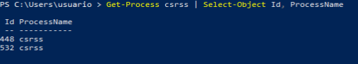

> **Figura 15.8.1.1. Identificación de los procesos `csrss.exe`.** PowerShell muestra dos instancias de `csrss.exe`, con PID 448 y 532. El PID 532, equivalente a `0x214`, es el valor utilizado posteriormente por `al-khaser` en la llamada analizada.

Esta comprobación previa permite relacionar el contenido del registro `R8` con un proceso concreto y evita interpretar el PID únicamente a partir del valor hexadecimal observado en el depurador.

---

##### Localización de la llamada asociada a `SeDebugPrivilege`

La comprobación se localizó a partir de la cadena:

```text
Checking SeDebugPrivilege
```

En el desensamblado de `al-khaser` se identificó la secuencia:

```asm
mov r8d,eax
xor edx,edx
mov ecx,1000
call qword ptr ds:[<&OpenProcess>]
test rax,rax
je   <rama_fallo>
```

La secuencia permite reconstruir los argumentos utilizados por `OpenProcess` según la convención de llamada de Windows x64:

```text
RCX → dwDesiredAccess
RDX → bInheritHandle
R8  → dwProcessId
```

Para documentar la prueba se colocaron dos breakpoints:

```text
Primer breakpoint:
instrucción call OpenProcess

Segundo breakpoint:
instrucción test rax,rax
```

El primero permite capturar los argumentos antes de entrar en la API. El segundo permite observar directamente el valor retornado por `OpenProcess`.

---

##### Preparación de los argumentos de `OpenProcess`

La primera interrupción relevante se produjo justo antes de ejecutar:

```asm
call qword ptr ds:[<&OpenProcess>]
```

En ese instante se observaron:

```text
RCX = 0000000000001000
RDX = 0000000000000000
R8  = 0000000000000214
```


> **Figura 15.8.1.2. Preparación de la llamada a `OpenProcess`.** `al-khaser` establece `RCX=0x1000`, `RDX=0` y `R8=0x214` antes de ejecutar la API. El valor `0x214` corresponde al PID 532 de `csrss.exe`.

Los argumentos pueden interpretarse como:

| Registro | Valor | Interpretación |
|---|---:|---|
| `RCX` | `0x1000` | `PROCESS_QUERY_LIMITED_INFORMATION` |
| `RDX` | `0x0` | `bInheritHandle = FALSE` |
| `R8` | `0x214` | PID 532 de `csrss.exe` |

Por tanto, la llamada observada equivale conceptualmente a:

```cpp
OpenProcess(
    PROCESS_QUERY_LIMITED_INFORMATION,
    FALSE,
    532
);
```

La evidencia confirma que la comprobación no está operando sobre un proceso arbitrario: el PID utilizado corresponde directamente a `csrss.exe`.

---

##### Resultado de `OpenProcess`

Después de ejecutar la API, el segundo breakpoint detuvo el programa en:

```asm
test rax,rax
```

En ese momento el registro `RAX` contenía:

```text
RAX = 0000000000000000
```

y `x64dbg` mostraba:

```text
LastError = 00000005 (ERROR_ACCESS_DENIED)
```


> **Figura 15.8.1.3. Resultado de `OpenProcess`.** La API devuelve `NULL` en `RAX`. El valor `LastError = 5 (ERROR_ACCESS_DENIED)` indica que el acceso solicitado a `csrss.exe` fue rechazado.

La secuencia observada es:

```text
OpenProcess(...)
        ↓
RAX = 0
        ↓
HANDLE no válido
        ↓
ERROR_ACCESS_DENIED
```

El valor de `RAX` es especialmente importante porque es utilizado inmediatamente por `al-khaser` para decidir qué rama debe ejecutar.

---

##### Evaluación del resultado mediante `test rax,rax`

La siguiente instrucción ejecutada es:

```asm
test rax,rax
```

Como `RAX` contiene cero, la operación establece:

```text
ZF = 1
```

A continuación se ejecuta:

```asm
je <rama_fallo>
```

En `x64dbg` se observa explícitamente:

```text
Jump is taken
```

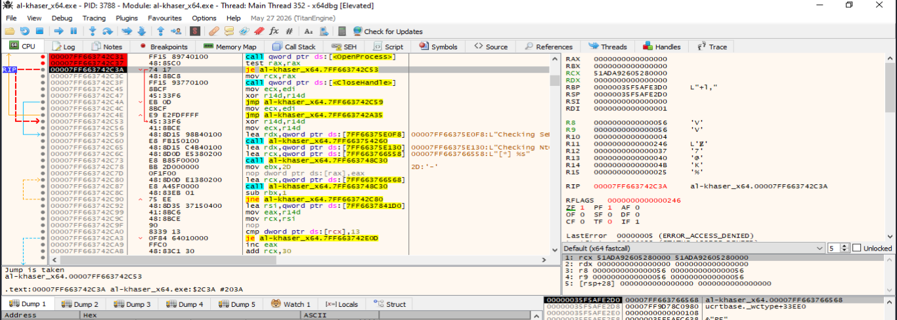

> **Figura 15.8.1.4. Evaluación del resultado de `OpenProcess`.** La instrucción `test rax,rax` establece `ZF=1` porque `RAX=0`. Como consecuencia, el salto `je` se encuentra marcado como `Jump is taken`, por lo que `al-khaser` entra en la rama correspondiente al fallo de apertura.

La lógica puede representarse como:

```text
RAX = 0
        ↓
test rax,rax
        ↓
ZF = 1
        ↓
je
        ↓
salto tomado
```

Al tomarse esta rama, se omite la secuencia destinada a cerrar un `HANDLE` válido:

```asm
mov rcx,rax
call qword ptr ds:[<&CloseHandle>]
```

Esto es coherente con el resultado obtenido: al no existir un `HANDLE` válido, no hay ningún recurso que cerrar.

---

##### Resultado mostrado por `al-khaser`

Después de completar la comprobación, la consola de `al-khaser` muestra:

```text
Checking SeDebugPrivilege    [ GOOD ]
```


> **Figura 15.8.1.5. Resultado final de la comprobación.** `al-khaser` muestra `Checking SeDebugPrivilege [GOOD]`, resultado coherente con el fallo de `OpenProcess` y la ausencia del indicador que la herramienta considera sospechoso.

El significado de `[GOOD]` debe interpretarse correctamente. No indica que la técnica no se haya ejecutado. La comprobación se ha ejecutado completamente, pero no ha producido una detección positiva.

La secuencia completa observada fue:

```text
PID de csrss.exe = 532
        ↓
R8 = 0x214
RCX = 0x1000
RDX = 0
        ↓
OpenProcess
        ↓
RAX = 0
ERROR_ACCESS_DENIED
        ↓
test rax,rax
        ↓
ZF = 1
        ↓
JE tomado
        ↓
resultado negativo de la comprobación
        ↓
Checking SeDebugPrivilege [GOOD]
```

---

##### Interpretación de la técnica

La demostración permite confirmar que `al-khaser` utiliza una comprobación indirecta asociada a privilegios de depuración.

En lugar de consultar directamente si `SeDebugPrivilege` se encuentra presente o habilitado en el token del proceso, la herramienta utiliza el acceso a `csrss.exe` como sonda del contexto de seguridad.

Conceptualmente:

```text
¿Puede el proceso abrir csrss.exe?
        ↓
Sí ---------------------- No
↓                          ↓
HANDLE válido              NULL
↓                          ↓
Indicador sospechoso       Sin indicador
↓                          ↓
[BAD]                      [GOOD]
```

En la ejecución documentada, `OpenProcess` devolvió `NULL` y `ERROR_ACCESS_DENIED`. Por tanto, la condición considerada sospechosa por la herramienta no se cumplió.

Debe destacarse que el resultado depende de la versión concreta de `al-khaser`, de los permisos del proceso, de la versión de Windows y de los mecanismos de protección aplicados al proceso objetivo.

---

##### Evidencias demostradas

La práctica permite establecer experimentalmente que:

- `al-khaser` ejecuta una prueba etiquetada como `Checking SeDebugPrivilege`.
- La comprobación utiliza `csrss.exe` como proceso objetivo.
- El PID utilizado durante la ejecución fue `532`, equivalente a `0x214`.
- `R8` contiene el PID de `csrss.exe`.
- `RDX=0` indica `bInheritHandle = FALSE`.
- `RCX=0x1000` corresponde a `PROCESS_QUERY_LIMITED_INFORMATION`.
- `OpenProcess` devolvió `NULL`.
- `LastError` mostró `ERROR_ACCESS_DENIED`.
- El resultado fue evaluado mediante `test rax,rax`.
- La comparación estableció `ZF=1`.
- El salto condicional `je` fue tomado.
- La consola mostró finalmente `Checking SeDebugPrivilege [GOOD]`.

La evidencia más importante no es únicamente el mensaje final de la consola, sino la relación completa entre:

```text
proceso objetivo
        +
argumentos de OpenProcess
        +
valor de retorno
        +
comparación
        +
rama tomada
        +
resultado final
```

---

##### Limitaciones

La prueba presenta varias limitaciones:

- Se trata de una comprobación indirecta y no de una lectura directa de `SeDebugPrivilege`.
- Un fallo de `OpenProcess` no demuestra que `SeDebugPrivilege` esté ausente del token.
- Un resultado positivo tampoco identifica por sí mismo una sandbox o depurador concreto.
- El acceso a `csrss.exe` depende de la versión de Windows, del nivel de integridad, de los privilegios efectivos y de las protecciones del proceso.
- La implementación de `al-khaser` puede variar entre versiones.
- En la versión analizada se observó `PROCESS_QUERY_LIMITED_INFORMATION (0x1000)`; otras implementaciones pueden utilizar derechos diferentes.
- Un EDR, antivirus u otro mecanismo de seguridad puede modificar el resultado.
- La ejecución bajo un depurador puede alterar el contexto del proceso, por lo que el resultado debe interpretarse como una demostración del mecanismo y no como una medición universal del sistema.

Por estas razones, la comprobación debe considerarse una heurística y correlacionarse con otras técnicas anti-debug y anti-análisis.

---

##### Conclusión

La demostración dinámica confirma el mecanismo utilizado por `al-khaser` en la prueba denominada `Checking SeDebugPrivilege`.

Durante la ejecución, la herramienta identificó una instancia de `csrss.exe` con PID `532` y preparó una llamada a `OpenProcess` con:

```text
RCX = 0x1000
RDX = 0
R8  = 0x214
```

La API devolvió:

```text
RAX = 0
LastError = ERROR_ACCESS_DENIED
```

Posteriormente, `test rax,rax` estableció `ZF=1` y el salto `je` fue tomado. Finalmente, `al-khaser` mostró:

```text
Checking SeDebugPrivilege [GOOD]
```

Por tanto, la técnica se ejecutó correctamente, pero la condición de detección no resultó positiva en el entorno analizado.

La práctica demuestra que `al-khaser` puede utilizar el acceso efectivo a un proceso crítico como indicador indirecto del contexto de privilegios y que el resultado de esta comprobación condiciona el flujo interno de la herramienta. Al tratarse de una heurística dependiente del sistema y de la implementación, debe combinarse con otras evidencias antes de atribuir el resultado a la presencia o ausencia de un entorno de análisis.


<div style="page-break-after: always;"></div>


## 8.15. UI Artifacts

> **Ampliación y evidencias completas:** [ficha `16-ui-artifacts.md`][ficha-ui]. El repositorio conserva capturas adicionales, herramientas, código y secuencias no incluidas en la memoria.


### Fundamento y propósito

La técnica `UI Artifacts` es un mecanismo de evasión y anti-análisis basado en la inspección de elementos de la **interfaz gráfica de usuario de Windows** con el objetivo de identificar indicios compatibles con una máquina virtual, una sandbox o un entorno utilizado para el análisis de malware.

A diferencia de otras técnicas anti-VM que consultan directamente el hardware, el Registro, los servicios o los dispositivos del sistema, `UI Artifacts` aprovecha información expuesta por el subsistema gráfico. Una muestra puede buscar determinadas **clases de ventana**, títulos concretos, ventanas pertenecientes a herramientas de virtualización o análisis, o analizar el número de ventanas de nivel superior existentes en la sesión.

El fundamento de la técnica parte de dos observaciones principales:

1. Algunos productos de virtualización o utilidades instaladas dentro del sistema invitado pueden crear ventanas auxiliares con nombres o clases reconocibles.
2. Las máquinas virtuales y sandboxes preparadas para análisis automatizado suelen presentar un escritorio más simple y menos actividad gráfica que un equipo utilizado de forma habitual por una persona.

Por ejemplo, una muestra puede utilizar funciones como:

```text
FindWindowA
FindWindowW
FindWindowExA
FindWindowExW
EnumWindows
GetClassNameA
GetClassNameW
GetWindowTextA
GetWindowTextW
GetWindowThreadProcessId
```

Una comprobación sencilla puede buscar una clase de ventana conocida. Otra variante puede enumerar todas las ventanas de nivel superior, contar cuántas existen y comparar el resultado con un umbral. Si el número es demasiado reducido, la muestra puede considerar que el sistema presenta un escritorio poco realista o compatible con una sandbox.

La técnica también puede utilizarse para localizar ventanas pertenecientes a depuradores, monitores de procesos, analizadores de red u otras herramientas de seguridad. En este caso, el mismo mecanismo de enumeración de la interfaz se emplea con una finalidad anti-debug o anti-analysis.

El flujo general puede representarse de la siguiente forma:

```text
Consultar la interfaz gráfica
        ↓
Enumerar o buscar ventanas
        ↓
Obtener clase, título o cantidad
        ↓
Comparar con indicadores conocidos
        ↓
Asignar una valoración al entorno
        ↓
Modificar o mantener el flujo de ejecución
```

Si la comprobación produce un resultado considerado sospechoso, una muestra puede finalizar, retrasar la ejecución, omitir su funcionalidad principal, evitar desplegar una segunda etapa o ejecutar una rama alternativa.

No obstante, `UI Artifacts` es una técnica **heurística**. La existencia de una ventana concreta puede deberse a software legítimo, mientras que un número reducido de ventanas puede aparecer en un equipo físico recién iniciado, una sesión de usuario poco activa, un sistema dedicado o una sesión remota. Del mismo modo, una máquina virtual utilizada diariamente puede presentar numerosas ventanas y un escritorio indistinguible, desde esta perspectiva, de un equipo físico.

Por ello, una comprobación de interfaz no debe interpretarse de forma aislada como una confirmación de virtualización. La evidencia resulta más sólida cuando se combinan varios indicadores independientes y se observa que el resultado condiciona realmente el comportamiento del programa.

----


### Demostración dinámica: clases de ventana

##### Objetivo de la demostración

El objetivo de esta prueba es demostrar dinámicamente cómo `al-khaser` utiliza un artefacto de la interfaz gráfica de Windows para identificar indicios compatibles con la ejecución dentro de **VirtualBox**. En concreto, la herramienta intenta localizar una ventana registrada con la clase:

```text
VBoxTrayToolWndClass
```

La comprobación se realiza mediante la API de Windows:

```text
FindWindowW
```

La lógica general observada durante la ejecución es:

```text
Preparar lpClassName = "VBoxTrayToolWndClass"
        ↓
FindWindowW
        ↓
Obtener HWND
        ↓
¿HWND != NULL?
        ↓
Conservar el resultado
        ↓
test rbx, rbx
        ↓
Salto condicional
        ↓
Rama de detección positiva
```

Esta técnica se encuadra dentro de `UI Artifacts`, ya que la fuente de información utilizada por la herramienta no es el hardware, el Registro o los procesos, sino una propiedad observable de la **interfaz gráfica del sistema invitado**.

---

##### Preparación de la prueba

La demostración se realizó con la versión x64 de `al-khaser` bajo `x64dbg`.

Para reducir el número de comprobaciones ejecutadas y centrarse en los artefactos de VirtualBox, se utilizó la opción:

```bat
al-khaser_x64.exe --check VBOX
```

Inicialmente se colocó un breakpoint sobre:

```text
user32.FindWindowW
```

En `x64dbg` puede establecerse mediante:

```text
bp user32.FindWindowW
```

La finalidad del breakpoint es interceptar la llamada en el momento en el que `al-khaser` proporciona a Windows la clase de ventana que desea localizar.

---

##### Entrada en `FindWindowW`

La primera evidencia se obtiene cuando la ejecución se detiene en:

```text
user32.FindWindowW
```

En Windows x64, los dos primeros argumentos de la función:

```cpp
HWND FindWindowW(
    LPCWSTR lpClassName,
    LPCWSTR lpWindowName
);
```

se transmiten mediante:

```text
RCX = lpClassName
RDX = lpWindowName
```

Durante la ejecución analizada se observó:

```text
RCX = 00007FF663764C60
      → L"VBoxTrayToolWndClass"

RDX = 0000000000000000
      → NULL
```

Por tanto, la llamada ejecutada por `al-khaser` puede representarse conceptualmente como:

```cpp
FindWindowW(
    L"VBoxTrayToolWndClass",
    NULL
);
```


> **Figura 16.8.1.1. Entrada en `FindWindowW` durante la búsqueda de una clase de ventana asociada a VirtualBox.** El registro `RCX`, correspondiente al parámetro `lpClassName`, apunta a la cadena Unicode `VBoxTrayToolWndClass`, mientras que `RDX`, correspondiente a `lpWindowName`, contiene `NULL`. En el volcado de memoria también puede observarse directamente la cadena utilizada por `al-khaser`.

Esta captura constituye la evidencia principal de que la herramienta está realizando una **búsqueda explícita por clase de ventana**.

---

##### Localización del retorno al código de `al-khaser`

Para conocer el resultado devuelto por `FindWindowW`, se localizó la dirección de retorno almacenada en la pila.

En la ejecución analizada, `[RSP]` contenía una dirección identificada por `x64dbg` como:

```text
return to al-khaser_x64.00007FF663745C11
```

Al seguir esa dirección en el desensamblador se localizó el código de `al-khaser` inmediatamente posterior a la primera llamada a `FindWindowW`.


> **Figura 16.8.1.2. Localización del retorno desde `FindWindowW` hacia `al-khaser`.** La dirección de retorno permite identificar el punto exacto en el que debe inspeccionarse `RAX` para recuperar el `HWND` devuelto por la API.

En el bloque localizado se observa además la secuencia utilizada por la herramienta:

```asm
lea     rdx, [L"VBoxTrayToolWnd"]
xor     ecx, ecx
mov     rbx, rax
call    qword ptr ds:[<&FindWindowW>]

test    rbx, rbx
jne     ...
test    rax, rax
jne     ...
```

La instrucción:

```asm
mov rbx, rax
```

conserva en `RBX` el resultado de la primera llamada, correspondiente a la búsqueda por clase de ventana.

---

##### Resultado de la búsqueda por clase

Se colocó un breakpoint en la dirección de retorno:

```text
00007FF663745C11
```

Después de continuar la ejecución, `FindWindowW` finalizó y el flujo regresó al módulo de `al-khaser`.

En ese momento se observó:

```text
RIP = 00007FF663745C11
RAX = 0000000000020246
```

`FindWindowW` devuelve un `HWND` cuando encuentra una ventana coincidente y devuelve `NULL` cuando la búsqueda no produce resultados.

Por tanto:

```text
RAX = 0x00020246
```

representa un **handle de ventana válido** y confirma que, en el entorno analizado, Windows encontró una ventana registrada con la clase:

```text
VBoxTrayToolWndClass
```


> **Figura 16.8.1.3. Retorno de `FindWindowW` tras buscar `VBoxTrayToolWndClass`.** El registro `RAX` contiene `0x00020246`, un `HWND` distinto de `NULL`. La comprobación produce, por tanto, un resultado positivo para el artefacto de interfaz utilizado por `al-khaser`.

La interpretación del resultado es:

| Valor retornado | Interpretación |
|---|---|
| `RAX = 0` | No se encontró ninguna ventana con la clase buscada. |
| `RAX != 0` | Se encontró una ventana y `RAX` contiene su `HWND`. |
| `RAX = 0x00020246` | Resultado observado en la ejecución analizada: detección positiva. |

Debe destacarse que el valor `0x00020246` no es un código de detección de `al-khaser`, sino el **handle de la ventana** localizado por el sistema.

---

##### Conservación del resultado

Después de la primera llamada, `al-khaser` ejecuta:

```asm
mov rbx, rax
```

De esta forma, el resultado de la búsqueda por clase queda almacenado en:

```text
RBX
```

La herramienta realiza posteriormente una segunda llamada a `FindWindowW`, esta vez orientada al título:

```cpp
FindWindowW(
    NULL,
    L"VBoxTrayToolWnd"
);
```

Esta segunda comprobación pertenece a la variante basada en títulos o nombres de ventana y puede analizarse de forma independiente. Para la sub-técnica actual, el dato relevante es que `RBX` conserva el resultado obtenido al buscar `VBoxTrayToolWndClass`.

---

##### Evaluación del `HWND` obtenido

Se colocó un breakpoint en:

```text
00007FF663745C23
```

correspondiente a:

```asm
test rbx, rbx
```

Al alcanzar ese punto se observó:

```text
RBX = 0000000000020246
```

El valor coincide con el `HWND` obtenido anteriormente mediante `FindWindowW`.

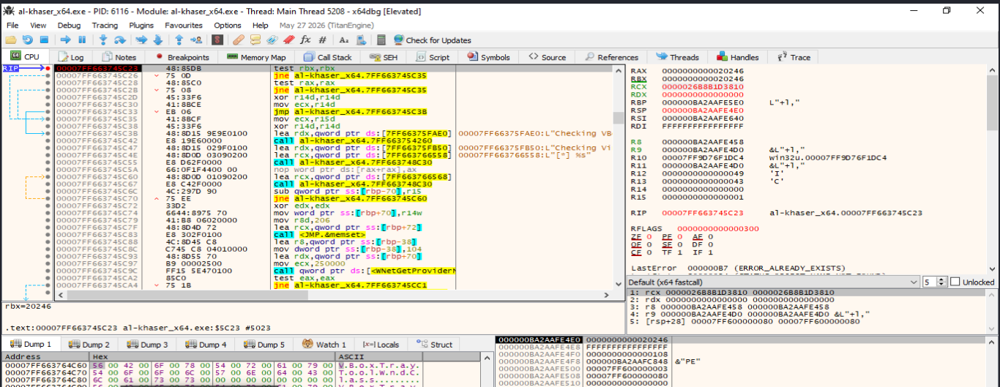

> **Figura 16.8.1.4. Evaluación del resultado de la búsqueda por clase.** `RBX` conserva el valor `0x00020246` devuelto por la búsqueda de `VBoxTrayToolWndClass`. La instrucción `test rbx,rbx` comprueba si el `HWND` es distinto de `NULL`.

La instrucción:

```asm
test rbx, rbx
```

realiza conceptualmente una operación lógica:

```text
RBX AND RBX
```

sin modificar el contenido del registro. Su finalidad es actualizar los flags de estado para determinar si el valor es cero.

Como:

```text
RBX = 0x00020246
RBX != 0
```

el resultado del `test` es distinto de cero.

---

##### Activación de la rama de detección

Después de ejecutar:

```asm
test rbx, rbx
```

la ejecución queda situada en:

```asm
jne al-khaser_x64.00007FF663745C35
```

En ese momento `x64dbg` muestra:

```text
ZF = 0
```

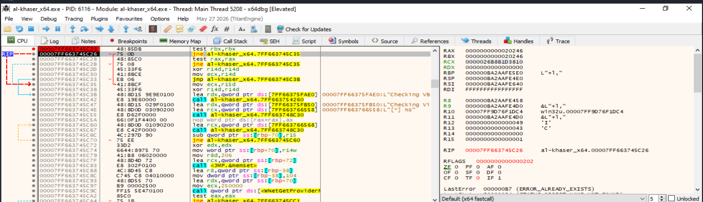

> **Figura 16.8.1.5. Evaluación del salto condicional posterior a la detección.** La instrucción `test rbx,rbx` establece `ZF = 0` porque `RBX` contiene un `HWND` distinto de cero. Como consecuencia, la condición de `JNE` se cumple y el flujo se dirige hacia la rama correspondiente al resultado positivo de la comprobación.

La secuencia lógica puede representarse como:

```text
RBX = 0x00020246
        ↓
test rbx, rbx
        ↓
RBX != 0
        ↓
ZF = 0
        ↓
jne 0x...5C35
        ↓
salto tomado
```

Conceptualmente, la lógica equivale a:

```cpp
HWND hClass = FindWindowW(
    L"VBoxTrayToolWndClass",
    NULL
);

if (hClass != NULL)
{
    // Artefacto de interfaz localizado
    // Resultado positivo de la comprobación
}
```

---

##### Reconstrucción de la técnica observada

Las evidencias obtenidas permiten reconstruir la comprobación de forma completa:

```text
al-khaser
    ↓
Preparación de argumentos
    ↓
RCX → L"VBoxTrayToolWndClass"
RDX → NULL
    ↓
FindWindowW
    ↓
RAX = 0x00020246
    ↓
HWND válido
    ↓
mov rbx, rax
    ↓
RBX = 0x00020246
    ↓
test rbx, rbx
    ↓
ZF = 0
    ↓
JNE
    ↓
rama de resultado positivo
```

La prueba demuestra tres elementos diferentes:

1. **La técnica se ejecuta.**  
   `al-khaser` busca explícitamente la clase `VBoxTrayToolWndClass`.

2. **La búsqueda produce una coincidencia.**  
   `FindWindowW` devuelve el `HWND` `0x00020246`.

3. **El resultado condiciona el flujo.**  
   El `HWND` se conserva en `RBX`, se evalúa mediante `test rbx,rbx` y provoca que se cumpla la condición del salto `JNE`.

---

##### Resultado obtenido

| Elemento | Resultado observado |
|---|---|
| Herramienta | `al-khaser_x64.exe` |
| Comprobación | Artefacto de interfaz de VirtualBox |
| API | `FindWindowW` |
| Clase buscada | `VBoxTrayToolWndClass` |
| `lpClassName` | `RCX → L"VBoxTrayToolWndClass"` |
| `lpWindowName` | `RDX = NULL` |
| Resultado de `FindWindowW` | `RAX = 0x00020246` |
| Resultado conservado | `RBX = 0x00020246` |
| Comprobación lógica | `test rbx,rbx` |
| Zero Flag | `ZF = 0` |
| Salto posterior | `JNE` |
| Resultado | Detección positiva del artefacto |

---

##### Interpretación

La demostración confirma que `al-khaser` utiliza la presencia de una clase de ventana concreta como **indicador anti-VM**.

La existencia de:

```text
VBoxTrayToolWndClass
```

es utilizada como artefacto relacionado con componentes de VirtualBox. La herramienta no necesita enumerar todas las ventanas de la sesión: realiza una búsqueda directa mediante `FindWindowW`.

La secuencia:

```text
FindWindowW
        ↓
HWND válido
        ↓
test
        ↓
salto condicional
```

demuestra que el resultado no se recopila únicamente con finalidad informativa, sino que forma parte de una decisión dentro del flujo de ejecución.

No obstante, desde el punto de vista metodológico, esta comprobación debe considerarse **heurística**. La presencia de una clase concreta constituye un indicio del entorno, pero no debería utilizarse de forma aislada para atribuir de manera concluyente la existencia de una máquina virtual. Una muestra real puede combinar este resultado con comprobaciones adicionales de procesos, Registro, dispositivos, WMI, CPU, memoria o temporización.

---

##### Evidencias demostradas

Las capturas obtenidas permiten documentar las siguientes evidencias:

- `al-khaser` invoca `FindWindowW`.
- `RCX` apunta a `VBoxTrayToolWndClass`.
- `RDX` contiene `NULL`.
- La API devuelve un `HWND` válido.
- El `HWND` observado es `0x00020246`.
- El resultado se conserva en `RBX`.
- `al-khaser` ejecuta `test rbx,rbx`.
- El resultado establece `ZF = 0`.
- La instrucción `JNE` cumple su condición.
- La comprobación produce una detección positiva del artefacto de interfaz.

---

##### Limitaciones

- El `HWND` es específico de la ejecución y puede cambiar en cada inicio del sistema.
- La dirección de las instrucciones de `al-khaser` depende de la compilación y de ASLR.
- La clase buscada puede no existir si el componente correspondiente de VirtualBox no se encuentra instalado o activo.
- Una detección negativa no demostraría que el sistema es físico; únicamente indicaría que ese artefacto concreto no fue localizado.
- La técnica depende de nombres de clases que pueden modificarse entre versiones.
- La presencia del artefacto debe correlacionarse con otras comprobaciones anti-VM para reducir falsos positivos.
- El valor de `LastError` observado durante la depuración no debe utilizarse para interpretar esta prueba; el resultado relevante de `FindWindowW` es el `HWND` devuelto en `RAX`.

---

##### Conclusión

La demostración dinámica permitió observar de forma completa la técnica de **detección de clases de ventana asociadas a virtualización** implementada por `al-khaser`.

La herramienta ejecutó:

```cpp
FindWindowW(
    L"VBoxTrayToolWndClass",
    NULL
);
```

y la función devolvió:

```text
RAX = 0x00020246
```

El valor constituye un `HWND` válido, por lo que la clase de ventana fue localizada en el entorno analizado. Posteriormente, `al-khaser` conservó el resultado en `RBX` y ejecutó:

```asm
test rbx, rbx
jne  ...
```

Como `RBX` era distinto de cero, `ZF` quedó establecido a `0` y la condición del salto `JNE` se cumplió.

Por tanto, la práctica demuestra experimentalmente la secuencia:

```text
Búsqueda de clase característica
        ↓
Obtención de un HWND válido
        ↓
Evaluación del resultado
        ↓
Salto condicional
        ↓
Detección positiva
```

El resultado confirma el uso de un **artefacto de interfaz gráfica como mecanismo heurístico de detección de VirtualBox**, proporcionando una evidencia reproducible de la sub-técnica `UI Artifacts`.


----


<div style="page-break-after: always;"></div>

# 9. Resultados comparados

## 9.1. Evidencia y fuerza de cada demostración

| Familia | Indicador demostrado | Resultado | Fuerza aislada | Falso positivo principal |
|---|---|---|---|---|
| Filesystem | Artefacto/ruta sospechosa | Positivo | Media-alta | Restos o herramientas legítimas |
| Registry | Clave o valor específico | Positivo | Media-alta | Clave residual |
| Processes | `x64dbg.exe` | Positivo | Media | Uso administrativo legítimo |
| WMI | BIOS serial `"0"` | Positivo | Media | Firmware incompleto |
| Timing | `Sleep` omitido | Positivo controlado | Media | Carga o ruido temporal |
| CPU | `VBoxVBoxVBox` | Positivo | Alta | Hipervisor legítimo en endpoint |
| Hardware | `SCSI\DiskVBOX...` | Positivo | Alta | Dispositivo virtual legítimo |
| Human interaction | Cursor movido | No sospechoso | Baja aislada | Usuario inmóvil / automatización avanzada |
| Global objects | `VBoxMiniRdrDN` abierto | Positivo | Alta | Componente instalado fuera del escenario esperado |
| Firmware | Cadena VirtualBox | Positivo | Alta | Firmware genérico o personalizado |
| OS queries | Usuario `SANDBOX` | Positivo controlado | Baja-media | Nombre legítimo coincidente |
| Hooks | Prólogo modificado | Positivo controlado | Media | EDR o *thunk* legítimo |
| Network | OUI `08:00:27` | Positivo | Media-alta | MAC modificable o adaptador virtual legítimo |
| OS features | Acceso a `csrss` denegado | Negativo | Baja aislada | Política de privilegios |
| UI artifacts | Clase de ventana VBox | Positivo | Alta | Guest tools en equipo de pruebas |

## 9.2. Respuesta a las preguntas de investigación

**PI1. Indicadores más claros.** Los indicadores explícitos de fabricante o producto —`VBoxVBoxVBox`, `VBOX` en el identificador del disco, `VBoxMiniRdrDN`, SMBIOS y `VBoxTrayToolWndClass`— proporcionaron la evidencia más directa. Los umbrales y la actividad humana fueron menos concluyentes.

**PI2. Demostración del cambio de flujo.** La combinación de breakpoint en la fuente, inspección del dato y seguimiento de `CMP/TEST` más el salto condicional resultó suficiente. Las salidas de consola se usaron solo como confirmación.

**PI3. Directas frente a heurísticas.** Filesystem, Registro, CPU, hardware explícito, objetos, firmware y UI producen señales observables. Timing, interacción, recursos y consultas genéricas dependen más del contexto.

**PI4. Eficacia de contramedidas.** La limpieza de archivos, Registro, MAC, DMI, ACPI, dispositivos y CPUID reduce muchas detecciones, pero no garantiza invisibilidad. Las mediciones temporales y ciertos artefactos reenumerados por el hipervisor persisten.

**PI5. Conjunto de herramientas.** Pafish y al-khaser permiten amplitud; los laboratorios autocontenidos permiten control; x64dbg/x32dbg aportan causalidad; Procmon, PowerShell y utilidades del sistema aportan contraste externo.

## 9.3. Patrón común observado

Las quince familias pueden reducirse a un patrón operativo:

```text
selección de una fuente
        ↓
obtención de un dato
        ↓
normalización o extracción
        ↓
comparación con firma o umbral
        ↓
agregación opcional de señales
        ↓
rama benigna, retardada o maliciosa
```

El punto defensivo más importante es el último: el analista debe localizar qué habría ocurrido si el resultado fuese distinto.

---

# 10. Contramedidas y sanitización del laboratorio

## 10.1. Estrategia por capas

| Capa | Medidas defensivas |
|---|---|
| Identidad | Nombres de usuario/equipo plausibles, dominio y perfil coherente |
| Recursos | RAM, CPU, disco, resolución, monitores y uptime realistas |
| Hipervisor | Reducir firmas CPUID/DMI cuando la plataforma lo permita |
| Guest tools | Retirar componentes no imprescindibles o separar perfiles |
| Archivos/Registro | Limpiar artefactos y comprobar su regeneración al arrancar |
| Firmware/dispositivos | Normalizar SMBIOS, ACPI y PnP de forma coherente |
| Red | MAC, adaptador, gateway, DNS y DHCP no evidentes |
| Actividad | Historial, documentos, ventanas e interacción contextual |
| Observación | Instrumentación discreta y comparación entre ejecuciones |
| Cobertura | Varios hipervisores y, cuando sea seguro, una referencia física |

## 10.2. Experiencia de sanitización con Pafish

La [práctica completa de sanitización][repo-sanitizacion] partió de una VM VirtualBox detectable por múltiples señales: drivers y Guest Additions, procesos, Registro, MAC `08:00:27`, CPUID, ACPI, SCSI, WMI y firmware.

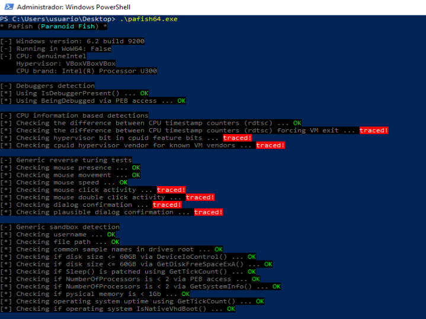

*Figura 31. La ejecución inicial muestra que una VM limpia ya expone numerosos indicadores.*

Se probaron medidas progresivas: desinstalación de Guest Additions, limpieza de claves residuales, modificación de identificadores DMI, ajuste de CPUID, cambio de MAC, retirada de dispositivos PnP/WMI y reescritura de valores volátiles de `HKLM\HARDWARE\DESCRIPTION\System`. Como algunos valores se reconstruyen en cada arranque, se creó una tarea o script de inicio para reaplicar el estado.

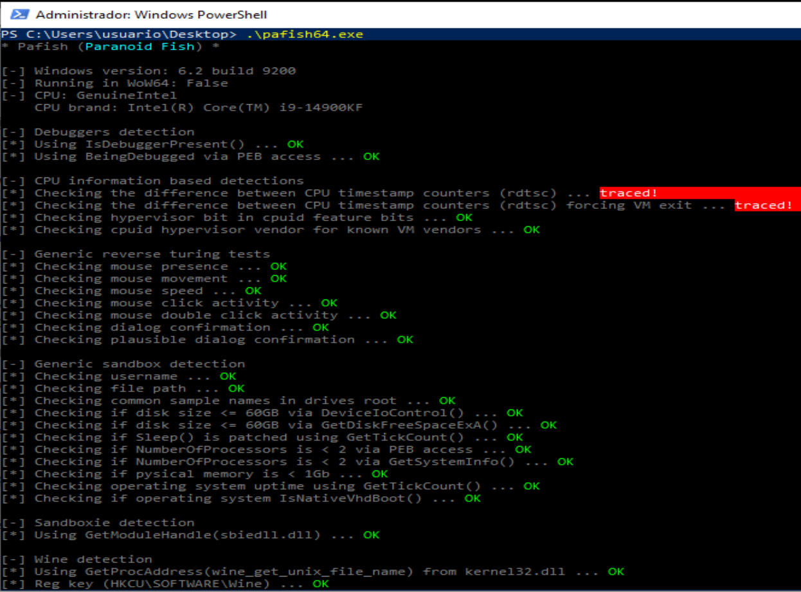

*Figura 32. La superficie observable se reduce, pero las pruebas temporales basadas en RDTSC continúan detectando diferencias.*

## 10.3. Resultado y límite

La sanitización confirmó dos ideas:

1. Los artefactos de alto nivel pueden reducirse significativamente si se tratan como un conjunto coherente.
2. La invisibilidad completa no se alcanzó en VirtualBox estándar: Pafish mantuvo detecciones temporales, incluida una variante que provoca VM-exit.

Por tanto, la contramedida no debe formularse como “hacer indetectable la VM”, sino como **reducir señales, diversificar entornos y detectar cuándo una muestra cambia de ruta**.

## 10.4. Recomendación operativa

1. Ejecutar una herramienta de exposición como Pafish antes de analizar la muestra.
2. Guardar el perfil de detecciones como línea base.
3. Elegir el perfil de laboratorio adecuado a la técnica sospechada.
4. Ejecutar la muestra en más de un perfil.
5. Comparar procesos, archivos, Registro, memoria y red.
6. Forzar de forma controlada las ramas ambientales localizadas.
7. Documentar qué contramedidas alteran el resultado y cuáles no.

---

# 11. Discusión

## 11.1. Un artefacto no equivale a una conclusión

La presencia de un indicador debe evaluarse con su contexto. Hyper-V puede estar activo en un equipo físico; Wireshark puede usarse en administración legítima; un equipo puede tener poca RAM; una función puede contener un salto legítimo. La evidencia más sólida surge cuando varias fuentes independientes coinciden y el programa usa el resultado para ocultar comportamiento.

## 11.2. Coherencia entre fuentes

Modificar una única propiedad puede empeorar el realismo. Un fabricante físico en WMI junto con firmware VirtualBox, un OUI diferente pero un driver `VBoxNet`, o una BIOS normalizada con dispositivos `VEN_80EE` forman contradicciones. Las contramedidas deben tratar el perfil completo.

## 11.3. Valor de la intervención controlada

Las pruebas positivas controladas —proceso señuelo, usuario `sandbox`, omisión de `Sleep` y hook sintético— proporcionan causalidad. Al cambiar una variable y mantener el resto constante, se demuestra qué dato gobierna el resultado. Esta estrategia es preferible a capturar una salida `traced!` sin reconstruir su origen.

## 11.4. Instrumentación frente a transparencia

Cuanto más se observa una muestra desde dentro, más artefactos se introducen. Los breakpoints alteran el tiempo, los hooks modifican código y los monitores pueden aparecer como procesos. El análisis debe alternar observación interna, herramientas externas y ejecuciones sin depurador.

## 11.5. Validez del enfoque educativo

Las pruebas de concepto no reproducen toda la complejidad de una campaña real, pero permiten aislar mecanismos y conservar evidencias sin manejar cargas maliciosas. Después, el analista puede transferir el patrón aprendido a una muestra real: fuente, dato, comparación, decisión y conducta oculta.

---

# 12. Conclusiones y líneas futuras

## 12.1. Conclusiones

1. La evasión anti-VM es un problema de **perfil ambiental**, no de una única API.
2. Las señales explícitas de VirtualBox fueron las más claras en el laboratorio: CPUID, identificadores de disco, objetos, firmware, MAC y ventanas.
3. Las heurísticas de tiempo, recursos e interacción aportan flexibilidad, pero requieren umbrales y correlación.
4. La evidencia técnica debe mostrar consulta, dato y rama; una string o una salida de consola no bastan por sí solas.
5. Las pruebas positivas y negativas controladas mejoran la reproducibilidad y reducen interpretaciones ambiguas.
6. Pafish y al-khaser son adecuados para validar el laboratorio; las herramientas autocontenidas aíslan mejor una subtécnica.
7. La sanitización reduce numerosos artefactos, pero VirtualBox estándar mantiene diferencias difíciles de ocultar, especialmente en timing.
8. La defensa más robusta combina varios perfiles, instrumentación discreta, análisis diferencial y exploración de ramas no ejecutadas.

## 12.2. Cumplimiento de objetivos

Se construyó una taxonomía de quince familias, se seleccionó una demostración representativa por familia, se documentaron APIs, datos y decisiones, se compararon resultados y falsos positivos, y se evaluó una sanitización real del laboratorio. El repositorio conserva el desarrollo exhaustivo y esta memoria proporciona la síntesis académica.

## 12.3. Líneas futuras

- Repetir la matriz en VMware, Hyper-V, QEMU/KVM y una máquina física de referencia.
- Automatizar la recolección de evidencias y la comparación de ejecuciones.
- Aplicar las mismas fichas a muestras reales seleccionadas, con hashes y procedencia documentados.
- Incorporar análisis estadístico de timing con más repeticiones y control de carga.
- Evaluar técnicas combinadas y sistemas de puntuación ambiental.
- Diseñar perfiles rotatorios de laboratorio con identidades, recursos y actividad diferentes.
- Mapear cada comprobación con reglas de telemetría y detección defensiva.

---

# 13. Bibliografía y recursos

## 13.1. Marcos y documentación general

1. MITRE ATT&CK. [T1497: Virtualization/Sandbox Evasion][mitre-t1497].
2. MITRE ATT&CK. [T1497.001: System Checks][mitre-system].
3. MITRE ATT&CK. [T1497.002: User Activity Based Checks][mitre-user].
4. MITRE ATT&CK. [T1497.003: Time Based Checks][mitre-time].
5. Check Point Software Technologies. [Encyclopedia of Evasions][checkpoint].
6. Check Point Software Technologies. [Repositorio Evasions][checkpoint-github].
7. Intel. *Intel 64 and IA-32 Architectures Software Developer's Manual*.
8. Microsoft Learn. Documentación de las APIs de Windows citadas en las fichas.

## 13.2. Herramientas y código de referencia

9. Alberto Ortega. [Pafish][pafish].
10. Ayoub Faouzi. [al-khaser][alkhaser].
11. Proyecto del TFM. [Módulo de evasión][repo-evasion].
12. Proyecto del TFM. [Mapa del repositorio][repo-mapa].
13. Proyecto del TFM. [Metodología][repo-metodologia].
14. Proyecto del TFM. [Relación de herramientas][repo-herramientas].
15. Proyecto del TFM. [Referencias técnicas][repo-referencias].

> La bibliografía específica de cada familia, incluidos artículos sobre malware real y documentación de APIs, se mantiene en su ficha enlazada. Esta decisión evita duplicar decenas de referencias y conserva la trazabilidad hacia el repositorio.

---

# 14. Anexos

## Anexo A. Índice de ampliación en GitHub

| Familia | Ficha detallada |
|---|---|
| Filesystem | [02-filesystem.md][ficha-filesystem] |
| Registry | [03-registry.md][ficha-registry] |
| Processes | [04-processes.md][ficha-processes] |
| WMI | [05-wmi.md][ficha-wmi] |
| Timing | [06-timing.md][ficha-timing] |
| CPU | [07-cpu.md][ficha-cpu] |
| Hardware | [08-hardware.md][ficha-hardware] |
| Human interaction | [09-human-interaction.md][ficha-human] |
| Global OS objects | [10-global-os-objects.md][ficha-objects] |
| Firmware tables | [11-firmware-tables.md][ficha-firmware] |
| Generic OS queries | [12-generic-os-queries.md][ficha-os-queries] |
| Hooks | [13-hooks.md][ficha-hooks] |
| Network | [14-network.md][ficha-network] |
| OS features | [15-os-features.md][ficha-os-features] |
| UI artifacts | [16-ui-artifacts.md][ficha-ui] |

## Anexo B. Plantilla breve para una nueva técnica

```md
## Nombre de la técnica

### Fundamento
Qué intenta conocer y por qué podría revelar un entorno de análisis.

### Evidencia estática
Imports, strings, instrucciones, constantes y referencias.

### Evidencia dinámica
API/instrucción → argumento → dato → comparación → salto → conducta.

### Prueba de control
Estado negativo y estado positivo, modificando una única variable.

### Limitaciones
Falsos positivos, versiones, ASLR, configuración y alcance.

### Contramedidas
Normalización, perfiles, instrumentación y comparación diferencial.
```

## Anexo C. Checklist de laboratorio

- [ ] Crear snapshot previo.
- [ ] Documentar versión y arquitectura del invitado.
- [ ] Registrar versión y hash de cada binario.
- [ ] Ejecutar una línea base sin depurador.
- [ ] Guardar salida, Procmon y estado del sistema.
- [ ] Localizar la fuente de la consulta.
- [ ] Capturar argumentos y buffers.
- [ ] Capturar comparación, flags y salto.
- [ ] Repetir con una variable controlada.
- [ ] Restaurar el snapshot al finalizar.
- [ ] Registrar limitaciones y falsos positivos.

## Anexo D. Criterios de maquetación y estimación de extensión

Esta edición ampliada está concebida para convertirse a A4 con fuente de 11 puntos, interlineado aproximado de 1,15 a 1,3 y márgenes académicos de 2,5 cm. La paginación exacta depende del procesador Markdown, de la plantilla institucional, del tamaño asignado a las figuras y de si el índice se genera automáticamente.

Para conservar una extensión próxima a **150–200 páginas**, se han aplicado estos criterios:

- desarrollo suficiente de fundamento, análisis y discusión en cada familia;
- selección de demostraciones representativas en lugar de reproducir todas las pruebas del repositorio;
- inclusión de las capturas necesarias para reconstruir el flujo;
- traslado a GitHub del código completo, las secuencias redundantes y las evidencias adicionales;
- inicio preferente de cada familia en una nueva página durante la maquetación final;
- revisión final de la paginación con la plantilla que exija el centro.

El Markdown incluye las imágenes mediante rutas relativas a `capturas/`. Para que se visualicen correctamente, el archivo debe mantenerse junto a esa carpeta o utilizarse el paquete ZIP autocontenido.

Como comprobación de referencia, la conversión de esta versión a A4 con los parámetros anteriores produce **169 páginas**. Este número no sustituye la revisión final con la plantilla institucional, pero confirma que el contenido se encuentra dentro del intervalo solicitado.
---

<!-- Referencias del repositorio -->

[repo-root]: https://github.com/soniasalido/cybersecurity
[repo-mapa]: https://github.com/soniasalido/cybersecurity/blob/main/Documentation/Malware/Master-ENIIT-Analisis-Malware-Reversing/modulo-11-TFM/modulo-deteccion-entornos-virtuales/00-mapa-repositorio.md
[repo-metodologia]: https://github.com/soniasalido/cybersecurity/blob/main/Documentation/Malware/Master-ENIIT-Analisis-Malware-Reversing/modulo-11-TFM/modulo-deteccion-entornos-virtuales/02-metodologia-estudio.md
[repo-herramientas]: https://github.com/soniasalido/cybersecurity/blob/main/Documentation/Malware/Master-ENIIT-Analisis-Malware-Reversing/modulo-11-TFM/modulo-deteccion-entornos-virtuales/relacion-herramientas.md
[repo-referencias]: https://github.com/soniasalido/cybersecurity/blob/main/Documentation/Malware/Master-ENIIT-Analisis-Malware-Reversing/modulo-11-TFM/modulo-deteccion-entornos-virtuales/referencias.md
[repo-evasion]: https://github.com/soniasalido/cybersecurity/tree/main/Documentation/Malware/Master-ENIIT-Analisis-Malware-Reversing/modulo-11-TFM/modulo-deteccion-entornos-virtuales/modulo-evasion
[repo-intro]: https://github.com/soniasalido/cybersecurity/blob/main/Documentation/Malware/Master-ENIIT-Analisis-Malware-Reversing/modulo-11-TFM/modulo-deteccion-entornos-virtuales/modulo-evasion/00-introduccion-evasion.md
[repo-matriz]: https://github.com/soniasalido/cybersecurity/blob/main/Documentation/Malware/Master-ENIIT-Analisis-Malware-Reversing/modulo-11-TFM/modulo-deteccion-entornos-virtuales/modulo-evasion/01-matriz-tecnicas.md
[repo-taxonomia]: https://github.com/soniasalido/cybersecurity/blob/main/Documentation/Malware/Master-ENIIT-Analisis-Malware-Reversing/modulo-11-TFM/modulo-deteccion-entornos-virtuales/modulo-evasion/02-taxonomia-evasiones.md
[repo-fichas]: https://github.com/soniasalido/cybersecurity/tree/main/Documentation/Malware/Master-ENIIT-Analisis-Malware-Reversing/modulo-11-TFM/modulo-deteccion-entornos-virtuales/modulo-evasion/fichas
[repo-capturas]: https://github.com/soniasalido/cybersecurity/tree/main/Documentation/Malware/Master-ENIIT-Analisis-Malware-Reversing/modulo-11-TFM/modulo-deteccion-entornos-virtuales/modulo-evasion/fichas/capturas
[repo-sanitizacion]: https://github.com/soniasalido/cybersecurity/blob/main/Documentation/Malware/Master-ENIIT-Analisis-Malware-Reversing/modulo-11-TFM/modulo-deteccion-entornos-virtuales/modulo-evasion/05-sanitizando-la-mv.md

[ficha-filesystem]: https://github.com/soniasalido/cybersecurity/blob/main/Documentation/Malware/Master-ENIIT-Analisis-Malware-Reversing/modulo-11-TFM/modulo-deteccion-entornos-virtuales/modulo-evasion/fichas/02-filesystem.md
[ficha-registry]: https://github.com/soniasalido/cybersecurity/blob/main/Documentation/Malware/Master-ENIIT-Analisis-Malware-Reversing/modulo-11-TFM/modulo-deteccion-entornos-virtuales/modulo-evasion/fichas/03-registry.md
[ficha-processes]: https://github.com/soniasalido/cybersecurity/blob/main/Documentation/Malware/Master-ENIIT-Analisis-Malware-Reversing/modulo-11-TFM/modulo-deteccion-entornos-virtuales/modulo-evasion/fichas/04-processes.md
[ficha-wmi]: https://github.com/soniasalido/cybersecurity/blob/main/Documentation/Malware/Master-ENIIT-Analisis-Malware-Reversing/modulo-11-TFM/modulo-deteccion-entornos-virtuales/modulo-evasion/fichas/05-wmi.md
[ficha-timing]: https://github.com/soniasalido/cybersecurity/blob/main/Documentation/Malware/Master-ENIIT-Analisis-Malware-Reversing/modulo-11-TFM/modulo-deteccion-entornos-virtuales/modulo-evasion/fichas/06-timing.md
[ficha-cpu]: https://github.com/soniasalido/cybersecurity/blob/main/Documentation/Malware/Master-ENIIT-Analisis-Malware-Reversing/modulo-11-TFM/modulo-deteccion-entornos-virtuales/modulo-evasion/fichas/07-cpu.md
[ficha-hardware]: https://github.com/soniasalido/cybersecurity/blob/main/Documentation/Malware/Master-ENIIT-Analisis-Malware-Reversing/modulo-11-TFM/modulo-deteccion-entornos-virtuales/modulo-evasion/fichas/08-hardware.md
[ficha-human]: https://github.com/soniasalido/cybersecurity/blob/main/Documentation/Malware/Master-ENIIT-Analisis-Malware-Reversing/modulo-11-TFM/modulo-deteccion-entornos-virtuales/modulo-evasion/fichas/09-human-interaction.md
[ficha-objects]: https://github.com/soniasalido/cybersecurity/blob/main/Documentation/Malware/Master-ENIIT-Analisis-Malware-Reversing/modulo-11-TFM/modulo-deteccion-entornos-virtuales/modulo-evasion/fichas/10-global-os-objects.md
[ficha-firmware]: https://github.com/soniasalido/cybersecurity/blob/main/Documentation/Malware/Master-ENIIT-Analisis-Malware-Reversing/modulo-11-TFM/modulo-deteccion-entornos-virtuales/modulo-evasion/fichas/11-firmware-tables.md
[ficha-os-queries]: https://github.com/soniasalido/cybersecurity/blob/main/Documentation/Malware/Master-ENIIT-Analisis-Malware-Reversing/modulo-11-TFM/modulo-deteccion-entornos-virtuales/modulo-evasion/fichas/12-generic-os-queries.md
[ficha-hooks]: https://github.com/soniasalido/cybersecurity/blob/main/Documentation/Malware/Master-ENIIT-Analisis-Malware-Reversing/modulo-11-TFM/modulo-deteccion-entornos-virtuales/modulo-evasion/fichas/13-hooks.md
[ficha-network]: https://github.com/soniasalido/cybersecurity/blob/main/Documentation/Malware/Master-ENIIT-Analisis-Malware-Reversing/modulo-11-TFM/modulo-deteccion-entornos-virtuales/modulo-evasion/fichas/14-network.md
[ficha-os-features]: https://github.com/soniasalido/cybersecurity/blob/main/Documentation/Malware/Master-ENIIT-Analisis-Malware-Reversing/modulo-11-TFM/modulo-deteccion-entornos-virtuales/modulo-evasion/fichas/15-os-features.md
[ficha-ui]: https://github.com/soniasalido/cybersecurity/blob/main/Documentation/Malware/Master-ENIIT-Analisis-Malware-Reversing/modulo-11-TFM/modulo-deteccion-entornos-virtuales/modulo-evasion/fichas/16-ui-artifacts.md

<!-- Código y herramientas -->

[src-wmi-job]: https://github.com/soniasalido/cybersecurity/blob/main/Documentation/Malware/Master-ENIIT-Analisis-Malware-Reversing/modulo-11-TFM/modulo-deteccion-entornos-virtuales/modulo-evasion/utiles/wmi_scheduledjob.cpp
[src-timing]: https://github.com/soniasalido/cybersecurity/blob/main/Documentation/Malware/Master-ENIIT-Analisis-Malware-Reversing/modulo-11-TFM/modulo-deteccion-entornos-virtuales/modulo-evasion/utiles/timing_lab.cpp
[timing-csv]: https://github.com/soniasalido/cybersecurity/blob/main/Documentation/Malware/Master-ENIIT-Analisis-Malware-Reversing/modulo-11-TFM/modulo-deteccion-entornos-virtuales/modulo-evasion/utiles/resultados_timing.csv
[src-cpu-mmx]: https://github.com/soniasalido/cybersecurity/blob/main/Documentation/Malware/Master-ENIIT-Analisis-Malware-Reversing/modulo-11-TFM/modulo-deteccion-entornos-virtuales/modulo-evasion/utiles/prueba_instrucciones_exoticas_mmx_x86.c
[src-inline]: https://github.com/soniasalido/cybersecurity/blob/main/Documentation/Malware/Master-ENIIT-Analisis-Malware-Reversing/modulo-11-TFM/modulo-deteccion-entornos-virtuales/modulo-evasion/utiles/inline_hook_lab.cpp
[src-iat]: https://github.com/soniasalido/cybersecurity/blob/main/Documentation/Malware/Master-ENIIT-Analisis-Malware-Reversing/modulo-11-TFM/modulo-deteccion-entornos-virtuales/modulo-evasion/utiles/iat_hook_lab.cpp
[src-eat]: https://github.com/soniasalido/cybersecurity/blob/main/Documentation/Malware/Master-ENIIT-Analisis-Malware-Reversing/modulo-11-TFM/modulo-deteccion-entornos-virtuales/modulo-evasion/utiles/eat_hook_lab_mingw.cpp
[src-network]: https://github.com/soniasalido/cybersecurity/blob/main/Documentation/Malware/Master-ENIIT-Analisis-Malware-Reversing/modulo-11-TFM/modulo-deteccion-entornos-virtuales/modulo-evasion/utiles/network_lab.cpp
[src-ui]: https://github.com/soniasalido/cybersecurity/blob/main/Documentation/Malware/Master-ENIIT-Analisis-Malware-Reversing/modulo-11-TFM/modulo-deteccion-entornos-virtuales/modulo-evasion/utiles/ui_windows_lab.cpp

<!-- Fuentes externas -->

[mitre-t1497]: https://attack.mitre.org/techniques/T1497/
[mitre-system]: https://attack.mitre.org/techniques/T1497/001/
[mitre-user]: https://attack.mitre.org/techniques/T1497/002/
[mitre-time]: https://attack.mitre.org/techniques/T1497/003/
[checkpoint]: https://evasions.checkpoint.com/
[checkpoint-github]: https://github.com/CheckPointSW/Evasions
[pafish]: https://github.com/a0rtega/pafish
[pafish-rtt]: https://github.com/a0rtega/pafish/blob/master/pafish/rtt.c
[pafish-vbox]: https://github.com/a0rtega/pafish/blob/master/pafish/vbox.c
[alkhaser]: https://github.com/ayoubfaouzi/al-khaser

<!-- Capturas seleccionadas. Se cargan desde la rama main del repositorio. -->

