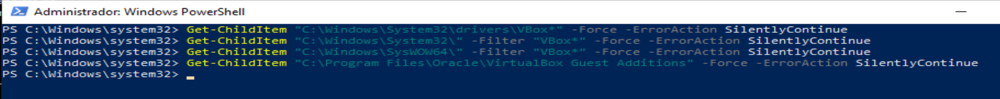
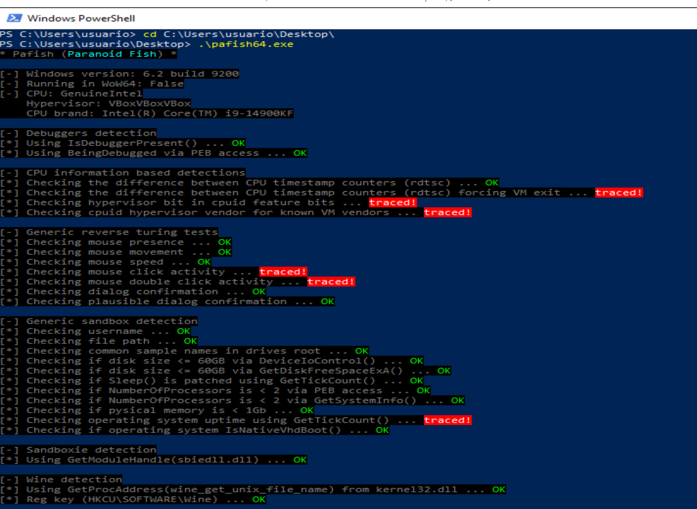
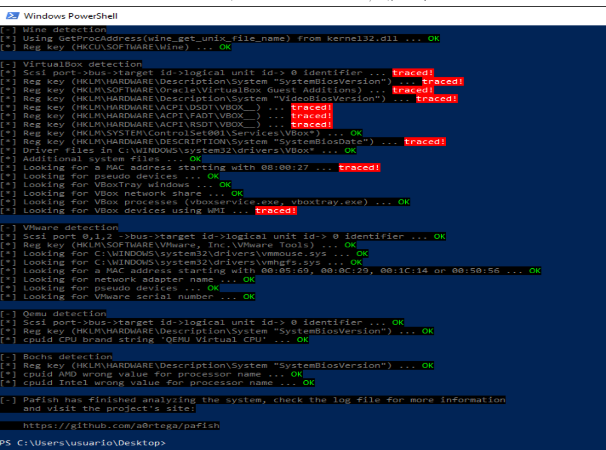
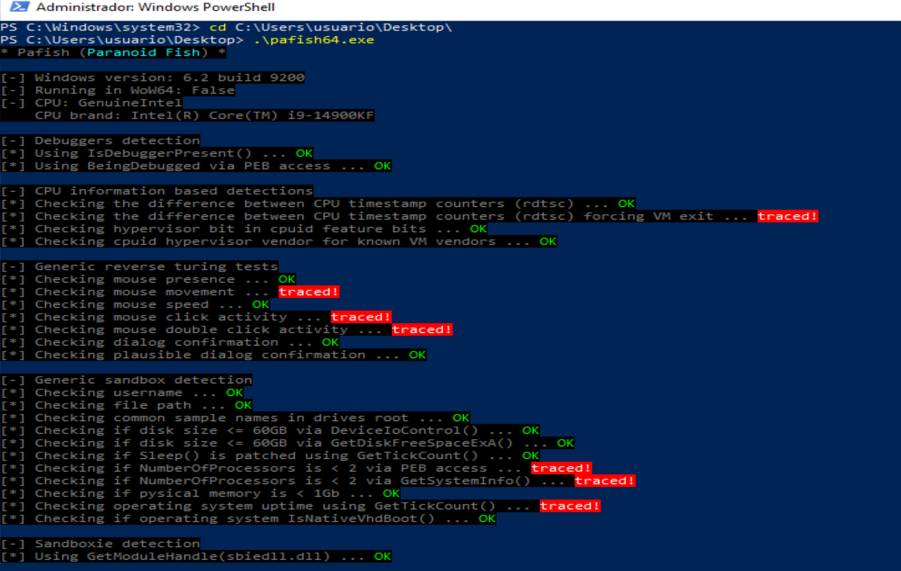
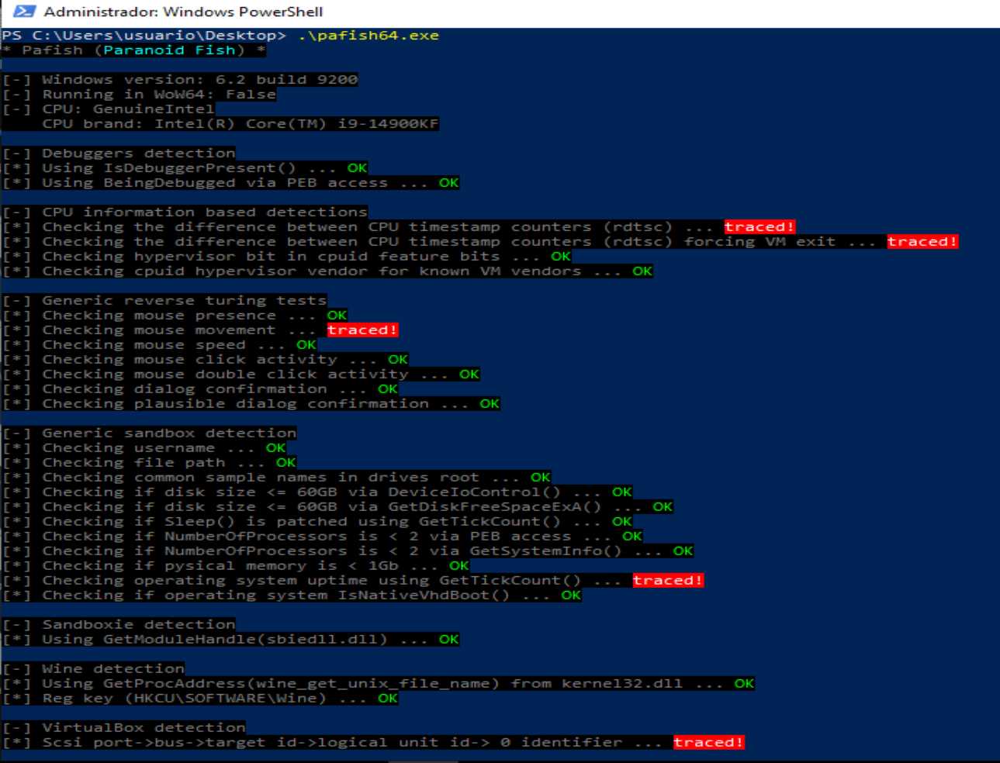
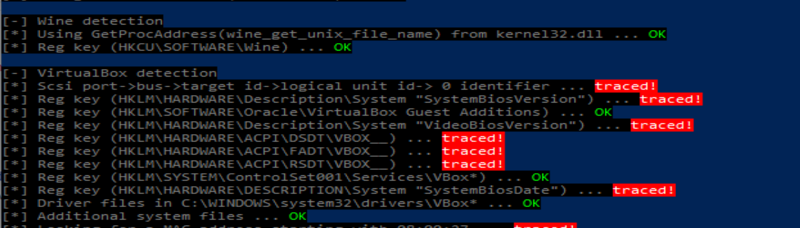
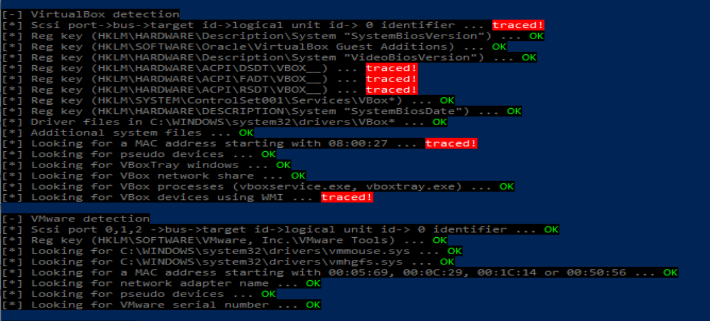
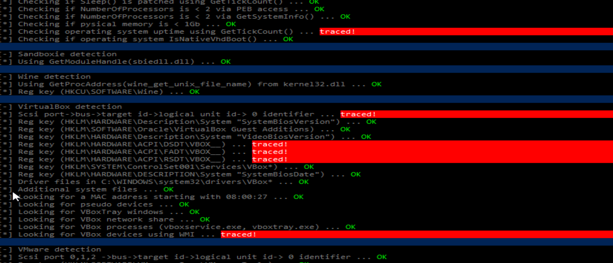
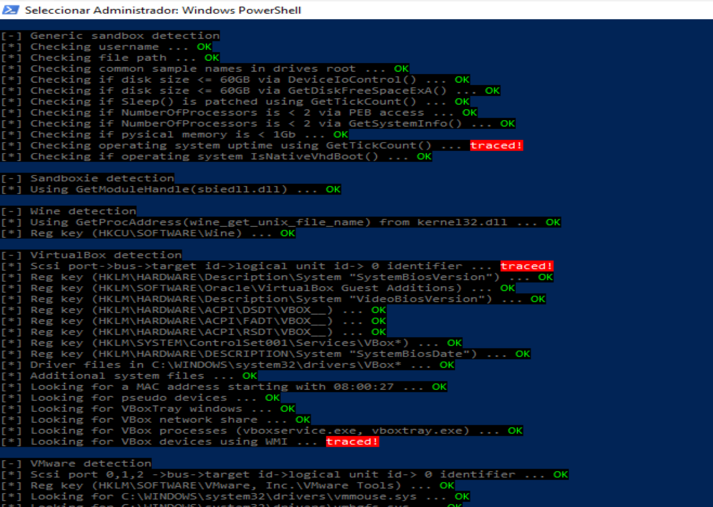
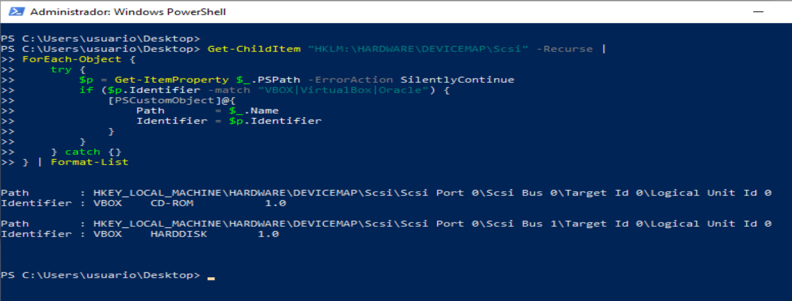

# Sanitizando la MV para que Pafish no detecte artefactos


# 1. Eliminamos el artefacto Virtual Guest Additions

Desinstalamos `Virtual Guest Additions` y comprobamos:
```bash
Get-ChildItem "C:\Windows\System32\drivers\VBox*" -Force -ErrorAction SilentlyContinue
Get-ChildItem "C:\Windows\System32" -Filter "VBox*" -Force -ErrorAction SilentlyContinue
Get-ChildItem "C:\Windows\SysWOW64" -Filter "VBox*" -Force -ErrorAction SilentlyContinue
Get-ChildItem "C:\Program Files\Oracle\VirtualBox Guest Additions" -Force -ErrorAction SilentlyContinue
```



Volvemos a ejecutar `Pafish`:





Hemos conseguido que la parte de `filesystem` ya está mitigada. En esta nueva captura:

```bash
Driver files in C:\WINDOWS\system32\drivers\VBox* ... OK
Additional system files ... OK
Looking for VBoxTray windows ... OK
Looking for VBox network share ... OK
Looking for VBox processes ... OK
```

Eso confirma que al desinstalar `Guest Additions` se ha eliminado los artefactos de `filesystem` que estamos estudiando.

Lo que `Pafish` detecta ahora ya no es filesystem, sino otros vectores:
| Detección que sigue activa                 | Tipo                                  |
| ------------------------------------------ | ------------------------------------- |
| `hypervisor bit in cpuid feature bits`     | CPU / CPUID                           |
| `cpuid hypervisor vendor ... VBoxVBoxVBox` | CPU / hipervisor                      |
| `SCSI ... identifier`                      | Identificador de disco/controladora   |
| `SystemBiosVersion`                        | BIOS / DMI                            |
| `VideoBiosVersion`                         | BIOS de vídeo                         |
| `ACPI\DSDT\VBOX__`, `FADT`, `RSDT`         | ACPI                                  |
| `SystemBiosDate`                           | BIOS                                  |
| MAC `08:00:27`                             | Red                                   |
| `VirtualBox Guest Additions` en registro   | Registro residual                     |
| `VBox devices using WMI`                   | WMI / dispositivos virtuales          |
| `mouse click`, `double click`, `uptime`    | Interacción humana / sandbox genérico |


Para llegar a cero detecciones tendríamoss que modificar profundamente cómo `VirtualBox` presenta `CPU`, `ACPI`, `BIOS`, `vídeo`, `disco` y `WMI` al sistema invitado. Algunas cosas se pueden reducir, otras, como las `tablas ACPI VBOX__` o ciertos resultados de CP``UID, pueden requerir parches del hipervisor o técnicas invasivas.


# 2. Limpiar el registro residual de Guest Additions

Pafish todavía marca:

```bash
Reg key (HKLM\SOFTWARE\Oracle\VirtualBox Guest Additions) ... traced!
```
Dentro de la VM, en PowerShell como administrador, comprobamos primero:
```bash
reg query "HKLM\SOFTWARE\Oracle" /s
reg query "HKLM\SOFTWARE\WOW6432Node\Oracle" /s
```


Exportamos antes de borrar:
```bash
reg export "HKLM\SOFTWARE\Oracle" "$env:USERPROFILE\Desktop\oracle_reg_backup.reg" /y
```

Después eliminamos sólo la clave residual de `Guest Additions`:
```bash
reg delete "HKLM\SOFTWARE\Oracle\VirtualBox Guest Additions" /f
reg delete "HKLM\SOFTWARE\WOW6432Node\Oracle\VirtualBox Guest Additions" /f
```

Reiniciamos y volvemos a pasar Pafish. Esa detección concreta debería pasar a OK:


Ahora mismo quedan estos indicadores:
| Detección Pafish                                                       | Familia / tipo de artefacto                          | Qué está midiendo realmente                                                                                                  | Origen probable                                                                                                         | Dificultad de mitigación |
| ---------------------------------------------------------------------- | ---------------------------------------------------- | ---------------------------------------------------------------------------------------------------------------------------- | ----------------------------------------------------------------------------------------------------------------------- | ------------------------ |
| `Difference between CPU timestamp counters ... traced!`                | Timing / CPU / virtualización                        | Diferencias anómalas en los contadores de tiempo de CPU mediante `RDTSC`, especialmente cuando se fuerza una salida de la VM | Latencia introducida por el hipervisor al gestionar ciertas instrucciones o eventos                                     | Alta                     |
| `Hypervisor bit in cpuid feature bits ... traced!`                     | CPU / CPUID                                          | Presencia del bit de hipervisor en las características expuestas por la CPU virtual                                          | VirtualBox informa al sistema invitado de que se ejecuta sobre un hipervisor                                            | Alta                     |
| `Checking mouse movement ... traced!`                                  | Interacción humana / sandbox genérico                | Ausencia o insuficiencia de movimiento natural del ratón                                                                     | Entorno poco interactivo, recién iniciado o usado de forma artificial                                                   | Baja                     |
| `Using GetTickCount ... traced!`                                       | Timing / uptime / sandbox genérico                   | Tiempo de actividad del sistema demasiado bajo o sospechoso                                                                  | VM recién arrancada o entorno de análisis automatizado                                                                  | Baja                     |
| `SCSI port->bus->target id->logical unit id->0 identifier ... traced!` | Almacenamiento / identificador de disco-controladora | Identificador del disco, bus o dispositivo de almacenamiento virtual                                                         | Valores expuestos por VirtualBox en la controladora/disco virtual, por ejemplo modelo o identificador asociado a `VBOX` | Media                    |
| `SystemBiosVersion ... traced!`                                        | BIOS / SMBIOS / DMI                                  | Versión de BIOS presentada al sistema operativo                                                                              | Valores DMI generados por VirtualBox                                                                                    | Media                    |
| `VideoBiosVersion ... traced!`                                         | BIOS de vídeo / adaptador gráfico virtual            | Versión o identificador de la BIOS gráfica virtual                                                                           | Adaptador gráfico virtual de VirtualBox                                                                                 | Alta                     |
| `ACPI\DSDT\VBOX__ ... traced!`                                         | ACPI / firmware virtual                              | Tabla ACPI DSDT con identificador `VBOX__`                                                                                   | Tablas ACPI generadas por VirtualBox durante el arranque                                                                | Muy alta                 |
| `ACPI\FADT\VBOX__ ... traced!`                                         | ACPI / firmware virtual                              | Tabla ACPI FADT con identificador `VBOX__`                                                                                   | Tablas ACPI generadas por VirtualBox durante el arranque                                                                | Muy alta                 |
| `ACPI\RSDT\VBOX__ ... traced!`                                         | ACPI / firmware virtual                              | Tabla ACPI RSDT con identificador `VBOX__`                                                                                   | Tablas ACPI generadas por VirtualBox durante el arranque                                                                | Muy alta                 |
| `SystemBiosDate ... traced!`                                           | BIOS / SMBIOS / DMI                                  | Fecha de BIOS presentada al sistema invitado                                                                                 | Valor DMI/SMBIOS propio o típico de VirtualBox                                                                          | Media                    |
| `MAC 08:00:27 ... traced!`                                             | Red / identificador de adaptador                     | Dirección MAC con prefijo típico de VirtualBox                                                                               | OUI `08:00:27`, asociado comúnmente a adaptadores de red VirtualBox                                                     | Baja                     |
| `VBox devices using WMI ... traced!`                                   | WMI / dispositivos virtuales                         | Dispositivos expuestos por Windows Management Instrumentation con referencias a VirtualBox/VBox                              | Hardware virtual, ACPI, adaptadores o dispositivos enumerados por el sistema invitado                                   | Media-alta               |


Tras desinstalar `VirtualBox Guest Additions` y eliminar las claves de registro, Pafish deja de detectar drivers, ficheros adicionales, procesos y servicios asociados a Guest Additions. Sin embargo, el entorno continúa siendo identificable mediante indicadores situados en capas más profundas del sistema, como `CPUID`, `timing`, `BIOS/DMI`, `ACPI`, identificadores de almacenamiento, `dirección MAC` y dispositivos expuestos mediante `WMI`.

Esto demuestra que la eliminación de `Guest Additions` reduce de forma efectiva la huella en `filesystem`, pero no elimina la detección de `VirtualBox` como entorno virtualizado. La identificación ya no depende de archivos `VBox*` en disco, sino de información generada por el propio hipervisor y presentada al sistema operativo durante el arranque.


# 3. Eliminar el artefacto `Difference between CPU timestamp counters ... traced!`

Ese indicador pertenece a la técnica `timing / CPU`, no a filesystem. `Pafish` usa `RDTSC` para medir diferencias de tiempo muy pequeñas. En una `VM` esas diferencias pueden delatar al hipervisor, sobre todo si la prueba fuerza una `VM exit`.

Primero, distingue estas dos líneas:
```bash
Checking the difference between CPU timestamp counters (rdtsc) ... traced!
Checking the difference between CPU timestamp counters (rdtsc) forcing VM exit ... traced!
```

La segunda es bastante más difícil de eliminar, porque `Pafish` provoca una transición al hipervisor y mide la latencia. Aun así, en `VirtualBox` hay una mitigación oficial que merece probar: `TSCTiedToExecution`.


```bash
└─$ VBoxManage list vms
"Win10-Pro-FlareVM" {7f2d9582-c734-4f6a-8305-39059fafe2da}
```

Dejamos la VM con una sola vCPU, evitamos limitar artificialmente el tiempo de CPU, mantenemos nested paging activado, y desactivamos el proveedor de paravirtualización expuesto al sistema invitado.
```bash
VBoxManage modifyvm "Win10-Pro-FlareVM" --cpus 1
VBoxManage modifyvm "Win10-Pro-FlareVM" --cpuexecutioncap 100
VBoxManage modifyvm "Win10-Pro-FlareVM" --nestedpaging on
VBoxManage modifyvm "Win10-Pro-FlareVM" --paravirtprovider none
```

Arrancamos la VM y pasamos Pafish:



La configuración aplicada reduce con éxito la exposición de `CPUID` y elimina la detección básica mediante `RDTSC`. Sin embargo, la prueba que fuerza una `VM exit` sigue detectando virtualización. Además, al configurar la `VM` con una sola `vCPU`, `Pafish` activa nuevas detecciones genéricas de sandbox basadas en el bajo número de procesadores.


Cambiamos únicamente el número de `CPUs` a `2` y dejamos el resto igual:
```bash
VBoxManage modifyvm "Win10-Pro-FlareVM" --cpus 2
VBoxManage modifyvm "Win10-Pro-FlareVM" --cpuexecutioncap 100
VBoxManage modifyvm "Win10-Pro-FlareVM" --nestedpaging on
VBoxManage modifyvm "Win10-Pro-FlareVM" --paravirtprovider none
```



Hemos solucionado el problema nuevo que apareció con `1 vCPU`, pero ha reaparecido la detección básica por `RDTSC`.

Esto indica que el indicador `RDTSC` es sensible a la configuración de `CPU` virtual. Al usar `1 vCPU` se reduce la variabilidad entre contadores o planificación de `CPU`, pero se genera una configuración hardware poco realista. Al usar `2 vCPU`, la máquina parece más normal para las pruebas de procesadores, pero vuelve a aparecer la anomalía temporal.


Intentamos reducir RDTSC: Con la maquina virtual apagada -->
governor del host en performance,  
afinidad del proceso con taskset,  
2 vCPU para evitar NumberOfProcessors < 2,  
paravirtprovider none para reducir exposición CPUID.  


```bash
for g in /sys/devices/system/cpu/cpu*/cpufreq/scaling_governor; do
  echo performance | sudo tee "$g" > /dev/null
done
```

```bash
cat /sys/devices/system/cpu/cpu*/cpufreq/scaling_governor
```

```bash
ls /sys/devices/system/cpu/cpu*/cpufreq/energy_performance_preference 2>/dev/null
```

```bash
for e in /sys/devices/system/cpu/cpu*/cpufreq/energy_performance_preference; do
  echo performance | sudo tee "$e" > /dev/null
done
```

```bash
cat /sys/devices/system/cpu/cpu*/cpufreq/energy_performance_preference 2>/dev/null
```

Arrancamos la MV:
```bash
VBoxManage startvm "Win10-Pro-FlareVM" --type gui
```

Fijamos la VM a núcleos concretos del host:
```bash
└─$ pgrep -af "VirtualBoxVM.*Win10-Pro-FlareVM"
165263 /usr/lib/virtualbox/VirtualBoxVM --comment Win10-Pro-FlareVM --startvm 7f2d9582-c734-4f6a-8305-39059fafe2da --no-startvm-errormsgbox
```

Aplicamos `taskset` a ese `PID`. Como tu `VM` está con `2 vCPU`, probamos primero con dos `CPUs` del host:

```bash
└─$ sudo taskset -cp 2,3 165263
pid 165263's current affinity list: 0-31
pid 165263's new affinity list: 2,3
```

Volvemos a pasar Pafish:


## Eliminamos: Checking operating system uptime using GetTickCount() ... traced!
No depende de VirtualBox, sino del tiempo que lleva Windows encendido.

GetTickCount() devuelve los milisegundos transcurridos desde que Windows se inició, por lo que Pafish puede marcar como sospechoso un sistema recién arrancado o con poco tiempo de uso. Microsoft describe GetTickCount() precisamente como una función que devuelve los milisegundos transcurridos desde el inicio del sistema. En el código principal de Pafish aparece explícitamente esa comprobación como parte de las detecciones genéricas de sandbox.


```bash
[TimeSpan]::FromMilliseconds([Environment]::TickCount64)
```


```bash
while ([Environment]::TickCount64 -lt 1800000) {
    $uptime = [TimeSpan]::FromMilliseconds([Environment]::TickCount64)
    Write-Host "Uptime actual:" $uptime.ToString("hh\:mm\:ss") "- esperando hasta 30 minutos..."
    Start-Sleep -Seconds 60
}

cd C:\Users\usuario\Desktop
.\pafish64.exe
```

La detección Checking operating system uptime using GetTickCount() se debe a que Pafish interpreta un tiempo de actividad bajo como posible indicador de sandbox o entorno automatizado. A diferencia de otros artefactos, esta comprobación no depende de VirtualBox ni de Guest Additions, sino del tiempo transcurrido desde el inicio de Windows.

Para mitigarla, se mantuvo la máquina virtual encendida durante un periodo prolongado antes de ejecutar Pafish. Tras aumentar el uptime del sistema, se espera que la comprobación pase de traced! a OK, evidenciando que se trata de un indicador temporal y no estructural del entorno virtualizado.


## Eliminacion de las Reg key:



En Kali, con la VM apagada:

```bash
VBoxManage snapshot "Win10-Pro-FlareVM" take "antes-regkey-bios-dmi-acpi"
```

Comprobamos si la VM usa BIOS o EFI
```bash
VBoxManage showvminfo "Win10-Pro-FlareVM" | grep -i firmware
```

Si vemoss algo como Firmware: BIOS, usamos:
```bash
DEV=pcbios
```

Si vemoss Firmware: EFI, usamos:

```bash
DEV=efi
```

Cambiamos SystemBiosVersion y SystemBiosDate: Ejecutamos en Kali, con la VM apagada:
```bash

VM="Win10-Pro-FlareVM"
DEV=pcbios

VBoxManage setextradata "$VM" "VBoxInternal/Devices/$DEV/0/Config/DmiBIOSVendor" "American Megatrends Inc."
VBoxManage setextradata "$VM" "VBoxInternal/Devices/$DEV/0/Config/DmiBIOSVersion" "E7D25IMS.1A0"
VBoxManage setextradata "$VM" "VBoxInternal/Devices/$DEV/0/Config/DmiBIOSReleaseDate" "07/14/2023"

VBoxManage setextradata "$VM" "VBoxInternal/Devices/$DEV/0/Config/DmiSystemVendor" "Micro-Star International Co., Ltd."
VBoxManage setextradata "$VM" "VBoxInternal/Devices/$DEV/0/Config/DmiSystemProduct" "MS-7D25"
VBoxManage setextradata "$VM" "VBoxInternal/Devices/$DEV/0/Config/DmiSystemVersion" "string:1.0"
VBoxManage setextradata "$VM" "VBoxInternal/Devices/$DEV/0/Config/DmiSystemSerial" "string:07D2523M123456"

VBoxManage setextradata "$VM" "VBoxInternal/Devices/$DEV/0/Config/DmiBoardVendor" "Micro-Star International Co., Ltd."
VBoxManage setextradata "$VM" "VBoxInternal/Devices/$DEV/0/Config/DmiBoardProduct" "PRO Z690-A WIFI DDR4"
VBoxManage setextradata "$VM" "VBoxInternal/Devices/$DEV/0/Config/DmiBoardVersion" "string:1.0"
VBoxManage setextradata "$VM" "VBoxInternal/Devices/$DEV/0/Config/DmiBoardSerial" "string:MB123456789"

VBoxManage setextradata "$VM" "VBoxInternal/Devices/$DEV/0/Config/DmiChassisVendor" "Micro-Star International Co., Ltd."
VBoxManage setextradata "$VM" "VBoxInternal/Devices/$DEV/0/Config/DmiChassisType" 3
VBoxManage setextradata "$VM" "VBoxInternal/Devices/$DEV/0/Config/DmiChassisVersion" "string:1.0"
VBoxManage setextradata "$VM" "VBoxInternal/Devices/$DEV/0/Config/DmiChassisSerial" "string:CH123456789"

VBoxManage setextradata "$VM" "VBoxInternal/Devices/$DEV/0/Config/DmiOEMVBoxVer" "<EMPTY>"
VBoxManage setextradata "$VM" "VBoxInternal/Devices/$DEV/0/Config/DmiOEMVBoxRev" "<EMPTY>"
```

El prefijo string: es importante cuando el valor puede interpretarse como número; Oracle advierte que algunos parámetros DMI deben tratarse como cadenas y que, si parecen numéricos, conviene forzarlos como string para evitar errores de arranque.

Comprobamos que se han guardado:
```bash
VBoxManage getextradata "$VM" enumerate | grep -i Dmi
```

Arrancamos Windows y verificamos los valores: Dentro de Windows:

```bash
Get-CimInstance Win32_BIOS | Format-List Manufacturer,SMBIOSBIOSVersion,ReleaseDate
Get-CimInstance Win32_ComputerSystem | Format-List Manufacturer,Model
Get-CimInstance Win32_BaseBoard | Format-List Manufacturer,Product,Version,SerialNumber
```

Y revisamos directamente el registro:

```bash
reg query "HKLM\HARDWARE\DESCRIPTION\System" /v SystemBiosVersion
reg query "HKLM\HARDWARE\DESCRIPTION\System" /v SystemBiosDate
reg query "HKLM\HARDWARE\DESCRIPTION\System" /v VideoBiosVersion
```


```bash
$k = "HKLM:\HARDWARE\DESCRIPTION\System"

New-ItemProperty -Path $k -Name "SystemBiosVersion" -PropertyType MultiString -Value @("American Megatrends Inc.", "E7D25IMS.1A0") -Force

New-ItemProperty -Path $k -Name "SystemBiosDate" -PropertyType String -Value "07/14/2023" -Force

New-ItemProperty -Path $k -Name "VideoBiosVersion" -PropertyType MultiString -Value @("American Megatrends Inc. VGA BIOS", "Version 1.0") -Force
```


```bash
reg query "HKLM\HARDWARE\DESCRIPTION\System" /v SystemBiosVersion
reg query "HKLM\HARDWARE\DESCRIPTION\System" /v SystemBiosDate
reg query "HKLM\HARDWARE\DESCRIPTION\System" /v VideoBiosVersion
```




## Quitar la detección de MAC 08:00:27

```bash
Looking for a MAC address starting with 08:00:27 ... traced!
```

En Kali, con la VM apagada:

```bash
VM="Win10-Pro-FlareVM"

VBoxManage modifyvm "$VM" --macaddress1 001A2B3C4D5E
```

Arrancamos Windows y comprobamos dentro:
```bash
getmac /v
```

Debe desaparecer cualquier MAC que empiece por:
```bash
08-00-27
```

Luego volvemos a pasar Pafish. Esa línea debería pasar a OK.




## Sobre las claves ACPI VBOX__


```bash
HKLM\HARDWARE\ACPI\DSDT\VBOX__
HKLM\HARDWARE\ACPI\FADT\VBOX__
HKLM\HARDWARE\ACPI\RSDT\VBOX__
```

Pafish no comprueba un valor dentro de esas claves: comprueba si la clave existe.

Podemos hacer una prueba controlada eliminándolas en la sesión actual. Primero exportamos:

```bash
reg export "HKLM\HARDWARE\ACPI" "$env:USERPROFILE\Desktop\hardware_acpi_before.reg" /y
```

Luego probamos:

```bash
Remove-Item "HKLM:\HARDWARE\ACPI\DSDT\VBOX__" -Recurse -Force -ErrorAction SilentlyContinue
Remove-Item "HKLM:\HARDWARE\ACPI\FADT\VBOX__" -Recurse -Force -ErrorAction SilentlyContinue
Remove-Item "HKLM:\HARDWARE\ACPI\RSDT\VBOX__" -Recurse -Force -ErrorAction SilentlyContinue
```

Verificamos:

```bash
Test-Path "HKLM:\HARDWARE\ACPI\DSDT\VBOX__"
Test-Path "HKLM:\HARDWARE\ACPI\FADT\VBOX__"
Test-Path "HKLM:\HARDWARE\ACPI\RSDT\VBOX__"
```

Si devuelven False, pasamos Pafish.




## Identificar exactamente qué SCSI está detectando Pafish

Antes de cambiar el disco, localizamos dentro de Windows qué valor contiene VBOX.
```bash
Get-ChildItem "HKLM:\HARDWARE\DEVICEMAP\Scsi" -Recurse |
ForEach-Object {
    try {
        $p = Get-ItemProperty $_.PSPath -ErrorAction SilentlyContinue
        if ($p.Identifier -match "VBOX|VirtualBox|Oracle") {
            [PSCustomObject]@{
                Path       = $_.Name
                Identifier = $p.Identifier
            }
        }
    } catch {}
} | Format-List
```

También podemos usar:

```bash
reg query "HKLM\HARDWARE\DEVICEMAP\Scsi" /s | findstr /i "VBOX VirtualBox Oracle Identifier"

```
Esto nos dirá si Pafish está detectando algo como:

```bash
VBOX HARDDISK
VBOX CD-ROM
VirtualBox
```

Este paso es importante porque a veces no lo provoca el disco duro, sino la unidad óptica virtual.



Hay que tratar dos artefactos distintos:
| Artefacto           | Detección             | Mitigación                                                                |
| ------------------- | --------------------- | ------------------------------------------------------------------------- |
| `VBOX CD-ROM 1.0`   | Unidad óptica virtual | Desmontar/eliminar CD-ROM virtual o cambiar ATAPI vendor/product/revision |
| `VBOX HARDDISK 1.0` | Disco duro virtual    | Cambiar VPD del disco: modelo, serie y firmware                           |


**Ver la configuración real de almacenamiento:**

Con la VM apagada, en Kali:

```bash
└─$ VM="Win10-Pro-FlareVM"
                                                                                                                                                                                        
└─$ VBoxManage showvminfo "$VM" | sed -n '/Storage/,/NIC/p'
Storage Controllers:
#0: 'SATA', Type: IntelAhci, Instance: 0, Ports: 4 (max 30), Bootable
  Port 0, Unit 0: UUID: c0622126-2de6-470c-a872-2fc2cc85adb7
    Location: "/home/xxniwexx/VirtualBox VMs/VBoxGuestAdditions_7.1.0_BETA2.iso"
  Port 1, Unit 0: UUID: 45fc5f7a-64ef-4338-9f07-68eec821bbf0
    Location: "/home/xxniwexx/VirtualBox VMs/Win10-Pro-FlareVM/Snapshots/{45fc5f7a-64ef-4338-9f07-68eec821bbf0}.vdi"
NIC 1:                       MAC: 001A2B3C4D5E, Attachment: NAT, Cable connected: on, Trace: off (file: none), Type: 82540EM, Reported speed: 0 Mbps, Boot priority: 0, Promisc Policy: deny, Bandwidth group: none

```

Así que tenemos que hacer dos cosas:
- Desmontar el ISO de Guest Additions del Port 0.
- Cambiar los identificadores VPD del disco en Port 1.

Apagamos la MV.

Desmontamos el ISO de Guest Additions

Mi ISO está en SATA Port 0, así que ejecutamos:

```bash
VM="Win10-Pro-FlareVM"

VBoxManage storageattach "$VM" \
  --storagectl "SATA" \
  --port 0 \
  --device 0 \
  --medium none
```

Esto debería eliminar el artefacto:

```bash
VBOX CD-ROM 1.0
```

Cambiamos los identificadores del disco en SATA Port 1. Mi disco está en SATA Port 1, así que los comandos correctos son con Port1, no Port0:

```bash
VM="Win10-Pro-FlareVM"

VBoxManage setextradata "$VM" "VBoxInternal/Devices/ahci/0/Config/Port1/SerialNumber" "S6PZNX0T123456A"
VBoxManage setextradata "$VM" "VBoxInternal/Devices/ahci/0/Config/Port1/FirmwareRevision" "SVT02B6Q"
VBoxManage setextradata "$VM" "VBoxInternal/Devices/ahci/0/Config/Port1/ModelNumber" "Samsung SSD 870 EVO 500GB"
```

Comprobamos que se han guardado:

```bash
└─$ VBoxManage getextradata "$VM" enumerate | grep -i "Port1"

Key: VBoxInternal/Devices/ahci/0/Config/Port1/FirmwareRevision, Value: SVT02B6Q
Key: VBoxInternal/Devices/ahci/0/Config/Port1/ModelNumber, Value: Samsung SSD 870 EVO 500GB
Key: VBoxInternal/Devices/ahci/0/Config/Port1/SerialNumber, Value: S6PZNX0T123456A
```


Arrancamos la VM


Verificamos en Windows: Dentro de Windows, abrimos PowerShell como administrador y ejecutamos:
```bash
Get-CimInstance Win32_DiskDrive | Format-List Model,SerialNumber,FirmwareRevision,PNPDeviceID
```

Después revisamos directamente el registro que usa Pafish:

```bash
reg query "HKLM\HARDWARE\DEVICEMAP\Scsi" /s | findstr /i "VBOX VirtualBox Oracle Identifier"
```
Lo ideal es que ya no aparezcan:
```bash
VBOX CD-ROM
VBOX HARDDISK
```

Ejecuta Pafish


## Parcheos manuales
Vamos a realizar un wrapper antes de ejecutar Pafish. Como Pafish consulta esos valores en el momento de ejecución, podemos crear un script que primero parchea el registro y después lanza Pafish:
```bash

@'
$k = "HKLM:\HARDWARE\DESCRIPTION\System"

Remove-ItemProperty -Path $k -Name "SystemBiosVersion" -ErrorAction SilentlyContinue
Remove-ItemProperty -Path $k -Name "SystemBiosDate" -ErrorAction SilentlyContinue
Remove-ItemProperty -Path $k -Name "VideoBiosVersion" -ErrorAction SilentlyContinue

New-ItemProperty -Path $k -Name "SystemBiosVersion" -PropertyType MultiString -Value @("American Megatrends Inc.", "E7D25IMS.1A0") -Force | Out-Null
New-ItemProperty -Path $k -Name "SystemBiosDate" -PropertyType String -Value "07/14/2023" -Force | Out-Null
New-ItemProperty -Path $k -Name "VideoBiosVersion" -PropertyType MultiString -Value @("American Megatrends Inc. VGA BIOS", "Version 1.0") -Force | Out-Null

Start-Process "C:\Users\usuario\Desktop\pafish64.exe"
'@ | Set-Content "C:\Users\usuario\Desktop\run-pafish-hardened.ps1" -Encoding UTF8
```

Y lo ejecutamoss como administrador:

```bash
powershell.exe -ExecutionPolicy Bypass -File "C:\Users\usuario\Desktop\run-pafish-hardened.ps1"
```
Esta opción garantiza que los valores estén corregidos justo antes de lanzar Pafish.


Aunque los valores `DMI` modificados mediante `VBoxManage setextradata `se reflejaron correctamente en `WMI`, `Pafish` seguía detectando `VirtualBox` porque consultaba directamente los valores `SystemBiosVersion`, `SystemBiosDate` y `VideoBiosVersion` bajo `HKLM\HARDWARE\DESCRIPTION\System`.

Esta rama del registro es volátil y se reconstruye en cada arranque a partir de la información proporcionada por el entorno virtual. Por ello, la modificación manual no persiste tras reiniciar. Como mitigación práctica, se creó una tarea programada con privilegios de `SYSTEM` que reescribe dichos valores al inicio de Windows y al inicio de sesión, evitando que `Pafish` encuentre las cadenas asociadas a `VirtualBox`.


## WMI: localizar qué dispositivo sigue delatando VirtualBox

Para esta línea:

```bash
Looking for VBox devices using WMI ... traced!
```

ejecutamos dentro de Windows:
```bash
Get-CimInstance Win32_PnPEntity |
Where-Object {
    $_.Name -match "VBox|VirtualBox|Oracle" -or
    $_.DeviceID -match "VBox|VirtualBox|Oracle" -or
    $_.PNPDeviceID -match "VBox|VirtualBox|Oracle"
} |
Select-Object Name, DeviceID, PNPDeviceID |
Format-List
```

Si no sale nada, probamos también:
```bash
Get-CimInstance Win32_SystemDriver |
Where-Object {
    $_.Name -match "VBox|VirtualBox|Oracle" -or
    $_.PathName -match "VBox|VirtualBox|Oracle"
} |
Select-Object Name, DisplayName, State, PathName |
Format-List
```

Si WMI sigue mostrando VBOX, normalmente vendrá de ACPI, almacenamiento, vídeo o dispositivos virtuales. Por eso conviene corregir primero MAC y SCSI, y luego repetir la consulta WMI.