- [Sanitizando la MV para que Pafish no detecte artefactos](#sanitizando-la-mv-para-que-pafish-no-detecte-artefactos)
- [1. Eliminamos el artefacto Virtual Guest Additions](#1-eliminamos-el-artefacto-virtual-guest-additions)
- [2. Limpiar el registro residual de Guest Additions](#2-limpiar-el-registro-residual-de-guest-additions)
- [3. Eliminar el artefacto `Difference between CPU timestamp counters ... traced!`](#3-eliminar-el-artefacto-difference-between-cpu-timestamp-counters--traced)
  - [Eliminamos: Checking operating system uptime using GetTickCount() ... traced!](#eliminamos-checking-operating-system-uptime-using-gettickcount--traced)
  - [Eliminacion de las Reg key:](#eliminacion-de-las-reg-key)
  - [Quitar la detección de MAC 08:00:27](#quitar-la-detección-de-mac-080027)
  - [Sobre las claves ACPI VBOX\_\_](#sobre-las-claves-acpi-vbox__)
  - [Identificar exactamente qué SCSI está detectando Pafish](#identificar-exactamente-qué-scsi-está-detectando-pafish)
  - [WMI: localizar qué dispositivo sigue delatando VirtualBox](#wmi-localizar-qué-dispositivo-sigue-delatando-virtualbox)
  - [Conseguimos](#conseguimos)
  - [Volvemos a intentar eliminar WMI](#volvemos-a-intentar-eliminar-wmi)
  - [Parcheos manuales](#parcheos-manuales)


----


# Sanitizando la MV para que Pafish no detecte artefactos

En esta fase se ha analizado si `Pafish` identifica la máquina virtual mediante artefactos persistentes de `VirtualBox` presentes en el sistema de archivos. A diferencia de las pruebas anteriores, donde se evaluaban nombres y rutas sospechosas del propio binario (por ejemplo `sample.exe`, `C:\analysis\` o `C:\sample.exe`), aquí la detección no depende de dónde se ejecute `Pafish`, sino de los ficheros instalados en el sistema operativo por `VirtualBox Guest Additions`.

> [!Note]
> `Pafish` detecta la presencia de `VirtualBox` mediante artefactos persistentes en el sistema de archivos, especialmente drivers y componentes instalados por `VirtualBox Guest Additions.`


# 1. Pafish

`pafish`, también conocido como **Paranoid Fish**, no es malware, sino una herramienta de investigación utilizada para evaluar si un entorno de análisis, sandbox o máquina virtual puede ser detectado mediante técnicas `anti-VM` y `anti-sandbox`.

Repositorio:

```text
https://github.com/a0rtega/pafish
```

Este proyecto implementa comprobaciones similares a las que pueden utilizar familias reales de malware. Entre ellas se encuentran la búsqueda de artefactos como archivos, drivers, procesos, claves de registro o características del sistema asociadas a entornos virtualizados.

En relación con la técnica `filesystem`, `pafish` resulta especialmente útil porque permite comprobar la existencia de artefactos como:
```
VBox*.sys
vm*.sys
prl*.sys
```

Estos nombres están asociados a entornos como `VirtualBox`, `VMware` o `Parallels`.

Aunque Pafish` no debe tratarse como una muestra maliciosa, sí puede utilizarse como **herramienta de referencia para validar el laboratorio y comprender cómo una muestra podría detectar artefactos** del entorno mediante comprobaciones simples del sistema de archivos.

**Vamos a evaluar si la máquina virtual de análisis expone artefactos detectables mediante técnicas anti-VM.**


| Técnica                                                                          | Qué buscar en Pafish / Procmon                                    | Evidencia esperada                                                      |
| -------------------------------------------------------------------------------- | ----------------------------------------------------------------- | ----------------------------------------------------------------------- |
| `1.3.1 — Comprobar si existen archivos concretos`                                | Accesos a drivers o archivos de VM                                | `VBoxGuest.sys`, `VBoxMouse.sys`, `vmmouse.sys`, `vmhgfs.sys`           |
| `1.3.2 — Comprobar si existen directorios concretos`                             | Accesos a carpetas de herramientas de virtualización              | `C:\Program Files\VMware\`, `VirtualBox Guest Additions`, `C:\analysis` |
| `1.3.3 — Comprobar si la ruta completa del ejecutable contiene ciertas palabras` | Comprobación del path del propio ejecutable                       | Palabras como `sample`, `virus`, `sandbox`, `malware`, `analysis`       |
| `1.3.5 — Comprobar si existen ejecutables con nombres sospechosos en la raíz`    | Búsqueda de nombres como `sample.exe` o `malware.exe` en unidades | `C:\sample.exe`, `C:\malware.exe`, `D:\sample.exe`                      |


## 1.1. Flujo de trabajo inicial
Antes de ejecutar nada:
```
1. Crearemos un snapshot limpio: "pre_pafish_alkhaser".
2. Probamos pafish en una VM limpia → ¿qué detecta sólo por ser una máquina virtual?
3. Probamos pafish en una VM con FLARE-VM → ¿qué detecta además por ser un laboratorio de análisis?
4. Crear carpeta de evidencias: C:\TFM\evidencias\pafish_alkhaser\
5. Descargar las herramientas desde sus repositorios oficiales o desde releases.
6. Calcular hash SHA256 de cada ejecutable.
7. Ejecutar primero sin depurador.
8. Repetir después con Procmon activo.
```


| Entorno | Descripción | Objetivo |
|---|---|---|
| VM limpia | Windows recién instalado, sin herramientas de análisis adicionales | Identificar artefactos propios de la virtualización |
| VM con FLARE-VM | Windows con herramientas de reversing y análisis instaladas | Identificar artefactos añadidos por el laboratorio |


> [!Note]
> `Pafish` permite validar si el laboratorio expone artefactos relacionados con técnicas `filesystem`, como la presencia de archivos, drivers o nombres sospechosos utilizados habitualmente por malware para detectar entornos virtualizados.


**Comandos útiles en PowerShell:**
```
Get-FileHash .\pafish.exe -Algorithm SHA256

systeminfo > C:\TFM\evidencias\pafish_alkhaser\systeminfo.txt
hostname > C:\TFM\evidencias\pafish_alkhaser\hostname.txt
whoami > C:\TFM\evidencias\pafish_alkhaser\whoami.txt
```


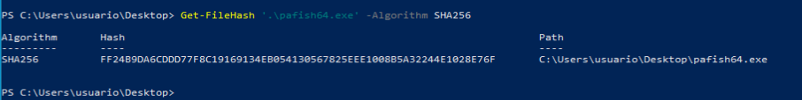


## 6.2. Probamos pafish en una VM limpia

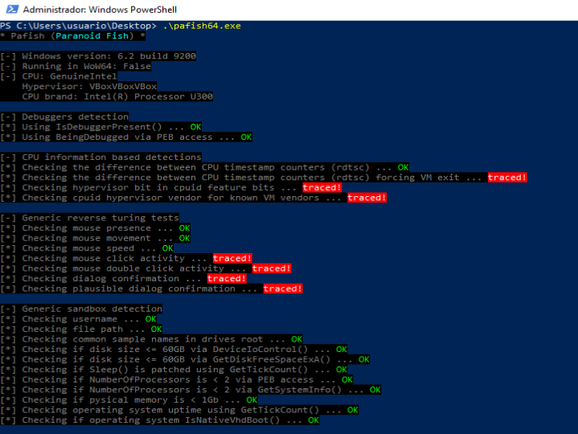


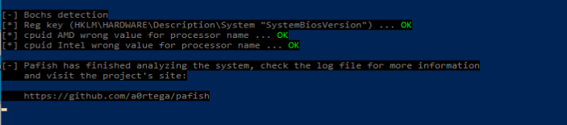

La ejecución de Pafish en una máquina virtual limpia muestra que **el entorno es detectable sin necesidad de que existan herramientas de análisis avanzadas instaladas.** La propia presencia del hipervisor, los drivers, servicios y artefactos de VirtualBox permite identificar el sistema como entorno virtualizado.

| Estado            | Significado                                                  |
| ----------------- | ------------------------------------------------------------ |
| `OK` en verde     | No ha detectado ese indicador concreto                       |
| `traced!` en rojo | Ha detectado un artefacto o comportamiento sospechoso        |
| `VBoxVBoxVBox`    | Identificador del hipervisor VirtualBox devuelto por `CPUID` |


**Detecciones principales observadas:**
- Detección por `CPU` / `CPUID`: `Pafish` detecta la virtualización mediante comprobaciones de `CPU`: `Pafish` identificó la presencia de un hipervisor mediante instrucciones relacionadas con `CPUID`. El identificador devuelto fue `VBoxVBoxVBox`, cadena característica de VirtualBox. Esta detección no pertenece al bloque `filesystem`, pero confirma que el entorno virtualizado es reconocible mediante comprobaciones de `CPU`.
  ```
  Checking hypervisor bit in cpuid feature bits ... traced!
  Checking cpuid hypervisor vendor for known VM vendors ... traced!
  Hypervisor: VBoxVBoxVBox
  ```

- Detecciones relacionadas con `filesystem`: `Pafish` comprueba la existencia de archivos y drivers asociados a `VirtualBox`. La presencia de estos artefactos permite inferir que el sistema se está ejecutando dentro de una máquina virtual:
  ```
  C:\WINDOWS\system32\drivers\VBoxMouse.sys
  C:\WINDOWS\system32\drivers\VBoxGuest.sys
  C:\WINDOWS\system32\drivers\VBoxSF.sys
  C:\WINDOWS\system32\vboxhook.dll
  C:\WINDOWS\system32\vboxmrxnp.dll
  C:\WINDOWS\system32\vboxservice.exe
  C:\WINDOWS\system32\vboxtray.exe
  C:\WINDOWS\system32\VBoxControl.exe
  ```

- Comprobar si existen directorios concretos: Además de la comprobación de archivos concretos, `Pafish` detectó la existencia del directorio `C:\program files\oracle\virtualbox guest additions\`. Esta ruta corresponde a las `Guest Additions` de `VirtualBox` y constituye un artefacto claro de virtualización. Esta evidencia se relaciona directamente con la técnica `1.3.2 — Comprobar si existen directorios concretos`.

- Comprobar si la ruta completa del ejecutable contiene ciertas palabras: No se detecta la técnica 1.3.3 en esta ejecución.

- Comprobar si existen ejecutables con nombres sospechosos en la raíz del disco: No se detecta la técnica 1.3.5 en esta ejecución.

- Detección por registro: Aunque el objetivo principal del experimento era analizar técnicas basadas en `filesystem`, Pafish también detectó múltiples claves de registro asociadas a VirtualBox. Esto demuestra que las técnicas `anti-VM` suelen combinar varias fuentes de información: archivos, directorios, registro, procesos, dispositivos, `MAC address` y consultas `WMI`.

- Detección por procesos y servicios: `Pafish` detectó procesos propios de `VirtualBox Guest Additions`, concretamente `vboxservice.exe` y `vboxtray.exe`. Esta evidencia no pertenece estrictamente a `filesystem`, pero refuerza la detección `anti-VM` al identificar procesos característicos del entorno virtualizado.

- Detección por `MAC address`: `Looking for a MAC address starting with 08:00:27 ... traced!`. La `MAC 08:00:27` es típica de adaptadores `VirtualBox`.

- Detección por interacción humana: `Pafish` no detecta ausencia total de ratón, ya que la presencia, el movimiento y la velocidad del cursor son considerados plausibles. Sin embargo, sí detecta falta de interacción suficiente en forma de clics, doble clics o confirmaciones de diálogos. Este resultado es típico de entornos de análisis donde la ejecución se realiza de forma rápida y con poca interacción humana.

**NO se detecta:**
| Bloque              | Resultado | Interpretación                                           |
| ------------------- | --------- | -------------------------------------------------------- |
| Debugger detection  | `OK`      | No parece haber depurador activo.                        |
| Sandboxie detection | `OK`      | No se detecta Sandboxie.                                 |
| Wine detection      | `OK`      | No se detecta Wine.                                      |
| VMware detection    | `OK`      | No se detecta VMware.                                    |
| QEMU detection      | `OK`      | No se detecta QEMU.                                      |
| Bochs detection     | `OK`      | No se detecta Bochs.                                     |
| Common sample names | `OK`      | No hay `sample.exe` o `malware.exe` en raíz.             |
| File path           | `OK`      | La ruta del ejecutable no contiene palabras sospechosas. |

> [!Note]
> **Conclusiones:**
> La ejecución de Pafish en una máquina virtual limpia muestra que el entorno es claramente detectable como VirtualBox. Las detecciones más relevantes se concentran en artefactos del hipervisor y de las VirtualBox Guest Additions, incluyendo archivos del sistema, drivers, servicios, procesos, claves de registro, identificadores ACPI, MAC address y dispositivos específicos.
>
> Desde el punto de vista de las técnicas `filesystem`, el experimento confirma especialmente las técnicas `1.3.1` y `1.3.2`, ya que Pafish detecta tanto archivos concretos como directorios asociados a VirtualBox. En cambio, las técnicas `1.3.3` y `1.3.5` no se activan en esta ejecución, porque la muestra no se ejecutó desde una ruta sospechosa ni existían ejecutables como `sample.exe` o `malware.exe` en la raíz del disco.


## Probamos pafish en una VM con FLARE-VM


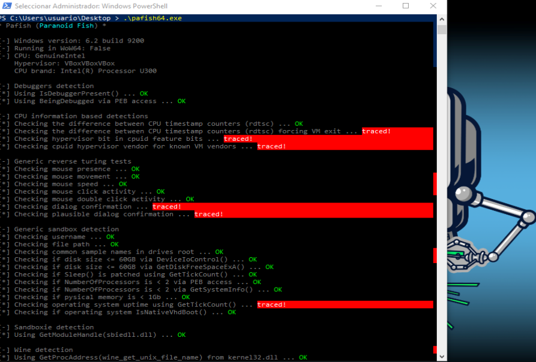


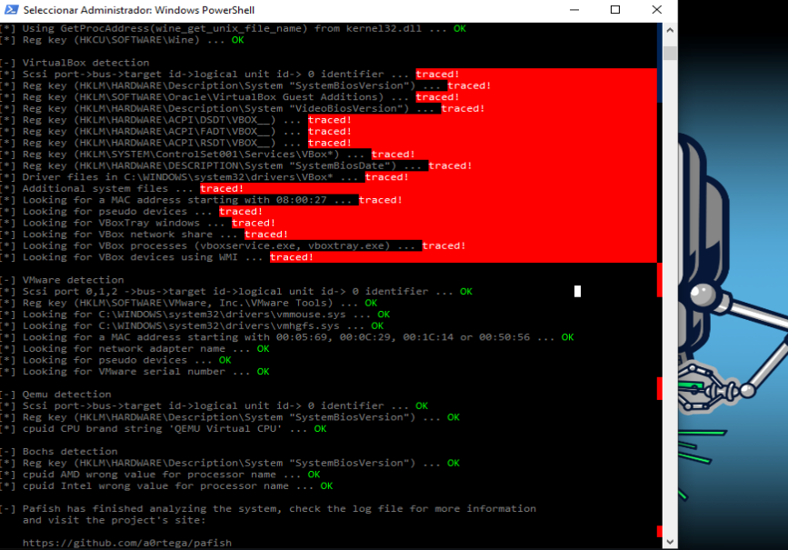


Tras instalar `FLARE-VM` y volver a ejecutar `Pafish`, no se observa un incremento significativo de las detecciones atribuible directamente a `FLARE-VM`. El entorno continúa siendo identificado principalmente como una máquina virtual `VirtualBox` mediante indicadores de `CPU/CPUID`, claves de registro, drivers, servicios, procesos, `MAC address`, dispositivos y artefactos `WMI` asociados a `VirtualBox Guest Additions`.

La instalación de herramientas de análisis no provoca por sí misma una detección de depurador, ya que las comprobaciones `IsDebuggerPresent` y `BeingDebugged` continúan devolviendo resultado negativo. Las diferencias más relevantes respecto a la ejecución previa se concentran en indicadores genéricos de sandbox, especialmente el uptime mediante `GetTickCount()` y ciertas pruebas de interacción humana.

Por tanto, `Pafish` permite confirmar que la exposición del laboratorio no depende exclusivamente de las herramientas instaladas, sino sobre todo de la capa de virtualización y de los artefactos persistentes del entorno.


## Renombramos pafish y lo situamos en el directorio raíz

Esta prueba sí ha activado una detección de filesystem. Hemos realizado los siguientes cambios:
```bash
Rename-Item .\pafish64.exe sample.exe
mkdir C:\analysis
copy .\sample.exe C:\analysis\
cd C:\analysis
.\sample.exe
```

Por tanto, Pafish se está ejecutando como:
```bash
C:\analysis\sample.exe
```


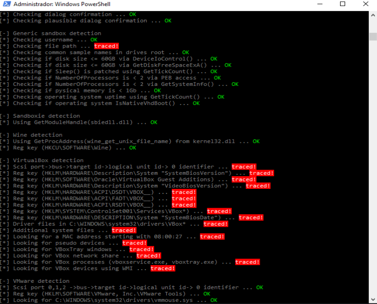


Al renombrar el binario como `sample.exe` y ejecutarlo desde la ruta `C:\analysis\`, `Pafish` modifica el resultado de la comprobación `Checking file path`, que pasa de `OK` en la ejecución desde el escritorio a `traced!` en la nueva ejecución. Esto indica que la herramienta identifica rutas asociadas al análisis de malware como un posible artefacto de laboratorio.

Sin embargo, la comprobación `Checking common sample names in drives root` continúa devolviendo `OK`, lo que sugiere que `Pafish` no está detectando el nombre `sample.exe` en este caso concreto porque el binario no se encuentra directamente en la raíz del disco, sino dentro del directorio `C:\analysis\`.


## Ejecutamos pafish desde el escritorio

Ejecutamos:
```bash
cd C:\Users\usuario\Desktop\
.\sample.exe
```

Y Pafish marca:
```bash
Checking file path ... traced!
```

mientras que:
```bash
Checking common sample names in drives root ... OK
```

Esto demuestra que el nombre `sample.exe` por sí solo ya activa la detección `Checking file path`, incluso estando en una ruta normal como el escritorio. Con esta nueva prueba ya sabemos que `sample.exe` es suficiente para activar la detección.


## VM virtualbox sin sanitizar para análisis dinámico con x64dbg


Vamos a anlizar las técnicas de filesystem en pafish con x64dbg en una MV sin sanitizar. Tenemos dos objetivos:
- Ver si detecta VM.
- Trazar exactamente qué artefactos de sistema de archivos consulta, mediante qué API y qué condición convierte el resultado en detección.


# 1. Eliminamos el artefacto Virtual Guest Additions

En Panel de Control desinstalamos `Virtual Guest Additions` y luego en powershell comprobamos:
```bash
Get-ChildItem "C:\Windows\System32\drivers\VBox*" -Force -ErrorAction SilentlyContinue
Get-ChildItem "C:\Windows\System32" -Filter "VBox*" -Force -ErrorAction SilentlyContinue
Get-ChildItem "C:\Windows\SysWOW64" -Filter "VBox*" -Force -ErrorAction SilentlyContinue
Get-ChildItem "C:\Program Files\Oracle\VirtualBox Guest Additions" -Force -ErrorAction SilentlyContinue
```


Ahora volvemos a ejecutar `Pafish`:


En esta nueva captura observamos:
```bash
...
Driver files in C:\WINDOWS\system32\drivers\VBox* ... OK
Additional system files ... OK
Looking for VBoxTray windows ... OK
...
```

Eso confirma que al desinstalar `Guest Additions` y volver a ejecutar `Pafish` ya no detecta esos drivers de `VBox`. Ahora `Pafish` detecta otros vectores:
| Detección que sigue activa                 | Tipo                                  |
| ------------------------------------------ | ------------------------------------- |
| `hypervisor bit in cpuid feature bits`     | CPU / CPUID                           |
| `cpuid hypervisor vendor ... VBoxVBoxVBox` | CPU / hipervisor                      |
| `SCSI ... identifier`                      | Identificador de disco/controladora   |
| `SystemBiosVersion`                        | BIOS / DMI                            |
| `VideoBiosVersion`                         | BIOS de vídeo                         |
| `ACPI\DSDT\VBOX__`, `FADT`, `RSDT`         | ACPI                                  |
| `SystemBiosDate`                           | BIOS                                  |
| MAC `08:00:27`                             | Red                                   |
| `VirtualBox Guest Additions` en registro   | Registro residual                     |
| `VBox devices using WMI`                   | WMI / dispositivos virtuales          |
| `mouse click`, `double click`, `uptime`    | Interacción humana / sandbox genérico |


# 2. Limpiar el registro residual de Guest Additions

Pafish todavía marca:

```bash
Reg key (HKLM\SOFTWARE\Oracle\VirtualBox Guest Additions) ... traced!
```
Dentro de la VM, en PowerShell como administrador, comprobamos primero:
```bash
reg query "HKLM\SOFTWARE\Oracle" /s
reg query "HKLM\SOFTWARE\WOW6432Node\Oracle" /s
```


Exportamos antes de borrar:
```bash
reg export "HKLM\SOFTWARE\Oracle" "$env:USERPROFILE\Desktop\oracle_reg_backup.reg" /y
```

Después eliminamos sólo la clave residual de `Guest Additions`:
```bash
reg delete "HKLM\SOFTWARE\Oracle\VirtualBox Guest Additions" /f
reg delete "HKLM\SOFTWARE\WOW6432Node\Oracle\VirtualBox Guest Additions" /f
```

Reiniciamos y volvemos a pasar Pafish. Esa detección concreta debería pasar a OK:


Ahora mismo quedan estos indicadores:
| Detección Pafish                                                       | Familia / tipo de artefacto                          | Qué está midiendo realmente                                                                                                  | Origen probable                                                                                                         | Dificultad de mitigación |
| ---------------------------------------------------------------------- | ---------------------------------------------------- | ---------------------------------------------------------------------------------------------------------------------------- | ----------------------------------------------------------------------------------------------------------------------- | ------------------------ |
| `Difference between CPU timestamp counters ... traced!`                | Timing / CPU / virtualización                        | Diferencias anómalas en los contadores de tiempo de CPU mediante `RDTSC`, especialmente cuando se fuerza una salida de la VM | Latencia introducida por el hipervisor al gestionar ciertas instrucciones o eventos                                     | Alta                     |
| `Hypervisor bit in cpuid feature bits ... traced!`                     | CPU / CPUID                                          | Presencia del bit de hipervisor en las características expuestas por la CPU virtual                                          | VirtualBox informa al sistema invitado de que se ejecuta sobre un hipervisor                                            | Alta                     |
| `Checking mouse movement ... traced!`                                  | Interacción humana / sandbox genérico                | Ausencia o insuficiencia de movimiento natural del ratón                                                                     | Entorno poco interactivo, recién iniciado o usado de forma artificial                                                   | Baja                     |
| `Using GetTickCount ... traced!`                                       | Timing / uptime / sandbox genérico                   | Tiempo de actividad del sistema demasiado bajo o sospechoso                                                                  | VM recién arrancada o entorno de análisis automatizado                                                                  | Baja                     |
| `SCSI port->bus->target id->logical unit id->0 identifier ... traced!` | Almacenamiento / identificador de disco-controladora | Identificador del disco, bus o dispositivo de almacenamiento virtual                                                         | Valores expuestos por VirtualBox en la controladora/disco virtual, por ejemplo modelo o identificador asociado a `VBOX` | Media                    |
| `SystemBiosVersion ... traced!`                                        | BIOS / SMBIOS / DMI                                  | Versión de BIOS presentada al sistema operativo                                                                              | Valores DMI generados por VirtualBox                                                                                    | Media                    |
| `VideoBiosVersion ... traced!`                                         | BIOS de vídeo / adaptador gráfico virtual            | Versión o identificador de la BIOS gráfica virtual                                                                           | Adaptador gráfico virtual de VirtualBox                                                                                 | Alta                     |
| `ACPI\DSDT\VBOX__ ... traced!`                                         | ACPI / firmware virtual                              | Tabla ACPI DSDT con identificador `VBOX__`                                                                                   | Tablas ACPI generadas por VirtualBox durante el arranque                                                                | Muy alta                 |
| `ACPI\FADT\VBOX__ ... traced!`                                         | ACPI / firmware virtual                              | Tabla ACPI FADT con identificador `VBOX__`                                                                                   | Tablas ACPI generadas por VirtualBox durante el arranque                                                                | Muy alta                 |
| `ACPI\RSDT\VBOX__ ... traced!`                                         | ACPI / firmware virtual                              | Tabla ACPI RSDT con identificador `VBOX__`                                                                                   | Tablas ACPI generadas por VirtualBox durante el arranque                                                                | Muy alta                 |
| `SystemBiosDate ... traced!`                                           | BIOS / SMBIOS / DMI                                  | Fecha de BIOS presentada al sistema invitado                                                                                 | Valor DMI/SMBIOS propio o típico de VirtualBox                                                                          | Media                    |
| `MAC 08:00:27 ... traced!`                                             | Red / identificador de adaptador                     | Dirección MAC con prefijo típico de VirtualBox                                                                               | OUI `08:00:27`, asociado comúnmente a adaptadores de red VirtualBox                                                     | Baja                     |
| `VBox devices using WMI ... traced!`                                   | WMI / dispositivos virtuales                         | Dispositivos expuestos por Windows Management Instrumentation con referencias a VirtualBox/VBox                              | Hardware virtual, ACPI, adaptadores o dispositivos enumerados por el sistema invitado                                   | Media-alta               |


Tras desinstalar `VirtualBox Guest Additions` y eliminar las claves de registro, Pafish deja de detectar drivers, ficheros adicionales, procesos y servicios asociados a Guest Additions. Sin embargo, el entorno continúa siendo identificable mediante indicadores situados en capas más profundas del sistema, como `CPUID`, `timing`, `BIOS/DMI`, `ACPI`, identificadores de almacenamiento, `dirección MAC` y dispositivos expuestos mediante `WMI`.

Esto demuestra que la eliminación de `Guest Additions` reduce de forma efectiva la huella en `filesystem`, pero no elimina la detección de `VirtualBox` como entorno virtualizado. La identificación ya no depende de archivos `VBox*` en disco, sino de información generada por el propio hipervisor y presentada al sistema operativo durante el arranque.


# 3. Eliminar el artefacto `Difference between CPU timestamp counters ... traced!`

Ese indicador pertenece a la técnica `timing / CPU`, no a filesystem. `Pafish` usa `RDTSC` para medir diferencias de tiempo muy pequeñas. En una `VM` esas diferencias pueden delatar al hipervisor, sobre todo si la prueba fuerza una `VM exit`.

Primero, distinguimos estas dos líneas:
```bash
Checking the difference between CPU timestamp counters (rdtsc) ... traced!
Checking the difference between CPU timestamp counters (rdtsc) forcing VM exit ... traced!
```

La segunda es bastante más difícil de eliminar, porque `Pafish` provoca una transición al hipervisor y mide la latencia. Aun así, en `VirtualBox` hay una mitigación oficial que merece probar: `TSCTiedToExecution`.


```bash
└─$ VBoxManage list vms
"Win10-Pro-FlareVM" {7f2d9582-c734-4f6a-8305-39059fafe2da}
```

Dejamos la VM con una sola vCPU, evitamos limitar artificialmente el tiempo de CPU, mantenemos nested paging activado, y desactivamos el proveedor de paravirtualización expuesto al sistema invitado.
```bash
VBoxManage modifyvm "Win10-Pro-FlareVM" --cpus 1
VBoxManage modifyvm "Win10-Pro-FlareVM" --cpuexecutioncap 100
VBoxManage modifyvm "Win10-Pro-FlareVM" --nestedpaging on
VBoxManage modifyvm "Win10-Pro-FlareVM" --paravirtprovider none
```

Arrancamos la VM y pasamos Pafish:


La configuración aplicada reduce con éxito la exposición de `CPUID` y elimina la detección básica mediante `RDTSC`. Sin embargo, la prueba que fuerza una `VM exit` sigue detectando virtualización. Además, al configurar la `VM` con una sola `vCPU`, `Pafish` activa nuevas detecciones genéricas de sandbox basadas en el bajo número de procesadores.


Cambiamos únicamente el número de `CPUs` a `2` y dejamos el resto igual:
```bash
VBoxManage modifyvm "Win10-Pro-FlareVM" --cpus 2
VBoxManage modifyvm "Win10-Pro-FlareVM" --cpuexecutioncap 100
VBoxManage modifyvm "Win10-Pro-FlareVM" --nestedpaging on
VBoxManage modifyvm "Win10-Pro-FlareVM" --paravirtprovider none
```


Hemos solucionado el problema nuevo que apareció con `1 vCPU`, pero ha reaparecido la detección básica por `RDTSC`.

Esto indica que el indicador `RDTSC` es sensible a la configuración de `CPU` virtual. Al usar `1 vCPU` se reduce la variabilidad entre contadores o planificación de `CPU`, pero se genera una configuración hardware poco realista. Al usar `2 vCPU`, la máquina parece más normal para las pruebas de procesadores, pero vuelve a aparecer la anomalía temporal.


Intentamos reducir RDTSC: Con la maquina virtual apagada -->
```bash
governor del host en performance,  
afinidad del proceso con taskset,  
2 vCPU para evitar NumberOfProcessors < 2,  
paravirtprovider none para reducir exposición CPUID.  
```


```bash
for g in /sys/devices/system/cpu/cpu*/cpufreq/scaling_governor; do
  echo performance | sudo tee "$g" > /dev/null
done
```

```bash
cat /sys/devices/system/cpu/cpu*/cpufreq/scaling_governor
```

```bash
ls /sys/devices/system/cpu/cpu*/cpufreq/energy_performance_preference 2>/dev/null
```

```bash
for e in /sys/devices/system/cpu/cpu*/cpufreq/energy_performance_preference; do
  echo performance | sudo tee "$e" > /dev/null
done
```

```bash
cat /sys/devices/system/cpu/cpu*/cpufreq/energy_performance_preference 2>/dev/null
```

Arrancamos la MV:
```bash
VBoxManage startvm "Win10-Pro-FlareVM" --type gui
```

Fijamos la VM a núcleos concretos del host:
```bash
└─$ pgrep -af "VirtualBoxVM.*Win10-Pro-FlareVM"
165263 /usr/lib/virtualbox/VirtualBoxVM --comment Win10-Pro-FlareVM --startvm 7f2d9582-c734-4f6a-8305-39059fafe2da --no-startvm-errormsgbox
```

Aplicamos `taskset` a ese `PID`. Como tu `VM` está con `2 vCPU`, probamos primero con dos `CPUs` del host:

```bash
└─$ sudo taskset -cp 2,3 165263
pid 165263's current affinity list: 0-31
pid 165263's new affinity list: 2,3
```

Volvemos a pasar Pafish:

xxxxx incluir capturas xxxxx


## Eliminamos: Checking operating system uptime using GetTickCount() ... traced!
No depende de VirtualBox, sino del tiempo que lleva Windows encendido.

GetTickCount() devuelve los milisegundos transcurridos desde que Windows se inició, por lo que `Pafish` puede marcar como sospechoso un sistema recién arrancado o con poco tiempo de uso. Microsoft describe `GetTickCount()` precisamente como una función que devuelve los milisegundos transcurridos desde el inicio del sistema. En el código principal de `Pafish` aparece explícitamente esa comprobación como parte de las detecciones genéricas de `sandbox`.


```bash
[TimeSpan]::FromMilliseconds([Environment]::TickCount64)
```


```bash
while ([Environment]::TickCount64 -lt 1800000) {
    $uptime = [TimeSpan]::FromMilliseconds([Environment]::TickCount64)
    Write-Host "Uptime actual:" $uptime.ToString("hh\:mm\:ss") "- esperando hasta 30 minutos..."
    Start-Sleep -Seconds 60
}

cd C:\Users\usuario\Desktop
.\pafish64.exe
```

La detección `Checking operating system uptime using GetTickCount()` se debe a que `Pafish` interpreta un tiempo de actividad bajo como posible indicador de `sandbox` o entorno automatizado. A diferencia de otros artefactos, esta comprobación no depende de `VirtualBox` ni de `Guest Additions`, sino del tiempo transcurrido desde el inicio de Windows.

Para mitigarla, se mantuvo la máquina virtual encendida durante un periodo prolongado antes de ejecutar `Pafish`. Tras aumentar el `uptime` del sistema, se espera que la comprobación pase de `traced!` a `OK`, evidenciando que se trata de un indicador temporal y no estructural del entorno virtualizado.


## Eliminacion de las Reg key:


En Kali, con la VM apagada:

```bash
VBoxManage snapshot "Win10-Pro-FlareVM" take "antes-regkey-bios-dmi-acpi"
```

Comprobamos si la VM usa `BIOS` o `EFI`
```bash
VBoxManage showvminfo "Win10-Pro-FlareVM" | grep -i firmware
```

Si vemos algo como `Firmware: BIOS`, usamos:
```bash
DEV=pcbios
```

Si vemoss `Firmware: EFI`, usamos:

```bash
DEV=efi
```

Cambiamos `SystemBiosVersion` y `SystemBiosDate`: Ejecutamos en `Kali`, con la VM apagada:
```bash

VM="Win10-Pro-FlareVM"
DEV=pcbios

VBoxManage setextradata "$VM" "VBoxInternal/Devices/$DEV/0/Config/DmiBIOSVendor" "American Megatrends Inc."
VBoxManage setextradata "$VM" "VBoxInternal/Devices/$DEV/0/Config/DmiBIOSVersion" "E7D25IMS.1A0"
VBoxManage setextradata "$VM" "VBoxInternal/Devices/$DEV/0/Config/DmiBIOSReleaseDate" "07/14/2023"

VBoxManage setextradata "$VM" "VBoxInternal/Devices/$DEV/0/Config/DmiSystemVendor" "Micro-Star International Co., Ltd."
VBoxManage setextradata "$VM" "VBoxInternal/Devices/$DEV/0/Config/DmiSystemProduct" "MS-7D25"
VBoxManage setextradata "$VM" "VBoxInternal/Devices/$DEV/0/Config/DmiSystemVersion" "string:1.0"
VBoxManage setextradata "$VM" "VBoxInternal/Devices/$DEV/0/Config/DmiSystemSerial" "string:07D2523M123456"

VBoxManage setextradata "$VM" "VBoxInternal/Devices/$DEV/0/Config/DmiBoardVendor" "Micro-Star International Co., Ltd."
VBoxManage setextradata "$VM" "VBoxInternal/Devices/$DEV/0/Config/DmiBoardProduct" "PRO Z690-A WIFI DDR4"
VBoxManage setextradata "$VM" "VBoxInternal/Devices/$DEV/0/Config/DmiBoardVersion" "string:1.0"
VBoxManage setextradata "$VM" "VBoxInternal/Devices/$DEV/0/Config/DmiBoardSerial" "string:MB123456789"

VBoxManage setextradata "$VM" "VBoxInternal/Devices/$DEV/0/Config/DmiChassisVendor" "Micro-Star International Co., Ltd."
VBoxManage setextradata "$VM" "VBoxInternal/Devices/$DEV/0/Config/DmiChassisType" 3
VBoxManage setextradata "$VM" "VBoxInternal/Devices/$DEV/0/Config/DmiChassisVersion" "string:1.0"
VBoxManage setextradata "$VM" "VBoxInternal/Devices/$DEV/0/Config/DmiChassisSerial" "string:CH123456789"

VBoxManage setextradata "$VM" "VBoxInternal/Devices/$DEV/0/Config/DmiOEMVBoxVer" "<EMPTY>"
VBoxManage setextradata "$VM" "VBoxInternal/Devices/$DEV/0/Config/DmiOEMVBoxRev" "<EMPTY>"
```

El prefijo `string`: es importante cuando el valor puede interpretarse como número. Oracle advierte que algunos parámetros `DMI` deben tratarse como cadenas y que, si parecen numéricos, conviene forzarlos como `string` para evitar errores de arranque.

Comprobamos que se han guardado:
```bash
VBoxManage getextradata "$VM" enumerate | grep -i Dmi
```

Arrancamos la MV Windows y verificamos los valores:

```bash
Get-CimInstance Win32_BIOS | Format-List Manufacturer,SMBIOSBIOSVersion,ReleaseDate
Get-CimInstance Win32_ComputerSystem | Format-List Manufacturer,Model
Get-CimInstance Win32_BaseBoard | Format-List Manufacturer,Product,Version,SerialNumber
```

Y revisamos directamente el registro:

```bash
reg query "HKLM\HARDWARE\DESCRIPTION\System" /v SystemBiosVersion
reg query "HKLM\HARDWARE\DESCRIPTION\System" /v SystemBiosDate
reg query "HKLM\HARDWARE\DESCRIPTION\System" /v VideoBiosVersion
```


```bash
$k = "HKLM:\HARDWARE\DESCRIPTION\System"

New-ItemProperty -Path $k -Name "SystemBiosVersion" -PropertyType MultiString -Value @("American Megatrends Inc.", "E7D25IMS.1A0") -Force

New-ItemProperty -Path $k -Name "SystemBiosDate" -PropertyType String -Value "07/14/2023" -Force

New-ItemProperty -Path $k -Name "VideoBiosVersion" -PropertyType MultiString -Value @("American Megatrends Inc. VGA BIOS", "Version 1.0") -Force
```


```bash
reg query "HKLM\HARDWARE\DESCRIPTION\System" /v SystemBiosVersion
reg query "HKLM\HARDWARE\DESCRIPTION\System" /v SystemBiosDate
reg query "HKLM\HARDWARE\DESCRIPTION\System" /v VideoBiosVersion
```


## Quitar la detección de MAC 08:00:27

```bash
Looking for a MAC address starting with 08:00:27 ... traced!
```

En Kali, con la VM apagada:
```bash
VM="Win10-Pro-FlareVM"

VBoxManage modifyvm "$VM" --macaddress1 001A2B3C4D5E
```

Arrancamos Windows y comprobamos:
```bash
getmac /v
```

Debe desaparecer cualquier `MAC` que empiece por:
```bash
08-00-27
```

Luego volvemos a pasar `Pafish`. Esa línea debería pasar a `OK`:


## Sobre las claves ACPI VBOX__


```bash
HKLM\HARDWARE\ACPI\DSDT\VBOX__
HKLM\HARDWARE\ACPI\FADT\VBOX__
HKLM\HARDWARE\ACPI\RSDT\VBOX__
```

Pafish no comprueba un valor dentro de esas claves: comprueba si la clave existe.

Podemos hacer una prueba controlada eliminándolas en la sesión actual. Primero exportamos:

```bash
reg export "HKLM\HARDWARE\ACPI" "$env:USERPROFILE\Desktop\hardware_acpi_before.reg" /y
```

Luego probamos:

```bash
Remove-Item "HKLM:\HARDWARE\ACPI\DSDT\VBOX__" -Recurse -Force -ErrorAction SilentlyContinue
Remove-Item "HKLM:\HARDWARE\ACPI\FADT\VBOX__" -Recurse -Force -ErrorAction SilentlyContinue
Remove-Item "HKLM:\HARDWARE\ACPI\RSDT\VBOX__" -Recurse -Force -ErrorAction SilentlyContinue
```

Verificamos:

```bash
Test-Path "HKLM:\HARDWARE\ACPI\DSDT\VBOX__"
Test-Path "HKLM:\HARDWARE\ACPI\FADT\VBOX__"
Test-Path "HKLM:\HARDWARE\ACPI\RSDT\VBOX__"
```

Como devuelven `False`, volvemos a ejecutar `Pafish`:


## Identificar exactamente qué SCSI está detectando Pafish

Antes de cambiar el disco, localizamos dentro de Windows qué valor contiene VBOX.
```bash
Get-ChildItem "HKLM:\HARDWARE\DEVICEMAP\Scsi" -Recurse |
ForEach-Object {
    try {
        $p = Get-ItemProperty $_.PSPath -ErrorAction SilentlyContinue
        if ($p.Identifier -match "VBOX|VirtualBox|Oracle") {
            [PSCustomObject]@{
                Path       = $_.Name
                Identifier = $p.Identifier
            }
        }
    } catch {}
} | Format-List
```

También podemos usar:

```bash
reg query "HKLM\HARDWARE\DEVICEMAP\Scsi" /s | findstr /i "VBOX VirtualBox Oracle Identifier"

```
Esto nos dirá si `Pafish` está detectando algo como:

```bash
VBOX HARDDISK
VBOX CD-ROM
VirtualBox
```

Este paso es importante porque a veces no lo provoca el disco duro, sino la unidad óptica virtual.


Hay que tratar dos artefactos distintos:
| Artefacto           | Detección             | Mitigación                                                                |
| ------------------- | --------------------- | ------------------------------------------------------------------------- |
| `VBOX CD-ROM 1.0`   | Unidad óptica virtual | Desmontar/eliminar CD-ROM virtual o cambiar ATAPI vendor/product/revision |
| `VBOX HARDDISK 1.0` | Disco duro virtual    | Cambiar VPD del disco: modelo, serie y firmware                           |


**Ver la configuración real de almacenamiento:**

Con la VM apagada, en Kali:

```bash
└─$ VM="Win10-Pro-FlareVM"
                                                                                                                                                                                        
└─$ VBoxManage showvminfo "$VM" | sed -n '/Storage/,/NIC/p'
Storage Controllers:
#0: 'SATA', Type: IntelAhci, Instance: 0, Ports: 4 (max 30), Bootable
  Port 0, Unit 0: UUID: c0622126-2de6-470c-a872-2fc2cc85adb7
    Location: "/home/xxniwexx/VirtualBox VMs/VBoxGuestAdditions_7.1.0_BETA2.iso"
  Port 1, Unit 0: UUID: 45fc5f7a-64ef-4338-9f07-68eec821bbf0
    Location: "/home/xxniwexx/VirtualBox VMs/Win10-Pro-FlareVM/Snapshots/{45fc5f7a-64ef-4338-9f07-68eec821bbf0}.vdi"
NIC 1:                       MAC: 001A2B3C4D5E, Attachment: NAT, Cable connected: on, Trace: off (file: none), Type: 82540EM, Reported speed: 0 Mbps, Boot priority: 0, Promisc Policy: deny, Bandwidth group: none

```

Así que tenemos que hacer dos cosas:
- Desmontar el `ISO` de `Guest Additions` del `Port 0`.
- Cambiar los identificadores `VPD` del disco en `Port 1`.


Apagamos la MV y desmontamos el `ISO` de `Guest Additions` ➞ ➞ ➞ Mi `ISO` está en `SATA Port 0`, así que ejecutamos:
```bash
VM="Win10-Pro-FlareVM"

VBoxManage storageattach "$VM" \
  --storagectl "SATA" \
  --port 0 \
  --device 0 \
  --medium none
```

Esto eliminará el artefacto:

```bash
VBOX CD-ROM 1.0
```

Cambiamos los identificadores del disco en `SATA Port 1` ➞ ➞ ➞ Mi disco está en `SATA Port 1`, así que los comandos correctos son con `Port1`, no `Port0`:

```bash
VM="Win10-Pro-FlareVM"

VBoxManage setextradata "$VM" "VBoxInternal/Devices/ahci/0/Config/Port1/SerialNumber" "S6PZNX0T123456A"
VBoxManage setextradata "$VM" "VBoxInternal/Devices/ahci/0/Config/Port1/FirmwareRevision" "SVT02B6Q"
VBoxManage setextradata "$VM" "VBoxInternal/Devices/ahci/0/Config/Port1/ModelNumber" "Samsung SSD 870 EVO 500GB"
```

Comprobamos que se han guardado:

```bash
└─$ VBoxManage getextradata "$VM" enumerate | grep -i "Port1"

Key: VBoxInternal/Devices/ahci/0/Config/Port1/FirmwareRevision, Value: SVT02B6Q
Key: VBoxInternal/Devices/ahci/0/Config/Port1/ModelNumber, Value: Samsung SSD 870 EVO 500GB
Key: VBoxInternal/Devices/ahci/0/Config/Port1/SerialNumber, Value: S6PZNX0T123456A
```


Arrancamos la VM y verificamos en Windows en PowerShell como administrador:
```bash
Get-CimInstance Win32_DiskDrive | Format-List Model,SerialNumber,FirmwareRevision,PNPDeviceID
```

Después revisamos directamente el registro que usa `Pafish`:

```bash
reg query "HKLM\HARDWARE\DEVICEMAP\Scsi" /s | findstr /i "VBOX VirtualBox Oracle Identifier"
```
Lo ideal es que ya no aparezcan:
```bash
VBOX CD-ROM
VBOX HARDDISK
```

Volvemos a ejecutar `Pafish`.


xxxxx Añadir captura xxxxx


## WMI: localizar qué dispositivo sigue delatando VirtualBox

Para esta línea:

```bash
Looking for VBox devices using WMI ... traced!
```

ejecutamos dentro de Windows:
```bash
Get-CimInstance Win32_PnPEntity |
Where-Object {
    $_.Name -match "VBox|VirtualBox|Oracle" -or
    $_.DeviceID -match "VBox|VirtualBox|Oracle" -or
    $_.PNPDeviceID -match "VBox|VirtualBox|Oracle"
} |
Select-Object Name, DeviceID, PNPDeviceID |
Format-List
```

xxx
```bash
Get-PnpDevice |
Where-Object {
    $_.InstanceId -match "VEN_80EE|DEV_CAFE|VirtualBox|VBox|Oracle"
} |
Format-List Status,Class,FriendlyName,InstanceId
```

Si WMI sigue mostrando VBOX, normalmente vendrá de ACPI, almacenamiento, vídeo o dispositivos virtuales. Por eso conviene corregir primero MAC y SCSI, y luego repetir la consulta WMI.

## Conseguimos

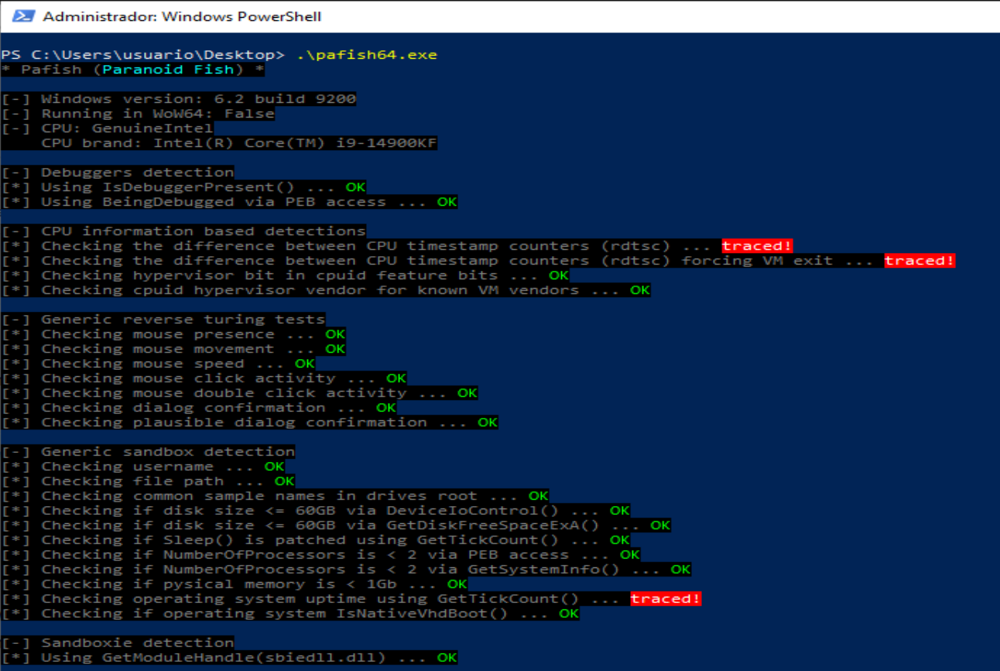

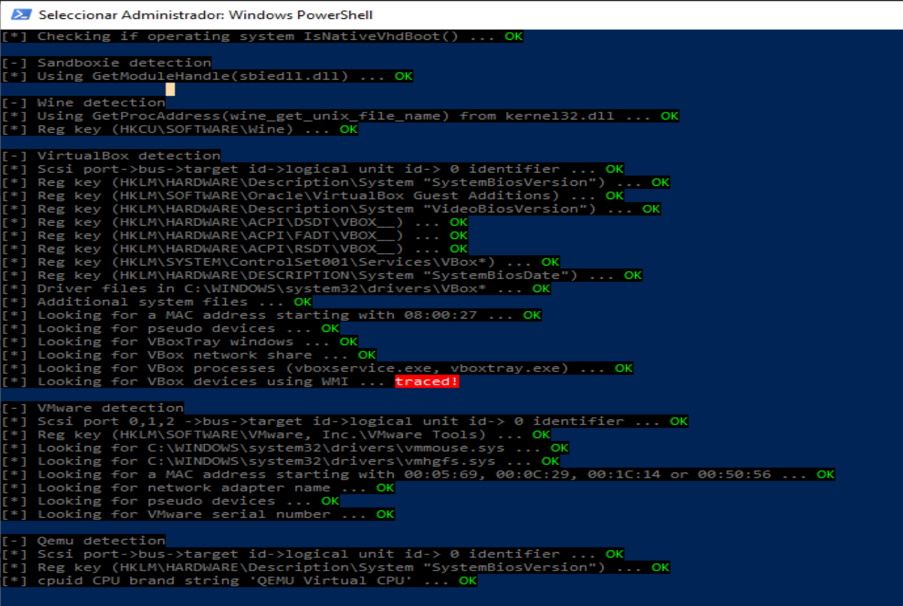


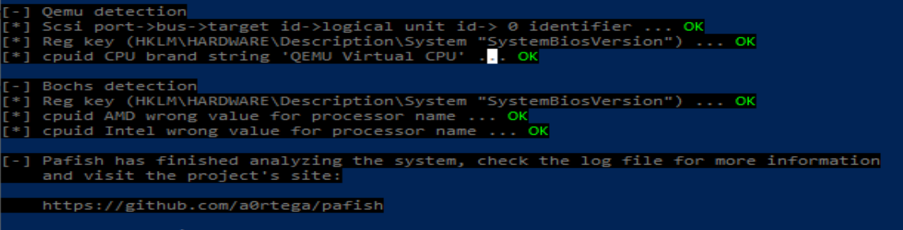


## Volvemos a intentar eliminar WMI

Creamos un backup de evidencia. Dentro de Windows, PowerShell como administrador:

```bash
Get-PnpDevice |
Where-Object {
    $_.InstanceId -match "VEN_80EE|DEV_CAFE|DEV_BEEF|VEN_VBOX|VirtualBox|VBox|Oracle"
} |
Format-List Status,Class,FriendlyName,InstanceId |
Out-File "$env:USERPROFILE\Desktop\pnp_vbox_before.txt"
```

Eliminamos primero las entradas SCSI residuales. Ejecutamos:

```bash
$stale = Get-PnpDevice |
Where-Object {
    $_.InstanceId -match "SCSI\\CDROM&VEN_VBOX|SCSI\\DISK&VEN_VBOX"
}

$stale | Format-List Status,Class,FriendlyName,InstanceId
```

Luego las eliminamos:
```bash
$stale | ForEach-Object {
    pnputil /remove-device "$($_.InstanceId)"
}
```

Después comprobamos:
```bash
Get-PnpDevice |
Where-Object {
    $_.InstanceId -match "SCSI\\CDROM&VEN_VBOX|SCSI\\DISK&VEN_VBOX"
} |
Format-List Status,Class,FriendlyName,InstanceId
```

Lo ideal es que no devuelva nada.


Eliminamos VirtualBox Guest Device. Este es el más importante para Pafish:

```bash
PCI\VEN_80EE&DEV_CAFE...
```

Primero lo localizamos:

```bash
$guest = Get-PnpDevice |
Where-Object {
    $_.InstanceId -match "PCI\\VEN_80EE&DEV_CAFE"
}

$guest | Format-List Status,Class,FriendlyName,InstanceId
```

Lo deshabilitamos:

```bash
$guest | Disable-PnpDevice -Confirm:$false

```
Después intentamos eliminarlo:

```bash
$guest | ForEach-Object {
    pnputil /remove-device "$($_.InstanceId)"
}
```

Comprobamos si sigue apareciendo:

```bash
Get-CimInstance Win32_PnPEntity |
Where-Object {
    $_.DeviceID -match "VEN_80EE|DEV_CAFE|VirtualBox|VBox|Oracle"
} |
Select-Object Name, Manufacturer, PNPClass, Status, Service, DeviceID |
Format-List
```

............

Después ejecutamos Pafish.

Si desaparece PCI\VEN_80EE&DEV_CAFE, la línea:

Looking for VBox devices using WMI ...

debería pasar a OK.


Si vuelve a aparecer tras reiniciar

Es probable que VirtualBox Guest Device vuelva a enumerarse tras reiniciar, porque no es un simple driver residual: es un dispositivo PCI que VirtualBox presenta al sistema invitado.

En ese caso, tienes dos opciones:

Opción A: mitigación temporal antes de ejecutar Pafish

Crear un script que elimine el dispositivo justo antes de lanzar Pafish:

@'
$targets = Get-PnpDevice |
Where-Object {
    $_.InstanceId -match "PCI\\VEN_80EE&DEV_CAFE|SCSI\\CDROM&VEN_VBOX|SCSI\\DISK&VEN_VBOX"
}

foreach ($d in $targets) {
    try {
        Disable-PnpDevice -InstanceId $d.InstanceId -Confirm:$false -ErrorAction SilentlyContinue
        pnputil /remove-device "$($d.InstanceId)"
    } catch {}
}

Start-Sleep -Seconds 2
Start-Process "C:\Users\usuario\Desktop\pafish64.exe"
'@ | Set-Content "C:\Users\usuario\Desktop\run-pafish-clean-wmi.ps1" -Encoding UTF8

Ejecutarlo como administrador:

powershell.exe -ExecutionPolicy Bypass -File "C:\Users\usuario\Desktop\run-pafish-clean-wmi.ps1"


-----


## Parcheos manuales
Vamos a realizar un wrapper antes de ejecutar Pafish. Como Pafish consulta esos valores en el momento de ejecución, podemos crear un script que primero parchea la MV para que no detecte los artefactos:
```bash

@'
$k = "HKLM:\HARDWARE\DESCRIPTION\System"

Remove-ItemProperty -Path $k -Name "SystemBiosVersion" -ErrorAction SilentlyContinue
Remove-ItemProperty -Path $k -Name "SystemBiosDate" -ErrorAction SilentlyContinue
Remove-ItemProperty -Path $k -Name "VideoBiosVersion" -ErrorAction SilentlyContinue

New-ItemProperty -Path $k -Name "SystemBiosVersion" -PropertyType MultiString -Value @("American Megatrends Inc.", "E7D25IMS.1A0") -Force | Out-Null
New-ItemProperty -Path $k -Name "SystemBiosDate" -PropertyType String -Value "07/14/2023" -Force | Out-Null
New-ItemProperty -Path $k -Name "VideoBiosVersion" -PropertyType MultiString -Value @("American Megatrends Inc. VGA BIOS", "Version 1.0") -Force | Out-Null

Start-Process "C:\Users\usuario\Desktop\pafish64.exe"
'@ | Set-Content "C:\Users\usuario\Desktop\run-pafish-hardened.ps1" -Encoding UTF8
```

Y lo ejecutamoss como administrador:

```bash
.\run-pafish-hardened.ps1
```

Esta opción garantiza que los valores estén corregidos justo antes de lanzar Pafish.


Aunque los valores `DMI` modificados mediante `VBoxManage setextradata `se reflejaron correctamente en `WMI`, `Pafish` seguía detectando `VirtualBox` porque consultaba directamente los valores `SystemBiosVersion`, `SystemBiosDate` y `VideoBiosVersion` bajo `HKLM\HARDWARE\DESCRIPTION\System`.

Esta rama del registro es volátil y se reconstruye en cada arranque a partir de la información proporcionada por el entorno virtual. Por ello, la modificación manual no persiste tras reiniciar. Como mitigación práctica, se creó una tarea programada con privilegios de `SYSTEM` que reescribe dichos valores al inicio de Windows y al inicio de sesión, evitando que `Pafish` encuentre las cadenas asociadas a `VirtualBox`.


--------------

Script de sanitización al arranque que reescriba los valores volátiles y limpie los dispositivos WMI/PnP antes de que ejecutes Pafish.

Bloque completo en PowerShell como administrador dentro de la VM.
```bash
New-Item -Path "PafishHardening" -ItemType Directory -Force | Out-Null

@'
# sanitize-vm-artifacts.ps1
# Reaplica cambios volátiles tras cada arranque de Windows.

$Log = "PafishHardening\sanitize-log.txt"

function Write-Log {
    param([string]$Message)
    "[$(Get-Date -Format 'yyyy-MM-dd HH:mm:ss')] $Message" | Out-File $Log -Append -Encoding UTF8
}

Write-Log "Inicio de sanitización"

# Espera para que Windows termine de reconstruir HKLM\HARDWARE y PnP/WMI
Start-Sleep -Seconds 25

# 1. Sanitizar HKLM:\HARDWARE\DESCRIPTION\System
try {
    $k = "HKLM:\HARDWARE\DESCRIPTION\System"

    Remove-ItemProperty -Path $k -Name "SystemBiosVersion" -ErrorAction SilentlyContinue
    Remove-ItemProperty -Path $k -Name "SystemBiosDate" -ErrorAction SilentlyContinue
    Remove-ItemProperty -Path $k -Name "VideoBiosVersion" -ErrorAction SilentlyContinue

    New-ItemProperty -Path $k -Name "SystemBiosVersion" -PropertyType MultiString -Value @("American Megatrends Inc.", "E7D25IMS.1A0") -Force | Out-Null
    New-ItemProperty -Path $k -Name "SystemBiosDate" -PropertyType String -Value "07/14/2023" -Force | Out-Null
    New-ItemProperty -Path $k -Name "VideoBiosVersion" -PropertyType MultiString -Value @("American Megatrends Inc. VGA BIOS", "Version 1.0") -Force | Out-Null

    Write-Log "DESCRIPTION\System sanitizado"
}
catch {
    Write-Log "Error sanitizando DESCRIPTION\System: $($_.Exception.Message)"
}

# 2. Eliminar claves ACPI VBOX__ generadas en HKLM:\HARDWARE
try {
    $acpiKeys = @(
        "HKLM:\HARDWARE\ACPI\DSDT\VBOX__",
        "HKLM:\HARDWARE\ACPI\FADT\VBOX__",
        "HKLM:\HARDWARE\ACPI\RSDT\VBOX__"
    )

    foreach ($key in $acpiKeys) {
        if (Test-Path $key) {
            Remove-Item $key -Recurse -Force -ErrorAction SilentlyContinue
            Write-Log "Eliminada clave ACPI: $key"
        }
    }
}
catch {
    Write-Log "Error eliminando claves ACPI: $($_.Exception.Message)"
}

# 3. Limpiar dispositivos PnP/WMI que delatan VirtualBox
# No se elimina DEV_BEEF porque suele corresponder al adaptador gráfico y puede romper la sesión visual.
try {
    $patterns = @(
        "PCI\\VEN_80EE&DEV_CAFE",
        "SCSI\\CDROM&VEN_VBOX",
        "SCSI\\DISK&VEN_VBOX"
    )

    foreach ($pattern in $patterns) {
        $devices = Get-PnpDevice -ErrorAction SilentlyContinue |
            Where-Object { $_.InstanceId -match $pattern }

        foreach ($dev in $devices) {
            Write-Log "Dispositivo encontrado: $($dev.FriendlyName) - $($dev.InstanceId)"

            try {
                Disable-PnpDevice -InstanceId $dev.InstanceId -Confirm:$false -ErrorAction SilentlyContinue
                Write-Log "Dispositivo deshabilitado: $($dev.InstanceId)"
            }
            catch {
                Write-Log "No se pudo deshabilitar: $($dev.InstanceId)"
            }

            try {
                pnputil /remove-device "$($dev.InstanceId)" | Out-File $Log -Append -Encoding UTF8
                Write-Log "Intento de eliminación PnP: $($dev.InstanceId)"
            }
            catch {
                Write-Log "No se pudo eliminar con pnputil: $($dev.InstanceId)"
            }
        }
    }
}
catch {
    Write-Log "Error limpiando dispositivos PnP/WMI: $($_.Exception.Message)"
}

# 4. Verificación final
try {
    Write-Log "Verificación final DESCRIPTION\System"
    reg query "HKLM\HARDWARE\DESCRIPTION\System" /v SystemBiosVersion | Out-File $Log -Append -Encoding UTF8
    reg query "HKLM\HARDWARE\DESCRIPTION\System" /v SystemBiosDate | Out-File $Log -Append -Encoding UTF8
    reg query "HKLM\HARDWARE\DESCRIPTION\System" /v VideoBiosVersion | Out-File $Log -Append -Encoding UTF8

    Write-Log "Verificación final PnP/WMI"
    Get-PnpDevice -ErrorAction SilentlyContinue |
        Where-Object {
            $_.InstanceId -match "VEN_80EE|DEV_CAFE|VEN_VBOX|VirtualBox|VBox|Oracle"
        } |
        Format-List Status,Class,FriendlyName,InstanceId |
        Out-File $Log -Append -Encoding UTF8
}
catch {
    Write-Log "Error en verificación final: $($_.Exception.Message)"
}

Write-Log "Fin de sanitización"
'@ | Set-Content "PafishHardening\sanitize-vm-artifacts.ps1" -Encoding UTF8
```

Ejecutamos el script:
```bash
powershell.exe -NoProfile -ExecutionPolicy Bypass -File "PafishHardening\sanitize-vm-artifacts.ps1"
```


Después esperamos unos segundos y comprobamos:
```bash
Get-Content "PafishHardening\sanitize-log.txt" -Tail 80
```

**Resultado final de la sanitazación:**
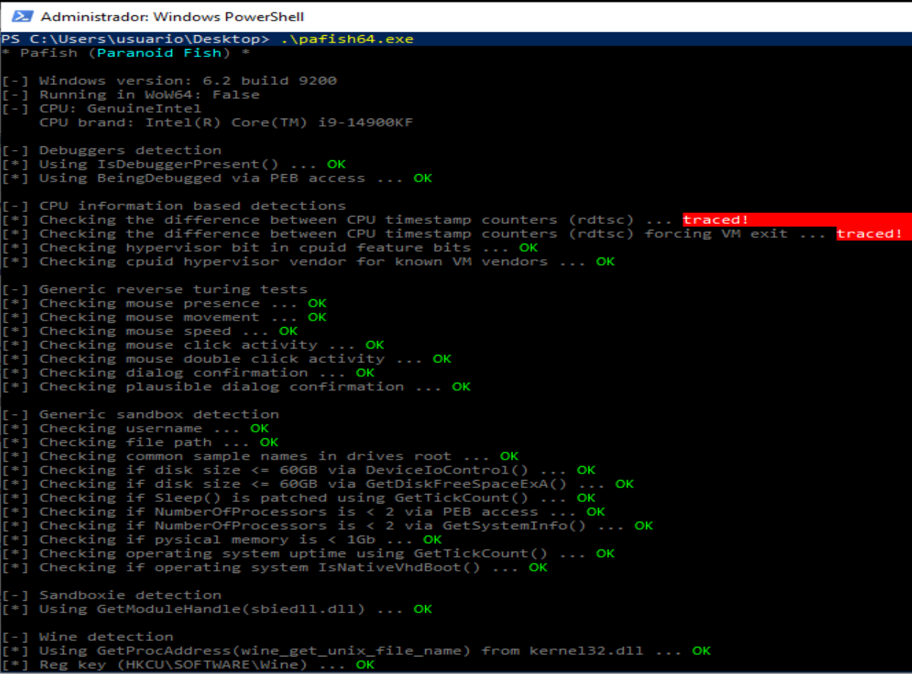

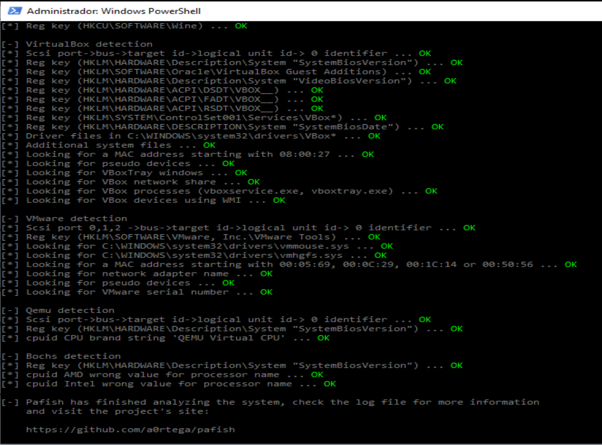


Pero aún nos queda:


Se reintentó la mitigación mediante `VBoxInternal/TM/TSCTiedToExecution`. Aunque en esta ocasión el invitado Windows inició sesión correctamente, Pafish continuó detectando tanto la prueba `RDTSC` básica como la variante que fuerza una `VM-exit`. Esto indica que la opción modifica el comportamiento del contador temporal del invitado, pero no elimina las diferencias de latencia medidas por Pafish.

Por tanto, las detecciones basadas en `RDTSC` se consideran persistentes en VirtualBox estándar. Tras eliminar artefactos de filesystem, registro, BIOS/DMI, ACPI, SCSI, MAC, WMI y CPUID, el vector de timing queda como principal limitación del entorno virtualizado.

