- [9. La técnica Human Interaction](#9-la-técnica-human-interaction)
  - [9.1. Descripción de la técnica Human Interaction](#91-descripción-de-la-técnica-human-interaction)
    - [Diferencia entre Human Interaction y Human-like Behavior](#diferencia-entre-human-interaction-y-human-like-behavior)
    - [Principio de funcionamiento](#principio-de-funcionamiento)
    - [Comportamientos que puede adoptar el malware](#comportamientos-que-puede-adoptar-el-malware)
    - [Ventajas para el malware](#ventajas-para-el-malware)
    - [Limitaciones de la técnica](#limitaciones-de-la-técnica)
  - [9.2. Categoría y clasificación](#92-categoría-y-clasificación)
    - [Clasificación principal](#clasificación-principal)
    - [Clasificación en MITRE ATT\&CK](#clasificación-en-mitre-attck)
    - [Clasificación por el tipo de indicador](#clasificación-por-el-tipo-de-indicador)
      - [A. Actividad humana directa](#a-actividad-humana-directa)
      - [B. Rastros históricos de uso](#b-rastros-históricos-de-uso)
      - [C. Calidad o naturalidad de la interacción](#c-calidad-o-naturalidad-de-la-interacción)
    - [Clasificación según su función dentro del malware](#clasificación-según-su-función-dentro-del-malware)
    - [Relación con otras técnicas de evasión](#relación-con-otras-técnicas-de-evasión)
    - [Naturaleza dual de los indicadores](#naturaleza-dual-de-los-indicadores)
  - [9.3. Técnicas de detección basadas en Human Interaction](#93-técnicas-de-detección-basadas-en-human-interaction)
    - [9.3.1. Comprobación del movimiento del ratón](#931-comprobación-del-movimiento-del-ratón)
      - [Indicadores de análisis](#indicadores-de-análisis)
    - [9.3.2. Tiempo desde la última entrada del usuario](#932-tiempo-desde-la-última-entrada-del-usuario)
      - [Aspectos técnicos relevantes](#aspectos-técnicos-relevantes)
    - [9.3.3. Detección de pulsaciones de teclado](#933-detección-de-pulsaciones-de-teclado)
    - [9.3.4. Solicitud explícita de interacción](#934-solicitud-explícita-de-interacción)
    - [9.3.5. Desplazamiento en documentos](#935-desplazamiento-en-documentos)
    - [9.3.6. Historial de archivos y documentos recientes](#936-historial-de-archivos-y-documentos-recientes)
      - [Limitaciones](#limitaciones)
    - [9.3.7. Historial y perfil del navegador](#937-historial-y-perfil-del-navegador)
    - [9.3.8. Comprobación de software instalado](#938-comprobación-de-software-instalado)
    - [9.3.9. Comprobación de archivos personales](#939-comprobación-de-archivos-personales)
    - [9.3.10. Análisis de patrones de interacción](#9310-análisis-de-patrones-de-interacción)
    - [9.3.11. Uso de umbrales y puntuaciones](#9311-uso-de-umbrales-y-puntuaciones)
    - [9.3.12. Detección defensiva de la técnica](#9312-detección-defensiva-de-la-técnica)
    - [9.3.13. Medidas de análisis y mitigación](#9313-medidas-de-análisis-y-mitigación)
    - [9.3.14. Consideraciones para el análisis estático y dinámico](#9314-consideraciones-para-el-análisis-estático-y-dinámico)
      - [Análisis estático](#análisis-estático)
      - [Análisis dinámico](#análisis-dinámico)
  - [9.4. Resumen visual de las técnicas Human Interaction](#94-resumen-visual-de-las-técnicas-human-interaction)
    - [Tabla resumen](#tabla-resumen)
    - [Relación entre señal, decisión y respuesta](#relación-entre-señal-decisión-y-respuesta)
  - [9.5. Contramedidas ofensivas](#95-contramedidas-ofensivas)
    - [9.5.1. Combinación de múltiples indicadores](#951-combinación-de-múltiples-indicadores)
    - [9.5.2. Validación de la naturalidad del movimiento](#952-validación-de-la-naturalidad-del-movimiento)
    - [9.5.3. Interacciones dependientes del contexto](#953-interacciones-dependientes-del-contexto)
    - [9.5.4. Controles señuelo y engaño de automatizaciones](#954-controles-señuelo-y-engaño-de-automatizaciones)
    - [9.5.5. Ejecución condicionada y retardada](#955-ejecución-condicionada-y-retardada)
    - [9.5.6. Comprobaciones distribuidas](#956-comprobaciones-distribuidas)
    - [9.5.7. Selección adaptativa de umbrales](#957-selección-adaptativa-de-umbrales)
    - [9.5.8. Verificación de coherencia entre señales](#958-verificación-de-coherencia-entre-señales)
    - [9.5.9. Uso de fuentes alternativas](#959-uso-de-fuentes-alternativas)
    - [9.5.10. Ejecución señuelo](#9510-ejecución-señuelo)
    - [9.5.11. Limitaciones de las contramedidas ofensivas](#9511-limitaciones-de-las-contramedidas-ofensivas)
  - [9.6. Contramedidas defensivas](#96-contramedidas-defensivas)
    - [9.6.1. Construcción de entornos con historial de uso](#961-construcción-de-entornos-con-historial-de-uso)
    - [9.6.2. Simulación realista de actividad](#962-simulación-realista-de-actividad)
    - [9.6.3. Interacción basada en la interfaz](#963-interacción-basada-en-la-interfaz)
    - [9.6.4. Detección de controles anómalos](#964-detección-de-controles-anómalos)
    - [9.6.5. Instrumentación de API y eventos](#965-instrumentación-de-api-y-eventos)
    - [9.6.6. Manipulación controlada de resultados](#966-manipulación-controlada-de-resultados)
    - [9.6.7. Ampliación del tiempo de detonación](#967-ampliación-del-tiempo-de-detonación)
    - [9.6.8. Automatización de escenarios múltiples](#968-automatización-de-escenarios-múltiples)
    - [9.6.9. Captura y análisis de memoria](#969-captura-y-análisis-de-memoria)
    - [9.6.10. Detección basada en comportamiento](#9610-detección-basada-en-comportamiento)
    - [9.6.11. Análisis estático dirigido](#9611-análisis-estático-dirigido)
    - [9.6.12. Análisis manual asistido](#9612-análisis-manual-asistido)
    - [9.6.13. Protección de los artefactos del laboratorio](#9613-protección-de-los-artefactos-del-laboratorio)
    - [9.6.14. Indicadores para reglas de detección](#9614-indicadores-para-reglas-de-detección)
    - [9.6.15. Estrategia defensiva recomendada](#9615-estrategia-defensiva-recomendada)
  - [9.7 Análisis dinámico de las técnicas Human Interaction](#97-análisis-dinámico-de-las-técnicas-human-interaction)
    - [9.7.1 Comprobación del movimiento del ratón](#971-comprobación-del-movimiento-del-ratón)
      - [Objetivo de la técnica](#objetivo-de-la-técnica)
      - [Entorno y metodología de análisis](#entorno-y-metodología-de-análisis)
      - [Localización de la primera consulta del cursor](#localización-de-la-primera-consulta-del-cursor)
      - [Intervalo temporal entre las dos lecturas](#intervalo-temporal-entre-las-dos-lecturas)
      - [Segunda lectura de la posición](#segunda-lectura-de-la-posición)
      - [Comparación de las coordenadas](#comparación-de-las-coordenadas)
      - [Resultado observado con movimiento](#resultado-observado-con-movimiento)
      - [Interpretación como técnica anti-sandbox](#interpretación-como-técnica-anti-sandbox)
      - [Conclusión](#conclusión)
    - [9.7.2. Tiempo desde la última entrada del usuario](#972-tiempo-desde-la-última-entrada-del-usuario)
      - [Localización de la rutina](#localización-de-la-rutina)
      - [Obtención de la última entrada del usuario](#obtención-de-la-última-entrada-del-usuario)
      - [Cálculo del tiempo de inactividad](#cálculo-del-tiempo-de-inactividad)
      - [Resultado de la prueba](#resultado-de-la-prueba)
      - [Indicadores observados](#indicadores-observados)
      - [Conclusión](#conclusión-1)
    - [9.7.3 Ejecución condicionada y retardada](#973-ejecución-condicionada-y-retardada)
      - [Fundamento de la técnica](#fundamento-de-la-técnica)
      - [Análisis dinámico con x64dbg](#análisis-dinámico-con-x64dbg)
        - [1. Creación del temporizador de 3000 ms](#1-creación-del-temporizador-de-3000-ms)
        - [2. Instalación del hook `WH_MOUSE_LL`](#2-instalación-del-hook-wh_mouse_ll)
        - [3. Rama temporal: expiración del tiempo](#3-rama-temporal-expiración-del-tiempo)
        - [4. Rama condicionada: detección de `WM_LBUTTONUP`](#4-rama-condicionada-detección-de-wm_lbuttonup)
        - [5. Decisión sobre el evento de ratón](#5-decisión-sobre-el-evento-de-ratón)
        - [6. Marcado de éxito y generación del mensaje de salida](#6-marcado-de-éxito-y-generación-del-mensaje-de-salida)
        - [7. Recepción de `0x401` por el bucle de mensajes](#7-recepción-de-0x401-por-el-bucle-de-mensajes)
        - [8. Comparación de `MSG.message` y salida de la espera](#8-comparación-de-msgmessage-y-salida-de-la-espera)
        - [9. Limpieza y evaluación del resultado](#9-limpieza-y-evaluación-del-resultado)
        - [10. Retorno final de la rama con interacción](#10-retorno-final-de-la-rama-con-interacción)
      - [Comparación de las dos ramas observadas](#comparación-de-las-dos-ramas-observadas)
      - [Reconstrucción del comportamiento](#reconstrucción-del-comportamiento)
      - [Procedimiento reproducible en x64dbg](#procedimiento-reproducible-en-x64dbg)
      - [Evidencias obtenidas durante el análisis dinámico](#evidencias-obtenidas-durante-el-análisis-dinámico)
      - [Conclusión](#conclusión-2)
      - [Referencias](#referencias)
  - [Referencias](#referencias-1)


# 9. La técnica Human Interaction

La técnica **Human Interaction**, también denominada **User Activity Based Checks** o comprobaciones basadas en la actividad del usuario, agrupa un conjunto de mecanismos utilizados para determinar si un sistema está siendo manejado por una persona real o si, por el contrario, se trata de un entorno automatizado de análisis, como una *sandbox*, una máquina virtual preparada para examinar malware o un sistema de emulación.

Su fundamento consiste en que un equipo utilizado habitualmente por una persona suele contener señales de actividad difíciles de reproducir de forma completamente realista. Entre estas señales se encuentran los movimientos del ratón, las pulsaciones de teclado, la interacción con ventanas, el desplazamiento por documentos, el historial de navegación, los archivos abiertos recientemente y la presencia de aplicaciones de uso cotidiano.

El malware puede consultar una o varias de estas señales antes de desplegar su comportamiento principal. Cuando la actividad observada no supera determinados umbrales o presenta patrones demasiado artificiales, la muestra puede retrasar su ejecución, finalizar el proceso, mostrar una funcionalidad legítima o permanecer inactiva. De este modo, intenta impedir que el analista observe su carga maliciosa durante una ejecución automatizada.

---

## 9.1. Descripción de la técnica Human Interaction

La técnica **Human Interaction** es una técnica de evasión orientada a identificar la presencia de actividad humana en el sistema comprometido. Su finalidad no es verificar únicamente si el programa se ejecuta dentro de una máquina virtual, sino evaluar si el entorno presenta las características propias de un equipo utilizado de manera habitual.

Una *sandbox* tradicional suele ejecutar automáticamente una muestra durante un periodo limitado. En este contexto, puede ocurrir que no se mueva el ratón, no se pulse ninguna tecla, no se abran documentos, no exista un historial de navegación suficiente o no se interactúe correctamente con las ventanas mostradas por el programa. Estas condiciones permiten que el malware diferencie un entorno automatizado de un sistema real.

El funcionamiento general de la técnica puede dividirse en cuatro fases:

1. **Recopilación de indicadores de actividad.**  
   El malware consulta información relacionada con el uso del sistema, como la posición del cursor, el tiempo transcurrido desde la última entrada, los documentos recientes o el historial del navegador.

2. **Evaluación de los indicadores.**  
   Los datos obtenidos se comparan con uno o varios criterios predefinidos. Por ejemplo, la muestra puede comprobar si el ratón ha cambiado de posición, si existen suficientes archivos recientes o si el usuario ha interactuado con una ventana.

3. **Decisión sobre el entorno.**  
   Si los indicadores se consideran compatibles con un usuario real, el malware continúa su ejecución. Si la actividad es inexistente, escasa o demasiado predecible, puede interpretar que está siendo analizado.

4. **Modificación del flujo de ejecución.**  
   Como respuesta, la muestra puede terminar, entrar en espera, ejecutar únicamente código señuelo, solicitar nuevas interacciones o evitar la descarga y ejecución de la carga maliciosa.

Por tanto, el objetivo de esta técnica es establecer una **condición de activación** basada en la actividad humana. La funcionalidad maliciosa queda supeditada a que el entorno demuestre un nivel de uso considerado legítimo.

### Diferencia entre Human Interaction y Human-like Behavior

Aunque ambos conceptos aparecen relacionados, no son completamente equivalentes:

- **Human Interaction** se refiere principalmente a las comprobaciones realizadas por el malware para verificar que existe interacción o actividad de un usuario.
- **Human-like Behavior** puede emplearse en un sentido más amplio para describir tanto la detección de comportamiento humano como la evaluación de si los movimientos o acciones observados presentan patrones suficientemente naturales.

En una taxonomía de evasión de malware, **Human Interaction** resulta una denominación adecuada cuando la ficha se centra en la comprobación de la presencia, actividad o participación del usuario.

### Principio de funcionamiento

El principio de esta técnica se basa en una diferencia operativa:

> Un equipo utilizado de forma habitual genera actividad, historial y patrones de interacción; un entorno automatizado de análisis puede carecer de ellos o reproducirlos de forma limitada.

Esta diferencia no constituye una prueba absoluta. Un equipo real puede permanecer inactivo y una *sandbox* avanzada puede simular actividad. Por ello, las muestras más sofisticadas combinan distintas comprobaciones y no dependen de un único indicador.

### Comportamientos que puede adoptar el malware

Cuando no detecta actividad humana suficiente, el malware puede:

- finalizar el proceso sin mostrar errores;
- retrasar la ejecución durante un periodo prolongado;
- mantener oculta la carga maliciosa;
- ejecutar únicamente funciones legítimas o irrelevantes;
- evitar conexiones de red;
- impedir la creación de archivos o procesos secundarios;
- solicitar una acción concreta al usuario;
- esperar a que se abra, desplace o cierre una ventana;
- repetir las comprobaciones hasta que se cumpla la condición esperada.

Desde la perspectiva del analista, esta conducta puede provocar que la muestra parezca inofensiva, defectuosa o carente de funcionalidad relevante.

### Ventajas para el malware

La técnica presenta varias ventajas para un actor malicioso:

- aprovecha limitaciones habituales de los sistemas de análisis automatizado;
- no requiere detectar directamente productos de virtualización;
- puede integrarse en documentos, instaladores y ejecutables;
- permite retrasar la ejecución sin utilizar únicamente funciones de temporización;
- dificulta la reproducción del comportamiento en análisis dinámicos;
- puede combinarse con otras técnicas anti-VM, anti-debug y anti-sandbox.

### Limitaciones de la técnica

Su efectividad depende de la calidad de las comprobaciones. Una condición demasiado estricta puede impedir que el malware se ejecute incluso en la máquina de una víctima real. Por el contrario, una condición demasiado simple puede ser superada fácilmente mediante movimientos simulados del ratón o la generación artificial de eventos de entrada.

Además, las API empleadas para obtener información del usuario también pueden utilizarse legítimamente. Por este motivo, la presencia aislada de una función como `GetCursorPos` o `GetLastInputInfo` no demuestra por sí sola la existencia de una técnica de evasión. Es necesario analizar su contexto, la secuencia de ejecución y la decisión que toma el programa con los datos obtenidos.

---

## 9.2. Categoría y clasificación

La técnica **Human Interaction** se clasifica principalmente como una técnica de **evasión de defensas** y, de forma más específica, como una técnica de **evasión de virtualización y sandbox**.

### Clasificación principal

| Nivel | Clasificación |
|---|---|
| Objetivo general | Evasión del análisis |
| Categoría funcional | Evasión de defensas |
| Subcategoría | Evasión de virtualización o sandbox |
| Mecanismo | Comprobación de actividad del usuario |
| Resultado esperado | Activar u ocultar la funcionalidad según la interacción detectada |
| Entornos afectados | Sandboxes, máquinas virtuales, emuladores y laboratorios automatizados |

La técnica no tiene como finalidad directa comprometer el sistema ni elevar privilegios. Su función consiste en **proteger el flujo malicioso frente al análisis**, condicionando la ejecución a la existencia de determinadas señales de uso humano.

### Clasificación en MITRE ATT&CK

MITRE ATT&CK clasifica este comportamiento de la siguiente forma:

- **Táctica:** Defense Evasion.
- **Técnica:** T1497 — Virtualization/Sandbox Evasion.
- **Subtécnica:** T1497.002 — User Activity Based Checks.

La subtécnica T1497.002 incluye las comprobaciones mediante las cuales un adversario busca señales de actividad legítima para determinar si se encuentra en un entorno de análisis. Estas señales pueden proceder de entradas recientes del usuario, movimientos del cursor, archivos y artefactos históricos o interacciones requeridas por la propia muestra.

### Clasificación por el tipo de indicador

Las comprobaciones de Human Interaction pueden dividirse en tres grandes grupos.

#### A. Actividad humana directa

Se analiza una interacción producida en el momento de ejecución:

- movimiento del ratón;
- clics;
- pulsaciones de teclado;
- tiempo desde la última entrada;
- interacción con cuadros de diálogo;
- desplazamiento mediante rueda del ratón;
- cambio de foco entre ventanas.

Este grupo permite comprobar si existe un usuario activo durante la ejecución de la muestra.

#### B. Rastros históricos de uso

Se buscan artefactos acumulados como consecuencia del uso habitual del equipo:

- archivos abiertos recientemente;
- historial de navegación;
- accesos directos recientes;
- documentos almacenados en carpetas personales;
- aplicaciones instaladas;
- entradas del registro asociadas a programas utilizados;
- listas de elementos recientes;
- cookies, marcadores o perfiles de navegador.

Estas comprobaciones no requieren que el usuario esté activo en ese momento. Su objetivo es determinar si el sistema presenta una historia de uso coherente con una máquina real.

#### C. Calidad o naturalidad de la interacción

No se comprueba únicamente que exista actividad, sino que esta presente características humanas:

- trayectorias no lineales del ratón;
- variación en la velocidad del cursor;
- pausas irregulares;
- cambios de dirección;
- secuencias de clics coherentes;
- tiempos de reacción variables;
- interacción lógica con los elementos de la interfaz.

Este tipo de análisis intenta detectar simulaciones demasiado simples, como movimientos aleatorios, repetitivos o perfectamente lineales.

### Clasificación según su función dentro del malware

La técnica también puede clasificarse según el papel que desempeña en el flujo de ejecución:

| Tipo | Descripción |
|---|---|
| Comprobación previa | Se ejecuta antes de descifrar o iniciar la carga maliciosa. |
| Condición de activación | La carga solo se ejecuta después de una acción concreta. |
| Comprobación periódica | El malware repite la evaluación durante su ejecución. |
| Verificación acumulativa | Se combinan varios indicadores para calcular una puntuación de confianza. |
| Mecanismo señuelo | Se muestra una funcionalidad falsa si se detecta un entorno automatizado. |

### Relación con otras técnicas de evasión

Human Interaction puede aparecer combinada con:

- **System Checks:** revisión de memoria, CPU, procesos, controladores o artefactos de virtualización.
- **Time Based Checks:** retardos, temporizadores o comparación de tiempos de ejecución.
- **Anti-Debugging:** detección de depuradores, puntos de interrupción o manipulación del flujo.
- **Anti-Emulation:** uso de comportamientos que un emulador no reproduce correctamente.
- **Anti-Automation:** identificación de clics, movimientos o respuestas generadas automáticamente.
- **Environmental Keying:** activación condicionada a características concretas del entorno.

La combinación de varias categorías aumenta la resistencia del malware frente al análisis, ya que obliga al laboratorio a reproducir simultáneamente diferentes condiciones.

### Naturaleza dual de los indicadores

Muchas funciones asociadas con Human Interaction son legítimas. Por ejemplo, una aplicación puede consultar la inactividad del usuario para bloquear una sesión, mostrar un protector de pantalla o pausar una tarea. Por ello, la clasificación debe basarse en el **comportamiento completo** y no únicamente en una API.

Los siguientes elementos aumentan la sospecha:

- consulta de actividad inmediatamente antes de descifrar memoria;
- terminación del proceso cuando no se detecta interacción;
- repetición de comprobaciones seguida de una conexión de red;
- acceso combinado a historial, archivos recientes y posición del cursor;
- ejecución de una carga únicamente tras un clic o desplazamiento;
- comparación de la actividad con umbrales rígidos;
- ocultación deliberada de controles gráficos;
- presencia conjunta de técnicas anti-VM o anti-debug.

---

## 9.3. Técnicas de detección basadas en Human Interaction

Las técnicas basadas en Human Interaction pueden observar la actividad actual, los rastros históricos del usuario o la naturalidad de las acciones. A continuación se describen los mecanismos más representativos.

### 9.3.1. Comprobación del movimiento del ratón

Una de las técnicas más frecuentes consiste en obtener la posición del cursor en dos o más momentos diferentes. En Windows, esta operación puede realizarse mediante funciones como `GetCursorPos`.

El flujo conceptual es el siguiente:

1. obtener la posición inicial del cursor;
2. esperar durante un intervalo;
3. obtener una segunda posición;
4. comparar las coordenadas;
5. considerar sospechoso el entorno si no existe movimiento.

Las implementaciones sencillas solo comprueban si las coordenadas han cambiado. Sin embargo, una *sandbox* puede superar esta prueba moviendo automáticamente el cursor.

Las implementaciones más avanzadas recopilan múltiples posiciones y analizan:

- distancia recorrida;
- velocidad;
- aceleración;
- cambios de dirección;
- ángulos entre trayectorias;
- pausas;
- regularidad del movimiento.

Una trayectoria perfectamente lineal, una velocidad constante o cambios demasiado bruscos pueden ser interpretados como actividad simulada.

#### Indicadores de análisis

Durante el análisis estático o dinámico pueden resultar relevantes:

- referencias a `GetCursorPos`;
- estructuras de tipo `POINT`;
- llamadas repetidas separadas por retardos;
- comparación de coordenadas;
- bucles que almacenan posiciones;
- cálculos de distancia, pendiente o ángulos;
- saltos condicionales que evitan la carga principal.

La API aislada no es suficiente para clasificar la muestra. Debe comprobarse si el resultado modifica el flujo de ejecución malicioso.

### 9.3.2. Tiempo desde la última entrada del usuario

En Windows, `GetLastInputInfo` permite obtener información sobre la última entrada registrada en la sesión que invoca la función. El malware puede comparar ese valor con el tiempo actual para estimar cuánto tiempo lleva inactivo el usuario.

De forma conceptual:

- se obtiene el instante de la última entrada;
- se obtiene el contador de tiempo actual;
- se calcula la diferencia;
- se compara con un umbral;
- si la inactividad es elevada, se considera posible entorno de análisis.

Esta técnica puede detectar sandboxes que ejecutan la muestra sin generar eventos de teclado o ratón.

#### Aspectos técnicos relevantes

El analista debe revisar:

- inicialización de la estructura `LASTINPUTINFO`;
- llamadas a `GetLastInputInfo`;
- obtención del tiempo mediante `GetTickCount`, `GetTickCount64` u otra fuente;
- conversiones de milisegundos a segundos;
- comparaciones con constantes;
- errores de signo, tamaño o unidades;
- comportamiento ejecutado después de la comparación.

Las implementaciones defectuosas pueden producir resultados incorrectos. Por ejemplo, una conversión errónea entre milisegundos y segundos puede hacer que la condición nunca se cumpla.

### 9.3.3. Detección de pulsaciones de teclado

El malware puede comprobar si se han producido eventos de teclado o si determinadas teclas han cambiado de estado. El objetivo es verificar que existe una sesión interactiva real.

Los indicadores pueden incluir:

- consulta del estado de teclas;
- instalación de manejadores de eventos;
- espera de una pulsación;
- registro temporal de entradas;
- comprobación del foco de una ventana;
- validación de una secuencia concreta.

En algunos casos, la muestra no necesita conocer el contenido introducido. Le basta con comprobar que se ha producido alguna entrada durante un intervalo.

Desde el punto de vista defensivo, debe diferenciarse esta actividad de funciones legítimas de interfaz y de técnicas de captura de credenciales. La finalidad de una comprobación de Human Interaction es validar la actividad del usuario, mientras que un *keylogger* busca registrar o exfiltrar el contenido de las pulsaciones.

### 9.3.4. Solicitud explícita de interacción

Algunas muestras muestran una ventana, un instalador, un cuadro de diálogo o un documento que exige una acción del usuario antes de continuar.

Las acciones requeridas pueden ser:

- pulsar «Siguiente» o «Instalar»;
- aceptar una condición;
- introducir una contraseña;
- habilitar contenido;
- cerrar una ventana;
- seleccionar una opción;
- arrastrar un elemento;
- resolver una pregunta;
- hacer doble clic sobre un objeto.

Este mecanismo resulta eficaz frente a sandboxes que no interactúan con interfaces gráficas. Algunas plataformas incorporan módulos de clic automático, por lo que el malware puede intentar dificultar su funcionamiento mediante:

- controles con clases no habituales;
- textos distintos de los esperados;
- botones falsos;
- controles invisibles o de tamaño mínimo;
- elementos gráficos personalizados;
- ventanas superpuestas;
- acciones que requieren una secuencia concreta.

El analista debe inspeccionar la jerarquía de ventanas, las clases de los controles, sus dimensiones y los mensajes que desencadenan la ejecución de la carga.

### 9.3.5. Desplazamiento en documentos

El malware contenido en documentos puede permanecer inactivo hasta que el usuario se desplace a una página, sección u objeto determinado.

Esta técnica aprovecha que:

- una persona suele leer y desplazarse por el documento;
- una sandbox puede abrirlo sin navegar por su contenido;
- determinados objetos solo se procesan cuando entran en el área visible;
- una acción de desplazamiento puede activar eventos o contenido incrustado.

La condición puede depender de:

- la rueda del ratón;
- la barra de desplazamiento;
- el cambio de página;
- la selección de un objeto;
- la activación de un control;
- la entrada de un elemento en la ventana visible.

Durante el análisis, conviene observar si el documento contiene contenido desplazado fuera de la primera página, un número anómalo de saltos de párrafo, objetos ocultos o eventos vinculados al cambio de selección y desplazamiento.

### 9.3.6. Historial de archivos y documentos recientes

Un sistema utilizado de forma habitual suele mantener listas de documentos abiertos recientemente. La ausencia total de estos elementos puede sugerir que se trata de una máquina preparada específicamente para análisis.

El malware puede consultar:

- listas de archivos recientes;
- accesos directos de elementos recientes;
- entradas del registro;
- directorios de documentos;
- archivos temporales;
- historiales de aplicaciones ofimáticas.

La muestra puede establecer un número mínimo de elementos. Si no se alcanza, detiene o modifica su ejecución.

#### Limitaciones

Esta comprobación puede generar falsos positivos en:

- sistemas recién instalados;
- perfiles de usuario nuevos;
- equipos compartidos;
- entornos con políticas de limpieza;
- sistemas centrados en privacidad;
- máquinas de producción con uso muy específico.

Por ello, suele combinarse con otros indicadores.

### 9.3.7. Historial y perfil del navegador

El historial de navegación, las cookies, los marcadores y otros datos del perfil pueden utilizarse como evidencia de uso humano.

Las comprobaciones pueden dirigirse a:

- número de URL visitadas;
- antigüedad del historial;
- variedad de dominios;
- existencia de marcadores;
- cookies;
- archivos de caché;
- perfiles configurados;
- extensiones instaladas.

Una sandbox recién creada puede carecer de estos artefactos o contener un perfil demasiado uniforme.

El acceso a bases de datos de navegadores debe analizarse con cautela, ya que también puede formar parte de una actividad de robo de información. La intención de evasión se refuerza cuando el programa solo cuenta registros o comprueba su existencia y utiliza el resultado para decidir si continúa ejecutándose.

### 9.3.8. Comprobación de software instalado

La presencia de programas de uso cotidiano puede indicar que el sistema pertenece a una persona real. El malware puede enumerar aplicaciones instaladas y buscar navegadores, herramientas ofimáticas, reproductores, programas de comunicación o utilidades habituales.

Una máquina con muy pocos programas o con una concentración de herramientas de análisis puede considerarse sospechosa.

Las fuentes consultadas pueden incluir:

- claves de desinstalación del registro;
- directorios de instalación;
- servicios;
- paquetes instalados;
- accesos directos;
- asociaciones de archivos.

Esta comprobación se encuentra próxima a las técnicas de **System Checks**, pero puede integrarse en Human Interaction cuando la finalidad es inferir un historial de uso humano y no detectar directamente un hipervisor.

### 9.3.9. Comprobación de archivos personales

Algunas muestras buscan archivos que indiquen una utilización normal del equipo:

- documentos;
- fotografías;
- archivos multimedia;
- descargas;
- proyectos;
- contenido del escritorio;
- carpetas con nombres comunes;
- archivos modificados en diferentes fechas.

El análisis puede basarse en el número, la diversidad, la antigüedad o el tamaño de los archivos.

La ausencia de contenido personal puede considerarse un indicador de laboratorio. No obstante, esta técnica también puede solaparse con funciones de descubrimiento y recopilación de información.

### 9.3.10. Análisis de patrones de interacción

Las sandboxes pueden simular movimientos y clics, pero estas acciones no siempre presentan una distribución natural. Una muestra avanzada puede analizar la calidad de la interacción.

Entre los parámetros observados se encuentran:

- variabilidad temporal;
- pausas entre eventos;
- aceleración del cursor;
- curvatura de las trayectorias;
- secuencia lógica de acciones;
- correspondencia entre posición y elemento seleccionado;
- repetición de patrones;
- precisión excesiva;
- ausencia de correcciones o retrocesos.

El objetivo es diferenciar una acción humana de una secuencia programada.

Estas comprobaciones son más complejas, pero también pueden resultar frágiles. Las formas de interacción varían según el dispositivo, las capacidades del usuario, la configuración de accesibilidad y el tipo de tarea realizada.

### 9.3.11. Uso de umbrales y puntuaciones

Una muestra puede utilizar un único criterio binario o combinar varias comprobaciones mediante una puntuación.

Ejemplo conceptual:

| Indicador | Resultado | Puntuación |
|---|---:|---:|
| Movimiento del cursor | Detectado | +1 |
| Entrada reciente | Detectada | +1 |
| Historial de navegación | Insuficiente | 0 |
| Documentos recientes | Suficientes | +1 |
| Software habitual | Detectado | +1 |

Si la puntuación supera un umbral, el programa considera que se ejecuta en una máquina real.

Este enfoque reduce la dependencia de una sola señal y permite tolerar que algún indicador no esté presente.

### 9.3.12. Detección defensiva de la técnica

Desde la perspectiva defensiva, la identificación de Human Interaction debe basarse en la correlación de comportamientos.

Los indicadores más relevantes son:

- consultas repetidas de posición o actividad del usuario;
- acceso a artefactos históricos inmediatamente después de iniciar el proceso;
- comparación de resultados con umbrales;
- retardos entre comprobaciones;
- finalización silenciosa tras detectar inactividad;
- descifrado o ejecución de una carga después de una interacción;
- creación de ventanas o controles diseñados para confundir automatizaciones;
- acceso combinado a navegador, archivos recientes y software instalado;
- llamadas a API de entrada seguidas de cambios significativos en el flujo.

MITRE ATT&CK propone detectar secuencias en las que un proceso inspecciona artefactos de actividad del usuario o ejecuta llamadas relacionadas con entrada antes de desplegar su carga. Esta detección requiere telemetría de procesos, acceso a archivos, registro y ejecución de API o eventos equivalentes.

### 9.3.13. Medidas de análisis y mitigación

Para analizar muestras que emplean Human Interaction, un laboratorio puede:

- generar movimientos de ratón con trayectorias realistas;
- variar la velocidad, dirección y pausas;
- producir eventos de teclado no repetitivos;
- interactuar con controles gráficos;
- recorrer documentos y ventanas;
- utilizar perfiles con historial de uso;
- incorporar archivos y aplicaciones habituales;
- prolongar el tiempo de observación;
- instrumentar las API relacionadas con entrada;
- forzar o modificar el resultado de las comprobaciones;
- analizar mediante depuración el salto condicional posterior a la validación;
- comparar la ejecución con y sin interacción.

Estas medidas deben aplicarse de forma controlada. Una simulación excesivamente uniforme puede ser detectada por muestras que evalúen la naturalidad de los eventos.

### 9.3.14. Consideraciones para el análisis estático y dinámico

#### Análisis estático

En el análisis estático conviene localizar:

- importaciones relacionadas con entrada y ventanas;
- cadenas asociadas a botones, navegación o actividad;
- acceso a rutas de archivos recientes y perfiles de navegador;
- constantes utilizadas como umbrales;
- bucles de comprobación;
- ramas que conducen a la terminación o a la carga útil.

#### Análisis dinámico

En el análisis dinámico conviene registrar:

- frecuencia y orden de las llamadas;
- valores obtenidos;
- eventos de entrada generados;
- cambios en el flujo tras interactuar;
- procesos, archivos o conexiones creados después de superar la condición;
- diferencias entre ejecución manual y automatizada.

La combinación de ambos enfoques permite determinar si las comprobaciones forman parte de una función legítima o de una estrategia de evasión.

---

## 9.4. Resumen visual de las técnicas Human Interaction

Las técnicas Human Interaction pueden representarse como un proceso de decisión en el que la muestra recopila señales de actividad, evalúa su credibilidad y modifica su comportamiento según el resultado.

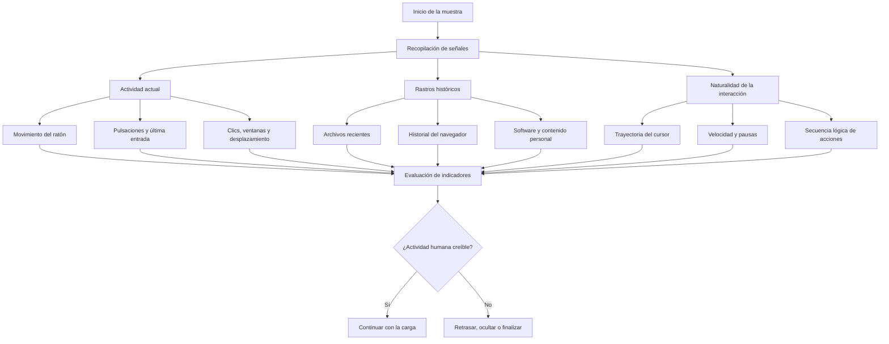

### Tabla resumen

| Técnica | Indicador examinado | Interpretación habitual del malware | Riesgo para el análisis |
|---|---|---|---|
| Movimiento del ratón | Cambio de coordenadas del cursor | La existencia de movimiento sugiere presencia humana | Una sandbox sin movimiento puede no activar la carga |
| Patrón del cursor | Trayectoria, velocidad, ángulos y pausas | Un patrón irregular y coherente se considera más humano | Los movimientos automáticos simples pueden ser detectados |
| Última entrada del usuario | Tiempo desde el último evento de teclado o ratón | Una inactividad elevada puede indicar automatización | La muestra puede quedar en espera o finalizar |
| Pulsaciones de teclado | Existencia y frecuencia de eventos | La entrada reciente refuerza la legitimidad del entorno | La ausencia de teclado puede bloquear la ejecución |
| Clics y cuadros de diálogo | Interacción con botones o controles | La acción correcta confirma la presencia de un usuario | Los módulos de autoclic pueden pulsar controles señuelo |
| Desplazamiento en documentos | Cambio de página o posición visible | El usuario está leyendo o explorando el archivo | El contenido malicioso puede permanecer fuera de la vista |
| Documentos recientes | Número y antigüedad de archivos utilizados | Un historial amplio sugiere un sistema real | Las imágenes limpias pueden parecer artificiales |
| Historial del navegador | URL, cookies, marcadores y perfiles | La navegación previa indica uso cotidiano | Los perfiles vacíos pueden elevar la puntuación de sandbox |
| Software instalado | Cantidad y variedad de aplicaciones | Un equipo real suele contener programas cotidianos | Un laboratorio con pocas aplicaciones puede ser identificado |
| Archivos personales | Documentos, imágenes, descargas y proyectos | La diversidad de contenido sugiere uso humano | Un perfil estéril puede impedir la detonación |
| Secuencia de acciones | Orden y coherencia de eventos | Las acciones humanas suelen responder al contexto gráfico | Una automatización genérica puede resultar predecible |
| Puntuación combinada | Resultado de múltiples comprobaciones | Varias señales reducen la dependencia de un único indicador | Es necesario reproducir un entorno completo y no una sola acción |

### Relación entre señal, decisión y respuesta

| Fase | Pregunta realizada por la muestra | Ejemplo de evidencia | Posible respuesta |
|---|---|---|---|
| Observación | ¿Existe actividad en este momento? | Movimiento, clic o pulsación reciente | Continuar o repetir la comprobación |
| Validación | ¿La actividad parece humana? | Trayectoria irregular y tiempos variables | Aceptar o rechazar la señal |
| Contextualización | ¿El equipo tiene historial de uso? | Navegación, documentos y aplicaciones | Incrementar o reducir una puntuación |
| Activación | ¿Se supera el umbral definido? | Conjunto suficiente de indicadores | Descifrar o ejecutar la carga |
| Evasión | ¿El entorno parece automatizado? | Ausencia de actividad o patrones sintéticos | Retrasar, finalizar o ejecutar código señuelo |

La utilidad de este resumen visual reside en mostrar que Human Interaction no es una comprobación única, sino una familia de técnicas. Una muestra puede utilizar una señal sencilla, como la posición del cursor, o construir un modelo de confianza basado en la combinación de actividad presente, historial del sistema y naturalidad de las interacciones.

---

## 9.5. Contramedidas ofensivas

En este apartado, el término **contramedidas ofensivas** se refiere a los mecanismos utilizados por el malware para conservar la eficacia de Human Interaction frente a las medidas de simulación, instrumentación y automatización empleadas por los laboratorios de análisis. Su estudio debe realizarse exclusivamente con fines de investigación, detección y mejora de entornos defensivos.

### 9.5.1. Combinación de múltiples indicadores

Una comprobación aislada puede ser superada con facilidad. Por este motivo, una muestra puede combinar:

- movimiento del cursor;
- última entrada del usuario;
- historial del navegador;
- documentos recientes;
- aplicaciones instaladas;
- archivos personales;
- interacción con ventanas.

En lugar de tomar una decisión binaria, el malware puede asignar un peso a cada indicador y calcular una puntuación. Esta estrategia dificulta que el analista supere la evasión mediante una única acción artificial.

### 9.5.2. Validación de la naturalidad del movimiento

Las sandboxes pueden generar movimientos automáticos del ratón. Como respuesta, la muestra puede analizar propiedades que no se reproducen correctamente con una simulación básica:

- variaciones de velocidad;
- aceleraciones y desaceleraciones;
- pequeños ajustes de trayectoria;
- cambios de dirección;
- pausas desiguales;
- relación entre el cursor y los elementos visibles;
- distribución temporal de los eventos.

El objetivo no es comprobar únicamente que el cursor se ha movido, sino determinar si el movimiento es coherente con una acción humana.

### 9.5.3. Interacciones dependientes del contexto

La muestra puede exigir una acción asociada a un elemento concreto de la interfaz. Por ejemplo, puede esperar que el usuario:

- seleccione una opción determinada;
- desplace un documento hasta una sección;
- active un control gráfico;
- cierre una ventana secundaria;
- mantenga el foco sobre una aplicación;
- siga una secuencia de pasos.

Una sandbox que genere clics aleatorios puede producir actividad, pero no necesariamente la actividad esperada por la muestra.

### 9.5.4. Controles señuelo y engaño de automatizaciones

Los módulos de interacción automática suelen buscar botones con textos o clases comunes. El malware puede intentar reconocer y confundir estos mecanismos mediante:

- botones invisibles;
- controles de tamaño mínimo;
- textos habituales asociados a elementos falsos;
- controles personalizados con apariencia de botón;
- botones reales sin etiquetas reconocibles;
- acciones inocuas vinculadas al control señuelo;
- secuencias distintas para el usuario real y para el autoclic.

Estas técnicas permiten que la automatización active una ruta no maliciosa mientras la carga real permanece oculta.

### 9.5.5. Ejecución condicionada y retardada

El malware puede repetir las comprobaciones hasta detectar una actividad válida. En vez de finalizar inmediatamente, puede:

- permanecer inactivo;
- dormir durante intervalos variables;
- ejecutar tareas irrelevantes;
- esperar nuevos eventos;
- activar la carga después de varios ciclos;
- distribuir las comprobaciones en diferentes procesos.

Esta estrategia resulta especialmente eficaz cuando la sandbox dispone de un tiempo de detonación limitado.

### 9.5.6. Comprobaciones distribuidas

Las señales pueden evaluarse en diferentes fases:

1. una comprobación inicial antes de desempaquetar código;
2. una segunda comprobación antes de establecer comunicación;
3. una validación adicional antes de ejecutar el payload;
4. verificaciones periódicas durante la persistencia.

La distribución reduce la utilidad de superar únicamente la primera condición y dificulta identificar un único punto de decisión.

### 9.5.7. Selección adaptativa de umbrales

Los umbrales rígidos son más fáciles de identificar. Una implementación más resistente puede adaptar las condiciones en función de:

- tiempo de ejecución;
- número de eventos registrados;
- resolución de pantalla;
- velocidad media del cursor;
- antigüedad del perfil;
- cantidad de artefactos históricos;
- relación entre varias señales.

Esta adaptación pretende evitar que una sandbox utilice valores fijos para satisfacer todas las comprobaciones.

### 9.5.8. Verificación de coherencia entre señales

Una muestra puede comprobar que los indicadores no se contradigan. Algunos ejemplos conceptuales son:

- existencia de historial de navegación junto con un perfil de usuario antiguo;
- documentos recientes acompañados de archivos reales en las rutas correspondientes;
- movimiento del cursor seguido de interacción con una ventana;
- actividad reciente coherente con el tiempo de sesión;
- aplicaciones instaladas acompañadas de rastros de ejecución.

La coherencia entre fuentes dificulta el uso de artefactos ficticios añadidos de forma superficial.

### 9.5.9. Uso de fuentes alternativas

Cuando una API puede estar instrumentada o interceptada, el malware puede consultar fuentes distintas para contrastar el resultado. Desde una perspectiva analítica, esto puede incluir la comparación entre:

- API de alto nivel;
- mensajes de ventana;
- estado de dispositivos de entrada;
- estructuras del sistema;
- eventos de sesión;
- artefactos almacenados en disco o registro.

El propósito es detectar inconsistencias introducidas por la instrumentación del laboratorio.

### 9.5.10. Ejecución señuelo

Si el entorno parece automatizado, la muestra puede ejecutar una ruta alternativa que simule normalidad:

- mostrar un instalador legítimo;
- crear archivos inocuos;
- finalizar sin errores;
- presentar mensajes de incompatibilidad;
- realizar conexiones no maliciosas;
- ejecutar funciones incompletas.

La ejecución señuelo dificulta determinar si la muestra carece de funcionalidad o si ha detectado el laboratorio.

### 9.5.11. Limitaciones de las contramedidas ofensivas

El aumento de complejidad también introduce inconvenientes para el malware:

- mayor cantidad de código y superficie de detección;
- posibilidad de errores lógicos;
- falsos positivos en equipos reales;
- dependencia de configuraciones concretas;
- retraso de la infección;
- pérdida de víctimas con poca actividad;
- generación de patrones reconocibles por herramientas defensivas.

Por tanto, las muestras deben equilibrar la capacidad de evasión con la fiabilidad de ejecución en sistemas reales.

---

## 9.6. Contramedidas defensivas

Las contramedidas defensivas deben impedir que una muestra determine con facilidad que está siendo analizada y, al mismo tiempo, permitir que el laboratorio observe la relación entre las comprobaciones y la carga maliciosa. La defensa más eficaz combina realismo ambiental, simulación de actividad, instrumentación y análisis manual.

### 9.6.1. Construcción de entornos con historial de uso

Las imágenes de análisis no deben parecer sistemas recién instalados. Es recomendable incluir artefactos coherentes y no sensibles, como:

- documentos recientes de prueba;
- perfiles de navegador con historial sintético;
- cookies y marcadores controlados;
- aplicaciones de uso habitual;
- archivos distribuidos en carpetas personales;
- accesos directos y elementos recientes;
- fechas de creación y modificación variadas.

Los artefactos deben guardar coherencia entre sí. No basta con crear claves aisladas del registro si los archivos y aplicaciones relacionados no existen.

### 9.6.2. Simulación realista de actividad

La sandbox debe generar eventos de entrada con características variables:

- trayectorias curvas;
- velocidades cambiantes;
- pausas no uniformes;
- pequeños retrocesos;
- clics relacionados con elementos visibles;
- alternancia entre ratón y teclado;
- desplazamiento por ventanas y documentos.

La simulación debe evitar patrones perfectamente repetitivos, lineales o periódicos.

### 9.6.3. Interacción basada en la interfaz

Frente a muestras que exigen acciones contextuales, el laboratorio puede utilizar mecanismos capaces de:

- enumerar ventanas y controles;
- identificar texto y propiedades;
- evaluar visibilidad y tamaño;
- reconocer controles personalizados;
- desplazarse por documentos;
- cambiar el foco;
- cerrar cuadros de diálogo;
- ejecutar secuencias de interacción.

La automatización no debe confiar únicamente en textos como «Next», «Install» o «Accept», porque pueden existir controles señuelo.

### 9.6.4. Detección de controles anómalos

Durante la detonación deben registrarse:

- controles invisibles;
- botones de tamaño mínimo;
- clases de ventana no habituales;
- elementos superpuestos;
- diferencias entre texto, clase y comportamiento;
- controles que desencadenan rutas distintas;
- ventanas que solo aparecen durante periodos breves.

Esta telemetría ayuda a identificar intentos de engañar a los módulos de autoclic.

### 9.6.5. Instrumentación de API y eventos

El laboratorio puede monitorizar las funciones relacionadas con:

- posición del cursor;
- última entrada;
- estado del teclado;
- mensajes de ventana;
- enumeración de controles;
- temporización;
- acceso a archivos recientes;
- perfiles de navegador;
- programas instalados.

El objetivo no debe limitarse a registrar la llamada. También es necesario capturar:

- argumentos;
- valores devueltos;
- frecuencia;
- orden;
- proceso e hilo;
- salto condicional posterior;
- comportamiento activado o bloqueado.

La correlación entre la consulta y el cambio de flujo es el indicador más importante.

### 9.6.6. Manipulación controlada de resultados

En un laboratorio aislado, el analista puede modificar de forma controlada los valores devueltos por determinadas comprobaciones para observar rutas alternativas.

Por ejemplo, puede comparar:

- ejecución con actividad y sin actividad;
- resultado real y resultado modificado;
- perfil limpio y perfil poblado;
- ventana sin interacción y ventana manipulada;
- diferentes valores de inactividad.

Este análisis diferencial permite localizar la condición de evasión y comprobar qué funcionalidad permanece oculta.

### 9.6.7. Ampliación del tiempo de detonación

Las muestras pueden retrasar la carga hasta detectar actividad suficiente. Para reducir esta ventaja defensiva se puede:

- ampliar el periodo de observación;
- generar eventos durante toda la sesión;
- repetir la ejecución con diferentes patrones;
- observar procesos descendientes;
- conservar la máquina después de la primera fase;
- registrar actividad diferida de red, archivos y memoria.

Un tiempo de análisis demasiado corto puede producir falsos negativos.

### 9.6.8. Automatización de escenarios múltiples

Una única detonación no siempre es suficiente. El laboratorio puede ejecutar la muestra en escenarios diferenciados:

| Escenario | Actividad | Perfil del sistema | Finalidad |
|---|---|---|---|
| Base | Sin interacción | Perfil limpio | Identificar el comportamiento mínimo |
| Usuario activo | Ratón y teclado | Perfil limpio | Evaluar comprobaciones de actividad actual |
| Perfil poblado | Actividad limitada | Historial y archivos | Evaluar rastros históricos |
| Interacción completa | Actividad contextual | Perfil poblado | Intentar activar toda la funcionalidad |
| Análisis diferencial | Valores instrumentados | Configuración variable | Localizar condiciones y umbrales |

La comparación de resultados permite detectar cambios en procesos, memoria, red y archivos.

### 9.6.9. Captura y análisis de memoria

Si la carga se descifra únicamente después de una interacción, la memoria del proceso debe inspeccionarse antes y después de superar la condición. Resulta útil observar:

- regiones ejecutables nuevas;
- cambios de protección;
- código desempaquetado;
- módulos cargados;
- cadenas descifradas;
- configuración de red;
- creación de hilos;
- inyección en otros procesos.

El volcado diferencial puede revelar componentes que no aparecen en el análisis estático.

### 9.6.10. Detección basada en comportamiento

Las reglas defensivas deben correlacionar varias señales. Un patrón sospechoso puede incluir:

1. proceso recién iniciado;
2. consulta repetida de actividad;
3. acceso a historial o archivos recientes;
4. comparación con un umbral;
5. retardo o bucle;
6. descifrado de memoria;
7. conexión de red o creación de un proceso.

La combinación es más fiable que una regla basada exclusivamente en una API.

### 9.6.11. Análisis estático dirigido

Cuando se sospecha de Human Interaction, el analista puede buscar:

- importaciones de funciones de entrada;
- referencias a estructuras como `POINT` o `LASTINPUTINFO`;
- constantes temporales;
- rutas de navegadores;
- claves de elementos recientes;
- cadenas de botones y ventanas;
- funciones de enumeración de software;
- bucles de muestreo;
- cálculos geométricos;
- bifurcaciones que conducen a la terminación.

Las referencias cruzadas permiten localizar el punto exacto donde el resultado afecta al flujo.

### 9.6.12. Análisis manual asistido

Las muestras con interacción compleja pueden requerir intervención humana. El analista puede:

- recorrer manualmente la interfaz;
- probar botones y controles;
- desplazar documentos;
- mantener actividad durante varios minutos;
- observar cambios en tiempo real;
- establecer puntos de interrupción después de las consultas;
- modificar la rama condicional;
- repetir la ejecución con diferentes acciones.

La intervención manual debe complementar, no sustituir, la telemetría automatizada.

### 9.6.13. Protección de los artefactos del laboratorio

Los perfiles utilizados para análisis deben contener únicamente datos sintéticos. No deben incorporarse documentos, credenciales, historiales o información personal real.

Además, es recomendable:

- restablecer el entorno después de cada ejecución;
- aislar la red;
- utilizar servicios simulados;
- impedir el acceso a recursos corporativos;
- evitar reutilizar credenciales;
- controlar los canales de salida;
- conservar evidencias de forma separada.

El objetivo es aumentar el realismo sin comprometer información legítima.

### 9.6.14. Indicadores para reglas de detección

Una regla de detección puede valorar, entre otros, los siguientes elementos:

- llamadas reiteradas a API de entrada en procesos sin interfaz aparente;
- acceso a varios navegadores con finalidad de conteo;
- enumeración de documentos recientes seguida de terminación;
- lectura de software instalado antes de desempaquetar código;
- controles gráficos invisibles o anómalos;
- bucles de inactividad seguidos de actividad maliciosa;
- cálculos sobre series de coordenadas del cursor;
- cambios de comportamiento después de una entrada;
- combinación de comprobaciones Human Interaction con anti-VM o anti-debug.

Estas reglas deben ajustarse al contexto para reducir falsos positivos en aplicaciones legítimas.

### 9.6.15. Estrategia defensiva recomendada

Una estrategia completa puede organizarse en cinco capas:

1. **Preparación del entorno:** crear perfiles realistas y coherentes.
2. **Estimulación:** generar actividad humana variable y contextual.
3. **Observación:** registrar API, archivos, registro, memoria, procesos y red.
4. **Intervención:** modificar resultados o ramas en un laboratorio aislado.
5. **Correlación:** comparar múltiples ejecuciones y construir detecciones.

La principal conclusión defensiva es que Human Interaction no debe abordarse únicamente moviendo el ratón. Es necesario reproducir un contexto de uso, observar las decisiones internas de la muestra y comparar su comportamiento bajo distintas condiciones.


## 9.7 Análisis dinámico de las técnicas Human Interaction

### 9.7.1 Comprobación del movimiento del ratón

#### Objetivo de la técnica

La comprobación del movimiento del ratón es una técnica de detección de interacción humana utilizada para diferenciar un equipo usado de forma normal de un entorno automatizado de análisis. Su fundamento es que, durante una sesión real, el cursor suele cambiar de posición, mientras que en ciertos *sandboxes* o máquinas virtuales sin simulación de actividad permanece estático.

La muestra analizada, **Al-Khaser x64**, implementa esta comprobación obteniendo dos posiciones del cursor separadas por una espera de cinco segundos. Después compara las coordenadas `X` e `Y`. Si alguna ha cambiado, considera que se ha producido interacción del usuario.

De forma simplificada, la lógica observada es la siguiente:

```c
POINT posicion_inicial;
POINT posicion_final;

GetCursorPos(&posicion_inicial);
Sleep(5000);
GetCursorPos(&posicion_final);

if (posicion_inicial.x != posicion_final.x ||
    posicion_inicial.y != posicion_final.y) {
    movimiento_detectado = true;
} else {
    movimiento_detectado = false;
}
```

#### Entorno y metodología de análisis

La comprobación se analizó dinámicamente con **x64dbg**, ejecutado con privilegios elevados, sobre el binario `al-khaser_x64.exe`. Para localizar la rutina se utilizaron inicialmente los siguientes *breakpoints* sobre las API de Windows:

```text
bp user32.GetCursorPos
bp kernel32.Sleep
```

En x64dbg se emplea el punto para separar el módulo de la función. La notación con signo de exclamación, habitual en WinDbg, no fue válida en este entorno. Si `Sleep` se resuelve a través de `KernelBase.dll`, también puede utilizarse:

```text
bp kernelbase.Sleep
```

Los *breakpoints* en las API solo se usaron para localizar la función llamadora. Una vez identificada, el seguimiento se realizó en el código de Al-Khaser mediante *Step Out* (`Ctrl+F9`) y *Step Over* (`F8`), evitando entrar en las implementaciones internas de Windows.

> **Nota sobre las direcciones.** Las direcciones mostradas pertenecen a una ejecución concreta. Debido a ASLR, pueden cambiar al reiniciar el proceso. Para repetir el análisis es preferible colocar los *breakpoints* visualmente sobre las instrucciones con `F2` o trabajar con direcciones relativas al módulo.

#### Localización de la primera consulta del cursor

El *breakpoint* en `user32.GetCursorPos` detuvo la ejecución dentro de `user32.dll`. En la Figura 1, el registro `RIP` apunta a la implementación de `GetCursorPos`. Esta parada confirma que la muestra consulta la posición del cursor, aunque el código relevante para la técnica se encuentra en la función llamadora de Al-Khaser.


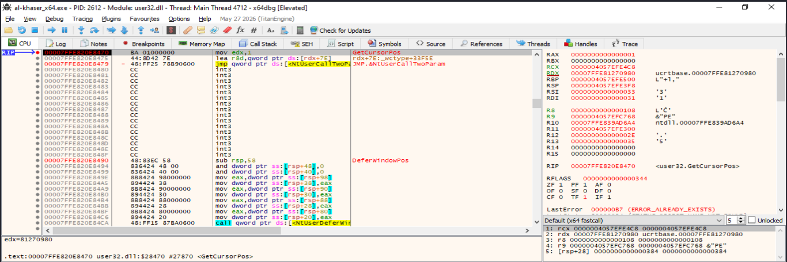

*Figura 1. Intercepción de la llamada a `GetCursorPos` en `user32.dll`.*

Después de ejecutar `Ctrl+F9`, se regresó al código de `al-khaser_x64.exe`. La vista general de la rutina permite reconocer su secuencia principal: espera mediante `Sleep`, preparación de un puntero a una estructura `POINT`, segunda llamada a `GetCursorPos` y comparación de las coordenadas almacenadas en la pila.

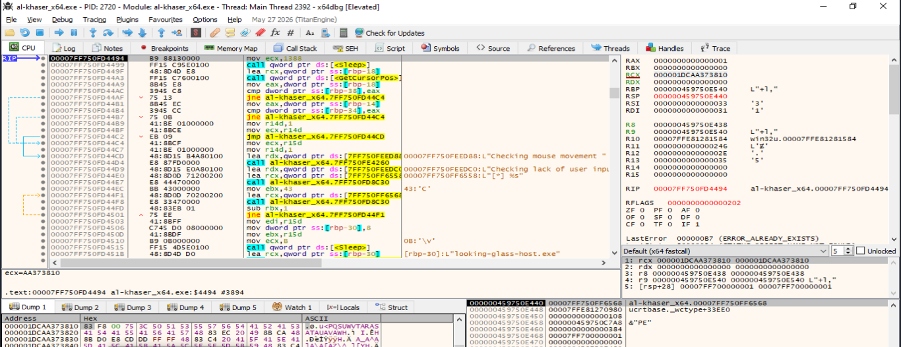

*Figura 2. Fragmento de Al-Khaser que contiene `Sleep`, la segunda llamada a `GetCursorPos` y las comparaciones posteriores.*

#### Intervalo temporal entre las dos lecturas

Durante la llamada a `Sleep`, el registro `RCX` contenía el valor `0x1388`. Según la convención de llamadas x64 de Windows, `RCX` transporta el primer argumento entero o puntero de la función. El valor hexadecimal observado equivale a:

```text
0x1388 = 5000 ms = 5 s
```

Por tanto, Al-Khaser deja un intervalo de cinco segundos entre las dos consultas de la posición del cursor. Durante este tiempo espera que un usuario real produzca algún desplazamiento.

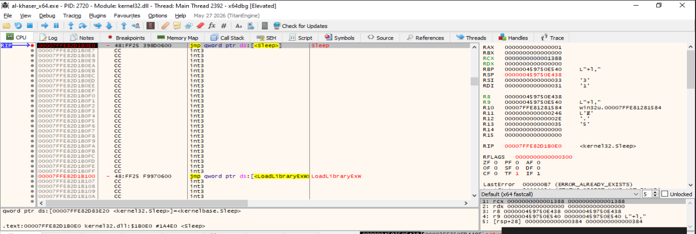

*Figura 3. Ejecución detenida en `Sleep`; `RCX = 0x1388` confirma una espera de 5000 milisegundos.*

#### Segunda lectura de la posición

Tras finalizar la espera, la muestra vuelve a invocar `GetCursorPos`. La API recibe en `RCX` la dirección de una estructura `POINT`, compuesta por dos enteros de 32 bits:

```c
typedef struct tagPOINT {
    LONG x;
    LONG y;
} POINT;
```

En la Figura 4 se observa la segunda parada dentro de `user32.GetCursorPos`. La pila de llamadas muestra que la función regresará a `al-khaser_x64.exe`, inmediatamente antes de las instrucciones que comparan ambas posiciones.


*Figura 4. Segunda consulta del cursor. En la pila se identifica el retorno al código de Al-Khaser.*

#### Comparación de las coordenadas

Una vez obtenida la segunda posición, la rutina compara primero la coordenada `X` y, solo si coincide, compara la coordenada `Y`. En la ejecución analizada se observó el siguiente fragmento:

```asm
mov eax, dword ptr ss:[rbp-18]     ; X de la segunda lectura
cmp dword ptr ss:[rbp-38], eax     ; X inicial frente a X final
jne movimiento_detectado           ; salta si son diferentes

mov eax, dword ptr ss:[rbp-14]     ; Y de la segunda lectura
cmp dword ptr ss:[rbp-34], eax     ; Y inicial frente a Y final
jne movimiento_detectado           ; salta si son diferentes
```

La distribución de las variables locales deducida del ensamblador es:

| Operando | Significado |
|---|---|
| `[rbp-38]` | Coordenada `X` inicial |
| `[rbp-34]` | Coordenada `Y` inicial |
| `[rbp-18]` | Coordenada `X` final |
| `[rbp-14]` | Coordenada `Y` final |

La implementación utiliza una evaluación de cortocircuito: si las coordenadas `X` son diferentes, el primer `JNE` desvía inmediatamente el flujo y no es necesario comparar `Y`. La segunda comparación solo se ejecuta cuando las coordenadas `X` coinciden.

#### Resultado observado con movimiento

Durante el intervalo de cinco segundos se desplazó el cursor al cambiar entre la conversación de apoyo y x64dbg. En la Figura 5, el `RIP` se encuentra sobre el primer `JNE`, por lo que el `CMP` anterior ya se ha ejecutado. x64dbg muestra:

```text
[rbp-38] = 58     ; coordenada X inicial
EAX      = 0      ; coordenada X final cargada desde [rbp-18]
ZF       = 0
```

Como `58 != 0`, la resta lógica realizada por `CMP` no produce cero y el indicador **Zero Flag** queda desactivado (`ZF = 0`). En consecuencia, `JNE` (*Jump if Not Equal*) toma el salto hacia la rama asociada a la detección de movimiento.


*Figura 5. Resultado de la comparación: los valores de `X` son distintos, `ZF = 0` y el salto `JNE` será tomado.*

La secuencia confirmada dinámicamente puede resumirse así:

1. `GetCursorPos` obtiene la posición inicial.
2. `Sleep(5000)` introduce una espera de cinco segundos.
3. Una segunda llamada a `GetCursorPos` obtiene la posición final.
4. Dos instrucciones `CMP` comparan primero `X` y después `Y`.
5. Un `JNE` desvía el flujo si cambia cualquiera de las coordenadas.
6. En la ejecución documentada hubo movimiento: los valores de `X` fueron distintos y se tomó la rama correspondiente.

#### Interpretación como técnica anti-sandbox

Esta comprobación no detecta directamente un hipervisor ni busca artefactos de virtualización. En su lugar, infiere el tipo de entorno a partir del comportamiento observado. Un cursor inmóvil durante todo el intervalo puede sugerir una ejecución automática sin interacción humana; un cambio de coordenadas indica actividad compatible con la presencia de un usuario.

No obstante, la técnica por sí sola no constituye una prueba concluyente. Un usuario real puede no mover el ratón durante cinco segundos y un *sandbox* avanzado puede simular movimientos. Por ello, normalmente se combina con otras comprobaciones de actividad, como `GetLastInputInfo`, historial de uso, número de documentos recientes o interacción con ventanas.

#### Conclusión

La comprobación dinámica puede darse por finalizada. Se verificaron todos los elementos necesarios para reconstruir la técnica: dos consultas a `GetCursorPos`, una espera intermedia de cinco segundos, la comparación de las coordenadas `X` e `Y` mediante `CMP` y la decisión del flujo mediante `JNE`. Además, se confirmó experimentalmente la rama de movimiento detectado, al observar valores distintos, `ZF = 0` y la preparación del salto condicional.

Una ejecución adicional sin mover el ratón permitiría ilustrar el camino alternativo (`ZF = 1` en ambas comparaciones), pero no es imprescindible para demostrar el funcionamiento de la técnica.

----


### 9.7.2. Tiempo desde la última entrada del usuario

La ausencia de interacción humana constituye un indicio habitual de que un programa se está ejecutando en un entorno automatizado, como una *sandbox* o una máquina virtual destinada al análisis de malware. Para detectar esta situación, una muestra puede consultar cuándo se produjo el último evento de teclado o ratón y comparar ese instante con el tiempo actual del sistema. Si la inactividad supera el umbral definido por el programa, la muestra puede modificar su comportamiento, finalizar su ejecución o evitar desplegar su funcionalidad maliciosa.

En esta prueba se analizó dinámicamente la comprobación **Checking lack of user input** incluida en `al-khaser_x64.exe`. La rutina utiliza las API de Windows `GetLastInputInfo` y `GetTickCount` para calcular el tiempo transcurrido desde la última entrada del usuario.

#### Localización de la rutina

Como punto inicial se estableció un *breakpoint* condicional en `kernel32.Sleep`. En la captura se observa la ejecución de `Sleep` con `RCX = 0xB`, que corresponde a una pausa de 11 ms según la convención de llamada de Windows x64. Esta pausa forma parte del bucle que repite la comprobación de actividad.

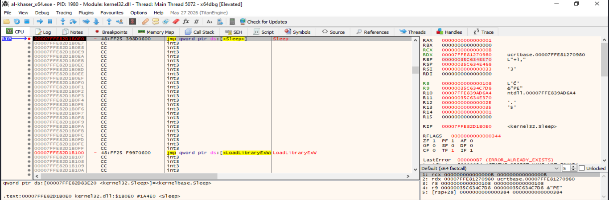

**Figura 9.7.2-1.** Ejecución de `kernel32.Sleep`. Archivo utilizado: `HI-Tiempo-ultimo-imput-1.png`.

La pila de llamadas permitió identificar la dirección de retorno perteneciente a `al-khaser_x64.exe`. De este modo se abandonó el código interno de `kernel32.dll` y se accedió al *caller*, donde se encuentra la lógica relevante de la técnica.

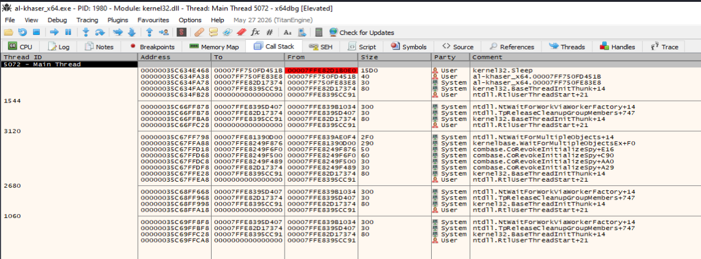

**Figura 9.7.2-2.** Pila de llamadas durante la ejecución de `Sleep` y dirección de retorno al ejecutable. Archivo utilizado: `HI-Tiempo-ultimo-imput-2.png`.

#### Obtención de la última entrada del usuario

Una vez situado el depurador en el código de `al-khaser`, se identificó la siguiente secuencia:

```asm
lea  rcx, [rbp-30]
call qword ptr ds:[<&GetLastInputInfo>]
test eax, eax
je   ...
```

La instrucción `lea rcx,[rbp-30]` carga en `RCX` la dirección de una estructura `LASTINPUTINFO`, ya que `RCX` contiene el primer argumento de una función en la convención de llamada de Windows x64. La estructura está formada por dos campos de 32 bits:

```c
typedef struct tagLASTINPUTINFO {
    UINT  cbSize;
    DWORD dwTime;
} LASTINPUTINFO;
```

`cbSize` contiene el tamaño de la estructura —8 bytes— y `dwTime` recibe el número de milisegundos transcurridos desde el arranque del sistema hasta el último evento de entrada. Tras la llamada, `test eax,eax` comprueba el valor devuelto por la API: un valor distinto de cero indica que la consulta se realizó correctamente.

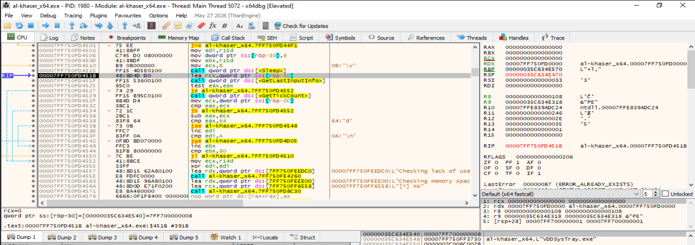

**Figura 9.7.2-3.** Preparación de `LASTINPUTINFO` y llamada a `GetLastInputInfo`. Archivo utilizado: `HI-Tiempo-ultimo-imput-3.png`.

Durante la entrada en `user32.GetLastInputInfo` se confirmó que `RCX` apuntaba a la estructura proporcionada por la muestra. No fue necesario recorrer la implementación interna de la biblioteca, pues el objetivo era analizar cómo `al-khaser` utiliza el resultado.

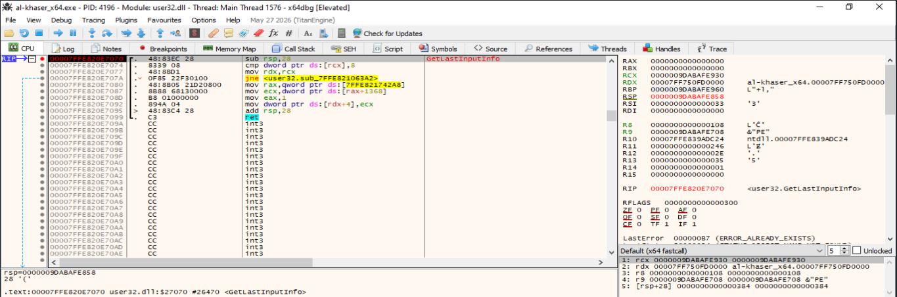

**Figura 9.7.2-4.** Ejecución de `user32.GetLastInputInfo` con el puntero a la estructura en `RCX`. Archivo utilizado: `HI-Tiempo-ultimo-imput-5.png`.

#### Cálculo del tiempo de inactividad

Después de comprobar que `GetLastInputInfo` tuvo éxito, la rutina llama a `GetTickCount` para obtener el contador actual del sistema. El valor devuelto queda en `EAX`. A continuación, el programa recupera `dwTime` desde `[rbp-2C]` y realiza las siguientes operaciones:

```asm
call qword ptr ds:[<&GetTickCount>]
mov  ecx, dword ptr ss:[rbp-2C]
cmp  eax, ecx
jb   ...
sub  eax, ecx
cmp  eax, 64
jae  ...
```

La primera comparación comprueba que el tick actual no sea menor que el correspondiente a la última entrada, lo que evita operar con valores temporalmente incoherentes. Después, `sub eax,ecx` calcula el tiempo de inactividad:

```text
tiempo_de_inactividad = GetTickCount() - LASTINPUTINFO.dwTime
```

El resultado se compara con `0x64`, equivalente a 100 en decimal. El salto `jae` se toma cuando la diferencia es mayor o igual que 100 ms; en ese caso, la iteración no se considera una evidencia válida de actividad reciente. Cuando la diferencia es inferior a 100 ms, el salto no se toma y el flujo alcanza `inc edi`, incrementando el contador de observaciones positivas.

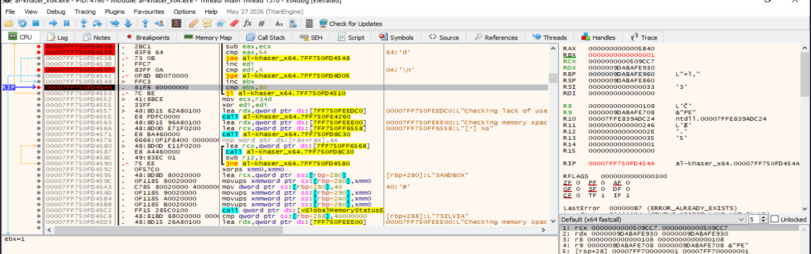

**Figura 9.7.2-5.** Cálculo del tiempo de inactividad, comparación con `0x64` y control de los contadores. Archivo utilizado: `HI-Tiempo-ultimo-imput-8.png`.

La lógica reconstruida puede expresarse de forma simplificada mediante el siguiente pseudocódigo:

```c
int coincidencias = 0;

for (int iteracion = 0; iteracion < 128; iteracion++) {
    Sleep(11);

    LASTINPUTINFO lii = { sizeof(LASTINPUTINFO) };
    if (!GetLastInputInfo(&lii))
        continue;

    DWORD actual = GetTickCount();
    if (actual < lii.dwTime)
        continue;

    DWORD inactividad = actual - lii.dwTime;
    if (inactividad < 100) {
        coincidencias++;
        if (coincidencias >= 10)
            break;
    }
}
```

Este pseudocódigo representa la conducta observada durante la depuración y no pretende reproducir literalmente el código fuente. El contador almacenado en `EDI` se compara con `0xA`, por lo que son necesarias diez observaciones de actividad reciente. Por su parte, `EBX` se compara con `0x80`, estableciendo un máximo de 128 iteraciones. La repetición reduce la dependencia de una única medición y hace más robusta la detección frente a eventos aislados.

#### Resultado de la prueba

Tras desactivar los *breakpoints* internos y permitir que la rutina terminara, la salida de `al-khaser` mostró el resultado `GOOD` para **Checking lack of user input**.

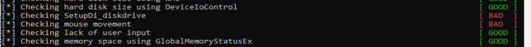

**Figura 9.7.2-6.** Resultado final de la comprobación de ausencia de entrada del usuario. Archivo utilizado: `HI-Tiempo-ultimo-imput-11.png`.

En el contexto de esta herramienta, `GOOD` indica que la comprobación no detectó una ausencia de interacción compatible con un entorno automatizado. Este resultado concuerda con el flujo observado: al registrarse suficientes mediciones con una diferencia inferior a 100 ms, el contador de actividad reciente alcanzó el criterio exigido por la rutina.

#### Indicadores observados

| Elemento | Evidencia dinámica | Interpretación |
|---|---|---|
| `Sleep(11)` | `RCX = 0xB` antes de `Sleep` | Introduce una espera breve entre mediciones. |
| `GetLastInputInfo` | Puntero a `LASTINPUTINFO` en `RCX` | Obtiene el tick de la última entrada de teclado o ratón. |
| `GetTickCount` | Valor actual devuelto en `EAX` | Proporciona la referencia temporal del sistema. |
| `sub eax,ecx` | Resta del tick de la última entrada al tick actual | Calcula el tiempo de inactividad. |
| `cmp eax,0x64` | Comparación con 100 ms | Determina si la entrada es suficientemente reciente. |
| `cmp edi,0xA` | Comparación con 10 | Exige diez observaciones positivas. |
| `cmp ebx,0x80` | Comparación con 128 | Limita el número máximo de iteraciones. |

#### Conclusión

El análisis dinámico confirmó que `al-khaser_x64.exe` implementa una técnica de detección de interacción humana basada en el tiempo transcurrido desde la última entrada del usuario. La muestra consulta `GetLastInputInfo`, obtiene el tick actual mediante `GetTickCount` y calcula la diferencia entre ambos valores. Cuando esa diferencia es inferior a 100 ms, incrementa un contador de validación; la comprobación requiere diez resultados positivos dentro de un máximo de 128 iteraciones. La salida final `GOOD` confirmó que, durante la ejecución analizada, se observó actividad suficientemente reciente y la ausencia de entrada del usuario no fue considerada un indicio de automatización.

----


------


### 9.7.3 Ejecución condicionada y retardada

La ejecución condicionada y retardada es una técnica de evasión en la que el programa no continúa inmediatamente con el flujo que se desea proteger, sino que espera a que se cumpla una condición determinada o a que venza un intervalo temporal. En un entorno de análisis automatizado, esta lógica puede utilizarse para diferenciar una sesión con interacción humana de otra en la que no existe actividad real del usuario.

Para demostrar dinámicamente esta técnica se analizó con **x64dbg** la comprobación de actividad de clic del ratón incluida en `pafish64.exe`. La prueba combina dos mecanismos de Windows:

- un temporizador de **3000 ms** creado con `SetTimer`;
- un *hook* global de ratón de bajo nivel, `WH_MOUSE_LL`, instalado mediante `SetWindowsHookExA`. Un `hook de ratón` es simplemente un mecanismo de Windows que permite a un programa “engancharse” a los eventos del ratón para enterarse cuando ocurren.

```
Pafish
   │
   │ SetWindowsHookExA
   │ WH_MOUSE_LL (0xE)
   ▼
Windows instala el hook
   │
   │ Usuario mueve/pulsa el ratón
   ▼
Windows detecta el evento
   │
   ▼
Ejecuta callback 0x4053D2
   │
   ├── movimiento       → 0x200
   ├── botón presionado → 0x201
   └── botón liberado   → 0x202
                           │
                           ▼
                     Pafish detecta
                     interacción humana
```

Ambos caminos terminan generando el mismo mensaje privado, `0x401` (`WM_USER + 1`), pero no producen el mismo resultado. Si vence el tiempo sin observarse el clic esperado, la variable interna de éxito permanece a `FALSE`. Si se detecta `WM_LBUTTONUP` antes del *timeout*, el callback establece dicha variable a `TRUE` antes de enviar `0x401`. El mensaje sirve, por tanto, como señal común para abandonar el bucle; el estado de la variable permite distinguir **por qué** terminó la espera.

El comportamiento coincide con la implementación publicada de Pafish en `rtt.c`: `MAX_DURATION` vale 3000, `WM_CUSTOM` se define como `WM_USER + 1`, se instala un `WH_MOUSE_LL`, el callback del clic marca `rtt_is_success` y el bucle termina al recibir el mensaje personalizado. La comparación con el código fuente se utiliza aquí como apoyo; las direcciones, registros, saltos y valores descritos a continuación fueron comprobados dinámicamente en x64dbg.

#### Fundamento de la técnica

La lógica observada puede resumirse así:

| Elemento | Valor observado | Función dentro de la prueba |
|---|---:|---|
| Duración máxima | `0xBB8` = 3000 ms | Limita cuánto tiempo se espera la interacción. |
| Tipo de *hook* | `0xE` = `WH_MOUSE_LL` | Permite observar eventos de ratón de bajo nivel. |
| Callback del temporizador | `0x4053A4` | Señala que se agotó el tiempo. |
| Callback del ratón | `0x4053D2` | Comprueba la interacción del usuario. |
| Evento esperado | `0x202` = `WM_LBUTTONUP` | Liberación del botón izquierdo. |
| Variable de éxito | `DWORD [0x416848]` | `0` si no se validó interacción; `1` tras un clic válido. |
| Mensaje de salida | `0x401` = `WM_USER + 1` | Hace abandonar el bucle de mensajes. |

Según Microsoft, `WH_MOUSE_LL` tiene el identificador decimal 14 (`0xE`) y corresponde al *hook* de entrada de ratón de bajo nivel. `WM_LBUTTONUP` tiene el valor `0x0202`. Por su parte, cuando se proporciona una `TIMERPROC` a `SetTimer`, `DispatchMessage` invoca dicho callback al procesar el `WM_TIMER` asociado. Estas definiciones permiten relacionar los valores observados en los registros con su semántica en la API Win32.

#### Análisis dinámico con x64dbg

##### 1. Creación del temporizador de 3000 ms

El primer punto de observación se situó en `user32.SetTimer`. En Windows x64 los cuatro primeros argumentos enteros o punteros se reciben a través de `RCX`, `RDX`, `R8` y `R9`. En la captura se observa:

```text
RCX = 0
RDX = 0
R8  = 0xBB8
R9  = 0x4053A4
```

La llamada puede interpretarse como:

```c
SetTimer(NULL, 0, 3000, 0x4053A4);
```

`0xBB8` equivale a **3000 milisegundos** y `0x4053A4` identifica la `TIMERPROC` de Pafish.

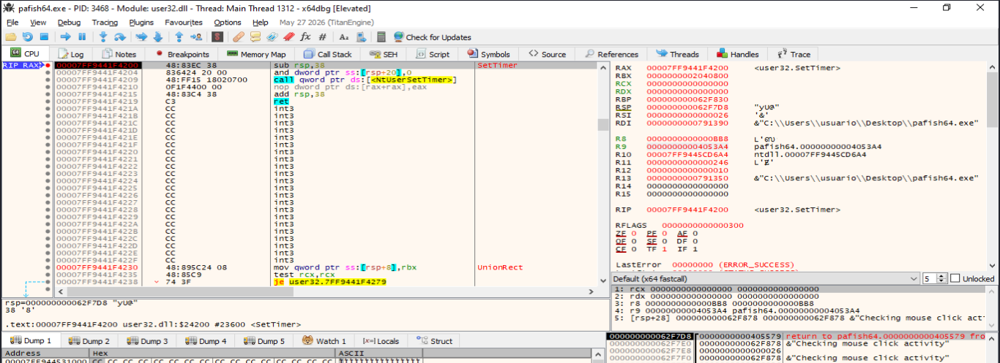

**Figura 9.7.4-1.** Entrada en `user32.SetTimer`. `R8 = 0xBB8` confirma el retardo máximo de 3000 ms y `R9 = 0x4053A4` identifica el callback temporal. **Archivo: `capturas/01-settimer-3000ms.png`.**

Este punto demuestra la parte **retardada** de la técnica: Pafish establece un límite temporal antes de instalar el mecanismo que observará la interacción.

##### 2. Instalación del hook `WH_MOUSE_LL`

La siguiente llamada relevante es `SetWindowsHookExA`. La ejecución muestra:

```text
RCX = 0xE
RDX = 0x4053D2
R8  = 0
R9  = 0
```

`RCX = 0xE` corresponde a `WH_MOUSE_LL`, mientras que `RDX = 0x4053D2` apunta al callback que procesa el evento de ratón. El flujo observado es equivalente a:

```c
SetWindowsHookExA(WH_MOUSE_LL, 0x4053D2, NULL, 0);
```

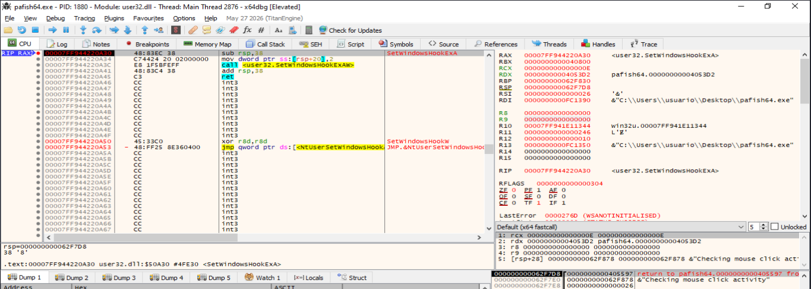

**Figura 9.7.4-2.** Entrada en `SetWindowsHookExA`: `RCX = 0xE` (`WH_MOUSE_LL`) y `RDX = 0x4053D2`, dirección del callback. **Archivo: `capturas/02-setwindowshookex-wh-mouse-ll.png`.**

La combinación de las dos primeras figuras es importante: primero comienza la ventana temporal y después se instala el *hook*. Por este motivo, durante la reproducción en x64dbg no debe mantenerse la ejecución detenida varios segundos en `SetWindowsHookExA`, ya que el temporizador ya está activo y puede vencer antes de reanudar el proceso.

##### 3. Rama temporal: expiración del tiempo

La rama de *timeout* se observó dejando transcurrir la ventana sin satisfacer la condición del clic. El mensaje `WM_TIMER` (`0x113`) fue procesado por el bucle y `DispatchMessageA` transfirió el control a la `TIMERPROC` situada en `0x4053A4`.

En el callback temporal aparece la preparación de los argumentos de `PostMessageA`:

```asm
mov r9d, 0
mov r8d, 0
mov edx, 401h
mov ecx, 0
...
call rax                 ; PostMessageA
```

Es decir, al vencer el temporizador se genera:

```c
PostMessageA(NULL, 0x401, 0, 0);
```

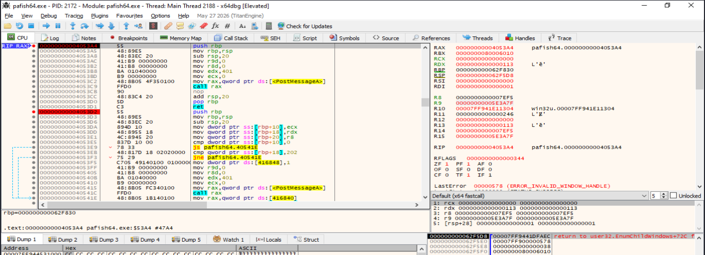

**Figura 9.7.4-3.** Callback temporal `0x4053A4`. Se observa `mov edx,401` y la posterior llamada a `PostMessageA`. **Archivo: `capturas/03-timeout-timerproc-postmessage-401.png`.**

Esta rama finaliza la espera sin establecer la variable `0x416848` a `TRUE`. Por ello, si la terminación se debe únicamente al temporizador, el mensaje `0x401` señala el fin de la espera pero el estado interno continúa indicando **ausencia de interacción válida**.

##### 4. Rama condicionada: detección de `WM_LBUTTONUP`

Para demostrar la segunda rama se reinició la prueba y se dejó activo el breakpoint del callback `0x4053D2`, condicionado al valor `RDX == 0x202`. El clic izquierdo se realizó inmediatamente después de reanudar desde `SetTimer`, evitando que transcurrieran los 3000 ms.

La captura obtenida muestra:

```text
RIP = 0x4053D2
RDX = 0x202
```

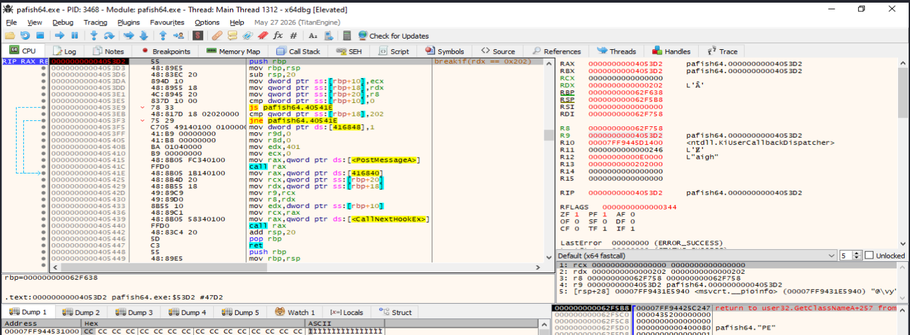

**Figura 9.7.4-4.** Entrada en el callback `0x4053D2` con `RDX = 0x202`, correspondiente a `WM_LBUTTONUP`. **Archivo: `capturas/04-click-wm-lbuttonup-202.png`.**

La captura demuestra que el *hook* de bajo nivel interceptó la liberación del botón izquierdo antes de que venciera el temporizador.

##### 5. Decisión sobre el evento de ratón

Dentro del callback, Pafish conserva el `wParam` recibido y lo compara con `0x202`:

```asm
cmp dword ptr [rbp+18], 202h
jne 40541E
```

Tras ejecutar el `cmp`, x64dbg muestra:

```text
ZF = 1
Jump is not taken
```

Como ambos valores son iguales, `ZF` queda a 1 y el `jne` no se toma. La ejecución entra, por tanto, en la rama que registra la interacción como válida.

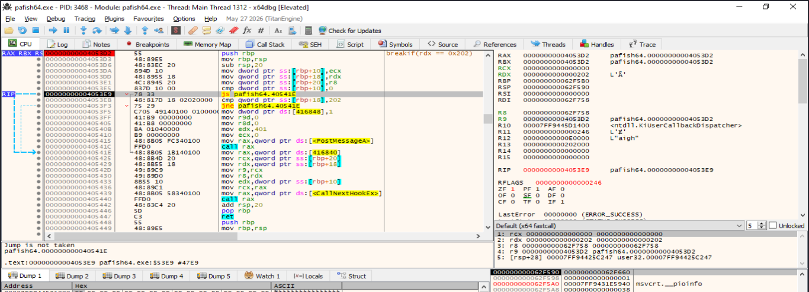

**Figura 9.7.4-5.** Comparación del evento con `0x202`; `ZF = 1` y `Jump is not taken` confirman que se ejecutará la rama de éxito. **Archivo: `capturas/05-click-comparacion-zf1.png`.**

##### 6. Marcado de éxito y generación del mensaje de salida

Al no tomarse el salto anterior se ejecuta:

```asm
mov dword ptr ds:[416848], 1
```

Con ello, `DWORD [0x416848]` pasa a representar `TRUE`. A continuación se preparan los argumentos de `PostMessageA`. Justo antes de la llamada se observan simultáneamente:

```text
DWORD [0x416848] = 1
RAX = user32.PostMessageA
RCX = 0
RDX = 0x401
R8  = 0
R9  = 0
```

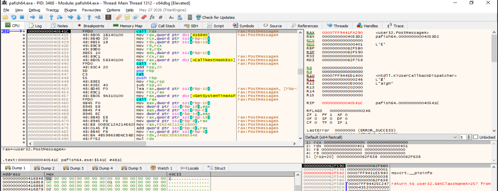

**Figura 9.7.4-6.** Estado inmediatamente anterior a `PostMessageA`: el volcado de memoria muestra `DWORD [0x416848] = 1` y los registros preparan `PostMessageA(NULL, 0x401, 0, 0)`. **Archivo: `capturas/06-success-true-postmessage-401.png`.**

Esta figura es la evidencia central de la rama condicionada. El clic no solo provoca la salida del bucle, sino que primero deja constancia de que la condición humana fue satisfecha.

##### 7. Recepción de `0x401` por el bucle de mensajes

Tras retornar del callback y continuar el procesamiento normal del *hook*, el breakpoint situado inmediatamente después de `GetMessageA` permite observar el mensaje generado por la rama del clic. La ejecución muestra:

```text
EAX = 1
MSG.message = 0x401
DWORD [0x416848] = 1
```

`GetMessageA` devuelve un valor positivo al recuperar un mensaje distinto de `WM_QUIT`. En la estructura `MSG`, el campo `message` contiene `0x401`, mientras la variable de éxito continúa valiendo `1`.

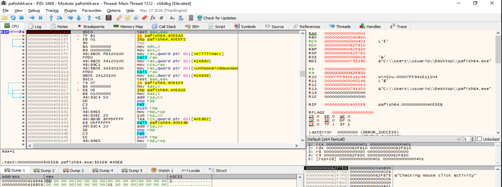

**Figura 9.7.4-7.** Recepción del mensaje personalizado `0x401` después del clic; el volcado conserva `0x416848 = 1`. **Archivo: `capturas/07-getmessage-401-success-true.png`.**

Microsoft documenta que `PostMessageA(NULL, ...)` publica el mensaje en la cola del hilo actual y que `GetMessageA` recupera mensajes de dicha cola. Esto explica la relación observada entre el callback y el bucle principal.

##### 8. Comparación de `MSG.message` y salida de la espera

El bucle copia el campo `MSG.message` a `EAX` y lo compara explícitamente con `0x401`:

```asm
mov eax, dword ptr [rbp-28]
cmp eax, 401h
je  4055F1
```

En el momento de la decisión x64dbg muestra:

```text
EAX = 0x401
ZF  = 1
Jump is taken
```

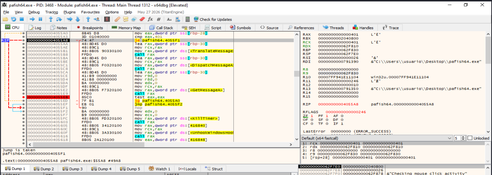

**Figura 9.7.4-8.** `MSG.message` coincide con `0x401`; `ZF = 1` y `Jump is taken` demuestran directamente el abandono del bucle. **Archivo: `capturas/08-comparacion-401-salida-bucle.png`.**

La salida del bucle ya no es una inferencia: el salto condicional observado confirma que `0x401` actúa como señal de terminación tanto para la rama temporal como para la rama de interacción.

##### 9. Limpieza y evaluación del resultado

Después de abandonar la espera, Pafish cancela el temporizador con `KillTimer` y elimina el *hook* mediante `UnhookWindowsHookEx`. A continuación lee el estado de `0x416848`:

```asm
mov eax, dword ptr ds:[416848]
test eax, eax
je   405629
```

En la ejecución de la rama del clic:

```text
EAX = 1
ZF  = 0
Jump is not taken
```

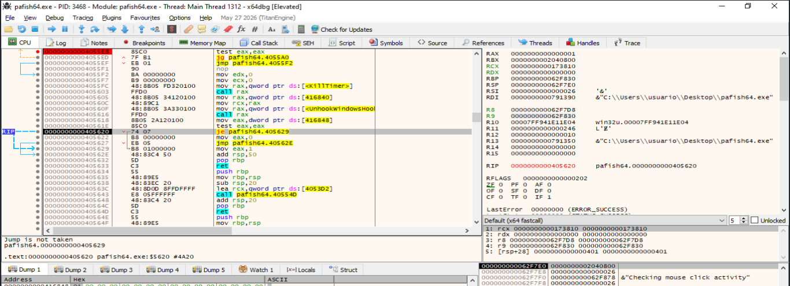

**Figura 9.7.4-9.** Evaluación final de `rtt_is_success`: `EAX = 1`, `ZF = 0` y el `je` no se toma. **Archivo: `capturas/09-evaluacion-success-true.png`.**

Al no tomarse el `je`, el código ejecuta `mov eax,0`. En Pafish, por tanto, la detección de interacción válida provoca que esta comprobación termine devolviendo `FALSE`: no se considera sospechoso el entorno por ausencia de clic.

##### 10. Retorno final de la rama con interacción

La última captura se tomó inmediatamente antes del `ret` de la rutina:

```text
RIP = 0x405633
EAX = 0
```

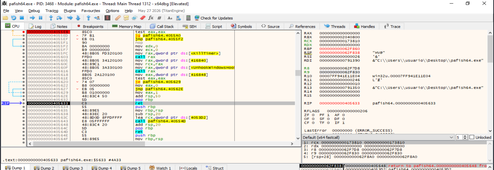

**Figura 9.7.4-10.** Retorno de la comprobación tras detectar interacción; `EAX = 0` confirma el resultado `FALSE`. **Archivo: `capturas/10-retorno-final-eax0.png`.**

Este detalle es importante para interpretar correctamente la prueba: `0x416848 = 1` significa **interacción detectada**, pero el valor retornado por la función se invierte. La implementación publicada de Pafish confirma esta semántica: si `rtt_is_success` es verdadero, la función devuelve `FALSE`; si no hubo éxito, devuelve `TRUE`.

#### Comparación de las dos ramas observadas

| Fase | Timeout | Interacción humana |
|---|---|---|
| Inicio | `SetTimer(..., 3000, 0x4053A4)` | `SetTimer(..., 3000, 0x4053A4)` |
| Monitorización | `WH_MOUSE_LL` activo | `WH_MOUSE_LL` activo |
| Evento decisivo | Expira el temporizador | `WM_LBUTTONUP = 0x202` antes de 3000 ms |
| Callback | `0x4053A4` | `0x4053D2` |
| `DWORD [0x416848]` | Permanece `0` | Se escribe `1` (`TRUE`) |
| Señal de salida | `PostMessageA(NULL, 0x401, 0, 0)` | `PostMessageA(NULL, 0x401, 0, 0)` |
| Bucle | `MSG.message == 0x401` → termina | `MSG.message == 0x401` → termina |
| Resultado de la comprobación | `TRUE` (`EAX = 1`) | `FALSE` (`EAX = 0`) |
| Interpretación en Pafish | No se validó el clic esperado; condición sospechosa | Se observó interacción; condición no sospechosa |

La clave está en que **`0x401` no identifica por sí solo el motivo de la salida**. Las dos ramas lo utilizan como mecanismo de sincronización. La diferencia semántica reside en `rtt_is_success` (`0x416848`).

#### Reconstrucción del comportamiento

El siguiente pseudocódigo es una reconstrucción explicativa del comportamiento observado y contrastado con el código fuente; no pretende ser una transcripción literal:

```c
bool success = false;

crear_temporizador(3000_ms, timer_proc);
instalar_hook_raton(WH_MOUSE_LL, click_proc);

while (obtener_mensaje(&msg) > 0) {
    if (msg.message == 0x401)
        break;

    traducir_y_despachar(msg);
}

cancelar_temporizador();
eliminar_hook();

return success ? false : true;

// timer_proc:
//     publicar(0x401)

// click_proc:
//     si evento == WM_LBUTTONUP:
//         success = true
//         publicar(0x401)
```

La técnica puede visualizarse de forma compacta como dos caminos que convergen en la misma señal de salida:

```text
SetTimer(3000 ms) + WH_MOUSE_LL
        |
        +--> vence el tiempo --> TIMERPROC 0x4053A4 --> PostMessageA(0x401)
        |                                              |
        +--> clic 0x202 --> [0x416848] = 1 ------------+--> GetMessageA
                         --> PostMessageA(0x401)              |
                                                              v
                                                  MSG.message == 0x401
                                                              |
                                                    salida del bucle
                                                              |
                                             evaluar [0x416848]
                                                /             \
                                               0               1
                                          retorno TRUE    retorno FALSE
```

#### Procedimiento reproducible en x64dbg

Para repetir la prueba sin perder la carrera contra el temporizador, los puntos de observación más útiles son:

| Punto | Breakpoint/condición | Objetivo |
|---|---|---|
| Creación del temporizador | `user32.SetTimer` | Ver `R8 = 0xBB8` y `R9 = 0x4053A4`. |
| Instalación del hook | `user32.SetWindowsHookExA`, opcional `RCX == 0xE` | Confirmar `WH_MOUSE_LL` y callback `0x4053D2`. |
| Timeout | `0x4053A4` | Entrar en la `TIMERPROC`. |
| Clic | `0x4053D2` con `RDX == 0x202` | Capturar únicamente `WM_LBUTTONUP`. |
| Después de `GetMessageA` | `0x4055EB` | Comprobar `EAX > 0` y `MSG.message = 0x401`. |
| Comparación de salida | `0x4055A8` | Ver `ZF = 1` y salto tomado. |
| Evaluación del estado | `0x405618` / `0x405620` | Ver lectura de `0x416848` y la decisión final. |
| Retorno | `0x405633` | Confirmar el valor final de `EAX`. |

Para capturar la rama del clic, conviene detenerse inicialmente en `SetTimer`, desactivar ese breakpoint sin ejecutar la llamada, dejar activo `0x4053D2` con la condición `RDX == 0x202`, reanudar con `F9` y realizar el clic inmediatamente. No es conveniente permanecer detenido en `SetWindowsHookExA`: `SetTimer` se ejecuta antes y los 3000 ms continúan transcurriendo mientras el proceso está suspendido en el depurador.

#### Evidencias obtenidas durante el análisis dinámico

| Evidencia | Captura | Significado |
|---|---|---|
| Temporizador de 3000 ms | `01-settimer-3000ms.png` | Demuestra el límite temporal y la dirección de `TIMERPROC`. |
| Hook de ratón | `02-setwindowshookex-wh-mouse-ll.png` | Demuestra `WH_MOUSE_LL` y el callback `0x4053D2`. |
| Rama de timeout | `03-timeout-timerproc-postmessage-401.png` | La expiración genera `PostMessageA(0x401)`. |
| Clic válido | `04-click-wm-lbuttonup-202.png` | El callback recibe `WM_LBUTTONUP = 0x202`. |
| Decisión del callback | `05-click-comparacion-zf1.png` | `ZF = 1`; el `jne` no se toma. |
| Estado de éxito y señal | `06-success-true-postmessage-401.png` | `0x416848 = 1` y preparación de `PostMessageA(0x401)`. |
| Recepción de la señal | `07-getmessage-401-success-true.png` | `GetMessageA` recupera `0x401` manteniendo `success = 1`. |
| Salida del bucle | `08-comparacion-401-salida-bucle.png` | `cmp 0x401`; `ZF = 1`; salto tomado. |
| Evaluación de `success` | `09-evaluacion-success-true.png` | `EAX = 1`; el `je` no se toma. |
| Retorno final | `10-retorno-final-eax0.png` | La rama con interacción retorna `EAX = 0`. |

#### Conclusión

El análisis dinámico confirma que Pafish implementa una comprobación basada en **ejecución condicionada y retardada**. La rutina concede una ventana máxima de 3000 ms y monitoriza simultáneamente la interacción mediante un *hook* `WH_MOUSE_LL`. Si se libera el botón izquierdo antes de que expire el tiempo, el callback recibe `WM_LBUTTONUP (0x202)`, establece `DWORD [0x416848] = 1` y publica `0x401`. Si no se produce la interacción, la `TIMERPROC` publica igualmente `0x401` al agotarse el tiempo, pero no modifica el indicador de éxito.

En ambos casos, `GetMessageA` recupera `0x401` y la comparación `MSG.message == 0x401` provoca la salida del bucle. Tras ejecutar `KillTimer` y `UnhookWindowsHookEx`, Pafish evalúa `0x416848`. Una interacción válida conduce a `EAX = 0` (`FALSE`), lo que indica que la comprobación no considera sospechoso el entorno por ausencia de clic; la expiración sin interacción mantiene el estado de fallo y conduce a `TRUE`.

Por tanto, la técnica queda demostrada tanto en su dimensión **temporal** —la ejecución está limitada por un temporizador— como en su dimensión **condicional** —el resultado depende de una interacción humana observada dentro de esa ventana—. La reconstrucción de ambas ramas evita interpretar erróneamente `0x401` como indicador exclusivo de timeout: se trata de una señal común de finalización, mientras que `0x416848` conserva la causa lógica de dicha finalización.

#### Referencias

1. Pafish, `pafish/rtt.c`, código fuente de la comprobación RTT y de actividad de ratón: https://github.com/a0rtega/pafish/blob/master/pafish/rtt.c
2. Microsoft Learn, `SetTimer function (winuser.h)`: https://learn.microsoft.com/en-us/windows/win32/api/winuser/nf-winuser-settimer
3. Microsoft Learn, `SetWindowsHookExA function (winuser.h)`: https://learn.microsoft.com/en-us/windows/win32/api/winuser/nf-winuser-setwindowshookexa
4. Microsoft Learn, `WM_LBUTTONUP message`: https://learn.microsoft.com/en-us/windows/win32/inputdev/wm-lbuttonup
5. Microsoft Learn, `PostMessageA function (winuser.h)`: https://learn.microsoft.com/en-us/windows/win32/api/winuser/nf-winuser-postmessagea
6. Microsoft Learn, `GetMessageA function (winuser.h)`: https://learn.microsoft.com/en-us/windows/win32/api/winuser/nf-winuser-getmessagea


---

## Referencias

1. MITRE ATT&CK. **T1497 — Virtualization/Sandbox Evasion**.  
   <https://attack.mitre.org/techniques/T1497/>

2. MITRE ATT&CK. **T1497.002 — User Activity Based Checks**.  
   <https://attack.mitre.org/techniques/T1497/002/>

3. MITRE ATT&CK. **DET0420 — Detect User Activity Based Sandbox Evasion via Input & Artifact Probing**.  
   <https://attack.mitre.org/detectionstrategies/DET0420/>

4. Microsoft Learn. **GetLastInputInfo function (winuser.h)**.  
   <https://learn.microsoft.com/windows/win32/api/winuser/nf-winuser-getlastinputinfo>

5. Microsoft Learn. **GetCursorPos function (winuser.h)**.  
   <https://learn.microsoft.com/windows/win32/api/winuser/nf-winuser-getcursorpos>

6. Material de referencia facilitado: **Evasions: Human-like behavior**.
