- [10. La técnica `global os objects`](#10-la-técnica-global-os-objects)
  - [10.1. Descripción de la técnica `global os objects`](#101-descripción-de-la-técnica-global-os-objects)
  - [10.2. Categoría](#102-categoría)
  - [10.3. Técnicas principales](#103-técnicas-principales)
    - [10.3.1. Comprobación de mutexes con nombre](#1031-comprobación-de-mutexes-con-nombre)
      - [Apertura directa](#apertura-directa)
      - [Creación y comprobación de existencia previa](#creación-y-comprobación-de-existencia-previa)
    - [10.3.2. Eventos, semáforos y temporizadores con nombre](#1032-eventos-semáforos-y-temporizadores-con-nombre)
    - [10.3.3. Uso de los namespaces `Global\` y `Local\`](#1033-uso-de-los-namespaces-global-y-local)
    - [10.3.4. Objetos de mapeo de archivos y memoria compartida](#1034-objetos-de-mapeo-de-archivos-y-memoria-compartida)
    - [10.3.5. Búsqueda de named pipes](#1035-búsqueda-de-named-pipes)
    - [10.3.6. Dispositivos y rutas especiales](#1036-dispositivos-y-rutas-especiales)
    - [10.3.7. Enumeración del namespace del Object Manager](#1037-enumeración-del-namespace-del-object-manager)
    - [10.3.8. Correlación de handles y procesos](#1038-correlación-de-handles-y-procesos)
  - [10.4. Resumen visual de las técnicas que aparecen en `global os objects`](#104-resumen-visual-de-las-técnicas-que-aparecen-en-global-os-objects)
  - [10.5. Contramedidas ofensivas](#105-contramedidas-ofensivas)
  - [10.6. Contramedidas defensivas](#106-contramedidas-defensivas)
  - [10.7. Checklist rápido del laboratorio](#107-checklist-rápido-del-laboratorio)
    - [Preparación del entorno](#preparación-del-entorno)
    - [Análisis estático previo](#análisis-estático-previo)
    - [Inventario con WinObj](#inventario-con-winobj)
    - [Inventario con Process Explorer y Handle](#inventario-con-process-explorer-y-handle)
    - [Inventario de named pipes](#inventario-de-named-pipes)
    - [Pruebas con mutexes](#pruebas-con-mutexes)
    - [Pruebas con eventos y semáforos](#pruebas-con-eventos-y-semáforos)
    - [Pruebas con file mappings](#pruebas-con-file-mappings)
    - [Pruebas con named pipes y dispositivos](#pruebas-con-named-pipes-y-dispositivos)
    - [Pruebas con `NtQueryDirectoryObject`](#pruebas-con-ntquerydirectoryobject)
    - [Interpretación de los resultados](#interpretación-de-los-resultados)
    - [Evidencias que deben documentarse](#evidencias-que-deben-documentarse)
    - [Conclusión del checklist](#conclusión-del-checklist)
  - [10.8. Análisis dinámico de la técnica `global os objects`](#108-análisis-dinámico-de-la-técnica-global-os-objects)
- [10.8.1. Análisis de mutexes, eventos y semáforos — Global OS Objects](#1081-análisis-de-mutexes-eventos-y-semáforos--global-os-objects)
  - [10.8.1.1. Demostración dinámica de mutexes con nombre](#10811-demostración-dinámica-de-mutexes-con-nombre)
    - [Objetivo de la demostración](#objetivo-de-la-demostración)
    - [Preparación del laboratorio](#preparación-del-laboratorio)
  - [Creación inicial del mutex](#creación-inicial-del-mutex)
  - [Interceptación de `CreateMutexW` en la segunda instancia](#interceptación-de-createmutexw-en-la-segunda-instancia)
  - [Retorno de `CreateMutexW` cuando el mutex ya existe](#retorno-de-createmutexw-cuando-el-mutex-ya-existe)
  - [Interceptación de `GetLastError`](#interceptación-de-getlasterror)
  - [Confirmación de `ERROR_ALREADY_EXISTS`](#confirmación-de-error_already_exists)
  - [Apertura del mutex mediante `OpenMutexW`](#apertura-del-mutex-mediante-openmutexw)
  - [Retorno satisfactorio de `OpenMutexW`](#retorno-satisfactorio-de-openmutexw)
  - [Liberación del mutex](#liberación-del-mutex)
  - [`OpenMutexW` cuando el mutex no existe](#openmutexw-cuando-el-mutex-no-existe)
  - [Retorno `NULL` de `OpenMutexW`](#retorno-null-de-openmutexw)
  - [Confirmación de `ERROR_FILE_NOT_FOUND`](#confirmación-de-error_file_not_found)
  - [Comparación de los cuatro escenarios](#comparación-de-los-cuatro-escenarios)
  - [Relación con la técnica `Global OS Objects`](#relación-con-la-técnica-global-os-objects)
  - [Evidencias obtenidas](#evidencias-obtenidas)
  - [Limitaciones](#limitaciones)
  - [Conclusión](#conclusión)
- [10.8.2. Análisis de Named Pipes mediante `CreateFileW`](#1082-análisis-de-named-pipes-mediante-createfilew)
  - [10.8.2.1. Objetivo de la demostración](#10821-objetivo-de-la-demostración)
  - [10.8.2.2. Preparación del laboratorio](#10822-preparación-del-laboratorio)
  - [10.8.2.3. Apertura inicial del servidor](#10823-apertura-inicial-del-servidor)
  - [10.8.2.4. Interceptación de `CreateNamedPipeW`](#10824-interceptación-de-createnamedpipew)
  - [10.8.2.5. Retorno satisfactorio de `CreateNamedPipeW`](#10825-retorno-satisfactorio-de-createnamedpipew)
  - [10.8.2.6. Espera de conexiones mediante `ConnectNamedPipe`](#10826-espera-de-conexiones-mediante-connectnamedpipe)
  - [10.8.2.7. Confirmación de la pipe mediante PipeList](#10827-confirmación-de-la-pipe-mediante-pipelist)
  - [10.8.2.8. Apertura de la Named Pipe mediante `CreateFileW`](#10828-apertura-de-la-named-pipe-mediante-createfilew)
  - [10.8.2.9. Apertura satisfactoria de la Named Pipe](#10829-apertura-satisfactoria-de-la-named-pipe)
  - [10.8.2.10. Cierre del servidor y desaparición de la pipe](#108210-cierre-del-servidor-y-desaparición-de-la-pipe)
  - [10.8.2.11. `CreateFileW` cuando la pipe no existe](#108211-createfilew-cuando-la-pipe-no-existe)
  - [10.8.2.12. Retorno de `INVALID_HANDLE_VALUE`](#108212-retorno-de-invalid_handle_value)
  - [10.8.2.13. Confirmación mediante `GetLastError`](#108213-confirmación-mediante-getlasterror)
  - [10.8.2.14. Comparación de resultados](#108214-comparación-de-resultados)
  - [10.8.2.15. Relación con técnicas anti-VM y anti-sandbox](#108215-relación-con-técnicas-anti-vm-y-anti-sandbox)
  - [10.8.2.16. Evidencias obtenidas](#108216-evidencias-obtenidas)
  - [10.8.2.17. Limitaciones](#108217-limitaciones)
  - [10.8.2.18. Conclusión](#108218-conclusión)
- [10.8.3. Análisis de dispositivos / interfaces del hipervisor mediante `CreateFileW`](#1083-análisis-de-dispositivos--interfaces-del-hipervisor-mediante-createfilew)
  - [10.8.3.1. Objetivo de la demostración](#10831-objetivo-de-la-demostración)
  - [10.8.3.2. Preparación del laboratorio](#10832-preparación-del-laboratorio)
  - [10.8.3.3. Interceptación de `CreateFileW` sobre `VBoxMiniRdrDN`](#10833-interceptación-de-createfilew-sobre-vboxminirdrdn)
  - [10.8.3.4. Retorno satisfactorio de `CreateFileW`](#10834-retorno-satisfactorio-de-createfilew)
  - [10.8.3.5. Comparación con `INVALID_HANDLE_VALUE`](#10835-comparación-con-invalid_handle_value)
  - [10.8.3.6. Cierre del handle mediante `CloseHandle`](#10836-cierre-del-handle-mediante-closehandle)
  - [10.8.3.7. Reconstrucción de la lógica de detección](#10837-reconstrucción-de-la-lógica-de-detección)
  - [10.8.3.8. Diferencia respecto a Named Pipes](#10838-diferencia-respecto-a-named-pipes)
  - [10.8.3.9. Comparación con un resultado negativo](#10839-comparación-con-un-resultado-negativo)
    - [Resultado positivo](#resultado-positivo)
    - [Resultado negativo](#resultado-negativo)
  - [10.8.3.10. Relación con la evasión de virtualización](#108310-relación-con-la-evasión-de-virtualización)
  - [10.8.3.11. Evidencias obtenidas](#108311-evidencias-obtenidas)
  - [10.8.3.12. Limitaciones](#108312-limitaciones)
  - [10.8.3.13. Conclusión](#108313-conclusión)
- [10.8.4. Enumeración del Object Manager mediante `NtQueryObject`](#1084-enumeración-del-object-manager-mediante-ntqueryobject)
  - [10.8.4.1. Objetivo de la demostración](#10841-objetivo-de-la-demostración)
  - [10.8.4.2. Preparación del laboratorio](#10842-preparación-del-laboratorio)
  - [10.8.4.3. Primera llamada a `NtQueryObject`](#10843-primera-llamada-a-ntqueryobject)
  - [10.8.4.4. `STATUS_INFO_LENGTH_MISMATCH` y obtención del tamaño requerido](#10844-status_info_length_mismatch-y-obtención-del-tamaño-requerido)
  - [10.8.4.5. Reserva del buffer mediante `VirtualAlloc`](#10845-reserva-del-buffer-mediante-virtualalloc)
  - [10.8.4.6. Retorno de `VirtualAlloc` y dirección del buffer](#10846-retorno-de-virtualalloc-y-dirección-del-buffer)
  - [10.8.4.7. Segunda llamada a `NtQueryObject`](#10847-segunda-llamada-a-ntqueryobject)
  - [10.8.4.8. Cómo se rellena la memoria observada en el Dump](#10848-cómo-se-rellena-la-memoria-observada-en-el-dump)
    - [Estado antes de la segunda llamada](#estado-antes-de-la-segunda-llamada)
    - [Paso de la dirección a `NtQueryObject`](#paso-de-la-dirección-a-ntqueryobject)
    - [Escritura del resultado](#escritura-del-resultado)
  - [10.8.4.9. `STATUS_SUCCESS` y buffer ya rellenado](#10849-status_success-y-buffer-ya-rellenado)
  - [10.8.4.10. Búsqueda de `DebugObject`](#108410-búsqueda-de-debugobject)
  - [10.8.4.11. `DebugObject` visible directamente en el Dump](#108411-debugobject-visible-directamente-en-el-dump)
  - [10.8.4.12. Reconstrucción completa de la técnica](#108412-reconstrucción-completa-de-la-técnica)
  - [10.8.4.13. Relación con técnicas anti-análisis](#108413-relación-con-técnicas-anti-análisis)
  - [10.8.4.14. Evidencias obtenidas](#108414-evidencias-obtenidas)
  - [10.8.4.15. Limitaciones](#108415-limitaciones)
  - [10.8.4.16. Conclusión](#108416-conclusión)
- [10.8.5. Job Objects mediante `QueryInformationJobObject`](#1085-job-objects-mediante-queryinformationjobobject)
  - [10.8.5.1. Objetivo de la demostración](#10851-objetivo-de-la-demostración)
  - [10.8.5.2. Preparación del laboratorio](#10852-preparación-del-laboratorio)
  - [10.8.5.3. Entrada en `QueryInformationJobObject`](#10853-entrada-en-queryinformationjobobject)
  - [10.8.5.4. Retorno satisfactorio de `QueryInformationJobObject`](#10854-retorno-satisfactorio-de-queryinformationjobobject)
  - [10.8.5.5. Estructura `JOBOBJECT_BASIC_PROCESS_ID_LIST`](#10855-estructura-jobobject_basic_process_id_list)
  - [10.8.5.6. Validación externa de los PID mediante PowerShell](#10856-validación-externa-de-los-pid-mediante-powershell)
  - [10.8.5.7. Comparación con `GetCurrentProcessId`](#10857-comparación-con-getcurrentprocessid)
  - [10.8.5.8. Apertura del proceso externo mediante `OpenProcess`](#10858-apertura-del-proceso-externo-mediante-openprocess)
  - [10.8.5.9. Retorno de `OpenProcess`](#10859-retorno-de-openprocess)
  - [10.8.5.10. Identificación del proceso mediante `K32GetProcessImageFileNameW`](#108510-identificación-del-proceso-mediante-k32getprocessimagefilenamew)
  - [10.8.5.11. Retorno de `K32GetProcessImageFileNameW`](#108511-retorno-de-k32getprocessimagefilenamew)
  - [10.8.5.12. Ruta de `x64dbg.exe` en el Dump](#108512-ruta-de-x64dbgexe-en-el-dump)
  - [10.8.5.13. Lógica de decisión de al-khaser](#108513-lógica-de-decisión-de-al-khaser)
  - [10.8.5.14. Resultado final de la comprobación](#108514-resultado-final-de-la-comprobación)
  - [10.8.5.15. Reconstrucción completa de la técnica](#108515-reconstrucción-completa-de-la-técnica)
  - [10.8.5.16. Evidencias obtenidas](#108516-evidencias-obtenidas)
  - [10.8.5.17. Limitaciones](#108517-limitaciones)
  - [10.8.5.18. Conclusión](#108518-conclusión)


# 10. La técnica `global os objects`

## 10.1. Descripción de la técnica `global os objects`

La técnica `global os objects` consiste en identificar **objetos globales, objetos con nombre y otros artefactos expuestos por el sistema operativo Windows** que pueden revelar la presencia de una máquina virtual, una sandbox, herramientas de análisis o componentes instalados por un hipervisor.

Windows representa numerosos recursos internos mediante objetos gestionados por el **Object Manager**. Entre ellos se encuentran procesos, hilos, dispositivos, eventos, mutexes, semáforos, secciones de memoria, trabajos, enlaces simbólicos y otros tipos de objetos. Algunos de estos recursos pueden recibir un nombre y quedar accesibles desde otros procesos, lo que permite utilizarlos como mecanismos de sincronización, comunicación entre procesos o intercambio de memoria.

Desde el punto de vista de la evasión, una muestra puede aprovechar esta característica para comprobar si existe un objeto cuyo nombre esté asociado con:

- Un hipervisor.
- Las Guest Additions o herramientas de integración de una máquina virtual.
- Una sandbox.
- Una herramienta de análisis.
- Un proceso de monitorización.
- Otra instancia del propio programa.
- Un componente de comunicación entre el host y la máquina virtual.

La lógica general puede representarse de la siguiente forma:

```text
Seleccionar un nombre o artefacto conocido
        ↓
Intentar abrirlo, crearlo o enumerarlo
        ↓
Comprobar el resultado de la operación
        ↓
Determinar si el objeto ya existía
        ↓
Interpretar el artefacto encontrado
        ↓
Modificar o mantener el flujo de ejecución
```

Una de las variantes más habituales consiste en comprobar **objetos de sincronización con nombre**, especialmente mutexes. Una aplicación puede intentar abrir un mutex mediante `OpenMutex` o utilizar `CreateMutex` y consultar posteriormente `GetLastError`. Si el objeto ya existía, Windows puede devolver un identificador válido y establecer el código `ERROR_ALREADY_EXISTS`.

La misma idea puede aplicarse a otros objetos con nombre como:

- Eventos.
- Semáforos.
- Temporizadores de espera.
- Objetos de mapeo de archivos.
- Objetos de trabajo.
- Determinados enlaces simbólicos.

Windows dispone además de diferentes espacios de nombres para estos objetos. Un proceso puede utilizar el prefijo:

```text
Global\
```

para acceder al espacio global, o:

```text
Local\
```

para utilizar explícitamente el espacio de la sesión actual.

Por ejemplo:

```text
Global\NombreObjeto
Local\NombreObjeto
```

Esta distinción es especialmente relevante en sistemas con múltiples sesiones, ya que un objeto creado en el espacio global puede ser visible desde procesos pertenecientes a sesiones distintas, siempre que los permisos lo permitan.

Debe diferenciarse este mecanismo de las **named pipes**. Las canalizaciones con nombre utilizan su propio espacio de nombres y normalmente se referencian mediante rutas como:

```text
\\.\pipe\NombrePipe
```

Aunque las named pipes no utilizan el prefijo `Global\` de los objetos de sincronización, suelen incluirse dentro de la categoría práctica `global os objects` porque constituyen artefactos globalmente observables del sistema y pueden revelar servicios de virtualización, sandboxes o mecanismos de IPC.

También puede realizarse una enumeración directa del espacio de nombres del Object Manager mediante funciones nativas como:

```text
NtOpenDirectoryObject
NtQueryDirectoryObject
NtOpenSymbolicLinkObject
```

Estas funciones permiten inspeccionar directorios del espacio de objetos y recuperar el nombre y el tipo de los elementos presentes. Una herramienta puede utilizar este procedimiento para buscar artefactos concretos sin conocer necesariamente de antemano qué proceso mantiene abierto cada objeto.

En herramientas educativas como `pafish` aparecen comprobaciones que intentan abrir dispositivos y pipes relacionados con VirtualBox utilizando `CreateFile`. El principio es el mismo: si una ruta asociada a un componente de virtualización puede abrirse correctamente, el resultado puede utilizarse como indicio de que dicho componente está presente.

No obstante, la existencia de un único objeto no demuestra por sí sola que el sistema sea virtualizado o esté sometido a análisis. Los nombres pueden coincidir con aplicaciones legítimas, los objetos pueden haber sido creados artificialmente y algunas herramientas de virtualización pueden no instalar determinados componentes. Por ello, esta técnica debe considerarse **heurística** y correlacionarse con otras evidencias.

---

## 10.2. Categoría

La técnica `global os objects` se clasifica dentro de las técnicas de **evasión y anti-análisis**, especialmente como mecanismo **anti-VM** y **anti-sandbox**. Dependiendo del artefacto buscado, también puede participar en técnicas anti-debug o de control de ejecución.

Dentro de una taxonomía de evasión puede representarse de la siguiente forma:

| Campo | Clasificación |
|---|---|
| Categoría | Evasión / Anti-análisis |
| Subcategoría | Anti-VM / Anti-sandbox / reconocimiento del entorno |
| Tipo de artefacto | Objetos con nombre, handles, pipes, dispositivos y namespace del Object Manager |
| Sistema principal | Windows |
| Fuente de información | Object Manager, Win32 API, Native API y NPFS |
| Prioridad para el TFM | Alta |

Desde el punto de vista de MITRE ATT&CK, la búsqueda de artefactos asociados a máquinas virtuales o sandboxes puede relacionarse principalmente con:

```text
T1497.001 — Virtualization/Sandbox Evasion: System Checks
```

Cuando un mutex se utiliza para impedir que una segunda instancia continúe su ejecución, el comportamiento también puede relacionarse con:

```text
T1480.002 — Execution Guardrails: Mutual Exclusion
```

Estas dos situaciones deben diferenciarse:

```text
Mutex usado para buscar una VM o sandbox
        ↓
Técnica de reconocimiento / evasión del entorno

Mutex usado para evitar dos instancias del mismo programa
        ↓
Control de ejecución / exclusión mutua
```

Por tanto, la presencia de `CreateMutex`, `OpenMutex` o un objeto `Global\...` no es suficiente para clasificar automáticamente el comportamiento como anti-VM. Es necesario determinar:

- Qué nombre se utiliza.
- Si el nombre está asociado a un producto concreto.
- Si la muestra intenta abrir un objeto preexistente.
- Si comprueba `ERROR_ALREADY_EXISTS`.
- Si enumera múltiples objetos.
- Qué comparación se realiza posteriormente.
- Si el resultado modifica el flujo de ejecución.

Una secuencia especialmente significativa sería:

```text
OpenMutex / CreateMutex
        ↓
Nombre asociado a un entorno de análisis
        ↓
Objeto encontrado
        ↓
Comparación del resultado
        ↓
Finalización o rama alternativa
```

En cambio, una secuencia como:

```text
CreateMutex
        ↓
Nombre propio de la aplicación
        ↓
ERROR_ALREADY_EXISTS
        ↓
Salir para evitar una segunda instancia
```

puede corresponder simplemente a un mecanismo legítimo de exclusión mutua.

---

## 10.3. Técnicas principales

La categoría `global os objects` engloba diferentes mecanismos que comparten un mismo principio: **consultar el estado global o semiglobal del sistema mediante objetos que pueden ser visibles entre procesos**.

Entre las principales variantes se encuentran:

- Comprobación de mutexes con nombre.
- Comprobación de eventos y semáforos con nombre.
- Uso del espacio `Global\` y `Local\`.
- Comprobación de objetos de mapeo de archivos y memoria compartida.
- Búsqueda de named pipes.
- Apertura de dispositivos o rutas especiales mediante `CreateFile`.
- Enumeración directa del namespace del Object Manager.
- Comprobación de enlaces simbólicos u objetos de dispositivo.
- Correlación entre objetos y procesos que mantienen handles abiertos.

La secuencia genérica es:

```text
Artefacto esperado
        ↓
Consulta del sistema
        ↓
Objeto encontrado / no encontrado
        ↓
Interpretación heurística
        ↓
Cambio opcional del comportamiento
```

Desde el punto de vista del análisis de malware, la evidencia resulta más sólida cuando la comprobación utiliza nombres asociados a software de virtualización o análisis y cuando el resultado controla explícitamente una rama del programa.

---

### 10.3.1. Comprobación de mutexes con nombre

Los mutexes son objetos de sincronización utilizados para garantizar acceso exclusivo a un recurso. Windows permite crear mutexes con nombre para que distintos procesos puedan referirse al mismo objeto.

Las APIs principales son:

```text
CreateMutexA
CreateMutexW
CreateMutexExA
CreateMutexExW
OpenMutexA
OpenMutexW
```

Una aplicación puede comprobar la existencia de un mutex mediante dos estrategias.

#### Apertura directa

```text
OpenMutex
        ↓
Handle válido
        ↓
El objeto existe
```

Conceptualmente:

```c
HANDLE h = OpenMutexW(SYNCHRONIZE, FALSE, L"Global\\ObjetoPrueba");

if (h != NULL) {
    // El mutex existe
}
```

#### Creación y comprobación de existencia previa

La segunda estrategia consiste en utilizar `CreateMutex`:

```c
HANDLE h = CreateMutexW(NULL, FALSE, L"Global\\ObjetoPrueba");

if (h != NULL && GetLastError() == ERROR_ALREADY_EXISTS) {
    // El objeto ya existía
}
```

Si el mutex no existía, se crea. Si ya existía, la función devuelve un handle al objeto existente y `GetLastError` puede indicar:

```text
ERROR_ALREADY_EXISTS
```

Este patrón es importante durante el análisis dinámico porque la llamada puede **haber tenido éxito** aunque el programa considere que el artefacto ya existía.

Por ello, no debe analizarse únicamente:

```text
RAX == NULL
```

sino también:

```text
GetLastError()
```

y las comparaciones posteriores.

Los mutexes pueden emplearse para dos finalidades diferentes:

```text
1. Evitar varias instancias del mismo programa.

2. Buscar un objeto previamente conocido asociado
   a una VM, sandbox o herramienta de análisis.
```

La interpretación depende del nombre y del contexto.

---

### 10.3.2. Eventos, semáforos y temporizadores con nombre

Además de los mutexes, Windows permite asignar nombres a otros mecanismos de sincronización.

Entre las APIs relevantes se encuentran:

```text
CreateEventA
CreateEventW
OpenEventA
OpenEventW

CreateSemaphoreA
CreateSemaphoreW
OpenSemaphoreA
OpenSemaphoreW

CreateWaitableTimerA
CreateWaitableTimerW
OpenWaitableTimerA
OpenWaitableTimerW
```

Estos objetos pueden utilizarse como artefactos porque un proceso puede intentar abrir un nombre concreto y determinar si ya existe.

Para eventos y semáforos, el patrón de creación puede comportarse de forma similar a los mutexes:

```text
CreateEvent / CreateSemaphore
        ↓
Handle válido
        ↓
GetLastError
        ↓
ERROR_ALREADY_EXISTS
        ↓
El objeto existía previamente
```

El uso legítimo de estos objetos es muy común. Por ello, la evidencia anti-análisis aumenta cuando:

- El nombre contiene cadenas asociadas a una VM o sandbox.
- Se consultan varios objetos consecutivamente.
- El programa no utiliza posteriormente el objeto para sincronización real.
- La única finalidad observable es comprobar su presencia.
- El resultado condiciona una rama de detección.

---

### 10.3.3. Uso de los namespaces `Global\` y `Local\`

Windows mantiene distintos espacios de nombres para determinados objetos con nombre.

Los objetos compatibles incluyen:

- Eventos.
- Semáforos.
- Mutexes.
- Temporizadores de espera.
- Objetos de mapeo de archivos.
- Jobs.
- Determinados enlaces simbólicos.

Un proceso perteneciente a una sesión de usuario utiliza normalmente el espacio asociado a dicha sesión. El prefijo:

```text
Global\
```

permite solicitar explícitamente el espacio global.

El prefijo:

```text
Local\
```

permite solicitar explícitamente el espacio correspondiente a la sesión.

Ejemplos:

```text
Global\AnalisisObjeto
Local\AnalisisObjeto
```

La técnica puede aprovechar esta característica para buscar objetos creados por servicios o componentes que se ejecutan fuera de la sesión del usuario.

Desde el punto de vista del análisis dinámico deben registrarse:

- El nombre completo.
- La presencia del prefijo.
- La sesión del proceso.
- Los permisos solicitados.
- El resultado de la apertura.
- El código devuelto por `GetLastError`.
- El proceso que mantiene el objeto abierto.

También debe tenerse en cuenta que varios tipos de objetos comparten el mismo espacio de nombres. Si se intenta crear un mutex con el mismo nombre que un evento, semáforo, temporizador, job o file mapping ya existente, la operación puede fallar con:

```text
ERROR_INVALID_HANDLE
```

Este comportamiento puede ser relevante si la muestra distingue entre:

```text
Objeto del mismo tipo ya existente
```

y:

```text
Nombre ocupado por otro tipo de objeto
```

---

### 10.3.4. Objetos de mapeo de archivos y memoria compartida

Los objetos de mapeo de archivos permiten compartir regiones de memoria entre procesos. Cuando se utiliza:

```text
INVALID_HANDLE_VALUE
```

como archivo subyacente, el objeto puede estar respaldado por el archivo de paginación del sistema.

Las APIs más relevantes son:

```text
CreateFileMappingA
CreateFileMappingW
OpenFileMappingA
OpenFileMappingW
MapViewOfFile
UnmapViewOfFile
```

Una aplicación puede crear un objeto de memoria compartida con nombre:

```text
Global\NombreMapping
```

y otro proceso puede intentar abrirlo mediante `OpenFileMapping`.

El patrón de comprobación puede ser:

```text
CreateFileMapping
        ↓
GetLastError
        ↓
ERROR_ALREADY_EXISTS
        ↓
El mapping ya existía
```

o:

```text
OpenFileMapping
        ↓
Handle válido
        ↓
Objeto encontrado
```

Desde el punto de vista anti-análisis, un mapping con nombre puede ser interesante si pertenece a:

- Un servicio de monitorización.
- Un agente de sandbox.
- Un componente de virtualización.
- Un canal de comunicación entre procesos.
- Una herramienta de instrumentación.

No obstante, estos objetos también son ampliamente utilizados por software legítimo. La interpretación debe realizarse siempre en función del nombre y del comportamiento posterior.

---

### 10.3.5. Búsqueda de named pipes

Las named pipes son mecanismos de IPC que permiten comunicación entre procesos locales o remotos.

Su sintaxis habitual es:

```text
\\.\pipe\NombrePipe
```

Las funciones principales incluyen:

```text
CreateNamedPipeA
CreateNamedPipeW
ConnectNamedPipe
WaitNamedPipeA
WaitNamedPipeW
CallNamedPipeA
CallNamedPipeW
CreateFileA
CreateFileW
PeekNamedPipe
```

Un proceso que actúa como cliente puede comprobar si existe una pipe intentando abrirla mediante:

```text
CreateFile
```

Por ejemplo, conceptualmente:

```c
HANDLE h = CreateFileW(
    L"\\\\.\\pipe\\NombrePipe",
    GENERIC_READ,
    0,
    NULL,
    OPEN_EXISTING,
    0,
    NULL
);
```

Si la operación devuelve un handle válido, la pipe existe y el proceso dispone de permisos suficientes para abrirla.

Una comprobación habitual puede seguir la secuencia:

```text
Construir \\.\pipe\Nombre
        ↓
CreateFile
        ↓
¿INVALID_HANDLE_VALUE?
        ↓
No
        ↓
Pipe encontrada
        ↓
Cambiar comportamiento
```

Las pipes resultan especialmente interesantes para esta categoría porque determinados componentes de virtualización, agentes, servicios y herramientas de análisis pueden utilizar nombres reconocibles.

Herramientas educativas como `pafish` incluyen comprobaciones basadas en la apertura de rutas y pipes relacionadas con VirtualBox. Este tipo de prueba demuestra que un artefacto de IPC puede utilizarse como indicador del entorno.

Debe destacarse que las named pipes **no pertenecen al mismo namespace `Global\`/`Local\`** utilizado por mutexes, eventos o mappings. Están implementadas por el Named Pipe File System (`NPFS`) y se enumeran de forma diferente.

---

### 10.3.6. Dispositivos y rutas especiales

Windows permite abrir dispositivos y otros objetos mediante `CreateFile`, utilizando rutas especiales.

Algunas herramientas anti-VM intentan abrir nombres asociados a componentes instalados por el hipervisor.

La secuencia general puede ser:

```text
CreateFile(
    "\\\\.\\NombreDispositivo",
    ...
)
        ↓
Handle válido
        ↓
El dispositivo o interfaz está disponible
```

Las rutas comprobadas pueden corresponder a:

- Interfaces de dispositivo.
- Componentes de Guest Additions.
- Drivers.
- Canales IPC.
- Objetos expuestos mediante enlaces simbólicos.

En el código de `pafish`, por ejemplo, aparecen intentos de apertura de rutas asociadas a VirtualBox mediante `CreateFile`.

Durante el análisis no debe suponerse que toda llamada a `CreateFile` representa acceso a un archivo convencional. El primer argumento puede corresponder a:

```text
C:\ruta\archivo
\\.\pipe\Nombre
\\.\NombreDispositivo
```

Por ello, el valor completo de `lpFileName` constituye una evidencia esencial.

---

### 10.3.7. Enumeración del namespace del Object Manager

Una variante más genérica consiste en enumerar directamente el espacio de nombres del Object Manager.

Entre las funciones nativas relevantes se encuentran:

```text
NtOpenDirectoryObject
NtQueryDirectoryObject
NtOpenSymbolicLinkObject
NtQuerySymbolicLinkObject
```

`NtQueryDirectoryObject` puede devolver estructuras que contienen:

```text
Name
TypeName
```

Esto permite recorrer un directorio del Object Manager e identificar simultáneamente el nombre y el tipo del objeto.

La secuencia conceptual sería:

```text
NtOpenDirectoryObject
        ↓
Obtener handle al directorio
        ↓
NtQueryDirectoryObject
        ↓
Recibir Name + TypeName
        ↓
Comparar nombres con una lista
        ↓
Artefacto encontrado
```

Esta variante puede ser más flexible que realizar múltiples llamadas `OpenMutex`, `OpenEvent` u `OpenFileMapping`, porque permite observar varios objetos mediante una única rutina de enumeración.

Durante el análisis estático puede resultar más difícil localizarla si las funciones nativas se resuelven dinámicamente mediante:

```text
LoadLibrary
GetProcAddress
```

Por ello, conviene buscar también cadenas como:

```text
NtQueryDirectoryObject
NtOpenDirectoryObject
OBJECT_DIRECTORY_INFORMATION
```

y observar la resolución dinámica de funciones de `ntdll.dll`.

---

### 10.3.8. Correlación de handles y procesos

La existencia de un objeto adquiere mayor valor analítico cuando puede determinarse qué proceso lo mantiene abierto.

Herramientas como:

```text
Process Explorer
Handle
WinObj
```

permiten relacionar:

```text
Nombre del objeto
        ↓
Tipo del objeto
        ↓
Handle abierto
        ↓
Proceso propietario
```

Esta correlación ayuda a distinguir entre:

```text
Objeto legítimo de una aplicación normal
```

y:

```text
Objeto creado por un componente de virtualización,
sandbox o herramienta de análisis
```

También permite confirmar si el objeto permanece activo únicamente mientras se ejecuta un determinado servicio.

---

## 10.4. Resumen visual de las técnicas que aparecen en `global os objects`

El objetivo general de esta categoría consiste en identificar **artefactos del sistema que pueden observarse mediante nombres, handles o namespaces**.

```text
global os objects
│
├── 1. Objetos de sincronización con nombre
│   │
│   ├── Mutex
│   ├── Event
│   ├── Semaphore
│   └── Waitable Timer
│
├── 2. Namespaces de objetos
│   │
│   ├── Global\
│   └── Local\
│
├── 3. Memoria compartida
│   │
│   ├── CreateFileMapping
│   ├── OpenFileMapping
│   └── MapViewOfFile
│
├── 4. Named pipes
│   │
│   ├── \\.\pipe\Nombre
│   ├── CreateFile
│   ├── WaitNamedPipe
│   └── CreateNamedPipe
│
├── 5. Dispositivos y rutas especiales
│   │
│   ├── \\.\NombreDispositivo
│   └── CreateFile
│
├── 6. Enumeración del Object Manager
│   │
│   ├── NtOpenDirectoryObject
│   ├── NtQueryDirectoryObject
│   ├── NtOpenSymbolicLinkObject
│   └── NtQuerySymbolicLinkObject
│
└── 7. Correlación de handles
    │
    ├── WinObj
    ├── Process Explorer
    ├── Handle
    └── PipeList
```

La siguiente tabla resume las principales variantes:

| Técnica | Qué consulta | Indicador observado | Posible interpretación |
|---|---|---|---|
| `CreateMutex` / `OpenMutex` | Mutex con nombre | Handle válido o `ERROR_ALREADY_EXISTS` | Objeto previamente creado |
| `CreateEvent` / `OpenEvent` | Evento con nombre | Objeto encontrado | IPC o sincronización existente |
| `CreateSemaphore` / `OpenSemaphore` | Semáforo con nombre | Objeto encontrado | Componente o servicio activo |
| `Global\...` | Namespace global | Objeto accesible entre sesiones | Servicio o componente global |
| `CreateFileMapping` / `OpenFileMapping` | Mapping con nombre | Handle válido o existencia previa | Memoria compartida activa |
| `CreateFile` sobre `\\.\pipe\...` | Named pipe | Handle válido | Canal IPC existente |
| `CreateFile` sobre `\\.\...` | Dispositivo o interfaz | Handle válido | Driver o componente disponible |
| `NtQueryDirectoryObject` | Directorio del Object Manager | Nombre y tipo de objetos | Enumeración genérica de artefactos |
| WinObj / Handle | Handles y objetos | Proceso propietario | Correlación del artefacto |

Una comprobación especialmente relevante puede adoptar la siguiente estructura:

```text
Nombre asociado a VM / sandbox
        ↓
OpenMutex / OpenEvent / OpenFileMapping / CreateFile
        ↓
Objeto encontrado
        ↓
Comparación
        ↓
Salto condicional
        ↓
Finalización o rama alternativa
```

Ninguna de estas técnicas debe interpretarse aisladamente como prueba definitiva de virtualización.

Un objeto puede existir por:

- Software legítimo.
- Una prueba anterior.
- Una herramienta de laboratorio.
- Un nombre coincidente.
- Un artefacto creado deliberadamente.
- Un componente de virtualización real.

Por ello, la evidencia resulta más sólida cuando aparecen múltiples indicadores coherentes entre sí.

---

## 10.5. Contramedidas ofensivas

Desde una perspectiva ofensiva, las contramedidas asociadas a `global os objects` buscan aumentar la fiabilidad de la detección y dificultar que un entorno de análisis pueda ocultar o falsificar un único artefacto.

Una primera estrategia consiste en **consultar varios tipos de objetos**. En lugar de depender exclusivamente de un mutex, una muestra puede combinar:

- Mutexes.
- Eventos.
- Semáforos.
- File mappings.
- Named pipes.
- Dispositivos.
- Enlaces simbólicos.

La lógica sería:

```text
Mutex
  +
Pipe
  +
Dispositivo
  +
Objeto del Object Manager
        ↓
Correlación de resultados
```

Este enfoque reduce la dependencia de un solo indicador.

Otra estrategia consiste en consultar tanto el namespace:

```text
Global\
```

como:

```text
Local\
```

para comprobar si un componente está presente en diferentes sesiones.

También puede utilizarse la enumeración directa mediante `NtQueryDirectoryObject`. De esta forma, la muestra no necesita depender exclusivamente de llamadas Win32 de alto nivel.

Otra técnica consiste en resolver las funciones dinámicamente:

```text
LoadLibrary
        ↓
GetProcAddress
        ↓
NtQueryDirectoryObject
```

Esto puede ocultar parcialmente las APIs utilizadas frente a un análisis estático basado exclusivamente en la tabla de importaciones.

Los nombres de los artefactos también pueden:

- Construirse en tiempo de ejecución.
- Fragmentarse en varias cadenas.
- Decodificarse antes de la consulta.
- Generarse mediante hashes.
- Compararse mediante hashes en lugar de texto plano.

Asimismo, pueden distribuirse comprobaciones a lo largo del flujo del programa:

```text
Inicio
  ↓
Comprobación de mutex
  ↓
Actividad legítima
  ↓
Comprobación de pipe
  ↓
Carga de módulo
  ↓
Enumeración de Object Manager
```

Esto dificulta identificar una única función como responsable de toda la detección.

Otra estrategia ofensiva consiste en comprobar la **coherencia entre el objeto y otros artefactos**. Por ejemplo, si se encuentra una pipe asociada a un determinado componente, la muestra puede buscar además:

- Procesos relacionados.
- Servicios.
- Drivers.
- Claves del Registro.
- Archivos.
- Dispositivos.

Conceptualmente:

```text
Pipe detectada
        ↓
Buscar proceso relacionado
        ↓
Buscar servicio
        ↓
Buscar driver
        ↓
Confirmar hipótesis
```

Esta correlación reduce los falsos positivos respecto de una comprobación aislada.

Finalmente, una muestra puede comprobar no solo si el objeto existe, sino también:

- Si puede abrirse.
- Qué permisos permite.
- Si el nombre corresponde al tipo de objeto esperado.
- Si cambia durante la ejecución.
- Si desaparece al terminar un proceso concreto.

---

## 10.6. Contramedidas defensivas

Desde una perspectiva defensiva, las contramedidas frente a `global os objects` buscan reducir los artefactos que permiten distinguir una máquina virtual o sandbox de un sistema físico y facilitar al analista la observación de las consultas realizadas por la muestra.

Una primera medida consiste en **inventariar los objetos expuestos por el entorno de laboratorio**.

Herramientas como:

```text
WinObj
Process Explorer
Handle
PipeList
```

permiten identificar:

- Mutexes.
- Eventos.
- Semáforos.
- Secciones.
- File mappings.
- Named pipes.
- Dispositivos.
- Enlaces simbólicos.

El objetivo es establecer una línea base:

```text
Máquina física
        ↓
Inventario de objetos

Máquina virtual
        ↓
Inventario de objetos

Comparación
        ↓
Artefactos diferenciales
```

Los objetos exclusivos de la máquina virtual pueden convertirse en indicadores de evasión.

Otra contramedida consiste en reducir, cuando sea viable y compatible con el laboratorio, la exposición de componentes no imprescindibles:

- Herramientas de integración del hipervisor.
- Servicios auxiliares.
- Agentes innecesarios.
- Utilidades visibles para la muestra.

Esta medida debe realizarse con cautela, porque eliminar herramientas de integración puede afectar a la estabilidad, sincronización, red o automatización del laboratorio.

Otra estrategia defensiva es monitorizar las APIs utilizadas para consultar objetos.

Funciones especialmente relevantes:

```text
CreateMutex
OpenMutex
CreateEvent
OpenEvent
CreateSemaphore
OpenSemaphore
CreateFileMapping
OpenFileMapping
CreateFile
WaitNamedPipe
NtOpenDirectoryObject
NtQueryDirectoryObject
```

Una secuencia sospechosa puede ser:

```text
OpenMutex("Global\\...")
        ↓
Fallo o éxito
        ↓
OpenFile("\\\\.\\pipe\\...")
        ↓
NtQueryDirectoryObject
        ↓
Comparación de cadenas
        ↓
Salida anticipada
```

También resulta útil monitorizar:

```text
GetLastError
```

porque la detección puede depender de valores como:

```text
ERROR_ALREADY_EXISTS
ERROR_FILE_NOT_FOUND
ERROR_ACCESS_DENIED
ERROR_INVALID_HANDLE
```

Otra contramedida consiste en utilizar **breakpoints condicionados** para evitar detener la ejecución en cada llamada. En una muestra que crea decenas de objetos, puede filtrarse por:

- Puntero al nombre.
- Cadena concreta.
- Tipo de acceso.
- Dirección del llamador.
- Hilo.

El analista también puede neutralizar temporalmente una comprobación para observar la siguiente fase del programa. En un laboratorio controlado pueden modificarse:

- El valor de retorno.
- `GetLastError`.
- El salto condicional posterior.
- El resultado almacenado en una variable.

La finalidad es determinar si el artefacto constituye realmente una barrera de ejecución.

Otra estrategia consiste en **crear de forma deliberada un artefacto de prueba** para comprobar si la muestra reacciona ante él. Este procedimiento es útil con herramientas educativas y pruebas controladas:

```text
Ejecución sin objeto
        ↓
Registrar comportamiento

Crear objeto de prueba
        ↓
Repetir ejecución
        ↓
Comparar comportamiento
```

Esta metodología permite demostrar causalidad sin depender de que el hipervisor exponga realmente el artefacto.

No obstante, la creación artificial de objetos debe documentarse claramente. La existencia del objeto durante la prueba no debe presentarse como evidencia natural del entorno.

Finalmente, las comprobaciones de objetos globales deben correlacionarse con otras técnicas:

- Procesos.
- Servicios.
- Registry.
- Hardware.
- WMI.
- Firmware.
- CPU.
- Timing.
- UI artifacts.

La evidencia será más sólida cuando varias categorías converjan en la misma interpretación.

---

## 10.7. Checklist rápido del laboratorio

El siguiente checklist resume los pasos principales para analizar técnicas `global os objects` en un entorno controlado.

### Preparación del entorno

- [ ] Ejecutar las pruebas únicamente en una máquina virtual o laboratorio controlado.
- [ ] Crear un `snapshot` limpio antes de comenzar.
- [ ] Documentar el hipervisor utilizado.
- [ ] Registrar el sistema operativo y arquitectura.
- [ ] Registrar la sesión de usuario desde la que se ejecutará la prueba.
- [ ] Anotar qué Guest Additions, VMware Tools u otros componentes están instalados.
- [ ] Registrar los servicios relacionados con la plataforma virtual.
- [ ] Cerrar herramientas de análisis que no sean necesarias para la línea base.
- [ ] Obtener un inventario inicial de objetos.
- [ ] Obtener un inventario inicial de named pipes.
- [ ] Documentar qué herramientas estarán activas durante cada ejecución.

### Análisis estático previo

- [ ] Buscar importaciones relacionadas con mutexes:

```text
CreateMutexA
CreateMutexW
CreateMutexExA
CreateMutexExW
OpenMutexA
OpenMutexW
```

- [ ] Buscar importaciones relacionadas con eventos:

```text
CreateEventA
CreateEventW
OpenEventA
OpenEventW
```

- [ ] Buscar importaciones relacionadas con semáforos:

```text
CreateSemaphoreA
CreateSemaphoreW
OpenSemaphoreA
OpenSemaphoreW
```

- [ ] Buscar importaciones relacionadas con temporizadores:

```text
CreateWaitableTimerA
CreateWaitableTimerW
OpenWaitableTimerA
OpenWaitableTimerW
```

- [ ] Buscar importaciones relacionadas con memoria compartida:

```text
CreateFileMappingA
CreateFileMappingW
OpenFileMappingA
OpenFileMappingW
MapViewOfFile
```

- [ ] Buscar funciones relacionadas con pipes y dispositivos:

```text
CreateFileA
CreateFileW
CreateNamedPipeA
CreateNamedPipeW
WaitNamedPipeA
WaitNamedPipeW
CallNamedPipeA
CallNamedPipeW
PeekNamedPipe
```

- [ ] Buscar funciones nativas:

```text
NtOpenDirectoryObject
NtQueryDirectoryObject
NtOpenSymbolicLinkObject
NtQuerySymbolicLinkObject
```

- [ ] Buscar resolución dinámica mediante:

```text
LoadLibraryA
LoadLibraryW
GetProcAddress
```

- [ ] Buscar cadenas con:

```text
Global\
Local\
\\.\pipe\
\\.\
```

- [ ] Buscar nombres asociados a hipervisores, sandboxes o herramientas de análisis.
- [ ] Buscar comparaciones con `ERROR_ALREADY_EXISTS`.
- [ ] Buscar comparaciones con `INVALID_HANDLE_VALUE`.
- [ ] Localizar saltos condicionales posteriores.
- [ ] Determinar si la comprobación se ejecuta antes del payload o funcionalidad principal.

### Inventario con WinObj

- [ ] Ejecutar `WinObj`.
- [ ] Revisar el espacio de nombres del Object Manager.
- [ ] Localizar `BaseNamedObjects`.
- [ ] Revisar directorios globales y por sesión cuando proceda.
- [ ] Buscar objetos de tipo:
  - [ ] Mutant.
  - [ ] Event.
  - [ ] Semaphore.
  - [ ] Section.
  - [ ] Job.
  - [ ] SymbolicLink.
  - [ ] Device.
- [ ] Registrar nombre completo.
- [ ] Registrar tipo.
- [ ] Registrar ruta dentro del namespace.
- [ ] Tomar capturas antes y después de ejecutar la muestra.

### Inventario con Process Explorer y Handle

- [ ] Abrir `Process Explorer`.
- [ ] Activar la vista de handles.
- [ ] Seleccionar el proceso analizado.
- [ ] Buscar handles de sincronización.
- [ ] Buscar secciones o mappings.
- [ ] Buscar nombres sospechosos.
- [ ] Utilizar la búsqueda global de handles.
- [ ] Registrar el proceso propietario del objeto.
- [ ] Repetir la comprobación con `Handle` si se necesita salida textual.
- [ ] Exportar o copiar la evidencia.

Ejemplo de búsqueda con `Handle`:

```text
handle -a -p proceso.exe
```

### Inventario de named pipes

- [ ] Ejecutar `PipeList`.
- [ ] Registrar la lista antes de iniciar la muestra.
- [ ] Ejecutar la muestra o herramienta educativa.
- [ ] Volver a registrar la lista.
- [ ] Comparar ambas capturas.
- [ ] Buscar nombres asociados a:
  - [ ] Hipervisor.
  - [ ] Guest Additions.
  - [ ] Sandbox.
  - [ ] Analizador.
  - [ ] Herramienta de monitorización.
- [ ] Correlacionar la pipe con el proceso servidor cuando sea posible.

### Pruebas con mutexes

- [ ] Colocar breakpoints en:

```text
kernel32!CreateMutexW
kernel32!OpenMutexW
kernelbase!CreateMutexW
kernelbase!OpenMutexW
```

- [ ] Registrar el nombre recibido.
- [ ] Comprobar si utiliza `Global\` o `Local\`.
- [ ] Registrar el handle devuelto.
- [ ] Comprobar si se llama a `GetLastError`.
- [ ] Registrar `ERROR_ALREADY_EXISTS` cuando aparezca.
- [ ] Localizar la comparación.
- [ ] Localizar el salto condicional.
- [ ] Registrar el comportamiento posterior.
- [ ] Distinguir entre exclusión de instancia y detección del entorno.

### Pruebas con eventos y semáforos

- [ ] Colocar breakpoints en:

```text
CreateEventW
OpenEventW
CreateSemaphoreW
OpenSemaphoreW
```

- [ ] Registrar el nombre del objeto.
- [ ] Registrar los permisos solicitados.
- [ ] Comprobar si la función devuelve un handle válido.
- [ ] Comprobar `GetLastError`.
- [ ] Registrar si el objeto ya existía.
- [ ] Determinar si posteriormente se utiliza para sincronización real.
- [ ] Comprobar si el resultado se usa únicamente como condición anti-análisis.

### Pruebas con file mappings

- [ ] Colocar breakpoints en:

```text
CreateFileMappingW
OpenFileMappingW
MapViewOfFile
```

- [ ] Registrar el nombre.
- [ ] Registrar si utiliza `Global\`.
- [ ] Comprobar el handle devuelto.
- [ ] Comprobar `ERROR_ALREADY_EXISTS`.
- [ ] Determinar si se mapea realmente una vista.
- [ ] Registrar el tamaño.
- [ ] Revisar si el mapping pertenece a otro proceso.

### Pruebas con named pipes y dispositivos

- [ ] Colocar breakpoints en:

```text
kernel32!CreateFileW
kernelbase!CreateFileW
WaitNamedPipeW
CreateNamedPipeW
```

- [ ] Filtrar las llamadas cuyo primer argumento empiece por:

```text
\\.\pipe\
```

- [ ] Filtrar las rutas especiales:

```text
\\.\
```

- [ ] Registrar `lpFileName`.
- [ ] Registrar el acceso solicitado.
- [ ] Registrar el valor de retorno.
- [ ] Comprobar si se devuelve `INVALID_HANDLE_VALUE`.
- [ ] Registrar el resultado de `GetLastError`.
- [ ] Localizar la comparación posterior.
- [ ] Comprobar si la muestra termina tras encontrar el artefacto.

### Pruebas con `NtQueryDirectoryObject`

- [ ] Localizar la función en `ntdll`.
- [ ] Comprobar si se resuelve mediante `GetProcAddress`.
- [ ] Registrar el directorio abierto.
- [ ] Colocar breakpoint en `NtOpenDirectoryObject`.
- [ ] Registrar el handle del directorio.
- [ ] Colocar breakpoint en `NtQueryDirectoryObject`.
- [ ] Inspeccionar el buffer devuelto.
- [ ] Localizar `Name`.
- [ ] Localizar `TypeName`.
- [ ] Registrar los objetos comparados.
- [ ] Identificar la lista o hash de nombres buscados.
- [ ] Localizar el salto de detección.

### Interpretación de los resultados

- [ ] Distinguir entre objeto creado y objeto previamente existente.
- [ ] Distinguir entre un handle válido y un error.
- [ ] Interpretar correctamente `ERROR_ALREADY_EXISTS`.
- [ ] Interpretar correctamente `INVALID_HANDLE_VALUE`.
- [ ] Comprobar si el objeto es del tipo esperado.
- [ ] Determinar si el nombre pertenece realmente a una VM o sandbox.
- [ ] Verificar qué proceso mantiene abierto el objeto.
- [ ] Comprobar si el objeto desaparece al detener dicho proceso.
- [ ] Repetir la prueba.
- [ ] Correlacionar el resultado con otros indicadores.
- [ ] Evitar concluir que existe virtualización basándose en un único nombre.

### Evidencias que deben documentarse

- [ ] Nombre de la muestra o herramienta.
- [ ] Hash del ejecutable.
- [ ] Fecha y hora.
- [ ] Sistema operativo.
- [ ] Arquitectura.
- [ ] Hipervisor.
- [ ] Herramientas de integración instaladas.
- [ ] Sesión del usuario.
- [ ] API interceptada.
- [ ] Dirección de la llamada.
- [ ] Dirección de retorno.
- [ ] Nombre completo del objeto.
- [ ] Tipo de objeto.
- [ ] Namespace utilizado.
- [ ] Handle devuelto.
- [ ] Código de error.
- [ ] Comparación posterior.
- [ ] Salto condicional.
- [ ] Rama tomada.
- [ ] Proceso propietario.
- [ ] Capturas de WinObj.
- [ ] Capturas de Process Explorer.
- [ ] Salida de Handle.
- [ ] Salida de PipeList.
- [ ] Comportamiento posterior del programa.
- [ ] Resultado de una ejecución sin artefacto.
- [ ] Resultado de una ejecución con artefacto.
- [ ] Conclusión.

### Conclusión del checklist

Puede considerarse que una muestra utiliza la técnica `global os objects` cuando consulta objetos con nombre, pipes, dispositivos o el namespace del Object Manager con la finalidad de obtener información sobre el entorno y utiliza posteriormente el resultado para tomar una decisión.

Una secuencia especialmente representativa sería:

```text
Nombre asociado al entorno
        ↓
Open / Create / Query
        ↓
Objeto encontrado
        ↓
Comparación del resultado
        ↓
Salto condicional
        ↓
Cambio del comportamiento
```

La evidencia será más sólida cuando pueda demostrarse la relación causal entre el objeto y la rama ejecutada.

---

## 10.8. Análisis dinámico de la técnica `global os objects`

El análisis dinámico de `global os objects` permite observar en tiempo real qué objetos consulta una herramienta o muestra, qué nombres utiliza, qué APIs invoca y cómo interpreta el resultado.

Seleccion de subtécnicas que vamos a demostrar dinámicamente:
```
│
├── 1. Mutexes con nombre
│      ├── CreateMutexW
│      ├── OpenMutexW
│      └── ERROR_ALREADY_EXISTS
│
├── 2. Named pipes
│      └── CreateFileW
│
├── 3. Dispositivos / interfaces del hipervisor
│      └── CreateFileW
│
├── 4. Enumeración del Object Manager
│      └── NtQueryObject
│
└── 5. Job Objects
       └── QueryInformationJobObject
```

---

# 10.8.1. Análisis de mutexes, eventos y semáforos — Global OS Objects

## 10.8.1.1. Demostración dinámica de mutexes con nombre

### Objetivo de la demostración

El objetivo de esta práctica es demostrar de forma controlada el funcionamiento de los **mutexes con nombre** como objetos globales de Windows y observar dinámicamente cómo un proceso puede determinar si un objeto ya existe o intentar abrirlo posteriormente.

La demostración se centra en tres elementos fundamentales:

```text
CreateMutexW
OpenMutexW
GetLastError
```

y, especialmente, en los códigos:

```text
ERROR_ALREADY_EXISTS = 183 = 0xB7
ERROR_FILE_NOT_FOUND = 2 = 0x02
```

El laboratorio utiliza la herramienta educativa `mutex_lab.exe`, compilada para Windows x64, junto con `x64dbg`. El mutex empleado durante la práctica es:

```text
Global\TFM_GlobalObject_Mutex
```

La elección del prefijo `Global\` permite trabajar explícitamente con el namespace global de objetos con nombre de Windows.

La práctica reproduce cuatro situaciones:

```text
1. Crear el mutex cuando todavía no existe.
2. Crear de nuevo el mismo mutex cuando ya existe.
3. Abrir el mutex mientras continúa existiendo.
4. Intentar abrirlo después de liberar todos sus handles.
```

La secuencia completa permite observar la diferencia entre **crear un objeto nuevo**, **obtener un handle a un objeto ya existente** y **fallar al intentar abrir un objeto que ya no existe**.

---

### Preparación del laboratorio

Para realizar la demostración se utilizaron:

- Windows x64.
- [mutex_lab.cpp](https://github.com/soniasalido/cybersecurity/blob/main/Documentation/Malware/Master-ENIIT-Analisis-Malware-Reversing/modulo-11-TFM/modulo-deteccion-entornos-virtuales/modulo-evasion/utiles/mutex_lab.cpp).
- `x64dbg`.
- PowerShell.
- Una primera instancia del programa ejecutada fuera del depurador.
- Una segunda instancia analizada dinámicamente bajo `x64dbg`.

Los breakpoints utilizados fueron:

```text
kernel32!CreateMutexW
kernelbase!CreateMutexW

kernel32!OpenMutexW
kernelbase!OpenMutexW

kernel32!GetLastError
kernelbase!GetLastError
```

Se configuraron breakpoints tanto en `kernel32.dll` como en `KernelBase.dll` porque, en versiones modernas de Windows, determinadas funciones exportadas por `kernel32.dll` pueden actuar como *thunks* que redirigen posteriormente la ejecución hacia su implementación en `KernelBase.dll`.

---

## Creación inicial del mutex

La primera fase consiste en ejecutar la herramienta desde PowerShell:

```powershell
.\mutex_lab.exe --create
```

La herramienta invoca conceptualmente:

```c
CreateMutexW(
    NULL,
    FALSE,
    L"Global\\TFM_GlobalObject_Mutex"
);
```

El proceso permanece abierto después de crear el objeto con el objetivo de mantener vivo el handle correspondiente.


> **Figura 10.8.1.1. Creación inicial de `Global\TFM_GlobalObject_Mutex`.** La primera ejecución de `mutex_lab.exe --create` devuelve el handle `0xB4` y `GetLastError = 0x00000000`, resultado compatible con la creación inicial del objeto. El proceso permanece abierto para conservar el handle y evitar que Windows destruya el mutex.

La salida observada fue:

```text
Mutex: Global\TFM_GlobalObject_Mutex

[CREATE] Llamando a CreateMutexW(NULL, FALSE, nombre)...
[CREATE] Handle devuelto: 0x00000000000000B4
[CREATE] GetLastError: 0x00000000
[CREATE] Manteniendo el handle abierto para poder verlo con WinObj/Handle...
```

El valor:

```text
GetLastError = 0
```

indica que, en esta ejecución, no se notificó que existiera previamente otro mutex con el mismo nombre.

La ventana de PowerShell se mantuvo abierta durante las siguientes pruebas. Esto resulta esencial porque los objetos del kernel basados en handles permanecen activos mientras exista al menos una referencia válida a ellos. Al cerrar el último handle, Windows puede eliminar el objeto.

---

## Interceptación de `CreateMutexW` en la segunda instancia

Manteniendo abierta la primera instancia, se inició una segunda ejecución de:

```text
mutex_lab.exe --create
```

bajo `x64dbg`.

La ejecución se detuvo en:

```text
kernel32!CreateMutexW
```

En Windows x64, los tres parámetros de `CreateMutexW` se reciben mediante:

```text
RCX = lpMutexAttributes
RDX = bInitialOwner
R8  = lpName
```

En la captura se observa:

```text
RCX = 0
RDX = 0
R8  → L"Global\\TFM_GlobalObject_Mutex"
```

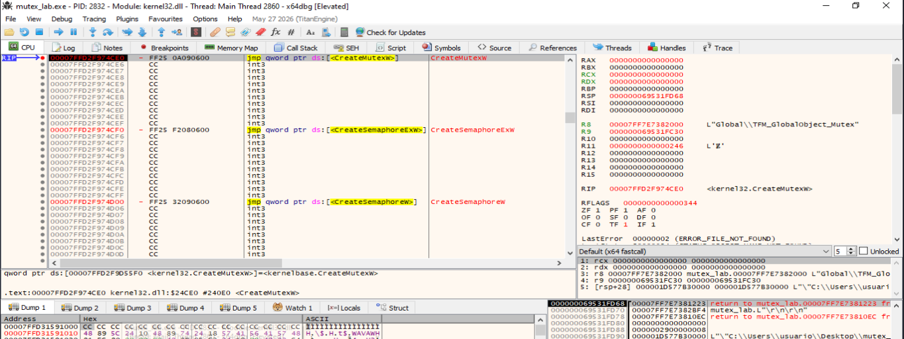

> **Figura 10.8.1.2. Interceptación de `CreateMutexW` en la segunda instancia.** El registro `R8`, correspondiente al parámetro `lpName`, apunta a la cadena Unicode `Global\TFM_GlobalObject_Mutex`. La llamada intenta crear o abrir exactamente el mismo objeto que continúa mantenido por la primera instancia.

Esta captura demuestra que el programa consulta el objeto global mediante su nombre.

Conceptualmente, la llamada observada es:

```c
CreateMutexW(
    NULL,
    FALSE,
    L"Global\\TFM_GlobalObject_Mutex"
);
```

---

## Retorno de `CreateMutexW` cuando el mutex ya existe

Tras ejecutar `CreateMutexW`, la ejecución vuelve a `mutex_lab.exe`.

En este punto se observa:

```text
RAX = 00000000000000B8
```

El valor es distinto de `NULL`, por lo que representa un handle válido.

Al mismo tiempo, `x64dbg` muestra:

```text
LastError = 000000B7 (ERROR_ALREADY_EXISTS)
```

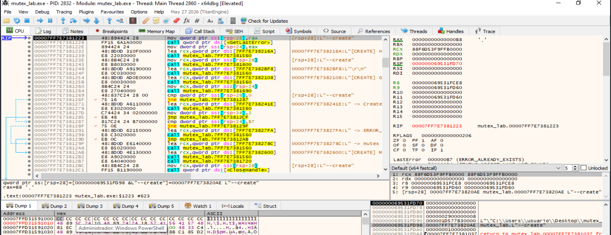

> **Figura 10.8.1.3. Retorno de `CreateMutexW` cuando el objeto ya existe.** La función devuelve en `RAX` el handle válido `0xB8`. El estado de error del hilo contiene `0xB7`, correspondiente a `ERROR_ALREADY_EXISTS`, lo que indica que el mutex con ese nombre ya había sido creado previamente.

Esta observación permite destacar un aspecto fundamental de `CreateMutexW`:

```text
El mutex ya existe
        ↓
CreateMutexW NO tiene por qué devolver NULL
        ↓
Devuelve un handle válido al objeto existente
        ↓
GetLastError informa ERROR_ALREADY_EXISTS
```

Por tanto, la comprobación no debe realizarse únicamente sobre:

```text
RAX == NULL
```

sino que debe analizarse también el valor proporcionado mediante `GetLastError`.

Los handles obtenidos en las dos instancias fueron diferentes:

```text
Primera instancia → 0xB4
Segunda instancia → 0xB8
```

Esto no implica que existan dos mutexes distintos. Los valores de handle pertenecen a tablas de handles diferentes, una por proceso:

```text
Proceso 1 → handle 0xB4 ─┐
                         ├── mismo objeto del kernel
Proceso 2 → handle 0xB8 ─┘
```

El identificador conceptual común es el nombre:

```text
Global\TFM_GlobalObject_Mutex
```

---

## Interceptación de `GetLastError`

Después de `CreateMutexW`, la herramienta invoca:

```text
GetLastError
```

La ejecución se detuvo inicialmente en:

```text
kernel32!GetLastError
```


> **Figura 10.8.1.4. Entrada en `GetLastError`.** La ejecución alcanza la API utilizada para recuperar el código de error asociado a la llamada anterior. En este instante, el valor anterior de `RAX` todavía corresponde al handle obtenido mediante `CreateMutexW`, por lo que el resultado relevante debe observarse después del retorno de `GetLastError`.

Esta distinción es importante durante el análisis dinámico. Cuando el breakpoint se activa en la **entrada** de una función, los registros todavía pueden contener valores procedentes de operaciones anteriores.

Por ello, la función se ejecutó hasta retornar a `mutex_lab.exe`.

---

## Confirmación de `ERROR_ALREADY_EXISTS`

Después del retorno de `GetLastError`, la ejecución se encuentra de nuevo dentro de `mutex_lab.exe`.

En la captura se observa:

```text
RAX = 00000000000000B7
```

y, por tanto:

```text
EAX = 0x000000B7
```

El valor corresponde a:

```text
0xB7 = 183 decimal
     = ERROR_ALREADY_EXISTS
```

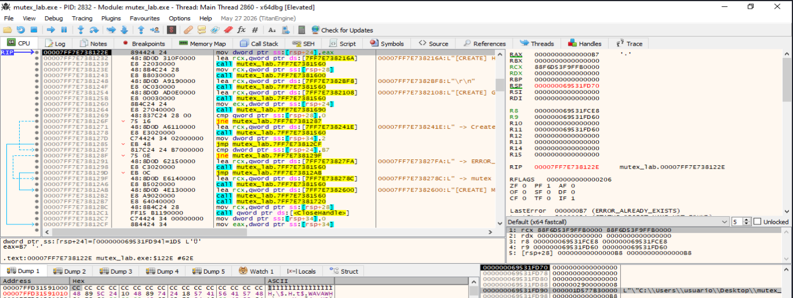

> **Figura 10.8.1.5. Retorno de `GetLastError` con `ERROR_ALREADY_EXISTS`.** Tras ejecutar `CreateMutexW` sobre un mutex ya existente, `GetLastError` devuelve `0xB7` en `EAX`. El valor confirma que la segunda instancia ha obtenido un handle al objeto creado previamente por la primera.

La secuencia completa demostrada es:

```text
Primera instancia
        ↓
CreateMutexW
        ↓
Global\TFM_GlobalObject_Mutex
        ↓
Mutex creado y handle mantenido


Segunda instancia
        ↓
CreateMutexW
        ↓
R8 → Global\TFM_GlobalObject_Mutex
        ↓
RAX = handle válido
        ↓
GetLastError
        ↓
EAX = 0xB7
        ↓
ERROR_ALREADY_EXISTS
```

Esta combinación constituye la evidencia principal de la técnica basada en comprobación de existencia mediante un mutex con nombre.

---

## Apertura del mutex mediante `OpenMutexW`

La siguiente fase de la práctica consiste en comprobar que otra instancia puede localizar el objeto mediante:

```text
OpenMutexW
```

Mientras la primera instancia continúa abierta, se ejecutó:

```text
mutex_lab.exe --open
```

bajo `x64dbg`.

La ejecución se detuvo en:

```text
kernel32!OpenMutexW
```

La firma de la función es:

```c
HANDLE OpenMutexW(
    DWORD   dwDesiredAccess,
    BOOL    bInheritHandle,
    LPCWSTR lpName
);
```

En Windows x64:

```text
RCX = dwDesiredAccess
RDX = bInheritHandle
R8  = lpName
```

La captura muestra:

```text
RCX = 0x00100000
RDX = 0
R8  → L"Global\\TFM_GlobalObject_Mutex"
```

El valor:

```text
0x00100000
```

corresponde al derecho:

```text
SYNCHRONIZE
```

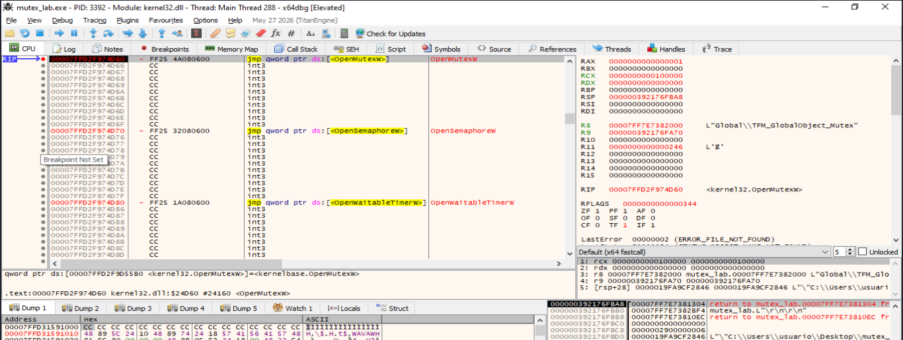

> **Figura 10.8.1.6. Interceptación de `OpenMutexW` mientras el mutex existe.** El registro `R8` vuelve a apuntar a `Global\TFM_GlobalObject_Mutex`, mientras que `RCX = 0x00100000` indica que se solicita acceso `SYNCHRONIZE`.

La llamada observada puede representarse conceptualmente como:

```c
OpenMutexW(
    SYNCHRONIZE,
    FALSE,
    L"Global\\TFM_GlobalObject_Mutex"
);
```

---

## Retorno satisfactorio de `OpenMutexW`

Después de ejecutar la función, el control vuelve a `mutex_lab.exe`.

Se observa:

```text
RAX = 00000000000000B8
```

Por tanto:

```text
RAX != NULL
```

y se ha obtenido un handle válido.


> **Figura 10.8.1.7. Retorno satisfactorio de `OpenMutexW`.** La función devuelve en `RAX` el handle `0xB8`, confirmando que la segunda instancia ha localizado y abierto el mutex previamente creado.

La secuencia queda:

```text
OpenMutexW
        ↓
R8 → Global\TFM_GlobalObject_Mutex
        ↓
RAX = 0xB8
        ↓
Handle válido
        ↓
Objeto localizado
```

En esta situación no debe interpretarse indiscriminadamente el campo `LastError` mostrado por el depurador. Cuando `OpenMutexW` tiene éxito, la evidencia principal es el handle válido devuelto. Un valor residual en el estado de error del hilo puede pertenecer a una operación anterior y no debe emplearse para concluir que la API ha fallado.

---

## Liberación del mutex

Para demostrar el caso contrario, se finalizaron las instancias que mantenían handles abiertos sobre:

```text
Global\TFM_GlobalObject_Mutex
```

Una vez cerrado el último handle, se volvió a ejecutar:

```text
mutex_lab.exe --open
```

bajo `x64dbg`.

El objetivo de esta segunda prueba con `OpenMutexW` es demostrar qué ocurre cuando el objeto ya no existe.

---

## `OpenMutexW` cuando el mutex no existe

La ejecución vuelve a detenerse en:

```text
kernel32!OpenMutexW
```

y los parámetros continúan siendo:

```text
RCX = SYNCHRONIZE
RDX = FALSE
R8  → L"Global\\TFM_GlobalObject_Mutex"
```

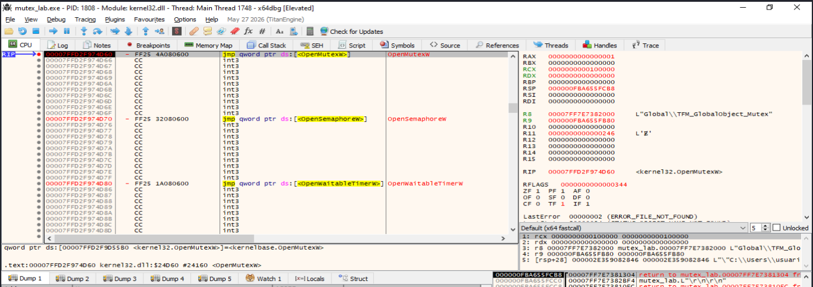

> **Figura 10.8.1.8. Nueva llamada a `OpenMutexW` después de liberar el objeto.** Los argumentos son equivalentes a los empleados en la prueba satisfactoria, por lo que la única diferencia experimental es la inexistencia del mutex.

Esta comparación es importante porque mantiene constantes los parámetros de la API:

```text
Mismo nombre
Mismos permisos
Misma función
        ↓
Única variable modificada:
existencia del objeto
```

---

## Retorno `NULL` de `OpenMutexW`

Tras ejecutar la función, el control vuelve a `mutex_lab.exe`.

En este caso:

```text
RAX = 0000000000000000
```

Es decir:

```text
RAX = NULL
```

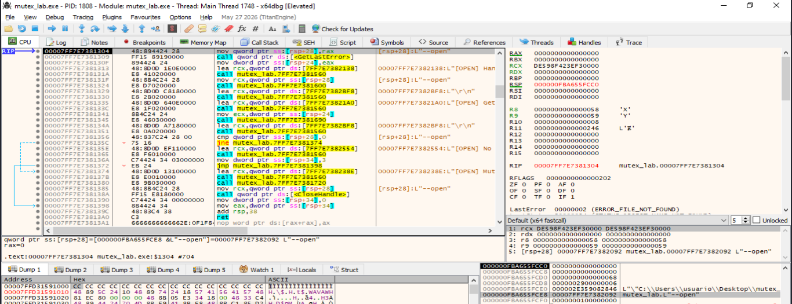

> **Figura 10.8.1.9. Fallo de `OpenMutexW` tras liberar todos los handles.** La función retorna `RAX = 0`, indicando que no se ha obtenido un handle válido para `Global\TFM_GlobalObject_Mutex`.

La secuencia es:

```text
OpenMutexW
        ↓
Global\TFM_GlobalObject_Mutex
        ↓
RAX = NULL
        ↓
Apertura fallida
```

A diferencia del caso anterior, ahora resulta apropiado consultar `GetLastError` para determinar la causa del fallo.

---

## Confirmación de `ERROR_FILE_NOT_FOUND`

Tras el fallo de `OpenMutexW`, la herramienta llama nuevamente a:

```text
GetLastError
```

Después del retorno se observa:

```text
RAX = 0000000000000002
```

Por tanto:

```text
EAX = 0x00000002
```

El valor corresponde a:

```text
2 = ERROR_FILE_NOT_FOUND
```


> **Figura 10.8.1.10. Retorno de `GetLastError` tras el fallo de `OpenMutexW`.** La función devuelve `0x2`, correspondiente a `ERROR_FILE_NOT_FOUND`, confirmando que el objeto con nombre ya no se encuentra disponible.

La secuencia completa es:

```text
Cerrar todos los handles
        ↓
Windows elimina el objeto
        ↓
OpenMutexW
        ↓
RAX = NULL
        ↓
GetLastError
        ↓
EAX = 0x02
        ↓
ERROR_FILE_NOT_FOUND
```

---

## Comparación de los cuatro escenarios

La práctica permite comparar cuatro situaciones diferentes:

| Escenario | API | Valor de retorno | `GetLastError` | Interpretación |
|---|---|---|---|---|
| El mutex no existe todavía | `CreateMutexW` | Handle válido (`0xB4`) | `0` | Objeto creado |
| El mutex ya existe | `CreateMutexW` | Handle válido (`0xB8`) | `0xB7` | `ERROR_ALREADY_EXISTS` |
| El mutex existe | `OpenMutexW` | Handle válido (`0xB8`) | No necesario | Objeto localizado |
| El mutex no existe | `OpenMutexW` | `NULL` | `0x02` | `ERROR_FILE_NOT_FOUND` |

La diferencia más importante entre `CreateMutexW` y `OpenMutexW` puede resumirse así:

```text
CreateMutexW
│
├── objeto inexistente
│      └── lo crea y devuelve un handle
│
└── objeto existente
       └── devuelve un handle
           +
           ERROR_ALREADY_EXISTS


OpenMutexW
│
├── objeto existente
│      └── devuelve un handle
│
└── objeto inexistente
       └── devuelve NULL
           +
           ERROR_FILE_NOT_FOUND
```

---

## Relación con la técnica `Global OS Objects`

La demostración reproduce el mecanismo básico que puede emplear una técnica de evasión basada en objetos globales.

Un programa puede conocer previamente el nombre de un objeto asociado a:

- Una sandbox.
- Una herramienta de análisis.
- Un hipervisor.
- Un servicio concreto.
- Otra instancia del mismo programa.
- Un componente de comunicación entre procesos.

Después puede comprobar su existencia mediante:

```text
OpenMutexW
```

o mediante:

```text
CreateMutexW
        ↓
GetLastError
        ↓
ERROR_ALREADY_EXISTS
```

La lógica anti-análisis podría adoptar la forma:

```text
Nombre conocido
        ↓
CreateMutexW / OpenMutexW
        ↓
Objeto encontrado
        ↓
Comparación del resultado
        ↓
Rama de detección
        ↓
Finalizar, retrasar o modificar comportamiento
```

La práctica realizada no ejecuta ninguna carga maliciosa ni identifica un hipervisor real. `Global\TFM_GlobalObject_Mutex` es un objeto creado deliberadamente para demostrar de forma controlada el mecanismo de descubrimiento.

Por tanto, la evidencia obtenida demuestra **el funcionamiento de la técnica**, no la existencia real de una máquina virtual o sandbox concreta.

---

## Evidencias obtenidas

Durante la práctica se han documentado las siguientes evidencias:

1. Creación inicial de `Global\TFM_GlobalObject_Mutex`.
2. Handle válido obtenido por la primera instancia.
3. Interceptación de `CreateMutexW`.
4. Nombre del objeto observado en `R8`.
5. Handle válido obtenido por la segunda instancia.
6. `GetLastError = 0xB7`.
7. Confirmación de `ERROR_ALREADY_EXISTS`.
8. Interceptación de `OpenMutexW`.
9. Apertura satisfactoria mientras el objeto existe.
10. Liberación de todos los handles.
11. Retorno `NULL` de `OpenMutexW`.
12. `GetLastError = 0x02`.
13. Confirmación de `ERROR_FILE_NOT_FOUND`.

La combinación de estas evidencias permite reconstruir de forma completa el ciclo de vida del mutex y demostrar cómo puede utilizarse como artefacto global observable.

---

## Limitaciones

La prueba presenta varias limitaciones que deben considerarse:

- El mutex utilizado ha sido creado expresamente para el laboratorio.
- La presencia de un mutex no implica por sí sola virtualización.
- Muchas aplicaciones legítimas utilizan mutexes para impedir múltiples instancias.
- Un nombre puede coincidir accidentalmente con el utilizado por otro software.
- Los valores numéricos de los handles son locales a cada proceso.
- Los handles observados pueden variar en otras ejecuciones.
- Las direcciones mostradas por `x64dbg` pueden cambiar debido a ASLR.
- El uso del prefijo `Global\` no convierte automáticamente el objeto en un indicador anti-VM.
- La interpretación anti-análisis depende del nombre buscado y de la decisión que adopte posteriormente el programa.

Por ello, en una muestra real sería necesario correlacionar el mutex con:

- Su nombre.
- El proceso o servicio que lo crea.
- Otros objetos del sistema.
- Procesos.
- Servicios.
- Drivers.
- Registro.
- Archivos.
- Otros indicadores anti-VM.

---

## Conclusión

La demostración dinámica ha permitido observar el funcionamiento completo de un mutex con nombre dentro del namespace global de Windows.

La primera ejecución de `mutex_lab.exe` creó:

```text
Global\TFM_GlobalObject_Mutex
```

y mantuvo abierto el handle correspondiente. Una segunda ejecución interceptada con `x64dbg` volvió a llamar a `CreateMutexW` sobre el mismo nombre. La función devolvió un handle válido y `GetLastError` retornó:

```text
0xB7
```

correspondiente a:

```text
ERROR_ALREADY_EXISTS
```

Posteriormente, `OpenMutexW` consiguió localizar el mismo objeto mientras permanecía activo, devolviendo un handle válido.

Tras cerrar todos los handles, una nueva llamada a `OpenMutexW` retornó:

```text
NULL
```

y `GetLastError` devolvió:

```text
0x02
```

correspondiente a:

```text
ERROR_FILE_NOT_FOUND
```

La práctica demuestra por tanto la secuencia:

```text
CreateMutexW
        ↓
Objeto creado
        ↓
Segunda CreateMutexW
        ↓
ERROR_ALREADY_EXISTS
        ↓
OpenMutexW
        ↓
Objeto localizado
        ↓
Cerrar todos los handles
        ↓
OpenMutexW
        ↓
NULL
        ↓
ERROR_FILE_NOT_FOUND
```

Este mecanismo constituye una base sencilla para técnicas de `Global OS Objects`, ya que una muestra puede utilizar nombres conocidos para comprobar la presencia de objetos globales asociados a determinados entornos y condicionar posteriormente su flujo de ejecución.


-----

# 10.8.2. Análisis de Named Pipes mediante `CreateFileW`

## 10.8.2.1. Objetivo de la demostración

El objetivo de esta práctica es demostrar de forma controlada cómo una aplicación puede utilizar una **Named Pipe** como artefacto observable del sistema y comprobar su existencia mediante `CreateFileW`.

La demostración reproduce el patrón utilizado por determinadas técnicas de reconocimiento del entorno:

```text
Nombre conocido de una Named Pipe
        ↓
CreateFileW
        ↓
¿Handle válido?
        ↓
Sí → la pipe existe
No → INVALID_HANDLE_VALUE
        ↓
GetLastError
```

Para evitar depender de que una versión concreta de VirtualBox, VMware o una sandbox exponga una pipe determinada, se utiliza la herramienta educativa `pipe_lab.exe`. Esta herramienta reproduce de forma controlada el mismo mecanismo que puede utilizar una comprobación anti-VM real.

La Named Pipe empleada durante el laboratorio es:

```text
\\.\pipe\TFM_GlobalObject_Pipe
```

La práctica se divide en dos componentes:

```text
Servidor
    ├── CreateNamedPipeW
    └── ConnectNamedPipe

Cliente
    ├── CreateFileW
    └── GetLastError
```

Se demuestran los siguientes escenarios:

```text
1. Creación de la Named Pipe por el servidor.
2. Espera de conexiones mediante ConnectNamedPipe.
3. Confirmación externa mediante PipeList.
4. Apertura satisfactoria mediante CreateFileW.
5. Cierre del servidor y desaparición de la pipe.
6. Fallo de CreateFileW cuando la pipe ya no existe.
7. Confirmación de ERROR_FILE_NOT_FOUND mediante GetLastError.
```

---

## 10.8.2.2. Preparación del laboratorio

Para realizar la demostración se utilizaron:

- Windows x64.
- `pipe_lab.exe`.
- `x64dbg`.
- PowerShell.
- Sysinternals `PipeList64.exe`.

La herramienta educativa admite dos modos:

```bat
pipe_lab.exe --server
pipe_lab.exe --client
```

El servidor crea y mantiene activa:

```text
\\.\pipe\TFM_GlobalObject_Pipe
```

mientras que el cliente intenta abrirla mediante `CreateFileW`.

Los breakpoints principales utilizados en `x64dbg` fueron:

```text
kernel32!CreateNamedPipeW
kernelbase!CreateNamedPipeW

kernel32!ConnectNamedPipe
kernelbase!ConnectNamedPipe

kernel32!CreateFileW
kernelbase!CreateFileW

kernel32!GetLastError
kernelbase!GetLastError
```

Se utilizaron breakpoints tanto en `kernel32.dll` como en `KernelBase.dll` porque, dependiendo de la versión de Windows, determinadas APIs exportadas por `kernel32.dll` pueden actuar como *thunks* hacia la implementación real situada en `KernelBase.dll`.

---

## 10.8.2.3. Apertura inicial del servidor

La primera fase consiste en ejecutar el servidor desde PowerShell:

```powershell
.\pipe_lab.exe --server
```

La herramienta crea la Named Pipe de laboratorio mediante `CreateNamedPipeW` y permanece bloqueada posteriormente en `ConnectNamedPipe`, esperando una conexión entrante.

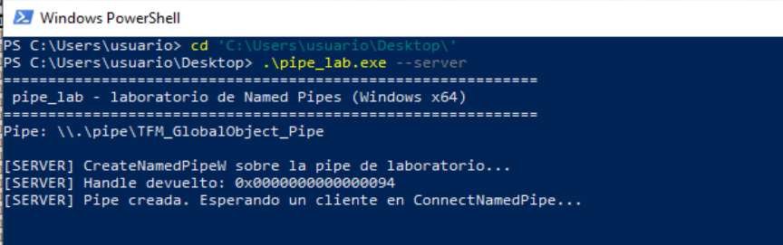

> **Figura 10.8.2.1. Apertura inicial de `pipe_lab.exe --server`.** La herramienta crea `\\.\pipe\TFM_GlobalObject_Pipe`, obtiene el handle `0x94` y permanece esperando una conexión mediante `ConnectNamedPipe`.

La salida observada fue:

```text
pipe_lab - laboratorio de Named Pipes (Windows x64)

Pipe: \\.\pipe\TFM_GlobalObject_Pipe

[SERVER] CreateNamedPipeW sobre la pipe de laboratorio...
[SERVER] Handle devuelto: 0x0000000000000094
[SERVER] Pipe creada. Esperando un cliente en ConnectNamedPipe...
```

El valor:

```text
0x94
```

es un handle válido al objeto creado por el servidor.

Esta primera ejecución se mantiene activa durante las pruebas del cliente para garantizar que la Named Pipe continúe presente.

---

## 10.8.2.4. Interceptación de `CreateNamedPipeW`

Para observar dinámicamente la creación del objeto, se ejecutó:

```text
pipe_lab.exe --server
```

dentro de `x64dbg`.

La ejecución se detuvo en:

```text
kernel32!CreateNamedPipeW
```

La firma simplificada de la función es:

```c
HANDLE CreateNamedPipeW(
    LPCWSTR               lpName,
    DWORD                 dwOpenMode,
    DWORD                 dwPipeMode,
    DWORD                 nMaxInstances,
    DWORD                 nOutBufferSize,
    DWORD                 nInBufferSize,
    DWORD                 nDefaultTimeOut,
    LPSECURITY_ATTRIBUTES lpSecurityAttributes
);
```

En Windows x64, los cuatro primeros argumentos se reciben mediante:

```text
RCX = lpName
RDX = dwOpenMode
R8  = dwPipeMode
R9  = nMaxInstances
```

Durante la ejecución se observaron:

```text
RCX → L"\\.\pipe\TFM_GlobalObject_Pipe"
RDX = 0x00000003
R8  = 0x00000000
R9  = 0x00000001
```

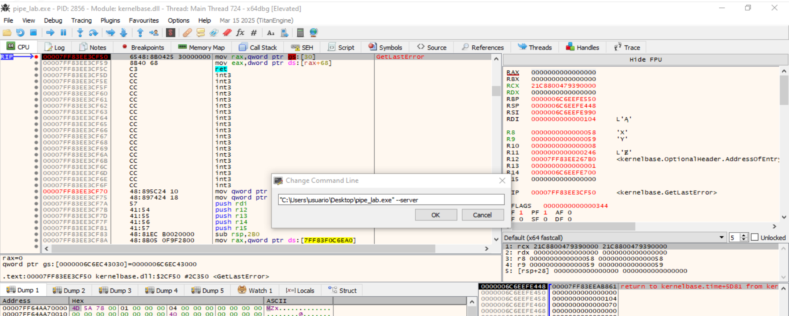

> **Figura 10.8.2.2. Interceptación de `CreateNamedPipeW`.** `RCX` apunta a `\\.\pipe\TFM_GlobalObject_Pipe`. El valor `RDX = 0x3` corresponde a `PIPE_ACCESS_DUPLEX`, mientras que `R9 = 1` establece un máximo de una instancia.

La llamada puede representarse conceptualmente como:

```c
CreateNamedPipeW(
    L"\\\\.\\pipe\\TFM_GlobalObject_Pipe",
    PIPE_ACCESS_DUPLEX,
    PIPE_TYPE_BYTE | PIPE_READMODE_BYTE | PIPE_WAIT,
    1,
    ...
);
```

El valor:

```text
PIPE_ACCESS_DUPLEX
```

permite que el servidor utilice la pipe tanto para lectura como para escritura.

La configuración:

```text
nMaxInstances = 1
```

resultará posteriormente visible también mediante `PipeList`.

---

## 10.8.2.5. Retorno satisfactorio de `CreateNamedPipeW`

Después de ejecutar la función hasta su retorno, el control vuelve a `pipe_lab.exe`.

En los registros se observa:

```text
RAX = 0000000000000084
```

El valor de fallo para `CreateNamedPipeW` es:

```text
INVALID_HANDLE_VALUE
=
0xFFFFFFFFFFFFFFFF
```

Por tanto:

```text
RAX = 0x84
```

representa un handle válido.

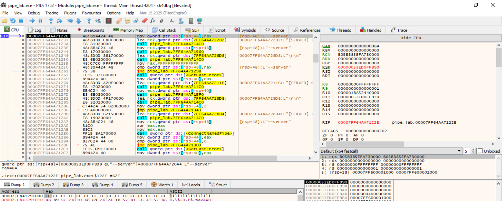

> **Figura 10.8.2.3. Retorno satisfactorio de `CreateNamedPipeW`.** La función devuelve en `RAX` el handle `0x84`. Al ser distinto de `INVALID_HANDLE_VALUE`, confirma que la Named Pipe ha sido creada correctamente.

La secuencia observada es:

```text
CreateNamedPipeW
        ↓
\\.\pipe\TFM_GlobalObject_Pipe
        ↓
RAX = 0x84
        ↓
Handle válido
        ↓
Named Pipe creada
```

El valor numérico concreto del handle puede variar entre ejecuciones. Lo relevante es que sea distinto de `INVALID_HANDLE_VALUE`.

---

## 10.8.2.6. Espera de conexiones mediante `ConnectNamedPipe`

Después de crear la pipe, el servidor invoca:

```text
ConnectNamedPipe
```

La firma es:

```c
BOOL ConnectNamedPipe(
    HANDLE       hNamedPipe,
    LPOVERLAPPED lpOverlapped
);
```

En Windows x64:

```text
RCX = hNamedPipe
RDX = lpOverlapped
```

Durante la prueba se observó:

```text
RCX = 0000000000000084
RDX = 0000000000000000
```

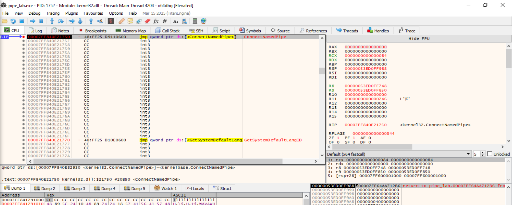

> **Figura 10.8.2.4. Entrada en `ConnectNamedPipe`.** `RCX` contiene el handle `0x84`, previamente devuelto por `CreateNamedPipeW`. `RDX = 0` indica que la operación se realiza de forma síncrona.

La relación entre ambas APIs queda:

```text
CreateNamedPipeW
        ↓
RAX = 0x84
        ↓
handle guardado
        ↓
ConnectNamedPipe
        ↓
RCX = 0x84
        ↓
Servidor esperando conexión
```

Esta evidencia permite confirmar que el servidor utiliza el mismo objeto creado en la fase anterior.

---

## 10.8.2.7. Confirmación de la pipe mediante PipeList

Con el servidor todavía activo, se ejecutó la herramienta Sysinternals:

```bat
pipelist64.exe
```

La salida mostró explícitamente:

```text
TFM_GlobalObject_Pipe    1    1
```

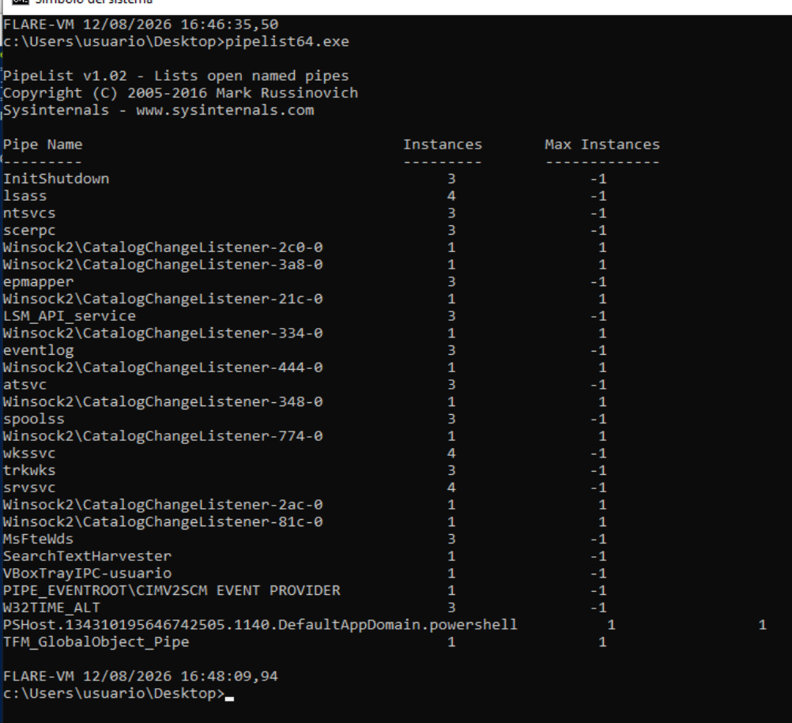

> **Figura 10.8.2.5. Enumeración de `TFM_GlobalObject_Pipe` mediante PipeList.** Mientras el servidor mantiene activa la pipe, PipeList identifica una instancia con un máximo de una instancia, coherente con el valor `nMaxInstances = 1` observado en `CreateNamedPipeW`.

La evidencia externa confirma:

```text
CreateNamedPipeW
        ↓
nMaxInstances = 1
        ↓
PipeList
        ↓
Instances = 1
Max Instances = 1
```

Esta comprobación resulta importante porque no depende únicamente de la salida de `pipe_lab.exe` o del estado interno observado en `x64dbg`.

---

## 10.8.2.8. Apertura de la Named Pipe mediante `CreateFileW`

Mientras el servidor continúa activo, se ejecuta el cliente:

```text
pipe_lab.exe --client
```

bajo `x64dbg`.

La ejecución se detiene en:

```text
kernel32!CreateFileW
```

La firma simplificada es:

```c
HANDLE CreateFileW(
    LPCWSTR               lpFileName,
    DWORD                 dwDesiredAccess,
    DWORD                 dwShareMode,
    LPSECURITY_ATTRIBUTES lpSecurityAttributes,
    DWORD                 dwCreationDisposition,
    DWORD                 dwFlagsAndAttributes,
    HANDLE                hTemplateFile
);
```

En Windows x64:

```text
RCX = lpFileName
RDX = dwDesiredAccess
R8  = dwShareMode
R9  = lpSecurityAttributes
```

Durante la prueba se observa que:

```text
RCX → L"\\.\pipe\TFM_GlobalObject_Pipe"
```

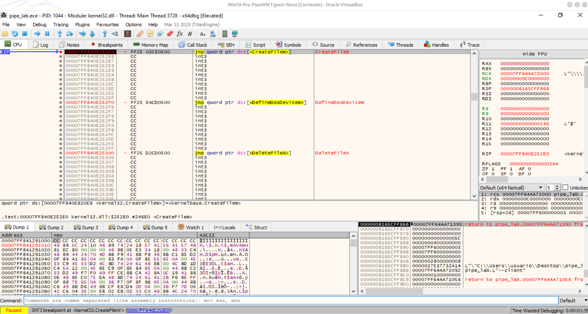

> **Figura 10.8.2.6. Interceptación de `CreateFileW` durante la búsqueda de la Named Pipe.** El registro `RCX`, correspondiente al parámetro `lpFileName`, apunta a `\\.\pipe\TFM_GlobalObject_Pipe`.

En esta llamada, el acceso solicitado combina:

```text
GENERIC_READ
+
GENERIC_WRITE
```

lo que permite al cliente abrir la pipe en modo bidireccional.

La lógica utilizada es equivalente a:

```text
CreateFileW(
    "\\.\pipe\TFM_GlobalObject_Pipe",
    GENERIC_READ | GENERIC_WRITE,
    ...
)
```

---

## 10.8.2.9. Apertura satisfactoria de la Named Pipe

Después del retorno de `CreateFileW`, la ejecución vuelve a `pipe_lab.exe`.

En los registros se observa:

```text
RAX = 00000000000000B0
```

El valor de error de `CreateFileW` es:

```text
INVALID_HANDLE_VALUE
=
0xFFFFFFFFFFFFFFFF
```

Como:

```text
RAX = 0xB0
```

se ha obtenido un handle válido.

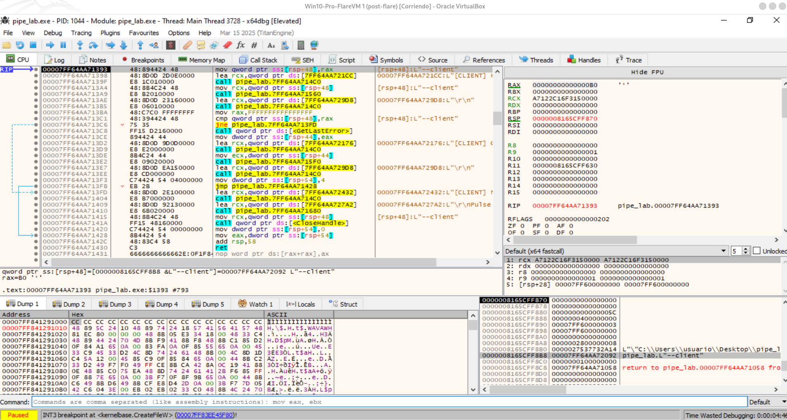

> **Figura 10.8.2.7. Retorno satisfactorio de `CreateFileW`.** El cliente recibe en `RAX` el handle `0xB0`, confirmando que `\\.\pipe\TFM_GlobalObject_Pipe` se encontraba disponible y pudo abrirse correctamente.

La secuencia demostrada es:

```text
Servidor activo
        ↓
Named Pipe existente
        ↓
CreateFileW
        ↓
RAX = 0xB0
        ↓
RAX != INVALID_HANDLE_VALUE
        ↓
Pipe localizada
```

Este patrón es el núcleo de la técnica de descubrimiento basada en Named Pipes.

---

## 10.8.2.10. Cierre del servidor y desaparición de la pipe

Para demostrar el caso contrario, se finalizó la instancia:

```text
pipe_lab.exe --server
```

Al cerrarse el proceso servidor y liberarse el último handle correspondiente a la pipe, el objeto deja de estar disponible.

Se volvió a ejecutar:

```bat
pipelist64.exe
```

y `TFM_GlobalObject_Pipe` dejó de aparecer en la enumeración.

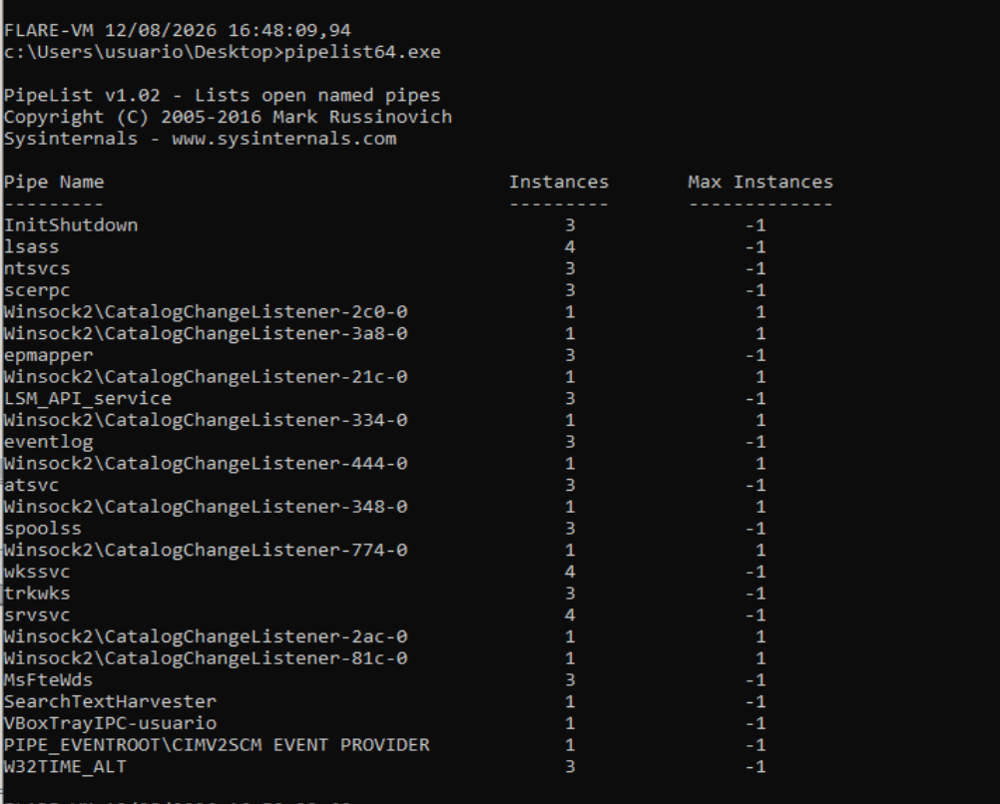

> **Figura 10.8.2.8. PipeList después de cerrar el servidor.** La ausencia de `TFM_GlobalObject_Pipe` confirma que la pipe deja de estar disponible una vez liberado el objeto mantenido por el proceso servidor.

La comparación es:

```text
Servidor activo
        ↓
PipeList
        ↓
TFM_GlobalObject_Pipe visible


Servidor cerrado
        ↓
PipeList
        ↓
TFM_GlobalObject_Pipe ausente
```

---

## 10.8.2.11. `CreateFileW` cuando la pipe no existe

Con el servidor cerrado, se volvió a ejecutar:

```text
pipe_lab.exe --client
```

bajo `x64dbg`.

La llamada a `CreateFileW` utiliza exactamente el mismo nombre:

```text
RCX → L"\\.\pipe\TFM_GlobalObject_Pipe"
```

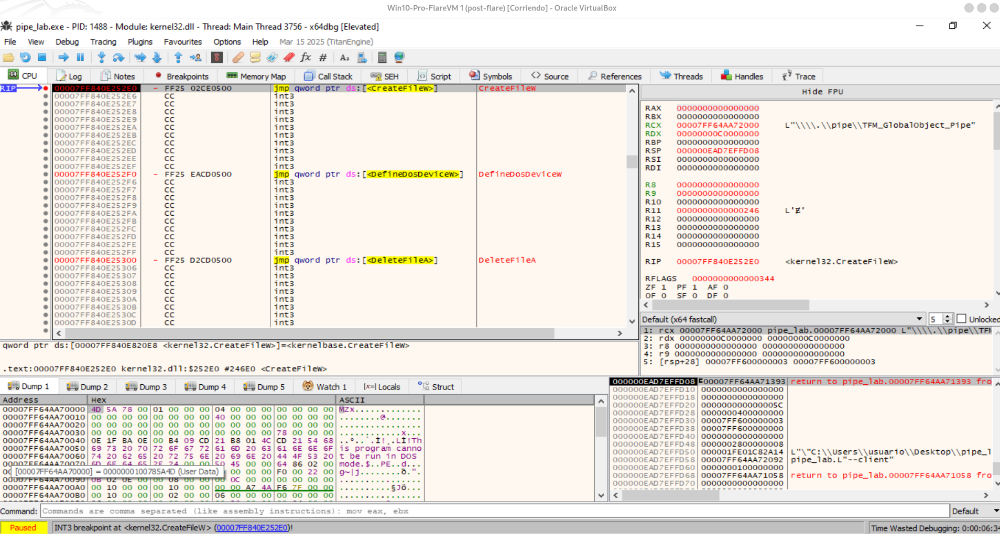

> **Figura 10.8.2.9. Nueva llamada a `CreateFileW` después de cerrar el servidor.** El cliente utiliza el mismo nombre y parámetros básicos que en la prueba satisfactoria. La diferencia experimental es que la Named Pipe ya no existe.

Esto mantiene constante la consulta:

```text
Misma API
Mismo nombre
Mismo cliente
        ↓
Única variable:
existencia de la pipe
```

---

## 10.8.2.12. Retorno de `INVALID_HANDLE_VALUE`

Después del retorno de `CreateFileW` se observa:

```text
RAX = FFFFFFFFFFFFFFFF
```

Este valor corresponde a:

```text
INVALID_HANDLE_VALUE
```

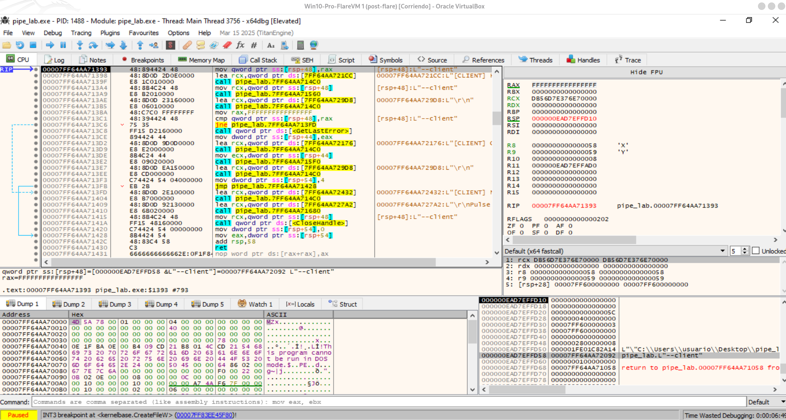

> **Figura 10.8.2.10. Fallo de `CreateFileW` al consultar una Named Pipe inexistente.** La función devuelve `0xFFFFFFFFFFFFFFFF`, correspondiente a `INVALID_HANDLE_VALUE`, indicando que no se ha obtenido un handle válido.

La secuencia es:

```text
CreateFileW
        ↓
\\.\pipe\TFM_GlobalObject_Pipe
        ↓
RAX = FFFFFFFFFFFFFFFF
        ↓
INVALID_HANDLE_VALUE
        ↓
Apertura fallida
```

Debe destacarse que `CreateFileW` no utiliza `NULL` como valor de fallo para este caso. La comprobación correcta es:

```text
RAX == INVALID_HANDLE_VALUE
```

---

## 10.8.2.13. Confirmación mediante `GetLastError`

Tras detectar el fallo de `CreateFileW`, la herramienta ejecuta:

```text
GetLastError
```

Después del retorno se observa:

```text
RAX = 0000000000000002
```

Por tanto:

```text
EAX = 0x00000002
```

El valor corresponde a:

```text
ERROR_FILE_NOT_FOUND
```

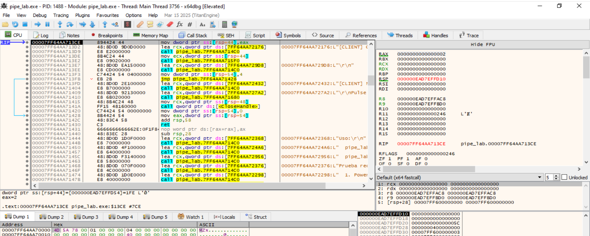

> **Figura 10.8.2.11. Retorno de `GetLastError` tras el fallo de apertura.** La función devuelve `0x2`, correspondiente a `ERROR_FILE_NOT_FOUND`, confirmando que `\\.\pipe\TFM_GlobalObject_Pipe` no se encontraba disponible.

La secuencia completa queda:

```text
CreateFileW
        ↓
RAX = INVALID_HANDLE_VALUE
        ↓
GetLastError
        ↓
EAX = 0x02
        ↓
ERROR_FILE_NOT_FOUND
```

---

## 10.8.2.14. Comparación de resultados

La práctica permite comparar claramente los dos escenarios principales:

| Estado de la pipe | `CreateFileW` | Resultado | `GetLastError` |
|---|---|---|---|
| Servidor activo | `RAX = 0xB0` | Handle válido | No necesario |
| Servidor cerrado | `RAX = 0xFFFFFFFFFFFFFFFF` | `INVALID_HANDLE_VALUE` | `0x02` |
| Interpretación | Pipe localizada | Pipe no disponible | `ERROR_FILE_NOT_FOUND` |

También puede compararse el estado observado mediante PipeList:

| Estado del servidor | PipeList | Interpretación |
|---|---|---|
| Activo | `TFM_GlobalObject_Pipe` visible | La pipe existe |
| Cerrado | No aparece | La pipe ya no está disponible |

El flujo completo puede representarse así:

```text
SERVIDOR
────────────────────────
CreateNamedPipeW
        ↓
handle válido
        ↓
ConnectNamedPipe
        ↓
espera de cliente


VALIDACIÓN
────────────────────────
PipeList
        ↓
TFM_GlobalObject_Pipe
        ↓
1 instancia / máximo 1


CLIENTE — PIPE EXISTENTE
────────────────────────
CreateFileW
        ↓
handle válido
        ↓
pipe encontrada


CLIENTE — PIPE INEXISTENTE
────────────────────────
CreateFileW
        ↓
INVALID_HANDLE_VALUE
        ↓
GetLastError
        ↓
ERROR_FILE_NOT_FOUND
```

---

## 10.8.2.15. Relación con técnicas anti-VM y anti-sandbox

La demostración reproduce el mecanismo básico que puede emplear una muestra para detectar artefactos de virtualización o análisis.

Una muestra puede conocer previamente el nombre de una Named Pipe asociada a:

- Un hipervisor.
- Guest Additions.
- Una sandbox.
- Un agente de monitorización.
- Un servicio de análisis.
- Un mecanismo IPC de una herramienta conocida.

La lógica puede ser:

```text
Nombre conocido de pipe
        ↓
CreateFileW
        ↓
¿Handle válido?
        ↓
Sí
        ↓
Artefacto presente
        ↓
Posible VM / sandbox / herramienta de análisis
```

El laboratorio utiliza:

```text
\\.\pipe\TFM_GlobalObject_Pipe
```

como nombre educativo y controlado. Por tanto, no se está afirmando que este nombre pertenezca a un hipervisor real.

La finalidad de la prueba es demostrar el **mecanismo de descubrimiento**.

En una muestra real, el nombre podría sustituirse por una cadena asociada a un producto concreto.

---

## 10.8.2.16. Evidencias obtenidas

Durante la práctica se han documentado las siguientes evidencias:

1. Ejecución inicial de `pipe_lab.exe --server`.
2. Creación de `\\.\pipe\TFM_GlobalObject_Pipe`.
3. Handle válido devuelto por `CreateNamedPipeW`.
4. Nombre de la pipe observado en `RCX`.
5. `PIPE_ACCESS_DUPLEX` observado en `RDX`.
6. `nMaxInstances = 1` observado en `R9`.
7. Uso del handle creado en `ConnectNamedPipe`.
8. Enumeración positiva mediante PipeList.
9. Apertura mediante `CreateFileW`.
10. Nombre de la pipe observado en `RCX`.
11. Handle válido devuelto al cliente.
12. Cierre del servidor.
13. Desaparición de la pipe en PipeList.
14. Nueva llamada a `CreateFileW`.
15. Retorno `INVALID_HANDLE_VALUE`.
16. `GetLastError = 0x02`.
17. Confirmación de `ERROR_FILE_NOT_FOUND`.

La combinación de `x64dbg` y PipeList permite validar la técnica desde dos perspectivas diferentes:

```text
Ejecución interna
    ↓
x64dbg

Estado externo del sistema
    ↓
PipeList
```

---

## 10.8.2.17. Limitaciones

La prueba presenta varias limitaciones:

- La Named Pipe utilizada se ha creado expresamente para el laboratorio.
- La existencia de una pipe no demuestra por sí sola virtualización.
- Muchas aplicaciones legítimas utilizan Named Pipes para IPC.
- El nombre del objeto debe relacionarse con un producto o componente concreto antes de interpretarlo como indicador.
- Los handles pueden cambiar entre ejecuciones.
- Las direcciones mostradas por `x64dbg` pueden variar debido a ASLR.
- La ausencia de una pipe concreta no demuestra que el entorno sea físico.
- Una sandbox o hipervisor puede no instalar los componentes que crean una pipe determinada.
- Una herramienta de análisis puede ocultar, interceptar o simular determinados artefactos.

Por tanto, en un análisis real, la evidencia debe correlacionarse con otros indicadores:

- Procesos.
- Servicios.
- Drivers.
- Registry.
- Dispositivos.
- Mutexes.
- Objetos del Object Manager.
- Hardware.
- WMI.
- Timing.

---

## 10.8.2.18. Conclusión

La demostración dinámica ha permitido observar el ciclo completo de una Named Pipe y su utilización como artefacto detectable mediante `CreateFileW`.

El servidor creó:

```text
\\.\pipe\TFM_GlobalObject_Pipe
```

mediante `CreateNamedPipeW` y obtuvo un handle válido. Posteriormente utilizó ese mismo handle en `ConnectNamedPipe` para esperar conexiones entrantes.

PipeList confirmó de forma independiente la existencia de la pipe y mostró:

```text
Instances = 1
Max Instances = 1
```

coincidiendo con la configuración observada durante `CreateNamedPipeW`.

Mientras el servidor permanecía activo, el cliente invocó:

```text
CreateFileW
```

sobre el mismo nombre y recibió un handle válido:

```text
RAX = 0xB0
```

confirmando que la pipe podía localizarse y abrirse.

Después de cerrar el servidor, PipeList dejó de mostrar el objeto. Una nueva llamada del cliente a `CreateFileW` devolvió:

```text
RAX = 0xFFFFFFFFFFFFFFFF
```

correspondiente a:

```text
INVALID_HANDLE_VALUE
```

y `GetLastError` devolvió:

```text
0x02
```

correspondiente a:

```text
ERROR_FILE_NOT_FOUND
```

La secuencia completa queda:

```text
CreateNamedPipeW
        ↓
Named Pipe creada
        ↓
ConnectNamedPipe
        ↓
PipeList confirma existencia
        ↓
CreateFileW
        ↓
Handle válido
        ↓
Pipe encontrada
        ↓
Cerrar servidor
        ↓
PipeList deja de mostrarla
        ↓
CreateFileW
        ↓
INVALID_HANDLE_VALUE
        ↓
GetLastError
        ↓
ERROR_FILE_NOT_FOUND
```

La práctica demuestra que una Named Pipe puede utilizarse como **artefacto de reconocimiento del entorno**. Una muestra puede consultar nombres previamente conocidos mediante `CreateFileW` y utilizar el resultado para inferir la presencia de componentes de virtualización, sandboxes o herramientas de análisis.

---

# 10.8.3. Análisis de dispositivos / interfaces del hipervisor mediante `CreateFileW`

## 10.8.3.1. Objetivo de la demostración

El objetivo de esta práctica es demostrar dinámicamente cómo una herramienta de evasión puede comprobar la presencia de **dispositivos o interfaces asociados a un hipervisor** mediante la API:

```text
CreateFileW
```

La técnica se basa en intentar abrir una ruta especial del sistema, por ejemplo:

```text
\\.\VBoxMiniRdrDN
```

y analizar el valor de retorno.

La lógica general es:

```text
Nombre de dispositivo conocido
        ↓
CreateFileW
        ↓
¿RAX == INVALID_HANDLE_VALUE?
        ↓
No
        ↓
Handle válido
        ↓
Artefacto presente
        ↓
Posible entorno virtualizado
```

Para la demostración se utilizó **al-khaser x64**, ejecutado dentro de una máquina virtual VirtualBox. La comprobación seleccionada corresponde a los artefactos de VirtualBox.

La evidencia dinámica se centra en:

```text
CreateFileW
        ↓
\\.\VBoxMiniRdrDN
        ↓
RAX = handle válido
        ↓
cmp handle, INVALID_HANDLE_VALUE
        ↓
rama de fallo no tomada
        ↓
CloseHandle
```

---

## 10.8.3.2. Preparación del laboratorio

Para realizar la demostración se utilizaron:

- Windows x64.
- VirtualBox.
- `al-khaser_x64.exe`.
- `x64dbg`.

La ejecución se limitó a las comprobaciones de VirtualBox mediante:

```bat
al-khaser_x64.exe --check VBOX
```

Debido a que al-khaser realiza numerosas llamadas a `CreateFileW`, se utilizó un breakpoint condicionado para evitar detener la ejecución en aperturas de archivos normales de Windows.

Los breakpoints básicos utilizados en x64dbg fueron:

```text
bp kernel32:CreateFileW
bp kernelbase:CreateFileW
bp kernel32:CreateFileA
bp kernelbase:CreateFileA
```

Una vez comprobado que la variante utilizada era `CreateFileW`, se filtró el breakpoint de:

```text
kernelbase:CreateFileW
```

mediante una condición sobre el parámetro `RCX`.

Ejemplo de condición:

```text
strstr(utf16(rcx), "VBoxGuest") || strstr(utf16(rcx), "VBoxMiniRdrDN")
```

También se activó:

```text
Fast Resume
```

para que x64dbg continuara automáticamente en aquellas llamadas que no coincidieran con los nombres buscados.

El objetivo era detenerse únicamente ante rutas como:

```text
\\.\VBoxGuest
\\.\VBoxMiniRdrDN
```

y excluir otras llamadas a `CreateFileW` no relacionadas con esta subtécnica.

---

## 10.8.3.3. Interceptación de `CreateFileW` sobre `VBoxMiniRdrDN`

Durante la ejecución, x64dbg se detuvo en:

```text
kernel32.CreateFileW
```

cuando al-khaser intentaba abrir:

```text
\\.\VBoxMiniRdrDN
```

La firma simplificada de la API es:

```c
HANDLE CreateFileW(
    LPCWSTR               lpFileName,
    DWORD                 dwDesiredAccess,
    DWORD                 dwShareMode,
    LPSECURITY_ATTRIBUTES lpSecurityAttributes,
    DWORD                 dwCreationDisposition,
    DWORD                 dwFlagsAndAttributes,
    HANDLE                hTemplateFile
);
```

En Windows x64, los cuatro primeros argumentos se reciben mediante:

```text
RCX = lpFileName
RDX = dwDesiredAccess
R8  = dwShareMode
R9  = lpSecurityAttributes
```

En la captura se observan:

```text
RCX → L"\\.\VBoxMiniRdrDN"
RDX = 0x80000000
R8  = 0x00000001
R9  = 0x00000000
```

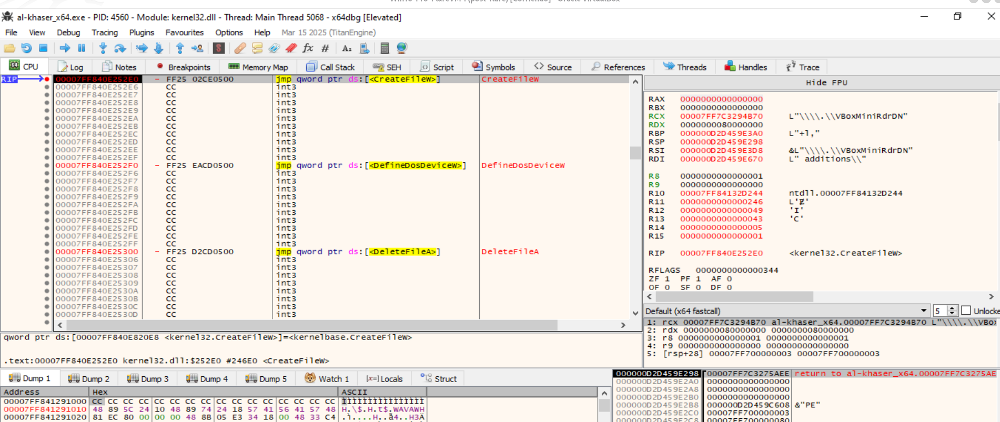

> **Figura 10.8.3.1. Interceptación de `CreateFileW` durante la comprobación de un dispositivo VirtualBox.** El registro `RCX`, correspondiente a `lpFileName`, apunta a `\\.\VBoxMiniRdrDN`. Al-khaser intenta abrir esta interfaz del sistema para determinar si el artefacto está presente.

Los parámetros observados pueden interpretarse como:

```text
RDX = 0x80000000
    = GENERIC_READ

R8  = 0x00000001
    = FILE_SHARE_READ

R9  = 0
    = lpSecurityAttributes = NULL
```

La llamada puede representarse conceptualmente como:

```c
CreateFileW(
    L"\\\\.\\VBoxMiniRdrDN",
    GENERIC_READ,
    FILE_SHARE_READ,
    NULL,
    ...,
    ...,
    NULL
);
```

Esta primera evidencia demuestra que al-khaser está consultando específicamente un artefacto asociado al entorno VirtualBox y no un archivo convencional.

---

## 10.8.3.4. Retorno satisfactorio de `CreateFileW`

Después de ejecutar `CreateFileW`, la ejecución retorna a:

```text
al-khaser_x64.exe
```

En el registro `RAX` se observa:

```text
RAX = 00000000000002B8
```

El valor de fallo de `CreateFileW` es:

```text
INVALID_HANDLE_VALUE
=
0xFFFFFFFFFFFFFFFF
```

Por tanto:

```text
0x2B8 != 0xFFFFFFFFFFFFFFFF
```

y el valor obtenido representa un **handle válido**.

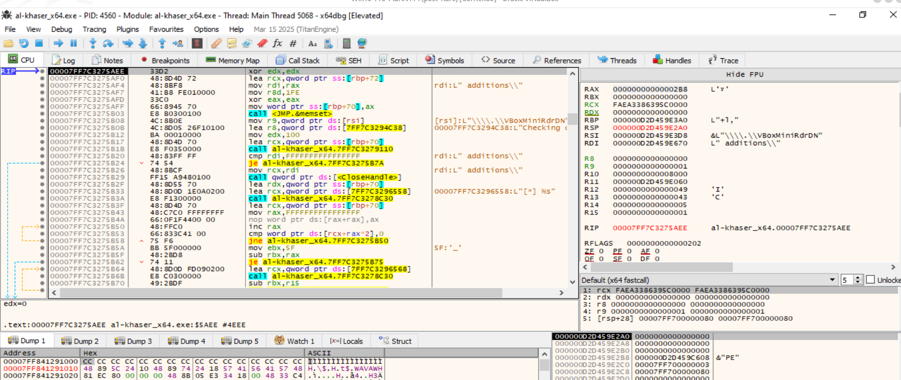

> **Figura 10.8.3.2. Retorno satisfactorio de `CreateFileW`.** Tras intentar abrir `\\.\VBoxMiniRdrDN`, la ejecución retorna a al-khaser con `RAX = 0x2B8`. Al ser distinto de `INVALID_HANDLE_VALUE`, el valor constituye un handle válido y confirma que el artefacto consultado está disponible en el sistema.

La secuencia observada es:

```text
CreateFileW("\\.\VBoxMiniRdrDN")
        ↓
RAX = 0x2B8
        ↓
Handle válido
        ↓
Artefacto localizado
```

La disponibilidad del dispositivo es coherente con la ejecución dentro de una máquina VirtualBox con los componentes correspondientes instalados.

---

## 10.8.3.5. Comparación con `INVALID_HANDLE_VALUE`

Después del retorno de `CreateFileW`, al-khaser conserva el handle y posteriormente realiza una comparación explícita con:

```text
0xFFFFFFFFFFFFFFFF
```

En la captura se observa:

```text
RDI = 00000000000002B8
```

junto con la instrucción:

```asm
cmp rdi, FFFFFFFFFFFFFFFF
```

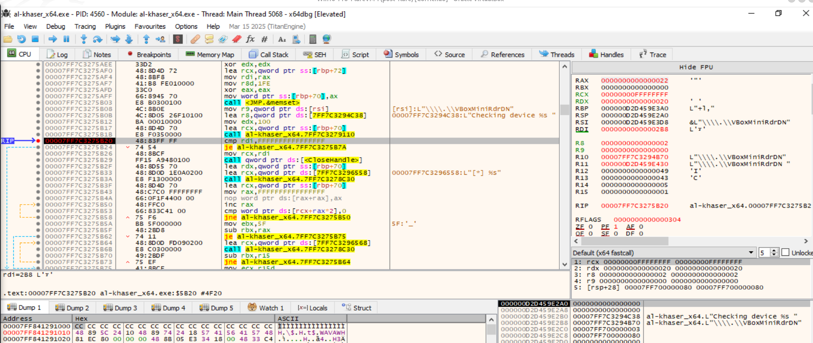

> **Figura 10.8.3.3. Comprobación del handle devuelto durante la detección de `VBoxMiniRdrDN`.** Al-khaser almacena el valor `0x2B8` en `RDI` y lo compara con `0xFFFFFFFFFFFFFFFF`, correspondiente a `INVALID_HANDLE_VALUE`. Como ambos valores son distintos, la comprobación determina que el dispositivo se ha abierto correctamente.

La lógica observada es:

```text
RDI = 0x2B8
        ↓
cmp rdi, FFFFFFFFFFFFFFFF
        ↓
0x2B8 != INVALID_HANDLE_VALUE
        ↓
comparación negativa
        ↓
rama de fallo no tomada
        ↓
detección positiva
```

En el código ensamblador se observa además un salto condicional posterior:

```asm
cmp rdi, FFFFFFFFFFFFFFFF
je  ...
```

El salto `JE` representa la rama asociada a la condición de igualdad.

Como:

```text
RDI != INVALID_HANDLE_VALUE
```

la condición de igualdad no se cumple y la ejecución continúa por la rama correspondiente al handle válido.

Esta captura resulta especialmente importante porque no solo demuestra que `CreateFileW` devuelve un valor diferente de `-1`, sino que permite observar cómo **al-khaser utiliza realmente ese resultado para tomar una decisión**.

---

## 10.8.3.6. Cierre del handle mediante `CloseHandle`

Después de comprobar que el handle es válido, al-khaser ejecuta:

```asm
mov rcx, rdi
call qword ptr ds:[<&CloseHandle>]
```

En Windows x64, el primer argumento de:

```text
CloseHandle
```

se transmite mediante:

```text
RCX
```

En la captura se observa:

```text
RCX = 00000000000002B8
RDI = 00000000000002B8
```

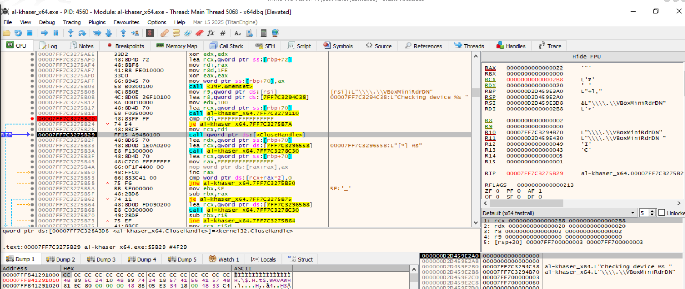

> **Figura 10.8.3.4. Cierre del handle asociado a `VBoxMiniRdrDN`.** Tras confirmar que `0x2B8` es diferente de `INVALID_HANDLE_VALUE`, al-khaser copia el handle a `RCX` y ejecuta `CloseHandle`. Esto confirma que la apertura del pseudo-dispositivo fue satisfactoria y que el valor recibido se trató como un handle válido.

La secuencia completa es:

```text
CreateFileW
        ↓
RAX = 0x2B8
        ↓
mov rdi, rax
        ↓
RDI = 0x2B8
        ↓
cmp rdi, INVALID_HANDLE_VALUE
        ↓
no iguales
        ↓
mov rcx, rdi
        ↓
RCX = 0x2B8
        ↓
CloseHandle
```

El hecho de que al-khaser cierre el handle proporciona una evidencia adicional de que el valor devuelto se considera válido.

---

## 10.8.3.7. Reconstrucción de la lógica de detección

La lógica completa observada durante la práctica puede reconstruirse como:

```text
al-khaser
        ↓
Comprobación VBOX
        ↓
CreateFileW
        ↓
RCX → "\\.\VBoxMiniRdrDN"
        ↓
RAX = 0x2B8
        ↓
handle válido
        ↓
mov rdi, rax
        ↓
cmp rdi, FFFFFFFFFFFFFFFF
        ↓
¿RDI == INVALID_HANDLE_VALUE?
        ↓
No
        ↓
Artefacto presente
        ↓
CloseHandle(0x2B8)
```

Desde el punto de vista de una técnica anti-VM:

```text
Dispositivo conocido de VirtualBox
        ↓
Intento de apertura
        ↓
Apertura satisfactoria
        ↓
Indicio de VirtualBox
```

Esta secuencia representa una técnica de **reconocimiento del entorno mediante artefactos del sistema operativo**.

---

## 10.8.3.8. Diferencia respecto a Named Pipes

La subtécnica anterior utilizaba rutas como:

```text
\\.\pipe\NombrePipe
```

En esta práctica, la ruta consultada es:

```text
\\.\VBoxMiniRdrDN
```

Aunque ambas comprobaciones pueden utilizar:

```text
CreateFileW
```

no representan el mismo tipo de artefacto.

La diferencia conceptual es:

```text
Named Pipe
──────────────────────
\\.\pipe\Nombre
        ↓
IPC mediante NPFS


Dispositivo / interfaz
──────────────────────
\\.\VBoxMiniRdrDN
        ↓
Interfaz o pseudo-dispositivo
```

Por tanto, la API utilizada no determina por sí sola la categoría del objeto. Es necesario analizar:

```text
lpFileName
```

y clasificar la ruta consultada.

---

## 10.8.3.9. Comparación con un resultado negativo

El mecanismo general empleado por al-khaser puede representarse mediante dos escenarios.

### Resultado positivo

```text
CreateFileW("\\.\VBoxMiniRdrDN")
        ↓
RAX = 0x2B8
        ↓
RAX != INVALID_HANDLE_VALUE
        ↓
dispositivo presente
        ↓
CloseHandle
```

### Resultado negativo

```text
CreateFileW("\\.\NombreDispositivo")
        ↓
RAX = FFFFFFFFFFFFFFFF
        ↓
INVALID_HANDLE_VALUE
        ↓
dispositivo no disponible
```

En la práctica realizada se obtuvo el **resultado positivo**, que resulta especialmente útil porque permite observar también:

```text
CloseHandle
```

sobre el handle válido.

---

## 10.8.3.10. Relación con la evasión de virtualización

La técnica se basa en la existencia de artefactos específicos introducidos por componentes del entorno virtualizado.

Una muestra puede conocer previamente nombres asociados a:

- VirtualBox.
- VMware.
- Guest Additions.
- Drivers de integración.
- Interfaces de comunicación host/guest.
- Componentes auxiliares del hipervisor.

Después puede intentar abrirlos mediante:

```text
CreateFileW
```

y utilizar el resultado para modificar su comportamiento.

La lógica anti-análisis puede representarse como:

```text
Lista de dispositivos conocidos
        ↓
CreateFileW
        ↓
Handle válido
        ↓
Indicador de virtualización
        ↓
Modificar flujo
```

Entre las posibles acciones posteriores se encuentran:

- Finalizar la ejecución.
- Evitar ejecutar el payload.
- Introducir retrasos.
- Ejecutar funcionalidad alternativa.
- Ocultar determinadas acciones.
- Combinar la evidencia con otros indicadores.

---

## 10.8.3.11. Evidencias obtenidas

Durante la demostración se documentaron las siguientes evidencias:

1. Ejecución selectiva de la comprobación VirtualBox de al-khaser.
2. Breakpoint condicionado sobre `CreateFileW`.
3. Ruta `\\.\VBoxMiniRdrDN` observada en `RCX`.
4. Acceso `GENERIC_READ` observado en `RDX`.
5. `FILE_SHARE_READ` observado en `R8`.
6. Retorno satisfactorio de `CreateFileW`.
7. Handle válido `0x2B8`.
8. Almacenamiento del handle en `RDI`.
9. Comparación con `0xFFFFFFFFFFFFFFFF`.
10. Identificación de `INVALID_HANDLE_VALUE`.
11. Rama de igualdad no tomada.
12. Copia del handle a `RCX`.
13. Ejecución de `CloseHandle`.
14. Confirmación de que el resultado se trató como una detección positiva.

La secuencia proporciona evidencia tanto del **artefacto consultado** como de la **lógica utilizada para interpretar el resultado**.

---

## 10.8.3.12. Limitaciones

La demostración presenta varias limitaciones:

- La detección positiva depende de que el componente correspondiente esté instalado y exponga el artefacto.
- No todas las instalaciones de VirtualBox presentan exactamente los mismos dispositivos.
- La ausencia de `\\.\VBoxMiniRdrDN` no demuestra que el sistema sea físico.
- Un entorno puede ocultar o modificar estos artefactos.
- Un software legítimo podría crear una interfaz con un nombre coincidente.
- La existencia de un único artefacto debe considerarse una evidencia heurística.
- Los valores numéricos de los handles varían entre ejecuciones.
- Las direcciones mostradas por x64dbg pueden cambiar por ASLR.
- Una muestra real puede ofuscar el nombre del dispositivo.
- La API puede resolverse dinámicamente en lugar de aparecer como importación directa.

Por tanto, esta evidencia debe correlacionarse con otros indicadores:

- Named Pipes.
- Mutexes.
- Procesos.
- Servicios.
- Drivers.
- Registry.
- WMI.
- Hardware.
- CPU.
- Timing.
- Firmware.

---

## 10.8.3.13. Conclusión

La demostración dinámica ha permitido observar cómo al-khaser comprueba la presencia de un artefacto de VirtualBox mediante:

```text
CreateFileW
```

La herramienta intenta abrir:

```text
\\.\VBoxMiniRdrDN
```

y la llamada devuelve:

```text
RAX = 0x2B8
```

Al ser distinto de:

```text
0xFFFFFFFFFFFFFFFF
```

correspondiente a:

```text
INVALID_HANDLE_VALUE
```

el valor representa un handle válido.

Posteriormente, al-khaser almacena el resultado en `RDI` y ejecuta:

```asm
cmp rdi, FFFFFFFFFFFFFFFF
```

La comparación confirma que el handle no corresponde al valor de error. La rama de fallo no se toma y al-khaser continúa hasta:

```text
CloseHandle
```

utilizando:

```text
RCX = 0x2B8
```

La secuencia completa observada es:

```text
CreateFileW
        ↓
RCX → "\\.\VBoxMiniRdrDN"
        ↓
RAX = 0x2B8
        ↓
handle válido
        ↓
cmp RDI, INVALID_HANDLE_VALUE
        ↓
no iguales
        ↓
detección positiva
        ↓
CloseHandle(0x2B8)
```

La práctica demuestra que los **dispositivos o interfaces expuestos por un hipervisor pueden actuar como artefactos de reconocimiento del entorno**. Una herramienta anti-VM puede intentar abrir nombres conocidos mediante `CreateFileW` y utilizar el resultado para inferir la presencia de virtualización.


---


# 10.8.4. Enumeración del Object Manager mediante `NtQueryObject`

## 10.8.4.1. Objetivo de la demostración

El objetivo de esta práctica es demostrar dinámicamente cómo una herramienta anti-análisis puede utilizar la API nativa de Windows:

```text
NtQueryObject
```

para recuperar información global sobre los tipos de objetos gestionados por el **Object Manager**.

La demostración se realiza con `al-khaser_x64.exe`, dentro de `x64dbg`, utilizando la comprobación:

```text
NtQueryObject with ObjectAllTypesInformation
```

La lógica general observada es:

```text
NtQueryObject
        ↓
ObjectInformationClass = 3
        ↓
ObjectAllTypesInformation
        ↓
consulta inicial del tamaño
        ↓
STATUS_INFO_LENGTH_MISMATCH
        ↓
VirtualAlloc
        ↓
reserva de un buffer
        ↓
segunda NtQueryObject
        ↓
STATUS_SUCCESS
        ↓
buffer rellenado con tipos de objetos
        ↓
búsqueda de "DebugObject"
```

La práctica no pretende demostrar únicamente una llamada aislada a `NtQueryObject`, sino el ciclo completo necesario para obtener y procesar la información devuelta por el Object Manager.

---

## 10.8.4.2. Preparación del laboratorio

Para la demostración se utilizaron:

- Windows x64.
- `al-khaser_x64.exe`.
- `x64dbg`.

La herramienta se ejecutó con:

```bat
al-khaser_x64.exe --check DEBUG
```

Para capturar la consulta relevante se utilizó el breakpoint:

```text
bp ntdll:NtQueryObject
```

Durante la fase de reserva de memoria también se utilizó:

```text
bp kernelbase:VirtualAlloc
```

La llamada de interés es aquella en la que:

```text
RDX = 3
```

porque, en la rutina estudiada de al-khaser, ese valor se utiliza para solicitar:

```text
ObjectAllTypesInformation
```

La secuencia observable en x64 es:

```text
RCX = Handle
RDX = ObjectInformationClass
R8  = ObjectInformation
R9  = ObjectInformationLength
[rsp+28] = ReturnLength
```

---

## 10.8.4.3. Primera llamada a `NtQueryObject`

La primera llamada relevante se intercepta en:

```text
ntdll.NtQueryObject
```

con:

```text
RCX = 0000000000000000
RDX = 0000000000000003
R8  = puntero a variable local
R9  = 0000000000000004
```

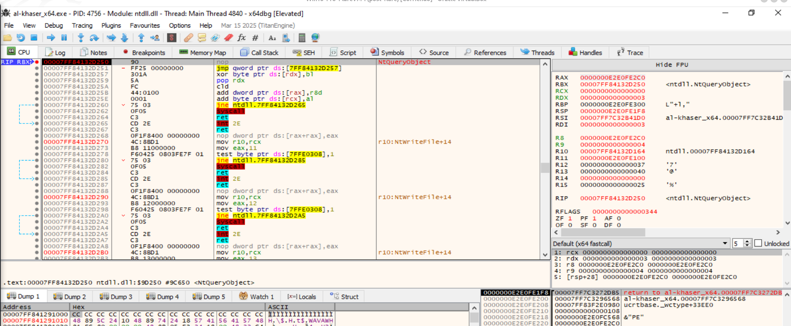

> **Figura 10.8.4.1. Primera llamada a `NtQueryObject` con `ObjectInformationClass = 3`.** El registro `RDX = 3` identifica la consulta `ObjectAllTypesInformation`. `RCX = NULL` y el buffer inicial es deliberadamente muy pequeño, ya que esta primera llamada se utiliza para conocer el tamaño real necesario.

Conceptualmente:

```c
NtQueryObject(
    NULL,
    3,
    &size,
    sizeof(ULONG),
    &size
);
```

La finalidad de esta primera llamada no es recuperar todavía toda la información, sino obtener el tamaño que Windows necesita para devolver la lista completa.

---

## 10.8.4.4. `STATUS_INFO_LENGTH_MISMATCH` y obtención del tamaño requerido

Tras retornar de la primera llamada se observa:

```text
RAX = 00000000C0000004
```

que x64dbg identifica como:

```text
STATUS_INFO_LENGTH_MISMATCH
```

Además, la variable local utilizada para almacenar el tamaño requerido contiene:

```text
[RBP-40] = 0x2308
```

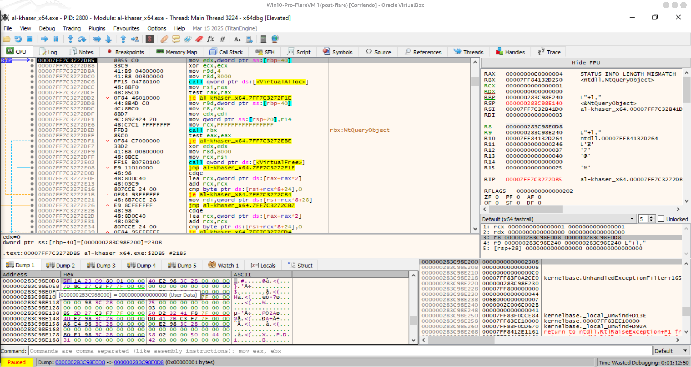

> **Figura 10.8.4.2. Retorno de la consulta inicial.** `NtQueryObject` devuelve `STATUS_INFO_LENGTH_MISMATCH` (`0xC0000004`), indicando que el buffer inicial no es suficiente. Windows devuelve el tamaño requerido, `0x2308` bytes, que al-khaser utilizará en la siguiente fase.

La secuencia es:

```text
NtQueryObject
        ↓
buffer inicial insuficiente
        ↓
STATUS_INFO_LENGTH_MISMATCH
        ↓
size = 0x2308
```

Este patrón es habitual en APIs de Windows que necesitan devolver estructuras cuyo tamaño depende del estado actual del sistema.

---

## 10.8.4.5. Reserva del buffer mediante `VirtualAlloc`

Una vez conocido el tamaño necesario, al-khaser prepara una reserva de memoria.

La llamada interceptada a:

```text
kernelbase.VirtualAlloc
```

presenta:

```text
RCX = 0000000000000000
RDX = 0000000000002308
R8  = 0000000000003000
R9  = 0000000000000004
```

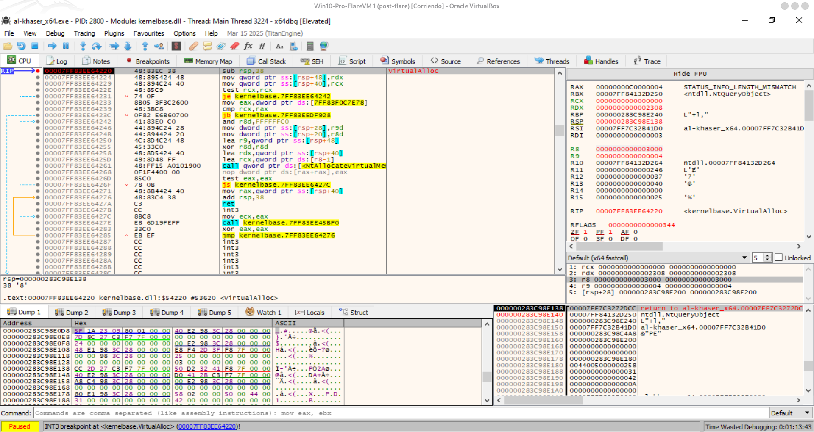

> **Figura 10.8.4.3. Reserva del buffer mediante `VirtualAlloc`.** El tamaño `0x2308`, obtenido previamente de `NtQueryObject`, se utiliza como segundo argumento. `R8 = 0x3000` corresponde a `MEM_COMMIT | MEM_RESERVE` y `R9 = 0x04` a `PAGE_READWRITE`.

La llamada puede representarse como:

```c
VirtualAlloc(
    NULL,
    0x2308,
    MEM_COMMIT | MEM_RESERVE,
    PAGE_READWRITE
);
```

---

## 10.8.4.6. Retorno de `VirtualAlloc` y dirección del buffer

Después del retorno de `VirtualAlloc` se obtiene:

```text
RAX = 000001800AA80000
```

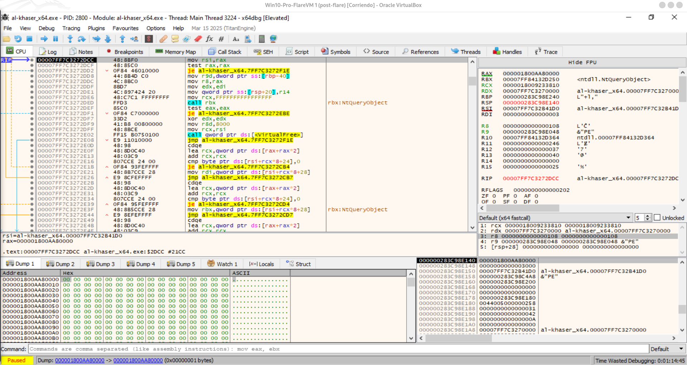

> **Figura 10.8.4.4. Retorno satisfactorio de `VirtualAlloc`.** La API devuelve la dirección `0x000001800AA80000`, que al-khaser almacenará en `RSI` y utilizará como buffer de salida para la segunda consulta a `NtQueryObject`.

En ese instante, el buffer recién reservado aparece en el Dump prácticamente a cero:

```text
0x000001800AA80000
        ↓
00 00 00 00 00 00 ...
```

Esto es normal: `VirtualAlloc` únicamente ha reservado y comprometido la región de memoria. Todavía no se ha realizado la llamada que escribirá los datos del Object Manager.

La situación es:

```text
VirtualAlloc
        ↓
región reservada
        ↓
buffer vacío / inicializado
        ↓
0x000001800AA80000
```

---

## 10.8.4.7. Segunda llamada a `NtQueryObject`

A continuación al-khaser vuelve a invocar:

```text
NtQueryObject
```

pero esta vez proporciona el buffer completo.

Los registros muestran:

```text
RCX = FFFFFFFFFFFFFFFF
RDX = 0000000000000003
R8  = 000001800AA80000
R9  = 0000000000002308
```

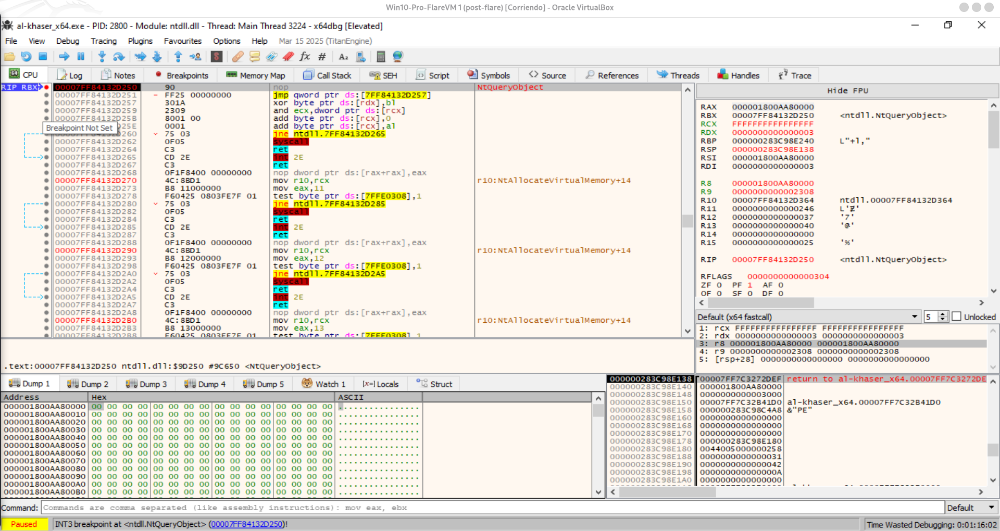

> **Figura 10.8.4.5. Segunda llamada a `NtQueryObject`.** La consulta vuelve a utilizar `ObjectInformationClass = 3`, pero ahora `R8` contiene la dirección del buffer reservado (`0x000001800AA80000`) y `R9` el tamaño requerido (`0x2308`).

Conceptualmente:

```c
NtQueryObject(
    (HANDLE)-1,
    3,
    0x000001800AA80000,
    0x2308,
    NULL
);
```

Esta es la llamada que solicita realmente la información completa.

---

## 10.8.4.8. Cómo se rellena la memoria observada en el Dump

Este punto es fundamental para interpretar correctamente la práctica.

### Estado antes de la segunda llamada

Después de `VirtualAlloc`, el buffer existe pero todavía no contiene la información del Object Manager:

```text
0x000001800AA80000
        ↓
00 00 00 00 00 00 00 00 ...
```

`VirtualAlloc` ha realizado únicamente:

```text
reserva
+
commit
+
PAGE_READWRITE
```

La herramienta posee una región válida y escribible, pero no ha escrito todavía la estructura `ObjectAllTypesInformation`.

### Paso de la dirección a `NtQueryObject`

En la segunda llamada:

```text
R8 = 0x000001800AA80000
```

`R8` representa el argumento:

```text
ObjectInformation
```

Es decir, al-khaser entrega a `NtQueryObject` un puntero a la región previamente reservada.

El tamaño disponible se entrega en:

```text
R9 = 0x2308
```

Por tanto:

```text
NtQueryObject
        ↓
ObjectInformation = 0x000001800AA80000
ObjectInformationLength = 0x2308
```

### Escritura del resultado

Durante la ejecución de `NtQueryObject`, Windows utiliza ese puntero como **buffer de salida**.

Conceptualmente:

```text
ANTES
────────────────────────────
0x000001800AA80000
00 00 00 00 00 00 00 00 ...


NtQueryObject(...)
        ↓
kernel / ntdll
        ↓
recuperación de la información
        ↓
escritura en el buffer indicado por R8


DESPUÉS
────────────────────────────
0x000001800AA80000
43 00 00 00 ...
...
"Type"
...
"DebugObject"
...
"Event"
...
```

Por tanto, **el Dump no se rellena porque x64dbg haga ninguna transformación**. x64dbg únicamente muestra la memoria del proceso.

La modificación real se produce porque:

```text
NtQueryObject
```

escribe los resultados de la consulta en la dirección proporcionada mediante:

```text
R8
```

El cambio visual observado en el Dump es, por tanto, una consecuencia directa de la escritura del buffer de salida por parte de la API.

---

## 10.8.4.9. `STATUS_SUCCESS` y buffer ya rellenado

Tras finalizar la segunda llamada, se observa:

```text
RAX = 0000000000000000
```

es decir:

```text
STATUS_SUCCESS
```

Al mismo tiempo:

```text
RSI = 000001800AA80000
```

continúa apuntando al buffer reservado.

En el Dump ya aparecen datos:

```text
43 00 00 00 ...
```

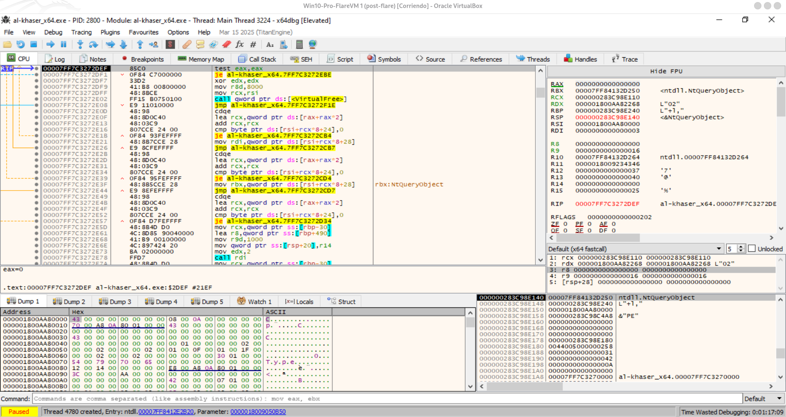

> **Figura 10.8.4.6. Retorno satisfactorio y contenido del buffer.** `NtQueryObject` devuelve `STATUS_SUCCESS` (`RAX = 0`) y la región previamente vacía contiene ahora la información recuperada del Object Manager.

Los primeros cuatro bytes son:

```text
43 00 00 00
```

interpretados como:

```text
0x43 = 67
```

En la estructura utilizada por la rutina analizada, este valor corresponde al número de tipos de objetos recuperados.

La transición observable es:

```text
Antes:
buffer → ceros

Segunda NtQueryObject
        ↓

Después:
buffer → estructura con información
```

---

## 10.8.4.10. Búsqueda de `DebugObject`

Una vez rellenado el buffer, se realizó una búsqueda del patrón UTF-16LE:

```text
44 00 65 00 62 00 75 00 67 00
4F 00 62 00 6A 00 65 00 63 00 74 00
```

correspondiente a:

```text
DebugObject
```

La búsqueda localizó la cadena en:

```text
0x000001800AA80718
```

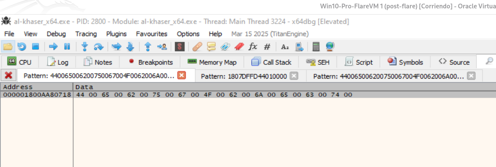

> **Figura 10.8.4.7. Búsqueda de `DebugObject`.** El patrón Unicode correspondiente a `DebugObject` se localiza dentro del buffer rellenado por `NtQueryObject`, en la dirección `0x000001800AA80718`.

Esto demuestra que la enumeración recuperada contiene el tipo de objeto:

```text
DebugObject
```

que al-khaser utiliza como parte de su lógica anti-debug.

---

## 10.8.4.11. `DebugObject` visible directamente en el Dump

Al seguir el resultado de la búsqueda en el Dump, la cadena queda visible dentro de la misma región de memoria:

```text
0x000001800AA80718
```

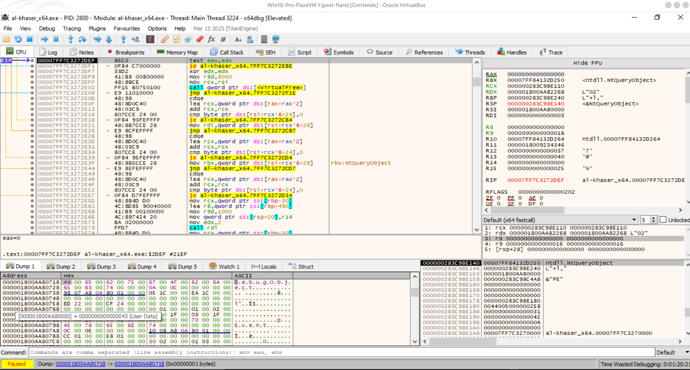

> **Figura 10.8.4.8. `DebugObject` dentro del buffer de `ObjectAllTypesInformation`.** El Dump muestra directamente la cadena Unicode `DebugObject` dentro de la región `0x000001800AA80000`, confirmando que la segunda llamada a `NtQueryObject` ha recuperado la enumeración de tipos de objetos y que este tipo concreto está presente en la información devuelta.

La secuencia queda:

```text
buffer base
0x000001800AA80000
        ↓
enumeración de tipos
        ↓
...
        ↓
0x000001800AA80718
        ↓
"DebugObject"
```

---

## 10.8.4.12. Reconstrucción completa de la técnica

La práctica completa puede representarse como:

```text
al-khaser
        ↓
NtQueryObject
        ↓
RDX = 3
ObjectAllTypesInformation
        ↓
buffer inicial insuficiente
        ↓
STATUS_INFO_LENGTH_MISMATCH
        ↓
size = 0x2308
        ↓
VirtualAlloc
        ↓
buffer = 0x000001800AA80000
        ↓
buffer inicialmente vacío
        ↓
segunda NtQueryObject
        ↓
R8 = buffer
R9 = 0x2308
        ↓
Windows escribe ObjectAllTypesInformation
        ↓
STATUS_SUCCESS
        ↓
buffer rellenado
        ↓
NumberOfObjects = 0x43
        ↓
67 tipos
        ↓
"DebugObject"
```

---

## 10.8.4.13. Relación con técnicas anti-análisis

La enumeración global de tipos de objetos permite a una muestra obtener información sobre objetos gestionados por el Object Manager.

En esta práctica, al-khaser busca específicamente:

```text
DebugObject
```

como parte de una comprobación anti-debug.

La lógica puede resumirse así:

```text
Enumerar tipos de objetos
        ↓
buscar DebugObject
        ↓
examinar información asociada
        ↓
utilizar el resultado como indicador anti-debug
```

La presencia del tipo `DebugObject` en la enumeración no debe interpretarse por sí sola como prueba de que el proceso está siendo depurado.

Lo relevante para la técnica es que la información global del Object Manager puede utilizarse como fuente de señales sobre el entorno.

---

## 10.8.4.14. Evidencias obtenidas

Durante la demostración se han obtenido las siguientes evidencias:

1. Entrada en `NtQueryObject`.
2. `ObjectInformationClass = 3`.
3. Primera consulta con buffer insuficiente.
4. `STATUS_INFO_LENGTH_MISMATCH`.
5. Tamaño requerido de `0x2308`.
6. Reserva del buffer mediante `VirtualAlloc`.
7. Uso de `MEM_COMMIT | MEM_RESERVE`.
8. Uso de `PAGE_READWRITE`.
9. Dirección válida devuelta por `VirtualAlloc`.
10. Buffer inicialmente vacío.
11. Segunda llamada a `NtQueryObject`.
12. Dirección del buffer transmitida mediante `R8`.
13. Tamaño `0x2308` transmitido mediante `R9`.
14. `STATUS_SUCCESS`.
15. Buffer rellenado por la API.
16. Primer valor `0x43`.
17. Enumeración de 67 tipos.
18. Localización de `DebugObject`.
19. Dirección de `DebugObject`: `0x000001800AA80718`.
20. Visualización directa de `DebugObject` en el Dump.

---

## 10.8.4.15. Limitaciones

La demostración presenta varias limitaciones:

- `NtQueryObject` es una API nativa cuyo uso y estructuras asociadas pueden variar entre versiones de Windows.
- Las direcciones observadas cambian entre ejecuciones debido a ASLR y a la asignación dinámica de memoria.
- El tamaño `0x2308` corresponde a esta ejecución concreta y puede variar.
- El valor `0x43` corresponde al contenido devuelto en esta ejecución concreta.
- La existencia del tipo `DebugObject` no implica necesariamente que el proceso analizado esté bajo un debugger.
- La técnica debe considerarse heurística y correlacionarse con otras señales.
- El contenido del buffer depende del estado del sistema en el momento de la consulta.
- La herramienta puede liberar posteriormente el buffer mediante `VirtualFree`, por lo que la captura debe realizarse antes de que la región deje de estar disponible.

---

## 10.8.4.16. Conclusión

La demostración dinámica ha permitido observar el ciclo completo utilizado para enumerar información del Object Manager mediante:

```text
NtQueryObject
```

La primera llamada utiliza:

```text
ObjectInformationClass = 3
```

y devuelve:

```text
STATUS_INFO_LENGTH_MISMATCH
```

junto con el tamaño necesario:

```text
0x2308
```

A continuación, al-khaser reserva esa cantidad de memoria mediante:

```text
VirtualAlloc
```

obteniendo:

```text
0x000001800AA80000
```

Inicialmente, esta región aparece vacía en el Dump.

La segunda llamada a:

```text
NtQueryObject
```

recibe esa dirección mediante:

```text
R8
```

y el tamaño mediante:

```text
R9
```

Durante la ejecución de la API, Windows escribe la información solicitada directamente en el buffer de salida. Por este motivo, al retornar con:

```text
STATUS_SUCCESS
```

el Dump deja de mostrar una región vacía y pasa a contener la enumeración de tipos de objetos.

Dentro de esa información se localizó:

```text
DebugObject
```

en:

```text
0x000001800AA80718
```

La secuencia completa queda:

```text
NtQueryObject
        ↓
ObjectAllTypesInformation
        ↓
STATUS_INFO_LENGTH_MISMATCH
        ↓
size = 0x2308
        ↓
VirtualAlloc
        ↓
buffer vacío
        ↓
segunda NtQueryObject
        ↓
Windows escribe en el buffer
        ↓
STATUS_SUCCESS
        ↓
buffer rellenado
        ↓
DebugObject localizado
```

La práctica demuestra cómo una muestra puede utilizar `NtQueryObject` para obtener información global de los tipos de objetos administrados por Windows y emplearla posteriormente como fuente de indicadores anti-debug o anti-análisis.


------ 


# 10.8.5. Job Objects mediante `QueryInformationJobObject`

## 10.8.5.1. Objetivo de la demostración

El objetivo de esta práctica es demostrar dinámicamente cómo una herramienta anti-análisis puede consultar los procesos asociados a un **Job Object** de Windows mediante:

```text
QueryInformationJobObject
```

y utilizar esa información para identificar procesos externos asociados al mismo Job.

La demostración se realiza con:

- `al-khaser_x64.exe`
- `x64dbg`
- PowerShell como herramienta auxiliar de validación

La secuencia completa observada es:

```text
QueryInformationJobObject
        ↓
JobObjectBasicProcessIdList
        ↓
lista de PID asociados al Job
        ↓
comparación con GetCurrentProcessId()
        ↓
OpenProcess() sobre PID externos
        ↓
K32GetProcessImageFileNameW()
        ↓
identificación de x64dbg.exe
        ↓
resultado [BAD]
```

---

## 10.8.5.2. Preparación del laboratorio

La ejecución utilizada fue:

```bat
al-khaser_x64.exe --check DEBUG
```

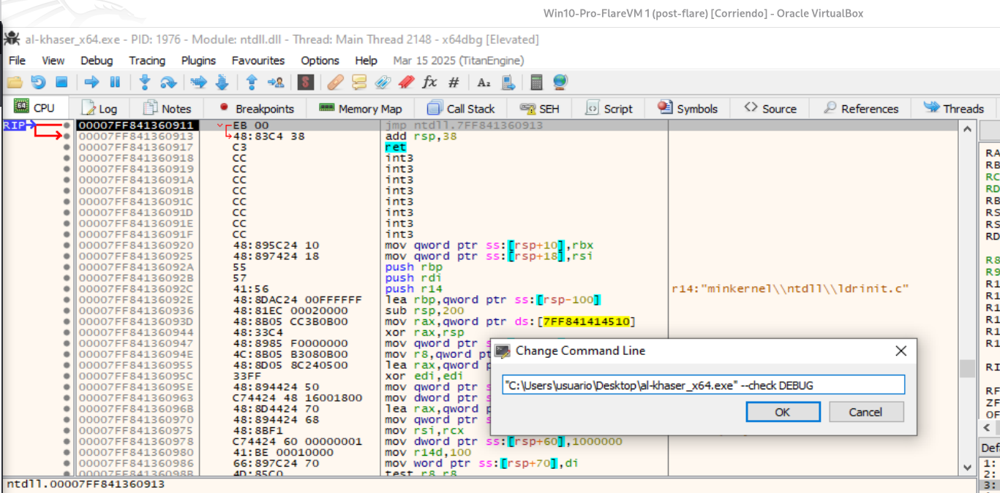

> **Figura 10.8.5.1. Ejecución de al-khaser con la comprobación `DEBUG`.** La opción `--check DEBUG` permite ejecutar el conjunto de comprobaciones anti-debug entre las que se encuentra la prueba relacionada con Job Objects.

Los breakpoints principales utilizados fueron:

```text
bp kernel32:QueryInformationJobObject
bp kernel32:GetCurrentProcessId
bp kernel32:OpenProcess
bp kernel32:K32GetProcessImageFileNameW
```

---

## 10.8.5.3. Entrada en `QueryInformationJobObject`

La primera evidencia relevante se obtiene al interceptar:

```text
kernel32.QueryInformationJobObject
```

Los registros muestran:

```text
RCX = 0000000000000000
RDX = 0000000000000003
R8  = 00000234BA55CFA0
R9  = 0000000000002010
```

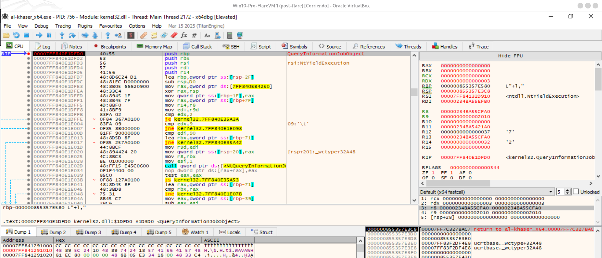

> **Figura 10.8.5.2. Entrada en `QueryInformationJobObject`.** La llamada utiliza `RCX = NULL`, `RDX = 3`, un buffer apuntado por `R8` y un tamaño de `0x2010` bytes en `R9`.

La llamada observada puede representarse conceptualmente como:

```c
QueryInformationJobObject(
    NULL,
    JobObjectBasicProcessIdList,
    buffer,
    0x2010,
    NULL
);
```

La clase utilizada es:

```text
JobObjectBasicProcessIdList
```

y el buffer de salida se utiliza para recuperar la lista de procesos asociados al Job Object.

---

## 10.8.5.4. Retorno satisfactorio de `QueryInformationJobObject`

Tras regresar de la API se observa:

```text
RAX = 0000000000000001
```

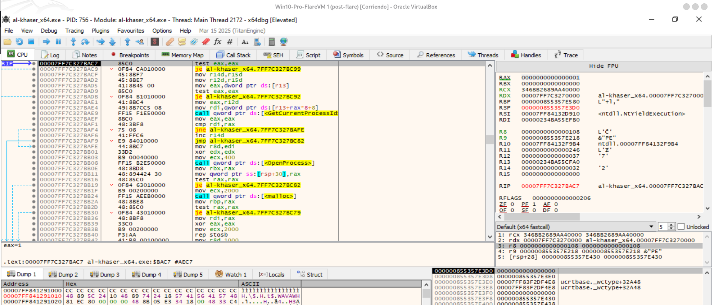

> **Figura 10.8.5.3. Retorno de `QueryInformationJobObject`.** El valor `RAX = 1` indica que la consulta ha finalizado correctamente. A partir de este punto al-khaser comienza a procesar la estructura almacenada en el buffer.

En el código de al-khaser se observa que el puntero al buffer se conserva en:

```text
R13 = 00000234BA55CFA0
```

y que posteriormente se accede a los campos de esa región para obtener el número de procesos y los PID asociados.

---

## 10.8.5.5. Estructura `JOBOBJECT_BASIC_PROCESS_ID_LIST`

Al seguir `R13` en el Dump se obtiene:

```text
03 00 00 00  03 00 00 00
E4 12 00 00  00 00 00 00
F4 02 00 00  00 00 00 00
4C 0D 00 00  00 00 00 00
```

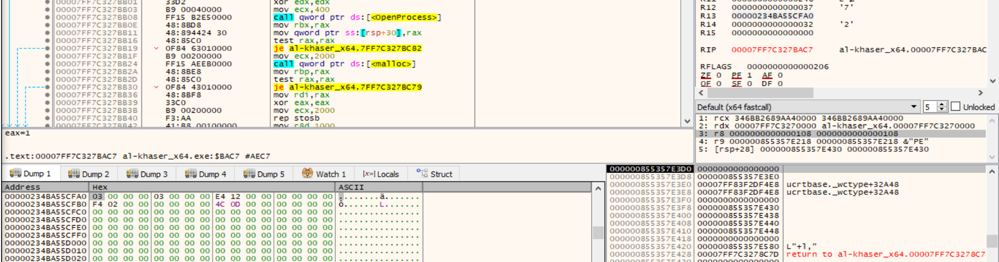

> **Figura 10.8.5.4. Contenido del buffer devuelto por `QueryInformationJobObject`.** La estructura indica tres procesos asignados al Job y tres PID incluidos en la lista.

La interpretación es:

```text
R13 + 0x00 = 03 00 00 00
             NumberOfAssignedProcesses = 3

R13 + 0x04 = 03 00 00 00
             NumberOfProcessIdsInList = 3

R13 + 0x08 = E4 12 00 00 00 00 00 00
             PID[0] = 0x12E4 = 4836

R13 + 0x10 = F4 02 00 00 00 00 00 00
             PID[1] = 0x02F4 = 756

R13 + 0x18 = 4C 0D 00 00 00 00 00 00
             PID[2] = 0x0D4C = 3404
```

Por tanto:

```text
NumberOfAssignedProcesses = 3
NumberOfProcessIdsInList   = 3
```

y el Job contiene tres procesos.

---

## 10.8.5.6. Validación externa de los PID mediante PowerShell

Los PID obtenidos se verificaron con:

```powershell
Get-Process -Id 4836,756,3404 | Select-Object Id,ProcessName,Path
```

El resultado fue:

```text
756  → al-khaser_x64.exe
3404 → conhost.exe
4836 → x64dbg.exe
```

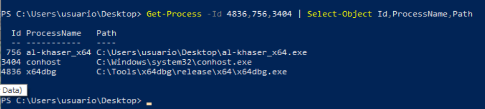

> **Figura 10.8.5.5. Identificación de los PID recuperados del Job Object.** PowerShell confirma que los tres procesos asociados son `al-khaser_x64.exe`, `conhost.exe` y `x64dbg.exe`.

Esta validación permite reconstruir la situación:

```text
Job Object
│
├── al-khaser_x64.exe
├── conhost.exe
└── x64dbg.exe
```

La presencia de `x64dbg.exe` es especialmente relevante para la lógica anti-debug.

---

## 10.8.5.7. Comparación con `GetCurrentProcessId`

Al-khaser recorre los PID contenidos en `ProcessIdList[]`.

En una de las iteraciones carga:

```text
RDI = 00000000000012E4
```

es decir:

```text
0x12E4 = 4836
```

y llama a:

```text
GetCurrentProcessId
```

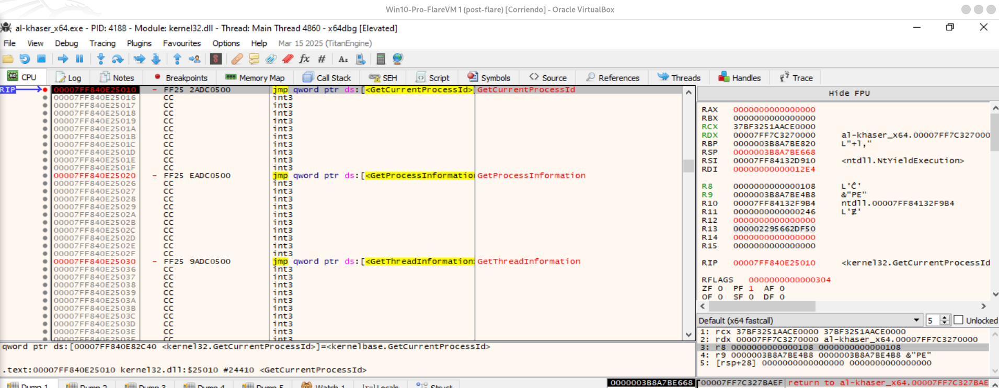

> **Figura 10.8.5.6. Comparación del PID recuperado del Job con el proceso actual.** El PID `0x12E4` se encuentra en `RDI` mientras al-khaser invoca `GetCurrentProcessId`.

Después del retorno se observa:

```text
RAX = 000000000000105C
RDI = 00000000000012E4
```

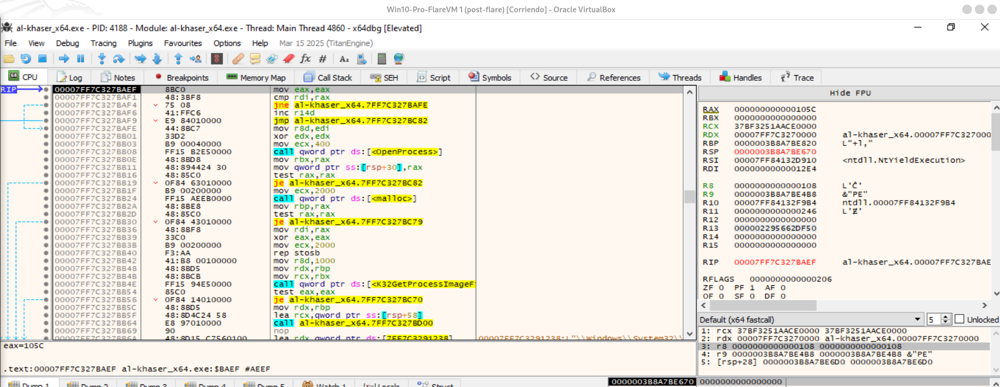

> **Figura 10.8.5.7. Resultado de `GetCurrentProcessId`.** El PID del proceso actual es `0x105C` (4188), mientras que el PID recuperado del Job es `0x12E4` (4836). Al no coincidir, al-khaser continúa analizando ese proceso externo.

La comparación es:

```text
PID del Job     = 0x12E4 = 4836
PID de al-khaser = 0x105C = 4188

4836 != 4188
```

---

## 10.8.5.8. Apertura del proceso externo mediante `OpenProcess`

Tras comprobar que el PID no corresponde al proceso actual, al-khaser llama a:

```text
OpenProcess
```

Los argumentos relevantes son:

```text
RCX = 0000000000000400
RDX = 0000000000000000
R8  = 00000000000012E4
```

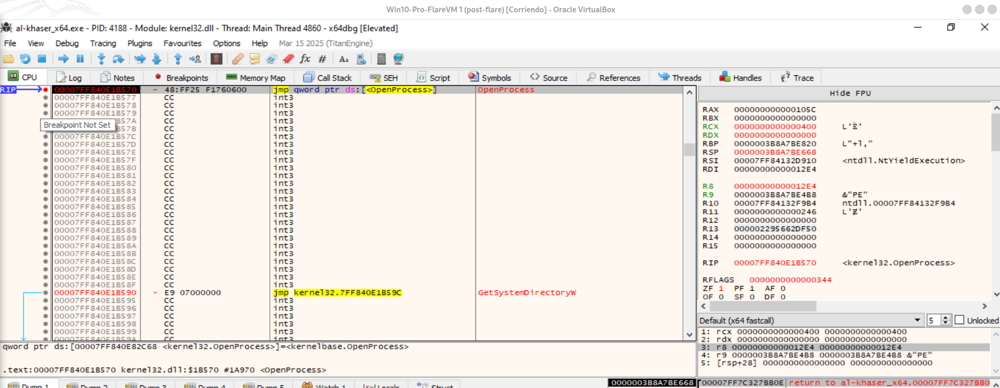

> **Figura 10.8.5.8. Apertura del proceso externo.** `OpenProcess` recibe el PID `0x12E4` (4836), que corresponde a `x64dbg.exe`.

Conceptualmente:

```c
OpenProcess(
    0x400,
    FALSE,
    4836
);
```

La secuencia hasta este punto es:

```text
QueryInformationJobObject
        ↓
PID 4836
        ↓
GetCurrentProcessId
        ↓
4836 != PID actual
        ↓
OpenProcess(4836)
```

---

## 10.8.5.9. Retorno de `OpenProcess`

Después del retorno de `OpenProcess` se observa:

```text
RAX = 0000000000000260
```

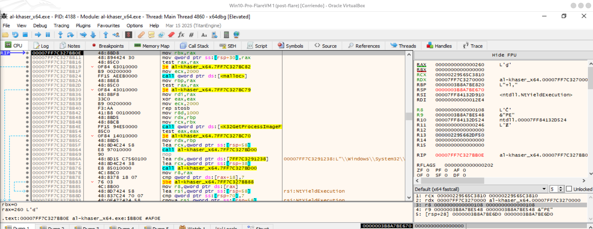

> **Figura 10.8.5.9. Retorno satisfactorio de `OpenProcess`.** La función devuelve el handle `0x260`, que se utilizará posteriormente para consultar la imagen del proceso.

La instrucción siguiente es:

```asm
mov rbx, rax
```

por lo que:

```text
RBX = 0x260
```

queda almacenado como handle del proceso abierto.

---

## 10.8.5.10. Identificación del proceso mediante `K32GetProcessImageFileNameW`

El siguiente paso consiste en obtener la ruta del ejecutable asociado al handle.

Al-khaser llama a:

```text
K32GetProcessImageFileNameW
```

con:

```text
RCX = 0000000000000260
RDX = 000002295662FF70
R8  = 0000000000001000
```

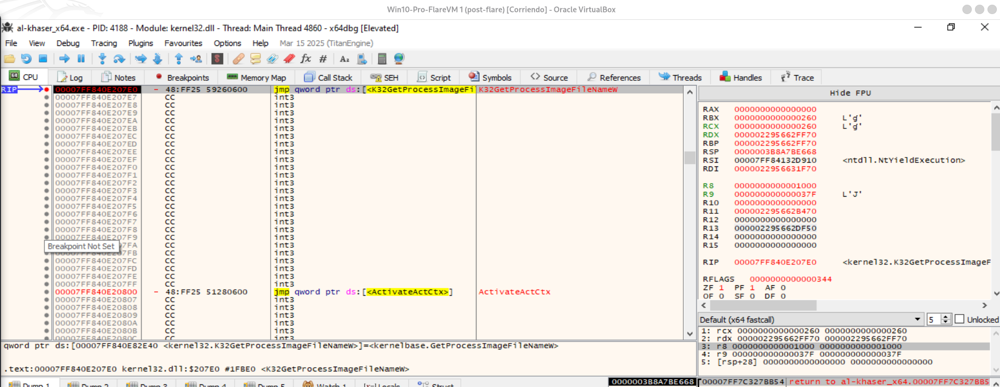

> **Figura 10.8.5.10. Entrada en `K32GetProcessImageFileNameW`.** `RCX` contiene el handle obtenido con `OpenProcess`, `RDX` apunta al buffer de salida y `R8` establece el tamaño máximo del buffer.

Conceptualmente:

```c
K32GetProcessImageFileNameW(
    0x260,
    0x000002295662FF70,
    0x1000
);
```

---

## 10.8.5.11. Retorno de `K32GetProcessImageFileNameW`

Tras regresar de la función se observa:

```text
RAX = 000000000000003B
```

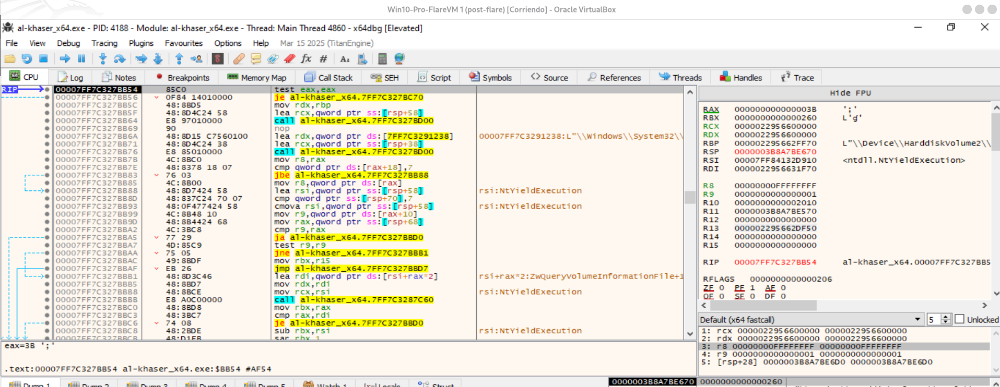

> **Figura 10.8.5.11. Retorno satisfactorio de `K32GetProcessImageFileNameW`.** La API devuelve `0x3B`, indicando que ha escrito una cadena válida en el buffer de salida.

El buffer sigue localizado en:

```text
0x000002295662FF70
```

y x64dbg ya muestra que contiene una ruta Unicode que comienza por:

```text
\Device\HarddiskVolume2\...
```

---

## 10.8.5.12. Ruta de `x64dbg.exe` en el Dump

Al seguir el buffer en el Dump se obtiene:

```text
\Device\HarddiskVolume2\Tools\x64dbg\release\x64\x64dbg.exe
```

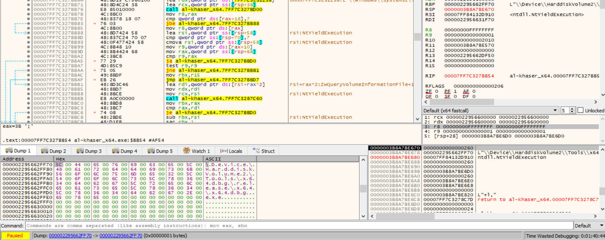

> **Figura 10.8.5.12. Identificación del proceso externo mediante su ruta.** El buffer rellenado por `K32GetProcessImageFileNameW` contiene la ruta de `x64dbg.exe`, confirmando que uno de los procesos asociados al Job Object corresponde al depurador.

La cadena de evidencias queda:

```text
QueryInformationJobObject
        ↓
ProcessIdList[]
        ↓
PID 4836
        ↓
OpenProcess
        ↓
HANDLE = 0x260
        ↓
K32GetProcessImageFileNameW
        ↓
\Device\HarddiskVolume2\Tools\x64dbg\release\x64\x64dbg.exe
```

---

## 10.8.5.13. Lógica de decisión de al-khaser

La lógica observada puede resumirse como:

```text
enumerar procesos del Job
        ↓
obtener cada PID
        ↓
¿PID == GetCurrentProcessId()?
        │
        ├── sí → proceso propio
        │
        └── no
              ↓
          OpenProcess
              ↓
          obtener ruta
              ↓
          ¿es conhost.exe?
              │
              ├── sí → proceso permitido
              │
              └── no → proceso externo no esperado
```

En esta ejecución:

```text
al-khaser_x64.exe → permitido
conhost.exe       → permitido
x64dbg.exe        → proceso externo
```

Por tanto, la composición del Job Object se considera anómala.

---

## 10.8.5.14. Resultado final de la comprobación

Al finalizar la comprobación, al-khaser muestra:

```text
Checking if process is in a job    [ BAD ]
```

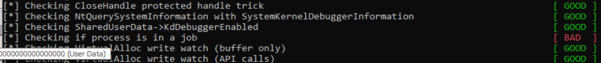

> **Figura 10.8.5.13. Resultado final de la comprobación.** Al-khaser marca la prueba como `[BAD]` tras detectar que el Job Object contiene un proceso externo distinto del propio ejecutable y de `conhost.exe`.

La secuencia completa queda:

```text
QueryInformationJobObject
        ↓
JobObjectBasicProcessIdList
        ↓
3 procesos asociados
        ↓
al-khaser_x64.exe
conhost.exe
x64dbg.exe
        ↓
x64dbg.exe identificado
        ↓
proceso externo
        ↓
[BAD]
```

---

## 10.8.5.15. Reconstrucción completa de la técnica

La demostración completa puede representarse como:

```text
al-khaser
        ↓
QueryInformationJobObject
        ↓
RCX = NULL
RDX = 3
        ↓
JobObjectBasicProcessIdList
        ↓
RAX = 1
        ↓
consulta satisfactoria
        ↓
NumberOfAssignedProcesses = 3
NumberOfProcessIdsInList   = 3
        ↓
PID[0] = 4836
PID[1] = 756
PID[2] = 3404
        ↓
PowerShell
        ↓
4836 → x64dbg.exe
756  → al-khaser_x64.exe
3404 → conhost.exe
        ↓
al-khaser recorre ProcessIdList[]
        ↓
PID 4836
        ↓
GetCurrentProcessId()
        ↓
4836 != 4188
        ↓
OpenProcess(4836)
        ↓
HANDLE = 0x260
        ↓
K32GetProcessImageFileNameW
        ↓
\Device\HarddiskVolume2\Tools\x64dbg\release\x64\x64dbg.exe
        ↓
proceso externo no permitido
        ↓
Checking if process is in a job [BAD]
```

---

## 10.8.5.16. Evidencias obtenidas

Durante la demostración se han obtenido las siguientes evidencias:

1. Ejecución de `al-khaser_x64.exe --check DEBUG`.
2. Entrada en `QueryInformationJobObject`.
3. `RCX = NULL`.
4. `RDX = 3`.
5. Buffer de salida en `R8`.
6. Tamaño `0x2010`.
7. Retorno `RAX = 1`.
8. Buffer conservado en `R13`.
9. `NumberOfAssignedProcesses = 3`.
10. `NumberOfProcessIdsInList = 3`.
11. PID 4836.
12. PID 756.
13. PID 3404.
14. Identificación mediante PowerShell.
15. `4836 → x64dbg.exe`.
16. `756 → al-khaser_x64.exe`.
17. `3404 → conhost.exe`.
18. Comparación con `GetCurrentProcessId`.
19. PID actual `0x105C`.
20. PID externo `0x12E4`.
21. Apertura de PID 4836 mediante `OpenProcess`.
22. Handle devuelto `0x260`.
23. Llamada a `K32GetProcessImageFileNameW`.
24. Buffer de salida de la ruta.
25. Identificación de `x64dbg.exe`.
26. Resultado final `[BAD]`.

---

## 10.8.5.17. Limitaciones

La demostración presenta varias limitaciones:

- Los PID cambian entre ejecuciones.
- Los handles cambian entre ejecuciones.
- Las direcciones de memoria cambian debido a ASLR y a la asignación dinámica.
- La composición del Job Object depende de cómo se lance el proceso.
- El resultado `[BAD]` observado corresponde a esta ejecución concreta.
- La presencia de procesos externos en un Job Object no implica necesariamente actividad maliciosa.
- La técnica debe interpretarse como una heurística de detección del entorno.
- El resultado depende de la política concreta implementada por la herramienta analizada.

---

## 10.8.5.18. Conclusión

La demostración dinámica ha permitido observar cómo al-khaser utiliza:

```text
QueryInformationJobObject
```

para recuperar la lista de procesos asociados al Job Object del proceso actual.

La consulta devuelve:

```text
NumberOfAssignedProcesses = 3
NumberOfProcessIdsInList   = 3
```

y tres PID que corresponden a:

```text
al-khaser_x64.exe
conhost.exe
x64dbg.exe
```

Después, al-khaser compara cada PID con el proceso actual, abre los procesos externos mediante:

```text
OpenProcess
```

y obtiene su imagen con:

```text
K32GetProcessImageFileNameW
```

En la ejecución analizada, uno de los procesos externos fue identificado como:

```text
\Device\HarddiskVolume2\Tools\x64dbg\release\x64\x64dbg.exe
```

La presencia del depurador dentro del mismo Job Object provoca finalmente:

```text
Checking if process is in a job    [BAD]
```

La práctica demuestra cómo los Job Objects pueden utilizarse como una fuente de información contextual para detectar procesos asociados al entorno de análisis.


------ 

<!-- Fuentes técnicas de apoyo:
Microsoft Learn — Windows Kernel-Mode Object Manager:
https://learn.microsoft.com/en-us/windows-hardware/drivers/kernel/windows-kernel-mode-object-manager

Microsoft Learn — Kernel object namespaces:
https://learn.microsoft.com/en-us/windows/win32/termserv/kernel-object-namespaces

Microsoft Learn — Object Names:
https://learn.microsoft.com/en-us/windows/win32/sync/object-names

Microsoft Learn — NtQueryDirectoryObject:
https://learn.microsoft.com/en-us/windows/win32/devnotes/ntquerydirectoryobject

Microsoft Learn — Pipe Names:
https://learn.microsoft.com/en-us/windows/win32/ipc/pipe-names

Microsoft Sysinternals — WinObj:
https://learn.microsoft.com/en-us/sysinternals/downloads/winobj

Microsoft Sysinternals — Handle:
https://learn.microsoft.com/en-us/sysinternals/downloads/handle

Microsoft Sysinternals — PipeList:
https://learn.microsoft.com/en-us/sysinternals/downloads/pipelist

MITRE ATT&CK — T1497.001:
https://attack.mitre.org/techniques/T1497/001/

MITRE ATT&CK — T1480.002:
https://attack.mitre.org/techniques/T1480/002/

pafish — VirtualBox checks:
https://github.com/a0rtega/pafish/blob/master/pafish/vbox.c
-->
