- [14. Network](#14-network)
  - [14.1. Descripción de la técnica `network`](#141-descripción-de-la-técnica-network)
  - [14.2. Categoría](#142-categoría)
  - [14.3. Técnicas principales](#143-técnicas-principales)
    - [14.3.1. Detección mediante direcciones MAC y prefijos OUI](#1431-detección-mediante-direcciones-mac-y-prefijos-oui)
    - [14.3.2. Detección mediante nombre, descripción y fabricante del adaptador](#1432-detección-mediante-nombre-descripción-y-fabricante-del-adaptador)
    - [14.3.3. Detección mediante configuración IP, puerta de enlace, DNS y DHCP](#1433-detección-mediante-configuración-ip-puerta-de-enlace-dns-y-dhcp)
    - [14.3.4. Detección de interfaces y adaptadores virtuales](#1434-detección-de-interfaces-y-adaptadores-virtuales)
    - [14.3.5. Enumeración mediante APIs de Windows](#1435-enumeración-mediante-apis-de-windows)
    - [14.3.6. Consulta mediante WMI, CIM, PowerShell y Registro](#1436-consulta-mediante-wmi-cim-powershell-y-registro)
    - [14.3.7. Correlación de múltiples indicadores de red](#1437-correlación-de-múltiples-indicadores-de-red)
  - [14.4. Resumen visual de las técnicas que aparecen en `network`](#144-resumen-visual-de-las-técnicas-que-aparecen-en-network)
  - [14.5. Contramedidas ofensivas](#145-contramedidas-ofensivas)
  - [14.6. Contramedidas defensivas](#146-contramedidas-defensivas)
  - [14.7. Checklist rápido del laboratorio](#147-checklist-rápido-del-laboratorio)
    - [Preparación del entorno](#preparación-del-entorno)
    - [Análisis estático previo](#análisis-estático-previo)
    - [Comprobación de direcciones MAC](#comprobación-de-direcciones-mac)
    - [Comprobación del nombre y descripción del adaptador](#comprobación-del-nombre-y-descripción-del-adaptador)
    - [Comprobación de IP, gateway, DNS y DHCP](#comprobación-de-ip-gateway-dns-y-dhcp)
    - [Comprobación mediante APIs de Windows](#comprobación-mediante-apis-de-windows)
    - [Comprobación mediante WMI / CIM](#comprobación-mediante-wmi--cim)
    - [Comprobación de drivers e identificadores](#comprobación-de-drivers-e-identificadores)
    - [Correlación de indicadores](#correlación-de-indicadores)
    - [Pruebas de neutralización controlada](#pruebas-de-neutralización-controlada)
    - [Interpretación de los resultados](#interpretación-de-los-resultados)
    - [Evidencias que deben documentarse](#evidencias-que-deben-documentarse)
    - [Conclusión del checklist](#conclusión-del-checklist)
  - [14.8 Análisis dinámico](#148-análisis-dinámico)
    - [14.8.1. MAC / prefijos OUI](#1481-mac--prefijos-oui)
      - [Objetivo de la demostración](#objetivo-de-la-demostración)
      - [Comprobación previa de la dirección MAC](#comprobación-previa-de-la-dirección-mac)
      - [Breakpoint inicial en `GetAdaptersAddresses`](#breakpoint-inicial-en-getadaptersaddresses)
      - [Segunda llamada a `GetAdaptersAddresses`](#segunda-llamada-a-getadaptersaddresses)
      - [Recuperación de la dirección física del adaptador](#recuperación-de-la-dirección-física-del-adaptador)
      - [Interceptación de la comparación mediante `memcmp`](#interceptación-de-la-comparación-mediante-memcmp)
      - [Localización del OUI de referencia](#localización-del-oui-de-referencia)
      - [Tratamiento del resultado por `Pafish`](#tratamiento-del-resultado-por-pafish)
      - [Flujo completo de la demostración](#flujo-completo-de-la-demostración)
      - [Evidencias demostradas](#evidencias-demostradas)
      - [Limitaciones](#limitaciones)
      - [Conclusión](#conclusión)
    - [14.8.2. Nombre/descripción del adaptador](#1482-nombredescripción-del-adaptador)
      - [Objetivo de la demostración](#objetivo-de-la-demostración-1)
      - [Localización de la comprobación en Pafish](#localización-de-la-comprobación-en-pafish)
      - [Preparación de `exec_check`](#preparación-de-exec_check)
      - [Entrada en `vmware_adapter_name`](#entrada-en-vmware_adapter_name)
      - [Entrada en `pafish_check_adapter_name`](#entrada-en-pafish_check_adapter_name)
      - [Conversión del patrón `VMware` a Unicode](#conversión-del-patrón-vmware-a-unicode)
      - [Verificación de `L"VMware"` en memoria](#verificación-de-lvmware-en-memoria)
      - [Enumeración de adaptadores](#enumeración-de-adaptadores)
      - [Comparación de la descripción mediante `wcsstr`](#comparación-de-la-descripción-mediante-wcsstr)
      - [Resultado de `wcsstr`](#resultado-de-wcsstr)
      - [Tratamiento del resultado negativo](#tratamiento-del-resultado-negativo)
      - [Finalización sin coincidencias](#finalización-sin-coincidencias)
      - [Flujo completo de la demostración](#flujo-completo-de-la-demostración-1)
      - [Evidencias demostradas](#evidencias-demostradas-1)
      - [Diferencia entre técnica ejecutada y detección positiva](#diferencia-entre-técnica-ejecutada-y-detección-positiva)
      - [Limitaciones](#limitaciones-1)
      - [Conclusión](#conclusión-1)
    - [14.8.3. IP / gateway / DNS / DHCP](#1483-ip--gateway--dns--dhcp)
      - [Objetivo de la demostración](#objetivo-de-la-demostración-2)
      - [Ejecución de la herramienta](#ejecución-de-la-herramienta)
      - [Enumeración de la configuración mediante `GetAdaptersAddresses`](#enumeración-de-la-configuración-mediante-getadaptersaddresses)
      - [Obtención de la dirección IPv4](#obtención-de-la-dirección-ipv4)
      - [Obtención de la puerta de enlace IPv4](#obtención-de-la-puerta-de-enlace-ipv4)
      - [Obtención del servidor DHCP](#obtención-del-servidor-dhcp)
      - [Comportamiento observado para DNS](#comportamiento-observado-para-dns)
      - [Inicio de la evaluación heurística de la IPv4](#inicio-de-la-evaluación-heurística-de-la-ipv4)
      - [Validación del patrón `10.0.x.15`](#validación-del-patrón-100x15)
      - [Evaluación del gateway](#evaluación-del-gateway)
      - [Establecimiento de `gatewayMatch`](#establecimiento-de-gatewaymatch)
      - [Puntuación final y selección de la rama parcial](#puntuación-final-y-selección-de-la-rama-parcial)
      - [Resultado final](#resultado-final)
      - [Flujo completo de la demostración](#flujo-completo-de-la-demostración-2)
      - [Evidencias demostradas](#evidencias-demostradas-2)
      - [Limitaciones](#limitaciones-2)
      - [Conclusión](#conclusión-2)


# 14. Network


## 14.1. Descripción de la técnica `network`

La técnica `network` es un mecanismo de evasión anti-VM y anti-sandbox basado en la inspección de la configuración de red del sistema para identificar artefactos compatibles con un entorno virtualizado o de análisis. Su objetivo es inferir si el programa se está ejecutando dentro de una máquina virtual, una sandbox o una infraestructura de laboratorio mediante propiedades asociadas a las interfaces, adaptadores y parámetros de red.

A diferencia de otras técnicas que consultan directamente información del procesador, firmware o dispositivos de almacenamiento, `network` se centra en elementos de la pila de comunicaciones. Entre los indicadores que pueden analizarse se encuentran:

- Direcciones MAC y sus prefijos OUI.
- Nombre, descripción y fabricante del adaptador de red.
- Tipo de interfaz y características del dispositivo.
- Direcciones IPv4 e IPv6 asignadas.
- Puerta de enlace predeterminada.
- Servidores DNS.
- Servidor DHCP y parámetros de concesión.
- Rutas de red.
- Interfaces virtuales.
- Identificadores de dispositivos y controladores asociados a adaptadores.
- Información obtenida mediante APIs de Windows, WMI, PowerShell o el Registro.
- Coherencia entre varios indicadores de red.

Una comprobación especialmente habitual consiste en obtener la dirección MAC de los adaptadores y analizar sus primeros bytes. Los tres primeros octetos identifican normalmente al fabricante o bloque de direcciones asignado al dispositivo. Determinados productos de virtualización utilizan o reservan rangos reconocibles, por lo que una coincidencia puede actuar como indicio de que el sistema está virtualizado.

También pueden examinarse configuraciones de red predeterminadas. Por ejemplo, determinados modos NAT de productos de virtualización crean redes privadas con direcciones, puertas de enlace y servidores DNS característicos. Un programa puede comparar estos valores con patrones conocidos y aumentar su nivel de sospecha cuando aparecen varios de ellos simultáneamente.

Otra variante consiste en consultar el nombre o descripción de los adaptadores. Cadenas relacionadas con tecnologías como `VMware`, `VirtualBox`, `Hyper-V`, `VBOX`, `VMXNET`, `virtio` o términos equivalentes pueden revelar la presencia de un dispositivo virtual. Sin embargo, estas cadenas dependen del hipervisor, del controlador instalado y de la configuración seleccionada.

En Windows, la información puede obtenerse mediante diferentes mecanismos, entre ellos:

```text
GetAdaptersAddresses
GetAdaptersInfo
GetIfTable
GetIfTable2
GetIpForwardTable
GetIpForwardTable2
WMI / CIM
Registro de Windows
PowerShell
```

La API `GetAdaptersAddresses` resulta especialmente relevante porque permite recuperar información asociada a los adaptadores locales, como direcciones unicast, direcciones físicas, nombres descriptivos y, utilizando las opciones correspondientes, información de puertas de enlace y otros parámetros.

Una secuencia conceptual de detección puede representarse de la siguiente forma:

```text
Enumerar adaptadores de red
        ↓
Obtener MAC, descripción y configuración IP
        ↓
Normalizar los valores
        ↓
Comparar con indicadores conocidos
        ↓
Correlacionar varias evidencias
        ↓
Asignar nivel de sospecha
        ↓
Modificar o mantener el flujo de ejecución
```

Si se detectan valores asociados a una plataforma de virtualización, la muestra puede finalizar, retrasar su ejecución, ocultar determinadas funciones, evitar desplegar el `payload` o adoptar un comportamiento alternativo.

No obstante, las comprobaciones de red deben considerarse **heurísticas**. Una dirección MAC puede modificarse, una máquina virtual puede utilizar modo puente, las redes NAT pueden personalizarse y un sistema físico puede contener adaptadores virtuales creados por VPN, contenedores, software de virtualización, herramientas de seguridad o componentes del propio sistema operativo. Por ello, una evidencia sólida requiere correlacionar varios indicadores y evitar conclusiones basadas en una única propiedad.


----


## 14.2. Categoría

La técnica `network` se clasifica dentro de las técnicas de **evasión y anti-análisis**, concretamente en las categorías **anti-VM** y **anti-sandbox**. Su finalidad es detectar características de red compatibles con máquinas virtuales o entornos automatizados de análisis antes de ejecutar la funcionalidad principal de una muestra.

Dentro de MITRE ATT&CK, este comportamiento puede relacionarse principalmente con:

```text
T1497       Virtualization/Sandbox Evasion
└── T1497.001  System Checks
```

La sub-técnica `System Checks` contempla la inspección de propiedades del sistema que pueden revelar la presencia de virtualización o sandboxing, incluyendo la comprobación de direcciones de adaptadores de red.

Dentro de una taxonomía de evasión, puede representarse de la siguiente forma:

| Campo                 | Clasificación                                                     |
| --------------------- | ----------------------------------------------------------------- |
| Categoría             | Evasión / Anti-análisis                                           |
| Subcategoría          | Anti-VM / Anti-sandbox                                             |
| Tipo de artefacto     | Adaptadores, MAC, configuración IP, rutas y parámetros de red     |
| Sistema principal     | Windows                                                            |
| Técnica ATT&CK        | `T1497.001 - Virtualization/Sandbox Evasion: System Checks`       |
| Prioridad para el TFM | Alta                                                               |

La fuente de información utilizada es la configuración de red expuesta al sistema invitado. El resultado de estas comprobaciones puede condicionar la ejecución de la muestra cuando se detectan indicadores asociados a una infraestructura virtual.

Debe diferenciarse esta técnica de la mera enumeración de red con fines de reconocimiento. La consulta de una dirección IP, una puerta de enlace o un adaptador no implica por sí sola evasión. La evidencia anti-VM aparece cuando esos datos se comparan con patrones asociados a virtualización y el resultado influye posteriormente en el flujo de ejecución.


----


## 14.3. Técnicas principales

La técnica `network` puede implementarse mediante distintos mecanismos. Aunque todas sus variantes utilizan propiedades de la red, cada una analiza un tipo de artefacto diferente.

**Entre las técnicas principales se encuentran:**

- Detección mediante prefijos OUI de direcciones MAC.
- Inspección del nombre, descripción y fabricante del adaptador.
- Análisis de direcciones IP, puerta de enlace, DNS y DHCP.
- Detección de interfaces y adaptadores virtuales.
- Enumeración mediante APIs de Windows.
- Consulta mediante WMI, CIM, PowerShell o Registro.
- Correlación de múltiples indicadores de red.

El procedimiento general consiste en enumerar una o varias interfaces, extraer sus propiedades y compararlas con valores esperados:

```text
Enumerar interfaces
        ↓
Extraer propiedades
        ↓
MAC / descripción / IP / gateway / DNS / DHCP
        ↓
Comparar con patrones
        ↓
Calcular coincidencias
        ↓
Tomar una decisión
```

Desde el punto de vista del análisis de malware, la evidencia resulta especialmente significativa cuando se observa una secuencia formada por:

1. Obtención de información de red.
2. Normalización o transformación de los datos.
3. Comparación con constantes, prefijos o cadenas.
4. Salto condicional.
5. Finalización, retraso u ocultación del comportamiento principal.

La presencia aislada de APIs de red no demuestra una técnica anti-VM, ya que cualquier aplicación legítima puede necesitar conocer su conectividad. Por ello, debe analizarse el contexto completo de uso.

----

### 14.3.1. Detección mediante direcciones MAC y prefijos OUI

Una de las variantes más conocidas consiste en analizar la dirección MAC asignada a cada interfaz. Una dirección MAC tradicional tiene 48 bits y suele representarse mediante seis octetos:

```text
00:0C:29:AA:BB:CC
```

Los primeros bytes pueden corresponder a un bloque asignado o utilizado por un fabricante. Determinadas plataformas de virtualización reservan o generan direcciones dentro de rangos reconocibles.

Por ejemplo, en infraestructuras VMware pueden aparecer rangos asociados a prefijos como:

```text
00:0C:29
00:50:56
```

En configuraciones de VirtualBox pueden encontrarse direcciones con el prefijo:

```text
08:00:27
```

Estos valores pueden utilizarse como indicadores durante una comprobación anti-VM.

El procedimiento conceptual es:

```text
Obtener dirección MAC
        ↓
Extraer los tres primeros octetos
        ↓
Comparar con una lista de prefijos
        ↓
Coincidencia
        ↓
Posible adaptador virtual
```

En Windows, la dirección física puede obtenerse mediante estructuras devueltas por `GetAdaptersAddresses` o mecanismos equivalentes. El analista debe revisar:

- Número de adaptadores enumerados.
- Longitud de la dirección física.
- Bytes de la MAC.
- Transformaciones aplicadas antes de la comparación.
- Constantes embebidas en el binario.
- Comparaciones de cadenas como `00:0C:29`.
- Comparaciones binarias de valores como `0x000C29`.
- Salto condicional posterior.

La comprobación puede realizarse como texto:

```text
"00:0C:29"
"00:50:56"
"08:00:27"
```

o directamente sobre los bytes:

```text
MAC[0]
MAC[1]
MAC[2]
```

Una implementación puede evitar almacenar el prefijo completo y comparar cada octeto por separado. También puede transformar los valores mediante operaciones XOR, sumas, hashes o codificación para dificultar su localización estática.

Esta técnica presenta limitaciones importantes. La dirección MAC de una VM puede modificarse manualmente, generarse con un valor administrado localmente o configurarse para no coincidir con el patrón esperado. Además, un equipo físico puede ejecutar software que cree adaptadores virtuales con direcciones pertenecientes a fabricantes concretos.

Por ello, una coincidencia OUI debe interpretarse como **indicio**, no como confirmación absoluta de virtualización.

----

### 14.3.2. Detección mediante nombre, descripción y fabricante del adaptador

Otra variante consiste en analizar las cadenas descriptivas asociadas a las interfaces y dispositivos de red. Los controladores de virtualización pueden exponer nombres que identifican directamente la plataforma o el tipo de adaptador virtual.

Entre las cadenas que pueden resultar de interés se encuentran:

```text
VMware
VMXNET
VirtualBox
VBOX
Hyper-V
Virtual Ethernet
virtio
Virtual Network
Virtual Adapter
```

El programa puede obtener estas cadenas mediante APIs de Windows, WMI, CIM, SetupAPI o consultas al Registro.

Una secuencia conceptual sería:

```text
Enumerar adaptadores
        ↓
Obtener FriendlyName / Description
        ↓
Convertir a mayúsculas o minúsculas
        ↓
Buscar palabras clave
        ↓
Coincidencia con cadena de virtualización
```

En el caso de `GetAdaptersAddresses`, estructuras como `IP_ADAPTER_ADDRESSES` permiten acceder a campos relacionados con el adaptador, incluyendo su nombre y descripción.

Desde el punto de vista del análisis estático, deben buscarse cadenas como:

```text
VMWARE
VIRTUALBOX
VBOX
HYPER-V
VMXNET
VIRTIO
VIRTUAL ETHERNET
```

También debe comprobarse si estas cadenas:

- Se construyen dinámicamente.
- Se almacenan cifradas.
- Se resuelven mediante hashes.
- Se comparan sin distinguir mayúsculas y minúsculas.
- Se fragmentan en varias constantes.
- Se utilizan dentro de funciones de enumeración de dispositivos.

En el análisis dinámico interesa registrar:

- Nombre del adaptador.
- Descripción.
- Identificador de interfaz.
- Tipo.
- Controlador asociado.
- Valor comparado.
- Rama tomada tras la comparación.

La presencia de la palabra `virtual` tampoco es una prueba concluyente. Windows puede incluir adaptadores virtuales legítimos asociados a:

- VPN.
- Hyper-V.
- WSL.
- contenedores.
- clientes de seguridad.
- túneles.
- software de captura.
- adaptadores de loopback.

Por ello, el nombre o descripción debe correlacionarse con otros indicadores.

----

### 14.3.3. Detección mediante configuración IP, puerta de enlace, DNS y DHCP

Una máquina virtual conectada mediante NAT puede recibir una configuración de red generada por el hipervisor. Cuando se utilizan valores predeterminados, algunos parámetros pueden resultar suficientemente característicos como para formar parte de una heurística de detección.

Entre los elementos que pueden analizarse se encuentran:

- Dirección IPv4.
- Máscara o prefijo de red.
- Puerta de enlace.
- Servidor DNS.
- Servidor DHCP.
- Sufijo DNS.
- Duración y origen de la concesión.
- Tabla de rutas.

Por ejemplo, una configuración NAT predeterminada de VirtualBox puede presentar valores como:

```text
Red:       10.0.2.0/24
Invitado:  10.0.2.15
Gateway:   10.0.2.2
DNS:       10.0.2.3
```

Una muestra podría comprobar la coexistencia de varios de estos valores:

```text
IP = 10.0.2.15
        +
Gateway = 10.0.2.2
        +
DNS = 10.0.2.3
        ↓
Configuración compatible con NAT de VirtualBox
```

El uso de varios parámetros simultáneamente es más robusto que comparar únicamente una IP.

En Windows, estos datos pueden recuperarse mediante:

```text
GetAdaptersAddresses
GetIpForwardTable
GetIpForwardTable2
WMI / CIM
ipconfig
PowerShell
Registro
```

Durante el análisis deben revisarse:

- Rangos IP codificados en el ejecutable.
- Constantes de máscaras.
- Direcciones de gateway.
- Servidores DNS.
- Conversiones mediante `inet_pton`, `inet_addr` o funciones equivalentes.
- Comparaciones de prefijos de red.
- Enumeración de rutas.
- Condiciones que exigen varias coincidencias.

Esta técnica también es heurística. Los valores predeterminados pueden modificarse, utilizarse redes puente o asignarse direcciones mediante un servidor DHCP externo. Además, redes físicas de laboratorio podrían usar accidentalmente rangos similares.

Por ello, no debe afirmarse que la presencia de `10.0.2.15` confirma VirtualBox. La interpretación correcta sería:

```text
Configuración compatible con un valor predeterminado conocido,
que requiere correlación con otros indicadores.
```

----

### 14.3.4. Detección de interfaces y adaptadores virtuales

El programa también puede analizar el número y tipo de interfaces presentes en el sistema. Los entornos virtualizados suelen presentar adaptadores implementados completamente por software o dispositivos virtuales expuestos por el hipervisor.

Entre los posibles indicadores se encuentran:

- Adaptadores Ethernet virtuales.
- Interfaces asociadas a un conmutador virtual.
- Dispositivos sintéticos.
- Interfaces de túnel.
- Adaptadores `host-only`.
- Adaptadores NAT.
- Dispositivos paravirtualizados.
- Ausencia de interfaces Wi-Fi o Bluetooth en un equipo que pretende simular un escritorio convencional.
- Número anormalmente reducido o elevado de interfaces.

En Hyper-V, por ejemplo, el sistema puede utilizar adaptadores de red de máquina virtual conectados a un conmutador virtual implementado por software. La existencia de este tipo de infraestructura no implica necesariamente que el proceso se encuentre dentro de una VM, ya que el host también puede disponer de componentes de Hyper-V.

Una comprobación puede analizar:

```text
Tipo de interfaz
        ↓
Nombre y descripción
        ↓
Driver asociado
        ↓
Estado operativo
        ↓
Dirección física
        ↓
Correlación con otros indicadores
```

Desde el punto de vista del análisis deben observarse campos como:

- `IfType`.
- `OperStatus`.
- `FriendlyName`.
- `Description`.
- `PhysicalAddress`.
- identificadores de interfaz.
- velocidad de enlace.
- índices de interfaz.
- controlador o servicio asociado.

Una muestra también puede buscar situaciones consideradas poco habituales, como:

```text
1 único adaptador
+
sin Wi-Fi
+
MAC de fabricante virtual
+
gateway privado característico
```

La combinación de varios factores puede formar una puntuación de sospecha.

No obstante, el número y tipo de adaptadores dependen mucho del sistema real. Equipos empresariales, servidores, estaciones con VPN o dispositivos con software de virtualización pueden presentar múltiples interfaces virtuales sin estar ejecutando la muestra dentro de una VM.

----

### 14.3.5. Enumeración mediante APIs de Windows

En Windows, la enumeración de red puede realizarse mediante distintas APIs. Entre las más relevantes se encuentran:

```text
GetAdaptersAddresses
GetAdaptersInfo
GetIfTable
GetIfTable2
GetIpAddrTable
GetIpForwardTable
GetIpForwardTable2
GetNetworkParams
```

`GetAdaptersAddresses` es especialmente útil porque permite recuperar información detallada de los adaptadores locales y admite IPv4 e IPv6.

Una secuencia habitual puede adoptar la siguiente forma:

```text
GetAdaptersAddresses
        ↓
Recorrer IP_ADAPTER_ADDRESSES
        ↓
PhysicalAddress
Description
FriendlyName
FirstUnicastAddress
FirstGatewayAddress
        ↓
Comparar indicadores
```

Desde el punto de vista del análisis estático, deben buscarse importaciones de:

```text
iphlpapi.dll
ws2_32.dll
```

y funciones como:

```text
GetAdaptersAddresses
GetAdaptersInfo
GetIfTable
GetIfTable2
GetIpForwardTable
GetIpForwardTable2
inet_ntop
inet_pton
WSAAddressToString
```

La presencia de `GetAdaptersAddresses` por sí sola no indica evasión. Lo relevante es lo que sucede con la información después de la llamada.

Durante el análisis dinámico conviene:

1. Colocar un breakpoint en la API de enumeración.
2. Identificar los argumentos.
3. Seguir el búfer devuelto.
4. Observar el bucle que recorre los adaptadores.
5. Localizar las comparaciones.
6. Identificar las constantes utilizadas.
7. Observar la rama posterior.

Las comprobaciones pueden estar implementadas mediante una puntuación:

```text
MAC sospechosa                  +1
Descripción de adaptador        +1
Gateway característico          +1
DNS característico              +1
Driver virtual                  +1
                               ----
Puntuación >= umbral → sospecha
```

Este tipo de lógica es más difícil de neutralizar que una comparación única.

----

### 14.3.6. Consulta mediante WMI, CIM, PowerShell y Registro

La información de red también puede obtenerse mediante mecanismos de administración del sistema. WMI y CIM permiten consultar clases que describen adaptadores y configuraciones de red.

Entre las clases relevantes se encuentran:

```text
Win32_NetworkAdapter
Win32_NetworkAdapterConfiguration
Win32_NetworkConnection
MSFT_NetAdapter
MSFT_NetIPConfiguration
```

Algunos campos de interés pueden incluir:

```text
Name
Description
Manufacturer
MACAddress
AdapterType
PNPDeviceID
NetConnectionID
IPAddress
IPSubnet
DefaultIPGateway
DNSServerSearchOrder
DHCPServer
```

Una secuencia conceptual puede ser:

```text
Inicializar WMI
        ↓
Consultar Win32_NetworkAdapter
        ↓
Extraer Name / Manufacturer / MACAddress
        ↓
Buscar términos asociados a virtualización
```

También puede utilizarse PowerShell mediante comandos relacionados con:

```text
Get-NetAdapter
Get-NetIPConfiguration
Get-NetIPAddress
Get-NetRoute
Get-DnsClientServerAddress
```

El Registro puede contener información sobre interfaces, adaptadores, servicios y controladores. En un análisis estático deben buscarse cadenas relacionadas con rutas de red, GUID de interfaces y nombres de drivers.

El uso de WMI es relevante porque permite obtener varios indicadores dentro de una misma consulta. Por ejemplo, una muestra podría combinar:

```text
Manufacturer
Description
MACAddress
PNPDeviceID
```

y decidir únicamente cuando varias propiedades resultan compatibles con un dispositivo virtual.

Desde el punto de vista del análisis dinámico deben documentarse:

- Consulta WMI ejecutada.
- Clase consultada.
- Propiedades solicitadas.
- Valores devueltos.
- Cadenas comparadas.
- Número de coincidencias.
- Comportamiento posterior.

La misma precaución se aplica a estos indicadores: un host físico puede tener software de virtualización instalado y exponer adaptadores o servicios virtuales. Por ello, debe distinguirse entre:

```text
Presencia de tecnología de virtualización
```

y:

```text
Ejecución actual dentro de una máquina virtual
```

Ambas condiciones no son equivalentes.

----

### 14.3.7. Correlación de múltiples indicadores de red

Una técnica más robusta consiste en no depender de un único indicador. La muestra puede recopilar diversas propiedades y asignar una puntuación o aplicar reglas lógicas antes de considerar que se encuentra en un entorno virtualizado.

Por ejemplo:

```text
MAC con OUI asociado a hipervisor
        +
Descripción de adaptador virtual
        +
Gateway compatible con NAT conocido
        +
DNS característico
        ↓
Nivel de confianza elevado
```

Otro modelo puede utilizar una puntuación:

```text
OUI conocido                          +3
Descripción con "VMware"             +3
Driver virtual                       +2
Gateway característico               +1
DNS característico                   +1
Número de interfaces atípico         +1
                                      ---
Umbral de detección                   >= 5
```

La ventaja de este enfoque es que una modificación aislada, como cambiar la MAC, puede no ser suficiente para ocultar el entorno.

El análisis debe identificar:

- Lista de indicadores recopilados.
- Peso asignado a cada uno.
- Orden de las comprobaciones.
- Variables donde se acumula la puntuación.
- Umbral final.
- Salto condicional.
- Respuesta adoptada.

También puede existir una lógica basada en exclusión:

```text
Si existe OUI sospechoso
    y además el adaptador contiene "Virtual"
    y además el gateway coincide
        → entorno sospechoso
```

La correlación reduce algunos falsos positivos, pero no elimina completamente el problema. Los laboratorios pueden personalizar los indicadores y los sistemas físicos pueden contener componentes virtuales. Por tanto, incluso una comprobación múltiple debe interpretarse dentro del contexto completo de la muestra.


----


## 14.4. Resumen visual de las técnicas que aparecen en `network`

El objetivo general de la técnica `network` consiste en detectar artefactos asociados a la infraestructura de comunicaciones expuesta a una máquina virtual o sandbox.

Los principales grupos de indicadores son:

- Identidad del adaptador.
- Dirección física.
- Configuración lógica de red.
- Tipo y topología de interfaces.
- Información administrativa.
- Coherencia entre varias evidencias.

A continuación, se muestra un resumen visual de las principales técnicas:

```text
network
│
├── 1. Dirección MAC y OUI
│   │
│   ├── 00:0C:29
│   ├── 00:50:56
│   ├── 08:00:27
│   └── Otros prefijos conocidos
│
├── 2. Nombre y descripción del adaptador
│   │
│   ├── VMware
│   ├── VMXNET
│   ├── VirtualBox / VBOX
│   ├── Hyper-V
│   ├── Virtual Ethernet
│   └── virtio
│
├── 3. Configuración IP
│   │
│   ├── Dirección IPv4 / IPv6
│   ├── Máscara / prefijo
│   ├── Gateway
│   ├── DNS
│   ├── DHCP
│   └── Rutas
│
├── 4. Interfaces virtuales
│   │
│   ├── Adaptadores sintéticos
│   ├── Adaptadores paravirtualizados
│   ├── NAT
│   ├── Host-only
│   └── Conmutadores virtuales
│
├── 5. APIs de Windows
│   │
│   ├── GetAdaptersAddresses
│   ├── GetAdaptersInfo
│   ├── GetIfTable / GetIfTable2
│   └── GetIpForwardTable / GetIpForwardTable2
│
├── 6. WMI / CIM / Registro
│   │
│   ├── Win32_NetworkAdapter
│   ├── Win32_NetworkAdapterConfiguration
│   ├── MSFT_NetAdapter
│   └── Identificadores y controladores
│
└── 7. Correlación
    │
    ├── MAC
    ├── Descripción
    ├── IP / gateway
    ├── DNS / DHCP
    ├── Driver
    └── Puntuación final
```

La siguiente tabla resume la finalidad de cada variante:

| Técnica | Qué examina | Indicador observado | Posible interpretación |
|---|---|---|---|
| MAC / OUI | Dirección física del adaptador | Prefijo asociado a un fabricante o plataforma virtual | Posible NIC virtual |
| Nombre / descripción | Metadatos del adaptador | `VMware`, `VirtualBox`, `Hyper-V`, `virtio`, etc. | Posible controlador o adaptador virtual |
| Configuración IP | IP, gateway, DNS y DHCP | Valores compatibles con redes NAT predeterminadas | Posible red virtual |
| Interfaces virtuales | Tipo y topología de interfaces | Adaptadores sintéticos, virtuales o paravirtualizados | Posible infraestructura de virtualización |
| APIs de Windows | Información obtenida mediante IP Helper API | Enumeración sistemática seguida de comparaciones | Posible fase de reconocimiento anti-VM |
| WMI / CIM / Registro | Propiedades administrativas y PnP | Fabricante, descripción, PNPDeviceID o driver | Posible artefacto de virtualización |
| Correlación | Múltiples propiedades | Varias coincidencias simultáneas | Mayor confianza heurística |

Desde el punto de vista del análisis, los indicadores pueden agruparse según su fuerza:

```text
Indicadores débiles
│
├── Tener una IP privada
├── Disponer de una única interfaz
├── Ausencia de Wi-Fi
└── Uso de NAT

Indicadores intermedios
│
├── Nombre de adaptador virtual
├── Driver paravirtualizado
├── Gateway característico
└── DNS característico

Indicadores más significativos
│
├── OUI asociado a plataforma virtual
├── Nombre explícito de hipervisor
├── PNPDeviceID / driver claramente virtual
└── Coincidencia simultánea de varios artefactos
```

Incluso los indicadores más significativos deben considerarse heurísticos. Una configuración puede modificarse y un host físico puede contener componentes virtuales.

Por ello, una evidencia más sólida debe mostrar una secuencia como:

```text
Enumeración de red
        ↓
Obtención de varios artefactos
        ↓
Comparación con indicadores de virtualización
        ↓
Coincidencias consistentes
        ↓
Salto condicional
        ↓
Cambio observable del comportamiento
```


----


## 14.5. Contramedidas ofensivas

Desde una perspectiva ofensiva, las contramedidas asociadas a la técnica `network` buscan aumentar la fiabilidad de la detección y dificultar que un entorno de análisis pueda ocultar su naturaleza modificando un único indicador.

Una primera estrategia consiste en **combinar múltiples propiedades**. En lugar de confiar exclusivamente en una dirección MAC, una muestra puede correlacionar:

- OUI.
- Nombre del adaptador.
- Descripción.
- Fabricante.
- Identificador PnP.
- Driver.
- Dirección IP.
- Gateway.
- DNS.
- DHCP.
- Tabla de rutas.

De esta forma, cambiar un único elemento no elimina necesariamente todas las evidencias.

Otra estrategia consiste en utilizar varias fuentes para obtener el mismo dato. Por ejemplo, la información de un adaptador puede consultarse mediante:

```text
GetAdaptersAddresses
        +
WMI
        +
Registro
```

Si los valores obtenidos son incoherentes, la propia inconsistencia puede considerarse sospechosa.

También puede aplicarse una **puntuación ponderada**. Los indicadores más específicos reciben mayor peso y los más genéricos menor importancia:

```text
OUI asociado a hipervisor        +3
Nombre explícito del producto    +3
Driver virtual                   +2
Gateway característico           +1
DNS característico               +1
```

La muestra toma una decisión únicamente cuando se supera un umbral. Este mecanismo reduce la dependencia de una única firma.

Otra contramedida consiste en buscar los artefactos en distintos momentos de la ejecución. En lugar de realizar todas las comprobaciones al inicio, pueden distribuirse:

```text
Inicio
  ↓
Comprobar MAC
  ↓
Ejecutar funciones legítimas
  ↓
Comprobar gateway
  ↓
Ejecutar otra fase
  ↓
Consultar adaptador mediante WMI
```

Esta distribución dificulta localizar un único bloque anti-VM.

También puede aplicarse ofuscación sobre:

- Nombres de APIs.
- Prefijos MAC.
- Cadenas de fabricantes.
- Direcciones IP.
- Nombres de drivers.
- Consultas WMI.

Por ejemplo, una muestra puede resolver `GetAdaptersAddresses` dinámicamente o almacenar los prefijos como valores binarios en lugar de cadenas legibles.

Otra estrategia consiste en **normalizar la información** antes de compararla. Las direcciones MAC pueden presentarse con:

```text
:
-
sin separadores
mayúsculas
minúsculas
```

Por ello, el programa puede eliminar separadores y convertir todos los caracteres al mismo formato.

También puede evitar depender de configuraciones predeterminadas y utilizar patrones parciales. En lugar de exigir exactamente:

```text
10.0.2.15
```

puede comprobar una combinación de:

```text
10.0.2.0/24
+
gateway 10.0.2.2
+
DNS 10.0.2.3
```

La correlación aumenta la precisión de la heurística.

Otra variante consiste en comprobar el **tipo de adaptador** y no solamente sus cadenas. Campos relacionados con la interfaz, PnP o controlador pueden proporcionar señales adicionales cuando el nombre visible se ha modificado.

También puede realizarse una comprobación de consistencia entre fuentes:

```text
GetAdaptersAddresses → MAC A
WMI                 → MAC B
Registro            → MAC C
```

Si los valores deberían corresponder al mismo dispositivo pero difieren de forma inesperada, el programa puede interpretar que existe instrumentación o manipulación.

Estas técnicas no convierten la detección en infalible. Un laboratorio cuidadosamente configurado puede modificar o normalizar múltiples indicadores. Por ello, las comprobaciones `network` suelen combinarse con otras categorías anti-VM, como CPU, hardware, procesos, WMI, Registro o `timing`.


----


## 14.6. Contramedidas defensivas

Desde una perspectiva defensiva, las contramedidas frente a la técnica `network` tienen como objetivo reducir los artefactos de red que permiten distinguir fácilmente una máquina virtual de un sistema físico y facilitar que el analista pueda identificar y neutralizar las comprobaciones.

Una primera medida consiste en **evitar configuraciones predeterminadas excesivamente reconocibles**. Cuando el laboratorio lo permita, pueden personalizarse:

- Rango IP.
- Dirección del gateway.
- Servidores DNS.
- DHCP.
- Nombre de red.
- Topología.
- Parámetros de NAT.

La finalidad no es ocultar de forma absoluta la virtualización, sino reducir firmas triviales que podrían provocar que una muestra finalice antes de mostrar su comportamiento.

Otra medida consiste en revisar la dirección MAC asignada al adaptador. Una VM que utiliza un prefijo claramente asociado a una plataforma puede ser identificada mediante una comparación muy simple.

En un laboratorio controlado puede configurarse una dirección MAC que no dependa de un prefijo predeterminado del hipervisor. Sin embargo, deben evitarse duplicados y respetarse las restricciones de la plataforma.

También puede utilizarse, cuando resulte adecuado, un modo de red que proporcione una topología más próxima a la del entorno de referencia. Por ejemplo, una configuración en puente puede hacer que la VM reciba su configuración desde la misma infraestructura que otros equipos de la red. Esto elimina algunos patrones de NAT predeterminados, aunque no oculta necesariamente el modelo o driver del adaptador virtual.

Otra contramedida consiste en revisar:

- Nombre del adaptador.
- Descripción.
- Driver.
- PNPDeviceID.
- Servicios asociados.
- Interfaces adicionales.
- Adaptadores virtuales innecesarios.

No todos estos elementos pueden modificarse sin afectar a la estabilidad de la VM. El objetivo debe ser identificar qué artefactos son realmente visibles para la muestra.

Desde el punto de vista del análisis dinámico, resulta útil establecer breakpoints o monitorizar funciones como:

```text
GetAdaptersAddresses
GetAdaptersInfo
GetIfTable
GetIfTable2
GetIpForwardTable
GetIpForwardTable2
```

La secuencia sospechosa sería:

```text
Enumerar adaptadores
        ↓
Recorrer resultados
        ↓
Comparar MAC / descripción / IP
        ↓
cmp / test
        ↓
salto condicional
        ↓
terminación o rama alternativa
```

Una estrategia defensiva especialmente útil consiste en **parchear temporalmente la decisión**, no necesariamente la API. Si el programa obtiene correctamente los datos pero finaliza tras una comparación, puede modificarse en una copia de laboratorio:

- El valor de la variable de resultado.
- El contador de coincidencias.
- El umbral.
- El salto condicional.

Esto permite observar la funcionalidad posterior sin alterar toda la pila de red.

También pueden instrumentarse las APIs para registrar qué información consulta la muestra. El analista puede documentar:

```text
Adaptador consultado
MAC devuelta
Descripción
IP
Gateway
DNS
Resultado de la comparación
```

Cuando se utilicen hooks o herramientas de monitorización, debe comprobarse que no introduzcan nuevas cadenas o adaptadores que la muestra pueda detectar.

Otra medida defensiva consiste en crear una **línea base** del laboratorio antes de ejecutar la muestra. Puede almacenarse la salida de:

```text
ipconfig /all
route print
Get-NetAdapter
Get-NetIPConfiguration
Get-NetRoute
```

De esta forma, cuando el malware consulte un artefacto, el analista conoce previamente qué valor ha observado.

Para reducir falsos positivos durante la investigación, las comprobaciones deben clasificarse por fuerza:

| Evidencia | Interpretación defensiva |
|---|---|
| IP privada | Muy débil |
| NAT | Débil |
| Una única interfaz | Débil |
| Gateway característico | Intermedia |
| Nombre explícito de adaptador virtual | Intermedia / alta |
| OUI conocido | Intermedia / alta |
| Driver o PNPDeviceID claramente virtual | Alta |
| Varias coincidencias correlacionadas | Más significativa |

Finalmente, la mejor contramedida defensiva consiste en **correlacionar `network` con otras técnicas**. Si la muestra detecta simultáneamente artefactos en:

```text
Network
+
Registry
+
Processes
+
WMI
+
CPU
+
Hardware
```

la neutralización debe realizarse de forma coordinada. Eliminar únicamente el indicador de red puede no ser suficiente para alcanzar el comportamiento principal.


----


## 14.7. Checklist rápido del laboratorio

El siguiente checklist resume los pasos principales para analizar y demostrar técnicas `network` en un entorno controlado. Su finalidad es identificar consultas de adaptadores, direcciones MAC, parámetros IP y otros artefactos que puedan utilizarse para detectar máquinas virtuales o sandboxes.

### Preparación del entorno

- [ ] Ejecutar las pruebas únicamente en una máquina virtual o laboratorio controlado.
- [ ] Crear un `snapshot` limpio antes de comenzar.
- [ ] Documentar el hipervisor utilizado:
  - [ ] VMware.
  - [ ] VirtualBox.
  - [ ] Hyper-V.
  - [ ] KVM/QEMU.
  - [ ] Otro.
- [ ] Registrar el sistema operativo y arquitectura.
- [ ] Documentar el modo de red:
  - [ ] NAT.
  - [ ] Bridge / puente.
  - [ ] Host-only.
  - [ ] Red interna.
  - [ ] NAT Network.
- [ ] Registrar el número de adaptadores visibles desde el invitado.
- [ ] Guardar una línea base mediante:

```text
ipconfig /all
route print
```

- [ ] Guardar también, cuando estén disponibles:

```powershell
Get-NetAdapter
Get-NetIPConfiguration
Get-NetIPAddress
Get-NetRoute
Get-DnsClientServerAddress
```

- [ ] Documentar:
  - [ ] MAC.
  - [ ] Dirección IP.
  - [ ] Máscara o prefijo.
  - [ ] Gateway.
  - [ ] DNS.
  - [ ] DHCP.
  - [ ] Nombre del adaptador.
  - [ ] Descripción.
  - [ ] Estado.
  - [ ] Driver.

### Análisis estático previo

- [ ] Buscar importaciones de `iphlpapi.dll`.
- [ ] Buscar importaciones de `ws2_32.dll`.
- [ ] Localizar funciones como:

```text
GetAdaptersAddresses
GetAdaptersInfo
GetIfTable
GetIfTable2
GetIpAddrTable
GetIpForwardTable
GetIpForwardTable2
GetNetworkParams
```

- [ ] Buscar funciones de conversión de direcciones:

```text
inet_addr
inet_ntoa
inet_ntop
inet_pton
WSAAddressToString
```

- [ ] Buscar cadenas asociadas a virtualización:

```text
VMware
VMXNET
VirtualBox
VBOX
Hyper-V
Virtual Ethernet
virtio
Virtual Adapter
```

- [ ] Buscar prefijos MAC:

```text
00:0C:29
00:50:56
08:00:27
```

- [ ] Buscar los mismos prefijos:
  - [ ] Sin separadores.
  - [ ] Con guiones.
  - [ ] En mayúsculas.
  - [ ] En minúsculas.
  - [ ] Como valores binarios.
- [ ] Buscar direcciones IP utilizadas como constantes.
- [ ] Buscar rutas del Registro relacionadas con interfaces o adaptadores.
- [ ] Buscar consultas WMI.
- [ ] Buscar referencias a:

```text
Win32_NetworkAdapter
Win32_NetworkAdapterConfiguration
MSFT_NetAdapter
MSFT_NetIPConfiguration
```

- [ ] Identificar comparaciones y saltos condicionales posteriores.
- [ ] Comprobar si la técnica se ejecuta antes del `payload`.

### Comprobación de direcciones MAC

- [ ] Enumerar todas las interfaces visibles.
- [ ] Registrar cada dirección MAC.
- [ ] Extraer los tres primeros octetos.
- [ ] Comparar el OUI con valores asociados a plataformas virtuales.
- [ ] Identificar si la muestra compara:
  - [ ] Texto.
  - [ ] Bytes.
  - [ ] Enteros.
  - [ ] Hashes.
- [ ] Comprobar si normaliza los separadores.
- [ ] Comprobar si convierte a mayúsculas o minúsculas.
- [ ] Identificar la constante usada.
- [ ] Registrar el resultado de la comparación.
- [ ] Localizar el salto condicional posterior.
- [ ] Verificar si una coincidencia modifica el comportamiento.
- [ ] No considerar una coincidencia aislada como confirmación absoluta.

### Comprobación del nombre y descripción del adaptador

- [ ] Obtener la lista de adaptadores mediante:

```powershell
Get-NetAdapter
```

- [ ] Registrar:
  - [ ] `Name`.
  - [ ] `InterfaceDescription`.
  - [ ] `MacAddress`.
  - [ ] `Status`.
  - [ ] `LinkSpeed`.
- [ ] Buscar palabras asociadas a virtualización.
- [ ] Comprobar si la muestra utiliza búsquedas:
  - [ ] Exactas.
  - [ ] Parciales.
  - [ ] Sin distinguir mayúsculas.
- [ ] Revisar si las cadenas están cifradas.
- [ ] Revisar si se resuelven mediante hashes.
- [ ] Identificar si el fabricante o driver se utiliza como segundo indicador.
- [ ] Documentar la rama tomada.

### Comprobación de IP, gateway, DNS y DHCP

- [ ] Registrar la configuración mediante:

```text
ipconfig /all
```

- [ ] Registrar la tabla de rutas:

```text
route print
```

- [ ] Obtener la configuración mediante PowerShell:

```powershell
Get-NetIPConfiguration
Get-NetIPAddress
Get-NetRoute
Get-DnsClientServerAddress
```

- [ ] Documentar:
  - [ ] IPv4.
  - [ ] IPv6.
  - [ ] Prefijo.
  - [ ] Gateway.
  - [ ] DNS.
  - [ ] DHCP.
- [ ] Comprobar si existen patrones predeterminados del hipervisor.
- [ ] En VirtualBox NAT, verificar si aparecen valores compatibles con:

```text
10.0.2.0/24
10.0.2.15
10.0.2.2
10.0.2.3
```

- [ ] No asumir que estos valores aparecen en todas las VMs de VirtualBox.
- [ ] Comprobar si la muestra exige una coincidencia exacta o parcial.
- [ ] Identificar si compara varios parámetros simultáneamente.
- [ ] Registrar el umbral o condición utilizada.

### Comprobación mediante APIs de Windows

- [ ] Colocar un breakpoint en:

```text
iphlpapi.GetAdaptersAddresses
```

- [ ] Si la muestra utiliza otras funciones, establecer breakpoints en:

```text
iphlpapi.GetAdaptersInfo
iphlpapi.GetIfTable
iphlpapi.GetIfTable2
iphlpapi.GetIpForwardTable
iphlpapi.GetIpForwardTable2
```

- [ ] Registrar los argumentos.
- [ ] Identificar el tamaño del búfer.
- [ ] Seguir la estructura devuelta.
- [ ] Localizar el bucle que recorre adaptadores.
- [ ] Identificar qué campos son utilizados.
- [ ] Observar:
  - [ ] `PhysicalAddress`.
  - [ ] `Description`.
  - [ ] `FriendlyName`.
  - [ ] direcciones unicast.
  - [ ] gateway.
  - [ ] tipo de interfaz.
- [ ] Localizar las comparaciones posteriores.
- [ ] Registrar el valor esperado y el obtenido.
- [ ] Documentar el salto condicional.

### Comprobación mediante WMI / CIM

- [ ] Monitorizar la inicialización COM cuando proceda.
- [ ] Localizar consultas WMI.
- [ ] Registrar la consulta completa.
- [ ] Comprobar si se utilizan clases como:

```text
Win32_NetworkAdapter
Win32_NetworkAdapterConfiguration
```

- [ ] Identificar las propiedades consultadas:

```text
Name
Description
Manufacturer
MACAddress
PNPDeviceID
IPAddress
DefaultIPGateway
DNSServerSearchOrder
DHCPServer
```

- [ ] Registrar los valores obtenidos.
- [ ] Localizar las cadenas o constantes de comparación.
- [ ] Comprobar si existe una puntuación acumulativa.
- [ ] Observar el comportamiento tras una coincidencia.

### Comprobación de drivers e identificadores

- [ ] Revisar el `PNPDeviceID` de cada adaptador.
- [ ] Documentar el controlador cargado.
- [ ] Buscar nombres relacionados con dispositivos virtuales.
- [ ] Comprobar servicios asociados.
- [ ] Revisar si la muestra consulta el Registro.
- [ ] Identificar claves relacionadas con interfaces de red.
- [ ] Registrar qué valores son utilizados realmente por la muestra.
- [ ] Distinguir entre:
  - [ ] Tecnología instalada en el host.
  - [ ] Dispositivo expuesto al invitado.
  - [ ] Evidencia directa de ejecución en VM.

### Correlación de indicadores

- [ ] Identificar todos los indicadores utilizados por la muestra.
- [ ] Crear una tabla con:

| Indicador | Valor observado | Coincidencia | Peso |
|---|---|---|---|
| MAC / OUI | — | — | — |
| Descripción | — | — | — |
| Driver | — | — | — |
| IP | — | — | — |
| Gateway | — | — | — |
| DNS | — | — | — |
| DHCP | — | — | — |

- [ ] Comprobar si existe un contador de coincidencias.
- [ ] Identificar el umbral.
- [ ] Comprobar si todos los indicadores son obligatorios.
- [ ] Comprobar si basta con una sola coincidencia.
- [ ] Identificar la condición lógica:

```text
AND
OR
puntuación
reglas encadenadas
```

- [ ] Documentar la rama final.

### Pruebas de neutralización controlada

- [ ] Trabajar siempre sobre una copia del ejecutable.
- [ ] Crear un `snapshot` antes de modificar el entorno.
- [ ] Cambiar un único indicador cada vez.
- [ ] Repetir la ejecución después de modificar:
  - [ ] MAC.
  - [ ] configuración IP.
  - [ ] gateway.
  - [ ] DNS.
  - [ ] modo NAT / bridge.
- [ ] Registrar qué comprobaciones dejan de activarse.
- [ ] Si resulta necesario, modificar temporalmente:
  - [ ] Variable de resultado.
  - [ ] Contador de coincidencias.
  - [ ] Umbral.
  - [ ] Salto condicional.
- [ ] No modificar múltiples elementos simultáneamente si se quiere atribuir el efecto a una causa concreta.
- [ ] Comparar el comportamiento antes y después.
- [ ] Conservar el ejecutable original sin modificaciones.

### Interpretación de los resultados

- [ ] Distinguir entre enumeración de red y evasión anti-VM.
- [ ] Considerar demostrada la técnica cuando exista:

```text
Obtención de información de red
        ↓
Comparación con un patrón de virtualización
        ↓
Decisión basada en el resultado
```

- [ ] Considerar detección positiva solo cuando se cumpla la condición definida por el programa.
- [ ] No considerar una IP privada como evidencia de virtualización.
- [ ] No considerar NAT como evidencia concluyente.
- [ ] No considerar una única interfaz como evidencia concluyente.
- [ ] Tratar una coincidencia OUI como indicador heurístico.
- [ ] Dar mayor relevancia a múltiples coincidencias correlacionadas.
- [ ] Comprobar si un host físico presenta el mismo artefacto.
- [ ] Comparar, cuando sea posible:
  - [ ] Máquina física.
  - [ ] Máquina virtual con configuración predeterminada.
  - [ ] Máquina virtual con configuración personalizada.
- [ ] Utilizar términos como:
  - [ ] `indicio`.
  - [ ] `compatible con`.
  - [ ] `artefacto asociado`.
  - [ ] `resultado heurístico`.
- [ ] Evitar afirmar que un único indicador demuestra la existencia de una VM.

### Evidencias que deben documentarse

- [ ] Nombre de la herramienta o muestra.
- [ ] Hash del ejecutable.
- [ ] Fecha y hora de la prueba.
- [ ] Sistema operativo.
- [ ] Arquitectura.
- [ ] Hipervisor.
- [ ] Modo de red.
- [ ] Adaptador virtual configurado.
- [ ] MAC observada.
- [ ] Nombre y descripción del adaptador.
- [ ] Driver.
- [ ] PNPDeviceID.
- [ ] Dirección IPv4 e IPv6.
- [ ] Gateway.
- [ ] DNS.
- [ ] DHCP.
- [ ] Tabla de rutas.
- [ ] APIs utilizadas.
- [ ] Consultas WMI.
- [ ] Constantes comparadas.
- [ ] Número de coincidencias.
- [ ] Umbral.
- [ ] Salto condicional.
- [ ] Comportamiento posterior.
- [ ] Capturas de `x64dbg` o `x32dbg`.
- [ ] Capturas de PowerShell.
- [ ] Salida de `ipconfig /all`.
- [ ] Salida de `route print`.
- [ ] Comparación entre entornos.
- [ ] Conclusión de la técnica.

### Conclusión del checklist

Puede considerarse que una herramienta o muestra utiliza la técnica `network` cuando obtiene propiedades de los adaptadores o de la configuración de red y utiliza esos datos para buscar indicadores compatibles con virtualización o sandboxing.

Una evidencia especialmente clara presenta la siguiente secuencia:

```text
Enumeración de adaptadores
        ↓
Obtención de MAC / descripción / IP
        ↓
Comparación con indicadores conocidos
        ↓
Coincidencia
        ↓
Salto condicional
        ↓
Modificación del flujo de ejecución
```

La evidencia será más sólida cuando se utilicen simultáneamente varios indicadores:

```text
OUI
+
descripción del adaptador
+
driver
+
gateway / DNS
+
otros artefactos
```

No obstante, la técnica `network` continúa siendo heurística. Las direcciones MAC pueden modificarse, las redes virtuales pueden personalizarse, una VM puede utilizar modo puente y un sistema físico puede contener adaptadores virtuales legítimos. Por ello, la conclusión debe basarse en la correlación de varios indicadores y, cuando sea posible, en la comparación controlada entre una máquina física y diferentes configuraciones virtualizadas.


## 14.8 Análisis dinámico

### 14.8.1. MAC / prefijos OUI

#### Objetivo de la demostración

El objetivo de esta práctica es demostrar dinámicamente cómo `Pafish` utiliza el prefijo de la dirección MAC —OUI— como indicador heurístico para identificar un entorno virtualizado. La ejecución se realiza dentro de una máquina virtual Windows y se analiza con `x64dbg`.

La comprobación estudiada sigue conceptualmente la siguiente secuencia:

```text
Enumeración de adaptadores
        ↓
Obtención de la dirección MAC
        ↓
Extracción de los tres primeros bytes
        ↓
Comparación con un OUI de referencia
        ↓
Coincidencia
        ↓
Resultado positivo de la comprobación
```

En la máquina virtual utilizada para la práctica, la dirección física del adaptador comienza por:

```text
08:00:27
```

Durante la ejecución se observa que `Pafish` compara precisamente esos tres primeros bytes con un valor de referencia almacenado en el propio ejecutable.

La demostración permite documentar cuatro elementos fundamentales:

- La dirección MAC real expuesta por la máquina virtual.
- La enumeración de adaptadores mediante `GetAdaptersAddresses`.
- La recuperación de la dirección física en memoria.
- La comparación de los tres bytes del OUI mediante `memcmp` y la rama positiva posterior.

---

#### Comprobación previa de la dirección MAC

Antes de ejecutar `Pafish` bajo el depurador se obtiene la dirección MAC real del adaptador mediante:

```powershell
getmac /v
```

La salida muestra:

```text
08-00-27-01-E4-E9
```

Por tanto, los tres primeros octetos de la dirección son:

```text
08:00:27
```


> **Figura 14.8.1.1. Dirección MAC de referencia de la máquina virtual.** El comando `getmac /v` muestra la dirección física `08-00-27-01-E4-E9`. Los tres primeros bytes, `08:00:27`, constituyen el OUI que posteriormente será comparado por `Pafish`.

Esta comprobación previa es importante porque permite contrastar la información mostrada por Windows con los bytes recuperados posteriormente por `Pafish` en memoria.

---

#### Breakpoint inicial en `GetAdaptersAddresses`

Para observar cómo `Pafish` obtiene la información de los adaptadores se establece inicialmente:

```text
bp iphlpapi.GetAdaptersAddresses
```

La primera detención se produce en `iphlpapi.GetAdaptersAddresses`.

En Windows x64, los cuatro primeros argumentos se reciben en:

```text
RCX = Family
RDX = Flags
R8  = Reserved
R9  = AdapterAddresses
```

En esta primera llamada se observa:

```text
RCX = 0
RDX = 0
R8  = 0
R9  = 0
```

El valor nulo de `R9` indica que todavía no se ha proporcionado un búfer destinado a recibir las estructuras con la información de los adaptadores.

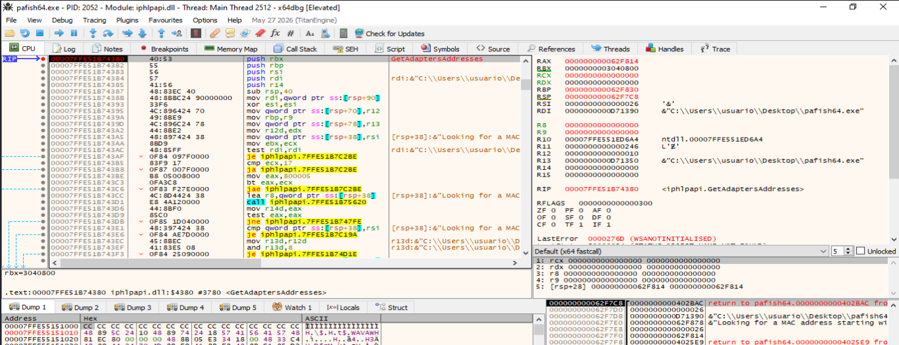

> **Figura 14.8.1.2. Primera llamada a `GetAdaptersAddresses`.** El registro `R9` contiene `0`, por lo que `AdapterAddresses` es nulo. Esta primera invocación permite determinar el tamaño necesario del búfer. En la pila también puede observarse la cadena `Looking for a MAC address starting...`, que relaciona la llamada con la comprobación del prefijo MAC.

En la pila se observa además un puntero utilizado para almacenar el tamaño requerido. Tras esta primera llamada, `Pafish` puede reservar memoria suficiente y volver a invocar la API.

---

#### Segunda llamada a `GetAdaptersAddresses`

Al continuar la ejecución, el breakpoint se activa una segunda vez.

En esta ocasión se observa:

```text
R9 = 0000000000112920
```

Por tanto, el cuarto argumento ya contiene una dirección de memoria válida:

```text
AdapterAddresses = 0x112920
```


> **Figura 14.8.1.3. Segunda llamada a `GetAdaptersAddresses`.** El registro `R9` contiene la dirección `0x112920`, correspondiente al búfer que recibirá las estructuras con la información de los adaptadores. A diferencia de la primera llamada, el parámetro `AdapterAddresses` ya no es nulo.

La secuencia observada hasta este punto puede resumirse como:

```text
Primera llamada
R9 = NULL
        ↓
Obtención del tamaño necesario
        ↓
Reserva del búfer
        ↓
Segunda llamada
R9 = 0x112920
```

---

#### Recuperación de la dirección física del adaptador

Tras finalizar la segunda llamada a `GetAdaptersAddresses`, el búfer contiene la información de los adaptadores enumerados por Windows.

Al inspeccionar la memoria se localiza la secuencia:

```text
08 00 27 01 E4 E9
```

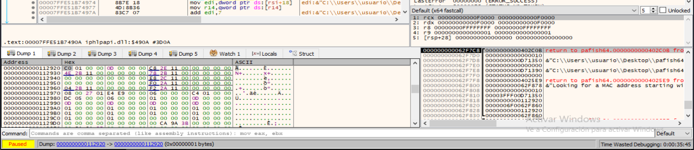

> **Figura 14.8.1.4. Dirección MAC recuperada mediante `GetAdaptersAddresses`.** En el búfer utilizado por `Pafish` aparece la secuencia `08 00 27 01 E4 E9`, que coincide exactamente con la dirección `08-00-27-01-E4-E9` obtenida previamente mediante `getmac /v`.

La correspondencia entre ambas observaciones es:

| Fuente | Dirección observada |
|---|---|
| `getmac /v` | `08-00-27-01-E4-E9` |
| Memoria de `Pafish` | `08 00 27 01 E4 E9` |

Esto demuestra que `Pafish` ha recuperado correctamente la dirección física del adaptador antes de realizar la comprobación del OUI.

---

#### Interceptación de la comparación mediante `memcmp`

Para localizar la comparación concreta se establece un breakpoint en:

```text
bp msvcrt.memcmp
```

Como `memcmp` puede utilizarse en otras comprobaciones de `Pafish`, resulta útil filtrar las detenciones y buscar una llamada cuyo tercer argumento sea igual a tres:

```text
R8 = 3
```

En Windows x64, la llamada:

```c
memcmp(buffer1, buffer2, size)
```

recibe conceptualmente:

```text
RCX → primer búfer
RDX → segundo búfer
R8  → número de bytes comparados
```

En la ejecución analizada se observa:

```text
RCX = 0000000000410447
RDX = 000000000062F80E
R8  = 0000000000000003
```

Al seguir `RDX` en el volcado de memoria aparece:

```text
08 00 27 01 E4 E9
```

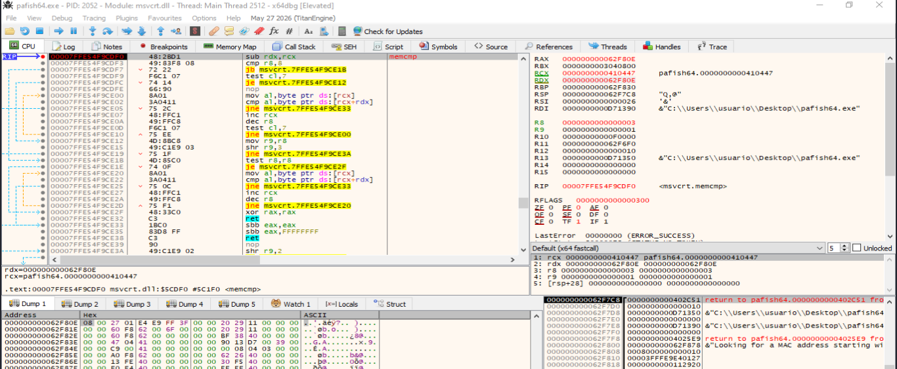

> **Figura 14.8.1.5. Entrada en `memcmp` durante la comprobación MAC.** El registro `R8` contiene `3`, lo que demuestra que `Pafish` compara únicamente tres bytes. El segundo búfer contiene la dirección física `08 00 27 01 E4 E9`.

La llamada puede representarse inicialmente como:

```text
memcmp(
    buffer_referencia,
    08 00 27 01 E4 E9,
    3
)
```

El siguiente paso consiste en comprobar qué contiene el primer búfer.

---

#### Localización del OUI de referencia

Al seguir la dirección almacenada inicialmente en `RCX`:

```text
0x410447
```

se observa en memoria:

```text
08 00 27
```

Por tanto, `Pafish` está comparando el prefijo de referencia:

```text
08:00:27
```

con los tres primeros bytes de la MAC real:

```text
08:00:27:01:E4:E9
```

La operación observada dinámicamente es equivalente a:

```text
memcmp(
    08 00 27,
    08 00 27 01 E4 E9,
    3
)
```

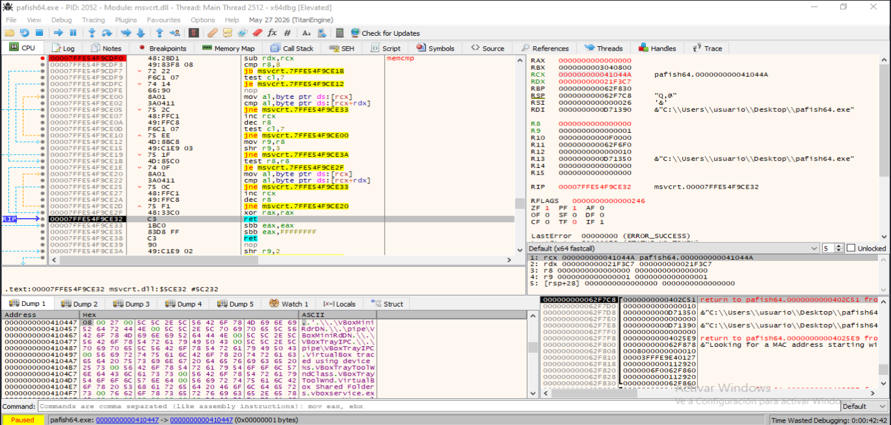

> **Figura 14.8.1.6. OUI de referencia utilizado por `Pafish`.** En la dirección de memoria utilizada como primer operando se observa la secuencia `08 00 27`. La función `memcmp` ha avanzado los punteros tres bytes y finaliza con `RAX = 0`, indicando que los tres bytes comparados son iguales.

El resultado:

```text
RAX = 0
```

indica igualdad entre ambos bloques:

```text
OUI de referencia: 08 00 27
                   │  │  │
MAC real:          08 00 27 01 E4 E9
                   └───────┘
                    3 bytes
```

Por tanto:

```text
memcmp(...) = 0
        ↓
Coincidencia del OUI
```

---

#### Tratamiento del resultado por `Pafish`

Después de retornar desde `memcmp`, la ejecución vuelve a `Pafish` en:

```text
0x402C51
```

El registro mantiene:

```text
EAX = 0
```

y el código ejecuta:

```asm
test eax,eax
jne  0x402C6C
```

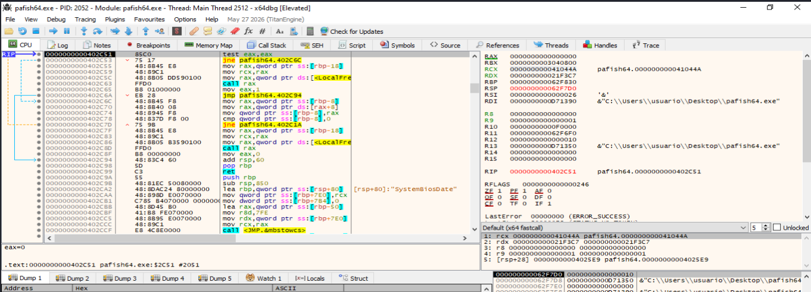

> **Figura 14.8.1.7. Tratamiento del resultado de `memcmp`.** Tras regresar a `Pafish`, `EAX` contiene `0`. La instrucción `test eax,eax` evalúa el resultado y el salto `jne` no corresponde a la rama de igualdad. En la misma secuencia puede observarse posteriormente `mov eax,1`, utilizado para devolver un resultado positivo cuando se ha localizado una coincidencia.

El flujo observado puede representarse como:

```text
memcmp(...) = 0
        ↓
EAX = 0
        ↓
test eax,eax
        ↓
ZF = 1
        ↓
jne no tomado
        ↓
liberación del búfer
        ↓
mov eax,1
        ↓
resultado positivo
```

La rama alternativa contiene un retorno equivalente a:

```asm
mov eax,0
```

cuando no se encuentra el prefijo esperado.

---

#### Flujo completo de la demostración

La ejecución observada permite reconstruir la comprobación completa:

```text
getmac /v
        ↓
08-00-27-01-E4-E9
        ↓
Pafish inicia comprobación MAC
        ↓
GetAdaptersAddresses
        ↓
Primera llamada:
R9 = NULL
        ↓
Obtención del tamaño
        ↓
Segunda llamada:
R9 = 0x112920
        ↓
Enumeración de adaptadores
        ↓
MAC recuperada:
08 00 27 01 E4 E9
        ↓
OUI de referencia:
08 00 27
        ↓
memcmp(..., ..., 3)
        ↓
RAX = 0
        ↓
Los tres primeros bytes coinciden
        ↓
test eax,eax
        ↓
rama positiva
        ↓
mov eax,1
```

Esta secuencia demuestra que la dirección MAC no se utiliza únicamente como información descriptiva. `Pafish` extrae sus primeros bytes, los compara con un patrón concreto y utiliza el resultado para decidir si la comprobación anti-VM es positiva.

---

#### Evidencias demostradas

Las capturas permiten establecer las siguientes evidencias:

- La máquina virtual expone la dirección MAC `08-00-27-01-E4-E9`.
- El OUI observado es `08:00:27`.
- `Pafish` utiliza `GetAdaptersAddresses` para enumerar los adaptadores.
- La primera llamada se realiza con `AdapterAddresses = NULL`.
- La segunda llamada utiliza un búfer válido en `0x112920`.
- La dirección física `08 00 27 01 E4 E9` aparece en la información recuperada.
- `Pafish` invoca `memcmp` con un tamaño de `3` bytes.
- Uno de los operandos contiene `08 00 27`.
- El otro operando comienza por `08 00 27`.
- `memcmp` devuelve `0`.
- El resultado se evalúa mediante `test eax,eax`.
- La coincidencia conduce a la rama que devuelve un resultado positivo.

Las direcciones de memoria y código mostradas corresponden a la ejecución y compilación concretas utilizadas en el laboratorio y pueden variar debido a ASLR, recompilación o diferencias entre versiones.

---

#### Limitaciones

La comprobación basada en OUI debe interpretarse como una **heurística anti-VM** y no como una prueba absoluta de virtualización.

Entre sus principales limitaciones se encuentran:

- La dirección MAC de una máquina virtual puede modificarse.
- Puede utilizarse una dirección administrada localmente.
- El hipervisor puede permitir configurar manualmente el prefijo.
- Un sistema físico puede contener adaptadores virtuales.
- Una VPN, un software de virtualización o determinadas herramientas de seguridad pueden crear interfaces adicionales.
- La presencia de un OUI concreto identifica una coincidencia con el patrón evaluado, pero no demuestra por sí sola toda la naturaleza del entorno.

Por este motivo, esta comprobación debe correlacionarse con otras técnicas anti-VM, como información de hardware, CPU, procesos, Registro, WMI, dispositivos o configuración de red.

---

#### Conclusión

La demostración dinámica confirma que `Pafish` utiliza la dirección MAC como indicador anti-virtualización.

La herramienta enumera los adaptadores mediante `GetAdaptersAddresses`, recupera la dirección física `08 00 27 01 E4 E9` y compara sus tres primeros bytes con el valor de referencia `08 00 27`.

La llamada:

```text
memcmp(08 00 27, 08 00 27 01 E4 E9, 3)
```

devuelve:

```text
0
```

lo que indica igualdad. Posteriormente, `Pafish` evalúa el resultado y continúa por la rama que devuelve un valor positivo.

La práctica demuestra, por tanto, la secuencia completa:

```text
Enumeración del adaptador
        ↓
Obtención de la MAC
        ↓
Extracción lógica del OUI
        ↓
Comparación de tres bytes
        ↓
Coincidencia
        ↓
Resultado anti-VM positivo
```

El resultado debe considerarse un indicador heurístico y combinarse con otras evidencias para reducir falsos positivos.


### 14.8.2. Nombre/descripción del adaptador

#### Objetivo de la demostración

El objetivo de esta práctica es demostrar dinámicamente cómo `Pafish` utiliza el nombre o la descripción de un adaptador de red como indicador heurístico de virtualización.

La comprobación analizada está orientada específicamente a VMware. Durante la ejecución, `Pafish` utiliza la cadena:

```text
VMware
```

como patrón de búsqueda y la compara con la descripción de los adaptadores obtenidos desde el sistema.

La secuencia general observada es:

```text
Localización de la comprobación
        ↓
vmware_adapter_name()
        ↓
pafish_check_adapter_name("VMware")
        ↓
Conversión a Unicode
        ↓
GetAdaptersAddresses()
        ↓
Obtención de Description
        ↓
wcsstr(Description, L"VMware")
        ↓
Coincidencia / no coincidencia
        ↓
Resultado booleano
```

La máquina utilizada para la práctica se ejecuta sobre VirtualBox. Por este motivo, la técnica se ejecuta correctamente, pero no produce una detección positiva de VMware. La descripción observada es:

```text
Intel(R) PRO/1000 MT Desktop Adapter
```

y no contiene la cadena:

```text
VMware
```

Esta diferencia permite distinguir entre:

```text
Técnica ejecutada       → Sí
Detección de VMware     → No
```

---

#### Localización de la comprobación en Pafish

Para evitar detener la ejecución en llamadas no relacionadas con esta sub-técnica, se localiza primero la cadena:

```text
Looking for network adapter name
```

mediante las referencias de cadenas del módulo `pafish64.exe`.

La referencia encontrada apunta a la zona de código encargada de lanzar esta comprobación.

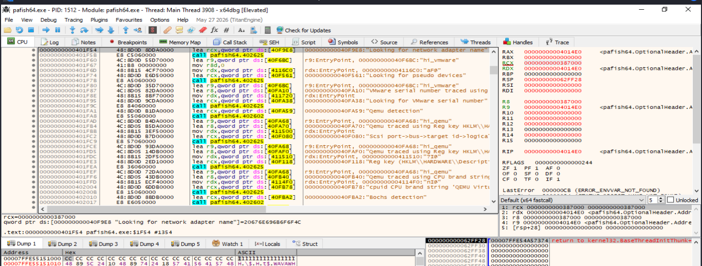

> **Figura 14.8.2.1. Localización de la comprobación del nombre del adaptador.** La referencia de cadenas de `pafish64.exe` muestra `Looking for network adapter name`, permitiendo aislar la prueba específica sin detenerse en otras comprobaciones de Pafish.

Esta localización permite situar un breakpoint justo antes de la llamada que ejecuta la comprobación.

---

#### Preparación de `exec_check`

La ejecución se detiene en:

```text
0x401F5B
```

justo antes de una llamada a la función que coordina la comprobación.

En ese punto se observan los argumentos:

```text
RCX → "Looking for network adapter name"
RDX → función de comprobación
R8  → "VMware traced using network adapter name"
R9  → "hi_vmware"
```

El valor de `RDX` apunta a:

```text
0x404647
```

que corresponde a la función encargada de comprobar el nombre del adaptador.

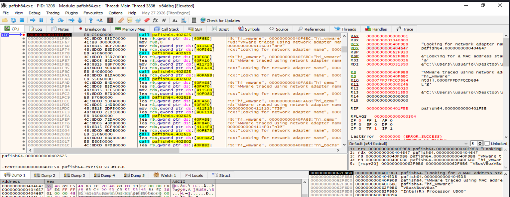

> **Figura 14.8.2.2. Preparación de la comprobación del adaptador.** `Pafish` prepara la ejecución de la prueba `Looking for network adapter name`. El registro `RDX` contiene la dirección de la función de comprobación, mientras que `R8` apunta al mensaje asociado a una detección positiva de VMware.

La secuencia puede representarse como:

```text
exec_check
   │
   ├── mensaje de comprobación
   ├── función de prueba
   ├── mensaje positivo
   └── identificador de la prueba
```

---

#### Entrada en `vmware_adapter_name`

Al seguir la función indicada por `RDX`, la ejecución alcanza:

```text
0x404647
```

La función contiene una secuencia muy breve:

```asm
lea rcx, [41086F]
call 0x402C9A
```

La dirección cargada en `RCX` contiene:

```text
"VMware"
```

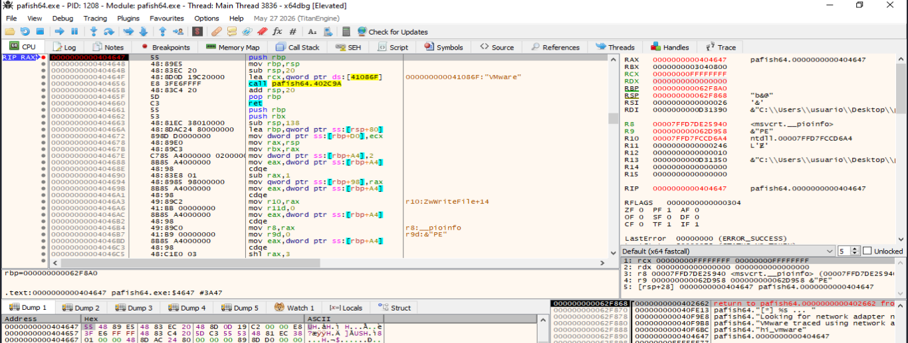

> **Figura 14.8.2.3. Función encargada de la comprobación VMware.** La rutina situada en `0x404647` carga la dirección de la cadena `VMware` en `RCX` y llama a la función situada en `0x402C9A`. Según la convención de llamadas x64 de Windows, `RCX` contiene el primer argumento.

La operación observada es equivalente conceptualmente a:

```c
pafish_check_adapter_name("VMware");
```

Por tanto, el patrón utilizado por Pafish para esta comprobación queda identificado explícitamente.

---

#### Entrada en `pafish_check_adapter_name`

La ejecución entra posteriormente en:

```text
0x402C9A
```

con:

```text
RCX → "VMware"
```

La función guarda este argumento y prepara su conversión a Unicode mediante `mbstowcs`.

En el mismo bloque de código puede observarse también una llamada posterior a:

```text
GetAdaptersAddresses
```

que será utilizada para obtener la información de los adaptadores.

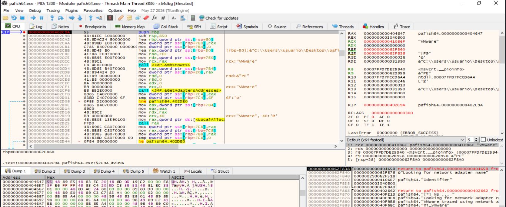

> **Figura 14.8.2.4. Entrada en `pafish_check_adapter_name`.** La rutina recibe la cadena ASCII `VMware`, prepara un búfer local y posteriormente utiliza `GetAdaptersAddresses` para enumerar los adaptadores de red.

El flujo inicial es:

```text
"VMware"
        ↓
Guardar argumento
        ↓
Preparar búfer Unicode
        ↓
mbstowcs
        ↓
GetAdaptersAddresses
```

---

#### Conversión del patrón `VMware` a Unicode

Pafish convierte la cadena ASCII:

```text
"VMware"
```

a formato Unicode antes de utilizarla con `wcsstr`.

Justo antes de la llamada a `mbstowcs`, los argumentos relevantes son:

```text
RCX → búfer destino
RDX → "VMware"
R8  → tamaño máximo
```

En la ejecución analizada:

```text
RCX = 0x62F010
RDX = 0x41086F
R8  = 0x7FE
```

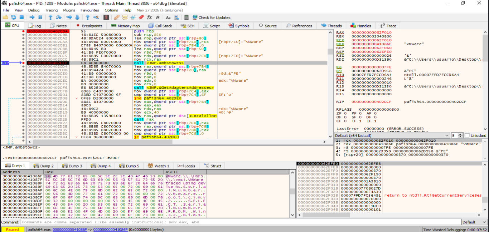

> **Figura 14.8.2.5. Preparación de `mbstowcs`.** El segundo argumento apunta a la cadena ASCII `VMware`, mientras que `RCX` contiene la dirección del búfer donde se almacenará la versión Unicode.

Conceptualmente:

```c
mbstowcs(
    buffer_unicode,
    "VMware",
    tamaño
);
```

---

#### Verificación de `L"VMware"` en memoria

Después de ejecutar `mbstowcs`, el búfer situado en:

```text
0x62F010
```

contiene la cadena Unicode.

En memoria se observa conceptualmente:

```text
56 00 4D 00 77 00 61 00 72 00 65 00 00 00
 V     M     w     a     r     e
```

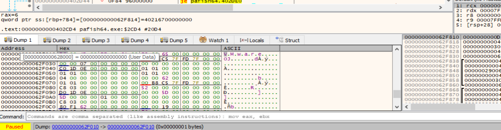

> **Figura 14.8.2.6. Cadena `VMware` convertida a Unicode.** El búfer empleado por Pafish contiene `V.M.w.a.r.e`, representación visual de `L"VMware"` mediante caracteres `WCHAR`.

Queda demostrada así la transformación:

```text
"VMware"
        ↓
mbstowcs
        ↓
L"VMware"
```

---

#### Enumeración de adaptadores

Después de preparar el patrón Unicode, Pafish utiliza:

```text
GetAdaptersAddresses
```

para obtener la información de los adaptadores instalados.

La función sigue el mismo esquema observado en la sub-técnica anterior:

```text
Primera llamada
AdapterAddresses = NULL
        ↓
Obtener tamaño necesario
        ↓
Reservar memoria
        ↓
Segunda llamada
AdapterAddresses != NULL
        ↓
Obtener estructuras IP_ADAPTER_ADDRESSES
```

En esta práctica, el interés no se encuentra en la dirección física `PhysicalAddress`, sino en el campo:

```text
Description
```

de cada adaptador.

La comprobación recorre la lista enlazada de adaptadores y aplica la búsqueda sobre cada descripción.

---

#### Comparación de la descripción mediante `wcsstr`

La evidencia principal de esta sub-técnica aparece al interceptar:

```text
msvcrt.wcsstr
```

En Windows x64, la función recibe:

```text
RCX → cadena donde se realizará la búsqueda
RDX → subcadena buscada
```

En la ejecución analizada se observa:

```text
RCX → L"Intel(R) PRO/1000 MT Desktop Adapter"
RDX → L"VMware"
```

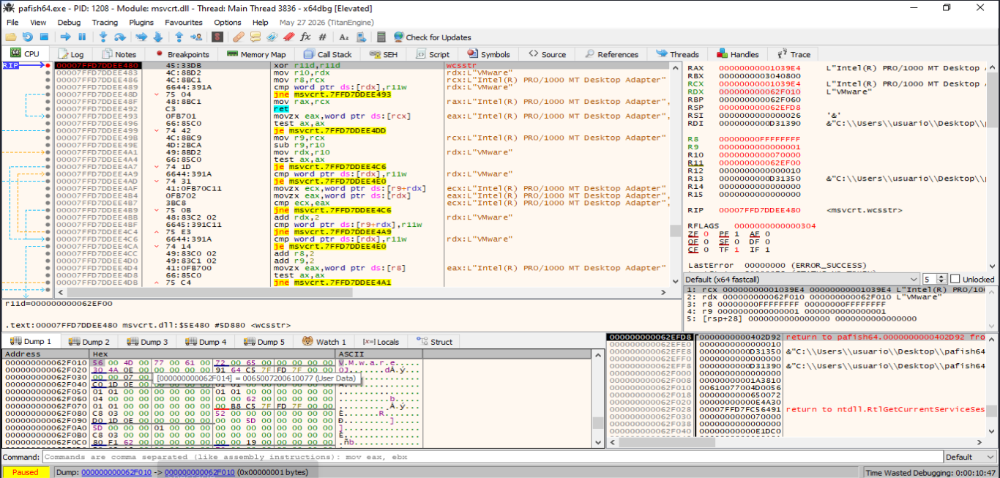

> **Figura 14.8.2.7. Comparación de la descripción del adaptador.** Pafish ejecuta `wcsstr` utilizando como primer argumento `Intel(R) PRO/1000 MT Desktop Adapter` y como segundo argumento `VMware`. Esta llamada demuestra directamente que la descripción del adaptador se utiliza como indicador anti-VM.

La operación observada es equivalente a:

```c
wcsstr(
    L"Intel(R) PRO/1000 MT Desktop Adapter",
    L"VMware"
);
```

El mecanismo puede resumirse como:

```text
Description
"Intel(R) PRO/1000 MT Desktop Adapter"
        ↓
buscar
        ↓
"VMware"
```

---

#### Resultado de `wcsstr`

Al finalizar la función `wcsstr`, el registro de retorno contiene:

```text
RAX = 0
```

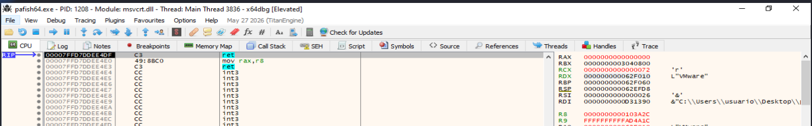

> **Figura 14.8.2.8. Resultado de `wcsstr`.** La función finaliza con `RAX = 0`, indicando que la cadena `VMware` no aparece dentro de la descripción `Intel(R) PRO/1000 MT Desktop Adapter`.

El resultado puede expresarse como:

```text
wcsstr(
    L"Intel(R) PRO/1000 MT Desktop Adapter",
    L"VMware"
)
        ↓
NULL
        ↓
RAX = 0
```

Esta ausencia de coincidencia es coherente con el laboratorio, ya que la máquina analizada utiliza VirtualBox y no VMware.

---

#### Tratamiento del resultado negativo

Después de retornar desde `wcsstr`, Pafish evalúa el valor mediante:

```asm
test rax,rax
je   0x402DB1
```

Como:

```text
RAX = 0
```

la instrucción:

```asm
test rax,rax
```

establece el indicador de cero y el salto `je` se toma.

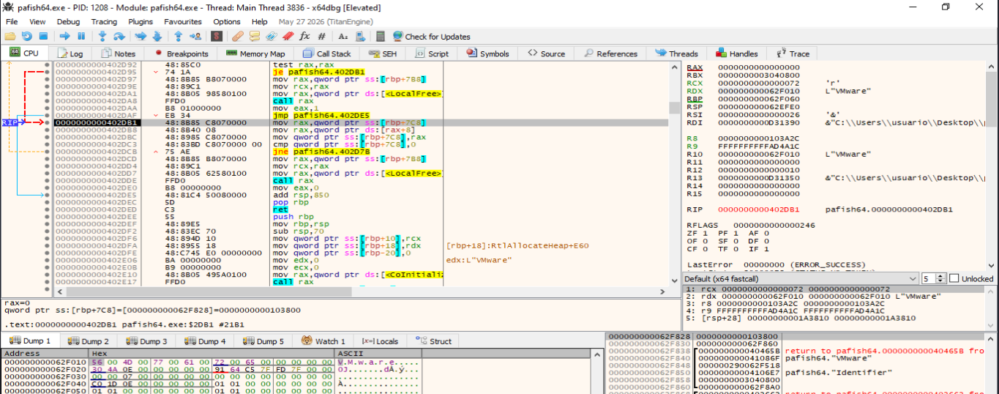

> **Figura 14.8.2.9. Procesamiento de una búsqueda sin coincidencia.** Tras recibir `RAX = 0`, Pafish toma la rama correspondiente a una búsqueda negativa y continúa recorriendo la lista de adaptadores.

La lógica observada es:

```text
wcsstr = NULL
        ↓
RAX = 0
        ↓
test rax,rax
        ↓
ZF = 1
        ↓
JE tomado
        ↓
continuar con adapter->Next
```

Pafish no concluye inmediatamente tras una búsqueda negativa. La función avanza al siguiente elemento de la lista enlazada y repite la comparación cuando existen más adaptadores.

Conceptualmente:

```c
adapter = adapter->Next;
```

---

#### Finalización sin coincidencias

Cuando Pafish ha terminado de recorrer los adaptadores sin localizar la cadena `VMware`, libera el búfer utilizado y establece:

```asm
mov eax,0
```

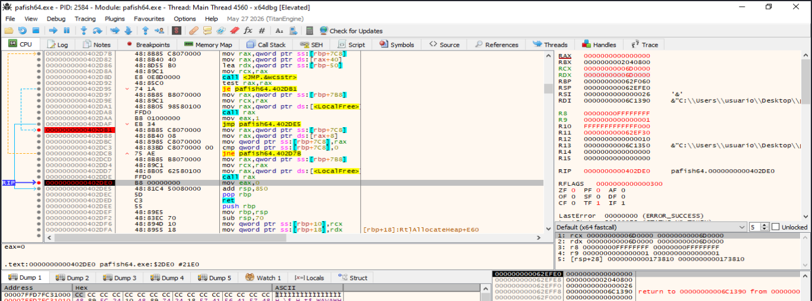

> **Figura 14.8.2.10. Resultado final de la comprobación.** La función ejecuta `mov eax,0` antes de retornar, indicando `FALSE`. En el entorno analizado no se ha localizado `VMware` en la descripción de ninguno de los adaptadores examinados.

El flujo final es:

```text
Todos los adaptadores analizados
        ↓
ninguna Description contiene "VMware"
        ↓
LocalFree
        ↓
mov eax,0
        ↓
FALSE
```

---

#### Flujo completo de la demostración

La práctica permite reconstruir la secuencia completa:

```text
"Looking for network adapter name"
        ↓
exec_check
        ↓
vmware_adapter_name()
        ↓
"VMware"
        ↓
pafish_check_adapter_name("VMware")
        ↓
mbstowcs()
        ↓
L"VMware"
        ↓
GetAdaptersAddresses()
        ↓
IP_ADAPTER_ADDRESSES
        ↓
Description
        ↓
L"Intel(R) PRO/1000 MT Desktop Adapter"
        ↓
wcsstr(
    Description,
    L"VMware"
)
        ↓
RAX = 0
        ↓
No coincidencia
        ↓
adapter = adapter->Next
        ↓
ningún adaptador coincide
        ↓
mov eax,0
        ↓
FALSE
```

---

#### Evidencias demostradas

Las capturas permiten establecer las siguientes evidencias:

- Pafish incluye una comprobación denominada `Looking for network adapter name`.
- La función seleccionada para esta prueba recibe el patrón `VMware`.
- La rutina `vmware_adapter_name` delega en una función de comprobación genérica.
- El patrón `VMware` se convierte de ASCII a Unicode.
- La cadena `L"VMware"` queda almacenada en un búfer local.
- Pafish utiliza `GetAdaptersAddresses` para obtener la información de los adaptadores.
- La propiedad utilizada para esta técnica es `Description`.
- La descripción observada es `Intel(R) PRO/1000 MT Desktop Adapter`.
- Pafish utiliza `wcsstr` para buscar `VMware` dentro de la descripción.
- `wcsstr` devuelve `NULL`.
- El resultado negativo provoca que Pafish continúe con el siguiente adaptador.
- Tras recorrer los adaptadores sin coincidencias, la función devuelve `FALSE`.

Las direcciones de memoria y código mostradas pertenecen a la ejecución concreta del laboratorio. Pueden variar entre versiones, recompilaciones o configuraciones debido a ASLR y otros factores.

---

#### Diferencia entre técnica ejecutada y detección positiva

Esta práctica permite distinguir dos conceptos que deben mantenerse separados durante el análisis:

| Elemento | Resultado |
|---|---|
| Comprobación del nombre/descripción ejecutada | Sí |
| Patrón buscado | `VMware` |
| Descripción encontrada | `Intel(R) PRO/1000 MT Desktop Adapter` |
| Uso de `wcsstr` | Sí |
| Coincidencia con `VMware` | No |
| Técnica demostrada dinámicamente | Sí |
| Detección positiva de VMware | No |
| Valor final | `FALSE` |

Por tanto, la ausencia de detección positiva no invalida la demostración. La técnica se encuentra implementada y se ejecuta correctamente, pero el entorno concreto no satisface la condición buscada.

---

#### Limitaciones

La detección mediante nombre o descripción del adaptador presenta varias limitaciones:

- La descripción de un adaptador virtual puede modificarse o variar entre versiones.
- Algunos hipervisores exponen dispositivos emulados con nombres de fabricantes físicos.
- Una máquina física puede contener adaptadores virtuales instalados por VPN, contenedores o software de virtualización.
- La ausencia del término `VMware` no descarta que el sistema esté virtualizado.
- Una misma plataforma puede utilizar distintos modelos de adaptador.
- La presencia de una cadena concreta es un indicador heurístico y no una prueba concluyente.

En la práctica analizada, VirtualBox expone:

```text
Intel(R) PRO/1000 MT Desktop Adapter
```

por lo que una comprobación específica de:

```text
VMware
```

no produce coincidencia.

Esta circunstancia evidencia precisamente una de las principales debilidades de las técnicas basadas en cadenas: dependen del dispositivo, controlador y configuración concreta utilizados.

---

#### Conclusión

La demostración dinámica confirma que Pafish implementa una técnica anti-VM basada en el nombre o descripción de los adaptadores de red.

La herramienta utiliza el patrón:

```text
VMware
```

lo convierte a:

```text
L"VMware"
```

y enumera los adaptadores mediante `GetAdaptersAddresses`. Posteriormente, compara la propiedad `Description` utilizando:

```text
wcsstr(
    L"Intel(R) PRO/1000 MT Desktop Adapter",
    L"VMware"
)
```

La llamada devuelve:

```text
RAX = 0
```

por lo que no existe coincidencia. Pafish continúa recorriendo los adaptadores y finalmente ejecuta:

```asm
mov eax,0
```

devolviendo `FALSE`.

La práctica demuestra, por tanto, el mecanismo completo:

```text
Enumeración de adaptadores
        ↓
Obtención de Description
        ↓
Comparación con "VMware"
        ↓
Resultado de la búsqueda
        ↓
Decisión anti-VM
```

En el entorno utilizado, la técnica se ejecuta correctamente pero no identifica VMware, ya que la máquina virtual analizada utiliza VirtualBox y expone un adaptador `Intel(R) PRO/1000 MT Desktop Adapter`.

El resultado debe interpretarse como una comprobación heurística y correlacionarse con otros indicadores, como MAC/OUI, dispositivos, procesos, Registro, WMI, CPU o configuración de red.

-----


### 14.8.3. IP / gateway / DNS / DHCP

#### Objetivo de la demostración

El objetivo de esta práctica es demostrar dinámicamente cómo una herramienta educativa puede recuperar parámetros de configuración de red y utilizarlos como indicadores heurísticos para detectar configuraciones compatibles con un entorno virtualizado.

La herramienta utilizada es [network_lab.cpp](https://github.com/soniasalido/cybersecurity/blob/main/Documentation/Malware/Master-ENIIT-Analisis-Malware-Reversing/modulo-11-TFM/modulo-deteccion-entornos-virtuales/modulo-evasion/utiles/network_lab.cpp), desarrollada específicamente para esta práctica. Su comportamiento es exclusivamente de lectura: enumera la configuración de los adaptadores, transforma las direcciones binarias a formato textual y evalúa determinados patrones de referencia.

La demostración se centra en cuatro elementos:

- Dirección IPv4 del sistema invitado.
- Puerta de enlace predeterminada.
- Configuración DNS.
- Estado y servidor DHCP.

Posteriormente, la herramienta evalúa una configuración de referencia asociada al modo NAT de VirtualBox:

```text
Guest IP : 10.0.x.15
Gateway  : 10.0.x.2
DNS      : 10.0.x.3
```

La comprobación es heurística. Una coincidencia no constituye por sí sola una prueba concluyente de que el sistema se ejecute dentro de VirtualBox.

En el laboratorio analizado, la configuración real observada es:

```text
IPv4         : 10.0.2.15
Gateway IPv4 : 10.0.2.2
DNS          : no observado mediante la enumeración utilizada
DHCPv4       : habilitado
DHCP server  : 10.0.2.2
```

El resultado final de la heurística es:

```text
Guest IP  → coincide
Gateway   → coincide
DNS       → no coincide
-------------------------
Resultado → 2/3
```

---

#### Ejecución de la herramienta

La utilidad se ejecuta con:

```powershell
network_lab.exe --all --csv resultados_network.csv
```

La opción `--all` muestra la configuración de los adaptadores y ejecuta posteriormente la evaluación heurística. La opción `--csv` permite conservar los valores observados en un fichero para facilitar su comparación.

El análisis dinámico se realiza con `x64dbg`.

---

#### Enumeración de la configuración mediante `GetAdaptersAddresses`

El primer punto de interés es la llamada a:

```text
iphlpapi.GetAdaptersAddresses
```

Se establece el breakpoint:

```text
bp iphlpapi.GetAdaptersAddresses
```

En Windows x64, los argumentos principales de la función se reciben en:

```text
RCX → Family
RDX → Flags
R8  → Reserved
R9  → AdapterAddresses
```

En la ejecución analizada se observa:

```text
RCX = 0
RDX = 0x96
R8  = 0
R9  = dirección válida del búfer
```

El valor:

```text
RCX = 0
```

corresponde a `AF_UNSPEC`, por lo que se enumeran direcciones IPv4 e IPv6.

El registro `R9` apunta al búfer en el que Windows almacena una lista de estructuras `IP_ADAPTER_ADDRESSES`.

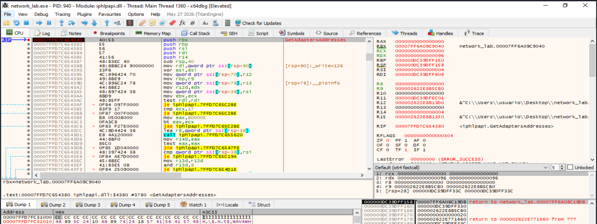

> **Figura 14.8.3.1. Enumeración de adaptadores mediante `GetAdaptersAddresses`.** `network_lab` proporciona un búfer válido en `R9` para recibir las estructuras `IP_ADAPTER_ADDRESSES`. La función constituye la fuente principal de los datos empleados posteriormente para obtener IP, gateway, DNS y DHCP.

Conceptualmente:

```text
GetAdaptersAddresses
        ↓
IP_ADAPTER_ADDRESSES
        │
        ├── FirstUnicastAddress
        ├── FirstGatewayAddress
        ├── FirstDnsServerAddress
        ├── Flags
        └── Dhcpv4Server
```

La herramienta no utiliza WMI en esta demostración, lo que permite mantener esta práctica separada de la técnica específica de reconocimiento mediante WMI.

---

#### Obtención de la dirección IPv4

Las direcciones contenidas en las estructuras de Windows se encuentran inicialmente en formato binario. Para obtener una representación legible, `network_lab` utiliza:

```text
ws2_32.getnameinfo
```

con la opción de representación numérica.

En la llamada correspondiente a IPv4 se observa una longitud de:

```text
RDX = 0x10
```

coherente con una estructura IPv4 `sockaddr_in`.

Después de retornar de `getnameinfo`, el búfer de salida contiene:

```text
10.0.2.15
```

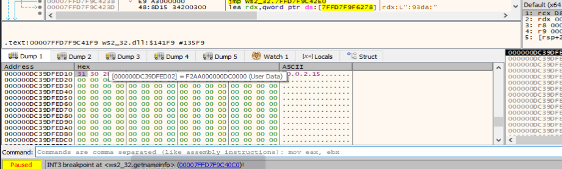

> **Figura 14.8.3.2. Conversión de la dirección IPv4.** Tras procesar la estructura `sockaddr_in`, el búfer de salida de `getnameinfo` contiene la cadena `10.0.2.15`, correspondiente a la dirección IPv4 del adaptador Ethernet de la máquina virtual.

El flujo demostrado es:

```text
FirstUnicastAddress
        ↓
sockaddr_in
        ↓
getnameinfo
        ↓
10.0.2.15
```

---

#### Obtención de la puerta de enlace IPv4

La herramienta recorre también la lista:

```text
FirstGatewayAddress
```

En el entorno analizado se observan dos gateways:

```text
fe80::2%13
10.0.2.2
```

La dirección relevante para la heurística IPv4 es:

```text
10.0.2.2
```

Después de la conversión mediante `getnameinfo`, el búfer contiene esa representación textual.

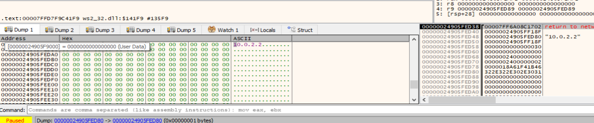

> **Figura 14.8.3.3. Obtención del gateway IPv4.** El búfer de salida contiene `10.0.2.2`. Durante la ejecución se observa también el gateway IPv6 `fe80::2%13`, por lo que la traza permite relacionar esta conversión con el recorrido de `FirstGatewayAddress`.

La secuencia queda:

```text
FirstGatewayAddress
        │
        ├── fe80::2%13
        └── 10.0.2.2
                 ↓
            getnameinfo
                 ↓
             10.0.2.2
```

---

#### Obtención del servidor DHCP

El servidor DHCPv4 se obtiene desde el campo:

```text
Dhcpv4Server
```

de la información del adaptador.

En la segunda conversión relevante de `10.0.2.2`, la estructura `sockaddr_in` contiene:

```text
0A 00 02 02
```

correspondiente a:

```text
10.0.2.2
```

La traza se produce en un contexto asociado directamente a la información del adaptador.

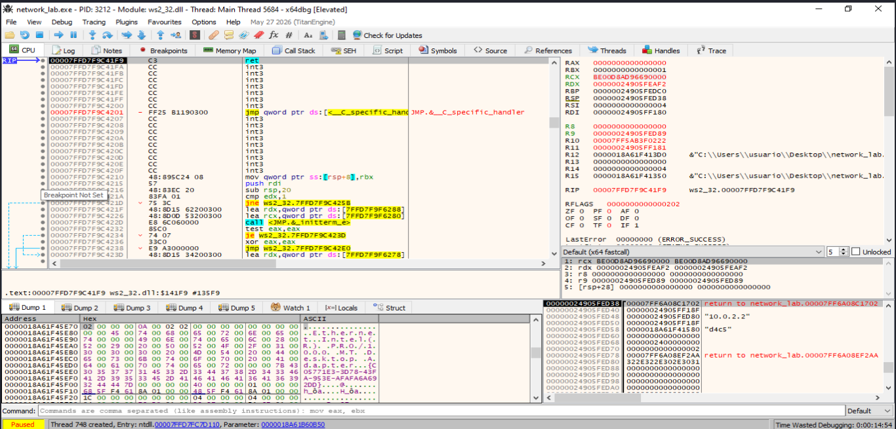

> **Figura 14.8.3.4. Dirección utilizada como servidor DHCP.** La estructura IPv4 procesada contiene los bytes `0A 00 02 02`, equivalentes a `10.0.2.2`. Esta segunda aparición del mismo valor se corresponde con el servidor DHCP observado posteriormente en la salida de [network_lab.exe](https://github.com/soniasalido/cybersecurity/blob/main/Documentation/Malware/Master-ENIIT-Analisis-Malware-Reversing/modulo-11-TFM/modulo-deteccion-entornos-virtuales/modulo-evasion/utiles/network_lab.cpp).

Debe distinguirse entre dos datos:

```text
DHCPv4 habilitado
DHCP server = 10.0.2.2
```

La herramienta obtiene el estado de DHCPv4 comprobando el flag correspondiente de `IP_ADAPTER_ADDRESSES`, mientras que la dirección del servidor DHCP se transforma a texto de forma análoga al resto de direcciones.

Conceptualmente:

```text
IP_ADAPTER_ADDRESSES
        │
        ├── Flags
        │     ↓
        │  DHCP habilitado
        │
        └── Dhcpv4Server
              ↓
           10.0.2.2
```

---

#### Comportamiento observado para DNS

Durante la enumeración del adaptador, la herramienta muestra:

```text
DNS : (no observado)
```

Por tanto, la ejecución concreta no proporciona un servidor DNS utilizable mediante la lista examinada por `network_lab`.

Esto debe diferenciarse del valor de referencia:

```text
10.0.2.3
```

que aparece posteriormente en la evaluación heurística.

La herramienta utiliza `10.0.x.3` como **patrón esperado**, pero al no haberse observado un DNS coincidente:

```text
dnsMatch = false
```

Por este motivo el DNS no incrementa la puntuación final.

La situación es:

```text
DNS observado mediante enumeración
        ↓
ninguno
        ↓
patrón esperado
10.0.2.3
        ↓
sin coincidencia
```

---

#### Inicio de la evaluación heurística de la IPv4

Una vez obtenidos los parámetros de red, `network_lab` inicia la evaluación del patrón de referencia.

La herramienta convierte nuevamente las cadenas IPv4 a representación binaria mediante:

```text
ws2_32.inet_pton
```

Para la dirección del invitado se procesa:

```text
10.0.2.15
```

Después de la conversión, el búfer contiene:

```text
0A 00 02 0F
```

y `RAX = 1`, indicando que la conversión se ha realizado correctamente.

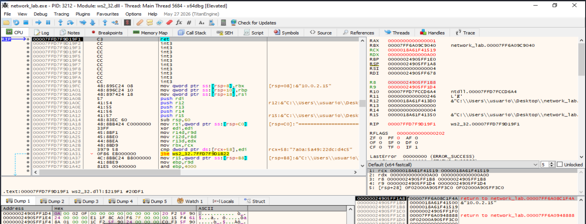

> **Figura 14.8.3.5. Conversión de `10.0.2.15` mediante `inet_pton`.** La dirección textual se transforma en los octetos `0A 00 02 0F`, equivalentes a `10.0.2.15`. El valor de retorno positivo confirma que la conversión IPv4 ha sido válida.

La equivalencia es:

```text
0A → 10
00 → 0
02 → 2
0F → 15
```

por tanto:

```text
0A 00 02 0F
      ↓
10.0.2.15
```

---

#### Validación del patrón `10.0.x.15`

La función encargada de evaluar la Guest IP comprueba:

```text
octet[0] == 10
octet[1] == 0
octet[3] == 15
```

Para:

```text
10.0.2.15
```

se obtiene:

```text
octet[0] = 10
octet[1] = 0
octet[2] = 2
octet[3] = 15
```

Las condiciones se satisfacen y la función guarda:

```text
x = 2
```

El valor `x` será reutilizado posteriormente para comprobar el gateway y el DNS.

La función termina devolviendo:

```text
EAX = 1
```

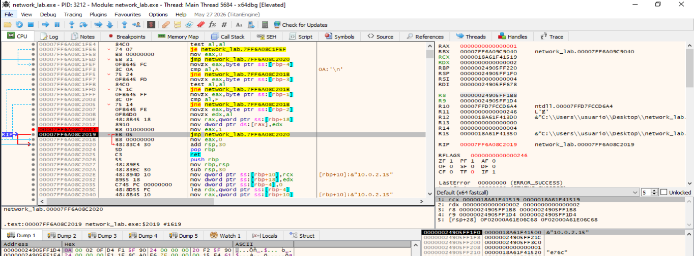

> **Figura 14.8.3.6. Coincidencia positiva de la Guest IP.** Tras comprobar los octetos `10`, `0` y `15`, la función devuelve `1`. El tercer octeto, `2`, queda almacenado como `x` y se utiliza posteriormente para correlacionar el resto de parámetros del patrón NAT.

El flujo es:

```text
10.0.2.15
        ↓
10.0.x.15
        ↓
x = 2
        ↓
TRUE
        ↓
Guest IP → COINCIDE
```

La coincidencia de la Guest IP establece la puntuación inicial:

```text
score = 1
```

---

#### Evaluación del gateway

Después de establecer:

```text
x = 2
```

la herramienta evalúa los gateways observados.

El gateway IPv6 no puede interpretarse como IPv4 mediante `AF_INET`, por lo que no produce coincidencia.

Posteriormente se procesa:

```text
10.0.2.2
```

La conversión mediante `inet_pton` produce:

```text
0A 00 02 02
```

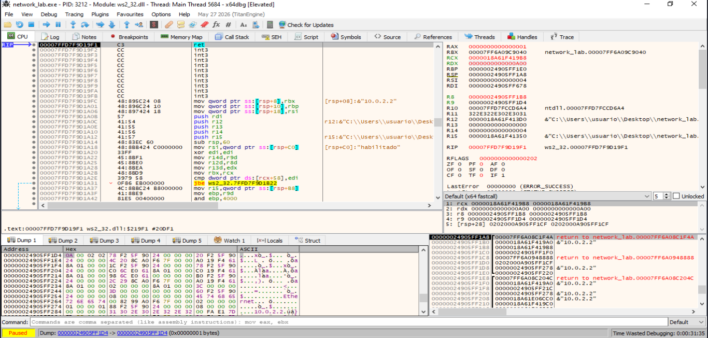

> **Figura 14.8.3.7. Conversión del gateway `10.0.2.2`.** `inet_pton` transforma el gateway IPv4 en los octetos `0A 00 02 02`. El valor es compatible con el patrón `10.0.x.2` utilizando `x = 2`, obtenido previamente a partir de la Guest IP.

La comprobación conceptual es:

```text
octet[0] == 10
octet[1] == 0
octet[2] == x
octet[3] == 2
```

Con:

```text
x = 2
```

resulta:

```text
10 == 10      ✓
0  == 0       ✓
2  == x       ✓
2  == 2       ✓
```

---

#### Establecimiento de `gatewayMatch`

Tras una coincidencia positiva, la rutina retorna `TRUE`.

El caller comprueba el resultado y ejecuta:

```asm
mov byte ptr [rbp-3B],1
```

La variable local corresponde al indicador utilizado por la evaluación para registrar la coincidencia del gateway.

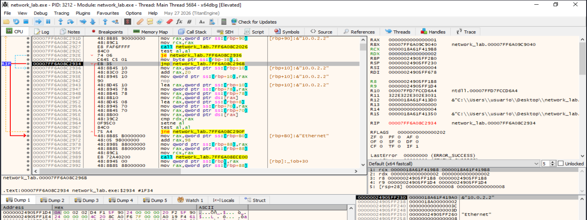

> **Figura 14.8.3.8. Resultado positivo de la comprobación del gateway.** Después de recibir un valor verdadero, la evaluación establece el indicador de coincidencia del gateway a `1`. La dirección `10.0.2.2` satisface por tanto el patrón esperado `10.0.x.2`.

El flujo queda:

```text
10.0.2.2
        ↓
10.0.x.2
        ↓
x = 2
        ↓
TRUE
        ↓
gatewayMatch = true
```

La coincidencia del gateway incrementa posteriormente la puntuación:

```text
score = 1
        ↓
gatewayMatch = true
        ↓
score = 2
```

No resulta necesario seguir instrucción por instrucción el incremento para demostrar la decisión, ya que el valor final del campo `score` se observa directamente antes de seleccionar la rama de resultado.

---

#### Puntuación final y selección de la rama parcial

En la fase final de la función de evaluación, el campo `score` se recupera desde el objeto que contiene los resultados.

En la ejecución se observa:

```text
score = 2
```

y la lógica compara primero el valor con `3` y posteriormente con `2`.

La condición:

```asm
cmp eax,2
```

se ejecuta con:

```text
EAX = 2
```

por lo que la comparación resulta verdadera y la ejecución entra en la rama de coincidencia parcial.

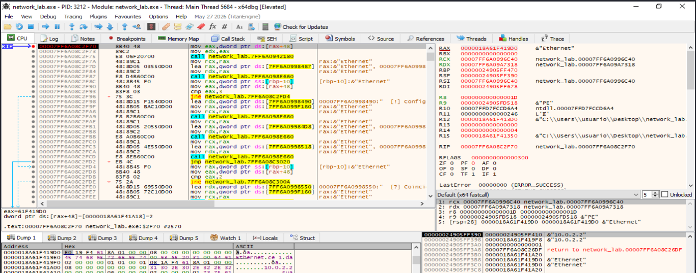

> **Figura 14.8.3.9. Selección de la rama de coincidencia parcial.** El campo `score` contiene el valor `2`. La comparación `cmp eax,2` confirma que se han obtenido dos coincidencias principales, provocando la selección de la rama que informa de una coincidencia parcial con el patrón NAT de referencia.

La decisión puede expresarse como:

```text
Guest IP coincide
        ↓
score = 1

Gateway coincide
        ↓
score = 2

DNS no coincide
        ↓
score permanece = 2

        ↓
score == 3 → no

        ↓
score == 2 → sí

        ↓
Coincidencia parcial
```

---

#### Resultado final

Después de finalizar el análisis bajo `x64dbg`, se deja continuar la ejecución hasta la salida normal de la herramienta.

El resultado mostrado es:

```text
Guest IP : 10.0.2.15 -> COINCIDE
Gateway  : 10.0.2.2  -> COINCIDE
DNS      : 10.0.2.3  -> no coincide
DHCPv4   : habilitado
DHCP srv : 10.0.2.2

Coincidencias principales: 2/3

[?] Coincidencia parcial con el patron NAT de referencia.
```

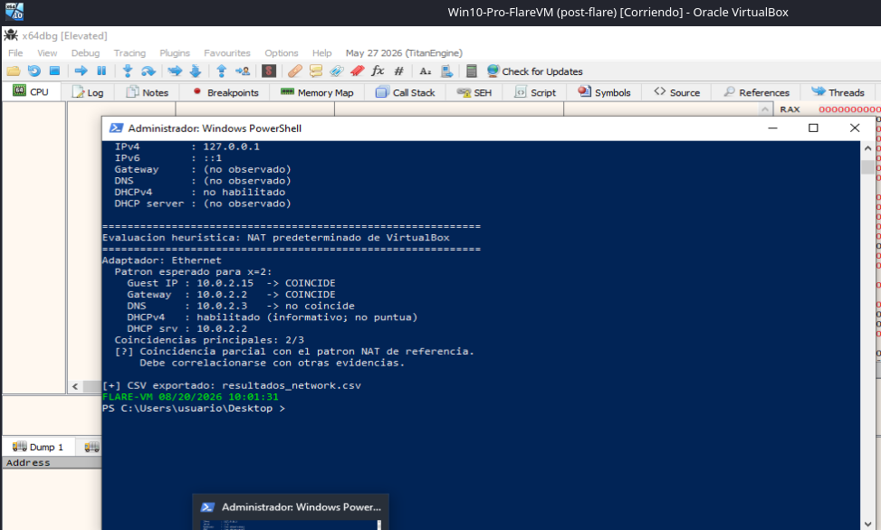

> **Figura 14.8.3.10. Resultado final de la evaluación heurística.** La herramienta identifica coincidencias para la Guest IP y el gateway, pero no para DNS. DHCPv4 aparece habilitado y el servidor DHCP observado es `10.0.2.2`. El resultado final es `2/3`, clasificado como coincidencia parcial con el patrón NAT de referencia.

Debe tenerse en cuenta que la línea:

```text
DNS : 10.0.2.3 -> no coincide
```

muestra el **valor esperado por la heurística** para `x = 2`; no implica que `10.0.2.3` haya sido recuperado durante la enumeración. La configuración inicial mostró:

```text
DNS : (no observado)
```

por lo que `dnsMatch` permanece falso.

---

#### Flujo completo de la demostración

La secuencia completa observada puede resumirse como:

```text
GetAdaptersAddresses
        ↓
IP_ADAPTER_ADDRESSES
        │
        ├── IPv4
        │     ↓
        │   10.0.2.15
        │
        ├── Gateway
        │     ↓
        │   10.0.2.2
        │
        ├── DNS
        │     ↓
        │   no observado
        │
        └── DHCP
              ↓
           habilitado
           servidor 10.0.2.2

        ↓

Evaluación heurística

        ↓

Guest IP
10.0.2.15
        ↓
inet_pton
        ↓
0A 00 02 0F
        ↓
10.0.x.15
        ↓
x = 2
        ↓
TRUE
        ↓
score = 1

        ↓

Gateway
10.0.2.2
        ↓
inet_pton
        ↓
0A 00 02 02
        ↓
10.0.x.2
        ↓
TRUE
        ↓
gatewayMatch = true
        ↓
score = 2

        ↓

DNS esperado
10.0.2.3
        ↓
sin DNS observado coincidente
        ↓
dnsMatch = false

        ↓

score final = 2

        ↓

2/3

        ↓

Coincidencia parcial
```

---

#### Evidencias demostradas

Las capturas permiten establecer las siguientes evidencias:

- `network_lab` utiliza `GetAdaptersAddresses` para enumerar la configuración de red.
- La dirección IPv4 recuperada es `10.0.2.15`.
- La puerta de enlace IPv4 recuperada es `10.0.2.2`.
- DHCPv4 aparece habilitado.
- El servidor DHCP observado es `10.0.2.2`.
- No se observa un servidor DNS mediante la enumeración utilizada.
- La Guest IP se convierte mediante `inet_pton` en `0A 00 02 0F`.
- La Guest IP satisface el patrón `10.0.x.15`.
- El valor correlacionado es `x = 2`.
- La comprobación de la Guest IP devuelve `TRUE`.
- El gateway se convierte en `0A 00 02 02`.
- El gateway satisface el patrón `10.0.x.2`.
- `gatewayMatch` se establece a verdadero.
- La puntuación final es `2`.
- La rama `score == 2` se selecciona correctamente.
- La herramienta informa de una coincidencia parcial `2/3`.

Las direcciones de memoria y de código mostradas pertenecen a la ejecución concreta del laboratorio y pueden variar entre ejecuciones, compilaciones y configuraciones debido, entre otros factores, a ASLR.

---

#### Limitaciones

La detección basada en IP, gateway, DNS o DHCP presenta varias limitaciones:

- Los parámetros de una red virtual pueden modificarse manualmente.
- El uso de modo puente puede hacer que la máquina virtual adopte valores propios de la red física.
- Distintas redes NAT pueden emplear rangos diferentes.
- El DNS puede ser suministrado, sustituido o gestionado de forma distinta según el sistema operativo y la configuración del hipervisor.
- El servidor DHCP no constituye por sí solo una firma fiable de virtualización.
- Redes físicas o laboratorios pueden utilizar rangos similares accidentalmente.
- La ausencia del patrón esperado no descarta que el sistema se encuentre virtualizado.

Por este motivo, la herramienta utiliza una puntuación y evita interpretar una única coincidencia como prueba concluyente.

---

#### Conclusión

La demostración dinámica confirma que la configuración de red puede emplearse como fuente de indicadores anti-VM.

`network_lab` recupera la información mediante `GetAdaptersAddresses`, obtiene la IPv4 `10.0.2.15`, el gateway `10.0.2.2`, el estado DHCP y el servidor DHCP `10.0.2.2`. En la ejecución analizada no se observa un servidor DNS mediante la enumeración utilizada.

La fase heurística convierte las direcciones IPv4 mediante `inet_pton` y comprueba patrones relacionados entre sí:

```text
10.0.x.15
10.0.x.2
10.0.x.3
```

La dirección del invitado permite determinar:

```text
x = 2
```

y tanto la Guest IP como el gateway satisfacen los patrones esperados. El DNS no produce coincidencia, por lo que la puntuación final es:

```text
2/3
```

La herramienta selecciona en consecuencia la rama:

```text
Coincidencia parcial con el patrón NAT de referencia
```

La práctica demuestra que la combinación de IP, gateway, DNS y DHCP puede aportar información útil sobre un entorno virtualizado, pero también evidencia que estos parámetros son configurables y deben utilizarse como indicadores heurísticos correlacionados con otras técnicas.


