- [15. OS Features](#15-os-features)
  - [15.1. Descripción de la técnica `OS Features`](#151-descripción-de-la-técnica-os-features)
  - [15.2. Categoría](#152-categoría)
  - [15.3. Técnicas principales](#153-técnicas-principales)
    - [15.3.1. Comprobación de privilegios de depuración](#1531-comprobación-de-privilegios-de-depuración)
      - [Inferencia mediante acceso a procesos críticos](#inferencia-mediante-acceso-a-procesos-críticos)
    - [15.3.2. Detección mediante pila desbalanceada](#1532-detección-mediante-pila-desbalanceada)
      - [Análisis estático](#análisis-estático)
      - [Consideraciones de arquitectura](#consideraciones-de-arquitectura)
      - [Limitaciones](#limitaciones)
    - [15.3.3. Detección de Wine](#1533-detección-de-wine)
      - [Comprobación mediante `MulDiv`](#comprobación-mediante-muldiv)
      - [Comprobación de exportaciones específicas de Wine](#comprobación-de-exportaciones-específicas-de-wine)
      - [Limitaciones de la detección de Wine](#limitaciones-de-la-detección-de-wine)
  - [15.4. Resumen visual de las técnicas que aparecen en OS Features](#154-resumen-visual-de-las-técnicas-que-aparecen-en-os-features)
  - [15.5. Contramedidas ofensivas](#155-contramedidas-ofensivas)
    - [Combinación de comprobaciones de privilegios](#combinación-de-comprobaciones-de-privilegios)
    - [Uso de varias sondas de instrumentación](#uso-de-varias-sondas-de-instrumentación)
    - [Correlación de indicadores de Wine](#correlación-de-indicadores-de-wine)
    - [Resolución dinámica de APIs](#resolución-dinámica-de-apis)
    - [Distribución de comprobaciones](#distribución-de-comprobaciones)
    - [Uso de resultados heurísticos](#uso-de-resultados-heurísticos)
    - [Limitaciones de las contramedidas ofensivas](#limitaciones-de-las-contramedidas-ofensivas)
  - [15.6. Contramedidas defensivas](#156-contramedidas-defensivas)
    - [Normalización de privilegios](#normalización-de-privilegios)
    - [Protección frente a la técnica de pila desbalanceada](#protección-frente-a-la-técnica-de-pila-desbalanceada)
    - [Normalización de Wine](#normalización-de-wine)
    - [Monitorización de patrones sospechosos](#monitorización-de-patrones-sospechosos)
    - [Análisis con depurador](#análisis-con-depurador)
    - [Correlación con otras técnicas](#correlación-con-otras-técnicas)
  - [15.7. Checklist rápido del laboratorio](#157-checklist-rápido-del-laboratorio)
    - [Preparación del entorno](#preparación-del-entorno)
    - [Análisis estático previo](#análisis-estático-previo)
    - [Pruebas de privilegios de depuración](#pruebas-de-privilegios-de-depuración)
    - [Pruebas de pila desbalanceada](#pruebas-de-pila-desbalanceada)
    - [Pruebas de detección de Wine](#pruebas-de-detección-de-wine)
    - [Correlación de resultados](#correlación-de-resultados)
    - [Interpretación de los resultados](#interpretación-de-los-resultados)
    - [Evidencias que deben documentarse](#evidencias-que-deben-documentarse)
    - [Conclusión del checklist](#conclusión-del-checklist)
  - [15.8 Análisis dinámico](#158-análisis-dinámico)
    - [15.8.1. Privilegios de depuración / `SeDebugPrivilege`](#1581-privilegios-de-depuración--sedebugprivilege)
      - [Objetivo de la demostración](#objetivo-de-la-demostración)
      - [Entorno y herramientas utilizadas](#entorno-y-herramientas-utilizadas)
      - [Identificación de los procesos `csrss.exe`](#identificación-de-los-procesos-csrssexe)
      - [Localización de la llamada asociada a `SeDebugPrivilege`](#localización-de-la-llamada-asociada-a-sedebugprivilege)
      - [Preparación de los argumentos de `OpenProcess`](#preparación-de-los-argumentos-de-openprocess)
      - [Resultado de `OpenProcess`](#resultado-de-openprocess)
      - [Evaluación del resultado mediante `test rax,rax`](#evaluación-del-resultado-mediante-test-raxrax)
      - [Resultado mostrado por `al-khaser`](#resultado-mostrado-por-al-khaser)
      - [Interpretación de la técnica](#interpretación-de-la-técnica)
      - [Evidencias demostradas](#evidencias-demostradas)
      - [Limitaciones](#limitaciones-1)
      - [Conclusión](#conclusión)
    - [15.8.2 Pila desbalanceada](#1582-pila-desbalanceada)
      - [Objetivo de la demostración](#objetivo-de-la-demostración-1)
      - [Diseño del laboratorio](#diseño-del-laboratorio)
      - [Herramientas utilizadas](#herramientas-utilizadas)
      - [Ejecución de referencia: estado inicial del canario](#ejecución-de-referencia-estado-inicial-del-canario)
      - [Consumo de pila de `baseline_target`](#consumo-de-pila-de-baseline_target)
      - [Verificación del canario después de `baseline_target`](#verificación-del-canario-después-de-baseline_target)
      - [Ejecución del hook simulado: estado inicial](#ejecución-del-hook-simulado-estado-inicial)
      - [Entrada en `simulated_hook_target`](#entrada-en-simulated_hook_target)
      - [Penetración de `ESP` en la región canario](#penetración-de-esp-en-la-región-canario)
      - [Preparación de la sobrescritura](#preparación-de-la-sobrescritura)
      - [Sobrescritura parcial del canario](#sobrescritura-parcial-del-canario)
      - [Estado final del canario](#estado-final-del-canario)
      - [Resultado final de la herramienta](#resultado-final-de-la-herramienta)
      - [Comparación entre la ejecución normal y el hook simulado](#comparación-entre-la-ejecución-normal-y-el-hook-simulado)
      - [Interpretación de la sub­técnica](#interpretación-de-la-subtécnica)
      - [Qué demuestra la práctica](#qué-demuestra-la-práctica)
      - [Limitaciones](#limitaciones-2)
      - [Conclusión](#conclusión-1)
    - [15.8.3. Detección de Wine mediante exportaciones](#1583-detección-de-wine-mediante-exportaciones)
      - [Objetivo de la demostración](#objetivo-de-la-demostración-2)
      - [Herramientas y entorno utilizados](#herramientas-y-entorno-utilizados)
      - [Obtención de `kernel32.dll`](#obtención-de-kernel32dll)
      - [Resultado de `GetModuleHandleW`](#resultado-de-getmodulehandlew)
      - [Búsqueda de la exportación específica de Wine](#búsqueda-de-la-exportación-específica-de-wine)
      - [Resultado de `GetProcAddress`](#resultado-de-getprocaddress)
      - [Conversión del resultado en un valor booleano](#conversión-del-resultado-en-un-valor-booleano)
      - [Resultado mostrado por `al-khaser`](#resultado-mostrado-por-al-khaser-1)
      - [Interpretación de la sub­técnica](#interpretación-de-la-subtécnica-1)
      - [Evidencias demostradas](#evidencias-demostradas-1)
      - [Limitaciones](#limitaciones-3)
      - [Conclusión](#conclusión-2)


# 15. OS Features

## 15.1. Descripción de la técnica `OS Features`

La técnica `OS Features` agrupa mecanismos de evasión que aprovechan **peculiaridades del funcionamiento del sistema operativo** para identificar si un programa se está ejecutando en un entorno de análisis, una sandbox, un depurador o una capa de compatibilidad diferente de una instalación convencional de Windows.

A diferencia de otras técnicas anti-VM basadas en artefactos explícitos del hipervisor —por ejemplo, nombres de procesos, claves del Registro, dispositivos, firmware o características de hardware—, `OS Features` se centra en observar **cómo responde el propio sistema operativo ante determinadas operaciones**. El objetivo no es necesariamente encontrar la cadena `VMware`, `VirtualBox` o `QEMU`, sino detectar un comportamiento del sistema que resulte anómalo, diferente o característico de una plataforma instrumentada.

Dentro de la taxonomía utilizada por Check Point para clasificar técnicas de evasión, `OS Features` incluye principalmente tres grupos de comprobaciones:

- **Comprobación de privilegios de depuración**, especialmente la presencia o habilitación de `SeDebugPrivilege` en el token del proceso.
- **Uso de una pila desbalanceada o preparada con datos canario**, con el objetivo de detectar hooks de espacio de usuario que consumen más pila de la esperada.
- **Detección de Wine**, aprovechando diferencias de comportamiento respecto a Windows o buscando funciones exportadas que son propias de Wine.

Estas técnicas pueden aparecer de forma aislada o combinarse con otros mecanismos de reconocimiento ambiental. Una muestra puede ejecutar una o varias comprobaciones durante su fase inicial y utilizar el resultado para decidir si continúa con su funcionalidad principal.

El flujo conceptual puede representarse de la siguiente forma:

```text
Inicio del programa
        ↓
Comprobación de una peculiaridad del sistema operativo
        ↓
Obtención de un resultado
        ↓
Comparación con el comportamiento esperado
        ↓
¿Resultado compatible con análisis, sandbox o Wine?
        ↓
Sí ──────────────── No
↓                    ↓
Modificar flujo      Continuar ejecución normal
```

La respuesta adoptada por una muestra puede consistir en finalizar, permanecer inactiva, ejecutar únicamente funcionalidad inocua, retrasar determinadas acciones o seleccionar una rama alternativa.

Desde el punto de vista del análisis de malware, estas comprobaciones deben interpretarse como **heurísticas**. Un resultado positivo no demuestra por sí solo que exista una sandbox o una máquina virtual. Los privilegios del proceso pueden depender de la forma en la que se inició la aplicación, los hooks pueden proceder de software legítimo de seguridad o monitorización y Wine puede cambiar su implementación entre versiones.

Por tanto, la evidencia es más sólida cuando:

- La comprobación aparece antes de una rama relevante del programa.
- Existe una comparación explícita del resultado.
- El resultado modifica el flujo de ejecución.
- La misma conclusión se apoya en más de un indicador.
- Se reproducen los resultados en varios entornos controlados.

En este apartado se mantiene deliberadamente separado `OS Features` de otras familias como `Registry`, `Filesystem`, `Processes`, `WMI`, `CPU`, `Hardware`, `Timing` o `UI artifacts`. Aunque todas pueden contribuir a detectar un entorno virtualizado, cada una utiliza una fuente de información diferente y debe documentarse de forma independiente.

----

## 15.2. Categoría

La técnica `OS Features` se clasifica dentro de las técnicas de **evasión y anti-análisis**, especialmente en los ámbitos **anti-sandbox**, **anti-debug** y **detección de capas de compatibilidad**. Dependiendo de la variante concreta, también puede contribuir indirectamente a una decisión anti-VM.

Dentro de una taxonomía de evasión puede representarse de la siguiente forma:

| Campo                 | Clasificación |
| --------------------- | ------------- |
| Categoría             | Evasión / Anti-análisis |
| Subcategoría          | Anti-sandbox / Anti-debug / Detección de entorno |
| Tipo de artefacto     | Privilegios, comportamiento de la pila y peculiaridades de APIs |
| Sistema principal     | Windows |
| Entornos relacionados | Sandboxes instrumentadas, depuradores, Wine |
| Prioridad para el TFM | Media-Alta |

La característica común de estas técnicas es que no dependen exclusivamente de artefactos estáticos del hipervisor. En su lugar, explotan propiedades del sistema operativo o diferencias entre una ejecución convencional y otra sometida a instrumentación.

La fuente de información depende de cada variante:

| Variante | Fuente observada | Ejemplo de indicador |
|---|---|---|
| Privilegios de depuración | Token de acceso y permisos efectivos del proceso | `SeDebugPrivilege` habilitado o capacidad inusual para abrir un proceso protegido |
| Pila desbalanceada | Uso real de la pila durante una llamada | Modificación de un valor canario situado en una zona que no debería utilizar la función original |
| Detección de Wine | Implementación de APIs y exportaciones de DLL | Resultado diferente de una operación conocida o presencia de funciones específicas de Wine |

En términos de análisis, la mera presencia de una API no es suficiente para clasificar una muestra como anti-análisis. Por ejemplo, `OpenProcess`, `GetTokenInformation`, `GetProcAddress` o `GetModuleHandle` aparecen de forma legítima en numerosos programas. La evidencia adquiere relevancia cuando estas llamadas se organizan en una secuencia de **comprobación → comparación → decisión**.

Una secuencia típica sería:

```text
Obtener información del entorno
        ↓
Evaluar una condición concreta
        ↓
Comparar el resultado
        ↓
Salto condicional
        ↓
Cambiar el comportamiento
```

----

## 15.3. Técnicas principales

La categoría `OS Features` puede implementarse mediante diferentes mecanismos. En la clasificación utilizada como referencia, las técnicas principales son la comprobación de privilegios de depuración, el uso de una pila desbalanceada y la detección de Wine.

Aunque las tres variantes analizan aspectos diferentes, comparten un mismo principio: **el entorno de análisis introduce un estado o un comportamiento que puede diferir de una ejecución ordinaria**.

**Las técnicas principales son:**

- Comprobar si el proceso dispone de privilegios de depuración habilitados.
- Inferir privilegios elevados mediante el acceso a procesos críticos.
- Preparar una región de la pila con datos conocidos y comprobar si una función instrumentada los modifica.
- Detectar diferencias de implementación entre Windows y Wine.
- Resolver dinámicamente funciones exportadas que son características de Wine.

Estas comprobaciones no deben confundirse con la búsqueda directa de procesos, archivos o claves del Registro asociados a un hipervisor. Aunque algunas variantes necesitan enumerar procesos o consultar módulos cargados, el indicador final se basa en una **peculiaridad del sistema operativo o de su implementación**.

----

### 15.3.1. Comprobación de privilegios de depuración

La comprobación de privilegios de depuración consiste en determinar si el proceso dispone de `SeDebugPrivilege`, especialmente si dicho privilegio se encuentra habilitado desde el inicio de la ejecución.

En Windows, los procesos disponen de un **token de acceso** que describe su identidad, grupos y privilegios. Entre estos privilegios se encuentra `SeDebugPrivilege`, utilizado para permitir determinadas operaciones de depuración y acceso a otros procesos.

En condiciones normales, la presencia de un privilegio en el token y su estado habilitado son conceptos diferentes. Un token puede incluir `SeDebugPrivilege` pero mantenerlo deshabilitado hasta que una aplicación autorizada lo active. Por ello, durante el análisis debe comprobarse tanto la existencia del privilegio como sus atributos.

Una sandbox o una herramienta de análisis puede iniciar una muestra desde un proceso padre que ya dispone de privilegios especiales. Dependiendo de la arquitectura empleada, el proceso analizado puede heredar o recibir un contexto de seguridad diferente del que tendría al ejecutarse manualmente desde el Explorador o una consola convencional.

Una comprobación no destructiva puede seguir el siguiente esquema:

```text
Obtener el token del proceso
        ↓
Consultar TokenPrivileges
        ↓
Localizar SeDebugPrivilege
        ↓
Comprobar sus atributos
        ↓
¿Está habilitado?
        ↓
Registrar el resultado
```

Entre las APIs relevantes se encuentran:

```text
OpenProcessToken
GetTokenInformation
LookupPrivilegeName
LookupPrivilegeValue
AdjustTokenPrivileges
```

Durante un análisis estático, una secuencia formada por `OpenProcessToken` seguida de `GetTokenInformation` con la clase `TokenPrivileges` puede indicar que el programa está inspeccionando los privilegios del proceso.

Sin embargo, esta secuencia no implica necesariamente evasión. Programas administrativos, herramientas de seguridad y depuradores también consultan o modifican privilegios de forma legítima. El indicador resulta más significativo cuando el código busca específicamente `SeDebugPrivilege` y utiliza su estado para modificar el flujo de ejecución.

#### Inferencia mediante acceso a procesos críticos

Otra variante consiste en intentar abrir un proceso crítico del sistema con permisos elevados. La lógica se basa en que `SeDebugPrivilege`, cuando está habilitado y el contexto lo permite, puede facilitar el acceso a procesos que normalmente no estarían disponibles con los mismos derechos.

Entre los procesos que suelen mencionarse en este contexto se encuentran:

```text
csrss.exe
smss.exe
lsass.exe
```

Para identificarlos pueden aparecer APIs como:

```text
CreateToolhelp32Snapshot
Process32First
Process32Next
EnumProcesses
OpenProcess
```

La secuencia conceptual sería:

```text
Localizar un proceso crítico
        ↓
Intentar abrirlo con derechos elevados
        ↓
¿La operación tiene éxito?
        ↓
Sí → posible contexto privilegiado o instrumentado
No → comportamiento esperado
```

La documentación de Windows indica que `OpenProcess` comprueba los derechos solicitados frente al descriptor de seguridad del proceso y que `SeDebugPrivilege` puede modificar el resultado de esa comprobación para determinados accesos.

No obstante, esta técnica presenta varias limitaciones:

- Los mecanismos de protección de procesos han cambiado entre versiones de Windows.
- Algunos procesos pueden estar protegidos mediante mecanismos adicionales.
- La cuenta utilizada, la integridad del proceso y las políticas de seguridad influyen en el resultado.
- Un EDR o software de seguridad puede alterar el acceso.
- Un sandbox moderno puede eliminar o normalizar el privilegio antes de iniciar la muestra.
- Un resultado positivo no identifica qué producto o entorno ha originado el estado observado.

Para un laboratorio seguro no es necesario intentar finalizar procesos críticos. Es suficiente con inspeccionar el token y, si se desea estudiar la variante basada en permisos, realizar únicamente una prueba de apertura controlada y cerrar inmediatamente el `HANDLE`.

Desde el punto de vista del depurador, deben observarse:

- El identificador del proceso objetivo.
- Los permisos solicitados en `dwDesiredAccess`.
- El valor devuelto por `OpenProcess`.
- El resultado de `GetLastError` cuando la llamada falla.
- La comparación posterior.
- El salto condicional que depende del resultado.

Una evidencia especialmente relevante sería:

```text
OpenProcessToken
        ↓
GetTokenInformation(TokenPrivileges)
        ↓
Búsqueda de SeDebugPrivilege
        ↓
Comprobación de SE_PRIVILEGE_ENABLED
        ↓
Salto condicional
```

La técnica debe considerarse heurística. Un laboratorio bien configurado puede ejecutar la muestra sin `SeDebugPrivilege`, mientras que una herramienta administrativa legítima puede disponer del privilegio sin encontrarse en una sandbox.

----

### 15.3.2. Detección mediante pila desbalanceada

La técnica de **pila desbalanceada** aprovecha diferencias en el consumo de pila que pueden introducir determinados mecanismos de hooking de espacio de usuario.

Algunas sandboxes instrumentan APIs relevantes sustituyendo o redirigiendo su ejecución hacia una rutina de monitorización. La rutina de hook se ejecuta antes o alrededor de la función original para registrar argumentos, valores de retorno o efectos de la llamada.

Esta instrumentación puede necesitar espacio adicional en la pila para almacenar:

- Registros preservados.
- Variables locales.
- Argumentos auxiliares.
- Direcciones de retorno.
- Estructuras utilizadas por el monitor.

El principio de la técnica consiste en que el programa **estima o conoce aproximadamente cuánto espacio utiliza la función original**, coloca datos conocidos en una zona cercana a la pila y comprueba posteriormente si esos datos han sido modificados.

Una representación conceptual es:

```text
Preparar una zona de la pila
        ↓
Escribir un patrón canario conocido
        ↓
Restaurar la posición esperada del stack pointer
        ↓
Llamar a una función
        ↓
Comprobar el patrón canario
        ↓
¿Ha cambiado?
        ↓
Sí → posible hook que utilizó espacio adicional
No → comportamiento esperado
```

El patrón puede consistir en una secuencia reconocible, por ejemplo:

```text
DE AD BE EF DE AD BE EF
```

El valor concreto no es importante. Su finalidad es detectar si la zona se ha sobrescrito durante la ejecución de la función.

En implementaciones históricas de esta técnica se han utilizado funciones que suelen estar interceptadas por sandboxes, por ejemplo `ZwDelayExecution` o equivalentes relacionados con esperas y monitorización.

La lógica no busca necesariamente detectar el código del hook. En su lugar, detecta un **efecto secundario** del hook: un consumo de pila superior al esperado.

#### Análisis estático

Esta técnica es más difícil de identificar que una comprobación basada únicamente en APIs. Algunos indicadores posibles son:

- Manipulación manual de `ESP` en código x86.
- Operaciones `sub esp, ...` y `add esp, ...` poco habituales alrededor de una llamada.
- Escritura de patrones constantes próximos al puntero de pila.
- Uso de `rep movsb`, `rep stosb` o secuencias de copia manual.
- Comparación de una región de memoria inmediatamente después de una llamada.
- Uso de un resultado booleano que depende de la integridad del patrón.
- Resolución dinámica de la función que se utilizará como sonda.

Un patrón conceptual podría ser:

```asm
sub esp, tamaño
; escribir canario
add esp, tamaño
call función_objetivo
sub esp, tamaño
; comparar canario
add esp, tamaño
jne posible_instrumentacion
```

La secuencia exacta depende del compilador y de la arquitectura.

#### Consideraciones de arquitectura

Las implementaciones clásicas de pila desbalanceada están fuertemente asociadas a **x86**, donde el código puede manipular `ESP` de forma explícita y donde las convenciones de llamada históricas permiten observar con claridad determinadas diferencias.

En Windows x64 existen requisitos adicionales:

- La convención de llamada reserva `shadow space`.
- La pila debe mantener una alineación determinada.
- La manipulación arbitraria de `RSP` puede interferir con el desenrollado de excepciones.
- El compilador puede reorganizar el uso de la pila.
- Muchos hooks modernos están diseñados para respetar cuidadosamente la ABI.

Por ello, no debe asumirse que una prueba x86 es directamente trasladable a x64.

#### Limitaciones

La técnica puede generar falsos positivos o falsos negativos:

- Una función legítima puede consumir más pila de la esperada.
- El compilador puede introducir almacenamiento temporal.
- Las optimizaciones pueden modificar el frame.
- Un hook puede reservar su memoria en otro lugar.
- Un monitor puede ajustar la pila para evitar la detección.
- La instrumentación puede realizarse en modo kernel y no alterar la zona observada.
- Diferentes versiones de la misma API pueden cambiar su implementación.

Para demostrar la técnica de forma segura en laboratorio se recomienda utilizar una **función inocua**, un patrón canario y una instrumentación controlada. No es necesario almacenar punteros críticos ni provocar un salto a memoria corrupta. La prueba debe limitarse a registrar si el patrón fue modificado.

Desde el punto de vista del análisis dinámico deben documentarse:

- Valor inicial del puntero de pila.
- Dirección y tamaño de la región canario.
- Contenido antes de la llamada.
- Función ejecutada.
- Valor del puntero de pila durante la llamada.
- Contenido después del retorno.
- Comparación realizada.
- Rama tomada por el programa.

La evidencia será más sólida si la misma sonda se ejecuta:

- Sin instrumentación.
- Bajo un hook controlado.
- Bajo la sandbox o monitor que se desea estudiar.

----

### 15.3.3. Detección de Wine

Wine implementa una capa de compatibilidad que permite ejecutar aplicaciones de Windows sobre otros sistemas operativos. Aunque su objetivo es reproducir el comportamiento de Windows, existen diferencias internas, funciones adicionales y peculiaridades históricas que pueden utilizarse para identificar que el programa no se está ejecutando sobre una instalación nativa de Windows.

Dentro de `OS Features`, la detección de Wine puede realizarse principalmente mediante dos enfoques:

- Comprobar diferencias de comportamiento en una API.
- Buscar funciones exportadas que son propias de Wine.

#### Comprobación mediante `MulDiv`

Una técnica histórica utiliza la función `MulDiv` con una combinación concreta de argumentos:

```text
MulDiv(1, 0x80000000, 0x80000000)
```

La idea consiste en aprovechar una peculiaridad de la implementación de Windows. En la referencia utilizada para esta técnica, la ejecución nativa de Windows presenta un resultado particular que puede diferir de otras implementaciones.

El flujo conceptual es:

```text
Ejecutar MulDiv con argumentos específicos
        ↓
Obtener el resultado
        ↓
Comparar con el comportamiento esperado de Windows
        ↓
Resultado diferente
        ↓
Posible Wine u otra implementación no equivalente
```

La presencia de esta secuencia resulta especialmente llamativa porque los valores utilizados son poco habituales en una operación ordinaria.

Desde el análisis estático pueden buscarse:

```text
MulDiv
0x80000000
```

y comprobar si la llamada se encuentra inmediatamente seguida por una comparación del valor devuelto.

Desde el análisis dinámico deben registrarse:

- Los tres argumentos.
- El valor devuelto.
- La comparación posterior.
- El salto condicional.
- El comportamiento de la aplicación en cada rama.

Esta técnica debe considerarse **dependiente de implementación**. Wine evoluciona, y una discrepancia histórica puede corregirse. Por tanto, una prueba negativa no demuestra que el programa se ejecute sobre Windows nativo, y una prueba positiva debe contrastarse con otros indicadores.

#### Comprobación de exportaciones específicas de Wine

Otra variante consiste en comprobar si módulos habituales de Windows exponen funciones que son características de Wine.

Entre los nombres históricamente utilizados se encuentran:

```text
wine_get_unix_file_name
wine_get_host_version
```

Para realizar esta comprobación pueden utilizarse APIs como:

```text
GetModuleHandle
GetModuleHandleW
GetProcAddress
LoadLibrary
LoadLibraryW
```

El procedimiento conceptual es:

```text
Obtener un handle de kernel32.dll o ntdll.dll
        ↓
Buscar una exportación específica
        ↓
GetProcAddress devuelve una dirección válida
        ↓
Posible entorno Wine
```

Un ejemplo conceptual no destructivo sería:

```c
HMODULE mod = GetModuleHandleW(L"ntdll.dll");
FARPROC p = GetProcAddress(mod, "wine_get_host_version");

if (p != NULL) {
    // Indicador compatible con Wine
}
```

La técnica no necesita invocar la función encontrada. La mera presencia de una exportación característica puede actuar como indicador.

Desde el análisis estático pueden localizarse:

- Cadenas que contengan `wine_`.
- Llamadas a `GetProcAddress`.
- Resolución dinámica de `kernel32.dll` o `ntdll.dll`.
- Comparaciones con `NULL`.
- Saltos condicionales posteriores.

También es posible que los nombres se encuentren codificados, construidos en tiempo de ejecución o resueltos mediante hashes. En ese caso, la cadena puede no aparecer en el ejecutable aunque la técnica siga presente.

#### Limitaciones de la detección de Wine

- Las exportaciones pueden cambiar entre versiones.
- Wine puede ocultar o modificar determinadas funciones.
- Una implementación personalizada puede alterar el resultado.
- Las aplicaciones pueden incluir módulos de compatibilidad sin ejecutarse realmente bajo Wine.
- Una única diferencia de API no debe considerarse prueba concluyente.
- Las cadenas pueden eliminarse mediante resolución dinámica u ofuscación.
- Una sandbox puede interceptar `GetProcAddress` y devolver `NULL` para nombres asociados a Wine.

La evidencia más sólida combina ambos enfoques:

```text
Comportamiento de API
        +
Exportaciones específicas
        ↓
Correlación de resultados
        ↓
Mayor confianza en la identificación
```

----

## 15.4. Resumen visual de las técnicas que aparecen en OS Features

El objetivo general de `OS Features` consiste en detectar diferencias entre una ejecución ordinaria de Windows y un entorno en el que el sistema operativo, sus privilegios, sus APIs o su pila presentan un comportamiento modificado.

Los tres grupos principales pueden resumirse de la siguiente forma:

```text
OS Features
│
├── 1. Privilegios de depuración
│   │
│   ├── OpenProcessToken
│   ├── GetTokenInformation(TokenPrivileges)
│   ├── SeDebugPrivilege
│   ├── OpenProcess
│   └── Acceso a procesos críticos
│
├── 2. Pila desbalanceada
│   │
│   ├── Manipulación controlada de ESP/RSP
│   ├── Región canario
│   ├── Llamada a una función susceptible de hooking
│   ├── Consumo adicional de pila
│   └── Comparación del canario después del retorno
│
└── 3. Detección de Wine
    │
    ├── Peculiaridades de implementación
    │   └── MulDiv con argumentos específicos
    │
    └── Exportaciones características
        ├── wine_get_unix_file_name
        └── wine_get_host_version
```

La siguiente tabla resume la finalidad de cada variante:

| Técnica | Qué observa | Indicador | Posible interpretación |
|---|---|---|---|
| `SeDebugPrivilege` | Estado del token de acceso | Privilegio de depuración habilitado | Posible ejecución desde un depurador, sandbox o proceso privilegiado |
| Acceso a procesos críticos | Derechos efectivos del proceso | `OpenProcess` concede un acceso inusual | Posible contexto con privilegios de depuración |
| Pila desbalanceada | Uso real de la pila durante una llamada | Corrupción de una región canario | Posible hook o instrumentación en espacio de usuario |
| `MulDiv` | Semántica concreta de una API | Resultado distinto al esperado en Windows | Posible Wine u otra implementación diferente |
| Exportaciones de Wine | Tabla de funciones de DLL cargadas | `GetProcAddress` localiza una función `wine_*` | Fuerte indicio de Wine |

Las técnicas pueden agruparse por el tipo de anomalía detectada:

```text
Estado anómalo
└── Privilegios de depuración habilitados

Efecto secundario de instrumentación
└── Mayor consumo de pila y modificación del canario

Diferencia de implementación
└── Resultado de API o exportaciones propias de Wine
```

Desde el punto de vista del análisis, ninguna comprobación debe interpretarse de forma aislada como una confirmación absoluta.

Por ejemplo:

- `SeDebugPrivilege` puede estar habilitado en herramientas administrativas legítimas.
- Un hook puede proceder de un antivirus o EDR y no de una sandbox.
- Wine puede modificar su comportamiento para acercarse más a Windows.
- Un sandbox puede normalizar los resultados y ocultar los indicadores.

Por ello, una evidencia más sólida requiere correlacionar los resultados con otras técnicas de evasión, como:

```text
Processes
Registry
Filesystem
WMI
CPU
Hardware
Firmware tables
Hooks
Timing
Human-like behavior
UI artifacts
```

Una representación de la decisión multicriterio sería:

```text
OS Features
    ↓
Indicador A
    +
Indicador B
    +
Otras técnicas anti-VM
    ↓
Correlación
    ↓
Mayor confianza en la clasificación del entorno
```

----

## 15.5. Contramedidas ofensivas

Desde una perspectiva ofensiva, las contramedidas asociadas a `OS Features` buscan aumentar la fiabilidad de la detección y reducir la posibilidad de que una sandbox o herramienta de análisis pueda neutralizar una única comprobación.

Una primera estrategia consiste en **no depender de un solo indicador**. La presencia de `SeDebugPrivilege`, por ejemplo, puede tener una explicación legítima. La confianza aumenta cuando el mismo entorno presenta simultáneamente otros comportamientos compatibles con instrumentación.

Una secuencia conceptual de correlación puede ser:

```text
Comprobar privilegios
        ↓
Comprobar integridad de la pila
        ↓
Comprobar peculiaridades de Wine
        ↓
Asignar varios indicadores
        ↓
Tomar una decisión conjunta
```

### Combinación de comprobaciones de privilegios

En lugar de comprobar únicamente si `SeDebugPrivilege` aparece en el token, una implementación puede diferenciar entre:

- Privilegio ausente.
- Privilegio presente pero deshabilitado.
- Privilegio presente y habilitado.
- Acceso efectivo concedido a un proceso que normalmente debería estar restringido.

Esto permite evitar una interpretación excesivamente simple del token.

También puede comprobarse el contexto de ejecución antes de valorar el resultado. Por ejemplo, el comportamiento esperado puede diferir si el proceso se ejecuta con integridad media, elevada o como servicio.

### Uso de varias sondas de instrumentación

La detección mediante pila desbalanceada puede aplicarse a más de una función. Si una única API está instrumentada, utilizar varias sondas permite determinar si la anomalía es puntual o sistemática.

Una implementación más robusta puede:

- Utilizar funciones diferentes.
- Cambiar el tamaño de la región canario.
- Repetir la prueba.
- Verificar la integridad del patrón antes y después de cada llamada.
- Comparar resultados entre funciones.

El objetivo es distinguir una corrupción accidental de una modificación reproducible.

### Correlación de indicadores de Wine

La detección de Wine puede combinar:

- Resultado de `MulDiv`.
- Presencia de una exportación específica.
- Presencia de varias exportaciones características.
- Otras comprobaciones documentadas en categorías diferentes.

Una única exportación puede desaparecer en una versión posterior, pero varios indicadores simultáneos reducen la dependencia de un detalle concreto.

### Resolución dinámica de APIs

Una muestra puede resolver algunas APIs en tiempo de ejecución mediante `GetProcAddress` en lugar de mantener todas las funciones en la tabla de importaciones. Desde el punto de vista anti-análisis, esto dificulta una identificación puramente basada en imports.

No obstante, la resolución dinámica sigue siendo observable durante el análisis dinámico. El analista puede interceptar:

```text
GetModuleHandle
LoadLibrary
GetProcAddress
```

y reconstruir los nombres buscados.

### Distribución de comprobaciones

Otra estrategia consiste en distribuir las comprobaciones a lo largo del flujo de ejecución en lugar de concentrarlas en una única función de inicialización.

Por ejemplo:

```text
Inicio
  ↓
Comprobación de privilegios
  ↓
Funcionalidad legítima
  ↓
Sonda de pila
  ↓
Más ejecución
  ↓
Comprobación de Wine
  ↓
Decisión final
```

Esta distribución dificulta que el analista neutralice una única rama y asuma que todas las comprobaciones han quedado desactivadas.

### Uso de resultados heurísticos

Una implementación más resistente evita utilizar un criterio binario absoluto. En su lugar, puede asignar puntuaciones a distintos indicadores.

Ejemplo conceptual:

| Indicador | Peso experimental |
|---|---:|
| `SeDebugPrivilege` habilitado | 1 |
| Acceso inusual a un proceso crítico | 1 |
| Canario modificado | 2 |
| Resultado de API compatible con Wine | 1 |
| Exportación específica de Wine | 2 |

La decisión se toma únicamente cuando la suma supera un umbral.

Esta estrategia reduce el efecto de falsos positivos individuales, aunque sigue requiriendo calibración.

### Limitaciones de las contramedidas ofensivas

Las medidas anteriores no convierten `OS Features` en un mecanismo infalible.

Un entorno de análisis puede:

- Normalizar los privilegios.
- Interceptar las APIs consultadas.
- Realizar instrumentación en modo kernel.
- Adaptar el uso de la pila.
- Ocultar exportaciones.
- Reproducir el comportamiento esperado de Windows.
- Parchar directamente la comparación o el salto condicional.

Por ello, `OS Features` debe utilizarse como una fuente complementaria de reconocimiento y no como un detector universal.

----

## 15.6. Contramedidas defensivas

Desde una perspectiva defensiva, las contramedidas frente a `OS Features` tienen como objetivo reducir las diferencias observables entre el entorno de análisis y una ejecución convencional.

La estrategia principal consiste en **normalizar el comportamiento que la muestra intenta medir**.

### Normalización de privilegios

Si una sandbox inicia la muestra desde un proceso con `SeDebugPrivilege`, debe evitar que ese estado se propague de forma innecesaria al proceso analizado.

Antes de la ejecución puede comprobarse:

- Qué privilegios contiene el token.
- Cuáles están habilitados.
- Qué nivel de integridad presenta el proceso.
- Si el contexto difiere de una ejecución típica desde `explorer.exe`.

Cuando sea posible, el proceso analizado debe ejecutarse con un token equivalente al de un usuario realista y con los privilegios mínimos necesarios.

Otra medida consiste en interceptar intentos sospechosos de apertura de procesos críticos.

Una secuencia defensiva puede ser:

```text
OpenProcess solicitado
        ↓
¿PID pertenece a proceso crítico?
        ↓
Sí
        ↓
¿Se solicitan derechos anómalamente elevados?
        ↓
Sí
        ↓
Devolver un error coherente
```

La respuesta debe ser compatible con una instalación real de Windows. Devolver siempre éxito o siempre el mismo error puede generar un nuevo artefacto detectable.

### Protección frente a la técnica de pila desbalanceada

Los hooks de espacio de usuario deben respetar estrictamente la ABI y minimizar efectos secundarios observables.

Entre las contramedidas se encuentran:

- Ajustar la pila antes de ejecutar la lógica del hook.
- Reservar suficiente espacio para evitar sobrescribir zonas utilizadas por el programa.
- Preservar registros y alineación.
- Evitar utilizar más pila de la necesaria.
- Aplicar mecanismos de instrumentación que no modifiquen la región observada.
- Trasladar determinadas tareas de monitorización a componentes que no dependan del mismo frame de pila.

En arquitecturas donde sea viable, una alternativa consiste en utilizar instrumentación en modo kernel o mecanismos externos que reduzcan la huella dentro del proceso invitado.

Sin embargo, el objetivo no debe ser únicamente "evitar el canario". El entorno debe conservar un comportamiento estable y compatible con la convención de llamada de la plataforma.

### Normalización de Wine

Cuando el entorno utiliza Wine como capa de compatibilidad, una muestra puede intentar detectar diferencias respecto a Windows.

Las medidas defensivas pueden incluir:

- Corregir diferencias conocidas de implementación.
- Mantener el resultado de APIs compatible con Windows.
- Evitar exponer innecesariamente exportaciones específicas.
- Interceptar consultas de `GetProcAddress` dirigidas a indicadores conocidos.
- Revisar regresiones entre versiones de Wine.

Para la técnica basada en `MulDiv`, la respuesta debe coincidir con la semántica observada en la versión de Windows que el entorno pretende reproducir.

Para la detección de exportaciones, el entorno puede impedir que la presencia de una función interna se convierta en un indicador directo. No obstante, ocultar una única exportación no garantiza que Wine deje de ser detectable mediante otros métodos.

### Monitorización de patrones sospechosos

Desde el punto de vista defensivo, determinadas secuencias pueden considerarse indicadores de evasión:

| Patrón observado | Posible interpretación |
|---|---|
| `OpenProcessToken` → `GetTokenInformation(TokenPrivileges)` → búsqueda de `SeDebugPrivilege` | Comprobación de privilegios de depuración |
| Enumeración de procesos → `OpenProcess` sobre `csrss.exe`, `smss.exe` o `lsass.exe` | Prueba de derechos elevados |
| Escritura de canario en pila → llamada → comparación del canario | Detección de instrumentación mediante pila |
| `MulDiv` con constantes extremas → comparación | Detección de diferencia de implementación |
| `GetProcAddress` con nombres `wine_*` | Detección de Wine |

La detección defensiva es más fiable cuando se analiza la **secuencia completa** y no una API aislada.

### Análisis con depurador

Durante una investigación con `x32dbg` o `x64dbg`, el analista puede neutralizar temporalmente una comprobación para observar el comportamiento posterior.

Puntos de interés incluyen:

```text
OpenProcessToken
GetTokenInformation
OpenProcess
GetModuleHandle
GetProcAddress
MulDiv
```

En cada caso deben identificarse:

- Argumentos.
- Valor de retorno.
- Comparación.
- Salto condicional.
- Rama asociada a la detección.

Una estrategia defensiva de laboratorio consiste en modificar únicamente el **resultado de la comparación** o el **salto condicional** durante una ejecución controlada, conservando la muestra original para la evidencia.

### Correlación con otras técnicas

Las técnicas `OS Features` deben correlacionarse con otros mecanismos anti-análisis.

La evidencia resulta especialmente relevante cuando aparece junto con:

- Detección de procesos de herramientas.
- Claves del Registro asociadas a virtualización.
- Archivos o drivers de guest additions.
- Consultas WMI sobre hardware.
- Detección de hipervisor mediante `CPUID`.
- Mediciones `timing`.
- Comprobaciones de memoria o CPU.
- Artefactos de interfaz.
- Indicadores de interacción humana.

Una conclusión defensiva sólida puede representarse como:

```text
OS Features positivo
        +
Otros artefactos anti-VM
        +
Cambio real del flujo
        ↓
Evidencia consistente de evasión
```

----

## 15.7. Checklist rápido del laboratorio

El siguiente checklist resume los pasos principales para analizar y demostrar técnicas `OS Features` en un entorno controlado. Su finalidad es identificar comprobaciones de privilegios, efectos secundarios de instrumentación sobre la pila y diferencias relacionadas con Wine.

### Preparación del entorno

- [ ] Ejecutar las pruebas únicamente en una máquina virtual o laboratorio controlado.
- [ ] Crear un `snapshot` limpio antes de comenzar.
- [ ] Documentar el sistema operativo y la arquitectura.
- [ ] Registrar la versión y compilación de Windows.
- [ ] Documentar si la prueba se realiza en:
  - [ ] Windows físico.
  - [ ] Windows virtualizado.
  - [ ] Windows bajo depurador.
  - [ ] Sandbox automatizada.
  - [ ] Wine.
- [ ] Registrar el hipervisor utilizado, cuando corresponda.
- [ ] Documentar la cuenta y el nivel de integridad del proceso.
- [ ] Registrar si el proceso se ejecuta con elevación administrativa.
- [ ] Identificar el proceso padre utilizado para lanzar la muestra.
- [ ] Mantener constantes las condiciones entre ejecuciones comparables.
- [ ] Evitar ejecutar pruebas destructivas sobre procesos críticos.
- [ ] Conservar una copia intacta del ejecutable analizado.
- [ ] Registrar el hash del archivo antes de realizar cualquier parche temporal.

### Análisis estático previo

- [ ] Buscar importaciones relacionadas con tokens y privilegios:

```text
OpenProcessToken
GetTokenInformation
LookupPrivilegeName
LookupPrivilegeValue
AdjustTokenPrivileges
```

- [ ] Buscar cadenas relacionadas con privilegios:

```text
SeDebugPrivilege
TokenPrivileges
```

- [ ] Buscar funciones de enumeración y acceso a procesos:

```text
CreateToolhelp32Snapshot
Process32First
Process32Next
EnumProcesses
OpenProcess
```

- [ ] Buscar referencias a procesos críticos:

```text
csrss.exe
smss.exe
lsass.exe
```

- [ ] Revisar los permisos solicitados a `OpenProcess`.
- [ ] Buscar `PROCESS_ALL_ACCESS`.
- [ ] Buscar `PROCESS_QUERY_INFORMATION`.
- [ ] Buscar `PROCESS_QUERY_LIMITED_INFORMATION`.
- [ ] Localizar comparaciones realizadas después de `OpenProcess`.
- [ ] Identificar llamadas a `GetLastError`.

- [ ] Buscar patrones relacionados con pila desbalanceada:
  - [ ] Manipulación manual de `ESP` o `RSP`.
  - [ ] `sub esp, ...` / `add esp, ...`.
  - [ ] Escritura de constantes próximas al puntero de pila.
  - [ ] Patrones canario.
  - [ ] `rep movsb`.
  - [ ] `rep stosb`.
  - [ ] Comparaciones de memoria inmediatamente después de una llamada.
  - [ ] Saltos condicionales asociados a la integridad del patrón.

- [ ] Buscar APIs relacionadas con resolución dinámica:

```text
GetModuleHandle
GetModuleHandleW
LoadLibrary
LoadLibraryW
GetProcAddress
```

- [ ] Buscar cadenas relacionadas con Wine:

```text
wine_
wine_get_unix_file_name
wine_get_host_version
```

- [ ] Buscar la importación `MulDiv`.
- [ ] Buscar la constante:

```text
0x80000000
```

- [ ] Revisar si aparecen varias veces cerca de una llamada a `MulDiv`.
- [ ] Localizar comparaciones posteriores al valor devuelto.
- [ ] Determinar si las funciones se resuelven dinámicamente.
- [ ] Revisar si las cadenas están cifradas, fragmentadas u ofuscadas.
- [ ] Identificar la rama que se ejecuta cuando una comprobación resulta positiva.
- [ ] Comprobar si las técnicas se ejecutan antes de la funcionalidad principal.

### Pruebas de privilegios de depuración

- [ ] Ejecutar una línea base sin depurador.
- [ ] Obtener el token del proceso.
- [ ] Consultar `TokenPrivileges`.
- [ ] Localizar `SeDebugPrivilege`.
- [ ] Registrar si el privilegio está:
  - [ ] Ausente.
  - [ ] Presente pero deshabilitado.
  - [ ] Presente y habilitado.
- [ ] Registrar los atributos del privilegio.
- [ ] Documentar el nivel de integridad del proceso.
- [ ] Registrar si la muestra fue ejecutada como administrador.
- [ ] Repetir la prueba bajo `x32dbg` o `x64dbg`.
- [ ] Repetir la prueba en la sandbox objeto de estudio.
- [ ] Comparar los tokens obtenidos en cada entorno.
- [ ] Comprobar si el resultado modifica el flujo de ejecución.

Si la muestra utiliza `OpenProcess`:

- [ ] Identificar el PID objetivo.
- [ ] Resolver el nombre del proceso.
- [ ] Registrar `dwDesiredAccess`.
- [ ] Anotar el `HANDLE` devuelto.
- [ ] Registrar `GetLastError` cuando la llamada falle.
- [ ] Cerrar el `HANDLE` inmediatamente después de documentarlo.
- [ ] No ejecutar `TerminateProcess` sobre procesos críticos.
- [ ] Comprobar la comparación posterior.
- [ ] Documentar el salto condicional.
- [ ] Repetir la prueba en los distintos entornos.

Puntos de ruptura útiles:

```text
bp advapi32.OpenProcessToken
bp advapi32.GetTokenInformation
bp kernel32.OpenProcess
bp kernelbase.OpenProcess
```

- [ ] Confirmar el módulo real en el que se resuelve la función.
- [ ] Observar los argumentos según la arquitectura.
- [ ] Registrar el valor de retorno.
- [ ] Seguir la ejecución hasta la comparación.

### Pruebas de pila desbalanceada

- [ ] Confirmar la arquitectura del binario.
- [ ] Determinar si la técnica está implementada para x86 o x64.
- [ ] Localizar la función utilizada como sonda.
- [ ] Registrar el valor del puntero de pila antes de preparar la región.
- [ ] Identificar el tamaño reservado.
- [ ] Identificar el patrón canario.
- [ ] Registrar la dirección del canario.
- [ ] Capturar el contenido de la región antes de la llamada.
- [ ] Ejecutar la función objetivo.
- [ ] Capturar el contenido de la región después del retorno.
- [ ] Comparar ambos valores.
- [ ] Documentar los bytes modificados.
- [ ] Registrar si se ejecuta una comparación automática del canario.
- [ ] Identificar el salto condicional posterior.
- [ ] Repetir la ejecución sin instrumentación.
- [ ] Repetir bajo la herramienta de monitorización.
- [ ] Comparar el consumo de pila entre ambas ejecuciones.
- [ ] Verificar que el propio breakpoint no altera la región observada.
- [ ] Evitar utilizar punteros críticos como canario.
- [ ] Evitar provocar deliberadamente un salto a memoria corrupta.
- [ ] Limitar la demostración a detectar y registrar la modificación.

Elementos de desensamblado que conviene revisar:

```asm
sub esp, ...
add esp, ...
sub rsp, ...
add rsp, ...
rep movsb
rep stosb
cmp
cmpsb
jne
je
```

- [ ] Revisar la alineación de la pila.
- [ ] Documentar si existe `shadow space` en x64.
- [ ] Tener en cuenta las optimizaciones del compilador.
- [ ] Repetir la prueba varias veces para descartar corrupción accidental.

### Pruebas de detección de Wine

- [ ] Ejecutar una línea base en Windows nativo.
- [ ] Ejecutar la misma prueba en Wine.
- [ ] Utilizar la misma versión del ejecutable.
- [ ] Documentar la versión de Wine.

Para la técnica basada en `MulDiv`:

- [ ] Colocar un punto de ruptura en:

```text
kernel32.MulDiv
kernelbase.MulDiv
```

- [ ] Confirmar cuál es el módulo que implementa realmente la función.
- [ ] Registrar los tres argumentos.
- [ ] Verificar si corresponden a la combinación estudiada.
- [ ] Registrar el valor de retorno.
- [ ] Identificar la comparación posterior.
- [ ] Documentar el salto condicional.
- [ ] Comparar el resultado entre Windows y Wine.
- [ ] Repetir la prueba para confirmar que el comportamiento es estable.
- [ ] No asumir que una diferencia histórica permanece igual en todas las versiones.

Para la técnica basada en exportaciones:

- [ ] Colocar puntos de ruptura en:

```text
kernel32.GetModuleHandleW
kernel32.GetProcAddress
kernelbase.GetProcAddress
```

- [ ] Registrar el módulo consultado.
- [ ] Registrar el nombre de la función solicitada.
- [ ] Comprobar si contiene el prefijo `wine_`.
- [ ] Registrar el valor devuelto por `GetProcAddress`.
- [ ] Comprobar si el resultado es `NULL`.
- [ ] Identificar la comparación posterior.
- [ ] Documentar el salto condicional.
- [ ] Repetir la consulta en Windows nativo.
- [ ] Repetir la consulta bajo Wine.
- [ ] Registrar diferencias entre versiones.

### Correlación de resultados

- [ ] Crear una tabla por entorno.
- [ ] Registrar el resultado de cada técnica.

Ejemplo:

| Entorno | `SeDebugPrivilege` | Canario de pila | `MulDiv` | Exportación `wine_*` |
|---|---|---|---|---|
| Windows nativo | — | — | — | — |
| Windows virtualizado | — | — | — | — |
| Bajo depurador | — | — | — | — |
| Sandbox | — | — | — | — |
| Wine | — | — | — | — |

- [ ] Distinguir entre indicador observado y detección positiva.
- [ ] No asignar una causa única a un resultado ambiguo.
- [ ] Correlacionar con otras familias anti-VM.
- [ ] Comprobar si varias técnicas producen la misma conclusión.
- [ ] Documentar resultados contradictorios.
- [ ] Investigar si un resultado puede depender de permisos o versión.
- [ ] Repetir las pruebas cuando exista una discrepancia.

### Interpretación de los resultados

- [ ] Considerar demostrada una técnica cuando exista:
  - [ ] Obtención de un dato o estado.
  - [ ] Comparación con una condición.
  - [ ] Salto o decisión posterior.
- [ ] Considerar detección positiva solo cuando se cumpla la condición definida por el programa.
- [ ] No interpretar `SeDebugPrivilege` habilitado como prueba absoluta de sandbox.
- [ ] No interpretar un canario modificado como prueba absoluta de Cuckoo.
- [ ] No interpretar una única diferencia de API como prueba absoluta de Wine.
- [ ] Revisar posibles falsos positivos.
- [ ] Revisar posibles falsos negativos.
- [ ] Tener en cuenta:
  - [ ] Versión de Windows.
  - [ ] Nivel de integridad.
  - [ ] Elevación administrativa.
  - [ ] Procesos protegidos.
  - [ ] Antivirus o EDR.
  - [ ] Hooks legítimos.
  - [ ] Arquitectura x86/x64.
  - [ ] Convención de llamada.
  - [ ] Versión de Wine.
  - [ ] Cambios de implementación.
- [ ] Utilizar términos como:
  - [ ] “indicio”.
  - [ ] “resultado compatible”.
  - [ ] “comportamiento anómalo”.
  - [ ] “posible instrumentación”.
- [ ] Reservar expresiones concluyentes para resultados reproducibles y correlacionados.

### Evidencias que deben documentarse

- [ ] Nombre de la herramienta o muestra.
- [ ] Hash del ejecutable.
- [ ] Fecha y hora de la prueba.
- [ ] Sistema operativo.
- [ ] Compilación de Windows.
- [ ] Arquitectura.
- [ ] Hipervisor, cuando corresponda.
- [ ] Versión de Wine, cuando corresponda.
- [ ] Nombre de la cuenta utilizada.
- [ ] Nivel de integridad.
- [ ] Estado de elevación.
- [ ] Proceso padre.
- [ ] Herramientas de análisis activas.
- [ ] APIs identificadas.
- [ ] Direcciones relevantes del desensamblado.
- [ ] Argumentos observados.
- [ ] Valores de retorno.
- [ ] Estado de `SeDebugPrivilege`.
- [ ] Permisos solicitados a `OpenProcess`.
- [ ] PID y nombre del proceso objetivo.
- [ ] Valor de `GetLastError`.
- [ ] Dirección de la región canario.
- [ ] Tamaño de la región.
- [ ] Valor del canario antes de la llamada.
- [ ] Valor del canario después de la llamada.
- [ ] Función utilizada como sonda.
- [ ] Argumentos de `MulDiv`.
- [ ] Resultado de `MulDiv`.
- [ ] Módulo consultado mediante `GetProcAddress`.
- [ ] Nombre de la exportación buscada.
- [ ] Resultado de `GetProcAddress`.
- [ ] Comparación realizada.
- [ ] Salto condicional.
- [ ] Rama tomada.
- [ ] Comportamiento posterior.
- [ ] Capturas del depurador.
- [ ] Volcados de memoria relevantes.
- [ ] Tabla comparativa entre entornos.
- [ ] Conclusión final.

### Conclusión del checklist

Puede considerarse que una herramienta o muestra utiliza la técnica `OS Features` cuando consulta o provoca una característica del sistema operativo y emplea el resultado para inferir si el entorno presenta propiedades compatibles con una sandbox, un depurador, instrumentación o Wine.

Las secuencias más representativas son:

```text
Token del proceso
        ↓
SeDebugPrivilege
        ↓
Comparación
        ↓
Cambio de flujo
```

```text
Preparar canario en la pila
        ↓
Llamar a función
        ↓
Comprobar el canario
        ↓
Cambio de flujo
```

```text
MulDiv / GetProcAddress
        ↓
Obtener resultado
        ↓
Comparar con comportamiento esperado
        ↓
Cambio de flujo
```

La evidencia será especialmente sólida cuando la comprobación sea reproducible, se observe una rama de decisión y exista correlación con otros indicadores anti-análisis.

No obstante, `OS Features` debe tratarse como una familia de heurísticas. El estado de los privilegios, el consumo de pila y la implementación de APIs pueden variar por razones legítimas. Por ello, la conclusión debe basarse en una comparación entre entornos y en la correlación de varias evidencias, evitando atribuir un resultado aislado exclusivamente a una máquina virtual o sandbox.

En el laboratorio se recomienda utilizar pruebas no destructivas. En particular, no es necesario terminar procesos críticos para demostrar la técnica asociada a `SeDebugPrivilege`; basta con inspeccionar el token, documentar los derechos solicitados y registrar el comportamiento de `OpenProcess`. Del mismo modo, la prueba de pila debe limitarse a comprobar la integridad de un patrón canario y la detección de Wine debe documentar únicamente resultados de APIs y exportaciones.


## 15.8 Análisis dinámico

### 15.8.1. Privilegios de depuración / `SeDebugPrivilege`

#### Objetivo de la demostración

El objetivo de esta práctica es observar dinámicamente cómo `al-khaser` implementa una comprobación asociada a `SeDebugPrivilege` mediante el acceso al proceso crítico `csrss.exe`.

La versión de `al-khaser` utilizada en esta demostración no consulta directamente el token del proceso mediante `OpenProcessToken` y `GetTokenInformation`. En su lugar, emplea una comprobación indirecta: obtiene el PID de `csrss.exe` e intenta abrir el proceso mediante `OpenProcess`. El resultado de esta operación se utiliza posteriormente para determinar si la comprobación debe considerarse positiva o negativa.

En el binario analizado, la llamada observada utiliza:

```text
PROCESS_QUERY_LIMITED_INFORMATION = 0x1000
```

Por tanto, la secuencia demostrada experimentalmente es:

```text
Obtener PID de csrss.exe
        ↓
OpenProcess(
    PROCESS_QUERY_LIMITED_INFORMATION,
    FALSE,
    PID_csrss
)
        ↓
Comprobar el valor devuelto en RAX
        ↓
test rax,rax
        ↓
Salto condicional
        ↓
Resultado mostrado por al-khaser
```

La finalidad de la práctica no es forzar una detección positiva, sino demostrar el mecanismo utilizado por la herramienta, los argumentos enviados a `OpenProcess`, el valor devuelto por la API y la decisión posterior tomada por el programa.

---

#### Entorno y herramientas utilizadas

La demostración se realizó con:

- `al-khaser_x64.exe`.
- `x64dbg` ejecutado con privilegios elevados.
- PowerShell para identificar los PID de `csrss.exe`.
- Windows x64.

La categoría anti-debug se ejecutó mediante:

```powershell
.\al-khaser_x64.exe --check DEBUG
```

Debido a que `--check DEBUG` ejecuta varias técnicas anti-debug antes de llegar a la comprobación de `SeDebugPrivilege`, la función se localizó directamente dentro del código de `al-khaser` y se utilizaron breakpoints en las instrucciones inmediatamente anterior y posterior a la llamada a `OpenProcess`.

---

#### Identificación de los procesos `csrss.exe`

Antes de iniciar la inspección de la llamada a `OpenProcess`, se identificaron los PID de los procesos `csrss.exe` mediante PowerShell:

```powershell
Get-Process csrss | Select-Object Id, ProcessName
```

En la ejecución analizada se obtuvieron:

```text
448  csrss
532  csrss
```

El PID `532` equivale en hexadecimal a:

```text
532 decimal = 0x214
```


> **Figura 15.8.1.1. Identificación de los procesos `csrss.exe`.** PowerShell muestra dos instancias de `csrss.exe`, con PID 448 y 532. El PID 532, equivalente a `0x214`, es el valor utilizado posteriormente por `al-khaser` en la llamada analizada.

Esta comprobación previa permite relacionar el contenido del registro `R8` con un proceso concreto y evita interpretar el PID únicamente a partir del valor hexadecimal observado en el depurador.

---

#### Localización de la llamada asociada a `SeDebugPrivilege`

La comprobación se localizó a partir de la cadena:

```text
Checking SeDebugPrivilege
```

En el desensamblado de `al-khaser` se identificó la secuencia:

```asm
mov r8d,eax
xor edx,edx
mov ecx,1000
call qword ptr ds:[<&OpenProcess>]
test rax,rax
je   <rama_fallo>
```

La secuencia permite reconstruir los argumentos utilizados por `OpenProcess` según la convención de llamada de Windows x64:

```text
RCX → dwDesiredAccess
RDX → bInheritHandle
R8  → dwProcessId
```

Para documentar la prueba se colocaron dos breakpoints:

```text
Primer breakpoint:
instrucción call OpenProcess

Segundo breakpoint:
instrucción test rax,rax
```

El primero permite capturar los argumentos antes de entrar en la API. El segundo permite observar directamente el valor retornado por `OpenProcess`.

---

#### Preparación de los argumentos de `OpenProcess`

La primera interrupción relevante se produjo justo antes de ejecutar:

```asm
call qword ptr ds:[<&OpenProcess>]
```

En ese instante se observaron:

```text
RCX = 0000000000001000
RDX = 0000000000000000
R8  = 0000000000000214
```

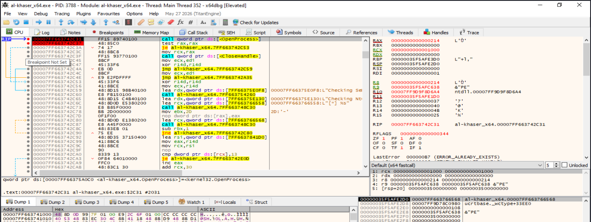

> **Figura 15.8.1.2. Preparación de la llamada a `OpenProcess`.** `al-khaser` establece `RCX=0x1000`, `RDX=0` y `R8=0x214` antes de ejecutar la API. El valor `0x214` corresponde al PID 532 de `csrss.exe`.

Los argumentos pueden interpretarse como:

| Registro | Valor | Interpretación |
|---|---:|---|
| `RCX` | `0x1000` | `PROCESS_QUERY_LIMITED_INFORMATION` |
| `RDX` | `0x0` | `bInheritHandle = FALSE` |
| `R8` | `0x214` | PID 532 de `csrss.exe` |

Por tanto, la llamada observada equivale conceptualmente a:

```cpp
OpenProcess(
    PROCESS_QUERY_LIMITED_INFORMATION,
    FALSE,
    532
);
```

La evidencia confirma que la comprobación no está operando sobre un proceso arbitrario: el PID utilizado corresponde directamente a `csrss.exe`.

---

#### Resultado de `OpenProcess`

Después de ejecutar la API, el segundo breakpoint detuvo el programa en:

```asm
test rax,rax
```

En ese momento el registro `RAX` contenía:

```text
RAX = 0000000000000000
```

y `x64dbg` mostraba:

```text
LastError = 00000005 (ERROR_ACCESS_DENIED)
```

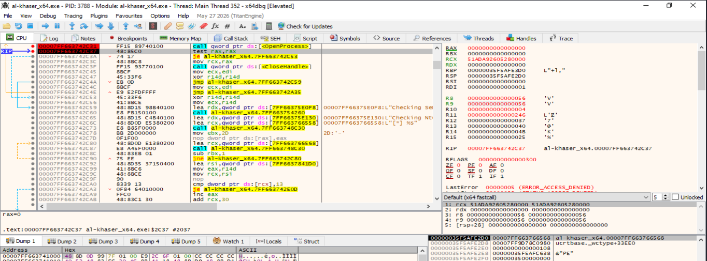

> **Figura 15.8.1.3. Resultado de `OpenProcess`.** La API devuelve `NULL` en `RAX`. El valor `LastError = 5 (ERROR_ACCESS_DENIED)` indica que el acceso solicitado a `csrss.exe` fue rechazado.

La secuencia observada es:

```text
OpenProcess(...)
        ↓
RAX = 0
        ↓
HANDLE no válido
        ↓
ERROR_ACCESS_DENIED
```

El valor de `RAX` es especialmente importante porque es utilizado inmediatamente por `al-khaser` para decidir qué rama debe ejecutar.

---

#### Evaluación del resultado mediante `test rax,rax`

La siguiente instrucción ejecutada es:

```asm
test rax,rax
```

Como `RAX` contiene cero, la operación establece:

```text
ZF = 1
```

A continuación se ejecuta:

```asm
je <rama_fallo>
```

En `x64dbg` se observa explícitamente:

```text
Jump is taken
```


> **Figura 15.8.1.4. Evaluación del resultado de `OpenProcess`.** La instrucción `test rax,rax` establece `ZF=1` porque `RAX=0`. Como consecuencia, el salto `je` se encuentra marcado como `Jump is taken`, por lo que `al-khaser` entra en la rama correspondiente al fallo de apertura.

La lógica puede representarse como:

```text
RAX = 0
        ↓
test rax,rax
        ↓
ZF = 1
        ↓
je
        ↓
salto tomado
```

Al tomarse esta rama, se omite la secuencia destinada a cerrar un `HANDLE` válido:

```asm
mov rcx,rax
call qword ptr ds:[<&CloseHandle>]
```

Esto es coherente con el resultado obtenido: al no existir un `HANDLE` válido, no hay ningún recurso que cerrar.

---

#### Resultado mostrado por `al-khaser`

Después de completar la comprobación, la consola de `al-khaser` muestra:

```text
Checking SeDebugPrivilege    [ GOOD ]
```

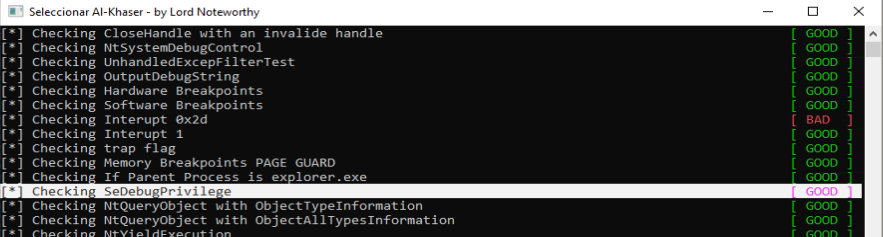

> **Figura 15.8.1.5. Resultado final de la comprobación.** `al-khaser` muestra `Checking SeDebugPrivilege [GOOD]`, resultado coherente con el fallo de `OpenProcess` y la ausencia del indicador que la herramienta considera sospechoso.

El significado de `[GOOD]` debe interpretarse correctamente. No indica que la técnica no se haya ejecutado. La comprobación se ha ejecutado completamente, pero no ha producido una detección positiva.

La secuencia completa observada fue:

```text
PID de csrss.exe = 532
        ↓
R8 = 0x214
RCX = 0x1000
RDX = 0
        ↓
OpenProcess
        ↓
RAX = 0
ERROR_ACCESS_DENIED
        ↓
test rax,rax
        ↓
ZF = 1
        ↓
JE tomado
        ↓
resultado negativo de la comprobación
        ↓
Checking SeDebugPrivilege [GOOD]
```

---

#### Interpretación de la técnica

La demostración permite confirmar que `al-khaser` utiliza una comprobación indirecta asociada a privilegios de depuración.

En lugar de consultar directamente si `SeDebugPrivilege` se encuentra presente o habilitado en el token del proceso, la herramienta utiliza el acceso a `csrss.exe` como sonda del contexto de seguridad.

Conceptualmente:

```text
¿Puede el proceso abrir csrss.exe?
        ↓
Sí ---------------------- No
↓                          ↓
HANDLE válido              NULL
↓                          ↓
Indicador sospechoso       Sin indicador
↓                          ↓
[BAD]                      [GOOD]
```

En la ejecución documentada, `OpenProcess` devolvió `NULL` y `ERROR_ACCESS_DENIED`. Por tanto, la condición considerada sospechosa por la herramienta no se cumplió.

Debe destacarse que el resultado depende de la versión concreta de `al-khaser`, de los permisos del proceso, de la versión de Windows y de los mecanismos de protección aplicados al proceso objetivo.

---

#### Evidencias demostradas

La práctica permite establecer experimentalmente que:

- `al-khaser` ejecuta una prueba etiquetada como `Checking SeDebugPrivilege`.
- La comprobación utiliza `csrss.exe` como proceso objetivo.
- El PID utilizado durante la ejecución fue `532`, equivalente a `0x214`.
- `R8` contiene el PID de `csrss.exe`.
- `RDX=0` indica `bInheritHandle = FALSE`.
- `RCX=0x1000` corresponde a `PROCESS_QUERY_LIMITED_INFORMATION`.
- `OpenProcess` devolvió `NULL`.
- `LastError` mostró `ERROR_ACCESS_DENIED`.
- El resultado fue evaluado mediante `test rax,rax`.
- La comparación estableció `ZF=1`.
- El salto condicional `je` fue tomado.
- La consola mostró finalmente `Checking SeDebugPrivilege [GOOD]`.

La evidencia más importante no es únicamente el mensaje final de la consola, sino la relación completa entre:

```text
proceso objetivo
        +
argumentos de OpenProcess
        +
valor de retorno
        +
comparación
        +
rama tomada
        +
resultado final
```

---

#### Limitaciones

La prueba presenta varias limitaciones:

- Se trata de una comprobación indirecta y no de una lectura directa de `SeDebugPrivilege`.
- Un fallo de `OpenProcess` no demuestra que `SeDebugPrivilege` esté ausente del token.
- Un resultado positivo tampoco identifica por sí mismo una sandbox o depurador concreto.
- El acceso a `csrss.exe` depende de la versión de Windows, del nivel de integridad, de los privilegios efectivos y de las protecciones del proceso.
- La implementación de `al-khaser` puede variar entre versiones.
- En la versión analizada se observó `PROCESS_QUERY_LIMITED_INFORMATION (0x1000)`; otras implementaciones pueden utilizar derechos diferentes.
- Un EDR, antivirus u otro mecanismo de seguridad puede modificar el resultado.
- La ejecución bajo un depurador puede alterar el contexto del proceso, por lo que el resultado debe interpretarse como una demostración del mecanismo y no como una medición universal del sistema.

Por estas razones, la comprobación debe considerarse una heurística y correlacionarse con otras técnicas anti-debug y anti-análisis.

---

#### Conclusión

La demostración dinámica confirma el mecanismo utilizado por `al-khaser` en la prueba denominada `Checking SeDebugPrivilege`.

Durante la ejecución, la herramienta identificó una instancia de `csrss.exe` con PID `532` y preparó una llamada a `OpenProcess` con:

```text
RCX = 0x1000
RDX = 0
R8  = 0x214
```

La API devolvió:

```text
RAX = 0
LastError = ERROR_ACCESS_DENIED
```

Posteriormente, `test rax,rax` estableció `ZF=1` y el salto `je` fue tomado. Finalmente, `al-khaser` mostró:

```text
Checking SeDebugPrivilege [GOOD]
```

Por tanto, la técnica se ejecutó correctamente, pero la condición de detección no resultó positiva en el entorno analizado.

La práctica demuestra que `al-khaser` puede utilizar el acceso efectivo a un proceso crítico como indicador indirecto del contexto de privilegios y que el resultado de esta comprobación condiciona el flujo interno de la herramienta. Al tratarse de una heurística dependiente del sistema y de la implementación, debe combinarse con otras evidencias antes de atribuir el resultado a la presencia o ausencia de un entorno de análisis.


### 15.8.2 Pila desbalanceada

#### Objetivo de la demostración

El objetivo de esta práctica es reproducir de forma controlada el principio de la sub­técnica **pila desbalanceada**, consistente en detectar que una función o capa intermedia utiliza una profundidad de pila superior a la esperada y termina alcanzando una región de memoria colocada deliberadamente por debajo del margen normal de uso.

Para esta demostración se utiliza la herramienta educativa [unbalanced_stack_lab.cpp](https://github.com/soniasalido/cybersecurity/blob/main/Documentation/Malware/Master-ENIIT-Analisis-Malware-Reversing/modulo-11-TFM/modulo-deteccion-entornos-virtuales/modulo-evasion/utiles/unbalanced_stack_lab.cpp), compilada como ejecutable **PE32/x86** y analizada con **x32dbg**.

La herramienta no instala hooks reales ni detecta una sandbox concreta. En su lugar, implementa dos escenarios comparables:

```text
baseline_target
    ↓
uso reducido de pila
    ↓
canario intacto
```

frente a:

```text
simulated_hook_target
    ↓
consumo adicional de pila
    ↓
la pila alcanza la región canario
    ↓
sobrescritura detectable
```

La finalidad es observar dinámicamente cómo una capa adicional de ejecución puede provocar un consumo de pila superior al esperado y cómo esa diferencia puede convertirse en una señal heurística de instrumentación.

---

#### Diseño del laboratorio

La función `probe_stack` prepara una zona de memoria bajo la pila con la siguiente geometría:

```text
Reserva total = 0x200 bytes

┌──────────────────────────────┐
│ Headroom = 0x180 bytes       │
│ margen considerado normal    │
├──────────────────────────────┤
│ Canary = 0x80 bytes          │
│ patrón 0xA5                  │
└──────────────────────────────┘
```

El canario contiene inicialmente:

```text
A5 A5 A5 A5 A5 A5 A5 A5 ...
```

La función normal reserva únicamente:

```asm
sub esp,20h
```

mientras que el hook simulado utiliza:

```asm
sub esp,1C0h
```

Por tanto:

```text
baseline_target:
0x20 = 32 bytes

simulated_hook_target:
0x1C0 = 448 bytes

headroom:
0x180 = 384 bytes
```

y se cumple:

```text
0x20  < 0x180
0x1C0 > 0x180
```

El segundo escenario está diseñado para penetrar en la región canario.

---

#### Herramientas utilizadas

La demostración se realizó con:

- `unbalanced_stack_lab.exe`.
- Windows 10.
- `x32dbg`.
- Ejecutable compilado para arquitectura x86.
- Opción `--baseline` para establecer una línea de referencia.
- Opción `--hooked` para ejecutar el hook simulado.

Los marcadores relevantes exportados por la herramienta son:

```text
marker_canary_ready
marker_after_target
baseline_target
simulated_hook_target
probe_stack
```

En los marcadores:

```text
[ESP+4] = dirección del canario
[ESP+8] = tamaño del canario
```

El tamaño utilizado durante la práctica fue:

```text
0x80 = 128 bytes
```

---

#### Ejecución de referencia: estado inicial del canario

La primera ejecución se realizó mediante:

```text
unbalanced_stack_lab.exe --baseline --iterations 1 --wait
```

Se colocaron breakpoints en:

```text
marker_canary_ready
baseline_target
marker_after_target
```

La primera interrupción se produjo en:

```text
marker_canary_ready
```

En ese momento se observó:

```text
[ESP+4] = 0x009FF85C
[ESP+8] = 0x00000080
```

La dirección `0x009FF85C` corresponde al comienzo de la región canario.

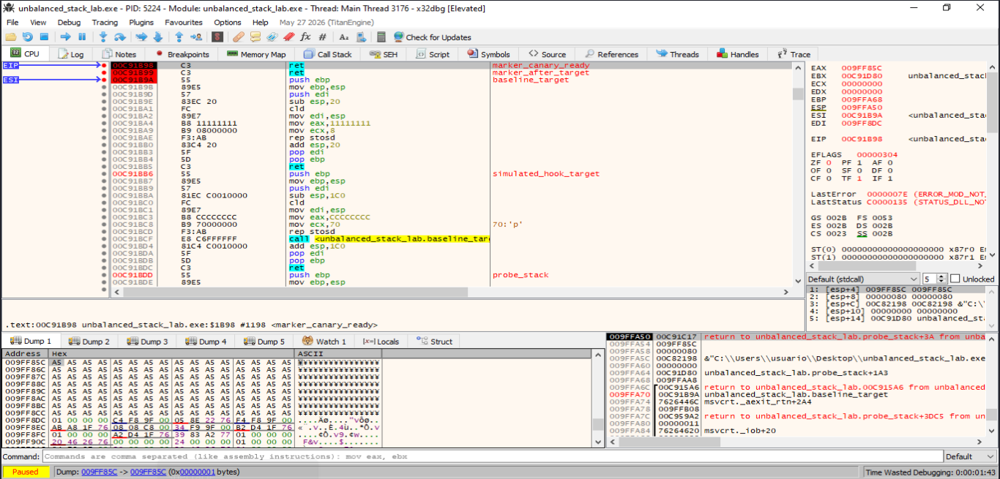

> **Figura 15.8.2.1. Estado inicial del canario en la ejecución de referencia.** La dirección almacenada en `[ESP+4]` apunta a `0x009FF85C`, mientras que `[ESP+8]` contiene `0x80`. El Dump muestra los 128 bytes inicializados con el patrón `0xA5`.

La región inicial puede representarse como:

```text
009FF85C
A5 A5 A5 A5 A5 A5 A5 A5
A5 A5 A5 A5 A5 A5 A5 A5
...
```

---

#### Consumo de pila de `baseline_target`

Al continuar la ejecución, x32dbg se detuvo en:

```text
baseline_target
```

El desensamblado muestra:

```asm
push ebp
mov  ebp,esp
push edi
sub  esp,20h
```

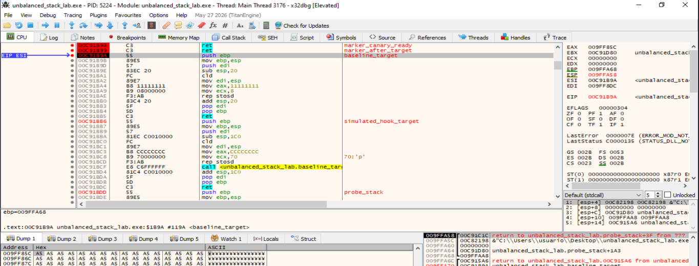

> **Figura 15.8.2.2. Ejecución de `baseline_target`.** La función realiza una reserva local explícita de `0x20` bytes mediante `sub esp,20h`, muy inferior al margen de `0x180` bytes establecido por la sonda.

La comparación es:

```text
Reserva local de baseline_target = 0x20
Headroom disponible              = 0x180
```

Por tanto:

```text
0x20 < 0x180
```

y la función normal no debería alcanzar la región canario.

---

#### Verificación del canario después de `baseline_target`

Después del retorno de la función normal, la ejecución alcanzó:

```text
marker_after_target
```

En ese punto:

```text
[ESP+4] = 0x009FF85C
[ESP+8] = 0x00000080
```

El Dump continúa mostrando:

```text
A5 A5 A5 A5 A5 A5 ...
```

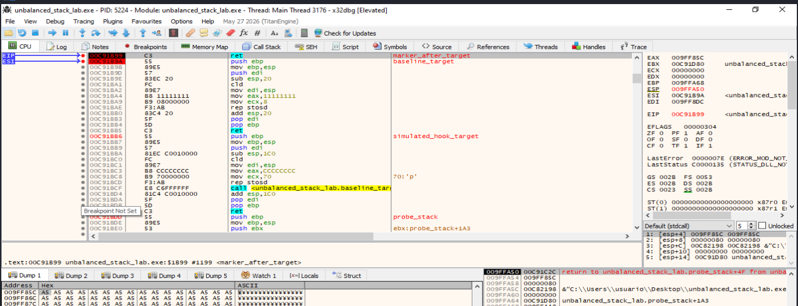

> **Figura 15.8.2.3. Estado del canario después de `baseline_target`.** La región situada en `0x009FF85C` mantiene los 128 bytes con valor `0xA5`, por lo que la ejecución de referencia no ha alcanzado el canario.

La línea base queda así:

```text
Canario inicial = A5 × 128
        ↓
baseline_target
        ↓
sub esp,0x20
        ↓
Canario final = A5 × 128
```

La consola confirma el resultado:

```text
[baseline] iteracion=0 bytes_modificados=0/128 -> canario intacto
```

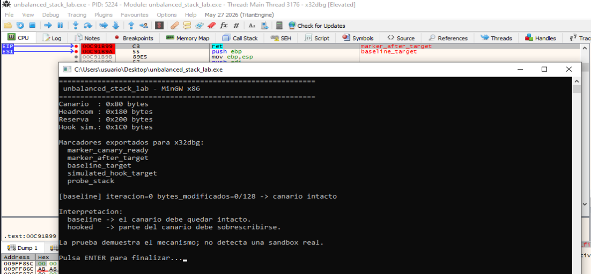

> **Figura 15.8.2.4. Resultado de la ejecución de referencia.** La herramienta informa de `0/128` bytes modificados, confirmando que el canario permanece intacto.

---

#### Ejecución del hook simulado: estado inicial

La segunda ejecución se realizó mediante:

```text
unbalanced_stack_lab.exe --hooked --iterations 1 --wait
```

Antes de ejecutar el hook simulado se volvió a detener el programa en:

```text
marker_canary_ready
```

En esta ejecución:

```text
[ESP+4] = 0x011FF5FC
[ESP+8] = 0x00000080
```

y la región vuelve a estar completamente inicializada con `0xA5`.

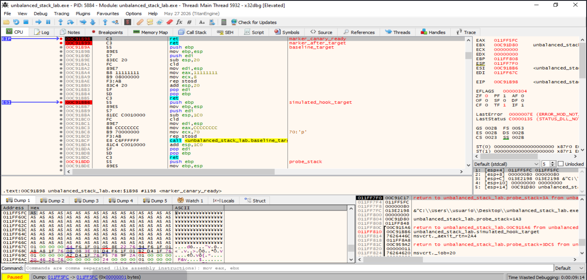

> **Figura 15.8.2.5. Estado inicial del canario en la ejecución hooked.** La segunda prueba comienza con un canario intacto de `0x80` bytes, garantizando que la sobrescritura observada posteriormente es consecuencia de la ejecución del hook simulado.

---

#### Entrada en `simulated_hook_target`

La siguiente interrupción se produjo en:

```text
simulated_hook_target
```

El código relevante es:

```asm
push ebp
mov  ebp,esp
push edi
sub  esp,1C0h
cld
mov  edi,esp
mov  eax,CCCCCCCCh
mov  ecx,70h
rep  stosd
call baseline_target
```

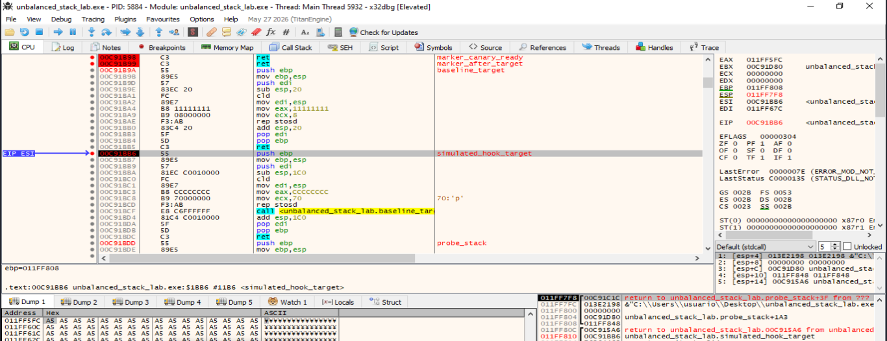

> **Figura 15.8.2.6. Entrada en `simulated_hook_target`.** La función reserva `0x1C0` bytes mediante `sub esp,1C0h`. Esta cantidad supera los `0x180` bytes de headroom definidos por la sonda.

La relación es:

```text
0x1C0 = 448 bytes
0x180 = 384 bytes
```

Por tanto:

```text
448 > 384
```

y la nueva profundidad de pila debe alcanzar la región canario.

---

#### Penetración de `ESP` en la región canario

Después de ejecutar:

```asm
sub esp,1C0h
```

x32dbg muestra:

```text
ESP = 0x011FF630
```

El canario comenzaba en:

```text
0x011FF5FC
```

y tenía un tamaño de:

```text
0x80 bytes
```

Por tanto, ocupa:

```text
inicio:      0x011FF5FC
último byte: 0x011FF67B
fin excl.:   0x011FF67C
```

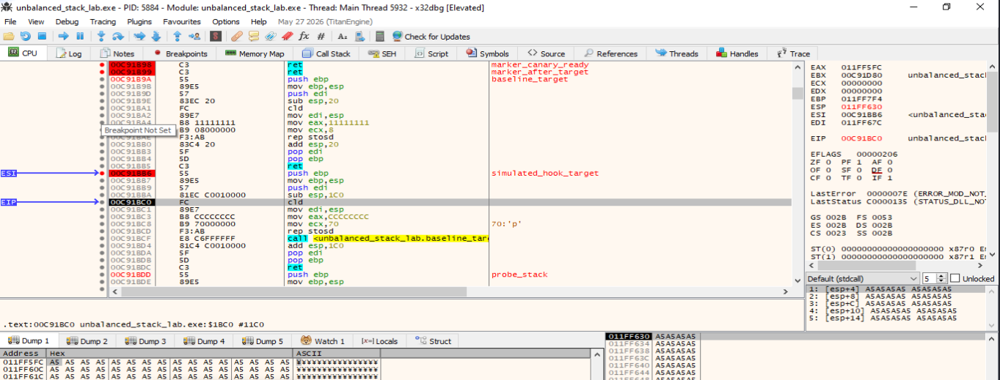

> **Figura 15.8.2.7. Penetración del frame adicional en la región canario.** Tras ejecutar `sub esp,1C0h`, `ESP` adopta el valor `0x011FF630`, que se encuentra dentro del intervalo ocupado por el canario.

El desplazamiento entre el inicio del canario y el nuevo `ESP` es:

```text
0x011FF630 - 0x011FF5FC = 0x34
```

Como el canario mide `0x80` bytes:

```text
0x80 - 0x34 = 0x4C
```

Esto significa que el nuevo frame se introduce:

```text
0x4C = 76 bytes
```

dentro de la región canario.

---

#### Preparación de la sobrescritura

Antes de ejecutar `rep stosd`, los registros muestran:

```text
EDI = 0x011FF630
EAX = 0xCCCCCCCC
ECX = 0x00000070
```

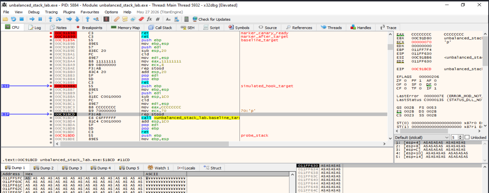

> **Figura 15.8.2.8. Preparación de la escritura del frame adicional.** `EDI` apunta a `0x011FF630`, `EAX` contiene `0xCCCCCCCC` y `ECX=0x70`. El canario todavía mantiene el patrón `0xA5` antes de ejecutar `rep stosd`.

La instrucción realizará:

```text
0x70 DWORD × 4 bytes = 0x1C0 bytes
```

rellenados con:

```text
CC CC CC CC ...
```

La escritura comenzará en:

```text
0x011FF630
```

dirección que se encuentra dentro del canario.

---

#### Sobrescritura parcial del canario

Después de ejecutar:

```asm
rep stosd
```

los registros muestran:

```text
EAX = 0xCCCCCCCC
ECX = 0
EDI = 0x011FF7F0
```

El valor final de `EDI` es coherente con:

```text
0x011FF630 + 0x1C0 = 0x011FF7F0
```

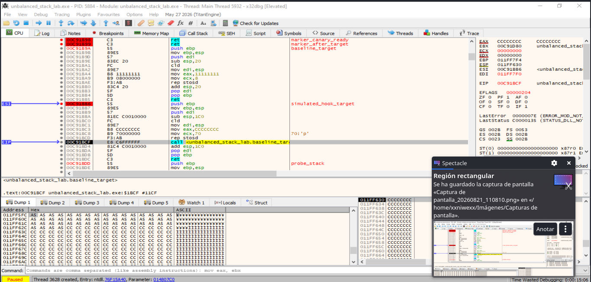

> **Figura 15.8.2.9. Sobrescritura parcial de la región canario.** Tras ejecutar `rep stosd`, la región continúa conteniendo `0xA5` hasta aproximadamente `0x011FF62F`, mientras que a partir de `0x011FF630` se observan bytes `0xCC`.

El resultado inmediato es:

```text
0x011FF5FC ─────────── 0x011FF62F
A5 A5 A5 A5 ...

0x011FF630 ─────────── 0x011FF67B
CC CC CC CC ...
```

Por tanto, la sobrescritura no se infiere únicamente a partir del cambio de `ESP`: se observa directamente en la memoria.

---

#### Estado final del canario

Después de ejecutar también `baseline_target` desde el interior del hook simulado, el programa alcanza de nuevo:

```text
marker_after_target
```

En ese punto:

```text
[ESP+4] = 0x011FF5FC
[ESP+8] = 0x00000080
```

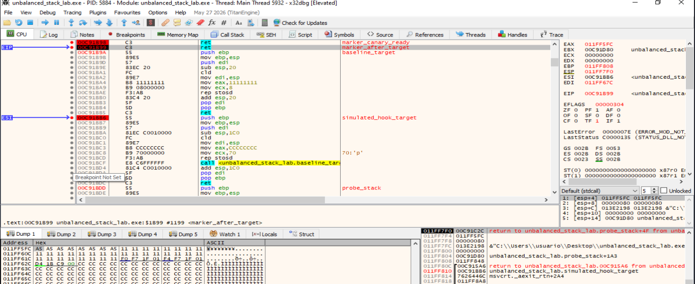

> **Figura 15.8.2.10. Estado final del canario.** La misma región que inicialmente contenía exclusivamente `0xA5` presenta ahora bytes `0x11`, valores pertenecientes al frame de pila, una dirección de retorno y el patrón `0xCC` escrito por `simulated_hook_target`.

La distribución observada puede interpretarse conceptualmente como:

```text
Canario original = 128 bytes

┌──────────────────────────────┐
│ 8 bytes  -> A5 intactos      │
├──────────────────────────────┤
│ 32 bytes -> 11               │
│ escritos por baseline_target │
├──────────────────────────────┤
│ valores del frame            │
│ registros / retorno          │
├──────────────────────────────┤
│ 76 bytes -> CC               │
│ simulated_hook_target        │
└──────────────────────────────┘
```

En el Dump también se observa una dirección de retorno compatible con la instrucción posterior a:

```asm
call baseline_target
```

lo que demuestra que la región canario ha dejado de ser una zona intacta y ha pasado a utilizarse como parte de la pila activa.

---

#### Resultado final de la herramienta

La consola muestra:

```text
[hooked] iteracion=0 bytes_modificados=120/128
-> sobrescritura compatible con consumo adicional de pila
```

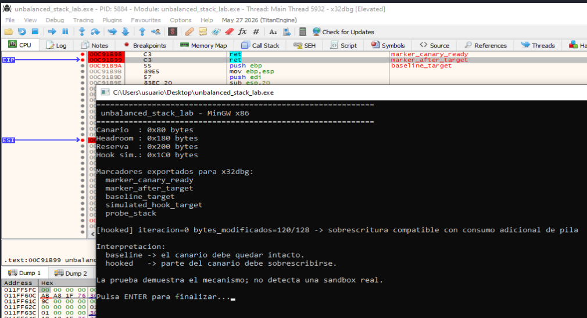

> **Figura 15.8.2.11. Resultado final de la ejecución hooked.** La herramienta informa de `120/128` bytes modificados, resultado coherente con la inspección manual realizada en x32dbg.

La correlación es:

```text
Canario total       = 128 bytes
Bytes intactos      =   8 bytes
Bytes modificados   = 120 bytes
```

Por tanto:

```text
128 - 8 = 120
```

La medición automática coincide con la inspección visual del Dump.

---

#### Comparación entre la ejecución normal y el hook simulado

La demostración puede resumirse como:

```text
BASELINE
========

Canario = A5 × 128
        ↓
baseline_target
        ↓
sub esp,0x20
        ↓
uso de pila dentro del margen
        ↓
canario intacto
        ↓
0/128 bytes modificados
```

frente a:

```text
HOOK SIMULADO
=============

Canario = A5 × 128
        ↓
simulated_hook_target
        ↓
sub esp,0x1C0
        ↓
ESP entra en la región canario
        ↓
rep stosd con 0xCCCCCCCC
        ↓
baseline_target utiliza todavía más pila
        ↓
canario modificado
        ↓
120/128 bytes modificados
```

La diferencia fundamental es:

```text
baseline_target       -> 0x20 bytes
simulated_hook_target -> 0x1C0 bytes
headroom              -> 0x180 bytes
```

de modo que:

```text
0x20  < 0x180  -> no se alcanza el canario
0x1C0 > 0x180  -> sí se alcanza el canario
```

---

#### Interpretación de la sub­técnica

La técnica de pila desbalanceada se basa en establecer una expectativa sobre el uso normal de pila y detectar desviaciones significativas.

Conceptualmente:

```text
Preparar zona canario
        ↓
Dejar margen de pila esperado
        ↓
Ejecutar función
        ↓
¿Canario intacto?
        ↓
Sí ---------------------- No
↓                          ↓
uso esperado               consumo adicional
↓                          ↓
sin indicador              posible instrumentación
```

Una capa intermedia, wrapper, hook o motor de instrumentación puede introducir frames adicionales, guardar más registros, crear estructuras locales o realizar llamadas auxiliares. Si ese consumo adicional supera el margen previsto, puede alcanzar una región preparada previamente como sonda.

La modificación del canario actúa entonces como un indicador heurístico.

---

#### Qué demuestra la práctica

La demostración permite confirmar experimentalmente que:

- Una función normal puede ejecutarse sin alcanzar una región situada por debajo del margen esperado.
- El canario inicial contiene `128` bytes de `0xA5`.
- `baseline_target` reserva explícitamente `0x20` bytes.
- La ejecución baseline finaliza con `0/128` bytes modificados.
- `simulated_hook_target` reserva `0x1C0` bytes.
- `0x1C0` supera el headroom de `0x180`.
- Tras la reserva, `ESP` se sitúa dentro del intervalo ocupado por el canario.
- La instrucción `rep stosd` escribe `0xCCCCCCCC` desde una dirección situada dentro del canario.
- La sobrescritura puede observarse directamente en el Dump de x32dbg.
- La ejecución posterior utiliza la región como parte de la pila activa.
- El resultado final es `120/128` bytes modificados.
- La medición de la herramienta coincide con la inspección manual.

---

#### Limitaciones

La práctica presenta varias limitaciones:

- El hook utilizado es simulado y se encuentra dentro del mismo ejecutable.
- No se instala ningún hook real sobre una API del sistema.
- No se detecta una sandbox, VM, EDR o motor de instrumentación concreto.
- El tamaño del frame de una función depende del compilador, arquitectura y opciones de optimización.
- Un hook real puede utilizar heap, TLS u otros mecanismos y no aumentar suficientemente la profundidad de pila.
- Software legítimo puede introducir frames adicionales.
- La ausencia de modificación del canario no demuestra que no exista instrumentación.
- La presencia de modificación tampoco identifica por sí sola la causa.
- La prueba está diseñada específicamente para x86 y se analiza con x32dbg.

Por estos motivos, la pila desbalanceada debe considerarse una técnica heurística y combinarse con otras evidencias anti-análisis.

---

#### Conclusión

La demostración dinámica permite reproducir de forma controlada el principio de la sub­técnica de pila desbalanceada.

Durante la ejecución de referencia, `baseline_target` realizó una reserva local de `0x20` bytes, inferior al headroom de `0x180`, y el canario permaneció completamente intacto:

```text
bytes_modificados=0/128
```

En la segunda ejecución, `simulated_hook_target` reservó:

```text
0x1C0 bytes
```

superando el margen establecido. Como consecuencia, `ESP` entró en la región canario y la posterior escritura mediante `rep stosd` comenzó en una dirección situada dentro de dicha zona.

La inspección con x32dbg mostró la sustitución de bytes `0xA5` por `0xCC` y por datos pertenecientes a frames posteriores. Finalmente, la herramienta informó:

```text
bytes_modificados=120/128
```

El resultado coincide con la inspección manual y demuestra que un consumo de pila superior al esperado puede detectarse mediante una región canario colocada deliberadamente por debajo del margen normal.

La práctica demuestra el **mecanismo de detección**, pero no constituye una detección directa de una sandbox real. Su valor reside en visualizar de forma reproducible cómo una capa adicional de instrumentación puede modificar la geometría esperada de la pila y cómo esa anomalía puede emplearse como indicador dentro de una estrategia anti-análisis.


----

### 15.8.3. Detección de Wine mediante exportaciones

#### Objetivo de la demostración

El objetivo de esta práctica es observar dinámicamente cómo `al-khaser` intenta detectar la ejecución bajo Wine mediante la búsqueda de una exportación específica en `kernel32.dll`.

La comprobación analizada utiliza la cadena:

```text
wine_get_unix_file_name
```

y realiza conceptualmente la siguiente secuencia:

```text
GetModuleHandleW(L"kernel32.dll")
        ↓
obtener HMODULE de kernel32.dll
        ↓
GetProcAddress(
    hKernel32,
    "wine_get_unix_file_name"
)
        ↓
comprobar el valor devuelto
        ↓
exportación encontrada / no encontrada
        ↓
Wine detectado / no detectado
```

La finalidad de la demostración no es ejecutar Wine, sino mostrar cómo `al-khaser` implementa la comprobación y cómo se comporta en un sistema Windows nativo, donde la exportación no está presente.

---

#### Herramientas y entorno utilizados

La demostración se realizó con:

- `al-khaser_x64.exe`.
- Windows 10 x64.
- `x64dbg` ejecutado con privilegios elevados.
- Categoría específica de detección de Wine.

La ejecución se realizó mediante:

```text
al-khaser_x64.exe --check WINE
```

La función se localizó a partir de la referencia a la cadena:

```text
wine_get_unix_file_name
```

En el desensamblado se identificó la secuencia:

```asm
lea  rcx,[... "kernel32.dll"]
call qword ptr ds:[<&GetModuleHandleW>]
test rax,rax
...
lea  rdx,[... "wine_get_unix_file_name"]
mov  rcx,rax
call qword ptr ds:[<&GetProcAddress>]
test rax,rax
mov  ecx,r12d
setne cl
```

Los breakpoints utilizados para documentar la práctica fueron:

```text
00007FF66374796A   call GetModuleHandleW
00007FF663747970   test rax,rax
00007FF663747990   call GetProcAddress
00007FF663747996   test rax,rax
```

Las direcciones corresponden a la ejecución concreta analizada y pueden variar entre ejecuciones o compilaciones debido a ASLR.

---

#### Obtención de `kernel32.dll`

La primera parte de la comprobación consiste en obtener un handle del módulo `kernel32.dll`.

Antes de ejecutar:

```asm
call qword ptr ds:[<&GetModuleHandleW>]
```

x64dbg muestra:

```text
RCX = 00007FF663761058
```

y el contenido apuntado por `RCX` corresponde a:

```text
L"kernel32.dll"
```

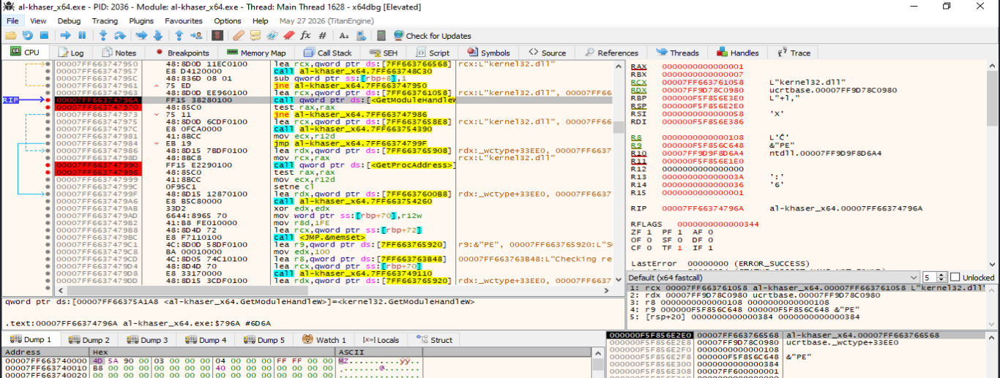

> **Figura 15.8.3.1. Preparación de la llamada a `GetModuleHandleW`.** El registro `RCX`, primer argumento según la convención de llamada de Windows x64, apunta a la cadena Unicode `L"kernel32.dll"`.

La llamada observada equivale conceptualmente a:

```cpp
GetModuleHandleW(L"kernel32.dll");
```

---

#### Resultado de `GetModuleHandleW`

Después de ejecutar la API, el programa se detuvo en:

```asm
test rax,rax
```

El registro `RAX` contenía:

```text
RAX = 00007FF9D9050000
```

x64dbg identifica esa dirección como perteneciente a:

```text
kernel32.dll
```

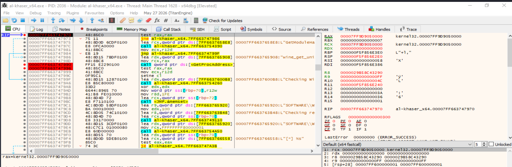

> **Figura 15.8.3.2. Resultado de `GetModuleHandleW`.** La API devuelve un `HMODULE` válido en `RAX`, correspondiente a la base cargada de `kernel32.dll`.

La primera parte de la comprobación queda:

```text
RCX -> L"kernel32.dll"
        ↓
GetModuleHandleW
        ↓
RAX = HMODULE válido
```

El valor retornado se reutiliza posteriormente como primer argumento de `GetProcAddress`.

---

#### Búsqueda de la exportación específica de Wine

La parte central de la técnica se encuentra en:

```asm
lea rdx,[... "wine_get_unix_file_name"]
mov rcx,rax
call qword ptr ds:[<&GetProcAddress>]
```

Justo antes de ejecutar `GetProcAddress`, los registros contienen:

```text
RCX = 00007FF9D9050000
RDX = 00007FF663765908
```

x64dbg interpreta:

```text
RCX -> kernel32.dll
RDX -> "wine_get_unix_file_name"
```

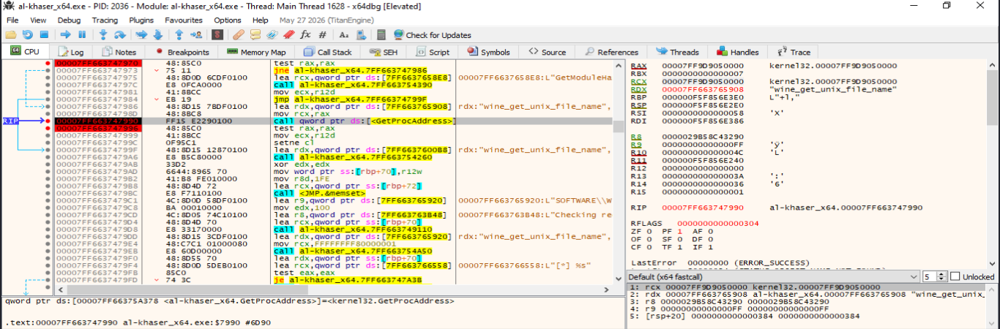

> **Figura 15.8.3.3. Búsqueda de una exportación característica de Wine.** Antes de ejecutar `GetProcAddress`, `RCX` contiene el `HMODULE` de `kernel32.dll` y `RDX` apunta a la cadena ASCII `"wine_get_unix_file_name"`.

Según la convención de llamada de Windows x64:

```text
RCX = hModule
RDX = lpProcName
```

por lo que la llamada observada puede representarse como:

```cpp
GetProcAddress(
    hKernel32,
    "wine_get_unix_file_name"
);
```

Esta es la evidencia principal de la sub­técnica: la herramienta no busca un artefacto genérico, sino una exportación concreta asociada al entorno Wine.

---

#### Resultado de `GetProcAddress`

Después de ejecutar `GetProcAddress`, el programa se detuvo en:

```asm
test rax,rax
```

El valor devuelto fue:

```text
RAX = 0000000000000000
```

y x64dbg mostró:

```text
LastError = 0000007F (ERROR_PROC_NOT_FOUND)
```

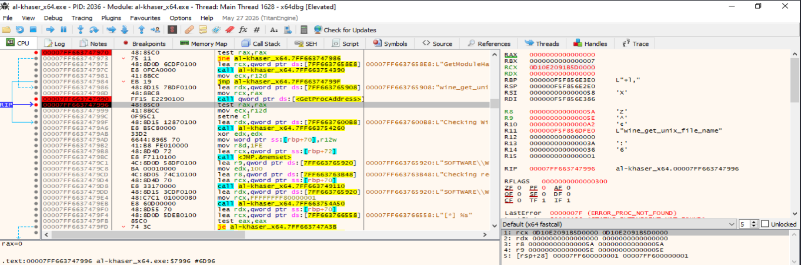

> **Figura 15.8.3.4. Resultado de la búsqueda de `wine_get_unix_file_name`.** `GetProcAddress` devuelve `NULL` en `RAX`. El valor `ERROR_PROC_NOT_FOUND` indica que la exportación solicitada no fue localizada en `kernel32.dll`.

La secuencia observada es:

```text
GetProcAddress(
    kernel32.dll,
    "wine_get_unix_file_name"
)
        ↓
RAX = NULL
        ↓
ERROR_PROC_NOT_FOUND
        ↓
exportación ausente
```

En el sistema Windows utilizado para la práctica, la exportación característica de Wine no está presente.

---

#### Conversión del resultado en un valor booleano

El resultado de `GetProcAddress` se evalúa mediante:

```asm
test rax,rax
```

Como:

```text
RAX = 0
```

la instrucción establece:

```text
ZF = 1
```

A continuación, el código ejecuta:

```asm
mov   ecx,r12d
setne cl
```

En la ejecución analizada:

```text
R12D = 0
```

por lo que después de:

```asm
mov ecx,r12d
```

se obtiene:

```text
ECX = 0
```

La instrucción:

```asm
setne cl
```

solo establece `CL=1` cuando `ZF=0`. Como en este caso `ZF=1`, el resultado permanece en cero.

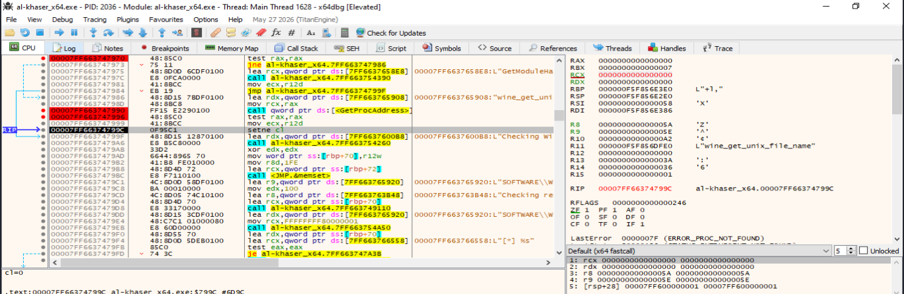

> **Figura 15.8.3.5. Conversión del resultado de `GetProcAddress` en un valor booleano.** Tras devolver `NULL`, `test rax,rax` establece `ZF=1`. La instrucción `setne cl` genera un resultado booleano cero, indicando que la exportación no ha sido encontrada.

La lógica puede resumirse como:

```text
RAX = 0
   ↓
test rax,rax
   ↓
ZF = 1
   ↓
setne cl
   ↓
CL = 0
   ↓
resultado FALSE
```

Conceptualmente:

```text
wine_get_unix_file_name ausente
        ↓
Wine no detectado
```

---

#### Resultado mostrado por `al-khaser`

Después de finalizar la comprobación, la consola muestra:

```text
[Wine Detection]

Checking Wine via dll exports    [GOOD]
```

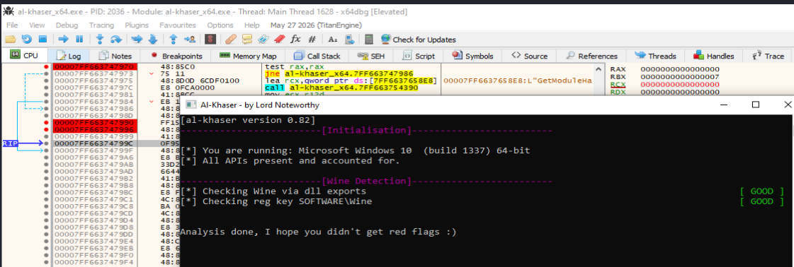

> **Figura 15.8.3.6. Resultado final de la detección mediante exportaciones.** `al-khaser` muestra `Checking Wine via dll exports [GOOD]`, resultado coherente con la ausencia de la exportación `"wine_get_unix_file_name"` en el sistema Windows analizado.

El indicador `[GOOD]` no significa que la técnica no se haya ejecutado. La comprobación se ha ejecutado completamente, pero no ha encontrado el artefacto considerado característico de Wine.

La secuencia completa observada fue:

```text
GetModuleHandleW(L"kernel32.dll")
        ↓
RAX = HMODULE válido
        ↓
RCX = HMODULE
RDX -> "wine_get_unix_file_name"
        ↓
GetProcAddress
        ↓
RAX = NULL
ERROR_PROC_NOT_FOUND
        ↓
test rax,rax
        ↓
ZF = 1
        ↓
setne cl
        ↓
CL = 0
        ↓
Wine no detectado
        ↓
Checking Wine via dll exports [GOOD]
```

---

#### Interpretación de la sub­técnica

La detección de Wine mediante exportaciones se basa en comprobar si determinados módulos del sistema exponen funciones que no forman parte de una instalación Windows nativa pero sí pueden existir en Wine.

La lógica es:

```text
Obtener kernel32.dll
        ↓
Buscar exportación específica
        ↓
¿GetProcAddress devuelve una dirección válida?
        ↓
Sí ---------------------- No
↓                          ↓
exportación presente       exportación ausente
↓                          ↓
posible Wine               Windows nativo
```

En la ejecución analizada:

```text
GetProcAddress = NULL
```

por lo que la condición de detección no se cumple.

---

#### Evidencias demostradas

La práctica permite confirmar experimentalmente que:

- `al-khaser` obtiene el módulo `kernel32.dll`.
- `RCX` apunta a `L"kernel32.dll"` antes de `GetModuleHandleW`.
- `GetModuleHandleW` devuelve un `HMODULE` válido.
- El handle obtenido se reutiliza como primer argumento de `GetProcAddress`.
- `RDX` apunta exactamente a `"wine_get_unix_file_name"`.
- `GetProcAddress` devuelve `NULL`.
- `LastError` muestra `ERROR_PROC_NOT_FOUND`.
- `test rax,rax` establece `ZF=1`.
- La instrucción `setne cl` produce un resultado booleano cero.
- `al-khaser` muestra finalmente `Checking Wine via dll exports [GOOD]`.

La evidencia esencial puede resumirse como:

```text
kernel32.dll
        +
"wine_get_unix_file_name"
        ↓
GetProcAddress
        ↓
NULL
        ↓
exportación no encontrada
        ↓
Wine no detectado
```

---

#### Limitaciones

La comprobación presenta varias limitaciones:

- La ausencia de la exportación no demuestra por sí sola que el sistema sea una instalación Windows nativa.
- Una implementación de Wine puede cambiar, eliminar, ocultar o modificar determinadas exportaciones.
- Una capa de compatibilidad podría interceptar `GetProcAddress` y alterar el resultado.
- La presencia de una exportación concreta constituye un indicador, no una prueba absoluta de ejecución bajo Wine.
- La implementación puede variar entre versiones de `al-khaser`.
- El comportamiento depende de las características de la versión de Wine analizada.
- La técnica debe correlacionarse con otras comprobaciones, como claves de registro, DLL específicas u otros artefactos del entorno.

Por tanto, se trata de una técnica heurística de detección y no de una identificación infalible del entorno.

---

#### Conclusión

La demostración dinámica confirma el mecanismo utilizado por `al-khaser` para detectar Wine mediante exportaciones.

La herramienta obtiene primero el módulo:

```text
kernel32.dll
```

mediante `GetModuleHandleW`. Posteriormente ejecuta:

```text
GetProcAddress(
    hKernel32,
    "wine_get_unix_file_name"
)
```

En el Windows 10 utilizado durante la práctica, la función devuelve:

```text
RAX = 0
```

y x64dbg informa:

```text
ERROR_PROC_NOT_FOUND
```

El resultado se evalúa mediante:

```asm
test rax,rax
mov  ecx,r12d
setne cl
```

produciendo finalmente un valor booleano falso.

La consola confirma este comportamiento con:

```text
Checking Wine via dll exports [GOOD]
```

Por tanto, la exportación característica no fue localizada y Wine no fue detectado.

La práctica demuestra de forma directa cómo una herramienta anti-análisis puede utilizar la presencia de exportaciones específicas como indicador del entorno de ejecución. Aunque la técnica es sencilla y de bajo coste, su fiabilidad depende de la implementación concreta de Wine y debe combinarse con otras evidencias antes de atribuir el resultado a un entorno determinado.


--------

