- [7. La técnica CPU](#7-la-técnica-cpu)
  - [7.1. Descripción de la técnica CPU](#71-descripción-de-la-técnica-cpu)
    - [Consulta del identificador del hipervisor](#consulta-del-identificador-del-hipervisor)
    - [Comprobación del bit de hipervisor](#comprobación-del-bit-de-hipervisor)
    - [Localización de las tablas internas del procesador](#localización-de-las-tablas-internas-del-procesador)
    - [Diferencias en la ejecución de instrucciones](#diferencias-en-la-ejecución-de-instrucciones)
    - [Instrucciones ilegales y gestión de excepciones](#instrucciones-ilegales-y-gestión-de-excepciones)
    - [Puerto backdoor de VMware](#puerto-backdoor-de-vmware)
    - [Detección durante el análisis](#detección-durante-el-análisis)
    - [Limitaciones](#limitaciones)
  - [7.2. Categoría y clasificación](#72-categoría-y-clasificación)
    - [Clasificación según el mecanismo de detección](#clasificación-según-el-mecanismo-de-detección)
      - [Detección directa](#detección-directa)
      - [Detección estructural](#detección-estructural)
      - [Detección diferencial](#detección-diferencial)
    - [Clasificación según el objetivo](#clasificación-según-el-objetivo)
    - [Clasificación según el tipo de evidencia](#clasificación-según-el-tipo-de-evidencia)
    - [Relación con otras familias de evasión](#relación-con-otras-familias-de-evasión)
    - [Prioridad para el TFM](#prioridad-para-el-tfm)
  - [7.3. Técnicas de detección basadas en CPU](#73-técnicas-de-detección-basadas-en-cpu)
    - [7.3.1. Técnica 1: Comprobar el identificador del hipervisor mediante `CPUID`](#731-técnica-1-comprobar-el-identificador-del-hipervisor-mediante-cpuid)
      - [A) Fundamento de la técnica](#a-fundamento-de-la-técnica)
      - [B) Registros utilizados](#b-registros-utilizados)
      - [C) Identificadores de hipervisores](#c-identificadores-de-hipervisores)
      - [D) Evidencias en análisis estático](#d-evidencias-en-análisis-estático)
      - [E) Evidencias en análisis dinámico](#e-evidencias-en-análisis-dinámico)
      - [F) Recomendación de firma](#f-recomendación-de-firma)
    - [7.3.2. Técnica 2: Comprobar el bit de hipervisor mediante `CPUID`](#732-técnica-2-comprobar-el-bit-de-hipervisor-mediante-cpuid)
      - [Fundamento](#fundamento)
      - [Flujo de la técnica](#flujo-de-la-técnica)
      - [Ejemplo conceptual](#ejemplo-conceptual)
      - [Evidencias en análisis estático](#evidencias-en-análisis-estático)
      - [Evidencias en análisis dinámico](#evidencias-en-análisis-dinámico)
      - [Criterio de interpretación](#criterio-de-interpretación)
      - [Recomendación de firma](#recomendación-de-firma)
      - [Limitaciones y falsos positivos](#limitaciones-y-falsos-positivos)
    - [7.3.3. Técnica 3: Comprobar la ubicación de `IDT`, `GDT` y `LDT`](#733-técnica-3-comprobar-la-ubicación-de-idt-gdt-y-ldt)
      - [Fundamento](#fundamento-1)
      - [Flujo de la técnica](#flujo-de-la-técnica-1)
      - [Ejemplo conceptual](#ejemplo-conceptual-1)
      - [Evidencias en análisis estático](#evidencias-en-análisis-estático-1)
      - [Evidencias en análisis dinámico](#evidencias-en-análisis-dinámico-1)
      - [Criterio de interpretación](#criterio-de-interpretación-1)
      - [Recomendación de firma](#recomendación-de-firma-1)
      - [Limitaciones](#limitaciones-1)
    - [7.3.4. Técnica 4: Utilizar instrucciones exóticas contra emuladores](#734-técnica-4-utilizar-instrucciones-exóticas-contra-emuladores)
      - [Fundamento](#fundamento-2)
      - [Flujo de la técnica](#flujo-de-la-técnica-2)
      - [Posibles usos](#posibles-usos)
      - [Evidencias en análisis estático](#evidencias-en-análisis-estático-2)
      - [Evidencias en análisis dinámico](#evidencias-en-análisis-dinámico-2)
      - [Criterio de interpretación](#criterio-de-interpretación-2)
      - [Recomendación de firma](#recomendación-de-firma-2)
      - [Limitaciones](#limitaciones-2)
    - [7.3.5. Técnica 5: Detectar Virtual PC mediante instrucciones ilegales](#735-técnica-5-detectar-virtual-pc-mediante-instrucciones-ilegales)
      - [Fundamento](#fundamento-3)
      - [Variante 1: Generación de `#UD`](#variante-1-generación-de-ud)
      - [Variante 2: Instrucción privilegiada `STI`](#variante-2-instrucción-privilegiada-sti)
      - [Variante 3: Secuencia de reinicio](#variante-3-secuencia-de-reinicio)
      - [Evidencias en análisis estático](#evidencias-en-análisis-estático-3)
      - [Evidencias en análisis dinámico](#evidencias-en-análisis-dinámico-3)
      - [Criterio de interpretación](#criterio-de-interpretación-3)
      - [Recomendación de firma](#recomendación-de-firma-3)
      - [Limitaciones](#limitaciones-3)
    - [7.3.6. Técnica 6: Detectar VMware mediante la instrucción `IN`](#736-técnica-6-detectar-vmware-mediante-la-instrucción-in)
      - [Fundamento](#fundamento-4)
      - [Flujo de la técnica](#flujo-de-la-técnica-3)
      - [Ejemplo conceptual](#ejemplo-conceptual-2)
      - [Enumeración de puertos y comandos](#enumeración-de-puertos-y-comandos)
      - [Evidencias en análisis estático](#evidencias-en-análisis-estático-4)
      - [Evidencias en análisis dinámico](#evidencias-en-análisis-dinámico-4)
      - [Criterio de interpretación](#criterio-de-interpretación-4)
      - [Recomendación de firma](#recomendación-de-firma-4)
      - [Limitaciones](#limitaciones-4)
    - [Resumen comparativo de las seis técnicas](#resumen-comparativo-de-las-seis-técnicas)
    - [Criterio general para el análisis](#criterio-general-para-el-análisis)
  - [7.4. Resumen visual de las técnicas CPU](#74-resumen-visual-de-las-técnicas-cpu)
    - [7.4.1. Instrucciones y elementos comprobados](#741-instrucciones-y-elementos-comprobados)
    - [7.4.2. Indicadores de virtualización](#742-indicadores-de-virtualización)
    - [7.4.3. Detección durante el análisis estático](#743-detección-durante-el-análisis-estático)
    - [7.4.4. Criterio de interpretación estática](#744-criterio-de-interpretación-estática)
    - [7.4.5. Detección durante el análisis dinámico](#745-detección-durante-el-análisis-dinámico)
    - [7.4.6. Criterio de interpretación dinámica](#746-criterio-de-interpretación-dinámica)
    - [7.4.7. Resumen de herramientas útiles](#747-resumen-de-herramientas-útiles)
  - [7.5. Contramedidas ofensivas](#75-contramedidas-ofensivas)
  - [7.6. Contramedidas defensivas](#76-contramedidas-defensivas)
    - [7.6.1. Ocultación del identificador del hipervisor](#761-ocultación-del-identificador-del-hipervisor)
    - [7.6.2. Modificación del resultado de `CPUID`](#762-modificación-del-resultado-de-cpuid)
    - [7.6.3. Ocultación del bit de hipervisor](#763-ocultación-del-bit-de-hipervisor)
    - [7.6.4. Normalización de las tablas de descriptores](#764-normalización-de-las-tablas-de-descriptores)
    - [7.6.5. Emulación correcta de instrucciones poco comunes](#765-emulación-correcta-de-instrucciones-poco-comunes)
    - [7.6.6. Interceptación del puerto backdoor de VMware](#766-interceptación-del-puerto-backdoor-de-vmware)
    - [7.6.7. Correlación con otros indicadores anti-VM](#767-correlación-con-otros-indicadores-anti-vm)
  - [7.7. Análisis dinámico de las técnicas CPU](#77-análisis-dinámico-de-las-técnicas-cpu)
    - [7.7.1. Técnica 1: Identificador del hipervisor mediante `CPUID`](#771-técnica-1-identificador-del-hipervisor-mediante-cpuid)
      - [Objetivo de la demostración](#objetivo-de-la-demostración)
      - [1. Localización de la comprobación CPU](#1-localización-de-la-comprobación-cpu)
      - [2. Ejecución de `CPUID`](#2-ejecución-de-cpuid)
      - [3. Almacenamiento de los resultados](#3-almacenamiento-de-los-resultados)
      - [4. Reconstrucción del identificador](#4-reconstrucción-del-identificador)
      - [5. Localización de la firma interna](#5-localización-de-la-firma-interna)
      - [6. Comparación con las firmas conocidas](#6-comparación-con-las-firmas-conocidas)
      - [7. Resultado y rama de detección positiva](#7-resultado-y-rama-de-detección-positiva)
      - [8. Resumen de puntos de ruptura](#8-resumen-de-puntos-de-ruptura)
      - [9. Interpretación de los resultados](#9-interpretación-de-los-resultados)
      - [10. Conclusión de la demostración](#10-conclusión-de-la-demostración)
    - [7.7.2. Técnica 2: Bit de presencia de hipervisor](#772-técnica-2-bit-de-presencia-de-hipervisor)
      - [Objetivo de la demostración](#objetivo-de-la-demostración-1)
      - [1. Localización de la instrucción `CPUID`](#1-localización-de-la-instrucción-cpuid)
      - [2. Estado previo a la consulta](#2-estado-previo-a-la-consulta)
      - [3. Resultado devuelto en `ECX`](#3-resultado-devuelto-en-ecx)
      - [4. Verificación mediante expresiones de seguimiento](#4-verificación-mediante-expresiones-de-seguimiento)
      - [5. Extracción del bit por parte de Pafish](#5-extracción-del-bit-por-parte-de-pafish)
      - [6. Puntos de ruptura utilizados](#6-puntos-de-ruptura-utilizados)
      - [7. Interpretación técnica](#7-interpretación-técnica)
      - [8. Conclusión de la demostración](#8-conclusión-de-la-demostración)
    - [7.7.3. Técnica 3: Tablas `IDT`, `GDT` y `LDT`](#773-técnica-3-tablas-idt-gdt-y-ldt)
      - [Objetivo y alcance de la demostración](#objetivo-y-alcance-de-la-demostración)
      - [1. Localización de las comprobaciones](#1-localización-de-las-comprobaciones)
      - [2. Demostración de la Interrupt Descriptor Table](#2-demostración-de-la-interrupt-descriptor-table)
        - [2.1. Ejecución de `SIDT`](#21-ejecución-de-sidt)
        - [2.2. Descriptor obtenido](#22-descriptor-obtenido)
        - [2.3. Aplicación del patrón anti-VM](#23-aplicación-del-patrón-anti-vm)
        - [2.4. Resultado de IDT](#24-resultado-de-idt)
      - [3. Demostración de la Local Descriptor Table](#3-demostración-de-la-local-descriptor-table)
        - [3.1. Inicialización del valor centinela](#31-inicialización-del-valor-centinela)
        - [3.2. Ejecución de `SLDT`](#32-ejecución-de-sldt)
        - [3.3. Comparación del centinela](#33-comparación-del-centinela)
        - [3.4. Resultado de LDT](#34-resultado-de-ldt)
      - [4. Comprobación de la GDT mediante `SGDT`](#4-comprobación-de-la-gdt-mediante-sgdt)
        - [Objetivo de la demostración](#objetivo-de-la-demostración-2)
        - [Instrucción `SGDT` y buffer de destino](#instrucción-sgdt-y-buffer-de-destino)
        - [Descriptor de la GDT escrito en memoria](#descriptor-de-la-gdt-escrito-en-memoria)
        - [Carga de la base en `EAX`](#carga-de-la-base-en-eax)
        - [Aplicación de la máscara anti-VM](#aplicación-de-la-máscara-anti-vm)
        - [Comparación y resultado booleano](#comparación-y-resultado-booleano)
        - [Interpretación de la comprobación](#interpretación-de-la-comprobación)
        - [Conclusión](#conclusión)
      - [5. Puntos de ruptura utilizados](#5-puntos-de-ruptura-utilizados)
        - [IDT](#idt)
        - [LDT](#ldt)
        - [GDT](#gdt)
    - [6. Conclusión](#6-conclusión)
  - [xxxxxxxxxxxxxxx](#xxxxxxxxxxxxxxx)
    - [7.7.4. Técnica 4: Instrucciones poco comunes](#774-técnica-4-instrucciones-poco-comunes)
    - [7.7.7. Técnica 5: Instrucciones ilegales o privilegiadas](#777-técnica-5-instrucciones-ilegales-o-privilegiadas)
    - [7.7.8. Técnica 6: Puerto backdoor de VMware](#778-técnica-6-puerto-backdoor-de-vmware)
    - [7.7.9. Comparación de resultados entre entornos](#779-comparación-de-resultados-entre-entornos)
  - [7.9. Conclusiones](#79-conclusiones)


# 7. La técnica CPU

Las técnicas basadas en CPU permiten detectar entornos virtualizados mediante instrucciones del procesador, registros internos y diferencias de comportamiento entre una máquina física, un hipervisor y un emulador.

| Campo | Clasificación |
|---|---|
| Categoría | Evasión / Anti-análisis |
| Subcategoría | Anti-VM / Anti-sandbox / Anti-emulación |
| Fuente de información | Procesador, registros, tablas de descriptores y puertos de entrada/salida |
| Técnicas principales | `CPUID`, `SIDT`, `SGDT`, `SLDT`, instrucciones poco comunes, instrucciones ilegales e instrucción `IN` |
| Entornos identificables | VMware, VirtualBox, Hyper-V, KVM, Xen, Parallels, Virtual PC y bhyve |
| Sistema y arquitectura principal | Plataformas x86 y x86-64 |
| Prioridad para el TFM | Alta |

## 7.1. Descripción de la técnica CPU

La técnica **CPU** agrupa mecanismos de evasión que utilizan directamente instrucciones del procesador para determinar si un programa se ejecuta sobre hardware físico o dentro de una máquina virtual, una sandbox o un emulador. Su principio general consiste en **consultar información expuesta por la CPU o en ejecutar secuencias de instrucciones** cuyo resultado puede variar según el entorno de ejecución.

A diferencia de técnicas como `filesystem`, `registry` o `processes`, esta categoría no necesita buscar necesariamente archivos, claves del Registro, servicios o procesos asociados a un producto de virtualización. La detección puede realizarse mediante **instrucciones de bajo nivel y valores devueltos directamente en los registros del procesador.**

**El flujo general puede representarse de la siguiente forma:**
```text
Ejecución de una instrucción de CPU
        ↓
Obtención de registros, direcciones o excepciones
        ↓
Comparación con un valor esperado
        ↓
Identificación de una anomalía o firma de hipervisor
        ↓
Decisión sobre el entorno
        ↓
Modificación del comportamiento de la muestra
```

**Una muestra puede aplicar esta técnica para responder a preguntas como:**
```text
¿La CPU informa de la presencia de un hipervisor?
¿Existe una cadena que identifica a VMware, VirtualBox, KVM o Hyper-V?
¿Las tablas internas del procesador se encuentran en direcciones sospechosas?
¿Una instrucción poco habitual se ejecuta correctamente?
¿Una instrucción ilegal genera la excepción esperada?
¿Está disponible el puerto de comunicación interno de VMware?
```

**Entre las instrucciones y elementos más relevantes se encuentran:**
| Elemento | Finalidad anti-análisis |
|---|---|
| `CPUID` | Obtener información del procesador y firmas asociadas a hipervisores |
| `EAX = 0x40000000` | Solicitar la hoja utilizada habitualmente para identificar al hipervisor |
| `EBX`, `ECX`, `EDX` | Recuperar las partes de la cadena identificativa del hipervisor |
| Bit 31 de `ECX` con `CPUID(EAX=1)` | Comprobar si el sistema declara que se ejecuta bajo un hipervisor |
| `SIDT` | Obtener la dirección de la Interrupt Descriptor Table |
| `SGDT` | Obtener la dirección de la Global Descriptor Table |
| `SLDT` | Obtener el selector de la Local Descriptor Table |
| Instrucciones MMX o poco comunes | Detectar emuladores con implementación incompleta de la CPU |
| Instrucciones ilegales o privilegiadas | Comparar la gestión de excepciones entre hardware y virtualización |
| `IN` | Acceder a puertos de entrada/salida y comprobar la backdoor de VMware |

### Consulta del identificador del hipervisor

Uno de los mecanismos principales consiste en ejecutar `CPUID` con el valor `0x40000000` en `EAX`. En muchos hipervisores, esta consulta devuelve una cadena identificativa distribuida entre los registros `EBX`, `ECX` y `EDX`.

**Algunos valores característicos son:**
| Entorno | Cadena identificativa |
|---|---|
| bhyve | `bhyve bhyve` |
| Hyper-V | `Microsoft Hv` |
| KVM | `KVMKVMKVM` |
| Parallels | `prl hyperv` |
| VirtualBox | `VBoxVBoxVBox` |
| VMware | `VMwareVMware` |
| Xen | `XenVMMXenVMM` |

**El flujo conceptual de esta comprobación es:**

```text
EAX = 0x40000000
        ↓
CPUID
        ↓
EBX + ECX + EDX
        ↓
Cadena identificativa
        ↓
Comparación con firmas conocidas
        ↓
Hipervisor identificado
```

Esta técnica puede proporcionar una evidencia directa cuando el hipervisor expone una cadena reconocible. **Sin embargo, el valor puede ocultarse, modificarse o falsificarse mediante la configuración de la máquina virtual.**

### Comprobación del bit de hipervisor

Otra variante ejecuta `CPUID` con `EAX = 1` y comprueba el bit 31 del registro `ECX`. Este bit se conoce habitualmente como **hypervisor-present bit**.

```text
EAX = 1
        ↓
CPUID
        ↓
Comprobación de ECX[31]
        ↓
Bit activado
        ↓
Presencia declarada de hipervisor
```

Esta comprobación permite detectar la virtualización sin identificar necesariamente el producto concreto. Por tanto, debe diferenciarse entre:

| Resultado | Interpretación |
|---|---|
| Bit 31 desactivado | No se declara la presencia de un hipervisor |
| Bit 31 activado | El sistema declara que se ejecuta bajo un hipervisor |
| Cadena de hipervisor disponible | Puede ser posible identificar la plataforma concreta |

La ausencia del bit no demuestra que el sistema sea físico, ya que **un hipervisor puede ocultarlo.** Del mismo modo, su presencia puede ser legítima en equipos que utilizan tecnologías de seguridad basadas en virtualización.

### Localización de las tablas internas del procesador

Las instrucciones `SIDT`, `SGDT` y `SLDT` permiten consultar estructuras internas utilizadas por la arquitectura x86:

- **IDT:** tabla de descriptores de interrupciones.
- **GDT:** tabla global de descriptores.
- **LDT:** tabla local de descriptores.

Las primeras técnicas anti-VM asumían que un hipervisor debía reubicar estas estructuras para evitar conflictos entre el sistema anfitrión y el invitado. Por ello, determinadas direcciones podían considerarse indicios de virtualización.

```text
SIDT / SGDT / SLDT
        ↓
Obtención de la dirección o selector
        ↓
Comparación con patrones conocidos
        ↓
Dirección considerada anómala
        ↓
Posible entorno virtualizado
```

Este mecanismo se relaciona con la técnica histórica denominada **Red Pill**. No obstante, su fiabilidad es limitada en hipervisores modernos, ya que las direcciones pueden variar por múltiples razones y las plataformas actuales pueden neutralizar o evitar estos patrones.

### Diferencias en la ejecución de instrucciones

Un emulador o hipervisor debe reproducir el comportamiento del procesador real. **Cuando la implementación es incompleta, algunas instrucciones poco comunes pueden:**
- Generar una excepción inesperada.
- Ejecutarse con un resultado distinto.
- No modificar correctamente los registros.
- Provocar una finalización anómala.
- Ser ignoradas por el motor de emulación.

El malware puede insertar **instrucciones MMX** u otras operaciones poco habituales para comprobar si el entorno reproduce correctamente su semántica. Esta variante está orientada especialmente a sandboxes y emuladores ligeros que no implementan todo el conjunto de instrucciones.

**El criterio general es:**
```text
Instrucción poco común
        ↓
Comportamiento esperado en CPU real
        ↓
Comparación con el comportamiento observado
        ↓
Diferencia significativa
        ↓
Posible emulación
```

### Instrucciones ilegales y gestión de excepciones

Otra variante ejecuta instrucciones no válidas o privilegiadas. En una CPU real y bajo las condiciones correspondientes, estas instrucciones deberían generar una excepción concreta, como:

- Instrucción no válida.
- Instrucción privilegiada.
- Violación de acceso.
- Excepción de paso único.

**El programa instala previamente un manejador de excepciones y analiza si la excepción se produce**, qué código devuelve y cómo se actualiza el contexto del hilo.

```text
Instalación del manejador
        ↓
Ejecución de instrucción ilegal o privilegiada
        ↓
Generación o ausencia de excepción
        ↓
Análisis del código y del contexto
        ↓
Clasificación del entorno
```

La *Encyclopedia of Evasions* documenta variantes históricas orientadas a Virtual PC. Estas técnicas tienen un valor principalmente taxonómico y didáctico, ya que dependen de productos y versiones antiguas de Windows y Virtual PC.

### Puerto backdoor de VMware

VMware ha utilizado una interfaz interna de comunicación entre el sistema invitado y el hipervisor. Determinadas comprobaciones intentan acceder a esta interfaz mediante la instrucción privilegiada `IN`.

La secuencia suele utilizar:

```text
EAX = "VMXh"
EDX = puerto "VX" o "VY"
ECX = comando
IN EAX, DX
```

En un sistema físico, la instrucción ejecutada desde modo usuario debería generar una excepción. En VMware, el hipervisor puede interceptarla y devolver una respuesta reconocible.

El flujo conceptual es:

```text
Carga de la firma "VMXh"
        ↓
Selección del puerto de VMware
        ↓
Ejecución de IN
        ↓
Excepción o respuesta del hipervisor
        ↓
Comparación de registros
        ↓
Detección de VMware
```

Esta técnica es específica de VMware y no constituye un detector genérico de
virtualización.


### Detección durante el análisis

**Desde el punto de vista del análisis estático, deben buscarse:**
```text
CPUID
SIDT
SGDT
SLDT
IN
VMXh
VX
VY
VMwareVMware
VBoxVBoxVBox
KVMKVMKVM
Microsoft Hv
XenVMMXenVMM
prl hyperv
```

**También resultan relevantes:**

- Constantes como `0x40000000`.
- Comprobaciones del bit 31 de `ECX`.
- Instrucciones `BT ECX, 31`, `TEST` o máscaras equivalentes.
- Comparaciones de los registros `EBX`, `ECX` y `EDX`.
- Bloques de manejo estructurado de excepciones.
- Secuencias de bytes que representan instrucciones no válidas.
- Saltos condicionales posteriores a la comprobación.
- Llamadas a `ExitProcess` o rutas de ejecución alternativas.

**Desde el punto de vista dinámico, interesa observar:**

- Los valores de entrada y salida de `CPUID`.
- La cadena reconstruida desde `EBX`, `ECX` y `EDX`.
- El estado del bit de hipervisor.
- Las direcciones devueltas por `SIDT`, `SGDT` y `SLDT`.
- Las excepciones generadas por instrucciones ilegales.
- El código de excepción y el contexto del hilo.
- El resultado de la instrucción `IN`.
- El salto condicional que utiliza el resultado.
- El comportamiento posterior de la muestra.

**La evidencia ideal debe reconstruir la secuencia completa:**

```text
Instrucción
        +
Valor o excepción obtenida
        +
Comparación
        +
Salto condicional
        +
Cambio de comportamiento
```

### Limitaciones

**Las técnicas CPU presentan varias limitaciones:**

- Un hipervisor puede ocultar o modificar los resultados de `CPUID`.
- El bit de hipervisor puede estar desactivado deliberadamente.
- Las cadenas identificativas pueden personalizarse.
- Las direcciones de las tablas internas varían entre sistemas.
- Algunas técnicas están vinculadas a versiones antiguas de VMware o Virtual PC.
- Un equipo físico puede utilizar un hipervisor legítimo para funciones de seguridad.
- Un emulador avanzado puede reproducir correctamente las instrucciones examinadas.
- La presencia de una instrucción sensible no demuestra que exista una decisión anti-VM.
- La arquitectura, el sistema operativo y el nivel de privilegio condicionan los resultados.

Por tanto, estas comprobaciones deben considerarse indicadores técnicos cuyo valor depende del contexto. La evidencia más sólida aparece cuando se correlacionan varias pruebas y se demuestra que el resultado modifica directamente el flujo de ejecución.

En resumen, la técnica CPU aprovecha la diferencia entre la visión del procesador que recibe un sistema físico y la que expone un entorno virtualizado. Su principal ventaja es que permite realizar comprobaciones de bajo nivel sin depender de artefactos visibles del sistema operativo. Su principal limitación es que los hipervisores modernos pueden interceptar, normalizar u ocultar gran parte de la información utilizada por estas técnicas.

-----

## 7.2. Categoría y clasificación

La técnica **CPU** se clasifica dentro de las técnicas de **evasión ambiental**
o **anti-análisis dinámico**. Su finalidad es determinar si la muestra se
ejecuta sobre un equipo físico o dentro de un entorno controlado antes de
activar su comportamiento principal.

Dentro de la taxonomía del TFM puede situarse de la siguiente forma:

```text
Evasión
└── Evasión ambiental
    └── Detección de entorno virtualizado o emulado
        └── Comprobaciones basadas en CPU
            ├── Identificación directa del hipervisor
            ├── Detección genérica de virtualización
            ├── Inspección de tablas del procesador
            ├── Detección diferencial de emulación
            ├── Análisis de excepciones
            └── Comunicación con interfaces del hipervisor
```

La clasificación general es:

| Campo | Clasificación |
|---|---|
| Técnica | CPU |
| Categoría principal | Evasión / Anti-análisis |
| Tipo de evasión | Evasión ambiental |
| Subcategoría | Anti-VM / Anti-sandbox / Anti-emulación |
| Objeto inspeccionado | Procesador y comportamiento de instrucciones |
| Fuente de información | Registros, hojas `CPUID`, tablas de descriptores, excepciones y puertos de entrada/salida |
| Tipo de detección | Directa, indirecta y diferencial |
| Arquitectura principal | x86 y x86-64 |
| Sistema operativo principal en los ejemplos | Windows |
| Nivel técnico | Bajo nivel / ensamblador |
| Análisis relacionado | Estático, dinámico y depuración |
| Prioridad para el TFM | Alta |

### Clasificación según el mecanismo de detección

No todas las técnicas CPU obtienen la información del mismo modo. Pueden
dividirse en tres grupos principales:

| Grupo | Descripción | Técnicas incluidas |
|---|---|---|
| Detección directa | El procesador o hipervisor devuelve un indicador reconocible | Cadena de fabricante mediante `CPUID`, bit de hipervisor |
| Detección estructural | Se inspeccionan estructuras internas cuyo valor puede variar en una VM | Localización de `IDT`, `GDT` y `LDT` |
| Detección diferencial | Se compara la ejecución real con la emulación o virtualización | Instrucciones exóticas, ilegales y backdoor de VMware |

#### Detección directa

La detección directa busca un valor que identifique expresamente la presencia
de virtualización. Los ejemplos más claros son:

```text
CPUID(EAX = 0x40000000)
CPUID(EAX = 1) → ECX[31]
```

En el primer caso, el programa puede recuperar una cadena asociada a un
hipervisor. En el segundo, obtiene un indicador genérico de que existe una capa
de virtualización.

La principal ventaja de este grupo es que la comprobación es rápida y no
requiere enumerar artefactos del sistema operativo. Su principal desventaja es
que el hipervisor puede interceptar o falsificar la respuesta.

#### Detección estructural

La detección estructural analiza elementos internos del procesador, como los
registros que apuntan a las tablas de descriptores:

```text
IDTR → Interrupt Descriptor Table
GDTR → Global Descriptor Table
LDTR → Local Descriptor Table
```

La hipótesis histórica es que estas estructuras pueden estar ubicadas en
direcciones diferentes cuando el sistema se ejecuta dentro de una máquina
virtual.

Este tipo de comprobación no identifica necesariamente el producto de
virtualización. Su resultado suele ser un indicio genérico que debe
correlacionarse con otras evidencias.

#### Detección diferencial

La detección diferencial no busca una cadena o artefacto concreto. Comprueba si
una instrucción produce el mismo resultado que tendría en una CPU real.

El malware puede evaluar:

- si se genera una excepción;
- qué código de excepción se produce;
- qué registros se modifican;
- si una instrucción privilegiada es interceptada;
- si una instrucción poco común está implementada;
- si un puerto reservado devuelve una respuesta específica.

Este grupo es especialmente relevante para detectar emuladores incompletos y
comportamientos particulares de determinados hipervisores.

### Clasificación según el objetivo

Las técnicas también pueden clasificarse según aquello que intentan detectar:

| Objetivo | Descripción | Ejemplo |
|---|---|---|
| Identificar un hipervisor concreto | Busca una firma propia de una plataforma | `VMwareVMware`, `VBoxVBoxVBox` |
| Detectar cualquier hipervisor | Comprueba un indicador genérico | Bit 31 de `ECX` |
| Detectar reubicaciones internas | Analiza direcciones de tablas del procesador | `SIDT`, `SGDT`, `SLDT` |
| Detectar emulación incompleta | Ejecuta instrucciones poco habituales | MMX u otras instrucciones exóticas |
| Detectar una implementación anómala | Compara la gestión de instrucciones ilegales | Excepción `#UD` o instrucción `STI` |
| Detectar VMware | Utiliza una interfaz específica del producto | Instrucción `IN` y firma `VMXh` |

### Clasificación según el tipo de evidencia

Desde el punto de vista del análisis de malware, esta técnica puede generar
distintos tipos de evidencia:

| Tipo de evidencia | Ejemplo |
|---|---|
| Evidencia estática | Instrucción `CPUID`, constante `0x40000000`, cadena `VMwareVMware` |
| Evidencia dinámica | Valor devuelto en `EBX`, `ECX` y `EDX` |
| Evidencia de depuración | Salto condicional después de comprobar `ECX[31]` |
| Evidencia de excepción | `EXCEPTION_ILLEGAL_INSTRUCTION` o `EXCEPTION_PRIV_INSTRUCTION` |
| Evidencia estructural | Dirección obtenida mediante `SIDT`, `SGDT` o `SLDT` |
| Evidencia específica de producto | Respuesta `VMXh` desde el puerto de VMware |

La presencia aislada de una instrucción no confirma una técnica de evasión. Por
ejemplo, `CPUID` puede utilizarse legítimamente para comprobar capacidades del
procesador. Para clasificarla como técnica anti-VM debe observarse una secuencia
como:

```text
CPUID
    ↓
Extracción de un indicador de virtualización
    ↓
Comparación con una firma o condición
    ↓
Salto condicional
    ↓
Cambio de comportamiento
```

### Relación con otras familias de evasión

La técnica CPU se relaciona con otras familias del módulo:

| Familia relacionada | Relación |
|---|---|
| `hardware` | Ambas consultan características de la máquina, pero CPU se centra en instrucciones y registros |
| `timing` | Algunas instrucciones del procesador pueden utilizarse para medir diferencias temporales |
| `wmi` | WMI puede proporcionar información del procesador y del fabricante del sistema |
| `processes` | Los resultados pueden correlacionarse con procesos de herramientas de virtualización |
| `registry` | Las cadenas del hipervisor pueden contrastarse con claves de VMware o VirtualBox |
| `filesystem` | Puede comprobarse si existen drivers o herramientas del hipervisor detectado |
| `anti-debug` | Las excepciones y el control del contexto también aparecen en técnicas anti-depuración |

Por tanto, la técnica CPU no debe estudiarse de forma completamente aislada.
Una muestra puede ejecutar primero `CPUID`, después buscar procesos de VMware y
finalmente consultar claves del Registro. La decisión de evasión puede depender
de la combinación de todos esos resultados.

### Prioridad para el TFM

La prioridad de esta técnica es **alta** por los siguientes motivos:

- Opera en un nivel inferior al sistema operativo.
- Incluye técnicas clásicas y ampliamente documentadas.
- Permite estudiar directamente instrucciones ensamblador.
- Puede demostrarse con herramientas como Pafish y Al-Khaser.
- Es observable con Ghidra, IDA, Cutter, x32dbg y x64dbg.
- Permite comparar una máquina física con distintos hipervisores.
- Explica las limitaciones de los laboratorios virtualizados.
- Se relaciona con anti-VM, anti-sandbox y anti-emulación.

No obstante, la prioridad experimental de cada subtécnica es diferente:

| Técnica | Prioridad experimental | Motivo |
|---|---|---|
| Cadena de hipervisor mediante `CPUID` | Alta | Fácil de localizar y demostrar |
| Bit de hipervisor | Alta | Comprobación genérica y directa |
| Tablas `IDT`, `GDT` y `LDT` | Media/Baja | Técnica histórica y poco fiable en hipervisores modernos |
| Instrucciones exóticas | Media | Depende de la capacidad del emulador |
| Instrucciones ilegales de Virtual PC | Baja | Asociada a productos y versiones antiguas |
| Puerto backdoor de VMware | Alta | Técnica específica y claramente demostrable en VMware |

---

## 7.3. Técnicas de detección basadas en CPU

El repositorio de la *Encyclopedia of Evasions* agrupa seis mecanismos
principales de detección. Todos utilizan instrucciones del procesador, pero
difieren en el tipo de evidencia que obtienen y en el entorno que pueden
identificar.

| Número | Técnica | Tipo de detección | Objetivo principal |
|---|---|---|---|
| 1 | Cadena de fabricante mediante `CPUID` | Directa | Identificar el hipervisor |
| 2 | Bit de hipervisor mediante `CPUID` | Directa | Detectar virtualización genérica |
| 3 | Ubicación de `IDT`, `GDT` y `LDT` | Estructural | Detectar reubicaciones internas |
| 4 | Instrucciones exóticas | Diferencial | Detectar emuladores incompletos |
| 5 | Instrucciones ilegales | Diferencial | Detectar Virtual PC |
| 6 | Instrucción `IN` y backdoor | Específica | Detectar VMware |

### 7.3.1. Técnica 1: Comprobar el identificador del hipervisor mediante `CPUID`

#### A) Fundamento de la técnica

La instrucción `CPUID` permite obtener información del procesador. Cuando se
ejecuta con `EAX = 0x40000000`, muchos hipervisores devuelven una cadena que
identifica la plataforma virtual. El malware puede comparar ese valor con
firmas conocidas y modificar su comportamiento si detecta una máquina virtual.

#### B) Registros utilizados

| Registro | Función |
|---|---|
| `EAX` | Contiene el valor `0x40000000` antes de ejecutar `CPUID` |
| `EBX` | Primera parte del identificador |
| `ECX` | Segunda parte del identificador |
| `EDX` | Tercera parte del identificador |

La concatenación de `EBX`, `ECX` y `EDX` forma una cadena de hasta doce
caracteres.

#### C) Identificadores de hipervisores

| Hipervisor | Identificador |
|---|---|
| VMware | `VMwareVMware` |
| VirtualBox | `VBoxVBoxVBox` |
| KVM | `KVMKVMKVM` |
| Hyper-V | `Microsoft Hv` |
| Xen | `XenVMMXenVMM` |
| Parallels | `prl hyperv` |
| bhyve | `bhyve bhyve` |

#### D) Evidencias en análisis estático

Durante el análisis estático deben buscarse:

- la instrucción `CPUID`;
- la constante `0x40000000`;
- movimientos desde `EBX`, `ECX` y `EDX` hacia memoria;
- cadenas asociadas a hipervisores;
- comparaciones y saltos condicionales posteriores.

La presencia aislada de `CPUID` no confirma una técnica anti-VM, ya que también
puede utilizarse para consultar características legítimas del procesador.

#### E) Evidencias en análisis dinámico

En el depurador se debe comprobar:

1. que `EAX` contiene `0x40000000`;
2. los valores devueltos en `EBX`, `ECX` y `EDX`;
3. la cadena resultante;
4. la comparación realizada;
5. el cambio de flujo posterior.

La evidencia es sólida cuando la cadena identifica un hipervisor y el resultado
condiciona la ejecución de la muestra.

#### F) Recomendación de firma

Una firma puede combinar:

```text
CPUID
+
0x40000000
+
escritura de EBX, ECX y EDX
+
identificador de hipervisor
```

No se recomienda basar la detección únicamente en una cadena, ya que puede
estar cifrada, fragmentada o modificada por el hipervisor.

### 7.3.2. Técnica 2: Comprobar el bit de hipervisor mediante `CPUID`

#### Fundamento

La segunda técnica utiliza nuevamente `CPUID`, pero con:

```asm
mov eax, 1
cpuid
```

Después de la ejecución se examina el bit 31 del registro `ECX`. Si el bit está
activado, el sistema declara la presencia de un hipervisor.

La comprobación puede implementarse mediante:

```asm
bt ecx, 31
setc al
```

La instrucción `BT` copia el valor del bit indicado al *Carry Flag*. `SETC`
almacena el valor del *Carry Flag* en `AL`.

#### Flujo de la técnica

```text
Cargar EAX = 1
        ↓
Ejecutar CPUID
        ↓
Consultar ECX[31]
        ↓
Bit = 1
        ↓
Hipervisor declarado
```

#### Ejemplo conceptual

```c
bool hypervisor_present(void) {
    cpuid(1, &eax, &ebx, &ecx, &edx);
    return ((ecx >> 31) & 1) != 0;
}
```

Una implementación equivalente puede utilizar una máscara:

```c
if ((ecx & 0x80000000) != 0) {
    virtual_environment = true;
}
```

#### Evidencias en análisis estático

Deben buscarse combinaciones como:

```text
mov eax, 1
cpuid
bt ecx, 31
setc
```

O variantes equivalentes:

```text
test ecx, 0x80000000
and ecx, 0x80000000
shr ecx, 31
```

Otros indicadores:

- comparación de `ECX` con `0x80000000`;
- almacenamiento de `AL` después de `SETC`;
- retorno booleano inmediato;
- salto condicional tras `TEST AL, AL`;
- llamada posterior a una rutina de evasión.

#### Evidencias en análisis dinámico

En el depurador debe registrarse:

| Elemento | Valor que debe observarse |
|---|---|
| `EAX` antes de `CPUID` | `1` |
| `ECX` después de `CPUID` | Valor de características |
| Bit examinado | 31 |
| Máscara equivalente | `0x80000000` |
| Resultado | Presencia o ausencia declarada de hipervisor |
| Uso del resultado | Salto, retorno o modificación de una variable |

Puede comprobarse el resultado manualmente:

```text
ECX AND 0x80000000
```

Si el resultado es distinto de cero, el bit está activado.

#### Criterio de interpretación

La técnica detecta la presencia declarada de un hipervisor, pero no identifica
necesariamente su fabricante.

La evidencia es fuerte cuando se demuestra:

```text
EAX = 1
    ↓
CPUID
    ↓
Extracción de ECX[31]
    ↓
Resultado usado en una decisión
```

#### Recomendación de firma

Una firma puede buscar la secuencia:

```asm
mov eax, 1
cpuid
bt ecx, 1Fh
setc al
```

Debe contemplar variantes compiladas que utilicen máscaras, desplazamientos o
intrínsecos del compilador.

#### Limitaciones y falsos positivos

- El hipervisor puede ocultar el bit.
- El bit no identifica el producto concreto.
- Hyper-V, VBS, Device Guard, Credential Guard o WSL pueden hacer que aparezca
  virtualización en un equipo físico.
- Un programa legítimo puede consultar el bit para adaptar su comportamiento.
- La ausencia del bit no excluye un entorno virtualizado.
- La evidencia debe relacionarse con una decisión anti-análisis.

---

### 7.3.3. Técnica 3: Comprobar la ubicación de `IDT`, `GDT` y `LDT`

#### Fundamento

La arquitectura x86 utiliza distintas tablas de descriptores:

| Tabla | Registro asociado | Instrucción de consulta |
|---|---|---|
| Interrupt Descriptor Table | `IDTR` | `SIDT` |
| Global Descriptor Table | `GDTR` | `SGDT` |
| Local Descriptor Table | `LDTR` | `SLDT` |

Las técnicas históricas anti-VM suponían que el hipervisor debía reubicar estas
estructuras para evitar conflictos con el sistema anfitrión.

La técnica conocida como **Red Pill** se basa principalmente en consultar el
`IDTR` mediante `SIDT` y comparar su dirección con patrones considerados
característicos de una máquina virtual.

#### Flujo de la técnica

```text
Ejecutar SIDT, SGDT o SLDT
        ↓
Guardar el registro interno en memoria
        ↓
Extraer la dirección o selector
        ↓
Comparar con un patrón
        ↓
Clasificar el entorno
```

#### Ejemplo conceptual

```c
unsigned char idtr[6];
unsigned char gdtr[6];
unsigned char ldtr[6];

__asm sidt idtr
__asm sgdt gdtr
__asm sldt ldtr

idt_detected = ((read_base(idtr) >> 24) == 0xFF);
gdt_detected = ((read_base(gdtr) >> 24) == 0xFF);
ldt_detected = (read_value(ldtr) == 0xDEAD0000);
```

Los valores utilizados en comprobaciones históricas no deben considerarse
universales.

#### Evidencias en análisis estático

Buscar instrucciones:

```text
SIDT
SGDT
SLDT
```

Y patrones asociados:

- buffers locales de seis bytes;
- lectura de los últimos cuatro bytes del descriptor;
- desplazamientos de 24 bits;
- comparación con `0xFF`;
- valores centinela como `0xDEAD0000`;
- combinación de varios resultados booleanos;
- referencias a funciones como `get_idt_base`, `get_gdt_base` o
  `get_ldt_base`.

Ejemplo:

```asm
sidt [ebp-6]
mov eax, [ebp-4]
shr eax, 18h
cmp eax, 0FFh
sete al
```

#### Evidencias en análisis dinámico

En x32dbg o x64dbg puede observarse:

1. La dirección del buffer donde se almacena el descriptor.
2. Los bytes escritos por `SIDT` o `SGDT`.
3. La base reconstruida.
4. El valor con el que se compara.
5. El salto posterior.

Debe documentarse:

```text
Instrucción utilizada
Dirección obtenida
Valor esperado por la muestra
Resultado de la comparación
Entorno donde se ejecutó
```

#### Criterio de interpretación

Una dirección diferente entre una VM y una máquina física puede constituir un
indicio, pero no una prueba absoluta.

La evidencia debe describirse como:

```text
La muestra compara la dirección de una tabla del procesador con un patrón
históricamente asociado a entornos virtualizados.
```

No debe afirmarse:

```text
La dirección demuestra de forma definitiva que el sistema es virtual.
```

#### Recomendación de firma

La detección puede apoyarse en las instrucciones `SIDT`, `SGDT` y `SLDT`
seguidas de operaciones que extraigan y comparen la base.

Una firma basada únicamente en estas instrucciones puede generar falsos
positivos porque también pueden utilizarse en software legítimo de bajo nivel.

#### Limitaciones

- La técnica no funciona de forma fiable en versiones modernas de VMware.
- Las direcciones dependen del sistema operativo y de la arquitectura.
- ASLR y otras configuraciones pueden alterar el patrón.
- Los hipervisores modernos pueden virtualizar correctamente los registros.
- Las comprobaciones históricas suelen estar diseñadas para sistemas de 32 bits.
- El resultado puede variar entre procesadores y versiones del sistema.
- Su principal interés actual es histórico y didáctico.

---

### 7.3.4. Técnica 4: Utilizar instrucciones exóticas contra emuladores

#### Fundamento

Los emuladores y sandboxes deben implementar el conjunto de instrucciones del
procesador. Algunas soluciones ligeras solo reproducen las operaciones más
comunes. El malware puede aprovechar esta limitación ejecutando instrucciones
poco habituales.

El repositorio menciona el uso de instrucciones **MMX** como operaciones
aleatorias o como parte de una rutina necesaria para continuar la ejecución.

#### Flujo de la técnica

```text
Ejecutar instrucción poco común
        ↓
Comprobar resultado o excepción
        ↓
La CPU real la ejecuta correctamente
        ↓
El emulador falla o produce un resultado distinto
        ↓
Detectar posible emulación
```

#### Posibles usos

Las instrucciones exóticas pueden utilizarse como:

- código aparentemente irrelevante;
- parte de una transformación de datos;
- requisito para descifrar una constante;
- operación de un desempaquetador;
- comprobación explícita de excepciones;
- dependencia previa a la ejecución del payload.

Ejemplo conceptual:

```c
result = execute_uncommon_instruction();

if (result != expected_value) {
    emulator_detected = true;
}
```

Una variante más robusta obliga al entorno a ejecutar correctamente la
instrucción para obtener una clave:

```text
Instrucción MMX
        ↓
Transformación de una clave
        ↓
Descifrado del payload
        ↓
Si la emulación es incorrecta, el payload no se descifra
```

#### Evidencias en análisis estático

Buscar:

- instrucciones MMX, SSE o extensiones poco habituales;
- bloques cortos de ensamblador sin relación aparente con la lógica;
- manejadores de excepciones alrededor de estas instrucciones;
- resultados utilizados para construir claves;
- saltos condicionales posteriores;
- secuencias inusuales en el stub de desempaquetado.

La presencia de MMX por sí sola no implica evasión. Puede utilizarse
legítimamente para multimedia, criptografía o procesamiento de datos.

#### Evidencias en análisis dinámico

Durante la depuración debe observarse:

- si la instrucción se ejecuta o genera una excepción;
- los registros antes y después;
- la memoria modificada;
- si el resultado se utiliza posteriormente;
- si el flujo cambia en función del resultado;
- si el comportamiento varía entre emulación y virtualización completa.

Una comparación útil es:

| Entorno | Resultado |
|---|---|
| Equipo físico | Resultado de referencia |
| Máquina virtual completa | Resultado esperado o normalizado |
| Emulador ligero | Excepción, fallo o resultado diferente |

#### Criterio de interpretación

La evidencia es relevante cuando la instrucción poco común participa en una
comprobación o condiciona la ejecución.

```text
Instrucción exótica
        +
Resultado comprobado
        +
Diferencia entre entornos
        +
Cambio de comportamiento
```

#### Recomendación de firma

El repositorio no proporciona una firma general para esta técnica. Es difícil
crear una firma fiable porque:

- existen muchas instrucciones posibles;
- el código puede ser legítimo;
- la instrucción puede estar ofuscada;
- el efecto depende del emulador;
- la comparación puede integrarse en otra rutina.

#### Limitaciones

- Los emuladores modernos implementan más instrucciones.
- Una CPU física antigua también puede no admitir una extensión.
- El sistema operativo puede deshabilitar determinadas capacidades.
- La instrucción puede generar excepciones legítimas.
- La técnica puede confundirse con optimización o criptografía.
- Es necesario demostrar que el resultado afecta al flujo de ejecución.

---

### 7.3.5. Técnica 5: Detectar Virtual PC mediante instrucciones ilegales

#### Fundamento

Esta técnica ejecuta secuencias que deberían generar una excepción en un
procesador real, pero que pueden ser tratadas de forma diferente por Virtual
PC.

El repositorio documenta tres variantes históricas:

1. Secuencias de bytes que generan una excepción de instrucción no válida.
2. Ejecución de la instrucción privilegiada `STI`.
3. Secuencia que puede provocar un comportamiento de reinicio en Virtual PC.

#### Variante 1: Generación de `#UD`

Una secuencia documentada es:

```asm
push ebx
xor ebx, ebx
mov eax, 1

db 0x0F
db 0x3F
db 0x0D
db 0x00

test ebx, ebx
setz al
pop ebx
```

Los bytes:

```text
0F 3F XX YY
```

pueden utilizarse en múltiples combinaciones. El programa observa si se genera
la excepción esperada o si el entorno altera el comportamiento.

#### Variante 2: Instrucción privilegiada `STI`

`STI` activa la bandera de interrupciones y no debería ejecutarse normalmente
desde modo usuario. Su ejecución puede generar una excepción de instrucción
privilegiada.

El código instala un manejador de excepciones y modifica el contexto para
continuar la ejecución:

```text
Instalar SEH
    ↓
Ejecutar STI
    ↓
Capturar EXCEPTION_PRIV_INSTRUCTION
    ↓
Modificar CONTEXT
    ↓
Observar excepciones posteriores
    ↓
Diferenciar Windows XP físico de Virtual PC 2007
```

#### Variante 3: Secuencia de reinicio

El repositorio documenta la secuencia:

```text
0F C7 C8 05 00
```

Su comportamiento puede diferir en Virtual PC 2007. Un manejador captura
posibles excepciones y utiliza una variable para determinar si la secuencia fue
procesada del modo esperado.

#### Evidencias en análisis estático

Buscar:

- bytes `0F 3F`;
- secuencia `0F C7 C8 05 00`;
- instrucción `STI` en código de modo usuario;
- instalación manual de SEH mediante `FS:[0]`;
- códigos de excepción:
  - `0xC000001D`;
  - `0xC000001E`;
  - `0xC0000005`;
  - `0xC0000096`;
- referencias a `EXCEPTION_SINGLE_STEP`;
- modificación manual de una estructura `CONTEXT`;
- incremento de `EIP` para saltar la instrucción;
- llamadas a `ExitProcess` o `MessageBox` asociadas al resultado.

#### Evidencias en análisis dinámico

En el depurador debe registrarse:

```text
Dirección de la instrucción ilegal
Bytes ejecutados
Código de excepción
Manejador que recibe la excepción
Cambios realizados en CONTEXT
Dirección de reanudación
Resultado final de la comprobación
```

Es importante configurar el depurador para distinguir entre:

- excepción de primera oportunidad;
- excepción gestionada por la aplicación;
- excepción no gestionada.

#### Criterio de interpretación

La técnica debe considerarse específica e histórica. Una secuencia ilegal puede
tener otros objetivos, como:

- anti-debugging;
- ofuscación del flujo;
- desincronización del desensamblador;
- control de excepciones;
- ejecución de datos como código.

Para clasificarla como anti-VM debe demostrarse que la muestra utiliza el
resultado para diferenciar Virtual PC u otro entorno.

#### Recomendación de firma

Una firma puede buscar secuencias de bytes concretas junto con código de manejo
de excepciones. Sin embargo, debe evitar depender únicamente de un opcode no
válido.

Una combinación más útil sería:

```text
Opcode ilegal
    +
Manejador SEH
    +
Código de excepción esperado
    +
Salto o decisión anti-VM
```

#### Limitaciones

- Está orientada principalmente a Virtual PC 2007 y Windows XP.
- Los productos modernos pueden no reproducir el comportamiento histórico.
- Las instrucciones ilegales son comunes en técnicas anti-debug.
- El depurador puede alterar la gestión de excepciones.
- La arquitectura de 64 bits utiliza mecanismos diferentes de manejo de
  excepciones.
- Su prioridad experimental para el TFM es baja, aunque su valor histórico es
  relevante.

---

### 7.3.6. Técnica 6: Detectar VMware mediante la instrucción `IN`

#### Fundamento

VMware dispone de una interfaz de comunicación interna conocida como
**backdoor de VMware**. El software invitado puede comunicarse con el
hipervisor mediante determinados puertos de entrada/salida.

La técnica utiliza:

| Registro | Valor o función |
|---|---|
| `EAX` | Firma `VMXh` |
| `EBX` | Registro donde puede devolverse la firma |
| `ECX` | Número de comando |
| `EDX` | Puerto `VX` o `VY` |
| Instrucción | `IN EAX, DX` |

Los valores ASCII se corresponden con constantes numéricas:

```text
VMXh → 0x564D5868
VX   → 0x5658
VY   → 0x5659
```

#### Flujo de la técnica

```text
Cargar EAX con VMXh
        ↓
Seleccionar puerto VX o VY
        ↓
Cargar un comando en ECX
        ↓
Ejecutar IN EAX, DX
        ↓
VMware intercepta la operación
        ↓
Comprobar si EBX contiene VMXh
        ↓
VMware detectado
```

En un sistema físico, la instrucción `IN` ejecutada desde modo usuario
normalmente genera una excepción. En VMware, el hipervisor puede interceptarla
y devolver una respuesta.

#### Ejemplo conceptual

```c
bool check_vmware(void) {
    bool detected = false;

    try {
        eax = 0x564D5868;  // VMXh
        ebx = 0;
        ecx = 10;
        edx = 0x5658;      // VX

        in_eax_dx();

        detected = (ebx == 0x564D5868);
    }
    catch (...) {
        detected = false;
    }

    return detected;
}
```

#### Enumeración de puertos y comandos

Una variante prueba:

```text
Puertos:
VX
VY

Comandos:
0x00 a 0x2B
```

Si alguna ejecución no genera la excepción esperada, la muestra puede
considerar que VMware está presente.

#### Evidencias en análisis estático

Buscar:

```text
VMXh
VX
VY
0x564D5868
0x5658
0x5659
IN EAX, DX
```

También son relevantes:

- carga de `EAX` con la firma;
- inicialización de `EBX` a cero;
- bucles de comandos hasta `0x2C`;
- bloques `__try` / `__except`;
- comparación de `EBX` con `VMXh`;
- retorno booleano;
- función con nombres como `CheckHypervisorPort`.

Ejemplo:

```asm
mov eax, 564D5868h
xor ebx, ebx
mov ecx, 0Ah
mov edx, 5658h
in eax, dx
cmp ebx, 564D5868h
setz al
```

#### Evidencias en análisis dinámico

En x32dbg o x64dbg debe observarse:

1. La carga de la firma en `EAX`.
2. El puerto almacenado en `DX`.
3. El comando de `ECX`.
4. La ejecución de `IN`.
5. La excepción o respuesta.
6. El contenido de `EBX`.
7. La comparación con `VMXh`.
8. El salto o retorno posterior.

El análisis debe tener en cuenta que el depurador puede detenerse en la
instrucción privilegiada antes de que el manejador de la aplicación procese la
excepción.

#### Criterio de interpretación

La evidencia es especialmente fuerte cuando se observa:

```text
EAX = VMXh
    +
DX = VX/VY
    +
IN
    +
EBX = VMXh
    +
Cambio de comportamiento
```

Esta secuencia es mucho más específica de VMware que una consulta genérica de
`CPUID`.

#### Recomendación de firma

Una firma puede combinar:

- constante `0x564D5868`;
- puerto `0x5658` o `0x5659`;
- opcode de la instrucción `IN`;
- comparación de `EBX` con la firma;
- bloque de manejo de excepciones.

La combinación de estos elementos reduce los falsos positivos.

#### Limitaciones

- Es una técnica específica de VMware.
- VMware puede modificar o deshabilitar el comportamiento de la backdoor.
- La configuración del hipervisor puede afectar al resultado.
- El código requiere controlar correctamente las excepciones.
- El comportamiento puede variar según arquitectura y nivel de privilegio.
- Un análisis puramente estático puede confundir la firma con datos no
  ejecutados.
- Debe demostrarse que la secuencia forma parte del flujo real.

---

### Resumen comparativo de las seis técnicas

| Técnica | Indicador principal | Especificidad | Fiabilidad actual | Prioridad |
|---|---|---:|---:|---:|
| Cadena mediante `CPUID` | Firma en `EBX`, `ECX`, `EDX` | Alta para producto | Media/Alta | Alta |
| Bit de hipervisor | `ECX[31]` | Baja para producto | Media | Alta |
| `IDT`, `GDT`, `LDT` | Dirección o selector | Baja | Baja | Media/Baja |
| Instrucciones exóticas | Ejecución anómala | Baja | Dependiente del emulador | Media |
| Instrucciones ilegales | Excepción diferente | Alta para casos históricos | Baja | Baja |
| Backdoor de VMware | `VMXh` mediante `IN` | Muy alta | Media/Alta | Alta |

### Criterio general para el análisis

Para documentar cualquiera de estas técnicas en el TFM debe reconstruirse la
cadena completa de evidencia:

```text
1. Instrucción o secuencia ejecutada
2. Valores de entrada
3. Resultado, registros o excepción
4. Comparación realizada
5. Salto condicional
6. Comportamiento posterior
7. Diferencias entre entornos
8. Limitaciones y posibles falsos positivos
```

La conclusión técnica no debe basarse únicamente en la presencia de una
instrucción. Debe demostrar que la muestra utiliza el resultado para evaluar el
entorno.

Ejemplo de conclusión válida:

```text
La muestra ejecuta CPUID con EAX = 0x40000000, reconstruye la cadena devuelta
en EBX, ECX y EDX, la compara con VMwareVMware y evita ejecutar el payload
cuando existe coincidencia.
```

Ejemplo de conclusión insuficiente:

```text
La muestra contiene la instrucción CPUID, por lo que detecta máquinas
virtuales.
```


---

## 7.4. Resumen visual de las técnicas CPU

### 7.4.1. Instrucciones y elementos comprobados

| Técnica | Instrucción o elemento | Finalidad |
|---|---|---|
| Identificador del hipervisor | `CPUID` con `EAX = 0x40000000` | Obtener la firma del hipervisor |
| Bit de hipervisor | `CPUID` con `EAX = 1` | Comprobar el bit 31 de `ECX` |
| Tablas internas | `SIDT`, `SGDT`, `SLDT` | Consultar `IDT`, `GDT` y `LDT` |
| Instrucciones exóticas | MMX u otras extensiones | Detectar emulación incompleta |
| Instrucciones ilegales | Opcodes no válidos o privilegiados | Analizar la gestión de excepciones |
| Backdoor de VMware | `IN`, `VMXh`, puertos `VX` y `VY` | Detectar VMware |

### 7.4.2. Indicadores de virtualización

Los principales indicadores son:

- cadenas como `VMwareVMware`, `VBoxVBoxVBox` o `KVMKVMKVM`;
- bit 31 de `ECX` activado;
- direcciones anómalas de `IDT`, `GDT` o `LDT`;
- excepciones o resultados diferentes ante instrucciones poco comunes;
- respuesta válida de la backdoor de VMware.

### 7.4.3. Detección durante el análisis estático

Durante el análisis estático deben buscarse:

```text
CPUID
0x40000000
0x80000000
SIDT
SGDT
SLDT
VMXh
VMwareVMware
VBoxVBoxVBox
KVMKVMKVM
```

También deben revisarse comparaciones, manejadores de excepciones y saltos
condicionales posteriores.

### 7.4.4. Criterio de interpretación estática

La presencia de una instrucción sensible no demuestra por sí sola una técnica
anti-VM. Debe observarse la secuencia:

```text
instrucción
+
obtención de un indicador
+
comparación
+
salto condicional
```

### 7.4.5. Detección durante el análisis dinámico

En el depurador interesa registrar:

- valores de entrada y salida de `CPUID`;
- contenido de `EBX`, `ECX` y `EDX`;
- estado del bit 31 de `ECX`;
- direcciones devueltas por `SIDT`, `SGDT` y `SLDT`;
- excepciones generadas;
- resultado de la instrucción `IN`;
- comportamiento posterior de la muestra.

### 7.4.6. Criterio de interpretación dinámica

La evidencia es sólida cuando se demuestra que el resultado de la comprobación
modifica el flujo de ejecución, por ejemplo, evitando ejecutar el payload o
finalizando el proceso.

```text
comprobación
→ indicador positivo
→ cambio de flujo
→ comportamiento evasivo
```

### 7.4.7. Resumen de herramientas útiles

| Herramienta | Utilidad |
|---|---|
| Ghidra / IDA / Cutter | Localizar instrucciones, constantes y comparaciones |
| x32dbg / x64dbg | Observar registros, excepciones y saltos |
| Pafish | Comprobar indicadores anti-VM conocidos |
| Al-Khaser | Ejecutar pruebas CPU y anti-sandbox |
| WinDbg | Analizar excepciones y contexto del procesador |
| Procmon | Correlacionar la técnica CPU con otros indicadores del sistema |


---


## 7.5. Contramedidas ofensivas

Las contramedidas ofensivas buscan dificultar que el analista o el hipervisor oculten las evidencias de virtualización. Para ello, la muestra puede combinar
varias comprobaciones y evitar depender de un único indicador.

| Contramedida | Finalidad |
|---|---|
| Combinar varias técnicas CPU | Reducir falsos negativos |
| Repetir las consultas | Detectar respuestas inconsistentes |
| Correlacionar CPU con otros artefactos | Confirmar la presencia de una VM |
| Ofuscar cadenas y constantes | Dificultar la detección estática |
| Construir identificadores en tiempo de ejecución | Evitar firmas simples |
| Usar comprobaciones indirectas | Detectar emulación incompleta |
| Alterar el flujo tras una detección | Ocultar el comportamiento real |

Una muestra puede, por ejemplo, combinar el bit de hipervisor, la cadena devuelta por `CPUID` y la presencia de procesos o controladores asociados a VMware o VirtualBox.

```text
CPUID
+
tablas del procesador
+
artefactos del sistema
+
comportamiento de excepciones
=
mayor confianza en la detección
```

También puede fragmentar las comprobaciones entre distintas funciones, cifrar los identificadores o ejecutar las pruebas en momentos diferentes. Estas medidas dificultan que una única modificación del entorno neutralice toda la lógica anti-VM.

Desde el punto de vista del análisis, la principal respuesta consiste en reconstruir la secuencia completa, identificar todas las fuentes de evidencia y
comprobar qué resultados afectan realmente al flujo de ejecución.


-----


## 7.6. Contramedidas defensivas

Las contramedidas defensivas buscan reducir los indicadores que permiten a una
muestra identificar el entorno virtualizado y evitar que las comprobaciones
anti-VM interrumpan el análisis.

### 7.6.1. Ocultación del identificador del hipervisor

Consiste en modificar la configuración de la máquina virtual para evitar que
`CPUID` devuelva cadenas como `VMwareVMware`, `VBoxVBoxVBox` o `KVMKVMKVM`.

El objetivo es presentar un identificador neutro o similar al de un equipo
físico. Esta medida debe probarse previamente, ya que algunos cambios pueden
afectar a la estabilidad del sistema invitado.

### 7.6.2. Modificación del resultado de `CPUID`

El hipervisor puede interceptar las consultas `CPUID` y devolver valores
controlados. Esto permite ocultar hojas específicas de virtualización o
normalizar las características visibles del procesador.

```text
consulta CPUID
→ interceptación
→ modificación de registros
→ respuesta normalizada
```

También puede parchearse temporalmente la rutina de la muestra para forzar un
resultado negativo durante el análisis.

### 7.6.3. Ocultación del bit de hipervisor

La comprobación `CPUID(EAX = 1)` examina el bit 31 de `ECX`. Algunas plataformas
permiten ocultarlo desde la configuración del hipervisor.

Esta medida evita una detección genérica, pero no neutraliza otras pruebas como
la cadena del fabricante, los artefactos del sistema o la backdoor de VMware.

### 7.6.4. Normalización de las tablas de descriptores

Las instrucciones `SIDT`, `SGDT` y `SLDT` pueden revelar direcciones asociadas
a las tablas internas del procesador. La defensa consiste en presentar valores
coherentes con los de un sistema físico.

No obstante, estas técnicas son poco fiables en hipervisores modernos, por lo
que normalmente basta con verificar que las direcciones no coincidan con
patrones anti-VM conocidos.

### 7.6.5. Emulación correcta de instrucciones poco comunes

Los emuladores deben reproducir correctamente las instrucciones MMX, SSE y
otras extensiones menos frecuentes.

Una implementación incompleta puede generar excepciones o resultados
diferentes a los de una CPU real. Por ello, es necesario validar:

- registros modificados;
- banderas del procesador;
- excepciones generadas;
- accesos a memoria;
- resultado final de la instrucción.

### 7.6.6. Interceptación del puerto backdoor de VMware

La backdoor de VMware puede detectarse mediante la instrucción `IN`, la firma
`VMXh` y los puertos `VX` o `VY`.

La contramedida consiste en interceptar o deshabilitar esta comunicación para
que la instrucción genere el comportamiento esperado en una máquina física o
devuelva una respuesta no identificable.

Debe comprobarse que el cambio no afecte a funciones legítimas de integración
entre VMware y el sistema invitado.

### 7.6.7. Correlación con otros indicadores anti-VM

Ocultar únicamente los indicadores CPU puede resultar insuficiente. El malware
puede correlacionarlos con otros artefactos:

| Categoría | Ejemplos |
|---|---|
| Procesos | Servicios y herramientas de VMware o VirtualBox |
| Registro | Claves asociadas al hipervisor |
| Sistema de archivos | Drivers y ejecutables de integración |
| Hardware | Fabricante, BIOS, memoria o dispositivos |
| Red | Direcciones MAC características |
| WMI | Modelo, fabricante y datos del procesador |

La estrategia defensiva más eficaz consiste en reducir de forma coherente los
indicadores de todas las categorías y comparar el comportamiento de la muestra
antes y después de cada modificación.

```text
ocultación CPU
+
reducción de artefactos del sistema
+
neutralización de la decisión anti-VM
=
entorno de análisis más resistente
```


---

## 7.7. Análisis dinámico de las técnicas CPU


### 7.7.1. Técnica 1: Identificador del hipervisor mediante `CPUID`

#### Objetivo de la demostración

El objetivo de esta práctica es demostrar dinámicamente cómo **Pafish** identifica el hipervisor mediante la instrucción `CPUID`. La prueba se ha ejecutado en una máquina virtual de **VirtualBox** y se ha seguido con **x64dbg**.

La demostración debe acreditar cuatro hechos:

1. Pafish ejecuta `CPUID` con `EAX = 0x40000000`.
2. Los registros `EBX`, `ECX` y `EDX` devuelven el identificador del hipervisor.
3. Pafish reconstruye la cadena `VBoxVBoxVBox`.
4. La cadena se compara con una firma interna y la función devuelve un resultado positivo.

El flujo observado es:

```text
CPUID(EAX = 0x40000000)
        ↓
EBX, ECX y EDX contienen "VBox"
        ↓
Reconstrucción de "VBoxVBoxVBox"
        ↓
memcmp con la firma interna de VirtualBox
        ↓
Coincidencia
        ↓
Detección positiva
```

> Las direcciones indicadas corresponden al ejecutable `pafish64.exe` utilizado en esta práctica. Pueden variar en otras compilaciones.

---

#### 1. Localización de la comprobación CPU

Como punto de partida se buscaron las referencias a cadenas que contienen el término `cpuid`. Entre los resultados aparece el texto:

```text
Check hypervisor by checking cpuid hypervisor vendor for known VM vendors
```

Esta cadena permite localizar la parte de Pafish encargada de comprobar identificadores conocidos de hipervisores.

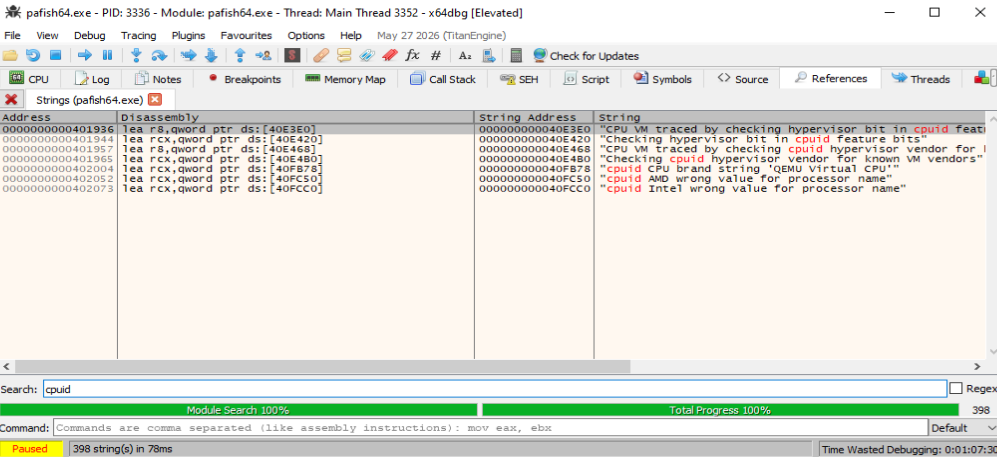

*Figura 1. Referencias a cadenas relacionadas con las comprobaciones `CPUID` de Pafish.*

A continuación se buscó el patrón de bytes correspondiente a la instrucción:

```asm
0F A2    ; CPUID
```

La búsqueda devolvió varias apariciones, ya que Pafish utiliza `CPUID` para diferentes finalidades: fabricante de la CPU, bit de hipervisor, marca del procesador y comprobación del identificador del hipervisor.

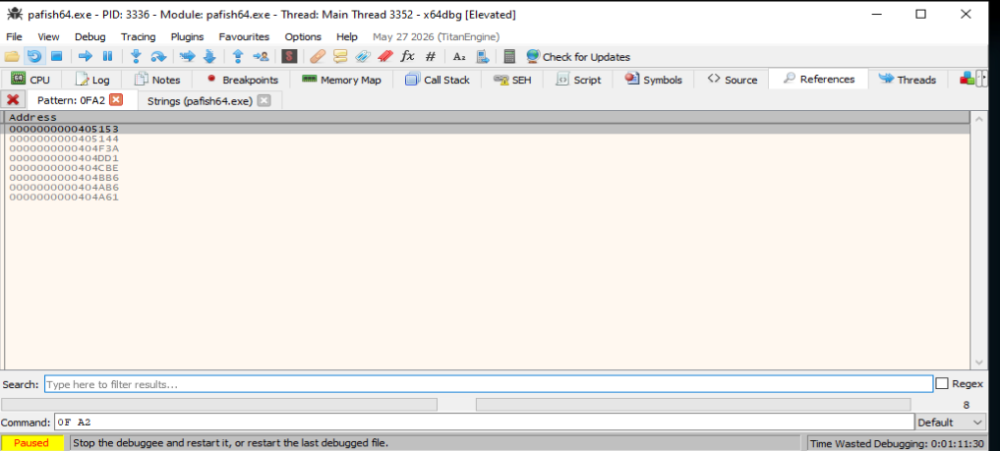

*Figura 2. Apariciones del opcode `0F A2` dentro de `pafish64.exe`.*

La instancia relevante se localizó en `0x404BB6`, precedida por:

```asm
00404BB1  mov eax,40000000h
00404BB6  cpuid
```

El valor `0x40000000` identifica la hoja utilizada habitualmente para consultar información específica del hipervisor.

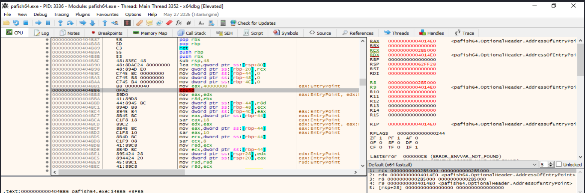

*Figura 3. Localización de la instrucción `CPUID` asociada a la hoja del hipervisor.*

---

#### 2. Ejecución de `CPUID`

Se colocó un breakpoint en:

```text
0x404BB6
```

Antes de ejecutar la instrucción se verificó que:

```text
EAX = 0x40000000
RIP = 0x404BB6
```

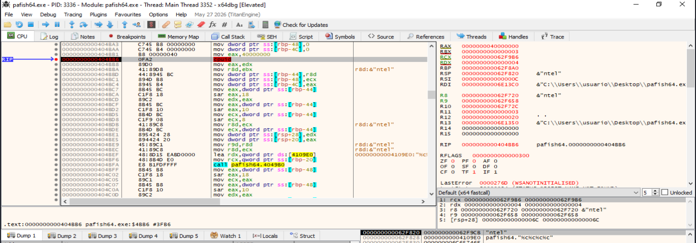

*Figura 4. Estado de los registros antes de ejecutar `CPUID`.*

Tras ejecutar una única instrucción, el flujo avanzó a `0x404BB8`. Los registros mostraron:

```text
EBX = 0x786F4256
ECX = 0x786F4256
EDX = 0x786F4256
EAX = 0x40000006
```

El valor `0x786F4256`, interpretado según el orden *little-endian*, corresponde a:

```text
56 42 6F 78 → "VBox"
```

Por tanto:

```text
EBX + ECX + EDX
= VBox + VBox + VBox
= VBoxVBoxVBox
```

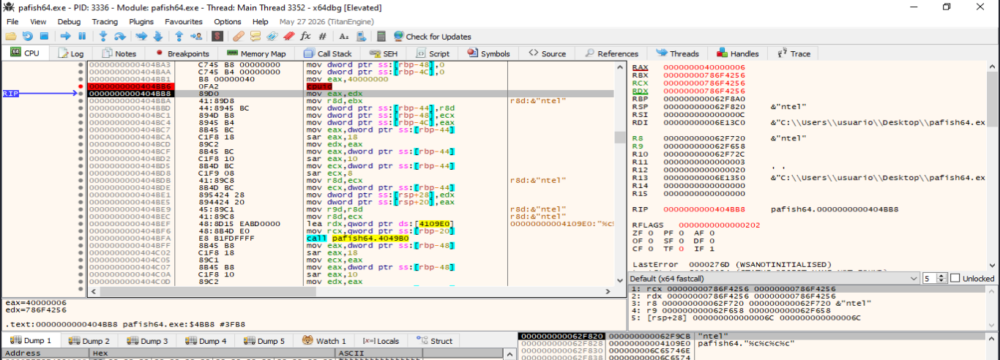

*Figura 5. Resultado devuelto por `CPUID`: los tres registros contienen el bloque ASCII `VBox`.*

El valor de `EAX = 0x40000006` indica la hoja máxima específica del hipervisor disponible en el entorno. No forma parte de la cadena, pero confirma que la consulta ha sido atendida por la capa de virtualización.

---

#### 3. Almacenamiento de los resultados

Pafish conserva los tres bloques devueltos por `CPUID` en variables locales:

```asm
00404BBD  mov dword ptr [rbp-44],r8d
00404BC1  mov dword ptr [rbp-48],ecx
00404BC4  mov dword ptr [rbp-4C],eax
```

En este punto x64dbg ya interpreta el contenido almacenado como `"VBox"`.

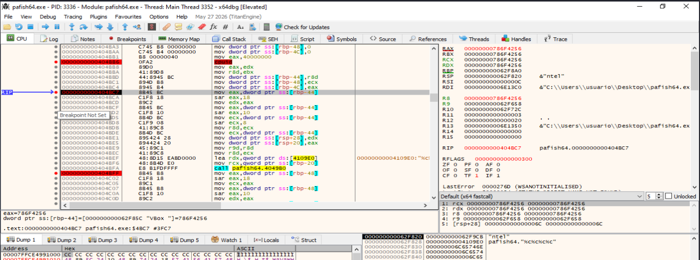

*Figura 6. Almacenamiento de los valores procedentes de `EBX`, `ECX` y `EDX`.*

Esta captura demuestra que los valores devueltos por el procesador no son residuales: Pafish los conserva para construir y evaluar posteriormente el identificador.

---

#### 4. Reconstrucción del identificador

Pafish convierte cada valor de cuatro bytes en caracteres mediante una rutina de formato. La primera llamada utiliza:

```text
RCX → buffer de destino
RDX → "%c%c%c%c"
R8  → 0x786F4256
```

La llamada se realiza en:

```asm
00404BFA  call pafish64.4049B0
```

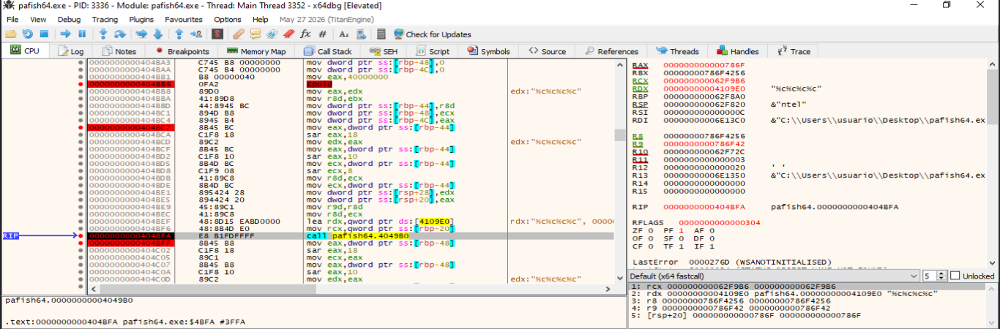

*Figura 7. Preparación de la primera llamada de formato para convertir el valor en caracteres ASCII.*

Después de la primera llamada, el buffer contiene:

```text
VBox
```

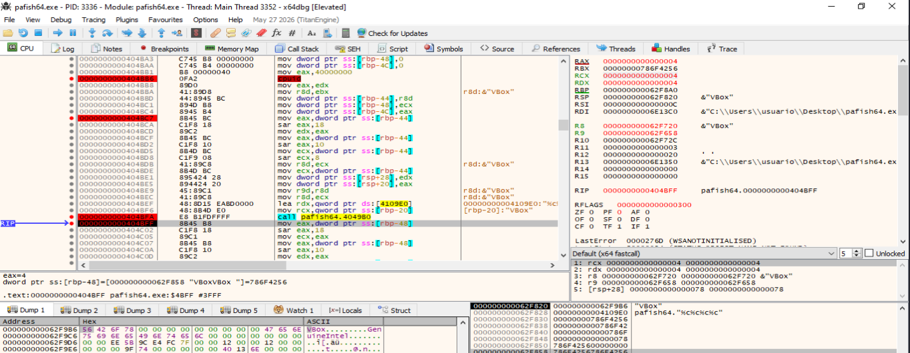

*Figura 8. Primer bloque reconstruido en memoria: `VBox`.*

La segunda llamada procesa el valor guardado desde `ECX`. Tras ejecutarla, el buffer contiene:

```text
VBoxVBox
```

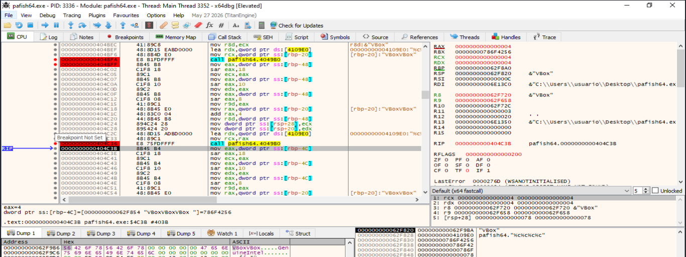

*Figura 9. Segundo bloque añadido al buffer: `VBoxVBox`.*

La tercera llamada procesa el último bloque, procedente de `EDX`. El resultado final es:

```text
VBoxVBoxVBox
```

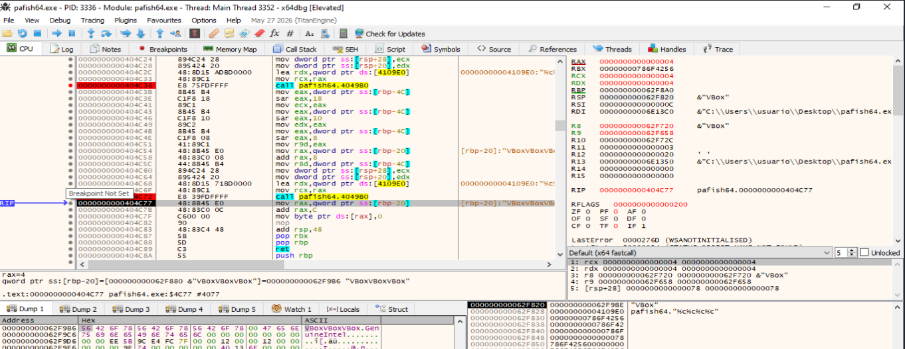

*Figura 10. Identificador completo reconstruido por Pafish: `VBoxVBoxVBox`.*

Esta evidencia demuestra que Pafish ha transformado los valores devueltos por `CPUID` en una cadena utilizable para la detección.

---

#### 5. Localización de la firma interna

Se buscó la cadena `VBoxVBoxVBox` dentro del módulo. La firma se encuentra en:

```text
0x410A2A
```

y es referenciada desde el código de comparación.

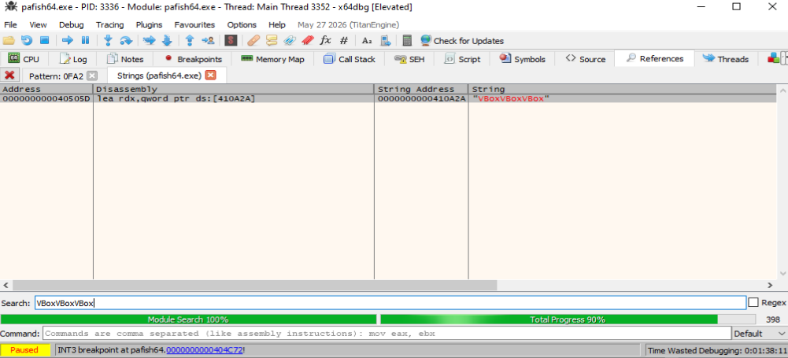

*Figura 11. Referencia estática a la firma interna `VBoxVBoxVBox`.*

Pafish mantiene una lista de identificadores conocidos, entre ellos:

```text
KVMKVMKVM
Microsoft Hv
VMwareVMware
XenVMMXenVMM
prl hyperv
VBoxVBoxVBox
```

El programa recorre estas firmas y compara cada una con el identificador obtenido dinámicamente.

---

#### 6. Comparación con las firmas conocidas

El bucle de comparación termina llamando a `memcmp` en:

```asm
00405098  call <JMP.&memcmp>
```

La longitud utilizada es de doce bytes, que coincide con el tamaño del identificador.

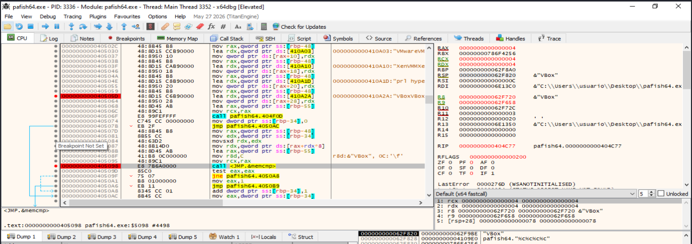

*Figura 12. Bucle utilizado para comparar el identificador obtenido con las firmas conocidas.*

En la iteración correspondiente a VirtualBox, los argumentos antes de `memcmp` son:

```text
RCX → "VBoxVBoxVBox"    ; identificador obtenido
RDX → "VBoxVBoxVBox"    ; firma interna
R8  = 0x000000000000000C
```

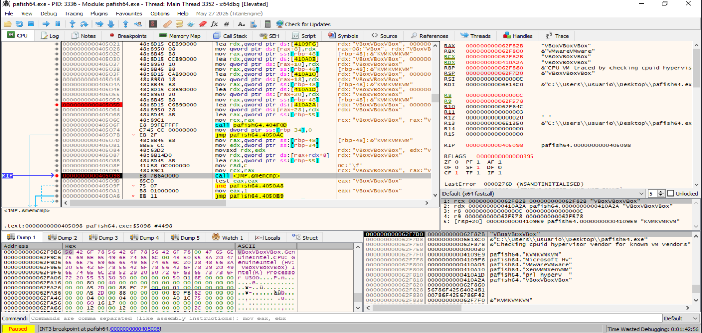

*Figura 13. Comparación de los doce bytes de `VBoxVBoxVBox` con la firma interna de VirtualBox.*

Esta captura es la evidencia principal de que Pafish no se limita a obtener la cadena: la utiliza de forma explícita para clasificar el entorno.

---

#### 7. Resultado y rama de detección positiva

Después de ejecutar `memcmp`, la ejecución alcanza:

```asm
0040509D  test eax,eax
0040509F  jne 4050A8
004050A1  mov eax,1
```

El resultado observado es:

```text
EAX = 0
ZF  = 1
```

`memcmp` devuelve cero cuando ambas cadenas son idénticas. La instrucción `test eax,eax` activa la bandera cero y, por ello, el salto `JNE` no se toma. El flujo continúa hacia:

```asm
mov eax,1
```

lo que representa el retorno positivo de la función.

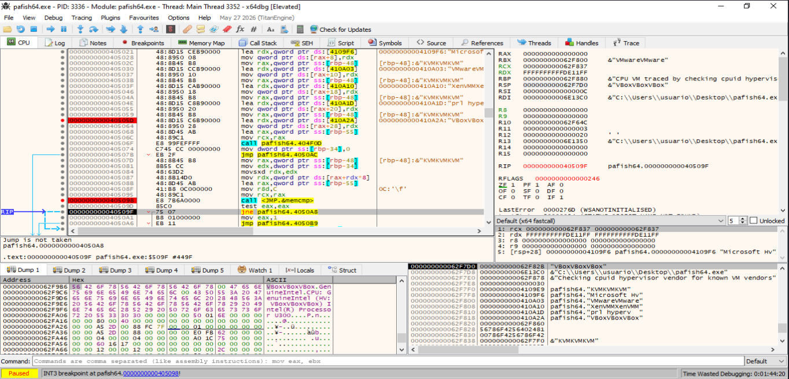

*Figura 14. `memcmp` devuelve cero, `ZF` queda activada y la ejecución continúa por la rama de detección positiva.*

---

#### 8. Resumen de puntos de ruptura

| Finalidad | Dirección | Evidencia obtenida |
|---|---:|---|
| Interceptar la consulta | `0x404BB6` | `EAX = 0x40000000` |
| Observar el resultado | `0x404BB8` | `EBX`, `ECX` y `EDX` contienen `VBox` |
| Ver los valores almacenados | `0x404BC7` | Los tres bloques se guardan en variables locales |
| Primera conversión | `0x404BFA` | Buffer parcial `VBox` |
| Segunda conversión | `0x404C36` | Buffer parcial `VBoxVBox` |
| Tercera conversión | `0x404C72` | Buffer completo `VBoxVBoxVBox` |
| Comparación final | `0x405098` | `memcmp` compara doce bytes |
| Decisión | `0x40509F` | `EAX = 0`, `ZF = 1`, `JNE` no tomado |
| Retorno positivo | `0x4050A1` | La función devuelve verdadero |

---

#### 9. Interpretación de los resultados

La evidencia obtenida permite reconstruir toda la lógica de la técnica:

```text
1. Pafish carga EAX con 0x40000000.
2. Ejecuta CPUID.
3. EBX, ECX y EDX devuelven 0x786F4256.
4. Cada valor representa la cadena ASCII "VBox".
5. Pafish reconstruye "VBoxVBoxVBox".
6. La cadena se compara con una firma interna mediante memcmp.
7. memcmp devuelve cero.
8. ZF queda activada y JNE no se toma.
9. La función devuelve 1.
```

La detección no se basa únicamente en la presencia de `CPUID`. La prueba demuestra la secuencia completa de obtención, reconstrucción, comparación y decisión.

---

#### 10. Conclusión de la demostración

La ejecución controlada de Pafish en x64dbg demuestra que la herramienta identifica VirtualBox mediante la hoja `0x40000000` de `CPUID`. Los registros `EBX`, `ECX` y `EDX` devuelven tres bloques `VBox`, que Pafish concatena para formar `VBoxVBoxVBox`.

Posteriormente, el identificador se compara con una lista de firmas internas. La comparación con `VBoxVBoxVBox` devuelve cero, activa `ZF` y dirige el flujo hacia la rama positiva. En consecuencia, Pafish determina correctamente que se está ejecutando dentro de un hipervisor conocido.

La demostración puede considerarse completa porque acredita:

- la instrucción y el valor de entrada;
- los registros de salida;
- la reconstrucción del identificador;
- la firma utilizada;
- el resultado de la comparación;
- la decisión final del programa.

------------------------------

### 7.7.2. Técnica 2: Bit de presencia de hipervisor

#### Objetivo de la demostración

El objetivo de esta práctica es demostrar dinámicamente cómo **Pafish**
comprueba el bit de presencia de hipervisor mediante la instrucción `CPUID`. El
análisis se ha realizado con **x64dbg** sobre `pafish64.exe` dentro de una
máquina virtual.

La técnica utiliza la hoja:

```text
CPUID(EAX = 1)
```

Después examina el bit 31 del registro `ECX`. Cuando dicho bit está activado, el
procesador declara que el sistema se ejecuta bajo un hipervisor.

La secuencia que debe acreditarse es:

```text
EAX = 1
    ↓
CPUID
    ↓
ECX[31] = 1
    ↓
Desplazamiento de 31 bits
    ↓
EAX = 1
    ↓
Resultado positivo
```

> Las direcciones indicadas pertenecen a la compilación de `pafish64.exe`
> empleada en esta práctica y pueden cambiar en otras versiones.

---

#### 1. Localización de la instrucción `CPUID`

Se buscó dentro del módulo el patrón de bytes:

```asm
0F A2    ; CPUID
```

La búsqueda devolvió varias apariciones porque Pafish emplea `CPUID` para
comprobaciones diferentes, como el fabricante de la CPU, el identificador del
hipervisor y el bit de presencia de virtualización.

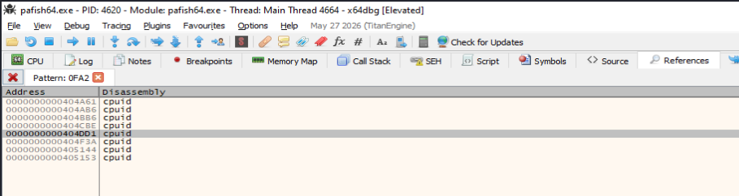

*Figura 1. Apariciones de la instrucción `CPUID` dentro de `pafish64.exe`.*

La instancia correspondiente al bit de hipervisor se localizó en:

```asm
00404DCC  mov eax,1
00404DD1  cpuid
```

El valor cargado en `EAX` permite distinguir esta comprobación de la técnica
anterior, que utilizaba `EAX = 0x40000000`.

---

#### 2. Estado previo a la consulta

Se estableció un breakpoint en:

```text
0x404DD1
```

Antes de ejecutar la instrucción se comprobó que:

```text
RIP = 0x404DD1
EAX = 1
```

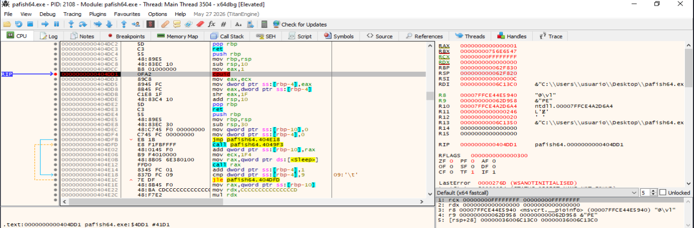

*Figura 2. Pafish prepara la hoja `CPUID(1)` antes de consultar las
características del procesador.*

La misma situación se verificó en una segunda ejecución controlada, manteniendo
el breakpoint directamente sobre `CPUID`.

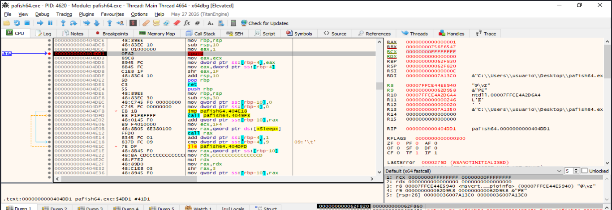

*Figura 3. Breakpoint situado sobre `CPUID`, precedido por `mov eax,1`.*

Estas capturas demuestran que la rutina consulta expresamente la hoja de
características del procesador.

---

#### 3. Resultado devuelto en `ECX`

Tras ejecutar `CPUID`, la ejecución avanzó a:

```asm
00404DD3  mov eax,ecx
```

El registro devolvió:

```text
ECX = 0xFEDA320B
```

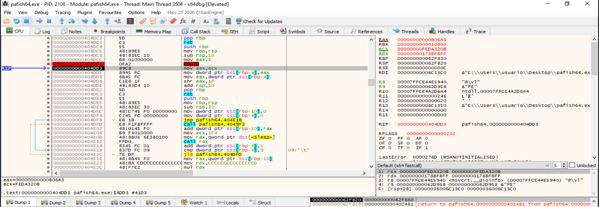

*Figura 4. Valor de `ECX` inmediatamente después de ejecutar `CPUID(1)`.*

Para comprobar el bit de presencia del hipervisor se aplica la máscara:

```text
0x80000000
```

Esta máscara selecciona únicamente el bit 31:

```text
ECX & 0x80000000
```

En el entorno analizado se obtuvo:

```text
0xFEDA320B & 0x80000000 = 0x80000000
```

El resultado distinto de cero confirma que el bit más significativo está
activado.

---

#### 4. Verificación mediante expresiones de seguimiento

Para hacer visible la comprobación se añadieron tres expresiones en la pestaña
`Watch` de x64dbg:

```text
ecx
ecx & 0x80000000
(ecx >> 0x1F) & 1
```

Los valores observados fueron:

```text
ECX                       = 0xFEDA320B
ECX & 0x80000000          = 0x80000000
(ECX >> 0x1F) & 1         = 1
```

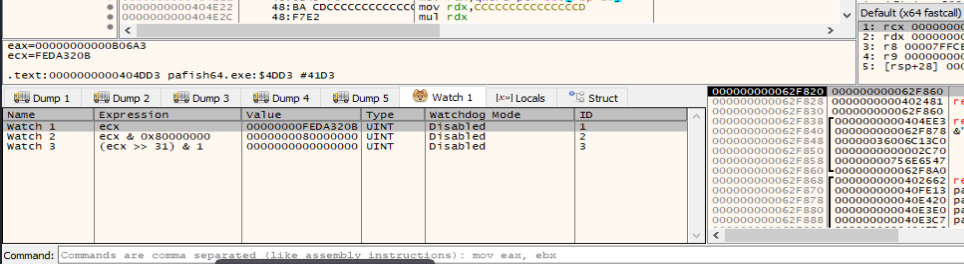

*Figura 5. Verificación directa del bit 31 mediante máscaras y
desplazamientos.*

La constante `0x1F` equivale a 31 en decimal. El último resultado demuestra que
el bit 31 de `ECX` tiene el valor lógico `1`.

La comprobación completa también puede observarse en la vista principal del
depurador:

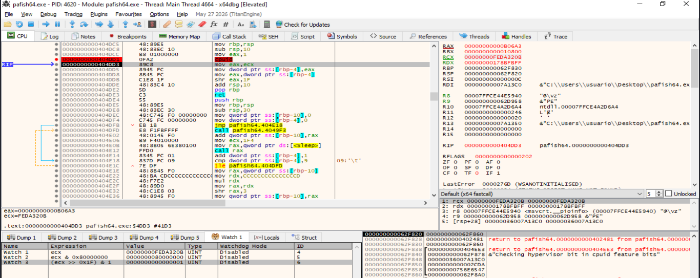

*Figura 6. Resultado de `CPUID(1)` y evaluación de las expresiones de
seguimiento.*

---

#### 5. Extracción del bit por parte de Pafish

Después de ejecutar `CPUID`, Pafish copia `ECX` a `EAX` y conserva el valor en
una variable local:

```asm
00404DD3  mov eax,ecx
00404DD5  mov dword ptr [rbp-4],eax
00404DD8  mov eax,dword ptr [rbp-4]
00404DDB  shr eax,1F
```

La instrucción:

```asm
shr eax,1F
```

desplaza el registro 31 posiciones hacia la derecha. De este modo, el bit de
presencia del hipervisor pasa a ocupar la posición menos significativa.

Antes del desplazamiento:

```text
EAX = 0xFEDA320B
```

Después del desplazamiento:

```text
EAX = 1
```

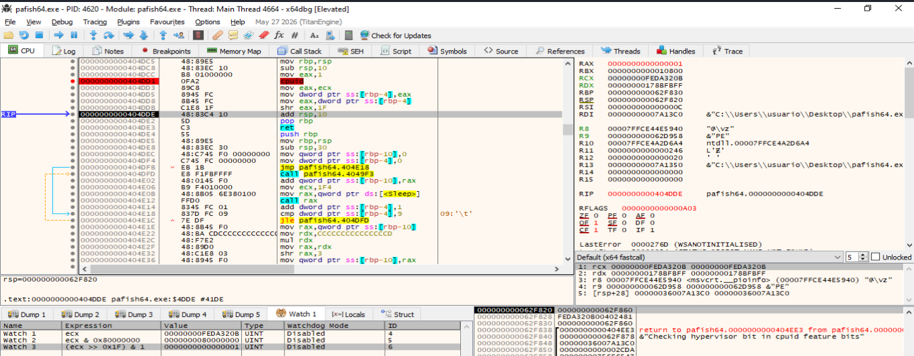

*Figura 7. Resultado de `shr eax,1F`: Pafish obtiene el valor booleano
positivo `EAX = 1`.*

La ejecución queda detenida en `0x404DDE`, inmediatamente después del
desplazamiento. Las instrucciones restantes del epílogo son:

```asm
add rsp,10
pop rbp
ret
```

Estas instrucciones no modifican `EAX`. Por tanto, la función devuelve el valor
`1` al código llamador.

---

#### 6. Puntos de ruptura utilizados

| Finalidad | Dirección | Evidencia |
|---|---:|---|
| Interceptar la consulta | `0x404DD1` | `EAX = 1` antes de `CPUID` |
| Observar la respuesta | `0x404DD3` | `ECX = 0xFEDA320B` |
| Aislar el bit | `0x404DDB` | Ejecución de `shr eax,1F` |
| Comprobar el resultado | `0x404DDE` | `EAX = 1` |
| Retorno de la función | `0x404DE3` | El resultado positivo se devuelve al llamador |

---

#### 7. Interpretación técnica

La secuencia observada puede resumirse así:

```text
1. Pafish carga EAX con 1.
2. Ejecuta CPUID.
3. ECX devuelve 0xFEDA320B.
4. La máscara 0x80000000 produce 0x80000000.
5. El bit 31 tiene el valor 1.
6. Pafish copia ECX en EAX.
7. Ejecuta SHR EAX, 0x1F.
8. EAX queda reducido a 1.
9. La función devuelve un resultado positivo.
```

La evidencia no se limita a comprobar manualmente el registro. También muestra
que Pafish ejecuta su propia operación de desplazamiento para convertir el bit
31 en un valor booleano.

---

#### 8. Conclusión de la demostración

La ejecución dinámica confirma que Pafish utiliza `CPUID` con `EAX = 1` para
consultar las características del procesador. El registro `ECX` devuelve
`0xFEDA320B`, cuyo bit 31 está activado.

La aplicación de la máscara `0x80000000` y la expresión
`(ECX >> 0x1F) & 1` producen un resultado igual a `1`. Posteriormente, Pafish
ejecuta `shr eax,1F` y obtiene igualmente `EAX = 1`.

Por tanto, la demostración acredita:

- la hoja de `CPUID` utilizada;
- el valor devuelto en `ECX`;
- la activación del bit 31;
- la operación con la que Pafish aísla el indicador;
- el resultado booleano positivo;
- el retorno de la detección al código llamador.

El entorno analizado declara, mediante el bit **Hypervisor Present**, que se
ejecuta bajo una capa de virtualización.


-----

### 7.7.3. Técnica 3: Tablas `IDT`, `GDT` y `LDT`

#### Objetivo y alcance de la demostración

Esta práctica analiza las comprobaciones de tablas de descriptores incluidas en **Al-Khaser x86** mediante **x32dbg**. Estas técnicas consultan estructuras
internas del procesador para comprobar si su ubicación o contenido coincide con patrones históricamente asociados a entornos virtualizados.

Las instrucciones relacionadas son:

| Tabla | Instrucción | Información obtenida |
|---|---|---|
| IDT | `SIDT` | Límite y dirección base de la Interrupt Descriptor Table |
| GDT | `SGDT` | Límite y dirección base de la Global Descriptor Table |
| LDT | `SLDT` | Selector de la Local Descriptor Table |


---

#### 1. Localización de las comprobaciones

La búsqueda textual de `SIDT` no devuelve una referencia útil, porque el nombre de la instrucción no aparece necesariamente como cadena dentro del ejecutable.

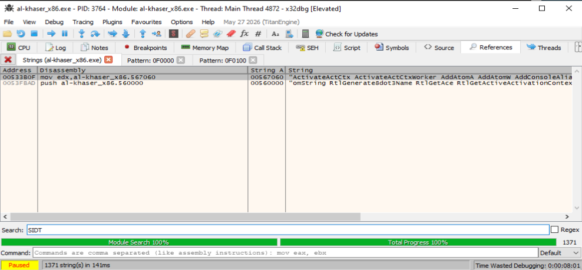

*Figura 1. La búsqueda textual de `SIDT` no permite localizar directamente la rutina.*

La búsqueda de `Descriptor Table` sí permite identificar las cadenas utilizadas por Al-Khaser:

```text
Checking Interrupt Descriptor Table location
Checking Local Descriptor Table location
Checking Global Descriptor Table location
```

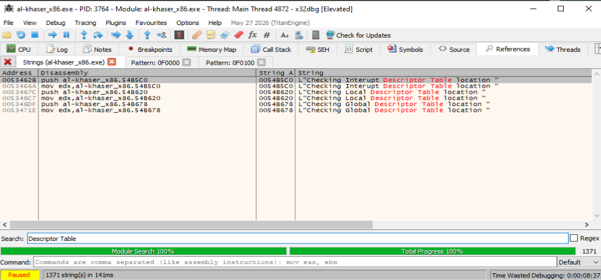

*Figura 2. Referencias a las comprobaciones de IDT, LDT y GDT.*

Estas referencias conducen a una región de código que contiene las pruebas de IDT y LDT y la llamada asociada a la comprobación de GDT.

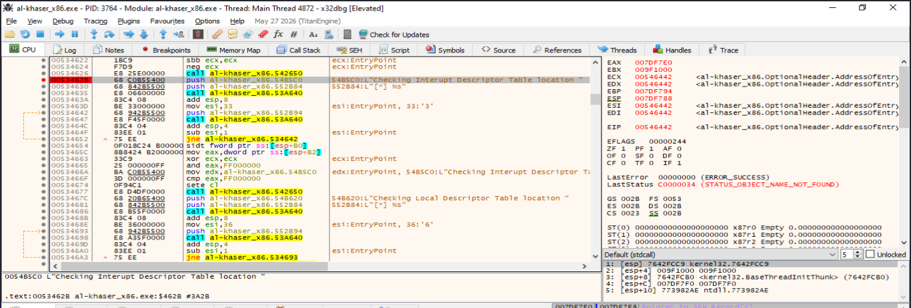

*Figura 3. Región de código que agrupa las comprobaciones de tablas de descriptores.*

---

#### 2. Demostración de la Interrupt Descriptor Table

##### 2.1. Ejecución de `SIDT`

La comprobación de la IDT comienza en:

```asm
00534654  sidt fword ptr ss:[esp+B0]
```

La instrucción almacena un pseudodescriptor de seis bytes:

```text
[ESP+B0]     límite de la IDT, 2 bytes
[ESP+B2]     base de la IDT, 4 bytes
```

Antes de ejecutar `SIDT`, el buffer situado en `ESP + 0xB0` todavía no contiene
el descriptor.

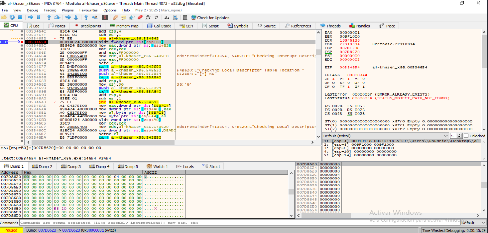

*Figura 4. Breakpoint situado sobre `SIDT` y buffer de destino antes de la consulta.*

##### 2.2. Descriptor obtenido

Después de ejecutar `SIDT`, el buffer contiene:

```text
FF 0F 00 C0 C8 46
```

La interpretación en *little-endian* es:

```text
Límite IDT = 0x0FFF
Base IDT   = 0x46C8C000
```

La instrucción siguiente carga la base mediante:

```asm
0053465C  mov eax,dword ptr ss:[esp+B2]
```

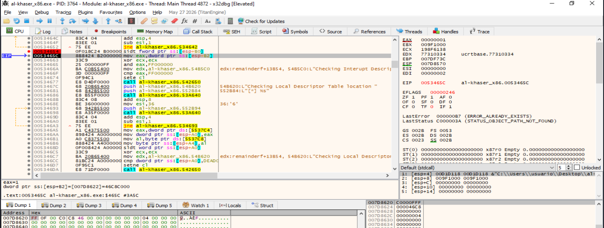

*Figura 5. Pseudodescriptor escrito por `SIDT`; la base observada es `0x46C8C000`.*

Tras ejecutar la carga:

```text
EAX = 0x46C8C000
```

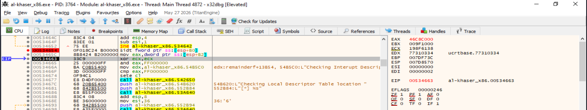

*Figura 6. Dirección base de la IDT cargada en `EAX`.*

##### 2.3. Aplicación del patrón anti-VM

Al-Khaser conserva únicamente el byte superior:

```asm
00534665  and eax,FF000000
```

Con la base observada:

```text
0x46C8C000 & 0xFF000000 = 0x46000000
```

Después realiza:

```asm
0053466F  cmp eax,FF000000
00534674  sete cl
```

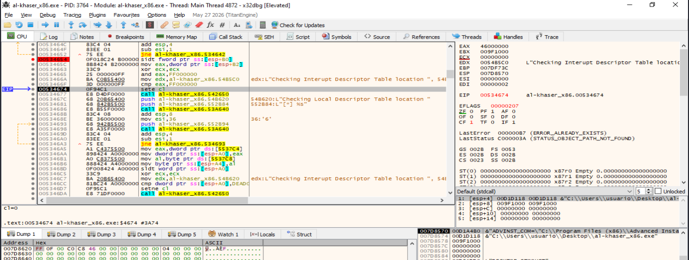

*Figura 7. Comparación del byte superior de la base de la IDT con `0xFF000000`.*

El valor `0x46000000` no coincide con `0xFF000000`, por lo que:

```text
ZF = 0
CL = 0
```

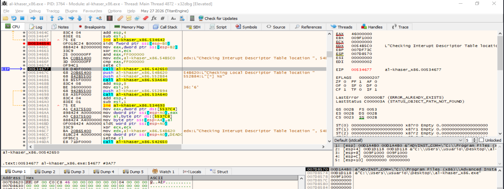

*Figura 8. Resultado negativo de la comprobación IDT, representado por `CL = 0`.*

##### 2.4. Resultado de IDT

La secuencia observada es:

```text
SIDT [ESP+B0]
        ↓
Límite = 0x0FFF
Base = 0x46C8C000
        ↓
Base & 0xFF000000 = 0x46000000
        ↓
Comparación con 0xFF000000
        ↓
No coincide
        ↓
CL = 0
```

La comprobación se ha ejecutado correctamente, aunque su resultado sea negativo. Esto demuestra que la dirección obtenida no coincide con el patrón histórico utilizado por Al-Khaser.

---

#### 3. Demostración de la Local Descriptor Table

##### 3.1. Inicialización del valor centinela

La prueba LDT utiliza un valor centinela antes de ejecutar `SLDT`. La región relevante contiene:

```asm
mov dword ptr [esp+A0],eax
mov byte ptr [esp+A4],al
sldt word ptr [esp+A0]
```

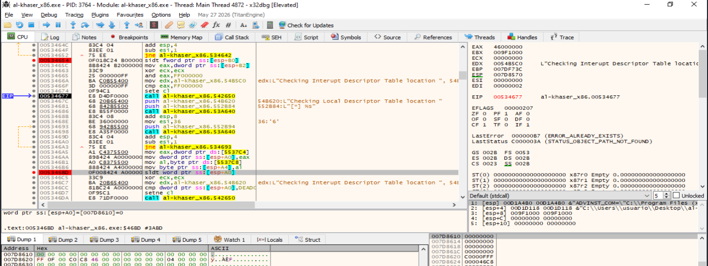

*Figura 9. Rutina utilizada para comprobar el selector de la LDT.*

Antes de `SLDT`, el buffer presenta un valor relacionado con el centinela `0xDEADBEEF`.

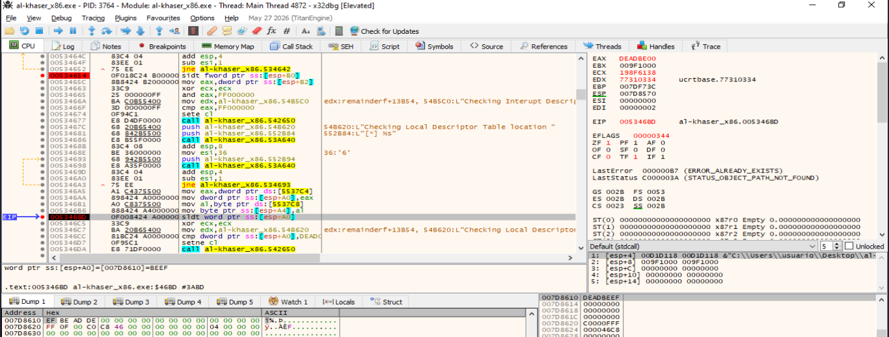

*Figura 10. Buffer de control antes de ejecutar `SLDT`.*

##### 3.2. Ejecución de `SLDT`

La instrucción relevante es:

```asm
005346BD  sldt word ptr ss:[esp+A0]
```

`SLDT` escribe un selector de 16 bits en los dos bytes inferiores del buffer.

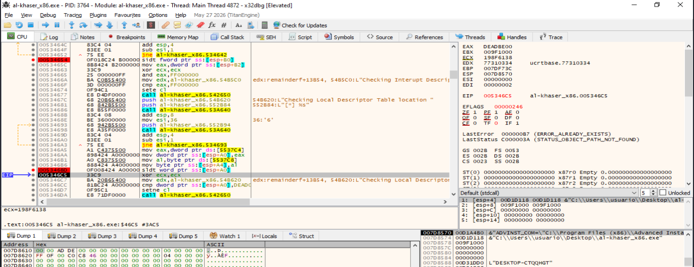

*Figura 11. Estado del buffer después de ejecutar `SLDT`.*

En el entorno analizado, el selector obtenido es nulo. Por ello, los dos bytes inferiores quedan en `0x0000` y el valor de cuatro bytes pasa a ser:

```text
[ESP+A0] = 0xDEAD0000
```

##### 3.3. Comparación del centinela

Al-Khaser evalúa el resultado mediante:

```asm
005346CC  cmp dword ptr ss:[esp+A0],DEAD0000
005346D3  setne cl
```

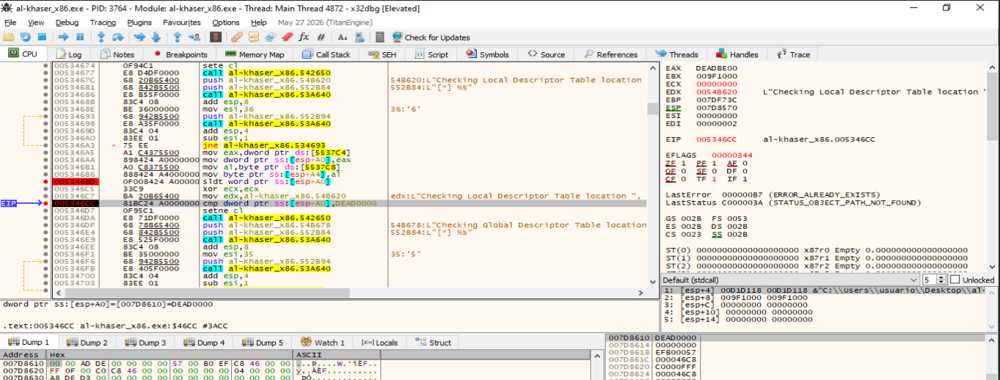

*Figura 12. Comparación del buffer con el valor `0xDEAD0000`.*

Como el contenido coincide:

```text
ZF = 1
```

La instrucción `SETNE` produce:

```text
CL = 0
```

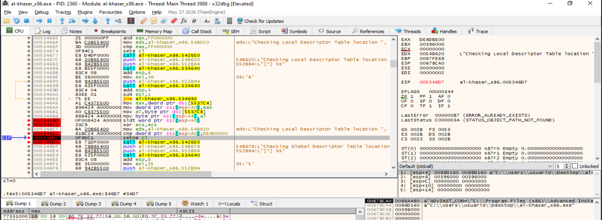

*Figura 13. Evaluación de la comparación mediante `SETNE`.*

La captura final muestra simultáneamente el valor `0xDEAD0000`, `ZF = 1` y `CL = 0`.

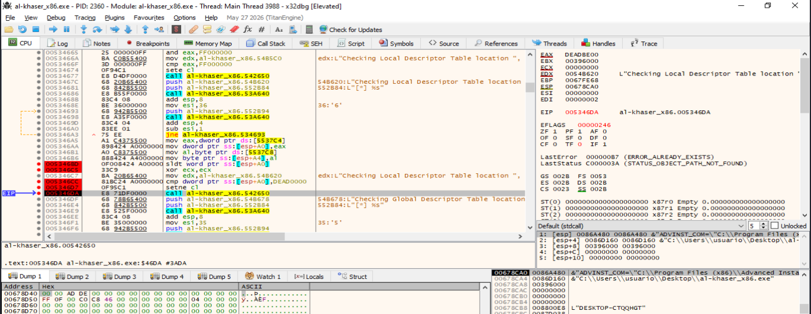

*Figura 14. Resultado negativo de la comprobación LDT.*

##### 3.4. Resultado de LDT

La secuencia reconstruida es:

```text
Valor centinela
        ↓
SLDT [ESP+A0]
        ↓
Selector LDT = 0
        ↓
[ESP+A0] = 0xDEAD0000
        ↓
CMP igual
        ↓
ZF = 1
        ↓
SETNE CL
        ↓
CL = 0
```

El resultado negativo indica que el selector obtenido no altera el centinela de la forma considerada sospechosa por Al-Khaser.

---

#### 4. Comprobación de la GDT mediante `SGDT`

##### Objetivo de la demostración

Esta prueba demuestra dinámicamente cómo **Al-Khaser x86** consulta la
**Global Descriptor Table (GDT)** mediante la instrucción `SGDT`, extrae su
dirección base y la compara con un patrón históricamente asociado a determinados
entornos virtualizados.

El análisis se ha realizado con **x32dbg** sobre `al-khaser_x86.exe` dentro de
una máquina virtual VirtualBox.

La secuencia observada es:

```text
SGDT [ESP+A8]
        ↓
límite y base de la GDT en memoria
        ↓
base cargada en EAX
        ↓
EAX & 0xFF000000
        ↓
comparación con 0xFF000000
        ↓
SETE CL
        ↓
resultado positivo o negativo
```

> Las direcciones corresponden a la compilación analizada y pueden variar en
> otras versiones del ejecutable.

---

##### Instrucción `SGDT` y buffer de destino

La comprobación comienza en:

```asm
00EF4708  sgdt fword ptr ss:[esp+A8]
```

Antes de ejecutar la instrucción, el buffer situado en:

```text
ESP + 0xA8 = 0x00958C08
```

contiene seis bytes inicializados a cero:

```text
00 00 00 00 00 00
```

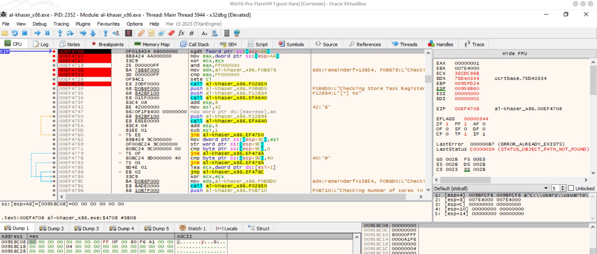

*Figura 1. Breakpoint sobre `SGDT` y buffer de destino antes de la consulta.*

La instrucción `SGDT` almacena un pseudodescriptor de seis bytes:

```text
[ESP+A8]     límite de la GDT, 2 bytes
[ESP+AA]     base de la GDT, 4 bytes
```

---

##### Descriptor de la GDT escrito en memoria

Después de ejecutar `SGDT`, la ejecución alcanza:

```asm
00EF4710  mov eax,dword ptr ss:[esp+AA]
```

En memoria aparecen los seis bytes:

```text
57 00 B0 AF A6 3A
```

Interpretados en formato *little-endian*:

```text
Límite GDT = 0x0057
Base GDT   = 0x3AA6AFB0
```

x32dbg confirma que:

```text
[ESP+AA] = [0x00958C0A] = 0x3AA6AFB0
```

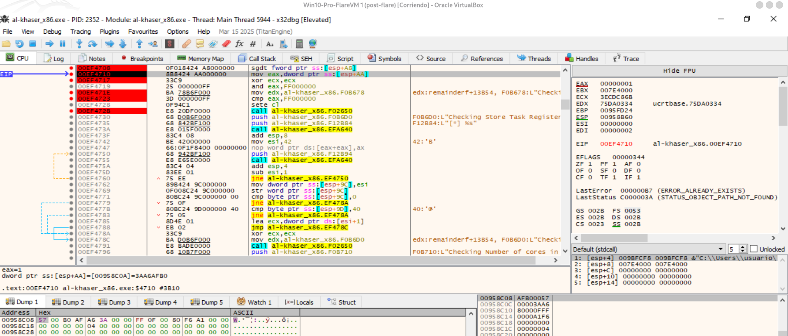

*Figura 2. Pseudodescriptor almacenado por `SGDT`; la base observada es
`0x3AA6AFB0`.*

Esta captura demuestra que la instrucción se ejecuta correctamente y que
Al-Khaser dispone de la dirección base de la GDT.

---

##### Carga de la base en `EAX`

La instrucción:

```asm
00EF4710  mov eax,dword ptr ss:[esp+AA]
```

carga la base completa de la GDT en `EAX`.

Tras ejecutarla:

```text
EAX = 0x3AA6AFB0
```

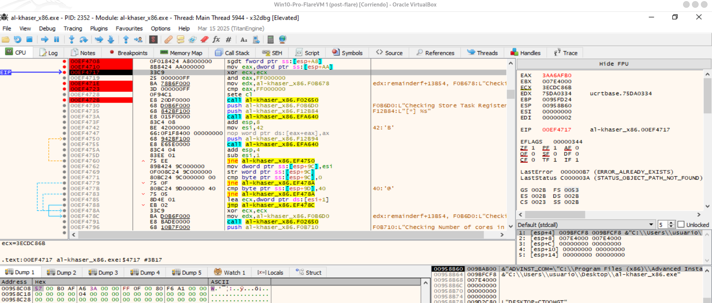

*Figura 3. Dirección base de la GDT cargada en el registro `EAX`.*

---

##### Aplicación de la máscara anti-VM

Al-Khaser conserva únicamente el byte más significativo de la dirección:

```asm
00EF4717  xor ecx,ecx
00EF4719  and eax,FF000000
```

El resultado es:

```text
0x3AA6AFB0 & 0xFF000000 = 0x3A000000
```

Por tanto:

```text
EAX = 0x3A000000
```

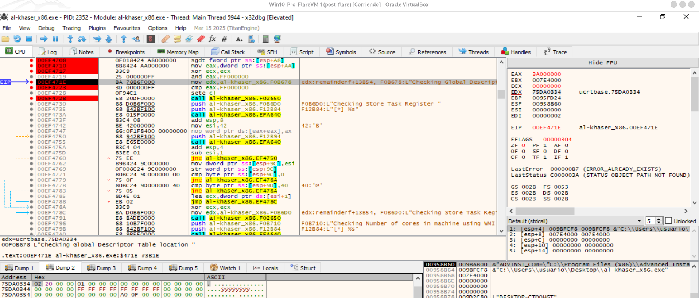

*Figura 4. Resultado de aplicar la máscara `0xFF000000` a la base de la GDT.*

La cadena descriptiva de la prueba se carga en `EDX`:

```asm
00EF471E  mov edx,00F0B678
```

y corresponde a:

```text
Checking Global Descriptor Table location
```

---

##### Comparación y resultado booleano

La decisión se realiza mediante:

```asm
00EF4723  cmp eax,FF000000
00EF4728  sete cl
00EF472B  call al-khaser_x86.F02650
```

La comparación observada es:

```text
0x3A000000 != 0xFF000000
```

Como no existe coincidencia:

```text
ZF = 0
```

La instrucción `SETE` solo escribe `1` cuando `ZF = 1`. En este caso:

```text
CL = 0
```

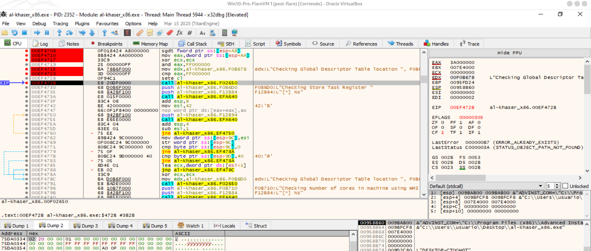

*Figura 5. Resultado negativo de la comprobación: `ZF = 0` y `CL = 0`.*


---

##### Interpretación de la comprobación

La lógica reconstruida es:

```text
1. Al-Khaser ejecuta SGDT.
2. El límite de la GDT es 0x0057.
3. La base de la GDT es 0x3AA6AFB0.
4. La base se carga en EAX.
5. Se aplica la máscara 0xFF000000.
6. El resultado es 0x3A000000.
7. Se compara con 0xFF000000.
8. La comparación no coincide.
9. ZF queda a 0.
10. SETE establece CL = 0.
```

El resultado negativo no invalida la demostración. La prueba acredita que
Al-Khaser consulta la GDT, obtiene su base, aplica el patrón anti-VM y toma una
decisión basada en la comparación.

---

##### Conclusión

La ejecución dinámica confirma que Al-Khaser emplea `SGDT` para obtener el
pseudodescriptor de la Global Descriptor Table. En el entorno analizado se
obtiene un límite `0x0057` y una base `0x3AA6AFB0`.

Tras conservar el byte superior mediante la máscara `0xFF000000`, el resultado
es `0x3A000000`, que no coincide con el patrón `0xFF000000`. En consecuencia,
`ZF = 0` y `SETE` produce `CL = 0`.

La comprobación de la GDT queda completamente demostrada:

```text
SGDT
→ descriptor obtenido
→ base extraída
→ máscara aplicada
→ comparación ejecutada
→ resultado negativo
```


---

#### 5. Puntos de ruptura utilizados

##### IDT

| Finalidad | Dirección |
|---|---:|
| Ejecutar `SIDT` | `0x00534654` |
| Cargar la base | `0x0053465C` |
| Observar la base en `EAX` | `0x00534663` |
| Aplicar máscara | `0x00534665` |
| Comparar con el patrón | `0x0053466F` |
| Generar resultado booleano | `0x00534674` |
| Registrar el resultado | `0x00534677` |

##### LDT

| Finalidad | Dirección |
|---|---:|
| Ejecutar `SLDT` | `0x005346BD` |
| Observar el buffer modificado | `0x005346C5` |
| Comparar con `0xDEAD0000` | `0x005346CC` |
| Generar resultado booleano | `0x005346D3` |
| Registrar el resultado | `0x005346DA` |


##### GDT

| Finalidad | Dirección | Evidencia |
|---|---:|---|
| Ejecutar `SGDT` | `0x00EF4708` | Buffer vacío antes de la consulta |
| Observar el pseudodescriptor | `0x00EF4710` | Límite y base escritos en memoria |
| Ver la base completa | `0x00EF4717` | `EAX = 0x3AA6AFB0` |
| Observar la máscara | `0x00EF471E` | `EAX = 0x3A000000` |
| Comparar el patrón | `0x00EF4723` | Comparación con `0xFF000000` |
| Ver el resultado booleano | `0x00EF472B` | `ZF = 0` y `CL = 0` |


---

### 6. Conclusión

El análisis dinámico demuestra que Al-Khaser consulta estructuras internas del
procesador para evaluar la posible presencia de virtualización.

En la prueba IDT, `SIDT` devuelve una base `0x46C8C000`. Tras aplicar la máscara
`0xFF000000`, el resultado no coincide con el patrón `0xFF000000`, por lo que
la detección es negativa.

En la prueba LDT, `SLDT` devuelve un selector nulo. El buffer conserva
`0xDEAD0000`, la comparación activa `ZF` y `SETNE` produce `CL = 0`, generando
también una detección negativa.

Por tanto, queda demostrada la lógica completa de las comprobaciones **IDT** y
**LDT**, desde la ejecución de la instrucción hasta la decisión final. La
demostración de **GDT** permanece pendiente hasta capturar la ejecución real de
`SGDT`.


-------

xxxxxxxxxxxxxxx
---------------------


### 7.7.4. Técnica 4: Instrucciones poco comunes

### 7.7.7. Técnica 5: Instrucciones ilegales o privilegiadas

### 7.7.8. Técnica 6: Puerto backdoor de VMware

### 7.7.9. Comparación de resultados entre entornos

---


## 7.9. Conclusiones


