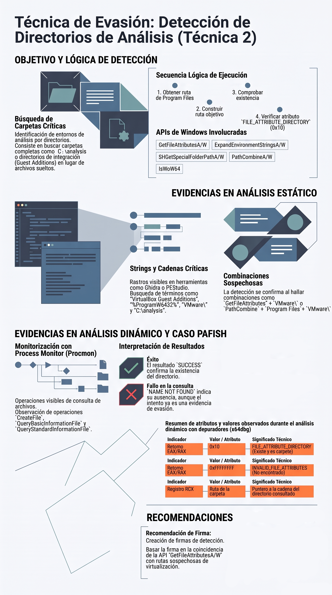

- [1. La técnica `filesystem`](#1-la-técnica-filesystem)
  - [1.1. Descripción de la técnica `filesystem`](#11-descripción-de-la-técnica-filesystem)
  - [1.2. Categoría](#12-categoría)
  - [1.3. Las cinco técnicas que aparecen en `filesystem.md`](#13-las-cinco-técnicas-que-aparecen-en-filesystemmd)
    - [1.3.1. Técnica 1: Comprobar si existen archivos concretos](#131-técnica-1-comprobar-si-existen-archivos-concretos)
      - [Evidencias en análisis estático](#evidencias-en-análisis-estático)
      - [Evidencias en análisis dinámico](#evidencias-en-análisis-dinámico)
      - [Código de ejemplo](#código-de-ejemplo)
      - [Recomendación de firma](#recomendación-de-firma)
    - [1.3.2. Técnica 2: Comprobar si existen directorios concretos](#132-técnica-2-comprobar-si-existen-directorios-concretos)
      - [Evidencias en análisis estático](#evidencias-en-análisis-estático-1)
      - [Evidencias dinámicas](#evidencias-dinámicas)
      - [Recomendación de firma](#recomendación-de-firma-1)
    - [1.3.3. Técnica 3: Comprobar si la ruta completa del ejecutable contiene ciertas palabras](#133-técnica-3-comprobar-si-la-ruta-completa-del-ejecutable-contiene-ciertas-palabras)
      - [Evidencias estáticas](#evidencias-estáticas)
      - [Evidencias dinámicas](#evidencias-dinámicas-1)
      - [Sobre las firmas](#sobre-las-firmas)
    - [1.3.4. Técnica 4: Comprobar si el ejecutable se lanza desde un directorio concreto](#134-técnica-4-comprobar-si-el-ejecutable-se-lanza-desde-un-directorio-concreto)
    - [1.3.5. Técnica 5: Comprobar si existen ejecutables con nombres sospechosos en la raíz del disco](#135-técnica-5-comprobar-si-existen-ejecutables-con-nombres-sospechosos-en-la-raíz-del-disco)
      - [Evidencias estáticas](#evidencias-estáticas-1)
      - [Evidencias dinámicas](#evidencias-dinámicas-2)
      - [Recomendación de firma](#recomendación-de-firma-2)
  - [1.4. Resumen visual de las técnicas que aparecen en `filesystem`](#14-resumen-visual-de-las-técnicas-que-aparecen-en-filesystem)
    - [1.4.1. Artefactos o indicadores buscados](#141-artefactos-o-indicadores-buscados)
    - [1.4.2. Detección en análisis estático](#142-detección-en-análisis-estático)
      - [Criterio de interpretación estática](#criterio-de-interpretación-estática)
    - [1.4.3. Detección en análisis dinámico](#143-detección-en-análisis-dinámico)
      - [Criterio de interpretación dinámica](#criterio-de-interpretación-dinámica)
  - [1.5. Contramedidas ofensivas](#15-contramedidas-ofensivas)
    - [1.5.1. Ofuscación de strings relacionadas con rutas y artefactos](#151-ofuscación-de-strings-relacionadas-con-rutas-y-artefactos)
    - [1.5.2. Resolución dinámica de APIs](#152-resolución-dinámica-de-apis)
    - [1.5.3. Uso de APIs nativas o alternativas](#153-uso-de-apis-nativas-o-alternativas)
    - [1.5.4. Comprobaciones indirectas del entorno](#154-comprobaciones-indirectas-del-entorno)
    - [1.5.5. Ejecución condicional y ramas benignas](#155-ejecución-condicional-y-ramas-benignas)
    - [1.5.6. Comprobaciones distribuidas en varias fases](#156-comprobaciones-distribuidas-en-varias-fases)
    - [1.5.7 Reducción de indicadores evidentes](#157-reducción-de-indicadores-evidentes)
    - [1.5.8 Implicaciones para el análisis defensivo](#158-implicaciones-para-el-análisis-defensivo)
  - [1.6. Contramedidas defensivas](#16-contramedidas-defensivas)
  - [1.7. Checklist rápido del laboratorio](#17-checklist-rápido-del-laboratorio)
  - [1.8. Casos prácticos asociados a la técnica `filesystem`](#18-casos-prácticos-asociados-a-la-técnica-filesystem)
    - [Flujo académico recomendado](#flujo-académico-recomendado)
  - [1.9 Análisis dinámico de las técnicas `filesystem`](#19-análisis-dinámico-de-las-técnicas-filesystem)
    - [Evaluación de la muestra `5lDVwr4Aab.js`](#evaluación-de-la-muestra-5ldvwr4aabjs)
  - [6.5 Técnica 5: Comprobar si existen ejecutables con nombres sospechosos en la raíz del disco](#65-técnica-5-comprobar-si-existen-ejecutables-con-nombres-sospechosos-en-la-raíz-del-disco)
  - [6. Analizamos dinámicamente estas técnicas](#6-analizamos-dinámicamente-estas-técnicas)
    - [6.1 Técnica 1: Comprobar si existen archivos concretos](#61-técnica-1-comprobar-si-existen-archivos-concretos)
    - [1.9.2 Herramientas utilizadas](#192-herramientas-utilizadas)
    - [1.9.3 APIs relevantes durante el análisis dinámico](#193-apis-relevantes-durante-el-análisis-dinámico)
    - [1.9.4 Breakpoints recomendados en x64dbg](#194-breakpoints-recomendados-en-x64dbg)
    - [1.9.5 Interpretación de argumentos en x64dbg](#195-interpretación-de-argumentos-en-x64dbg)
    - [1.9.6 Análisis dinámico por técnica](#196-análisis-dinámico-por-técnica)
      - [Técnica 1: comprobar si existen archivos concretos](#técnica-1-comprobar-si-existen-archivos-concretos)
      - [Técnica 2: comprobar si existen directorios concretos](#técnica-2-comprobar-si-existen-directorios-concretos)
      - [Técnica 3: comprobar si la ruta completa del ejecutable contiene ciertas palabras](#técnica-3-comprobar-si-la-ruta-completa-del-ejecutable-contiene-ciertas-palabras)
      - [Técnica 4: comprobar si el ejecutable se lanza desde un directorio concreto](#técnica-4-comprobar-si-el-ejecutable-se-lanza-desde-un-directorio-concreto)
      - [Técnica 5: comprobar si existen ejecutables con nombres sospechosos en la raíz del disco](#técnica-5-comprobar-si-existen-ejecutables-con-nombres-sospechosos-en-la-raíz-del-disco)
    - [1.9.7 Evidencias esperadas en Process Monitor](#197-evidencias-esperadas-en-process-monitor)
    - [1.9.8 Criterio de interpretación dinámica](#198-criterio-de-interpretación-dinámica)
    - [1.9.9 Tabla resumen del análisis dinámico](#199-tabla-resumen-del-análisis-dinámico)
    - [1.9.10 Limitaciones del análisis dinámico](#1910-limitaciones-del-análisis-dinámico)
    - [1.9.11 Conclusión](#1911-conclusión)
  - [1.9 Análisis dinámico de las técnicas `filesystem`](#19-análisis-dinámico-de-las-técnicas-filesystem-1)
    - [1.9.1 Objetivo del análisis dinámico](#191-objetivo-del-análisis-dinámico)
    - [1.9.2 Herramientas utilizadas](#192-herramientas-utilizadas-1)
    - [1.9.3 APIs relevantes durante el análisis dinámico](#193-apis-relevantes-durante-el-análisis-dinámico-1)
    - [1.9.4 Breakpoints recomendados en x64dbg](#194-breakpoints-recomendados-en-x64dbg-1)
    - [1.9.5 Interpretación de argumentos en x64dbg](#195-interpretación-de-argumentos-en-x64dbg-1)
    - [1.9.6 Análisis dinámico por técnica](#196-análisis-dinámico-por-técnica-1)
      - [Técnica 1: comprobar si existen archivos concretos](#técnica-1-comprobar-si-existen-archivos-concretos-1)
      - [Técnica 2: comprobar si existen directorios concretos](#técnica-2-comprobar-si-existen-directorios-concretos-1)
      - [Técnica 3: comprobar si la ruta completa del ejecutable contiene ciertas palabras](#técnica-3-comprobar-si-la-ruta-completa-del-ejecutable-contiene-ciertas-palabras-1)
      - [Técnica 4: comprobar si el ejecutable se lanza desde un directorio concreto](#técnica-4-comprobar-si-el-ejecutable-se-lanza-desde-un-directorio-concreto-1)
      - [Técnica 5: comprobar si existen ejecutables con nombres sospechosos en la raíz del disco](#técnica-5-comprobar-si-existen-ejecutables-con-nombres-sospechosos-en-la-raíz-del-disco-1)
    - [1.9.7 Evidencias esperadas en Process Monitor](#197-evidencias-esperadas-en-process-monitor-1)
    - [1.9.8 Criterio de interpretación dinámica](#198-criterio-de-interpretación-dinámica-1)
    - [1.9.9 Tabla resumen del análisis dinámico](#199-tabla-resumen-del-análisis-dinámico-1)
    - [1.9.10 Limitaciones del análisis dinámico](#1910-limitaciones-del-análisis-dinámico-1)
    - [1.9.11 Conclusión](#1911-conclusión-1)
  - [1.10. Uso de `Pafish` para el análisis dinámico de las técnicas `filesystem`](#110-uso-de-pafish-para-el-análisis-dinámico-de-las-técnicas-filesystem)
    - [1.9.1. Técnica 1: Comprobar si existen archivos concretos](#191-técnica-1-comprobar-si-existen-archivos-concretos)
    - [1.9.2. Técnica 2: Comprobar si existen directorios concretos](#192-técnica-2-comprobar-si-existen-directorios-concretos)
    - [1.9.3. Técnica 3: Comprobar si la ruta completa del ejecutable contiene ciertas palabras](#193-técnica-3-comprobar-si-la-ruta-completa-del-ejecutable-contiene-ciertas-palabras)
    - [1.9.4. Técnica 4: Comprobar si el ejecutable se lanza desde un directorio concreto](#194-técnica-4-comprobar-si-el-ejecutable-se-lanza-desde-un-directorio-concreto)
    - [1.9.5. Técnica 5: Comprobar si existen ejecutables con nombres sospechosos en la raíz del disco](#195-técnica-5-comprobar-si-existen-ejecutables-con-nombres-sospechosos-en-la-raíz-del-disco)
  - [1.10. Aplicación al TFM](#110-aplicación-al-tfm)
  - [1.11. Conclusión del caso Pafish](#111-conclusión-del-caso-pafish)


# 1. La técnica `filesystem`

El malware puede detectar que se está ejecutando en una máquina virtual, una sandbox o un entorno de análisis buscando artefactos en el sistema de archivos.

| Campo | Clasificación |
|---|---|
| Categoría | Evasión / Anti-análisis |
| Subcategoría | Anti-VM / Anti-sandbox |
| Tipo de artefacto | Sistema de archivos |
| Sistema principal | Windows |
| Prioridad para el TFM | Alta |

## 1.1. Descripción de la técnica `filesystem`

La técnica `filesystem` consiste en comprobar artefactos presentes en el sistema de archivos con el objetivo de identificar si la muestra se está ejecutando en un entorno virtualizado, una sandbox o un laboratorio de análisis.

El malware puede utilizar esta técnica para buscar archivos, directorios, drivers, ejecutables o rutas asociadas a herramientas de virtualización y análisis. Estos elementos suelen estar presentes en máquinas virtuales o entornos automatizados, pero no necesariamente en un equipo de usuario convencional.

Entre los artefactos que puede comprobar se encuentran drivers y ejecutables relacionados con VMware, VirtualBox, Parallels u otras soluciones de virtualización, así como carpetas o rutas comúnmente utilizadas por sandboxes para almacenar o ejecutar muestras.

Ejemplos típicos de archivos comprobados:

```text
C:\Windows\System32\drivers\VBoxGuest.sys
C:\Windows\System32\drivers\VBoxMouse.sys
C:\Windows\System32\VBoxService.exe
C:\Windows\System32\drivers\vmmouse.sys
C:\Windows\System32\drivers\vmhgfs.sys
```

También puede analizar la ruta desde la que se ejecuta la muestra para detectar nombres sospechosos como:

```text
sample
malware
virus
sandbox
analysis
```

La lógica de la técnica es sencilla: si el malware encuentra artefactos característicos de una máquina virtual o de un entorno de análisis, puede inferir que no se encuentra en un sistema real de usuario. Como consecuencia, puede modificar su comportamiento, finalizar la ejecución, retrasar la carga maliciosa o ejecutar una rama de código aparentemente inocua.

Desde el punto de vista del análisis de malware, esta técnica es especialmente relevante porque demuestra cómo comprobaciones simples del sistema de archivos pueden condicionar el resultado del análisis dinámico. Por ello, es importante revisar tanto las cadenas embebidas en el binario como las llamadas a funciones relacionadas con el acceso a archivos y directorios.

APIs de Windows asociadas a esta técnica:

```text
GetFileAttributesA/W
GetModuleFileNameA/W
GetProcessImageFileNameA/W
QueryFullProcessImageNameA/W
GetLogicalDriveStringsA/W
GetDriveTypeA/W
ExpandEnvironmentStringsA/W
SHGetSpecialFolderPathA/W
PathCombineA/W
```

En análisis estático, esta técnica puede detectarse mediante la búsqueda de strings, imports y referencias cruzadas en herramientas como Ghidra, PEStudio, Detect It Easy o `strings`.

En análisis dinámico, puede detectarse mediante herramientas como Process Monitor, x32dbg o x64dbg, identificando accesos a rutas, archivos o directorios asociados a entornos virtualizados.

## 1.2. Categoría

La técnica `filesystem` se clasifica dentro de las técnicas de evasión o anti-análisis, concretamente en las subcategorías de anti-VM y anti-sandbox.

| Campo | Clasificación |
|---|---|
| Técnica | `filesystem` |
| Categoría principal | Evasión / Anti-análisis |
| Subcategoría | Anti-VM / Anti-sandbox |
| Tipo de artefacto analizado | Sistema de archivos |
| Sistema operativo principal | Windows |
| Prioridad para el TFM | Alta |

Pertenece a la categoría anti-VM cuando el malware busca artefactos propios de plataformas de virtualización, como drivers, servicios o carpetas de VMware, VirtualBox o Parallels.

También puede considerarse anti-sandbox cuando la muestra busca rutas, nombres de archivo o directorios utilizados habitualmente por entornos automatizados de análisis, como carpetas llamadas `sample`, `malware`, `virus`, `sandbox` o `analysis`.

Su prioridad dentro del TFM es alta, ya que se trata de una técnica sencilla, frecuente y fácilmente observable tanto en análisis estático como en análisis dinámico. Además, está directamente relacionada con el estudio de malware en entornos virtualizados, por lo que resulta útil para explicar las limitaciones de los laboratorios de análisis y la necesidad de diseñar entornos más realistas.

---

## 1.3. Las cinco técnicas que aparecen en `filesystem.md`


### 1.3.1. Técnica 1: Comprobar si existen archivos concretos

El malware comprueba si existen archivos asociados a entornos virtualizados. Ejemplos relevantes:

**VirtualBox:**

```text
C:\Windows\System32\drivers\VBoxMouse.sys
C:\Windows\System32\drivers\VBoxGuest.sys
C:\Windows\System32\drivers\VBoxSF.sys
C:\Windows\System32\VBoxService.exe
C:\Windows\System32\VBoxTray.exe
```

**VMware:**

```text
C:\Windows\System32\drivers\vmmouse.sys
C:\Windows\System32\drivers\vmhgfs.sys
C:\Windows\System32\drivers\vmxnet.sys
C:\Windows\System32\drivers\vmx86.sys
```

**Parallels:**

```text
C:\Windows\System32\drivers\prleth.sys
C:\Windows\System32\drivers\prlmouse.sys
C:\Windows\System32\drivers\prltime.sys
```

API principal:

```text
GetFileAttributesA/W
```

Idea clave:

```c
GetFileAttributes(path);
```

Si devuelve atributos válidos, el archivo existe. Si devuelve `INVALID_FILE_ATTRIBUTES`, el archivo no existe.

#### Evidencias en análisis estático

En Ghidra, PEStudio, Detect It Easy o `strings`, se buscarían elementos como:

```text
GetFileAttributesA
GetFileAttributesW
VBox
VMware
vmmouse.sys
vmhgfs.sys
VBoxGuest.sys
VBoxService.exe
VBoxTray.exe
system32\drivers
```

#### Evidencias en análisis dinámico

Con Process Monitor podrían observarse accesos a rutas como:

```text
C:\Windows\System32\drivers\VBoxGuest.sys
C:\Windows\System32\drivers\vmmouse.sys
C:\Windows\System32\drivers\vmhgfs.sys
```

Aunque el archivo no exista, el intento de consulta ya constituye una evidencia relevante.

#### Código de ejemplo

```c
BOOL is_FileExists(TCHAR* szPath)
{
    DWORD dwAttrib = GetFileAttributes(szPath);
    return (dwAttrib != INVALID_FILE_ATTRIBUTES) && !(dwAttrib & FILE_ATTRIBUTE_DIRECTORY);
}

VOID vmware_files()
{
    TCHAR* szPaths[] = {
        _T("system32\\drivers\\vmmouse.sys"),
        _T("system32\\drivers\\vmhgfs.sys"),
    };

    WORD dwlength = sizeof(szPaths) / sizeof(szPaths[0]);
    TCHAR szWinDir[MAX_PATH] = _T("");
    TCHAR szPath[MAX_PATH] = _T("");

    GetWindowsDirectory(szWinDir, MAX_PATH);

    for (int i = 0; i < dwlength; i++)
    {
        PathCombine(szPath, szWinDir, szPaths[i]);
        TCHAR msg[256] = _T("");
        _stprintf_s(msg, sizeof(msg) / sizeof(TCHAR), _T("Checking file %s: "), szPath);

        if (is_FileExists(szPath))
            print_results(TRUE, msg);
        else
            print_results(FALSE, msg);
    }
}
```

Este código intenta responder a la pregunta: **¿estoy dentro de una máquina virtual de VMware?**

La lógica sería:

```text
Si existe C:\Windows\System32\drivers\vmmouse.sys
o existe C:\Windows\System32\drivers\vmhgfs.sys,
entonces probablemente estoy en VMware.
```

Esto no prueba al 100 % que el sistema sea una VM, pero sí constituye un indicador fuerte.

En malware real, después de detectar esos archivos, la muestra podría:

- terminar la ejecución;
- dormir durante mucho tiempo;
- no ejecutar el payload;
- mostrar comportamiento benigno;
- evitar la comunicación con el C2;
- borrar rastros.

#### Recomendación de firma

La recomendación de firma para esta técnica consiste en detectar llamadas a `GetFileAttributesA/W` cuando el argumento coincide con rutas incluidas en listas de artefactos asociados a entornos virtualizados.

Ejemplo:

```c
GetFileAttributesA("C:\\Windows\\System32\\drivers\\vmmouse.sys");
```

La API `GetFileAttributesA/W` es legítima, por lo que no debe considerarse maliciosa de forma aislada. La evidencia relevante aparece al combinar:

```text
GetFileAttributesA/W + ruta asociada a VM/sandbox + lógica de decisión posterior
```

### 1.3.2. Técnica 2: Comprobar si existen directorios concretos

Esta técnica consiste en comprobar si existen directorios asociados a herramientas de virtualización o sandboxes. A diferencia de la técnica anterior, aquí no se busca un archivo individual, sino una carpeta completa.

Ejemplos:

```text
C:\analysis
%PROGRAMFILES%\Oracle\VirtualBox Guest Additions\
%PROGRAMFILES%\VMware\
```

APIs relevantes:

```text
GetFileAttributesA/W
ExpandEnvironmentStringsA/W
SHGetSpecialFolderPathA/W
PathCombineA/W
IsWoW64
```

La lógica general es:

```text
1. Obtener la ruta de Archivos de programa.
2. Construir la ruta hacia una carpeta característica, como VMware\ o Oracle\VirtualBox Guest Additions\.
3. Comprobar si esa ruta existe.
4. Verificar si el resultado contiene el atributo FILE_ATTRIBUTE_DIRECTORY.
5. Si existe, interpretar el directorio como posible artefacto de VM o sandbox.
```

#### Evidencias en análisis estático

En Ghidra, PEStudio o Detect It Easy, esta técnica puede detectarse buscando strings como:

```text
GetFileAttributes
ExpandEnvironmentStrings
SHGetSpecialFolderPath
PathCombine
analysis
VirtualBox Guest Additions
%ProgramW6432%
VMware\
Program Files
```

Combinaciones relevantes:

```text
GetFileAttributes + VMware\
PathCombine + Program Files + VMware\
GetFileAttributes + VirtualBox Guest Additions
```

#### Evidencias dinámicas

En Process Monitor se podrían observar consultas a rutas como:

```text
C:\Program Files\VMware\
C:\Program Files\Oracle\VirtualBox Guest Additions\
C:\analysis
```

Operaciones asociadas:

```text
CreateFile
QueryBasicInformationFile
QueryStandardInformationFile
```

Resultados posibles:

```text
SUCCESS         -> la carpeta existe
NAME NOT FOUND  -> la carpeta no existe
PATH NOT FOUND  -> la ruta no existe
```

Aunque el resultado sea negativo, el intento de consulta sigue siendo relevante, porque demuestra que la muestra está buscando un artefacto del entorno.

#### Recomendación de firma

La recomendación de firma consiste en identificar llamadas a `GetFileAttributesA/W` cuyo argumento coincida con rutas asociadas a entornos de virtualización o sandbox.

| Detect | Path | Interpretación |
|---|---|---|
| CWSandbox | `C:\analysis` | Carpeta asociada a determinados entornos de análisis automatizado. |
| VirtualBox | `%PROGRAMFILES%\Oracle\VirtualBox Guest Additions\` | Carpeta donde suelen instalarse las Guest Additions de VirtualBox. |
| VMware | `%PROGRAMFILES%\VMware\` | Carpeta asociada a componentes de VMware. |

La muestra no busca un archivo malicioso, sino una huella del laboratorio. Si encuentra una carpeta típica de VM o sandbox, puede deducir que está siendo analizada.

### 1.3.3. Técnica 3: Comprobar si la ruta completa del ejecutable contiene ciertas palabras

Esta técnica consiste en obtener la ruta completa desde la que se está ejecutando la muestra y comprobar si dicha ruta contiene palabras asociadas a entornos de análisis, sandbox o laboratorios de malware.

Ejemplos de rutas sospechosas:

```text
C:\sample\malware.exe
C:\virus\test.exe
C:\sandbox\sample.exe
C:\analysis\sample.exe
```

Aquí el malware obtiene su propia ruta de ejecución y analiza si contiene términos sospechosos.

Ejemplos de cadenas buscadas:

```text
\sample
\virus
sandbox
malware
analysis
```

APIs relevantes:

```text
GetModuleFileNameA/W
GetProcessImageFileNameA/W
QueryFullProcessImageNameA/W
```

Diferencia respecto a las técnicas anteriores: aquí no se buscan archivos ni carpetas de VMware o VirtualBox. Se analiza desde dónde se está ejecutando la muestra.

#### Evidencias estáticas

En Ghidra, PEStudio o Detect It Easy, esta técnica puede detectarse buscando strings como:
```text
GetModuleFileNameA
GetModuleFileNameW
QueryFullProcessImageNameA/W
GetProcessImageFileNameA/W
sample
virus
sandbox
malware
analysis
strstr
strcmp
_stricmp
toupper
```

Lógica esperada en Ghidra:

```text
1. Obtener la ruta del ejecutable.
2. Convertirla a mayúsculas o minúsculas.
3. Compararla con cadenas sospechosas.
4. Si hay coincidencia, modificar el comportamiento.
```

#### Evidencias dinámicas

En x32dbg/x64dbg pueden establecerse breakpoints en:

```text
bp kernel32.GetModuleFileNameA
bp kernel32.GetModuleFileNameW
bp kernel32.QueryFullProcessImageNameA
bp kernel32.QueryFullProcessImageNameW
bp psapi.GetProcessImageFileNameA
bp psapi.GetProcessImageFileNameW
bp msvcrt.strstr
bp msvcrt.strcmp
bp msvcrt._stricmp
```

Después se revisa qué ruta devuelve la API y qué comparaciones realiza el programa.

#### Sobre las firmas

Obtener la ruta completa del ejecutable es una acción normal y legítima. Muchos programas benignos utilizan `GetModuleFileNameA/W` para saber dónde están instalados, cargar archivos de configuración o localizar recursos propios.

Por tanto, no es recomendable crear una firma basada solo en `GetModuleFileNameA/W`. La evidencia aparece al combinar:

```text
GetModuleFileNameA/W + comparación con sample/virus/sandbox/malware/analysis + cambio de flujo posterior
```

### 1.3.4. Técnica 4: Comprobar si el ejecutable se lanza desde un directorio concreto

Esta técnica es una variante más específica de la anterior. En lugar de buscar palabras genéricas dentro de la ruta, compara la ruta de ejecución con un directorio concreto conocido de sandbox.

Ejemplo histórico:

```text
C:\insidetm
```

La lógica sería:

```text
¿Mi ejecutable se está ejecutando desde C:\insidetm?
Sí -> probable entorno de análisis.
No -> continuar ejecución.
```

Clasificación:

| Campo | Valor |
|---|---|
| Prioridad | Media/Baja |
| Utilidad | Explicar técnicas históricas anti-sandbox |
| Relación con 1.3.3 | Variante específica de comprobación de ruta |

Para demostrarla experimentalmente no basta con observar cadenas como `sample` o `sandbox`. Sería necesario localizar una comparación directa contra una ruta concreta, como `C:\insidetm`.

### 1.3.5. Técnica 5: Comprobar si existen ejecutables con nombres sospechosos en la raíz del disco

Esta técnica consiste en comprobar si existen ejecutables con nombres típicos de análisis de malware en la raíz de una unidad de disco.

Ejemplos:

```text
C:\sample.exe
C:\malware.exe
D:\sample.exe
D:\malware.exe
```

La idea es que algunos analistas o sandboxes pueden guardar la muestra con nombres evidentes, como `malware.exe` o `sample.exe`, y colocarla directamente en la raíz del disco. Un usuario real normalmente no tendría ejecutables con esos nombres en `C:\` o `D:\`.

APIs relevantes:

```text
GetLogicalDriveStringsA/W
GetDriveTypeA/W
GetFileAttributesA/W
```

La lógica es:

```text
1. Obtener unidades lógicas.
2. Ignorar unidades removibles.
3. Buscar sample.exe o malware.exe en la raíz.
4. Si existen, asumir entorno de análisis.
```

#### Evidencias estáticas

Buscar referencias a:

```text
GetLogicalDriveStrings
GetDriveType
GetFileAttributes
sample.exe
malware.exe
```

#### Evidencias dinámicas

En Process Monitor o x64dbg podrían observarse consultas a:

```text
C:\sample.exe
C:\malware.exe
D:\sample.exe
D:\malware.exe
```

En x64dbg puede ponerse un breakpoint en:

```text
bp kernel32.GetFileAttributesA
bp kernelbase.GetFileAttributesA
```

#### Recomendación de firma

Si una muestra llama a `GetFileAttributesA/W` y el argumento coincide con nombres como `malware.exe` o `sample.exe` en la raíz de una unidad, puede tratarse de un indicio de técnica anti-sandbox.

| Detect | Path |
|---|---|
| `[general]` | `malware.exe` |
| `[general]` | `sample.exe` |

La categoría `[general]` indica que la detección no está asociada a una tecnología concreta como VMware, VirtualBox o Parallels. Es una detección genérica de entorno de análisis.

---

## 1.4. Resumen visual de las técnicas que aparecen en `filesystem`


| Nº | Técnica | Qué busca | APIs principales | Prioridad TFM |
|---|---|---|---|---|
| 1 | Archivos específicos | Drivers o ejecutables de VMware, VirtualBox o Parallels | `GetFileAttributes` | Alta |
| 2 | Directorios específicos | Carpetas de VM o sandbox | `GetFileAttributes`, `PathCombine`, `ExpandEnvironmentStrings` | Alta |
| 3 | Ruta completa del ejecutable | Palabras como `sample`, `virus`, `sandbox`, `malware` o `analysis` | `GetModuleFileName`, `QueryFullProcessImageName` | Alta |
| 4 | Directorio concreto de ejecución | Rutas propias de sandboxes antiguas | `GetModuleFileName` + comparación | Media/Baja |
| 5 | Ejecutables en raíz del disco | `sample.exe`, `malware.exe` | `GetLogicalDriveStrings`, `GetDriveType`, `GetFileAttributes` | Media/Alta |

### 1.4.1. Artefactos o indicadores buscados

| Tipo de artefacto / indicador | Indicadores asociados | Ejemplos | Relevancia |
|---|---|---|---|
| Archivos | Drivers, ejecutables o DLLs asociados a entornos virtualizados | `vmmouse.sys`, `vmhgfs.sys`, `VBoxGuest.sys`, `VBoxMouse.sys`, `VBoxService.exe`, `VBoxTray.exe`, `prlmouse.sys` | Alta |
| Archivos en raíz | Ejecutables con nombres típicos de laboratorio | `C:\sample.exe`, `C:\malware.exe`, `D:\sample.exe`, `D:\malware.exe` | Media/Alta |
| Directorios | Carpetas asociadas a virtualización o sandbox | `C:\analysis`, `%PROGRAMFILES%\VMware\`, `%PROGRAMFILES%\Oracle\VirtualBox Guest Additions\` | Alta |
| Ruta del ejecutable | Palabras sospechosas en la ruta de ejecución | `\sample`, `\virus`, `sandbox`, `malware`, `analysis` | Alta |
| APIs | Funciones utilizadas para consultar archivos, directorios, rutas o unidades | `GetFileAttributesA/W`, `GetModuleFileNameA/W`, `QueryFullProcessImageNameA/W`, `GetLogicalDriveStringsA/W`, `GetDriveTypeA/W` | Muy alta |
| Strings | Cadenas embebidas relacionadas con rutas o nombres de entorno | `VBox`, `VirtualBox`, `VMware`, `sample`, `malware`, `virus`, `sandbox`, `analysis`, `Program Files`, `system32\drivers` | Muy alta |
| Evidencia estática | Indicadores observables sin ejecutar la muestra | Imports, strings, referencias cruzadas en Ghidra | Alta |
| Evidencia dinámica | Indicadores observables durante la ejecución | Consultas en Procmon o argumentos observados en x64dbg | Alta |

### 1.4.2. Detección en análisis estático

| Elemento a revisar | Qué buscar en Ghidra | Imports sospechosos | Strings relevantes | Patrones relevantes |
|---|---|---|---|---|
| Comprobación de archivos concretos | Construcción de rutas hacia `System32\drivers` | `GetFileAttributesA/W`, `GetWindowsDirectoryA/W`, `PathCombineA/W` | `vmmouse.sys`, `vmhgfs.sys`, `VBoxGuest.sys`, `VBoxMouse.sys`, `VBoxService.exe` | Rutas de drivers de VMware, VirtualBox o Parallels |
| Comprobación de directorios concretos | Código que obtiene `Program Files` y concatena nombres de carpetas | `GetFileAttributesA/W`, `ExpandEnvironmentStringsA/W`, `SHGetSpecialFolderPathA/W`, `PathCombineA/W` | `VMware\`, `VirtualBox Guest Additions`, `analysis`, `%ProgramW6432%` | `%PROGRAMFILES%\VMware\`, `%PROGRAMFILES%\Oracle\VirtualBox Guest Additions\`, `C:\analysis` |
| Ruta completa del ejecutable | Código que recupera la ruta del propio ejecutable y la compara | `GetModuleFileNameA/W`, `GetProcessImageFileNameA/W`, `QueryFullProcessImageNameA/W` | `sample`, `virus`, `sandbox`, `malware`, `analysis` | Comparaciones con `strstr`, `strcmp`, `_stricmp`, `lstrcmpi` |
| Directorio concreto de ejecución | Código que compara la ruta de ejecución contra una carpeta concreta | `GetModuleFileNameA/W`, `QueryFullProcessImageNameA/W` | `insidetm`, `C:\insidetm` | Comparación directa contra la ruta de ejecución |
| Ejecutables sospechosos en raíz | Enumeración de unidades y construcción de rutas en raíz | `GetLogicalDriveStringsA/W`, `GetDriveTypeA/W`, `GetFileAttributesA/W` | `sample.exe`, `malware.exe`, `virus.exe`, `test.exe` | `C:\sample.exe`, `C:\malware.exe`, `D:\sample.exe`, `D:\malware.exe` |

#### Criterio de interpretación estática

La presencia aislada de una API como `GetFileAttributesA/W` no confirma una técnica de evasión, ya que se trata de una función legítima de Windows.

La evidencia relevante aparece al observar la combinación de:

```text
API de filesystem + ruta/string asociada a VM, sandbox o laboratorio + lógica de decisión posterior
```

Ejemplos:

| Combinación observada | Interpretación |
|---|---|
| `GetFileAttributes` + `vmmouse.sys` | Posible detección de VMware. |
| `GetFileAttributes` + `VBoxGuest.sys` | Posible detección de VirtualBox. |
| `GetFileAttributes` + `%PROGRAMFILES%\VMware\` | Comprobación de directorio asociado a VMware. |
| `GetModuleFileName` + `sandbox` | Comprobación de ruta de ejecución sospechosa. |
| `GetLogicalDriveStrings` + `sample.exe` | Búsqueda de ejecutables con nombres típicos de laboratorio en la raíz del disco. |

### 1.4.3. Detección en análisis dinámico

| Herramienta | Qué observar | Evidencias relevantes | Técnicas relacionadas | Interpretación |
|---|---|---|---|---|
| Process Monitor | Accesos a archivos, directorios y rutas del sistema | `CreateFile`, `QueryBasicInformationFile`, `QueryStandardInformationFile` sobre rutas sospechosas | 1, 2 y 5 | Permite ver qué rutas consulta la muestra durante la ejecución. |
| Process Monitor | Consultas a drivers de VMware | `C:\Windows\System32\drivers\vmmouse.sys`, `vmhgfs.sys`, `vmxnet.sys` | 1 | Posible detección de VMware. |
| Process Monitor | Consultas a drivers, DLLs o ejecutables de VirtualBox | `VBoxGuest.sys`, `VBoxMouse.sys`, `VBoxSF.sys`, `VBoxService.exe`, `VBoxTray.exe` | 1 | Posible detección de VirtualBox. |
| Process Monitor | Consultas a carpetas asociadas a VM o sandbox | `C:\analysis`, `C:\Program Files\VMware\`, `C:\Program Files\Oracle\VirtualBox Guest Additions\` | 2 | Búsqueda de directorios característicos del entorno de análisis. |
| Process Monitor | Consultas a ejecutables sospechosos en raíz | `C:\sample.exe`, `C:\malware.exe`, `D:\sample.exe`, `D:\malware.exe` | 5 | Posible detección de laboratorio por nombres poco realistas. |
| x32dbg / x64dbg | Argumentos pasados a APIs de filesystem | Breakpoints en `GetFileAttributesA/W`, `GetLogicalDriveStringsA/W`, `GetDriveTypeA/W` | 1, 2 y 5 | Permite ver la ruta consultada y el valor devuelto. |
| x32dbg / x64dbg | Obtención de la ruta completa del ejecutable | Breakpoints en `GetModuleFileNameA/W`, `QueryFullProcessImageNameA/W` | 3 y 4 | Permite comprobar si la muestra analiza su propia ruta. |
| x32dbg / x64dbg | Comparaciones posteriores a la obtención de ruta | `strstr`, `strcmp`, `_stricmp`, `lstrcmpi` | 3 y 4 | Permite ver si la ruta se compara con cadenas sospechosas. |
| Wireshark / FakeNet-NG | Tráfico posterior o ausencia de tráfico | Ausencia de DNS, HTTP o conexión C2 esperada | Evidencia indirecta | Puede indicar que la muestra no llegó a ejecutar el payload. |

#### Criterio de interpretación dinámica

La evidencia principal aparece cuando la muestra consulta rutas asociadas a entornos virtualizados, sandboxes o laboratorios de análisis.

Una consulta con resultado `NAME NOT FOUND` o `PATH NOT FOUND` no debe descartarse. Aunque el archivo o directorio no exista, el simple intento de acceso puede indicar que la muestra está buscando artefactos del entorno.

La evidencia más sólida aparece al combinar:

```text
consulta a ruta sospechosa + API de filesystem + cambio de comportamiento posterior
```

---

## 1.5. Contramedidas ofensivas
Desde la perspectiva ofensiva, los desarrolladores de malware pueden aplicar distintas contramedidas para dificultar que estas comprobaciones sean detectadas o neutralizadas durante el análisis. El término **contramedidas ofensivas** se utiliza con finalidad académica y defensiva: no se plantea como guía de implementación, sino como una clasificación de estrategias que puede adoptar una muestra maliciosa para hacer menos evidente su lógica anti-análisis.


### 1.5.1. Ofuscación de strings relacionadas con rutas y artefactos
Una de las contramedidas ofensivas más frecuentes consiste en evitar que las rutas o nombres sospechosos aparezcan directamente como strings en el binario.

En lugar de almacenar cadenas visibles como:

```bash
C:\Windows\System32\drivers\VBoxGuest.sys
C:\Program Files\VMware\
C:\sample.exe
sandbox
malware
analysis
```

La muestra puede ocultarlas mediante técnicas como:
- Cifrado de cadenas.
- Codificación simple.
- Fragmentación de strings.
- Construcción dinámica en tiempo de ejecución.
- Almacenamiento mediante hashes.

De esta forma, un análisis estático básico mediante `strings`, `PEStudio` o `Ghidra` puede no mostrar directamente los indicadores buscados.
| Contramedida ofensiva          | Objetivo                                          | Impacto en el análisis                           |
| ------------------------------ | ------------------------------------------------- | ------------------------------------------------ |
| Cifrado de strings             | Ocultar rutas y nombres sospechosos               | Dificulta la detección estática                  |
| Construcción dinámica de rutas | Evitar rutas completas embebidas                  | Obliga a analizar el flujo de ejecución          |
| Uso de hashes                  | Comparar indicadores sin almacenar strings claras | Dificulta la identificación manual de artefactos |
| Fragmentación de cadenas       | Dividir rutas en varios fragmentos                | Complica la búsqueda directa de strings          |


### 1.5.2. Resolución dinámica de APIs

Otra contramedida ofensiva consiste en evitar que APIs como `GetFileAttributesA/W`, `GetModuleFileNameA/W` o `GetLogicalDriveStringsA/W` aparezcan directamente en la tabla de imports del binario.

En vez de importar estas funciones de forma explícita, la muestra puede resolverlas dinámicamente durante la ejecución.

`APIs` comúnmente asociadas a este patrón:
- LoadLibraryA/W.
- GetProcAddress.
- LdrLoadDll.
- LdrGetProcedureAddress


La ausencia de `GetFileAttributes` en la tabla de imports no implica necesariamente que la muestra no realice comprobaciones de archivos o directorios. Si el binario resuelve `APIs` dinámicamente, la detección debe apoyarse también en análisis dinámico, trazado de llamadas y observación de argumentos en tiempo de ejecución.

### 1.5.3. Uso de APIs nativas o alternativas

Una muestra también puede evitar `APIs` de alto nivel de Windows y utilizar funciones nativas o alternativas para consultar archivos y directorios. En vez de usar únicamente:

```bash
GetFileAttributesA/W
```

podría recurrir a funciones de menor nivel como:
```bash
NtQueryAttributesFile
NtQueryFullAttributesFile
NtCreateFile
```

El objetivo ofensivo es dificultar la detección basada en firmas simples centradas en APIs Win32 habituales.

| API de alto nivel      | Alternativa de menor nivel  | Uso                                             |
| ---------------------- | --------------------------- | ----------------------------------------------- |
| `GetFileAttributesA/W` | `NtQueryAttributesFile`     | Consultar atributos de archivos o directorios   |
| `GetFileAttributesA/W` | `NtQueryFullAttributesFile` | Obtener información extendida de una ruta       |
| `CreateFileA/W`        | `NtCreateFile`              | Intentar abrir archivos o directorios concretos |


Desde el punto de vista del analista, esto obliga a ampliar los `breakpoints` y la monitorización más allá de las `APIs Win32` más evidentes.

### 1.5.4. Comprobaciones indirectas del entorno

El malware puede evitar una comprobación directa de rutas evidentes y utilizar indicadores indirectos relacionados con el mismo artefacto. Por ejemplo, en lugar de comprobar directamente:
```bash
C:\Program Files\Oracle\VirtualBox Guest Additions\
```

puede comprobar elementos relacionados, como:
- Servicios asociados.
- Procesos en ejecución.
- Claves de registro.
- Drivers cargados.
- Módulos presentes en memoria.
- Nombres de dispositivos.

Esto permite combinar varias técnicas `anti-análisis` y reducir la dependencia de una única comprobación de `filesystem`.

Una muestra avanzada no suele depender de un único indicador. Puede combinar comprobaciones de `filesystem`, registro, procesos, hardware, `WMI` y `CPU` para aumentar la fiabilidad de la detección del entorno.

### 1.5.5. Ejecución condicional y ramas benignas

Otra contramedida ofensiva consiste en no finalizar siempre la ejecución al detectar un artefacto, sino modificar el comportamiento de forma más sutil.

Posibles respuestas de la muestra:
- No ejecutar el payload principal.
- Retrasar la ejecución.
- Mostrar comportamiento benigno.
- Evitar comunicación con el C2.
- Reducir actividad observable.
- Ejecutar una rama falsa.
- Terminar silenciosamente.

Este comportamiento complica el análisis porque la muestra puede parecer inofensiva o incompleta si se ejecuta en un entorno detectable.


### 1.5.6. Comprobaciones distribuidas en varias fases

En lugar de realizar todas las comprobaciones al inicio, una muestra puede distribuirlas a lo largo de distintas fases de ejecución.

Ejemplo conceptual:
- Fase inicial: comprobar ruta del ejecutable.
- Fase intermedia: comprobar archivos de VM.
- Fase posterior: comprobar directorios de sandbox.
- Fase previa al payload: comprobar nombres sospechosos en raíz.

Esto dificulta el análisis dinámico porque el analista puede no llegar a observar todas las comprobaciones si la ejecución se corta pronto o si no se cumplen determinadas condiciones.

### 1.5.7 Reducción de indicadores evidentes

Desde una perspectiva ofensiva, una muestra puede evitar indicadores fácilmente detectables por analistas, como strings claras, rutas completas o llamadas directas a `APIs` sospechosas.

Esto puede incluir:
- No almacenar rutas completas.
- No usar nombres evidentes de artefactos.
- No consultar todos los indicadores de una vez.
- No finalizar inmediatamente tras una detección.
- No usar siempre la misma lista de rutas.

La finalidad es reducir la visibilidad de la técnica tanto en análisis estático como en análisis dinámico.


### 1.5.8 Implicaciones para el análisis defensivo

El conocimiento de estas contramedidas ofensivas permite mejorar la metodología defensiva. El analista no debe limitarse a buscar strings o imports evidentes, sino combinar varias fuentes de evidencia:
- Análisis de `strings`.
- `Imports` y resolución dinámica de `APIs`.
- Referencias cruzadas en `Ghidra`.
- `Breakpoints` en `APIs Win32` y nativas.
- Monitorización con `Procmon`.
- Comparación de comportamiento entre entornos.
- Análisis del flujo posterior a la comprobación.

La evidencia más sólida aparece cuando se combinan tres elementos:
```bash
consulta a un artefacto sospechoso
+
API o mecanismo de acceso al sistema
+
cambio de comportamiento posterior
```

Estas estrategias refuerzan la necesidad de no depender únicamente del análisis estático. La detección de técnicas filesystem debe apoyarse en una metodología combinada que incluya análisis de `strings`, revisión de `imports`, depuración con `x64dbg`, monitorización con `Procmon` y observación del comportamiento posterior de la muestra.

---

## 1.6. Contramedidas defensivas


| Riesgo de evasión `filesystem` | Artefacto que podría detectar la muestra | Contramedida defensiva | Herramientas de apoyo | Utilidad para el TFM |
|---|---|---|---|---|
| Nombres evidentes de muestra | `sample.exe`, `malware.exe`, `virus.exe`, `test.exe` | No nombrar muestras con términos asociados a malware o análisis. Usar nombres más realistas como `update.exe`, `setup.exe` o `service.exe`. | Explorador de Windows, línea de comandos | Justifica que el nombre del binario puede influir en el comportamiento observado. |
| Rutas de análisis | `C:\sample\`, `C:\malware\`, `C:\virus\`, `C:\sandbox\`, `C:\analysis\` | Ejecutar muestras desde rutas más naturales, como `C:\Users\Public\Documents\` o `C:\ProgramData\`. | Procmon, x64dbg | Explica por qué el laboratorio debe evitar rutas artificiales. |
| Directorios de sandbox | `C:\analysis`, `C:\insidetm` | Evitar carpetas con nombres asociados a sandbox, análisis o reversing. | Procmon, Explorador | Documenta cómo una ruta simple puede delatar un entorno automatizado. |
| Detección de VMware | `C:\Program Files\VMware\`, `vmmouse.sys`, `vmhgfs.sys`, `vmxnet.sys` | Revisar qué componentes de VMware Tools están instalados y documentar su presencia. | Procmon, Process Explorer, Ghidra | Relaciona artefactos visibles de VMware con posibles técnicas anti-VM. |
| Detección de VirtualBox | `VBoxGuest.sys`, `VBoxMouse.sys`, `VBoxService.exe`, `VBoxTray.exe`, `VirtualBox Guest Additions` | Revisar los artefactos de VirtualBox Guest Additions visibles en el sistema y documentarlos. | Procmon, Process Explorer, Ghidra | Justifica que las Guest Additions son útiles para el analista, pero detectables por malware. |
| Ejecutables sospechosos en raíz | `C:\sample.exe`, `C:\malware.exe`, `D:\sample.exe`, `D:\malware.exe` | No colocar muestras directamente en la raíz de unidades. | Procmon | Demuestra que la ubicación de la muestra puede activar evasiones. |
| Entorno poco realista | Sistema limpio, sin documentos, sin historial, escritorio vacío | Poblar la VM con documentos, carpetas de usuario, historial básico y software habitual. | Explorador, Process Explorer | Explica que un laboratorio demasiado limpio puede resultar sospechoso. |
| Cambio de flujo tras detectar artefacto | Finalización del proceso, ausencia de payload o ausencia de red | Usar x64dbg para analizar APIs y saltos condicionales posteriores. | x64dbg, Wireshark, FakeNet-NG | Permite confirmar si la evasión afecta al comportamiento real de la muestra. |

---

## 1.7. Checklist rápido del laboratorio

| Comprobación | Recomendación |
|---|---|
| Nombre de la muestra | Evitar `sample.exe`, `malware.exe`, `virus.exe`. |
| Ruta de ejecución | Evitar `C:\sandbox\`, `C:\analysis\`, `C:\malware\`. |
| Ubicación del binario | No ejecutar desde la raíz `C:\` o `D:\`. |
| Artefactos de VMware/VirtualBox | Revisar y documentar drivers, servicios y carpetas visibles. |
| Monitorización | Usar Procmon para observar consultas a archivos y directorios. |
| Depuración | Usar x32dbg/x64dbg para analizar argumentos, retornos y flujo posterior. |
| Entorno realista | Añadir documentos, usuario realista y estructura normal de carpetas. |
| Evidencias | Guardar capturas, logs de Procmon y notas del depurador. |

---

## 1.8. Casos prácticos asociados a la técnica `filesystem`

En este apartado se recogen ejemplos prácticos relacionados con técnicas de evasión basadas en `filesystem`. Algunos casos corresponden a malware real documentado y otros, como Pafish o Al-Khaser, son herramientas de investigación que reproducen técnicas utilizadas por malware para detectar entornos virtualizados o sandboxes.

| Técnica | Malware / proyecto conocido | Detalle de la implementación | Nivel de evidencia | Uso recomendado |
|---|---|---|---|---|
| `1.3.1 — Comprobar si existen archivos concretos` | COVERT RAT | Comprueba archivos asociados a entornos virtualizados, como `Vmmouse.sys`, `vmhgfs.sys`, `VBoxMouse.sys`, `VBoxGuest.sys`, `VBoxSF.sys`, `vboxdisp.dll` y `vboxhook.dll`. | Alto | Caso real recomendado para esta técnica. |
| `1.3.1 — Comprobar si existen archivos concretos` | BlackByte | Comprueba DLLs asociadas a sandboxes o productos de seguridad, como `SbieDll.dll`, `SxIn.dll`, `Sf2.dll`, `snxhk.dll` y `cmdvrt32.dll`. | Alto | Buen caso real para comprobación de archivos concretos asociados a sandbox o productos de seguridad. |
| `1.3.1 — Comprobar si existen archivos concretos` | Pafish | Implementa comprobaciones de archivos y drivers asociados a virtualización y sandbox. | Alto como PoC; no es malware real | Usar como herramienta de validación del laboratorio. |
| `1.3.2 — Comprobar si existen directorios concretos` | COVERT RAT | Comprueba directorios y rutas asociadas a sandbox, incluyendo `C:\analysis` y `C:\sandbox`. | Alto | Caso real recomendado para esta técnica. |
| `1.3.2 — Comprobar si existen directorios concretos` | QakBot / QBot | Comprueba la existencia de `C:\INTERNAL\__empty`, artefacto asociado a Windows Defender Sandbox. | Alto | Caso real recomendable para esta técnica. |
| `1.3.2 — Comprobar si existen directorios concretos` | Pafish / Al-Khaser | Implementan comprobaciones de directorios asociados a VMware, VirtualBox Guest Additions o entornos de análisis. | Alto como PoC; no es malware real | Útil para validar el laboratorio de forma segura. |
| `1.3.3 — Comprobar si la ruta completa del ejecutable contiene ciertas palabras` | Gootkit | Comprueba nombres sospechosos como `SAMPLE.EXE`, `MALWARE.EXE`, `SANDBOX.EXE` o `TEST.EXE`. | Alto | Caso real útil, aunque centrado en nombre de ejecutable. |
| `1.3.3 — Comprobar si la ruta completa del ejecutable contiene ciertas palabras` | Emotet | Se ha documentado que busca patrones como `sample.*`, `mlwr_smple.*` y `artifact.exe`. | Medio/Alto | Caso útil como variante de comprobación de nombre o ruta sospechosa. |
| `1.3.3 — Comprobar si la ruta completa del ejecutable contiene ciertas palabras` | Pafish | Obtiene la ruta del ejecutable con `GetModuleFileName` y busca subcadenas como `\SAMPLE`, `\VIRUS` y `SANDBOX`. | Alto como PoC; no es malware real | Implementación clara de la técnica. |
| `1.3.4 — Comprobar si el ejecutable se lanza desde un directorio concreto` | Técnica histórica / Anubis | Comprueba si la muestra se ejecuta desde un directorio concreto asociado a sandbox, como `C:\insidetm`. | Medio | Documentarla como técnica histórica si no se reproduce experimentalmente. |
| `1.3.5 — Comprobar si existen ejecutables con nombres sospechosos en la raíz del disco` | COVERT RAT | Incluye comprobaciones de rutas como `C:\sample.exe` y `C:\malware.exe`. | Alto | Caso real recomendado para esta técnica. |
| `1.3.5 — Comprobar si existen ejecutables con nombres sospechosos en la raíz del disco` | Pafish | Enumera unidades, descarta unidades removibles y comprueba si existen `sample.exe` o `malware.exe` en la raíz. | Alto como PoC; no es malware real | Implementación de referencia para explicar la técnica. |
| `1.3.5 — Comprobar si existen ejecutables con nombres sospechosos en la raíz del disco` | Gootkit | Comprueba nombres como `SAMPLE.EXE`, `MALWARE.EXE`, `SANDBOX.EXE` o `TEST.EXE`, aunque la evidencia se refiere al nombre del ejecutable, no necesariamente a la raíz del disco. | Medio | Usarlo como variante relacionada, no como ejemplo exacto de búsqueda en raíz. |

### Flujo académico recomendado

```text
1. Ejecutar Pafish / Al-Khaser en una VM de análisis.
2. Observar qué detectan mediante capturas, Procmon y x64dbg.
3. Documentar qué artefactos del laboratorio quedan expuestos.
4. Comparar una VM limpia con una VM preparada para análisis.
5. Mapear las técnicas observadas con MITRE ATT&CK, especialmente T1497.001.
6. Si se analizan muestras reales, hacerlo únicamente en una red aislada y con autorización.
```

---

## 1.9 Análisis dinámico de las técnicas `filesystem`

Wed, Jul 1 at 5:45 PM
es correcto? 

anti-evasion-malware-analysis-master.zip
Zip Archive
este es el repositorio y me gustaria estudiarlo en profundidad. Estoy un poco perdida, dame una proceso para no perderme e ir estudiando este repositorio para luego aplicarlo en mi TFM

Wed, Jul 1 at 7:53 PM

Thu, Jul 2 at 3:50 PM
para la tecnica 1.3.3. Técnica3: Comprobar si la ruta completa del ejecutable contiene ciertas palabras, explicame: 

para la tecnica:  1.3.5. Técnica 5: Comprobar si existen ejecutables con nombres sospechosos en la raíz del disco, explicame: 

Pasted markdown.md
File
corrige: 

report-eef977108c7a7aef512532cc6e2f49cc.pdf
PDF
esta muestra de malware la puedo usar como ejemplo de la tecnica 1.3.1?

Con este informe concreto, yo no lo usaría como ejemplo principal de la técnica 1.3.1: Comprobar si existen archivos concretos.

Sí parece una muestra maliciosa o sospechosa relacionada con JavaScript / BlackByte-like ransomware, pero el informe no aporta evidencia clara de que la muestra esté buscando archivos concretos de sandbox, VMware, VirtualBox, Sandboxie, Avast, Comodo, etc.
Veredicto

No es un buen caso principal para la técnica 1.3.1.
Sí puede servir como caso secundario o contextual de muestra evadida/obfuscada, pero no como prueba fuerte de filesystem anti-VM.

Qué sí muestra el informe

El informe identifica la muestra como:

Sample Name: 5lDVwr4Aab.js
MD5: eef977108c7a7aef512532cc6e2f49cc
SHA256: 884e96a75dc568075e845ccac2d4b4ccec68017e6ef258c7c03da8c88a597534

También aparece una detección de ReversingLabs como:

Script-JS.Ransomware.Blackbyte

y la clasificación general del sandbox la marca como maliciosa/sospechosa, con comportamiento de Evader, Obfuscated Files or Information, File and Directory Discovery, System Information Discovery y ejecución mediante wscript.exe/cscript.exe.

Además, el informe indica que la muestra crea o deja un archivo:

C:\Users\user\AppData\Roaming\Microsoft\Windows\Templates\Google.url

y que ejecuta procesos como:

wscript.exe
cscript.exe
net.exe
net1.exe
conhost.exe

También se observa una consulta DNS a:

store-images.s-microsoft.com

Todo eso es útil para documentar comportamiento general, pero no prueba la técnica 1.3.1.
Qué falta para poder usarla como técnica 1.3.1

Para que esta muestra fuera un buen ejemplo de:

1.3.1 Técnica 1: Comprobar si existen archivos concretos

necesitaríamos encontrar evidencias como estas:

GetFileAttributes("C:\\Windows\\System32\\drivers\\vmmouse.sys")
GetFileAttributes("C:\\Windows\\System32\\drivers\\VBoxGuest.sys")
GetFileAttributes("C:\\Windows\\System32\\drivers\\vmhgfs.sys")
GetFileAttributes("SbieDll.dll")
GetFileAttributes("cmdvrt32.dll")
CreateFile sobre rutas de VMware, VirtualBox, Sandboxie, Avast, Comodo, etc.
NtQueryAttributesFile sobre DLLs o drivers de sandbox/VM

O al menos strings como:

vmmouse.sys
vmhgfs.sys
VBoxGuest.sys
VBoxService.exe
SbieDll.dll
SxIn.dll
snxhk.dll
cmdvrt32.dll

En el informe que has subido, no aparecen esas rutas ni esas DLLs de forma explícita. Tampoco aparece una llamada clara a GetFileAttributes asociada a esos artefactos.
Entonces, ¿para qué técnica podrías usar esta muestra?

Esta muestra encajaría mejor como ejemplo de otras conductas:
Técnica / apartado	¿Encaja?	Motivo
Obfuscación de script	Sí	El informe indica llamadas ofuscadas y archivo JavaScript con líneas muy largas.
Ejecución mediante WSH	Sí	Usa wscript.exe y cscript.exe.
Discovery	Sí	Aparece File and Directory Discovery y System Information Discovery.
Uso de comandos del sistema	Sí	Ejecuta net.exe session y net1.exe session.
Evasión genérica	Parcial	El informe la clasifica como evad.winJS, pero no concreta filesystem anti-VM.
Técnica 1.3.1 filesystem	Débil / No recomendable	No hay evidencia explícita de búsqueda de archivos concretos de VM/sandbox.
Cómo podrías documentarlo correctamente

Puedes escribir algo así:

### Evaluación de la muestra `5lDVwr4Aab.js`

La muestra analizada por Joe Sandbox aparece clasificada como un JavaScript malicioso con detección asociada a `Script-JS.Ransomware.Blackbyte`. El informe muestra ejecución mediante `wscript.exe` y `cscript.exe`, uso de `net.exe session`, detección de obfuscación y clasificación como muestra evasiva.

Sin embargo, el informe no muestra evidencias explícitas de la técnica `1.3.1: Comprobar si existen archivos concretos`, ya que no se observan llamadas documentadas a `GetFileAttributes`, `CreateFile` o `NtQueryAttributesFile` contra rutas asociadas a VMware, VirtualBox, Sandboxie u otros entornos de análisis.

Por tanto, esta muestra puede utilizarse como caso contextual de malware ofuscado y evasivo, pero no como ejemplo principal de evasión basada en comprobación de archivos concretos.

Mi recomendación

Para la técnica 1.3.1, sigue usando BlackByte documentado por MITRE + Trustwave/LevelBlue como caso teórico fuerte, porque ahí sí se mencionan comprobaciones de DLLs concretas asociadas a sandbox/productos de seguridad.

Esta muestra de Joe Sandbox la guardaría para otro apartado, por ejemplo:

Caso complementario: muestra JS asociada a BlackByte con comportamiento evasivo y descubrimiento del sistema.

Para que te sirva como caso de 1.3.1, tendríamos que conseguir el código desofuscado, strings extraídas o un informe más completo que muestre accesos a archivos concretos de VM/sandbox.

Fri, Jul 3 at 9:15 AM
pafish.log
File
ANALIZA el resultado de la ejecucion de pafish en una mv limpia:

Tuesday 10:42 AM
filesystem.pdf
PDF
este es un borrador de la ficha filesystem del TFM. Hay una cosa que no entiendo el punto 6.3 --> Comprobar si una ruta completa del ejecutable contiene ciertas palabras, no se pisa con la técnica 6.2 Comprobar si existen directorios concretos?

No, la técnica 6.3 no se pisa con la 6.2, pero en tu borrador hay una confusión práctica: lo que estás empezando a analizar en 6.3 con GetFileAttributesA("C:\\sample.exe") no es la técnica 1.3.3, sino la 1.3.5.

La diferencia clave es esta:

6.2 / 1.3.2 → ¿Existe ESTE directorio en el sistema?
6.3 / 1.3.3 → ¿Mi propia ruta de ejecución contiene palabras sospechosas?

Diferencia entre 6.2 y 6.3
Apartado	Pregunta que responde	API típica	Ejemplo	Qué detecta
6.2 / 1.3.2	¿Existe una carpeta concreta en el sistema?	GetFileAttributes, PathCombine, ExpandEnvironmentStrings, SHGetSpecialFolderPath	C:\Program Files\VMware\, C:\analysis, C:\Program Files\Oracle\VirtualBox Guest Additions\	Huellas instaladas en el sistema
6.3 / 1.3.3	¿La ruta desde la que se ejecuta mi propio binario contiene palabras sospechosas?	GetModuleFileName, QueryFullProcessImageName, GetProcessImageFileName	C:\sandbox\sample.exe, C:\analysis\malware.exe	Nombre/ruta elegida por el analista o sandbox
En tu documento, la técnica 1.3.2 está definida como una comprobación de directorios asociados a VM/sandbox, por ejemplo C:\analysis, %PROGRAMFILES%\Oracle\VirtualBox Guest Additions\ o %PROGRAMFILES%\VMware\ . En cambio, la técnica 1.3.3 se define como la obtención de la ruta completa desde la que se ejecuta la muestra para buscar palabras como sample, virus o sandbox, usando APIs como GetModuleFileName, GetProcessImageFileName o QueryFullProcessImageName

.
Ejemplo para verlo claro

Imagina que la muestra se ejecuta desde aquí:

C:\analysis\sample.exe

Esa misma ruta podría aparecer en dos técnicas distintas, pero la lógica no es la misma.
Caso A: técnica 1.3.2

El malware hace esto:

GetFileAttributesA("C:\\analysis");

Aquí pregunta:

¿Existe el directorio C:\analysis?

Eso es comprobar si existen directorios concretos.
Caso B: técnica 1.3.3

El malware hace esto:

GetModuleFileNameA(NULL, buffer, MAX_PATH);
strstr(buffer, "analysis");
strstr(buffer, "sample");

Aquí pregunta:

¿Mi propia ruta de ejecución contiene "analysis" o "sample"?

Eso es comprobar si la ruta completa del ejecutable contiene ciertas palabras.

Aunque en los dos casos pueda aparecer C:\analysis, la fuente de la información es distinta:

1.3.2 → consulta una ruta del sistema elegida por el malware.
1.3.3 → obtiene su propia ruta de ejecución y la analiza.

Lo que debes corregir en tu apartado 6.3

En tu borrador, dentro de 6.3 dices que ves:

RCX -> "C:\\sample.exe"

y que Pafish llama a:

GetFileAttributesA("C:\\sample.exe");

Eso no corresponde a la técnica 1.3.3. Corresponde mejor a:

1.3.5 — Comprobar si existen ejecutables con nombres sospechosos en la raíz del disco

De hecho, tu propio documento define la técnica 1.3.5 como la búsqueda de C:\sample.exe, C:\malware.exe, D:\sample.exe y D:\malware.exe en la raíz del disco, usando GetLogicalDriveStrings, GetDriveType y GetFileAttributes
. Además, en la parte práctica se observa explícitamente GetFileAttributesA("C:\\sample.exe") y el retorno INVALID_FILE_ATTRIBUTES, lo que indica que C:\sample.exe no existe

.

Por tanto, esa parte deberías moverla de 6.3 a un nuevo apartado:

## 6.5 Técnica 5: Comprobar si existen ejecutables con nombres sospechosos en la raíz del disco

Cómo dejaría la estructura corregida

## 6. Analizamos dinámicamente estas técnicas

### 6.1 Técnica 1: Comprobar si existen archivos concretos

En esta técnica se observa cómo Pafish consulta archivos y drivers asociados a VirtualBox mediante `GetFileAttributesA/W`, por ejemplo:

```text
C:\WINDOWS\system32\drivers\VBoxMouse.sys
C:\WINDOWS\system32\drivers\VBoxGuest.sys
C:\WINDOWS\system32\drivers\VBoxSF.sys

Esta técnica queda demostrada cuando el argumento de GetFileAttributesA/W apunta a un archivo concreto asociado a una VM.
6.2 Técnica 2: Comprobar si existen directorios concretos

En esta técnica se comprueba la existencia de carpetas completas asociadas a entornos de virtualización o sandbox, por ejemplo:

C:\Program Files\Oracle\VirtualBox Guest Additions\
C:\Program Files\VMware\
C:\analysis

A diferencia de la técnica 1, aquí no se busca un archivo concreto, sino un directorio. La evidencia dinámica puede observarse con GetFileAttributesA/W, comprobando además si el resultado contiene el atributo FILE_ATTRIBUTE_DIRECTORY.
6.3 Técnica 3: Comprobar si la ruta completa del ejecutable contiene ciertas palabras

En esta técnica la muestra no comprueba si existe una carpeta externa. En su lugar, obtiene su propia ruta de ejecución mediante APIs como:

GetModuleFileNameA/W
GetProcessImageFileNameA/W
QueryFullProcessImageNameA/W

Después compara esa ruta con cadenas sospechosas como:

sample
malware
virus
sandbox
analysis

Por ejemplo, si el ejecutable estuviera en:

C:\analysis\sample.exe

la muestra podría detectar que su ruta contiene analysis o sample y modificar su comportamiento.
6.4 Técnica 4: Comprobar si el ejecutable se lanza desde un directorio concreto

Esta técnica es una variante más específica de la técnica 3. En lugar de buscar palabras genéricas dentro de la ruta, compara la ruta de ejecución con un directorio concreto conocido de sandbox, por ejemplo:

C:\insidetm

6.5 Técnica 5: Comprobar si existen ejecutables con nombres sospechosos en la raíz del disco

En esta técnica la muestra enumera unidades y comprueba si existen archivos con nombres típicos de laboratorio en la raíz, por ejemplo:

C:\sample.exe
C:\malware.exe
D:\sample.exe
D:\malware.exe

En la ejecución con Pafish, esta técnica se observa cuando el depurador se detiene en GetFileAttributesA y el argumento apunta a:

C:\sample.exe

Si el valor de retorno es FFFFFFFF, significa que el archivo no existe. Aunque el resultado sea negativo, la consulta demuestra que Pafish está comprobando ese artefacto.


## Punto importante para tu TFM

La técnica que más se parece a 1.3.3 no es la 1.3.2, sino la **1.3.4**.

```text
1.3.3 → busca palabras dentro de la ruta completa.
1.3.4 → comprueba si la ruta coincide con un directorio concreto.

Por eso puedes explicarlo así:

La técnica 1.3.4 puede considerarse una variante específica de la técnica 1.3.3. Ambas parten de la obtención de la ruta de ejecución del propio binario, pero difieren en el criterio de comparación: la técnica 1.3.3 busca palabras genéricas dentro de la ruta, mientras que la técnica 1.3.4 compara contra un directorio concreto asociado históricamente a sandboxes.

Corrección concreta para tu 6.3

Yo cambiaría tu 6.3 por esto:

### 6.3 Técnica 3: Comprobar si la ruta completa del ejecutable contiene ciertas palabras

Esta técnica no consiste en comprobar si existe un archivo o directorio externo mediante `GetFileAttributes`. La lógica consiste en obtener la ruta completa desde la que se ejecuta la propia muestra y analizar si contiene palabras asociadas a entornos de análisis.

Las APIs relevantes son:

```text
GetModuleFileNameA/W
GetProcessImageFileNameA/W
QueryFullProcessImageNameA/W

La lógica esperada sería:

1. Obtener la ruta completa del ejecutable.
2. Convertir la ruta a minúsculas o mayúsculas.
3. Buscar palabras como sample, malware, virus, sandbox o analysis.
4. Si aparece alguna coincidencia, modificar el comportamiento.

Ejemplo:

Ruta de ejecución:
C:\analysis\sample.exe

Cadenas detectadas:
analysis
sample

En este caso, la muestra no está preguntando si existe C:\analysis, sino que está comprobando si su propia ruta de ejecución contiene palabras sospechosas.


Y movería lo de `C:\sample.exe` a 6.5:

```markdown
### 6.5 Técnica 5: Comprobar si existen ejecutables con nombres sospechosos en la raíz del disco

Durante la depuración de Pafish se observó una llamada a:

```text
GetFileAttributesA("C:\\sample.exe")

En x64dbg, el argumento se observó en RCX:

RCX -> "C:\\sample.exe"

El valor de retorno fue:

RAX = 00000000FFFFFFFF
EAX = FFFFFFFF

Este valor corresponde a INVALID_FILE_ATTRIBUTES, por lo que C:\sample.exe no existe. Aun así, la llamada demuestra que Pafish está comprobando la posible existencia de un ejecutable con nombre sospechoso en la raíz del disco, lo que encaja con la técnica 1.3.5.


Conclusión: **6.2 y 6.3 no se pisan**. Lo que hay que corregir es que tu evidencia actual de `C:\sample.exe` está mal ubicada: debe ir en **6.5**, no en **6.3**.


Tuesday 11:45 AM
Tuesday 12:50 PM

estas capturas son validas para probar la tecnica 2 de filesystem?

esta si es valida? 

esta? 


Tuesday 3:58 PM
para cerrar la evidencia he hecho ---> Para cerrar la evidencia al 100 %: La captura ya es válida. Para completar el análisis, puedes hacer una captura adicional justo al salir de strstr:

Ctrl + F9 y mirar el valor de: RAX


esas capturas pueden corresponder a alguna de estas tecnicas? En caso negativo, a que categoria corresponderian?

Sí, esas capturas sí encajan con una de tus técnicas, pero no con filesystem.md.

Las capturas donde aparece:

VBOX CD-ROM 1.0
ORACLE VIRTUALBOX VERSION 7.2.8 VGA BIOS

corresponden mejor a:

hardware.md

o, si más adelante separas el tema, a una subcategoría tipo:

firmware / BIOS / dispositivos virtuales

Clasificación correcta
Evidencia observada	¿Filesystem?	Técnica/categoría más adecuada	Motivo
strstr("VBOX CD-ROM 1.0", "VBOX")	No	hardware.md	Está buscando una cadena de dispositivo virtual, probablemente asociada a CD-ROM/SCSI/almacenamiento virtual de VirtualBox.
strstr("ORACLE VIRTUALBOX VERSION 7.2.8 VGA BIOS", "VIRTUALBOX")	No	hardware.md / firmware-BIOS	Está buscando una cadena de BIOS/VGA BIOS propia de VirtualBox.
VBoxVBoxVBox vía CPUID	No	cpu.md	Eso sí corresponde a detección por CPU/hypervisor vendor.
VBoxGuest.sys, VBoxMouse.sys, vboxservice.exe	Sí	filesystem.md	Son archivos concretos del sistema.
C:\Program Files\Oracle\VirtualBox Guest Additions\	Sí	filesystem.md	Es un directorio concreto.
Por qué no son filesystem.md

En filesystem.md, la muestra comprueba archivos, carpetas o rutas:

C:\Windows\System32\drivers\VBoxGuest.sys
C:\Windows\System32\drivers\VBoxMouse.sys
C:\Program Files\Oracle\VirtualBox Guest Additions\
C:\sample.exe
C:\sample\pafish64.exe

En tus capturas, en cambio, Pafish compara cadenas como:

VBOX CD-ROM 1.0
ORACLE VIRTUALBOX VERSION 7.2.8 VGA BIOS

Eso no es una ruta del sistema de archivos. Son identificadores de hardware/firmware expuestos por la máquina virtual.
Dónde las pondría en tu estructura

De las opciones que aparecen en tu captura:

cpu.md
filesystem.md
hardware.md
human-interaction.md
processes.md
registry.md
timing.md
wmi.md

yo las pondría en:

hardware.md

Con un apartado como:

## Detección de VirtualBox mediante identificadores de hardware y firmware

o:

## Comprobación de cadenas de dispositivos y BIOS

Matiz importante

La función que aparece es:

msvcrt.strstr

Eso solo nos dice que Pafish está buscando una subcadena dentro de otra. La categoría exacta depende de de dónde salió la cadena principal.

Por ejemplo:

"VBOX CD-ROM 1.0"

probablemente procede de información de dispositivo/almacenamiento.

Y:

"ORACLE VIRTUALBOX VERSION 7.2.8 VGA BIOS"

procede de información de BIOS, firmware o vídeo.

Por eso, con las capturas actuales puedes decir:

Estas evidencias corresponden a técnicas anti-VM basadas en identificación de hardware o firmware, ya que Pafish compara cadenas del sistema que contienen indicadores de VirtualBox, como `VBOX` o `VIRTUALBOX`.

Pero para dejarlo perfecto, tendrías que capturar también la API previa que obtiene esa información, por ejemplo alguna relacionada con:

WMI
registro
SetupAPI
DeviceIoControl
firmware/BIOS

Texto listo para tu TFM

### Evidencia complementaria: detección de VirtualBox mediante hardware/firmware

Durante la depuración de `pafish64.exe` se observaron llamadas a `msvcrt.strstr` en las que la herramienta comparaba cadenas del sistema con indicadores asociados a VirtualBox.

En una de las capturas se observa la comparación:

```text
strstr("VBOX CD-ROM 1.0", "VBOX")

En otra captura se observa:

strstr("ORACLE VIRTUALBOX VERSION 7.2.8 VGA BIOS", "VIRTUALBOX")

Estas evidencias no corresponden a la técnica filesystem, ya que no se está comprobando la existencia de archivos, directorios o rutas del sistema. En su lugar, pertenecen a técnicas anti-VM basadas en identificadores de hardware o firmware, puesto que las cadenas analizadas hacen referencia a dispositivos virtuales y a información de BIOS/VGA BIOS expuesta por VirtualBox.

Por tanto, estas capturas se documentan dentro de hardware.md como evidencia de detección de VirtualBox mediante cadenas de dispositivo y firmware.


Conclusión: **no las metas en `filesystem.md`**. Guárdalas para **`hardware.md`**.


filesystem.pdf
PDF
corrige el borrador

He corregido y reorganizado el borrador completo en Markdown, manteniendo la estructura de tu ficha y corrigiendo especialmente las partes problemáticas de las técnicas 6.2, 6.3, 6.4 y 6.5 del PDF que subiste.

Cambios principales:

    Separé mejor las técnicas 1.3.2, 1.3.3, 1.3.4 y 1.3.5 para que no se mezclen.

    Dejé claro que la técnica 1.3.4 no queda demostrada con esta versión de Pafish.

    Corregí errores como “necesitamoss”, “debemoscapturar”, “Sólo”, “Virtualbox”, “C:\Program Files\VMware\mo”, etc.

    Reescribí el apartado dinámico con una secuencia más limpia y defendible para el TFM.

    Añadí una conclusión final con una tabla que resume qué técnicas quedan demostradas con Pafish.

Puedes descargarlo aquí:


Thursday 10:09 AM
finalizado el estudio de filesystem, cual seria el siguiente artefacto a estudiar dentro del modulo de avasion de este TFM?

El siguiente artefacto que estudiaría es registry.md.

Es el paso más natural después de filesystem.md, porque sigue la misma lógica:

filesystem → buscar archivos, carpetas y rutas
registry   → buscar claves, valores y servicios en el Registro de Windows

Además, en tus pruebas con Pafish ya aparecieron detecciones de VirtualBox por registro, así que puedes reutilizar parte del trabajo práctico. Tu ficha filesystem ya deja cerradas las técnicas basadas en archivos, directorios, rutas y nombres sospechosos, y en el índice del módulo aparece registry.md como uno de los siguientes artefactos de evasión.
Siguiente módulo recomendado

Siguiente artefacto: registry.md
Categoría: evasión / anti-análisis
Subcategoría: anti-VM / anti-sandbox
Sistema principal: Windows
Prioridad: alta

Por qué registry.md antes que hardware.md o cpu.md

Aunque tus últimas capturas de VBOX CD-ROM y ORACLE VIRTUALBOX VERSION... encajan muy bien con hardware.md, yo estudiaría primero registry por tres razones:

    Es metodológicamente parecido a filesystem: en vez de consultar rutas, se consultan claves.

    Es fácil de demostrar con Pafish, Procmon y x64dbg.

    Es muy común en malware real: muchas muestras buscan claves de VMware, VirtualBox, Sandboxie, Wine, servicios de VM o entradas ACPI/BIOS en el registro.

Después de registry.md, pasaría a:

1. registry.md
2. processes.md
3. wmi.md
4. hardware.md
5. cpu.md
6. timing.md
7. human-interaction.md

Qué estudiarías en registry.md

Ejemplos de claves o valores interesantes:

HKLM\SOFTWARE\Oracle\VirtualBox Guest Additions
HKLM\SYSTEM\ControlSet001\Services\VBoxGuest
HKLM\SYSTEM\ControlSet001\Services\VBoxMouse
HKLM\SYSTEM\ControlSet001\Services\VBoxService
HKLM\HARDWARE\ACPI\DSDT\VBOX__
HKLM\HARDWARE\ACPI\FADT\VBOX__
HKLM\HARDWARE\ACPI\RSDT\VBOX__
HKLM\SOFTWARE\VMware, Inc.\VMware Tools

APIs principales para x64dbg:

RegOpenKeyExA/W
RegQueryValueExA/W
RegEnumKeyExA/W
RegEnumValueA/W
RegCloseKey
NtOpenKey
NtQueryValueKey
NtEnumerateKey

Estructura recomendada para la siguiente ficha

# Técnica registry

## 1. Descripción de la técnica registry

## 2. Categoría

## 3. Técnicas principales
### 3.1 Comprobar claves de VirtualBox
### 3.2 Comprobar claves de VMware
### 3.3 Comprobar claves de servicios de VM
### 3.4 Comprobar claves ACPI/BIOS en el registro
### 3.5 Comprobar claves asociadas a sandbox o herramientas de análisis

## 4. Evidencias en análisis estático

## 5. Evidencias en análisis dinámico

## 6. Herramientas útiles
- Regshot
- Procmon
- x64dbg
- Ghidra
- Process Explorer

## 7. Contramedidas defensivas

## 8. Casos prácticos asociados

## 9. Análisis dinámico con Pafish

## 10. Aplicación al TFM

Primer objetivo práctico

Tu primer objetivo con registry.md sería demostrar algo así:

Pafish llama a RegOpenKeyExA/W o RegQueryValueExA/W
↓
consulta una clave como HKLM\SOFTWARE\Oracle\VirtualBox Guest Additions
↓
la clave existe
↓
Pafish marca VirtualBox como detectado

Conclusión

El siguiente artefacto debería ser registry.md. Es el mejor puente después de filesystem.md, porque mantiene la lógica de búsqueda de artefactos, pero pasa del sistema de archivos al Registro de Windows. Además, te permitirá reutilizar Pafish, Procmon y x64dbg con una metodología muy parecida a la que ya has consolidado.

Today 12:29 PM
dento de este ambito de técnicas filesystem, redacta un apartado en md de: Contramedidas ofensivas

## Contramedidas ofensivas frente a la detección basada en `filesystem`

Las técnicas de evasión basadas en `filesystem` permiten a una muestra identificar artefactos asociados a máquinas virtuales, sandboxes o laboratorios de análisis mediante la comprobación de archivos, directorios, rutas de ejecución o nombres sospechosos. Desde la perspectiva ofensiva, los desarrolladores de malware pueden aplicar distintas contramedidas para dificultar que estas comprobaciones sean detectadas o neutralizadas durante el análisis.

En este apartado, el término **contramedidas ofensivas** se utiliza con finalidad académica y defensiva: no se plantea como guía de implementación, sino como una clasificación de estrategias que puede adoptar una muestra maliciosa para hacer menos evidente su lógica anti-análisis.

---

### 1. Ofuscación de strings relacionadas con rutas y artefactos

Una de las contramedidas ofensivas más frecuentes consiste en evitar que las rutas o nombres sospechosos aparezcan directamente como strings en el binario.

En lugar de almacenar cadenas visibles como:

```text
C:\Windows\System32\drivers\VBoxGuest.sys
C:\Program Files\VMware\
C:\sample.exe
sandbox
malware
analysis

la muestra puede ocultarlas mediante técnicas como:

cifrado de cadenas
codificación simple
fragmentación de strings
construcción dinámica en tiempo de ejecución
almacenamiento mediante hashes

De esta forma, un análisis estático básico mediante strings, PEStudio o Ghidra puede no mostrar directamente los indicadores buscados.
Contramedida ofensiva	Objetivo	Impacto en el análisis
Cifrado de strings	Ocultar rutas y nombres sospechosos	Dificulta la detección estática
Construcción dinámica de rutas	Evitar rutas completas embebidas	Obliga a analizar el flujo de ejecución
Uso de hashes	Comparar indicadores sin almacenar strings claras	Dificulta la identificación manual de artefactos
Fragmentación de cadenas	Dividir rutas en varios fragmentos	Complica la búsqueda directa de strings
2. Resolución dinámica de APIs

Otra contramedida ofensiva consiste en evitar que APIs como GetFileAttributesA/W, GetModuleFileNameA/W o GetLogicalDriveStringsA/W aparezcan directamente en la tabla de imports del binario.

En vez de importar estas funciones de forma explícita, la muestra puede resolverlas dinámicamente durante la ejecución.

APIs comúnmente asociadas a este patrón:

LoadLibraryA/W
GetProcAddress
LdrLoadDll
LdrGetProcedureAddress

Desde el punto de vista defensivo, esto implica que la ausencia de imports visibles no descarta la existencia de técnicas filesystem.

La ausencia de `GetFileAttributes` en la tabla de imports no implica necesariamente que la muestra no realice comprobaciones de archivos o directorios. Si el binario resuelve APIs dinámicamente, la detección debe apoyarse también en análisis dinámico, trazado de llamadas y observación de argumentos en tiempo de ejecución.

3. Uso de APIs nativas o alternativas

Una muestra también puede evitar APIs de alto nivel de Windows y utilizar funciones nativas o alternativas para consultar archivos y directorios.

En vez de usar únicamente:

GetFileAttributesA/W

podría recurrir a funciones de menor nivel como:

NtQueryAttributesFile
NtQueryFullAttributesFile
NtCreateFile

El objetivo ofensivo es dificultar la detección basada en firmas simples centradas en APIs Win32 habituales.
API de alto nivel	Alternativa de menor nivel	Uso
GetFileAttributesA/W	NtQueryAttributesFile	Consultar atributos de archivos o directorios
GetFileAttributesA/W	NtQueryFullAttributesFile	Obtener información extendida de una ruta
CreateFileA/W	NtCreateFile	Intentar abrir archivos o directorios concretos

Desde el punto de vista del analista, esto obliga a ampliar los breakpoints y la monitorización más allá de las APIs Win32 más evidentes.
4. Comprobaciones indirectas del entorno

El malware puede evitar una comprobación directa de rutas evidentes y utilizar indicadores indirectos relacionados con el mismo artefacto.

Por ejemplo, en lugar de comprobar directamente:

C:\Program Files\Oracle\VirtualBox Guest Additions\

puede comprobar elementos relacionados, como:

servicios asociados
procesos en ejecución
claves de registro
drivers cargados
módulos presentes en memoria
nombres de dispositivos

Esto permite combinar varias técnicas anti-análisis y reducir la dependencia de una única comprobación de filesystem.

Una muestra avanzada no suele depender de un único indicador. Puede combinar comprobaciones de filesystem, registro, procesos, hardware, WMI y CPU para aumentar la fiabilidad de la detección del entorno.

5. Ejecución condicional y ramas benignas

Otra contramedida ofensiva consiste en no finalizar siempre la ejecución al detectar un artefacto, sino modificar el comportamiento de forma más sutil.

Posibles respuestas de la muestra:

no ejecutar el payload principal
retrasar la ejecución
mostrar comportamiento benigno
evitar comunicación con el C2
reducir actividad observable
ejecutar una rama falsa
terminar silenciosamente

Este comportamiento complica el análisis porque la muestra puede parecer inofensiva o incompleta si se ejecuta en un entorno detectable.
Resultado de la comprobación	Comportamiento posible
Artefacto no detectado	Ejecutar funcionalidad completa
Artefacto detectado	No ejecutar payload
Artefacto detectado	Dormir o retrasar ejecución
Artefacto detectado	Ejecutar comportamiento benigno
Artefacto detectado	Finalizar silenciosamente
6. Comprobaciones distribuidas en varias fases

En lugar de realizar todas las comprobaciones al inicio, una muestra puede distribuirlas a lo largo de distintas fases de ejecución.

Ejemplo conceptual:

fase inicial: comprobar ruta del ejecutable
fase intermedia: comprobar archivos de VM
fase posterior: comprobar directorios de sandbox
fase previa al payload: comprobar nombres sospechosos en raíz

Esto dificulta el análisis dinámico porque el analista puede no llegar a observar todas las comprobaciones si la ejecución se corta pronto o si no se cumplen determinadas condiciones.
7. Uso combinado de técnicas filesystem

Las técnicas estudiadas en filesystem.md pueden combinarse entre sí. Una muestra puede comprobar simultáneamente:

archivos concretos de VMware o VirtualBox
directorios de herramientas de virtualización
ruta completa del ejecutable
directorios concretos de sandbox
nombres sospechosos en la raíz del disco

Ejemplo de lógica conceptual:

si existe VBoxGuest.sys
o existe C:\Program Files\Oracle\VirtualBox Guest Additions\
o la ruta contiene \sample
o existe C:\sample.exe
entonces considerar el entorno como sospechoso

Esta combinación aumenta la probabilidad de detectar un laboratorio incluso si algunos artefactos han sido eliminados o modificados.
8. Reducción de indicadores evidentes

Desde una perspectiva ofensiva, una muestra puede evitar indicadores fácilmente detectables por analistas, como strings claras, rutas completas o llamadas directas a APIs sospechosas.

Esto puede incluir:

no almacenar rutas completas
no usar nombres evidentes de artefactos
no consultar todos los indicadores de una vez
no finalizar inmediatamente tras una detección
no usar siempre la misma lista de rutas

La finalidad es reducir la visibilidad de la técnica tanto en análisis estático como en análisis dinámico.
9. Implicaciones para el análisis defensivo

El conocimiento de estas contramedidas ofensivas permite mejorar la metodología defensiva. El analista no debe limitarse a buscar strings o imports evidentes, sino combinar varias fuentes de evidencia:

análisis de strings
imports y resolución dinámica de APIs
referencias cruzadas en Ghidra
breakpoints en APIs Win32 y nativas
monitorización con Procmon
comparación de comportamiento entre entornos
análisis del flujo posterior a la comprobación

La evidencia más sólida aparece cuando se combinan tres elementos:

consulta a un artefacto sospechoso
+
API o mecanismo de acceso al sistema
+
cambio de comportamiento posterior

10. Conclusión

Las contramedidas ofensivas frente a la detección basada en filesystem buscan dificultar que el analista identifique cuándo una muestra está comprobando artefactos del laboratorio. Para ello, el malware puede ocultar strings, resolver APIs dinámicamente, usar funciones nativas, distribuir las comprobaciones en varias fases o combinar distintos indicadores del sistema.

Desde el punto de vista defensivo, estas estrategias refuerzan la necesidad de no depender únicamente del análisis estático. La detección de técnicas filesystem debe apoyarse en una metodología combinada que incluya análisis de strings, revisión de imports, depuración con x64dbg, monitorización con Procmon y observación del comportamiento posterior de la muestra.


es este ambito de tecnicas filesystem, genera un documento md que explique de forma general este apartado: ## 1.9 Análisis dinámico de las técnicas filesystem

## 1.9 Análisis dinámico de las técnicas `filesystem`

El análisis dinámico de las técnicas `filesystem` tiene como objetivo observar, durante la ejecución de una muestra, si esta consulta archivos, directorios, rutas o nombres asociados a entornos virtualizados, sandboxes o laboratorios de análisis. A diferencia del análisis estático, donde se revisan imports, strings y referencias cruzadas, el análisis dinámico permite comprobar qué rutas se consultan realmente, qué APIs se ejecutan, qué valores devuelven y cómo cambia el flujo del programa después de cada comprobación.

En este apartado se estudia cómo una muestra puede detectar el entorno de análisis mediante llamadas legítimas del sistema operativo, como `GetFileAttributes`, `GetModuleFileName`, `QueryFullProcessImageName`, `GetLogicalDriveStrings` o `GetDriveType`. Estas APIs no son maliciosas por sí mismas, pero su combinación con artefactos como `VBoxGuest.sys`, `vmmouse.sys`, `C:\Program Files\Oracle\VirtualBox Guest Additions\`, `C:\sample.exe` o rutas que contienen palabras como `sample`, `virus` o `sandbox` puede indicar una técnica anti-VM o anti-sandbox basada en `filesystem`.

---

### 1.9.1 Objetivo del análisis dinámico

El objetivo principal es confirmar si la muestra realiza comprobaciones activas sobre el sistema de archivos para inferir si se encuentra en un entorno de análisis.

Durante el análisis dinámico se busca responder a preguntas como:

```text
¿La muestra consulta archivos asociados a VMware, VirtualBox o Parallels?
¿Comprueba si existen directorios típicos de herramientas de virtualización?
¿Obtiene su propia ruta de ejecución y busca palabras sospechosas?
¿Enumera unidades del sistema para buscar nombres como sample.exe o malware.exe?
¿Cambia su comportamiento después de detectar un artefacto?

Por tanto, el análisis dinámico no solo busca identificar la llamada a una API, sino también interpretar su contexto y su impacto en el flujo de ejecución.
1.9.2 Herramientas utilizadas

Para observar estas técnicas en ejecución se pueden utilizar varias herramientas complementarias:
Herramienta	Uso principal	Evidencia que aporta
Process Monitor	Monitorizar accesos a archivos, directorios y rutas	Consultas a rutas sospechosas, resultados SUCCESS, NAME NOT FOUND o PATH NOT FOUND
x64dbg / x32dbg	Depurar la muestra y observar llamadas a APIs	Argumentos pasados a funciones, valores de retorno y saltos condicionales
Process Explorer	Observar procesos, servicios y módulos cargados	Presencia de procesos asociados a herramientas de virtualización
Regshot	Comparar cambios antes y después de la ejecución	Evidencia indirecta si la muestra modifica o no el sistema
Wireshark / FakeNet-NG	Observar actividad de red posterior	Permite comprobar si la muestra evita comunicarse tras detectar el entorno

La herramienta más directa para técnicas filesystem es Process Monitor, ya que permite ver en tiempo real qué rutas consulta la muestra. Sin embargo, el depurador aporta mayor profundidad, porque permite ver los argumentos exactos pasados a las APIs y analizar qué decisión toma el programa después.
1.9.3 APIs relevantes durante el análisis dinámico

Las técnicas filesystem suelen apoyarse en APIs legítimas de Windows. Las más importantes son:

GetFileAttributesA/W
GetModuleFileNameA/W
GetProcessImageFileNameA/W
QueryFullProcessImageNameA/W
GetLogicalDriveStringsA/W
GetDriveTypeA/W
PathCombineA/W
ExpandEnvironmentStringsA/W
SHGetSpecialFolderPathA/W

Cada API se relaciona con un tipo de comprobación distinto:
API	Uso dentro de la técnica
GetFileAttributesA/W	Comprobar si existe un archivo o directorio
GetModuleFileNameA/W	Obtener la ruta completa del ejecutable actual
QueryFullProcessImageNameA/W	Obtener la ruta completa de un proceso
GetProcessImageFileNameA/W	Obtener la ruta de imagen de un proceso
GetLogicalDriveStringsA/W	Enumerar unidades disponibles
GetDriveTypeA/W	Determinar el tipo de unidad
PathCombineA/W	Construir rutas dinámicamente
ExpandEnvironmentStringsA/W	Resolver variables como %PROGRAMFILES%
SHGetSpecialFolderPathA/W	Obtener rutas especiales del sistema, como Program Files
1.9.4 Breakpoints recomendados en x64dbg

Para analizar dinámicamente estas técnicas se pueden establecer breakpoints en las APIs principales:

bp kernel32.GetFileAttributesA
bp kernelbase.GetFileAttributesA
bp kernel32.GetFileAttributesW
bp kernelbase.GetFileAttributesW

bp kernel32.GetModuleFileNameA
bp kernel32.GetModuleFileNameW

bp kernel32.QueryFullProcessImageNameA
bp kernel32.QueryFullProcessImageNameW

bp psapi.GetProcessImageFileNameA
bp psapi.GetProcessImageFileNameW
bp kernel32.K32GetProcessImageFileNameA
bp kernel32.K32GetProcessImageFileNameW

bp kernel32.GetLogicalDriveStringsA
bp kernel32.GetLogicalDriveStringsW
bp kernel32.GetDriveTypeA
bp kernel32.GetDriveTypeW

bp shlwapi.PathCombineA
bp shlwapi.PathCombineW

bp kernel32.ExpandEnvironmentStringsA
bp kernel32.ExpandEnvironmentStringsW

bp shell32.SHGetSpecialFolderPathA
bp shell32.SHGetSpecialFolderPathW

También puede ser útil añadir breakpoints en funciones de comparación de cadenas:

bp msvcrt.strstr
bp msvcrt.strcmp
bp msvcrt.strncmp
bp msvcrt._stricmp
bp msvcrt._strnicmp

Estas funciones permiten observar si la muestra compara rutas con cadenas como sample, virus, sandbox, analysis o malware.
1.9.5 Interpretación de argumentos en x64dbg

En arquitectura x64, los primeros argumentos de una función se pasan normalmente mediante registros:

RCX = primer argumento
RDX = segundo argumento
R8  = tercer argumento
R9  = cuarto argumento

Por ejemplo, en una llamada a:

GetFileAttributesA("C:\\Windows\\System32\\drivers\\VBoxMouse.sys");

el registro relevante será:

RCX -> "C:\Windows\System32\drivers\VBoxMouse.sys"

Tras ejecutar la función y volver al código llamador, el valor de retorno aparecerá en:

RAX / EAX

La interpretación habitual es:

EAX = FFFFFFFF  → INVALID_FILE_ATTRIBUTES, la ruta no existe
EAX != FFFFFFFF → la ruta existe
EAX & 0x10      → la ruta existe y es un directorio

El valor 0x10 corresponde a:

FILE_ATTRIBUTE_DIRECTORY

Por tanto, si una llamada a GetFileAttributesA sobre un directorio devuelve 0x10, significa que la ruta existe y es un directorio.
1.9.6 Análisis dinámico por técnica
Técnica 1: comprobar si existen archivos concretos

En esta técnica, la muestra consulta archivos asociados a entornos virtualizados, como drivers o ejecutables de VMware, VirtualBox o Parallels.

Ejemplos:

C:\Windows\System32\drivers\VBoxMouse.sys
C:\Windows\System32\drivers\VBoxGuest.sys
C:\Windows\System32\drivers\vmmouse.sys
C:\Windows\System32\drivers\vmhgfs.sys

Evidencia dinámica esperada:

GetFileAttributesA("C:\\Windows\\System32\\drivers\\VBoxMouse.sys")

Interpretación:

Si EAX != FFFFFFFF, el archivo existe.
Si el archivo existe, puede indicar presencia de VirtualBox, VMware u otro entorno virtualizado.

Técnica 2: comprobar si existen directorios concretos

En esta técnica, la muestra comprueba la existencia de carpetas asociadas a herramientas de virtualización o sandboxes.

Ejemplos:

C:\Program Files\Oracle\VirtualBox Guest Additions\
C:\Program Files\VMware\
C:\analysis
C:\sandbox

Evidencia dinámica esperada:

GetFileAttributesA("C:\\program files\\oracle\\virtualbox guest additions")

Interpretación:

EAX = 00000010 → la ruta existe y es un directorio.

Esta técnica permite detectar un laboratorio sin necesidad de buscar archivos concretos. Basta con comprobar si existen carpetas características del hipervisor o del entorno de análisis.
Técnica 3: comprobar si la ruta completa del ejecutable contiene ciertas palabras

En esta técnica, la muestra obtiene su propia ruta de ejecución y comprueba si contiene palabras asociadas a análisis de malware.

Ejemplos de rutas sospechosas:

C:\sample\pafish64.exe
C:\sandbox\malware.exe
C:\analysis\sample.exe
C:\virus\test.exe

APIs relevantes:

GetModuleFileNameA/W
QueryFullProcessImageNameA/W
GetProcessImageFileNameA/W

Después, la muestra puede comparar la ruta con cadenas sospechosas mediante funciones como:

strstr
strcmp
_stricmp
strncmp

Ejemplo de evidencia:

RCX -> "C:\\SAMPLE\\PAFISH64.EXE"
RDX -> "\\SAMPLE"

Esto equivale a:

strstr("C:\\SAMPLE\\PAFISH64.EXE", "\\SAMPLE");

Si strstr devuelve un valor distinto de cero, la subcadena fue encontrada y la ruta puede considerarse sospechosa.
Técnica 4: comprobar si el ejecutable se lanza desde un directorio concreto

Esta técnica es una variante más específica de la anterior. En lugar de buscar palabras genéricas dentro de la ruta, la muestra comprueba si se está ejecutando desde un directorio concreto asociado históricamente a sandboxes.

Ejemplo:

C:\insidetm

Evidencia esperada:

GetModuleFileNameA(NULL, buffer, MAX_PATH)
comparación directa con "C:\\insidetm"

Esta técnica requiere una evidencia más específica que la técnica 3. No basta con encontrar palabras como sample o sandbox; debe observarse una comparación directa contra una ruta concreta de ejecución.

Si durante el análisis no aparecen strings como insidetm, C:\insidetm o anubis, no se puede considerar demostrada experimentalmente esta técnica con la muestra analizada.
Técnica 5: comprobar si existen ejecutables con nombres sospechosos en la raíz del disco

En esta técnica, la muestra enumera las unidades disponibles y comprueba si existen ejecutables con nombres típicos de laboratorio en la raíz.

Ejemplos:

C:\sample.exe
C:\malware.exe
D:\sample.exe
D:\malware.exe

APIs relevantes:

GetLogicalDriveStringsA/W
GetDriveTypeA/W
GetFileAttributesA/W

Evidencia dinámica esperada:

GetFileAttributesA("C:\\sample.exe")

Interpretación:

EAX = FFFFFFFF → C:\sample.exe no existe.

Aunque el resultado sea negativo, la llamada sigue siendo relevante, porque demuestra que la muestra intentó comprobar la existencia de un ejecutable con nombre sospechoso en la raíz del disco.
1.9.7 Evidencias esperadas en Process Monitor

En Process Monitor se pueden observar operaciones como:

CreateFile
QueryBasicInformationFile
QueryStandardInformationFile
QueryDirectory

Ejemplos de rutas relevantes:

C:\Windows\System32\drivers\VBoxGuest.sys
C:\Windows\System32\drivers\VBoxMouse.sys
C:\Program Files\Oracle\VirtualBox Guest Additions\
C:\Program Files\VMware\
C:\sample.exe
C:\malware.exe

Los resultados pueden ser:

SUCCESS
NAME NOT FOUND
PATH NOT FOUND
NO SUCH FILE

Un resultado negativo no invalida la evidencia. Si la muestra consulta una ruta sospechosa, el intento de acceso ya puede indicar una técnica de evasión.
1.9.8 Criterio de interpretación dinámica

Para interpretar correctamente una técnica filesystem, no basta con observar una API aislada. La evidencia sólida aparece cuando se combinan tres elementos:

API o mecanismo de consulta
+
ruta, archivo o string asociado a VM/sandbox/laboratorio
+
cambio de comportamiento posterior

Ejemplos:
Evidencia observada	Interpretación
GetFileAttributesA("C:\\Windows\\System32\\drivers\\VBoxMouse.sys")	Posible detección de VirtualBox
GetFileAttributesA("C:\\Program Files\\Oracle\\VirtualBox Guest Additions")	Comprobación de directorio de VirtualBox
strstr("C:\\SAMPLE\\PAFISH64.EXE", "\\SAMPLE")	Comprobación de ruta de ejecución sospechosa
GetFileAttributesA("C:\\sample.exe")	Búsqueda de ejecutable sospechoso en raíz
La muestra termina tras una comprobación positiva	La técnica puede estar alterando el comportamiento
1.9.9 Tabla resumen del análisis dinámico
Técnica	API principal	Evidencia dinámica	Interpretación
Técnica 1	GetFileAttributesA/W	Consulta a VBoxGuest.sys, VBoxMouse.sys, vmmouse.sys	Búsqueda de archivos concretos de VM
Técnica 2	GetFileAttributesA/W	Consulta a C:\Program Files\Oracle\VirtualBox Guest Additions\	Búsqueda de directorios concretos
Técnica 3	GetModuleFileNameA/W + strstr	Ruta como C:\sample\pafish64.exe	Ruta de ejecución sospechosa
Técnica 4	GetModuleFileNameA/W + comparación directa	Comparación contra C:\insidetm	Directorio concreto de sandbox
Técnica 5	GetLogicalDriveStrings + GetDriveType + GetFileAttributes	Consulta a C:\sample.exe o C:\malware.exe	Nombres sospechosos en raíz
1.9.10 Limitaciones del análisis dinámico

El análisis dinámico puede verse condicionado por el propio entorno de laboratorio. Si la máquina virtual contiene artefactos evidentes, la muestra puede detectar el entorno y no ejecutar su comportamiento completo.

Limitaciones principales:

La muestra puede finalizar antes de desplegar el payload.
Puede mostrar comportamiento benigno.
Puede retrasar la ejecución.
Puede no comunicarse con el C2.
Puede depender de condiciones concretas del entorno.
Puede usar APIs nativas no cubiertas por los breakpoints iniciales.
Puede construir rutas dinámicamente y no mostrar strings completas.

Por ello, es recomendable combinar varias fuentes de evidencia: Process Monitor, x64dbg, strings, análisis estático, capturas de pantalla y comparación entre diferentes configuraciones de VM.
1.9.11 Conclusión

El análisis dinámico de las técnicas filesystem permite confirmar si una muestra consulta artefactos del sistema de archivos para detectar entornos virtualizados o sandboxes. A través de herramientas como Process Monitor y x64dbg es posible observar llamadas a APIs, rutas consultadas, valores de retorno y decisiones posteriores del programa.

Las técnicas más directas se basan en GetFileAttributesA/W, usado para comprobar archivos y directorios concretos. Otras técnicas requieren observar la obtención de la ruta completa del ejecutable mediante GetModuleFileNameA/W y su comparación con cadenas sospechosas. También pueden aparecer comprobaciones de nombres como sample.exe o malware.exe en la raíz del disco mediante enumeración de unidades.

En conjunto, este análisis permite demostrar cómo pequeños artefactos del laboratorio, como drivers de VirtualBox, carpetas de Guest Additions, rutas con nombres como sample o archivos en la raíz del disco, pueden condicionar el comportamiento observado durante el análisis dinámico de malware.


está perfecto, pero podrías generar un documento .md listo para descargar?

Listo. Puedes descargar el documento aquí:


Library
/
entornos virtualizados
/analisis_dinamico_filesystem.md

## 1.9 Análisis dinámico de las técnicas `filesystem`

El análisis dinámico de las técnicas `filesystem` tiene como objetivo observar, durante la ejecución de una muestra, si esta consulta archivos, directorios, rutas o nombres asociados a entornos virtualizados, sandboxes o laboratorios de análisis. A diferencia del análisis estático, donde se revisan imports, strings y referencias cruzadas, el análisis dinámico permite comprobar qué rutas se consultan realmente, qué APIs se ejecutan, qué valores devuelven y cómo cambia el flujo del programa después de cada comprobación.

En este apartado se estudia cómo una muestra puede detectar el entorno de análisis mediante llamadas legítimas del sistema operativo, como `GetFileAttributes`, `GetModuleFileName`, `QueryFullProcessImageName`, `GetLogicalDriveStrings` o `GetDriveType`. Estas APIs no son maliciosas por sí mismas, pero su combinación con artefactos como `VBoxGuest.sys`, `vmmouse.sys`, `C:\Program Files\Oracle\VirtualBox Guest Additions\`, `C:\sample.exe` o rutas que contienen palabras como `sample`, `virus` o `sandbox` puede indicar una técnica anti-VM o anti-sandbox basada en `filesystem`.

---

### 1.9.1 Objetivo del análisis dinámico

El objetivo principal es confirmar si la muestra realiza comprobaciones activas sobre el sistema de archivos para inferir si se encuentra en un entorno de análisis.

Durante el análisis dinámico se busca responder a preguntas como:

```text
¿La muestra consulta archivos asociados a VMware, VirtualBox o Parallels?
¿Comprueba si existen directorios típicos de herramientas de virtualización?
¿Obtiene su propia ruta de ejecución y busca palabras sospechosas?
¿Enumera unidades del sistema para buscar nombres como sample.exe o malware.exe?
¿Cambia su comportamiento después de detectar un artefacto?
```

Por tanto, el análisis dinámico no solo busca identificar la llamada a una API, sino también interpretar su contexto y su impacto en el flujo de ejecución.

---

### 1.9.2 Herramientas utilizadas

Para observar estas técnicas en ejecución se pueden utilizar varias herramientas complementarias:

| Herramienta | Uso principal | Evidencia que aporta |
|---|---|---|
| `Process Monitor` | Monitorizar accesos a archivos, directorios y rutas | Consultas a rutas sospechosas, resultados `SUCCESS`, `NAME NOT FOUND` o `PATH NOT FOUND` |
| `x64dbg` / `x32dbg` | Depurar la muestra y observar llamadas a APIs | Argumentos pasados a funciones, valores de retorno y saltos condicionales |
| `Process Explorer` | Observar procesos, servicios y módulos cargados | Presencia de procesos asociados a herramientas de virtualización |
| `Regshot` | Comparar cambios antes y después de la ejecución | Evidencia indirecta si la muestra modifica o no el sistema |
| `Wireshark` / `FakeNet-NG` | Observar actividad de red posterior | Permite comprobar si la muestra evita comunicarse tras detectar el entorno |

La herramienta más directa para técnicas `filesystem` es `Process Monitor`, ya que permite ver en tiempo real qué rutas consulta la muestra. Sin embargo, el depurador aporta mayor profundidad, porque permite ver los argumentos exactos pasados a las APIs y analizar qué decisión toma el programa después.

---

### 1.9.3 APIs relevantes durante el análisis dinámico

Las técnicas `filesystem` suelen apoyarse en APIs legítimas de Windows. Las más importantes son:

```text
GetFileAttributesA/W
GetModuleFileNameA/W
GetProcessImageFileNameA/W
QueryFullProcessImageNameA/W
GetLogicalDriveStringsA/W
GetDriveTypeA/W
PathCombineA/W
ExpandEnvironmentStringsA/W
SHGetSpecialFolderPathA/W
```

Cada API se relaciona con un tipo de comprobación distinto:

| API | Uso dentro de la técnica |
|---|---|
| `GetFileAttributesA/W` | Comprobar si existe un archivo o directorio |
| `GetModuleFileNameA/W` | Obtener la ruta completa del ejecutable actual |
| `QueryFullProcessImageNameA/W` | Obtener la ruta completa de un proceso |
| `GetProcessImageFileNameA/W` | Obtener la ruta de imagen de un proceso |
| `GetLogicalDriveStringsA/W` | Enumerar unidades disponibles |
| `GetDriveTypeA/W` | Determinar el tipo de unidad |
| `PathCombineA/W` | Construir rutas dinámicamente |
| `ExpandEnvironmentStringsA/W` | Resolver variables como `%PROGRAMFILES%` |
| `SHGetSpecialFolderPathA/W` | Obtener rutas especiales del sistema, como `Program Files` |

---

### 1.9.4 Breakpoints recomendados en x64dbg

Para analizar dinámicamente estas técnicas se pueden establecer breakpoints en las APIs principales:

```text
bp kernel32.GetFileAttributesA
bp kernelbase.GetFileAttributesA
bp kernel32.GetFileAttributesW
bp kernelbase.GetFileAttributesW

bp kernel32.GetModuleFileNameA
bp kernel32.GetModuleFileNameW

bp kernel32.QueryFullProcessImageNameA
bp kernel32.QueryFullProcessImageNameW

bp psapi.GetProcessImageFileNameA
bp psapi.GetProcessImageFileNameW
bp kernel32.K32GetProcessImageFileNameA
bp kernel32.K32GetProcessImageFileNameW

bp kernel32.GetLogicalDriveStringsA
bp kernel32.GetLogicalDriveStringsW
bp kernel32.GetDriveTypeA
bp kernel32.GetDriveTypeW

bp shlwapi.PathCombineA
bp shlwapi.PathCombineW

bp kernel32.ExpandEnvironmentStringsA
bp kernel32.ExpandEnvironmentStringsW

bp shell32.SHGetSpecialFolderPathA
bp shell32.SHGetSpecialFolderPathW
```

También puede ser útil añadir breakpoints en funciones de comparación de cadenas:

```text
bp msvcrt.strstr
bp msvcrt.strcmp
bp msvcrt.strncmp
bp msvcrt._stricmp
bp msvcrt._strnicmp
```

Estas funciones permiten observar si la muestra compara rutas con cadenas como `sample`, `virus`, `sandbox`, `analysis` o `malware`.

---

### 1.9.5 Interpretación de argumentos en x64dbg

En arquitectura x64, los primeros argumentos de una función se pasan normalmente mediante registros:

```text
RCX = primer argumento
RDX = segundo argumento
R8  = tercer argumento
R9  = cuarto argumento
```

Por ejemplo, en una llamada a:

```c
GetFileAttributesA("C:\\Windows\\System32\\drivers\\VBoxMouse.sys");
```

el registro relevante será:

```text
RCX -> "C:\Windows\System32\drivers\VBoxMouse.sys"
```

Tras ejecutar la función y volver al código llamador, el valor de retorno aparecerá en:

```text
RAX / EAX
```

La interpretación habitual es:

```text
EAX = FFFFFFFF  → INVALID_FILE_ATTRIBUTES, la ruta no existe
EAX != FFFFFFFF → la ruta existe
EAX & 0x10      → la ruta existe y es un directorio
```

El valor `0x10` corresponde a:

```text
FILE_ATTRIBUTE_DIRECTORY
```

Por tanto, si una llamada a `GetFileAttributesA` sobre un directorio devuelve `0x10`, significa que la ruta existe y es un directorio.

---

### 1.9.6 Análisis dinámico por técnica

#### Técnica 1: comprobar si existen archivos concretos

En esta técnica, la muestra consulta archivos asociados a entornos virtualizados, como drivers o ejecutables de VMware, VirtualBox o Parallels.

Ejemplos:

```text
C:\Windows\System32\drivers\VBoxMouse.sys
C:\Windows\System32\drivers\VBoxGuest.sys
C:\Windows\System32\drivers\vmmouse.sys
C:\Windows\System32\drivers\vmhgfs.sys
```

Evidencia dinámica esperada:

```text
GetFileAttributesA("C:\\Windows\\System32\\drivers\\VBoxMouse.sys")
```

Interpretación:

```text
Si EAX != FFFFFFFF, el archivo existe.
Si el archivo existe, puede indicar presencia de VirtualBox, VMware u otro entorno virtualizado.
```

---

#### Técnica 2: comprobar si existen directorios concretos

En esta técnica, la muestra comprueba la existencia de carpetas asociadas a herramientas de virtualización o sandboxes.

Ejemplos:

```text
C:\Program Files\Oracle\VirtualBox Guest Additions\
C:\Program Files\VMware\
C:\analysis
C:\sandbox
```

Evidencia dinámica esperada:

```text
GetFileAttributesA("C:\\program files\\oracle\\virtualbox guest additions")
```

Interpretación:

```text
EAX = 00000010 → la ruta existe y es un directorio.
```

Esta técnica permite detectar un laboratorio sin necesidad de buscar archivos concretos. Basta con comprobar si existen carpetas características del hipervisor o del entorno de análisis.

---

#### Técnica 3: comprobar si la ruta completa del ejecutable contiene ciertas palabras

En esta técnica, la muestra obtiene su propia ruta de ejecución y comprueba si contiene palabras asociadas a análisis de malware.

Ejemplos de rutas sospechosas:

```text
C:\sample\pafish64.exe
C:\sandbox\malware.exe
C:\analysis\sample.exe
C:\virus\test.exe
```

APIs relevantes:

```text
GetModuleFileNameA/W
QueryFullProcessImageNameA/W
GetProcessImageFileNameA/W
```

Después, la muestra puede comparar la ruta con cadenas sospechosas mediante funciones como:

```text
strstr
strcmp
_stricmp
strncmp
```

Ejemplo de evidencia:

```text
RCX -> "C:\\SAMPLE\\PAFISH64.EXE"
RDX -> "\\SAMPLE"
```

Esto equivale a:

```c
strstr("C:\\SAMPLE\\PAFISH64.EXE", "\\SAMPLE");
```

Si `strstr` devuelve un valor distinto de cero, la subcadena fue encontrada y la ruta puede considerarse sospechosa.

---

#### Técnica 4: comprobar si el ejecutable se lanza desde un directorio concreto

Esta técnica es una variante más específica de la anterior. En lugar de buscar palabras genéricas dentro de la ruta, la muestra comprueba si se está ejecutando desde un directorio concreto asociado históricamente a sandboxes.

Ejemplo:

```text
C:\insidetm
```

Evidencia esperada:

```text
GetModuleFileNameA(NULL, buffer, MAX_PATH)
comparación directa con "C:\\insidetm"
```

Esta técnica requiere una evidencia más específica que la técnica 3. No basta con encontrar palabras como `sample` o `sandbox`; debe observarse una comparación directa contra una ruta concreta de ejecución.

Si durante el análisis no aparecen strings como `insidetm`, `C:\insidetm` o `anubis`, no se puede considerar demostrada experimentalmente esta técnica con la muestra analizada.

---

#### Técnica 5: comprobar si existen ejecutables con nombres sospechosos en la raíz del disco

En esta técnica, la muestra enumera las unidades disponibles y comprueba si existen ejecutables con nombres típicos de laboratorio en la raíz.

Ejemplos:

```text
C:\sample.exe
C:\malware.exe
D:\sample.exe
D:\malware.exe
```

APIs relevantes:

```text
GetLogicalDriveStringsA/W
GetDriveTypeA/W
GetFileAttributesA/W
```

Evidencia dinámica esperada:

```text
GetFileAttributesA("C:\\sample.exe")
```

Interpretación:

```text
EAX = FFFFFFFF → C:\sample.exe no existe.
```

Aunque el resultado sea negativo, la llamada sigue siendo relevante, porque demuestra que la muestra intentó comprobar la existencia de un ejecutable con nombre sospechoso en la raíz del disco.

---

### 1.9.7 Evidencias esperadas en Process Monitor

En Process Monitor se pueden observar operaciones como:

```text
CreateFile
QueryBasicInformationFile
QueryStandardInformationFile
QueryDirectory
```

Ejemplos de rutas relevantes:

```text
C:\Windows\System32\drivers\VBoxGuest.sys
C:\Windows\System32\drivers\VBoxMouse.sys
C:\Program Files\Oracle\VirtualBox Guest Additions\
C:\Program Files\VMware\
C:\sample.exe
C:\malware.exe
```

Los resultados pueden ser:

```text
SUCCESS
NAME NOT FOUND
PATH NOT FOUND
NO SUCH FILE
```

Un resultado negativo no invalida la evidencia. Si la muestra consulta una ruta sospechosa, el intento de acceso ya puede indicar una técnica de evasión.

---

### 1.9.8 Criterio de interpretación dinámica

Para interpretar correctamente una técnica `filesystem`, no basta con observar una API aislada. La evidencia sólida aparece cuando se combinan tres elementos:

```text
API o mecanismo de consulta
+
ruta, archivo o string asociado a VM/sandbox/laboratorio
+
cambio de comportamiento posterior
```

Ejemplos:

| Evidencia observada | Interpretación |
|---|---|
| `GetFileAttributesA("C:\\Windows\\System32\\drivers\\VBoxMouse.sys")` | Posible detección de VirtualBox |
| `GetFileAttributesA("C:\\Program Files\\Oracle\\VirtualBox Guest Additions")` | Comprobación de directorio de VirtualBox |
| `strstr("C:\\SAMPLE\\PAFISH64.EXE", "\\SAMPLE")` | Comprobación de ruta de ejecución sospechosa |
| `GetFileAttributesA("C:\\sample.exe")` | Búsqueda de ejecutable sospechoso en raíz |
| La muestra termina tras una comprobación positiva | La técnica puede estar alterando el comportamiento |

---

### 1.9.9 Tabla resumen del análisis dinámico

| Técnica | API principal | Evidencia dinámica | Interpretación |
|---|---|---|---|
| Técnica 1 | `GetFileAttributesA/W` | Consulta a `VBoxGuest.sys`, `VBoxMouse.sys`, `vmmouse.sys` | Búsqueda de archivos concretos de VM |
| Técnica 2 | `GetFileAttributesA/W` | Consulta a `C:\Program Files\Oracle\VirtualBox Guest Additions\` | Búsqueda de directorios concretos |
| Técnica 3 | `GetModuleFileNameA/W` + `strstr` | Ruta como `C:\sample\pafish64.exe` | Ruta de ejecución sospechosa |
| Técnica 4 | `GetModuleFileNameA/W` + comparación directa | Comparación contra `C:\insidetm` | Directorio concreto de sandbox |
| Técnica 5 | `GetLogicalDriveStrings` + `GetDriveType` + `GetFileAttributes` | Consulta a `C:\sample.exe` o `C:\malware.exe` | Nombres sospechosos en raíz |

---

### 1.9.10 Limitaciones del análisis dinámico

El análisis dinámico puede verse condicionado por el propio entorno de laboratorio. Si la máquina virtual contiene artefactos evidentes, la muestra puede detectar el entorno y no ejecutar su comportamiento completo.

Limitaciones principales:

```text
La muestra puede finalizar antes de desplegar el payload.
Puede mostrar comportamiento benigno.
Puede retrasar la ejecución.
Puede no comunicarse con el C2.
Puede depender de condiciones concretas del entorno.
Puede usar APIs nativas no cubiertas por los breakpoints iniciales.
Puede construir rutas dinámicamente y no mostrar strings completas.
```

Por ello, es recomendable combinar varias fuentes de evidencia: Process Monitor, x64dbg, strings, análisis estático, capturas de pantalla y comparación entre diferentes configuraciones de VM.

---

### 1.9.11 Conclusión

El análisis dinámico de las técnicas `filesystem` permite confirmar si una muestra consulta artefactos del sistema de archivos para detectar entornos virtualizados o sandboxes. A través de herramientas como Process Monitor y x64dbg es posible observar llamadas a APIs, rutas consultadas, valores de retorno y decisiones posteriores del programa.

Las técnicas más directas se basan en `GetFileAttributesA/W`, usado para comprobar archivos y directorios concretos. Otras técnicas requieren observar la obtención de la ruta completa del ejecutable mediante `GetModuleFileNameA/W` y su comparación con cadenas sospechosas. También pueden aparecer comprobaciones de nombres como `sample.exe` o `malware.exe` en la raíz del disco mediante enumeración de unidades.

En conjunto, este análisis permite demostrar cómo pequeños artefactos del laboratorio, como drivers de VirtualBox, carpetas de Guest Additions, rutas con nombres como `sample` o archivos en la raíz del disco, pueden condicionar el comportamiento observado durante el análisis dinámico de malware.

Library
/
entornos virtualizados
/analisis_dinamico_filesystem.md

## 1.9 Análisis dinámico de las técnicas `filesystem`

El análisis dinámico de las técnicas `filesystem` tiene como objetivo observar, durante la ejecución de una muestra, si esta consulta archivos, directorios, rutas o nombres asociados a entornos virtualizados, sandboxes o laboratorios de análisis. A diferencia del análisis estático, donde se revisan imports, strings y referencias cruzadas, el análisis dinámico permite comprobar qué rutas se consultan realmente, qué APIs se ejecutan, qué valores devuelven y cómo cambia el flujo del programa después de cada comprobación.

En este apartado se estudia cómo una muestra puede detectar el entorno de análisis mediante llamadas legítimas del sistema operativo, como `GetFileAttributes`, `GetModuleFileName`, `QueryFullProcessImageName`, `GetLogicalDriveStrings` o `GetDriveType`. Estas APIs no son maliciosas por sí mismas, pero su combinación con artefactos como `VBoxGuest.sys`, `vmmouse.sys`, `C:\Program Files\Oracle\VirtualBox Guest Additions\`, `C:\sample.exe` o rutas que contienen palabras como `sample`, `virus` o `sandbox` puede indicar una técnica anti-VM o anti-sandbox basada en `filesystem`.

---

### 1.9.1 Objetivo del análisis dinámico

El objetivo principal es confirmar si la muestra realiza comprobaciones activas sobre el sistema de archivos para inferir si se encuentra en un entorno de análisis.

Durante el análisis dinámico se busca responder a preguntas como:

```text
¿La muestra consulta archivos asociados a VMware, VirtualBox o Parallels?
¿Comprueba si existen directorios típicos de herramientas de virtualización?
¿Obtiene su propia ruta de ejecución y busca palabras sospechosas?
¿Enumera unidades del sistema para buscar nombres como sample.exe o malware.exe?
¿Cambia su comportamiento después de detectar un artefacto?
```

Por tanto, el análisis dinámico no solo busca identificar la llamada a una API, sino también interpretar su contexto y su impacto en el flujo de ejecución.

---

### 1.9.2 Herramientas utilizadas

Para observar estas técnicas en ejecución se pueden utilizar varias herramientas complementarias:

| Herramienta | Uso principal | Evidencia que aporta |
|---|---|---|
| `Process Monitor` | Monitorizar accesos a archivos, directorios y rutas | Consultas a rutas sospechosas, resultados `SUCCESS`, `NAME NOT FOUND` o `PATH NOT FOUND` |
| `x64dbg` / `x32dbg` | Depurar la muestra y observar llamadas a APIs | Argumentos pasados a funciones, valores de retorno y saltos condicionales |
| `Process Explorer` | Observar procesos, servicios y módulos cargados | Presencia de procesos asociados a herramientas de virtualización |
| `Regshot` | Comparar cambios antes y después de la ejecución | Evidencia indirecta si la muestra modifica o no el sistema |
| `Wireshark` / `FakeNet-NG` | Observar actividad de red posterior | Permite comprobar si la muestra evita comunicarse tras detectar el entorno |

La herramienta más directa para técnicas `filesystem` es `Process Monitor`, ya que permite ver en tiempo real qué rutas consulta la muestra. Sin embargo, el depurador aporta mayor profundidad, porque permite ver los argumentos exactos pasados a las APIs y analizar qué decisión toma el programa después.

---

### 1.9.3 APIs relevantes durante el análisis dinámico

Las técnicas `filesystem` suelen apoyarse en APIs legítimas de Windows. Las más importantes son:

```text
GetFileAttributesA/W
GetModuleFileNameA/W
GetProcessImageFileNameA/W
QueryFullProcessImageNameA/W
GetLogicalDriveStringsA/W
GetDriveTypeA/W
PathCombineA/W
ExpandEnvironmentStringsA/W
SHGetSpecialFolderPathA/W
```

Cada API se relaciona con un tipo de comprobación distinto:

| API | Uso dentro de la técnica |
|---|---|
| `GetFileAttributesA/W` | Comprobar si existe un archivo o directorio |
| `GetModuleFileNameA/W` | Obtener la ruta completa del ejecutable actual |
| `QueryFullProcessImageNameA/W` | Obtener la ruta completa de un proceso |
| `GetProcessImageFileNameA/W` | Obtener la ruta de imagen de un proceso |
| `GetLogicalDriveStringsA/W` | Enumerar unidades disponibles |
| `GetDriveTypeA/W` | Determinar el tipo de unidad |
| `PathCombineA/W` | Construir rutas dinámicamente |
| `ExpandEnvironmentStringsA/W` | Resolver variables como `%PROGRAMFILES%` |
| `SHGetSpecialFolderPathA/W` | Obtener rutas especiales del sistema, como `Program Files` |

---

### 1.9.4 Breakpoints recomendados en x64dbg

Para analizar dinámicamente estas técnicas se pueden establecer breakpoints en las APIs principales:

```text
bp kernel32.GetFileAttributesA
bp kernelbase.GetFileAttributesA
bp kernel32.GetFileAttributesW
bp kernelbase.GetFileAttributesW

bp kernel32.GetModuleFileNameA
bp kernel32.GetModuleFileNameW

bp kernel32.QueryFullProcessImageNameA
bp kernel32.QueryFullProcessImageNameW

bp psapi.GetProcessImageFileNameA
bp psapi.GetProcessImageFileNameW
bp kernel32.K32GetProcessImageFileNameA
bp kernel32.K32GetProcessImageFileNameW

bp kernel32.GetLogicalDriveStringsA
bp kernel32.GetLogicalDriveStringsW
bp kernel32.GetDriveTypeA
bp kernel32.GetDriveTypeW

bp shlwapi.PathCombineA
bp shlwapi.PathCombineW

bp kernel32.ExpandEnvironmentStringsA
bp kernel32.ExpandEnvironmentStringsW

bp shell32.SHGetSpecialFolderPathA
bp shell32.SHGetSpecialFolderPathW
```

También puede ser útil añadir breakpoints en funciones de comparación de cadenas:

```text
bp msvcrt.strstr
bp msvcrt.strcmp
bp msvcrt.strncmp
bp msvcrt._stricmp
bp msvcrt._strnicmp
```

Estas funciones permiten observar si la muestra compara rutas con cadenas como `sample`, `virus`, `sandbox`, `analysis` o `malware`.

---

### 1.9.5 Interpretación de argumentos en x64dbg

En arquitectura x64, los primeros argumentos de una función se pasan normalmente mediante registros:

```text
RCX = primer argumento
RDX = segundo argumento
R8  = tercer argumento
R9  = cuarto argumento
```

Por ejemplo, en una llamada a:

```c
GetFileAttributesA("C:\\Windows\\System32\\drivers\\VBoxMouse.sys");
```

el registro relevante será:

```text
RCX -> "C:\Windows\System32\drivers\VBoxMouse.sys"
```

Tras ejecutar la función y volver al código llamador, el valor de retorno aparecerá en:

```text
RAX / EAX
```

La interpretación habitual es:

```text
EAX = FFFFFFFF  → INVALID_FILE_ATTRIBUTES, la ruta no existe
EAX != FFFFFFFF → la ruta existe
EAX & 0x10      → la ruta existe y es un directorio
```

El valor `0x10` corresponde a:

```text
FILE_ATTRIBUTE_DIRECTORY
```

Por tanto, si una llamada a `GetFileAttributesA` sobre un directorio devuelve `0x10`, significa que la ruta existe y es un directorio.

---

### 1.9.6 Análisis dinámico por técnica

#### Técnica 1: comprobar si existen archivos concretos

En esta técnica, la muestra consulta archivos asociados a entornos virtualizados, como drivers o ejecutables de VMware, VirtualBox o Parallels.

Ejemplos:

```text
C:\Windows\System32\drivers\VBoxMouse.sys
C:\Windows\System32\drivers\VBoxGuest.sys
C:\Windows\System32\drivers\vmmouse.sys
C:\Windows\System32\drivers\vmhgfs.sys
```

Evidencia dinámica esperada:

```text
GetFileAttributesA("C:\\Windows\\System32\\drivers\\VBoxMouse.sys")
```

Interpretación:

```text
Si EAX != FFFFFFFF, el archivo existe.
Si el archivo existe, puede indicar presencia de VirtualBox, VMware u otro entorno virtualizado.
```

---

#### Técnica 2: comprobar si existen directorios concretos

En esta técnica, la muestra comprueba la existencia de carpetas asociadas a herramientas de virtualización o sandboxes.

Ejemplos:

```text
C:\Program Files\Oracle\VirtualBox Guest Additions\
C:\Program Files\VMware\
C:\analysis
C:\sandbox
```

Evidencia dinámica esperada:

```text
GetFileAttributesA("C:\\program files\\oracle\\virtualbox guest additions")
```

Interpretación:

```text
EAX = 00000010 → la ruta existe y es un directorio.
```

Esta técnica permite detectar un laboratorio sin necesidad de buscar archivos concretos. Basta con comprobar si existen carpetas características del hipervisor o del entorno de análisis.

---

#### Técnica 3: comprobar si la ruta completa del ejecutable contiene ciertas palabras

En esta técnica, la muestra obtiene su propia ruta de ejecución y comprueba si contiene palabras asociadas a análisis de malware.

Ejemplos de rutas sospechosas:

```text
C:\sample\pafish64.exe
C:\sandbox\malware.exe
C:\analysis\sample.exe
C:\virus\test.exe
```

APIs relevantes:

```text
GetModuleFileNameA/W
QueryFullProcessImageNameA/W
GetProcessImageFileNameA/W
```

Después, la muestra puede comparar la ruta con cadenas sospechosas mediante funciones como:

```text
strstr
strcmp
_stricmp
strncmp
```

Ejemplo de evidencia:

```text
RCX -> "C:\\SAMPLE\\PAFISH64.EXE"
RDX -> "\\SAMPLE"
```

Esto equivale a:

```c
strstr("C:\\SAMPLE\\PAFISH64.EXE", "\\SAMPLE");
```

Si `strstr` devuelve un valor distinto de cero, la subcadena fue encontrada y la ruta puede considerarse sospechosa.

---

#### Técnica 4: comprobar si el ejecutable se lanza desde un directorio concreto

Esta técnica es una variante más específica de la anterior. En lugar de buscar palabras genéricas dentro de la ruta, la muestra comprueba si se está ejecutando desde un directorio concreto asociado históricamente a sandboxes.

Ejemplo:

```text
C:\insidetm
```

Evidencia esperada:

```text
GetModuleFileNameA(NULL, buffer, MAX_PATH)
comparación directa con "C:\\insidetm"
```

Esta técnica requiere una evidencia más específica que la técnica 3. No basta con encontrar palabras como `sample` o `sandbox`; debe observarse una comparación directa contra una ruta concreta de ejecución.

Si durante el análisis no aparecen strings como `insidetm`, `C:\insidetm` o `anubis`, no se puede considerar demostrada experimentalmente esta técnica con la muestra analizada.

---

#### Técnica 5: comprobar si existen ejecutables con nombres sospechosos en la raíz del disco

En esta técnica, la muestra enumera las unidades disponibles y comprueba si existen ejecutables con nombres típicos de laboratorio en la raíz.

Ejemplos:

```text
C:\sample.exe
C:\malware.exe
D:\sample.exe
D:\malware.exe
```

APIs relevantes:

```text
GetLogicalDriveStringsA/W
GetDriveTypeA/W
GetFileAttributesA/W
```

Evidencia dinámica esperada:

```text
GetFileAttributesA("C:\\sample.exe")
```

Interpretación:

```text
EAX = FFFFFFFF → C:\sample.exe no existe.
```

Aunque el resultado sea negativo, la llamada sigue siendo relevante, porque demuestra que la muestra intentó comprobar la existencia de un ejecutable con nombre sospechoso en la raíz del disco.

---

### 1.9.7 Evidencias esperadas en Process Monitor

En Process Monitor se pueden observar operaciones como:

```text
CreateFile
QueryBasicInformationFile
QueryStandardInformationFile
QueryDirectory
```

Ejemplos de rutas relevantes:

```text
C:\Windows\System32\drivers\VBoxGuest.sys
C:\Windows\System32\drivers\VBoxMouse.sys
C:\Program Files\Oracle\VirtualBox Guest Additions\
C:\Program Files\VMware\
C:\sample.exe
C:\malware.exe
```

Los resultados pueden ser:

```text
SUCCESS
NAME NOT FOUND
PATH NOT FOUND
NO SUCH FILE
```

Un resultado negativo no invalida la evidencia. Si la muestra consulta una ruta sospechosa, el intento de acceso ya puede indicar una técnica de evasión.

---

### 1.9.8 Criterio de interpretación dinámica

Para interpretar correctamente una técnica `filesystem`, no basta con observar una API aislada. La evidencia sólida aparece cuando se combinan tres elementos:

```text
API o mecanismo de consulta
+
ruta, archivo o string asociado a VM/sandbox/laboratorio
+
cambio de comportamiento posterior
```

Ejemplos:

| Evidencia observada | Interpretación |
|---|---|
| `GetFileAttributesA("C:\\Windows\\System32\\drivers\\VBoxMouse.sys")` | Posible detección de VirtualBox |
| `GetFileAttributesA("C:\\Program Files\\Oracle\\VirtualBox Guest Additions")` | Comprobación de directorio de VirtualBox |
| `strstr("C:\\SAMPLE\\PAFISH64.EXE", "\\SAMPLE")` | Comprobación de ruta de ejecución sospechosa |
| `GetFileAttributesA("C:\\sample.exe")` | Búsqueda de ejecutable sospechoso en raíz |
| La muestra termina tras una comprobación positiva | La técnica puede estar alterando el comportamiento |

---

### 1.9.9 Tabla resumen del análisis dinámico

| Técnica | API principal | Evidencia dinámica | Interpretación |
|---|---|---|---|
| Técnica 1 | `GetFileAttributesA/W` | Consulta a `VBoxGuest.sys`, `VBoxMouse.sys`, `vmmouse.sys` | Búsqueda de archivos concretos de VM |
| Técnica 2 | `GetFileAttributesA/W` | Consulta a `C:\Program Files\Oracle\VirtualBox Guest Additions\` | Búsqueda de directorios concretos |
| Técnica 3 | `GetModuleFileNameA/W` + `strstr` | Ruta como `C:\sample\pafish64.exe` | Ruta de ejecución sospechosa |
| Técnica 4 | `GetModuleFileNameA/W` + comparación directa | Comparación contra `C:\insidetm` | Directorio concreto de sandbox |
| Técnica 5 | `GetLogicalDriveStrings` + `GetDriveType` + `GetFileAttributes` | Consulta a `C:\sample.exe` o `C:\malware.exe` | Nombres sospechosos en raíz |

---

### 1.9.10 Limitaciones del análisis dinámico

El análisis dinámico puede verse condicionado por el propio entorno de laboratorio. Si la máquina virtual contiene artefactos evidentes, la muestra puede detectar el entorno y no ejecutar su comportamiento completo.

Limitaciones principales:

```text
La muestra puede finalizar antes de desplegar el payload.
Puede mostrar comportamiento benigno.
Puede retrasar la ejecución.
Puede no comunicarse con el C2.
Puede depender de condiciones concretas del entorno.
Puede usar APIs nativas no cubiertas por los breakpoints iniciales.
Puede construir rutas dinámicamente y no mostrar strings completas.
```

Por ello, es recomendable combinar varias fuentes de evidencia: Process Monitor, x64dbg, strings, análisis estático, capturas de pantalla y comparación entre diferentes configuraciones de VM.

---

### 1.9.11 Conclusión

El análisis dinámico de las técnicas `filesystem` permite confirmar si una muestra consulta artefactos del sistema de archivos para detectar entornos virtualizados o sandboxes. A través de herramientas como Process Monitor y x64dbg es posible observar llamadas a APIs, rutas consultadas, valores de retorno y decisiones posteriores del programa.

Las técnicas más directas se basan en `GetFileAttributesA/W`, usado para comprobar archivos y directorios concretos. Otras técnicas requieren observar la obtención de la ruta completa del ejecutable mediante `GetModuleFileNameA/W` y su comparación con cadenas sospechosas. También pueden aparecer comprobaciones de nombres como `sample.exe` o `malware.exe` en la raíz del disco mediante enumeración de unidades.

En conjunto, este análisis permite demostrar cómo pequeños artefactos del laboratorio, como drivers de VirtualBox, carpetas de Guest Additions, rutas con nombres como `sample` o archivos en la raíz del disco, pueden condicionar el comportamiento observado durante el análisis dinámico de malware.


## 1.10. Uso de `Pafish` para el análisis dinámico de las técnicas `filesystem`

Se utilizó una VM de VirtualBox sin sanitizar para realizar un análisis dinámico de estas técnicas con x64dbg. La herramienta utilizada fue `pafish64.exe`, ejecutada como PoC defensiva para comprobar qué artefactos del entorno eran detectables.

### 1.9.1. Técnica 1: Comprobar si existen archivos concretos


En esta [Técnica 1: Comprobar si existen archivos concretos](#131-técnica-1-comprobar-si-existen-archivos-concretos), la muestra comprueba si existen archivos asociados a entornos virtualizados. Consulta rutas asociadas a hipervisores o herramientas de integración de la VM.

La API clave es:

```text
GetFileAttributesA/W
```

Breakpoints utilizados:

```text
bp kernel32.GetFileAttributesA
bp kernelbase.GetFileAttributesA
bp kernel32.GetFileAttributesW
bp kernelbase.GetFileAttributesW
```

En Windows moderno, muchas llamadas exportadas por `kernel32.dll` terminan resolviéndose realmente en `KernelBase.dll`, por lo que conviene poner breakpoints en ambos módulos.

En x64, el primer argumento de `GetFileAttributesA/W` se pasa en:

```text
RCX = puntero a la ruta consultada
```

Durante la depuración, se observó:

```text
RCX -> "C:\WINDOWS\system32\drivers\VBoxMouse.sys"
```


Esto significa que Pafish estaba comprobando si existía el driver:

```text
C:\Windows\System32\drivers\VBoxMouse.sys
```

Este archivo es un artefacto típico de VirtualBox Guest Additions.

Tras ejecutar la llamada:

```c
GetFileAttributesA("C:\\WINDOWS\\system32\\drivers\\VBoxMouse.sys");
```


el retorno observado fue:

```text
RAX = 0000000000000020
EAX = 00000020
```

Esto significa:

```text
EAX != FFFFFFFF
```

Por tanto, el archivo existe.

Pafish continuó recorriendo otros archivos de VirtualBox, como:


```text
VBoxMouse.sys
VBoxGuest.sys
VBoxSF.sys
VBoxVideo.sys
vboxdisp.dll
vboxhook.dll
vboxmrxnp.dll
vboxogl.dll
```

Por cada uno de ellos llamó a `GetFileAttributesA`.

**Conclusión:** la técnica `1.3.1` queda demostrada, ya que Pafish consulta archivos concretos asociados a VirtualBox mediante `GetFileAttributesA`.

### 1.9.2. Técnica 2: Comprobar si existen directorios concretos




En esta [Técnica 2: Comprobar si existen directorios concretos](#132-técnica-2-comprobar-si-existen-directorios-concretos) se comprueba la existencia de carpetas completas asociadas a entornos de virtualización o sandbox.

Ejemplos:

```text
C:\Program Files\Oracle\VirtualBox Guest Additions\
C:\Program Files\VMware\
C:\analysis
```

Para demostrar la técnica 2, se necesita una captura donde `RCX` apunte a un directorio, no a un archivo `.exe`.

Durante la depuración de `pafish64.exe` se estableció un breakpoint en `GetFileAttributesA`. En una de las paradas, el registro `RCX` apuntaba a:

```text
C:\program files\oracle\virtualbox guest additions
```

La llamada observada puede representarse como:

```c
GetFileAttributesA("C:\\program files\\oracle\\virtualbox guest additions");
```

  

Esta ruta corresponde al directorio de instalación de las VirtualBox Guest Additions.

Tras pulsar `Ctrl+F9` para ejecutar la función y volver al código llamador, se observó:

 

```text
RAX = 0000000000000010
EAX = 00000010
```

Este valor corresponde a:

```text
FILE_ATTRIBUTE_DIRECTORY = 0x10
```

Por tanto, la ruta consultada existe y es un directorio.

**Conclusión:** la técnica `1.3.2` queda demostrada. Pafish llama a `GetFileAttributesA` sobre el directorio `C:\program files\oracle\virtualbox guest additions`, y la API devuelve `0x10`, indicando que existe y que se trata de un directorio.

### 1.9.3. Técnica 3: Comprobar si la ruta completa del ejecutable contiene ciertas palabras


En esta [Técnica 3: Comprobar si la ruta completa del ejecutable contiene ciertas palabras](#133-técnica-3-comprobar-si-la-ruta-completa-del-ejecutable-contiene-ciertas-palabras), la muestra no comprueba si existe una carpeta externa. En su lugar, obtiene su propia ruta de ejecución y comprueba si contiene palabras asociadas a entornos de análisis.

Lógica simplificada:

```c
GetModuleFileNameA(NULL, buffer, MAX_PATH);
strstr(buffer, "analysis");
strstr(buffer, "sample");
strstr(buffer, "virus");
strstr(buffer, "sandbox");
```

Para demostrar la técnica, se copió Pafish a una ruta sospechosa:

```powershell
mkdir C:\sample
copy C:\Users\Usuario\Desktop\pafish64.exe C:\sample\pafish64.exe
```

Breakpoints utilizados:

```text
bp kernel32.GetModuleFileNameA
bp kernel32.GetModuleFileNameW
bp msvcrt.strstr
bp msvcrt.strcmp
bp msvcrt.strncmp
bp msvcrt._stricmp
bp msvcrt._strnicmp
```


Durante la depuración se observó que Pafish obtenía su propia ruta:

  


```text
C:\sample\pafish64.exe
```

Después se observó una llamada a `msvcrt.strstr` con los siguientes argumentos:

  

```text
RCX -> "C:\\SAMPLE\\PAFISH64.EXE"
RDX -> "\\SAMPLE"
```

Conceptualmente, Pafish estaba haciendo:

```c
strstr("C:\\SAMPLE\\PAFISH64.EXE", "\\SAMPLE");
```

Esto demuestra directamente que está comprobando si la ruta completa del ejecutable contiene una palabra sospechosa.

Además, en la pila se observó el mensaje:

```text
Sandbox traced by checking file path
```

Cadena completa de la evidencia:

```text
1. Pafish obtiene su propia ruta:
   C:\sample\pafish64.exe

2. Convierte o compara la ruta en mayúsculas:
   C:\SAMPLE\PAFISH64.EXE

3. Busca la subcadena:
   \SAMPLE

4. strstr devuelve un valor distinto de 0.

5. Pafish interpreta que la ruta es sospechosa.

6. Se activa el mensaje:
   Sandbox traced by checking file path
```


| Paso | Evidencia observada | Interpretación |
|---|---|---|
| 1 | Ruta de ejecución: `C:\sample\pafish64.exe` | Pafish se ejecuta desde una ruta sospechosa. |
| 2 | `RCX -> "C:\\SAMPLE\\PAFISH64.EXE"` | Cadena principal analizada por `strstr`. |
| 3 | `RDX -> "\\SAMPLE"` | Subcadena sospechosa buscada dentro de la ruta. |
| 4 | `RAX != 0` tras `strstr` | La subcadena fue encontrada. |
| 5 | `RAX = 1` | Pafish transforma la coincidencia en detección positiva. |
| 6 | `Sandbox traced by checking file path` | La herramienta marca el entorno como sospechoso por la ruta del ejecutable. |

**Conclusión:** la técnica `1.3.3` queda demostrada. Pafish obtiene la ruta completa del ejecutable, busca en ella la subcadena `\SAMPLE` mediante `strstr` y, al encontrarla, marca la comprobación como positiva.

### 1.9.4. Técnica 4: Comprobar si el ejecutable se lanza desde un directorio concreto

Esta [Técnica 4: Comprobar si el ejecutable se lanza desde un directorio concreto](#134-técnica-4-comprobar-si-el-ejecutable-se-lanza-desde-un-directorio-concreto) es una variante más específica de la técnica 3. En lugar de buscar palabras genéricas dentro de la ruta, compara la ruta de ejecución con un directorio concreto conocido de sandbox.

Ejemplo histórico:

```text
C:\insidetm
```

Para comprobar si la versión analizada de Pafish implementaba esta técnica, se realizó una búsqueda de strings:

```bash
strings -a -t x pafish64.exe | grep -iE "insidetm|anubis|cuckoo|sandbox|analysis|sample|virus"
```

Resultado relevante:

```text
bc06 analysis-start
c437 Generic sandbox detection
c49e hi_sandbox_path
c4b0 Sandbox traced by checking file path
c4e8 hi_sandbox_common_names
c500 Sandbox traced by checking common sample names in drives root
e230 SANDBOX
e238 VIRUS
e246 \SAMPLE
e24e \VIRUS
e255 %ssample.exe
```

No se encontraron strings como:

```text
insidetm
C:\insidetm
anubis
```

Por tanto, no se dispone de evidencia suficiente para demostrar experimentalmente la técnica `1.3.4` con esta versión de Pafish.

**Conclusión:** la técnica `1.3.4` se documenta como variante histórica descrita en el repositorio, pero no se reproduce experimentalmente con esta versión de Pafish. En cambio, las strings encontradas demuestran claramente las técnicas `1.3.3` y `1.3.5`.

### 1.9.5. Técnica 5: Comprobar si existen ejecutables con nombres sospechosos en la raíz del disco


En esta técnica, la muestra enumera unidades y comprueba si existen archivos con nombres típicos de laboratorio en la raíz.

Ejemplos:

```text
C:\sample.exe
C:\malware.exe
D:\sample.exe
D:\malware.exe
```

En la ejecución con Pafish, esta técnica se observa cuando el depurador se detiene en `GetFileAttributesA` y el argumento apunta a:


```text
C:\sample.exe
```

En x64dbg, el argumento se observó en `RCX`:

```text
RCX -> "C:\\sample.exe"
```

La llamada puede representarse como:

```c
GetFileAttributesA("C:\\sample.exe");
```

El valor de retorno fue:


```text
RAX = 00000000FFFFFFFF
EAX = FFFFFFFF
```

Esto significa:

```text
INVALID_FILE_ATTRIBUTES
```

Por tanto:

```text
C:\sample.exe no existe.
```

Aunque el archivo no exista, la llamada demuestra que Pafish está comprobando la posible existencia de un ejecutable con nombre sospechoso en la raíz del disco.

Posteriormente, Pafish continuó comprobando rutas como:


```text
C:\malware.exe
D:\malware.exe
```

**Conclusión:** la técnica `1.3.5` queda demostrada. Pafish comprueba la existencia de ejecutables con nombres típicos de laboratorio en la raíz de las unidades mediante `GetFileAttributesA`.


---

## 1.10. Aplicación al TFM

Las técnicas de evasión basadas en `filesystem` permiten a una muestra comprobar la existencia de archivos, directorios o rutas asociadas a entornos virtualizados y sandboxes. Estas comprobaciones suelen realizarse mediante APIs legítimas de Windows, como `GetFileAttributes`, `GetModuleFileName` o `GetLogicalDriveStrings`.

Aunque estas funciones no son maliciosas por sí mismas, su combinación con indicadores como `vmmouse.sys`, `VBoxGuest.sys`, `C:\analysis`, `sample.exe` o `malware.exe` puede revelar un intento de detección del entorno de análisis.

En el contexto de este TFM, esta técnica se utiliza para estudiar cómo una muestra puede inferir que se encuentra en una máquina virtual o laboratorio mediante artefactos simples del sistema de archivos. Su análisis permite relacionar evidencias estáticas, como imports y strings, con evidencias dinámicas obtenidas mediante Process Monitor o depuradores.

Además, sirve para justificar la necesidad de preparar entornos de análisis más realistas y evitar rutas o nombres de archivo que puedan activar mecanismos anti-sandbox.

## 1.11. Conclusión del caso Pafish

El análisis dinámico con Pafish permitió demostrar experimentalmente cuatro de las cinco técnicas principales del bloque `filesystem`:

| Técnica | Resultado experimental con Pafish |
|---|---|
| `1.3.1 — Comprobar si existen archivos concretos` | Demostrada mediante consultas a `VBoxMouse.sys`, `VBoxGuest.sys` y otros artefactos de VirtualBox. |
| `1.3.2 — Comprobar si existen directorios concretos` | Demostrada mediante consulta a `C:\program files\oracle\virtualbox guest additions` y retorno `FILE_ATTRIBUTE_DIRECTORY`. |
| `1.3.3 — Comprobar si la ruta completa del ejecutable contiene ciertas palabras` | Demostrada ejecutando Pafish desde `C:\sample\pafish64.exe` y observando la comparación con `\SAMPLE`. |
| `1.3.4 — Comprobar si el ejecutable se lanza desde un directorio concreto` | No reproducida con esta versión de Pafish; no se localizaron strings como `insidetm` o `anubis`. |
| `1.3.5 — Comprobar si existen ejecutables con nombres sospechosos en la raíz del disco` | Demostrada mediante consultas a `C:\sample.exe`, `C:\malware.exe` y rutas equivalentes. |

Este resultado muestra que Pafish es una herramienta adecuada para reproducir de forma segura técnicas anti-VM y anti-sandbox basadas en `filesystem`, sin necesidad de ejecutar malware real.
