- [1. La técnica filesystem](#1-la-técnica-filesystem)
  - [1.1. Descripción de la técnica filesystem](#11-descripción-de-la-técnica-filesystem)
  - [1.2. Categoría](#12-categoría)
  - [1.3. Las 5 técnicas que aparecen en filesystem.md](#13-las-5-técnicas-que-aparecen-en-filesystemmd)
    - [1.3.1 Técnica 1: Comprobar si existen archivos concretos](#131-técnica-1-comprobar-si-existen-archivos-concretos)
      - [A) Código que implementa una técnica `anti-VM` basada en `filesystem`](#a-código-que-implementa-una-técnica-anti-vm-basada-en-filesystem)
      - [B) Recomendación de firma](#b-recomendación-de-firma)
    - [1.3.2. Técnica 2: Comprobar si existen directorios concretos](#132-técnica-2-comprobar-si-existen-directorios-concretos)
      - [A) Evidencias en análisis estático](#a-evidencias-en-análisis-estático)
      - [B) Evidencias dinámicas](#b-evidencias-dinámicas)
      - [C) Recomendación de firma](#c-recomendación-de-firma)
    - [1.3.3. Técnica 3: Comprobar si la ruta completa del ejecutable contiene ciertas palabras](#133-técnica-3-comprobar-si-la-ruta-completa-del-ejecutable-contiene-ciertas-palabras)
      - [A) Evidencias estáticas](#a-evidencias-estáticas)
      - [B) Evidencias dinámicas](#b-evidencias-dinámicas-1)
      - [C) No hay recomendaciones de firma](#c-no-hay-recomendaciones-de-firma)
    - [1.3.4. Técnica 4: Comprobar si el ejecutable se lanza desde un directorio concreto](#134-técnica-4-comprobar-si-el-ejecutable-se-lanza-desde-un-directorio-concreto)
    - [1.3.5. Técnica 5: Comprobar si existen ejecutables con nombres sospechosos en la raíz del disco](#135-técnica-5-comprobar-si-existen-ejecutables-con-nombres-sospechosos-en-la-raíz-del-disco)
      - [A) Evidencias estáticas](#a-evidencias-estáticas-1)
      - [B) Evidencias dinámicas](#b-evidencias-dinámicas-2)
      - [C) Recomendación de firma](#c-recomendación-de-firma-1)
- [2. Resumen visual de las técnicas que aparecen en `filesystem`](#2-resumen-visual-de-las-técnicas-que-aparecen-en-filesystem)
  - [2.1. Artefactos o indicadores buscados](#21-artefactos-o-indicadores-buscados)
  - [2.2. Detección en análisis estático](#22-detección-en-análisis-estático)
    - [Criterio de interpretación](#criterio-de-interpretación)
  - [2.3. Detección en análisis dinámico](#23-detección-en-análisis-dinámico)
    - [Criterio de interpretación dinámica](#criterio-de-interpretación-dinámica)
  - [2.4. Resumen de herramientas útiles](#24-resumen-de-herramientas-útiles)
- [3. Contramedidas defensivas](#3-contramedidas-defensivas)
- [4. Checklist rápido del laboratorio](#4-checklist-rápido-del-laboratorio)
- [5. Casos prácticos asociados a la técnica filesystem](#5-casos-prácticos-asociados-a-la-técnica-filesystem)
- [6. Analizamos dinámicamente estas técnicas](#6-analizamos-dinámicamente-estas-técnicas)
  - [6.1 Técnica 1: Comprobar si existen archivos concretos](#61-técnica-1-comprobar-si-existen-archivos-concretos)
  - [6.2 Técnica 2: Comprobar si existen directorios concretos](#62-técnica-2-comprobar-si-existen-directorios-concretos)
  - [6.3 Técnica 3: Comprobar si la ruta completa del ejecutable contiene ciertas palabras](#63-técnica-3-comprobar-si-la-ruta-completa-del-ejecutable-contiene-ciertas-palabras)
  - [6.4 Técnica 4: Comprobar si el ejecutable se lanza desde un directorio concreto](#64-técnica-4-comprobar-si-el-ejecutable-se-lanza-desde-un-directorio-concreto)
  - [6.5 Técnica 5: Comprobar si existen ejecutables con nombres sospechosos en la raíz del disco](#65-técnica-5-comprobar-si-existen-ejecutables-con-nombres-sospechosos-en-la-raíz-del-disco)
- [7. Al-Khaser](#7-al-khaser)
- [8. Aplicación al TFM](#8-aplicación-al-tfm)


-----


# 1. La técnica filesystem

El malware puede detectar que está en una máquina virtual, sandbox o entorno de análisis buscando artefactos en el sistema de archivos.


```text
Categoría: evasión
Subcategoría: anti-VM / anti-sandbox
Tipo de artefacto: sistema de archivos
Sistema principal: Windows
Prioridad: alta
```

---

## 1.1. Descripción de la técnica filesystem

**La técnica filesystem** consiste en la comprobación de artefactos presentes en el sistema de archivos con el objetivo de **identificar si la muestra se está ejecutando en un entorno virtualizado, sandbox o laboratorio de análisis.**

El malware puede utilizar esta técnica para **buscar archivos, directorios, drivers, ejecutables o rutas asociadas a herramientas de virtualización y análisis.** Estos elementos suelen estar presentes en máquinas virtuales o entornos automatizados, pero no necesariamente en un equipo de usuario convencional.

Entre los artefactos que puede comprobar se encuentran drivers y ejecutables relacionados con `VMware`, `VirtualBox`, `Parallels` u otras soluciones de virtualización, así como carpetas o rutas comúnmente utilizadas por `sandboxes` para almacenar o ejecutar muestras.

**Un ejemplo típico sería la comprobación de la existencia de archivos como:**

```text
C:\Windows\System32\drivers\VBoxGuest.sys
C:\Windows\System32\drivers\VBoxMouse.sys
C:\Windows\System32\VBoxService.exe
C:\Windows\System32\drivers\vmmouse.sys
C:\Windows\System32\drivers\vmhgfs.sys
```

**También puede analizar la ruta desde la que se está ejecutando la muestra para detectar nombres sospechosos como:**
```text
sample
malware
virus
sandbox
analysis

```

La lógica de la técnica es sencilla: si el malware encuentra artefactos característicos de una máquina virtual o de un entorno de análisis, puede **inferir que no se encuentra en un sistema real de usuario.** Como consecuencia, puede modificar su comportamiento, finalizar la ejecución, retrasar la carga maliciosa o ejecutar una rama de código aparentemente inocua.

Desde el punto de vista del análisis de malware, esta técnica es especialmente relevante porque demuestra **qué comprobaciones simples del sistema de archivos pueden condicionar el resultado del análisis dinámico.** Por ello, es importante revisar tanto las cadenas embebidas en el binario como las llamadas a funciones relacionadas con el acceso a archivos y directorios.

**Algunas APIs de Windows asociadas a esta técnica son:**
```text
GetFileAttributesA/W
GetModuleFileNameA/W
GetProcessImageFileNameA/W
QueryFullProcessImageNameA/W
GetLogicalDriveStringsA/W
GetDriveTypeA/W
```

En análisis estático, **esta técnica puede detectarse mediante la búsqueda de strings, imports y referencias cruzadas en herramientas como Ghidra, PEStudio o Detect It Easy.**

En análisis dinámico, **esta técnica puede detectarse mediante herramientas como Process Monitor, x32dbg o x64dbg, identificando accesos a rutas, archivos o directorios asociados a entornos virtualizados.**

----

## 1.2. Categoría

La técnica filesystem se clasifica dentro de las técnicas de evasión o anti-análisis, concretamente en las subcategorías de `anti-VM` y `anti-sandbox`.

| Campo                       | Clasificación           |
| --------------------------- | ----------------------- |
| Técnica                     | Filesystem              |
| Categoría principal         | Evasión / Anti-análisis |
| Subcategoría                | Anti-VM / Anti-sandbox  |
| Tipo de artefacto analizado | Sistema de archivos     |
| Sistema operativo principal | Windows                 |
| Prioridad para el TFM       | Alta                    |

Esta técnica pertenece a la categoría `anti-VM` cuando el malware busca artefactos propios de plataformas de virtualización, como drivers, servicios o carpetas de `VMware`, `VirtualBox` o `Parallels`.

También puede considerarse una técnica `anti-sandbox` cuando la muestra busca rutas, nombres de archivo o directorios utilizados habitualmente por entornos automatizados de análisis, como carpetas llamadas `sample`, `malware`, `virus`, `sandbox` o `analysis`.

Su prioridad dentro del `TFM` es alta, ya que se trata de una técnica sencilla, frecuente y fácilmente observable tanto en análisis estático como en análisis dinámico. Además, está directamente relacionada con el estudio de malware en entornos virtualizados, por lo que resulta útil para explicar las limitaciones de los laboratorios de análisis y la necesidad de diseñar entornos más realistas.

----

## 1.3. Las 5 técnicas que aparecen en filesystem.md

### 1.3.1 Técnica 1: Comprobar si existen archivos concretos

El malware comprueba si existen archivos asociados a entornos virtualizados. Ejemplos relevantes:
```text
VirtualBox:
C:\Windows\System32\drivers\VBoxMouse.sys
C:\Windows\System32\drivers\VBoxGuest.sys
C:\Windows\System32\drivers\VBoxSF.sys
C:\Windows\System32\VBoxService.exe
C:\Windows\System32\VBoxTray.exe

VMware:
C:\Windows\System32\drivers\vmmouse.sys
C:\Windows\System32\drivers\vmhgfs.sys
C:\Windows\System32\drivers\vmxnet.sys
C:\Windows\System32\drivers\vmx86.sys

Parallels:
C:\Windows\System32\drivers\prleth.sys
C:\Windows\System32\drivers\prlmouse.sys
C:\Windows\System32\drivers\prltime.sys
```

**API importante:**
```text
GetFileAttributes
```

**Idea clave:**
```text
GetFileAttributes(path)
```

Si devuelve atributos válidos, el archivo existe. Si devuelve `INVALID_FILE_ATTRIBUTES`, el archivo no existe.

**Cómo se detecta en análisis estático:** En Ghidra, PEStudio o strings buscamos:
```text
GetFileAttributesA
GetFileAttributesW
VBox
VMware
vmmouse.sys
vmhgfs.sys
VBoxGuest.sys
VBoxService.exe
VBoxTray.exe
system32\drivers
```

**Cómo se detecta en análisis dinámico:** Con Process Monitor podría ver accesos a rutas como:
```text
C:\Windows\System32\drivers\VBoxGuest.sys
C:\Windows\System32\drivers\vmmouse.sys
C:\Windows\System32\drivers\vmhgfs.sys
```

Aunque el archivo no exista, el intento de consulta ya es una evidencia.


-----

#### A) Código que implementa una técnica `anti-VM` basada en `filesystem`
Su objetivo es comprobar si existen archivos típicos de `VMware` dentro del sistema Windows. Si esos archivos existen, el programa puede sospechar que está ejecutándose dentro de una `máquina virtual de VMware`:
```c
BOOL is_FileExists(TCHAR* szPath)
{
    DWORD dwAttrib = GetFileAttributes(szPath);
    return (dwAttrib != INVALID_FILE_ATTRIBUTES) && !(dwAttrib & FILE_ATTRIBUTE_DIRECTORY);
}

/*
Check against some of VMware blacklisted files
*/
VOID vmware_files()
{
    /* Array of strings of blacklisted paths */
    TCHAR* szPaths[] = {
        _T("system32\\drivers\\vmmouse.sys"),
        _T("system32\\drivers\\vmhgfs.sys"),
    };
    
    /* Getting Windows Directory */
    WORD dwlength = sizeof(szPaths) / sizeof(szPaths[0]);
    TCHAR szWinDir[MAX_PATH] = _T("");
    TCHAR szPath[MAX_PATH] = _T("");
    GetWindowsDirectory(szWinDir, MAX_PATH);
    
    /* Check one by one */
    for (int i = 0; i < dwlength; i++)
    {
        PathCombine(szPath, szWinDir, szPaths[i]);
        TCHAR msg[256] = _T("");
        _stprintf_s(msg, sizeof(msg) / sizeof(TCHAR), _T("Checking file %s: "), szPath);
        if (is_FileExists(szPath))
            print_results(TRUE, msg);
        else
            print_results(FALSE, msg);
    }
}
```

Este código intenta responder a esta pregunta:
```text
¿Estoy dentro de una máquina virtual de VMware?
```

La lógica sería:
```text
Si existe C:\Windows\system32\drivers\vmmouse.sys
o existe C:\Windows\system32\drivers\vmhgfs.sys,
entonces probablemente estoy en VMware.
```

Esto no prueba al 100% que sea una VM, pero es un indicador fuerte.

En malware real, después de detectar esos archivos, la muestra podría:
```text
- terminar la ejecución
- dormir durante mucho tiempo
- no ejecutar el payload
- mostrar comportamiento benigno
- evitar comunicación con el C2
- borrar rastros
```

Este fragmento implementa una técnica de evasión `anti-VM` basada en sistema de archivos. La muestra obtiene el directorio de instalación de Windows mediante `GetWindowsDirectory` y construye rutas hacia archivos asociados a `VMware`, concretamente `vmmouse.sys` y `vmhgfs.sys`. Posteriormente utiliza `GetFileAttributes` para comprobar si dichos archivos existen y que no se trata de directorios.

La presencia de estos archivos puede indicar que el sistema se está ejecutando en una `máquina virtual de VMware`, ya que están relacionados con drivers o componentes instalados por `VMware Tools`. Por tanto, esta técnica permite a la muestra inferir la presencia de un entorno virtualizado mediante una comprobación sencilla del sistema de archivos.

------

#### B) Recomendación de firma
La recomendación de firma propuesta para esta técnica consiste en **detectar llamadas a la API `GetFileAttributes` cuando el argumento recibido coincide con una ruta incluida en la lista de artefactos asociados a entornos virtualizados.**

En este caso, la presencia de una llamada como:

```c
GetFileAttributes("C:\\Windows\\System32\\drivers\\vmmouse.sys");
```

puede interpretarse como un indicio de que la muestra está comprobando la existencia de un componente asociado a `VMware`. Esta conducta no confirma por sí sola que el binario sea malicioso, ya que `GetFileAttributes` es una `API` legítima de `Windows`. Sin embargo, la combinación de esta `API` con rutas relacionadas con `VMware`, `VirtualBox` u otros entornos de análisis constituye una evidencia relevante de una posible técnica `anti-VM` basada en sistema de archivos.


| Detect | Path | Details |
|---|---|---|
| [general] | `c:\[60 random hex symbols]` | File unique to the PC used for encoding |
| [general] | `c:\take_screenshot.ps1` | — |
| [general] | `c:\loaddll.exe` | — |
| [general] | `c:\email.doc` | — |
| [general] | `c:\email.htm` | — |
| [general] | `c:\123\email.doc` | — |
| [general] | `c:\123\email.docx` | — |
| [general] | `c:\a\foobar.bmp` | — |
| [general] | `c:\a\foobar.doc` | — |
| [general] | `c:\a\foobar.gif` | — |
| [general] | `c:\symbols\aagmmc.pdb` | — |
| Parallels | `c:\windows\system32\drivers\prleth.sys` | Network Adapter |
| Parallels | `c:\windows\system32\drivers\prlfs.sys` | — |
| Parallels | `c:\windows\system32\drivers\prlmouse.sys` | Mouse Synchronization Tool |
| Parallels | `c:\windows\system32\drivers\prlvideo.sys` | — |
| Parallels | `c:\windows\system32\drivers\prltime.sys` | Time Synchronization Driver |
| Parallels | `c:\windows\system32\drivers\prl_pv32.sys` | Paravirtualization Driver |
| Parallels | `c:\windows\system32\drivers\prl_paravirt_32.sys` | Paravirtualization Driver |
| VirtualBox | `c:\windows\system32\drivers\VBoxMouse.sys` | — |
| VirtualBox | `c:\windows\system32\drivers\VBoxGuest.sys` | — |
| VirtualBox | `c:\windows\system32\drivers\VBoxSF.sys` | — |
| VirtualBox | `c:\windows\system32\drivers\VBoxVideo.sys` | — |
| VirtualBox | `c:\windows\system32\vboxdisp.dll` | — |
| VirtualBox | `c:\windows\system32\vboxhook.dll` | — |
| VirtualBox | `c:\windows\system32\vboxmrxnp.dll` | — |
| VirtualBox | `c:\windows\system32\vboxogl.dll` | — |
| VirtualBox | `c:\windows\system32\vboxoglarrayspu.dll` | — |
| VirtualBox | `c:\windows\system32\vboxoglcrutil.dll` | — |
| VirtualBox | `c:\windows\system32\vboxoglerrorspu.dll` | — |
| VirtualBox | `c:\windows\system32\vboxoglfeedbackspu.dll` | — |
| VirtualBox | `c:\windows\system32\vboxoglpackspu.dll` | — |
| VirtualBox | `c:\windows\system32\vboxoglpassthroughspu.dll` | — |
| VirtualBox | `c:\windows\system32\vboxservice.exe` | — |
| VirtualBox | `c:\windows\system32\vboxtray.exe` | — |
| VirtualBox | `c:\windows\system32\VBoxControl.exe` | — |
| VirtualPC | `c:\windows\system32\drivers\vmsrvc.sys` | — |
| VirtualPC | `c:\windows\system32\drivers\vpc-s3.sys` | — |
| VMware | `c:\windows\system32\drivers\vmmouse.sys` | Pointing PS/2 Device Driver |
| VMware | `c:\windows\system32\drivers\vmnet.sys` | — |
| VMware | `c:\windows\system32\drivers\vmxnet.sys` | PCI Ethernet Adapter |
| VMware | `c:\windows\system32\drivers\vmhgfs.sys` | HGFS Filesystem Driver |
| VMware | `c:\windows\system32\drivers\vmx86.sys` | — |
| VMware | `c:\windows\system32\drivers\hgfs.sys` | — |


-----

### 1.3.2. Técnica 2: Comprobar si existen directorios concretos

Esta técnica consiste en comprobar si existen directorios asociados a herramientas de virtualización. En este caso concreto, el código busca si existe una carpeta relacionada con **VMware | Virtualbox** dentro del directorio de instalación de programas de Windows.

La lógica general es:
```text
1. Obtener la ruta de "Archivos de programa".
2. Construir la ruta hacia la carpeta `VMware\` | `Virtualbox`.
3. Comprobar si esa ruta existe y si es un directorio.
4. Si existe, se considera un posible indicador de entorno `VMware` | `Virtualbox`.
```

Ejemplos:
```text
C:\analysis
%PROGRAMFILES%\Oracle\VirtualBox Guest Additions\
%PROGRAMFILES%\VMware\
```


**APIs relevantes:**
```text
GetFileAttributes
ExpandEnvironmentStrings
SHGetSpecialFolderPath
PathCombine
IsWoW64
```

La API `IsWoW64` se utiliza para determinar si el proceso se ejecuta en un sistema `Windows de 64 bits` bajo la capa `WoW64`.


Esta técnica es útil porque muestra que el malware puede detectar el entorno sin hacer llamadas complejas. Sólo necesita mirar carpetas instaladas.


#### A) Evidencias en análisis estático


En `Ghidra`, `PEStudio` o `Detect It Easy`, esta técnica podría detectarse buscando strings como:
```text
GetFileAttributes
ExpandEnvironmentStrings
SHGetSpecialFolderPath
PathCombine
analysis
VirtualBox Guest Additions
%ProgramW6432%
VMware\
Program Files
```

La combinación más relevante sería:
```text
GetFileAttributes + VMware\
```

o:
```text
PathCombine + Program Files + VMware\
```


#### B) Evidencias dinámicas
En Process Monitor podría observar una consulta a una ruta como:
```text
C:\Program Files\VMware\
```

con operaciones como:
```text
CreateFile
QueryBasicInformationFile
QueryStandardInformationFile
```

El resultado podría ser:
```text
SUCCESS
```

si la carpeta existe, o:
```text
NAME NOT FOUND
PATH NOT FOUND
```

si no existe.

Aunque el resultado sea negativo, el intento de consulta sigue siendo relevante, porque demuestra que la muestra está buscando un artefacto asociado a `VMware`.


#### C) Recomendación de firma

Para la técnica de comprobación de directorios concretos, la recomendación de firma consiste en **identificar llamadas a la API `GetFileAttributes` cuyo argumento coincida con rutas asociadas a entornos de virtualización o sandbox.**

Aunque `GetFileAttributes` es una `API` legítima de Windows, su uso junto con rutas como `C:\analysis`, `%PROGRAMFILES%\oracle\virtualbox guest additions\` o `%PROGRAMFILES%\VMware\` puede indicar que la muestra está intentando detectar la presencia de CWSandbox, VirtualBox o VMware.

Por tanto, la combinación de esta `API` con directorios característicos de entornos de análisis constituye una evidencia de una posible técnica `anti-VM` o `anti-sandbox` basada en sistema de archivos.


| Detect     | Path                                                | Interpretación                                                    |
| ---------- | --------------------------------------------------- | ----------------------------------------------------------------- |
| CWSandbox  | `c:\analysis`                                       | Carpeta asociada a determinados entornos de análisis automatizado |
| VirtualBox | `%PROGRAMFILES%\oracle\virtualbox guest additions\` | Carpeta donde suelen instalarse las Guest Additions de VirtualBox |
| VMware     | `%PROGRAMFILES%\VMware\`                            | Carpeta asociada a componentes de VMware                          |


La muestra no busca un archivo malicioso, sino que **busca una huella del laboratorio.** Si encuentra una carpeta típica de `VM` o `sandbox`, puede deducir que está siendo analizada.

-------

### 1.3.3. Técnica 3: Comprobar si la ruta completa del ejecutable contiene ciertas palabras

Esta técnica consiste en obtener la **ruta completa desde la que se está ejecutando la muestra y comprobar si dicha ruta contiene palabras asociadas a entornos de análisis, sandbox o laboratorios de malware.**

La idea principal es que muchas sandboxes o analistas ejecutan las muestras desde carpetas con nombres evidentes, por ejemplo:

```text
C:\sample\malware.exe
C:\virus\test.exe
C:\sandbox\sample.exe
C:\analysis\sample.exe
```

Aquí el malware obtiene su propia ruta de ejecución y mira si contiene términos sospechosos. Ejemplos:

```text
\sample
\virus
sandbox
```


**APIs importantes:**
```text
GetModuleFileName
GetProcessImageFileNameA/W
QueryFullProcessImageName
```

Diferencia respecto a las técnicas anteriores: Aquí no se buscan archivos de `VMware` o `VirtualBox`. **Se analiza desde dónde se está ejecutando la muestra.**


#### A) Evidencias estáticas

Buscaremos:
```text
GetModuleFileNameA
GetModuleFileNameW
QueryFullProcessImageName
GetProcessImageFileName
sample
virus
sandbox
strstr
toupper
```

En Ghidra puede aparecer como una lógica de este tipo:
```text
obtener ruta del ejecutable
convertir a mayúsculas/minúsculas
comparar con cadenas sospechosas
si coincide, cambiar comportamiento
```

#### B) Evidencias dinámicas

Podemos verlo con `x32dbg`/`x64dbg` poniendo breakpoints en:
```text
GetModuleFileNameA
GetModuleFileNameW
QueryFullProcessImageNameA
QueryFullProcessImageNameW
```

Después revisaremos qué cadena devuelve la `API` y qué comparaciones hace el programa.


#### C) No hay recomendaciones de firma
Obtener la ruta completa del ejecutable es una acción normal y legítima. Muchos programas benignos usan funciones como `GetModuleFileName` para saber dónde están instalados, cargar archivos de configuración o localizar recursos propios.

xxxxx Verificar que esto sea cierto xxxxx

-------

### 1.3.4. Técnica 4: Comprobar si el ejecutable se lanza desde un directorio concreto

Es una variante de la técnica anterior. Ejemplo del repositorio:

```text
C:\insidetm
```

Asociado a entornos como `Anubis`.

La lógica sería:
```text
¿Mi ejecutable se está ejecutando desde C:\insidetm?

Sí  → probable entorno de análisis.
No  → seguir ejecución.
```

Esta técnica tiene menos prioridad que las anteriores porque **es una técnica antigua y menos común.**

**Clasificación:**
```text
Prioridad: media/baja
Utilidad: explicar técnicas históricas anti-sandbox
```

--------

 
### 1.3.5. Técnica 5: Comprobar si existen ejecutables con nombres sospechosos en la raíz del disco
Esta técnica consiste en comprobar si existen ejecutables con nombres típicos de análisis de malware en la raíz de una unidad de disco, como por ejemplo:
```text
C:\sample.exe
C:\malware.exe
D:\sample.exe
D:\malware.exe
```

La idea es que algunos analistas o sandboxes pueden guardar la muestra con nombres muy evidentes, como `malware.exe` o `sample.exe`, y colocarla directamente en la raíz del disco. Un usuario real normalmente no tendría ejecutables con esos nombres en `C:\` o `D:\`.

Por tanto, si el programa detecta archivos con esos nombres en la raíz de una unidad, puede sospechar que está siendo ejecutado en un entorno de análisis.

**APIs importantes:**
```text
GetLogicalDriveStrings
GetDriveType
GetFileAttributes
```

La lógica es:
```text
1. Obtener unidades lógicas.
2. Ignorar unidades removibles.
3. Buscar sample.exe o malware.exe en la raíz.
4. Si existen, asumir entorno de análisis.
```


#### A) Evidencias estáticas

Buscamos xreferencias a:
```text
GetLogicalDriveStrings
GetDriveType
GetFileAttributes
sample.exe
malware.exe
```


#### B) Evidencias dinámicas

En `Process Monitor` podríamos ver consultas a:
```text
C:\sample.exe
C:\malware.exe
D:\sample.exe
D:\malware.exe
```

En x32dbg | x64dbg podríamos poner breakpoints a la API:
```bash
GetFileAttributes
```


#### C) Recomendación de firma
Si una muestra llama a `GetFileAttributes` y el argumento que recibe coincide con uno de los nombres de la tabla, como `malware.exe` o `sample.exe`, puede ser un indicio de que la aplicación está usando esta técnica de evasión.

La tabla de detección indica los nombres de ejecutables sospechosos que se buscan en la raíz del disco:

| Detect    | Path          |
| --------- | ------------- |
| [general] | `malware.exe` |
| [general] | `sample.exe`  |


La categoría `[general]` significa que no está asociada a una tecnología concreta como `VMware`, `VirtualBox` o `Parallels`. Es una detección genérica de entorno de análisis.


Esta técnica es útil porque muestra cómo pequeños detalles operativos del laboratorio, como el nombre de archivo o la ubicación de la muestra, pueden afectar al comportamiento observado durante el análisis dinámico.

------

# 2. Resumen visual de las técnicas que aparecen en `filesystem`

| Nº | Técnica | Qué busca | APIs principales | Prioridad TFM |
|---|---|---|---|---|
| 1 | Archivos específicos | Drivers o ejecutables de VMware, VirtualBox, Parallels | GetFileAttributes | Alta |
| 2 | Directorios específicos | Carpetas de VM o sandbox | GetFileAttributes | Alta |
| 3 | Ruta completa del ejecutable | Palabras como sample, virus o sandbox | GetModuleFileName, QueryFullProcessImageName | Alta |
| 4 | Directorio concreto de ejecución | Rutas propias de sandboxes antiguas | GetModuleFileName | Media/Baja |
| 5 | Ejecutables en raíz del disco | sample.exe, malware.exe | GetLogicalDriveStrings, GetDriveType, GetFileAttributes | Media/Alta |


La evasión por filesystem busca artefactos en archivos, carpetas y rutas. Y con estas `APIs`:
```text
GetFileAttributes
GetModuleFileName
GetProcessImageFileName
QueryFullProcessImageName
GetLogicalDriveStrings
GetDriveType
```

Y con estos indicadores:
```text
VBox
VMware
vmmouse.sys
vmhgfs.sys
VBoxGuest.sys
VBoxService.exe
VirtualBox Guest Additions
sample.exe
malware.exe
sandbox
virus
```


-------


## 2.1. Artefactos o indicadores buscados

| Tipo de artefacto / indicador | Indicadores asociados a técnicas `filesystem` | Ejemplos | Relevancia para el análisis |
|---|---|---|---|
| Archivos | Drivers, ejecutables o DLLs asociados a entornos virtualizados, sandboxes o herramientas de análisis | `vmmouse.sys`, `vmhgfs.sys`, `vmxnet.sys`, `VBoxGuest.sys`, `VBoxMouse.sys`, `VBoxService.exe`, `VBoxTray.exe`, `prlmouse.sys`, `prltime.sys` | Alta. La presencia de estos archivos puede indicar VMware, VirtualBox, Parallels u otro entorno virtualizado. |
| Archivos | Ejecutables con nombres típicos de laboratorio en la raíz del disco | `C:\sample.exe`, `C:\malware.exe`, `D:\sample.exe`, `D:\malware.exe` | Media/Alta. Puede indicar que la muestra está siendo ejecutada en un entorno de análisis poco realista. |
| Directorios | Carpetas asociadas a herramientas de virtualización o sandbox | `C:\analysis`, `%PROGRAMFILES%\VMware\`, `%PROGRAMFILES%\oracle\virtualbox guest additions\` | Alta. La existencia de estas rutas puede delatar una sandbox o una máquina virtual. |
| Ruta del ejecutable | Palabras sospechosas en la ruta desde la que se ejecuta la muestra | `\sample`, `\virus`, `sandbox`, `malware`, `analysis` | Alta. Si la muestra se ejecuta desde una ruta demasiado evidente, puede detectar que está en un laboratorio. |
| Registro | No es el artefacto principal en la técnica `filesystem` | — | Baja en esta técnica. El registro se estudiará específicamente en la técnica `registry.md`. |
| Procesos | No es el artefacto principal en la técnica `filesystem` | — | Baja en esta técnica. La detección de procesos corresponde mejor a la técnica `processes.md`. |
| APIs | Funciones utilizadas para consultar archivos, directorios, rutas del ejecutable o unidades del sistema | `GetFileAttributesA/W`, `GetWindowsDirectoryA/W`, `PathCombineA/W`, `GetModuleFileNameA/W`, `GetProcessImageFileNameA/W`, `QueryFullProcessImageNameA/W`, `GetLogicalDriveStringsA/W`, `GetDriveTypeA/W`, `ExpandEnvironmentStringsA/W`, `SHGetSpecialFolderPathA/W` | Muy alta. La combinación de estas APIs con rutas sospechosas permite identificar la técnica en análisis estático o dinámico. |
| Strings | Cadenas embebidas relacionadas con rutas, archivos, directorios o nombres de entorno | `VBox`, `VirtualBox`, `VMware`, `Parallels`, `vmmouse`, `vmhgfs`, `VBoxGuest`, `VBoxService`, `sample`, `malware`, `virus`, `sandbox`, `analysis`, `Program Files`, `system32\drivers` | Muy alta. Las strings son uno de los indicadores más útiles para detectar esta técnica en Ghidra, PEStudio o mediante `strings`. |
| Instrucciones | No suele depender de instrucciones ensamblador específicas | Comparaciones, saltos condicionales y llamadas a APIs | Media. Lo relevante no es una instrucción concreta, sino la lógica de comparación tras consultar la ruta o el archivo. |
| Objetos del sistema | No es la categoría principal de esta técnica | Unidades lógicas como `C:\`, `D:\`, rutas del sistema y directorios de Windows | Media. La muestra puede enumerar unidades o construir rutas usando objetos del sistema de archivos. |
| Evidencia estática | Indicadores observables sin ejecutar la muestra | Imports de APIs de filesystem, strings de rutas, referencias cruzadas en Ghidra | Alta. Permite identificar la técnica antes de ejecutar la muestra. |
| Evidencia dinámica | Indicadores observables durante la ejecución | Consultas en Procmon a `C:\Windows\System32\drivers\VBoxGuest.sys`, `C:\Program Files\VMware\`, `C:\sample.exe`, etc. | Alta. Aunque el resultado sea `NAME NOT FOUND`, la consulta puede indicar intento de evasión. |


----------


## 2.2. Detección en análisis estático

| Elemento a revisar | ¿Qué buscaría en Ghidra? | Imports sospechosos | Strings que podrían aparecer | Constantes, rutas o patrones relevantes |
|---|---|---|---|---|
| Comprobación de archivos concretos | Funciones que construyen rutas hacia `System32\drivers` y llaman a APIs de consulta de atributos | `GetFileAttributesA/W`, `GetWindowsDirectoryA/W`, `PathCombineA/W` | `vmmouse.sys`, `vmhgfs.sys`, `vmxnet.sys`, `vmx86.sys`, `VBoxGuest.sys`, `VBoxMouse.sys`, `VBoxSF.sys`, `VBoxService.exe`, `VBoxTray.exe`, `prlmouse.sys`, `prltime.sys` | `C:\Windows\System32\drivers\`, `system32\drivers\`, rutas de drivers de VMware, VirtualBox o Parallels |
| Comprobación de directorios concretos | Código que obtiene `Program Files`, concatena nombres de carpetas y comprueba si existen | `GetFileAttributesA/W`, `ExpandEnvironmentStringsA/W`, `SHGetSpecialFolderPathA/W`, `PathCombineA/W`, `IsWoW64` | `VMware\`, `VirtualBox Guest Additions`, `oracle`, `analysis`, `%ProgramW6432%`, `%PROGRAMFILES%` | `%PROGRAMFILES%\VMware\`, `%PROGRAMFILES%\oracle\virtualbox guest additions\`, `C:\analysis` |
| Comprobación de la ruta completa del ejecutable | Funciones que recuperan la ruta del propio ejecutable y después comparan esa ruta con cadenas sospechosas | `GetModuleFileNameA/W`, `GetProcessImageFileNameA/W`, `QueryFullProcessImageNameA/W` | `sample`, `virus`, `sandbox`, `malware`, `analysis` | Comparaciones tipo `strstr`, `wcsstr`, `_tcsstr`, `strcmp`, `lstrcmpi`; búsqueda de `\sample`, `\virus` o `sandbox` dentro de la ruta |
| Comprobación de directorio concreto de ejecución | Código que obtiene la ruta del ejecutable y comprueba si se ejecuta desde una carpeta específica asociada a sandbox | `GetModuleFileNameA/W`, `GetProcessImageFileNameA/W`, `QueryFullProcessImageNameA/W` | `insidetm`, `C:\insidetm` | Ruta concreta `C:\insidetm`; comparación directa contra la ruta de ejecución |
| Búsqueda de ejecutables sospechosos en la raíz del disco | Funciones que enumeran unidades, construyen rutas en la raíz y comprueban si existen archivos con nombres típicos de laboratorio | `GetLogicalDriveStringsA/W`, `GetDriveTypeA/W`, `GetFileAttributesA/W`, `PathCombineA/W` | `sample.exe`, `malware.exe`, `virus.exe`, `test.exe` | `C:\sample.exe`, `C:\malware.exe`, `D:\sample.exe`, `D:\malware.exe`; patrón de enumeración de unidades lógicas |
| Construcción dinámica de rutas | Uso de buffers tipo `MAX_PATH`, concatenación de rutas y combinación de directorios con nombres sospechosos | `PathCombineA/W`, `lstrcatA/W`, `strcat`, `wcscat`, `sprintf`, `_stprintf_s`, `ExpandEnvironmentStringsA/W` | Fragmentos como `system32`, `drivers`, `Program Files`, `VMware`, `VBox`, `sample`, `malware` | La ruta puede no aparecer completa como string; puede estar dividida en fragmentos y construirse en tiempo de ejecución |
| Lógica de decisión tras la comprobación | Saltos condicionales después de llamadas a `GetFileAttributes` o funciones similares | `GetFileAttributesA/W` | Strings asociadas a VM/sandbox cercanas a la llamada | Comparaciones contra `INVALID_FILE_ATTRIBUTES`; comprobación de `FILE_ATTRIBUTE_DIRECTORY`; ramas que terminan la ejecución o evitan ejecutar el payload |
| Indicadores de VMware | Referencias a drivers, carpetas o componentes de VMware | `GetFileAttributesA/W`, `GetWindowsDirectoryA/W`, `PathCombineA/W` | `VMware`, `vmmouse.sys`, `vmhgfs.sys`, `vmxnet.sys`, `vmx86.sys`, `vmnet.sys`, `hgfs.sys` | `C:\Windows\System32\drivers\vmmouse.sys`, `C:\Windows\System32\drivers\vmhgfs.sys`, `%PROGRAMFILES%\VMware\` |
| Indicadores de VirtualBox | Referencias a drivers, DLLs, servicios o carpetas de VirtualBox | `GetFileAttributesA/W`, `GetWindowsDirectoryA/W`, `PathCombineA/W` | `VBox`, `VirtualBox`, `VBoxGuest.sys`, `VBoxMouse.sys`, `VBoxSF.sys`, `VBoxVideo.sys`, `VBoxService.exe`, `VBoxTray.exe`, `VBoxControl.exe`, `VirtualBox Guest Additions` | `C:\Windows\System32\drivers\VBoxGuest.sys`, `C:\Windows\System32\VBoxService.exe`, `%PROGRAMFILES%\oracle\virtualbox guest additions\` |
| Indicadores de Parallels | Referencias a drivers o componentes de Parallels | `GetFileAttributesA/W`, `GetWindowsDirectoryA/W`, `PathCombineA/W` | `Parallels`, `prleth.sys`, `prlfs.sys`, `prlmouse.sys`, `prlvideo.sys`, `prltime.sys`, `prl_pv32.sys` | `C:\Windows\System32\drivers\prlmouse.sys`, `C:\Windows\System32\drivers\prltime.sys` |
| Indicadores genéricos de sandbox | Rutas o nombres poco realistas usados en laboratorios automatizados | `GetFileAttributesA/W`, `GetModuleFileNameA/W`, `QueryFullProcessImageNameA/W` | `sample`, `sample.exe`, `malware.exe`, `virus`, `sandbox`, `analysis`, `take_screenshot.ps1`, `loaddll.exe` | `C:\analysis`, `C:\sample.exe`, `C:\malware.exe`, `C:\sandbox\`, `C:\virus\` |


### Criterio de interpretación

La presencia aislada de una API como `GetFileAttributes` no confirma una técnica de evasión, ya que se trata de una función legítima de Windows. La evidencia relevante aparece cuando se observa la combinación de:

```text
API de filesystem + ruta/string asociada a VM, sandbox o laboratorio + lógica de decisión posterior
```

Ejemplos de combinaciones relevantes:

| Combinación observada                          | Interpretación                                                                  |
| ---------------------------------------------- | ------------------------------------------------------------------------------- |
| `GetFileAttributes` + `vmmouse.sys`            | Posible detección de VMware                                                     |
| `GetFileAttributes` + `VBoxGuest.sys`          | Posible detección de VirtualBox                                                 |
| `GetFileAttributes` + `%PROGRAMFILES%\VMware\` | Comprobación de directorio asociado a VMware                                    |
| `GetModuleFileName` + `sandbox`                | Comprobación de ruta de ejecución sospechosa                                    |
| `GetLogicalDriveStrings` + `sample.exe`        | Búsqueda de ejecutables con nombres típicos de laboratorio en la raíz del disco |


```markdown
En análisis estático, las técnicas `filesystem` se detectan buscando la relación entre imports de acceso al sistema de archivos, strings asociadas a entornos virtualizados o sandbox, y lógica condicional que modifique el flujo del programa si dichos artefactos existen.
```

-------------


## 2.3. Detección en análisis dinámico

| Herramienta | ¿Qué observaría? | Evidencias relevantes | Técnicas `filesystem` relacionadas | Interpretación |
|---|---|---|---|---|
| Process Monitor | Accesos a archivos, directorios y rutas del sistema realizados por la muestra durante la ejecución | Operaciones como `CreateFile`, `QueryBasicInformationFile`, `QueryStandardInformationFile` sobre rutas sospechosas | Comprobación de archivos concretos, comprobación de directorios, búsqueda de ejecutables en raíz del disco | Es la herramienta más útil para detectar esta familia de técnicas en dinámico, ya que permite ver qué rutas consulta la muestra |
| Process Monitor | Consultas a drivers o ejecutables de VMware | `C:\Windows\System32\drivers\vmmouse.sys`, `C:\Windows\System32\drivers\vmhgfs.sys`, `C:\Windows\System32\drivers\vmxnet.sys` | Técnica 1: comprobar si existen archivos concretos | Indica posible detección de VMware mediante artefactos del sistema de archivos |
| Process Monitor | Consultas a drivers, DLLs o ejecutables de VirtualBox | `C:\Windows\System32\drivers\VBoxGuest.sys`, `VBoxMouse.sys`, `VBoxSF.sys`, `VBoxService.exe`, `VBoxTray.exe` | Técnica 1: comprobar si existen archivos concretos | Indica posible detección de VirtualBox |
| Process Monitor | Consultas a drivers de Parallels | `prlmouse.sys`, `prltime.sys`, `prleth.sys`, `prlfs.sys` | Técnica 1: comprobar si existen archivos concretos | Indica posible detección de Parallels |
| Process Monitor | Consultas a carpetas asociadas a VM o sandbox | `C:\analysis`, `C:\Program Files\VMware\`, `C:\Program Files\oracle\virtualbox guest additions\` | Técnica 2: comprobar si existen directorios concretos | Indica que la muestra está buscando directorios característicos de entornos de análisis |
| Process Monitor | Consultas a ejecutables con nombres sospechosos en la raíz del disco | `C:\sample.exe`, `C:\malware.exe`, `D:\sample.exe`, `D:\malware.exe` | Técnica 5: comprobar si existen ejecutables con nombres sospechosos en raíz | Indica posible detección de laboratorio o sandbox por nombres de archivo poco realistas |
| Process Monitor | Resultados negativos en consultas a rutas sospechosas | `NAME NOT FOUND`, `PATH NOT FOUND`, `NO SUCH FILE` | Todas las técnicas basadas en comprobación de existencia | Aunque el artefacto no exista, la consulta sigue siendo evidencia de intento de detección |
| Process Monitor | Resultados positivos en rutas sospechosas | `SUCCESS` al acceder a archivos o carpetas de VMware, VirtualBox, Parallels o sandbox | Técnicas 1 y 2 | Si el artefacto existe, la muestra podría activar una rama de evasión |
| x32dbg / x64dbg | Llamadas a APIs de filesystem durante la ejecución | Breakpoints en `GetFileAttributesA/W`, `GetWindowsDirectoryA/W`, `PathCombineA/W`, `GetLogicalDriveStringsA/W`, `GetDriveTypeA/W` | Técnicas 1, 2 y 5 | Permite ver qué ruta se pasa como argumento y qué valor devuelve la API |
| x32dbg / x64dbg | Obtención de la ruta completa del ejecutable | Breakpoints en `GetModuleFileNameA/W`, `GetProcessImageFileNameA/W`, `QueryFullProcessImageNameA/W` | Técnica 3: comprobar si la ruta completa contiene ciertas palabras | Permite comprobar si la muestra analiza su propia ruta de ejecución |
| x32dbg / x64dbg | Comparaciones posteriores a la obtención de la ruta | Búsqueda de strings como `sample`, `virus`, `sandbox`, `malware`, `analysis` en memoria o en el flujo de ejecución | Técnica 3 | Si la muestra compara su ruta con estas cadenas, puede estar intentando detectar un entorno de análisis |
| x32dbg / x64dbg | Saltos condicionales tras una llamada a `GetFileAttributes` | Comparaciones contra `INVALID_FILE_ATTRIBUTES` o comprobación de `FILE_ATTRIBUTE_DIRECTORY` | Técnicas 1 y 2 | Ayuda a determinar qué hace la muestra si el archivo o directorio existe |
| x32dbg / x64dbg | Cambio de flujo tras detectar un artefacto | Llamadas a `ExitProcess`, `TerminateProcess`, `Sleep`, ausencia de payload o salto a una rama benigna | Todas las técnicas `filesystem` | Permite confirmar si la comprobación afecta realmente al comportamiento de la muestra |
| Process Explorer | Procesos activos, módulos cargados y posible finalización prematura de la muestra | La muestra se cierra rápidamente, no crea procesos hijos o no carga módulos esperados | Todas las técnicas `filesystem` | Útil como apoyo, aunque no muestra con tanto detalle las consultas a rutas como Procmon |
| Process Explorer | Presencia de procesos o servicios relacionados con VMware/VirtualBox | `VBoxService.exe`, `VBoxTray.exe`, procesos de VMware Tools | Técnicas 1 y 2, como contexto del laboratorio | Permite comprobar si el entorno contiene artefactos que la muestra podría detectar |
| Regshot | Cambios antes/después de ejecutar la muestra | Normalmente pocos o ningún cambio relevante para esta técnica | No es herramienta principal para `filesystem` | Regshot está más orientado al registro; puede usarse como apoyo, pero no es la herramienta clave aquí |
| Regshot | Evidencia indirecta de comportamiento alterado | Ausencia de cambios esperados en registro o sistema tras ejecución | Todas las técnicas `filesystem`, si la muestra aborta | Puede ayudar a interpretar que la muestra no desplegó comportamiento completo |
| Wireshark | Comunicaciones de red durante la ejecución | Ausencia de tráfico, ausencia de conexión C2, DNS o HTTP esperado | Todas las técnicas `filesystem`, como evidencia indirecta | Wireshark no detecta la técnica filesystem directamente, pero puede mostrar que la muestra no llegó a ejecutar su fase de red |
| Wireshark | Diferencias entre ejecuciones en entornos distintos | Tráfico presente en un entorno y ausente en otro | Todas las técnicas `filesystem` | Puede indicar que la muestra modificó su comportamiento al detectar un artefacto del laboratorio |
| FakeNet-NG | Intentos de conexión simulados tras superar o no la evasión | Peticiones HTTP, DNS o TCP simuladas | Evidencia indirecta posterior a la evasión | Si no hay tráfico, podría deberse a que la muestra detectó el entorno y no ejecutó el payload |
| Monitorización del sistema | Tiempo de ejecución anormalmente corto | La muestra termina inmediatamente después de consultar rutas sospechosas | Todas las técnicas `filesystem` | Puede indicar que la detección de VM/sandbox provoca finalización temprana |


### Criterio de interpretación dinámica

En análisis dinámico, la evidencia principal de las técnicas `filesystem` aparece cuando la muestra consulta rutas asociadas a entornos virtualizados, sandboxes o laboratorios de análisis.

La herramienta más relevante para esta familia de técnicas es **Process Monitor**, ya que permite observar accesos a archivos y directorios en tiempo real. Sin embargo, herramientas como **x32dbg** o **x64dbg** permiten profundizar más, porque **muestran los argumentos pasados a las APIs, el valor devuelto y la rama de ejecución tomada después de la comprobación.**

Una consulta con resultado `NAME NOT FOUND` o `PATH NOT FOUND` no debe descartarse. Aunque el archivo o directorio no exista, el simple intento de acceso puede indicar que la muestra está buscando artefactos del entorno de análisis.

La evidencia más sólida aparece cuando se combinan tres elementos:

```text
consulta a ruta sospechosa + API de filesystem + cambio de comportamiento posterior
```

Por ejemplo:

| Evidencia observada                                                               | Interpretación                                                 |
| --------------------------------------------------------------------------------- | -------------------------------------------------------------- |
| Procmon muestra acceso a `C:\Windows\System32\drivers\vmmouse.sys`                | Posible detección de VMware                                    |
| Procmon muestra acceso a `C:\Program Files\VMware\`                               | Posible comprobación de directorio VMware                      |
| x32dbg muestra llamada a `GetModuleFileName` seguida de comparación con `sandbox` | Posible detección de ruta de ejecución asociada a sandbox      |
| Procmon muestra acceso a `C:\sample.exe`                                          | Posible detección de nombre típico usado en laboratorios       |
| La muestra termina tras una comprobación positiva                                 | La técnica puede estar alterando el comportamiento del malware |


> [!Note]
> En análisis dinámico, las técnicas `filesystem` pueden detectarse observando consultas a archivos, directorios o rutas sospechosas mediante Process Monitor y depuradores como x32dbg/x64dbg. Procmon permite identificar accesos a rutas de VMware, VirtualBox, Parallels o sandbox, mientras que el depurador permite analizar los argumentos de APIs como `GetFileAttributes`, `GetModuleFileName` o `GetLogicalDriveStrings` y comprobar si el resultado de esas llamadas modifica el flujo de ejecución de la muestra.


-----------


## 2.4. Resumen de herramientas útiles

| Herramienta | Uso principal en técnicas `filesystem` | Qué permite observar | Evidencias relevantes | Utilidad para el TFM |
|---|---|---|---|---|
| Ghidra | Análisis estático del binario | Imports, strings, referencias cruzadas y lógica de decisión | Llamadas a `GetFileAttributes`, `GetModuleFileName`, `GetLogicalDriveStrings`, strings como `VBoxGuest.sys`, `vmmouse.sys`, `VMware`, `sandbox`, `sample.exe` | Muy alta. Permite identificar la técnica antes de ejecutar la muestra y documentar la lógica interna del malware. |
| x32dbg / x64dbg | Análisis dinámico y depuración paso a paso | Argumentos pasados a APIs, valores de retorno y saltos condicionales posteriores | Breakpoints en `GetFileAttributesA/W`, `GetModuleFileNameA/W`, `QueryFullProcessImageNameA/W`, `GetLogicalDriveStringsA/W`, `GetDriveTypeA/W` | Muy alta. Permite confirmar si la comprobación de archivos, directorios o rutas modifica el flujo de ejecución. |
| Procmon | Monitorización de actividad del sistema de archivos | Accesos a archivos, carpetas y rutas consultadas por la muestra | Consultas a `C:\Windows\System32\drivers\vmmouse.sys`, `VBoxGuest.sys`, `C:\Program Files\VMware\`, `C:\analysis`, `C:\sample.exe`, `C:\malware.exe` | Muy alta. Es la herramienta más directa para observar técnicas `filesystem` durante la ejecución. |
| Regshot | Comparación del estado del sistema antes y después de la ejecución | Cambios en el registro y algunos cambios indirectos asociados al comportamiento de la muestra | Normalmente no detecta directamente esta técnica, salvo cambios derivados tras la ejecución | Media/Baja. Es más útil para técnicas basadas en registro, pero puede servir como apoyo para comprobar si la muestra alteró el sistema. |
| Wireshark | Monitorización de tráfico de red | Comunicaciones DNS, HTTP, TCP o conexiones C2 posteriores a la ejecución | Ausencia o presencia de tráfico tras la comprobación de entorno | Media. No detecta la técnica `filesystem` directamente, pero ayuda a comprobar si la muestra evita comunicarse tras detectar el laboratorio. |
| FakeNet-NG | Simulación de servicios de red en laboratorio | Intentos de conexión de la muestra aunque no haya Internet real | Peticiones DNS, HTTP o TCP simuladas si la muestra continúa su ejecución | Media. Útil para comprobar si la muestra llega a la fase de red o si se detiene tras una detección anti-VM/anti-sandbox. |


`Regshot`, `Wireshark` y `FakeNet-NG` no son herramientas principales para detectar la técnica `filesystem`, pero sí pueden aportar evidencia indirecta sobre el comportamiento posterior de la muestra.


# 3. Contramedidas defensivas


| Riesgo de evasión `filesystem` | Artefacto que podría detectar la muestra | Contramedida defensiva | Herramientas de apoyo | Utilidad para el TFM |
|---|---|---|---|---|
| Detección de nombres evidentes de muestra | `sample.exe`, `malware.exe`, `virus.exe`, `test.exe` | No nombrar las muestras con términos asociados a malware o análisis. Usar nombres más realistas como `update.exe`, `setup.exe` o `service.exe`. | Explorador de Windows, línea de comandos | Permite justificar que el nombre del binario puede influir en el comportamiento observado. |
| Detección de rutas de análisis | `C:\sample\`, `C:\malware\`, `C:\virus\`, `C:\sandbox\`, `C:\analysis\` | Ejecutar la muestra desde rutas más naturales del sistema, como `C:\Users\Public\Documents\`, `C:\Users\<usuario>\Downloads\` o `C:\ProgramData\`. | Procmon, x32dbg/x64dbg | Ayuda a explicar por qué el laboratorio debe evitar rutas artificiales o demasiado evidentes. |
| Detección de directorios de sandbox | `C:\analysis`, `C:\insidetm` | Evitar carpetas con nombres asociados a sandbox, análisis o reversing. Revisar previamente la estructura de directorios del laboratorio. | Procmon, Explorador de Windows | Sirve para documentar cómo una ruta simple puede delatar un entorno automatizado. |
| Detección de VMware | `C:\Program Files\VMware\`, `vmmouse.sys`, `vmhgfs.sys`, `vmxnet.sys` | Revisar qué componentes de VMware Tools están instalados. No eliminarlos sin valorar su impacto, pero documentar su presencia en el laboratorio. | Procmon, Process Explorer, Ghidra | Permite relacionar artefactos visibles de VMware con posibles técnicas anti-VM. |
| Detección de VirtualBox | `VBoxGuest.sys`, `VBoxMouse.sys`, `VBoxService.exe`, `VBoxTray.exe`, `VirtualBox Guest Additions` | Revisar los artefactos de VirtualBox Guest Additions visibles en el sistema. Valorar si son necesarios y documentarlos. | Procmon, Process Explorer, Ghidra | Permite justificar que las Guest Additions pueden ser útiles para el analista, pero también detectables por malware. |
| Detección de Parallels | `prlmouse.sys`, `prltime.sys`, `prleth.sys`, `prlfs.sys` | Identificar drivers o componentes de Parallels presentes en el sistema y documentarlos como posibles indicadores de virtualización. | Procmon, Process Explorer | Útil para ampliar la taxonomía de artefactos de virtualización. |
| Detección de ejecutables sospechosos en la raíz del disco | `C:\sample.exe`, `C:\malware.exe`, `D:\sample.exe`, `D:\malware.exe` | No colocar muestras directamente en la raíz de unidades como `C:\` o `D:\`. Usar rutas de usuario o temporales más realistas. | Procmon | Permite demostrar que la ubicación de la muestra también puede activar evasiones. |
| Detección de entorno poco realista | Sistema limpio, sin documentos, sin historial, escritorio vacío | Poblar la VM con documentos, imágenes, carpetas de usuario, historial básico y software habitual para simular un equipo real. | Explorador de Windows, Process Explorer | Ayuda a explicar que un laboratorio demasiado limpio puede resultar sospechoso. |
| Detección mediante consultas a rutas sospechosas | Accesos a rutas de VM/sandbox mediante `GetFileAttributes` | Monitorizar la ejecución con Procmon para identificar qué archivos o directorios consulta la muestra. | Procmon | Es una de las evidencias dinámicas principales para esta técnica. |
| Cambio de flujo tras detectar un artefacto | Finalización del proceso, ausencia de payload, ausencia de red | Usar x32dbg/x64dbg para poner breakpoints en APIs como `GetFileAttributes`, `GetModuleFileName` o `GetLogicalDriveStrings` y observar los saltos condicionales posteriores. | x32dbg/x64dbg | Permite confirmar si la evasión afecta realmente al comportamiento de la muestra. |
| Falsa sensación de muestra inofensiva | La muestra no genera actividad visible | No concluir que la muestra es benigna solo porque no despliega actividad. Revisar si antes consultó artefactos del laboratorio. | Procmon, x32dbg/x64dbg, Wireshark, FakeNet-NG | Permite discutir las limitaciones del análisis dinámico en entornos virtualizados. |
| Falta de reproducibilidad del análisis | No se sabe qué artefactos estaban presentes en la VM | Crear una tabla de inventario del laboratorio con rutas, drivers, servicios y carpetas de virtualización presentes. | Procmon, Process Explorer, documentación del laboratorio | Mejora la trazabilidad y reproducibilidad del TFM. |
| Dependencia de un único entorno | La muestra puede comportarse distinto según la VM | Comparar el comportamiento en varias configuraciones controladas: VM con herramientas instaladas, VM más limpia y VM más realista. | Procmon, Wireshark, FakeNet-NG, x32dbg/x64dbg | Permite analizar el impacto real de los artefactos del entorno sobre la ejecución. |
| Artefactos inevitables de virtualización | Drivers, servicios o carpetas necesarias para usar la VM | No intentar ocultar todo sin criterio. Documentar qué artefactos existen y tenerlos en cuenta al interpretar los resultados. | Process Explorer, Procmon | Aporta rigor metodológico al análisis. |
| Activación accidental de la evasión | Ruta o nombre de archivo elegido por el analista | Definir una política de nombres y rutas antes de ejecutar muestras en el laboratorio. | Documentación interna del laboratorio | Permite convertir la preparación del entorno en parte de la metodología del TFM. |


# 4. Checklist rápido del laboratorio

| Comprobación | Recomendación |
|---|---|
| Nombre de la muestra | Evitar `sample.exe`, `malware.exe`, `virus.exe` |
| Ruta de ejecución | Evitar `C:\sandbox\`, `C:\analysis\`, `C:\malware\` |
| Ubicación del binario | No ejecutar desde la raíz `C:\` o `D:\` |
| Artefactos de VMware/VirtualBox | Revisar y documentar drivers, servicios y carpetas visibles |
| Monitorización | Usar Procmon para observar consultas a archivos y directorios |
| Depuración | Usar x32dbg/x64dbg para analizar el flujo tras las comprobaciones |
| Entorno realista | Añadir documentos, usuario realista y estructura normal de carpetas |
| Evidencias | Guardar capturas o logs de Procmon y depurador |


# 5. Casos prácticos asociados a la técnica filesystem

En este apartado se recogen ejemplos prácticos relacionados con las técnicas de evasión basadas en `filesystem`. Algunos casos corresponden a malware real documentado y otros, como `pafish`, son herramientas de investigación que reproducen técnicas utilizadas por malware para detectar entornos virtualizados o sandboxes.

| Técnica | Malware / proyecto conocido | Detalle de la implementación | Nivel de evidencia | Uso recomendado |
|---|---|---|---|---|
| `1.3.1 — Comprobar si existen archivos concretos` | COVERT RAT | Comprueba archivos asociados a entornos virtualizados, como `C:\Windows\System32\Drivers\Vmmouse.sys`, `vmhgfs.sys`, `VBoxMouse.sys`, `VBoxGuest.sys`, `VBoxSF.sys`, `vboxdisp.dll` y `vboxhook.dll`. Si encuentra artefactos de análisis o virtualización, interpreta el entorno como monitorizado y detiene la ejecución. | Alto | Caso real recomendado para esta técnica. |
| `1.3.1 — Comprobar si existen archivos concretos` | BlackByte | Comprueba si están presentes DLLs asociadas a sandboxes o productos de seguridad, como `SbieDll.dll`, `SxIn.dll`, `Sf2.dll`, `snxhk.dll` y `cmdvrt32.dll`. | Alto | Buen caso real para explicar comprobación de archivos concretos asociados a sandbox o productos de seguridad. |
| `1.3.1 — Comprobar si existen archivos concretos` | Pafish | Implementa comprobaciones de archivos y drivers asociados a entornos de análisis, virtualización y sandbox. | Alto como PoC; no es malware real | Usar como herramienta de validación del laboratorio, no como familia maliciosa. |
| `1.3.2 — Comprobar si existen directorios concretos` | COVERT RAT | Comprueba directorios y rutas asociadas a sandbox, incluyendo `C:\analysis` y `C:\sandbox`. Si detecta estos artefactos, puede interpretar que se encuentra en un entorno de análisis. | Alto | Caso real recomendado para esta técnica. |
| `1.3.2 — Comprobar si existen directorios concretos` | QakBot / QBot | Comprueba la existencia de `C:\INTERNAL\__empty`, artefacto asociado a Windows Defender Sandbox. Si la ruta existe, el malware termina su ejecución. | Alto | Caso real muy recomendable para esta técnica, aunque el directorio concreto no es VMware/VirtualBox sino Windows Defender Sandbox. |
| `1.3.2 — Comprobar si existen directorios concretos` | Pafish / al-khaser | Implementan comprobaciones de directorios como las usadas en técnicas anti-VM/anti-sandbox, por ejemplo rutas asociadas a VMware, VirtualBox Guest Additions o entornos de análisis. | Alto como PoC; no es malware real | Útil para validar el laboratorio y reproducir la técnica de forma segura. |
| `1.3.3 — Comprobar si la ruta completa del ejecutable contiene ciertas palabras` | Gootkit | Realiza una comprobación del nombre del ejecutable frente a una lista de nombres sospechosos como `SAMPLE.EXE`, `MALWARE.EXE`, `BOT.EXE`, `SANDBOX.EXE`, `TEST.EXE`, `KLAVME.EXE`, `MYAPP.EXE` y `TESTAPP.EXE`. Si coincide, se elimina y finaliza. | Alto | Caso real muy útil para técnica 1.3.3, aunque se centra en el nombre del ejecutable más que en la ruta completa. |
| `1.3.3 — Comprobar si la ruta completa del ejecutable contiene ciertas palabras` | Emotet | Se ha documentado que busca nombres o patrones como `sample.*`, `mlwr_smple.*` y `artifact.exe`, asociados a muestras renombradas por analistas o sandboxes. | Medio/Alto | Caso útil como variante de comprobación de nombre o ruta sospechosa. |
| `1.3.3 — Comprobar si la ruta completa del ejecutable contiene ciertas palabras` | Pafish | Obtiene la ruta del ejecutable mediante `GetModuleFileName` y busca subcadenas como `\SAMPLE`, `\VIRUS` y `SANDBOX`. | Alto como PoC; no es malware real | Usar como implementación clara de la técnica. |
| `1.3.4 — Comprobar si el ejecutable se lanza desde un directorio concreto` | Técnica histórica / Anubis | La técnica consiste en comprobar si la muestra se ejecuta desde un directorio concreto asociado a sandbox, como `C:\insidetm`. El propio repositorio la presenta como una técnica antigua y poco común. | Medio | Usar como técnica histórica; no asociarla a una familia concreta sin fuente específica. |
| `1.3.5 — Comprobar si existen ejecutables con nombres sospechosos en la raíz del disco` | COVERT RAT | Incluye comprobaciones de rutas como `C:\sample.exe` y `C:\malware.exe`, asociadas a nombres típicos utilizados en laboratorios o sandboxes. | Alto | Caso real recomendado para esta técnica. |
| `1.3.5 — Comprobar si existen ejecutables con nombres sospechosos en la raíz del disco` | Pafish | Enumera unidades lógicas con `GetLogicalDriveStrings`, descarta unidades removibles con `GetDriveType` y comprueba si existen `sample.exe` o `malware.exe` en la raíz de cada unidad mediante `GetFileAttributes`. | Alto como PoC; no es malware real | Implementación de referencia para explicar la técnica. |
| `1.3.5 — Comprobar si existen ejecutables con nombres sospechosos en la raíz del disco` | Gootkit | Comprueba nombres como `SAMPLE.EXE`, `MALWARE.EXE`, `SANDBOX.EXE` o `TEST.EXE`, pero la evidencia documentada se refiere al nombre del ejecutable, no necesariamente a la raíz del disco. | Medio | Usarlo como variante relacionada, no como ejemplo exacto de búsqueda en la raíz del disco. |


-----

**Flujo típico de estudio académico de anti-VM**
- Empezamos con Pafish / Al-Khaser en la VM de análisis. Observamos qué detecta con Procmon y lo depuramos con x64dbg. Aprenderemos el 90% de las técnicas sin muestra real.
- Endurecemos la VM (renombramos drivers de VBox/VMware, ajustamos claves de registro, MAC address, número de núcleos, temperatura de CPU falsa). Volvemos a pasar Pafish hasta que no detecte nada.
- Sólo entonces descargamos muestras reales desde MalwareBazaar filtrando por familias documentadas con anti-VM (TrickBot, Qakbot, GravityRAT, Dridex). La analizamos en una red aislada (host-only, sin gateway).
- Documentamos con MITRE ATT&CK — mapeamos cada chequeo a T1497.001 (System Checks), T1497.003 (Time Based Evasion), etc.


**Para validar la exposición del entorno de análisis frente a técnicas `anti-VM` y `anti-sandbox`, ejecutaremos las herramientas `Pafish` y `Al-Khaser` en una máquina virtual Windows destinada al análisis de malware.**


# 6. Analizamos dinámicamente estas técnicas
Usaremos una VM `virtualbox` sin sanitizar para hacer un análisis dinámico con `x64dbg` de estas técnicas de `filesystem`. Usaremos la herramienta `Pafish` para comprobar qué artefactos son detectados.

## 6.1 Técnica 1: Comprobar si existen archivos concretos

En está técnica: [1.3.1 Técnica 1: Comprobar si existen archivos concretos,](#131-técnica-1-comprobar-si-existen-archivos-concretos) el malware comprueba si existen archivos asociados a entornos virtualizados. Consulta rutas asociadas a hipervisores o herramientas de integración de la `VM`. Ejemplos relevantes:
```bash
VirtualBox:
C:\Windows\System32\drivers\VBoxMouse.sys
C:\Windows\System32\drivers\VBoxGuest.sys
C:\Windows\System32\drivers\VBoxSF.sys
C:\Windows\System32\VBoxService.exe
C:\Windows\System32\VBoxTray.exe

VMware:
C:\Windows\System32\drivers\vmmouse.sys
C:\Windows\System32\drivers\vmhgfs.sys
C:\Windows\System32\drivers\vmxnet.sys
C:\Windows\System32\drivers\vmx86.sys

Parallels:
C:\Windows\System32\drivers\prleth.sys
C:\Windows\System32\drivers\prlmouse.sys
C:\Windows\System32\drivers\prltime.sys
```


La `API` clave es:
```bash
GetFileAttributesA / GetFileAttributesW
```

[Check Point documenta esta técnica](https://evasions.checkpoint.com/src/Evasions/techniques/filesystem.html) dentro de las evasiones de `filesystem`: si una llamada a `GetFileAttributes(path)` consulta rutas como `VBoxMouse.sys`, `VBoxGuest.sys`, `vmmouse.sys`, `vmhgfs.sys` o drivers de `Parallels`, puede indicar una técnica de detección de entorno virtualizado.


Queremos demostrar esto con `x64dbg`:
```bash
pafish prepara una ruta sospechosa
↓
llama a GetFileAttributesA/W
↓
Windows devuelve los atributos del archivo
↓
si el resultado no es FFFFFFFF, pafish interpreta que el archivo existe
↓
marca la detección como positiva
```

**Ponemos breakpoints en las APIs de filesystem:**
```
bp kernel32.GetFileAttributesA
bp kernelbase.GetFileAttributesA
bp kernel32.GetFileAttributesW
bp kernelbase.GetFileAttributesW
```
En Windows moderno muchas llamadas exportadas por `kernel32.dll` acaban resolviéndose realmente en `KernelBase.dll`, por eso ponemos ambos.

Como estamos analizando `pafish x64`, el argumento principal de `GetFileAttributesA/W` estará en:
```bash
RCX = puntero a la ruta consultada
```

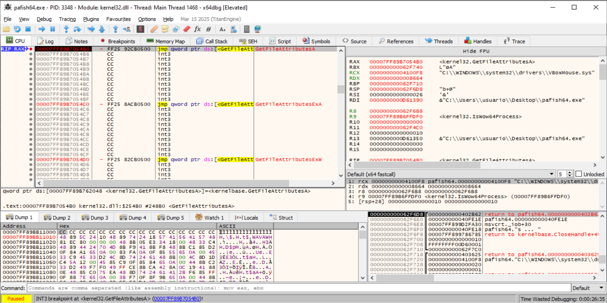

donde vemos:
```bash
RCX -> "C:\WINDOWS\system32\drivers\VBoxMouse.sys"
```

Pasa a comprobar:
```bash
VBoxMouse.sys  -> driver de ratón de VirtualBox
```

Esto significa que `Pafish` está comprobando si existe el `driver`:
```bash
C:\Windows\System32\drivers\VBoxMouse.sys
```

Este archivo es un artefacto típico de `VirtualBox Guest Additions`, por tanto se está comprobando la técnica:
```bash
Existen archivos concretos asociados a entornos virtualizados
```

Avanzamos y volvemos al código de `Pafish64.exe` después de ejecutar:
```bash
GetFileAttributesA("C:\\WINDOWS\\system32\\drivers\\VBoxMouse.sys");:
``` 

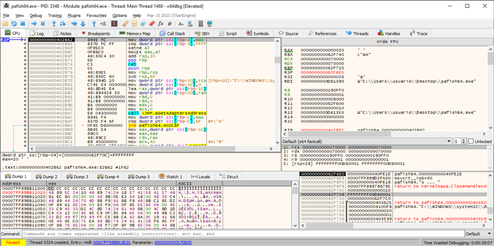

Y el retorno está en `RAX/EAX`:
```bash
RAX = 0000000000000020
EAX = 00000020
```

Eso significa:

```bash
EAX != FFFFFFFF
```

> [!Important]
> Por tanto:
> `C:\Windows\System32\drivers\VBoxMouse.sys`
> existe.

----

A continuación pasa a comprobar:
```bash
VBoxGuest.sys  -> driver principal de VirtualBox Guest Additions
```

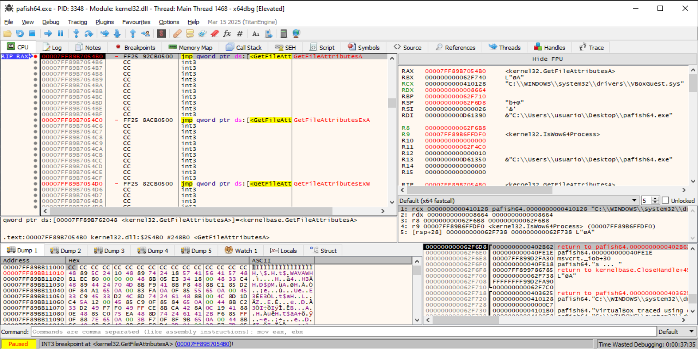


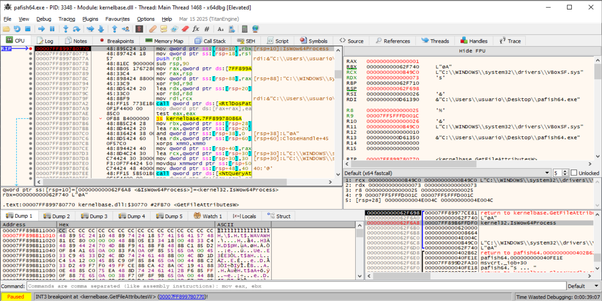


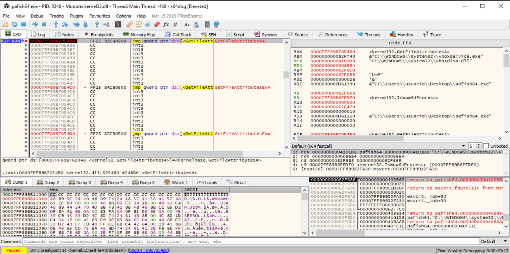

....

Vemos que la herramienta `Pafish` está recorriendo varios archivos:
```bash
VBoxMouse.sys
VBoxGuest.sys
VBoxSF.sys
VBoxVideo.sys
vboxdisp.dll
vboxhook.dll
vboxmrxnp.dll
vboxogl.dll
....
```
y por cada uno llama a `GetFileAttributesA`.


-------------------------


## 6.2 Técnica 2: Comprobar si existen directorios concretos

En esta técnica el malware hace:
```
GetFileAttributesA("C:\\analysis");
```
Aquí pregunta:
```
¿Existe el directorio C:\analysis?
```
**Esto es comprobar si existen directorios concretos.**


En esta técnica **se comprueba la existencia de carpetas completas asociadas a entornos de virtualización o sandbox**, por ejemplo:
```
C:\Program Files\Oracle\VirtualBox Guest Additions\
C:\Program Files\VMware\
C:\analysis
```
A diferencia de la técnica 1, aquí no se busca un archivo concreto, sino un directorio. La evidencia dinámica puede observarse con `GetFileAttributesA/W`, comprobando además si el resultado contiene el atributo `FILE_ATTRIBUTE_DIRECTORY`.


Para demostrar la técnica 2, necesitamoss una captura donde `RCX` apunte a un directorio, no a un archivo `.exe`. Ejemplos válidos:
```
C:\Program Files\Oracle\VirtualBox Guest Additions\
C:\Program Files\VMware\mo
C:\analysis
C:\sandbox
```


Durante la depuración de `pafish64.exe` en x64dbg se estableció un `breakpoint` en `GetFileAttributesA`. En una de las paradas, el registro `RCX`, que contiene el primer argumento de la función en x64, apuntaba a la siguiente ruta:

```text
C:\program files\oracle\virtualbox guest additions
```

Esta ruta corresponde al directorio de instalación de las VirtualBox Guest Additions. Por tanto, la llamada observada demuestra que Pafish está comprobando la existencia de un directorio asociado a un entorno virtualizado.

La llamada observada puede representarse como:
```
GetFileAttributesA("C:\\program files\\oracle\\virtualbox guest additions");
```

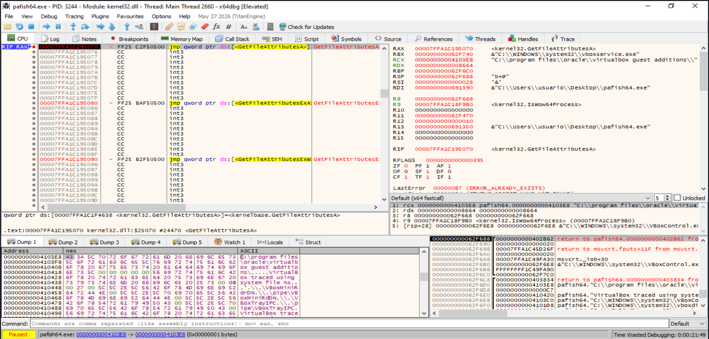  
donde:
- Vemos la consulta al directorio `C:\\program files\\oracle\\virtualbox guest additions`.
- Esta ruta corresponde al directorio de instalación de las `VirtualBox Guest Additions`, un artefacto característico de VirtualBox.


Pulsamos `Ctrl+F9` para ejecutar la función y volver al código de `pafish64.exe`:  

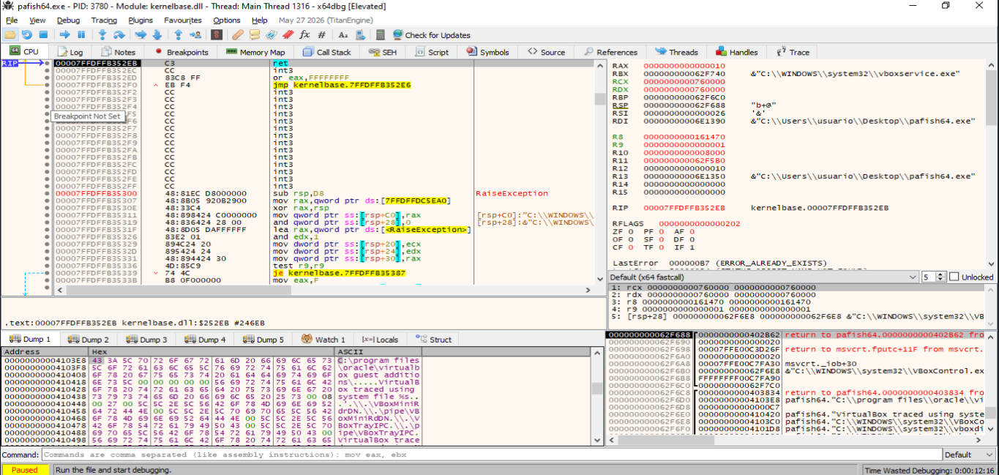  
donde:
- Estamos parados después de la llamada, dentro de kernelbase, y lo importante es que se ve:
  - RAX = 0000000000000010
  - EAX = 00000010
- Ese valor significa:
  - FILE_ATTRIBUTE_DIRECTORY = 0x10
- Por tanto, la interpretación es:
  - La ruta consultada existe y es un directorio.


La depuración de pafish64.exe permite confirmar dinámicamente la técnica 1.3.2 — Comprobar si existen directorios concretos. Durante la ejecución, Pafish llamó a GetFileAttributesA pasando como argumento la ruta C:\program files\oracle\virtualbox guest additions. Posteriormente, la API devolvió el valor 0x10, correspondiente a FILE_ATTRIBUTE_DIRECTORY.

Esto demuestra que el directorio existe en la máquina virtual analizada y que puede ser utilizado como artefacto para inferir la presencia de VirtualBox. La prueba confirma que incluso una máquina virtual limpia puede exponer directorios característicos del hipervisor, permitiendo que una muestra detecte el entorno de análisis mediante una comprobación sencilla del sistema de archivos.

-----


## 6.3 Técnica 3: Comprobar si la ruta completa del ejecutable contiene ciertas palabras

En esta técnica: [1.3.3. Técnica 3: Comprobar si la ruta completa del ejecutable contiene ciertas palabras](#133-técnica-3-comprobar-si-la-ruta-completa-del-ejecutable-contiene-ciertas-palabras) la muestra no comprueba si existe una carpeta externa. En su lugar, **obtiene su propia ruta de ejecución mediante APIs como:**
```
GetModuleFileNameA(NULL, buffer, MAX_PATH);
strstr(buffer, "analysis");
strstr(buffer, "sample");
```

Después compara esa ruta con cadenas sospechosas como:
```
¿Mi propia ruta de ejecución contiene "analysis" o "sample" o "virus" o "sandbox" o "analysis"?
```
**Esto es comprobar si la ruta completa del ejecutable contiene ciertas palabras.**


En esta técnica debemoscapturar APIs que obtienen la ruta del propio ejecutable y luego las comparaciones con palabras como `sample`, `virus`, `sandbox`, `malware` o `analysis`. En tu ficha esta técnica está asociada a `GetModuleFileName`, `GetProcessImageFileName` y `QueryFullProcessImageName`.

Copiamos Pafish a una ruta sospechosa:
```
mkdir C:\sample
copy C:\Users\Usuario\Desktop\pafish64.exe C:\sample\pafish64.exe
```

Después ponemos estos breakpoints:
```
bp kernel32.GetModuleFileNameA
bp kernel32.GetModuleFileNameW
```

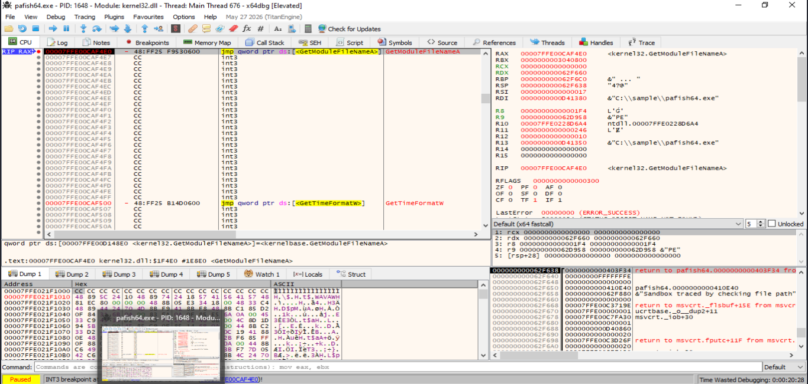  
donde:
- Vemos que se obtiene la ruta desde la que se está ejecutando el propio binario y comprueba si contiene una cadena sospechosa.


Ponemos Bps en:
```
bp msvcrt.strstr
bp msvcrt.strcmp
bp msvcrt.strncmp
bp msvcrt._stricmp
bp msvcrt._strnicmp
```

Avanzamos con `F9`:
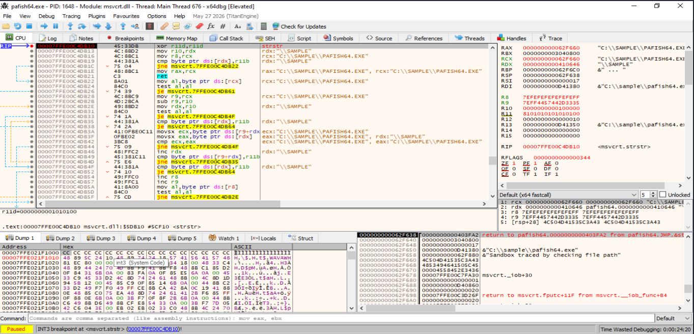  
donde:
- Vemos la comparación de cadenas.
- La evidencia clave es esta:
```
Módulo: msvcrt.dll
Función: strstr
RCX -> "C:\\SAMPLE\\PAFISH64.EXE"
RDX -> "\\SAMPLE"
```

`Pafish` está haciendo conceptualmente esto:
```bash
strstr("C:\\SAMPLE\\PAFISH64.EXE", "\\SAMPLE");
```

Eso demuestra directamente que está comprobando si la ruta completa del ejecutable contiene una palabra sospechosa.

Además, en la pila se observa el mensaje:
```bash
Sandbox traced by checking file path
```

Ese mensaje confirma que la detección está asociada a la comprobación de la ruta del archivo.

Avanzamos: 

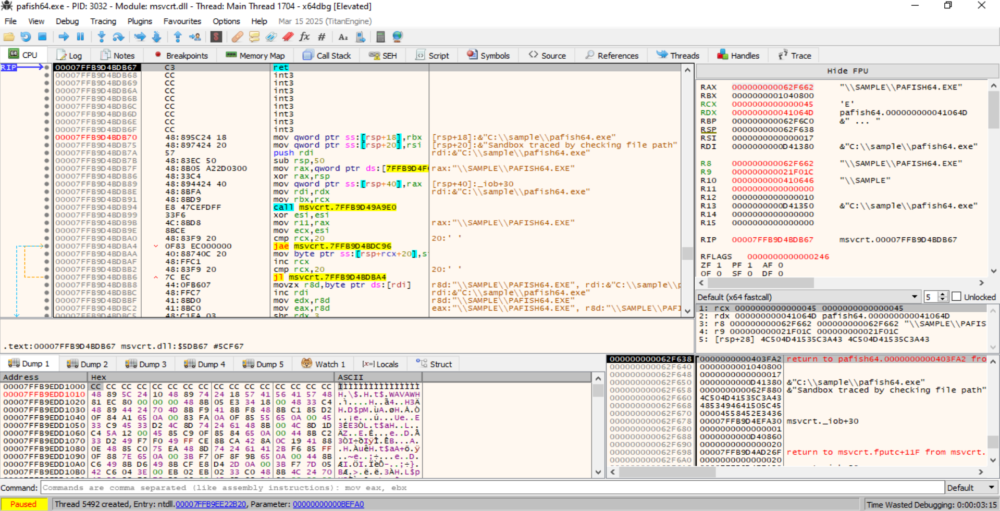


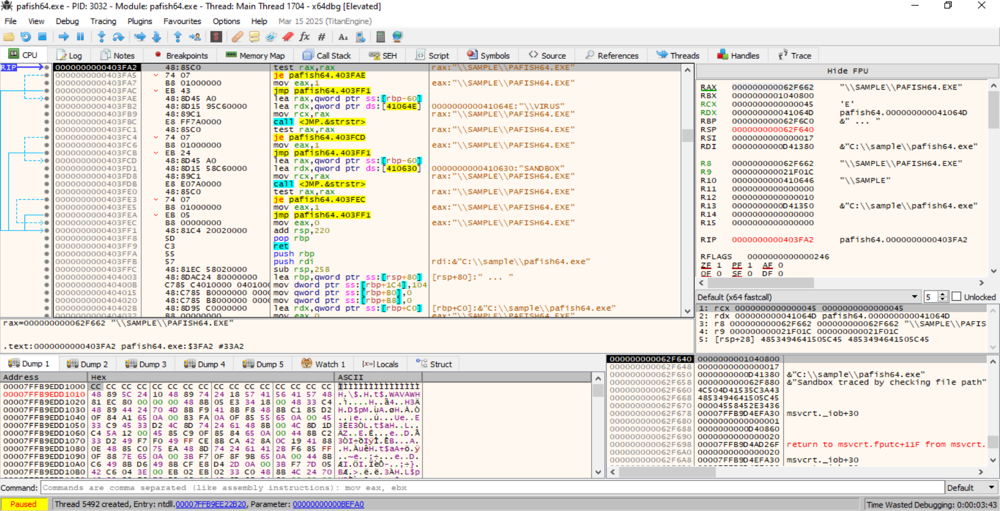

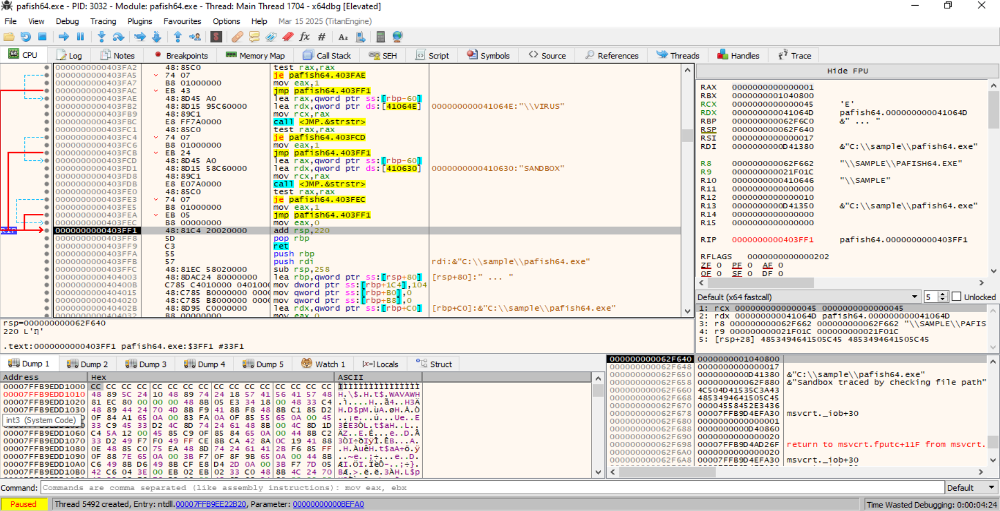


Cadena completa:
```bash
1. Pafish obtiene su propia ruta:
   C:\sample\pafish64.exe

2. Convierte o compara la ruta en mayúsculas:
   C:\SAMPLE\PAFISH64.EXE

3. Busca la subcadena:
   \SAMPLE

4. strstr devuelve un valor distinto de 0

5. Pafish interpreta que la ruta es sospechosa

6. Se activa el mensaje:
   Sandbox traced by checking file path
```


| Paso | Evidencia observada | Interpretación |
|---|---|---|
| 1 | Ruta de ejecución: `C:\sample\pafish64.exe` | Pafish se ejecuta desde una ruta sospechosa. |
| 2 | `RCX -> "C:\\SAMPLE\\PAFISH64.EXE"` | Cadena principal analizada por `strstr`. |
| 3 | `RDX -> "\\SAMPLE"` | Subcadena sospechosa buscada dentro de la ruta. |
| 4 | `RAX = 000000000062F662` tras `strstr` | La subcadena fue encontrada. |
| 5 | `RAX = 0000000000000001` | Pafish transforma la coincidencia en detección positiva. |
| 6 | `Sandbox traced by checking file path` | La herramienta marca el entorno como sospechoso por la ruta del ejecutable. |


La evidencia obtenida confirma la técnica `1.3.3`. Pafish obtiene la ruta completa del ejecutable, busca en ella la subcadena `\SAMPLE` mediante `strstr` y, al encontrarla, marca la comprobación como positiva. Esto demuestra cómo una ruta elegida por el analista, como `C:\sample\pafish64.exe`, puede delatar un entorno de análisis.

## 6.4 Técnica 4: Comprobar si el ejecutable se lanza desde un directorio concreto

Esta técnica es una variante más específica de la técnica 3. En lugar de buscar palabras genéricas dentro de la ruta, compara la ruta de ejecución con un directorio concreto conocido de `sandbox`, por ejemplo:
```
C:\insidetm
```


Hacemos una búsqueda de Strings en Pafish.exe:
```bash
└─$ strings -a -t x pafish64.exe | grep -iE "insidetm|anubis|cuckoo|sandbox|analysis|sample|virus"
   bc06 analysis-start
   bc15 analysis-start 
   c103 hi_sandbox_mouse_presence
   c120 Sandbox traced by absence of mouse device
   c162 hi_sandbox_rtt_mouse_movement
   c180 Sandbox traced by missing mouse movement
   c1c8 hi_sandbox_rtt_mouse_speed_limit
   c1f0 Sandbox traced by missing mouse movement or supernatural speed
   c244 hi_sandbox_rtt_mouse_click
   c260 Sandbox traced by missing mouse click activity
   c2b0 hi_sandbox_rtt_mouse_double_click
   c2d8 Sandbox traced by missing double click activity
   c32d hi_sandbox_rtt_confirm_dialog
   c350 Sandbox traced by missing dialog confirmation
   c3a0 hi_sandbox_rtt_implausible_confirm_dialog
   c3d0 Sandbox traced by missing or implausible dialog confirmation
   c437 Generic sandbox detection
   c451 hi_sandbox_username
   c468 Sandbox traced by checking username
   c49e hi_sandbox_path
   c4b0 Sandbox traced by checking file path
   c4e8 hi_sandbox_common_names
   c500 Sandbox traced by checking common sample names in drives root
   c540 Checking common sample names in drives root
   c56c hi_sandbox_drive_size
   c588 Sandbox traced by checking disk size <= 60GB via DeviceIoControl()
   c604 hi_sandbox_drive_size2
   c620 Sandbox traced by checking disk size <= 60GB via GetDiskFreeSpaceExA()
   c6a0 hi_sandbox_sleep_gettickcount
   c6c0 Sandbox traced by checking if Sleep() was patched using GetTickCount()
   c740 hi_sandbox_NumberOfProcessors_less_2_PEB
   c770 Sandbox traced by checking if NumberOfProcessors is less than 2 via PEB access
   c7f8 hi_sandbox_NumberOfProcessors_less_2_GetSystemInfo
   c830 Sandbox traced by checking if NumberOfProcessors is less than 2 via GetSystemInfo()
   c8c8 hi_sandbox_pysicalmemory_less_1Gb
   c8f0 Sandbox traced by checking if pysical memory is less than 1Gb
   c954 hi_sandbox_uptime
   c968 Sandbox traced by checking operating system uptime using GetTickCount()
   c9e6 hi_sandbox_IsNativeVhdBoot
   ca08 Sandbox traced by checking IsNativeVhdBoot()
   ca67 Sandboxie detection
   ca7b hi_sandboxie
   ca88 Sandboxie traced using GetModuleHandle(sbiedll.dll)
   d99b analysis-end
   d9a8  analysis-end
   e230 SANDBOX
   e238 VIRUS
   e246 \SAMPLE
   e24e \VIRUS
   e255 %ssample.exe
```
donde:
- No aparecen strings `insidetm`, `anubis` ni `cuckoo`.
- Por tanto, con esta versión de `Pafish` no tenemos evidencia para demostrar la técnica 6.4.
                                                                                                                                               


## 6.5 Técnica 5: Comprobar si existen ejecutables con nombres sospechosos en la raíz del disco

En esta técnica la muestra enumera unidades y comprueba si existen archivos con nombres típicos de laboratorio en la raíz, por ejemplo:
```
C:\sample.exe
C:\malware.exe
D:\sample.exe
D:\malware.exe
```

En la ejecución con `Pafish`, esta técnica se observa cuando el depurador se detiene en `GetFileAttributesA` y el argumento apunta a `C:\sample.exe`:
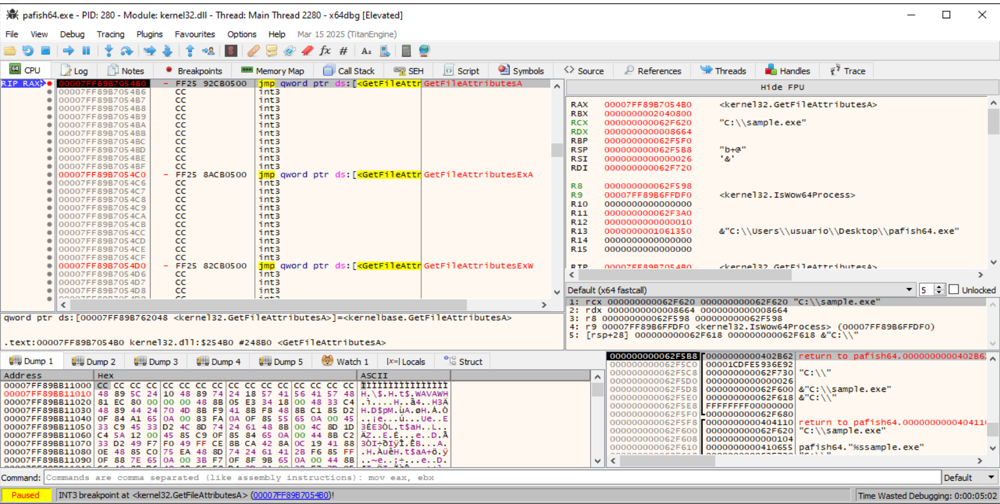

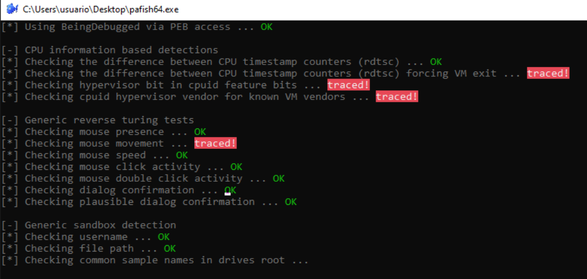

En `x64dbg`, el argumento se observó en `RCX`:

```bash
RCX -> "C:\\sample.exe"
```

Es decir, pafish está llamando a `GetFileAttributesA` para comprobar si existe este archivo:

```bash
C:\sample.exe
```

Esta primera parada todavía no es una comprobación de entornos virtual `VirtualBox/VMware`, sino una comprobación genérica de existencia de fichero sospechoso. Aun así pertenece al mismo patrón técnico: comprobar si existe un archivo concreto usando `GetFileAttributesA`.


**Avanzamos:**  
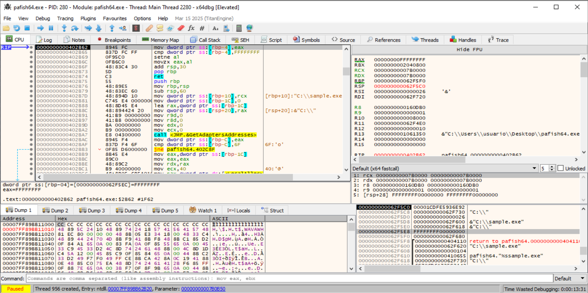

La llamada anterior fue:

```bash
GetFileAttributesA("C:\\sample.exe");
```

Y el valor de retorno está en `EAX/RAX`:

```bash
RAX = 00000000FFFFFFFF
EAX = FFFFFFFF
```

Eso significa:

```bash
INVALID_FILE_ATTRIBUTES
```

Este valor corresponde a `INVALID_FILE_ATTRIBUTES`, por lo que `C:\sample.exe` no existe. Aun así, la llamada demuestra que `Pafish` está comprobando la posible existencia de un ejecutable con nombre sospechoso en la raíz del disco, lo que encaja con la técnica 1.3.5.


Continúamos con:
```bash
F9
```

Cada vez que vuelva a parar en el `bp GetFileAttributesA,` miramos `RCX`:

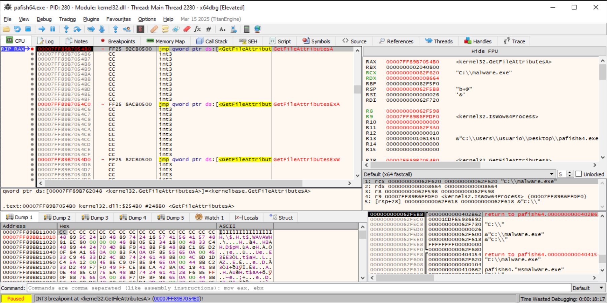
donde:
- Vemos que ahora se comprueba si existe el fichero malware.exe en el directorio raiz `c:`.


donde:
- Vemos que ahora se comprueba si existe el fichero malware.exe en el directorio raiz `d:`.


# 7. Al-Khaser


----

# 8. Aplicación al TFM 

Las técnicas de evasión basadas en `filesystem` permiten a una muestra comprobar la existencia de archivos, directorios o rutas asociadas a entornos virtualizados y sandboxes. Estas comprobaciones suelen realizarse mediante `APIs` legítimas de Windows, como `GetFileAttributes`, `GetModuleFileName` o `GetLogicalDriveStrings`. Aunque estas funciones no son maliciosas por sí mismas, su combinación con indicadores como `vmmouse.sys`, `VBoxGuest.sys`, `C:\analysis`, `sample.exe` o `malware.exe` puede revelar un intento de detección del entorno de análisis.

En el contexto de este TFM, esta técnica se utiliza para estudiar cómo una muestra puede inferir que se encuentra en una máquina virtual o laboratorio mediante artefactos simples del sistema de archivos. Su análisis permite relacionar evidencias estáticas, como imports y strings, con evidencias dinámicas obtenidas mediante Process Monitor o depuradores. Además, sirve para justificar la necesidad de preparar entornos de análisis más realistas y evitar rutas o nombres de archivo que puedan activar mecanismos anti-sandbox.
