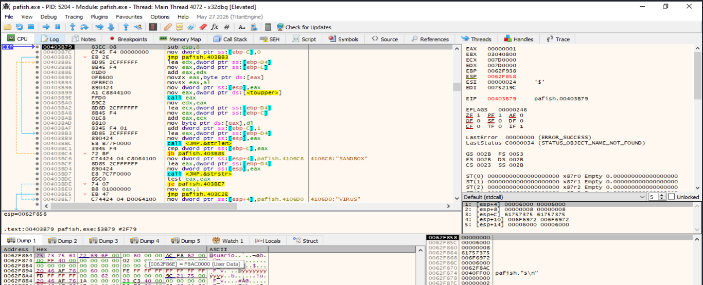
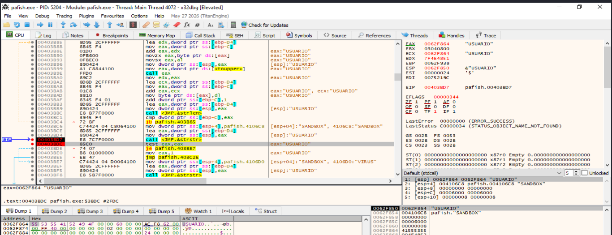
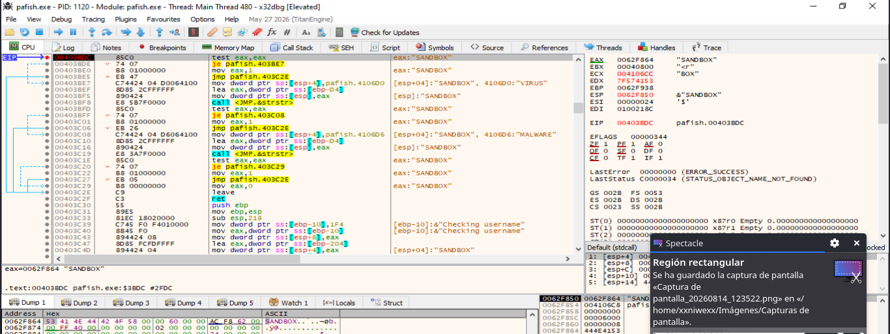
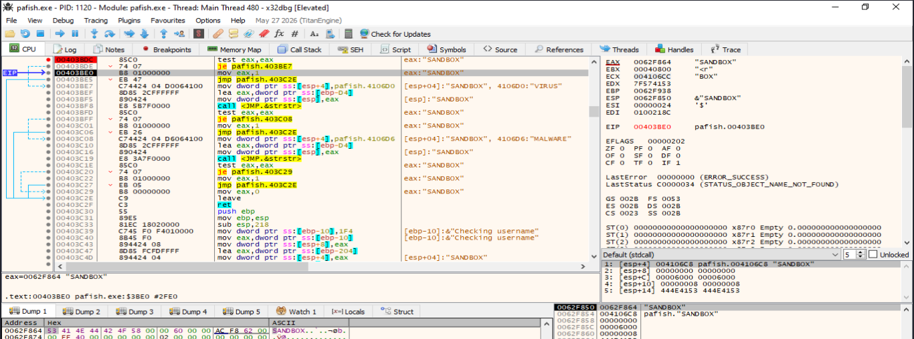
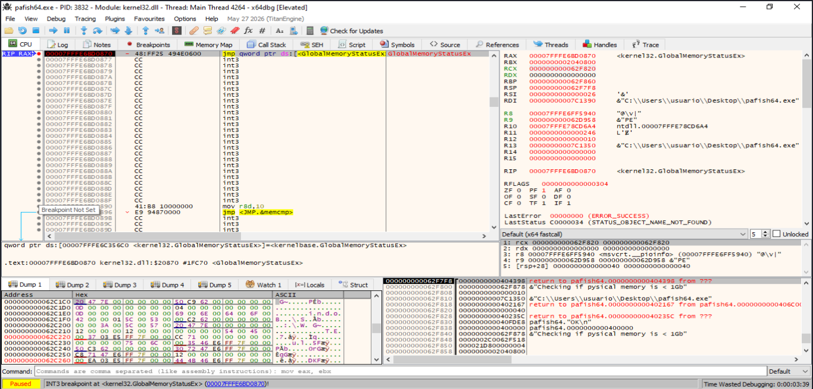
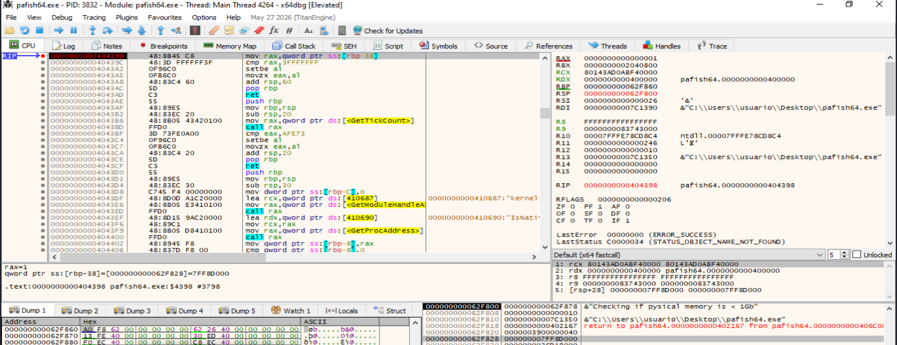
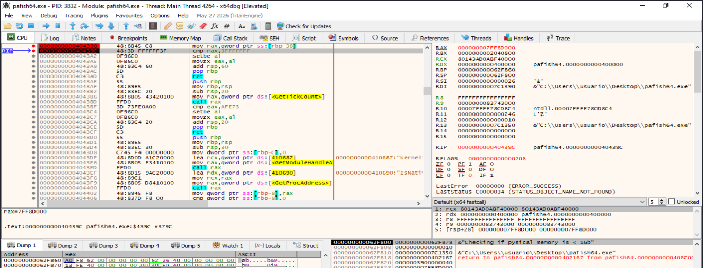
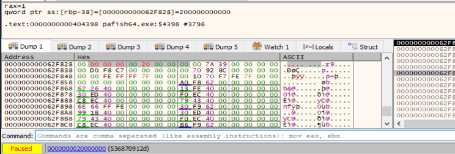
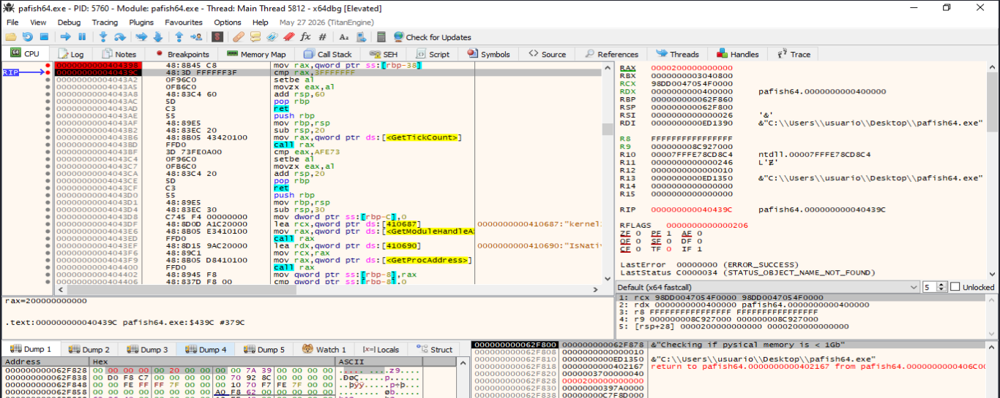
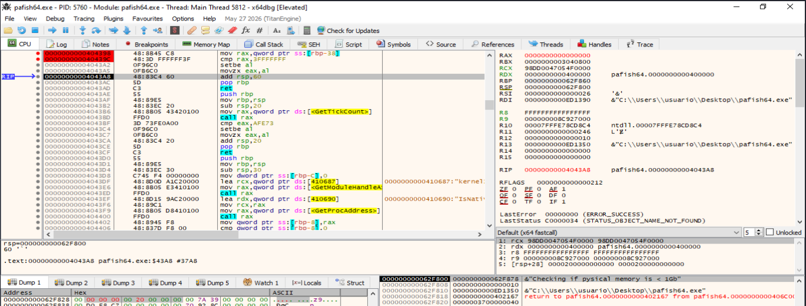

- [12. Generic OS Queries](#12-generic-os-queries)
  - [12.1. Descripción de la técnica `Generic OS Queries`](#121-descripción-de-la-técnica-generic-os-queries)
  - [12.2. Categoría](#122-categoría)
  - [12.3. Técnicas principales](#123-técnicas-principales)
    - [12.3.1. Comprobación del nombre de usuario](#1231-comprobación-del-nombre-de-usuario)
    - [12.3.2. Comprobación del nombre del equipo](#1232-comprobación-del-nombre-del-equipo)
    - [12.3.3. Comprobación del nombre DNS del host](#1233-comprobación-del-nombre-dns-del-host)
    - [12.3.4. Comprobación de memoria RAM reducida](#1234-comprobación-de-memoria-ram-reducida)
    - [12.3.5. Comprobación de resolución de pantalla](#1235-comprobación-de-resolución-de-pantalla)
    - [12.3.6. Comprobación de un número reducido de procesadores](#1236-comprobación-de-un-número-reducido-de-procesadores)
    - [12.3.7. Comprobación de la cantidad de monitores](#1237-comprobación-de-la-cantidad-de-monitores)
    - [12.3.8. Comprobación del tamaño y espacio libre del disco](#1238-comprobación-del-tamaño-y-espacio-libre-del-disco)
    - [12.3.9. Comprobación de un tiempo de actividad reducido](#1239-comprobación-de-un-tiempo-de-actividad-reducido)
    - [12.3.10. Comprobación de arranque desde VHD](#12310-comprobación-de-arranque-desde-vhd)
  - [12.4. Resumen visual de las técnicas que aparecen en `Generic OS Queries`](#124-resumen-visual-de-las-técnicas-que-aparecen-en-generic-os-queries)
  - [12.5. Contramedidas ofensivas](#125-contramedidas-ofensivas)
  - [12.6. Contramedidas defensivas](#126-contramedidas-defensivas)
  - [12.7. Checklist rápido del laboratorio](#127-checklist-rápido-del-laboratorio)
    - [Preparación del entorno](#preparación-del-entorno)
    - [Análisis estático previo](#análisis-estático-previo)
    - [Comprobaciones de usuario y nombre del equipo](#comprobaciones-de-usuario-y-nombre-del-equipo)
    - [Comprobaciones de memoria RAM](#comprobaciones-de-memoria-ram)
    - [Comprobaciones de procesadores](#comprobaciones-de-procesadores)
    - [Comprobaciones de pantalla y monitores](#comprobaciones-de-pantalla-y-monitores)
    - [Comprobaciones de disco](#comprobaciones-de-disco)
    - [Comprobación del uptime](#comprobación-del-uptime)
    - [Comprobación de arranque desde VHD](#comprobación-de-arranque-desde-vhd)
    - [Interpretación de los resultados](#interpretación-de-los-resultados)
    - [Evidencias que deben documentarse](#evidencias-que-deben-documentarse)
    - [Conclusión del checklist](#conclusión-del-checklist)
  - [12.8 Demostración dinámica](#128-demostración-dinámica)
    - [12.8.1. Comprobación del nombre de usuario](#1281-comprobación-del-nombre-de-usuario)
      - [Objetivo de la demostración](#objetivo-de-la-demostración)
      - [Herramientas y entorno utilizados](#herramientas-y-entorno-utilizados)
      - [Breakpoints iniciales](#breakpoints-iniciales)
      - [Entrada en `GetUserNameA`](#entrada-en-getusernamea)
      - [Obtención del nombre de usuario](#obtención-del-nombre-de-usuario)
      - [Normalización de la cadena](#normalización-de-la-cadena)
      - [Comparación con la cadena `SANDBOX`](#comparación-con-la-cadena-sandbox)
      - [Resultado negativo con el usuario `USUARIO`](#resultado-negativo-con-el-usuario-usuario)
      - [Preparación de una detección positiva controlada](#preparación-de-una-detección-positiva-controlada)
      - [Resultado positivo con el usuario `SANDBOX`](#resultado-positivo-con-el-usuario-sandbox)
      - [Activación de la rama positiva](#activación-de-la-rama-positiva)
      - [Comparación entre ambas ejecuciones](#comparación-entre-ambas-ejecuciones)
      - [Evidencias demostradas](#evidencias-demostradas)
      - [Relación con la técnica `Generic OS Queries`](#relación-con-la-técnica-generic-os-queries)
      - [Limitaciones](#limitaciones)
      - [Conclusión](#conclusión)
    - [12.8.2. Comprobación de la memoria RAM](#1282-comprobación-de-la-memoria-ram)
      - [Objetivo de la demostración](#objetivo-de-la-demostración-1)
      - [Herramientas y entorno utilizados](#herramientas-y-entorno-utilizados-1)
      - [Breakpoints iniciales](#breakpoints-iniciales-1)
      - [Entrada en `GlobalMemoryStatusEx`](#entrada-en-globalmemorystatusex)
      - [Ejecución negativa de referencia](#ejecución-negativa-de-referencia)
        - [Obtención de la memoria física real](#obtención-de-la-memoria-física-real)
        - [Localización de la comparación](#localización-de-la-comparación)
        - [Resultado negativo](#resultado-negativo)
      - [Ejecución positiva controlada](#ejecución-positiva-controlada)
        - [Modificación de `ullTotalPhys`](#modificación-de-ulltotalphys)
        - [Lectura del valor manipulado](#lectura-del-valor-manipulado)
        - [Resultado positivo](#resultado-positivo)
      - [Comparación de ambas ejecuciones](#comparación-de-ambas-ejecuciones)
      - [Interpretación de la técnica](#interpretación-de-la-técnica)
      - [Evidencias obtenidas](#evidencias-obtenidas)
      - [Limitaciones](#limitaciones-1)
      - [Conclusión](#conclusión-1)
    - [12.8.3 Número reducido de procesadores](#1283-número-reducido-de-procesadores)


# 12. Generic OS Queries

## 12.1. Descripción de la técnica `Generic OS Queries`

La técnica `Generic OS Queries` consiste en realizar consultas genéricas al sistema operativo con el objetivo de obtener información sobre el entorno de ejecución y determinar si sus características son compatibles con un equipo de usuario real o, por el contrario, presentan indicadores habituales de una máquina virtual, una sandbox o un entorno de análisis.

A diferencia de otras técnicas anti-VM que buscan artefactos muy específicos —por ejemplo, nombres de procesos, claves de Registro, controladores o cadenas de un hipervisor concreto—, `Generic OS Queries` se basa principalmente en propiedades generales del sistema. Entre ellas pueden encontrarse el nombre de usuario, el nombre del equipo, el nombre DNS del host, la cantidad de memoria RAM, el número de procesadores, la resolución de pantalla, el número de monitores, el tamaño del disco, el tiempo de actividad del sistema o el tipo de arranque utilizado.

La lógica general de la técnica puede representarse de la siguiente forma:

```text
Consultar una característica del sistema
        ↓
Obtener el valor observado
        ↓
Compararlo con un valor, lista o umbral
        ↓
Valorar si el resultado parece poco habitual
        ↓
Continuar, retrasar, modificar o finalizar la ejecución
```

Por ejemplo, una muestra puede considerar sospechoso un sistema con un único procesador lógico, poca memoria RAM, un disco de tamaño reducido, un nombre de usuario genérico o un tiempo de actividad de pocos minutos. Ninguno de estos indicadores demuestra por sí mismo la existencia de virtualización, pero la combinación de varios puede aumentar la confianza de la heurística.

En Windows, estas comprobaciones pueden realizarse mediante APIs como `GetUserName`, `GetComputerName`, `GetComputerNameEx`, `GlobalMemoryStatusEx`, `GetSystemInfo`, `GetNativeSystemInfo`, `GetSystemMetrics`, `EnumDisplayMonitors`, `GetDiskFreeSpaceEx`, `GetTickCount64` o `IsNativeVhdBoot`. También pueden obtenerse datos equivalentes mediante WMI, estructuras internas como el PEB o `KUSER_SHARED_DATA`, consultas nativas y otras interfaces del sistema.

Desde el punto de vista del análisis de malware, la presencia aislada de estas APIs no debe interpretarse automáticamente como una técnica de evasión. Son funciones legítimas utilizadas por multitud de aplicaciones para inventario, telemetría, compatibilidad, diagnóstico o adaptación de recursos. La evidencia adquiere mayor relevancia cuando la consulta va seguida de una comparación con valores sospechosos y esa comparación modifica el flujo de ejecución.

Por tanto, `Generic OS Queries` debe considerarse una técnica **heurística**. Su análisis requiere observar no solo qué información se solicita, sino también cómo se procesa, qué umbral se aplica, qué ramas condicionales aparecen y qué comportamiento adopta la muestra después de la comprobación.

----

## 12.2. Categoría

La técnica `Generic OS Queries` se clasifica dentro de las técnicas de **evasión y anti-análisis**, principalmente en las categorías **anti-VM** y **anti-sandbox**. Su finalidad es caracterizar el entorno mediante propiedades generales del sistema operativo y detectar configuraciones que resulten poco habituales para un equipo de usuario real.

Dentro de una taxonomía de evasión puede representarse de la siguiente forma:

| Campo | Clasificación |
|---|---|
| Categoría | Evasión / Anti-análisis |
| Subcategoría | Anti-VM / Anti-sandbox |
| Tipo de artefacto | Propiedades generales del sistema operativo |
| Fuentes principales | APIs Win32, WMI, estructuras internas y consultas nativas |
| Sistema principal | Windows |
| Naturaleza de la detección | Heurística |
| Prioridad para el TFM | Media-Alta |

Las consultas pueden centrarse en características de identidad del sistema, recursos asignados o propiedades de uso. Entre los indicadores más habituales se encuentran:

- Nombre de usuario.
- Nombre del equipo.
- Nombre DNS del host.
- Cantidad de memoria RAM.
- Número de procesadores.
- Resolución de pantalla.
- Número de monitores.
- Tamaño y espacio libre del disco.
- Tiempo de actividad del sistema.
- Arranque desde un disco duro virtual.

También pueden aparecer consultas de versión, compilación o arquitectura del sistema operativo mediante mecanismos como `RtlGetVersion`, `GetSystemInfo` o `GetNativeSystemInfo`. Estas consultas son especialmente útiles para adaptar el comportamiento de una muestra, aunque por sí mismas no constituyen necesariamente una detección anti-VM.

La principal característica de esta categoría es que los valores consultados suelen ser **legítimos y no exclusivos de la virtualización**. Un equipo físico puede tener poca RAM, un único monitor o un nombre de usuario genérico; del mismo modo, una máquina virtual bien configurada puede presentar valores completamente realistas. Por ello, la técnica gana relevancia cuando varias comprobaciones se correlacionan antes de tomar una decisión.

----

## 12.3. Técnicas principales

`Generic OS Queries` puede implementarse mediante diferentes consultas al sistema operativo. Todas comparten el mismo patrón: recuperar una propiedad del entorno, compararla con una referencia y utilizar el resultado para valorar si el sistema presenta características compatibles con un laboratorio automatizado o una máquina virtual.

Entre las variantes principales se encuentran:

- Comprobar si el nombre de usuario coincide con valores considerados genéricos o asociados a entornos de análisis.
- Analizar el nombre del equipo.
- Consultar el nombre DNS del host.
- Comprobar si la cantidad de memoria RAM es reducida.
- Analizar la resolución de pantalla.
- Comprobar si el número de procesadores es bajo.
- Contar el número de monitores.
- Analizar el tamaño total y el espacio libre del disco.
- Comprobar si el tiempo de actividad del sistema es demasiado reducido.
- Determinar si Windows se inició desde un contenedor VHD.

El patrón general puede expresarse como:

```text
Obtener propiedad del sistema
        ↓
Normalizar el resultado
        ↓
Comparar con lista o umbral
        ↓
Asignar una puntuación o resultado
        ↓
Modificar el flujo si se supera el criterio
```

Desde el punto de vista del análisis, resulta esencial distinguir entre una **consulta legítima** y una **consulta utilizada con finalidad evasiva**. La llamada a `GetSystemInfo`, por ejemplo, solo adquiere interés anti-análisis cuando el programa utiliza `dwNumberOfProcessors` para decidir si debe continuar o no.

----

### 12.3.1. Comprobación del nombre de usuario

Una de las variantes más simples consiste en recuperar el nombre del usuario asociado al contexto de ejecución y compararlo con una lista de valores considerados poco habituales o utilizados históricamente en laboratorios automatizados.

En Windows pueden emplearse funciones como:

```text
GetUserNameA
GetUserNameW
GetUserNameExA
GetUserNameExW
```

El procedimiento general es:

```text
Obtener nombre de usuario
        ↓
Convertir o normalizar la cadena
        ↓
Comparar con una lista de nombres
        ↓
Marcar coincidencia sospechosa
```

Un esquema conceptual sería:

```cpp
char usuario[256] = {0};
DWORD longitud = sizeof(usuario);

if (GetUserNameA(usuario, &longitud)) {
    // Comparar el nombre obtenido con una lista de valores de interés
}
```

Durante el análisis dinámico puede configurarse un punto de ruptura en:

```text
advapi32!GetUserNameA
advapi32!GetUserNameW
secur32!GetUserNameExA
secur32!GetUserNameExW
```

Debe observarse:

- El búfer donde se almacena el nombre.
- El valor devuelto por la función.
- La rutina que normaliza o transforma la cadena.
- Las comparaciones posteriores.
- Posibles llamadas a `lstrcmpi`, `strcmp`, `stricmp`, `CompareString` o rutinas equivalentes.
- El salto condicional que depende del resultado.
- El comportamiento adoptado si existe coincidencia.

Esta comprobación presenta una fiabilidad limitada. Los nombres de usuario pueden ser totalmente arbitrarios y un valor aparentemente genérico puede pertenecer a un sistema físico legítimo. Por ello, la evidencia resulta más significativa cuando se combina con otras propiedades del entorno.

----

### 12.3.2. Comprobación del nombre del equipo

El nombre del equipo puede utilizarse como otro indicador de reconocimiento ambiental. Algunos entornos automatizados emplean nombres predefinidos, patrones repetitivos o identificadores generados a partir de plantillas.

Las APIs más habituales son:

```text
GetComputerNameA
GetComputerNameW
GetComputerNameExA
GetComputerNameExW
```

`GetComputerName` devuelve el nombre NetBIOS local, mientras que `GetComputerNameEx` permite obtener distintas representaciones, como el nombre DNS del host o el nombre DNS completo.

La secuencia de análisis suele ser:

```text
GetComputerName
        ↓
Obtener cadena
        ↓
Comparar con patrón o lista
        ↓
Evaluar resultado
```

En `x32dbg` o `x64dbg` pueden utilizarse breakpoints como:

```text
kernel32!GetComputerNameA
kernel32!GetComputerNameW
kernel32!GetComputerNameExA
kernel32!GetComputerNameExW
```

En versiones actuales de Windows, algunas de estas funciones pueden estar implementadas o redirigidas a través de `KernelBase`, por lo que también conviene revisar:

```text
kernelbase!GetComputerNameA
kernelbase!GetComputerNameW
kernelbase!GetComputerNameExA
kernelbase!GetComputerNameExW
```

La presencia de un nombre concreto no debe considerarse una confirmación de sandbox. Lo relevante es comprobar si el programa contiene una lista de valores, una expresión de coincidencia o una condición que altera el flujo tras obtener el nombre.

----

### 12.3.3. Comprobación del nombre DNS del host

Aunque está relacionada con la comprobación anterior, algunas muestras consultan específicamente el nombre DNS del host mediante `GetComputerNameEx`.

Un formato habitual es:

```text
ComputerNameDnsHostname
```

La lógica conceptual es:

```cpp
char hostname[256] = {0};
DWORD tam = sizeof(hostname);

GetComputerNameExA(
    ComputerNameDnsHostname,
    hostname,
    &tam
);
```

Desde el punto de vista del análisis, debe observarse el valor de `NameType` utilizado por `GetComputerNameEx`. Diferentes valores de `COMPUTER_NAME_FORMAT` permiten recuperar:

- Nombre NetBIOS.
- Nombre DNS del host.
- Nombre DNS del dominio.
- Nombre DNS completo.
- Formas físicas o virtuales asociadas a la configuración del equipo.

Una muestra puede comparar el resultado con un patrón concreto, comprobar su longitud o buscar cadenas características. Nuevamente, la fiabilidad individual de esta técnica es reducida y debe correlacionarse con otras comprobaciones.

----

### 12.3.4. Comprobación de memoria RAM reducida

Los entornos de análisis y las máquinas virtuales se han configurado tradicionalmente con una cantidad de memoria inferior a la de muchos equipos de usuario. Una muestra puede aprovechar esta diferencia consultando la memoria física disponible y comparándola con un umbral.

La API más habitual es:

```text
GlobalMemoryStatusEx
```

Esta función rellena una estructura `MEMORYSTATUSEX`, cuyo campo `ullTotalPhys` contiene la cantidad de memoria física disponible para el sistema operativo.

El patrón general es:

```text
GlobalMemoryStatusEx
        ↓
Leer ullTotalPhys
        ↓
Convertir a MB o GB
        ↓
Comparar con un umbral
```

Un ejemplo conceptual sería:

```cpp
MEMORYSTATUSEX memoria = {0};
memoria.dwLength = sizeof(memoria);

if (GlobalMemoryStatusEx(&memoria)) {
    unsigned long long ram = memoria.ullTotalPhys;
    // Analizar el valor obtenido
}
```

Durante el análisis deben observarse:

- El puntero a `MEMORYSTATUSEX`.
- El valor de `ullTotalPhys`.
- La conversión realizada por el programa.
- La constante utilizada como umbral.
- La comparación y el salto posterior.

Pueden aparecer umbrales históricos muy bajos —por ejemplo, 1 o 2 GB— o valores más elevados adaptados a sistemas actuales. No existe un umbral universal: un equipo legítimo puede disponer de pocos recursos y una VM moderna puede tener asignada una cantidad elevada de memoria.

La evidencia resulta más sólida cuando la memoria reducida se combina con pocos procesadores, un disco pequeño u otras señales de laboratorio.

----

### 12.3.5. Comprobación de resolución de pantalla

Algunos entornos automatizados utilizan resoluciones de pantalla reducidas, configuraciones por defecto o escritorios que no se corresponden con las resoluciones habituales de un usuario real.

Las funciones utilizadas pueden incluir:

```text
GetSystemMetrics
GetDesktopWindow
GetWindowRect
SystemParametersInfo
GetMonitorInfo
EnumDisplaySettings
```

Por ejemplo:

```text
GetSystemMetrics(SM_CXSCREEN)
GetSystemMetrics(SM_CYSCREEN)
```

permiten obtener dimensiones relacionadas con la pantalla principal.

La lógica habitual es:

```text
Consultar anchura y altura
        ↓
Construir resolución
        ↓
Comparar con valores mínimos o patrones
        ↓
Evaluar si la configuración resulta poco habitual
```

En el análisis dinámico debe prestarse atención a los índices pasados a `GetSystemMetrics`, ya que la misma función permite consultar numerosos parámetros no relacionados con evasión.

Breakpoints útiles:

```text
user32!GetSystemMetrics
user32!GetWindowRect
user32!SystemParametersInfoA
user32!SystemParametersInfoW
user32!GetMonitorInfoA
user32!GetMonitorInfoW
```

Una resolución pequeña no demuestra virtualización. También pueden existir sistemas físicos con configuraciones de accesibilidad, escritorios remotos, pantallas antiguas o sesiones con resoluciones reducidas.

----

### 12.3.6. Comprobación de un número reducido de procesadores

El número de procesadores lógicos asignados al sistema es otra propiedad utilizada en técnicas anti-sandbox. Históricamente, muchos entornos automatizados se desplegaban con una única CPU virtual para reducir el consumo de recursos.

La API clásica es:

```text
GetSystemInfo
```

El número de procesadores se almacena en:

```text
SYSTEM_INFO.dwNumberOfProcessors
```

Para procesos ejecutados bajo determinadas capas de emulación o WOW64 también puede utilizarse:

```text
GetNativeSystemInfo
```

El patrón conceptual es:

```cpp
SYSTEM_INFO info = {0};
GetSystemInfo(&info);

// Examinar info.dwNumberOfProcessors
```

El mismo dato o información relacionada puede recuperarse mediante otros mecanismos, como:

- PEB.
- `KUSER_SHARED_DATA`.
- `NtQuerySystemInformation`.
- WMI.
- Variables o estructuras internas del sistema.

Durante el análisis debe comprobarse:

- Si se llama a `GetSystemInfo` o `GetNativeSystemInfo`.
- Qué campo de `SYSTEM_INFO` se utiliza.
- Qué umbral se aplica.
- Si el valor se combina con RAM, disco u otros indicadores.
- Qué rama se toma cuando el número de procesadores se considera insuficiente.

Una regla del tipo «menos de dos procesadores = VM» es claramente heurística. Los sistemas modernos permiten configurar VMs con numerosos núcleos y todavía existen dispositivos físicos con configuraciones limitadas.

----

### 12.3.7. Comprobación de la cantidad de monitores

Una sandbox o VM destinada al análisis automatizado suele utilizar una configuración gráfica mínima. Algunas muestras cuentan el número de monitores para inferir si existe un entorno de usuario real.

Las funciones más habituales son:

```text
EnumDisplayMonitors
GetSystemMetrics
```

En el segundo caso puede consultarse:

```text
GetSystemMetrics(SM_CMONITORS)
```

`EnumDisplayMonitors` permite enumerar monitores mediante una función callback definida por la aplicación.

La secuencia típica es:

```text
Enumerar monitores
        ↓
Incrementar contador
        ↓
Comparar cantidad obtenida
        ↓
Valorar el entorno
```

Breakpoints útiles:

```text
user32!EnumDisplayMonitors
user32!GetSystemMetrics
```

Debe tenerse en cuenta que ambas técnicas no tienen exactamente la misma semántica. `GetSystemMetrics(SM_CMONITORS)` cuenta monitores de visualización visibles, mientras que `EnumDisplayMonitors` puede enumerar también determinados pseudo-monitores asociados a controladores de mirroring.

Un único monitor es una configuración completamente normal en muchos equipos físicos, por lo que esta comprobación solo tiene valor como señal complementaria.

----

### 12.3.8. Comprobación del tamaño y espacio libre del disco

El tamaño del almacenamiento es una de las consultas genéricas más utilizadas para identificar laboratorios con discos virtuales reducidos.

La comprobación puede realizarse desde dos perspectivas:

1. Tamaño del disco o dispositivo.
2. Espacio total o libre del volumen.

Entre los mecanismos más habituales se encuentran:

```text
GetDiskFreeSpaceExA
GetDiskFreeSpaceExW
DeviceIoControl
IOCTL_DISK_GET_LENGTH_INFO
```

`GetDiskFreeSpaceEx` devuelve información del volumen, mientras que `IOCTL_DISK_GET_LENGTH_INFO` permite recuperar la longitud de un disco, volumen o partición.

El procedimiento general es:

```text
Abrir o identificar el volumen/disco
        ↓
Consultar tamaño total
        ↓
Convertir bytes a GB
        ↓
Comparar con un umbral
```

También puede analizarse el espacio libre para estimar si el sistema apenas contiene datos.

Durante el análisis dinámico pueden resultar relevantes:

```text
kernel32!GetDiskFreeSpaceExA
kernel32!GetDiskFreeSpaceExW
kernel32!CreateFileA
kernel32!CreateFileW
kernel32!DeviceIoControl
```

Debe revisarse especialmente:

- La ruta utilizada, como `C:\` o `\\.\PhysicalDrive0`.
- El código de control enviado a `DeviceIoControl`.
- El valor devuelto.
- La conversión a MB o GB.
- El umbral utilizado.
- La comparación y rama posterior.

Un disco pequeño no demuestra virtualización. VMs corporativas, sistemas embebidos, equipos físicos antiguos y dispositivos con almacenamiento limitado pueden presentar valores similares.

----

### 12.3.9. Comprobación de un tiempo de actividad reducido

Un sistema restaurado desde una instantánea o recién iniciado para ejecutar una muestra puede presentar un tiempo de actividad muy bajo. Algunas sandboxes se reinician o restauran antes de cada análisis, por lo que el malware puede consultar cuánto tiempo ha transcurrido desde el arranque.

Las funciones habituales incluyen:

```text
GetTickCount
GetTickCount64
NtQuerySystemInformation
```

`GetTickCount64` devuelve el número de milisegundos transcurridos desde el inicio del sistema.

La comprobación general es:

```text
Obtener uptime
        ↓
Convertir a minutos u horas
        ↓
Comparar con un umbral mínimo
        ↓
Marcar el entorno como poco habitual
```

Un ejemplo conceptual:

```cpp
ULONGLONG uptime_ms = GetTickCount64();
ULONGLONG uptime_min = uptime_ms / (60ULL * 1000ULL);

// Comparar uptime_min con el criterio de la muestra
```

En análisis dinámico pueden utilizarse:

```text
kernel32!GetTickCount
kernel32!GetTickCount64
ntdll!NtQuerySystemInformation
```

Esta técnica se relaciona con `timing`, pero su finalidad es diferente. En `timing` se mide la duración de una operación; en `Generic OS Queries`, el uptime se utiliza como una propiedad global del entorno.

Un tiempo de actividad bajo puede deberse a un reinicio legítimo, una actualización del sistema o el encendido reciente del equipo. Por ello, debe tratarse como un indicador heurístico.

----

### 12.3.10. Comprobación de arranque desde VHD

Windows incluye la función:

```text
IsNativeVhdBoot
```

que permite determinar si el sistema operativo se inició desde un contenedor VHD.

La lógica general es:

```text
IsNativeVhdBoot
        ↓
Obtener indicador booleano
        ↓
Interpretar el tipo de arranque
        ↓
Modificar el comportamiento si procede
```

Un esquema conceptual sería:

```cpp
BOOL vhd = FALSE;

if (IsNativeVhdBoot(&vhd)) {
    // Examinar el valor de vhd
}
```

Durante el análisis puede establecerse un breakpoint en:

```text
kernel32!IsNativeVhdBoot
kernelbase!IsNativeVhdBoot
```

Esta comprobación debe interpretarse con especial cautela. El arranque nativo desde VHD es una funcionalidad legítima de Windows y no equivale necesariamente a ejecutar el sistema dentro de VMware, VirtualBox, Hyper-V u otro hipervisor. Por tanto, un resultado positivo identifica una característica concreta del método de arranque, no una prueba universal de virtualización.

----

## 12.4. Resumen visual de las técnicas que aparecen en `Generic OS Queries`

El objetivo general de `Generic OS Queries` consiste en identificar propiedades del sistema que resulten compatibles con un entorno de análisis automatizado, una máquina virtual con recursos mínimos o una configuración poco habitual.

La técnica puede resumirse de la siguiente forma:

```text
Generic OS Queries
│
├── 1. Identidad del usuario
│   ├── GetUserNameA/W
│   └── GetUserNameExA/W
│
├── 2. Identidad del equipo
│   ├── GetComputerNameA/W
│   └── GetComputerNameExA/W
│
├── 3. Nombre DNS del host
│   └── GetComputerNameExA/W
│
├── 4. Memoria RAM
│   └── GlobalMemoryStatusEx
│
├── 5. Configuración de pantalla
│   ├── GetSystemMetrics
│   ├── GetWindowRect
│   ├── SystemParametersInfo
│   └── GetMonitorInfo
│
├── 6. Número de procesadores
│   ├── GetSystemInfo
│   ├── GetNativeSystemInfo
│   ├── PEB
│   ├── KUSER_SHARED_DATA
│   └── NtQuerySystemInformation
│
├── 7. Número de monitores
│   ├── EnumDisplayMonitors
│   └── GetSystemMetrics(SM_CMONITORS)
│
├── 8. Tamaño del almacenamiento
│   ├── GetDiskFreeSpaceEx
│   ├── DeviceIoControl
│   └── IOCTL_DISK_GET_LENGTH_INFO
│
├── 9. Tiempo de actividad
│   ├── GetTickCount
│   ├── GetTickCount64
│   └── NtQuerySystemInformation
│
└── 10. Arranque desde VHD
    └── IsNativeVhdBoot
```

La siguiente tabla resume la finalidad de cada variante:

| Técnica | Información consultada | Indicador observado | Posible interpretación |
|---|---|---|---|
| Nombre de usuario | Identidad del usuario | Nombre genérico o coincidente con una lista | Posible sandbox o laboratorio |
| Nombre del equipo | Identidad del host | Patrón o nombre predefinido | Posible entorno automatizado |
| Nombre DNS | Hostname DNS | Cadena concreta o poco habitual | Posible sistema preparado para análisis |
| RAM | Memoria física total | Cantidad inferior a un umbral | VM o sandbox con pocos recursos |
| Resolución | Dimensiones de pantalla | Resolución reducida o atípica | Escritorio automatizado o VM |
| Procesadores | CPUs lógicas | Uno o pocos procesadores | Asignación mínima de recursos |
| Monitores | Número de pantallas | Cantidad reducida | Entorno sin uso humano habitual |
| Disco | Tamaño/espacio | Disco o volumen pequeño | VM con almacenamiento reducido |
| Uptime | Tiempo desde el arranque | Sistema recién iniciado | Snapshot, sandbox o reinicio reciente |
| VHD boot | Tipo de arranque | Arranque desde VHD | Característica de virtualización/administración |

Desde el punto de vista del análisis, ninguna de estas comprobaciones debe utilizarse de forma aislada para afirmar que existe virtualización. La evidencia adquiere mayor peso cuando se observa una secuencia de varias consultas seguida de una decisión agregada:

```text
Usuario
   ↓
RAM
   ↓
CPU
   ↓
Disco
   ↓
Uptime
   ↓
Puntuación o condiciones acumuladas
   ↓
Cambio del flujo
```

Por ello, el comportamiento debe analizarse como un **perfil de entorno** y no como una colección de indicadores absolutos.

----

## 12.5. Contramedidas ofensivas

Desde una perspectiva ofensiva, las contramedidas asociadas a `Generic OS Queries` buscan aumentar la fiabilidad de la caracterización ambiental y reducir los falsos positivos derivados de utilizar una única propiedad del sistema.

Una primera estrategia consiste en **combinar múltiples indicadores**. En lugar de finalizar la ejecución porque el sistema dispone de poca RAM, una muestra puede valorar conjuntamente:

- Memoria RAM.
- Número de procesadores.
- Tamaño del disco.
- Uptime.
- Nombre de usuario.
- Nombre del equipo.
- Resolución.
- Número de monitores.

El resultado puede expresarse mediante una puntuación:

```text
RAM reducida                +1
Un único procesador         +1
Disco pequeño               +1
Uptime muy bajo             +1
Nombre sospechoso           +1
        ↓
Puntuación total
        ↓
Decisión
```

Este enfoque disminuye la dependencia de una sola señal y hace que la clasificación sea más robusta frente a configuraciones legítimas poco habituales.

Otra estrategia consiste en utilizar **umbrales adaptativos**. Los valores históricos, como 1 GB de RAM o 60 GB de disco, pierden eficacia conforme evolucionan las configuraciones reales y virtualizadas. Una implementación más sofisticada puede emplear varias categorías de riesgo en lugar de un único límite fijo.

También pueden utilizarse **fuentes alternativas para la misma propiedad**. Por ejemplo:

- Número de procesadores mediante `GetSystemInfo`, PEB o `NtQuerySystemInformation`.
- Uptime mediante `GetTickCount64` y una consulta nativa.
- Información del sistema mediante Win32, WMI o estructuras internas.

La comparación entre fuentes permite detectar inconsistencias introducidas por un entorno que manipule únicamente una API.

Otra variante consiste en **distribuir las consultas a lo largo del flujo de ejecución**. En lugar de concentrar todas las comprobaciones al inicio, pueden ejecutarse antes de operaciones sensibles o en distintas fases del programa. Desde el punto de vista del análisis, esto dificulta identificar una única función que agrupe toda la lógica de reconocimiento.

También pueden emplearse técnicas de resolución dinámica de APIs, hashing de nombres o wrappers internos. Estas medidas no mejoran la calidad de la heurística, pero dificultan su identificación mediante una simple revisión de la tabla de importaciones.

Una implementación más robusta puede evitar decisiones binarias y utilizar la información únicamente para adaptar el comportamiento. Por ejemplo, puede retrasar determinadas funciones, ejecutar una ruta menos sensible o esperar a reunir más indicadores antes de actuar.

No obstante, ninguna contramedida elimina la naturaleza heurística de estas técnicas. Los valores observados pueden ser legítimos y los entornos modernos de análisis pueden configurarse con perfiles muy similares a los de un equipo físico.

----

## 12.6. Contramedidas defensivas

Desde una perspectiva defensiva, las contramedidas frente a `Generic OS Queries` tienen como objetivo reducir las diferencias observables entre un entorno de análisis y un sistema de usuario real, además de facilitar la detección de secuencias de reconocimiento ambiental.

Una primera medida consiste en **configurar perfiles realistas** para las máquinas virtuales y sandboxes. Debe evitarse el uso de configuraciones excesivamente mínimas, como:

- Un único procesador.
- Cantidades muy reducidas de RAM.
- Discos extremadamente pequeños.
- Resoluciones poco habituales.
- Nombres de usuario genéricos.
- Nombres de equipo repetitivos.
- Uptime sistemáticamente de pocos minutos.

La coherencia entre propiedades es tan importante como los valores individuales. Una sandbox que simule 32 GB de RAM pero presente un único procesador, un disco de 20 GB y un uptime de dos minutos puede seguir siendo fácilmente caracterizable.

Otra contramedida consiste en **variar los perfiles entre ejecuciones**. Si todas las máquinas de un clúster utilizan exactamente el mismo nombre, resolución, número de procesadores y tamaño de disco, una muestra puede detectar el patrón incluso aunque los valores individuales parezcan realistas.

También pueden utilizarse mecanismos de **interceptación o instrumentación** sobre APIs de interés, por ejemplo:

```text
GetUserName
GetComputerName
GetComputerNameEx
GlobalMemoryStatusEx
GetSystemInfo
GetNativeSystemInfo
GetSystemMetrics
EnumDisplayMonitors
GetDiskFreeSpaceEx
GetTickCount64
IsNativeVhdBoot
```

Sin embargo, cualquier modificación de los valores devueltos debe mantener la coherencia con otras fuentes. Si `GetSystemInfo` informa de ocho procesadores pero WMI, el PEB o una estructura interna muestran un único procesador, la inconsistencia puede convertirse en un nuevo indicador.

Desde el punto de vista del análisis dinámico, resulta útil monitorizar **secuencias** de consultas y no solo llamadas individuales. Un patrón como:

```text
GetUserName
        ↓
GetComputerName
        ↓
GlobalMemoryStatusEx
        ↓
GetSystemInfo
        ↓
GetDiskFreeSpaceEx
        ↓
GetTickCount64
```

ejecutado al inicio del programa y seguido de varias comparaciones puede indicar una fase de reconocimiento anti-sandbox.

En un depurador puede neutralizarse temporalmente una comprobación para estudiar el flujo posterior. Desde una perspectiva de análisis, las opciones habituales son:

- Modificar el valor devuelto.
- Alterar temporalmente la comparación.
- Cambiar el salto condicional.
- Modificar la variable donde se almacena el resultado.
- Continuar la ejecución por una rama concreta para comparar comportamientos.

Estas modificaciones deben utilizarse únicamente como técnica de laboratorio y documentarse claramente, ya que alteran el comportamiento original de la muestra.

También resulta útil correlacionar `Generic OS Queries` con otras categorías anti-análisis, como:

- Procesos.
- Registro.
- Filesystem.
- WMI.
- Hardware.
- Firmware.
- Red.
- Timing.
- Human interaction.
- UI artifacts.

Una conclusión defensiva sólida debe basarse en la combinación de evidencias. La consulta de memoria o del nombre de usuario, por sí sola, no demuestra una intención evasiva.

----

## 12.7. Checklist rápido del laboratorio

El siguiente checklist resume los pasos principales para analizar técnicas `Generic OS Queries` en un entorno controlado. Su finalidad es identificar qué propiedades del sistema consulta una muestra, qué valores obtiene, cómo los compara y si esas comparaciones modifican posteriormente el flujo de ejecución.

### Preparación del entorno

- [ ] Ejecutar la muestra únicamente en una máquina virtual o laboratorio controlado.
- [ ] Crear un `snapshot` limpio antes de comenzar.
- [ ] Documentar el hipervisor utilizado.
- [ ] Registrar el sistema operativo y su arquitectura.
- [ ] Anotar la versión y compilación de Windows.
- [ ] Registrar el número de procesadores virtuales asignados.
- [ ] Registrar la cantidad de memoria RAM.
- [ ] Registrar el tamaño del disco virtual.
- [ ] Anotar la resolución de pantalla.
- [ ] Registrar el número de monitores.
- [ ] Anotar el nombre de usuario.
- [ ] Anotar el nombre del equipo y hostname.
- [ ] Registrar el uptime antes de ejecutar la muestra.
- [ ] Comprobar si el sistema utiliza arranque desde VHD.
- [ ] Guardar estos valores como línea base del entorno.

### Análisis estático previo

- [ ] Revisar la tabla de importaciones.
- [ ] Buscar APIs relacionadas con identidad:

```text
GetUserNameA
GetUserNameW
GetUserNameExA
GetUserNameExW
GetComputerNameA
GetComputerNameW
GetComputerNameExA
GetComputerNameExW
```

- [ ] Buscar APIs relacionadas con memoria y CPU:

```text
GlobalMemoryStatusEx
GetSystemInfo
GetNativeSystemInfo
NtQuerySystemInformation
```

- [ ] Buscar APIs relacionadas con pantalla y monitores:

```text
GetSystemMetrics
GetDesktopWindow
GetWindowRect
SystemParametersInfoA
SystemParametersInfoW
GetMonitorInfoA
GetMonitorInfoW
EnumDisplayMonitors
```

- [ ] Buscar APIs relacionadas con almacenamiento:

```text
GetDiskFreeSpaceExA
GetDiskFreeSpaceExW
CreateFileA
CreateFileW
DeviceIoControl
```

- [ ] Buscar referencias a:

```text
IOCTL_DISK_GET_LENGTH_INFO
\\.\PhysicalDrive0
C:\
```

- [ ] Buscar APIs relacionadas con uptime:

```text
GetTickCount
GetTickCount64
NtQuerySystemInformation
```

- [ ] Buscar:

```text
IsNativeVhdBoot
```

- [ ] Revisar si las APIs se resuelven dinámicamente mediante:

```text
LoadLibrary
GetProcAddress
LdrLoadDll
LdrGetProcedureAddress
```

- [ ] Buscar cadenas que puedan corresponder a nombres de usuario, equipo o hostname.
- [ ] Buscar constantes que puedan representar MB, GB, número de CPUs o minutos de uptime.
- [ ] Localizar comparaciones y saltos condicionales próximos a las consultas.
- [ ] Identificar si existe una función que acumule varios indicadores.
- [ ] Comprobar si la fase de reconocimiento ocurre antes de la funcionalidad principal.

### Comprobaciones de usuario y nombre del equipo

- [ ] Colocar breakpoints en `GetUserName`.
- [ ] Registrar el nombre devuelto.
- [ ] Localizar las comparaciones posteriores.
- [ ] Revisar si la comparación distingue mayúsculas y minúsculas.
- [ ] Buscar listas internas de nombres.
- [ ] Colocar breakpoints en `GetComputerName`.
- [ ] Registrar el nombre NetBIOS.
- [ ] Colocar breakpoints en `GetComputerNameEx`.
- [ ] Identificar el valor de `COMPUTER_NAME_FORMAT`.
- [ ] Registrar el hostname DNS obtenido.
- [ ] Comprobar si alguno de estos valores modifica el flujo.

### Comprobaciones de memoria RAM

- [ ] Colocar un breakpoint en:

```text
kernel32!GlobalMemoryStatusEx
kernelbase!GlobalMemoryStatusEx
```

- [ ] Identificar la dirección de la estructura `MEMORYSTATUSEX`.
- [ ] Registrar `ullTotalPhys`.
- [ ] Convertir el valor a MB o GB.
- [ ] Identificar el umbral utilizado por la muestra.
- [ ] Revisar la instrucción de comparación.
- [ ] Documentar el salto condicional.
- [ ] Comprobar si la memoria se consulta mediante una segunda fuente.
- [ ] No interpretar el valor aislado como confirmación de VM.

### Comprobaciones de procesadores

- [ ] Colocar breakpoints en:

```text
kernel32!GetSystemInfo
kernel32!GetNativeSystemInfo
kernelbase!GetSystemInfo
kernelbase!GetNativeSystemInfo
```

- [ ] Localizar la estructura `SYSTEM_INFO`.
- [ ] Registrar `dwNumberOfProcessors`.
- [ ] Revisar `wProcessorArchitecture`.
- [ ] Comprobar si la muestra utiliza PEB o `KUSER_SHARED_DATA`.
- [ ] Revisar llamadas a `NtQuerySystemInformation`.
- [ ] Identificar el umbral de CPUs.
- [ ] Documentar el salto condicional posterior.

### Comprobaciones de pantalla y monitores

- [ ] Colocar un breakpoint en `user32!GetSystemMetrics`.
- [ ] Registrar el índice consultado.
- [ ] Comprobar si se solicitan:

```text
SM_CXSCREEN
SM_CYSCREEN
SM_CMONITORS
```

- [ ] Registrar la resolución obtenida.
- [ ] Colocar un breakpoint en `EnumDisplayMonitors`.
- [ ] Identificar la función callback.
- [ ] Contabilizar cuántos monitores registra la muestra.
- [ ] Revisar llamadas a `GetMonitorInfo`.
- [ ] Identificar los umbrales o patrones de resolución.
- [ ] Documentar las comparaciones posteriores.

### Comprobaciones de disco

- [ ] Colocar breakpoints en:

```text
kernel32!GetDiskFreeSpaceExA
kernel32!GetDiskFreeSpaceExW
kernel32!DeviceIoControl
```

- [ ] Registrar la ruta del volumen consultado.
- [ ] Comprobar si la muestra abre `\\.\PhysicalDrive0`.
- [ ] Identificar el código de control utilizado en `DeviceIoControl`.
- [ ] Comprobar si aparece `IOCTL_DISK_GET_LENGTH_INFO`.
- [ ] Registrar el tamaño total obtenido.
- [ ] Registrar el espacio libre.
- [ ] Convertir los resultados a GB.
- [ ] Identificar el umbral.
- [ ] Documentar el salto condicional posterior.
- [ ] Comparar el valor observado con la configuración real de la VM.

### Comprobación del uptime

- [ ] Colocar breakpoints en:

```text
kernel32!GetTickCount
kernel32!GetTickCount64
ntdll!NtQuerySystemInformation
```

- [ ] Registrar el valor de uptime.
- [ ] Convertirlo a minutos u horas.
- [ ] Identificar el umbral mínimo esperado.
- [ ] Comprobar si la muestra consulta el uptime más de una vez.
- [ ] Revisar si combina esta señal con otras comprobaciones.
- [ ] Distinguir esta técnica de una medición `timing`.
- [ ] Documentar la rama tomada si el uptime se considera bajo.

### Comprobación de arranque desde VHD

- [ ] Buscar estáticamente `IsNativeVhdBoot`.
- [ ] Comprobar si se resuelve mediante `GetProcAddress`.
- [ ] Colocar un breakpoint en:

```text
kernel32!IsNativeVhdBoot
kernelbase!IsNativeVhdBoot
```

- [ ] Registrar el valor booleano obtenido.
- [ ] Comprobar qué interpretación realiza la muestra.
- [ ] Documentar la comparación y el salto posterior.
- [ ] No equiparar automáticamente un VHD boot con un hipervisor concreto.

### Interpretación de los resultados

- [ ] Distinguir entre **consulta realizada** y **detección positiva**.
- [ ] Considerar demostrada una comprobación cuando se observa:

```text
Consulta
   ↓
Valor recuperado
   ↓
Comparación
   ↓
Decisión
```

- [ ] Determinar si existe un único indicador o una combinación de varios.
- [ ] Identificar si la muestra utiliza una puntuación acumulada.
- [ ] Comprobar si existen umbrales fijos o dinámicos.
- [ ] Revisar si se utilizan varias fuentes para la misma propiedad.
- [ ] Evaluar si los valores pueden aparecer legítimamente en una máquina física.
- [ ] Evitar afirmar que existe una VM basándose en un único indicador.
- [ ] Correlacionar los resultados con otras técnicas anti-análisis.
- [ ] Utilizar expresiones como:
  - [ ] “Indicador compatible con sandbox”.
  - [ ] “Configuración poco habitual”.
  - [ ] “Heurística anti-VM”.
  - [ ] “Resultado no concluyente de forma aislada”.
  - [ ] “Comprobación ambiental que condiciona el flujo”.

### Evidencias que deben documentarse

- [ ] Nombre de la herramienta o muestra.
- [ ] Hash del ejecutable.
- [ ] Fecha y hora de la prueba.
- [ ] Sistema operativo y arquitectura.
- [ ] Hipervisor utilizado.
- [ ] RAM asignada.
- [ ] Número de procesadores.
- [ ] Tamaño del disco.
- [ ] Resolución de pantalla.
- [ ] Número de monitores.
- [ ] Uptime.
- [ ] Nombre de usuario.
- [ ] Nombre del equipo.
- [ ] Hostname DNS.
- [ ] Estado de VHD boot.
- [ ] API o mecanismo utilizado para cada consulta.
- [ ] Valor devuelto.
- [ ] Umbral o patrón de comparación.
- [ ] Dirección de la comparación.
- [ ] Salto condicional observado.
- [ ] Rama tomada.
- [ ] Comportamiento posterior.
- [ ] Capturas del depurador.
- [ ] Capturas de las estructuras o buffers relevantes.
- [ ] Resultado al modificar controladamente una comprobación, si se realiza.
- [ ] Correlación con otras técnicas anti-VM o anti-sandbox.

### Conclusión del checklist

Puede considerarse que una muestra utiliza `Generic OS Queries` con finalidad anti-análisis cuando consulta propiedades generales del sistema y emplea los valores obtenidos para clasificar el entorno o modificar su comportamiento.

La evidencia será especialmente sólida cuando se observe una secuencia como:

```text
GetUserName / GetComputerName
        ↓
GlobalMemoryStatusEx
        ↓
GetSystemInfo
        ↓
GetDiskFreeSpaceEx
        ↓
GetTickCount64
        ↓
Comparaciones con listas o umbrales
        ↓
Decisión agregada
        ↓
Cambio del flujo de ejecución
```

Sin embargo, estas comprobaciones son heurísticas y pueden producir falsos positivos. Un equipo físico puede presentar poca RAM, un único monitor, un disco reducido o un uptime bajo, mientras que una máquina virtual moderna puede configurarse con valores completamente realistas.

Por ello, la conclusión debe basarse en la **combinación de indicadores**, en la observación del flujo de decisión y en la correlación con otras técnicas de evasión. La simple presencia de una API de información del sistema no constituye por sí sola evidencia suficiente de comportamiento anti-VM o anti-sandbox.


## 12.8 Demostración dinámica

### 12.8.1. Comprobación del nombre de usuario

#### Objetivo de la demostración

El objetivo de esta prueba es demostrar dinámicamente una comprobación del nombre de usuario utilizada como heurística de detección de entornos de análisis. Para ello se emplea `pafish.exe` bajo `x32dbg`, observando cómo el programa obtiene el nombre de la cuenta mediante `GetUserNameA`, normaliza la cadena a mayúsculas y la compara con varios indicadores asociados a entornos de sandbox.

La demostración se divide en dos ejecuciones:

1. **Ejecución de referencia**, utilizando el nombre de usuario `usuario`, que no coincide con los indicadores comprobados por Pafish.
2. **Ejecución positiva controlada**, renombrando temporalmente la cuenta local a `sandbox`, de forma que la comparación con la cadena `SANDBOX` produzca una coincidencia.

La finalidad de la prueba no es considerar el nombre de usuario como una evidencia concluyente de virtualización, sino observar de forma reproducible cómo una herramienta anti-sandbox puede utilizar una consulta genérica al sistema operativo para modificar su flujo de ejecución.

La secuencia general observada es:

```text
GetUserNameA
      ↓
Obtención del nombre de usuario
      ↓
Conversión a mayúsculas
      ↓
Comparación con "SANDBOX"
      ↓
Comparación con "VIRUS"
      ↓
Comparación con "MALWARE"
      ↓
Resultado booleano de la heurística
```

---

#### Herramientas y entorno utilizados

Para la demostración se utilizaron:

- `pafish.exe`.
- `x32dbg`, debido a que el ejecutable analizado es de 32 bits.
- Windows dentro de una máquina de laboratorio controlada.
- Una cuenta local denominada inicialmente `usuario`.
- Una segunda ejecución con la misma cuenta renombrada temporalmente a `sandbox`.

Los valores de memoria y las direcciones mostradas corresponden a la ejecución analizada y pueden variar en otras compilaciones o ejecuciones debido, entre otros factores, a ASLR.

---

#### Breakpoints iniciales

El primer punto de ruptura utilizado fue:

```text
bp advapi32.GetUserNameA
```

Una vez localizado el código de Pafish encargado de procesar el resultado, se utilizó además un breakpoint sobre la comparación posterior:

```text
bp 00403BDC
```

La dirección `00403BDC` corresponde, en la ejecución analizada, a la instrucción:

```asm
00403BDC    test eax,eax
```

Esta instrucción evalúa el valor devuelto por `strstr` inmediatamente después de comprobar si el nombre de usuario contiene una de las cadenas consideradas sospechosas.

---

#### Entrada en `GetUserNameA`

La primera ejecución se realizó con la cuenta local denominada `usuario`. Al alcanzar el breakpoint en `advapi32!GetUserNameA`, la ejecución quedó detenida en la entrada de la API.


> **Figura 12.8.1.1. Entrada en `advapi32!GetUserNameA`.** La ejecución se detiene en la función utilizada por Pafish para obtener el nombre de la cuenta interactiva.

La función presenta la siguiente interfaz conceptual:

```c
BOOL GetUserNameA(
    LPSTR   lpBuffer,
    LPDWORD pcbBuffer
);
```

Al tratarse de una ejecución x86, los argumentos se reciben a través de la pila. En la captura se observó:

```text
[ESP]     = 00403B79    → dirección de retorno a pafish.exe
[ESP+4]   = 0062F864    → lpBuffer
[ESP+8]   = 0062F860    → pcbBuffer
```

Por tanto, la dirección relevante para seguir el resultado fue:

```text
lpBuffer = 0062F864
```

La propia pila también permitió identificar la dirección de retorno:

```text
00403B79
```

Esta dirección corresponde al código de `pafish.exe` que continúa procesando el nombre una vez finaliza `GetUserNameA`.

---

#### Obtención del nombre de usuario

Después de ejecutar `GetUserNameA` hasta su retorno, la ejecución volvió a `pafish.exe` en la dirección `00403B79`. En el volcado de memoria puede observarse el contenido escrito en el buffer.



> **Figura 12.8.1.2. Nombre de usuario obtenido mediante `GetUserNameA`.** El buffer situado en `0062F864` contiene la cadena `usuario` terminada en `NULL`.

En memoria se observa:

```text
0062F864  75 73 75 61 72 69 6F 00
          u  s  u  a  r  i  o \0
```

Por tanto:

```text
0062F864 → "usuario"
```

Esta evidencia confirma que Pafish no está utilizando el nombre de la carpeta del perfil como fuente principal de esta comprobación, sino el valor obtenido directamente mediante la API de Windows.

---

#### Normalización de la cadena

Tras recuperar el nombre, Pafish recorre la cadena y aplica una conversión a mayúsculas mediante `toupper`. En el desensamblado se observa una llamada dentro de un bucle que procesa los caracteres del nombre.

Conceptualmente, la transformación es:

```text
"usuario"
    ↓
  toupper
    ↓
"USUARIO"
```

La normalización permite realizar posteriormente comparaciones sin depender de si el nombre de la cuenta fue creado utilizando letras mayúsculas o minúsculas.

---

#### Comparación con la cadena `SANDBOX`

Una vez normalizado el nombre, Pafish prepara una llamada a `strstr`. En la ejecución de referencia se observaron los siguientes argumentos:

```text
[ESP]   = 0062F864    "USUARIO"
[ESP+4] = 004106C8    "SANDBOX"
```



> **Figura 12.8.1.3. Preparación de la comparación con `SANDBOX`.** Pafish utiliza `strstr` para buscar la cadena `SANDBOX` dentro del nombre de usuario normalizado `USUARIO`.

La operación realizada puede representarse como:

```c
strstr("USUARIO", "SANDBOX");
```

La llamada se encuentra en:

```asm
00403BD7    call <JMP.&strstr>
00403BDC    test eax,eax
00403BDE    je 00403BE7
00403BE0    mov eax,1
00403BE5    jmp 00403C2E
```

`strstr` devuelve un puntero a la primera coincidencia cuando encuentra la subcadena solicitada. Si no existe coincidencia, devuelve `NULL`, representado por un valor cero en `EAX`.

---

#### Resultado negativo con el usuario `USUARIO`

En la ejecución de referencia, la llamada anterior no encontró la cadena `SANDBOX` dentro de `USUARIO`. Al retornar de `strstr`, el registro mostraba:

```text
EAX = 00000000
```

La ejecución quedó detenida en:

```asm
00403BDC    test eax,eax
```


> **Figura 12.8.1.4. Resultado negativo de la comprobación `SANDBOX`.** `strstr("USUARIO", "SANDBOX")` devuelve `NULL`, por lo que `EAX` contiene cero.

La secuencia puede representarse como:

```text
strstr("USUARIO", "SANDBOX")
            ↓
         EAX = 0
            ↓
      TEST EAX,EAX
            ↓
         ZF = 1
            ↓
       JE tomado
```

El salto condicional conduce a la siguiente comprobación. En el mismo bloque de código se observan posteriormente las cadenas:

```text
"VIRUS"
"MALWARE"
```

La lógica reconstruida es equivalente a:

```text
¿username contiene "SANDBOX"?
        │
        ├── Sí → resultado positivo
        │
        └── No
             ↓
¿username contiene "VIRUS"?
        │
        ├── Sí → resultado positivo
        │
        └── No
             ↓
¿username contiene "MALWARE"?
        │
        ├── Sí → resultado positivo
        │
        └── No → resultado negativo
```

---

#### Preparación de una detección positiva controlada

Para demostrar la rama positiva sin modificar manualmente el buffer del proceso, se cambió temporalmente el nombre de la cuenta local de Windows.

Desde PowerShell ejecutado con privilegios de administrador se utilizó:

```powershell
Rename-LocalUser -Name "usuario" -NewName "sandbox"
```

Después fue necesario cerrar completamente la sesión:

```powershell
logoff
```

Tras iniciar nuevamente la sesión, el nombre puede verificarse con:

```powershell
whoami
$env:USERNAME
```

El directorio del perfil puede continuar siendo `C:\Users\usuario`. Este hecho no afecta a la demostración, ya que la comprobación analizada utiliza `GetUserNameA` y no el nombre de la carpeta del perfil.

A continuación se abrió una nueva instancia de `x32dbg` y se ejecutó de nuevo `pafish.exe` desde la sesión correspondiente al usuario `sandbox`.

---

#### Resultado positivo con el usuario `SANDBOX`

En la segunda ejecución, después de obtener el nombre y convertirlo a mayúsculas, Pafish preparó conceptualmente la siguiente operación:

```c
strstr("SANDBOX", "SANDBOX");
```

Esta vez se produjo una coincidencia. Al retornar de `strstr`, el registro `EAX` contenía:

```text
EAX = 0062F864
```

La dirección `0062F864` apuntaba directamente a:

```text
"SANDBOX"
```



> **Figura 12.8.1.5. Resultado positivo de la comparación con `SANDBOX`.** En `00403BDC`, `EAX` contiene un puntero válido a la cadena `SANDBOX`, lo que demuestra que `strstr` encontró la coincidencia.

La condición evaluada es ahora:

```text
EAX != 0
```

Al ejecutar:

```asm
00403BDC    test eax,eax
```

el resultado deja el indicador `ZF` a cero:

```text
ZF = 0
```

Por tanto, el salto:

```asm
00403BDE    je 00403BE7
```

no se toma y la ejecución continúa secuencialmente hacia la rama positiva.

---

#### Activación de la rama positiva

La captura final muestra la ejecución situada en:

```asm
00403BE0    mov eax,1
```

mientras `EAX` todavía apunta a la cadena `SANDBOX` y `ZF = 0`.



> **Figura 12.8.1.6. Activación de la rama positiva.** Tras la coincidencia de `strstr`, el `JE` no se toma y Pafish alcanza `mov eax,1`, estableciendo el resultado positivo de la heurística.

La secuencia completa observada es:

```text
GetUserNameA
        ↓
"sandbox"
        ↓
toupper
        ↓
"SANDBOX"
        ↓
strstr("SANDBOX", "SANDBOX")
        ↓
EAX = 0062F864
        ↓
TEST EAX,EAX
        ↓
ZF = 0
        ↓
JE no tomado
        ↓
MOV EAX,1
        ↓
resultado positivo
```

El valor `1` representa el resultado booleano positivo de la comprobación realizada por la función.

---

#### Comparación entre ambas ejecuciones

| Elemento | Ejecución de referencia | Ejecución positiva |
|---|---|---|
| Nombre obtenido | `usuario` | `sandbox` |
| Nombre normalizado | `USUARIO` | `SANDBOX` |
| Cadena buscada | `SANDBOX` | `SANDBOX` |
| Resultado de `strstr` | `NULL` | Puntero a `SANDBOX` |
| `EAX` tras `strstr` | `00000000` | `0062F864` |
| Resultado de `TEST EAX,EAX` | `ZF = 1` | `ZF = 0` |
| `JE` | Tomado | No tomado |
| Resultado de la heurística | Negativo | Positivo |

La comparación permite demostrar que el cambio de una única característica ambiental —el nombre de la cuenta— modifica directamente el flujo de ejecución de Pafish.

---

#### Evidencias demostradas

Las capturas permiten establecer que:

- Pafish obtiene el nombre del usuario mediante `advapi32!GetUserNameA`.
- El primer argumento de la API apunta al buffer donde Windows almacena el nombre.
- En la ejecución de referencia, el buffer contiene `usuario`.
- Pafish normaliza el nombre a mayúsculas.
- La herramienta busca las cadenas `SANDBOX`, `VIRUS` y `MALWARE` mediante `strstr`.
- `strstr("USUARIO", "SANDBOX")` devuelve `NULL` y produce una rama negativa.
- Tras renombrar la cuenta a `sandbox`, la cadena normalizada pasa a ser `SANDBOX`.
- `strstr("SANDBOX", "SANDBOX")` devuelve un puntero válido.
- `TEST EAX,EAX` deja `ZF = 0` en la ejecución positiva.
- El `JE` posterior no se toma.
- Pafish alcanza `MOV EAX,1`, estableciendo el resultado positivo de la comprobación.

---

#### Relación con la técnica `Generic OS Queries`

La demostración constituye un ejemplo de `Generic OS Queries` porque el programa consulta una característica general del sistema operativo —el nombre de la cuenta interactiva— y utiliza el resultado para inferir si se encuentra en un entorno potencialmente asociado a análisis automatizado.

La técnica no depende de un artefacto exclusivo de un hipervisor concreto. En su lugar, parte de una característica ordinaria del sistema y la compara con valores que el desarrollador considera sospechosos.

Esto permite representar la técnica como:

```text
Consulta genérica al sistema operativo
        ↓
GetUserNameA
        ↓
Obtención de una característica ambiental
        ↓
Normalización
        ↓
Comparación con indicadores
        ↓
Decisión heurística
```

---

#### Limitaciones

Esta comprobación presenta varias limitaciones:

- El nombre de usuario no constituye una evidencia exclusiva de virtualización o sandbox.
- Una máquina física puede utilizar legítimamente nombres como `sandbox`, `virus` o `malware`.
- Una sandbox puede emplear un nombre de usuario completamente normal y no ser detectada por esta heurística.
- La cuenta puede renombrarse fácilmente.
- El resultado de `GetUserNameA` puede ser interceptado o manipulado por un entorno de análisis.
- Las cadenas utilizadas por la muestra pueden cambiar entre herramientas y versiones.
- Las direcciones de código y memoria observadas son específicas de la ejecución analizada.

Por estas razones, la comprobación debe considerarse un **indicador heurístico** y correlacionarse con otras técnicas, como consultas de hardware, procesos, Registro, disco, memoria o configuración del sistema.

---

#### Conclusión

La demostración dinámica permitió reconstruir completamente la comprobación del nombre de usuario implementada por Pafish.

En la ejecución de referencia, `GetUserNameA` devolvió el nombre `usuario`, que fue convertido a `USUARIO`. La búsqueda de `SANDBOX` mediante `strstr` devolvió `NULL`, dejando `EAX = 0` y provocando que el salto condicional continuase hacia las siguientes comprobaciones.

Posteriormente, la cuenta local se renombró de forma controlada a `sandbox`. Tras iniciar una nueva sesión, Pafish obtuvo y normalizó el valor `SANDBOX`. En esta segunda ejecución, `strstr("SANDBOX", "SANDBOX")` devolvió un puntero válido a la coincidencia. La instrucción `TEST EAX,EAX` dejó `ZF = 0`, el `JE` no se tomó y la ejecución alcanzó `MOV EAX,1`, estableciendo un resultado positivo.

La prueba demuestra la secuencia completa:

```text
Consulta del nombre de usuario
        ↓
Normalización de la cadena
        ↓
Comparación con indicadores
        ↓
Evaluación mediante TEST/JE
        ↓
Modificación del flujo de ejecución
```

Por tanto, la comprobación del nombre de usuario puede documentarse como una sub-técnica de `Generic OS Queries` utilizada para obtener información ambiental y tomar decisiones anti-sandbox. No obstante, su resultado debe interpretarse como una heurística y no como una confirmación aislada de la existencia de una máquina virtual o entorno de análisis.


### 12.8.2. Comprobación de la memoria RAM

#### Objetivo de la demostración

El objetivo de esta prueba es demostrar dinámicamente una comprobación de memoria física reducida utilizada como heurística de detección de entornos virtualizados o sandboxes. Para ello se emplea `pafish64.exe` bajo `x64dbg`, observando cómo el programa consulta la memoria física disponible mediante `GlobalMemoryStatusEx`, recupera el campo `ullTotalPhys` de la estructura `MEMORYSTATUSEX` y compara el resultado con un umbral próximo a 1 GiB.

La demostración se divide en dos ejecuciones:

1. **Ejecución negativa de referencia**, utilizando la memoria física real expuesta a la máquina virtual, aproximadamente 2 GiB.
2. **Ejecución positiva controlada**, modificando únicamente el valor de `ullTotalPhys` devuelto a Pafish para simular 512 MiB de RAM física.

La segunda ejecución no modifica la cantidad real de memoria asignada a la máquina virtual. La alteración se realiza únicamente sobre el valor almacenado en memoria durante la sesión de depuración, permitiendo reproducir la rama positiva de forma controlada.

La secuencia general observada es:

```text
GlobalMemoryStatusEx
        ↓
MEMORYSTATUSEX
        ↓
Lectura de ullTotalPhys
        ↓
Comparación con 0x3FFFFFFF
        ↓
SETBE AL
        ↓
MOVZX EAX,AL
        ↓
Resultado booleano de la heurística
```

---

#### Herramientas y entorno utilizados

Para la demostración se utilizaron:

- `pafish64.exe`.
- `x64dbg`.
- Windows en una máquina virtual de laboratorio.
- Aproximadamente 2 GiB de memoria física expuesta al sistema invitado.
- Modificación controlada del campo `MEMORYSTATUSEX.ullTotalPhys` para reproducir el caso positivo.

Las direcciones mostradas corresponden a la compilación y ejecución analizadas. Pueden variar en otras versiones del ejecutable o debido a mecanismos como ASLR.

---

#### Breakpoints iniciales

Los puntos de ruptura iniciales utilizados fueron:

```text
bp kernel32.GlobalMemoryStatusEx
bp kernelbase.GlobalMemoryStatusEx
```

Durante la ejecución aparecieron llamadas a `GlobalMemoryStatusEx` originadas por otros módulos. La llamada relevante se identificó comprobando que la dirección de retorno situada en la pila pertenecía a `pafish64.exe`.

En la ejecución analizada, la llamada de interés retornaba a:

```text
pafish64.0000000000404398
```

Una vez identificada, se utilizó también:

```text
bp 00404398
bp 0040439C
```

La dirección `00404398` corresponde a la lectura del valor de memoria física y `0040439C` a la comparación con el umbral utilizado por Pafish.

---

#### Entrada en `GlobalMemoryStatusEx`

La ejecución se detuvo en `kernel32!GlobalMemoryStatusEx`. Al tratarse de Windows x64, el primer argumento de la función se recibe mediante `RCX`.



> **Figura 12.8.2.1. Entrada en `GlobalMemoryStatusEx`.** La llamada relevante de Pafish utiliza `RCX = 0x62F820` como puntero a la estructura `MEMORYSTATUSEX`. En la pila puede observarse además el retorno a `pafish64.exe` y la cadena `Checking if physical memory is < 1Gb`.

En esta ejecución:

```text
RCX = 000000000062F820
```

Por tanto:

```text
MEMORYSTATUSEX *statex = 0x62F820
```

Los primeros campos relevantes de la estructura quedan situados en:

```text
statex + 0x00 → dwLength
statex + 0x04 → dwMemoryLoad
statex + 0x08 → ullTotalPhys
statex + 0x10 → ullAvailPhys
```

El campo utilizado por la heurística es:

```text
ullTotalPhys = 0x62F820 + 0x08
             = 0x62F828
```

---

#### Ejecución negativa de referencia

##### Obtención de la memoria física real

Después de retornar de `GlobalMemoryStatusEx`, la ejecución vuelve a Pafish en:

```text
00404398
```

La instrucción situada en esta dirección es:

```asm
00404398    mov rax,qword ptr [rbp-38]
```

En la ejecución de referencia, `x64dbg` muestra:

```text
[rbp-38] = [000000000062F828] = 000000007FF8D000
```



> **Figura 12.8.2.2. Valor real de `ullTotalPhys`.** Tras retornar de `GlobalMemoryStatusEx`, el campo situado en `0x62F828` contiene `0x7FF8D000`, correspondiente a aproximadamente 2 GiB de memoria física.

El valor observado es:

```text
ullTotalPhys = 0x000000007FF8D000
             = 2.147.012.608 bytes
             ≈ 2047,55 MiB
             ≈ 1,9996 GiB
```

Por tanto, el sistema presenta una cantidad de RAM claramente superior al umbral de la comprobación.

---

##### Localización de la comparación

Después de cargar `ullTotalPhys` en `RAX`, Pafish ejecuta:

```asm
00404398    mov rax,qword ptr [rbp-38]
0040439C    cmp rax,3FFFFFFF
004043A2    setbe al
004043A5    movzx eax,al
004043A8    add rsp,60
004043AC    pop rbp
004043AD    ret
```

La instrucción decisiva es:

```asm
cmp rax,3FFFFFFF
```

El valor:

```text
0x3FFFFFFF = 1.073.741.823 bytes
```

es un byte inferior a:

```text
1 GiB = 0x40000000
```

Por tanto, la condición implementada puede expresarse conceptualmente como:

```text
ullTotalPhys < 1 GiB
```

---

##### Resultado negativo

En la ejecución real, al llegar a la comparación se observa:

```text
RAX = 000000007FF8D000
```



> **Figura 12.8.2.3. Comparación negativa con la RAM real.** `RAX` contiene `0x7FF8D000`, aproximadamente 2 GiB, mientras Pafish se dispone a compararlo con `0x3FFFFFFF`.

La operación es:

```text
0x7FF8D000 > 0x3FFFFFFF
```

Por tanto, la condición *below or equal* utilizada por `SETBE` no se cumple. Conceptualmente:

```text
RAM ≈ 2 GiB
      ↓
¿RAM < 1 GiB?
      ↓
NO
      ↓
SETBE AL = 0
      ↓
MOVZX EAX,AL
      ↓
EAX = 0
      ↓
detección negativa
```

La comprobación, por tanto, no considera sospechosa la cantidad de memoria física observada en la ejecución de referencia.

---

#### Ejecución positiva controlada

##### Modificación de `ullTotalPhys`

Para reproducir una detección positiva sin modificar la configuración real de la máquina virtual, se alteró únicamente el campo:

```text
0x62F828 → MEMORYSTATUSEX.ullTotalPhys
```

El valor original:

```text
0x000000007FF8D000
```

se sustituyó por:

```text
0x0000000020000000
```

Este valor equivale a:

```text
536.870.912 bytes
512 MiB
```

En memoria, al tratarse de arquitectura *little endian*, los ocho bytes aparecen como:

```text
00 00 00 20 00 00 00 00
```



> **Figura 12.8.2.4. Modificación controlada de `ullTotalPhys`.** El QWORD situado en `0x62F828` se sustituye por `0x0000000020000000`, equivalente a 512 MiB. `x64dbg` confirma el valor decimal `536870912`.

Esta modificación afecta únicamente a la ejecución depurada y permite simular un sistema con memoria física reducida.

---

##### Lectura del valor manipulado

Después de ejecutar:

```asm
00404398    mov rax,qword ptr [rbp-38]
```

el registro queda:

```text
RAX = 0000000020000000
```

La ejecución alcanza de nuevo:

```asm
0040439C    cmp rax,3FFFFFFF
```



> **Figura 12.8.2.5. Comparación con el valor manipulado.** Pafish ha cargado `0x20000000` en `RAX`, equivalente a 512 MiB, y se dispone a compararlo con el umbral `0x3FFFFFFF`.

La operación es ahora:

```text
0x20000000 <= 0x3FFFFFFF
```

o, en términos de memoria:

```text
512 MiB < 1 GiB
```

Por tanto, la condición utilizada por `SETBE` resulta verdadera.

---

##### Resultado positivo

Después de la comparación se ejecutan:

```asm
004043A2    setbe al
004043A5    movzx eax,al
```

Al cumplirse la condición, `SETBE` establece:

```text
AL = 1
```

y `MOVZX` extiende ese valor:

```text
EAX = 00000001
```

La captura final muestra:

```text
RAX = 0000000000000001
```



> **Figura 12.8.2.6. Resultado positivo de la comprobación de RAM reducida.** Tras evaluar el valor simulado de 512 MiB, `setbe al` y `movzx eax,al` producen `RAX = 1`, confirmando que la función devuelve un resultado positivo.

La secuencia completa es:

```text
GlobalMemoryStatusEx
        ↓
ullTotalPhys = 0x20000000
        ↓
512 MiB
        ↓
MOV RAX,[rbp-38]
        ↓
CMP RAX,0x3FFFFFFF
        ↓
condición verdadera
        ↓
SETBE AL = 1
        ↓
MOVZX EAX,AL
        ↓
EAX = 1
        ↓
detección positiva
```

---

#### Comparación de ambas ejecuciones

| Elemento | Ejecución negativa | Ejecución positiva controlada |
|---|---:|---:|
| `ullTotalPhys` | `0x7FF8D000` | `0x20000000` |
| Memoria aproximada | 2 GiB | 512 MiB |
| Umbral | `0x3FFFFFFF` | `0x3FFFFFFF` |
| Relación con 1 GiB | Superior | Inferior |
| Resultado de `SETBE` | `0` | `1` |
| Valor final | `EAX = 0` | `EAX = 1` |
| Interpretación | No detecta RAM reducida | Detección positiva |

La comparación demuestra que el comportamiento depende directamente del valor devuelto en `MEMORYSTATUSEX.ullTotalPhys`.

---

#### Interpretación de la técnica

La comprobación de memoria RAM reducida se basa en la idea de que determinados entornos de análisis, especialmente máquinas virtuales o sandboxes con recursos mínimos, pueden presentar cantidades de memoria inferiores a las habituales en equipos de usuario.

En esta implementación, Pafish utiliza una única característica ambiental:

```text
memoria física total
```

y aplica un umbral aproximado de:

```text
1 GiB
```

La prueba debe considerarse una **heurística**, no una evidencia concluyente de virtualización. Un sistema físico con pocos recursos también podría satisfacer la condición, mientras que una máquina virtual configurada con varios gigabytes de RAM no sería detectada mediante esta comprobación.

---

#### Evidencias obtenidas

La demostración permite documentar los siguientes elementos:

- Pafish invoca `GlobalMemoryStatusEx`.
- La estructura `MEMORYSTATUSEX` se encuentra en `0x62F820` durante la ejecución analizada.
- El campo `ullTotalPhys` se encuentra en `0x62F828`.
- Windows devuelve inicialmente `0x7FF8D000`, aproximadamente 2 GiB.
- Pafish carga este valor mediante `mov rax,[rbp-38]`.
- El umbral utilizado por la compilación analizada es `0x3FFFFFFF`.
- La instrucción `setbe al` convierte el resultado de la comparación en un valor booleano.
- Con la memoria real, la condición es negativa.
- Al sustituir `ullTotalPhys` por `0x20000000`, equivalente a 512 MiB, la condición se vuelve positiva.
- El resultado final de la ejecución positiva es `RAX = 1`.

---

#### Limitaciones

- Las direcciones mostradas son específicas de esta ejecución y compilación.
- Una cantidad de RAM inferior a 1 GiB no demuestra por sí sola la existencia de una máquina virtual.
- Una máquina virtual con suficiente memoria puede superar la comprobación.
- El valor devuelto por `GlobalMemoryStatusEx` puede ser interceptado o modificado durante el análisis.
- La ejecución positiva presentada es una simulación controlada y no implica que la VM tenga realmente 512 MiB.
- La comprobación debe correlacionarse con otras técnicas de reconocimiento ambiental para reducir falsos positivos.

---

#### Conclusión

La demostración dinámica confirma que Pafish implementa una heurística de detección basada en la cantidad de memoria física disponible.

En la ejecución de referencia, `GlobalMemoryStatusEx` devolvió:

```text
ullTotalPhys = 0x7FF8D000
```

equivalente a aproximadamente 2 GiB. Este valor supera el umbral utilizado por Pafish, por lo que la comprobación resulta negativa.

En la segunda ejecución se modificó de forma controlada únicamente el campo `ullTotalPhys`:

```text
ullTotalPhys = 0x20000000
```

equivalente a 512 MiB. La comparación con `0x3FFFFFFF` resultó positiva y las instrucciones:

```asm
setbe al
movzx eax,al
```

produjeron:

```text
RAX = 1
```

La prueba demuestra, por tanto, la secuencia completa:

```text
Consulta de memoria física
        ↓
Extracción de ullTotalPhys
        ↓
Comparación con un umbral
        ↓
Conversión del resultado a booleano
        ↓
Modificación del resultado de la heurística
```

El experimento permite observar tanto el comportamiento negativo como el positivo sin necesidad de modificar permanentemente la configuración de la máquina virtual.


### 12.8.3 Número reducido de procesadores 